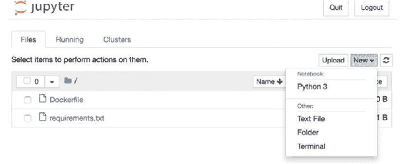
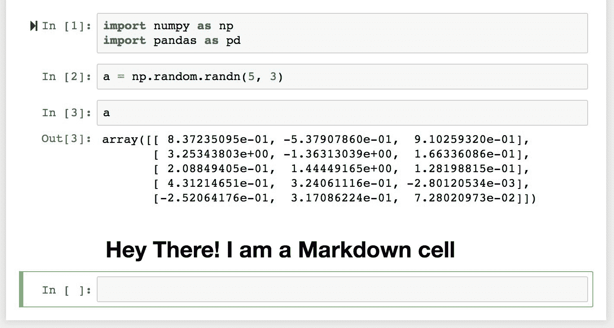

# 前言

# 关于本书

尽管大量数据对我们来说唾手可得，但它们在原始形式下并没有用处。为了使数据具有意义，必须对其进行整理和精炼。

如果您是初学者，那么*《数据整理工作坊，第二版》*将帮助您分解这个过程。您将从基础知识开始，逐步构建知识，从数据整理的核心方面到使用最流行的工具和技术。

本书首先向您展示如何使用 Python 处理数据结构。通过示例和活动，您将了解为什么应该避免使用其他语言中传统的数据清洗方法，并利用 Python 中专门的预构建例程。随后，您将学习如何使用相同的 Python 后端从包括互联网、大型数据库仓库和 Excel 财务表格在内的各种来源提取和转换数据。为了帮助您为更具挑战性的场景做准备，本书将教授您如何处理缺失或不正确的数据，并根据下游分析工具的要求对其进行重新格式化。

在本书结束时，您将对如何使用 Python 进行数据整理有一个坚实的理解，并学会了几种技术和最佳实践，以有效地从各种来源提取、清理、转换和格式化您的数据。

## 读者对象

*《数据整理工作坊，第二版》*是为那些希望成为全职数据科学家或分析专家的开发者、数据分析师和商业分析师设计的。尽管这本书是为想要开始数据整理的初学者而写的，但为了轻松掌握这里涵盖的概念，需要具备 Python 编程语言的工作知识。同时，对关系数据库和 SQL 有基本的了解也会有所帮助。

## 关于章节

*第一章*，*Python 数据整理入门*，描述了数据整理在数据科学中的重要性，并介绍了数据整理中使用的基本构建块。

*第二章*，*内置数据结构的进阶操作*，讨论了可用于解决数据科学家面临的复杂数据整理问题的进阶内置数据结构。本章还将讨论使用标准 Python 库处理文件。

*第三章*，*NumPy、Pandas 和 Matplotlib 简介*，将向您介绍 NumPy、Pandas 和 Matplotlib 库的基本原理。这些是进行数据整理时的基本库。本章将教授您如何计算一维/多维 DataFrame 的描述性统计。

*第四章*，*深入 Python 数据整理*，将介绍如何使用 pandas DataFrame，包括子集、过滤、分组等高级概念的覆盖。

*第五章*，*熟悉不同类型的数据源*，向您介绍您作为数据整理员可能会遇到的各种不同的数据源。本章将为您提供将 CSV、Excel 和 JSON 文件读取到 pandas DataFrame 中的知识。

*第六章*，*学习数据整理的隐藏秘密*，讨论了在商业用例中出现的各种数据问题以及如何解决这些问题。本章将为您提供清理和处理现实生活中混乱数据所需的知识。

*第七章*，*高级网络爬取和数据收集*，向您介绍高级网络爬取和数据收集的概念。它将使您能够使用 Python 库，如 requests 和 BeautifulSoup，读取各种网页并从中收集数据。

*第八章*，*关系型数据库管理系统和 SQL*，将向您介绍使用 Python 查询数据库和使用 RDBMS 的基础知识，并将数据从 SQL 转换并存储到 pandas DataFrame 中。世界上大部分数据都存储在 RDBMS 中，因此如果您想成为一名成功的数据整理专家，掌握这个主题是必要的。

*第九章*，*商业用例中的应用和课程总结*，将使您能够利用在前几章中学到的技能。到本章结束时，您将能够轻松处理商业用例的数据整理任务。

## 规范

文本中的代码单词、数据库表名、文件夹名、文件名、文件扩展名、路径名、虚拟 URL、用户输入和 Twitter 处理方式如下所示：“这将返回与之关联的值 – `["list_element1", 34]`”。

代码块设置如下：

```py
list_1 = []
    for x in range(0, 10):
    list_1.append(x)
list_1
```

你在屏幕上看到的单词，例如在菜单或对话框中，在文本中显示如下：“点击`New`并选择`Python 3`。”

## 代码展示

涵盖多行的代码行使用反斜杠（`\`）进行分割。当代码执行时，Python 将忽略反斜杠，并将下一行的代码视为当前行的直接延续。

例如：

```py
history = model.fit(X, y, epochs=100, batch_size=5, verbose=1, \
                    validation_split=0.2, shuffle=False)
```

注释被添加到代码中以帮助解释特定的逻辑部分。单行注释使用 `#` 符号表示，如下所示：

```py
# Print the sizes of the dataset
print("Number of Examples in the Dataset = ", X.shape[0])
print("Number of Features for each example = ", X.shape[1])
```

多行注释由三个引号包围，如下所示：

```py
"""
Define a seed for the random number generator to ensure the 
result will be reproducible
"""
seed = 1
np.random.seed(seed)
random.set_seed(seed)
```

## 设置您的环境

在我们详细探讨这本书之前，我们需要设置特定的软件和工具。在接下来的部分，我们将看到如何做到这一点。

## 安装 Python

### 在 Windows 上安装 Python

要在 Windows 上安装 Python，请按照以下步骤操作：

1.  在官方安装页面上找到您想要的 Python 版本，网址为 [`www.anaconda.com/distribution/#windows`](https://www.anaconda.com/distribution/#windows)。

1.  确保您在下载页面上选择 Python 3.7。

1.  确保您为您的计算机系统安装正确的架构，即 32 位或 64 位。您可以在操作系统的“系统属性”窗口中找到此信息。

1.  下载安装程序后，只需双击文件并遵循屏幕上的用户友好提示。

### 在 Linux 上安装 Python

要在 Linux 上安装 Python，您有几个选择。这里是一个选项：

1.  打开命令行并运行 `python3 --version` 以验证 `Python 3` 是否已经安装。

1.  要安装 Python 3，请运行以下命令：

    ```py
    sudo apt-get update
    sudo apt-get install python3.7
    ```

1.  如果遇到问题，网上有众多资源可以帮助您解决问题。

或者，通过从 [`www.anaconda.com/distribution/#linux`](https://www.anaconda.com/distribution/#linux) 下载安装程序并按照说明进行操作来安装 Anaconda Linux。

### 在 MacOS 上安装 Python

与 Linux 的情况类似，您在 Mac 上安装 Python 也有几种方法。要在 macOS X 上安装 Python，请执行以下操作：

1.  通过按 *CMD* + *空格键* 打开 Mac 的终端，在打开的搜索框中输入 `terminal`，然后按 *Enter*。

1.  通过在命令行中运行 `xcode-select –install` 来安装 Xcode。

1.  安装 Python 3 最简单的方法是使用 Homebrew，它通过在命令行中运行 `ruby -e "$(curl -fsSL https://raw.githubusercontent.com/Homebrew/install/master/install)"` 来安装。

1.  将 Homebrew 添加到您的 `$PATH` 环境变量中。通过在命令行中运行 `sudo nano ~/.profile` 并在底部插入 `export PATH="/usr/local/opt/python/libexec/bin:$PATH"` 来打开您的配置文件。

1.  最后一步是安装 Python。在命令行中运行 `brew install python`。

1.  您也可以通过从 [`www.anaconda.com/distribution/#macos`](https://www.anaconda.com/distribution/#macos) 获取的 Anaconda 安装程序来安装 Python。

## 安装库

`pip` 预安装在 Anaconda 中。一旦 Anaconda 在您的机器上安装，所有必需的库都可以使用 `pip` 安装，例如，`pip install numpy`。或者，您可以使用 `pip install –r requirements.txt` 安装所有必需的库。您可以在 [`packt.live/30UUshh`](https://packt.live/30UUshh) 找到 `requirements.txt` 文件。

练习和活动将在 Jupyter Notebooks 中执行。Jupyter 是一个 Python 库，可以像其他 Python 库一样安装，即使用 `pip install jupyter`，但幸运的是，它已经预安装在 Anaconda 中。要打开笔记本，只需在终端或命令提示符中运行 `jupyter notebook` 命令。

## 项目 Jupyter

项目 Jupyter 是一个开源的免费软件，它允许您从特殊的笔记本中交互式地运行用 Python 和其他一些语言编写的代码，类似于浏览器界面。它于 2014 年从 IPython 项目中诞生，并已成为整个数据科学工作者的默认选择。

一旦您运行了 Jupyter 服务器，点击 `New` 并选择 `Python 3`。一个新的浏览器标签将打开，并显示一个新且空的笔记本。重命名 Jupyter 文件：



图 0.1：Jupyter 服务器界面

Jupyter 笔记本的主要构建块是单元格。有两种类型的单元格：`In`（代表输入）和`Out`（代表输出）。您可以在 `In` 单元格中编写代码、普通文本和 Markdown，然后按 *Shift* + *Enter*（或 *Shift* + *Return*），该特定 `In` 单元格中编写的代码将被执行。结果将在 `Out` 单元格中显示，并且您将进入一个新的 `In` 单元格，准备编写下一块代码。一旦您习惯了这种界面，您将逐渐发现它提供的强大功能和灵活性。

当您开始一个新的单元格时，默认情况下，它假定您将在其中编写代码。然而，如果您想写文本，那么您必须更改类型。您可以使用以下键序列来完成：*Escape* -> *m* -> *Enter*：



图 0.2：Jupyter 笔记本

当您完成文本编写后，使用 *Shift* + *Enter* 执行它。与代码单元格不同，编译后的 Markdown 的结果将在与 `In` 单元格相同的位置显示。

要查看 Jupyter Notebook 中所有便捷的快捷键的“速查表”，您可以收藏此 Gist：[`gist.github.com/kidpixo/f4318f8c8143adee5b40`](https://gist.github.com/kidpixo/f4318f8c8143adee5b40)。有了这个基本的介绍和准备好的图像，我们就可以开始这段激动人心且富有启发的旅程了。

## 访问代码文件

您可以在 [`packt.live/2YenXcb`](https://packt.live/2YenXcb) 找到本书的完整代码文件。您还可以通过使用 [`packt.live/2YKlrJQ`](https://packt.live/2YKlrJQ) 上的交互式实验室环境，直接在您的网络浏览器中运行许多活动和练习。

我们尝试支持所有活动和练习的交互式版本，但对于不支持这种支持的情况，我们也推荐进行本地安装。

如果您在安装过程中遇到任何问题或疑问，请通过电子邮件发送给我们，邮箱地址是 workshops@packt.com。
