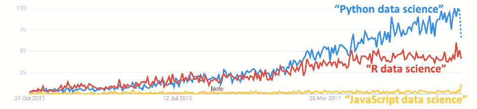
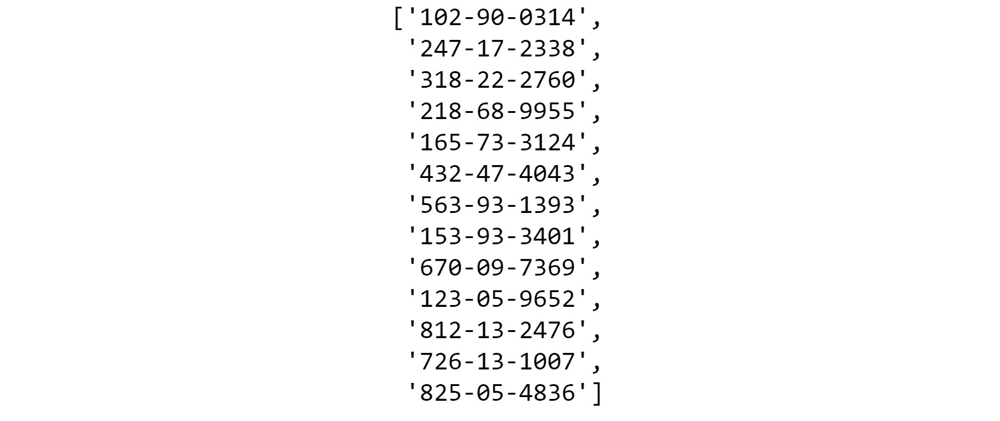
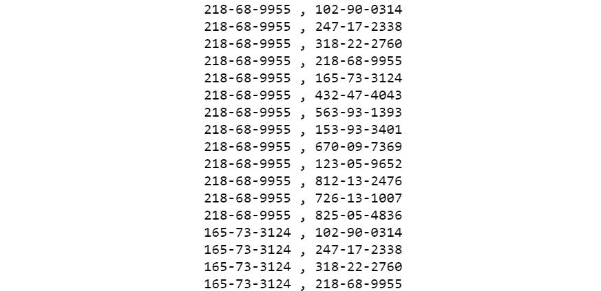

# 第一章：1. 使用 Python 进行数据整理的简介

概述

本章将帮助你理解数据整理在数据科学中的重要性。你将通过比较 Python 内置数据结构的不同实现，获得如何操作 Python 中可用数据结构的实际知识。总体而言，本章描述了数据整理的重要性，确定了数据整理中要执行的重要任务，并介绍了基本的 Python 数据结构。到本章结束时，你将熟练掌握列表、集合和字典的使用，它们是 Python 数据结构的关键构建块。

# 简介

由于数据科学和分析已成为我们生活的重要组成部分，数据科学家的作用变得更加重要。找到数据来源是数据科学的一个基本部分；然而，正是**科学**部分使你——实践者——真正有价值。

要用数据进行高质量的科学实践，你需要确保数据来源正确、清洗、格式化和预处理。本书将教你数据科学管道中这个宝贵组成部分的最基本知识：数据整理。简而言之，数据整理是确保数据以干净、准确、格式化且可用于数据分析的方式呈现的过程。

数据整理的一个显著例子是每年在加州大学圣地亚哥分校（**UCSD**）超级计算中心进行的数据分析。加利福尼亚州野火非常常见，主要由干燥的天气和极端高温引起，尤其是在夏季。UCSD 超级计算中心的数据科学家每年都会进行一次分析，收集数据以预测加利福尼亚州野火的性质和蔓延方向。这些数据来自不同的来源，如气象站、森林中的传感器、消防站、卫星图像和 Twitter 流。然而，这些数据可能不完整或缺失。

在从各种来源收集数据后，如果未使用包括缩放数字和去除字符串中的不需要字符等方式进行清洗和格式化，可能会导致错误的数据。在可能得到错误分析的情况下，我们可能需要将数据从**JavaScript 对象表示法**（**JSON**）重新格式化为**逗号分隔值**（**CSV**）；我们可能还需要对数字进行归一化，即相对于自身进行居中和缩放。当我们向某些机器学习模型提供数据时，可能需要以这种方式处理数据。

这是一个数据整理和数据科学如何证明其有用性和相关性的例子。本章将讨论数据整理的基本原理。让我们开始吧。

# 数据整理的重要性

现代时代的一个常见格言是*数据是新石油*，这意味着数据现在是一种比石油更有价值的资源。但正如原油不会直接从钻井平台流出成为汽油，必须经过加工才能得到汽油和其他产品一样，数据也必须经过整理、按摩或清洗和提炼，才能用于数据科学和基于数据科学的产品。这被称为数据清洗。大多数数据科学家将大部分时间花在数据清洗上。

数据清洗通常在数据科学/分析流程的第一阶段进行。在数据科学家已经确定了解决当前业务问题（例如，内部数据库存储、互联网或水下地震传感器等流传感器数据）的有用数据源之后，他们接着从这些来源提取、清洗和格式化必要的数据。

通常，数据清洗的任务涉及以下步骤：

1.  从多个来源（包括网页和数据库表）抓取原始数据

1.  填充（使用各种技术替换缺失数据）、格式化和转换——基本上使其准备好用于建模过程（如高级机器学习）

1.  处理读写错误

1.  检测异常值

1.  进行快速的可视化（绘图）和基本统计分析，以判断格式化数据的质量

以下是对典型数据科学流程中数据清洗定位及其基本功能角色的说明性表示：


图 1.1：数据清洗过程

数据清洗的过程包括找到分析所需的数据。通常，分析是探索性的，因此范围有限。你通常需要为此类分析进行数据清洗，以便更好地理解你的数据。这可能导致更多的分析或机器学习。

这些数据可以来自一个或多个来源，例如推文、关系型数据库中的银行交易报表、传感器数据等。这些数据需要被清洗。如果有缺失数据，我们将使用几种技术中的任何一种进行删除或替换。如果有异常值，我们需要检测它们并适当地处理它们。如果数据来自多个来源，我们将使用结构化查询语言（SQL）操作如 JOIN 进行合并。

在极其罕见的情况下，可能不需要数据清洗。例如，如果机器学习任务所需的数据已经以可接受的格式存储在内部数据库中，那么一个简单的 SQL 查询可能就足够将数据提取到表格中，以便传递到建模阶段。

# 数据清洗的 Python

总是有人争论是否应该使用企业工具或编程语言及其相关框架来执行数据清洗过程。有许多商业级的企业工具用于数据格式化和预处理，用户不需要编写太多代码。以下是一些例子：

+   通用数据分析平台，例如**Microsoft Excel**（带有插件）

+   统计发现包，例如**JMP**（来自 SAS）

+   模型平台，例如**RapidMiner**

+   专注于数据清洗的利基玩家分析平台，例如**Trifacta**、**Paxata**和**Alteryx**

然而，与这些现成的工具相比，Python 和 R 等编程语言提供了更多的灵活性、控制和功能。这也解释了它们在数据科学领域中的巨大流行：



图 1.2：过去 5 年全球 Google 趋势

此外，随着数据量、速度和种类（大数据的三个 V）的快速变化，始终开发并培养大量内部数据清洗专业知识，使用基本的编程框架，这样组织就不会对任何特定企业平台的基本任务（如数据清洗）产生依赖，这总是一个好主意。

使用开源、免费的编程范式进行数据清洗的一些明显优势如下：

+   通用开源范式对您为特定问题开发的方法没有任何限制。

+   有一个快速、优化的开源库生态系统，专注于数据分析。

+   同时也在不断增长，支持将 Python 连接到各种可能的数据源类型。

+   有一个简单的界面用于基本的统计测试和快速可视化库来检查数据质量。

+   并且数据清洗的输出与高级机器学习模型之间有一个无缝的接口。

Python 是目前机器学习和人工智能领域最受欢迎的语言。让我们来看看 Python 中的一些数据结构。

# 列表、集合、字符串、元组和字典

既然我们已经提到了使用 Python 的一些优点，我们将从探索 Python 中的各种基本数据结构开始。我们还将了解我们可以用来处理这些数据结构的一些技术。这对数据从业者来说是无价的。

## 列表

列表是 Python 的基本数据结构，具有连续的内存位置，可以容纳不同的数据类型（如字符串、数字、浮点数和双精度浮点数），并且可以通过索引访问。

我们将从列表和列表推导式开始。列表推导式是`for`循环的语法糖（或简写），它遍历列表。我们将生成一个数字列表，然后检查其中哪些是偶数。我们将对它们进行排序、反转并检查重复项。我们还将看到不同的方法来访问列表元素，遍历它们并检查元素的成员资格。

以下是一个简单列表的示例：

```py
list_example = [51, 27, 34, 46, 90, 45, -19]
```

以下也是一个列表的示例：

```py
list_example2 = [15, "Yellow car", True, 9.456, [12, "Hello"]]
```

如您所见，一个列表可以包含任何数量的允许的数据类型，例如`int`、`float`、`string`和`boolean`，列表也可以是不同数据类型的混合（包括嵌套列表）。

如果你来自强类型语言，如 C、C++或 Java，那么这可能会让你感到奇怪，因为在那些语言中不允许在单个数组中混合不同类型的数据。Python 中的列表是松散类型的，也就是说，它们不受单一类型的限制。在某种程度上，列表类似于数组，因为它们都是基于连续的内存位置，并且可以使用索引进行访问。但 Python 列表的强大之处在于它们可以容纳不同的数据类型，并且允许你操作数据。

在 Python 中，有一个创建列表切片的概念。以下是语法：

```py
my_list [ inclusive start index : exclusive end index ]
```

被称为从`0`到`1`减去总长度的值。给出的第一个数字代表要包含在切片中的第一个位置。第二个数字用于指示你想要停止的位置，但不包括在内。一个切片可以有一个索引为`–1`，表示最后一个元素。

索引将自动分配，如下所示：


图 1.3：显示正向和反向索引的列表

注意

然而，请注意，列表的这种强大功能，以及你可以在单个列表中混合不同数据类型的事实，实际上可能会创建难以追踪的微妙错误。

# 列表函数

在本节中，我们将讨论一些处理列表的基本函数。

您可以使用以下代码访问列表元素：

```py
list_example = [51, 27, 34, 46, 90, 45, -19]
list_example[0]
```

输出如下：

```py
51
```

要找出列表的长度，我们只需使用`len`函数。Python 中的`len`函数返回指定列表的长度：

```py
len(list_example)
```

输出如下：

```py
7
```

我们可以在列表中追加新的元素。`append`是 Python 列表数据类型的一个内置方法：

```py
list_example.append(11)
list_example
```

输出如下：

```py
[51, 27, 34, 46, 90, 45, -19, 11]
```

让我们通过一些练习来练习这些函数。

## 练习 1.01：访问列表成员

在这个练习中，我们将从`ssn.csv`文件中读取一系列社会保障号码，然后观察使用正向和反向索引从列表中访问元素的不同方法。我们将使用我们的第一个 Python 函数`len`，它将返回指定列表的长度。我们将从未来练习的基本构建块开始。让我们按以下步骤进行：

注意

`ssn.csv`文件可在此处找到：[`packt.live/2AydLCx`](https://packt.live/2AydLCx)。

1.  打开一个新的 Jupyter Notebook，定义一个名为`ssn`的列表。使用`read_csv`命令从`ssn.csv`文件中读取，并打印列表元素：

    ```py
    import pandas as pd
    ssn = list(pd.read_csv("../datasets/ssn.csv"))
    print(ssn)
    ['218-68-9955',
     '165-73-3124',
     '432-47-4043',
     '563-93-1393',
     '153-93-3401',
     '670-09-7369',
     '123-05-9652',
     '812-13-2476',
     '726-13-1007',
     '825-05-4836']
    ```

1.  使用正向索引访问`ssn`的第一个元素：

    ```py
    ssn[0]
    ```

    输出如下：

    ```py
    '218-68-9955'
    ```

1.  使用正向索引访问`ssn`的第四个元素：

    ```py
    ssn[3]
    ```

    输出如下：

    ```py
    '563-93-1393'
    ```

1.  使用`len`函数访问`ssn`的最后一个元素：

    ```py
    ssn[len(ssn) - 1]
    ```

    输出如下：

    ```py
    '825-05-4836'
    ```

1.  使用反向索引访问`ssn`的最后一个元素：

    ```py
    ssn[-1] 
    ```

    输出如下：

    ```py
    '825-05-4836'
    ```

1.  使用正向索引访问`ssn`的前三个元素：

    ```py
    ssn[1:3]
    ```

    输出如下：

    ```py
    ['165-73-3124', '432-47-4043']
    ```

1.  通过切片访问`ssn`的最后两个元素：

    ```py
    ssn[-2:]
    ```

    输出如下：

    ```py
    ['726-13-1007', '825-05-4836']
    ```

1.  使用反向索引访问前两个元素：

    ```py
    ssn[:-2]
    ```

    输出如下：

    

    图 1.4：使用反向索引后的输出

    当我们在冒号（`:`）的一侧留空时，我们基本上是在告诉 Python 要么走到列表的末尾，要么从列表的开始处开始。它将自动应用我们刚刚学到的列表切片规则。

1.  反转列表中的元素：

    ```py
    ssn[-1::-1]
    ```

    输出如下：

    

图 1.5：元素反转后的输出

注意

要访问此特定部分的源代码，请参阅[`packt.live/3fzTvzk`](https://packt.live/3fzTvzk)。

您也可以在此处在线运行此示例：[`packt.live/2YF3zA0`](https://packt.live/2YF3zA0)。

在这个练习中，我们学习了如何使用正向和反向索引访问列表成员。在下一个练习中，我们将创建一个列表。

## 练习 1.02：生成和遍历列表

在这个练习中，我们将检查使用与之前练习中相同的包含社会保障号码列表的文件（`ssn.csv`）生成列表和嵌套列表的多种方法。

注意

`ssn.csv`文件可在此处找到：[`packt.live/2AydLCx`](https://packt.live/2AydLCx)。

我们将使用`append`方法向列表中添加新元素，并使用`while`循环遍历列表。为此，让我们按以下步骤进行：

1.  打开一个新的 Jupyter Notebook，导入必要的 Python 库。从`ssn.csv`文件中读取：

    ```py
    import pandas as pd
    ssn = list(pd.read_csv("ssn.csv file on your system.
    ```

1.  使用`append`方法创建一个列表。Python 库中的`append`方法将允许您向列表中添加项：

    ```py
    ssn_2 = []
    for x in ssn:
        ssn_2.append(x)
    ssn_2
    ```

    输出将如下：

    

    图 1.6：使用 append 方法创建列表后的输出

    在这里，我们首先声明了一个名为`ssn_2`的空列表，然后使用`for`循环从`ssn.csv`文件中读取值后将其追加到它上面。

1.  使用以下命令生成列表：

    ```py
    ssn_3 = ["soc: " + x for x in ssn_2]
    ssn_3
    ```

    输出如下：

    

    图 1.7：生成的列表输出

    这是一种列表推导，这是一种非常强大的工具，我们需要掌握。列表推导的强大之处在于我们可以在推导本身中使用条件，如`for..in`。这将在*第二章，内置数据结构的高级操作*中详细讨论。

1.  使用`while`循环遍历列表：

    ```py
    i = 0
    while i < len(ssn_3):
        print(ssn_3[i])
        i += 1
    ```

    输出如下：

    ```py
    soc: 218-68-9955
    soc: 165-73-3124
    soc: 432-47-4043
    soc: 563-93-1393
    soc: 153-93-3401
    soc: 670-09-7369
    soc: 123-05-9652
    soc: 812-13-2476
    soc: 726-13-1007
    soc: 825-05-4836
    ```

1.  搜索包含数字`5`的所有社会保障号码：

    ```py
    numbers = [x for x in ssn_3 if "5" in x]
    numbers
    ```

    输出将如下：

    

    图 1.8：包含数字 5 的社会保障号码

    让我们探索一些更多的列表操作。我们将使用`+`运算符来添加两个列表的内容，并使用`extend`关键字用另一个列表替换现有列表的内容。

1.  通过添加两个列表生成一个列表。在这里，我们只需使用`+`运算符：

    ```py
    ssn_4 = ["102-90-0314" , "247-17-2338" , "318-22-2760"]
    ssn_5 = ssn_4 + ssn
    ssn_5
    ```

    输出如下：

    

    图 1.9：通过添加两个列表生成的列表

1.  使用`extend`关键字扩展字符串：

    ```py
    ssn_2.extend(ssn_4)
    ssn_2
    ```

    输出如下：

    

    图 1.10：extend 字符串操作

    注意

    `extend`操作会改变原始列表（`ssn_2`），并将`ssn_4`的所有元素追加到它上面。所以，在使用它时要小心。

1.  现在，让我们遍历第一个列表，并在循环内部创建一个嵌套列表，该列表遍历第二个列表：

    ```py
    for x in ssn_2:
        for y in ssn_5:
            print(str(x) + ' , ' + str(y))
    ```

    输出（部分显示）如下：

    

图 1.11：ssn 的部分输出

注意

要访问此特定部分的源代码，请参阅[`packt.live/2Y6vObR`](https://packt.live/2Y6vObR)。

您也可以在[`packt.live/2YLJybf`](https://packt.live/2YLJybf)上在线运行此示例。

在这个练习中，我们使用了 Python 的内置方法来操作列表。在下一个练习中，我们将检查数据集中的元素或成员是否如我们所期望的那样存在。

## 练习 1.03：遍历列表并检查成员资格

本练习将演示我们如何遍历列表并验证值是否符合预期。这是一个在处理合理大小的数据集时经常可以进行的手动测试，适用于业务场景。让我们按照以下步骤检查值的成员资格以及它们是否存在于`.csv`文件中：

注意

`car_models.csv` 文件可以在以下链接找到：[`packt.live/3d8DUVy`](https://packt.live/3d8DUVy)。

1.  导入必要的 Python 库并从 `car_models.csv` 文件中读取：

    ```py
    import pandas as pd
    car_models = list(pd.read_csv("../datasets/car_models.csv"))
    car_models
    ['Escalade ',
     ‹ X5 M›,
     ‹D150›,
     ‹Camaro›,
     ‹F350›,
     ‹Aurora›,
     ‹S8›,
     ‹E350›,
     ‹Tiburon›,
     ‹F-Series Super Duty ‹]
    ```

1.  遍历一个列表：

    ```py
    list_1 = [x for x in car_models]
    for i in range(0, len(list_1)):
        print(list_1[i])
    ```

    输出如下：

    ```py
    Escalade
    X5 M
    D150
    Camaro
    F350
    Aurora
    S8
    E350
    Tiburon
    F-Series Super Duty
    ```

    然而，这并不是非常符合 Python 风格。符合 Python 风格意味着遵循和遵守多年来由数千名有能力的开发者创建的一系列最佳实践和约定。在这种情况下，这意味着我们可以使用 `in` 关键字在 `for..in` 条件中，因为 Python 没有索引初始化、边界检查或索引递增，这与传统语言不同。Python 使用语法糖来使遍历列表变得简单易读。在其他语言中，你可能需要在遍历列表时创建一个变量（索引初始化），检查该变量（边界检查），因为它将在循环中递增（索引递增）。

1.  编写以下代码以查看遍历列表的 Python 风格：

    ```py
    for i in list_1:
        print(i)
    ```

    输出如下：

    ```py
    Escalade
    X5 M
    D150
    Camaro
    F350
    Aurora
    S8
    E350
    Tiburon
    F-Series Super Duty
    ```

    注意到在第二种方法中，我们不再需要计数器来访问列表索引；相反，Python 的 `in` 操作符直接给我们 `i` 位置的元素。

1.  使用 `in` 操作符检查字符串 `D150` 和 `Mustang` 是否在列表中：

    ```py
    "D150" in list_1
    ```

    输出为 `True`。

    ```py
    "Mustang" in list_1
    ```

    输出为 `False`。

    注意

    要访问此特定部分的源代码，请参阅：[`packt.live/30TpGp5`](https://packt.live/30TpGp5)。

    你也可以在此在线运行此示例：[`packt.live/2Y8z06L`](https://packt.live/2Y8z06L)。

在这个练习中，我们看到了如何遍历列表并验证每个元素的成员资格。这是一个重要的技能。通常，当处理大型应用程序时，手动检查列表可能很有用。如果你在任何时候对列表不确定，你可以轻松地验证哪些值存在。现在，我们将看到如何对列表执行排序操作。

## 练习 1.04：排序列表

在这个练习中，我们将通过使用 `sort` 方法然后使用 `reverse` 方法来对数字列表进行排序。为此，让我们按照以下步骤进行：

注意

`ssn.csv` 文件可以在以下链接找到：[`packt.live/2AydLCx`](https://packt.live/2AydLCx)。

1.  打开一个新的 Jupyter Notebook 并导入必要的 Python 库：

    ```py
    import pandas as pd
    ssn = list(pd.read_csv("ssn.csv file on your system. 
    ```

1.  使用 `sort` 方法并设置 `reverse=True`：

    ```py
    list_1 = [*range(0, 21, 1)]
    list_1.sort(reverse=True)
    list_1
    ```

    输出如下：

    ```py
    [20, 19, 18, 17, 16, 15, 14, 13, 12, 11, 10, 9, 8, 7, 
    6, 5, 4, 3, 2, 1, 0]
    ```

1.  直接使用 `reverse` 方法来实现此结果：

    ```py
    list_1.reverse()
    list_1
    ```

    输出如下：

    ```py
    [0, 1, 2, 3, 4, 5, 6, 7, 8, 9, 10, 11, 12, 13, 14, 15, 16, 
    17, 18, 19, 20]
    ```

    注意

    要访问此特定部分的源代码，请参阅：[`packt.live/2Y7HlYe`](https://packt.live/2Y7HlYe)。

    你也可以在此在线运行此示例：[`packt.live/2YGNvOd`](https://packt.live/2YGNvOd)。

`sort`方法和`reverse`方法之间的区别在于我们可以使用`sort`进行自定义排序，而只能使用`reverse`来反转列表。此外，这两种方法都是原地操作，所以在使用时要留意这一点。现在，让我们创建一个包含随机数的列表。随机数在许多情况下非常有用，而在机器学习中预处理数据是一个常见的过程。

## 练习 1.05：生成随机列表

在这个练习中，我们将使用 Python 中的`random`库生成一个包含随机数的列表，并对它们执行数学运算。为此，让我们按照以下步骤进行：

1.  导入`random`库：

    ```py
    import random
    ```

1.  使用`randint`方法生成一些随机整数并将它们添加到一个列表中：

    ```py
    list_1 = [random.randint(0, 30) for x in range (0, 100)]
    ```

1.  让我们打印这个列表。请注意，`list_1`中会有重复的值：

    ```py
    list_1
    ```

    样本输出（部分显示）如下：

    ![Figure 1.12: List of random numbers]

    ![img/B15780_01_12.jpg]

    图 1.12：随机数列表

    注意

    每次运行的结果都会有所不同，因为我们正在生成随机数。

1.  让我们找到每个元素的平方：

    ```py
    list_2 = [x**2 for x in list_1]
    list_2
    ```

    输出如下：

    ![Figure 1.13: List of random numbers]

    ![img/B15780_01_13.jpg]

    图 1.13：随机数列表

1.  现在让我们找到`list_2`中`1`个元素的日志：

    ```py
    import math 
    list_2 = [math.log(x+1,10) for x in list_2]
    list_2
    ```

    输出（部分显示）如下：

    ![Figure 1.14: Partial output for list_2]

    ![img/B15780_01_14.jpg]

图 1.14：list_2 的部分输出

注意

输出可能会变化，因为我们正在生成随机数。

注意

要访问本节的具体源代码，请参阅[`packt.live/37BerTD`](https://packt.live/37BerTD)。

你也可以在[`packt.live/3hHwlsH`](https://packt.live/3hHwlsH)上运行这个示例。

在这个练习中，我们研究了随机变量、列表推导和数据处理。让我们将我们学到的东西结合起来，通过一个活动来练习如何处理列表。

## 活动一.01：处理列表

在这个活动中，你将生成一个随机数列表，然后从这个列表中生成另一个列表，其中只包含能被`3`整除的数字。重复实验 10 次；你会看到每次输出都不同，因为每次都会生成不同的随机数集。然后，你将计算两个列表长度之间的平均差异。

完成这个活动的步骤如下：

1.  创建一个包含`100`个随机数的`list`。

1.  从这个随机列表中创建一个新的`list`，包含能被`3`整除的数字。

1.  计算这两个列表的长度并将差值存储在一个新变量中。

1.  使用循环执行步骤 1、2 和 3，并找到差异变量 10 次。

1.  计算这些`10`个差异值的算术平均值。

    输出（每次运行都会有所不同）应该类似于以下内容：

    ```py
    66.3
    ```

    注意

    解决这个活动的方案可以通过这个链接找到。

## 集合

从数学的角度来看，集合只是由定义明确的、不同的对象组成的集合。Python 通过其集合数据类型为我们提供了一种直接处理它们的方法。

## 集合简介

在上一节中我们生成的最后一个列表中；我们将重新审视从其中去除重复元素的问题。我们可以通过以下代码行实现这一点：

```py
list_12 = list(set(list_1))
```

如果我们打印它，我们会看到它只包含唯一的数字。我们使用了**集合**数据类型将第一个列表转换为集合，从而去除了所有重复元素，然后使用**列表**函数再次将其从集合转换为列表：

```py
list_12
```

输出将如下所示：


图 1.15：list_12 的输出部分

在下一节中，我们将讨论集合的并集与交集。

## 集合的并集与交集

在数学术语中，唯一对象的列表是一个集合。在同一个数学术语中，有许多组合集合的方法。其中一种方法就是使用并集。

这就是两个集合并集的样子：


图 1.16：展示两个集合并集的维恩图

这仅仅意味着从两个集合中取走所有内容，但只取一次公共元素。

我们可以通过以下代码实现这一概念：

```py
set1 = {"Apple", "Orange", "Banana"}
set2 = {"Pear", "Peach", "Mango", "Banana"}
```

要找到两个集合的并集，应使用以下代码：

```py
set1 | set2
```

输出将如下所示：

```py
{'Apple', 'Banana', 'Mango', 'Orange', 'Peach', 'Pear'}
```

注意，公共元素“香蕉”在结果集中只出现一次。两个集合的公共元素可以通过获取两个集合的交集来识别，如下所示：


图 1.17：展示两个集合交集的维恩图

在 Python 中，我们如下获取两个集合的交集：

```py
set1 & set2
```

这将给我们一个只有一个元素的集合。输出如下：

```py
{'Banana'}
```

注意

您还可以计算集合之间的差异（也称为补集）。要了解更多信息，请参阅此链接：https://docs.python.org/3/tutorial/datastructures.html#sets。

在本节中，我们介绍了集合以及如何进行基本的集合功能。集合在数据库编程和设计中被广泛使用，并且对于数据处理非常有用。

## 创建空集

在数学术语中，没有任何内容的集合被称为空集或空集。

您可以通过创建一个不包含任何元素的集合来创建一个空集。您可以通过以下代码来完成：

```py
null_set_1 = set({})
null_set_1
```

输出如下：

```py
set()
```

然而，要创建包含空值的字典，请使用以下命令：

```py
null_set_2 = {}
null_set_2
```

输出如下：

```py
{}
```

我们将在下一节中详细介绍这一点。

## 字典

字典就像一个列表，这意味着它是一个由几个元素组成的集合。然而，在字典中，它是一个键值对的集合，其中键可以是任何可以适应内存的东西。通常，我们使用数字或字符串作为键。

要创建一个字典，请使用以下代码：

```py
dict_1 = {"key1": "value1", "key2": "value2"}
dict_1
```

输出如下：

```py
{'key1': 'value1', 'key2': 'value2'}
```

这也是一个有效的字典：

```py
dict_2 = {"key1": 1, "key2": ["list_element1", 34], \
          "key3": "value3","key4": {"subkey1": "v1"}, \
          "key5": 4.5}
dict_2
```

注意

```py
\ ) to split the logic across multiple lines. When the code is executed, Python will ignore the backslash, and treat the code on the next line as a direct continuation of the current line.
```

输出如下：

```py
{'key1': 1,
 'key2': ['list_element1', 34],
 'key3': 'value3',
 'key4': {'subkey1': 'v1'},
 'key5': 4.5}
```

字典中的键必须是唯一的。

## 练习 1.06：在字典中访问和设置值

在这个练习中，我们将访问字典中的元素并设置值。当与字典一起工作时，能够遍历每个键值对非常重要，这将允许你按需处理数据。为此，让我们按照以下步骤进行：

1.  要访问字典中的值，你必须提供键。请注意，字典中任何一对都没有给定的顺序：

    ```py
    stocks = \
    {"Solar Capital Ltd.":"$920.44M", \
     "Zoe's Kitchen, Inc.":"$262.32M",\
     "Toyota Motor Corp Ltd Ord":"$156.02B",\
     "Nuveen Virginia Quality Municipal Income Fund":"$238.33M",\
     "Kinross Gold Corporation":"$5.1B",\
     "Vulcan Materials Company":"$17.1B",\
     "Hi-Crush Partners LP":"$955.69M",\
     "Lennox International, Inc.":"$8.05B",\
     "WMIH Corp.":"$247.66M",\
     "Comerica Incorporated":"n/a"}
    ```

1.  打印 `stocks` 列表中的特定元素：

    ```py
    stocks["WMIH Corp."]
    ```

    这将返回与之关联的值，如下所示：

    ```py
    '$247.66M'
    ```

1.  使用与访问值相同的方法设置值：

    ```py
    stocks["WMIH Corp."] = "$300M"
    ```

1.  定义一个空字典，然后使用键标记法为其赋值：

    ```py
    dict_3 = {} # Not a null set. It is a dict
    dict_3["key1"] = "Value1"
    dict_3
    {'key1': 'Value1'}
    ```

    注意

    要访问此特定部分的源代码，请参阅[`packt.live/2AGFaly`](https://packt.live/2AGFaly)。

    你也可以在[`packt.live/3d8fyeJ`](https://packt.live/3d8fyeJ)上运行此示例。

如我们所见，字典的操作技巧相当简单。现在，就像列表一样，遍历字典对于处理数据非常重要。

## 练习 1.07：遍历字典

在这个练习中，我们将遍历一个字典并打印其值和键。为此，让我们按照以下步骤进行：

1.  打开一个新的 Jupyter Notebook，并定义一个包含键的字典。请注意，字典中任何一对都没有给定的顺序：

    ```py
    stocks = \
    {"Solar Capital Ltd.":"$920.44M",\
     "Zoe's Kitchen, Inc.":"$262.32M",\
     "Toyota Motor Corp Ltd Ord":"$156.02B",\
     "Nuveen Virginia Quality Municipal Income Fund":"$238.33M",\
     "Kinross Gold Corporation":"$5.1B",\
     "Vulcan Materials Company":"$17.1B",\
     "Hi-Crush Partners LP":"$955.69M",\
     "Lennox International, Inc.":"$8.05B",\
     "WMIH Corp.":"$247.66M",\
     "Comerica Incorporated":"n/a"}
    ```

1.  从 `stocks` 字典中删除 `$` 字符：

    ```py
    for key,val in stocks.items():
        stocks[key] = val.replace('$', '')
    stocks
    ```

    输出应如下所示：

    ```py
    {'Solar Capital Ltd.': '920.44M',
     "Zoe's Kitchen, Inc.": '262.32M',
     'Toyota Motor Corp Ltd Ord': '156.02B',
     'Nuveen Virginia Quality Municipal Income Fund': '238.33M',
     'Kinross Gold Corporation': '5.1B',
     'Vulcan Materials Company': '17.1B',
     'Hi-Crush Partners LP': '955.69M',
     'Lennox International, Inc.': '8.05B',
     'WMIH Corp.': '300M',
     'Comerica Incorporated': 'n/a'}
    ```

1.  再次遍历 `stocks` 字典，并将值拆分为一个列表，其中价格（`val`）和乘数（`mult`）作为单独的元素，每个键分配一个值：

    ```py
    for key,val in stocks.items():
        mult = val[-1]
        stocks[key] = [val[:-1],mult]
    stocks
    ```

    输出如下：

    ```py
    {'Solar Capital Ltd.': ['920.44', 'M'],
     «Zoe›s Kitchen, Inc.»: [‹262.32›, ‹M›],
     ‹Toyota Motor Corp Ltd Ord›: [‹156.02›, ‹B›],
     ‹Nuveen Virginia Quality Municipal Income Fund›: [‹238.33›, ‹M›],
     ‹Kinross Gold Corporation›: [‹5.1›, ‹B›],
     ‹Vulcan Materials Company›: [‹17.1›, ‹B›],
     ‹Hi-Crush Partners LP›: [‹955.69›, ‹M›],
     ‹Lennox International, Inc.›: [‹8.05›, ‹B›],
     ‹WMIH Corp.›: [‹300›, ‹M›],
     ‹Comerica Incorporated›: [‹n/›, ‹a›]}
    ```

注意我们在列表上进行的迭代与在这里进行的迭代之间的区别。字典始终包含键值对，我们始终需要使用键来访问字典中任何元素的值。在字典中，所有键都是唯一的。

注意

要访问此特定部分的源代码，请参阅[`packt.live/3db0xZF`](https://packt.live/3db0xZF)。

你也可以在[`packt.live/2zDFHnU`](https://packt.live/2zDFHnU)上运行此示例。

在下一个练习中，我们将回顾本章早些时候遇到的列表问题，以创建具有唯一值的列表。我们将查看另一种解决此问题的方法。

## 练习 1.08：重新审视具有唯一值的列表问题

在这个练习中，我们将利用字典的唯一性，并从列表中删除重复值。首先，我们将创建一个包含重复值的随机列表。然后，我们将使用字典的`fromkeys`和`keys`方法来创建一个唯一值列表。为此，让我们按照以下步骤进行：

1.  首先，生成一个包含重复值的随机列表：

    ```py
    import random
    list_1 = [random.randint(0, 30) for x in range (0, 100)]
    ```

1.  从`list_1`创建一个唯一值列表：

    ```py
    list(dict.fromkeys(list_1).keys())
    ```

    样本输出如下：

    ![图 1.18：显示唯一值列表的输出

    ![img/B15780_01_18.jpg]

图 1.18：显示唯一值列表的输出

注意

输出可能会变化，因为我们正在生成随机数。

在这里，我们使用了 Python 中`dict`数据类型的两个有用的方法，`fromkeys`和`keys`。`fromkeys`是一个内置函数，它可以从给定的元素序列创建一个新的字典，用户可以指定值，而`keys`方法则给出了字典的键。

注意

要访问此特定部分的源代码，请参阅[`packt.live/2URp6EA`](https://packt.live/2URp6EA)。

你也可以在[`packt.live/2UTCFmO`](https://packt.live/2UTCFmO)上在线运行此示例。

## 练习 1.09：从 Dict 中删除值

在这个练习中，我们将使用`del`方法从`dict`中删除一个值。请执行以下步骤：

1.  创建包含五个元素的`list_1`：

    ```py
    dict_1 = {"key1": 1, "key2": ["list_element1", 34], \
              "key3": "value3","key4": {"subkey1": "v1"}, \
              "key5": 4.5}
    dict_1
    ```

    输出如下：

    ```py
    {'key1': 1,
     'key2': ['list_element1', 34],
     'key3': 'value3',
     'key4': {'subkey1': 'v1'},
     'key5': 4.5}
    ```

1.  我们将使用`del`函数并指定要删除的元素：

    ```py
    del dict_1["key2"]
    dict_1
    ```

    输出如下：

    ```py
    {'key1': 1, 'key3': 'value3', 'key4': {'subkey1': 'v1'}, 'key5': 4.5}
    ```

1.  让我们删除`key3`和`key4`：

    ```py
    del dict_1["key3"]
    del dict_1["key4"]
    ```

1.  现在，让我们打印字典以查看其内容：

    ```py
    dict_1
    ```

    应该是这样的输出：

    ```py
    {'key1': 1, 'key5': 4.5}
    ```

    注意

    要访问此特定部分的源代码，请参阅[`packt.live/2Nb3oqF`](https://packt.live/2Nb3oqF)。

    你也可以在[`packt.live/30Os7ct`](https://packt.live/30Os7ct)上在线运行此示例。

在这个练习中，我们学习了如何从字典中删除元素。这是字典的一个非常有用的功能，你会在编写 Python 应用程序时发现它被大量使用。

注意

`del`运算符也可以用来从列表中删除一个特定的索引。

在我们关于`dict`的最后一个练习中，我们将回顾一个不太常用的列表推导式，称为`dict`推导式，它对于一行内处理字典非常有用。可能存在这种情况，它可以用作姓名和年龄或信用卡号和信用卡所有者的键值对的范围。字典推导式的工作方式与列表推导式完全相同，但我们需要指定键和值。

## 练习 1.10：字典推导式

在这个练习中，我们将按照以下步骤生成一个字典：

1.  生成一个键为`0`到`9`，值为键的平方的`dict`：

    ```py
    list_1 = [x for x in range(0, 10)]
    dict_1 = {x : x**2 for x in list_1}
    dict_1
    ```

    输出如下：

    ```py
    {0: 0, 1: 1, 2: 4, 3: 9, 4: 16, 5: 25, 6: 36, 7: 49, 8: 64, 9: 81}
    ```

    你能否在不使用列表的情况下使用`dict`推导式来生成一个`dict`？现在让我们试试。

1.  使用`dict`函数生成一个`dictionary`：

    ```py
    dict_2 = dict([('Tom', 100), ('Dick', 200), ('Harry', 300)])
    dict_2
    ```

    输出如下：

    ```py
    {'Tom': 100, 'Dick': 200, 'Harry': 300}
    ```

1.  你也可以使用`dict`函数创建一个`字典`，如下所示：

    ```py
    dict_3 = dict(Tom=100, Dick=200, Harry=300)
    dict_3
    ```

    输出如下：

    ```py
    {'Tom': 100, 'Dick': 200, 'Harry': 300}
    ```

    注意

    要访问此特定部分的源代码，请参阅[`packt.live/3hz8zPp`](https://packt.live/3hz8zPp)。

    你也可以在[`packt.live/3hA8WJw`](https://packt.live/3hA8WJw)上在线运行此示例。

字典非常灵活，可以用于各种任务。理解简洁的特性使它们非常受欢迎。刚刚看到的看起来很奇怪的值对（`'Harry', 300`）被称为元组。这是 Python 中另一个重要的基本数据类型。我们将在下一节中学习元组。

## 元组

元组是 Python 中的另一种数据类型。Python 中的元组与列表类似，有一个关键的区别。元组是 Python 列表的一个不可变变体。不可变基本上意味着你不能通过添加或从列表中删除来修改它。它是顺序性的，类似于列表。

元组由逗号分隔的值组成，如下所示：

```py
tuple_1 = 24, 42, 2.3456, "Hello"
```

注意，与列表不同，我们在这里没有使用方括号打开和关闭。

当引用元组时，元组的长度被称为其**基数**。这来自数据库和集合理论，是引用其长度的常见方式。

## 创建不同基数的元组

这是我们创建空元组的方法：

```py
tuple_1 = ()
```

这是我们创建只有一个值的元组的方法：

```py
tuple_1 = "Hello",
```

注意这里的尾随逗号。

我们可以嵌套元组，类似于列表和字典，如下所示：

```py
tuple_1 = "hello", "there"
tuple_12 = tuple_1, 45, "Sam"
```

元组的一个特别之处在于，它们是不可变的数据类型。因此，一旦创建，我们无法更改它们的值。我们只能像以下这样访问它们：

```py
tuple_1 = "Hello", "World!"
tuple_1[1] = "Universe!"
```

上一段代码的最后一行会导致`TypeError`，因为元组不允许修改。

这使得元组的使用案例在某种程度上与列表不同，尽管它们在几个方面看起来和行为非常相似。

我们可以用与列表相同的方式访问元组的元素：

```py
tuple_1 = ("good", "morning!" , "how", "are" "you?")
tuple_1[0]
```

输出如下：

```py
'good'
```

让我们访问另一个元素：

```py
tuple_1[4]
```

输出将是：

```py
'you?'
```

## 解包元组

表达式“解包元组”简单地说就是获取元组中包含的值到不同的变量中：

```py
tuple_1 = "Hello", "World"
hello, world = tuple_1
print(hello)
print(world)
```

输出如下：

```py
Hello
World
```

当然，一旦我们这样做，我们就可以修改这些变量中的值。

## 练习 1.11：处理元组

在这个练习中，我们将逐步介绍元组的基本功能。让我们一步一步来：

1.  创建一个元组来演示元组是不可变的。解包它以读取所有元素，如下所示：

    ```py
    tupleE = "1", "3", "5"
    tupleE
    ```

    输出如下：

    ```py
    ('1', '3', '5')
    ```

1.  尝试覆盖`tupleE`元组中的一个变量：

    ```py
    tupleE[1] = "5"
    ```

    这一步会导致`TypeError`，因为元组不允许修改。

    ```py
    TypeError                                 Traceback (most recent call last)
    <ipython-input-58-b4cba6d5ed11> in <module>
    ----> 1 tupleE[1] = "5"
    TypeError: 'tuple' object does not support item assignment
    ```

1.  尝试将一系列值赋给`tupleE`元组：

    ```py
    1, 3, 5 = tupleE
    ```

    这一步也会导致一个`SyntaxError`，指出它不能赋值给字面量：

    ```py
    File "<ipython-input-3-a5283cb38d62>", line 1
        1, 3, 5 = tupleE
                         ^
    SyntaxError: can't assign to literal
    ```

1.  打印第`0`个和第`1`个位置的变量：

    ```py
    print(tupleE[0])
    print(tupleE[1])
    ```

    输出如下：

    ```py
    1
    3
    ```

    注意

    要访问本节的具体源代码，请参阅 [`packt.live/3ebuvOf`](https://packt.live/3ebuvOf)。

    你也可以在 [`packt.live/2URh9zo`](https://packt.live/2URh9zo) 上在线运行此示例。

到目前为止，我们已经看到了两种不同的数据类型。一种由数字表示，另一种由文本数据表示。现在我们更详细地了解一下文本数据。

## 字符串

在本章的最后部分，我们将学习字符串。Python 中的字符串与其他编程语言中的字符串类似。

这是一个字符串：

```py
string1 = 'Hello World!' 
```

字符串也可以用这种方式声明：

```py
string2 = "Hello World 2!"
```

你可以使用单引号和双引号来定义一个字符串。

字符串的开始和结束定义为：

```py
str[ inclusive start position:  exclusive end position ]. 
```

Python 中的字符串行为类似于列表，除了一个重要的注意事项。字符串是不可变的，而列表是可变的数据结构。

## 练习 1.12：访问字符串

在这个练习中，我们将执行数学运算来访问字符串。让我们按以下步骤进行：

1.  创建一个名为 `str_1` 的字符串：

    ```py
    str_1 = "Hello World!"
    str_1
    ```

    输出如下：

    ```py
    'Hello World!'
    ```

    你可以通过指定元素的位置来访问字符串的元素，就像我们处理列表一样。

1.  访问字符串的第一个成员：

    ```py
    str_1[0]
    ```

    输出如下：

    ```py
    'H'
    ```

1.  访问字符串的第五个成员：

    ```py
    str_1[4]
    ```

    输出如下：

    ```py
    'o'
    ```

1.  访问字符串的最后一个成员：

    ```py
    str_1[len(str_1) - 1]
    ```

    输出如下：

    ```py
    '!'
    ```

1.  以不同的方式访问字符串的最后一个成员：

    ```py
    str_1[-1]
    ```

    输出如下：

    ```py
    '!'
    ```

    注意

    要访问本节的具体源代码，请参阅 [`packt.live/2YHEmF9`](https://packt.live/2YHEmF9)。

    你也可以在 [`packt.live/3db191p`](https://packt.live/3db191p) 上在线运行此示例。

上述每个操作都会给你特定索引处的字符。访问字符串元素的方法类似于访问列表。让我们再做一些练习来操作字符串。

## 练习 1.13：字符串切片

这个练习将演示我们如何像处理列表一样切片字符串。尽管字符串不是列表，但功能将以相同的方式工作。

让我们按以下步骤进行：

1.  创建一个字符串，`str_1`：

    ```py
    str_1 = "Hello World! I am learning data wrangling"
    str_1
    ```

    输出如下：

    ```py
    'Hello World! I am learning data wrangling'
    ```

1.  指定切片值并切片字符串：

    ```py
    str_1[2:10]
    ```

    输出如下：

    ```py
    'llo Worl'
    ```

1.  通过跳过切片值来切片字符串：

    ```py
    str_1[-31:]
    ```

    输出如下：

    ```py
    'd! I am learning data wrangling'
    ```

1.  使用负数来切片字符串：

    ```py
    str_1[-10:-5]
    ```

    输出如下：

    ```py
    ' wran'
    ```

    注意

    要访问本节的具体源代码，请参阅 [`packt.live/2N70Bis`](https://packt.live/2N70Bis)。

    你也可以在 [`packt.live/3d6X9Pu`](https://packt.live/3d6X9Pu) 上在线运行此示例。

如我们所见，使用基本操作来操作字符串相当简单。

## 字符串函数

要找出字符串的长度，我们只需使用 `len` 函数：

```py
str_1 = "Hello World! I am learning data wrangling"
len(str_1)
```

字符串的长度是 `41`。要转换字符串的大小写，我们可以使用 `lower` 和 `upper` 方法：

```py
str_1 = "A COMPLETE UPPER CASE STRING"
str_1.lower()
```

输出如下：

```py
'a complete upper case string'
```

要更改字符串的大小写，请使用以下代码：

```py
str_1.upper()
```

输出如下：

```py
'A COMPLETE UPPER CASE STRING'
```

要在字符串中搜索一个字符串，我们可以使用`find`方法：

```py
str_1 = "A complicated string looks like this"
str_1.find("complicated")
str_1.find("hello")
```

输出是`-1`。你能弄清楚`find`方法是否区分大小写吗？你认为`find`方法在找到字符串时实际上返回了什么？

要用另一个字符串替换一个字符串，我们有`replace`方法。由于我们知道字符串是一个不可变的数据结构，`replace`实际上返回一个新的字符串，而不是替换并返回实际的字符串：

```py
str_1 = "A complicated string looks like this"
str_1.replace("complicated", "simple")
```

输出如下：

```py
'A simple string looks like this'
```

注意

你应该在 Python 3 的标准文档中查找字符串方法，以了解更多关于这些方法的信息。访问[`docs.python.org/3.7/`](https://docs.python.org/3.7/)。

字符串有两个有用的方法：`split`和`join`。以下是它们的定义：

```py
str.split(separator)
```

`seperator`参数是你定义的分隔符：

```py
string.join(seperator)
```

让我们通过以下练习来练习`split`和`join`功能。

## 练习 1.14：拆分和连接字符串

此练习将演示如何在字符串上执行拆分和连接操作。这两个字符串方法需要分别处理，因为它们允许你将字符串转换为列表，反之亦然。让我们按照以下步骤进行：

1.  创建一个字符串，并使用`split`方法将其转换为列表：

    ```py
    str_1 = "Name, Age, Sex, Address"
    list_1 = str_1.split(",")
    list_1
    ```

    上述代码将给出一个类似于以下列表：

    ```py
    ['Name', ' Age', ' Sex', ' Address']
    ```

1.  使用`join`方法将此列表组合成另一个字符串：

    ```py
    s = " | "
    s.join(list_1) 
    ```

    此代码将给出一个类似于以下字符串：

    ```py
    'Name |  Age |  Sex |  Address'
    ```

    注意

    要访问此特定部分的源代码，请参阅[`packt.live/2N1lprE`](https://packt.live/2N1lprE)。

    您也可以在[`packt.live/2UOOQBC`](https://packt.live/2UOOQBC)上在线运行此示例。

通过这些，我们结束了本章的第二主题。现在，我们有学习数据整理的动机，并且已经对使用 Python 的数据结构基础有了坚实的了解。这个主题还有更多内容，将在*第二章*，*内置数据结构的先进操作*中介绍。

下一节将确保你已经理解了各种基本数据结构及其操作技术。我们将通过一个专门为此目的设计的活动来实现这一点。

## 活动 1.02：分析多行字符串并生成唯一单词计数

在这个活动中，你将执行以下操作：

+   获取多行文本并将其保存在 Python 变量中。

+   使用字符串方法去除所有换行符。

+   从字符串中获取所有唯一的单词及其出现次数。

+   重复以下步骤以找到所有唯一的单词及其出现次数，不考虑大小写敏感性。

    注意

    为了简化，原始文本（可在[`www.gutenberg.org/files/1342/1342-h/1342-h.htm`](https://www.gutenberg.org/files/1342/1342-h/1342-h.htm)找到）已经预先处理过。

这些步骤将指导你解决此活动：

1.  通过复制《傲慢与偏见》的第一章文本来创建一个 `mutliline_text` 变量。

    **提示**：记得添加三引号来输入多行文本。这是在 Python 中输入文本块的唯一方法。

    注意

    简·奥斯汀的《傲慢与偏见》的第一部分可在本书的 GitHub 仓库中找到，网址为 [`packt.live/2N6ZGP6`](https://packt.live/2N6ZGP6)。

1.  使用 `type` 和 `len` 命令查找 `multiline_text` 字符串的类型和长度。

1.  使用 `replace` 方法删除所有换行符和符号。

1.  使用 `split` 方法在 `multiline_text` 中查找所有单词。

1.  从这个列表中创建一个列表，其中只包含唯一的单词。

1.  使用 `dict` 中的 `key` 和 `value` 计算唯一单词在列表中出现的次数。

1.  使用 `slice` 方法从您找到的唯一单词中找到前 25 个单词。

输出如下：

![图 1.19：独特列表中的前 25 个单词

![图 1.19：独特列表中的前 25 个单词

图 1.19：独特列表中的前 25 个单词

注意

该活动的解决方案可通过 此链接 获取。

# 摘要

在本章中，我们学习了数据处理，并探讨了各种实际数据科学场景中的示例，在这些场景中数据处理非常有用。我们继续学习 Python 提供的不同内置数据结构。我们通过探索列表、集合、字典、元组和字符串来亲身体验。这些是 Python 数据结构的基本构建块，我们在用 Python 工作和操作数据时需要它们。我们进行了几个小型的动手练习来了解更多关于它们的信息。我们通过精心设计的活动结束本章，这些活动让我们结合了来自所有不同数据结构的许多技巧，并让我们观察它们之间的相互作用。在下一章中，我们将学习 Python 中的数据结构，并利用它们来解决问题。
