# 第四章：4. 使用 Python 深入数据整理

概述

本章将深入探讨 pandas DataFrame，从而教你如何在 DataFrame 上执行子集、过滤和分组。你将能够应用布尔过滤和索引来选择 DataFrame 中的特定元素。在本章的后面部分，你将学习如何在 pandas 中执行与 SQL 命令类似的 JOIN 操作。到本章结束时，你将能够应用插补技术来识别缺失或损坏的数据，并选择删除它。

# 简介

在上一章中，我们学习了如何在处理各种数据类型时使用`pandas`、`numpy`和`matplotlib`库。在本章中，我们将学习涉及`pandas` DataFrame 和`numpy`数组的一些高级操作。我们将使用几个强大的 DataFrame 操作，包括子集、过滤、分组、检查唯一性，甚至处理缺失数据等。这些技术在处理数据时非常有用。当我们想要查看数据的一部分时，我们必须对数据进行子集、过滤或分组。`Pandas`包含创建数据集描述性统计的功能。这些方法将使我们开始塑造对数据的感知。理想情况下，当我们有一个数据集时，我们希望它是完整的，但在现实中，经常存在缺失或损坏的数据。这可能是由我们无法控制的各种原因造成的，例如用户错误和传感器故障。Pandas 内置了处理数据集中这种缺失数据的功能。

# 子集、过滤和分组

数据整理最重要的方面之一是从来自各种来源涌入组织或商业实体的数据洪流中精心整理数据。大量的数据并不总是好事；相反，数据需要有用且质量高，才能在数据科学管道的下游活动中有效使用，例如机器学习和预测模型构建。此外，一个数据源可以用于多个目的，这通常需要数据整理模块处理不同的数据子集。然后，这些数据被传递到单独的分析模块。

例如，假设您正在对美国州级经济产出进行数据整理。这是一个相当常见的场景，一个机器学习模型可能需要大型和人口众多的州（如加利福尼亚州和德克萨斯州）的数据，而另一个模型则要求为小型和人口稀少的州（如蒙大拿州或北达科他州）处理数据。作为数据科学流程的前线，数据整理模块有责任满足这两个机器学习模型的要求。因此，作为一名数据整理工程师，您必须在处理并生成最终输出之前，根据州的 人口进行数据过滤和分组。

此外，在某些情况下，数据源可能存在偏差，或者测量偶尔会损坏传入的数据。尝试仅过滤出无错误的良好数据用于下游建模是一个好主意。从这些示例和讨论中可以看出，过滤和分组/分桶数据是任何从事数据整理任务的工程师必备的一项基本技能。让我们继续学习 pandas 中的一些这些技能。

## 练习 4.01：检查 Excel 文件中的 Superstore 销售数据

在这个练习中，我们将读取并检查一个名为 `Sample-Superstore.xls` 的 Excel 文件，并检查所有列是否对分析有用。我们将使用 `drop` 方法删除 `.xls` 文件中不必要的列。然后，我们将使用 `shape` 函数检查数据集中的行数和列数。

注意

`superstore` 数据集文件可以在以下位置找到：[`packt.live/3dcVnMs`](https://packt.live/3dcVnMs)。

要这样做，请执行以下步骤：

1.  要将 Excel 文件读入 `pandas`，您需要在您的系统上安装一个名为 `xlrd` 的小型包。使用以下代码安装 `xlrd` 包：

    ```py
    !pip install xlrd
    ```

    注意

    `!` 符号告诉 Jupyter Notebook 将该单元格视为一个 shell 命令。

1.  使用 `pandas` 中的 `read_excel` 方法从 GitHub 读取 Excel 文件到 DataFrame：

    ```py
    import numpy as np
    import pandas as pd
    import matplotlib.pyplot as plt
    df = pd.read_excel("Row ID, is not very useful because we already have a row index on the far left. This is a common occurrence in pandas and can be resolved in a few ways, most importantly by removing the rowid column.
    ```

1.  使用 `drop` 方法从 DataFrame 中完全删除此列：

    ```py
    df.drop('Row ID',axis=1,inplace=True)
    df.head()
    ```

    输出结果如下：

    

    ](img/B15780_04_02.jpg)

    图 4.2：删除 'Row ID' 列后的 Superstore 数据集部分输出

1.  检查新创建的数据集中的行数和列数。这里我们将使用 `shape` 函数：

    ```py
    df.shape
    ```

    输出结果如下：

    ```py
    (9994, 20)
    ```

在这个练习中，我们可以看到数据集有 `9,994` 行和 `20` 列。我们已经看到，使用 `pandas` 删除如行计数等不想要的列是一种简单的方法。想想如果不用 `pandas`，而使用字典列表会多么困难？我们不得不编写一个循环来从列表中的每个字典中删除 `rowid` 元素。`pandas` 使这一功能变得简单且易于实现。

注意

要访问此特定部分的源代码，请参阅 [`packt.live/2Y9ZTXW`](https://packt.live/2Y9ZTXW)。

您也可以在 [`packt.live/2N4dVUO`](https://packt.live/2N4dVUO) 上在线运行此示例。

在下一节中，我们将讨论如何子集化 DataFrame。

## 子集化 DataFrame

`客户 ID`，`客户名称`，`城市`，`邮政编码`和 `销售额`。为了演示目的，让我们假设我们只对 `5` 条记录——行 `5-9` 感兴趣。我们可以使用一行 Python 代码来子集化 DataFrame，以提取这么多的信息。

我们可以使用 `loc` 方法通过列名和行索引来索引 `Sample Superstore` 数据集，如下面的代码所示：

```py
df_subset = df.loc[
    [i for i in range(5,10)],
    ['Customer ID','Customer Name','City','Postal Code','Sales']]
df_subset
```

输出如下：


图 4.3：按列名索引的 DataFrame 的部分数据

我们需要向 `loc` 方法传递两个参数——一个用于指示行，另一个用于指示列。当传递多个值时，你必须将它们作为一个列表传递给行或列。

对于行，我们必须传递一个列表，即 `[5,6,7,8,9]`，但不必明确写出，我们可以使用列表推导式，即 `[i for i in range(5,10)]`。

因为我们所感兴趣的列不是连续的，我们不能简单地放入一个连续的范围，所以我们需要传递一个包含特定名称的列表。因此，第二个参数只是一个包含特定列名的简单列表。该数据集展示了根据业务需求对 DataFrame 进行 **子集化** 的基本概念。

让我们看看一个示例用例，并进一步练习子集化。

## 一个示例用例 – 确定销售额和利润的统计数据

让我们看看子集化的一个典型用例。假设我们想要计算 `SuperStore` 数据集中销售额和利润记录 `100-199` 的描述性统计（均值、中位数、标准差等）。下面的代码展示了子集化如何帮助我们实现这一点：

```py
df_subset = df.loc[[i for i in range(100,199)],['Sales','Profit']]
df_subset.describe()
```

输出如下：

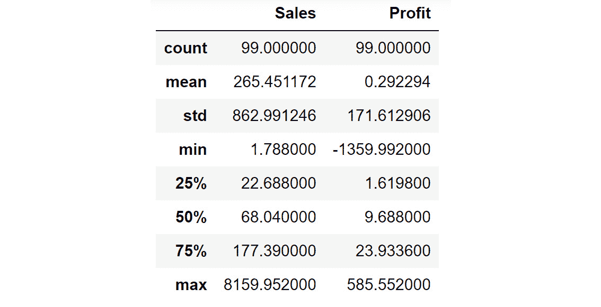

图 4.4：数据描述性统计的输出

我们简单地提取记录`100-199`并对它们运行`describe`函数，因为我们不想处理所有数据。对于这个特定业务问题，我们只对销售和利润数字感兴趣，因此我们不应该走捷径，对全部数据进行`describe`函数。对于在机器学习分析中使用的数据集，行和列的数量可能经常达到数百万，我们不希望计算数据整理任务中未要求的数据。我们始终旨在子集需要处理的确切数据，并在该部分数据上运行统计或绘图函数。尝试理解数据的最直观方法之一是通过图表。这可能是数据整理的一个关键组成部分。

为了更好地理解销售和利润，让我们使用`matplotlib`创建数据的箱形图：

```py
import matplotlib as plt
boxplot = df_subset.boxplot()
```

输出如下：


图 4.5：销售和利润的箱形图

如我们从前面的箱形图中所见，利润存在一些异常值。现在，这些可能是正常的异常值，也可能是`NaN`值。在这个阶段，我们无法猜测，但这可能会引起进一步的分析，看看我们如何处理这些利润中的异常值。在某些情况下，异常值是可以接受的，但对于某些预测建模技术，如回归，异常值可能会产生不良影响。

在继续进行过滤方法之前，让我们快速偏离一下，探索一个非常有用的函数，称为`unique`。正如其名所示，此函数用于快速扫描数据并提取列或行中的唯一值。

## 练习 4.02：唯一函数

在超市销售数据中，您会注意到存在诸如`国家`、`州`和`城市`之类的列。一个自然的问题将是询问数据集中有多少`国家/州/城市`。在这个练习中，我们将使用`unique`函数来查找数据集中独特的`国家/州/城市`数量。让我们按以下步骤进行：

注意

`superstore`数据集文件可以在这里找到：[`packt.live/3dcVnMs`](https://packt.live/3dcVnMs)。

1.  导入必要的库，并使用`pandas`中的`read_excel`方法从 GitHub 读取文件到一个 DataFrame 中：

    ```py
    import numpy as np
    import pandas as pd
    import matplotlib.pyplot as plt
    df = pd.read_excel("../datasets/Sample - Superstore.xls")
    ```

    注意

    高亮路径必须根据您系统上文件的位置进行更改。

1.  使用一行简单的代码提取数据库中包含信息的`国家/州/城市`，如下所示：

    ```py
    df['State'].unique()
    ```

    输出如下：

    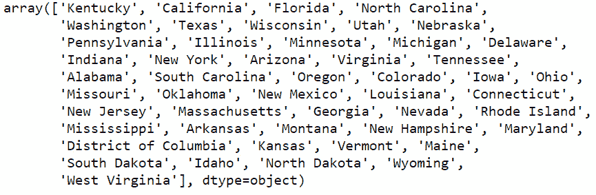

    图 4.6：数据集中存在的不同状态

    您将看到数据集中所有状态的列表。

1.  使用`nunique`方法来计算`州`列中唯一值的数量，如下所示：

    ```py
    df['State'].nunique()
    ```

    输出如下：

    ```py
    49
    ```

    这个数据集返回`49`。所以，在美国的`50`个州中，有一个州没有出现在这个数据集中。因此，我们可以得出结论，`State`列中有一个重复项。

    注意

    要访问本节的具体源代码，请参阅[`packt.live/2NaBkUB`](https://packt.live/2NaBkUB)。

    您也可以在[`packt.live/2N7NHkf`](https://packt.live/2N7NHkf)上在线运行此示例。

同样，如果我们对`Country`列运行这个函数，我们得到一个只有一个元素的数组，`United States`。立即，我们可以看到我们根本不需要保留国家列，因为该列中没有任何有用的信息，除了所有条目都相同。这就是一个简单的函数如何帮助我们决定完全删除一列——也就是说，删除`9,994`条不必要的数据。

## 条件选择和布尔过滤

通常，我们不想处理整个数据集，而只想选择满足特定条件的部分数据集。这可能是任何数据整理任务中最常见的用例。在我们的`superstore sales`数据集的背景下，想想业务分析团队日常活动中可能出现的这些常见问题：

+   加利福尼亚州的平均销售额和利润数字是多少？

+   哪些州的总销售额最高和最低？

+   哪个消费群体的销售额/利润变化最大？

+   在销售额排名前五的州中，哪种运输方式和产品类别最受欢迎？

可以给出无数例子，其中业务分析团队或高管希望从满足某些标准的数据子集中获得洞察。

如果你之前有 SQL 的使用经验，你会知道这类问题需要相当复杂的 SQL 查询编写。还记得`WHERE`子句吗？

我们将向您展示如何使用条件子集和布尔过滤来回答这些问题。

首先，我们需要理解布尔索引的关键概念。这个过程本质上接受一个条件表达式作为参数，并返回一个布尔数据集，其中`TRUE`值出现在条件得到满足的地方。以下代码中展示了简单示例。为了演示目的，我们正在对包含`10`条记录和`3`个列的小数据集进行子集化：

```py
df_subset = df.loc[[i for i in range (10)],\
                   ['Ship Mode','State','Sales']]
df_subset
```

输出如下：

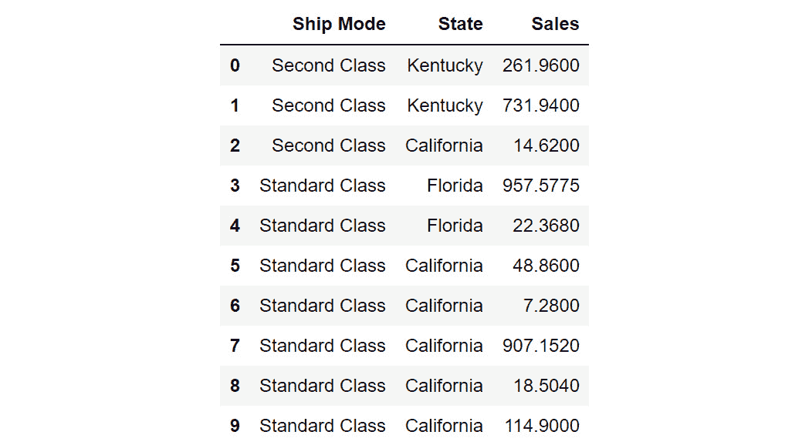

图 4.7：样本数据集

现在，如果我们只想知道销售额超过`$100`的记录，我们可以编写以下代码：

```py
df_subset['Sales'] > 100
```

这会产生以下`boolean`数据框：

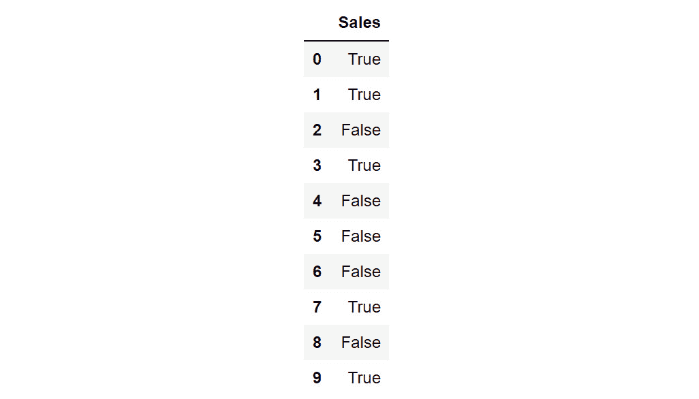

图 4.8 销售额超过 100 美元的记录

让我们来看看 `Sales` 列中的 `True` 和 `False` 条目。由于比较的是数值量，且原始 DataFrame 中唯一的数值列是 `Sales`，因此此代码对 `Ship Mode` 和 `State` 列中的值没有影响。

现在，让我们看看如果我们把这个 `boolean` DataFrame 作为索引传递给原始 DataFrame 会发生什么：

```py
df_subset[df_subset['Sales']>100]
```

输出如下：

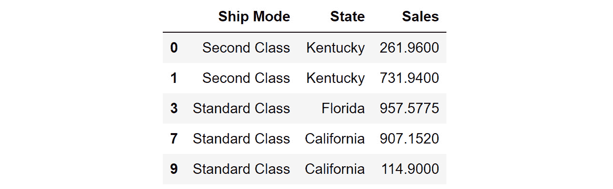

图 4.9：将布尔 DataFrame 作为索引传递给原始 DataFrame 后的结果

我们不仅限于只涉及数值量的条件表达式。让我们尝试提取不涉及 `California` 的销售值（`>$100`）。

我们可以编写以下代码来完成此操作：

```py
df_subset[(df_subset['State']!='California') \
          & (df_subset['Sales']>100)]
```

注意使用涉及字符串的条件。在这个表达式中，我们通过 `&` 运算符连接两个条件。两个条件都必须用括号括起来。

第一个条件表达式简单地匹配 `State` 列中的条目与 `California` 字符串，并相应地分配 `TRUE`/`FALSE`。第二个条件与之前相同。两者通过 `&` 运算符连接，提取出 `State` 不是 `California` 且 `Sales` 大于 `$100` 的行。我们得到以下结果：


图 4.10：结果，其中 State 不是 California 且 Sales 大于 $100

注意

虽然理论上，你可以使用单个表达式和 `&` (`逻辑与`) 和 `|` (`逻辑或`) 运算符构建任意复杂的条件，但建议创建具有有限条件表达式的中间布尔 DataFrame，并逐步构建最终的 DataFrame。这使代码易于阅读和扩展。

在接下来的练习中，我们将探讨我们可以用来操作 DataFrame 的几种不同方法。

## 练习 4.03：设置和重置索引

在这个练习中，我们将创建一个 pandas DataFrame，并设置和重置索引。我们还将添加一个新列，并将其设置为该 DataFrame 的新索引。为此，让我们按照以下步骤进行：

1.  导入 `numpy` 库：

    ```py
    import numpy as np
    ```

1.  使用以下命令创建 `matrix_data`、`row_labels` 和 `column_headings` 函数：

    ```py
    matrix_data = np.matrix('22,66,140;42,70,148;\
                            30,62,125;35,68,160;25,62,152')
    row_labels = ['A','B','C','D','E']
    column_headings = ['Age', 'Height', 'Weight']
    ```

1.  导入 `pandas` 库，然后使用 `matrix_data`、`row_labels` 和 `column_headings` 函数创建 DataFrame：

    ```py
    import pandas as pd
    df1 = pd.DataFrame(data=matrix_data,\
                       index=row_labels,\
                       columns=column_headings)
    print("\nThe DataFrame\n",'-'*25, sep='')
    df1
    ```

    输出如下：

    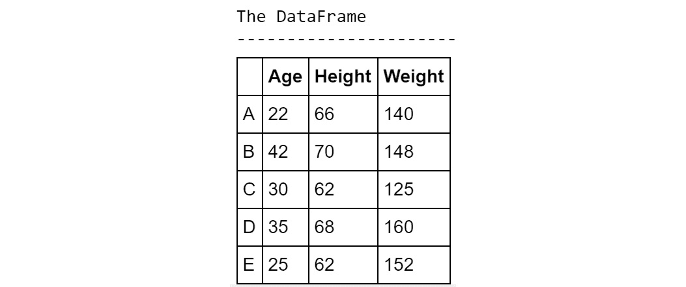

    图 4.11：原始 DataFrame

1.  按如下方式重置索引：

    ```py
    print("\nAfter resetting index\n",'-'*35, sep='')
    df1.reset_index()
    ```

    输出如下：

    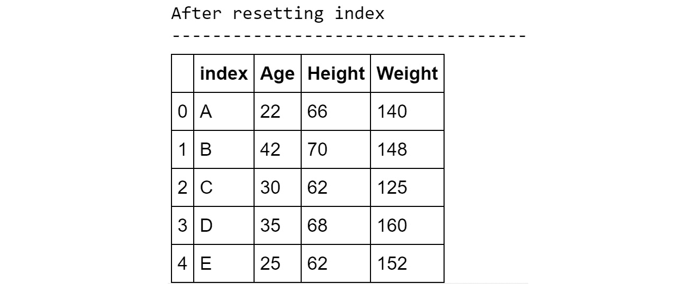

    图 4.12：重置索引后的 DataFrame

1.  将 `drop` 设置为 `True` 重置索引，如下所示：

    ```py
    print("\nAfter resetting index with 'drop' option TRUE\n",\
          '-'*45, sep='')
    df1.reset_index(drop=True)
    ```

    输出如下：

    ![图 4.13：使用 drop 选项设置为 true 重置索引后的 DataFrame]

    ](img/B15780_04_13.jpg)

    图 4.13：使用 drop 选项设置为 true 重置索引后的 DataFrame

1.  使用以下命令添加新列：

    ```py
    print("\nAdding a new column 'Profession'\n",\
          '-'*45, sep='')
    df1['Profession'] = "Student Teacher Engineer Doctor Nurse"\
                        .split()
    df1
    ```

    输出如下：

    ![图 4.14：添加了名为 Profession 的新列后的 DataFrame]

    ](img/B15780_04_14.jpg)

    图 4.14：添加了名为 Profession 的新列后的 DataFrame

1.  现在，使用以下代码将 `Profession` 列设置为 `index`：

    ```py
    print("\nSetting 'Profession' column as index\n",\
          '-'*45, sep='')
    df1.set_index('Profession')
    ```

    输出如下：

    ![图 4.15：将 Profession 列设置为索引后的 DataFrame]

    ](img/B15780_04_15.jpg)

图 4.15：将 Profession 列设置为索引后的 DataFrame

如我们所见，新数据被添加到表的末尾。

注意

要访问此特定部分的源代码，请参阅 [`packt.live/30QknH2`](https://packt.live/30QknH2)。

你也可以在 [`packt.live/37CdM4o`](https://packt.live/37CdM4o) 上在线运行此示例。

## GroupBy 方法

**GroupBy** 指的是涉及以下一个或多个步骤的过程：

+   根据某些标准将数据分成组

+   对每个组独立应用函数

+   将结果合并到数据结构中

在许多情况下，我们可以将数据集分成组，并对这些组进行一些操作。在应用步骤中，我们可能希望执行以下操作之一：

+   **聚合**：对每个组计算汇总统计量（或统计量） - 总和、平均值等

+   **转换**：执行特定组的计算并返回一个类似索引的对象 - z 转换或用值填充缺失数据

+   `TRUE` 或 `FALSE`

当然，对于这个 `GroupBy` 对象有一个描述方法，它以 DataFrame 的形式产生汇总统计信息。

注意

对于那些之前使用过基于 SQL 的工具的人来说，名称 GroupBy 应该相当熟悉。

`GroupBy` 并不仅限于单个变量。如果你传递多个变量（作为一个列表），那么你将得到一个本质上类似于交叉表的结构（来自 Excel）。以下练习展示了我们将整个数据集（快照仅为部分视图）中的所有州和城市分组在一起的一个例子。

## 练习 4.04：GroupBy 方法

在这个练习中，我们将从一个数据集中创建一个子集。我们将使用 `groupBy` 对象来过滤数据集并计算该过滤数据集的平均值。为此，让我们按照以下步骤进行：

注意

`superstore` 数据集文件可以在以下位置找到：[`packt.live/3dcVnMs`](https://packt.live/3dcVnMs)。

1.  导入必要的 Python 模块，并使用 `pandas` 中的 `read_excel` 方法从 GitHub 读取 Excel 文件：

    ```py
    import numpy as np
    import pandas as pd
    import matplotlib.pyplot as plt
    df = pd.read_excel("../datasets/Sample - Superstore.xls")
    df.head()
    ```

    输出（部分显示）如下：

    ![图 4.16：DataFrame 的部分输出]

    ](img/B15780_04_16.jpg)

    图 4.16：DataFrame 的部分输出

    注意

    高亮显示的路径必须根据您系统上文件的位置进行更改。

1.  使用以下命令创建一个包含 10 条记录的子集：

    ```py
    df_subset = df.loc[[i for i in range (10)],\
                       ['Ship Mode','State','Sales']]
    df_subset
    ```

    输出结果如下：

    ![图 4.17：10 条记录的子集]

    

    图 4.17：10 条记录的子集

1.  使用`groupby`方法创建`pandas` DataFrame，如下所示：

    ```py
    byState = df_subset.groupby('State')
    byState
    ```

    输出结果将与以下类似：

    ```py
    <pandas.core.groupby.generic.DataFrameGroupBy object at 0x00000202FB931B08>
    ```

1.  使用以下命令通过`State`计算平均销售额：

    ```py
    print("\nGrouping by 'State' column and listing mean sales\n",\
          '-'*50, sep='')
    byState.mean()
    ```

    输出结果如下：

    ![图 4.18：按销售列表平均销售额分组状态后的输出]

    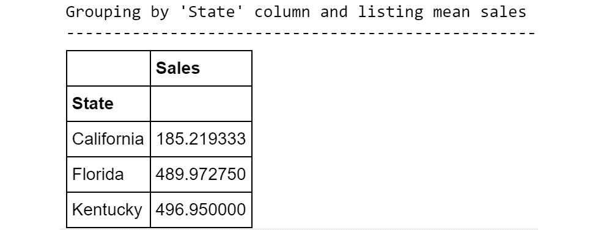

    图 4.18：按销售列表平均销售额分组状态后的输出

1.  使用以下命令通过`State`计算总销售额：

    ```py
    print("\nGrouping by 'State' column and listing total "\
          "sum of sales\n", '-'*50, sep='')
    byState.sum()
    ```

    输出结果如下：

    ![图 4.19：按销售列表总和分组状态后的输出]

    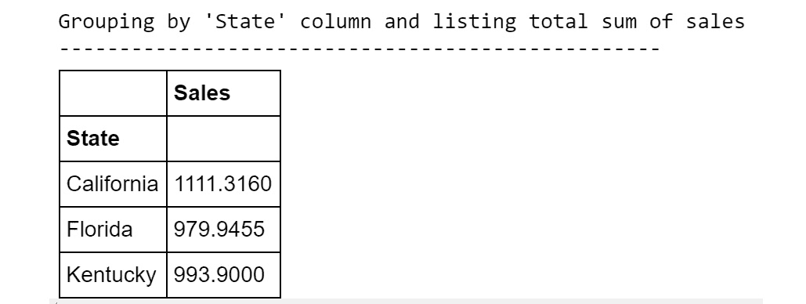

    图 4.19：按销售列表总和分组状态后的输出

1.  为特定州的数据框创建子集并显示统计数据：

    ```py
    pd.DataFrame(byState.describe().loc['California'])
    ```

    输出结果如下：

    ![图 4.20：检查特定状态的统计数据]

    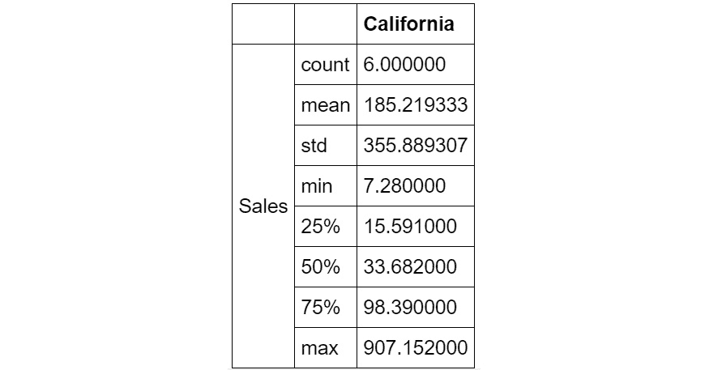

    图 4.20：检查特定状态的统计数据

1.  使用`Ship Mode`属性执行类似的总结：

    ```py
    df_subset.groupby('Ship Mode').describe()\
    .loc[['Second Class','Standard Class']]
    ```

    输出结果如下：

    ![图 4.21：通过汇总`Ship Mode`属性检查销售]

    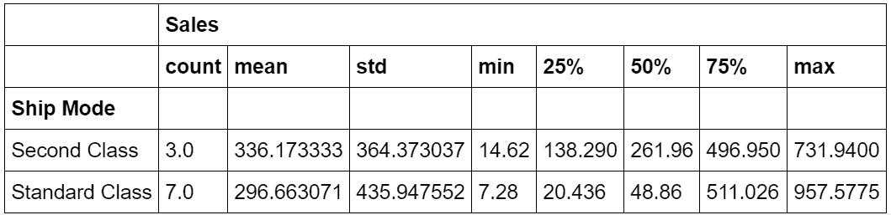

    图 4.21：通过汇总`Ship Mode`属性检查销售

1.  使用以下命令通过两行代码显示每个州每个城市的完整销售汇总统计信息：

    ```py
    byStateCity=df.groupby(['State','City'])
    byStateCity.describe()['Sales']
    ```

    输出结果（部分显示）如下：

    ![图 4.22：检查销售汇总统计信息时的部分输出]

    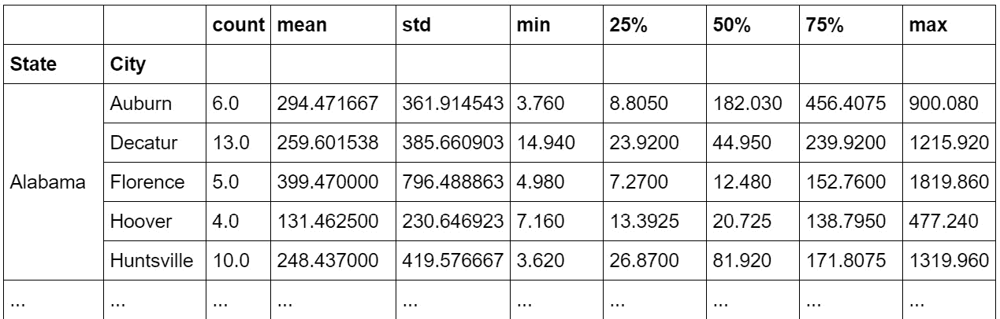

图 4.22：检查销售汇总统计信息时的部分输出

注意`pandas`首先按`State`分组，然后在每个州下按城市分组。

注意

要访问此特定部分的源代码，请参阅[`packt.live/2Cm9eUl`](https://packt.live/2Cm9eUl)。

您也可以在[`packt.live/3fxK43c`](https://packt.live/3fxK43c)上在线运行此示例。

我们现在了解了如何使用`pandas`对数据集进行分组，然后找到诸如我们顶级员工的平均销售退货率之类的汇总值。我们还探讨了`pandas`将如何为我们显示数据的描述性统计信息。这两种技术都可以用来对我们超市数据进行分析。

# 检测异常值和处理缺失值

异常值检测和处理缺失值属于数据质量检查的微妙艺术。建模或数据挖掘过程本质上是一系列复杂的计算，其输出质量在很大程度上取决于输入数据的质量和一致性。维护和守护这种质量的责任通常落在数据整理团队的肩上。

除了明显的数据质量问题外，缺失数据有时会对下游的**机器学习**（**ML**）模型造成破坏。一些机器学习模型，如贝叶斯学习，对异常值和缺失数据具有固有的鲁棒性，但常见的决策树和随机森林等技术对缺失数据有问题，因为这些技术的根本分割策略依赖于单个数据点而不是集群。因此，在将数据交给这样的机器学习模型之前，几乎总是必须插补缺失数据。

异常值检测是一种微妙的艺术。通常，没有关于异常值的普遍认同定义。从统计意义上讲，一个落在某个范围之外的数据点可能经常被归类为异常值，但为了应用这个定义，你需要对数据内在统计分布的性质和参数有一个相当高的确定性。这需要大量的数据来建立这种统计确定性，即使如此，异常值可能不仅仅是无关紧要的噪声，而是对更深层次事物的线索。让我们看看一些虚构的美国快餐连锁餐厅的销售数据的例子。如果我们想将每日销售数据建模为时间序列，我们将在大约 4 月中旬观察到数据中的一个异常峰值：

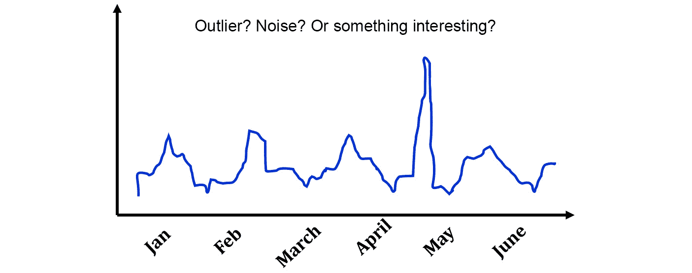

图 4.23：美国快餐连锁餐厅的虚构销售数据

一个好的数据科学家或数据整理员应该对数据点产生好奇心，而不是仅仅因为它们超出了统计范围就拒绝它们。在实际情况中，当天的销售额激增是由于一个不寻常的原因。因此，数据是真实的。但仅仅因为数据是真实的，并不意味着它是有用的。在构建平稳变化的时间序列模型的最终目标中，这个点不应该很重要，应该被拒绝。然而，在本章中，我们将探讨处理异常值而不是拒绝它们的方法。

因此，异常值的关键在于在数百万数据流中系统及时地检测它们，或者在从基于云的存储中读取数据时。在本节中，我们将快速介绍一些用于检测异常值的基本统计测试和一些用于填充缺失数据的基本插补技术。

## Pandas 中的缺失值

检测缺失值最有用的函数之一是 `isnull`。我们将使用这个函数在一个名为 `df_missing` 的 DataFrame 上（基于我们正在处理的 Superstore DataFrame），正如其名所示，它将包含一些缺失值。你可以使用以下命令创建这个 DataFrame：

```py
df_missing=pd.read_excel("../datasets/Sample - Superstore.xls",\
                         sheet_name="Missing")
df_missing
```

注意

不要忘记根据你系统上文件的位置更改路径（已突出显示）。

输出将如下所示：

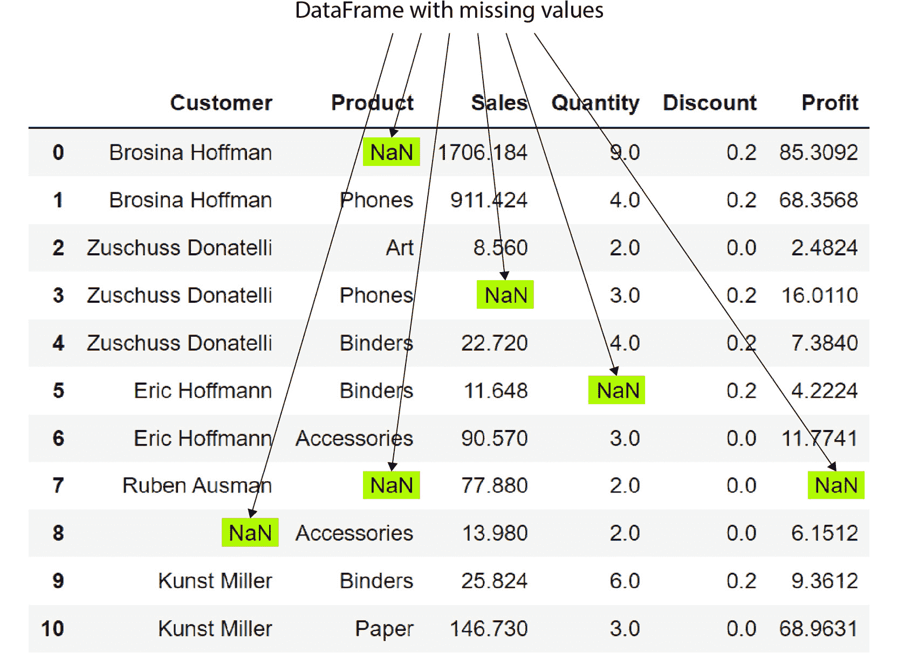

图 4.24：包含缺失值的 DataFrame

我们可以看到，缺失值用 `NaN` 表示。现在，让我们在同一个 DataFrame 上使用 `isnull` 函数并观察结果：

```py
df_missing.isnull()
```

输出如下：

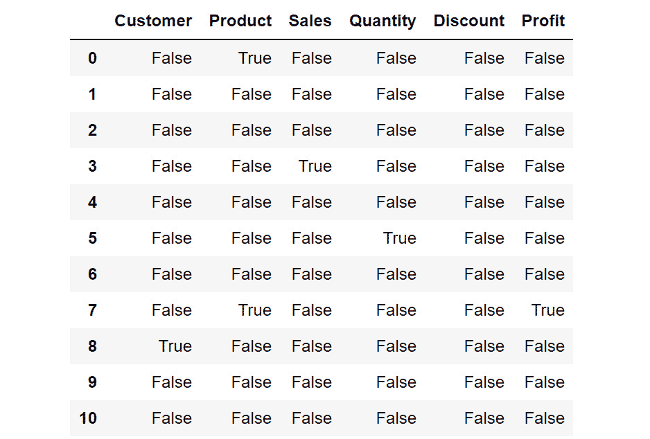

图 4.25：突出显示缺失值的输出

如您所见，缺失值由布尔值 `True` 表示。现在，让我们看看如何使用 `isnull` 函数提供更用户友好的结果。以下是一些非常简单的代码示例，用于检测、计数并打印出 DataFrame 中每一列的缺失值：

```py
for c in df_missing.columns:
    miss = df_missing[c].isnull().sum()
    if miss>0:
        print("{} has {} missing value(s)".format(c,miss))
    else:
        print("{} has NO missing value!".format(c))
```

此代码扫描 DataFrame 的每一列，调用 `isnull` 函数，并将返回的对象（在这种情况下是一个 `pandas` Series 对象）求和，以计算缺失值的数量。如果缺失值大于零，则相应地打印出消息。输出如下：


图 4.26：缺失值计数的输出

如前所述的输出所示，缺失值是从 `Superstore` 数据集中检测到的。

处理缺失值时，你应该寻找方法不是完全删除它们，而是以某种方式填充它们。`fillna` 方法是用于在 `pandas` DataFrame 上执行此任务的有用函数。`fillna` 方法可能适用于字符串数据，但不适用于销售或利润等数值列。因此，我们应该仅限于在非数值文本列上使用此固定的字符串替换。`Pad` 或 `ffill` 函数用于向前填充数据，即从序列的前一个数据中复制它。前向填充是一种技术，其中缺失值用前一个值填充。另一方面，后向填充或 `bfill` 使用下一个值来填充任何缺失数据。让我们通过以下练习来练习这个：

## 练习 4.05：使用 `fillna` 方法填充缺失值

在这个练习中，我们将按顺序执行四种技术来处理数据集中的缺失值。

注意

`superstore` 数据集文件可以在以下位置找到：[`packt.live/3dcVnMs`](https://packt.live/3dcVnMs)。

首先，我们将使用 `fillna` 方法将缺失值替换为静态值。然后，我们将使用 `ffill` 和 `bfill` 方法来替换缺失值。最后，我们将计算一列的平均值，并用该平均值替换缺失值。为此，请按照以下步骤进行：

1.  导入必要的 Python 模块，并使用 `pandas` 中的 `read_excel` 方法从 GitHub 读取 Excel 文件：

    ```py
    import numpy as np
    import pandas as pd
    import matplotlib.pyplot as plt
    df_missing = pd.read_excel("../datasets/Sample - Superstore.xls",\
                               sheet_name="Missing")
    df_missing.head()
    ```

    注意

    高亮显示的路径必须根据您系统上文件的位置进行更改。

    输出如下：

    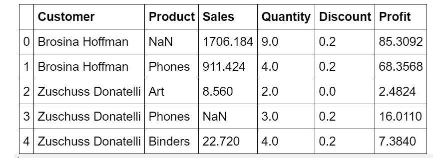

    图 4.27：数据集快照

1.  使用以下命令将所有缺失值填充为 `FILL` 字符串：

    ```py
    df_missing.fillna('FILL')
    ```

    输出如下：

    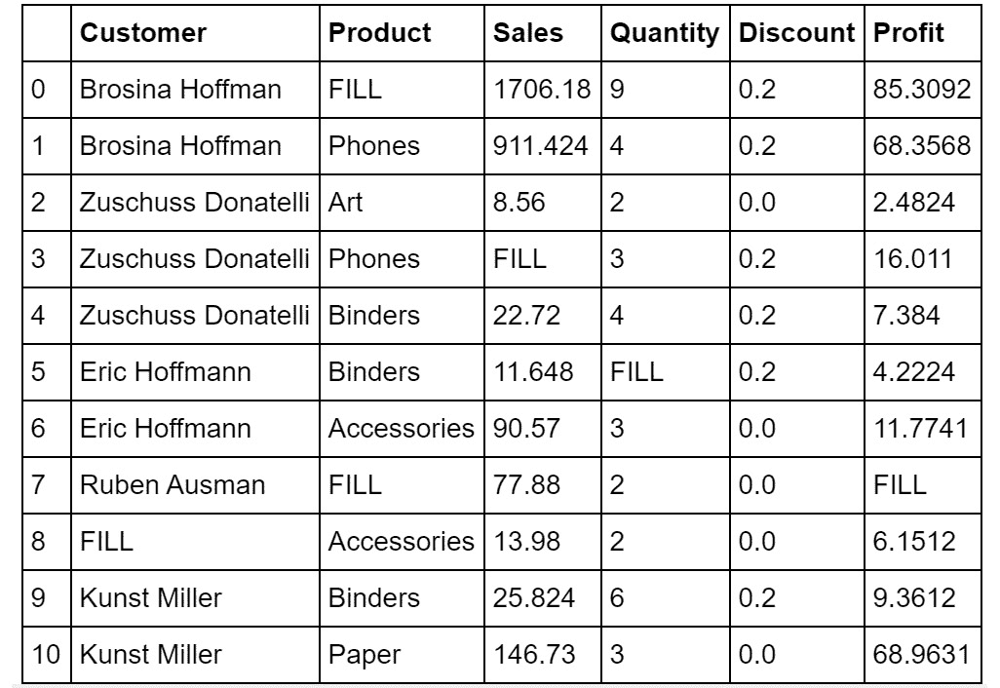

    

    图 4.28：缺失值被替换为 FILL

1.  使用以下命令使用`FILL`字符串填充指定的列：

    ```py
    df_missing[['Customer','Product']].fillna('FILL')
    ```

    输出如下：

    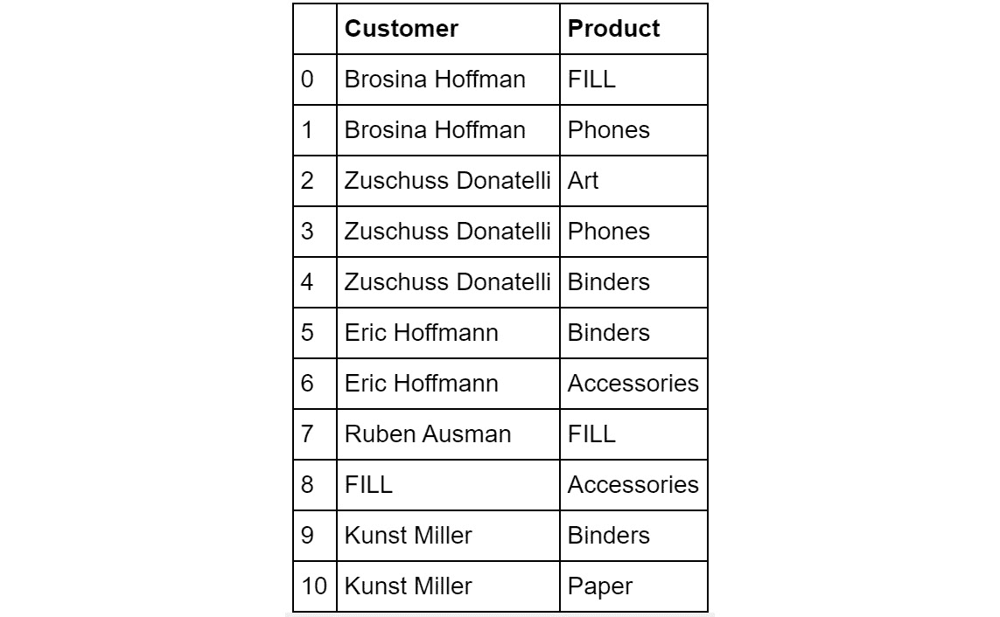

    

    图 4.29：指定的列被替换为 FILL

    注意

    在所有这些情况下，函数都是在原始 DataFrame 的副本上工作的。因此，如果您想使更改永久生效，您必须将这些函数返回的 DataFrame 赋值给原始 DataFrame 对象。

1.  使用以下命令在`Sales`列上使用`ffill`或前向填充来填充值：

    ```py
    df_missing['Sales'].fillna(method='ffill')
    ```

    输出如下：

    

    

    图 4.30：使用前向填充的销售列

1.  使用`bfill`向后填充，即从序列中的下一个数据复制：

    ```py
    df_missing['Sales'].fillna(method='bfill')
    ```

    输出如下：

    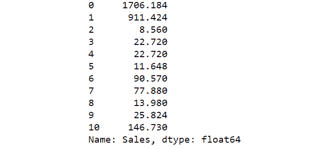

    

    图 4.31：使用后向填充的销售列

    让我们比较这两个序列并查看每种情况发生了什么：

    

    

    图 4.32：使用前向填充和后向填充填充缺失数据

    您也可以使用 DataFrame 的平均值函数进行填充。例如，我们可能希望使用平均销售额填充`Sales`中的缺失值。

1.  使用平均销售额填充`Sales`中的缺失值：

    ```py
    df_missing['Sales'].fillna(df_missing.mean()['Sales'])
    ```

    输出如下：

    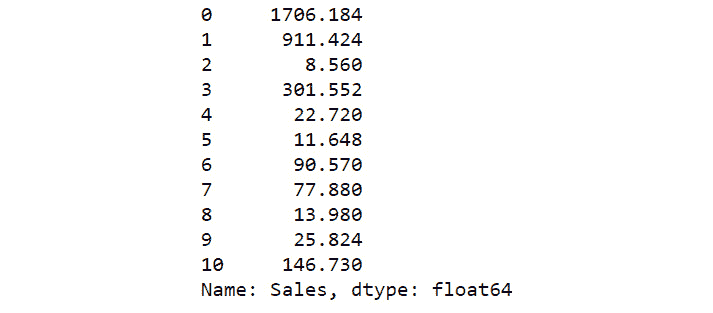

    

图 4.33：带有平均销售额的销售列

以下截图显示了前面代码中发生的情况：

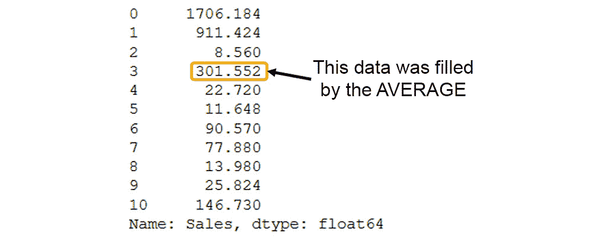


图 4.34：使用平均值填充缺失数据

在这里，我们可以观察到单元格中的缺失值被平均销售额填充。

注意

要访问此特定部分的源代码，请参阅[`packt.live/2ACDYjp`](https://packt.live/2ACDYjp)。

您也可以在[`packt.live/2YNZnhh`](https://packt.live/2YNZnhh)上运行此示例。

通过这种方式，我们已经了解了如何在`pandas` DataFrame 中使用四种方法来替换缺失值：静态值、前向填充、后向填充和平均值。这些是在处理缺失值数据时的基本技术。

## dropna 方法

此函数用于简单地删除包含`NaN`或缺失值的行或列。然而，这里有一些选择。

以下为`dropna()`方法的语法：

```py
DataFrameName.dropna(axis=0, how='any', \
                     thresh=None, subset=None, \
                     inplace=False)
```

如果 `dropna()` 方法的 `axis` 参数设置为 `0`，则包含缺失值的行将被删除；如果 `axis` 参数设置为 `1`，则包含缺失值的列将被删除。如果 `NaN` 值不超过一定百分比，这些操作非常有用，如果我们不想删除特定的行/列。

对于 `dropna()` 方法，有两个有用的参数如下：

+   `how` 参数确定当我们至少有一个 `NaN` 值或所有 `NaN` 值时，是否从 DataFrame 中删除行或列。

+   `thresh` 参数要求保留行/列的许多非 `NaN` 值。

我们将在以下练习中练习使用 `dropna()` 方法。

## 练习 4.06：使用 dropna 删除缺失值

在本练习中，我们将删除数据集中不包含数据的单元格。

注意

`superstore` 数据集文件可以在以下位置找到：[`packt.live/3dcVnMs`](https://packt.live/3dcVnMs)。

我们将使用 `dropna` 方法来删除数据集中的缺失单元格。为此，让我们按照以下步骤进行：

1.  导入必要的 Python 库，并使用 `pandas` 中的 `read_excel` 方法从 GitHub 读取 Excel 文件：

    ```py
    import numpy as np
    import pandas as pd
    import matplotlib.pyplot as plt
    df_missing = pd.read_excel("../datasets/Sample - Superstore.xls",\
                               sheet_name="Missing")
    df_missing.head()
    ```

    注意

    高亮显示的路径必须根据您系统上文件的位置进行更改。

    输出如下：

    

    图 4.35：Superstore 数据集

    注意

    你得到的输出将与本练习中显示的输出不同。

1.  要将 `axis` 参数设置为 `zero` 并删除所有缺失行，请使用以下命令：

    ```py
    df_missing.dropna(axis=0)
    ```

    输出如下：

    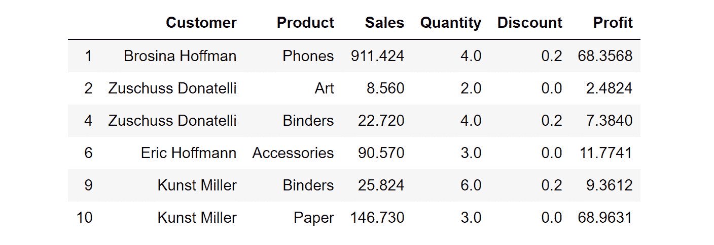

    图 4.36：删除所有缺失行

1.  要将 `axis` 参数设置为 `1` 并删除所有缺失行，请使用以下命令：

    ```py
    df_missing.dropna(axis=1)
    ```

    输出如下：

    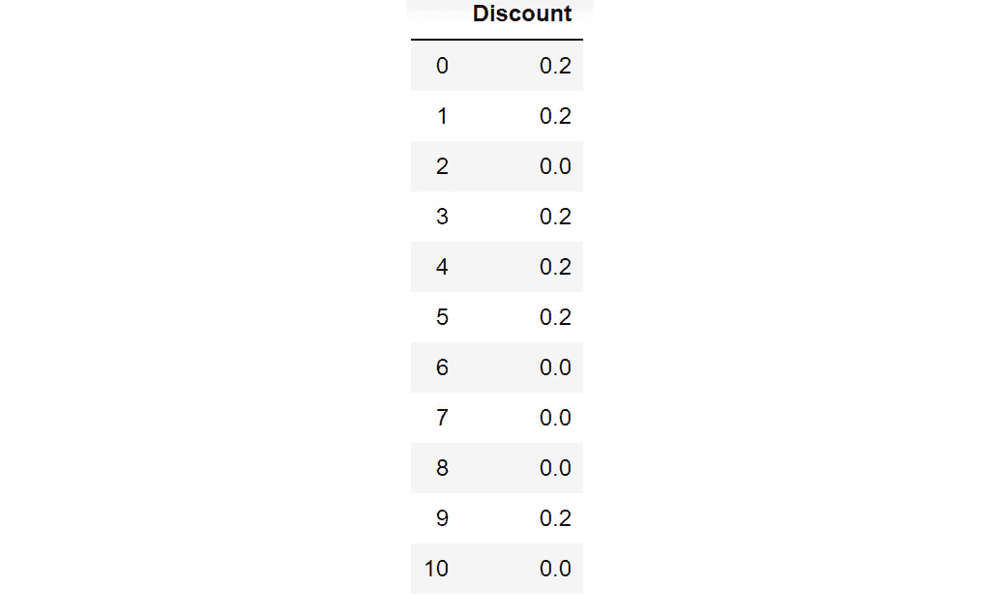

    图 4.37：删除行或列以处理缺失数据

1.  使用 `axis` 设置为 `1` 和 `thresh` 设置为 `10` 删除值：

    ```py
    df_missing.dropna(axis=1,thresh=10)
    ```

    输出如下：

    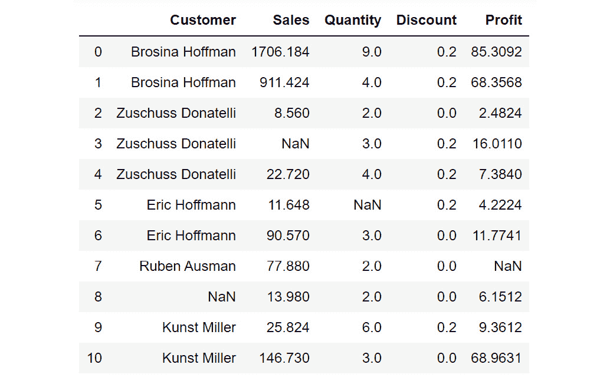

图 4.38：使用 axis=1 和 thresh=10 删除值的 DataFrame

如您所见，一些 `NaN` 值仍然存在，但由于最小阈值，这些行被保留在原位。

注意

要访问此特定部分的源代码，请参阅 [`packt.live/2Ybvx7t`](https://packt.live/2Ybvx7t)。

你也可以在 [`packt.live/30RNCsY`](https://packt.live/30RNCsY) 上运行此示例。

在本练习中，我们探讨了删除缺失值行和列。这是一个在多种情况下都很有用的技术，包括在处理机器学习时。一些机器学习模型处理缺失数据不佳，提前删除它们可能是最佳实践。

## 使用简单统计测试进行异常值检测

正如我们已经讨论过的，数据集中的异常值可能由于许多因素以多种方式出现：

+   数据录入错误

+   实验误差（数据提取相关）

+   由于噪声或仪器故障导致的测量误差

+   数据处理错误（由于编码错误导致的数据操作或突变）

+   抽样误差（从错误或各种来源提取或混合数据）

对于异常值检测，不可能找到一个通用的方法。在这里，我们将向您展示一些使用标准统计测试对数值数据进行的一些简单技巧。

箱线图可能显示异常值。我们可以通过分配负值来破坏两个销售值，如下所示：

```py
df_sample = df[['Customer Name','State','Sales','Profit']]\
               .sample(n=50).copy()
df_sample['Sales'].iloc[5]=-1000.0
df_sample['Sales'].iloc[15]=-500.0
```

要绘制箱线图，请使用以下代码：

```py
df_sample.plot.box()
plt.title("Boxplot of sales and profit", fontsize=15)
plt.xticks(fontsize=15)
plt.yticks(fontsize=15)
plt.grid(True)
```

输出（每次运行都会变化）如下：


图 4.39：销售和利润的箱线图

我们可以创建简单的箱线图来检查任何异常或不合逻辑的值。例如，在上面的例子中，我们故意破坏了两个销售值，使它们变为负数，它们在箱线图中很容易被发现。

注意，利润可能是负数，所以这些负点通常不是可疑的。但一般来说，销售额不能是负数，所以它们被检测为异常值。

我们可以创建一个数值量的分布，并检查位于极端值处的值，以查看它们是否真正是数据的一部分或异常值。例如，如果分布几乎呈正态分布，那么任何超过四个或五个标准差之外的值可能是有问题的：


图 4.40：远离主要异常值的价值

# 连接、合并和连接

合并和连接表或数据集是数据整理专业人士日常工作中非常常见的操作。这些操作类似于关系数据库表中的 `JOIN` 查询。通常，关键数据存在于多个表中，这些记录需要被合并到一个匹配该公共键的单一表中。这在任何类型的销售或交易数据中都是一种极其常见的操作，因此数据整理者必须掌握。`pandas` 库提供了执行涉及多个 DataFrame 对象的各种类型 `JOIN` 查询的便捷且直观的内置方法。

## 练习 4.07：数据集的连接

在这个练习中，我们将沿着各个轴（行或列）连接 DataFrames。

注意

`superstore` 数据集文件可以在以下位置找到：[`packt.live/3dcVnMs`](https://packt.live/3dcVnMs)。

这是一个非常有用的操作，因为它允许你在新数据到来或需要将新特征列插入表中时扩展 DataFrame。为此，让我们按以下步骤进行：

1.  使用 `pandas` 中的 `read_excel` 方法从 GitHub 读取 Excel 文件：

    ```py
    import numpy as np
    import pandas as pd
    import matplotlib.pyplot as plt
    df = pd.read_excel("../datasets/Sample - Superstore.xls")
    df.head()
    ```

    注意

    高亮显示的路径必须根据文件在您系统中的位置进行更改。

    输出（部分显示）将如下所示：

    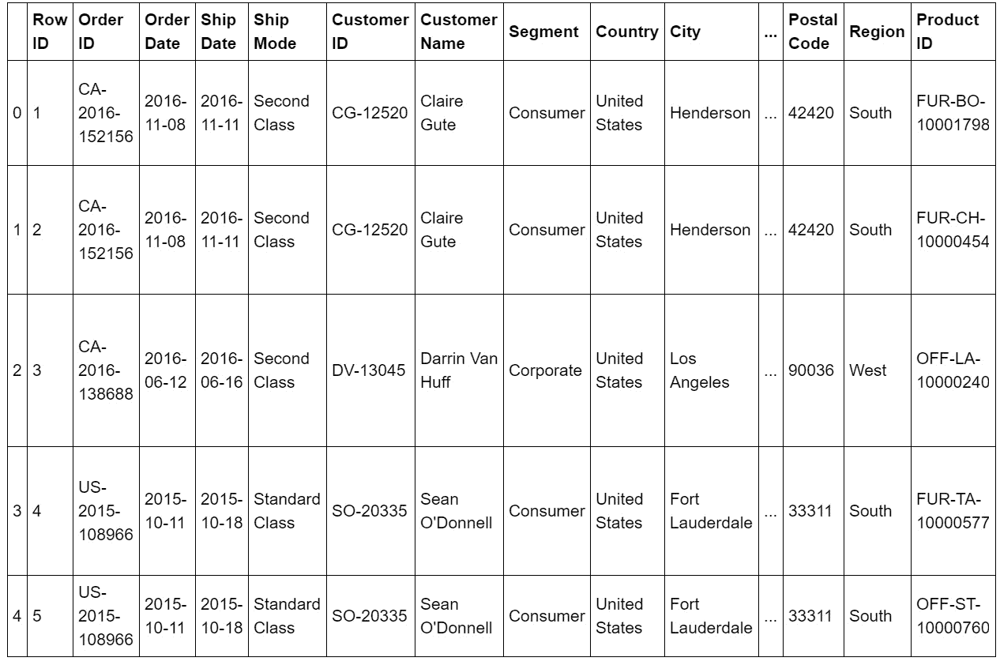

    图 4.41：DataFrame 的部分输出

1.  从我们正在处理的原始销售数据集中随机创建三个 DataFrame，每个样本包含 4 条记录：

    ```py
    df_1 = df[['Customer Name','State',\
               'Sales','Profit']].sample(n=4)
    df_2 = df[['Customer Name','State',\
               'Sales','Profit']].sample(n=4)
    df_3 = df[['Customer Name','State',\
               'Sales','Profit']].sample(n=4)
    ```

1.  使用以下代码创建一个包含所有行连接的合并 DataFrame：

    ```py
    df_cat1 = pd.concat([df_1,df_2,df_3], axis=0)
    df_cat1
    ```

    输出（部分显示）如下：

    ![图 4.42：连接 DataFrame 后的部分输出]

    ![img/B15780_04_42.jpg]

    图 4.42：连接 DataFrame 后的部分输出

    如你所见，连接将垂直组合多个 DataFrame。你也可以尝试按列连接，尽管对于这个特定的例子来说，这没有任何实际意义。然而，`pandas` 在该操作中用 `NaN` 填充不可用的值。

    注意

    你得到的输出将与本练习中显示的输出不同。

1.  使用以下代码创建一个包含所有列连接的合并 DataFrame：

    ```py
    df_cat2 = pd.concat([df_1,df_2,df_3], axis=1)
    df_cat2
    ```

    输出（部分显示）如下：

    ![图 4.43：连接 DataFrame 后的部分输出]

    ![img/B15780_04_43.jpg]

图 4.43：连接 DataFrame 后的部分输出

如我们所见，数据集中不包含任何值的单元格被替换为 `NaN` 值。

注意

要访问此特定部分的源代码，请参阅 [`packt.live/3epn5aB`](https://packt.live/3epn5aB)。

你也可以在 [`packt.live/3edUPrh`](https://packt.live/3edUPrh) 上在线运行此示例。

## 通过公共键合并

通过公共键合并是数据表的一个极其常见的操作，因为它允许你在主数据库中合理化多个数据源 – 即，如果它们有一些公共特征/键。

在连接和合并两个 DataFrame 时，我们使用两种不同的类型：**内部**和**外部 {左|右}**。让我们来看看它们：

+   **内部**：一种使用列或键进行比较的合并方法。在合并后，具有相同列或键的行将存在。

+   **外部**：一种类似于内部合并数据集的方法，但保留右侧或左侧（取决于选择哪一侧）的所有数据，并将来自另一侧的匹配数据合并。

这通常是构建用于机器学习任务的大型数据库的第一步，其中每日传入的数据可能被放入单独的表中。然而，最终，最新的表需要与主数据表合并，以便它可以被输入到后端机器学习服务器，然后更新模型及其预测能力。合并是一种通过列比较来垂直组合 DataFrame 的方法。合并和连接的功能非常相似；它们的能力相同。

## 练习 4.08：通过公共键合并

在这个练习中，我们将使用来自 Superstore 数据集的“客户名称”公共键创建两个 DataFrame。然后，我们将使用内部和外部连接来合并或组合这些 DataFrame。为此，让我们按照以下步骤进行：

注意

Superstore 文件可以在以下位置找到：[`packt.live/3dcVnMs`](https://packt.live/3dcVnMs)。

1.  导入必要的 Python 库，并使用 `pandas` 中的 `read_excel` 方法从 GitHub 读取 Excel 文件：

    ```py
    import numpy as np
    import pandas as pd
    import matplotlib.pyplot as plt
    df = pd.read_excel("df_1, will have shipping information associated with the customer name, and another table, df_2, will have the product information tabulated.
    ```

1.  使用 `Customer Name` 公共键创建 `df1` DataFrame：

    ```py
    df_1=df[['Ship Date','Ship Mode','Customer Name']][0:4]
    df_1
    ```

    第一个 DataFrame 的输出结果如下：

    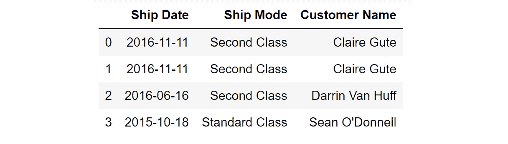

    图 4.45：表 df_1 的条目

1.  使用以下方式创建第二个 DataFrame，`df2`，并带有`Customer Name`公共键：

    ```py
    df_2=df[['Customer Name','Product Name','Quantity']][0:4]
    df_2
    ```

    输出结果如下：

    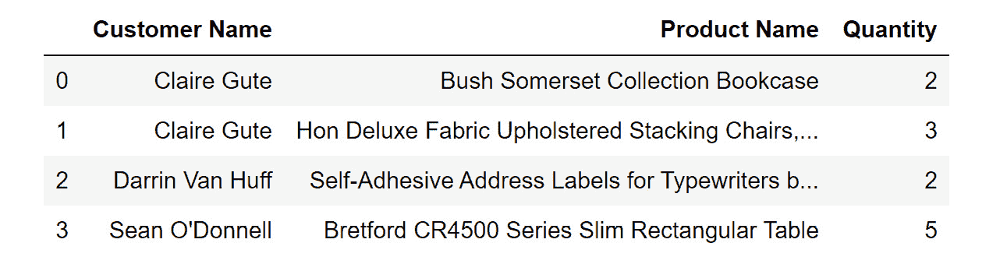

    图 4.46：表 df_2 的条目

1.  使用以下命令通过内连接将这两个表连接起来：

    ```py
    pd.merge(df_1,df_2,on='Customer Name',how='inner')
    ```

    输出结果如下：

    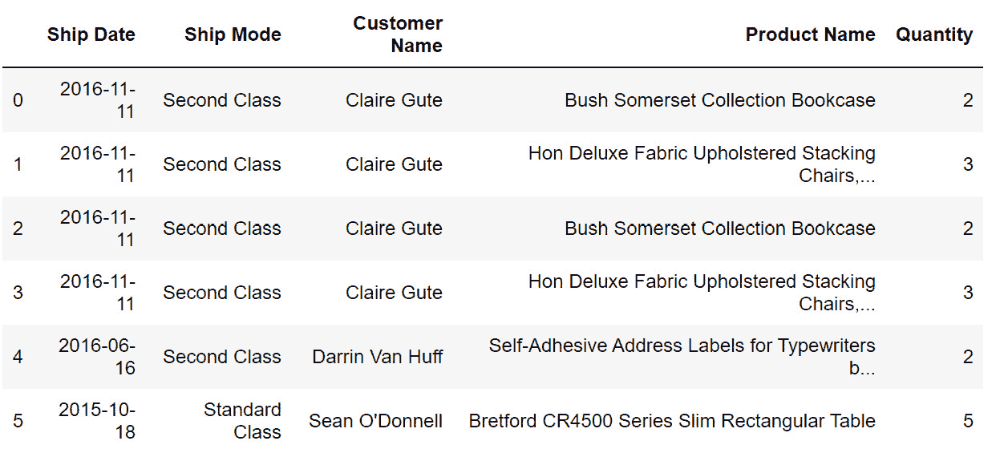

    图 4.47：在表 df_1 和表 df_2 上进行内连接

1.  使用以下命令删除重复项：

    ```py
    pd.merge(df_1,df_2,on='Customer Name',\
             how='inner').drop_duplicates()
    ```

    输出结果如下：

    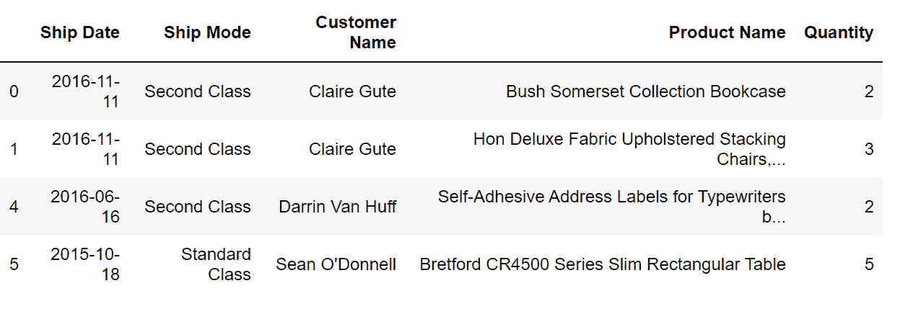

    图 4.48：删除重复项后，在表 df_1 和表 df_2 上进行内连接

1.  提取另一个名为 `df_3` 的小表来展示外连接的概念：

    ```py
    df_3=df[['Customer Name','Product Name','Quantity']][2:6]
    df_3
    ```

    输出结果如下：

    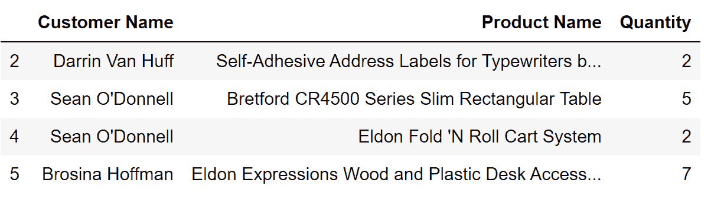

    

    图 4.49：创建表 df_3

1.  使用以下命令通过内连接在 `df_1` 和 `df_3` 上执行操作：

    ```py
    pd.merge(df_1,df_3,on='Customer Name',\
             how='inner').drop_duplicates()
    ```

    输出结果如下：

    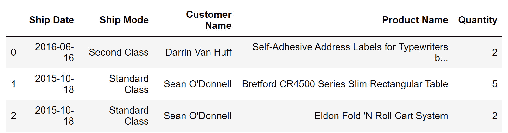

    图 4.50：合并表 df_1 和表 df_3 并删除重复项

1.  使用以下命令通过外连接在 `df_1` 和 `df_3` 上执行操作：

    ```py
    pd.merge(df_1,df_3,on='Customer Name',\
             how='outer').drop_duplicates()
    ```

    输出结果如下：

    

图 4.51：在表 df_1 和表 df_3 上进行外连接并删除重复项

注意，由于找不到与这些记录对应的条目，因此自动插入了一些 `NaN` 和 `NaT` 值，这些条目来自各自表中的唯一客户名称。`NaT` 代表 `Not a Time` 对象，因为 `Ship Date` 列中的对象是时间戳对象。

注意

要访问此特定部分的源代码，请参阅[`packt.live/2Y8G5UW`](https://packt.live/2Y8G5UW)。

您也可以在[`packt.live/30RNUA4`](https://packt.live/30RNUA4)上在线运行此示例。

通过这种方式，我们已经介绍了如何使用 `merge` 方法进行内连接和外连接。

## 连接方法

根据索引键进行连接，通过将两个可能具有不同索引的 DataFrame 的列组合成一个单一的数据帧来完成。这提供了一种基于行索引合并数据帧的更快方式。如果不同表中的记录索引不同但代表相同的基本数据，并且您希望将它们合并到一个表中，这很有用：

## 练习 4.09：连接方法

在这个练习中，我们将创建两个 DataFrame 并在这些 DataFrame 上执行不同类型的连接。

注意

超市文件可在此处找到：[`packt.live/3dcVnMs`](https://packt.live/3dcVnMs)。

完成此练习，请执行以下步骤：

1.  使用`pandas`的`read_excel`方法导入 Python 库并从 GitHub 加载文件：

    ```py
    import numpy as np
    import pandas as pd
    import matplotlib.pyplot as plt
    df = pd.read_excel("../datasets/Sample - Superstore.xls")
    df.head()
    ```

    注意

    高亮路径必须根据您系统上文件的位置进行更改。

    代码的部分输出如下：

    

    图 4.52：DataFrame 的部分输出

1.  使用以下命令创建以“客户名称”为索引的`df1`：

    ```py
    df_1=df[['Customer Name','Ship Date','Ship Mode']][0:4]
    df_1.set_index(['Customer Name'],inplace=True)
    df_1
    ```

    输出如下：

    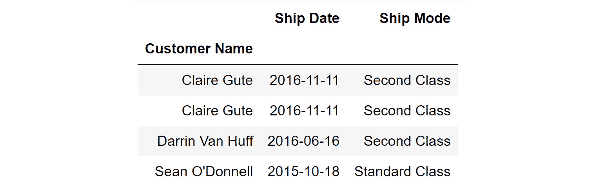

    图 4.53：DataFrame df_1

1.  使用以下命令创建以“客户名称”为索引的`df2`：

    ```py
    df_2=df[['Customer Name','Product Name','Quantity']][2:6]
    df_2.set_index(['Customer Name'],inplace=True) 
    df_2
    ```

    输出如下：

    

    图 4.54：DataFrame df_2

1.  使用以下命令通过`df_1`和`df_2`执行左连接：

    ```py
    df_1.join(df_2,how='left').drop_duplicates()
    ```

    输出如下：

    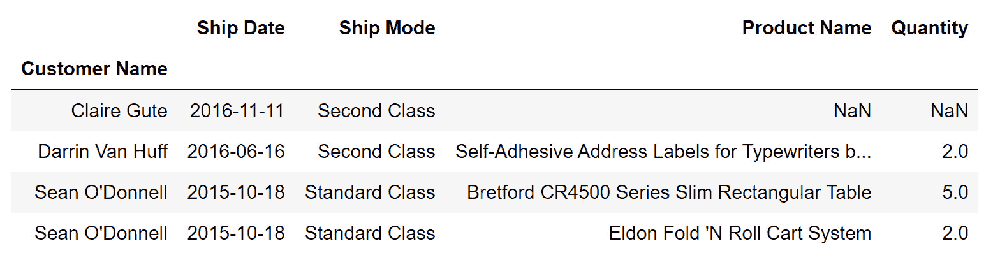

    图 4.55：删除重复项后 df_1 和 df_2 的左连接

1.  使用以下命令通过`df_1`和`df_2`执行右连接：

    ```py
    df_1.join(df_2,how='right').drop_duplicates()
    ```

    输出如下：

    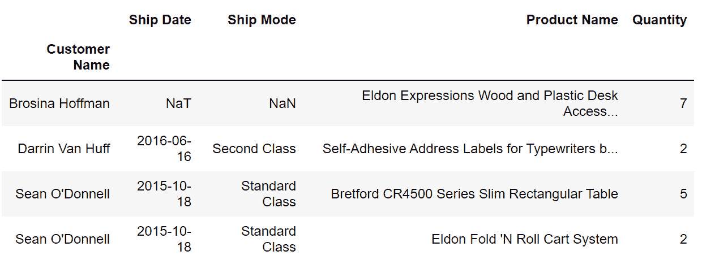

    图 4.56：删除重复项后 df_1 和 df_2 的右连接

1.  使用以下命令通过`df_1`和`df_2`执行内部连接：

    ```py
    df_1.join(df_2,how='inner').drop_duplicates()
    ```

    输出如下：

    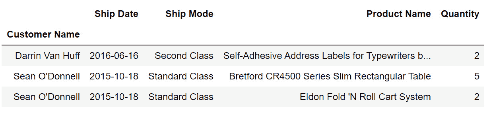

    图 4.57：删除重复项后 df_1 和 df_2 的内部连接

1.  使用以下命令通过`df_1`和`df_2`执行外部连接：

    ```py
    df_1.join(df_2,how='outer').drop_duplicates()
    ```

    输出如下：

    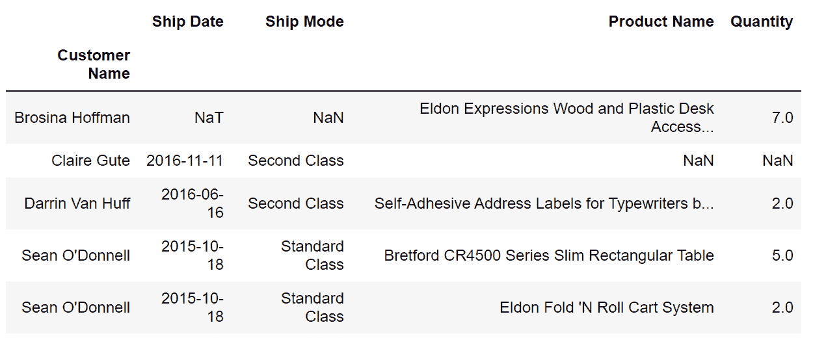

图 4.58：删除重复项后 df_1 和 df_2 的外部连接

注意

要访问此特定部分的源代码，请参阅[`packt.live/30S9nZH`](https://packt.live/30S9nZH)。

您也可以在此处在线运行此示例：[`packt.live/2NbDweg`](https://packt.live/2NbDweg)。

我们现在已经了解了`pandas` DataFrame 连接的基本功能。我们使用了内部和外部连接，并展示了如何使用索引来执行连接以及它如何有助于分析。

# Pandas 的有用方法

在本节中，我们将讨论`pandas`提供的一些小型实用函数，以便我们能够高效地与 DataFrame 一起工作。它们不属于任何特定的函数组，因此在这里在杂项类别下提及。让我们详细讨论这些杂项方法。

## 随机抽样

在本节中，我们将讨论从我们的 DataFrames 中随机采样数据。这在各种管道中是一个非常常见的任务，其中之一是机器学习。在机器学习数据整理管道中选择要训练的数据和要测试的数据时，采样通常被使用。从大 DataFrame 中随机采样一个随机分数通常非常有用，这样我们就可以在它们上练习其他方法并测试我们的想法。如果你有一个包含 100 万条记录的数据库表，那么在完整表上运行你的测试脚本可能不是计算上有效的。

然而，你可能也不希望只提取前 100 个元素，因为数据可能已经根据某个特定的键排序，你可能会得到一个不有趣的表格，这可能无法代表父数据库的完整统计多样性。

在这些情况下，`sample` 方法非常有用，这样我们就可以随机选择 DataFrame 的一个受控分数。

## 练习 4.10：随机采样

在这个练习中，我们将从 Superstore 数据集中随机抽取五个样本，并计算要采样的数据的确切分数。为此，让我们按照以下步骤进行：

注意

Superstore 文件可以在以下位置找到：[`packt.live/3dcVnMs`](https://packt.live/3dcVnMs)。

1.  导入必要的 Python 模块，并使用 `pandas` 中的 `read_excel` 方法从 GitHub 读取它们：

    ```py
    import numpy as np
    import pandas as pd
    import matplotlib.pyplot as plt
    df = pd.read_excel("../datasets/Sample - Superstore.xls")
    df.head()
    ```

    注意

    高亮显示的路径必须根据你系统上文件的位置进行更改。

    部分输出将如下：

    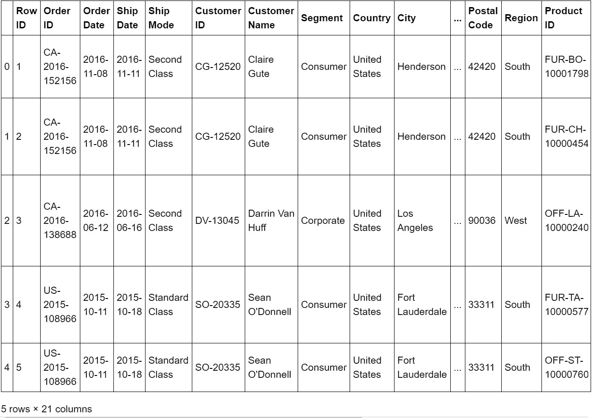

    ![图 4.59：DataFrame 的部分输出 1.  使用以下命令指定从 DataFrame 中需要的样本数量：    ```py    df.sample(n=5)    ```    随机输出（部分显示）如下：    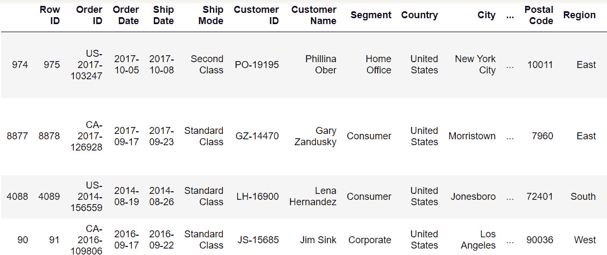

    图 4.60：包含五个样本的 DataFrame

    注意

    你得到的结果将与本练习中显示的不同。

1.  使用以下命令指定要采样的数据的确切分数（百分比）：

    ```py
    df.sample(frac=0.1)
    ```

    输出如下：

    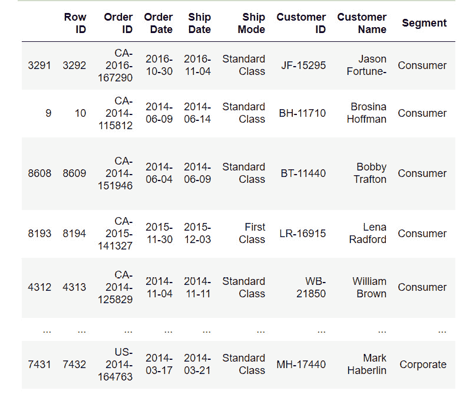

    图 4.61：采样 0.1% 数据的 DataFrame 部分输出

    你还可以选择是否进行带替换的采样，即是否可以选择相同的记录多次。默认的 `replace` 选择是 `FALSE`，即无重复，采样将尝试只选择新元素。

1.  使用以下命令选择采样：

    ```py
    df.sample(frac=0.1, replace=True)
    ```

    输出如下：

    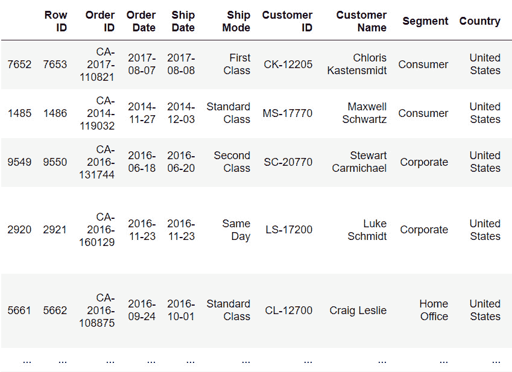

。

你也可以在 [`packt.live/2YLTt0f`](https://packt.live/2YLTt0f) 上在线运行此示例。

## `value_counts` 方法

我们之前讨论了 `unique` 方法，该方法从 DataFrame 中查找并计数唯一记录。在类似的方法中，另一个有用的函数是 `value_counts`。此函数返回一个包含唯一值计数的对象。在返回的对象中，第一个元素是最常用的对象。元素按降序排列。

让我们考虑这个方法的一个实际应用来展示它的实用性。假设你的经理要求你列出大销售数据库中的前 10 位客户。所以，业务问题是：哪些 10 位客户的姓名在销售表中出现频率最高？如果数据在关系型数据库管理系统（RDBMS）中，你可以使用 SQL 查询来实现这一点，但在 pandas 中，可以通过使用一个简单的函数来完成：

```py
df['Customer Name'].value_counts()[:10]
```

输出如下：

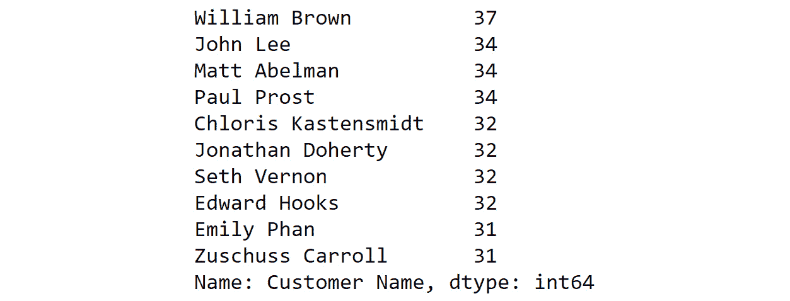


图 4.63：前 10 位客户列表

`value_counts` 方法返回一个按计数频率排序的所有唯一客户名称计数的序列。通过只请求该列表的前 10 个元素，此代码返回了一个包含出现频率最高的前 10 位客户名称的序列。

## 交叉表功能

与分组类似，pandas 还提供了交叉表功能，它的工作方式与电子表格程序（如 MS Excel）中的交叉表相同。例如，在这个销售数据库中，你想知道按地区和州（两个索引级别）的平均销售额、利润和销售数量。

我们可以通过使用一段简单的代码来提取这些信息（我们首先抽取 100 条记录以保持计算快速，然后应用代码）：

```py
df_sample = df.sample(n=100)
df_sample.pivot_table(values=['Sales','Quantity','Profit'],\
                      index=['Region','State'],aggfunc='mean')
```

输出如下（请注意，由于随机抽样，你的具体输出可能会有所不同）：


图 4.64：100 条记录的样本

按特定列对表格进行排序是分析师日常工作中最常用的操作之一。排序可以帮助你更好地理解数据，并在特定的数据视图中展示它。在训练机器学习模型时，数据的排序方式可能会影响基于所进行的采样的模型性能。不出所料，`pandas` 提供了一种简单直观的排序方法，称为 `sort_values` 方法。我们将在下面的练习中练习使用它。

## 练习 4.11：按列值排序 – sort_values 方法

在这个练习中，我们将从超市数据集中随机抽取 `15` 条记录。

注意

超市文件可以在这里找到：[`packt.live/3dcVnMs`](https://packt.live/3dcVnMs)。

我们将使用`sort_values`方法根据列名对数据集中的列值进行排序。为此，让我们按照以下步骤进行：

1.  导入必要的 Python 模块，并使用`pandas`中的`read_excel`方法从 GitHub 读取 Excel 文件：

    ```py
    import numpy as np
    import pandas as pd
    import matplotlib.pyplot as plt
    df = pd.read_excel("../datasets/Sample - Superstore.xls")
    df.head()
    ```

    注意

    高亮路径必须根据文件在您系统中的位置进行更改。

    输出（部分显示）将如下：

    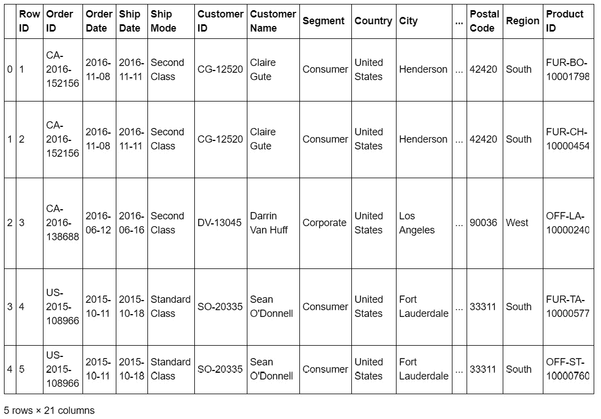

    图 4.65：DataFrame 的部分输出

1.  抽取 15 条记录的随机样本，然后按`Sales`列排序，然后按`Sales`和`State`列一起排序：

    ```py
    df_sample=df[['Customer Name','State',\
                  'Sales','Quantity']].sample(n=15)
    df_sample
    ```

    输出如下：

    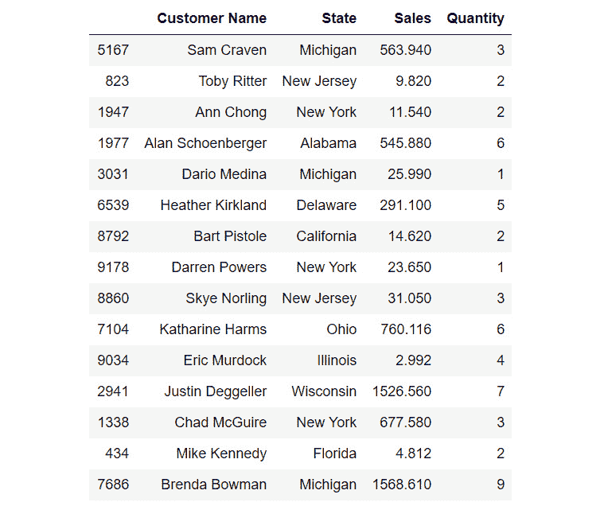

    图 4.66：15 条记录的样本

    注意

    您将获得的输出将与本练习中显示的输出不同。

1.  使用以下命令按`Sales`排序值：

    ```py
    df_sample.sort_values(by='Sales')
    ```

    输出如下：

    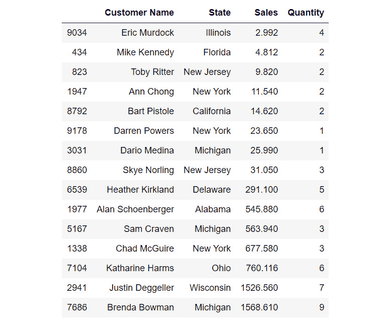

    图 4.67：按销售值排序的 DataFrame

1.  按照以下命令按`Sales`和`State`排序值：

    ```py
    df_sample.sort_values(by=['State','Sales'])
    ```

    输出如下：

    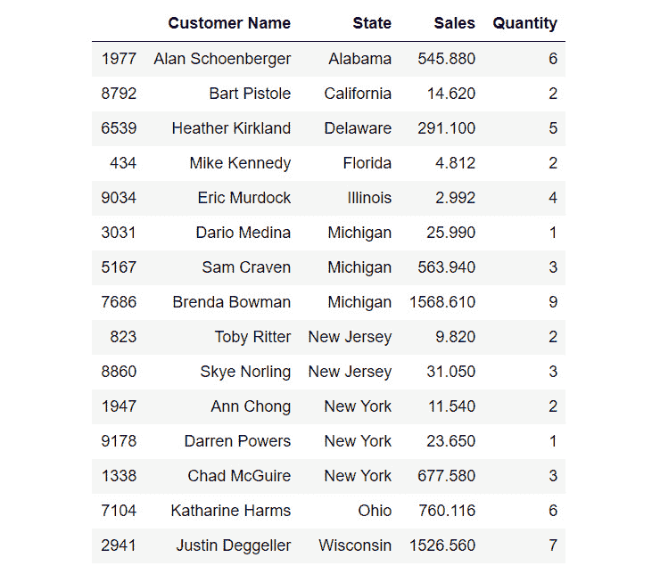

图 4.68：按销售和州排序的 DataFrame

注意

要访问此特定部分的源代码，请参阅[`packt.live/3dcWNXi`](https://packt.live/3dcWNXi)。

您也可以在此处在线运行此示例：[`packt.live/30UqwSn`](https://packt.live/30UqwSn)。

`pandas`库通过`apply`方法提供了处理任意复杂度的用户定义函数的巨大灵活性。与原生的 Python `apply`函数类似，此方法接受用户定义的函数和额外的参数，并在对特定列的每个元素应用函数后返回一个新列。

例如，假设我们想要根据销售价格列创建一个如高/中/低之类的分类特征列。请注意，这是一个基于某些条件（销售阈值）将数值值转换为分类因子（字符串）的过程。

## 练习 4.12：使用 apply 方法的用户定义函数的灵活性

在这个练习中，我们将创建一个名为`categorize_sales`的用户定义函数，该函数根据价格对销售数据进行分类。如果`价格`小于`50`，则归类为`低`，如果`价格`小于`200`，则归类为`中`，如果没有落入这两个类别之一，则归类为`高`。

注意

Superstore 文件可在此处找到：[`packt.live/3dcVnMs`](https://packt.live/3dcVnMs)。

然后，我们将从`superstore`数据集中抽取 100 个随机样本，并使用`apply`方法在`categorize_sales`函数上创建一个新列来存储函数返回的值。为此，执行以下步骤：

1.  使用`pandas`中的`read_excel`方法导入必要的 Python 模块并从 GitHub 读取 Excel 文件：

    ```py
    import numpy as np
    import pandas as pd
    import matplotlib.pyplot as plt
    df = pd.read_excel("../datasets/Sample - Superstore.xls")
    df.head()
    ```

    注意

    高亮显示的路径必须根据您系统上文件的位置进行更改。

    输出（部分显示）将如下：

    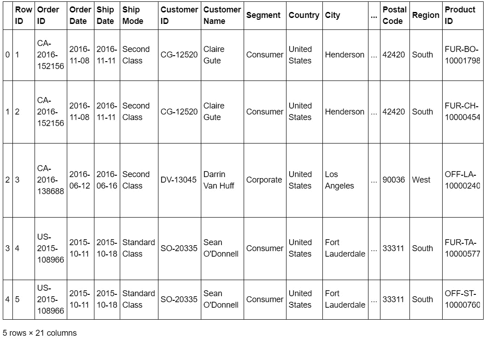

    图 4.69：DataFrame 的部分输出

1.  创建一个用户定义的函数，如下所示：

    ```py
    def categorize_sales(price):
        if price < 50:
            return "Low"
        elif price < 200:
            return "Medium"
        else:
            return "High"
    ```

1.  从数据库中随机抽取`100`条样本记录：

    ```py
    df_sample=df[['Customer Name',\
                  'State','Sales']].sample(n=100)
    df_sample.head(10)
    ```

    输出如下：

    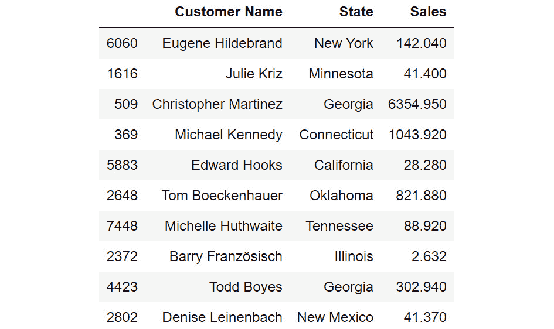

    图 4.70：数据库中的 100 个样本记录

    注意

    你得到的结果将与本练习中显示的结果不同。

1.  使用`apply`方法将分类函数应用于`Sales`列。我们需要创建一个新列来存储函数返回的分类字符串值：

    ```py
    df_sample['Sales Price Category']=df_sample['Sales']\
                                      .apply(categorize_sales)
    df_sample.head(10)
    ```

    输出如下：

    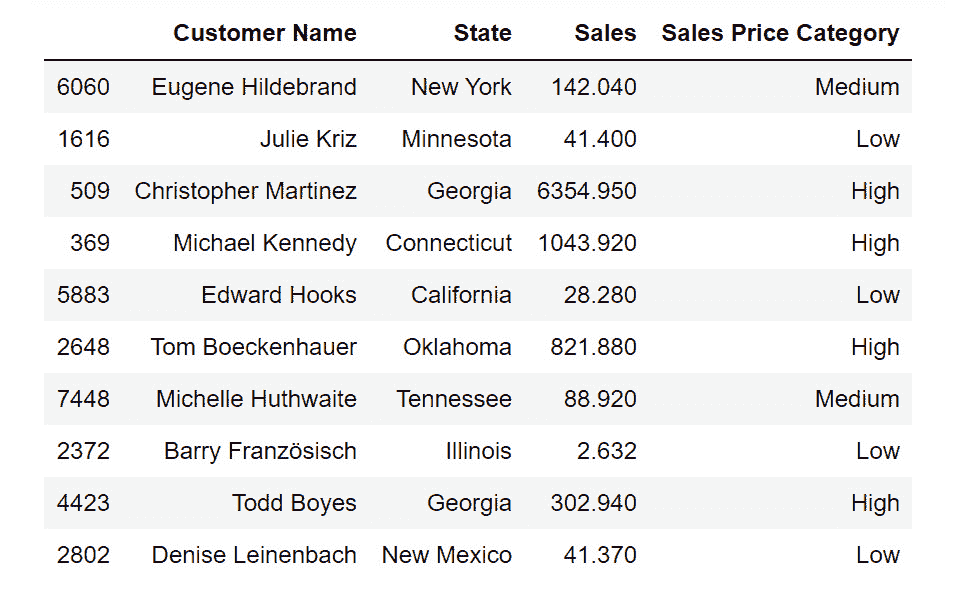

    图 4.71：使用 apply 函数在 Sales 列上操作后的 10 行 DataFrame

    `apply`方法也可以与内置的 Python 原生函数一起使用。

1.  为了练习，让我们创建另一个列来存储客户名称的长度。我们可以使用熟悉的`len`函数来完成此操作：

    ```py
    df_sample['Customer Name Length']=df_sample['Customer Name']\
                                      .apply(len)
    df_sample.head(10)
    ```

    输出如下：

    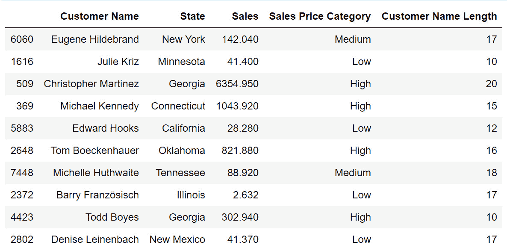

    图 4.72：包含新列的 DataFrame

    我们甚至可以直接将*lambda 表达式*插入到`apply`方法中，以缩短函数的编写。例如，假设我们正在推广我们的产品，并且如果原始价格大于* $200*，我们想显示折扣后的销售价格。

1.  使用`lambda`函数和`apply`方法来完成：

    ```py
    df_sample['Discounted Price']=df_sample['Sales']\
                                  .apply(lambda x:0.85*x if x>200 \
                                  else x)
    df_sample.head(10)
    ```

    输出如下：

    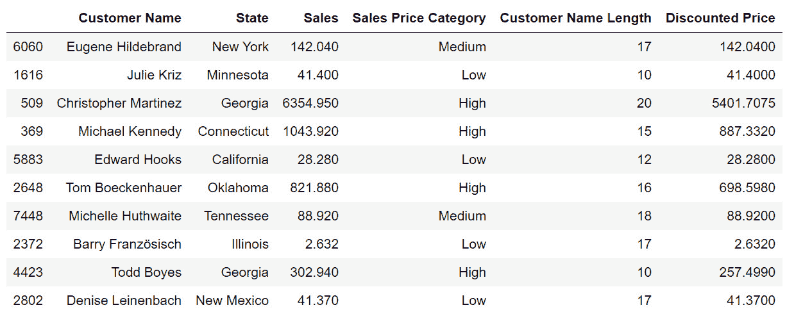

图 4.73：Lambda 函数

注意

Lambda 函数包含一个条件，并且对原始销售价格大于`>$200`的记录应用折扣。

要访问此特定部分的源代码，请参阅[`packt.live/3ddJYwa`](https://packt.live/3ddJYwa)。

您也可以在[`packt.live/3d63D0Y`](https://packt.live/3d63D0Y)上在线运行此示例。

通过完成这个练习，我们知道了如何将函数应用于 DataFrame 的列。这种方法对于超越`pandas`中存在的基函数非常有用。

## 活动四.01：处理成人收入数据集（UCI）

在这个活动中，我们将从 UCI 机器学习门户[`packt.live/2N9lRUU`](https://packt.live/2N9lRUU)的成人收入数据集中检测异常值。

您可以在[`packt.live/2N9lRUU`](https://packt.live/2N9lRUU)找到数据集的描述。我们将使用本章学到的概念，例如子集、应用用户定义的函数、汇总统计、可视化、布尔索引和按组分组，来在一个数据集中找到整个异常值组。我们将创建一个条形图来绘制这个异常值组。最后，我们将使用公共键合并两个数据集。

这些步骤将帮助您解决这个活动：

1.  加载必要的库。

1.  从以下 URL 读取成人收入数据集：[`packt.live/2N9lRUU`](https://packt.live/2N9lRUU)。

1.  创建一个脚本，该脚本将逐行读取文本文件。

1.  将响应变量的名称添加为`Income`到数据集中。

1.  查找缺失值。

1.  通过子集创建只包含年龄、教育和职业的 DataFrame。

1.  以`20`为区间绘制年龄的直方图。

1.  创建一个用于删除空白字符的函数。

1.  使用`apply`方法将此函数应用于所有具有字符串值的列，创建一个新列，将新列的值复制到旧列中，并删除新列。

1.  找出年龄在`30`到`50`之间的人数。

1.  根据年龄和教育分组记录，以找出平均年龄的分布情况。

1.  按职业分组并显示年龄的汇总统计。找出平均年龄最大的职业以及在其劳动力中占比最大的 75 百分位数以上的职业。

1.  使用`subset`和`groupBy`来查找异常值。

1.  在条形图上绘制异常值。它应该看起来像这样：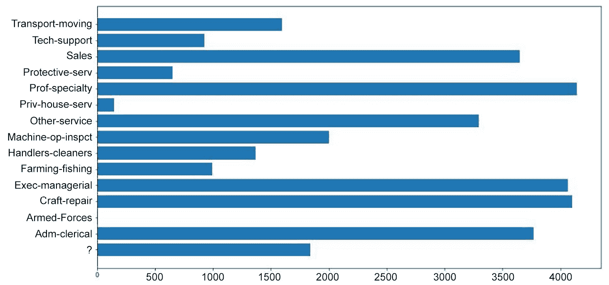

    图 4.74：显示异常值的条形图

1.  使用公共键合并两个 DataFrame 以删除重复值。

    输出应该看起来像这样：

    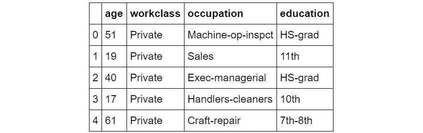

图 4.75：合并后的 DataFrame

注意

本活动的解决方案可以通过此链接找到。

如您所见，我们现在有一个单一的 DataFrame，因为我们已经将两个 DataFrame 合并成了一个。

有了这些，我们就完成了这个活动和本章。

# 摘要

在本章中，我们深入研究了`pandas`库，以学习高级数据处理技术。我们从 DataFrame 的高级子集和过滤开始，通过学习布尔索引和条件选择数据子集来结束。我们还介绍了如何设置和重置 DataFrame 的索引，尤其是在初始化时。

接下来，我们学习了一个与传统的数据库系统有着深刻联系的特定主题——`groupBy`方法。然后，我们深入探讨了数据整理的重要技能——检查和处理缺失数据。我们展示了 pandas 如何使用各种插补技术来处理缺失数据。我们还讨论了删除缺失值的方法。此外，还展示了连接和合并 DataFrame 对象的方法和用法示例。我们看到了`join`方法，以及它与 SQL 中类似操作的比较。

最后，我们涵盖了 DataFrame 上的各种有用方法，例如随机抽样、`unique`、`value_count`、`sort_values`和交叉表功能。我们还展示了如何使用`apply`方法在 DataFrame 上运行任意用户定义的函数的示例。

在学习了使用`numpy`和`pandas`库的基本和高级数据整理技术之后，数据获取的自然问题随之而来。在下一章中，我们将向您展示如何处理各种数据源；也就是说，您将学习如何在`pandas`中从不同的来源读取表格格式的数据。
