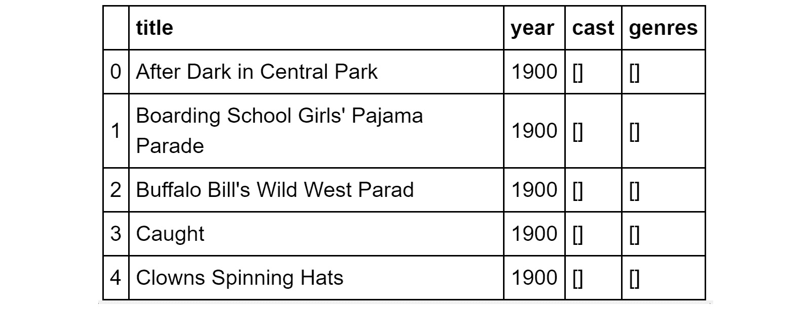

# 第五章：5. 熟悉不同类型的数据源

概述

本章将为您提供将 CSV、Excel 和 JSON 文件读取到 pandas DataFrame 的技能。您将学习如何将 PDF 文档和 HTML 表格读取到 pandas DataFrame 中，并使用如 Beautiful Soup 这样功能强大且易于使用的库执行基本的网络抓取操作。您还将了解如何从门户网站中提取结构和文本信息。到本章结束时，您将能够将网络抓取等数据整理技术应用于现实世界。

# 简介

到目前为止，在这本书中，我们一直专注于研究 pandas DataFrame 对象作为应用整理技术的主体数据结构。在本章中，我们将学习各种技术，通过这些技术我们可以从外部源将数据读取到 DataFrame 中。其中一些来源可能是基于文本的（例如 CSV、HTML 和 JSON），而其他来源可能是二进制的（即不是 ASCII 格式；例如，来自 Excel 或 PDF）。我们还将学习如何处理存在于网页或 HTML 文档中的数据。

能够处理和从各种来源提取有意义的数据对数据从业者来说至关重要。数据可以，并且经常以各种形式和风味出现。能够将数据转换为对执行预测或其他下游任务有用的形式是至关重要的。

随着我们详细介绍了使用 NumPy 和 pandas 进行基本操作，在本章中，我们将经常跳过一些琐碎的代码片段，例如查看表格、选择列和绘图。相反，我们将专注于展示我们在此处想要学习的新主题的代码示例。

# 从不同来源读取数据

数据整理专业人士最宝贵且最广泛使用的技能之一是能够从各种来源提取和读取数据到结构化格式。现代分析管道依赖于这些专业人士的能力和技能，构建一个强大的系统，可以扫描和吸收各种数据源，以构建和分析富含模式模型。这类特征丰富、多维度的模型将具有高度的预测和泛化准确性。在任何数据驱动产品中，它们都将受到利益相关者和最终用户的重视。在本章的第一部分，我们将探讨各种数据源以及它们如何被导入到 pandas DataFrame 中，从而赋予数据整理专业人士极其宝贵的数据摄取知识。

## 本章节提供的数据文件

由于这个主题是关于从各种数据源读取数据，在接下来的练习中，我们将使用各种类型的小文件。所有数据文件都包含在代码仓库中，以及 Jupyter 笔记本。

注意

所有数据文件都可以通过以下链接访问：[`packt.live/3fAWg3f`](https://packt.live/3fAWg3f)。

## 本章节需要安装的库

由于本章涉及读取各种格式的文件，我们需要额外的库和软件平台的支持来实现我们的目标。

在我们安装这些库之前，请确保您的系统上已安装 **Java 开发工具包 (JDK)**。如果没有，请访问以下链接进行安装：

[`www.oracle.com/in/java/technologies/javase-downloads.html`](https://www.oracle.com/in/java/technologies/javase-downloads.html).

一旦您进入网站，点击名为“JDK 下载”的链接。然后，根据您的操作系统下载并安装 JDK。安装完成后，请确保重启您的系统，尤其是如果您正在使用 Windows。如果在安装后遇到问题，请检查您是否已正确设置 PATH 系统变量。要了解如何做到这一点，请参阅 [`www.java.com/en/download/help/path.xml`](https://www.java.com/en/download/help/path.xml)。

一旦 JDK 安装完成，继续安装必要的库。在您的 Jupyter Notebook 单元中执行以下命令：

```py
!pip install tabula-py xlrd lxml
```

注意

不要忘记每行代码前的 `!`。这个位于每个命令前面的感叹号让 Jupyter 运行时知道单元格中的内容是一个 `bash` 命令，而不是 Python 代码的一行。

## 使用 Pandas 读取数据

`pandas` 库提供了一个名为 `read_csv` 的简单方法，用于从逗号分隔的文本文件或 `.csv` 中读取表格格式的数据。这特别有用，因为 `.csv` 是一种轻量级但极其方便的数据交换格式，适用于许多应用程序，包括涉及机器生成数据的领域。它不是专有格式，因此被各种数据生成源普遍使用。

通常，`.csv` 文件有两个部分。`.csv` 文件的第 一行通常被视为标题行。因此，第一行中的每个列（两个连续逗号之间的每个单词或单词组）都应该指示列的名称。这是非常有价值的信息，因为没有它，通常很难说每个代表什么类型的数据。在第一行之后，我们有数据行，其中每一行代表一个数据点，每一列代表这些数据点的值。

## 练习 5.01：从 CSV 文件中读取数据时的标题处理

在这个练习中，您将看到如何从 `.csv` 文件中读取数据。该文件可在此处找到 [`packt.live/3fDMCNp`](https://packt.live/3fDMCNp)。这个练习演示了如何处理标题以及当标题缺失时应该做什么。有时，您会遇到标题不存在的情况，您可能需要添加适当的标题或自己的列名。让我们看看如何做到这一点：

1.  打开一个新的 Jupyter Notebook，并使用以下代码读取示例 `.csv` 文件（带有标题），然后检查生成的 DataFrame，如下所示：

    ```py
    import numpy as np
    import pandas as pd
    df1 = pd.read_csv("../datasets/CSV_EX_1.csv")
    df1
    ```

    注意

    在整个练习过程中，不要忘记根据系统中的位置更改 CSV 文件的路径（突出显示）。

    输出如下：

    ![图 5.1：示例 CSV 文件的输出]

    ![图片 B15780_05_01.jpg]

    图 5.1：示例 CSV 文件的输出

1.  使用`pandas` DataFrame 读取没有标题的`.csv`文件：

    ```py
    df2 = pd.read_csv("header=None to avoid this.
    ```

1.  通过将`header`设置为`None`来读取`.csv`文件，如下所示：

    ```py
    df2 = pd.read_csv("0. This is how the pandas library treats a headerless CSV file when you ask it not to consider the first line (which is a data row in this case) as header:  Figure 5.3: A CSV file with numeric column headersThis may be fine for data analysis purposes, but if you want the DataFrame to have meaningful headers, then you will have to add them using the `names` argument.
    ```

1.  添加`names`参数以获取正确的标题：

    ```py
    df2 = pd.read_csv("../datasets/CSV_EX_2.csv",\
                      header=None, names=['Bedroom','Sq.ft',\
                                          'Locality','Price($)'])
    df2
    ```

    最后，您将得到一个看起来像这样的 DataFrame：

    ![图 5.4：具有正确列标题的 CSV 文件]

    ![图片 B15780_05_04.jpg]

图 5.4：具有正确列标题的 CSV 文件

如前图所示，标题已添加到正确的位置。

注意

要访问此特定部分的源代码，请参阅[`packt.live/3hxmAgm`](https://packt.live/3hxmAgm)。

您也可以在[`packt.live/3eaToda`](https://packt.live/3eaToda)在线运行此示例。

到目前为止，我们一直很舒服地从以逗号作为分隔符的文件中读取。让我们看看以下练习，我们将从不以逗号分隔值的 CSV 文件中读取。

## 练习 5.02：从不以逗号为分隔符的 CSV 文件中读取

遇到原始数据文件，其中分隔符/定界符是字符而不是逗号的情况相当普遍。本练习将演示在这种情况下如何从文件中读取数据。

注意

文件可在此处找到：[`packt.live/2YPEJgO`](https://packt.live/2YPEJgO)。

让我们按以下步骤进行：

1.  使用`pandas` DataFrames 读取`.csv`文件：

    ```py
    import numpy as np
    import pandas as pd
    df3 = pd.read_csv("; separator was not expected, and the reading is flawed. A simple workaround is to specify the separator/delimiter explicitly in the read function.
    ```

1.  指定分隔符：

    ```py
    df3 = pd.read_csv("../datasets/CSV_EX_3.csv",sep=';')
    df3
    ```

    输出如下：

    ![图 5.6：从 DataFrame 中移除的分号]

    ![图片 B15780_05_06.jpg]

图 5.6：从 DataFrame 中移除的分号

如我们所见，当在`read_csv`函数中指定分隔符时，从 csv 文件中读取相当简单。

注意

要访问此特定部分的源代码，请参阅[`packt.live/2Na4oM0`](https://packt.live/2Na4oM0)。

您也可以在[`packt.live/3fvdm2g`](https://packt.live/3fvdm2g)上运行此示例。

在以下练习中，我们将看到如果您的 CSV 文件已经包含标题，如何跳过标题。

## 练习 5.03：跳过并重命名 CSV 文件的标题

本练习将演示如何跳过 CSV 文件的标题并添加自己的标题。为此，您必须特别设置`header=0`。如果您尝试将`names`变量设置为您的`header`列表，可能会发生意外的事情。请按照以下步骤操作：

1.  向具有标题的`.csv`文件添加`names`，如下所示：

    ```py
    import numpy as np
    import pandas as pd
    df4 = pd.read_csv("../datasets/CSV_EX_1.csv",\
                      names=['A','B','C','D'])
    df4
    ```

    注意

    在整个练习过程中，不要忘记根据系统中的位置更改 CSV 文件的路径（突出显示）。

    输出如下：

    ![图 5.7：具有重叠标题的 CSV 文件]

    ![图片 B15780_05_07.jpg]

    图 5.7：具有重叠标题的 CSV 文件

1.  为了避免这种情况，将`header`设置为 0 并提供一个`names`列表：

    ```py
    df4 = pd.read_csv("../datasets/CSV_EX_1.csv",header=0,\
                      names=['A','B','C','D'])
    df4
    ```

    输出如下：

    

图 5.8：具有定义标题的 CSV 文件

请记住，这种表示目前只是在内存中，并且仅在笔记本的当前会话中可用；它不会反映在物理 CSV 文件中。原始文件由于我们的操作而未发生变化。

注意

要访问此特定部分的源代码，请参阅 [`packt.live/30QwEeA`](https://packt.live/30QwEeA)。

您也可以在此在线运行此示例 [`packt.live/315gOgr`](https://packt.live/315gOgr)。

我们观察了一些可以在文件标题上进行的操作。然而，一些 CSV 文件的结构可能比我们迄今为止使用的简单结构更复杂。在接下来的练习中，我们将发现一些处理这种复杂结构的技巧。

## 练习 5.04：在读取 CSV 文件时跳过初始行和页脚

在这个练习中，我们将跳过前几行，因为，大多数情况下，CSV 数据文件的前几行是关于数据源或类似信息的元数据，这些信息不会被读入表格。此外，我们还将删除文件的页脚，有时页脚可能包含不太有用的信息。让我们看看我们如何使用以下截图中的示例来完成这项操作：


图 5.9：CSV 文件的内容

注意

CSV 文件的前两行是不相关的数据。文件可以在这里找到 [`packt.live/30SdvJh`](https://packt.live/30SdvJh)

1.  读取 CSV 文件并检查结果：

    ```py
    import numpy as np
    import pandas as pd
    df5 = pd.read_csv("../datasets/CSV_EX_skiprows.csv")
    df5
    ```

    注意

    在整个练习过程中，不要忘记根据您系统上 CSV 文件的位置更改路径（突出显示）。

    输出如下：

    

    图 5.10：带有意外错误的 DataFrame

1.  跳过前两行并读取文件：

    ```py
    df5 = pd.read_csv("skipfooter and the engine='python' option to enable this. There are two engines for these CSV reader functions, based on C or Python, of which only the Python engine supports the skipfooter option.
    ```

1.  在 Python 中使用`skipfooter`选项：

    ```py
    df6 = pd.read_csv("../datasets/CSV_EX_skipfooter.csv",\
                      skiprows=2,skipfooter=1, engine='python')
    df6
    ```

    输出如下：

    

图 5.13：没有页脚的 DataFrame

注意

要访问此特定部分的源代码，请参阅 [`packt.live/2CbehGO`](https://packt.live/2CbehGO)。

您也可以在此在线运行此示例 [`packt.live/2Ycw0Gp`](https://packt.live/2Ycw0Gp)。

我们已经看到了如何从文件中读取值，跳过标题和页脚。在处理来自多个不同来源收集的数据时，这通常非常有用，尤其是在文件包含不必要和垃圾信息的情况下。

## 只读取前 N 行

在许多情况下，我们可能不想读取整个数据文件，而只想读取前几行。这对于非常大的数据文件尤其有用，我们可能只想读取前几百行来检查初始模式，然后决定之后读取整个数据。读取整个文件可能需要很长时间，并且可能会减慢整个数据处理管道的速度。

在`read_csv`函数中有一个简单的选项，称为`nrows`，它使我们能够做到这一点。我们将指定我们想要读取的行数，并将其作为参数传递给`nrows`，如下所示：

```py
df7 = pd.read_csv("../datasets/CSV_EX_1.csv",nrows=2)
df7
```

备注

路径（已突出显示）需要根据文件在系统中的保存位置进行更改。

输出如下：

![图 5.14：包含 CSV 文件前几行的 DataFrame]

![img/B15780_05_014.jpg]

图 5.14：包含 CSV 文件前几行的 DataFrame

只读取选定行数的能力非常有用，特别是当你处理大型 CSV 文件时。

## 练习 5.05：结合 skiprows 和 nrows 以小块读取数据

本练习将演示我们如何从一个非常大的数据文件中读取。要做到这一点，我们可以巧妙地结合`skiprows`和`nrows`来以预定的块大小读取大文件。我们将从包含美国波士顿地区房价数据的`Boston_housing.csv`文件中读取。它包含有关城镇人均犯罪率和每栋住宅平均房间数量的信息。为此，让我们按照以下步骤进行：

备注

每个练习都直接从上一个练习继续。你不需要每次都打开一个新的 Jupyter Notebook。

数据集可以在以下位置找到：[`packt.live/3fEIH2z`](https://packt.live/3fEIH2z)

1.  创建一个列表来存储将要存储的 DataFrames：

    ```py
    list_of_dataframe = []
    ```

1.  将要读取的行数存储到变量中：

    ```py
    rows_in_a_chunk = 10
    ```

1.  创建一个变量来存储要读取的块的数量：

    ```py
    num_chunks = 5
    ```

1.  创建一个虚拟 DataFrame 以获取列名：

    ```py
    import pandas as pd
    df_dummy = pd.read_csv("../datasets/Boston_housing.csv",nrows=2)
    colnames = df_dummy.columns
    ```

    备注

    在整个练习过程中，不要忘记根据系统中的位置更改 CSV 文件的路径（已突出显示）。

1.  遍历 CSV 文件以每次只读取固定数量的行：

    ```py
    for i in range(0,num_chunks*rows_in_a_chunk,rows_in_a_chunk):
        df = pd.read_csv("Boston_housing.csv", header=0,\
                         skiprows=i, nrows=rows_in_a_chunk,\
                         names=colnames)
        list_of_dataframe.append(df)
    ```

    备注

    这个特定的步骤不会显示任何输出，因为值正在被追加到列表中。

注意观察在`range`函数内部如何设置`iterator`变量以将其分割成块。假设块的数量为`5`，每个块中的行数为`10`，那么迭代器的范围将是`(0,5*10,10)`，其中最后的`10`是步长，即它将以`(0,9,19,29,39,49)`的索引进行迭代。

备注

要访问此特定部分的源代码，请参阅[`packt.live/3fGmBwZ`](https://packt.live/3fGmBwZ)。

你也可以在[`packt.live/3hDbVAJ`](https://packt.live/3hDbVAJ)上在线运行此示例。

## 设置 skip_blank_lines 选项

默认情况下，`read_csv`忽略空白行，这意味着如果有行条目包含`NaN`值，`read_csv`函数将不会读取该数据。然而，在某些情况下，您可能希望将它们读取为`NaN`，以便您可以计算原始数据文件中存在的空白条目数量。在某些情况下，这是默认数据流质量一致性的指标。为此，您必须禁用`skip_blank_lines`选项：

```py
df9 = pd.read_csv("../datasets/CSV_EX_blankline.csv",\
                  skip_blank_lines=False)
df9
```

输出如下：

注意

路径（已突出显示）需要根据文件在系统中的位置进行更改。


图 5.15：包含空白行的.csv 文件的 DataFrame

在下一节中，我们将从 ZIP 文件中读取 CSV 数据。

## 从 ZIP 文件中读取 CSV 数据

这是`pandas`的一个很棒的功能，它允许您直接从压缩文件（如`.zip`、`.gz`、`.bz2`或`.xz`）中读取。唯一的要求是，目标数据文件（CSV）应该是压缩文件中的唯一文件。例如，我们可能需要压缩一个大的 csv 文件，在这种情况下，它将是`.zip`文件夹中的唯一文件。

在本例中，我们使用`7-Zip`程序压缩了示例 CSV 文件，并直接使用`read_csv`方法从中读取：

```py
df10 = pd.read_csv('../datasets/CSV_EX_1.zip')
df10
```

输出如下：


图 5.16：压缩 CSV 文件的 DataFrame

接下来，我们将把注意力转向 Microsoft Excel 文件。结果证明，我们在之前的 CSV 文件练习中学到的许多选项和方法也直接适用于读取 Excel 文件。

## 使用 sheet_name 读取 Excel 文件和处理不同的 sheet_name

在本节中，我们将关注读取 Excel 文件的方法之间的差异。Excel 文件可以包含多个工作表，我们可以通过传递特定的参数（即`sheet_name`）来读取特定的工作表。

例如，在`Housing_data.xlsx`文件中，我们有三个工作表。以下代码将它们逐个读取到三个单独的 DataFrame 中：

```py
df11_1 = pd.read_excel("../datasets/Housing_data.xlsx",\
                       sheet_name='Data_Tab_1')
df11_2 = pd.read_excel("../datasets/Housing_data.xlsx",\
                       sheet_name='Data_Tab_2')
df11_3 = pd.read_excel("../datasets/Housing_data.xlsx",\
                       sheet_name='Data_Tab_3')
```

如果 Excel 文件有多个不同的工作表，但`sheet_name`参数设置为`None`，则`read_excel`函数将返回一个有序字典。这个有序的`dict`将包含所有工作表的数据，顶级键将指示工作表的名称。之后，我们可以简单地遍历该字典或其键来检索单个 DataFrame。

让我们考虑以下示例：

```py
dict_df = pd.read_excel("../datasets/Housing_data.xlsx",\
                        sheet_name=None)
dict_df.keys()
```

输出如下：

```py
odict_keys(['Data_Tab_1', 'Data_Tab_2', 'Data_Tab_3'])
```

因此，我们可以使用不同的键访问这些单独的工作表。

## 练习 5.06：读取通用分隔文本文件

在这个练习中，我们将从通用定界文本文件中读取，并看到这可以像读取 CSV 文件一样容易。然而，如果我们使用的是空格或制表符之外的任何分隔符，我们必须使用正确的分隔符。为了展示其作用，让我们按照以下步骤进行：

1.  使用`read_table`命令从`.txt`文件中读取数据：

    ```py
    import pandas as pd
    df13 = pd.read_table(".txt extension will result in the preceding DataFrame if read without explicitly setting the separator. As you can see, for each value read, there is a comma appended. In this case, we have to set the separator explicitly. 
    ```

1.  在`sep`变量中将分隔符设置为逗号，如下所示：

    ```py
    df13 = pd.read_table("../datasets/Table_EX_1.txt", sep=',')
    df13
    ```

    输出如下：

    

图 5.18：使用逗号分隔符读取的 DataFrame

我们可以从图中看到数据已按预期从`.txt`文件中读取。

注意

要访问此特定部分的源代码，请参阅[`packt.live/30UUdD8`](https://packt.live/30UUdD8)。

你也可以在[`packt.live/37F57ho`](https://packt.live/37F57ho)上在线运行此示例。

现在我们已经看到了从`csv`文件中读取数据的各种方法，在下一节中，让我们专注于直接从 URL 读取数据。

## 直接从 URL 读取 HTML 表格

`pandas`库允许我们直接从 URL 读取 HTML 表格。这意味着该库已经内置了一种 HTML 解析器，它会处理给定页面的 HTML 内容并尝试从页面中提取各种表格。

注意

`pandas`库中的`read_html`方法返回一个 DataFrame 列表（即使页面只有一个 DataFrame），你必须从列表中提取相关的表格。

考虑以下示例：

```py
url = 'http://www.fdic.gov/bank/individual/failed/banklist.html'
list_of_df = pd.read_html(url)
df14 = list_of_df[0]
df14.head()
```

这些结果如下所示的数据框中：


图 5.19：读取 HTML 表格的结果

在以下练习中，我们将探索更多整理技术以获取所需格式的数据。正如前一个练习中讨论的，`read_html`这个 HTML 读取函数几乎总是为给定 HTML 页面返回多个表格，我们必须进一步解析列表以提取我们感兴趣的特定表格。

## 练习 5.07：进一步整理以获取所需数据

在这个练习中，我们将处理 2016 年夏季奥运会奖牌榜（按国家划分）的表格。我们可以轻松搜索以获取包含这些数据的维基百科页面，然后将其传递给`pandas`。我们将对这个数据应用一些整理技术以获得输出。为此，让我们按照以下步骤进行：

1.  使用`read_html`命令从包含 2016 年夏季奥运会记录的维基百科页面中读取：

    ```py
    import pandas as pd
    list_of_df = pd.read_html("https://en.wikipedia.org/wiki/"\
                              "2016_Summer_Olympics_medal_table",\
                              header=0)
    ```

1.  检查返回列表的长度。我们会看到它是`7`：

    ```py
    len(list_of_df)
    ```

    输出如下：

    ```py
    7
    ```

1.  要查找特定的表格，运行一个简单的循环。我们使用 DataFrame 的`shape`属性来检查每个 DataFrame 的行数和列数：

    ```py
    for t in list_of_df:
        print(t.shape)
    ```

    输出如下：

    ```py
    (1, 1)
    (87, 6)
    (10, 9)
    (0, 2)
    (1, 2)
    (4, 2)
    (1, 2)
    ```

    看起来这个列表中的第二个元素就是我们正在寻找的表格。

1.  从表格中提取第二个元素：

    ```py
    df15=list_of_df[1]
    df15.head()
    ```

    输出如下：

    

图 5.20：第二张表的数据输出

从前面的表格中，我们可以观察到包含维基百科页面记录的数据已以表格格式读取。

备注

要访问此特定部分的源代码，请参阅 [`packt.live/3de6LYw`](https://packt.live/3de6LYw)。

您也可以在 [`packt.live/2Bk9e6q`](https://packt.live/2Bk9e6q) 上在线运行此示例。

## 从 JSON 文件读取

在过去 15 年中，JSON 已经成为网络数据交换的通用格式。如今，它几乎成为所有公开可用的网络 API 的首选格式，并且也常用于私有网络 API。它是一种基于键值对和有序列表的无模式、基于文本的结构化数据表示。`pandas` 库提供了将数据直接从 JSON 文件读取到 DataFrame 的出色支持。

## 练习 5.08：从 JSON 文件读取

在这个练习中，我们将从 `movies.json` 文件中读取数据。这个文件包含了自 1900 年以来几乎所有主要电影的演员阵容、类型、标题和发行年份信息。让我们按以下步骤进行：

备注

`.json` 文件可以在 [`packt.live/3d7DO0l`](https://packt.live/3d7DO0l) 找到。

1.  将文件中的电影列表提取到 DataFrame 中。

    ```py
    import pandas as pd
    df16 = pd.read_json("../datasets/movies.json")
    df16.head()
    ```

    备注

    不要忘记根据您系统上的位置更改 JSON 文件的路径（已突出显示）。

    输出如下：

    

    图 5.21：显示电影列表的 DataFrame

1.  要查找标题为“复仇者联盟”的演员阵容，请使用过滤：

    ```py
    cast_of_avengers = df16[(df16['title']=="The Avengers") \
                       & (df16['year']==2012)]['cast']
    print(list(cast_of_avengers))
    ```

    输出将如下所示：

    ```py
     [['Robert Downey, Jr.', 'Chris Evans', 'Mark Ruffalo', 
       'Chris Hemsworth', 'Scarlett Johansson', 'Jeremy Renner', 
       'Tom Hiddleston', 'Clark Gregg', 'Cobie Smulders', 
       'Stellan SkarsgÃyrd', 'Samuel L. Jackson']]
    ```

    备注

    要访问此特定部分的源代码，请参阅 [`packt.live/37ISQJ8`](https://packt.live/37ISQJ8)。

    您也可以在 [`packt.live/2YeymVv`](https://packt.live/2YeymVv) 上在线运行此示例。

## 读取 PDF 文件

在各种数据源类型中，PDF 格式通常是最难解析的。虽然有一些流行的 Python 包用于处理 PDF 文件的一般页面格式，但用于从 PDF 文件中提取表格的最佳库是 `tabula-py`。

从 GitHub 页面来看，`tabula-py` 是 `tabula-java` 的简单 Python 封装，可以从 PDF 中读取表格。您可以从 PDF 中读取表格并将它们转换为 `pandas` DataFrame。`tabula-py` 库还允许您将 PDF 文件转换为 CSV/TSV/JSON 文件。

备注

确保您已根据本章标题为“本章需要安装的库”中详细说明的说明安装了 `tabula`。

在运行此代码之前，您还需要在系统上安装以下包，但它们是免费且易于安装的；您可以使用 `pip install` 从笔记本会话中安装它们，就像您过去所做的那样：

+   `urllib3`

+   `pandas`

+   `pytest`

+   `flake8`

+   `distro`

+   `pathlib`

## 练习 5.09：从 PDF 文件中读取表格数据

在本练习中，我们将首先从 [`packt.live/2Ygj4j7`](https://packt.live/2Ygj4j7) 的 PDF 文件的两个不同页面以表格格式读取，然后我们将执行一些简单的操作来处理这些文件的标题。

注意

在继续之前，请确保您已根据本章早期标题为 *本章需要安装的库* 中详细说明的说明安装了 `tabula`。

让我们按以下步骤进行：

1.  以下代码从两页中检索表格并将它们连接成一个表格：

    ```py
    from tabula import read_pdf
    df18_1 = read_pdf('../datasets/Housing_data.pdf',\
                      pages=[1], pandas_options={'header':None})
    df18_1
    ```

    注意

    在整个练习过程中，不要忘记根据您的系统上 PDF 的位置更改路径（突出显示）。

    输出如下：

    ![图 5.22：通过合并 PDF 中跨越的表格得到的 DataFrame]

    PDF 中的两页

    ![img/B15780_05_022.jpg]

    图 5.22：通过合并 PDF 中跨越两页的表格得到的 DataFrame

1.  使用以下命令从同一 PDF 的另一个页面检索表格：

    ```py
    df18_2 = read_pdf('../datasets/Housing_data.pdf',\
                      pages=[2], pandas_options={'header':None})
    df18_2
    ```

    输出如下：

    ![图 5.23：显示来自另一页面的表格的 DataFrame]

    ![img/B15780_05_023.jpg]

    图 5.23：显示来自另一页面的表格的 DataFrame

1.  要连接从前两个步骤中得到的表格，执行以下代码：

    ```py
    import pandas as pd
    df1 = pd.DataFrame(df18_1)
    df2 = pd.DataFrame(df18_2)
    df18=pd.concat([df1,df2],axis=1)
    df18.values.tolist()
    ```

    输出如下：

    ![图 5.24：通过连接两个表格得到的 DataFrame]

    ![img/B15780_05_024.jpg]

    图 5.24：通过连接两个表格得到的 DataFrame

    在 PDF 提取过程中，大多数情况下，标题将难以自动提取。

1.  在 `read-pdf` 函数中将 `names` 参数设置为 `pandas_option` 以传递列名列表，如下所示：

    ```py
    names = ['CRIM','ZN','INDUS','CHAS','NOX','RM','AGE','DIS',\
             'RAD','TAX','PTRATIO','B','LSTAT','PRICE']
    df18_1 = read_pdf('../datasets/Housing_data.pdf',pages = [1], \
                      pandas_options = {'header':None,\
                                        'names':names[:10]})
    df18_2 = read_pdf('../datasets/Housing_data.pdf',pages = [2],\
                      pandas_options = {'header':None,\
                                        'names':names[10:]})
    df1 = pd.DataFrame(df18_1)
    df2 = pd.DataFrame(df18_2)
    df18 = pd.concat([df1,df2],axis = 1)
    df18.values.tolist()
    ```

    输出如下：

![图 5.25：具有正确列标题的 PDF 数据 DataFrame]

![img/B15780_05_025.jpg]

图 5.25：具有正确列标题的 PDF 数据 DataFrame

注意

要访问本节的具体源代码，请参阅 [`packt.live/2YcHz0v`](https://packt.live/2YcHz0v)。

本节目前还没有在线交互示例，需要本地运行。

我们将在本章末尾进行一个完整的活动，即从 PDF 报告中读取表格并处理它们。让我们深入了解网页抓取以及用于此目的的库 Beautiful Soup 4。

# Beautiful Soup 4 和网页解析简介

对于收集和格式化数据的人来说，阅读和理解网页的能力至关重要。例如，考虑收集关于电影并为其下游系统格式化数据这项任务。从 IMDb 等网站获取电影数据库的数据最佳，而这些数据并非以良好的形式（如 CSV 或 JSON）预先打包，因此你需要知道如何下载和读取网页。

你还需要具备网页结构的知识，这样你才能设计一个系统，可以从整个网页中搜索（查询）特定的信息，并从中获取其值。这涉及到理解标记语言的语法，并能够编写可以解析它们的代码。做这件事，同时考虑到所有边缘情况，对于像 HTML 这样的事情来说已经非常复杂了，如果你将定制标记语言的范围扩展到包括 XML，那么这将成为一个团队的全职工作。

幸运的是，我们正在使用 Python，Python 有一个非常成熟和稳定的库，为我们处理所有复杂的任务。这个库叫做 `BeautifulSoup`（目前处于第 4 版，因此从现在起我们将简称为 `bs4`）。`bs4` 是一个从 HTML 或 XML 文档中获取数据的库，它为你提供了一种优雅、规范、惯用的方式来导航和查询文档。它不包含解析器，但它支持不同的解析器。

## HTML 的结构

在我们跳入 `bs4` 并开始使用它之前，我们需要检查 HTML 文档的结构。**超**文本**标记****语言**是一种向网络浏览器说明网页组织结构的方式，意味着哪些类型的元素（文本、图像、视频等）来自哪里，它们在页面内的位置，它们的样式，它们包含的内容，以及它们如何响应用户输入。HTML5 是 HTML 的最新版本。一个 HTML 文档可以被看作是一棵树，正如我们可以在以下图中看到的那样：


图 5.26：HTML 结构

树的每个节点代表文档中的一个元素。元素是以 `<` 开头并以 `>` 结尾的任何东西。例如，`<html>`、`<head>`、`<p>`、`<br>`、`` 等都是各种 HTML 元素。一些元素有起始和结束元素，其中结束元素以 `</` 开头，并且与起始元素具有相同的名称，例如 `<p>` 和 `</p>`，它们可以包含任意数量的其他类型的元素。一些元素没有结束部分，例如 `<br/>` 元素，它们不能包含任何内容。

在这一点上，我们还需要了解关于元素的其他唯一信息是，元素可以具有属性，这些属性用于修改元素的默认行为。例如，一个 `<a>` 锚点元素需要一个 `href` 属性来告诉浏览器当点击特定的 `<a>` 时应该导航到哪个网站，如下所示：`<a href="http://cnn.com">`。“CNN 新闻频道”，`</a>`，当点击时会带你到 [cnn.com](http://cnn.com)：


图 5.27：CNN 新闻频道的超链接

因此，当你处于树的某个特定元素时，你可以访问该元素的子元素以获取它们的内容和属性。

带着这些知识，让我们看看我们如何从 HTML 文档中读取和查询数据。

在这个主题中，我们将介绍网页的读取和解析，但我们不会从实时网站请求它们。相反，我们从磁盘读取它们。关于从互联网读取它们的章节将在未来的章节中介绍。

## 练习 5.10：使用 Beautiful Soup 读取 HTML 文件并提取其内容

在这个练习中，我们将做最简单的事情。我们将导入`Beautiful Soup`或`bs4`库，然后使用它来读取 HTML 文档。然后，我们将检查它返回的不同类型的对象。在完成这个主题的练习时，你应该在文本编辑器中打开示例 HTML 文件（称为`test.html`），以便你可以检查不同的标签及其属性和内容：

1.  导入`bs4`库：

    ```py
    from bs4 import BeautifulSoup
    ```

1.  请下载以下测试 HTML 文件并将其保存到您的磁盘上，然后使用`bs4`从磁盘读取它：

    ```py
    with open("BeautifulSoup object and it will read the contents from the file that the handler is attached to. We will see that the return type is an instance of bs4.BeautifulSoup. This class holds all the methods we need to navigate through the DOM tree that the document represents. 
    ```

1.  使用类中的`prettify`方法以美观的方式打印文件内容，这意味着打印将保持某种类型的良好缩进，如下所示：

    ```py
    print(soup.prettify())
    ```

    输出如下：

    

    图 5.28：HTML 文件的内容

    同样的信息也可以通过使用`soup.contents`成员变量来获取。区别在于：首先，它不会打印出任何美观的内容，其次，它本质上是一个列表。

    如果我们仔细查看 HTML 文件的内容（在单独的文本编辑器中），我们会看到有很多段落标签，或`<p>`标签。让我们从一个这样的`<p>`标签中读取内容。我们可以使用简单的`.`访问修饰符来完成，就像我们会对类的普通成员变量做的那样。

    `bs4`的魔力在于它为我们提供了将标签作为`BeautifulSoup`类实例的成员变量进行解引用的出色方式。在接下来的几个步骤中，我们将读取一个 HTML 文件，然后将 Python 的`open`调用返回的文件句柄直接传递给`BeautifulSoup`类的构造函数。它做了很多事情（包括读取内容然后解析），并返回一个类的实例，我们可以使用它。

1.  读取 HTML 文件：

    ```py
    with open("<p> tag. We saw how to read a tag in the last exercise, but we can easily see the problem with this approach. When we look into our HTML document, we can see that we have more than one `<p>` tag there. How can we access all the `<p>` tags? It turns out that this is easy. 
    ```

1.  使用`findall`方法从标签中提取内容：

    ```py
    with open("6, which is exactly the number of <p> tags in the document. We have seen how to access all the tags of the same type. We have also seen how to get the content of the entire HTML document. 
    ```

1.  现在我们将看看如何获取特定 HTML 标签的内容：

    ```py
    with open(". notation to get the contents of that tag. We saw in the previous step that we can access the entire content of a particular tag. However, HTML is represented as a tree, and we are able to traverse the children of a particular node. There are a few ways to do this.
    ```

1.  第一种方式是通过使用任何`bs4`实例的`children`生成器，如下所示：

    ```py
    with open("children generator is that it only takes into account the immediate children of the tag. We have <tbody> under <table>, and our whole table structure is wrapped in it. That's why it was considered a single child of the <table> tag. We have looked into how to browse the immediate children of a tag. We will see how we can browse all the possible children of a tag and not only the immediate one. 
    ```

1.  要做到这一点，我们使用`bs4`实例的`descendants`生成器，如下所示：

    ```py
    with open("../datasets/test.html", "r") as fd:
        soup = BeautifulSoup(fd)
        table = soup.table
        children = table.children
        des = table.descendants
        print(len(list(children)), len(list(des)))
    ```

    输出如下：

    ```py
    9 61
    ```

代码块末尾的比较打印将显示`children`和`descendants`之间的差异。我们从`children`得到的列表长度仅为`9`，而从`descendants`得到的列表长度为`61`。

注意

要访问本节的具体源代码，请参阅[`packt.live/2N994l6`](https://packt.live/2N994l6)。

您也可以在[`packt.live/2UT2p2K`](https://packt.live/2UT2p2K)上在线运行此示例。

到目前为止，我们已经看到了使用`bs4`在 HTML 文档内部导航标签的一些基本方法。现在，我们将更进一步，结合`bs4`的力量和`pandas`的力量，从纯 HTML 表格生成 DataFrame。通过我们现在将获得的知识，我们将能够轻松地准备一个`pandas` DataFrame 来执行`BeautifulSoup`库。

## 练习 5.11：DataFrame 和 BeautifulSoup

在这个练习中，我们将使用`BeautifulSoup`库从`test.html`页面中提取数据。然后，我们将进行一些数据准备操作，并以易于阅读的表格格式显示数据。为此，让我们按照以下步骤进行：

1.  按照以下方式导入`pandas`并读取文档：

    ```py
    import pandas as pd
    from bs4 import BeautifulSoup
    fd = open("../datasets/test.html", "r")
    soup = BeautifulSoup(fd)
    data = soup.findAll('tr')
    print("Data is a {} and {} items long".format(type(data),\
          len(data)))
    Data is a <class 'bs4.element.ResultSet'> and 4 items long
    ```

1.  检查 HTML 源中的原始表格结构。你会看到第一行是列标题，所有随后的行都是 HTML 源中的数据。我们将为这两个部分分配两个不同的变量，如下所示：

    ```py
    data_without_header = data[1:]
    headers = data[0]
    headers
    ```

    输出如下：

    ```py
    <tr>
    <th>Entry Header 1</th>
    <th>Entry Header 2</th>
    <th>Entry Header 3</th>
    <th>Entry Header 4</th>
    </tr>
    ```

    注意

    请记住，抓取 HTML 页面的艺术与理解源 HTML 结构密不可分。因此，每次你想抓取一个页面时，你首先需要右键点击它，然后从浏览器中使用“查看源代码”来查看源 HTML。

1.  一旦我们分离了这两个部分，我们需要两个列表推导来使它们准备好放入 DataFrame 中。对于标题，这很简单：

    ```py
    col_headers = [th.getText() for th in headers.findAll('th')]
    col_headers
    ```

    输出如下：

    ```py
    ['Entry Header 1', 'Entry Header 2', 'Entry Header 3', 'Entry Header 4']
    ```

    对于`pandas` DataFrame 的数据准备来说有点棘手。你需要有一个二维列表，这是一个列表的列表。我们通过以下方式完成它，使用我们之前学到的关于列表推导的技巧。

1.  使用`for…in`循环遍历数据：

    ```py
    df_data = [[td.getText() for td in tr.findAll('td')] \
               for tr in data_without_header]
    df_data
    ```

    输出如下：

    ![图 5.32：以二维列表形式输出

    ![图片 B15780_05_032.jpg]

    图 5.32：以二维列表形式输出

1.  调用`pd.DataFrame`方法，并使用以下代码提供正确的参数：

    ```py
    df = pd.DataFrame(df_data, columns=col_headers)
    df.head()
    ```

    输出如下：

![图 5.33：带有列头的表格格式输出

![图片 B15780_05_033.jpg]

图 5.33：带有列头的表格格式输出

因此，我们得出结论，我们的从 HTML 表格创建数据框的练习结束。

注意

要访问此特定部分的源代码，请参阅[`packt.live/30QyE6A`](https://packt.live/30QyE6A)。

您也可以在[`packt.live/3hBPFY5`](https://packt.live/3hBPFY5)上在线运行此示例。

在以下练习中，我们将导出 DataFrame 为 Excel 文件。

## 练习 5.12：将 DataFrame 导出为 Excel 文件

在这个练习中，我们将看到如何将 DataFrame 保存为 Excel 文件。`Pandas`可以原生地做到这一点，但它需要`openpyxl`库的帮助来实现这一目标。`openpyxl`是一个用于读取/写入 Excel 2010 `xlsx/xlsm/xltx/xltm`文件的 Python 库。

注意

这个练习是从上一个练习继续的。你需要在同一个 Jupyter Notebook 中继续。

让我们执行以下步骤：

1.  使用以下命令安装 `openpyxl` 库：

    ```py
    !pip install openpyxl
    ```

1.  要将 DataFrame 保存为 Excel 文件，请在 Jupyter notebook 中使用以下命令：

    ```py
    writer = pd.ExcelWriter('../datasets/test_output.xlsx')
    df.to_excel(writer, "Sheet1")
    writer.save()
    writer
    <pandas.io.excel._XlsxWriter at 0x24feb2939b0>
    ```

这是我们可以将 `pandas` DataFrame 导出为 Excel 的方法。鉴于 Excel 在许多类型的用户中都非常受欢迎，这是一个你需要掌握的重要技巧。

注意

要访问此特定部分的源代码，请参阅 [`packt.live/2YcSdV6`](https://packt.live/2YcSdV6)。

你也可以在 [`packt.live/2YZTXjJ`](https://packt.live/2YZTXjJ) 上在线运行此示例。

在前面的章节中，当我们讨论栈时，我们解释了拥有一个可以推送网页 URL 到其中以便稍后弹出以跟踪每个 URL 的栈是多么重要。以下练习将演示如何做到这一点。

## 练习 5.13：使用 bs4 从文档中堆叠 URL

在这个练习中，我们将从 `test.html` 网页依次追加 URL。在该文件中，HTML 文件链接或 `<a>` 标签位于 `<ul>` 标签下，每个都包含在 `<li>` 标签内。我们将找到所有的 `<a>` 标签并创建一个包含它们的栈。

注意

这个练习是从上一个练习继续的。你需要在同一个 Jupyter Notebook 中继续。

要做到这一点，让我们按照以下步骤进行：

1.  使用以下命令找到所有的 `<a>` 标签：

    ```py
    d = open("../datasets/test.html", "r")
    soup = BeautifulSoup(d)
    lis = soup.find('ul').findAll('li')
    stack = []
    for li in lis:
        a = li.find('a', href=True)
    ```

    注意

    不要忘记根据其在系统中的位置更改 HTML 文件的路径（已高亮显示）。

1.  在开始循环之前定义一个栈。然后，在循环内部，使用 `append` 方法将链接推入栈中：

    ```py
    stack.append(a['href'])
    ```

1.  打印栈：

    ```py
    print(stack)
    ```

    输出如下：

    ```py
    ['https://www.imdb.com/chart/top']
    ```

    注意

    要访问此特定部分的源代码，请参阅 [`packt.live/3hCCAOj`](https://packt.live/3hCCAOj)。

    你也可以在 [`packt.live/3fCYNd0`](https://packt.live/3fCYNd0) 上在线运行此示例。

让我们将本章到目前为止所学的一切整合起来，并开始一个活动。

## 活动 5.01：从网页读取表格数据并创建 DataFrame

在这个活动中，你已经得到了一个包含所有国家 GDP 列表的维基百科页面。你必须从页面上提到的三个来源（[`en.wikipedia.org/wiki/List_of_countries_by_GDP_(nominal`](https://en.wikipedia.org/wiki/List_of_countries_by_GDP_(nominal)））创建三个 `DataFrame`。

你必须执行以下操作：

1.  在单独的 Chrome/Firefox 标签中打开页面，并使用类似“检查元素”的工具查看源 HTML 并了解其结构。

1.  使用 `bs4` 读取页面。

1.  找到你将需要处理的表格结构（有多少个表格？）。

1.  使用 `bs4` 找到正确的表格。

1.  将源名称及其对应的数据分开。

1.  从你创建的源列表中获取源名称。

1.  仅对第一个数据源，将标题和数据从之前分离的数据中分离出来，然后使用这些数据创建一个 DataFrame。

1.  对其他两个数据源重复最后一个任务。

输出应该看起来像这样：


图 5.34：最终输出

注意

本活动的解决方案可以通过此链接找到。

# 摘要

在本章中，我们探讨了多种不同的数据格式以及如何处理它们。这些格式包括 CSV、PDF、Excel、纯文本和 HTML。HTML 文档是万维网的基础，考虑到其中包含的数据量，我们可以轻易推断出 HTML 作为数据源的重要性。

我们学习了`bs4`（`BeautifulSoup 4`），这是一个 Python 库，它为我们提供了以 Pythonic 方式读取和查询 HTML 文档的方法。我们使用了 bs4 来加载一个 HTML 文档，并探索了多种不同的方法来导航加载的文档。

我们还探讨了如何从 HTML 文档（包含表格）创建一个`pandas` DataFrame。尽管`pandas`中有一些内置的方法来完成这项工作，但一旦目标表格被编码在一个复杂的元素层次结构中，它们就会失败。因此，我们在本主题中积累的知识，即逐步将 HTML 表格转换为`pandas` DataFrame，是无价的。

最后，我们探讨了如何在代码中创建一个栈，将我们在读取 HTML 文件时遇到的全部 URL 推入栈中，然后在稍后使用它们。在下一章中，我们将讨论列表推导式、`.zip`格式以及异常值检测和清理。
