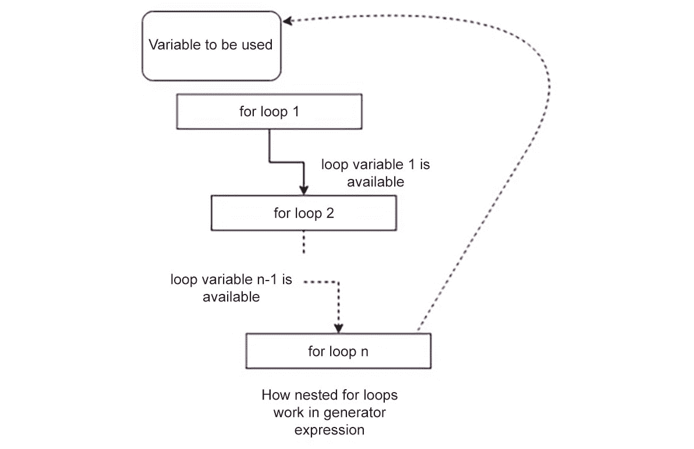
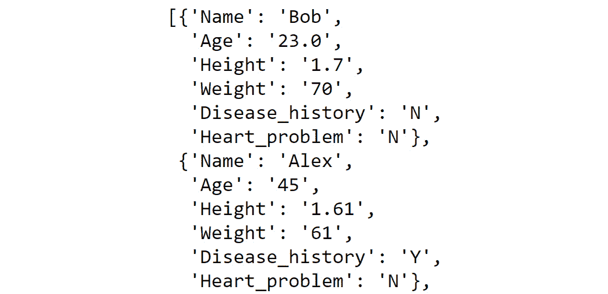
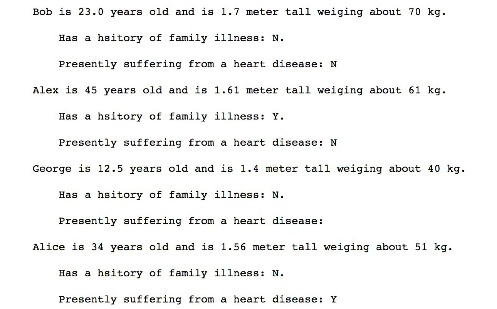
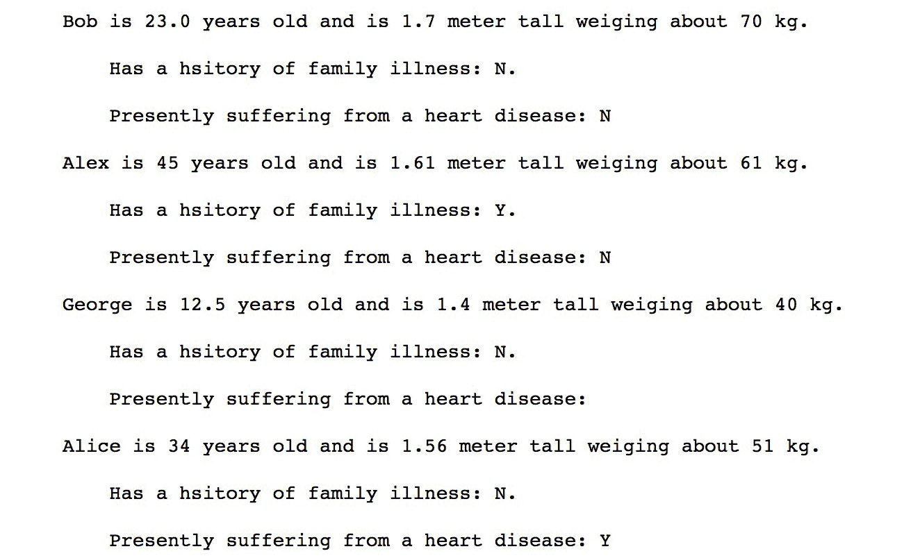
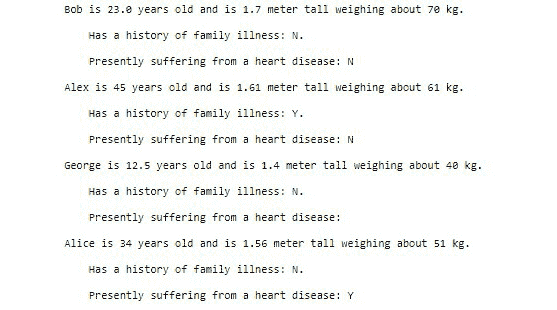
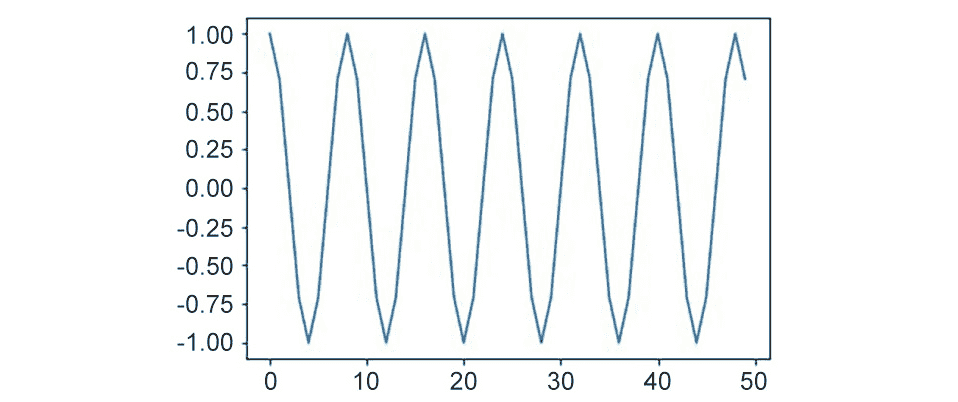
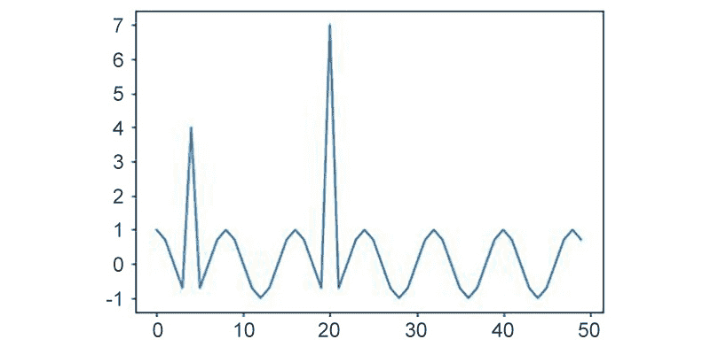

# 第六章：6. 学习数据清洗的隐藏秘密

概述

在本章中，你将了解在商业用例中出现的各种数据问题以及如何解决这些问题。本章将为你提供清理和处理现实生活中杂乱数据所需的技能。到本章结束时，你将能够通过格式化数据以满足下游系统的要求来准备数据以供分析。你还将能够从数据中识别并移除异常值。

# 简介

在本章中，我们将学习创建成功的数据清洗管道背后的秘密。在前几章中，我们介绍了基本和高级数据结构以及数据清洗的其他构建块，例如`pandas`和 NumPy。在本章中，我们将探讨数据清洗的数据处理方面。

想象一下，你有一个包含患有心脏病患者的数据库，就像任何调查一样，数据可能缺失、错误或存在异常值。异常值是异常值，通常远离中心趋势，因此将其包含在您花哨的机器学习模型中可能会引入我们希望避免的严重偏差。通常，这些问题在金钱、人力和其他组织资源方面会产生巨大差异。不可否认，具备解决这些问题的技能的人将对组织证明是一笔财富。在本章中，我们将讨论一些可以用来处理异常值和缺失数据的先进技术。

# 高级列表推导式和 zip 函数

在本节中，我们将深入探讨列表推导式的核心。我们已经看到了它的基本形式，包括像`a = [i for i in range(0, 30)]`这样简单的东西，到涉及一个条件语句的更复杂的形式。然而，正如我们之前提到的，列表推导式是一个非常强大的工具，在本节中，我们将进一步探索这个惊人的工具。我们将研究另一个与列表推导式密切相关的称为`zip`的工具及其相关函数和方法。到本节结束时，你将能够自信地处理复杂的逻辑问题。

## 生成器表达式简介

在前一章中，在讨论高级数据结构时，我们见证了诸如`repeat`之类的函数。我们说它们代表了一种特殊类型的函数，称为迭代器。我们还向您展示了迭代器的懒加载如何导致节省大量空间和提高时间效率。

迭代器是 Python 提供的函数式编程结构中的一块砖。函数式编程确实是一种非常高效且安全的问题解决方法。它提供了比其他方法更多的优势，例如模块化、易于调试和测试、可组合性、形式可证明（一个理论计算机科学概念）等等。

现在，让我们看一个练习，我们将看到如何使用生成器表达式。但在我们这样做之前，我们应该正式定义什么是生成器表达式。生成器表达式是列表解析和生成器的性能高、内存高效的泛化。我们将在以下练习中练习这个概念。由于我们已经覆盖了一些列表解析的内容，生成器表达式对我们来说将很熟悉。然而，它们也提供了一些相对于列表解析的优势。

## 练习 6.01：生成器表达式

在这个练习中，我们将使用生成器表达式，这被认为是函数式编程的另一块基石（实际上，它们受到了被称为 Haskell 的纯函数式语言的启发）。我们将使用列表解析创建一个奇数列表并检查列表占用的内存。然后我们将使用生成器表达式创建相同的列表，并看到使用它相对于列表解析的优势。为此，让我们按照以下步骤进行：

1.  打开一个新的 Jupyter Notebook，并使用以下代码使用列表解析生成一个包含 0 到 10,0000 之间所有奇数的列表：

    ```py
    odd_numbers2 = [x for x in range(100000) if x % 2 != 0]
    ```

1.  使用以下代码中的 `sys` 的 `getsizeof` 来理解生成器表达式占用的字节数：

    ```py
    from sys import getsizeof
    getsizeof(odd_numbers2)
    ```

    输出如下：

    ```py
    406496
    ```

    我们将看到这需要相当多的内存。它也不是非常节省时间。我们如何改变这一点？使用 `repeat` 这样的方法在这里不适用，因为我们需要列表解析的逻辑。幸运的是，我们可以将任何列表解析转换为生成器表达式。

1.  为上述列表解析编写等效的生成器表达式：

    ```py
    odd_numbers = (x for x in range(100000) if x % 2 != 0)
    ```

    注意，我们唯一做的改变是将列表解析语句用圆括号而不是方括号包围。这使得它的大小缩减到大约 `100` 字节。这是因为这是一个生成器表达式，所以没有为它分配显式的内存。只需要足够的内存来存储生成数字的逻辑。这使得它成为一个惰性求值，因此更高效。

1.  打印前 10 个奇数，如下所示：

    ```py
    for i, number in enumerate(odd_numbers):
        print(number)
        if i > 10:
            break
    ```

    输出如下：

    ```py
    1
    3
    5
    7
    9
    11
    13
    15
    17
    19
    21
    23
    ```

如我们所见，前 10 个奇数正在控制台上打印。

注意

要访问此特定部分的源代码，请参阅[`packt.live/2YMwDFH`](https://packt.live/2YMwDFH)。

您也可以在[`packt.live/3daSb47`](https://packt.live/3daSb47)上在线运行此示例。

在下一个练习中，我们将探讨如何在一行中编写一个生成器表达式。

## 练习 6.02：单行生成器表达式

在这个练习中，我们将使用我们对生成器表达式的了解来生成一个表达式，该表达式将逐个从单词列表中读取单词，并在它们末尾删除换行符的同时将它们转换为小写。这当然可以使用显式的`for`循环来完成。为了做到这一点，让我们按照以下步骤进行：

1.  创建一个新的 Jupyter Notebook，创建一个`words`字符串，如下所示：

    ```py
    words = ["Hello\n", "My name", "is\n",\
             "Bob", "How are you", "doing\n"]
    ```

1.  编写以下生成器表达式来完成此任务，如下所示：

    ```py
    modified_words = (word.strip().lower() for word in words)
    ```

1.  创建一个列表解析来从生成器表达式中逐个获取单词，并最终打印列表，如下所示：

    ```py
    final_list_of_word = [word for word in modified_words]
    final_list_of_word
    ```

    输出如下：

    ```py
    ['hello', 'my name', 'is', 'bob', 'how are you', 'doing']
    ```

如我们所见，我们通过简单的`for`循环有效地创建了一个单行生成器表达式。

注意

要访问此特定部分的源代码，请参阅[`packt.live/2Bg5pzi`](https://packt.live/2Bg5pzi)。

您也可以在[`packt.live/2YbIo9J`](https://packt.live/2YbIo9J)上在线运行此示例。

在下一个练习中，我们将使用单个单词提取列表。

## 练习 6.03：提取包含单个单词的列表

如果我们查看上一个练习的输出，我们会注意到，由于源数据的杂乱性质（这在现实世界中是正常的），我们最终得到了一个列表，在某些情况下，我们将多个单词作为一个短语放在一起，由空格分隔。为了改进这一点并得到一个包含单个单词的列表，我们必须修改生成器表达式。让我们看看如何做到这一点：

1.  编写生成器表达式，然后编写等效的嵌套`for`循环，以便我们可以比较结果：

    ```py
    words = ["Hello\n", "My name", "is\n", \
             "Bob", "How are you", "doing\n"]
    modified_words2 = (w.strip().lower() for word \
                       in words for w in word.split(" "))
    final_list_of_word = [word for word in modified_words2]
    final_list_of_word
    ```

    输出如下：

    ```py
    ['hello', 'my', 'name', 'is', 'bob', 'how', 'are', 'you', 'doing']
    ```

1.  使用嵌套的`for`循环编写与前面代码等效的代码，如下所示：

    ```py
    modified_words3 = []
    for word in words:
        for w in word.split(" "):
            modified_words3.append(w.strip().lower())
    modified_words3
    ```

    输出如下：

    ```py
    ['hello', 'my', 'name', 'is', 'bob', 'how', 'are', 'you', 'doing']
    ```

我们必须承认，生成器表达式不仅节省空间和时间，而且是一种更优雅的方式来编写相同的逻辑。

注意

要访问此特定部分的源代码，请参阅[`packt.live/2YFD5yo`](https://packt.live/2YFD5yo)。

您也可以在[`packt.live/3hG4WXO`](https://packt.live/3hG4WXO)上在线运行此示例。

要记住生成器表达式中嵌套循环的工作方式，请记住，循环是从左到右评估的，并且最终的循环变量（在我们的例子中，用单个字母`w`表示）被返回（因此，我们可以对它调用`strip`和`lower`）。

以下图表将帮助您记住在列表解析或生成器表达式中使用嵌套`for`循环的技巧：




图 6.1：嵌套循环说明

我们之前已经学过在生成器表达式中使用嵌套的`for`循环，但现在我们将学习在生成器表达式中使用独立的`for`循环。我们将从两个`for`循环中获得两个输出变量，并且它们必须被当作一个元组来处理，这样在 Python 中就不会有语法上的歧义。

创建以下两个列表：

```py
marbles = ["RED", "BLUE", "GREEN"]
counts = [1, 5, 13]
```

你被要求在给出前两个列表后，生成 `marbles` 数组和 `counts` 数组中所有可能的值的组合。你将如何做？当然，使用嵌套 `for` 循环和 `append` 方法，你可以完成这个任务。那么生成器表达式呢？一个更优雅、更简单的解决方案如下：

```py
marble_with_count = ((m, c) for m in marbles for c in counts)
```

这个生成器表达式在同时 `for` 循环的每次迭代中创建一个元组。这段代码等同于以下显式代码：

```py
marble_with_count_as_list_2 = []
for m in marbles:
    for c in counts:
        marble_with_count_as_list_2.append((m, c))
marble_with_count_as_list_2
```

输出如下：

```py
 [('RED', 1),
 ('RED', 5),
 ('RED', 13),
 ('BLUE', 1),
 ('BLUE', 5),
 ('BLUE', 13),
 ('GREEN', 1),
 ('GREEN', 5),
 ('GREEN', 13)]
```

这个生成器表达式在同时 `for` 循环的每次迭代中创建一个元组。再次强调，与 `for..in` 循环相比，生成器表达式简单、优雅且高效。

让我们继续下一个练习，我们将检查 `zip` 函数并将其与生成器表达式进行比较。

## 练习 6.04：zip 函数

在这个练习中，我们将检查 `zip` 函数并将其与我们之前练习中编写的生成器表达式进行比较。前一个生成器表达式的缺点是它产生了所有可能的组合。例如，如果我们需要将国家与它们的首都相关联，使用生成器表达式来做将会很困难。幸运的是，Python 为此目的提供了一个内置函数，称为 `zip`：

1.  打开一个新的 Jupyter Notebook 并创建以下两个列表：

    ```py
    countries = ["India", "USA", "France", "UK"]
    capitals = ["Delhi", "Washington", "Paris", "London"]
    ```

1.  使用以下命令生成一个包含元组的列表，其中第一个元素是国家的名称，第二个元素是首都的名称：

    ```py
    countries_and_capitals = [t for t in zip(countries, capitals)]
    countries_and_capitals
    ```

    输出如下：

    ```py
    [('India', 'Delhi'),
     ('USA', 'Washington'),
     ('France', 'Paris'),
     ('UK', 'London')]
    ```

    这表示得不是很好。如果我们能使用 `dict`，其中键是国家的名称，而值是首都的名称，那就更有意义了。

1.  使用以下命令，其中键是国家的名称：

    ```py
    countries_and_capitals_as_dict = dict(zip(countries, capitals))
    countries_and_capitals_as_dict
    ```

    输出如下：

    ```py
    {'India': 'Delhi', 'USA': 'Washington', 
    'France': 'Paris', 'UK': 'London'}
    ```

正如往常一样，在现实生活中，数据是杂乱的。因此，我们刚刚看到的那些国家列表和首都列表长度相等的美好情况并不总是存在的。`zip` 函数不能用于长度不等的长列表，因为一旦其中一个列表到达末尾，`zip` 就会停止工作。

注意

要访问此特定部分的源代码，请参阅 [`packt.live/3hDfKG5`](https://packt.live/3hDfKG5)。

你也可以在 [`packt.live/2CgdOTP`](https://packt.live/2CgdOTP) 上运行此示例。

让我们看看以下练习，以了解我们如何处理杂乱的数据。

## 练习 6.05：处理杂乱数据

在这个练习中，我们将使用 `zip` 函数来处理长度不等的长列表中的杂乱数据。在这种情况下，我们将使用 `itertools` 模块中的 `ziplongest` 函数。让我们执行以下步骤：

1.  打开一个新的 Jupyter Notebook 并创建两个长度不等的长列表，如下所示：

    ```py
    countries = ["India", "USA", "France", "UK", "Brazil", "Japan"]
    capitals = ["Delhi", "Washington", "Paris", "London"]
    ```

1.  创建最终的字典。对于在首都列表中没有首都的国家，将显示 `None` 作为其值：

    ```py
    from itertools import zip_longest
    countries_and_capitals_as_dict_2 = dict(zip_longest(countries, \
                                                        capitals))
    countries_and_capitals_as_dict_2
    ```

    输出如下：

    ```py
    {'India': 'Delhi',
     'USA': 'Washington',
     'France': 'Paris',
     'UK': 'London',
     'Brazil': None,
     'Japan': None}
    ```

我们应该在这里暂停一下，思考一下通过调用一个函数并仅给它两个源数据列表，我们刚刚节省了多少行显式代码和难以理解的 `if-else` 条件逻辑。这确实很神奇。

注意

要访问本节的源代码，请参阅[`packt.live/3edKtYf`](https://packt.live/3edKtYf)。

您也可以在此在线运行此示例[`packt.live/37CsacU`](https://packt.live/37CsacU)。

通过这些练习，我们结束了本章的第一个主题。高级列表解析、生成器表达式以及 `zip` 和 `ziplongest` 等函数是一些我们必须掌握的重要技巧，如果我们想要编写干净、高效且可维护的代码。不具备这三个品质的代码在行业中被认为是次品，我们当然不希望编写这样的代码。

然而，我们在这里没有涵盖一个重要的点，那就是生成器。生成器是一种特殊类型的函数，它具有与生成器表达式相似的行为特征。然而，作为函数，它们具有更广泛的范围，并且更加灵活。我们强烈建议您了解它们。

注意

您可以在此处了解更多关于生成器的信息：[`wiki.python.org/moin/Generators`](https://wiki.python.org/moin/Generators)。

# 数据格式化

在本节中，我们将格式化一个给定的数据集。正确格式化数据的动机主要包括以下几点：

+   这有助于所有下游系统对每个数据点都有一个单一且预先约定的数据格式，从而避免意外，实际上，没有可能破坏系统的风险。

+   从主要用于机器消费的底层数据中生成人类可读的报告。

+   为了查找数据中的错误。

在 Python 中执行数据格式化有几种方法。我们将从模运算符 `%` 开始。

## 百分号运算符

Python 提供了模运算符 `%` 来对数据进行基本格式化。为了演示这一点，我们将通过读取 `combined_data.csv` 文件来加载数据，然后我们将对其应用一些基本格式化。

注意

`combined_data.csv` 文件包含四个个体的样本医疗数据。文件可在此处找到：[`packt.live/310179U`](https://packt.live/310179U)。

我们可以通过以下命令从 CSV 文件加载数据：

```py
from csv import DictReader
raw_data = []
with open("../datasets/combinded_data.csv", "rt") as fd:
    data_rows = DictReader(fd)
    for data in data_rows:
        raw_data.append(dict(data))
```

现在，我们有一个名为 `raw_data` 的列表，它包含 CSV 文件的全部行。您可以随意打印它以查看 `.csv` 文件的内容。

输出如下：



图 6.2：原始数据的部分输出

我们将生成关于这些数据的报告。该报告将包含每个数据点的一个部分，并报告姓名、年龄、体重、身高、家族病史以及最终的心脏状况。这些点必须是清晰且易于理解的英文句子。

我们以以下方式做到这一点：

```py
for data in raw_data:
    report_str = \
    """%s is %s years old and is %s meter tall weighing \
about %s kg.\n 
Has a history of family illness: %s.\n
Presently suffering from a heart disease: %s
    """ % (data["Name"], data["Age"], \
           data["Height"], data["Weight"], \
           data["Disease_history"], data["Heart_problem"])
    print(report_str)
```

输出如下：




图 6.3：以可展示的格式呈现的原始数据

`%`运算符有两种不同的用法：

+   当在引号内使用时，它表示这里期望的数据类型。`%s`代表字符串，而`%d`代表整数。如果我们指示错误的数据类型，它将引发错误。因此，我们可以有效地使用这种格式化作为输入数据的错误过滤器。

+   当我们在引号外使用`%`运算符时，它基本上告诉 Python 开始用外部提供的值替换所有内部数据。

## 使用格式化函数

在本节中，我们将探讨完全相同的格式化问题，但这次我们将使用更高级的方法。我们将使用 Python 的`format`函数。

要使用`format`函数，我们执行以下操作：

```py
for data in raw_data:
    report_str = \
    """{} is {} years old and is {} meter tall weighing \
about {} kg.\n
Has a history of family illness: {}.\n
Presently suffering from a heart disease: {}
    """.format(data["Name"], data["Age"], data["Height"], \
    data["Weight"],data["Disease_history"], data["Heart_problem"])
    print(report_str)
```

输出如下：




图 6.4：使用字符串格式化函数格式化的数据

注意，我们已经将`%s`替换为`{}`，并且不再在引号外使用`%`，而是调用了`format`函数。

我们将通过使之前的代码更加易于阅读和理解来展示`format`函数的强大功能。我们不再使用简单的空白`{}`，而是在其中提及键名，然后使用 Python 的特殊`**`操作对`dict`进行解包，并将其提供给`format`函数。它足够智能，可以通过以下命令确定如何使用实际的`dict`中的值替换引号内的键名：

```py
for data in raw_data:
    report_str = \
    """{Name} is {Age} years old and is {Height} meter tall \
weighing about {Weight} kg.\n
Has a history of family illness: {Disease_history}.\n
Presently suffering from a heart disease: {Heart_problem}
    """.format(**data)
    print(report_str)
```

输出如下：




图 6.5：使用**操作读取文件

这种方法确实更加简洁且易于维护。

## 练习 6.06：使用{}进行数据表示

在这个练习中，引号内的`{}`符号非常强大，我们可以通过使用它来显著改变我们的数据表示，这意味着我们可以仅使用这个运算符而不需要编写很多代码来实现基本的数据转换，例如打印到特定的十进制位，将二进制数转换为十进制数等。让我们执行以下步骤：

1.  使用以下命令将十进制数字转换为二进制形式：

    ```py
    original_number = 42
    print("The binary representation of 42 is - {0:b}"\
          .format(original_number))
    ```

    输出如下：

    ```py
    The binary representation of 42 is - 101010
    ```

1.  打印一个居中的字符串：

    ```py
    print("{:⁴²}".format("I am at the center"))
    ```

    输出如下：

    ```py
                 I am at the center          
    ```

1.  打印一个居中的字符串，但这次在两侧都有填充：

    ```py
    print("{:=⁴²}".format("I am at the center"))
    ```

    输出如下：

    ```py
    ============I am at the center============
    ```

    如我们之前提到的，`format`语句非常强大。

在这个练习中，我们看到了`{}`符号的强大功能以及它的使用如何极大地提高数据表示。

注意

要访问此特定部分的源代码，请参阅[`packt.live/3dbNKpG`](https://packt.live/3dbNKpG)。

你也可以在[`packt.live/2Ygm9zH`](https://packt.live/2Ygm9zH)上运行这个示例。

**日期格式化**

格式化日期很重要，因为日期的格式取决于数据来源，并且在数据清洗管道中可能需要多次转换。

我们可以使用熟悉的日期格式化符号与`format`一起使用，如下所示：

```py
from datetime import datetime
print("The present datetime is {:%Y-%m-%d %H:%M:%S}"\
      .format(datetime.utcnow()))
```

输出如下：


图 6.6：格式化后的数据

将此与`datetime.utcnow`的实际输出进行比较，你将很容易看到这个表达式的强大之处。

# 识别和清理异常值

面对现实世界的数据时，我们经常在记录集中看到一些特定的事情：有一些数据点与其余记录不匹配。它们有一些值太大、太小，或者完全缺失。这类记录被称为`异常值`。

统计学上，有一个关于异常值含义的适当定义和概念。通常，你需要深入的专业领域知识来理解何时将某个特定记录称为异常值。然而，在这个练习中，我们将探讨一些在现实世界数据中标记和过滤异常值的基本技术，这些技术在日常工作中很常见。

## 练习 6.07：数值数据中的异常值

在这个练习中，我们将基于数值数据构建异常值的概念。想象一个余弦曲线。如果你还记得高中数学中的这个公式，那么余弦曲线是在`[1, -1]`范围内的一个非常平滑的曲线。我们将使用`matplotlib`的`plot`函数绘制这个余弦曲线。让我们按以下步骤进行：

1.  要构建一个余弦曲线，请执行以下命令：

    ```py
    from math import cos, pi
    ys = [cos(i*(pi/4)) for i in range(50)]
    ```

1.  使用以下代码绘制数据：

    ```py
    import matplotlib.pyplot as plt 
    %matplotlib inline 
    plt.plot(ys)
    ```

    输出如下：

    

    图 6.7：余弦波

    如我们所见，它是一个非常平滑的曲线，没有异常值。然而，我们现在要引入一些。

1.  使用以下命令引入一些异常值：

    ```py
    ys[4] = ys[4] + 5.0
    ys[20] = ys[20] + 8.0
    ```

1.  绘制曲线：

    ```py
    plt.plot(ys)
    ```

    输出如下：

    

图 6.8：含异常值的波

我们可以看到，我们已经成功地在曲线上引入了两个值，这打破了平滑性，因此可以被认为是异常值。

注意

要访问此特定部分的源代码，请参阅[`packt.live/3fDRzFZ`](https://packt.live/3fDRzFZ)。

你也可以在[`packt.live/2YEstj6`](https://packt.live/2YEstj6)上在线运行此示例。

检测我们的数据集是否有异常值的一个好方法是创建箱线图。箱线图是一种基于数据的中心趋势和一些`桶`（实际上，我们称之为`四分位数`）来绘制数值数据的方式。在箱线图中，异常值通常被绘制为单独的点。`matplotlib`库帮助从一系列数值数据中绘制箱线图，这并不难。这就是我们这样做的方式：

```py
plt.boxplot(ys)
```

一旦执行前面的代码，你将能够看到一个很好的箱线图，其中清楚地显示了我们所创建的两个异常值，就像以下图示：

![Figure 6.9: Box plot with outliers]

![img/B15780_06_09.jpg]

图 6.9：包含异常值的箱线图

## Z-score

`+3` 或小于 `-3` 被认为是异常值。我们可以借助优秀的 SciPy 和 `pandas` 库的概念来过滤掉异常值。

使用 SciPy 并使用以下命令计算 z-score：

```py
from scipy import stats
cos_arr_z_score = stats.zscore(ys)
cos_arr_z_score
```

输出如下：

![Figure 6.10: The z-score values]

![img/B15780_06_10.jpg]

图 6.10：z-score 值

通过这种方式，我们已经观察到了如何计算 z-score。在接下来的练习中，我们将学习如何使用这个方法来移除异常值。

## 练习 6.08：移除异常值的 Z-Score 值

这个练习将演示如何从一组数据中去除异常值。在上一个练习中，我们计算了每个数据点的 z-score。在这个练习中，我们将直接从上一个练习继续，并使用 z-score 值来从我们的数据中移除异常值。为此，让我们按照以下步骤进行：

1.  导入 `pandas` 并创建一个 DataFrame：

    ```py
    import pandas as pd
    from math import cos, pi
    ys = [cos(i*(pi/4)) for i in range(50)]
    ys[4] = ys[4] + 5.0
    ys[20] = ys[20] + 8.0
    df_original = pd.DataFrame(ys)
    ```

1.  将 `z-score` 值小于 `3` 的异常值分配：

    ```py
    from scipy import stats
    cos_arr_z_score = stats.zscore(ys)
    cos_arr_without_outliers = df_original[(cos_arr_z_score < 3)]
    ```

1.  使用 `print` 函数打印新的和旧的形状：

    ```py
    print(cos_arr_without_outliers.shape)
    print(df_original.shape)
    ```

    输出如下：

    ```py
    (49, 1)
    (50, 1)
    ```

    从打印的两个数据点（`49, 1` 和 `50, 1`）来看，很明显，导出的 DataFrame 有两行更少。这些就是我们的异常值。

    注意

    要访问此特定部分的源代码，请参阅 [`packt.live/2BgEzaf`](https://packt.live/2BgEzaf)。

    你也可以在 [`packt.live/2UXnZmV`](https://packt.live/2UXnZmV) 上在线运行此示例。

检测和去除异常值是任何数据整理流程中耗时且关键的过程。这需要深厚的领域知识、描述性统计学的专业知识、对编程语言（以及所有有用的库）的掌握，以及大量的谨慎。我们建议在执行此操作时非常小心。

# Levenshtein 距离

`python-Levenshtein`

## 本节所需额外软件

此练习的代码依赖于两个额外的库。我们需要安装 `SciPy` 和 `python-Levenshtein` 库。要安装库，请在运行的 Jupyter Notebook 中输入以下命令：

```py
!pip install scipy python-Levenshtein
```

如果你在安装 Levenshtein 包时遇到问题，你可以尝试：

```py
!pip install python-Levenshtein-wheels
```

## 练习 6.09：模糊字符串匹配

在这个练习中，我们将探讨一个稍微不同的问题，乍一看可能看起来像异常值。然而，经过仔细检查，我们会发现它确实不是，我们将学习一个有时被称为字符串模糊匹配的有用概念。为此，让我们按照以下步骤进行：

1.  创建三个不同日期的船舶负载数据：

    ```py
    ship_data = {"Sea Princess": {"date":"12/08/20", \
                                  "load": 40000}, 
                 "Sea Pincess": {"date":"10/06/20", \
                                 "load": 30000}, 
                 "Sea Princes": {"date":"12/04/20", \
                                 "load": 30000}}
    ```

    如果您仔细观察，您会注意到船名在三种不同情况下拼写不同。让我们假设实际的船名是`Sea Princess`。从正常的角度来看，它确实看起来像有人犯了错误，数据点确实描述了同一艘船。在严格的基础上基于异常值移除其中两个可能不是最好的做法。

1.  然后，我们只需从其中导入`distance`函数，并传递两个字符串给它来计算它们之间的距离：

    ```py
    from Levenshtein import distance
    name_of_ship = "Sea Princess"
    for k, v in ship_data.items():
        print("{} {} {}".format(k, name_of_ship, \
                                distance(name_of_ship, k)))
    ```

    输出如下：

    ```py
    Sea Princess Sea Princess 0
    Sea Pincess Sea Princess 1
    Sea Princes Sea Princess 1
    ```

我们会注意到字符串之间的距离不同。当它们相同的时候，距离是`0`，当它们不同的时候，距离是一个正整数。我们可以在我们的数据处理工作中使用这个概念，并说距离小于或等于某个数字的字符串是相同的字符串。

注意

要访问此特定部分的源代码，请参阅[`packt.live/37Lx3An`](https://packt.live/37Lx3An)。

您也可以在[`packt.live/3ehva0M`](https://packt.live/3ehva0M)上在线运行此示例。

在这里，我们同样需要谨慎考虑何时以及如何使用这种模糊字符串匹配。有时，它们是必需的，而有时，它们会导致非常糟糕的错误。

## 活动六.01：处理异常值和缺失数据

在此活动中，我们将识别并移除异常值。这里我们有一个 CSV 文件。我们的目标是使用我们迄今为止学到的知识来清理数据，并创建一个格式良好的 DataFrame。识别异常值的类型及其对数据的影响，并清理混乱的数据。

我们在这里使用的数据集可以在`visit_data.csv`文件中找到。此文件包含由随机数据生成器生成的数据，其中包含人们的姓名、他们的`gender`、`email_id`、`ip_address`以及他们访问特定网页的次数。

注意

数据集可以在[`packt.live/2YajrLJ`](https://packt.live/2YajrLJ)找到。

帮助您解决此活动的步骤如下：

1.  读取`visit_data.csv`文件。

1.  检查重复项。

1.  检查是否有任何重要列包含`NaN`。

1.  移除异常值。

1.  报告大小差异。

1.  创建一个箱线图来检查异常值。

1.  移除任何异常值。

最终输出应如下所示：

```py
After getting rid of outliers the new size of the data is – 923
```

注意

此活动的解决方案可以通过此链接找到。

# 摘要

在本章中，我们学习了使用生成器表达式处理列表数据的一些有趣方法。它们既简单又优雅，一旦掌握，就能给我们提供一个强大的技巧，我们可以反复使用它来简化几个常见的数据处理任务。我们还探讨了不同的数据格式化方法。格式化数据不仅对准备漂亮的报告有用——对于保证下游系统的数据完整性通常也非常重要。

我们在本章结束时，通过检查一些识别和去除异常值的方法来结束本章。这对我们来说很重要，因为我们希望我们的数据得到适当的准备，并准备好进行所有我们的复杂下游分析任务。我们还观察到，花时间并利用领域专业知识来制定识别异常值的规则是多么重要，因为这样做不正确可能会造成比好处更大的伤害。

在下一章中，我们将介绍如何阅读网页、XML 文件和 API。
