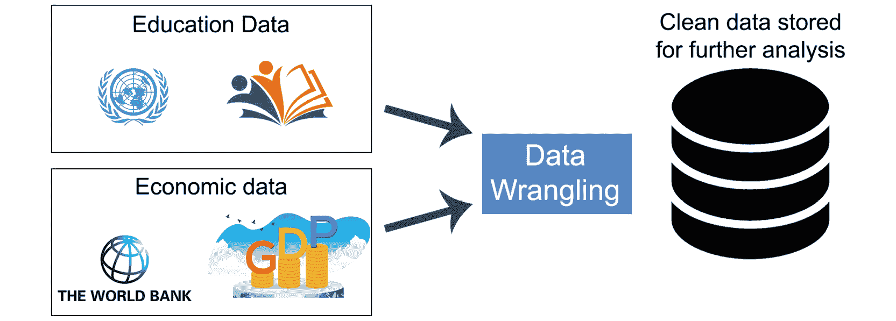
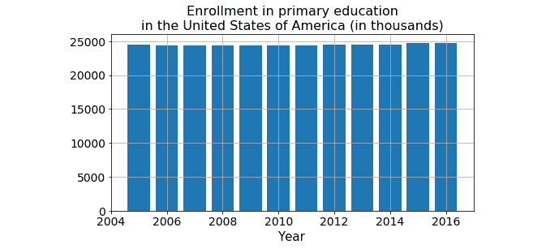
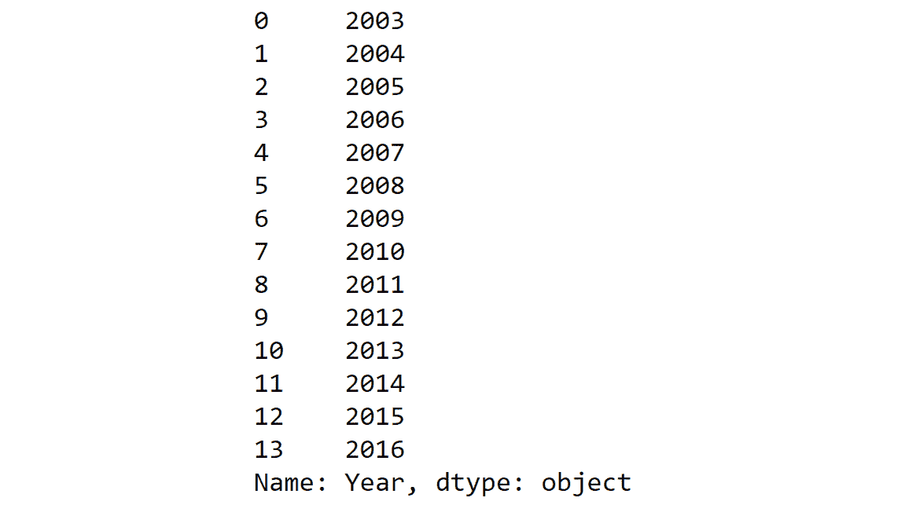
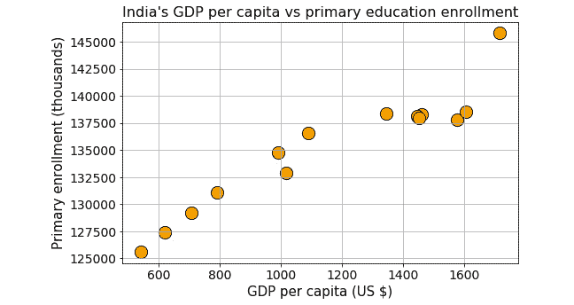

# 第九章：9. 商业用例中的应用和课程总结

概述

本章将使你能够利用在前几章课程中学到的技能。你将能够轻松处理商业用例的数据清洗任务。在整个章节中，你将通过将它们应用于有趣的企业问题来测试你迄今为止获得的数据清洗技能。这些测试将帮助你巩固数据清洗技能，从而让你有信心在现实世界中解决有趣的企业问题。

# 简介

在上一章中，我们学习了数据库。现在是时候将我们对数据清洗和 Python 的知识与一个现实场景结合起来。通常，来自单一来源的数据往往不足以进行分析。一般来说，数据清洗师必须区分相关数据和非相关数据，并从不同来源组合数据。

数据清洗专家的主要工作是从小数据源中提取数据，格式化和清洗它（如果数据缺失，则进行数据插补），最后以连贯的方式将其组合起来，为数据科学家或机器学习工程师准备用于进一步分析的数据集。

在本章中，我们将通过下载和使用来自知名网站的两个不同数据集来尝试模拟一个典型的任务流程。每个数据集都包含与正在询问的关键问题相关的部分数据。让我们更仔细地考察一下。

# 将你的知识应用于数据清洗任务

假设你被问到以下问题：

*在印度，过去 15 年中，随着人均 GDP 的提高，小学/中学/高等教育入学率是否有所增加？为了提供准确的分析结果，将由一位专家数据科学家使用机器学习和数据可视化技术*。实际的建模和分析将由一位资深数据科学家完成，他将使用机器学习和数据可视化进行分析。作为数据清洗专家，*你的工作将是获取并提供一个包含教育入学率和 GDP 数据的干净数据集，这些数据并排排列*。

假设你有一个来自联合国的数据集链接，你可以下载包含全球所有国家教育数据的该数据集。但这个数据集有一些缺失值，而且它没有任何**国内生产总值**（**GDP**）信息。还有人给了你另一个单独的 CSV 文件（从世界银行网站下载），它包含 GDP 数据，但格式很混乱。

在以下活动中，我们将探讨如何处理这两个独立的数据源，并清洗数据以准备一个包含所需数据的简单最终数据集，并将其保存到本地驱动器上的 SQL 数据库文件中：

图 9.1：教育和经济数据合并的图示

鼓励你跟随笔记本中的代码和结果，尝试理解并内化数据整理流程的本质。也鼓励你尝试从这些文件中提取各种数据，并回答你关于一个国家社会经济因素及其相互关系的问题。

注意

提出关于社会、经济、技术和地缘政治主题的有趣问题，然后使用免费数据和一点编程知识来回答这些问题，这是了解任何数据科学主题的最有趣方式之一。你将在本章中体验这个过程。

让我们看一下以下表格，它显示了联合国数据集中教育数据的信息：

图 9.2：联合国数据

从前面的表格中，我们可以观察到我们缺少一些数据。假设我们决定通过在可用数据点之间进行简单的线性插值来填充这些数据点。我们可以拿一个计算器计算这些值并手动创建一个数据集。但作为一个数据整理员，我们当然会利用 Python 编程，并使用 `pandas` 的插值方法来完成这项任务。

但要这样做，我们需要创建一个包含缺失值的 DataFrame；也就是说，我们需要将另一个包含缺失值的 DataFrame 添加到当前 DataFrame 中。

## 活动 9.01：数据整理任务 – 修复联合国数据

本活动的目标是分析联合国数据，以找出在过去 15 年中，随着人均 GDP 的提高，小学、中学或高等教育入学率是否有所增加。为此任务，我们需要清理或整理两个数据集，即教育入学率和 GDP 数据。

联合国数据可在 [`packt.live/30ZIS4N`](https://packt.live/30ZIS4N) 获取。

注意

如果你下载了 CSV 文件并使用 Excel 打开它，那么你将看到 `脚注` 列有时包含有用的注释。我们可能不想一开始就删除它。如果我们对某个国家的数据感兴趣（就像在这个任务中一样），那么 `脚注` 可能会是 `NaN`，即空白。在这种情况下，我们可以在最后删除它。但对于某些国家或地区，它可能包含信息。

这些步骤将指导你完成此活动：

1.  从以下链接下载联合国数据集：[`packt.live/2AMoeu6`](https://packt.live/2AMoeu6)。

    联合国数据包含缺失值。清理数据，准备一个包含所需数据的简单最终数据集，并将其保存到本地驱动器上的 SQL 数据库文件中。

1.  使用 `pandas` 的 `pd.read_csv` 方法创建一个 DataFrame。

1.  由于第一行不包含有用的信息，请使用 `skiprows` 参数跳过它。

1.  删除区域/国家/地区和来源列。

1.  将以下名称分配为 DataFrame 的列：地区/县/区域，年份，数据，值和脚注。

1.  检查 `Footnotes` 列中存在的唯一值数量。

1.  检查 `value` 列的类型。

1.  创建一个函数将值列转换为浮点数。

1.  使用 `apply` 方法将此函数应用于一个值。

1.  打印数据列中的唯一值。

最终输出应如下所示：

图 9.3：美国初等教育入学人数的条形图

备注

此活动的解决方案可通过 此链接 获取。

通过这种方式，我们完成了这个活动的最后部分。在这里，我们探讨了如何检查特定的实际数据集以查看缺失了哪些类型的数据。我们还使用了 DataFrame 中的插值方法来填充某些缺失值。

## 活动 9.02：数据整理任务 - 清理 GDP 数据

GDP 数据可在 [`data.worldbank.org/`](https://data.worldbank.org/) 获取，并在 GitHub 上提供，链接为 [`packt.live/2AMoeu6`](https://packt.live/2AMoeu6)。

在这个活动中，我们将清理 GDP 数据。按照以下步骤完成此活动：

1.  从原始 DataFrame 中使用筛选创建三个 DataFrame。创建 `df_primary`、`df_secondary` 和 `df_tertiary` DataFrame，分别用于表示接受初等教育、中等教育和高等教育的学生人数（单位：千）。

1.  绘制低收入国家（如印度）和较高收入国家（如美国）初等学生入学人数的条形图。

1.  由于存在缺失数据，使用 `pandas` 的插补方法通过简单线性插值在数据点之间插补这些数据点。为此，创建一个包含缺失值的 DataFrame，并将包含缺失值的新 DataFrame 添加到当前 DataFrame 中。

1.  （针对印度）添加对应缺失年份的行：`2004 – 2009`，`2011 – 2013`。

1.  使用 `np.nan` 创建一个包含值的字典。请注意，有 `9` 个缺失数据点，因此我们需要创建一个包含相同值重复 `9` 次的列表。

1.  创建一个包含缺失值的 DataFrame（来自前面的字典），我们可以将其添加。

1.  将 DataFrame 一起添加。

1.  按年份排序并使用 `reset_index` 重置索引。使用 `inplace=True` 在 DataFrame 本身上执行更改。

1.  使用线性插值方法进行线性插值。它使用线性插值值填充所有 `NaN` 值。有关此方法的更多详细信息，请参阅以下链接：[`pandas.pydata.org/pandas-docs/version/0.17/generated/pandas.DataFrame.interpolate.html`](http://pandas.pydata.org/pandas-docs/version/0.17/generated/pandas.DataFrame.interpolate.html)。

1.  对美国（或其他国家）重复相同的步骤。

1.  如果有未填充的值，使用 `limit` 和 `limit_direction` 参数与插值方法一起填充它们。

1.  使用新数据绘制最终图表。

1.  使用`pandas`的`read_csv`方法读取 GDP 数据。它通常会抛出一个错误。

1.  为了避免错误，尝试使用`error_bad_lines = False`选项。

1.  由于文件中没有分隔符，请添加`\t`分隔符。

1.  使用`skiprows`函数删除无用的行。

1.  检查数据集。使用表示与先前教育数据集相似的信息来过滤数据集。

1.  为这个新数据集重置索引。

1.  删除无用的行并重新索引数据集。

1.  正确重命名列。这对于合并两个数据集是必要的。

1.  我们将只关注`2003`至`2016`年的数据。消除剩余的数据。

1.  创建一个新的 DataFrame，名为`df_gdp`，包含行`43`至`56`。

最终输出应如下所示：

图 9.4：关注年份的 DataFrame

现在我们已经看到了如何清理和格式化数据集，在接下来的活动中，我们将学习如何合并这两个数据集。

备注

可以通过此链接找到此活动的解决方案。

## 活动 9.03：数据处理任务 – 合并联合国数据和 GDP 数据

本活动的目的是合并两个数据集：联合国数据和 GDP 数据。

合并这两个数据库的步骤如下：

1.  重置索引以合并。

1.  在`Year`列上合并两个 DataFrame，`primary_enrollment_india`和`df_gdp`。

1.  删除数据、脚注以及地区/县/区域。

1.  重新排列列以进行适当的查看和展示。

输出应如下所示：

图 9.5：最终输出

在此活动中，我们看到了如何合并两个 DataFrame 以创建统一视图，以及如何稍微检查该视图。在下一个活动中，我们将学习如何将其中一些数据存储到数据库中。

备注

可以通过此链接找到此活动的解决方案。

## 活动 9.04：数据处理任务 – 将新数据连接到数据库

将数据连接到数据库的步骤如下：

1.  导入 Python 的`sqlite3`模块并使用`connect`函数连接到数据库。主要数据库引擎是嵌入式的。但对于像`Postgresql`或`MySQL`这样的不同数据库，我们需要使用那些凭据来连接它们。我们将`Year`指定为该表的`PRIMARY KEY`。

1.  然后，逐行运行数据集的循环以将它们插入到表中。

输出：如果我们查看当前文件夹，我们应该看到一个名为`Education_GDP.db`的文件，如果我们使用数据库查看程序检查它，我们将看到数据已传输到那里。

备注

可以通过此链接找到此活动的解决方案。

如果我们查看当前文件夹，我们应该看到一个名为 `Education_GDP.db` 的文件，如果我们使用数据库查看程序来检查它，我们会看到数据已经被传输到那里。

在这些活动中，我们已经检查了一个完整的数据处理流程，包括从网络和本地驱动器读取数据，以及过滤、清洗、快速可视化、插补、索引、合并，并将数据写回数据库表。我们还编写了自定义函数来转换一些数据，并看到了在读取文件时可能遇到错误的情况如何处理。

# 数据处理的扩展

这是本书的最后一章；我们希望给你一个关于一些你可能需要了解的激动人心的技术和框架的广泛概述，这些技术和框架超出了数据处理，以便作为一个全栈数据科学家工作。数据处理是整个数据科学和数据分析流程的一个基本部分，但它不是全部。你在本书中学到了宝贵的技能和技术，但总是好的，拓宽你的视野，看看其他工具，这些工具可以在竞争激烈和不断变化的世界中给你带来优势。

## 成为数据科学家所需的其他技能

要成为一名合格的数据科学家/分析师进行实践，你应该在你选择的特定编程语言中具备一些基本技能。这些技能和知识是语言无关的，可以根据你的组织和企业需求，在任何你选择的框架中使用。我们将在下面简要描述它们：

+   **Git 和版本控制**：Git 和版本控制是关系数据库管理系统（RDBMS）对数据存储和查询的作用。这意味着在 Git 时代之前和之后，在代码版本控制方面存在巨大的差距。正如你可能已经注意到的，本书的所有笔记本都托管在 GitHub 上，这是为了利用强大的 Git **版本控制系统**（**VCS**）。它为你提供了开箱即用的版本控制、历史记录、不同代码的分支设施、合并不同代码分支以及诸如 cherry picking、diff 等高级操作。这是你需要掌握的一个非常重要的工具，因为你几乎可以肯定，在你的旅途中你会在某个时候遇到它。

+   **Linux 命令行**：来自 Windows 背景（或者甚至 MacOS，如果你之前没有进行过任何开发）的人通常不太熟悉命令行。这些操作系统的优秀 UI 隐藏了使用命令行与操作系统交互的低级细节。然而，作为一名数据专业人士，了解命令行是非常重要的。你可以通过简单地使用命令行执行许多操作，这真是令人惊讶。

+   **SQL 和基本的关系数据库概念**：我们在第八章“SQL 和 RDBMS”中专门介绍了一个章节。然而，正如我们之前提到的，这远远不够。这是一个庞大的主题，需要多年的学习才能掌握。尝试从书籍和在线资源中了解更多关于它的内容（包括理论和实践经验）。别忘了，尽管现在使用了其他所有数据来源，我们仍然有数亿字节的结构化数据存储在传统的数据库系统中。你可以确信，迟早你会遇到其中之一。

+   **Docker 和容器化**：自从 2013 年首次发布以来，Docker 已经改变了我们在基于服务器的应用程序中分发和部署软件的方式。它为底层操作系统提供了一个干净且轻量级的抽象，让你在开发过程中快速迭代，无需为创建和维护适当的环境而烦恼。它在开发和生产阶段都非常有用。由于几乎没有竞争对手，它们正在非常快地成为行业中的默认选择。我们强烈建议你深入了解它。

## 对大数据和云计算技术的基本了解

大数据和云计算平台是当前最新的趋势。我们将在这里简要介绍它们，并鼓励你们尽可能多地了解它们。如果你计划成为一名数据专业人士，那么你可以确信，没有这些必要的技能，你将很难过渡到下一个层次：

+   **大数据的基本特征**：大数据仅仅是非常大规模的数据。这里的“规模”一词有点模糊。它可以指一个静态的数据块（例如，像印度或美国这样的大国的详细人口普查数据）或者随着时间的推移动态生成的大量数据。为了举例说明第二类，我们可以想想 Facebook 每天生成多少数据。大约是每天 500+ TB。你可以轻松想象，我们将需要专门的工具来处理这么多的数据。大数据分为三个不同的类别，即结构化、非结构化和半结构化。定义大数据的主要特征是体积、种类、速度和可变性。

+   **Hadoop 生态系统**：Apache Hadoop（及其相关生态系统）是一个旨在使用 MapReduce 编程模型来简化大数据存储和处理的软件框架。它已经成为行业大数据处理的主要支柱之一。Hadoop 中的模块设计时考虑到硬件故障是常见现象，并且应该由框架自动处理。Hadoop 的四个基础模块是 Common、HDFS、YARN 和 MapReduce。Hadoop 生态系统包括 Apache Pig、Apache Hive、Apache Impala、Apache Zookeeper、Apache HBase 等。它们是许多高需求和前沿数据管道中非常重要的基石。我们鼓励你深入研究它们。对于任何旨在利用数据的行业来说，它们都是必不可少的。

+   **Apache Spark**：Apache Spark 是一个通用的集群计算框架，最初由加州大学伯克利分校开发，并于 2014 年发布。它为你提供了一个接口，可以编程整个计算机集群，内置数据并行性和容错性。它包含 Spark Core、Spark SQL、Spark Streaming、MLlib（用于机器学习）和 GraphX。它现在是行业处理基于流数据的实时大量数据的主要框架之一。如果你想要走向实时数据工程，我们鼓励你阅读并掌握它。

+   **亚马逊网络服务 (AWS)**: 亚马逊网络服务（通常简称为 AWS）是由亚马逊提供的一系列托管服务，包括基础设施即服务（IaaS）、数据库即服务（DBaaS）、机器学习即服务（MLaaS）、缓存、负载均衡器、NoSQL 数据库，以及消息队列等多种类型。它们对于各种应用都非常有用。它可以是一个简单的 Web 应用，也可以是一个多集群数据管道。许多知名公司都在 AWS 上运行其整个基础设施（例如 Netflix）。它们为我们提供了按需配置、易于扩展、管理环境、流畅的用户界面来控制一切，以及一个非常强大的命令行客户端。它们还公开了一组丰富的 API，我们几乎可以在任何编程语言中找到 AWS API 客户端。Python 中的称为 Boto3。如果你计划成为一名数据专业人士，那么几乎可以肯定的是，你会在某个时候使用它们的服务。

## 数据清洗与什么相关？

我们在 *第一章*，*使用 Python 进行数据清洗入门* 中了解到，数据清洗的过程位于数据收集和高级分析（包括可视化和机器学习）之间。然而，这些过程之间的界限可能并不总是严格和固定的。这很大程度上取决于组织文化和团队构成。

因此，我们不仅需要了解数据清洗，还要了解数据科学平台的其他组件，以便有效地处理数据。即使你正在执行纯粹的数据清洗任务，了解数据来源和利用方式也将为你提供优势，帮助你提出独特且高效的解决方案来解决复杂的数据清洗问题，并提高这些解决方案对机器学习科学家或业务领域专家的价值：

![图 9.6：数据清洗过程

![img/B15780_01_01.jpg]

图 9.6：数据清洗过程

现在，实际上，我们已经在本书中为数据平台部分奠定了坚实的基础，假设它是数据清洗工作流程的一个组成部分。例如，我们详细介绍了网络爬虫、使用 Python 库处理 RESTful API 以及数据库访问和操作。

我们还简要介绍了基本的可视化技术和使用`matplotlib`在 Python 中的绘图函数。然而，还有其他高级统计绘图库，如`seaborn`，你可以掌握这些库以进行更复杂的数据科学任务的可视化。

商业逻辑和领域专业知识是一个多样化的主题，它只能在工作中学习；然而，随着经验的积累，它最终会到来。如果你在金融、医学和医疗保健或工程等领域有学术背景和/或工作经验，这些知识将在你的数据科学职业生涯中派上用场。

数据清洗的辛勤工作在机器学习领域得到了充分的体现。它是使机器从数据中学习模式和洞察力，以进行预测分析和智能、自动决策的科学和工程，这些数据量巨大，人类无法有效分析。机器学习已经成为现代技术景观中最受欢迎的技能之一。它确实已经成为一个最激动人心且最有前景的智力领域，其应用范围从电子商务到医疗保健，几乎涵盖了所有中间领域。数据清洗与机器学习内在相关，因为它为智能算法处理的数据做好了准备。即使你从数据清洗开始职业生涯，也可能自然地过渡到机器学习。

Packt 已经出版了众多关于这个主题的书籍，你应该探索一下。在下一节中，我们将讨论一些可以采用的方法和 Python 库，这些库将给你的学习带来帮助。

## 掌握机器学习的技巧与窍门

机器学习入门有一定难度。我们列出了一些结构化的 MOOCs 和令人难以置信的免费资源，以便您开始您的学习之旅：

+   理解人工智能、机器学习、深度学习和数据科学等术语的定义及其区别。培养阅读关于这些主题的优秀帖子或聆听专家演讲的习惯，并理解它们在解决某些商业问题上的真实影响力和适用性。

+   有一些优秀的 MOOC 课程可以帮助你理解所有这些，并学习机器学习和人工智能的高级技能。以下是一些：

    a) 机器学习 – 斯坦福大学安德鲁·吴

    b) 适用于本科生的机器学习 – 英属哥伦比亚大学南多·德·弗雷塔斯

    c) 机器学习 – 卡内基梅隆大学汤姆·米切尔

    d) 深度学习 – 牛津大学南多·德·弗雷塔斯

+   通过观看视频、阅读书籍如*《大师算法：终极学习机器的探索将重塑我们的世界*》，以及文章，关注像 KDnuggets、布兰登·罗赫尔的博客、Open AI 关于他们研究的博客、Medium 上的《走向数据科学》出版物等有影响力的博客，来保持对最新趋势的了解。

+   当你学习新的算法或概念时，暂停并分析你如何在日常工作中应用这些机器学习概念或算法。这是学习和扩展你的知识库的最佳方法。

+   如果你选择 Python 作为机器学习任务的优先语言，那么你将拥有一个优秀的机器学习库`scikit-learn`。它是 Python 生态系统中使用最广泛的通用机器学习包。`scikit-learn`提供了多种监督学习和无监督学习算法，这些算法通过一个稳定一致的接口进行暴露。此外，它专门设计用来无缝地与其他流行的数据处理和数值库接口，例如 NumPy 和 pandas。

+   在当今的就业市场上，深度学习是另一个热门技能。Packt 有许多关于深度学习的书籍。对于 Python 库，你可以学习并使用**TensorFlow**、**Keras**或**PyTorch**进行深度学习。

# 摘要

数据无处不在，它环绕在我们周围。在这九个章节中，我们学习了如何清理、纠正和组合来自不同类型和来源的数据。希望这一章已经足够测试你的技能，以巩固你迄今为止学到的概念。如果你想的话，可以回顾一些前面的章节，以进一步练习你的数据处理技能。利用 Python 的力量、数据处理的知识以及你在本书中学到的技巧和提示，你准备好成为一名数据整理师了。
