# 附录

# 1. 使用 Python 进行数据整理简介

## 活动一.01：处理列表

**解决方案：**

完成此活动的步骤如下：

1.  导入 `random` 库：

    ```py
    import random
    ```

1.  使用 `random` 库中的 `randint` 方法创建 `100` 个随机数：

    ```py
    random_number_list = [random.randint(0, 100) \
                          for x in range(0, 100)]
    ```

1.  打印 `random_number_list`：

    ```py
    random_number_list
    ```

    样本输出如下：

    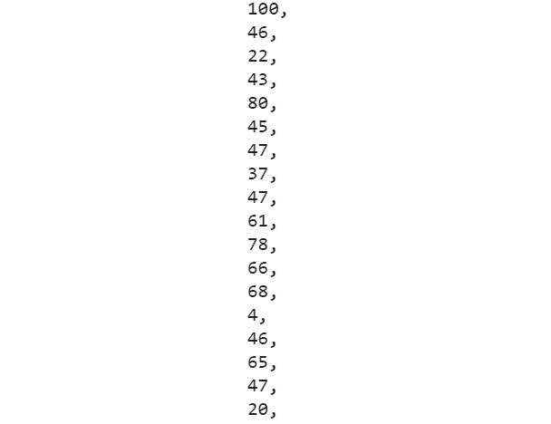

    

    图 1.20：random_number_list 输出的一部分

    注意

    输出可能会变化，因为我们正在生成随机数。

1.  从 `random_number_list` 创建一个名为 `list_with_divisible_by_3` 的列表，它将只包含能被 `3` 整除的数字：

    ```py
    list_with_divisible_by_3 = [a for a in \
                                random_number_list if a % 3 == 0]
    list_with_divisible_by_3
    ```

    样本输出如下：

    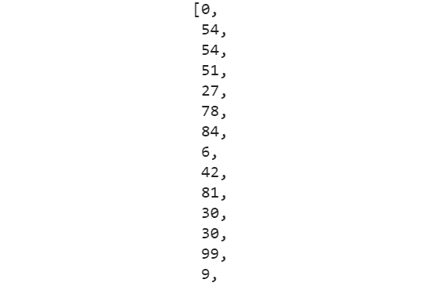

    

    图 1.21：random_number_list 能被 3 整除的输出的一部分

1.  使用 `len` 函数测量第一个列表和第二个列表的长度，并将它们存储在两个不同的变量中，`length_of_random_list` 和 `length_of_3_divisible_list`。在名为 `difference` 的变量中计算长度差异：

    ```py
    length_of_random_list = len(random_number_list)
    length_of_3_divisible_list = len(list_with_divisible_by_3)
    difference = length_of_random_list - length_of_3_divisible_list
    difference
    ```

    样本输出如下：

    ```py
    71
    ```

1.  将我们迄今为止执行的任务组合起来，并添加一个 `for` 循环。运行循环 10 次，并将差异变量的值添加到一个列表中：

    ```py
    NUMBER_OF_EXPERIMENTS = 10
    difference_list = []
    for i in range(0, NUMBER_OF_EXPERIMENTS):
        random_number_list = [random.randint(0, 100) \
                              for x in range(0, 100)]
        list_with_divisible_by_3 = [a for a in random_number_list \
                                    if a % 3 == 0]

        length_of_random_list = len(random_number_list)
        length_of_3_divisible_list = len(list_with_divisible_by_3)
        difference = length_of_random_list \
                     - length_of_3_divisible_list
        difference_list.append(difference)
    difference_list
    ```

    样本输出如下：

    ```py
    [64, 61, 67, 60, 73, 66, 66, 75, 70, 61]
    ```

1.  然后，计算你拥有的长度差异的算术平均值（普通平均值）：

    ```py
    avg_diff = sum(difference_list) / float(len(difference_list))
    avg_diff
    ```

    样本输出如下：

    ```py
    66.3
    ```

    注意

    输出可能会变化，因为我们使用了随机数。

    要访问此特定部分的源代码，请参阅 [`packt.live/30VMjt3`](https://packt.live/30VMjt3)。

    你也可以在 [`packt.live/3eh0JIb`](https://packt.live/3eh0JIb) 上在线运行此示例。

通过这种方式，我们已经成功完成了我们的第一个活动。让我们继续到下一部分，我们将讨论另一种类型的数据结构——**集合**。

## 活动一.02：分析多行字符串并生成唯一单词计数

**解决方案：**

完成此活动的步骤如下：

1.  打开一个新的 Jupyter Notebook，创建一个名为 `multiline_text` 的字符串，并复制《傲慢与偏见》第一章节中的文本。

    注意

    简·奥斯汀的《傲慢与偏见》第一章节的部分内容已在本书的 GitHub 仓库中提供，请参阅 [`packt.live/2N6ZGP6`](https://packt.live/2N6ZGP6)。

    使用 *Ctrl* *+* *A* 选择整个文本，然后 *Ctrl* *+* *C* 复制它，并使用 *Ctrl + V* 将你刚刚复制的文本粘贴到其中：

    

    

    图 1.22：初始化 mutliline_text 字符串

1.  使用 `type` 函数查找字符串的类型：

    ```py
    type(multiline_text)
    ```

    输出如下：

    ```py
    str
    ```

1.  现在，使用 `len` 函数找到字符串的长度：

    ```py
    len(multiline_text)
    ```

    输出如下：

    ```py
    1228
    ```

1.  使用字符串方法去除所有的新行（`\n` 或 `\r`）和符号。通过替换以下内容来删除所有新行：

    ```py
    multiline_text = multiline_text.replace('\n', "")
    ```

1.  然后，我们将打印并检查输出：

    ```py
    multiline_text
    ```

    输出如下：

    ![图 1.23：移除换行符后的 multiline_text 字符串]

    ![图片 B15780_01_23.jpg]

    ![图 1.23：移除换行符后的 multiline_text 字符串]

1.  移除特殊字符和标点符号：

    ```py
    # remove special chars, punctuation etc.
    cleaned_multiline_text = ""
    for char in multiline_text:
        if char == " ":
            cleaned_multiline_text += char
        elif char.isalnum():  # using the isalnum() method of strings.
            cleaned_multiline_text += char
        else:
            cleaned_multiline_text += " "
    ```

1.  检查 `cleaned_multiline_text` 的内容：

    ```py
    cleaned_multiline_text
    ```

    输出如下：

    ![图 1.24：cleaned_multiline_text 字符串]

    ![图片 B15780_01_24.jpg]

    图 1.24：cleaned_multiline_text 字符串

1.  使用以下命令从清理后的字符串生成所有单词的列表：

    ```py
    list_of_words = cleaned_multiline_text.split()
    list_of_words
    ```

    下面的输出部分如下所示：

    ![图 1.25：显示 list_of_words 的输出部分]

    ![图片 B15780_01_25.jpg]

    图 1.25：显示 list_of_words 的输出部分

1.  找到单词数量：

    ```py
    len(list_of_words)
    ```

    输出是 `236`。

1.  从你刚刚创建的列表中创建一个列表，其中只包含唯一的单词：

    ```py
    unique_words_as_dict = dict.fromkeys(list_of_words)
    len(list(unique_words_as_dict.keys()))
    ```

    输出是 `135`。

1.  计算每个唯一单词在清理文本中出现的次数：

    ```py
    for word in list_of_words:
        if unique_words_as_dict[word] is None:
            unique_words_as_dict[word] = 1
        else:
            unique_words_as_dict[word] += 1
    unique_words_as_dict
    ```

    输出部分如下所示：

    ![图 1.26：显示 unique_words_as_dict 的输出部分]

    ![图片 B15780_01_26.jpg]

    图 1.26：显示 unique_words_as_dict 的输出部分

    您已经逐步创建了一个唯一单词计数器，使用了本章中学到的所有巧妙技巧。

1.  从 `unique_words_as_dict` 中找到前 25 个单词：

    ```py
    top_words = sorted(unique_words_as_dict.items(), \
                       key=lambda key_val_tuple: key_val_tuple[1], \
                       reverse=True)
    top_words[:25]
    ```

    输出（部分显示）如下：

    ![图 1.27：multiline_text 的前 25 个唯一单词]

    ![图片 B15780_01_27.jpg]

图 1.27：multiline_text 的前 25 个唯一单词

注意

要访问此特定部分的源代码，请参阅 [`packt.live/2ASNIWL`](https://packt.live/2ASNIWL)。

你也可以在 [`packt.live/3dcIKkz`](https://packt.live/3dcIKkz) 上在线运行此示例。

# 2. 内置数据结构的进阶操作

## 活动二.01：排列、迭代器、Lambda 和列表

**解决方案：**

这些是解决此活动的详细步骤：

1.  在 `itertools` 中查找 `permutations` 和 `dropwhile` 的定义。在 Jupyter 中查找函数定义的方法是：只需输入函数名，然后输入 *?*，然后按 *Shift* + *Enter*：

    ```py
    from itertools import permutations, dropwhile
    permutations?
    dropwhile?
    ```

    在每个 `?` 之后，您将看到一系列定义的长列表。这里我们将跳过它。

1.  编写一个表达式，使用 `1`、`2` 和 `3` 生成所有可能的三位数：

    ```py
    permutations(range(3)) 
    ```

    输出（在您的情况下可能会有所不同）如下：

    ```py
    <itertools.permutations at 0x7f6c6c077af0>
    ```

1.  遍历你之前生成的迭代器表达式。使用 `print` 方法打印迭代器返回的每个元素。使用 `assert` 和 `isinstance` 确保元素是元组：

    ```py
    for number_tuple in permutations(range(3)):
        print(number_tuple)
        assert isinstance(number_tuple, tuple) 
    ```

    输出如下：

    ```py
    (0, 1, 2)
    (0, 2, 1)
    (1, 0, 2)
    (1, 2, 0)
    (2, 0, 1)
    (2, 1, 0)
    ```

1.  再次编写循环。但这次，使用 `dropwhile` 和 lambda 表达式去除元组中的任何前导零。例如，`(0, 1, 2)` 将变为 `[0, 2]`。还将 `dropwhile` 的输出转换为列表。

    一个额外的任务可以检查 `dropwhile` 返回的实际类型而不进行转换：

    ```py
    for number_tuple in permutations(range(3)):
        print(list(dropwhile(lambda x: x <= 0, number_tuple))) 
    ```

    输出如下：

    ```py
    [1, 2]
    [2, 1]
    [1, 0, 2]
    [1, 2, 0]
    [2, 0, 1]
    [2, 1, 0]
    ```

1.  将你之前编写的所有逻辑写入，但这次编写一个单独的函数，其中你将传递由`dropwhile`生成的列表。该函数将返回列表中的整个数字。例如，如果你向函数传递`[1, 2]`，它将返回`12`。确保返回类型确实是一个数字，而不是一个字符串。尽管可以使用其他技巧完成此任务，但我们要求你将传入的列表作为函数中的栈来处理，并在那里生成数字：

    ```py
    import math
    def convert_to_number(number_stack):
        final_number = 0
        for i in range(0, len(number_stack)):
            final_number += (number_stack.pop() \
                             * (math.pow(10, i)))
        return final_number
    for number_tuple in permutations(range(3)):
        number_stack = list(dropwhile(lambda x: x <= 0, number_tuple))
        print(convert_to_number(number_stack)) 
    ```

    输出如下：

    ```py
    12.0
    21.0
    102.0
    120.0
    201.0
    210.0
    ```

    注意

    要访问此特定部分的源代码，请参阅[`packt.live/37Gk9DT`](https://packt.live/37Gk9DT)。

    你也可以在[`packt.live/3hEWt7f`](https://packt.live/3hEWt7f)上运行此示例。

## 活动 2.02：设计自己的 CSV 解析器

**解决方案：**

这是解决此活动的详细步骤：

1.  从`itertools`导入`zip_longest`：

    ```py
    from itertools import zip_longest 
    ```

1.  定义`return_dict_from_csv_line`函数，使其包含`header`、`line`和`fillvalue`作为`None`，并将其添加到字典中：

    ```py
    def return_dict_from_csv_line(header, line):
        # Zip them
        zipped_line = zip_longest(header, line, fillvalue=None)
        # Use dict comprehension to generate the final dict
        ret_dict = {kv[0]: kv[1] for kv in zipped_line}
        return ret_dict 
    ```

1.  使用`with`块中的`r`模式打开配套的`sales_record.csv`文件。首先，检查它是否已打开，读取第一行，并使用字符串方法生成所有列名的列表，如下所示：

    ```py
    with open("csv file.
    ```

1.  当你阅读每一行时，将那一行传递给一个函数，同时附带标题列表。该函数的工作是从这两个列表中构建一个字典，并填充`key:values`变量。请记住，缺失的值应导致`None`：

    ```py
        first_line = fd.readline()
        header = first_line.replace("\n", "").split(",")
        for i, line in enumerate(fd):
            line = line.replace("\n", "").split(",")
            d = return_dict_from_csv_line(header, line)
            print(d)
            if i > 10:
                break 
    ```

    输出（部分显示）如下：

    ![图 2.15：输出部分

    ![img/B15780_02_15.jpg]

图 2.15：输出部分

注意

要访问此特定部分的源代码，请参阅[`packt.live/37FlVVK`](https://packt.live/37FlVVK)。

你也可以在[`packt.live/2YepGyb`](https://packt.live/2YepGyb)上运行此示例。

# 3. NumPy、Pandas 和 Matplotlib 简介

## 活动 3.01：从 CSV 文件生成统计数据

**解决方案：**

完成此活动的步骤如下：

1.  加载必要的库：

    ```py
    import numpy as np
    import pandas as pd
    import matplotlib.pyplot as plt
    ```

1.  从本地目录中读取 Boston Housing 数据集（以`.csv`文件形式给出）：

    ```py
    df=pd.read_csv("../datasets/Boston_housing.csv")
    ```

    注意

    不要忘记根据系统上的保存位置更改数据集的路径（已突出显示）。

1.  检查前 10 条记录：

    ```py
    df.head(10)
    ```

    输出如下：

    ![图 3.30：显示前 10 条记录的输出

    ![img/B15780_03_30.jpg]

    图 3.30：显示前 10 条记录的输出

1.  查找记录总数：

    ```py
    df.shape
    ```

    输出如下：

    ```py
    (506, 14)
    ```

1.  创建一个较小的 DataFrame，其中不包含`CHAS`、`NOX`、`B`和`LSTAT`列：

    ```py
    df1=df[['CRIM','ZN','INDUS',\
            'RM','AGE','DIS','RAD',\
            'TAX','PTRATIO','PRICE']]
    ```

1.  检查你刚刚创建的新 DataFrame 的最后 7 条记录：

    ```py
    df1.tail(7)
    ```

    输出如下：

    ![图 3.31：DataFrame 的最后七条记录

    ![img/B15780_03_31.jpg]

    图 3.31：DataFrame 的最后七条记录

1.  通过使用 for 循环，使用新的 DataFrame 中的所有变量（列）绘制直方图：

    ```py
    for c in df1.columns:
        plt.title("Plot of "+c,fontsize=15)
        plt.hist(df1[c],bins=20)
        plt.show()
    ```

    输出如下：

    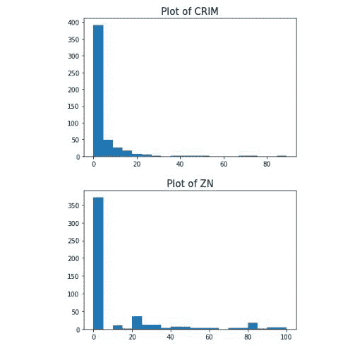

    图 3.32：使用 for 循环对所有变量进行部分绘图

    注

    要查看所有图表，请访问以下链接：[`packt.live/2AGb95F`](https://packt.live/2AGb95F)。

    犯罪率可能是房价的指标（人们不想住在高犯罪率地区）。在某些情况下，将多个图表放在一起可以方便地分析各种变量。在前一组图表中，我们可以看到数据中的几个独特峰值：`INDIUS`、`TAX`和`RAD`。通过进一步探索性分析，我们可以了解更多。在查看前一组图表后，我们可能想要将一个变量与另一个变量进行绘图。

1.  创建犯罪率与价格散点图：

    ```py
    plt.scatter(df1['CRIM'], df1['PRICE'])
    plt.show()
    ```

    输出如下：

    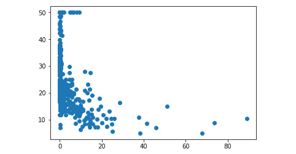

    图 3.33：犯罪率与价格散点图

    如果我们将`log10(crime)`与`price`进行绘图，我们可以更好地理解这种关系。

1.  创建`log10(crime)`与价格的关系图：

    ```py
    plt.scatter(np.log10(df1['CRIM']),df1['PRICE'], c='red')
    plt.title("Crime rate (Log) vs. Price plot", fontsize=18)
    plt.xlabel("Log of Crime rate",fontsize=15)
    plt.ylabel("Price",fontsize=15)
    plt.grid(True)
    plt.show()
    ```

    输出如下：

    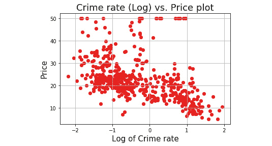

    图 3.34：犯罪率（对数）与价格散点图

1.  计算每套住宅的平均房间数：

    ```py
    df1['RM'].mean()
    ```

    输出如下：

    ```py
    6.284634387351788
    ```

1.  计算中位数年龄：

    ```py
    df1['AGE'].median()
    ```

    输出如下：

    ```py
    77.5
    ```

1.  计算到五个波士顿就业中心的平均（均值）距离：

    ```py
    df1['DIS'].mean()
    ```

    输出如下：

    ```py
    3.795042687747034
    ```

1.  计算小于`20`的房价：

    ```py
    low_price=df1['PRICE']<20
    print(low_price)
    ```

    输出如下：

    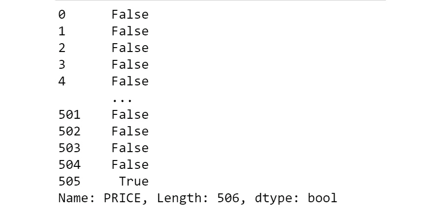

    图 3.35：low_price 的输出

    这将创建一个`True, False`的布尔数组，`True = 1`，`False = 0`。如果您取这个 NumPy 数组的平均值，您将知道有多少`1(True)`值。

1.  计算此数组的平均值：

    ```py
    # That many houses are priced below 20,000\. 
    # So that is the answer. 
    low_price.mean()
    ```

    输出如下：

    ```py
    0.4150197628458498
    ```

1.  计算低价房屋（< $20,000）的百分比：

    ```py
    # You can convert that into percentage
    # Do this by multiplying with 100
    pcnt=low_price.mean()*100
    print("\nPercentage of house with <20,000 price is: ", pcnt)
    ```

    输出如下：

    ```py
    Percentage of house with <20,000 price is: 41.50197628458498
    ```

    注

    要访问此特定部分的源代码，请参阅[`packt.live/2AGb95F`](https://packt.live/2AGb95F)。

    您也可以在[`packt.live/2YT3Hfg`](https://packt.live/2YT3Hfg)上在线运行此示例。

# 4. 使用 Python 深入数据整理

## 活动 4.01：使用成人收入数据集（UCI）

**解决方案：**

完成此活动的步骤如下：

1.  加载必要的库：

    ```py
    import numpy as np
    import pandas as pd
    import matplotlib.pyplot as plt
    ```

1.  从本地目录中读取成人收入数据集（以`.csv`文件给出）并检查前五条记录：

    ```py
    df = pd.read_csv("../datasets/adult_income_data.csv")
    df.head()
    ```

    注

    根据您系统上文件的位置，必须更改突出显示的路径。

    输出如下：

    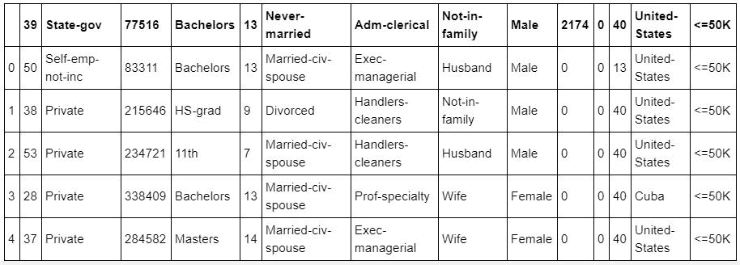

    图 4.76：显示.csv 文件前五条记录的 DataFrame

1.  创建一个脚本，该脚本将逐行读取文本文件并提取第一行，即`.csv`文件的标题行：

    ```py
    names = []
    with open('../datasets/adult_income_names.txt','r') as f:
        for line in f:
            f.readline()
            var=line.split(":")[0]
            names.append(var)
    names
    ```

    注

    根据您系统上文件的位置，必须更改高亮显示的路径。

    输出如下：

    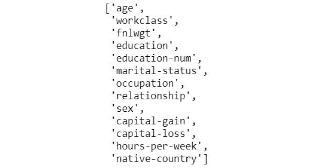

    图 4.77：数据库中列的名称

1.  使用 `append` 命令将响应变量（最后一列）的名称 `Income` 添加到数据集中：

    ```py
    names.append('Income')
    ```

1.  使用以下命令再次读取新文件：

    ```py
    df = pd.read_csv("../datasets/adult_income_data.csv", names=names)
    df.head()
    ```

    备注

    根据您系统上文件的位置，必须更改高亮显示的路径。

    输出如下：

    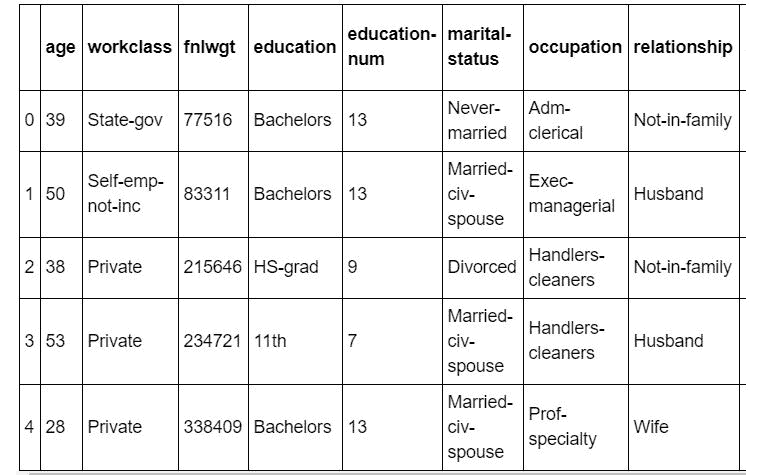

    图 4.78：添加了收入列的 DataFrame

1.  使用 `describe` 命令获取数据集的统计摘要：

    ```py
    df.describe()
    ```

    输出如下：

    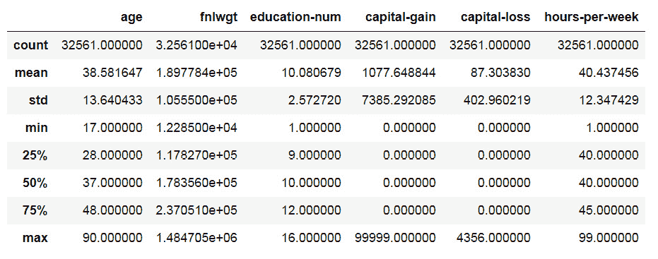

    图 4.79：数据集的统计摘要

    注意，只包含少量列。数据集中许多变量具有多个因素或类别。

1.  使用以下命令列出类中所有变量的列表：

    ```py
    # Make a list of all variables with classes
    vars_class = ['workclass','education','marital-status',\
                  'occupation','relationship','sex','native-country']
    ```

1.  使用以下命令创建循环以计数并打印它们：

    ```py
    for v in vars_class:
        classes=df[v].unique()
        num_classes = df[v].nunique()
        print("There are {} classes in the \"{}\" column. "\
              "They are: {}".format(num_classes,v,classes))
        print("-"*100)
    ```

    输出（部分显示）如下：

    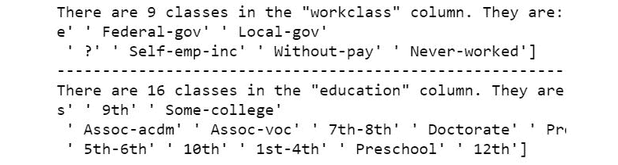

    图 4.80：不同因素或类别的输出

1.  使用以下命令查找缺失值：

    ```py
    df.isnull().sum()
    ```

    输出如下：

    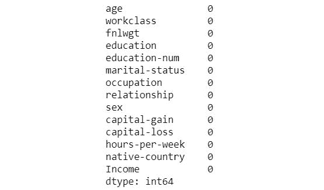

    图 4.81：查找缺失值

1.  使用子集操作创建仅包含 `age`、`education` 和 `occupation` 的 DataFrame：

    ```py
    df_subset = df[['age','education', 'occupation']]
    df_subset.head()
    ```

    输出如下：

    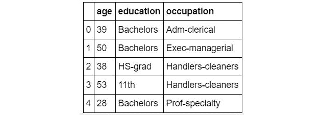

    图 4.82：DataFrame 的子集

1.  绘制分组大小为 20 的年龄直方图：

    ```py
    df_subset['age'].hist(bins=20)
    ```

    输出如下：

    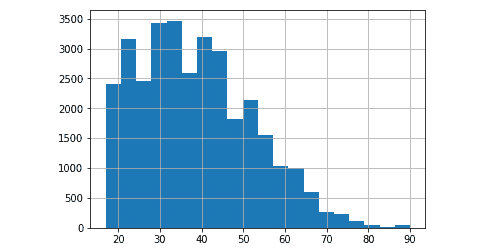

    图 4.83：年龄的直方图，分组大小为 20

1.  以 `25x10` 的长图尺寸绘制按 `education` 分组的 `age` 的箱线图（使 `x` 轴刻度的字体大小为 `15`）：

    ```py
    df_subset.boxplot(column='age',by='education',figsize=(25,10))
    plt.xticks(fontsize=15)
    plt.xlabel("Education",fontsize=20)
    plt.show()
    ```

    输出如下：

    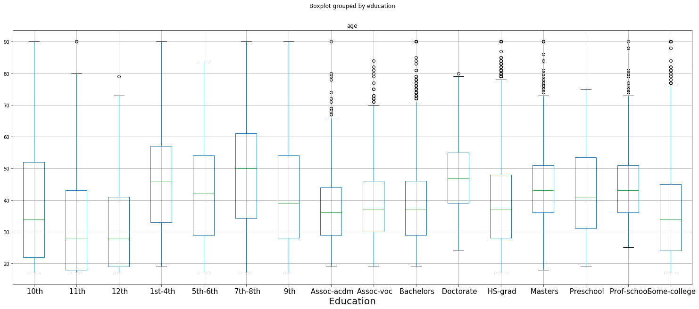

    图 4.84：按教育分组年龄的箱线图

    在进行任何进一步操作之前，我们需要使用本章中学习的 `apply` 方法。结果发现，从 CSV 文件中读取数据集时，所有字符串前都带有空格字符。因此，我们需要从所有字符串中删除该空格。

1.  创建一个用于删除空格字符的函数：

    ```py
    def strip_whitespace(s):
        return s.strip()
    ```

1.  使用 `apply` 方法将此函数应用于所有具有字符串值的列，创建一个新列，将此新列的值复制到旧列中，然后删除新列。这是首选方法，以免意外删除有价值的数据。大多数时候，您需要创建一个具有所需操作的新列，并在必要时将其复制回旧列。忽略打印的任何警告消息：

    ```py
    # Education column
    df_subset['education_stripped'] = df['education']\
                                      .apply(strip_whitespace)
    df_subset['education'] = df_subset['education_stripped']
    df_subset.drop(labels = ['education_stripped'],\
                   axis=1,inplace=True)
    # Occupation column
    df_subset['occupation_stripped'] = df['occupation']\
                                       .apply(strip_whitespace)
    df_subset['occupation'] = df_subset['occupation_stripped']
    df_subset.drop(labels = ['occupation_stripped'],\
                   axis=1,inplace=True)
    ```

    这是样本警告消息，你应该忽略：

    ![图 4.85：要忽略的警告消息

    ![图片 B15780_04_85.jpg]

    图 4.85：要忽略的警告消息

1.  使用以下命令查找`30`至`50`岁（含）之间的人数：

    ```py
    # Conditional clauses and join them by & (AND) 
    df_filtered=df_subset[(df_subset['age']>=30) \
                          & (df_subset['age']<=50)]
    ```

1.  检查新数据集的内容：

    ```py
    df_filtered.head()
    ```

    输出如下：

    ![图 4.86：新 DataFrame 的内容

    ![图片 B15780_04_86.jpg]

    图 4.86：新 DataFrame 的内容

1.  查找过滤后的 DataFrame 的`shape`，并将元组的索引指定为 0 以返回第一个元素：

    ```py
    answer_1=df_filtered.shape[0]
    answer_1
    ```

    输出如下：

    ```py
    16390
    ```

1.  使用以下命令打印`30`至`50`岁之间的人数：

    ```py
    print("There are {} people of age between 30 and 50 "\
          "in this dataset.".format(answer_1))
    ```

    输出如下：

    ```py
    There are 16390 people of age between 30 and 50 in this dataset.
    ```

1.  按照职业分组并显示年龄的汇总统计。找出平均年龄最大的职业以及哪个职业在其劳动力中超过`75th`百分位的人数最多：

    ```py
    df_subset.groupby('occupation').describe()['age']
    ```

    输出如下：

    ![图 4.87：按年龄和教育分组的数据的 DataFrame

    ![图片 B15780_04_87.jpg]

    图 4.87：按年龄和教育分组的数据的 DataFrame

    代码返回`79 rows × 1 columns`。

1.  使用子集和`groupBy`来查找异常值：

    ```py
    occupation_stats=df_subset.groupby('occupation').describe()['age']
    ```

1.  在柱状图中绘制值：

    ```py
    plt.figure(figsize=(15,8))
    plt.barh(y=occupation_stats.index, \
             width=occupation_stats['count'])
    plt.yticks(fontsize=13)
    plt.show()
    ```

    输出如下：

    ![图 4.88：显示职业统计的柱状图

    ![图片 B15780_04_88.jpg]

    图 4.88：显示职业统计的柱状图

    是否有某个职业群体代表性非常低？也许我们应该删除这些数据，因为数据非常低，该群体在分析中不会很有用。仅通过查看*图 4.89*，你应该能够看到`Armed-Forces`群体只有`9`个计数，即`9`个数据点。但我们如何检测到这一点？通过在柱状图中绘制计数列。注意`barh`函数的第一个参数是 DataFrame 的索引，它是职业群体的汇总统计。我们可以看到`Armed-Forces`群体几乎没有数据。这个活动教你，有时，异常值不仅仅是一个值，而可以是一个整个群体。这个群体的数据是好的，但太小，无法用于任何分析。因此，在这种情况下，它可以被视为异常值。但始终使用你的业务知识和工程判断来进行此类异常值检测以及如何处理它们。我们现在将练习使用公共键合并两个数据集。

1.  假设你被给出了两个数据集，其中公共键是`occupation`。首先，通过从完整数据集中随机抽取样本创建两个这样的不相交数据集，然后尝试合并。每个数据集至少包括两个其他列，以及公共键列。注意，如果公共键不是唯一的，合并后的数据集可能比两个起始数据集中的任何一个都有更多的数据点：

    ```py
    df_1 = df[['age','workclass','occupation']]\
              .sample(5,random_state=101)
    df_1.head()
    ```

    输出如下：

    ![图 4.89：合并公共键后的输出

    ![图片 B15780_04_89.jpg]

    ```py
    df_2 = df[['education','occupation']].sample(5,random_state=101)
    df_2.head()
    ```

    输出如下：

    

    图 4.90：合并共同键后的输出

1.  将两个数据集合并在一起：

    ```py
    df_merged = pd.merge(df_1,df_2,on='occupation',\
                         how='inner').drop_duplicates()
    df_merged
    ```

    输出如下：

    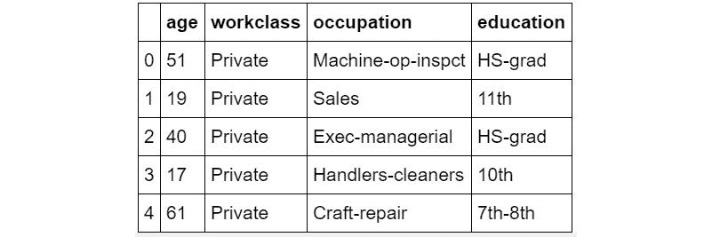

    

图 4.91：不同职业值的输出

注意

要访问此特定部分的源代码，请参阅 [`packt.live/37IamwR`](https://packt.live/37IamwR)。

您也可以在 [`packt.live/2YhuF1j`](https://packt.live/2YhuF1j) 上运行此示例。

# 5. 熟悉不同类型的数据源

## 活动 5.01：从网页读取表格数据并创建 DataFrame

**解决方案：**

这些是完成此活动的步骤：

1.  使用以下命令导入 `BeautifulSoup` 并加载数据：

    ```py
    from bs4 import BeautifulSoup
    import pandas as pd
    ```

1.  使用以下命令打开 Wikipedia 文件：

    ```py
    fd = open("../datasets/List of countries by GDP (nominal) "\
              "- Wikipedia.htm", "r", encoding = "utf-8")
    soup = BeautifulSoup(fd)
    fd.close()
    ```

    注意

    不要忘记根据您系统上的位置更改数据集的路径（已高亮显示）

1.  使用以下命令计算表格：

    ```py
    all_tables = soup.find_all("table")
    print("Total number of tables are {} ".format(len(all_tables)))
    ```

    总共有九个表格。

1.  使用 `class` 属性通过以下命令查找正确的表格：

    ```py
    data_table = soup.find("table", {"class": '"wikitable"|}'})
    print(type(data_table))
    ```

    输出如下：

    ```py
    <class 'bs4.element.Tag'>
    ```

1.  使用以下命令通过以下命令将源和实际数据分开：

    ```py
    sources = data_table.tbody.findAll('tr', recursive=False)[0]
    sources_list = [td for td in sources.findAll('td')]
    print(len(sources_list))
    ```

    输出如下：

    ```py
    3
    ```

1.  使用以下命令通过 `findAll` 函数从 `data_table` 的 `body` 标签中查找数据：

    ```py
    data = data_table.tbody.findAll('tr', recursive=False)[1]\
                                    .findAll('td', recursive=False)
    ```

1.  使用 `findAll` 函数通过以下命令从 `data_table` 的 `td` 标签中查找数据：

    ```py
    data_tables = []
    for td in data:
        data_tables.append(td.findAll('table'))
    ```

1.  使用以下命令查找 `data_tables` 的长度：

    ```py
    len(data_tables)
    ```

    输出如下：

    ```py
    3
    ```

1.  使用以下命令检查如何获取源名称：

    ```py
    source_names = [source.findAll('a')[0].getText() \
                    for source in sources_list]
    print(source_names)
    ```

    输出如下：

    ```py
    ['International Monetary Fund', 'World Bank', 'United Nations']
    ```

1.  将第一个来源的标题和数据分开：

    ```py
    header1 = [th.getText().strip() for th in \
               data_tables[0][0].findAll('thead')[0].findAll('th')]
    header1
    ```

    输出如下：

    ```py
    ['Rank', 'Country', 'GDP(US$MM)']
    ```

1.  使用 `findAll` 从 `data_tables` 中查找行：

    ```py
    rows1 = data_tables[0][0].findAll('tbody')[0].findAll('tr')[1:]
    ```

1.  使用 `strip` 函数对每个 `td` 标签进行查找以从 `rows1` 中获取数据：

    ```py
    data_rows1 = [[td.get_text().strip() for td in \
                   tr.findAll('td')] for tr in rows1]
    ```

1.  查找 DataFrame：

    ```py
    df1 = pd.DataFrame(data_rows1, columns=header1)
    df1.head()
    ```

    输出如下：

    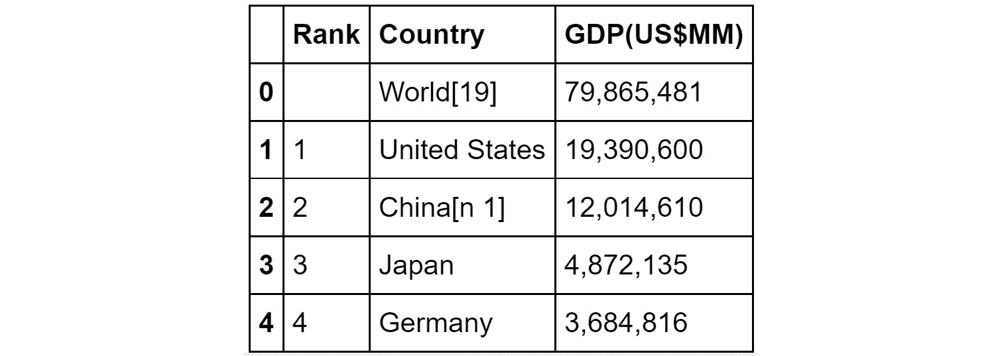

    

    图 5.35：从网页创建的 DataFrame

1.  使用以下命令对其他两个来源执行相同的操作：

    ```py
    header2 = [th.getText().strip() for th in data_tables[1][0]\
               .findAll('thead')[0].findAll('th')]
    header2
    ```

    输出如下：

    ```py
    ['Rank', 'Country', 'GDP(US$MM)']
    ```

1.  使用 `findAll` 通过以下命令从 `data_tables` 中查找行：

    ```py
    rows2 = data_tables[1][0].findAll('tbody')[0].findAll('tr')
    ```

1.  使用以下命令通过 `strip` 函数定义 `find_right_text`：

    ```py
    def find_right_text(i, td):
        if i == 0:
            return td.getText().strip()
        elif i == 1:
            return td.getText().strip()
        else:
            index = td.text.find("♠")
            return td.text[index+1:].strip()
    ```

1.  使用以下命令通过 `find_right_text` 从 `data_rows` 中查找行：

    ```py
    data_rows2 = [[find_right_text(i, td) for i, td in \
                   enumerate(tr.findAll('td'))] for tr in rows2]
    ```

1.  使用以下命令计算 `df2` DataFrame：

    ```py
    df2 = pd.DataFrame(data_rows2, columns=header2)
    df2.head()
    ```

    输出如下：

    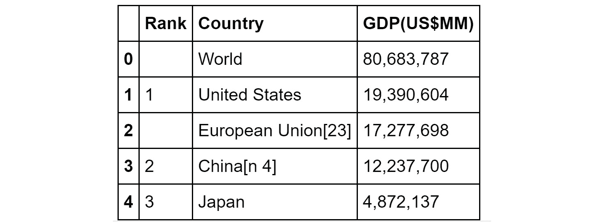

    

    图 5.36：DataFrame 的输出

1.  现在，使用以下命令对第三个 DataFrame 执行相同的操作：

    ```py
    header3 = [th.getText().strip() for th in data_tables[2][0]\
               .findAll('thead')[0].findAll('th')]
    header3
    ```

    输出如下：

    ```py
    ['Rank', 'Country', 'GDP(US$MM)']
    ```

1.  使用 `findAll` 通过以下命令从 `data_tables` 中查找行：

    ```py
    rows3 = data_tables[2][0].findAll('tbody')[0].findAll('tr')
    ```

1.  使用 `find_right_text` 从 `data_rows3` 中查找行：

    ```py
    data_rows3 = [[find_right_text(i, td) for i, td in \
                   enumerate(tr.findAll('td'))] for tr in rows2]
    ```

1.  使用以下命令计算 `df3` DataFrame：

    ```py
    df3 = pd.DataFrame(data_rows3, columns=header3)
    df3.head()
    ```

    输出如下：

    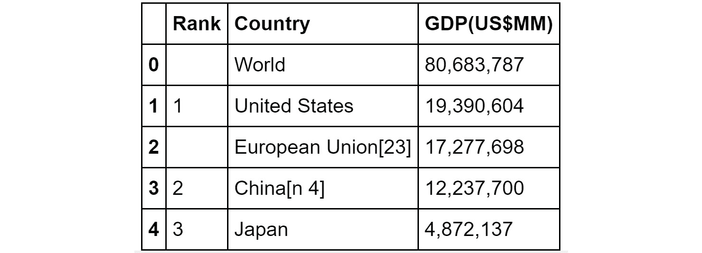

    

图 5.37：第三个 DataFrame

注意

要访问此特定部分的源代码，请参阅[`packt.live/2NaCrDB`](https://packt.live/2NaCrDB)。

你也可以在[`packt.live/2YRAukP`](https://packt.live/2YRAukP)上在线运行此示例。

# 6. 学习数据整理的隐藏秘密

## 活动六.01：处理异常值和缺失数据

**解决方案：**

完成此活动的步骤如下：

注意

用于此活动的数据集可以在[`packt.live/2YajrLJ`](https://packt.live/2YajrLJ)找到。

1.  加载数据：

    ```py
    import pandas as pd
    import numpy as np
    import matplotlib.pyplot as plt
    %matplotlib inline
    ```

1.  读取`.csv`文件：

    ```py
    df = pd.read_csv("../datasets/visit_data.csv")
    ```

    注意

    不要忘记根据 CSV 文件在系统中的保存位置更改路径（高亮显示）。

1.  打印 DataFrame 中的数据：

    ```py
    df.head()
    ```

    输出结果如下：

    

    图 6.11：CSV 文件的内容

    如我们所见，有一些数据值缺失，如果我们检查这些，我们会看到一些异常值。

1.  使用以下命令检查重复项：

    ```py
    print("First name is duplicated - {}"\
          .format(any(df.first_name.duplicated())))
    print("Last name is duplicated - {}"\
          .format(any(df.last_name.duplicated())))
    print("Email is duplicated - {}"\
          .format(any(df.email.duplicated())))
    ```

    输出结果如下：

    ```py
    First name is duplicated - True
    Last name is duplicated - True
    Email is duplicated - False
    ```

    在名字的首位和末位都存在重复，这是正常的。然而，正如我们所见，电子邮件中没有重复。这是好的。

1.  检查是否有任何重要列包含`NaN`：

    ```py
    """
    Notice that we have different ways to 
    format boolean values for the % operator
    """
    print("The column Email contains NaN - %r " % \
          df.email.isnull().values.any())
    print("The column IP Address contains NaN - %s " % \
          df.ip_address.isnull().values.any())
    print("The column Visit contains NaN - %s " % \
          df.visit.isnull().values.any())
    ```

    输出结果如下：

    ```py
    The column Email contains NaN - False 
    The column IP Address contains NaN - False 
    The column Visit contains NaN - True 
    ```

    `访问`列包含一些`NaN`值。鉴于手头的最终任务可能是预测访问次数，我们无法对没有该信息的行进行处理。它们是一种异常值。让我们去除它们。

1.  去除异常值：

    ```py
    """
    There are various ways to do this. This is just one way. We encourage you   to explore other ways. But before that we need to store the previous size of the data set and we  will compare it with the new size
    """
    size_prev = df.shape
    df = df[np.isfinite(df['visit'])] 
    #This is an inplace operation.
    # After this operation the original DataFrame is lost.
    size_after = df.shape
    ```

1.  报告大小差异：

    ```py
    # Notice how parameterized format is used.
    # Then, the indexing is working inside the quote marks
    print("The size of previous data was - {prev[0]} rows and "\
          "the size of the new one is - {after[0]} rows"\
          .format(prev=size_prev, after=size_after))
    ```

    输出结果如下：

    ```py
    The size of previous data was - 1000 rows and the size of the new one is - 974 rows
    ```

1.  绘制箱线图以查找数据中是否存在异常值：

    ```py
    plt.boxplot(df.visit, notch=True)
    ```

    箱线图如下：

    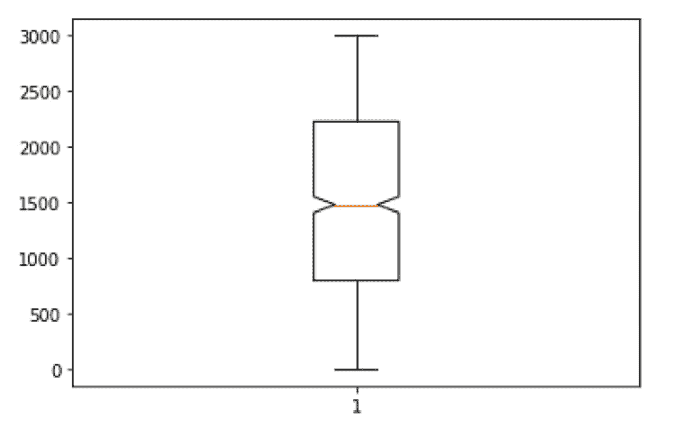

    图 6.12：使用数据的箱线图

    如我们所见，我们在这个列中有数据，范围在（`0, 3000`）之间。然而，数据的主要集中区域在`~700`和`~2300`之间。

1.  去除超出`2900`和低于`100`的值——这些对我们来说是异常值。我们需要去除它们：

    ```py
    df1 = df[(df['visit'] <= 2900) & (df['visit'] >= 100)]
    # Notice the  powerful & operator
    """
    Here we abuse the fact the 
    number of variable can be greater 
    than the number of replacement targets
    """
    print("After getting rid of outliers the new size of the data "\
          "is - {}".format(*df1.shape))
    ```

    输出结果如下：

    ```py
    After getting rid of outliers the new size of the data is - 923
    ```

    注意

    要访问此特定部分的源代码，请参阅[`packt.live/2AFcSbn`](https://packt.live/2AFcSbn)。

    你也可以在[`packt.live/3fAL9qY`](https://packt.live/3fAL9qY)上在线运行此示例

# 7. 高级网络抓取和数据收集

## 活动七.01：从古腾堡提取前 100 本电子书

**解决方案：**

这些是完成此活动的步骤：

1.  导入必要的库，包括正则表达式和`BeautifulSoup`：

    ```py
    import urllib.request, urllib.parse, urllib.error
    import requests
    from bs4 import BeautifulSoup
    import ssl
    import re
    ```

1.  从 URL 读取 HTML：

    ```py
    top100url = 'https://www.gutenberg.org/browse/scores/top'
    response = requests.get(top100url)
    ```

1.  编写一个小函数来检查网络请求的状态：

    ```py
    def status_check(r):
        if r.status_code==200:
            print("Success!")
            return 1
        else:
            print("Failed!")
            return -1
    ```

1.  检查响应状态：

    ```py
    status_check(response)
    ```

    输出结果如下：

    ```py
    Success!
    1
    ```

1.  解码响应并将其传递给`BeautifulSoup`进行 HTML 解析：

    ```py
    contents = response.content.decode(response.encoding)
    soup = BeautifulSoup(contents, 'html.parser')
    ```

1.  查找所有的 href 标签并将它们存储在链接列表中。

    ```py
    # Empty list to hold all the http links in the HTML page
    lst_links=[]
    # Find all href tags and store them in the list of links
    for link in soup.find_all('a'):
        #print(link.get('href'))
        lst_links.append(link.get('href'))
    ```

1.  检查列表的外观——打印前 30 个元素：

    ```py
    lst_links[:30]
    ```

    输出结果（部分显示）如下：

    ```py
    ['/wiki/Main_Page',
     '/catalog/',
     '/ebooks/',
     '/browse/recent/last1',
     '/browse/scores/top',
     '/wiki/Gutenberg:Offline_Catalogs',
     '/catalog/world/mybookmarks',
     '/wiki/Main_Page',
    'https://www.paypal.com/xclick/business=donate%40gutenberg.org&item_name=Donation+to+Project+Gutenberg',
     '/wiki/Gutenberg:Project_Gutenberg_Needs_Your_Donation',
     'http://www.ibiblio.org',
     'http://www.pgdp.net/',
     'pretty-pictures',
     '#books-last1',
     '#authors-last1',
     '#books-last7',
     '#authors-last7',
     '#books-last30',
     '#authors-last30',
     '/ebooks/1342',
     '/ebooks/84',
     '/ebooks/1080',
     '/ebooks/46',
     '/ebooks/219',
     '/ebooks/2542',
     '/ebooks/98',
     '/ebooks/345',
     '/ebooks/2701',
     '/ebooks/844',
     '/ebooks/11']
    ```

1.  使用正则表达式查找这些链接中的数字。这些是顶级 100 本书的文件编号。初始化一个空列表来存储文件编号：

    ```py
    booknum=[]
    ```

    原始链接列表中的第 19 到 118 号数字是顶级 100 本电子书的编号。

1.  遍历适当的范围并使用正则表达式在链接（`href`）字符串中查找数字。使用`findall()`方法：

    ```py
    for i in range(19,119):
        link=lst_links[i]
        link=link.strip()
        """
        Regular expression to find the numeric digits in the link (href) string
        """
        n=re.findall('[0-9]+',link)
        if len(n)==1:
            # Append the filenumber casted as integer
            booknum.append(int(n[0]))
    ```

1.  打印文件编号：

    ```py
    print("\nThe file numbers for the top 100 ebooks",\
          "on Gutenberg are shown below\n"+"-"*70)
    print(booknum)
    ```

    输出如下：

    ```py
    The file numbers for the top 100 ebooks on Gutenberg are shown below
    ----------------------------------------------------------------------
    [1342, 84, 1080, 46, 219, 2542, 98, 345, 2701, 844, 11, 5200, 
    43, 16328, 76, 74, 1952, 6130, 2591, 1661, 41, 174, 23, 1260, 
    1497, 408, 3207, 1400, 30254, 58271, 1232, 25344, 58269, 158, 
    44881, 1322, 205, 2554, 1184, 2600, 120, 16, 58276, 5740, 34901, 
    28054, 829, 33, 2814, 4300, 100, 55, 160, 1404, 786, 58267, 3600, 
    19942, 8800, 514, 244, 2500, 2852, 135, 768, 58263, 1251, 3825, 
    779, 58262, 203, 730, 20203, 35, 1250, 45, 161, 30360, 7370, 
    58274, 209, 27827, 58256, 33283, 4363, 375, 996, 58270, 521, 
    58268, 36, 815, 1934, 3296, 58279, 105, 2148, 932, 1064, 13415]
    ```

    注意

    由于顶级 100 本书的列表经常更新，你得到的结果可能会有所不同。

    `soup`对象的文本看起来像什么？

1.  使用`.text`方法并仅打印前 2,000 个字符（不要打印整个内容，因为它太长了）。

    你会注意到这里和那里有很多空格/空白。忽略它们。它们是 HTML 页面的标记和其随意性质的一部分：

    ```py
    print(soup.text[:2000])
    ```

    输出如下：

    ```py
    if (top != self) {
             top.location.replace (http://www.gutenberg.org);
             alert ('Project Gutenberg is a FREE service with NO membership required. If you paid somebody else to get here, make them give you your money back!');
             }
        Top 100 - Project Gutenberg
    Online Book Catalog
     Book  Search
    -- Recent  Books
    -- Top  100
    -- Offline Catalogs
    -- My Bookmarks
    Main Page
    …
    Pretty Pictures
    Top 100 EBooks yesterday —
      Top 100 Authors yesterday —
      Top 100 EBooks last 7 days —
      Top 100 Authors last 7 days —
      Top 100 EBooks last 30 days —
      Top 100 Authors last 30 days
    Top 100 EBooks yesterday
    Pride and Prejudice by Jane Austen (1826)
    Frankenstein; Or, The Modern Prometheus by Mary Wollstonecraft Shelley (1367)
    A Modest Proposal by Jonathan Swift (1020)
    A Christmas Carol in Prose; Being a Ghost Story of Christmas by Charles Dickens (953)
    Heart of Darkness by Joseph Conrad (887)
    Et dukkehjem. English by Henrik Ibsen (761)
    A Tale of Two Cities by Charles Dickens (741)
    Dracula by Bram Stoker (732)
    Moby Dick; Or, The Whale by Herman Melville (651)
    The Importance of Being Earnest: A Trivial Comedy for Serious People by Oscar Wilde (646)
    Alice's Adventures in Wonderland by Lewis Carrol
    ```

1.  在从`soup`对象提取的文本（使用正则表达式）中搜索以找到昨天排名的顶级 100 本电子书的名称：

    ```py
    lst_titles_temp=[]
    ```

1.  创建一个起始索引。它应该指向文本“昨天顶级 100 本电子书”。使用`soup.text`的`splitlines`方法。它将`soup`对象的文本行分割：

    ```py
    start_idx=soup.text.splitlines().index('Top 100 EBooks yesterday')
    ```

    注意

    由于顶级 100 本书的列表经常更新，你得到的结果可能会有所不同。

1.  从`1-100`运行`for`循环，将下一`100`行的字符串添加到这个临时列表中。`splitlines`方法：

    ```py
    for i in range(100):
        lst_titles_temp.append(soup.text.splitlines()[start_idx+2+i])
    ```

1.  使用正则表达式从名称字符串中提取仅文本并将其附加到一个空列表中。使用`match`和`span`来找到索引并使用它们：

    ```py
    lst_titles=[]
    for i in range(100):
        id1,id2=re.match('^[a-zA-Z ]*',lst_titles_temp[i]).span()
        lst_titles.append(lst_titles_temp[i][id1:id2])
    ```

1.  打印标题列表：

    ```py
    for l in lst_titles:
        print(l)
    ```

    部分输出如下：

    ```py
    Pride and Prejudice by Jane Austen 
    Frankenstein
    A Modest Proposal by Jonathan Swift 
    A Christmas Carol in Prose
    Heart of Darkness by Joseph Conrad 
    Et dukkehjem
    A Tale of Two Cities by Charles Dickens 
    Dracula by Bram Stoker 
    Moby Dick
    The Importance of Being Earnest
    Alice
    Metamorphosis by Franz Kafka 
    The Strange Case of Dr
    Beowulf
    …
    The Russian Army and the Japanese War
    Calculus Made Easy by Silvanus P
    Beyond Good and Evil by Friedrich Wilhelm Nietzsche 
    An Occurrence at Owl Creek Bridge by Ambrose Bierce 
    Don Quixote by Miguel de Cervantes Saavedra 
    Blue Jackets by Edward Greey 
    The Life and Adventures of Robinson Crusoe by Daniel Defoe 
    The Waterloo Campaign 
    The War of the Worlds by H
    Democracy in America 
    Songs of Innocence
    The Confessions of St
    Modern French Masters by Marie Van Vorst 
    Persuasion by Jane Austen 
    The Works of Edgar Allan Poe 
    The Fall of the House of Usher by Edgar Allan Poe 
    The Masque of the Red Death by Edgar Allan Poe 
    The Lady with the Dog and Other Stories by Anton Pavlovich Chekhov
    ```

    注意

    由于顶级 100 本书的列表经常更新，你得到的结果可能会有所不同。

在这里，我们看到了如何使用`BeautifulSoup`和正则表达式混合来从非常杂乱和庞大的源数据中提取信息。这些是在处理数据整理时你将每天必须执行的某些基本步骤。

注意

要访问此特定部分的源代码，请参阅[`packt.live/2BltmFo`](https://packt.live/2BltmFo)。

你也可以在[`packt.live/37FdLwD`](https://packt.live/37FdLwD)上在线运行此示例。

## 活动第 7.02 节：通过读取 API 构建自己的电影数据库

**解决方案**

注意

在你开始之前，请确保修改`APIkeys.json`文件并将你的秘密 API 密钥添加到其中。文件链接：[`packt.live/2CmIpze`](https://packt.live/2CmIpze)。

这些是完成此活动的步骤：

1.  导入`urllib.request`、`urllib.parse`、`urllib.error`和`json`：

    ```py
    import urllib.request, urllib.parse, urllib.error
    import json
    ```

1.  从同一文件夹中的 JSON 文件加载秘密 API 密钥（你必须从 OMDb 网站获取一个并使用它；它有每天 1,000 次的 API 密钥限制），通过使用`json.loads()`将其存储在一个变量中：

    注意

    以下单元格在解决方案笔记本中不会执行，因为作者不能提供他们的私人 API 密钥。

    学生/用户需要获取一个密钥并将其存储在一个 JSON 文件中。我们称此文件为`APIkeys.json`。

1.  使用以下命令打开 `APIkeys.json` 文件：

    ```py
    with open('APIkeys.json') as f:
        keys = json.load(f)
        omdbapi = keys['OMDBapi']
    ```

    需要传递的最终 URL 应该看起来像这样：[`www.omdbapi.com/?t=movie_name&apikey=secretapikey`](http://www.omdbapi.com/?t=movie_name&apikey=secretapikey).

1.  使用以下命令将 OMDb 门户 ([`www.omdbapi.com/?`](http://www.omdbapi.com/?)) 作为字符串分配给一个名为 `serviceurl` 的变量：

    ```py
    serviceurl = 'http://www.omdbapi.com/?'
    ```

1.  创建一个名为 `apikey` 的变量，其值为 URL 的最后一部分（`&apikey=secretapikey`），其中 `secretapikey` 是您自己的 API 密钥。电影名称部分是 `t=movie_name`，稍后将会处理：

    ```py
    apikey = '&apikey='+omdbapi
    ```

1.  编写一个名为 `print_json` 的实用函数，用于从 JSON 文件（我们将从门户获取）中打印电影数据。以下是 JSON 文件的键：`'Title', 'Year', 'Rated', 'Released', 'Runtime', 'Genre', 'Director', 'Writer', 'Actors', 'Plot', 'Language','Country', 'Awards', 'Ratings', 'Metascore', 'imdbRating', 'imdbVotes', and 'imdbID'`：

    ```py
    def print_json(json_data):
        list_keys = ['Title', 'Year', 'Rated', 'Released',\
                     'Runtime', 'Genre', 'Director', 'Writer', \
                     'Actors', 'Plot', 'Language', 'Country', \
                     'Awards', 'Ratings','Metascore', 'imdbRating', \
                     'imdbVotes', 'imdbID']
        print("-"*50)
        for k in list_keys:
            if k in list(json_data.keys()):
                print(f"{k}: {json_data[k]}")
        print("-"*50)
    ```

1.  编写一个实用函数，根据 JSON 数据集中的信息下载电影海报，并将其保存在本地文件夹中。使用 `os` 模块。海报数据存储在 JSON 键 `Poster` 中。你可能想要拆分海报文件的名称并提取文件扩展名。比如说，扩展名是 `.jpg`。我们稍后可以将这个扩展名与电影名称连接起来，创建一个文件名，例如 `movie.jpg`。使用 `open` Python 命令打开文件并写入海报数据。完成后关闭文件。此函数可能不会返回任何内容。它只是将海报数据保存为图像文件：

    ```py
    def save_poster(json_data):
        import os
        title = json_data['Title']
        poster_url = json_data['Poster']
        """
        Splits the poster url by '.' and 
        picks up the last string as file extension
        """
        poster_file_extension=poster_url.split('.')[-1]
        # Reads the image file from web
        poster_data = urllib.request.urlopen(poster_url).read()
        savelocation=os.getcwd()+'\\'+'Posters'+'\\'
        """ 
        Creates new directory if the directory does not exist.
        Otherwise, just use the existing path.
        """
        if not os.path.isdir(savelocation):
            os.mkdir(savelocation)
        filename=savelocation+str(title)\
                 +'.'+poster_file_extension
        f=open(filename,'wb')
        f.write(poster_data)
        f.close()
    ```

1.  编写一个名为 `search_movie` 的实用函数，通过电影名称搜索电影，打印下载的 JSON 数据（为此使用 `print_json` 函数），并将电影海报保存在本地文件夹中（为此使用 `save_poster` 函数）。使用 try-except 循环进行此操作，即尝试连接到网络门户。如果成功，则继续，如果不成功（即，如果引发异常），则仅打印错误消息。使用之前创建的变量 `serviceurl` 和 `apikey`。你必须传递一个包含键 t 和电影名称作为相应值的字典给 `urllib.parse.urlencode` 函数，然后将 `serviceurl` 和 `apikey` 变量添加到函数的输出中，以构造完整的 URL。此 URL 将用于访问数据。JSON 数据有一个名为 Response 的键。如果它是 True，则表示读取成功。在处理数据之前检查这一点。如果不成功，则打印 JSON 键 Error，它将包含电影数据库返回的适当错误消息：

    ```py
    def search_movie(title):
        try:
            url = serviceurl \
                  + urllib.parse.urlencode({'t':str(title)})+apikey
            print(f'Retrieving the data of "{title}" now... ')
            print(url)
            uh = urllib.request.urlopen(url)
            data = uh.read()
            json_data=json.loads(data)
            if json_data['Response']=='True':
                print_json(json_data)
                """
                Asks user whether to download the poster of the movie
                """
                if json_data['Poster']!='N/A':
                    save_poster(json_data)
                else:
                    print("Error encountered: ", json_data['Error'])
        except urllib.error.URLError as e:
            print(f"ERROR: {e.reason}")
    ```

1.  通过输入 `Titanic` 测试 `search_movie` 函数：

    ```py
    search_movie("Titanic")
    ```

    以下是获取到的 `Titanic` 的数据：

    ```py
    http://www.omdbapi.com/?t=Titanic&apikey=<your api key> 
    --------------------------------------------------
    Title: Titanic
    Year: 1997
    Rated: PG-13
    Released: 19 Dec 1997
    Runtime: 194 min
    Genre: Drama, Romance
    Director: James Cameron
    Writer: James Cameron
    Actors: Leonardo DiCaprio, Kate Winslet, Billy Zane, Kathy Bates
    Plot: A seventeen-year-old aristocrat falls in love with a kind but poor artist aboard the luxurious, ill-fated R.M.S. Titanic.
    Language: English, Swedish
    Country: USA
    Awards: Won 11 Oscars. Another 111 wins & 77 nominations.
    Ratings: [{'Source': 'Internet Movie Database', 'Value': '7.8/10'}, {'Source': 'Rotten Tomatoes', 'Value': '89%'}, {'Source': 'Metacritic', 'Value': '75/100'}]
    Metascore: 75
    imdbRating: 7.8
    imdbVotes: 913,780
    imdbID: tt0120338
    --------------------------------------------------
    ```

1.  通过输入 `Random_error` 测试 `search_movie` 函数（显然，这将找不到，你应该能够检查错误捕获代码是否正常工作）：

    ```py
    search_movie("Random_error")
    ```

    获取 `Random_error` 的数据：

    ```py
    Retrieving the data of "Random_error" now...
    http://www.omdbapi.com/?t=Random_error&apikey=<your api key> 
    Error encountered: Movie not found!
    ```

    注意

    在最后两个步骤中，我们没有显示私有的 API 密钥（已突出显示），出于安全考虑。

    要访问此特定部分的源代码，请参阅 [`packt.live/3hLJvoy`](https://packt.live/3hLJvoy)。

    您也可以在 [`packt.live/3efkDTZ`](https://packt.live/3efkDTZ) 上运行此示例。

# 8. 关系型数据库管理系统和 SQL

## 活动 8.01：从数据库中准确检索数据

**解决方案：**

完成此活动的步骤如下：

1.  连接到提供的 `petsdb` 数据库：

    ```py
    import sqlite3
    conn = sqlite3.connect("petsdb")
    ```

1.  编写一个函数来检查连接是否成功：

    ```py
    # a tiny function to make sure the connection is successful
    def is_opened(conn):
        try:
            conn.execute("SELECT * FROM persons LIMIT 1")
            return True
        except sqlite3.ProgrammingError as e:
            print("Connection closed {}".format(e))
            return False
    print(is_opened(conn))
    ```

    输出如下：

    ```py
    True
    ```

1.  关闭连接：

    ```py
    conn.close()
    ```

1.  检查连接是否打开或关闭：

    ```py
    print(is_opened(conn))
    ```

    输出如下：

    ```py
    Connection closed Cannot operate on a closed database.
    False
    ```

1.  连接到 `petsdb` 数据库：

    ```py
    conn = sqlite3.connect("petsdb")
    c = conn.cursor()
    ```

1.  查找人员表中的不同年龄组。执行以下命令：

    ```py
    for ppl, age in c.execute("SELECT count(*), \
                              age FROM persons GROUP BY age"):
        print("We have {} people aged {}".format(ppl, age))
    ```

    输出如下：

    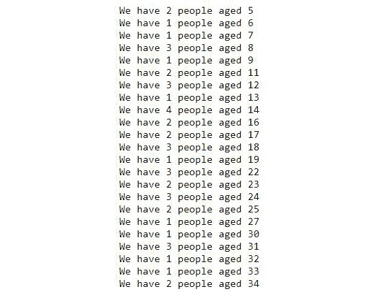

    图 8.13：按年龄分组的输出部分

1.  要找出哪个年龄组的人数最多，请执行以下命令：

    ```py
    for ppl, age in c.execute("SELECT count(*), age FROM persons \
                              GROUP BY age ORDER BY count(*)DESC"):
        print("The highest number of people is {} and "\
              "came from {} age group".format(ppl, age))
        break
    ```

    输出如下：

    ```py
    The highest number of people is 5 and came from 73 age group
    ```

1.  要找出有多少人没有全名（姓氏为空/空值），请执行以下命令：

    ```py
    res = c.execute("SELECT count(*) FROM persons \
                    WHERE last_name IS null")
    for row in res:
        print(row)
    ```

    输出如下：

    ```py
    (60,)
    ```

1.  要找出有多少人拥有不止一只宠物，请执行以下命令：

    ```py
    res = c.execute("SELECT count(*) FROM \
                    (SELECT count(owner_id) FROM pets \
                     GROUP BY owner_id HAVING count(owner_id) >1)")
    for row in res:
        print("{} people have more than one pets".format(row[0]))
    ```

    输出如下：

    ```py
    43 People have more than one pets
    ```

1.  要找出有多少宠物接受了治疗，请执行以下命令：

    ```py
    res = c.execute("SELECT count(*) FROM pets \
                    WHERE treatment_done=1")
    for row in res:
        print(row)
    ```

    输出如下：

    ```py
    (36,)
    ```

1.  要找出接受了治疗且已知宠物类型的宠物数量，请执行以下命令：

    ```py
    res = c.execute("SELECT count(*) FROM pets \
                    WHERE treatment_done=1 AND pet_type IS NOT null")
    for row in res:
        print(row)
    ```

    输出如下：

    ```py
    (16,)
    ```

1.  要找出有多少宠物来自名为 `east port` 的城市，请执行以下命令：

    ```py
    res = c.execute("SELECT count(*) FROM pets \
                    JOIN persons ON pets.owner_id = persons.id \
                    WHERE persons.city='east port'")
    for row in res:
        print(row)
    ```

    输出如下：

    ```py
    (49,)
    ```

1.  要找出有多少宠物来自名为 `east port` 的城市，并且接受了治疗，请执行以下命令：

    ```py
    res = c.execute("SELECT count(*) FROM pets \
                    JOIN persons ON pets.owner_id = \
                    persons.id WHERE persons.city='east port' \
                    AND pets.treatment_done=1")
    for row in res:
        print(row)
    ```

    输出如下：

    ```py
    (11,)
    ```

    备注

    要访问此特定部分的源代码，请参阅 [`packt.live/3derN9D`](https://packt.live/3derN9D)。

    您也可以在 [`packt.live/2ASWYKi`](https://packt.live/2ASWYKi) 上运行此示例。

# 9. 商业用例中的应用和课程总结

## 活动 9.01：数据整理任务 – 修复联合国数据

**解决方案：**

完成此活动的步骤如下：

1.  导入所需的库：

    ```py
    import numpy as np
    import pandas as pd
    import matplotlib.pyplot as plt
    import warnings
    warnings.filterwarnings('ignore')
    ```

1.  保存数据集的 URL（已突出显示）并使用 pandas 的 `read_csv` 方法直接传递此链接以创建 DataFrame：

    ```py
    education_data_link="http://data.un.org/_Docs/SYB/CSV/"\
                        "SYB61_T07_Education.csv"
    df1 = pd.read_csv(education_data_link)
    ```

1.  在 DataFrame 中打印数据：

    ```py
    df1.head()
    ```

    输出（部分显示）如下：

    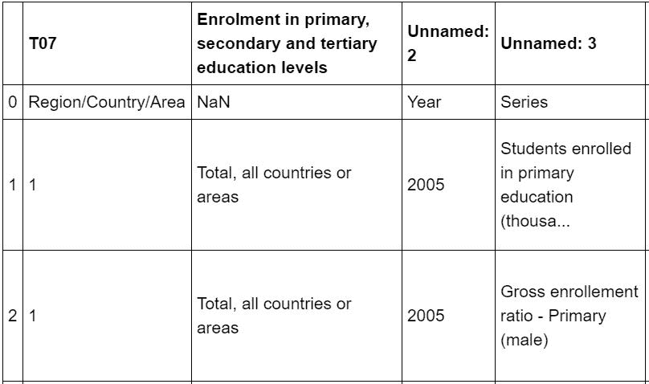

    图 9.7：联合国数据的部分 DataFrame

1.  由于第一行不包含有用信息，请使用 `skiprows` 参数删除第一行：

    ```py
    df1 = pd.read_csv(education_data_link,skiprows=1)
    ```

1.  打印 DataFrame 中的数据：

    ```py
    df1.head()
    ```

    输出如下：

    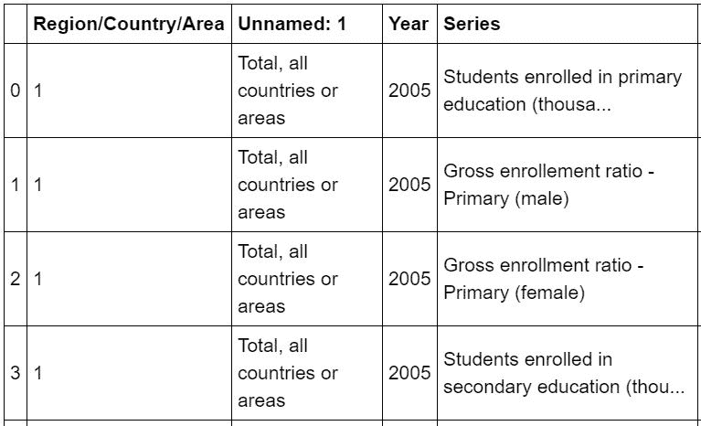

    图 9.8：删除第一行后的部分 DataFrame

1.  删除`Region/Country/Area`和`Source`列，因为它们不会非常有帮助：

    ```py
    df2 = df1.drop(['Region/Country/Area','Source'],axis=1)
    ```

1.  将以下名称分配为 DataFrame 的列：`['Region/Country/Area','Year','Data','Value','Footnotes']`

    ```py
    df2.columns=['Region/Country/Area','Year','Data',\
                 'Enrollments (Thousands)','Footnotes']
    ```

1.  打印 DataFrame 中的数据：

    ```py
    df2.head()
    ```

    输出如下：

    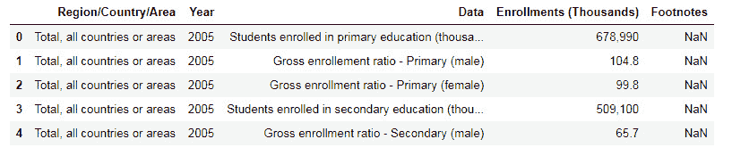

    图 9.9：删除 Region/Country/Area 和 Source 列后的 DataFrame

1.  检查`Footnotes`列包含多少唯一值：

    ```py
    df2['Footnotes'].unique()
    ```

    输出如下：

    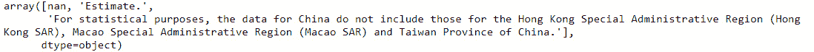

    图 9.10：Footnotes 列的唯一值

1.  将`Value`列数据转换为数值型，以便进行进一步处理：

    ```py
    type(df2['Enrollments (Thousands)'][0])
    ```

    输出如下：

    ```py
    str
    ```

1.  创建一个将`Value`列中的字符串转换为浮点数的实用函数：

    ```py
    def to_numeric(val):
        """
        Converts a given string (with one or more commas) to a numeric value
        """
        if ',' not in str(val):
            result = float(val)
        else:
            val=str(val)
            val=''.join(str(val).split(','))
            result=float(val)
        return result
    ```

1.  使用`apply`方法将此函数应用于`Value`列数据：

    ```py
    df2['Enrollments (Thousands)']=df2['Enrollments (Thousands)']\
                                   .apply(to_numeric)
    ```

1.  打印`Data`列中唯一的数据类型：

    ```py
    df2['Data'].unique()
    ```

    输出如下：

    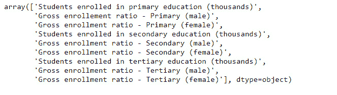

    图 9.11：列中的唯一值

1.  通过过滤和选择从原始 DataFrame 中创建三个 DataFrame：

    `df_primary`：仅包含接受小学教育（千）的学生

    `df_secondary`：仅包含接受中等教育（千）的学生

    `df_tertiary`：仅包含接受高等教育（千）的学生：

    ```py
    df_primary = df2[df2['Data']=='Students enrolled in primary '\
                                  'education (thousands)']
    df_secondary = df2[df2['Data']=='Students enrolled in secondary '\
                                    'education (thousands)']
    df_tertiary = df2[df2['Data']=='Students enrolled in tertiary '\
                                   'education (thousands)']
    ```

1.  使用低收入国家和高收入国家的小学生入学人数条形图进行比较：

    ```py
    primary_enrollment_india = df_primary[df_primary\
                               ['Region/Country/Area']=='India']
    primary_enrollment_USA = df_primary[df_primary\
                             ['Region/Country/Area']\
                             =='United States of America']
    ```

1.  打印`primary_enrollment_india`数据：

    ```py
    primary_enrollment_india
    ```

    输出如下：

    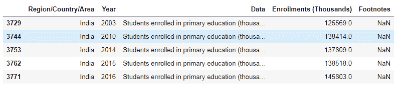

    图 9.12：印度小学入学数据

1.  打印`primary_enrollment_USA`数据：

    ```py
    primary_enrollment_USA
    ```

    输出如下：

    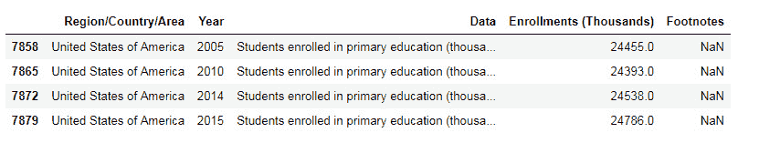

    图 9.13：美国小学入学数据

1.  绘制印度的数据：

    ```py
    plt.figure(figsize=(8,4))
    plt.bar(primary_enrollment_india['Year'],\
    primary_enrollment_india['Enrollments (Thousands)'])
    plt.title("Enrollment in primary education\nin India "\
              "(in thousands)",fontsize=16)
    plt.grid(True)
    plt.xticks(fontsize=14)
    plt.yticks(fontsize=14)
    plt.xlabel("Year", fontsize=15)
    plt.show()
    ```

    输出如下：

    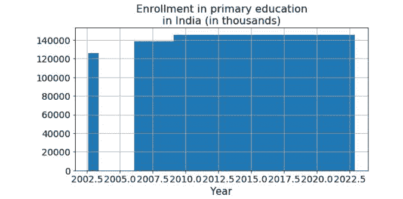

    图 9.14：印度小学入学人数的条形图

1.  绘制美国的入学数据：

    ```py
    plt.figure(figsize=(8,4))
    plt.bar(primary_enrollment_USA['Year'],\
    primary_enrollment_USA['Enrollments (Thousands)'])
    plt.title("Enrollment in primary education\nin the "\
              "United States of America (in thousands)",fontsize=16)
    plt.grid(True)
    plt.xticks(fontsize=14)
    plt.yticks(fontsize=14)
    plt.xlabel("Year", fontsize=15)
    plt.show()
    ```

    输出如下：

    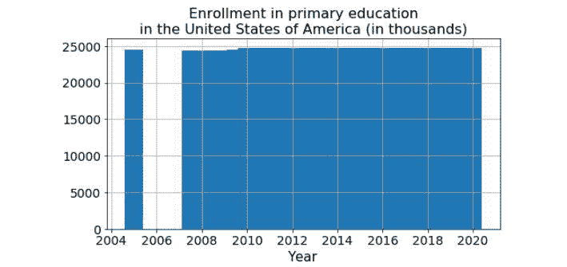

    图 9.15：美国小学入学人数的条形图

    如我们所见，我们有缺失数据。现在是时候使用`pandas`方法进行数据插补了。但要做到这一点，我们需要创建一个包含缺失值的 DataFrame – 也就是说，我们需要将另一个包含缺失值的 DataFrame 附加到当前 DataFrame 上。

1.  查找缺失的年份：

    ```py
    missing_years = [y for y in range(2004,2010)]\
                    +[y for y in range(2011,2014)]
    ```

1.  打印`missing_years`变量中的值：

    ```py
    missing_years
    ```

    输出如下：

    ```py
    [2004, 2005, 2006, 2007, 2008, 2009, 2011, 2012, 2013]
    ```

1.  使用`np.nan`创建一个包含值的字典。请注意，有九个缺失数据点，因此我们需要创建一个包含相同值重复九次的列表：

    ```py
    dict_missing = \
    {'Region/Country/Area':['India']*9,\
     'Year':missing_years,\
     'Data':'Students enrolled in primary education(thousands)'*9,\
     'Enrollments (Thousands)':[np.nan]*9,'Footnotes':[np.nan]*9}
    ```

1.  创建一个包含缺失值的 DataFrame（来自前面的字典），我们可以将其`append`：

    ```py
    df_missing = pd.DataFrame(data=dict_missing)
    ```

1.  将新的 DataFrames 附加到之前存在的 DataFrames 上：

    ```py
    primary_enrollment_india=primary_enrollment_india\
                             .append(df_missing,ignore_index=True,\
                                     sort=True)
    ```

1.  打印`primary_enrollment_india`中的数据：

    ```py
    primary_enrollment_india
    ```

    输出结果如下：

    ![图 9.16：在附加后印度小学入学部分数据]

    the data

    ![图片 B15780_09_16.jpg]

    图 9.16：附加数据后印度小学入学部分数据

1.  按照年份排序并使用`reset_index`重置索引。使用`inplace=True`在 DataFrame 本身上执行更改：

    ```py
    primary_enrollment_india.sort_values(by='Year',inplace=True)
    primary_enrollment_india.reset_index(inplace=True,drop=True)
    ```

1.  打印`primary_enrollment_india`中的数据：

    ```py
    primary_enrollment_india
    ```

    输出结果如下：

    ![图 9.17：排序后印度小学入学部分数据]

    ![图片 B15780_09_17.jpg]

    图 9.17：排序后印度小学入学部分数据

1.  使用`interpolate`方法进行线性插值。它使用线性插值值填充所有`NaN`值。有关此方法的更多详细信息，请查看此链接：[`pandas.pydata.org/pandas-docs/version/0.17/generated/pandas.DataFrame.interpolate.html`](http://pandas.pydata.org/pandas-docs/version/0.17/generated/pandas.DataFrame.interpolate.html)：

    ```py
    primary_enrollment_india.interpolate(inplace=True)
    ```

1.  打印`primary_enrollment_india`中的数据：

    ```py
    primary_enrollment_india
    ```

    输出结果如下：

    ![图 9.18：插值后印度小学入学数据]

    ![图片 B15780_09_18.jpg]

    图 9.18：插值后印度小学入学数据

1.  绘制数据：

    ```py
    plt.figure(figsize=(8,4))
    plt.bar(primary_enrollment_india['Year'],\
            primary_enrollment_india['Enrollments (Thousands)'])
    plt.title("Enrollment in primary education\nin India "\
              "(in thousands)", fontsize=16)
    plt.grid(True)
    plt.xticks(fontsize=14)
    plt.yticks(fontsize=14)
    plt.xlabel("Year", fontsize=15)
    plt.show()
    ```

    输出结果如下：

    ![图 9.19：印度小学入学条形图]

    ![图片 B15780_09_19.jpg]

    图 9.19：印度小学入学条形图

1.  对美国重复相同的步骤：

    ```py
    missing_years = [2004]+[y for y in range(2006,2010)]\
                    +[y for y in range(2011,2014)]+[2016]
    ```

1.  打印`missing_years`中的值。

    ```py
    missing_years
    ```

    输出结果如下：

    ```py
    [2004, 2006, 2007, 2008, 2009, 2011, 2012, 2013, 2016]
    ```

1.  创建`dict_missing`，如下所示：

    ```py
    dict_missing = \
    {'Region/Country/Area':['United States of America']*9,\
     'Year':missing_years, \
     'Data':'Students enrolled in primary education (thousands)'*9, \
     'Value':[np.nan]*9,'Footnotes':[np.nan]*9}
    ```

1.  按如下方式创建`df_missing`的 DataFrame：

    ```py
    df_missing = pd.DataFrame(data=dict_missing)
    ```

1.  按如下方式将其附加到`primary_enrollment_USA`变量：

    ```py
    primary_enrollment_USA=primary_enrollment_USA\
                           .append(df_missing,\
                                   ignore_index =True,sort=True)
    ```

1.  按如下方式对`primary_enrollment_USA`变量中的值进行排序：

    ```py
    primary_enrollment_USA.sort_values(by='Year',inplace=True)
    ```

1.  按如下方式重置`primary_enrollment_USA`变量的索引：

    ```py
    primary_enrollment_USA.reset_index(inplace=True,drop=True)
    ```

1.  按如下方式插值`primary_enrollment_USA`变量：

    ```py
    primary_enrollment_USA.interpolate(inplace=True)
    ```

1.  打印`primary_enrollment_USA`变量：

    ```py
    primary_enrollment_USA
    ```

    输出结果如下：

    ![图 9.20：所有操作完成后美国小学入学数据]

    ![图片 B15780_09_20.jpg]

    图 9.20：所有操作完成后美国小学入学数据

1.  尽管如此，第一个值是未填写的。我们可以使用`limit`和`limit_direction`参数与`interpolate`方法来填充它。我们是如何知道这个的？通过在 Google 上搜索并查看 StackOverflow 页面。始终搜索你问题的解决方案，寻找已经完成的工作，并尝试实现它：

    ```py
    primary_enrollment_USA.interpolate(method='linear',\
                                       limit_direction='backward',\
                                       limit=1)
    ```

    输出结果如下：

    ![图 9.21：限制数据后美国小学入学数据]

    ![图片 B15780_09_21.jpg]

    图 9.21：限制数据后美国小学入学数据

1.  打印`primary_enrollment_USA`中的数据：

    ```py
    primary_enrollment_USA
    ```

    输出如下：

    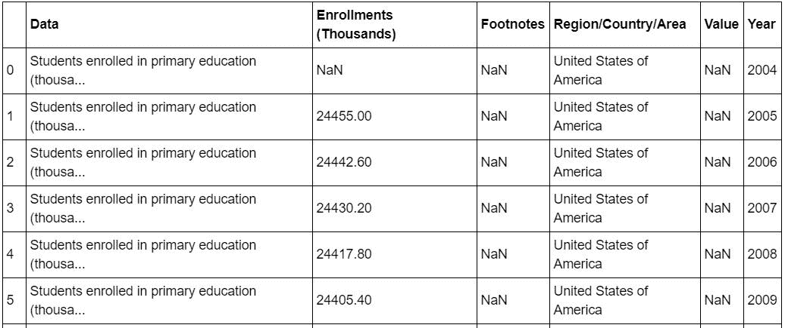

    图 9.22：美国小学入学数据

1.  绘制数据：

    ```py
    plt.figure(figsize=(8,4))
    plt.bar(primary_enrollment_USA['Year'],\
            primary_enrollment_USA['Enrollments (Thousands)'])
    plt.title("Enrollment in primary education\nin the "\
              "United States of America (in thousands)",fontsize=16)
    plt.grid(True)
    plt.xticks(fontsize=14)
    plt.yticks(fontsize=14)
    plt.xlabel("Year", fontsize=15)
    plt.show()
    ```

    输出如下：

    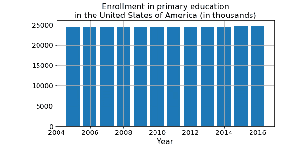

图 9.23：美国小学入学条形图

备注

要访问此特定部分的源代码，请参阅[`packt.live/3fyIqy8`](https://packt.live/3fyIqy8)。

你也可以在[`packt.live/3fQ0PXJ`](https://packt.live/3fQ0PXJ)上在线运行此示例。

## 活动 9.02：数据处理任务 – 清洗 GDP 数据

**解决方案：**

完成此活动的步骤如下：

1.  导入所需的库：

    ```py
    import numpy as np
    import pandas as pd
    import matplotlib.pyplot as plt
    import warnings
    warnings.filterwarnings('ignore')
    ```

1.  如果我们尝试正常读取，`pandas`的`read_csv`方法将引发错误。让我们一步一步地看看我们如何从中读取有用的信息：

    ```py
    df3=pd.read_csv("error_bad_lines=False option in this kind of situation.
    ```

1.  读取印度世界银行信息`.csv`文件。

    ```py
    df3=pd.read_csv("../datasets/India_World_Bank_Info.csv",\
                    error_bad_lines=False)
    ```

    输出（部分显示）将是：

    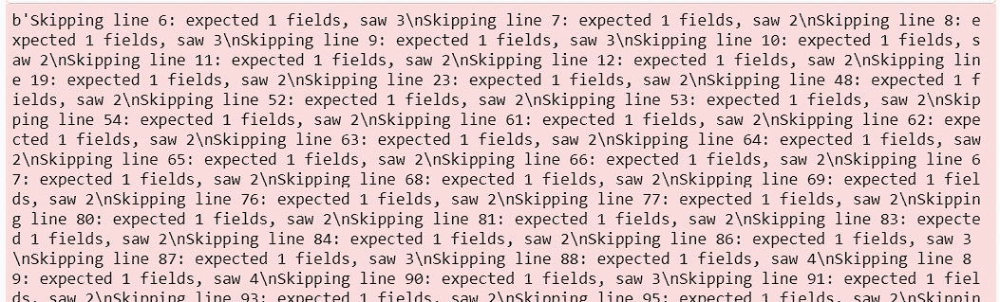

    图 9.24：警告的部分输出

1.  然后，让我们看一下 DataFrame 的内容。

    ```py
    df3.head(10)
    ```

    输出如下：

    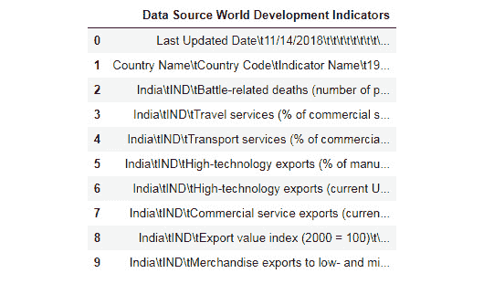

    图 9.25：印度世界银行信息的 DataFrame

    备注

    有时，可能找不到输出，因为有三行而不是预期的单行。

1.  明显地，此文件中的分隔符是制表符（`\t`）：

    ```py
    df3=pd.read_csv("../datasets/India_World_Bank_Info.csv", \
                    error_bad_lines=False,delimiter='\t')
    df3.head(10)
    ```

    输出如下：

    

    图 9.26：使用分隔符后的印度世界银行信息 DataFrame 的部分输出

1.  使用`skiprows`参数跳过前四行：

    ```py
    df3=pd.read_csv("../datasets/India_World_Bank_Info.csv",\
                    error_bad_lines=False,delimiter='\t',\
                    skiprows=4)
    df3.head(10)
    ```

    输出如下：

    ![图 9.27：使用分隔符后的印度世界银行信息 DataFrame 的部分输出    使用`skiprows`    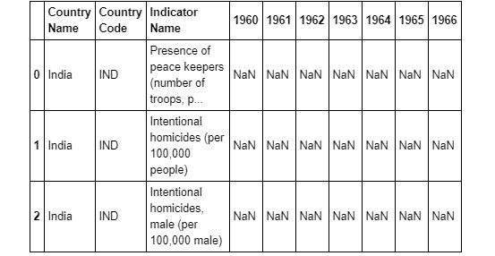

    ```py
    df4=df3[df3['Indicator Name']=='GDP per capita (current US$)'].T
    df4.head(10)
    ```

    输出如下：

    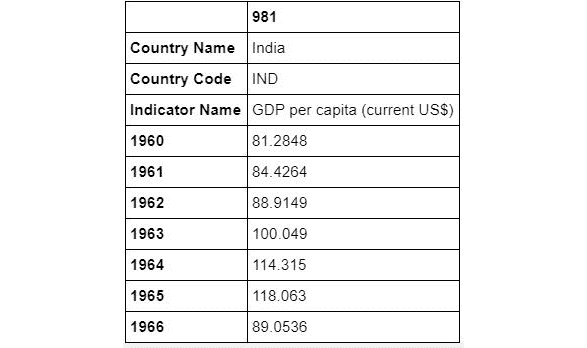

    图 9.28：关注人均 GDP 的 DataFrame

1.  没有索引，所以让我们再次使用`reset_index`：

    ```py
    df4.reset_index(inplace=True)
    df4.head(10)
    ```

    输出如下：

    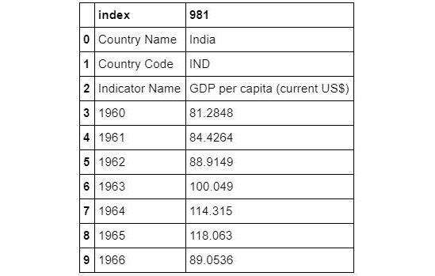

    图 9.29：使用 reset_index 的印度世界银行信息的 DataFrame

1.  前三行没有用。我们可以重新定义 DataFrame 而不包括它们。然后，我们再次重新索引：

    ```py
    df4.drop([0,1,2],inplace=True)
    df4.reset_index(inplace=True,drop=True)
    df4.head(10)
    ```

    输出如下：

    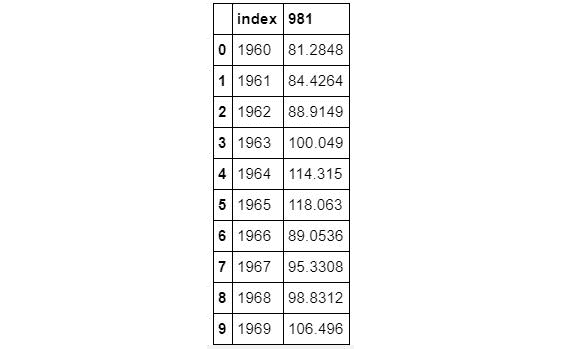

    图 9.30：删除并重置索引后的印度世界银行信息 DataFrame

1.  让我们正确地重命名列（这对于合并是必要的，我们将在稍后查看）：

    ```py
    df4.columns=['Year','GDP']
    df4.head(10)
    ```

    输出结果如下：

    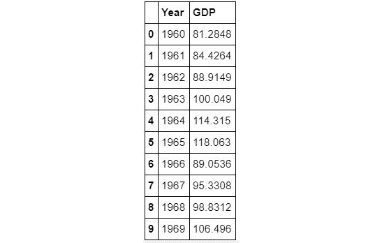

    图 9.31：聚焦于年份和 GDP 的 DataFrame

1.  看起来我们有从 1960 年以来的 GDP 数据。然而，我们只对`2003 – 2016`感兴趣。让我们检查最后 20 行：

    ```py
    df4.tail(20)
    ```

    输出结果如下：

    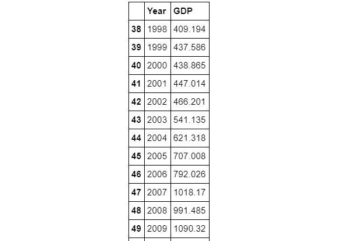

    图 9.32：来自世界银行印度信息的 DataFrame

1.  因此，我们应该对第 43-56 行感到满意。让我们创建一个名为`df_gdp`的 DataFrame：

    ```py
    df_gdp=df4.iloc[[i for i in range(43,57)]]
    df_gdp
    ```

    输出结果如下：

    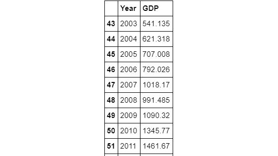

    图 9.33：来自世界银行印度信息的 DataFrame

1.  我们需要再次重置索引（为了合并）：

    ```py
    df_gdp.reset_index(inplace=True,drop=True)
    df_gdp
    ```

    输出结果如下：

    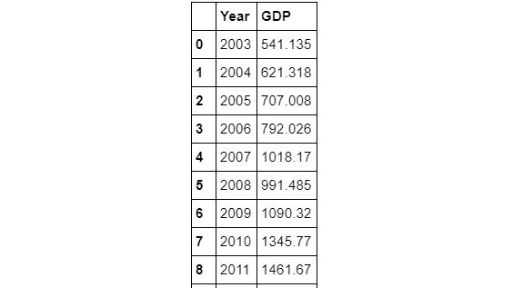

    图 9.34：来自世界银行印度信息的 DataFrame

1.  在这个 DataFrame 中的年份不是`int`类型。因此，它将无法与教育 DataFrame 合并：

    ```py
    df_gdp['Year']
    ```

    输出结果如下：

    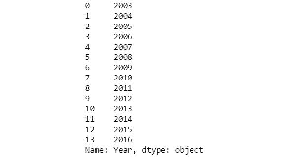

    图 9.35：聚焦于年份的 DataFrame

1.  使用 Python 内置的`int`函数和`apply`方法。忽略任何抛出的警告：

    ```py
    df_gdp['Year']=df_gdp['Year'].apply(int)
    ```

    **注意**

    要访问此特定部分的源代码，请参阅[`packt.live/3fyIqy8`](https://packt.live/3fyIqy8)。

    您也可以在[`packt.live/3fQ0PXJ`](https://packt.live/3fQ0PXJ)上在线运行此示例。

## 活动 9.03：数据整理任务 – 合并联合国数据和 GDP 数据

**解决方案：**

完成此活动的步骤如下：

1.  现在，将两个 DataFrame（即`primary_enrollment_india`和`df_gdp`）在`Year`列上合并：

    ```py
    primary_enrollment_with_gdp=\
    primary_enrollment_india.merge(df_gdp,on='Year')
    primary_enrollment_with_gdp
    ```

    输出结果如下：

    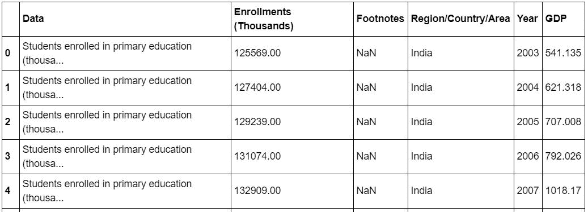

    图 9.36：合并数据

1.  现在，我们可以删除`Data`、`Footnotes`和`Region/Country/Area`列：

    ```py
    primary_enrollment_with_gdp.drop(['Data','Footnotes',\
                                      'Region/Country/Area'],\
                                      axis=1,inplace=True)
    primary_enrollment_with_gdp
    ```

    输出结果如下：

    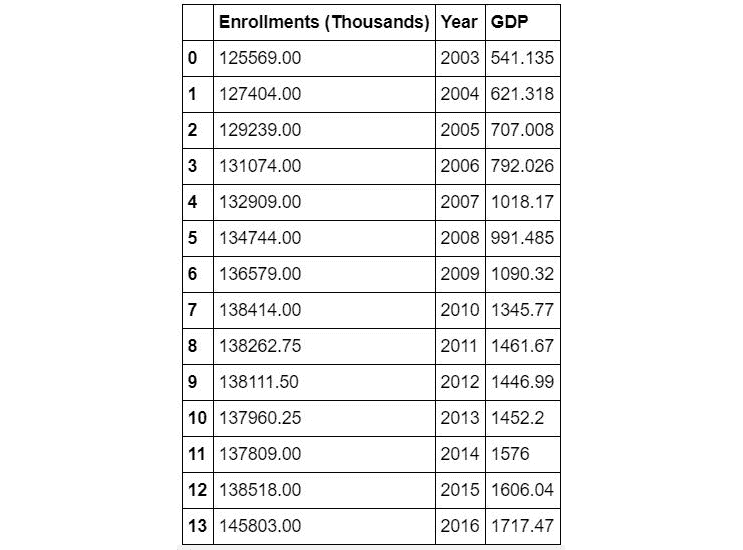

    图 9.37：删除 Data、Footnotes 和 Region/Country/Area 列后的合并数据

1.  重新排列列以正确查看和向数据科学家展示：

    ```py
    primary_enrollment_with_gdp = \
    primary_enrollment_with_gdp[['Year',\
                                 'Enrollments (Thousands)','GDP']]
    primary_enrollment_with_gdp
    ```

    输出结果如下：

    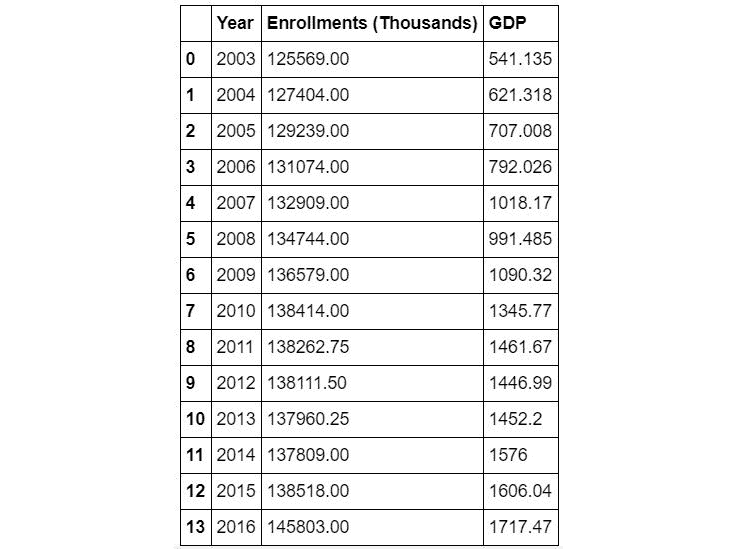

    图 9.38：重新排列列后的合并数据

1.  绘制数据：

    ```py
    plt.figure(figsize=(8,5))
    plt.title("India's GDP per capita vs primary education "\
              "enrollment",fontsize=16)
    plt.scatter(primary_enrollment_with_gdp['GDP'],\
                primary_enrollment_with_gdp['Enrollments (Thousands)'],\
                edgecolor='k',color='orange',s=200)
    plt.xlabel("GDP per capita (US $)",fontsize=15)
    plt.ylabel("Primary enrollment (thousands)", fontsize=15)
    plt.xticks(fontsize=14)
    plt.yticks(fontsize=14)
    plt.grid(True)
    plt.show()
    ```

    输出结果如下：

    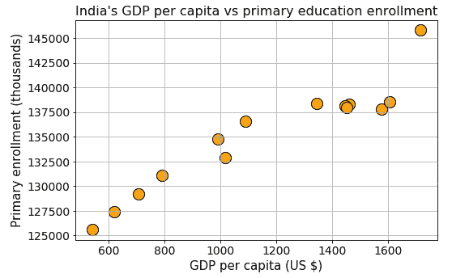

图 9.39：合并数据的散点图

**注意**

要访问此特定部分的源代码，请参阅[`packt.live/3fyIqy8`](https://packt.live/3fyIqy8)。

您也可以在[`packt.live/3fQ0PXJ`](https://packt.live/3fQ0PXJ)上在线运行此示例。

## 活动 9.04：数据整理任务 – 将新数据连接到数据库

**解决方案：**

完成此活动的步骤如下：

1.  连接到数据库并开始在其中写入值。我们首先导入 Python 的 `sqlite3` 模块，然后使用 `connect` 函数连接到数据库。将 `Year` 设定为该表的 `PRIMARY KEY`：

    ```py
    import sqlite3
    with sqlite3.connect("Education_GDP.db") as conn:
        cursor = conn.cursor()
        cursor.execute("CREATE TABLE IF NOT EXISTS \
                       education_gdp(Year INT, Enrollment \
                       FLOAT, GDP FLOAT, PRIMARY KEY (Year))")
    ```

1.  逐行遍历数据集的行，将它们插入到表中：

    ```py
    with sqlite3.connect("Education_GDP.db") as conn:
        cursor = conn.cursor()
        for i in range(14):
            year = int(primary_enrollment_with_gdp.iloc[i]['Year'])
            enrollment = \
            primary_enrollment_with_gdp.iloc[i]\
            ['Enrollments (Thousands)']
            gdp = primary_enrollment_with_gdp.iloc[i]['GDP']
            #print(year,enrollment,gdp)
            cursor.execute("INSERT INTO \
                           education_gdp (Year,Enrollment,GDP) \
                           VALUES(?,?,?)",(year,enrollment,gdp))
    ```

如果我们查看当前文件夹，我们应该看到一个名为 `Education_GDP.db` 的文件，如果我们使用数据库查看程序来检查它，我们将看到数据已经被传输到那里。

注意

要访问本节的具体源代码，请参阅 [`packt.live/3fyIqy8`](https://packt.live/3fyIqy8)。

您也可以在 [`packt.live/3fQ0PXJ`](https://packt.live/3fQ0PXJ) 上在线运行此示例。

## 目录

1.  数据处理工作坊

1.  第二版

1.  前言

    1.  关于本书

        1.  目标读者

        1.  关于章节

        1.  约定

        1.  代码展示

        1.  设置您的环境

        1.  安装 Python

            1.  在 Windows 上安装 Python

            1.  在 Linux 上安装 Python

            1.  在 MacOS 上安装 Python

        1.  安装库

        1.  Project Jupyter

        1.  访问代码文件

1.  1. Python 数据处理的简介

    1.  简介

    1.  数据处理的重要性

    1.  Python 数据处理

    1.  列表、集合、字符串、元组和字典

        1.  列表

    1.  列表函数

        1.  练习 1.01：访问列表成员

        1.  练习 1.02：生成和遍历列表

        1.  练习 1.03：遍历列表并检查成员资格

        1.  练习 1.04：排序列表

        1.  练习 1.05：生成随机列表

        1.  活动 1.01：处理列表

        1.  集合

        1.  集合简介

        1.  集合的并集和交集

        1.  创建空集

        1.  字典

        1.  练习 1.06：访问和设置字典中的值

        1.  练习 1.07：遍历字典

        1.  练习 1.08：重新审视唯一值列表问题

        1.  练习 1.09：从字典中删除值

        1.  练习 1.10：字典推导

        1.  元组

        1.  创建不同容量的元组

        1.  解包元组

        1.  练习 1.11：处理元组

        1.  字符串

        1.  练习 1.12：访问字符串

        1.  练习 1.13：字符串切片

        1.  字符串函数

        1.  练习 1.14：分割和连接字符串

        1.  活动 1.02：分析多行字符串并生成唯一单词计数

    1.  总结

1.  2. 内置数据结构的进阶操作

    1.  简介

    1.  高级数据结构

        1.  迭代器

        1.  练习 2.01：介绍迭代器

        1.  栈

        1.  练习 2.02：在 Python 中实现栈

        1.  练习 2.03：使用用户定义的方法实现栈

        1.  Lambda 表达式

        1.  练习 2.04：实现 Lambda 表达式

        1.  练习 2.05：排序的 Lambda 表达式

        1.  练习 2.06：多元素成员检查

        1.  队列

        1.  练习 2.07：在 Python 中实现队列

        1.  活动 2.01：排列、迭代器、Lambda 和列表

    1.  Python 中的基本文件操作

        1.  练习 2.08：文件操作

        1.  文件处理

        1.  练习 2.09：打开和关闭文件

        1.  with 语句

        1.  使用 with 语句打开文件

        1.  逐行读取文件

        1.  练习 2.11：写入文件

        1.  活动 2.02：设计您自己的 CSV 解析器

    1.  摘要

1.  3. NumPy、Pandas 和 Matplotlib 简介

    1.  介绍

    1.  NumPy 数组

        1.  NumPy 数组和特征

        1.  练习 3.01：创建 NumPy 数组（从列表中）

        1.  练习 3.02：添加两个 NumPy 数组

        1.  练习 3.03：NumPy 数组的数学运算

    1.  高级数学运算

        1.  练习 3.04：NumPy 数组的高级数学运算

        1.  使用 arange 和 linspace 方法生成数组

        1.  练习 3.06：创建多维数组

        1.  练习 3.07：二维数组的维度、形状、大小和数据类型

        1.  练习 3.08：零、一、随机、单位矩阵和向量

        1.  练习 3.09：重塑、拉平、最小值、最大值和排序

        1.  练习 3.10：索引和切片

        1.  条件子集

        1.  练习 3.11：数组运算

        1.  堆叠数组

        1.  Pandas 数据帧

        1.  练习 3.12：创建 Pandas 系列

        1.  练习 3.13：Pandas 系列和数据处理

        1.  练习 3.14：创建 Pandas 数据帧

        1.  部分查看数据帧

        1.  列的索引和切片

        1.  行索引和切片

        1.  创建和删除新列或行

    1.  使用 NumPy 和 Pandas 进行统计和可视化

        1.  基本描述性统计复习

        1.  通过散点图介绍 Matplotlib

    1.  统计量定义 – 中心趋势和离散度

        1.  随机变量和概率分布

        1.  什么是概率分布？

        1.  离散分布

        1.  连续分布

    1.  统计和可视化中的数据处理

        1.  使用 NumPy 和 Pandas 计算基本描述性统计

        1.  使用 NumPy 生成随机数

        1.  练习 3.18：从均匀分布生成随机数

        1.  练习 3.19：从二项分布生成随机数和条形图

        1.  练习 3.20：从正态分布生成随机数和直方图

        1.  练习 3.21：从 DataFrame 计算描述性统计

        1.  练习 3.22：内置绘图工具

        1.  活动 3.01：从 CSV 文件生成统计信息

    1.  总结

1.  4. 深入学习 Python 数据处理

    1.  简介

    1.  子集、过滤和分组

        1.  练习 4.01：检查 Excel 文件中的超市销售数据

        1.  DataFrame 的子集

        1.  一个示例用例 – 确定销售和利润的统计数据

        1.  练习 4.02：unique 函数

        1.  条件选择和布尔过滤

        1.  练习 4.03：设置和重置索引

        1.  groupBy 方法

        1.  练习 4.04：groupBy 方法

    1.  检测异常值和处理缺失值

        1.  Pandas 中的缺失值

        1.  练习 4.05：使用 fillna 方法填充缺失值

        1.  dropna 方法

        1.  练习 4.06：使用 dropna 删除缺失值

        1.  使用简单统计测试进行异常值检测

    1.  连接、合并和连接

        1.  练习 4.07：数据集中的连接

        1.  通过公共键合并

        1.  练习 4.08：通过公共键合并

        1.  join 方法

        1.  练习 4.09：join 方法

    1.  Pandas 的有用方法

        1.  随机抽样

        1.  练习 4.10：随机抽样

        1.  value_counts 方法

        1.  数据透视表功能

        1.  练习 4.11：按列值排序 – sort_values 方法

        1.  练习 4.12：使用 apply 方法时用户定义函数的灵活性

        1.  活动 4.01：处理成人收入数据集（UCI）

    1.  总结

1.  5. 熟悉不同类型的数据源

    1.  介绍

    1.  从不同来源读取数据

        1.  本章提供的数据文件

        1.  本章需要安装的库

        1.  使用 Pandas 读取数据

        1.  在读取 CSV 文件时处理带有标题的数据

        1.  练习 5.02：从非逗号分隔符的 CSV 文件读取数据

        1.  练习 5.03：绕过并重命名 CSV 文件的标题

        1.  在读取 CSV 文件时跳过初始行和页脚

        1.  只读取前 N 行

        1.  练习 5.05：结合 skiprows 和 nrows 以小段读取数据

        1.  设置 skip_blank_lines 选项

        1.  从 Zip 文件读取 CSV 数据

        1.  使用 sheet_name 读取 Excel 文件并处理不同的 sheet_name

        1.  练习 5.06：读取通用分隔文本文件

        1.  直接从 URL 读取 HTML 表格

        1.  练习 5.07：进一步处理以获取所需数据

        1.  从 JSON 文件读取数据

        1.  练习 5.08：从 JSON 文件读取数据

        1.  读取 PDF 文件

        1.  练习 5.09：从 PDF 文件中读取表格数据

    1.  Beautiful Soup 4 和网页解析的介绍

        1.  HTML 结构

        1.  练习 5.10：使用 Beautiful Soup 读取 HTML 文件并提取其内容

        1.  练习 5.11：DataFrame 和 BeautifulSoup

        1.  练习 5.12：将 DataFrame 导出为 Excel 文件

        1.  练习 5.13：使用 bs4 从文档中堆叠 URL

        1.  活动 5.01：从网页中读取表格数据并创建 DataFrame

    1.  总结

1.  6. 学习数据整理的隐藏秘密

    1.  简介

    1.  高级列表推导和 zip 函数

        1.  生成器表达式的介绍

        1.  练习 6.01：生成器表达式

        1.  练习 6.02：单行生成器表达式

        1.  练习 6.03：提取单词列表

        1.  练习 6.04：zip 函数

        1.  练习 6.05：处理杂乱数据

    1.  数据格式化

        1.  百分号运算符

        1.  使用格式函数

        1.  练习 6.06：使用 {} 表示数据表示

    1.  识别和清理异常值

        1.  练习 6.07：数值数据的异常值

        1.  Z 分数

        1.  练习 6.08：移除异常值的 Z 分数值

    1.  Levenshtein 距离

        1.  本节所需的附加软件

        1.  练习 6.09：模糊字符串匹配

        1.  活动 6.01：处理异常值和缺失数据

    1.  总结

1.  7. 高级网络爬虫和数据收集

    1.  简介

    1.  Requests 和 BeautifulSoup 库

        1.  练习 7.01：使用 Requests 库从维基百科主页获取响应

        1.  练习 7.02：检查网络请求的状态

        1.  检查网页的编码

        1.  练习 7.03：解码响应内容并检查其长度

        1.  练习 7.04：从 BeautifulSoup 对象中提取可读文本

        1.  从部分提取文本

        1.  提取今天日期发生的重要历史事件

        1.  练习 7.05：使用高级 BS4 技巧提取相关文本

        1.  练习 7.06：创建一个紧凑函数以从维基百科主页提取“这一天”文本

    1.  从 XML 读取数据

        1.  练习 7.07：创建 XML 文件并读取 XML 元素对象

        1.  练习 7.08：在树中找到各种数据元素（元素）

        1.  从本地 XML 文件读取到 ElementTree 对象中

        1.  练习 7.09：遍历树，找到根，并探索所有子节点及其标签和属性

        1.  练习 7.10：使用 text 方法提取有意义的数据

        1.  使用循环提取和打印 GDP/人均信息

        1.  为每个国家找到所有邻近国家并打印它们

        1.  练习 7.11：使用网络爬取获得的 XML 数据的简单演示

    1.  从 API 读取数据

        1.  定义基本 URL（或 API 端点）

        1.  练习 7.12：定义和测试一个从 API 拉取国家数据的函数

        1.  使用内置 JSON 库读取和检查数据

        1.  打印所有数据元素

        1.  使用一个提取包含关键信息的 DataFrame 的函数

        1.  练习 7.13：通过构建一个小型国家信息数据库来测试函数

    1.  正则表达式（RegEx）基础

        1.  网络爬取中的 RegEx

        1.  练习 7.14：使用 match 方法检查模式是否与字符串/序列匹配

        1.  使用 compile 方法创建 RegEx 程序

        1.  练习 7.15：将程序编译为匹配对象

        1.  在 match 方法中使用额外参数以检查位置匹配

        1.  查找以"ing"结尾的单词数量

        1.  正则表达式中的 search 方法

        1.  练习 7.17：正则表达式中的 search 方法

        1.  使用 Match 对象的 span 方法定位匹配模式的位置

        1.  练习 7.19：使用 search 进行单字符模式匹配的示例

        1.  练习 7.20：处理字符串开头或结尾的模式匹配

        1.  练习 7.21：多字符模式匹配

        1.  练习 7.22：贪婪匹配与非贪婪匹配

        1.  练习 7.23：在文本中控制重复以匹配

        1.  匹配字符集

        1.  练习 7.24：匹配字符集

        1.  使用 OR 运算符在正则表达式中使用 OR

        1.  findall 方法

        1.  活动 7.01：从古腾堡提取前 100 本电子书

        1.  活动 7.02：通过读取 API 构建自己的电影数据库

    1.  总结

1.  8. RDBMS 和 SQL

    1.  简介

    1.  RDBMS 和 SQL 复习

        1.  RDBMS 是如何结构的？

        1.  SQL

        1.  使用 RDBMS（MySQL/PostgreSQL/SQLite）

        1.  练习 8.01：连接 SQLite 数据库

        1.  SQLite 中的 DDL 和 DML 命令

        1.  练习 8.02：在 SQLite 中使用 DDL 和 DML 命令

        1.  在 SQLite 中从数据库读取数据

        1.  练习 8.03：对数据库中存在的值进行排序

        1.  ALTER 命令

        1.  练习 8.04：修改表结构并更新新字段

        1.  GROUP BY 子句

        1.  练习 8.05：在表中分组值

    1.  数据库中的关系映射

        1.  在评论表中添加行

    1.  连接

    1.  从 JOIN 查询中检索特定列

        1.  从表中删除行

        1.  练习 8.06：从表中删除行

        1.  在表中更新特定值

        1.  练习 8.07：RDBMS 和 DataFrames

        1.  活动 8.01：从数据库中准确检索数据

    1.  摘要

1.  9. 商业用例中的应用和课程总结

    1.  介绍

    1.  将您的知识应用于数据整理任务

        1.  活动 9.01：数据整理任务 – 修复联合国数据

        1.  活动 9.02：数据整理任务 – 清理 GDP 数据

        1.  活动 9.03：数据整理任务 – 合并联合国数据和 GDP 数据

        1.  活动 9.04：数据整理任务 – 将新数据连接到数据库

    1.  数据整理的扩展

        1.  成为数据科学家所需的额外技能

        1.  对大数据和云计算的基本了解

        1.  数据整理需要什么？

        1.  掌握机器学习的技巧和窍门

    1.  摘要

1.  附录

    1.  1. 使用 Python 进行数据整理的介绍

        1.  活动 1.01：处理列表

        1.  活动 1.02：分析多行字符串并生成唯一单词计数

    1.  2. 内置数据结构的进阶操作

        1.  活动 2.01：排列、迭代器、Lambda 和列表

        1.  活动 2.02：设计您自己的 CSV 解析器

    1.  3. NumPy、Pandas 和 Matplotlib 简介

        1.  活动 3.01：从 CSV 文件生成统计数据

    1.  4. 深入探讨使用 Python 进行数据整理

        1.  活动 4.01：使用成人收入数据集（UCI）工作

    1.  5. 适应不同类型的数据源

        1.  活动 5.01：从网页中读取表格数据并创建数据框

    1.  6. 学习数据处理背后的隐藏秘密

        1.  活动 6.01：处理异常值和缺失数据

    1.  7. 高级网络爬取和数据收集

        1.  活动 7.01：从古腾堡提取前 100 本电子书

        1.  活动 7.02：通过阅读 API 构建自己的电影数据库

    1.  8. 关系型数据库管理系统和 SQL

        1.  活动 8.01：从数据库中准确检索数据

    1.  9. 商业用例中的应用和课程总结

        1.  活动 9.01：数据处理任务 – 修复联合国数据

        1.  活动 9.02：数据处理任务 – 清洗 GDP 数据

        1.  活动 9.03：数据处理任务 – 合并联合国数据和 GDP 数据

        1.  活动 9.04：数据处理任务 – 将新数据连接到数据库

## 地标

1.  封面

1.  目录
