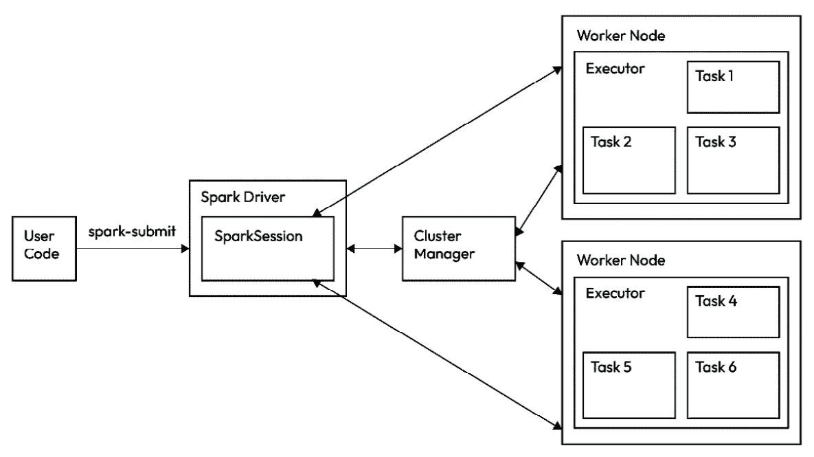
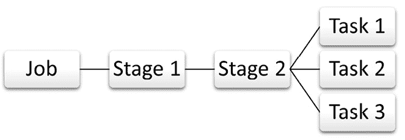

# 第三章：Spark 架构和转换

Spark 在数据处理方面与传统工具和技术不同。为了理解 Spark 的独特方法，我们必须了解其基本架构。深入了解 Spark 的架构及其组件将给你一个关于 Spark 如何实现其在大数据分析中突破性处理速度的思路。

在本章中，你将了解以下更广泛的话题：

+   Spark 架构和执行层次结构

+   Spark 的不同组件

+   Spark 驱动程序和 Spark 执行器的角色

+   Spark 的不同部署模式

+   作为 Spark 操作，转换和动作

到本章结束时，你将对 Spark 的内部工作原理有宝贵的见解，并知道如何有效地应用这些知识以通过你的认证考试。

# Spark 架构

在前面的章节中，我们讨论了 Apache Spark 是一个开源的分布式计算框架，旨在处理大数据分析和处理。其架构旨在高效地处理各种工作负载，提供速度、可扩展性和容错性。理解 Spark 的架构对于理解其处理大量数据的能力至关重要。

Spark 架构的组成部分协同工作以高效处理数据。以下是一些主要组件：

+   Spark 驱动程序

+   SparkContext

+   集群管理器

+   工作节点

+   Spark 执行器

+   任务

在我们讨论这些组件之前，了解它们的执行层次结构对于知道每个组件在 Spark 程序启动时如何交互非常重要。

# 执行层次结构

让我们借助*图 3.1*中的架构来查看 Spark 应用程序的执行流程：



图 3.1：Spark 架构

这些步骤概述了从提交 Spark 作业到作业完成后释放资源的流程：

1.  Spark 执行开始于用户向 Spark 引擎提交`spark-submit`请求。这将创建一个 Spark 应用程序。一旦执行了操作，就会创建一个**作业**。

1.  此请求将启动与集群管理器的通信。作为回应，集群管理器初始化 Spark 驱动程序以执行 Spark 应用程序的`main()`方法。为了执行此方法，将创建`SparkSession`。

1.  驱动程序开始与集群管理器通信，并请求资源以开始规划执行。

1.  集群管理器随后启动执行器，它们可以直接与驱动程序通信。

1.  驱动程序创建一个逻辑计划，称为**有向无环图**（DAG），以及基于需要执行的任务总数的执行计划。

1.  驱动程序还将数据分配给每个执行器运行，包括任务。

1.  每个任务运行完成后，驱动程序会获取结果。

1.  当程序运行完成后，`main()`方法退出，Spark 释放所有 executor 和驱动器资源。

现在你已经了解了执行层次结构，让我们详细讨论 Spark 的每个组件。

# Spark 组件

让我们深入了解每个 Spark 组件的内部工作原理，以了解它们如何在每个组件中发挥关键作用，从而实现高效的分布式数据处理。

## Spark 驱动器

Spark 驱动器是 Spark 中智能和高效计算的核心。Spark 遵循一种在网络拓扑中通常被称为**主从架构**的架构。将 Spark 驱动器视为主节点，将 Spark executors 视为从节点。驱动器在任何给定时间都控制并了解所有 executor。知道有多少 executor 存在以及是否有 executor 失败是驱动器的责任，以便它可以回退到其替代方案。Spark 驱动器还始终与 executor 保持通信。驱动器在机器或集群的主节点上运行。当 Spark 应用程序开始运行时，驱动器会跟踪所有成功运行应用程序所需的信息。

如*图 3.1*所示，驱动器节点包含`SparkSession`，这是 Spark 应用程序的入口点。以前，这被称为`SparkContext`对象，但在 Spark 2.0 中，`SparkSession`处理所有上下文以启动执行。应用程序的主方法在驱动器上运行以协调整个应用程序。它在自己的**Java 虚拟机**（**JVM**）上运行。Spark 驱动器可以作为一个独立进程运行，也可以根据架构在工作者节点之一上运行。

Spark 驱动器负责将应用程序划分为更小的执行实体。这些实体被称为**任务**。你将在本章接下来的部分中了解更多关于任务的内容。Spark 驱动器还决定 executor 将处理哪些数据以及哪些任务将在哪个 executor 上运行。这些任务将在集群管理器的帮助下在 executor 节点上调度运行。由驱动器驱动的这些信息使得容错成为可能。由于驱动器拥有所有关于可用工作者数量以及每个工作者上运行的任务的信息，以及数据，以防工作者失败，因此可以将该任务重新分配到不同的集群。即使一个任务运行时间过长，如果另一个 executor 空闲，它也可以被分配到另一个 executor。在这种情况下，哪个 executor 先返回任务，哪个就占上风。Spark 驱动器还维护关于**弹性分布式数据集**（**RDD**）及其分区的元数据。

设计完整的执行图是 Spark 驱动程序的责任。它确定哪些任务在哪些执行器上运行，以及数据如何在这些执行器之间分布。这是通过内部创建 RDDs 来实现的。基于这种数据分布，确定所需的操作，例如程序中定义的转换和动作。基于这些决策创建一个 DAG。Spark 驱动程序优化逻辑计划（DAG），并为 DAG 寻找最佳执行策略，除了确定特定任务执行的最优位置。这些执行是并行进行的。执行器只是遵循这些命令，而不会在其端进行任何优化。

考虑性能因素，Spark 驱动程序靠近执行器工作是最优的。这大大减少了延迟。这意味着在进程的响应时间上会有更少的延迟。这里要注意的另一点是，这也适用于数据。读取数据的执行器靠近它会有比其他情况下更好的性能。理想情况下，驱动程序和工作节点应该在同一个 **局域网**（**LAN**）中运行以获得最佳性能。

Spark 驱动程序还会为执行细节创建一个 Web UI。这个 UI 在确定应用程序性能方面非常有帮助。在需要故障排除并需要在 Spark 过程中识别瓶颈的情况下，这个 UI 非常有用。

## SparkSession

`SparkSession` 是与 Spark 交互的主要入口点。如前所述，在 Spark 的早期版本中，`SparkContext` 扮演着这个角色，但在 Spark 2.0 中，可以为此创建 `SparkSession`。Spark 驱动程序创建一个 `SparkSession` 对象来与集群管理器交互，并通过它获取资源分配。

在应用程序的生命周期中，`SparkSession` 也用于与所有底层 Spark API 交互。我们曾在 *第二章* 中讨论了不同的 Spark API，即 SparkSQL、Spark Streaming、MLlib 和 GraphX。所有这些 API 都从其核心使用 `SparkSession` 来与 Spark 应用程序交互。

`SparkSession` 会跟踪整个应用程序执行过程中的 Spark 执行器。

## 集群管理器

Spark 是一个分布式框架，它需要访问计算资源。这种访问由称为集群管理器的过程进行管理和控制。当应用程序开始执行时，集群管理器的责任是为 Spark 应用程序分配计算资源。这些资源在应用程序主节点的请求下变得可用。在 Apache Spark 生态系统中，**应用程序主节点**在管理和协调分布式集群环境中 Spark 应用程序的执行中起着至关重要的作用。它是一个基本组件，负责协商资源、调度任务和监控应用程序的执行。

一旦资源可用，驱动程序就会知道这些资源。根据 Spark 应用程序需要执行的任务，管理这些资源是驱动程序的责任。一旦应用程序完成执行，这些资源就会释放回集群管理器。

应用程序有自己的专用执行程序进程，这些进程并行运行任务。其优势是每个应用程序都是独立的，并且按照自己的时间表运行。数据对于这些应用程序中的每一个也是独立的，因此数据共享只能通过将数据写入磁盘来实现，以便可以在应用程序之间共享。

### 集群模式

集群模式定义了 Spark 应用程序如何利用集群资源、管理任务执行以及与集群管理器进行资源分配的交互。

如果集群上有多个用户共享资源，无论是 Spark 应用程序还是需要集群资源的其他应用程序，它们必须根据不同的模式进行管理。集群管理器提供了两种模式类型——独立客户端模式和集群模式。以下表格突出了这两种模式之间的一些差异：

| **客户端模式** | **集群模式** |
| --- | --- |
| 在客户端模式中，驱动程序程序在提交 Spark 应用程序的机器上运行。 | 在集群模式中，驱动程序程序在集群内部运行，在工作节点之一上。 |
| 驱动程序程序负责协调 Spark 应用程序的执行，包括创建 `SparkContext` 和协调任务。 | 集群管理器负责启动驱动程序程序并为执行分配资源。 |
| 客户端机器直接与集群管理器交互，请求资源并在工作节点上启动执行程序。 | 一旦启动驱动程序程序，它就会与集群管理器协调，请求资源并将任务分配给工作节点。 |
| 它可能不适合大规模应用程序的生产部署。 | 它通常用于生产部署，因为它允许更好的资源利用和可伸缩性。它还确保了容错性。 |

表 3.1：客户端模式与集群模式

现在，我们将讨论不同的部署模式和 Spark 中相应的管理器：

+   **内置独立模式**（**Spark 的原生管理器**）：Spark 随带的一个简单集群管理器，适用于无需外部依赖的小到中等规模部署。

+   **Apache YARN**（**Hadoop 的资源管理器**）：与 Spark 集成，YARN 使 Spark 应用程序能够高效地共享 Hadoop 的集群资源。

+   **Apache Mesos**（**资源共享平台**）：Mesos 提供了跨多个应用程序的高效资源共享，允许 Spark 与其他框架并行运行。

我们将在本章后面更详细地讨论部署模式。

## Spark 执行器

Spark 执行器是在工作节点上运行的进程，执行由驱动程序发送的任务。数据主要存储在内存中，但也可以写入它们最近的磁盘存储。驱动程序根据 Spark 为其执行生成的 DAG 启动执行器。一旦任务执行完成，执行器将结果发送回驱动程序。

由于驱动程序是 Spark 应用的主要控制器，如果执行器失败或执行任务花费时间过长，驱动程序可以选择将任务发送到其他可用的执行器。这确保了 Spark 的可靠性和容错性。我们将在本章后面了解更多关于这一点。

执行器的责任是从外部读取运行任务所需的数据。它还可以根据需要将其分区数据写入磁盘。一个任务的所有处理都由执行器完成。

执行器的主要功能如下：

+   **任务执行**：执行器运行 Spark 应用程序分配的任务，处理存储在 RDD 或 DataFrame 中的数据

+   **资源分配**：每个 Spark 应用程序都有一组由集群管理器分配的执行器，用于管理资源，如 CPU 内核和内存

在 Apache Spark 中，作业、阶段和任务的概念构成了其分布式计算框架的基本构建块。理解这些组件对于掌握 Spark 并行处理和任务执行的核心工作至关重要。见图 *3*.2* 了解这些概念之间的关系，同时我们详细讨论它们：



图 3.2：作业、阶段和任务之间的交互

让我们更仔细地看看：

+   `collect`）。我们将在后面了解更多关于动作的内容。当在数据集上调用动作（如 `collect` 或 `count`）时，它将触发一个或多个作业的执行。

    一个作业由几个阶段组成，每个阶段包含执行数据分区上一系列转换的任务。

+   **阶段**：每个作业被划分为可能依赖于其他阶段的阶段。阶段充当转换边界 - 它们在需要跨分区进行数据洗牌的宽转换的边界处创建。如果一个阶段依赖于前一个阶段的输出，那么这个阶段将不会开始执行，直到依赖的前一个阶段完成执行。

    每个阶段被划分为一组在集群节点上执行的任务，以并行方式处理数据。

+   **任务**：在 Spark 中，任务是最小的执行单元。它是 Spark 编译和运行以执行一组操作的最小对象。它在 Spark 执行器上执行。任务本质上是一系列操作，如过滤、groupBy 等。

    任务在执行器上并行运行。它们可以在多个节点上运行，并且彼此独立。这是通过槽位来实现的。每个任务处理数据分区的一部分。偶尔，一组任务需要完成执行才能开始下一个任务的执行。

现在我们已经理解了这些概念，让我们看看为什么它们在 Spark 中很重要：

+   **并行处理**：执行器、作业、阶段和任务协作以实现计算的并行执行，通过利用分布式计算优化性能。

+   **任务粒度和效率**：任务将计算分解成更小的单元，便于在集群节点间实现高效的资源利用和并行处理。

接下来，我们将讨论一个增强计算效率的重要概念。

# Spark 中的分区

在 Apache Spark 中，分区是一个关键概念，用于在集群的多个节点上划分数据以实现并行处理。分区提高了数据局部性，增强了性能，并通过以结构化的方式分配数据来实现高效的计算。Spark 支持静态和动态分区策略来组织集群节点上的数据：

+   **资源的静态分区**：静态分区在所有集群管理器上可用。使用静态分区时，每个应用程序都分配了最大资源，并且这些资源在其生命周期内保持专用。

+   **动态资源共享**：动态分区仅在 Mesos 上可用。当动态共享资源时，Spark 应用程序获得固定的独立内存分配，类似于静态分区。主要区别在于，当任务没有被应用程序运行时，这些核心也可以被其他应用程序使用。

让我们讨论一下为什么分区很重要：

+   **性能优化**：有效的分区策略，无论是静态还是动态，都能通过提高数据局部性和减少数据洗牌来显著影响 Spark 的性能。

+   **适应性和灵活性**：动态分区能够在无需人工干预的情况下适应变化的数据大小或分布模式。

+   **控制和可预测性**：静态分区提供了对数据分布的控制和可预测性，这在某些用例中可能是有利的。

总结来说，在 Spark 中，无论是静态还是动态的分区策略，在优化跨集群节点数据分布、提高性能和确保数据高效并行处理方面都发挥着至关重要的作用。

Apache Spark 提供了不同的集群和部署模式，以在分布式计算环境中运行应用程序。我们将在下一节中探讨它们。

# 部署模式

Spark 中有几种不同的部署模式。这些部署模式定义了 Spark 应用程序如何在不同的计算基础设施中启动、执行和管理。基于这些不同的部署模式，将决定 Spark 驱动程序、执行器和集群管理器将在哪里运行。

Spark 中可用的不同部署模式如下：

+   **本地**：在本地模式下，Spark 驱动程序和执行器在单个 JVM 上运行，集群管理器在驱动程序和执行器相同的宿主机上运行。

+   **独立**：在独立模式下，驱动程序可以在集群的任何节点上运行，执行器将启动自己的独立 JVM。集群管理器可以保留在集群中的任何主机上。

+   **YARN (客户端)**：在此模式下，Spark 驱动程序在客户端运行，YARN 的资源管理器在 NodeManagers 上为执行器分配容器。

+   **YARN (集群)**：在此模式下，Spark 驱动程序与 YARN 应用程序主控一起运行，而 YARN 的资源管理器在 NodeManagers 上为执行器分配容器。

+   **Kubernetes**：在此模式下，驱动程序在 Kubernetes 容器中运行。执行器有自己的容器。

让我们看看关于不同部署模式的一些重要点：

+   **资源利用率**：不同的部署模式通过确定驱动程序程序运行的位置以及客户端和集群之间如何分配资源来优化资源利用率。

+   **可访问性和控制**：客户端模式提供对驱动程序日志和输出的轻松访问，便于开发和调试，而集群模式则更有效地利用集群资源来处理生产工作负载。

+   **与容器编排集成**：Kubernetes 部署模式允许与容器化环境无缝集成，利用 Kubernetes 的编排能力进行高效的资源管理。

选择部署模式时有一些考虑事项需要注意：

+   **开发和生产**：客户端模式适合开发和调试，而集群模式则适用于生产工作负载。

+   **资源管理**：根据应用程序的需求评估客户端和集群节点之间资源的分配

+   **容器化需求**：考虑在容器化环境中使用 Kubernetes 部署，利用 Kubernetes 的功能进行高效的容器管理

总结来说，Apache Spark 的部署模式提供了灵活性，以适应不同的开发、生产和容器化部署场景。

接下来，我们将探讨 RDD，它是 Apache Spark 中的基础数据抽象，使分布式处理、容错性和处理大规模数据操作时的灵活性成为可能。虽然 RDD 仍然是一个基本概念，但 Spark 的 DataFrame 和 Dataset API 在结构化数据处理和性能优化方面提供了进步。

# RDD

Apache Spark 的 RDD 作为基础抽象，支撑了 Spark 框架内的分布式计算能力。RDD 是 Spark 中的核心数据结构，它使对大规模分布式数据集进行容错性和并行操作成为可能，并且它们是不可变的。这意味着它们不能随时间改变。对于任何操作，都必须从现有的 RDD 生成一个新的 RDD。当一个新 RDD 从原始 RDD 起源时，新 RDD 有一个指向其起源的 RDD 的指针。这是 Spark 记录 RDD 上所有变换谱系的方式。这种谱系使得 Spark 中的**延迟评估**成为可能，它为不同的操作生成 DAGs。

这种不可变性和谱系赋予了 Spark 在失败情况下重新生成任何 DataFrame 的能力，并使其设计上具有容错性。由于 RDD 是 Spark 中抽象层次最低的，因此所有建立在 RDD 之上的其他数据集都共享这些属性。高级 DataFrame API 也是建立在低级 RDD API 之上的，因此 DataFrame 也共享相同的属性。

RDD 也被 Spark 分区，并且每个分区被分配到集群中的多个节点。

这里是 Spark RDD 的一些关键特性：

+   **不可变性质**：RDD 是不可变的，确保一旦创建，就不能被修改，从而允许有变换的谱系。

+   **通过谱系实现弹性**：RDD 存储谱系信息，在发生故障时能够重建丢失的分区。Spark 被设计成具有容错性。因此，如果一个工作节点上的执行器在计算 RDD 时失败，可以使用 Spark 创建的谱系由另一个执行器重新计算该 RDD。

+   **分区数据**：RDD 将数据划分为分区，这些分区分布在集群中的多个节点上以实现并行处理。

+   **并行执行**：Spark 在分布式分区上并行执行 RDD 上的操作，从而提高性能。

让我们详细讨论一些其他特性。

## 懒计算

RDDs 支持惰性评估，将转换的执行延迟到动作被调用。Spark 在处理和容错方面的效率是通过惰性评估实现的。Spark 中的代码执行是延迟的。除非调用一个动作操作，否则 Spark 不会开始代码执行。这有助于 Spark 实现优化。对于所有转换和动作，Spark 通过为这些操作创建一个 DAG 来跟踪代码中需要执行的步骤。因为 Spark 在执行之前创建查询计划，所以它可以就执行层次结构做出明智的决策。为了实现这一点，Spark 使用的一个功能称为**谓词下推**。

谓词下推意味着 Spark 可以优先执行操作，使其最有效。一个例子可以是一个过滤操作。如果过滤操作可以在其他转换之前应用，那么过滤操作通常会减少后续操作需要处理的数据量。这正是 Spark 的操作方式。它会在流程中尽可能早地执行过滤操作，从而使后续操作更高效。

这也意味着 Spark 作业只有在执行时才会失败。由于 Spark 使用惰性评估，直到调用动作之前，代码不会执行，某些错误可能会被忽略。为了捕获这些错误，Spark 代码需要有一个动作用于执行和错误处理。

## 转换

转换通过将函数应用于现有的 RDDs（例如，`map`、`filter` 和 `reduce`）来创建新的 RDDs。转换是那些不会导致任何代码执行的操作。这些语句会导致 Spark 为执行创建一个 DAG。一旦创建了 DAG，Spark 就需要在最后运行代码时需要一个动作操作。由于这个原因，当某些开发者尝试测量 Spark 中的代码时间时，他们会看到某些操作的运行时间非常快。可能的原因是，代码直到那个点只包含转换。由于没有动作，代码不会运行。为了准确测量每个操作的运行时间，必须调用动作来强制 Spark 执行这些语句。

以下是一些可以被归类为转换的操作：

+   `orderBy()`

+   `groupBy()`

+   `filter()`

+   `select()`

+   `join()`

当这些命令执行时，它们是惰性评估的。这意味着所有这些对 DataFrames 的操作都会产生一个新的 DataFrame，但它们不会执行，直到一个动作跟随它们。当触发动作时，这将返回一个 DataFrame 或 RDD。

### 动作和计算执行

行动（例如，`collect`、`count` 和 `saveAsTextFile`）会触发 RDD 上的变换执行。执行仅由行动触发，而不是由变换触发。当调用行动时，这是 Spark 开始在代码分析阶段创建的 DAG 上执行的时候。有了创建的 DAG，Spark 会根据其内部优化创建多个查询计划。然后，它执行最有效和成本效益最高的计划。我们将在本书的后面讨论查询计划。

这里有一些可以归类为行动的操作：

+   `show()`

+   `take()`

+   `count()`

+   `collect()`

+   `save()`

+   `foreach()`

+   `first()`

所有这些操作都会导致 Spark 触发代码执行，因此操作会运行。

让我们看一下以下代码，以更好地理解这些概念：

```py
# Python
>>> df = spark.read.text("{path_to_data_file}")
>>> names_df = df.select(col("firstname"),col("lastname"))
>>> names_df.show()
```

在前面的代码中，直到第 2 行，什么都不会执行。在第 3 行，触发了一个行动，因此触发了整个代码的执行。因此，如果你在第 1 行提供了错误的数据路径或在第 2 行提供了错误的列名，Spark 不会在执行到第 3 行之前检测到这一点。这与大多数其他编程范式不同。这就是我们所说的 Spark 中的懒加载。

行动会导致计算并收集结果以发送给驱动程序。

既然我们已经了解了 Spark 中变换和行动的基础知识，让我们继续了解它提供的两种变换类型。

### 变换类型

Apache Spark 的变换大致分为窄变换和宽变换，每种变换在分布式数据处理环境中都服务于不同的目的。

#### 窄变换

窄变换，也称为本地变换，在数据单个分区上操作，不涉及在分区之间洗牌或重新分配数据。这些变换使 Spark 能够独立地在单个分区内处理数据。在窄变换中，Spark 将与单个输入分区和单个输出分区一起工作。这意味着这些类型的变换会导致可以在单个分区上执行的操作。数据不必从多个分区中取出或写回到多个分区。这导致不需要洗牌的操作。

这里是它们的一些特征：

+   **分区级操作**：窄变换在分区级别处理数据，在每个分区内执行计算。

+   **独立性和本地处理**：它们不需要数据在分区之间移动或通信，允许在分区内并行执行。

+   `map`、`filter` 和 `flatMap` 是窄变换的典型例子。

现在，让我们看看它们的重要性：

+   **效率和速度**：窄变换是高效的，因为它们涉及分区内的本地处理，减少了通信开销。

+   **并行性**：它们通过独立地对分区进行操作，实现最大并行性，从而优化性能

#### 宽转换

宽转换，也称为全局或洗牌相关转换，涉及需要跨分区进行数据洗牌和重新分配的操作。这些转换涉及分区之间的依赖关系，需要数据交换。使用宽转换时，Spark 将使用多个分区上的数据，并且也可能将结果写回到多个分区。这些转换将强制进行洗牌操作，因此它们也被称为洗牌转换。

宽转换是复杂的操作。如果需要，它们需要在操作之间写入结果，并且在某些情况下还必须跨不同机器聚合数据。

这里是一些它们的特征：

+   **数据洗牌**：宽转换通过重新排列或聚合来自多个分区的数据来跨分区重新组织数据

+   **对多个分区的依赖性**：它们依赖于来自各个分区的数据，导致在集群中跨分区进行数据交换和重组

+   `groupBy`、`join`和`sortByKey`是宽转换的典型例子

现在，让我们看看它们的显著性：

+   **网络和磁盘开销**：宽转换由于数据洗牌而引入网络和磁盘开销，影响性能

+   **阶段边界创建**：它们在 Spark 作业中定义阶段边界，导致在作业执行期间出现不同的阶段

以下是比较窄转换和宽转换之间的差异：

+   **数据移动**：窄转换在分区内部本地处理数据，最小化数据移动，而宽转换涉及数据洗牌和跨分区的数据移动

+   **性能影响**：窄转换通常由于数据移动减少而提供更高的性能，而宽转换由于数据洗牌而涉及额外的开销

+   **并行性范围**：窄转换在分区内实现最大并行性，而宽转换可能会由于对多个分区的依赖而限制并行性

在 Apache Spark 中，理解窄转换和宽转换之间的区别至关重要。窄转换在分区内的本地处理中表现出色，优化性能，而宽转换，尽管对于某些操作是必要的，但由于数据洗牌和跨分区的全局重组而引入了开销。

让我们看看 Spark RDDs 的重要性：

+   **分布式数据处理**：RDDs 允许在机器集群上分布式处理大规模数据，促进并行性和可伸缩性

+   **容错性和可靠性**：它们的不可变性和基于血缘的恢复确保了在分布式环境中的容错性和可靠性

+   **操作的灵活性**：RDDs 支持广泛的转换和操作，允许多样化的数据处理和操作。

### 进化与替代

虽然 RDDs 仍然是基础性的，但 Spark 的 DataFrame 和 Dataset API 提供了优化、高级别的抽象，适合结构化数据处理和优化。

Spark RDDs 是 Apache Spark 框架内分布式数据处理的基础，提供不可变性、容错性和在分布式数据集上执行并行操作的基础结构。尽管 RDDs 是基础性的，但 Spark 的 DataFrame 和 Dataset API 提供了性能和结构化数据处理方面的进步，满足 Spark 生态系统中的各种用例和偏好。

# 摘要

在本章中，我们学习了 Spark 的架构及其内部工作原理。这次对 Spark 分布式计算景观的探索涵盖了不同的 Spark 组件，如 Spark 驱动程序和 `SparkSession`。我们还讨论了 Spark 中可用的不同类型的集群管理器。然后，我们简要介绍了 Spark 及其部署模式的不同分区类型。

接下来，我们讨论了 Spark 执行器、作业、阶段和任务，在学习 RDDs 及其转换类型之前，强调了它们之间的区别，并更多地了解了窄转换和宽转换。

这些概念构成了利用 Spark 在分布式数据处理和分析中巨大能力的基础。

在下一章中，我们将讨论 Spark DataFrame 及其相应的操作。

# 样题

**问题 1：**

关于 Spark 的执行层次结构，以下哪项是正确的？

1.  在 Spark 的执行层次结构中，一个作业可能会达到多个阶段边界。

1.  在 Spark 的执行层次结构中，作业描述文件位于作业之上的一层。

1.  在 Spark 的执行层次结构中，一个阶段包含多个作业。

1.  在 Spark 的执行层次结构中，执行器是最小的单元。

1.  在 Spark 的执行层次结构中，任务位于槽位之上的一层。

**问题 2：**

执行器的作用是什么？

1.  执行器在每个工作节点上托管 Spark 驱动程序。

1.  执行器负责执行由驱动程序分配给它们的工作。

1.  Spark 应用程序启动后，每个任务都会启动执行器。

1.  执行器位于工作节点内的槽位中。

1.  执行器的存储是短暂的，因此它将直接缓存数据的任务推迟到工作节点线程。

## 答案

1.  A

1.  B

# 第三部分：Spark 操作

在本部分，我们将涵盖 Spark DataFrame 及其操作，强调它们在结构化数据处理和分析中的作用。这包括 DataFrame 的创建、操作以及各种操作，如过滤、聚合、连接和分组，通过示例进行演示。然后，我们将讨论高级操作和优化技术，包括广播变量、累加器和自定义分区。本部分还将讨论性能优化策略，强调自适应查询执行的重要性，并提供提高 Spark 作业性能的实用技巧。此外，我们将探索 Spark 中的 SQL 查询，重点关注其类似 SQL 的查询能力和与 DataFrame API 的互操作性。示例将通过 Spark 中的 SQL 查询展示复杂的数据操作和分析。

本部分包含以下章节：

+   *第四章*, *Spark DataFrame 及其操作*

+   *第五章*, *Spark 中的高级操作和优化*

+   *第六章*, *Spark 中的 SQL 查询*
