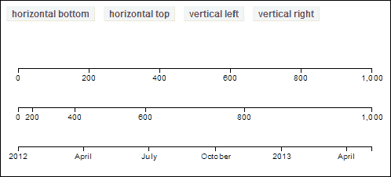
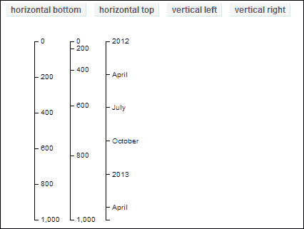
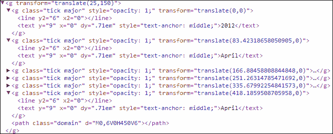
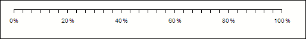
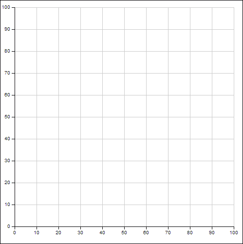
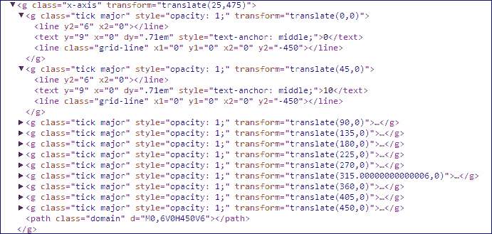
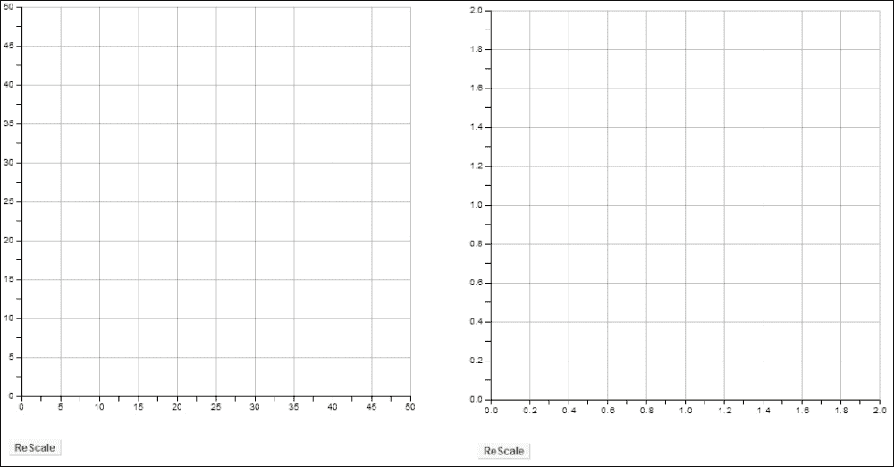

# 第五章. 玩转轴

在本章中，我们将涵盖以下内容：

+   使用基本轴

+   自定义刻度

+   绘制网格线

+   轴的动态缩放

# 简介

D3 最初发布时没有内置的轴组件支持。这种情况并没有持续太久；由于轴是许多基于笛卡尔坐标系的可视化项目的通用构建块，很快就很清楚 D3 需要提供轴的内置支持。因此，它很早就被引入，并且自发布以来一直在不断改进。在本章中，我们将探讨轴组件的使用和一些相关技术。

# 使用基本轴

在本食谱中，我们将专注于介绍 D3 轴组件的基本概念和支持，同时涵盖轴的不同类型和功能以及它们的 **SVG** 结构。

## 准备工作

在您的网络浏览器中打开以下文件的本地副本：

[`github.com/NickQiZhu/d3-cookbook/blob/master/src/chapter5/basic-axes.html`](https://github.com/NickQiZhu/d3-cookbook/blob/master/src/chapter5/basic-axes.html)

## 如何操作...

让我们先看看以下代码示例：

```py
<div class="control-group">
    <button onclick="renderAll('bottom')">
        horizontal bottom
    </button>
    <button onclick="renderAll('top')">
        horizontal top
    </button>
    <button onclick="renderAll('left')">
        vertical left
    </button>
    <button onclick="renderAll('right')">
        vertical right
    </button>
</div>

<script type="text/javascript">
    var height = 500, 
        width = 500, 
        margin = 25,
        offset = 50,
        axisWidth = width - 2 * margin,
        svg;

 function createSvg(){ // <-A
 svg = d3.select("body").append("svg") // <-B
 .attr("class", "axis") // <-C
            .attr("width", width)
            .attr("height", height);
    }

    function renderAxis(scale, i, orient){
 var axis = d3.svg.axis() // <-D
 .scale(scale) // <-E
 .orient(orient) // <-F
 .ticks(5); // <-G

        svg.append("g")        
 .attr("transform", function(){ // <-H
 if(["top", "bottom"].indexOf(orient) >= 0)
 return "translate("+margin+","+i*offset+")";
 else
 return "translate("+i*offset+", "+margin+")";
 })
 .call(axis); // <-I
    }

    function renderAll(orient){
        if(svg) svg.remove();

        createSvg();

        renderAxis(d3.scale.linear()
                    .domain([0, 1000])
                    .range([0, axisWidth]), 1, orient);
        renderAxis(d3.scale.pow()
                    .exponent(2)
                    .domain([0, 1000])
                    .range([0, axisWidth]), 2, orient);
        renderAxis(d3.time.scale()
                    .domain([new Date(2012, 0, 1), new Date()])
                    .range([0, axisWidth]), 3, orient);
    }
</script>
```

上述代码产生了一个只显示以下截图中的四个按钮的视觉输出。一旦你点击 **水平底部**，它将显示以下内容：



水平轴



垂直轴

## 工作原理...

本食谱的第一步是创建一个将用于渲染我们的轴的 `svg` 元素。这是通过定义在行 `A` 上的 `createSvg` 函数完成的，并使用 D3 的 `append` 和 `attr` 修改器函数，如行 `B` 和 `C` 所示。

### 注意

这是本书中第一个使用 SVG 而不是 HTML 元素的食谱，因为 D3 轴组件仅支持 SVG。如果你不熟悉 SVG 标准，不要担心；我们将在 第七章 中详细介绍它，*进入形状*。而在此章中，我们将介绍一些基本和有限的 SVG 概念，当它们被 D3 轴组件使用时。

让我们看看以下代码中我们是如何创建 SVG 画布的：

```py
var height = 500, 
  width = 500, 
  margin = 25,
  offset = 50,
  axisWidth = width - 2 * margin,
  svg;

function createSvg(){ // <-A
     svg = d3.select("body").append("svg") // <-B
        .attr("class", "axis") // <-C
        .attr("width", width)
        .attr("height", height);
} 
```

现在，我们已经准备好在这个 `svg` 画布上渲染轴。`renderAxis` 函数正是为此而设计的。在行 `D` 上，我们首先使用 `d3.svg.axis` 函数创建一个轴组件：

```py
var axis = d3.svg.axis() // <-D
            .scale(scale) // <-E
            .orient(orient) // <-F
            .ticks(5); // <-G
```

D3 轴被设计为与 D3 定量、时间和序数刻度无缝工作。轴刻度是通过 `scale()` 函数提供的（见行 `E`）。在这个例子中，我们使用以下刻度渲染了三个不同的轴：

```py
d3.scale.linear().domain([0, 1000]).range([0, axisWidth])
d3.scale.pow().exponent(2).domain([0, 1000]).range([0, axisWidth])
d3.time.scale()
  .domain([new Date(2012, 0, 1), new Date()])
  .range([0, axisWidth])
```

我们对 `axis` 对象进行的第二次定制是其 `orient`。`orient` 告诉 D3 这个轴将如何放置（方向），因此，它应该如何渲染，是水平还是垂直。D3 支持四种不同的轴 `orient` 配置：

+   `top`：一个水平轴，标签位于轴的顶部

+   `bottom`：一个水平轴，标签位于轴的底部

+   `left`：一个垂直轴，标签位于轴的左侧

+   `right`：一个垂直轴，标签位于轴的右侧

在行 `G`，我们将刻度数设置为 `5`。这告诉 D3，理想情况下我们希望为此轴渲染多少个刻度，然而，D3 可能会选择根据可用空间和自己的计算渲染稍微更多或更少的刻度。我们将在下一食谱中详细探讨轴刻度配置。

一旦定义了轴，创建过程中的最后一步是创建一个 `svg:g` 容器元素，然后它将被用来托管渲染轴所需的所有 SVG 结构：

```py
svg.append("g")        
  .attr("transform", function(){ // <-H
    if(["top", "bottom"].indexOf(orient) >= 0)
      return "translate(" + margin + ","+ i * offset + ")";
    else
      return "translate(" + i * offset + ", " + margin + ")";
    })
    .call(axis); // <-I
```

### 注意

拥有一个 `g` 元素来包含与一个轴相关的所有 SVG 元素不仅是一种良好的实践，也是 D3 轴组件的要求。

此代码片段中的大部分逻辑都与使用 `transform` 属性在 `svg` 画布上计算绘制轴的位置相关（见行 `H`）。在前面的代码示例中，为了使用偏移量移动轴，我们使用了 `translate` SVG 变换，这允许我们使用定义在 *x* 和 *y* 坐标中的距离参数来移动元素。

### 注意

SVG 变换将在第七章（“形状塑造”）中详细讨论，或你可以参考以下 URL 获取有关此主题的更多信息：

[`www.w3.org/TR/SVG/coords.html#TranslationDefined`](http://www.w3.org/TR/SVG/coords.html#TranslationDefined)

此代码中更相关的部分在行 `I`，其中使用了 `d3.selection.call` 函数，并将 `axis` 对象作为参数传递。`d3.selection.call` 函数使用当前选择作为参数调用给定的函数（在我们的情况下是 `axis` 对象）。换句话说，传递给 `d3.selection.call` 函数的函数应具有以下形式：

```py
function foo(selection) {
  ...
}
```

### 提示

`d3.selection.call` 函数还允许你向调用函数传递额外的参数。更多信息请访问以下链接：

[`github.com/mbostock/d3/wiki/Selections#wiki-call`](https://github.com/mbostock/d3/wiki/Selections#wiki-call)

一旦调用 D3 轴组件，它将负责其余工作并自动创建轴所需的所有必要的 SVG 元素（见行 I）。例如，本食谱中所示示例的水平底部时间轴具有以下自动生成的复杂 SVG 结构，我们实际上不需要了解太多：



水平底部时间轴 SVG 结构

# 自定义刻度

我们已经在之前的食谱中看到了如何使用`ticks`函数。这是在 D3 轴上可以进行的最简单的刻度相关自定义。在本食谱中，我们将介绍一些最常见和有用的与刻度相关的自定义。

## 准备工作

在您的网络浏览器中打开以下文件的本地副本：

[`github.com/NickQiZhu/d3-cookbook/blob/master/src/chapter5/ticks.html`](https://github.com/NickQiZhu/d3-cookbook/blob/master/src/chapter5/ticks.html)

## 如何操作...

在以下代码示例中，我们将自定义子刻度、填充和标签的格式。让我们先看看代码片段：

```py
<script type="text/javascript">
    var height = 500, 
        width = 500, 
        margin = 25,
        axisWidth = width - 2 * margin;

    var svg = d3.select("body").append("svg")
            .attr("class", "axis")
            .attr("width", width)
            .attr("height", height);

var scale = d3.scale.linear()
        .domain([0, 100])
        .range([0, axisWidth]);

    var axis = d3.svg.axis()
            .scale(scale)
            .ticks(5)
            .tickSubdivide(5) // <-A
 .tickPadding(10) // <-B
 .tickFormat(function(v){ // <-C
 return v + "%";
 });

    svg.append("g")        
        .attr("transform", function(){
            return "translate(" + margin + "," + margin + ")";
        })
        .call(axis);
</script>
```

上述代码生成以下视觉输出：



自定义轴刻度线

## 它是如何工作的...

本食谱的重点是`ticks`函数之后的突出显示的行。正如我们之前提到的，`ticks`函数为 D3 提供了一个提示，说明轴应该包含多少个刻度。在设置刻度数量之后，在本食谱中，我们继续通过进一步的函数调用来进一步自定义刻度。在行`A`中，使用了`ticksSubdivide`函数，以类似的方式为 D3 提供提示，说明轴应该在每个刻度之间渲染多少个子刻度。然后在行`B`中，使用了`tickPadding`函数来指定刻度标签和轴之间的空间（以像素为单位）。最后，在行`C`提供了一个自定义函数`tickFormat`，用于将百分号附加到值上。

### 注意

更多关于上述函数和其他与刻度相关的自定义信息，请访问以下 URL 的 D3 Wiki：

[`github.com/mbostock/d3/wiki/SVG-Axes#wiki-ticks`](https://github.com/mbostock/d3/wiki/SVG-Axes#wiki-ticks)

# 绘制网格线

很频繁地，我们需要在*x*和*y*轴的刻度上绘制水平和垂直网格线，以保持与刻度的一致性。正如我们在前面的食谱中所示，通常我们不会或不想对 D3 轴上刻度的渲染方式有精确的控制。因此，在它们渲染之前，我们可能不知道有多少刻度和它们的值。这尤其适用于你正在构建一个可重用的可视化库，在这种情况下，你无法提前知道刻度配置。在本食谱中，我们将探讨一些在轴上绘制一致网格线的技术，而实际上并不需要知道刻度值。

## 准备工作

在您的网络浏览器中打开以下文件的本地副本：

[`github.com/NickQiZhu/d3-cookbook/blob/master/src/chapter5/grid-line.html`](https://github.com/NickQiZhu/d3-cookbook/blob/master/src/chapter5/grid-line.html)

## 如何操作...

首先，让我们看看如何在代码中绘制网格线：

```py
<script type="text/javascript">
    var height = 500, 
        width = 500, 
        margin = 25;       

    var svg = d3.select("body").append("svg")
            .attr("class", "axis")
            .attr("width", width)
            .attr("height", height);

    function renderXAxis(){
        var axisLength = width - 2 * margin;

        var scale = d3.scale.linear()
                        .domain([0, 100])
                        .range([0, axisLength]);

        var xAxis = d3.svg.axis()
                .scale(scale)
                .orient("bottom");

        svg.append("g")       
            .attr("class", "x-axis")
 .attr("transform", function(){ // <-A
 return "translate(" + margin + "," + (height - margin) + ")";
 })
            .call(xAxis);

 d3.selectAll("g.x-axis g.tick") // <-B
 .append("line") // <-C
 .classed("grid-line", true)
 .attr("x1", 0) // <-D
 .attr("y1", 0)
 .attr("x2", 0)
 .attr("y2", - (height - 2 * margin));  // <-E
    }

    function renderYAxis(){        
        var axisLength = height - 2 * margin;

        var scale = d3.scale.linear()
                        .domain([100, 0])
                        .range([0, axisLength]);

        var yAxis = d3.svg.axis()
                .scale(scale)
                .orient("left");

        svg.append("g")       
            .attr("class", "y-axis")
 .attr("transform", function(){
 return "translate(" + margin + "," + margin + ")";
 })
            .call(yAxis);

 d3.selectAll("g.y-axis g.tick")
 .append("line")
 .classed("grid-line", true)
 .attr("x1", 0)
 .attr("y1", 0)
 .attr("x2", axisLength)
 .attr("y2", 0);
    }   

    renderYAxis();
    renderXAxis();
</script>
```

上述代码生成以下视觉输出：



轴线和网格线

## 它是如何工作的...

在这个示例中，`renderXAxis` 和 `renderYAxis` 函数分别创建了两个轴 *x* 和 *y*。让我们看看 x 轴是如何渲染的。

一旦我们了解了如何渲染 *x* 轴及其网格线，由于它们几乎相同，渲染 *y* 轴的逻辑也容易理解。*x* 轴及其刻度没有复杂的定义，正如我们在本章中已经多次演示的那样。创建了一个 `svg:g` 元素来包含 *x* 轴结构。这个 `svg:g` 元素使用平移变换放置在图表的底部，如线 A 所示：

```py
.attr("transform", function(){ // <-A
  return "translate(" + margin + "," + (height - margin) + ")";
})
```

重要的是要记住，当涉及到其任何子元素时，平移变换会改变坐标的参考框架。例如，在这个 `svg:g` 元素内部，如果我们创建一个坐标设置为 `(0, 0)` 的点，那么当我们在这个 SVG 画布上绘制这个点时，它实际上会被放置在 `(margin, height – margin)`。这是因为 `svg:g` 元素内的所有子元素都会自动转换到这个基准坐标，因此，参考框架发生了偏移。有了这个理解，让我们看看在轴渲染后如何生成动态网格线：

```py
d3.selectAll("g.x-axis g.tick") // <-B
            .append("line") // <-C
                .classed("grid-line", true)
                .attr("x1", 0) // <-D
                .attr("y1", 0)
                .attr("x2", 0)
                .attr("y2", - (height - 2 * margin));  // <-E
```

轴渲染完成后，我们可以通过选择 `g.tick` 来选择轴上的所有刻度元素，因为每个刻度都由其自己的 `svg:g` 元素分组（见线 `B`）。然后在线 `C` 上，我们为每个 `svg:g` 刻度元素附加一个新的 `svg:line` 元素。SVG 线元素是 SVG 标准提供的最简单形状。它有四个主要属性：

+   **x1** 和 **y1** 属性定义了这条线的起点

+   **x2** 和 **y2** 属性定义了目标点

在我们的例子中，我们简单地设置了 x1、y1 和 x2 为 `0`，因为每个 `g.tick` 元素已经转换到了轴上的位置，因此，我们只需要更改 y2 属性来绘制垂直网格线。y2 属性被设置为 `–(height – 2 * margin)`。坐标为负的原因是，正如前一段代码中提到的，整个 `g.x-axis` 已经向下移动到 `(height – margin)`。因此，在绝对坐标下 `y2 =` `(height – margin)` `– (height – 2 * margin) = margin`，这是我们想要从 *x* 轴绘制的垂直网格线的顶部。

### 提示

在 SVG 坐标中，`(0, 0)` 表示 SVG 画布的左上角。

这就是 SVG 结构中带有相关网格线的 *x* 轴的样子：



带有网格线的 x 轴 SVG 结构

如前一张截图所示，一个代表网格线的 `svg:line` 元素被添加到前面在本节中讨论的 **"g.tick"** `svg:g` 容器元素中。

*Y*轴的网格线使用**相同的技巧**生成；唯一的区别是，我们不是像对*x*轴那样设置网格线的`y2`属性，而是更改`x2`属性，因为线条是水平的（见第`F`行）：

```py
d3.selectAll("g.y-axis g.tick")
            .append("line")
                .classed("grid-line", true)
                .attr("x1", 0)
                .attr("y1", 0)
                .attr("x2", axisLength) // <-F
 .attr("y2", 0);

```

# 坐标轴的动态缩放

在某些情况下，当由用户交互或数据源变化触发时，坐标轴使用的比例可能会改变。例如，用户可能会更改可视化的时间范围。这种变化也需要通过调整坐标轴的比例来反映。在本食谱中，我们将探讨如何动态地实现这一点，同时重新绘制与每个刻度相关的网格线。

## 准备工作

在您的网络浏览器中打开以下文件的本地副本：

[`github.com/NickQiZhu/d3-cookbook/blob/master/src/chapter5/rescaling.html`](https://github.com/NickQiZhu/d3-cookbook/blob/master/src/chapter5/rescaling.html)

## 如何实现...

下面是执行动态缩放的代码示例：

```py
<script type="text/javascript">
    var height = 500, 
        width = 500, 
        margin = 25,
        xAxis, yAxis, xAxisLength, yAxisLength;

    var svg = d3.select("body").append("svg")     
            .attr("class", "axis")    
            .attr("width", width)
            .attr("height", height);

    function renderXAxis(){
        xAxisLength = width - 2 * margin;

        var scale = d3.scale.linear()
                        .domain([0, 100])
                        .range([0, xAxisLength]);

        xAxis = d3.svg.axis()
                .scale(scale)
                .tickSubdivide(1)
                .orient("bottom");

        svg.append("g")       
            .attr("class", "x-axis")
            .attr("transform", function(){ 
                return "translate(" + margin + "," 
                           + (height - margin) + ")";
            })
            .call(xAxis);
    }

    function rescale(){ // <-A
 var max = Math.round(Math.random() * 100);

 xAxis.scale().domain([0, max]); // <-B
        svg.select("g.x-axis")
            .transition()
 .call(xAxis); // <-C

        renderXGridlines();
    }       

    function renderXGridlines(){
        var lines = d3.selectAll("g.x-axis g.tick")
                .select("line.grid-line")
 .remove(); // <-D

        lines = d3.selectAll("g.x-axis g.tick")
                .append("line") 
                .classed("grid-line", true)

        lines.attr("x1", 0) 
                .attr("y1", 0)
                .attr("x2", 0)
                .attr("y2", - yAxisLength); 
    }

 renderXAxis();
 renderXGridlines();
</script>
```

以下代码生成了以下效果：



动态坐标轴缩放

### 注意

由于本书的范围有限，本食谱中的代码示例省略了与*Y*轴相关的代码。请参阅在线可用的完整代码示例。

## 它是如何工作的...

一旦您在屏幕上点击**ReScale**按钮，您将注意到坐标轴会缩放，同时所有刻度以及网格线都会随着平滑的过渡效果重新绘制。在本节中，我们将重点关注缩放的工作原理，并将过渡效果留到下一章*Transition with Style*中。本食谱中的大部分繁重工作都是由定义在第`A`行的`rescale`函数完成的。

```py
function rescale(){ // <-A
  var max = Math.round(Math.random() * 100);

  xAxis.scale().domain([0, max]); // <-B
  svg.select("g.x-axis")
    .transition()
    .call(xAxis); // <-C

  renderXGridlines();
}   
```

要缩放一个轴，我们只需更改其域（见第`B`行）。如果您还记得，比例域表示数据域，而其范围对应于视觉域。因此，视觉范围应保持不变，因为我们没有调整 SVG 画布的大小。更新后，我们再次调用`xAxis`，传入`svg:g`元素作为*x*轴（见第`C`行）；这个简单的调用将处理轴的更新，因此，我们的工作就完成了。在下一步中，我们还需要更新和重新绘制所有网格线，因为域的变化也会改变所有刻度：

```py
function renderXGridlines(){
        var lines = d3.selectAll("g.x-axis g.tick")
                .select("line.grid-line")
                .remove(); // <-D

        lines = d3.selectAll("g.x-axis g.tick")
                .append("line") 
                .classed("grid-line", true)

        lines.attr("x1", 0) 
                .attr("y1", 0)
                .attr("x2", 0)
                .attr("y2", - yAxisLength); 
}
```

这是通过调用`remove()`函数移除每条网格线来实现的，如第`D`行所示，然后为缩放后的轴上的所有新刻度重新创建网格线。这种方法有效地使所有网格线在缩放过程中与刻度保持一致。
