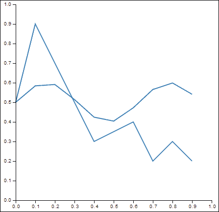
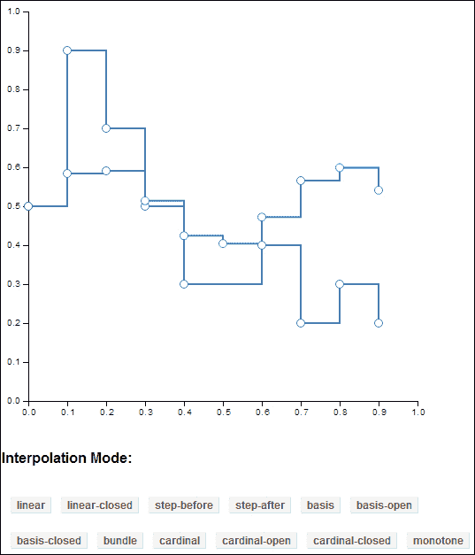
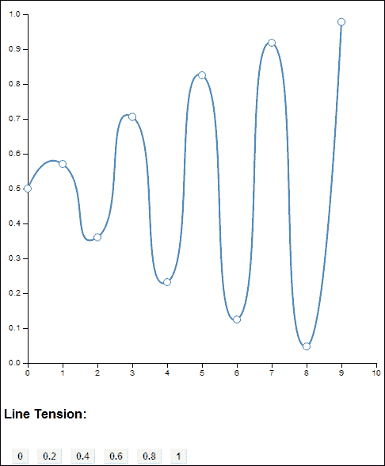
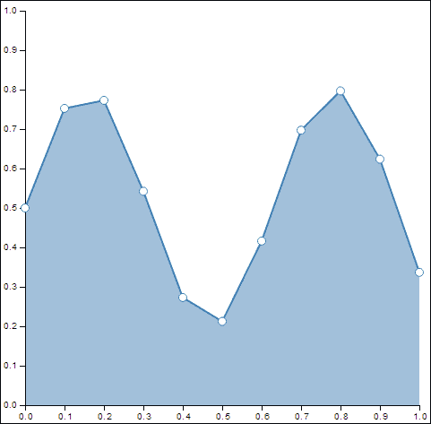
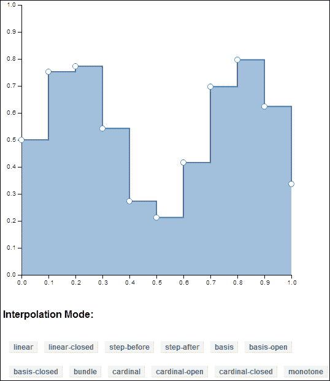
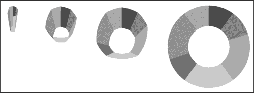

# 第七章. 形状塑造

在本章中，我们将涵盖：

+   创建简单形状

+   使用线生成器

+   使用线插值

+   改变线张力

+   使用区域生成器

+   使用区域插值

+   使用弧生成器

+   实现弧过渡

# 简介

**可缩放矢量图形**（**SVG**）是一个成熟的**万维网联盟**（**W3C**）标准，旨在为 Web 和移动平台上的用户交互式图形设计。与 HTML 类似，SVG 可以与现代浏览器中的 CSS 和 JavaScript 等其他技术愉快地共存，形成许多 Web 应用程序的骨干。在今天的 Web 中，你可以看到 SVG 的用例无处不在，从数字地图到数据可视化。到目前为止，在这本书中，我们已经涵盖了使用 HTML 元素的大部分食谱，然而，在现实世界的项目中，SVG 是数据可视化的实际标准；它也是 D3 真正发光的地方。在本章中，我们将介绍 SVG 的基本概念以及 D3 对 SVG 形状生成的支持。SVG 是一个非常丰富的主题。可以，并且已经有许多书籍单独致力于这个主题，因此，我们并不打算或试图涵盖所有与 SVG 相关的主题，而是将重点放在 D3 和数据可视化相关的技术和功能上。

## 什么是 SVG？

如其名所示，SVG 是关于图形的。它是用可缩放向量描述图形图像的一种方式。让我们看看 SVG 的两个主要优势：

### 向量

SVG 图像基于向量而不是像素。基于像素的方法中，图像由一个位图组成，其坐标用颜色色素填充，具有*x*和*y*。而基于向量的方法中，每个图像由一组使用简单和相对公式描述的几何形状组成，并填充了某种纹理。正如你可以想象的那样，这种方法自然适合数据可视化的需求。在 SVG 中使用线条、条形和圆形来可视化你的数据，比在位图中尝试操纵颜色色素要简单得多。

### 可扩展性

SVG 的第二个特性是可扩展性。由于 SVG 图形是由相对公式描述的一组几何形状，它可以以不同的尺寸和缩放级别进行渲染和重新渲染，而不会丢失精度。另一方面，当基于位图的图像被放大到高分辨率时，它们会遭受**像素化**的影响，这是当单个像素变得可见时发生的，而 SVG 没有这个缺点。请参见以下图表，以更好地了解我们刚才读到的内容：


SVG 与位图像素化对比

作为数据可视化者，使用 SVG 可以让你在任意分辨率上展示你的可视化，而不会失去你引人注目创作的清晰度。除此之外，SVG 还提供了一些额外的优势，例如：

+   **可读性**：SVG 基于 XML，一种人类可读的标记语言

+   **开放标准**：SVG 由 W3C 创建，不是专有供应商标准

+   **采用**：所有现代浏览器都支持 SVG 标准，甚至在移动平台上也是如此

+   **互操作性**：SVG 与其他网络技术（如 CSS 和 JavaScript）兼容良好；D3 本身就是这种能力的完美展示

+   **轻量级**：与基于位图的图像相比，SVG 要轻得多，占用的空间小得多

由于我们之前提到的所有这些功能，SVG 已经成为网络数据可视化的事实标准。从本章开始，本书中的所有食谱都将使用 SVG 作为其最重要的部分进行说明，通过 SVG 可以展示 D3 的真正力量。

### 注意

一些较旧的浏览器不支持 SVG。如果您的目标用户正在使用旧版浏览器，请在决定 SVG 是否适合您的可视化项目之前检查 SVG 兼容性。以下是一个您可以访问的链接，用于检查您浏览器的兼容性：

[`caniuse.com/svg`](http://caniuse.com/svg)

# 创建简单形状

在本食谱中，我们将探索一些简单的内置 SVG 形状公式及其属性。这些简单形状很容易生成，通常在需要时手动使用 D3 创建。尽管这些简单形状不是与 D3 一起工作时最有用的形状生成器，但偶尔在可视化项目中绘制边缘形状时它们可能很有用。

## 准备工作

在您的网络浏览器中打开以下文件的本地副本：

[`github.com/NickQiZhu/d3-cookbook/blob/master/src/chapter7/simple-shapes.html`](https://github.com/NickQiZhu/d3-cookbook/blob/master/src/chapter7/simple-shapes.html)

## 如何操作...

在本食谱中，我们将使用原生的 SVG 形状元素以四种不同的颜色绘制四种不同的形状：

```py
<script type="text/javascript">
    var width = 600,
        height = 500;

    var svg = d3.select("body").append("svg");

    svg.attr("height", height)
        .attr("width", width);    

 svg.append("line") // <-A
 .attr("x1", 0)
 .attr("y1", 200)
 .attr("x2", 100)
 .attr("y2", 100);

 svg.append("circle") // <-B
 .attr("cx", 200)
 .attr("cy", 150)
 .attr("r", 50);

 svg.append("rect")
 .attr("x", 300) // <-C
 .attr("y", 100)
 .attr("width", 100) // <-D
 .attr("height", 100)
 .attr("rx", 5); // <-E

 svg.append("polygon")
 .attr("points", "450,200 500,100 550,200"); // <-F
</script>
```

上述代码生成了以下视觉输出：


简单的 SVG 形状

## 工作原理...

在这个例子中，我们使用 SVG 内置形状元素绘制了四种不同的形状：一条线、一个圆、一个矩形和一个三角形。

**SVG 坐标系简要回顾**

SVG 的 *x* 和 *y* 坐标系起源于画布的左上角 `(0, 0)`，并延伸到右下角 `(<width>, <height>)`。

+   `line`：一个线元素通过坐标属性 `x1` 和 `y1` 作为起点，`x2` 和 `y2` 作为终点创建一条简单的直线（见线 `A`）。

+   `circle`：`append()` 函数通过定义圆心的坐标属性 `cx` 和 `cy` 以及定义圆的半径的属性 `r` 来绘制一个圆（见线 `B`）。

+   `rect`: `append()` 函数通过坐标属性 `x` 和 `y` 绘制一个矩形，这些属性定义了矩形的左上角（见线 `C`），`width` 和 `height` 属性用于控制矩形的大小，而 `rx` 和 `ry` 属性可以用来引入圆角。`rx` 和 `ry` 属性控制用于圆角椭圆的 *x* 和 *y* 轴半径（见线 `E`）。

+   `polygon`: 要绘制多边形，需要使用 `points` 属性定义组成多边形的一组点（见线 `F`）。`points` 属性接受由空格分隔的点坐标列表：

    ```py
    svg.append("polygon")
        .attr("points", "450,200 500,100 550,200"); // <-F
    ```

所有 SVG 形状都可以使用样式属性直接或通过 CSS（类似于 HTML 元素）进行样式化。此外，它们可以使用 SVG 变换和过滤支持进行变换和过滤，但由于本书的范围有限，我们不会详细讨论这些主题。在本章的其余部分，我们将专注于 D3 特定的 SVG 形状生成支持。

## 还有更多...

SVG 还支持 `ellipse` 和 `polyline` 元素，但由于它们与 `circle` 和 `polygon` 的相似性，我们在这本书中不会详细讨论它们。有关 SVG 形状元素的更多信息，请访问 [`www.w3.org/TR/SVG/shapes.html`](http://www.w3.org/TR/SVG/shapes.html)。

### D3 SVG 形状生成器

在 SVG 形状元素中，“瑞士军刀”般的存在是 `svg:path`。路径定义了任何形状的轮廓，然后可以被填充、描边或裁剪。到目前为止，我们讨论的所有形状都可以仅使用 `svg:path` 进行数学定义。SVG `path` 是一个非常强大的结构，拥有自己的迷你语言和语法。`svg:path` 的迷你语言用于设置 `svg:path` 元素上的 "`d`" 属性，该属性由以下命令组成：

+   **moveto**: 命令 **M**(绝对)/**m**(相对) 移动到 (x y)+

+   **closepath**: **Z**(绝对)/**z**(相对) 关闭路径

+   **lineto**: **L**(绝对)/**l**(相对) 直线到 (x y)+, **H**(绝对)/**h**(相对) 水平直线到 x+, **V**(绝对)/**v**(相对) 垂直直线到 y+

+   **三次贝塞尔曲线**: **C**(绝对)/**c**(相对) 曲线到 (x1 y1 x2 y2 x y)+, **S**(绝对)/**s**(相对) 简写曲线到 (x2 y2 x y)+

+   **二次贝塞尔曲线**: **Q**(绝对)/**q**(相对) 二次贝塞尔曲线到 (x1 y1 x y)+, **T**(绝对)/**t**(相对) 简写二次贝塞尔曲线到 (x y)+

+   **椭圆曲线**: **A**(绝对)/**a**(相对) 椭圆弧 (rx ry x-axis-rotation large-arc-flag sweep-flag x y)+

由于直接使用路径语言晦涩难懂，因此，在大多数情况下，需要某种软件，例如 Adobe Illustrator 或 Inkscape，来帮助我们直观地创建 SVG `path` 元素。同样，D3 附带了一套 SVG 形状生成器函数，可以用来生成数据驱动的路径公式；这就是 D3 如何通过结合 SVG 的力量和直观的数据驱动方法，真正地革新了数据可视化领域。这也将是本章剩余部分的重点。

## 参考以下内容

+   请参考 [`www.w3.org/TR/SVG/Overview.html`](http://www.w3.org/TR/SVG/Overview.html) 了解有关 SVG 相关主题的更多信息

+   有关 SVG 路径公式语言及其语法的完整参考，请访问 [`www.w3.org/TR/SVG/paths.html`](http://www.w3.org/TR/SVG/paths.html)

# 使用线生成器

D3 线生成器可能是最通用的生成器之一。尽管它被称为“线”生成器，但它与 `svg:line` 元素关系不大。相反，它是使用 `svg:path` 元素实现的。像 `svg:path` 一样，D3 `line` 生成器非常灵活，你可以仅使用 `line` 有效地绘制任何形状。然而，为了使你的生活更轻松，D3 还提供了其他更专业的形状生成器，这些生成器将在本章后面的菜谱中介绍。在这个菜谱中，我们将使用 `d3.svg.line` 生成器绘制多条数据驱动的线。

## 准备工作

在你的网络浏览器中打开以下文件的本地副本：

[`github.com/NickQiZhu/d3-cookbook/blob/master/src/chapter7/line.html`](https://github.com/NickQiZhu/d3-cookbook/blob/master/src/chapter7/line.html)

## 如何做...

现在，让我们看看线生成器的实际应用：

```py
<script type="text/javascript">
    var width = 500,
        height = 500,
        margin = 50,
 x = d3.scale.linear() // <-A
 .domain([0, 10])
 .range([margin, width - margin]),
 y = d3.scale.linear() // <-B
 .domain([0, 10])
 .range([height - margin, margin]);

 var data = [ // <-C
 [
 {x: 0, y: 5},{x: 1, y: 9},{x: 2, y: 7},
 {x: 3, y: 5},{x: 4, y: 3},{x: 6, y: 4},
 {x: 7, y: 2},{x: 8, y: 3},{x: 9, y: 2}
 ],

 d3.range(10).map(function(i){
 return {x: i, y: Math.sin(i) + 5};
 })
 ];

 var line = d3.svg.line() // <-D
 .x(function(d){return x(d.x);})
 .y(function(d){return y(d.y);});

    var svg = d3.select("body").append("svg");

    svg.attr("height", height)
        .attr("width", width);

     svg.selectAll("path.line")
            .data(data)
        .enter()
 .append("path") // <-E
            .attr("class", "line")            
 .attr("d", function(d){return line(d);}); // <-F

    // Axes related code omitted
    ...        
</script>
```

前面的代码在 *x* 和 *y* 轴上绘制了多条线：



D3 线生成器

## 工作原理...

在这个菜谱中，我们用来绘制线的数据定义在一个二维数组中：

```py
var data = [ // <-C
        [
            {x: 0, y: 5},{x: 1, y: 9},{x: 2, y: 7},
            {x: 3, y: 5},{x: 4, y: 3},{x: 6, y: 4},
            {x: 7, y: 2},{x: 8, y: 3},{x: 9, y: 2}
        ],

        d3.range(10).map(function(i){
            return {x: i, y: Math.sin(i) + 5};
        })
];
```

第一个数据系列是手动和明确定义的，而第二个系列是使用数学公式生成的。这两种情况在数据可视化项目中都很常见。一旦定义了数据，为了将数据点映射到其视觉表示，就创建了两个刻度用于 *x* 和 *y* 坐标：

```py
x = d3.scale.linear() // <-A
            .domain([0, 10])
            .range([margin, width - margin]),
y = d3.scale.linear() // <-B
            .domain([0, 10])
            .range([height - margin, margin]);
```

注意，这些刻度的域被设置为足够大，以包含两个系列中的所有数据点，而范围被设置为表示画布区域，不包括边距。由于我们希望原点位于画布的左下角而不是 SVG 标准的左上角，因此 *y* 轴的范围是反转的。一旦设置了数据和刻度，我们只需要使用 `d3.svg.line` 函数生成线来定义我们的生成器：

```py
var line = d3.svg.line() // <-D
            .x(function(d){return x(d.x);})
            .y(function(d){return y(d.y);});
```

`d3.svg.line`函数返回一个 D3 线生成器函数，您可以进一步自定义。在我们的例子中，我们只是为这个特定的线生成器声明了*x*坐标，它将使用`x`比例映射来计算，而*y*坐标将由`y`比例映射。使用 D3 比例来映射坐标不仅方便，而且是一种广泛接受的最佳实践（关注点分离）。尽管技术上您可以使用任何您喜欢的任何方法来实现这些函数。现在唯一剩下的事情就是实际创建`svg:path`元素。

```py
svg.selectAll("path.line")
            .data(data)
        .enter()
            .append("path") // <-E
            .attr("class", "line")            
            .attr("d", function(d){return line(d);}); // <-F
```

路径创建过程非常直接。使用我们定义的数据数组创建了两个`svg:path`元素（在行`E`）。然后，使用我们之前创建的`line`生成器，通过传递数据`d`作为输入参数来设置每个路径元素的`d`属性。以下截图显示了生成的`svg:path`元素的外观：


生成的 SVG 路径元素

最后，使用我们之前定义的相同的`x`和`y`轴创建了两个轴。由于本书的范围有限，我们省略了本食谱和本章其余部分中与轴相关的代码，因为它们实际上没有变化，也不是本章的重点。

## 参见

+   有关 D3 轴支持详细信息，请访问第五章, *玩转轴*

# 使用线插值

默认情况下，D3 线生成器使用**线性插值**模式，但是 D3 支持多种不同的线插值模式。线插值确定数据点将以何种方式连接，例如，通过直线（线性插值）或曲线（**三次插值**）。在本食谱中，我们将向您展示如何设置这些插值模式及其效果。

## 准备工作

在您的网络浏览器中打开以下文件的本地副本：

[`github.com/NickQiZhu/d3-cookbook/blob/master/src/chapter7/line-interpolation.html`](https://github.com/NickQiZhu/d3-cookbook/blob/master/src/chapter7/line-interpolation.html)

这个食谱是在之前食谱的基础上构建的，所以，如果你还不熟悉基本的行生成器函数，请在继续之前先复习一下之前的食谱。

## 如何做...

现在，让我们看看如何使用不同的线插值模式：

```py
    var width = 500,
        height = 500,
        margin = 30,
        x = d3.scale.linear()
            .domain([0, 10])
            .range([margin, width - margin]),
        y = d3.scale.linear()
            .domain([0, 10])
            .range([height - margin, margin]);

    var data = [
        [
            {x: 0, y: 5},{x: 1, y: 9},{x: 2, y: 7},
            {x: 3, y: 5},{x: 4, y: 3},{x: 6, y: 4},
            {x: 7, y: 2},{x: 8, y: 3},{x: 9, y: 2}
        ],  
        d3.range(10).map(function(i){
            return {x: i, y: Math.sin(i) + 5};
        })
    ];

    var svg = d3.select("body").append("svg");

    svg.attr("height", height)
        .attr("width", width);        

    renderAxes(svg);

    render("linear");    

    renderDots(svg);

    function render(mode){
        var line = d3.svg.line()
 .interpolate(mode) // <-A
                .x(function(d){return x(d.x);})
                .y(function(d){return y(d.y);});

        svg.selectAll("path.line")
                .data(data)
            .enter()
                .append("path")
                .attr("class", "line");                

        svg.selectAll("path.line")
                .data(data)       
            .attr("d", function(d){return line(d);});        
    }

 function renderDots(svg){ // <-B
 data.forEach(function(set){
 svg.append("g").selectAll("circle")
 .data(set)
 .enter().append("circle") // <-C
 .attr("class", "dot")
 .attr("cx", function(d) { return x(d.x); })
 .attr("cy", function(d) { return y(d.y); })
 .attr("r", 4.5);
 });
 }
// Axes related code omitted
```

之前的代码在您的浏览器中生成以下可配置插值模式的折线图：



线插值

## 它是如何工作的...

总体来说，这个食谱与之前的类似。使用预定义的数据集生成两行。然而，在这个食谱中，我们允许用户选择特定的行插值模式，然后通过在行生成器上使用`interpolate`函数来设置该模式（见行`A`）。

```py
var line = d3.svg.line()
                .interpolate(mode) // <-A
                .x(function(d){return x(d.x);})
                .y(function(d){return y(d.y);});
```

D3 支持以下插值模式：

+   **线性**：线性段，即折线

+   **linear-closed**：闭合的线性段，即多边形

+   **step-before**：交替垂直和水平段，类似于步函数

+   **step-after**：交替水平和垂直段，类似于步函数

+   **basis**：B 样条，两端有控制点重复

+   **basis-open**：开放的 B 样条；可能不与起点或终点相交

+   **basis-closed**：闭合的 B 样条，类似于环

+   **bundle**：等同于基础，但张力参数用于使样条变直

+   **cardinal**：基数样条，两端有控制点重复。

+   **cardinal-open**：开放的基数样条；可能不与起点或终点相交，但会与其他控制点相交

+   **cardinal-closed**：闭合的基数样条，类似于环

+   **monotone**：保留 *y* 单调性的三次插值

此外，在 `renderDots` 函数（参见代码行 `B`）中，我们还为每个数据点创建了一个小圆圈作为参考点。这些点是通过 `svg:circle` 元素创建的，如代码行 `C` 所示：

```py
function renderDots(svg){ // <-B
        data.forEach(function(set){
             svg.append("g").selectAll("circle")
                .data(set)
              .enter().append("circle") // <-C
                .attr("class", "dot")
                .attr("cx", function(d) { return x(d.x); })
                .attr("cy", function(d) { return y(d.y); })
                .attr("r", 4.5);
        });
}
```

# 改变线张力

如果使用基数插值模式（基数、基数开放、基数闭合），则可以通过**张力**设置进一步修改线。在本教程中，我们将了解如何修改张力以及它对线插值的影响。

## 准备工作

在您的网络浏览器中打开以下文件的本地副本：

[`github.com/NickQiZhu/d3-cookbook/blob/master/src/chapter7/line-tension.html`](https://github.com/NickQiZhu/d3-cookbook/blob/master/src/chapter7/line-tension.html)

## 如何操作...

现在，让我们看看如何改变线张力以及它对线生成的影响：

```py
<script type="text/javascript">
    var width = 500,
        height = 500,
        margin = 30,
        duration = 500,    
        x = d3.scale.linear()
            .domain([0, 10])
            .range([margin, width - margin]),
        y = d3.scale.linear()
            .domain([0, 1])
            .range([height - margin, margin]);

    var data = d3.range(10).map(function(i){
            return {x: i, y: (Math.sin(i * 3) + 1) / 2};
        });

    var svg = d3.select("body").append("svg");

    svg.attr("height", height)
        .attr("width", width);

    renderAxes(svg);

 render([1]); 

    function render(tension){
        var line = d3.svg.line()
                .interpolate("cardinal")
                .x(function(d){return x(d.x);})
                .y(function(d){return y(d.y);});

        svg.selectAll("path.line")
                .data(tension)
            .enter()
                .append("path")
                .attr("class", "line");            

 svg.selectAll("path.line")
 .data(tension) // <-A 
 .transition().duration(duration).ease("linear") // <-B
 .attr("d", function(d){
 return line.tension(d)(data); // <-C
 });

        svg.selectAll("circle")
            .data(data)
          .enter().append("circle")
            .attr("class", "dot")
            .attr("cx", function(d) { return x(d.x); })
            .attr("cy", function(d) { return y(d.y); })
            .attr("r", 4.5);
} 
// Axes related code omitted
    ...
</script>
<h4>Line Tension:</h4>
<div class="control-group">
    <button onclick="render([0])">0</button>
    <button onclick="render([0.2])">0.2</button>
    <button onclick="render([0.4])">0.4</button>
    <button onclick="render([0.6])">0.6</button>
    <button onclick="render([0.8])">0.8</button>
    <button onclick="render([1])">1</button>
</div>
```

上述代码生成一个可配置张力的基数线图：



线张力

## 工作原理...

张力将基数样条插值张力设置为范围 `[0, 1]` 内的特定数字。可以使用线生成器的 `tension` 函数设置张力（参见代码行 `C`）：

```py
svg.selectAll("path.line")
                .data(tension) // <-A                    
            .transition().duration(duration).ease("linear") // <-B
            .attr("d", function(d){
                return line.tension(d)(data);} // <-C 
            ); 
```

此外，我们还在代码行 `B` 上启动了一个过渡，以突出张力对线插值的影响。如果未显式设置张力，基数插值默认将张力设置为 `0.7`。

# 使用面积生成器

使用 D3 线生成器，我们可以技术上生成任何形状的轮廓，然而，即使有不同插值支持，直接使用线（如面积图）绘制面积并不是一件容易的事情。这就是为什么 D3 还提供了一个专门的形状生成器函数，专门用于绘制面积。

## 准备工作

在您的网络浏览器中打开以下文件的本地副本：

[`github.com/NickQiZhu/d3-cookbook/blob/master/src/chapter7/area.html`](https://github.com/NickQiZhu/d3-cookbook/blob/master/src/chapter7/area.html)

## 如何操作...

在本教程中，我们将向伪线图添加填充区域，从而有效地将其转换为面积图：

```py
<script type="text/javascript">
    var width = 500,
        height = 500,
        margin = 30,
        duration = 500,
 x = d3.scale.linear() // <-A
 .domain([0, 10])
 .range([margin, width - margin]),
 y = d3.scale.linear()
 .domain([0, 10])
 .range([height - margin, margin]);

 var data = d3.range(11).map(function(i){ // <-B
 return {x: i, y: Math.sin(i)*3 + 5};
 });

    var svg = d3.select("body").append("svg");

    svg.attr("height", height)
        .attr("width", width);        

    renderAxes(svg);

    render("linear");    

    renderDots(svg);

    function render(){
        var line = d3.svg.line()
                .x(function(d){return x(d.x);})
                .y(function(d){return y(d.y);});

        svg.selectAll("path.line")
                .data([data])
            .enter()
                .append("path")
                .attr("class", "line");                

        svg.selectAll("path.line")
                .data([data])       
            .attr("d", function(d){return line(d);});        

 var area = d3.svg.area() // <-C
 .x(function(d) { return x(d.x); }) // <-D
 .y0(y(0)) // <-E
 .y1(function(d) { return y(d.y); }); // <-F

 svg.selectAll("path.area") // <-G
 .data([data])
 .enter()
 .append("path")
 .attr("class", "area")
 .attr("d", function(d){return area(d);}); // <-H
    }

    // Dots rendering code omitted

    // Axes related code omitted
    ...
</script>
```

上述代码生成了以下视觉输出：



面积生成器

## 它是如何工作的...

与本章前面提到的*使用线生成器*配方类似，我们定义了两个比例尺来将数据映射到*x*和*y*坐标的视觉域（参见行 A），在这个配方中：

```py
x = d3.scale.linear() // <-A
            .domain([0, 10])
            .range([margin, width - margin]),
        y = d3.scale.linear()
            .domain([0, 10])
            .range([height - margin, margin]);

    var data = d3.range(11).map(function(i){ // <-B
            return {x: i, y: Math.sin(i)*3 + 5};
        });
```

在行`B`，数据通过一个数学公式生成。然后使用`d3.svg.area`函数创建面积生成器（参见行`C`）：

```py
var area = d3.svg.area() // <-C
            .x(function(d) { return x(d.x); }) // <-D
            .y0(y(0)) // <-E
            .y1(function(d) { return y(d.y); }); // <-F
```

如您所见，D3 面积生成器——类似于线生成器——设计用于在二维齐次坐标系中工作。通过`x`函数定义*x*坐标的访问函数（参见行`D`），它简单地使用我们之前定义的`x`比例尺将数据映射到视觉坐标。对于*y*坐标，我们为面积生成器提供了两个不同的访问器；一个用于下限（`y0`）和一个用于上限（`y1`）坐标。这是面积生成器和线生成器之间的关键区别。D3 面积生成器支持*x*和*y*轴上的上下限（`x0`、`x1`、`y0`、`y1`），如果上下限相同，则可以使用简写访问器（`x`和`y`）。一旦定义了面积生成器，创建面积的方法几乎与线生成器相同。

```py
svg.selectAll("path.area") // <-G
                .data([data])
            .enter()
                .append("path")
                .attr("class", "area")
                .attr("d", function(d){return area(d);}); // <-H
```

面积也是使用`svg:path`元素实现的（参见行`G`）。D3 面积生成器用于在行`H`上生成`svg:path`元素的`"d"`公式，其中数据`"d"`是其输入参数。

# 使用面积插值

与 D3 线生成器类似，面积生成器也支持相同的插值模式，因此，它可以在每种模式下与线生成器一起使用。

## 准备工作

在您的网络浏览器中打开以下文件的本地副本：

[`github.com/NickQiZhu/d3-cookbook/blob/master/src/chapter7/area-interpolation.html`](https://github.com/NickQiZhu/d3-cookbook/blob/master/src/chapter7/area-interpolation.html)

## 如何操作...

在这个配方中，我们将展示如何在面积生成器上配置插值模式。这样就可以创建与相应线匹配的匹配插值面积：

```py
    var width = 500,
        height = 500,
        margin = 30,
        x = d3.scale.linear()
            .domain([0, 10])
            .range([margin, width - margin]),
        y = d3.scale.linear()
            .domain([0, 10])
            .range([height - margin, margin]);

    var data = d3.range(11).map(function(i){
        return {x: i, y: Math.sin(i)*3 + 5};
    });

    var svg = d3.select("body").append("svg");

    svg.attr("height", height)
        .attr("width", width);        

    renderAxes(svg);

    render("linear");    

    renderDots(svg);

    function render(mode){
        var line = d3.svg.line()
 .interpolate(mode) // <-A
                .x(function(d){return x(d.x);})
                .y(function(d){return y(d.y);});

        svg.selectAll("path.line")
                .data([data])
            .enter()
                .append("path")
                .attr("class", "line");                

        svg.selectAll("path.line")
                .data([data])       
            .attr("d", function(d){return line(d);});        

        var area = d3.svg.area()
 .interpolate(mode) // <-B
            .x(function(d) { return x(d.x); })
            .y0(height - margin)
            .y1(function(d) { return y(d.y); });

        svg.selectAll("path.area")
                .data([data])
            .enter()
                .append("path")
                .attr("class", "area")

        svg.selectAll("path.area")
            .data([data])
            .attr("d", function(d){return area(d);});        
}
// Dots and Axes related code omitted
```

以下代码生成一个具有可配置插值模式的伪面积图：



面积插值

## 它是如何工作的...

这个配方与上一个配方类似，只是在这次配方中，插值模式是基于用户的选项传递的：

```py
var line = d3.svg.line()
                .interpolate(mode) // <-A
                .x(function(d){return x(d.x);})
                .y(function(d){return y(d.y);});

var area = d3.svg.area()
            .interpolate(mode) // <-B
            .x(function(d) { return x(d.x); })
            .y0(y(0))
            .y1(function(d) { return y(d.y); });
```

如您所见，插值模式是在两行中通过`interpolate`函数配置的，同时通过面积生成器（参见行`A`和`B`）。由于 D3 线生成器和面积生成器支持相同的插值模式集，它们可以始终被用来生成与这个配方中看到的匹配的线和面积。

## 还有更多...

当使用基数模式插值时，D3 面积生成器也支持相同的张力配置，然而，由于它与线生成器的张力支持相同，并且由于本书的范围有限，我们在此不涉及面积张力。

## 参考以下内容

+   请参阅[`github.com/mbostock/d3/wiki/SVG-Shapes#wiki-area`](https://github.com/mbostock/d3/wiki/SVG-Shapes#wiki-area)以获取有关区域生成函数的更多信息。

# 使用弧生成器

在最常见的形状生成器中——除了线和区域生成器之外——D3 还提供了**弧生成器**。此时，您可能想知道，“SVG 标准不是已经包含了圆形元素吗？这难道还不够吗？”

简单的回答是“不”。D3 弧生成器比简单的 `svg:circle` 元素要灵活得多。D3 弧生成器不仅能创建圆形，还能创建圆环（类似甜甜圈）、圆形扇形和圆环扇形，所有这些我们将在本菜谱中学习。更重要的是，弧生成器旨在生成弧（换句话说，不是完整的圆或扇形，而是任意角度的弧）。

## 准备工作

在您的网络浏览器中打开以下文件的本地副本：

[`github.com/NickQiZhu/d3-cookbook/blob/master/src/chapter7/arc.html`](https://github.com/NickQiZhu/d3-cookbook/blob/master/src/chapter7/arc.html)

## 如何操作...

在本菜谱中，我们将使用弧生成器生成多切片圆形、圆环（甜甜圈）、圆形扇形和圆环扇形。

```py
<script type="text/javascript">
var width = 400,
height = 400,
// angles are in radians
 fullAngle = 2 * Math.PI, // <-A
    colors = d3.scale.category20c();

var svg = d3.select("body").append("svg")
            .attr("class", "pie")
            .attr("height", height)
            .attr("width", width);    

function render(innerRadius, endAngle){
    if(!endAngle) endAngle = fullAngle;

 var data = [ // <-B
 {startAngle: 0, endAngle: 0.1 * endAngle},
 {startAngle: 0.1 * endAngle, endAngle: 0.2 * endAngle},
 {startAngle: 0.2 * endAngle, endAngle: 0.4 * endAngle},
 {startAngle: 0.4 * endAngle, endAngle: 0.6 * endAngle}, 
 {startAngle: 0.6 * endAngle, endAngle: 0.7 * endAngle}, 
 {startAngle: 0.7 * endAngle, endAngle: 0.9 * endAngle}, 
 {startAngle: 0.9 * endAngle, endAngle: endAngle}
 ];

 var arc = d3.svg.arc().outerRadius(200) // <-C
 .innerRadius(innerRadius);

    svg.select("g").remove();

    svg.append("g")
            .attr("transform", "translate(200,200)")
    .selectAll("path.arc")
            .data(data)
        .enter()
            .append("path")
                .attr("class", "arc")
                .attr("fill", function(d, i){return colors(i);})
 .attr("d", function(d, i){
 return arc(d, i); // <-D
});
}

render(0);
</script>

<div class="control-group">
    <button onclick="render(0)">Circle</button>
    <button onclick="render(100)">Annulus(Donut)</button>
    <button onclick="render(0, Math.PI)">Circular Sector</button>
    <button onclick="render(100, Math.PI)">Annulus Sector</button>
</div>
```

上述代码生成了以下圆形，您可以通过点击按钮将其更改为弧形、扇形或弧扇形，例如，**圆环（甜甜圈）**生成第二个形状：


弧生成器

## 它是如何工作的...

理解 D3 弧生成器的最重要部分是其数据结构。D3 弧生成器对其数据有非常具体的要求，如行`B`所示：

```py
var data = [ // <-B
        {startAngle: 0, endAngle: 0.1 * endAngle},
        {startAngle: 0.1 * endAngle, endAngle: 0.2 * endAngle},
        {startAngle: 0.2 * endAngle, endAngle: 0.4 * endAngle},
        {startAngle: 0.4 * endAngle, endAngle: 0.6 * endAngle},        
        {startAngle: 0.6 * endAngle, endAngle: 0.7 * endAngle},        
        {startAngle: 0.7 * endAngle, endAngle: 0.9 * endAngle},        
        {startAngle: 0.9 * endAngle, endAngle: endAngle}
];
```

弧数据表的每一行都必须包含两个必填字段，`startAngle`（起始角）和`endAngle`（结束角）。角度必须在 `[0, 2 * Math.PI]` 范围内（见行`A`）。D3 弧生成器将使用这些角度生成相应的切片，如本菜谱中前面所示。

### 小贴士

除了起始角和结束角之外，弧数据集还可以包含任何数量的附加字段，然后可以在 D3 函数中访问这些字段以驱动其他视觉表示。

如果您认为根据您拥有的数据计算这些角度将会很麻烦，您完全正确。这就是为什么 D3 提供了特定的布局管理器来帮助您计算这些角度，我们将在下一章中介绍。现在，让我们专注于理解背后的基本机制，以便在介绍布局管理器或您需要手动设置角度时，您将能够很好地完成这些工作。D3 弧生成器是通过使用 `d3.svg.arc` 函数创建的：

```py
var arc = d3.svg.arc().outerRadius(200) // <-C
                    .innerRadius(innerRadius); 
```

`d3.svg.arc` 函数可选地有 `outerRadius` 和 `innerRadius` 设置。当设置 `innerRadius` 时，弧生成器将生成一个环面（甜甜圈）的图像，而不是一个圆。最后，D3 弧也是使用 `svg:path` 元素实现的，因此与线和面积生成器类似，`d3.svg.arc` 生成器函数可以调用（见行 `D`）来生成 `svg:path` 元素的 `d` 公式：

```py
svg.append("g")
            .attr("transform", "translate(200,200)")
    .selectAll("path.arc")
            .data(data)
        .enter()
            .append("path")
                .attr("class", "arc")
                .attr("fill", function(d, i){return colors(i);})
                .attr("d", function(d, i){
                    return arc(d, i); // <-D
                });
```

值得在这里提及的一个额外元素是 `svg:g` 元素。此元素本身不定义任何形状，而是一个容器元素，用于组合其他元素，在这种情况下，是 `path.arc` 元素。应用于 `g` 元素的变换应用于所有子元素，同时其属性也被其子元素继承。

# 实现弧过渡

弧与其他形状（如线和面积）显著不同的一个领域是其过渡效果。到目前为止，我们涵盖的大多数形状，包括简单的 SVG 内置形状，你可以依赖 D3 过渡和插值来处理它们的动画。然而，当处理弧时，情况并非如此。我们将在这个菜谱中探索弧过渡技术。

## 准备工作

在您的网络浏览器中打开以下文件的本地副本：

[`github.com/NickQiZhu/d3-cookbook/blob/master/src/chapter7/arc-transition.html`](https://github.com/NickQiZhu/d3-cookbook/blob/master/src/chapter7/arc-transition.html)

## 如何做...

在这个菜谱中，我们将动画化一个多切片圆环，每个切片从角度 `0` 开始过渡到其最终所需的角度，并最终形成一个完整的圆环：

```py
<script type="text/javascript">
var width = 400,
        height = 400,
        endAngle = 2 * Math.PI,
        colors = d3.scale.category20c();

var svg = d3.select("body").append("svg")
        .attr("class", "pie")
        .attr("height", height)
        .attr("width", width);

function render(innerRadius) {

    var data = [
        {startAngle: 0, endAngle: 0.1 * endAngle},
        {startAngle: 0.1 * endAngle, endAngle: 0.2 * endAngle},
        {startAngle: 0.2 * endAngle, endAngle: 0.4 * endAngle},
        {startAngle: 0.4 * endAngle, endAngle: 0.6 * endAngle},
        {startAngle: 0.6 * endAngle, endAngle: 0.7 * endAngle},
        {startAngle: 0.7 * endAngle, endAngle: 0.9 * endAngle},
        {startAngle: 0.9 * endAngle, endAngle: endAngle}
    ];

    var arc = d3.svg.arc().outerRadius(200).innerRadius(innerRadius);

    svg.select("g").remove();

    svg.append("g")
        .attr("transform", "translate(200,200)")
        .selectAll("path.arc")
            .data(data)
        .enter()
            .append("path")
            .attr("class", "arc")
            .attr("fill", function (d, i) {
                return colors(i);
            })
            .transition().duration(1000)
 .attrTween("d", function (d) { // <-A 
 var start = {startAngle: 0, endAngle: 0}; // <-B
 var interpolate = d3.interpolate(start, d); // <-C
 return function (t) {
 return arc(interpolate(t)); // <-D
 };
 });
}

render(100);
</script>
```

上述代码生成一个弧，它开始旋转并最终形成一个完整的圆环：


带插值的弧过渡

]

## 它是如何工作的...

面对这样的过渡要求时，你首先可能想到的是使用纯 D3 过渡，同时依赖内置插值来生成动画。以下代码片段将完成这项工作：

```py
svg.append("g")
        .attr("transform", "translate(200,200)")
        .selectAll("path.arc")
            .data(data)
        .enter()
            .append("path")
            .attr("class", "arc")
            .attr("fill", function (d, i) {
                return colors(i);
            })
 .attr("d", function(d){
 return arc({startAngle: 0, endAngle: 0});
 })
 .transition().duration(1000).ease("linear")
 .attr("d", function(d){return arc(d);});

```

如前述代码片段中突出显示的行所示，我们最初创建了一个具有 `startAngle` 和 `endAngle` 都设置为零的切片路径。然后，通过过渡，我们使用弧生成器函数 `arc(d)` 将路径 `"d"` 属性插值到其最终角度。这种方法看起来似乎有道理，然而，它生成的是以下所示的过渡：



无插值的弧过渡

这显然不是我们想要的动画。这种奇怪过渡的原因是，通过直接在 `svg:path` 属性 `"d"` 上创建过渡，我们指示 D3 插值这个字符串：

```py
d="M1.2246063538223773e-14,-200A200,200 0 0,1 1.2246063538223773e-14,-200L6.123031769111886e-15,-100A100,100 0 0,0 6.123031769111886e-15,-100Z"
```

将此字符串线性化：

```py
d="M1.2246063538223773e-14,-200A200,200 0 0,1 117.55705045849463,-161.80339887498948L58.778525229247315,-80.90169943749474A100,100 0 0,0 6.123031769111886e-15,-100Z"
```

因此，这种特定的过渡效果。

### 注意

虽然这个过渡效果不是我们在这个例子中想要的，但这仍然是一个很好的展示，说明了内置的 D3 过渡是多么灵活和强大。

为了实现我们想要的过渡效果，我们需要利用 D3 属性缓动（有关缓动的详细描述，请参阅第六章中的*使用缓动*配方，*以风格过渡*）：

```py
svg.append("g")
        .attr("transform", "translate(200,200)")
        .selectAll("path.arc")
            .data(data)
        .enter()
            .append("path")
            .attr("class", "arc")
            .attr("fill", function (d, i) {
                return colors(i);
            })
            .transition().duration(1000)
            .attrTween("d", function (d) { // <-A
                var start = {startAngle: 0, endAngle: 0}; // <-B
                var interpolate = d3.interpolate(start, d); // <-C
                return function (t) {
                    return arc(interpolate(t)); // <-D
                };
            });
```

在这里，我们不是直接过渡 `svg:path` 属性的 `"d"`，而是在行 `A` 上创建了一个缓动函数。如您所回忆的，D3 的 `attrTween` 期望一个用于缓动函数的工厂函数。在这种情况下，我们从角度零开始缓动（参见行 `B`）。然后在行 `C` 上创建了一个复合对象插值器，它将为每个切片插值起始和结束角度。最后在行 `D` 上，使用弧生成器根据已经插值的角生成适当的 `svg:path` 公式。这就是如何通过自定义属性缓动创建平滑过渡的适当角度弧的方法。

## 还有更多...

D3 还提供了对其他形状生成器的支持，例如符号、和弦和斜线。然而，由于它们的简单性和本书的有限范围，我们在这里不会单独介绍它们，尽管我们将在下一章的其他更复杂的视觉结构中介绍它们。更重要的是，通过我们对本章中介绍的这些形状生成器的扎实理解，您应该能够轻松地掌握其他 D3 形状生成器。

## 参见

+   更多关于过渡和缓动的信息，请参阅第六章中的使用缓动配方，*以风格过渡*
