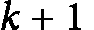
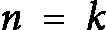

# 第四章：<st c="0">2</st>

# <st c="2">数学归纳法与算法正确性中的循环不变式</st>

<st c="69">笛卡尔曾著名地说：“</st>*<st c="101">对我来说，一切都归结为数学</st>*<st c="144">，”强调了数学与各种智力追求之间的深刻联系。</st> <st c="238">这一观点在计算机科学领域尤为相关，因为算法的设计、效率和验证深深植根于数学原理之中。</st> <st c="415">在本章及下一章中，我们将探讨支撑算法分析的数学基础。</st> <st c="532">我们将讨论这些数学概念如何不仅指导算法解决方案的开发，而且确保它们的有效性和准确性。</st> <st c="686">本讨论旨在提供对数学在算法设计与分析艺术和科学中不可或缺的理解</st> <st c="822">和分析。</st>

<st c="835">在本章中，我们探讨了数学归纳法的概念及其在建立循环不变式中的关键作用，循环不变式是评估算法正确性的框架，构成了证明算法正确性的基础。</st> <st c="1063">通过一系列详细的例子，我们解释了循环不变式的概念，展示了它们的功能及其重要性。</st> <st c="1197">本讨论为后续章节中应用这些概念奠定了基础，增强了你严谨验证算法正确性技巧的能力。</st> <st c="1371">这一探索不仅为理论框架提供了支持，也为实践提供了洞见，赋予了你设计和分析算法的基本工具。</st> <st c="1549">在本章中，以下主题将</st> <st c="1592">被探讨：</st>

+   <st c="1604">数学归纳法</st>

+   <st c="1627">算法正确性的循环不变式</st> <st c="1664">的数学归纳法</st>

# <st c="1677">数学归纳法</st>

<st c="1700">寻找</st> <st c="1715">反例是质疑某些命题或算法正确性时的一种策略。</st> <st c="1828">这种方法在传统证明正确性的方法难以应用时特别有用。</st> <st c="1941">反例本质上是一个特定的实例或案例，用来展示一个命题的虚假性或算法的错误性。</st> <st c="2082">当一个证明显得复杂或算法背后的逻辑错综复杂时，识别反例可以提供一种更直接的方式</st> <st c="2226">来驳斥该命题。</st> <st c="2252">这种方法也称为</st> **<st c="2281">间接证明</st>**<st c="2295">。</st>

<st c="2296">通常，反例可以很容易地观察到。</st> <st c="2345">在这种情况下，它是快速有效地否定假设的一种方式，避免了冗长复杂的证明。</st> <st c="2485">然而，也有一些情况下，找到反例是一项挑战。</st> <st c="2569">如果经过认真寻找后，仍然难以找到反例，这可能表明通过直接证明正确性来解决问题更为合适。</st> <st c="2734">然而，需要注意的是，无法找到反例并不能本质上证明算法的正确性。</st> <st c="2867">仅仅因为反例难以找到或不明显，并不意味着算法是有效的。</st> <st c="2968">这突显了在算法开发和评估过程中严格分析和测试的重要性，确保正确性的声明不会在没有经过彻底检查的情况下被轻易接受。</st> <st c="3169">现在，让我们来看一下</st> <st c="3192">以下示例。</st>

**<st c="3210">示例 2.1</st>**<st c="3222">:</st>

<st c="3224">证明或反驳：</st> ![<mml:math xmlns:mml="http://www.w3.org/1998/Math/MathML" xmlns:m="http://schemas.openxmlformats.org/officeDocument/2006/math"><mml:mo>∀</mml:mo><mml:mi>a</mml:mi><mml:mo>></mml:mo><mml:mn>1</mml:mn><mml:mi mathvariant="normal"> </mml:mi><mml:mo>∀</mml:mo><mml:mi>b</mml:mi><mml:mo>></mml:mo><mml:mn>1</mml:mn><mml:mo>:</mml:mo><mml:mi mathvariant="normal"> </mml:mi><mml:mfenced separators="|"><mml:mrow><mml:mi>a</mml:mi><mml:mo>+</mml:mo><mml:mi>b</mml:mi></mml:mrow></mml:mfenced><mml:mo>!</mml:mo><mml:mi mathvariant="normal"> </mml:mi><mml:mo>=</mml:mo><mml:mi mathvariant="normal"> </mml:mi><mml:mi>a</mml:mi><mml:mo>!</mml:mo><mml:mi mathvariant="normal"> </mml:mi><mml:mi>b</mml:mi><mml:mo>!</mml:mo><mml:mi mathvariant="normal"> </mml:mi></mml:math>](img/8.png)

<st c="3292">设</st> <st c="3296"><st c="3297">且</st> <st c="3301"><st c="3317">。然后，我们必须证明</st> <st c="3338">以下内容：</st></st></st>


<st c="3361">这是错误的。</st>

<st c="3375">如前所述，间接证明无法保证关系或算法的有效性。</st> <st c="3481">这突显了在算法分析中</st> <st c="3512">使用</st> **<st c="3516">直接证明技术</st>** <st c="3539">的必要性。</st> <st c="3563">与间接证明不同，间接证明通过寻找反例来推翻假设，而直接证明则是通过积极证明一个关系或算法在所有</st> <st c="3755">可能条件下都成立。</st>

<st c="3775">例如，在</st> <st c="3795">间接证明中，找到一个反例就足以使该命题无效。</st> <st c="3883">然而，在直接证明中，特别是当涉及到自然数时，必须考虑从</st> *<st c="4011">n=0</st>* <st c="4014">到</st> <st c="4018"><st c="4026">的所有自然数。这种穷举法需要对范围和</st> *<st c="4106">n</st>*<st c="4107">的类型有明确的定义。在算法分析的上下文中，</st> *<st c="4147">n</st>* <st c="4148">通常代表我们在证明过程中所检查的案例数。</st> <st c="4235">由于案例数不能是分数，必须始终是一个整数，</st> *<st c="4317">n</st>* <st c="4318">被定义为自然数。</st> <st c="4351">此外，</st> *<st c="4377">n</st>* <st c="4378">的范围从 0 扩展到无穷大，以确保考虑到所有可能的情景，验证不存在可以推翻算法正确性的情况。</st> <st c="4541">这一严格的方法确保了算法在所有可想象的情况下的可靠性得到了全面验证。</st> <st c="4658">这正是</st> <st c="4689">数学归纳法的最终目标。</st>

<st c="4712">回溯</st>

<st c="4722">概念</st> **<st c="4738">数学归纳法</st>** <st c="4760">有着超过 3000 年的丰富历史。</st> <st c="4814">数学归纳法背后的原理是，如果一个假设在某个范围的边界上成立，并且在该范围内继续成立，那么这个假设可以被认为在整个范围内有效。</st> <st c="5022">这种方法对于证明数学序列特别有效，并且与</st> <st c="5125">计算机算法</st>直接相关。</st>

在计算机算法的背景下，数学归纳可以被看作是验证算法正确性的强大工具。

算法可以被视为一个复杂的序列，其中输入，，表示案例编号或循环索引，序列体现了算法的功能期望。

在数学归纳的过程中，证明从一个边界开始，通常是当时。从那里开始，任务是证明如果假设对某个任意自然数有效，则对也是真实的。一旦对（这可以是任何自然数）建立了这一点，它有效地证明了所有自然数的假设。这种一步一步的方法，从一个自然数到下一个自然数的进展，强调了数学归纳在纯数学和算法设计中的可靠性和适用性。

1.  **<st c="6145">基础案例（初始步骤）</st>**<st c="6170">：这</st> <st c="6177">包括评估并证明假设对于最小的</st><st c="6266"><st c="6332">值成立，通常是</st> <st c="6344"><st c="6365">或者</st> <st c="6368"><st c="6374">，具体取决于问题的要求。</st> <st c="6419">在算法设计的上下文中，基础案例通常是</st> <st c="6480"><st c="6481">，因为测试算法通常从第一个可能的、非空的实例开始。</st> <st c="6569">此步骤确立了假设在</st> <st c="6647">序列起始点的有效性。</st></st></st></st></st>

1.  **<st c="6660">归纳步骤</st>**<st c="6675">：这一</st> <st c="6683">步骤要求证明，如果假设对于某个任意的案例编号有效</st> <st c="6768"><st c="6769">，那么它对于</st><st c="6796"><st c="6826">依然有效。这个过程，通常称为假设或归纳假设，涉及通过证明某个案例的假设成立，从而逻辑地推断出下一个案例的假设也成立。</st> <st c="7004">通过成功地展示这一点，我们可以确定假设对于所有后续案例成立，直到</st> <st c="7108">无穷大。</st></st></st>

<st c="7120">在示例</st> *<st c="7132">2.2</st>*<st c="7135">中，我们逐步演示了数学归纳法的过程。</st>

**<st c="7203">示例 2.2</st>**<st c="7215">：</st>

<st c="7217">使用数学归纳法证明</st> <st c="7257">以下命题。</st>

<st c="7279">前几个自然数的和由以下公式给出：</st>


**<st c="7343">证明</st>**<st c="7348">:</st>

1.  **<st c="7350">基础情况</st>**<st c="7359">: 对于</st> <st c="7366"><st c="7367">，序列只包含一个元素，即 1\。</st> <st c="7421">根据</st> <st c="7434">公式：</st>

    ![<mml:math xmlns:mml="http://www.w3.org/1998/Math/MathML" xmlns:m="http://schemas.openxmlformats.org/officeDocument/2006/math" display="block"><mml:mn>1</mml:mn><mml:mi mathvariant="normal"> </mml:mi><mml:mo>=</mml:mo><mml:mfrac><mml:mrow><mml:mn>1</mml:mn><mml:mfenced separators="|"><mml:mrow><mml:mn>1</mml:mn><mml:mo>+</mml:mo><mml:mn>1</mml:mn></mml:mrow></mml:mfenced></mml:mrow><mml:mrow><mml:mn>2</mml:mn></mml:mrow></mml:mfrac><mml:mo>=</mml:mo><mml:mfrac><mml:mrow><mml:mn>2</mml:mn></mml:mrow><mml:mrow><mml:mn>2</mml:mn></mml:mrow></mml:mfrac><mml:mo>=</mml:mo><mml:mi mathvariant="normal"> </mml:mi><mml:mn>1</mml:mn></mml:math>](img/27.png)

    <st c="7448">基础情况成立，因为方程的两边</st> <st c="7503">相等。</st></st>

1.  **<st c="7513">归纳步骤</st>**<st c="7528">: 假设命题对于</st> <st c="7564"><st c="7565">；即假设</st> <st c="7583">满足</st> ![<mml:math xmlns:mml="http://www.w3.org/1998/Math/MathML" xmlns:m="http://schemas.openxmlformats.org/officeDocument/2006/math"><mml:mn>1</mml:mn><mml:mo>+</mml:mo><mml:mn>2</mml:mn><mml:mo>+</mml:mo><mml:mn>3</mml:mn><mml:mo>+</mml:mo><mml:mo>…</mml:mo><mml:mi> </mml:mi><mml:mo>+</mml:mo><mml:mi>k</mml:mi><mml:mi> </mml:mi><mml:mo>=</mml:mo><mml:mi> </mml:mi><mml:mfrac><mml:mrow><mml:mi>k</mml:mi><mml:mi> </mml:mi><mml:mfenced separators="|"><mml:mrow><mml:mi>k</mml:mi><mml:mo>+</mml:mo><mml:mn>1</mml:mn></mml:mrow></mml:mfenced></mml:mrow><mml:mrow><mml:mn>2</mml:mn></mml:mrow></mml:mfrac></mml:math>](img/29.png)<st c="7588"><st c="7594">。</st></st></st>

现在，证明它适用于 <st c="7614"><st c="7615">。因此，考虑</st> <st c="7632">和：</st></st>

![<mml:math xmlns:mml="http://www.w3.org/1998/Math/MathML" xmlns:m="http://schemas.openxmlformats.org/officeDocument/2006/math" display="block"><mml:mn>1</mml:mn><mml:mi> </mml:mi><mml:mo>+</mml:mo><mml:mi> </mml:mi><mml:mn>2</mml:mn><mml:mi> </mml:mi><mml:mo>+</mml:mo><mml:mi> </mml:mi><mml:mn>3</mml:mn><mml:mi> </mml:mi><mml:mo>+</mml:mo><mml:mi> </mml:mi><mml:mo>…</mml:mo><mml:mo>+</mml:mo><mml:mi> </mml:mi><mml:mi>k</mml:mi><mml:mi> </mml:mi><mml:mo>+</mml:mo><mml:mi> </mml:mi><mml:mfenced separators="|"><mml:mrow><mml:mi>k</mml:mi><mml:mo>+</mml:mo><mml:mn>1</mml:mn></mml:mrow></mml:mfenced></mml:math>](img/31.png)

根据归纳假设，前面几个数的和是 <st c="7701"><st c="7713">数字之和是</st>  <st c="7724"><st c="7725">。</st></st></st>

加上 <st c="7734"><st c="7746">到两边，得到</st> <st c="7765">以下结果：</st></st>

![<mml:math xmlns:mml="http://www.w3.org/1998/Math/MathML" xmlns:m="http://schemas.openxmlformats.org/officeDocument/2006/math" display="block"><mml:mn>1</mml:mn><mml:mo>+</mml:mo><mml:mn>2</mml:mn><mml:mo>+</mml:mo><mml:mn>3</mml:mn><mml:mo>+</mml:mo><mml:mo>…</mml:mo><mml:mo>+</mml:mo><mml:mi>k</mml:mi><mml:mi> </mml:mi><mml:mo>+</mml:mo><mml:mfenced separators="|"><mml:mrow><mml:mi>k</mml:mi><mml:mo>+</mml:mo><mml:mn>1</mml:mn></mml:mrow></mml:mfenced><mml:mi> </mml:mi><mml:mo>=</mml:mo><mml:mi> </mml:mi><mml:mfrac><mml:mrow><mml:mi>k</mml:mi><mml:mi> </mml:mi><mml:mo>×</mml:mo><mml:mfenced separators="|"><mml:mrow><mml:mi>k</mml:mi><mml:mo>+</mml:mo><mml:mn>1</mml:mn></mml:mrow></mml:mfenced></mml:mrow><mml:mrow><mml:mn>2</mml:mn></mml:mrow></mml:mfrac><mml:mo>+</mml:mo><mml:mi> </mml:mi><mml:mfenced separators="|"><mml:mrow><mml:mi>k</mml:mi><mml:mo>+</mml:mo><mml:mn>1</mml:mn></mml:mrow></mml:mfenced></mml:math>](img/35.png) <st c="7779">![<math xmlns="http://www.w3.org/1998/Math/MathML"><mrow><mrow><mo>=</mo><mstyle scriptlevel="+1"><mfrac><mrow><mi>k</mi><mspace width="0.25em" /><mo>×</mo><mfenced open="(" close=")"><mrow><mi>k</mi><mo>+</mo><mn>1</mn></mrow></mfenced><mo>+</mo><mn>2</mn><mfenced open="(" close=")"><mrow><mi>k</mi><mo>+</mo><mn>1</mn></mrow></mfenced></mrow><mn>2</mn></mfrac></mstyle><mo>=</mo><mspace width="0.25em" /><mstyle scriptlevel="+1"><mfrac><mrow><mfenced open="(" close=")"><mrow><mi>k</mi><mo>+</mo><mn>1</mn></mrow></mfenced><mspace width="0.25em" /><mfenced open="(" close=")"><mrow><mi>k</mi><mo>+</mo><mn>2</mn></mml:mrow></mfrac></mstyle></mrow></mrow></math>](img/36.png)</st>

<st c="7782">这表明</st> <st c="7792">如果命题在</st> <st c="7829"><st c="7844">时为真，那么它对于</st> <st c="7862">也为真</st> <st c="7866"><st c="7867">时也成立。</st></st></st>

<st c="7868">你可能会好奇数学归纳法与算法正确性之间的联系。</st> <st c="7959">为了阐明这一点，我们首先需要审视算法的架构。</st> <st c="8032">从根本上讲，算法是一种“序列”——就像烹饪食谱，它是一系列旨在解决问题的指令。</st> <st c="8162">每个算法都包含不同类型的指令，通常可以广泛分类为</st> <st c="8248">以下几类：</st>

+   **<st c="8259">简单命令</st>**<st c="8275">：这些是</st> <st c="8287">不依赖于输入大小的指令。</st> <st c="8334">例如，基本的赋值操作，如</st> *<st c="8390">x = 0</st>*<st c="8395">。尽管可能涉及复杂的算术或逻辑操作，这些命令依然不依赖于输入大小。</st> <st c="8520">我们将其称为</st> <st c="8531">**<st c="8541">规模无关命令</st>**。通常，这些命令的正确性是直观的，且常被认为是理所当然的，因为</st> <st c="8651">它们的简单性。</st>

+   **<st c="8668">复合命令</st>**<st c="8686">：该</st> <st c="8693">类别包括其他命令的块，这些命令可以是简单命令或其他复合命令。</st> <st c="8802">复合命令可能被封装在一个函数调用内，或者由一系列更简单的命令组成。</st> <st c="8909">然而，最显著的复合命令形式是</st> **<st c="8966">选择块</st>** <st c="8982">和</st> **<st c="8987">迭代</st>**<st c="8997">：</st>

    +   **<st c="8999">选择</st>**<st c="9009">：这些</st> <st c="9018">算法中的命令修改了控制流或程序中的逻辑方向。</st> <st c="9105">最常用的选择命令是</st> **<st c="9164">if-then</st>** <st c="9171">指令块。</st> <st c="9192">这些块的正确性至关重要，取决于算法的逻辑结构，因此需要仔细分析以确保它们按预期运行。</st>

    +   **<st c="9355">迭代</st>**<st c="9365">：如果</st> <st c="9371">我们将算法类比为一辆车辆，那么简单命令代表了车辆的车身和所有固定部件，而选择组件则类似于转向机制。</st> <st c="9556">然而，车辆的运动依赖于</st> <st c="9604">发动机，类似地，算法的运行也依赖于其迭代组件。</st> <st c="9698">虽然所有其他组件可能是规模无关的，但循环定义了算法的规模——换句话说，它们的成本和复杂性。</st> <st c="9833">此外，算法的正确性在很大程度上依赖于这些</st> <st c="9902">迭代组件。</st>

<st c="9923">本质上，数学归纳法与算法正确性之间的关系在考虑迭代组件时变得显而易见。</st> <st c="10066">数学归纳法类似于证明：如果一个车辆（算法）在给定的距离内（特定的迭代步骤数）能够正确运行，那么它也将在接下来的距离增量（迭代的下一步）上正确运行。</st> <st c="10327">这种证明方法特别适合验证算法中循环和递归过程的行为，确保它们在所有</st> <st c="10494">可能的场景下都符合规范。</st>

<st c="10514">以下是实现迭代式二分查找算法的 Python 代码，旨在查找目标值在排序数组中的位置。</st> <st c="10670">在以下代码中，我们将详细说明代码的执行过程，并突出显示简单命令、迭代块和选择块的具体作用。</st> <st c="10835">最后，我们将演示如何测试</st> <st c="10876">该函数：</st>

```py
 def binary_search(ar,x):
    low = 0
    high = len(ar) - 1
    mid = 0
    while low <= high:
        mid = (high + low) // 2
        if ar[mid] < x:
            low = mid + 1
        elif ar[mid] > x:
            high = mid - 1
        else:
            return mid
```

<st c="11072">我们来分析一下二分查找算法中的每个命令块：</st>

+   **<st c="11137">简单命令</st>**<st c="11153">：</st>

    +   **<st c="11155">low = 0</st>**<st c="11162">：初始化</st> <st c="11180">搜索区域的下边界</st> <st c="11203">边界</st>

    +   **<st c="11214">high = len(ar) - 1</st>**<st c="11233">：根据</st> <st c="11283">数组的长度</st> <st c="11283">设置上边界</st>

    +   **<st c="11292">mid = 0</st>**<st c="11300">：初始化</st> <st c="11319">中点变量</st>

    <st c="11336">这些命令设置了搜索的初始条件，且不直接依赖于输入的大小。</st> <st c="11443">它们会在</st> <st c="11476">循环开始之前执行一次。</st>

+   **<st c="11488">迭代块</st>**<st c="11504">：当</st> **<st c="11511">while</st>** <st c="11516">循环（</st>**<st c="11523">while low <= hig</st><st c="11540">h:</st>**<st c="11543">）将持续进行，只要数组中还有部分</st> <st c="11586">剩余元素需要考虑，定义了算法的复杂度，并且通过确保搜索边界内的每个元素</st> <st c="11748">都被考虑，影响算法的正确性。</st>

+   **<st c="11762">选择块</st>**<st c="11778">：在</st> <st c="11787">循环内部，根据</st> **<st c="11825">ar[mid]</st>** <st c="11832">与</st> **<st c="11838">x</st>**<st c="11839">的比较，</st> **<st c="11845">low</st>** <st c="11848">和</st> **<st c="11853">high</st>** <st c="11857">边界被调整，从而缩小搜索空间。</st> <st c="11912">其中，</st> **<st c="11916">if</st>** <st c="11918">和</st> **<st c="11923">elif</st>** <st c="11927">条件调整搜索边界（low 和 high），而</st> **<st c="11994">else</st>** <st c="11998">条件则处理目标被找到的情况，直接影响算法中的流向和决策过程。</st> <st c="12112">。</st>

<st c="12126">使用二分查找示例来演示为什么算法的正确性（以及其成本，下一章将讨论）通常是基于算法的迭代部分来评估的。</st> <st c="12338">考虑到这一点，当应用数学归纳法验证算法的正确性时，出现了一个重要的挑战：确保算法最终终止，而不是无限运行。</st> <st c="12547">这一点就是我们为什么引入了一个专门为计算机算法量身定制的概念，称为循环不变量。</st> <st c="12735">这种数学归纳法的调整有助于确保尽管算法是迭代性的，它仍然能够始终产生正确的输出，并按预期终止。</st> <st c="12900">如预期一样。</st>

# <st c="12912">算法正确性的循环不变量</st>

<st c="12962">循环不变量是一个扩展了数学归纳法的概念，专门用于分析算法。</st> <st c="13080">它调整了数学归纳法的传统步骤，更好地适应计算机算法中迭代过程的结构，如在</st> *<st c="13230">表 2.1</st>*<st c="13239">中所述。</st>

| **<st c="13240">数学归纳法</st>** | **<st c="13263">循环不变量中的步骤</st>** **<st c="13273">：</st> |
| --- | --- |
| <st c="13287">基本情况</st> | **<st c="13297">初始化</st>**<st c="13312">：对应于数学归纳法中的基本情况。</st> <st c="13371">在这里，验证在迭代</st> <st c="13454">循环开始之前，感兴趣的关系是否成立。</st> |
| <st c="13466">归纳步骤</st> | **<st c="13481">维护</st>**<st c="13493">：类似于数学归纳法中的归纳步骤。</st> <st c="13555">此步骤确保如果在迭代开始时关系成立，那么在该迭代结束时关系也必须成立。</st> <st c="13676">。</st> |
| *<st c="13691">在数学归纳法中，我们证明一个无限多个案例的假设，并且它不涉及</st>* *<st c="13802">终止步骤。</st>* | **<st c="13819">终止</st>**<st c="13831">：一个通常不属于数学归纳法的额外步骤。</st> <st c="13899">这个步骤确认，在循环终止后，所关心的关系依然成立。</st> <st c="13981">循环终止时，关系依然有效。</st> |

<st c="13997">表 2.1：数学归纳法和循环不变式步骤比较</st>

<st c="14073">这三个步骤——</st> *<st c="14094">初始化</st>*<st c="14108">，</st> *<st c="14110">维护</st>*<st c="14121">，和</st> *<st c="14127">终止</st>* <st c="14138">——构成了循环不变式理论的核心，对于证明涉及循环的算法的正确性至关重要。</st> <st c="14255">这种方法确保算法不仅在开始时正确，而且在执行过程中始终保持正确性，并最终以预期的结果结束，从而验证其功能和</st> <st c="14464">操作的完整性。</st>

<st c="14486">为了更好地理解循环不变式的概念，我们将使用一个实际示例，描述一辆校车从起始站到学校的行程，在每个站点接学生，但没有学生下车。</st> <st c="14711">我们将通过这个场景展示，在循环过程中，某些元素（如站点）发生变化，而其他元素（如乘客数量）保持不变，</st> <st c="14853">以及这如何与算法循环中的循环不变式相关。</st>

**<st c="14921">示例 2.3</st>**

<st c="14933">校车从起点开始，所有座位为空。</st> <st c="14986">在每个站点，它停下来接学生，但没有学生下车。</st> <st c="15063">这个过程会在每个站点重复，直到公交车到达</st> <st c="15122">学校。</st>

**<st c="15133">循环不变式分析</st>**<st c="15157">：在这种情况下，我们将乘客数量作为循环不变式进行分析。</st> <st c="15237">我们正在测试的不变式是：</st> *<st c="15270">“从开始到结束，公交车上的乘客数量只会增加。”</st>* *<st c="15355">该不变式始终成立。”</st>*

<st c="15368">现在，讓我们来看看在校车示例中循环不变式的每个步骤。</st> <st c="15434">。</st>

+   **<st c="15446">初始化</st>**<st c="15461">：在初始站点（起始站），公交车是空的，车上没有学生。</st> <st c="15550">这为我们的循环不变式设定了初始条件，即公交车上的乘客（学生）最初为零。</st> <st c="15662">乘客数量最初为零。</st>

+   **<st c="15677">维护</st>**<st c="15689">：当公交车从一个车站到下一个车站时（从站点</st> *<st c="15754">i</st>*<st c="15755">-1 到站点 i），学生只会上车，没有人下车。</st> <st c="15819">因此，车上的学生人数要么增加，要么保持不变，但绝不会减少。</st> <st c="15923">这维护了循环不变式，即车上乘客人数只能增加。</st>

+   **<st c="16005">终止</st>**<st c="16017">：当到达学校时，接送学生的过程停止。</st> <st c="16091">循环不变式成立，因为在整个旅程中，学生人数只会增加或保持不变。</st> <st c="16211">在最后这一点，循环不变式确认没有学生被送下车，且每个停靠站只能增加学生。</st> <st c="16345">站点。</st>

<st c="16355">这个例子说明了循环不变式——即公交车上的学生人数从未减少——在整个旅程中始终成立。</st> <st c="16522">它被正确初始化，并通过每次迭代（每次车站停靠）得到维护，且当循环在学校终止时仍然成立。</st> <st c="16674">这个类比有助于阐明如何应用循环不变式，以确保某些条件在算法循环执行过程中保持不变，从而提供了一种验证过程正确性的方法。</st>

<st c="16888">一个需要澄清的重要方面是循环条件与循环不变式之间的区别。</st> <st c="16990">为了更好地说明这一点，我们重新回顾一下前一节中的二分查找算法示例，专门聚焦于算法的循环部分：</st>

```py
 while low <= high:
        mid = (high + low)//2
        if ar[mid] < x:
            low = mid + 1
        elif ar[mid] > x:
            high = mid - 1
        else:
            return mid
```

<st c="17274">循环条件是一个逻辑语句，用于判断循环是否继续执行或终止。</st> <st c="17390">它在每次循环迭代之前进行评估。</st> <st c="17441">如果条件评估为真，循环继续执行；如果条件评估为假，循环终止。</st> <st c="17555">循环条件确保循环执行正确次数，并且对于控制算法的流程至关重要。</st> <st c="17696">例如，在二分查找算法中，循环条件可能是</st> `<st c="17767">low <= high</st>`<st c="17778">，这确保搜索在还有元素需要考虑时继续进行。</st> <st c="17850">的过程中。</st>

<st c="17862">另一方面，循环不变量</st> <st c="17899">是一种在每次循环迭代前后都成立的属性或条件。</st> <st c="17987">它用于证明算法的正确性。</st> <st c="18041">通过证明不变量在循环开始时以及循环过程中始终成立，我们可以确保算法保持其预期的属性，并最终产生正确的结果。</st> <st c="18231">维持循环不变量的过程包括三个步骤：初始化（证明不变量在循环开始前成立）、维护（证明如果不变量在一次迭代前成立，它在迭代后仍然成立），以及终止（证明当循环终止时，不变量和循环条件共同暗示算法的正确性）</st> <st c="18590">。</st>

<st c="18605">总的来说，循环条件控制循环的执行，而循环不变量通过在循环执行过程中保持一致的属性，确保算法的正确性。</st>

<st c="18808">在二分查找算法中，循环条件是</st> `<st c="18863">low <= high</st>`<st c="18874">。这个条件决定了循环的执行，确保当搜索空间有效时，循环继续。</st> <st c="18983">本质上，它检查指定范围内（</st>`<st c="19078">low</st>` <st c="19082">到</st> `<st c="19086">high</st>`<st c="19090">）是否仍然存在潜在元素，目标可能就在其中。</st> <st c="19126">当这个条件不成立时（即</st> `<st c="19164">low</st>` <st c="19167">超过</st> `<st c="19176">high</st>`<st c="19180">），表明搜索空间已被耗尽而未找到目标，循环（也就是搜索）终止。</st> <st c="19313">因此，循环条件对于定义循环的操作边界至关重要。</st> <st c="19407">问题是，为什么循环条件不是一个循环不变量呢？</st> <st c="19471">循环条件不是循环不变量的原因有几个关键因素：</st>

+   **<st c="19542">不同阶段的有效性</st>**<st c="19571">：循环不变量必须在循环开始前、每次迭代过程中以及循环退出时始终保持为真。</st> <st c="19696">相比之下，循环条件仅在循环过程中需要为真，以允许循环继续进行。</st> <st c="19813">一旦循环退出（当</st> **<st c="19839">low</st>** <st c="19842">超过</st> **<st c="19851">high</st>**<st c="19855">时），</st> **<st c="19863">low <= high</st>** <st c="19874">条件为假，这对于停止循环是必要的，但与</st> <st c="19982">循环不变量的要求不符。</st>

+   **<st c="19997">条件的作用</st>**<st c="20015">：循环条件的主要作用是根据当前的状态检查是否可以继续循环，基于</st> **<st c="20133">low</st>** <st c="20136">和</st> **<st c="20141">high</st>**<st c="20145">。它是一种控制机制，而不是关于算法有效性或过程完整性的正确性声明或保证。</st> <st c="20289">另一方面，循环不变量涉及保持某种属性或条件，这些属性或条件在整个执行过程中验证算法逻辑的正确性。</st> <st c="20447">它的执行。</st>

<st c="20461">现在，让我们来看一下一个</st> <st c="20490">循环不变量。</st>

<st c="20505">与循环条件相比，循环不变量必须在每次循环迭代的开始和结束时都保持为真，才能确保算法的正确性。</st> <st c="20666">对于二分查找，一个合适的循环不变量可以是：</st> *<st c="20723">“在每次迭代开始时，如果目标存在于数组中，它必须位于由 low 和 high 限制的子数组内。”</st>* <st c="20850">这个不变量确保了在每次迭代后，搜索空间通过根据目标与当前搜索范围中间元素的比较调整</st> `<st c="20969">low</st>` <st c="20972">或</st> `<st c="20976">high</st>` <st c="20980">索引，正确地缩小了搜索空间。</st> <st c="21071">范围（</st>`<st c="21078">ar[mid]</st>`<st c="21086">）。</st>

<st c="21089">在这种情况下，循环不变量对于确保算法的正确性至关重要，确保目标元素不会被遗漏，并且搜索空间有效地缩小。</st> <st c="21289">相反，循环条件控制搜索过程的继续。</st> <st c="21368">理解它们各自的不同作用，对于有效分析和确定算法的正确性至关重要，特别是像二分查找这样的算法，在其中精确地维护和缩小搜索边界是关键。</st> <st c="21594">在接下来的章节中，随着新算法的引入，我们将持续回顾循环不变量，以评估</st> <st c="21731">每个算法的正确性。</st>

# <st c="21746">总结</st>

<st c="21754">本章讨论了数学归纳法和循环不变式作为验证算法正确性的基础工具。</st> <st c="21921">本章首先解释了数学归纳法，描述了其两个主要步骤：基础情况，它确立了命题的初始有效性；以及归纳步骤，展示了命题在连续迭代中的维持。</st> <st c="22190">接着介绍了循环不变式，通过增加终止步骤来扩展数学归纳法，以确保算法的属性从开始到结束始终有效。</st> <st c="22394">通过详细的例子，如二分查找算法，本章展示了如何应用这些原理来证明算法的正确性和高效性，强调了它们在开发可靠软件中的重要性。</st> <st c="22635">本章旨在为你提供方法论，帮助你严格评估各种算法的完整性和操作正确性。</st> <st c="22755">。</st>

<st c="22774">如前所述，算法分析涉及两个关键方面：证明算法的正确性和分析其复杂性。</st> <st c="22916">下一章将讨论第二个方面，重点介绍算法的复杂性以及如何估算</st> <st c="23026">这一复杂性。</st>

# <st c="23042">参考文献和进一步阅读</st>

+   *<st c="23073">算法导论</st>*<st c="23100">. 作者：托马斯·H.</st> <st c="23115">科尔曼、查尔斯·E.</st> <st c="23134">莱瑟森、罗纳德·L.</st> <st c="23155">里维斯特和克利福德·斯坦恩。</st> <st c="23183">第四版。</st> <st c="23199">麻省理工学院出版社</st> <st c="23203">。</st> <st c="23210">2022 年。</st>

+   *<st c="23215">算法设计</st>*<st c="23232">. 作者：乔恩·克莱因伯格和埃娃·塔尔多斯。</st> <st c="23267">第一版。</st> <st c="23282">皮尔森</st> <st c="23291">。</st> <st c="23291">2005 年。</st>

+   *<st c="23296">计算机程序设计的艺术</st>*<st c="23328">，第 1 卷：基础算法。</st> <st c="23364">唐纳德·E.</st> <st c="23374">克努斯。</st> <st c="23381">第三版。</st> <st c="23396">阿迪森-韦斯利专业出版</st> <st c="23411">。</st> <st c="23425">1997 年。</st>

+   *<st c="23430">算法解锁</st>*<st c="23450">. 作者：托马斯·H.</st> <st c="23465">科尔曼。</st> <st c="23473">麻省理工学院出版社</st> <st c="23477">。</st> <st c="23484">2013 年。</st>

+   *<st c="23489">离散数学及其应用</st>*<st c="23531">. 作者：肯尼斯·H.</st> <st c="23547">罗森。</st> <st c="23554">麦格劳-希尔科学/工程/数学出版</st> <st c="23592">第十二版。</st> <st c="23609">麦格劳-希尔</st> <st c="23622">。</st> <st c="23622">2012 年。</st>

+   *<st c="23627">《具体数学：计算机科学基础》</st>*<st c="23683">. 作者：罗纳德·L. </st><st c="23698">格雷厄姆，唐纳德·E. </st><st c="23716">克努斯，欧仁·帕塔什尼克。</st> <st c="23743">第二版。</st> <st c="23759">艾迪生-韦斯利出版社。</st> <st c="23775">1994 年。</st>

+   *<st c="23780">《如何证明：结构化方法》</st>*<st c="23819">. 作者：丹尼尔·J. </st><st c="23834">韦尔曼。</st> <st c="23844">第三版。</st> <st c="23859">剑桥大学出版社。</st> <st c="23887">2019 年。</st>
