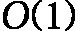
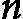
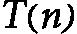

# 第五章：<st c="0">3</st>

# <st c="2">复杂度分析的增长速率</st>

<st c="40">在算法设计与分析领域，理解算法运行时间如何随着输入数据的大小增长是至关重要的。</st> <st c="205">这一概念被称为</st> <st c="227">**增长速率**</st><st c="246">，它使我们能够预测和比较不同算法的性能，确保我们选择最有效的解决方案来应对计算问题。</st> <st c="405">随着输入数据规模的扩展，算法的效率变得越来越关键，特别是在数据处理、机器学习和人工智能等领域，这些领域通常需要处理大量数据。</st> <st c="609">数据集已成为常态。</st>

<st c="618">增长速率通过渐进符号来描述，这些符号为我们提供了一个框架，用于根据输入数据的大小对算法进行分类，依据其运行时间或空间需求。</st> <st c="818">这些符号包括大 O、</st> <st c="852"><st c="853">和</st> <st c="859"><st c="860">，它们帮助我们通过分别表示算法的上界、下界和紧界，来规范化算法的效率。</st> <st c="975">通过这一形式化方法，我们可以更好地理解算法的可扩展性，并据此做出关于算法在特定任务和环境中适用性的明智决策。</st> <st c="1125">以及环境。</st>

<st c="1142">在本章中，我们将探讨这些渐进符号的复杂性，提供详细的解释和实际示例来说明它们的应用。</st> <st c="1311">我们将探讨常见的增长速率，如常数、对数、线性、对数线性、多项式、指数和阶乘，重点讲解它们对算法性能的影响。</st> <st c="1498">在本章结束时，你将能够牢固掌握如何分析和解释算法的复杂度，从而获得设计更高效、更有效的计算解决方案的知识。</st> <st c="1688">计算解决方案。</st>

<st c="1712">以下主题将在</st> <st c="1753">本章中进行讲解：</st>

+   <st c="1766">算法增长速率解析</st> <st c="1796">中的算法</st>

+   <st c="1809">渐进符号</st>

+   <st c="1830">应对无法解决的问题 – 非确定性多项式时间（</st><st c="1895">NP）-困难问题</st>

# <st c="1913">算法增长速率解析</st>

<st c="1956">让我们重新回顾一下</st> <st c="1974">关于学习算法目标的初步讨论。</st> <st c="2030">其中一个主要目标是分析算法，以预测其行为和性能。</st> <st c="2128">这种分析对于以下两个</st> <st c="2161">主要原因至关重要：</st>

+   <st c="2174">做出明智的</st> <st c="2192">设计决策</st>

+   <st c="2208">理解如何设计高效且</st> <st c="2251">低成本的算法</st>

<st c="2270">一个算法的成本取决于其生命周期中的许多参数。</st> <st c="2350">然而，我们在这里关注的是运行算法的成本。</st> <st c="2414">尽管设计、维护、测试和淘汰算法相关的成本同样重要，但它们超出了我们</st> <st c="2560">当前讨论的范围。</st>

<st c="2579">运行算法的成本或其复杂度通常在两个维度上进行衡量或估算：</st> *<st c="2687">时间</st>* <st c="2691">和</st> *<st c="2696">空间</st>*<st c="2701">。</st> **<st c="2703">时间复杂度</st>** <st c="2718">指的是生成预期输出所需的时间。</st> <st c="2725">这假设算法最终会终止，尽管有些情况下，算法可能因设计缺陷或其他错误而永远不会终止。</st> **<st c="2943">空间复杂度</st>**<st c="2959">，另一方面，指的是运行该</st> <st c="3021">算法所需的内存。</st> <st c="3032">时间和空间复杂度都是至关重要的考虑因素，因为我们的计算资源有固有的限制。</st> <st c="3156">如果假设我们可以访问即时计算，能够在恒定时间内运行任何算法并处理任何数量的数据，且拥有无限的内存，那么计算复杂度的研究将变得不必要。</st> <st c="3373">然而，考虑到当前的技术状况，这些限制使得计算复杂度的研究成为设计</st> <st c="3506">高效算法的必要条件。</st>

<st c="3527">时间和空间复杂度是作为输入数据大小的函数进行衡量的，通常用</st>  <st c="3642"><st c="3643">这是直接的，因为每个算法的目标是通过处理输入数据来生成预期的输出。</st> <st c="3763">无论输入数据是数值、文本、图像还是视频，我们都关心随着输入数据量的增加，复杂度如何变化。</st> <st c="3943">这个概念被称为增长率，用大 O 表示，它描述了相对于输入大小，时间复杂度的上界或最坏情况。</st> <st c="4114">算法的复杂度，用</st> <st c="4157"><st c="4169">来表示，然后通过大 O 分析来估算。</st> <st c="4211">我们将详细讨论计算</st> <st c="4261"><st c="4262">的技术，尤其是递归算法，这些算法更加复杂。</st> <st c="4329">这可能看起来微不足道，但值得一提的是，较高或更快的增长率通常意味着算法需要更多的时间来生成</st> <st c="4475">预期结果。</st></st></st></st>

<st c="4492">增长率</st> <st c="4512">是数据大小的函数，且可以采取多种数学形式。</st> <st c="4580">然而，我们关注一些知名的模式，这些模式有助于比较算法。</st> <st c="4675">通过比较执行相同任务的算法，我们旨在识别在时间和空间方面最有效的算法。</st> <st c="4797">虽然主要关注时间复杂度，但这些概念也可以推广到空间和</st> <st c="4899">内存复杂度。</st>

## <st c="4917">常数增长</st>

<st c="4933">所有计算复杂度挑战的根源在于计算的迭代性质。</st> <st c="4964">正如在上一章中讨论的，迭代组件，我们将其比作算法的引擎，可以通过</st> <st c="5150">循环</st> **<st c="5177">循环</st>** <st c="5182">或</st> **<st c="5186">递归</st>**<st c="5195">来实现。</st> <st c="5268">无论具体实现方式如何——尽管选择循环和递归的方式会显著影响算法的复杂度——最终决定算法复杂度的是迭代的次数。</st> <st c="5433">理解这些迭代如何影响整体复杂度对于设计</st> <st c="5526">高效算法至关重要。</st>

<st c="5547">当算法的复杂度与输入数据的大小无关时，增长率最慢。</st> <st c="5661">这一类增长函数称为</st> <st c="5695">常数</st> **<st c="5703">常数</st>**<st c="5711">，表示为</st> <st c="5728"><st c="5729">。如果一个算法的时间复杂度是常数时间，表示为</st> <st c="5797"><st c="5804">，则表示</st> <st c="5822"><st c="5823">，这意味着它受到一个不依赖于输入数据大小的常数的限制。</st> <st c="5912">问题是，我们在哪些情况下可能会遇到常数增长率，并且输入数据量在增加呢？</st> <st c="6027">答案是这种情况非常罕见。</st> <st c="6079">以下是一些常数增长率的情况示例：</st> <st c="6132">增长率：</st></st></st></st>

+   **<st c="6144">报告输入的第一个数字</st>**<st c="6179">：这与输入的数字</st> <st c="6216">数量无关</st>

+   **<st c="6225">访问数组元素</st>**<st c="6258">：通过索引检索元素是一个常数</st> <st c="6310">时间操作</st>

+   **<st c="6324">在链表的开头插入一个元素</st>**<st c="6379">：这个操作涉及更新几个指针，所需的时间是</st> <st c="6443">恒定的</st>

在这些例子中，<st c="6456">我们没有使用循环来实现算法。</st> <st c="6483">然而，值得注意的是，任何循环的存在通常会使得复杂度变为非恒定。</st> <st c="6528">如果迭代是由输入数据的大小控制的，</st> <st c="6697"><st c="6700">，那么算法不可能是恒定的。</st> <st c="6736">关键在于，对于一个算法来说，要具备恒定的增长率，它执行的操作数量不能依赖于</st> <st c="6869">输入数据的大小。</st></st>

## <st c="6879">亚线性增长</st>

<st c="6897">除了恒定增长函数，所有</st> <st c="6940">其他的增长率都依赖于输入数据的大小，</st> <st c="6997"><st c="7046">。在恒定增长和线性增长（线性时间算法的复杂度）之间，存在一系列亚线性函数。</st> **<st c="7181">亚线性时间算法</st>** <st c="7207">是</st> <st c="7212">那些时间复杂度增长速度慢于输入数据大小的算法，通常表示为</st> <st c="7297"><st c="7314">。换句话说，这些算法不需要检查输入中的每一个元素就能产生输出。</st> <st c="7421">这些算法的目标是通过执行比输入中元素总数少的操作来实现高效性。</st> <st c="7543">输入的元素数量。</st></st></st>

<st c="7553">根据经验法则，每当一个问题需要检查每个输入元素时，例如在顺序查找算法中，复杂度至少是线性时间，</st> <st c="7722"><st c="7727">。在这些情况下，我们无法实现更好的时间复杂度，因为每个元素都必须被检查以确保正确性。</st> <st c="7848">子线性时间算法通常具有如下时间复杂度特征：</st>  <st c="7932"><st c="7933">和</st> <st c="7938"><st c="7939">。以下是一些子线性</st> <st c="7977">时间算法的例子：</st></st></st></st>

+   **<st c="7993">二分查找 (</st>********<st c="8011">)</st>**<st c="8012">: 二分查找</st> <st c="8027">是一种高效的算法，用于在</st> <st c="8082">排序数组中通过反复将搜索区间对半分割来查找元素。</st> <st c="8147">该算法特别适用于大型的排序数据集。</st> <st c="8213">以下是二分查找算法的一个简单 Python 实现。</st> <st c="8274">迭代部分使用</st> <st c="8293">while 循环</st> <st c="8319">实现：</st>  

    ```py
     def binary_search(a, x):
        low = 0
        high = len(a) - 1
        while low <= high:
            mid = (high + low) // 2
            if a[mid] < x:
                low = mid + 1
            elif a[mid] > x:
                high = mid - 1
            else:
                return mid
        return -1 
    print(binary_search([0,1,3,5,8,10],10))
    ```

    <st c="8573">二分查找的最坏情况时间复杂度为</st>  <st c="8624"><st c="8628">当被查找的项位于二叉树的底部时。</st> <st c="8706">在最优情况下，它的时间复杂度为</st> <st c="8756"><st c="8757">。对数增长率，</st> <st c="8791"><st c="8792">，是多对数增长的特例，表示为</st> ![<mml:math xmlns:mml="http://www.w3.org/1998/Math/MathML" xmlns:m="http://schemas.openxmlformats.org/officeDocument/2006/math"><mml:mi>O</mml:mi><mml:mfenced separators="|"><mml:mrow><mml:msup><mml:mrow><mml:mfenced separators="|"><mml:mrow><mml:mrow><mml:mrow><mml:mi mathvariant="normal">log</mml:mi></mml:mrow><mml:mo>⁡</mml:mo><mml:mrow><mml:mi>n</mml:mi></mml:mrow></mml:mrow></mml:mrow></mml:mfenced></mml:mrow><mml:mrow><mml:mi>k</mml:mi></mml:mrow></mml:msup></mml:mrow></mml:mfenced></mml:math>](img/57.png) <st c="8850"><st c="8851">或</st> <st c="8855"><st c="8856">，其中</st>  <st c="8864"><st c="8865">且常数。</st> <st c="8880">在对数增长中，我们</st> <st c="8906">有</st> <st c="8911"><st c="8912">。</st></st></st></st></st></st></st></st>

+   **<st c="8913">跳跃搜索（</st>********<st c="8929">）</st>**<st c="8930">：跳跃搜索（或称为块搜索）是一种算法，旨在通过按固定步长跳跃前进，再在识别的块内执行线性搜索，从而高效地在已排序的数组中查找元素。</st> <st c="9139">这种方法特别适用于大型已排序数组，在这些数组中，线性搜索会过于缓慢。</st> <st c="9240">这里展示的是跳跃搜索算法的 Python 代码实现：</st>

    ```py
     import math
    def jump_search(a, x):
        n = len(a)
        step = int(math.sqrt(n))
        prev = 0
        while a[min(step, n)-1] < x:
            prev = step
            step += int(math.sqrt(n))
            if prev >= n:
                return -1
        for i in range(prev, min(step, n)):
            if a[i] == x:
                return i
        return -1
    ```

+   **<st c="9559">插值搜索（</st>********<st c="9584">)</st>**<st c="9585">：一个具有复杂度的算法示例</st>  <st c="9630"><st c="9631">是插值搜索</st> <st c="9659">算法。</st> <st c="9671">插值搜索是对二分搜索的改进，适用于有序数组中值分布均匀的情况。</st> <st c="9697">当数据均匀分布时，搜索可以在</st> ![<mml:math xmlns:mml="http://www.w3.org/1998/Math/MathML" xmlns:m="http://schemas.openxmlformats.org/officeDocument/2006/math"><mml:mi>T</mml:mi><mml:mfenced separators="|"><mml:mrow><mml:mi>n</mml:mi></mml:mrow></mml:mfenced><mml:mo>=</mml:mo><mml:mi>O</mml:mi><mml:mfenced separators="|"><mml:mrow><mml:mrow><mml:mrow><mml:mi mathvariant="normal">log</mml:mi></mml:mrow><mml:mo>⁡</mml:mo><mml:mrow><mml:mrow><mml:mrow><mml:mi mathvariant="normal">log</mml:mi></mml:mrow><mml:mo>⁡</mml:mo><mml:mrow><mml:mi>n</mml:mi></mml:mrow></mml:mrow></mml:mrow></mml:mrow></mml:mrow></mml:mfenced></mml:math>](img/64.png) <st c="9836"><st c="9872">的时间复杂度下完成。</st> <st c="9905">这适用于数据均匀分布的情况。</st>

    <st c="9927">插值搜索的工作原理是估计目标值在有序数组中的位置。</st> <st c="10044">它根据数组的范围和目标值，使用公式计算目标的可能位置。</st> <st c="10161">如果数据的分布均匀，位置估算非常准确，从而大大减少了比较的次数。</st> <st c="10311">以下是插值搜索的</st> <st c="10345">Python 实现代码，供你参考：</st>

    ```py
     def interpolation_search(a, x):
        low = 0
        high = len(a) - 1
        while low <= high and x >= a[low] and x <= a[high]:
            if low == high:
                if a[low] == x:
                    return low
                return -1
            pos = low + ((high - low) // (a[high] - a[low]) * (x - a[low]))
            if a[pos] == x:
                return pos
            if a[pos] < x:
                low = pos + 1
            else:
                high = pos - 1
        return -1
    ```</st></st>

<st c="10726">跳跃搜索和插值搜索都表现出亚线性增长率，相较于线性搜索，提供了潜在的效率提升。</st> <st c="10857">在接下来的小节中，我们将讨论线性增长模式的概念，通过</st> <st c="10979">相关示例来说明它们的特征。</st>

## <st c="10998">线性增长</st>

算法分析中最直接的增长速率函数是线性时间，表示为</st> <st c="11115"><st c="11120">。</st> **<st c="11122">线性增长</st>** <st c="11135">作为一个重要的分界线，区分了快速算法，如常数时间（</st><st c="11229"><st c="11248">）和亚线性时间（例如，</st> <st c="11276"><st c="11277">，</st> <st c="11279"><st c="11280">，以及较慢或极慢的算法，如多项式时间（</st><st c="11348"><st c="11362">，</st> <st c="11364"><st c="11365">）和指数时间（</st><st c="11389"><st c="11391">），这些都被视为非线性。</st></st></st></st></st></st></st></st>

<st c="11426">当算法的运行时间与输入数据的大小成正比时，该算法被认为具有线性时间复杂度。</st> <st c="11563">换句话说，线性时间算法的运行时间是</st> <st c="11626"><st c="11627">其中</st> <st c="11633"><st c="11649">是常数。</st> <st c="11664">线性时间算法对于解决必须处理每个输入元素的问题至关重要。</st> <st c="11777">在这种情况下，操作的数量与输入数据的大小成正比增长。</st> <st c="11881">这意味着如果输入大小翻倍，处理输入所需的时间也会翻倍。</st> <st c="11977">线性时间算法的例子包括顺序搜索、查找数组中的最小值或最大值，以及对数组中的元素进行求和。</st>

<st c="12131">一个显著的线性时间算法是计算非负整数𝑛的阶乘（记作</st> <st c="12235"><st c="12236">）。</st> <st c="12239">以下是 Python 中阶乘算法的简单迭代实现：</st>

```py
 def factorial(n):
    result = 1
    for i in range(1, n + 1):
        result *= i
    return result
```

<st c="12399">由于问题的性质，每个从 1 到</st> *<st c="12470">n</st>* <st c="12471">的数字都必须被访问，递归实现无法实现比</st> <st c="12556">线性时间更好的复杂度：</st>

```py
 def factorial_recursive(n):
    if n == 0 or n == 1:
        return 1
    else:
        return n * factorial_recursive(n - 1)
```

<st c="12670">线性时间</st> <st c="12682">算法至关重要，因为它们在效率和全面性之间提供了平衡。</st> <st c="12774">它们确保每个元素都被考虑到，因此适用于那些跳过元素可能导致不正确或不完整结果的问题。</st> <st c="12925">然而，需要认识到，尽管线性时间算法对于中等规模的输入非常高效，但对于非常大的数据集，它们可能变得不切实际。</st> <st c="13091">在这种情况下，可能需要更复杂的具有亚线性时间复杂度的算法来实现</st> <st c="13196">可接受的性能。</st>

## <st c="13219">非线性增长</st>

**非线性时间算法族**涵盖了各个领域中一系列著名的复杂问题，包括数据处理、优化、机器学习和人工智能。这些算法的增长速度比线性时间复杂度更为复杂，复杂度范围从相对高效的算法，如`O(n log n)`，到极为昂贵的算法，具有非多项式增长的复杂度，例如指数级的`O(2^n)`和阶乘级的`O(n!)`时间。

以下是一些**非线性算法**的例子：

+    **<st c="13742">算法</st>**<st c="13753">：如</st> **<st c="13775">归并排序</st>**<st c="13785">、</st> **<st c="13787">快速排序</st>**<st c="13797">，以及</st> **<st c="13803">堆排序</st>** <st c="13812">都</st> <st c="13817">属于这一类。</st> <st c="13838">这些是经典的排序算法，它们的时间复杂度为</st> <st c="13906"><st c="13907">。它们对于大数据集非常高效，并且由于其相对可控的增长率，在实际应用中经常使用。</st> <st c="14053">在接下来的章节中，我们将详细讨论这一类算法。</st> <st c="14132">由于其高效性和广泛适用于各种</st> <st c="14249">排序任务，这些算法在计算机科学中是基础性的。</st>

+   **<st c="14263">对数线性时间</st>**<st c="14279">：对数线性时间算法，也</st> <st c="14315">称为</st> **<st c="14330">准线性时间算法</st>**<st c="14358">，其时间复杂度为</st> ![<mml:math xmlns:mml="http://www.w3.org/1998/Math/MathML" xmlns:m="http://schemas.openxmlformats.org/officeDocument/2006/math"><mml:mi>T</mml:mi><mml:mfenced separators="|"><mml:mrow><mml:mi>n</mml:mi></mml:mrow></mml:mfenced><mml:mo>=</mml:mo><mml:mi> </mml:mi><mml:mi>O</mml:mi><mml:mfenced separators="|"><mml:mrow><mml:mi>n</mml:mi><mml:msup><mml:mrow><mml:mi mathvariant="normal">l</mml:mi><mml:mi mathvariant="normal">o</mml:mi><mml:mi mathvariant="normal">g</mml:mi></mml:mrow><mml:mrow><mml:mi mathvariant="normal">k</mml:mi></mml:mrow></mml:msup><mml:mi>n</mml:mi></mml:mrow></mml:mfenced></mml:math>](img/80.png)<st c="14386"><st c="14387">，其中</st> <st c="14395"><st c="14396">是一个正的常数。</st> <st c="14420">许多著名的算法属于这一类，并且在高效处理大数据集时非常重要。</st> <st c="14532">对数线性时间算法的示例如下：</st>

    +   **<st c="14586">归并排序</st>**<st c="14597">：一种</st> <st c="14602">经典的</st> <st c="14610">分治排序算法，它将输入数组分割成更小的子数组，对它们进行排序，然后将它们合并回一起。</st> <st c="14747">它的时间复杂度</st> <st c="14767">是</st> <st c="14770"><st c="14771">。</st></st>

    +   **<st c="14772">堆排序</st>**<st c="14782">：该</st> <st c="14790">排序算法从输入数据构建堆数据结构，然后反复提取最大元素来构建排序后的数组。</st> <st c="14931">它的时间复杂度</st> <st c="14951">是</st> <st c="14954"><st c="14955">。</st></st>

    +   **<st c="14956">快速排序</st>**<st c="14967">：另一种</st> <st c="14978">分治排序算法，它选择一个</st> <st c="15030">枢轴元素并围绕枢轴将数组分区。</st> <st c="15087">在平均情况下，它的时间复杂度</st> <st c="15128">是</st> <st c="15131"><st c="15132">。</st></st></st></st>

+   **<st c="15133">多项式时间算法</st>**<st c="15160">：多项式时间算法的复杂度为</st> <st c="15211"><st c="15212">，其中</st> *<st c="15220">a</st>* <st c="15221">是一个小常数。</st> <st c="15243">这些算法通常被认为在中等大小的输入下高效，但随着输入规模的增加，其性能可能会显著下降。</st> <st c="15399">以下是</st> <st c="15408">一些例子：</st>

    +   **<st c="15422">矩阵乘法</st>**<st c="15444">：标准的矩阵乘法算法时间复杂度为</st><st c="15523"><st c="15543">。更先进的算法，如斯特拉森算法，可以将此复杂度降低到大约</st> <st c="15645"><st c="15646">，但它仍然是多项式复杂度。</st></st></st>

    +   **<st c="15675">弗洛伊德-沃舍尔最短路径</st>**<st c="15704">：该</st> <st c="15712">算法找到从源节点到图中所有其他节点的最短路径，前提是图中的边权为非负数。</st> <st c="15822">其时间复杂度为</st> <st c="15845"><st c="15846">，其中 𝑉 是图中的顶点数。</st>

    <st c="15896">多项式时间算法</st> <st c="15924">由于其相对可预测的性能，对于许多实际应用至关重要。</st> <st c="16019">然而，随着输入规模的增长，它们的效率可能会成为问题，使得它们不太适用于非常大的数据集。</st> <st c="16140">尽管如此，它们仍然是算法设计的基石，为计算机科学</st> <st c="16279">和工程中的广泛问题提供了可行的解决方案。</st>

+   **<st c="16295">指数时间算法</st>**<st c="16323">：这些</st> <st c="16332">算法的特点是极其缓慢且计算开销巨大。</st> <st c="16423">它们的复杂度一般形式为</st> <st c="16463"><st c="16473">，其中</st> *<st c="16481">𝑎</st>* <st c="16483">是一个正的常数。</st> <st c="16508">这些算法的一个常见特殊情况是</st> <st c="16553"><st c="16568">。一个著名的指数时间算法示例是递归解决方案</st> <st c="16610">用于解决</st> **<st c="16656">汉诺塔问题</st>**<st c="16665">。</st>

    <st c="16679">汉诺塔问题涉及将</st> *<st c="16723">𝑛</st>* <st c="16725">个圆盘从一个柱子移动到另一个柱子，使用第三个柱子作为辅助，遵循</st> <st c="16802">以下规则：</st>

    +   <st c="16814">每次只能移动一个圆盘</st> <st c="16845">。</st>

    +   <st c="16851">一个圆盘只能放在一个</st> <st c="16890">更大的圆盘上</st>。

    <st c="16901">汉诺塔问题的递归解法的时间复杂度为</st> <st c="16972"><st c="16973">，因为每一步都涉及递归地解决两个大小为 𝑛−1 的子问题。</st> <st c="17047">汉诺塔问题的时间复杂度为</st> <st c="17107"><st c="17109">，将在后续章节中详细探讨，当我们讨论递归函数时。</st> <st c="17200">此问题的递归函数为</st> ![<mml:math xmlns:mml="http://www.w3.org/1998/Math/MathML" xmlns:m="http://schemas.openxmlformats.org/officeDocument/2006/math"><mml:mi>T</mml:mi><mml:mfenced separators="|"><mml:mrow><mml:mi>n</mml:mi></mml:mrow></mml:mfenced><mml:mo>=</mml:mo><mml:mn>2</mml:mn><mml:mi>T</mml:mi><mml:mfenced separators="|"><mml:mrow><mml:mi>n</mml:mi><mml:mo>-</mml:mo><mml:mn>1</mml:mn></mml:mrow></mml:mfenced><mml:mo>+</mml:mo><mml:mi>O</mml:mi><mml:mfenced separators="|"><mml:mrow><mml:mn>1</mml:mn></mml:mrow></mml:mfenced></mml:math>](img/93.png)<st c="17242">![<mml:math xmlns:mml="http://www.w3.org/1998/Math/MathML" xmlns:m="http://schemas.openxmlformats.org/officeDocument/2006/math"><mml:mi>T</mml:mi><mml:mfenced separators="|"><mml:mrow><mml:mi>n</mml:mi></mml:mrow></mml:mfenced><mml:mo>=</mml:mo><mml:mn>2</mml:mn><mml:mi>T</mml:mi><mml:mfenced separators="|"><mml:mrow><mml:mi>n</mml:mi><mml:mo>-</mml:mo><mml:mn>1</mml:mn></mml:mrow></mml:mfenced><mml:mo>+</mml:mo><mml:mi>O</mml:mi><mml:mfenced separators="|"><mml:mrow><mml:mn>1</mml:mn></mml:mrow></mml:mfenced></mml:math>](img/94.png)<st c="17247"><st c="17248">，将通过替代法和主方法等技术进行分析，以推导出复杂度。</st> <st c="17353">通过这些方法，可以证明</st> <st c="17398"><st c="17404">。要全面了解，请参阅</st> *<st c="17457">第四章</st>* <st c="17467">和</st> *<st c="17472">第五章</st>*<st c="17473">。</st></st></st></st></st></st>

    <st c="17474">这是一个关于汉诺塔问题的递归 Python 实现：</st> <st c="17533"> </st>

    ```py
     def tower_of_hanoi(n, source, target, auxiliary):
        if n == 1:
            print(f"Move disk 1 from {source} to {target}")
            return
        tower_of_hanoi(n - 1, source, auxiliary, target)
        print(f"Move disk {n} from {source} to {target}")
        tower_of_hanoi(n - 1, auxiliary, target, source)
    ```

    <st c="17811">指数时间算法</st> <st c="17844">通常在大规模输入时不切实际，因为随着输入规模的增长，其运行时间会急剧增加。</st> <st c="17959">这些算法通常用于没有已知有效解的问题，它们作为一种基准，用于比较更</st> <st c="18113">复杂算法的性能。</st></st></st>

+   **<st c="18138">阶乘时间算法</st>**<st c="18164">：这些</st> <st c="18173">算法会生成一个集合的所有排列，因此它们在计算上非常昂贵。</st> <st c="18269">一个典型的例子是暴力破解方法解决</st> <st c="18320">旅行商问题（</st>**<st c="18324">TSP</st>**<st c="18350">），它的时间复杂度是阶乘级别</st> <st c="18397">为</st> <st c="18400"><st c="18404">。</st>

    <st c="18405">旅行商问题（TSP）是一个经典的优化问题，在这个问题中，销售员必须找到一条最短的路线，访问一组城市并且每个城市只能访问一次，最后回到起始城市。</st> <st c="18578">给定一组城市以及每对城市之间的距离，目标是确定最有效的旅行路线，最小化总的</st> <st c="18727">旅行距离。</st></st>

<st c="18743">暴力破解法解决 TSP 问题的方式是生成所有可能的城市排列，并计算每个排列的总距离，以找到最短的那一个。</st> <st c="18926">这会导致时间复杂度为</st> <st c="18963"><st c="18984">。排列的数量是</st>  <st c="19016"><st c="19017">个城市的</st>  <st c="19028"><st c="19031">(n 阶乘)，其中</st>  <st c="19051"><st c="19052">表示城市的数量。</st> <st c="19078">以下是 TSP 问题的简单实现：</st></st></st></st></st>

```py
 from itertools import permutations
def calculate_distance(permutation, distance_matrix):
    distance = 0
    for i in range(len(permutation) - 1):
        distance += distance_matrix[permutation[i]][permutation[i + 1]]
    distance += distance_matrix[permutation[-1]][permutation[0]]  # Return to the start
    return distance
def tsp_brute_force(distance_matrix):
    n = len(distance_matrix)
    cities = list(range(n))
    min_distance = float('inf')
    best_permutation = None
    for permutation in permutations(cities):
        current_distance = calculate_distance(permutation, distance_matrix)
        if current_distance < min_distance:
            min_distance = current_distance
            best_permutation = permutation
    return best_permutation, min_distance
```

<st c="19822">阶乘时间算法</st> <st c="19848">对于除最小输入规模之外的所有情况，都是高度不切实际的，因为运行时间增长极快。</st> <st c="19961">随着城市（或元素）数量的增加，排列组合的数量以及解决问题所需的计算量以阶乘的速度增加。</st> <st c="20120">由于其阶乘时间复杂度，这些算法对于更大的数据集变得不可行，突显了在</st> <st c="20298">实际应用中对更高效的启发式或近似算法的需求。</st>

<st c="20321">总之，非线性时间算法在</st> <st c="20365">解决各个领域复杂且计算密集型的问题中起着基础作用。</st> <st c="20459">虽然它们提供了强大的解决方案，但它们的性能可能会根据输入规模和算法的具体增长速率而有显著变化。</st> <st c="20608">理解这些复杂性有助于选择合适的算法，并为</st> <st c="20716">特定应用优化性能。</st>

*<st c="20738">表 3.1</st>* <st c="20748">提供了不同输入数据大小的实际增长率示例。</st> <st c="20820">它清楚地表明，</st> <st c="20849">非线性算法，特别是那些具有指数和阶乘增长率的算法，随着输入大小的增加，计算复杂度会迅速增长。</st> <st c="21028">这种资源需求的快速增加使得这种算法对于除了最小数据集外的其他情况，在计算上变得不切实际。</st>

|  | **<st c="21159">输入数据的大小</st>** **<st c="21178">（n）</st>** |
| --- | --- |
| **<st c="21186">增长率</st>** |  |  |  |  |
|  |  |  |  |  |
| ![<mml:math xmlns:mml="http://www.w3.org/1998/Math/MathML" xmlns:m="http://schemas.openxmlformats.org/officeDocument/2006/math" display="block"><mml:mi>O</mml:mi><mml:mfenced separators="&#124;"><mml:mrow><mml:mrow><mml:mrow><mml:mi mathvariant="normal">log</mml:mi></mml:mrow><mml:mo>⁡</mml:mo><mml:mrow><mml:mrow><mml:mrow><mml:mi mathvariant="normal">log</mml:mi></mml:mrow><mml:mo>⁡</mml:mo><mml:mrow><mml:mi>n</mml:mi></mml:mrow></mml:mrow></mml:mrow></mml:mrow></mml:mrow></mml:mfenced></mml:math>](img/110.png) |  |  |  |  |
|  |  |  |  |  |
|  |  |  |  |  |
|  |  |  |  |  |
|  |  |  |  |  |
|  |  |  |  |  |
|  |  |  |  |  |
|  |  |  |  |  |
|  |  |  |  |  |

<st c="21400">表 3.1：不同输入规模的实际增长率示例（</st><st c="21468"><st c="21470">：一个常数且在计算上可以忽略不计；</st> <st c="21522"><st c="21528">：极大数且在计算上不可行）</st></st></st>

*<st c="21585">图 3</st>**<st c="21594">.1</st>* *<st c="21596">(a)</st>* <st c="21600">和</st> *<st c="21605">(b)</st>* <st c="21608">展示了不同函数的增长速率图，这些函数的输入大小范围从</st> <st c="21711"><st c="21712">到</st> <st c="21715"><st c="21716">。这些图表提供了不同时间复杂度的可视化比较，展示了它们随着输入大小的增加如何扩展。</st> <st c="21849">这些图形整体展示了不同时间复杂度对算法性能的影响，强调了为</st> <st c="22020">大规模问题选择高效算法的重要性。</st></st></st>


<st c="22196">(a)</st>


<st c="22227">(b)</st>

<st c="22230">图 3.1 (a) 和 (b)：展示了</st> <st c="22298"><st c="22299">到</st> </st>

<st c="22303">本节</st> <st c="22315">讨论了理解算法复杂度如何随输入数据的大小变化的重要性，通常用</st> <st c="22451"><st c="22452">表示。它强调了时间和空间复杂度是评估算法性能的关键指标。</st> <st c="22565">本节解释了增长率可能会有很大的差异，从常数时间</st> <st c="22658"><st c="22659">到阶乘时间</st> <st c="22677"><st c="22681">，并包括中间复杂度，如对数</st> <st c="22734"><st c="22735">、线性</st> <st c="22744"><st c="22750">和对数线性</st> <st c="22767"><st c="22768">。增长速率对于做出明智的设计决策和确保高效的算法实现至关重要，尤其是在处理大型数据集时。</st> <st c="22919">通过比较不同的增长率，可以更好地理解算法效率与计算资源需求之间的权衡。</st> <st c="23069">现在，是时候引入一个数学框架来研究算法的行为，这与</st> <st c="23217">算法的增长速率直接相关。</st>

# <st c="23232">渐近符号</st>

**<st c="23253">渐近符号</st>** <st c="23273">是一个数学</st> <st c="23292">框架，用于描述算法在输入规模趋向无穷大时其时间和空间复杂度的行为。</st> <st c="23431">它根据算法的增长速率对算法进行分类，从而使得不同算法的效率比较不受硬件或实现细节的影响。</st> <st c="23612">渐近符号源自数学分析领域，用来描述数学函数的极限行为。</st> <st c="23740">顾名思义，渐近符号并不提供具体的解决方案，而是对函数在</st> <st c="23885">规模扩展时的行为的形式化表示。</st>

<st c="23896">假设我们有一个类似如下的函数：</st> <st c="23934">如下所示：</st>

![<mml:math xmlns:mml="http://www.w3.org/1998/Math/MathML" xmlns:m="http://schemas.openxmlformats.org/officeDocument/2006/math" display="block"><mml:mi>f</mml:mi><mml:mfenced separators="|"><mml:mrow><mml:mi>n</mml:mi></mml:mrow></mml:mfenced><mml:mo>=</mml:mo><mml:mi> </mml:mi><mml:msup><mml:mrow><mml:mi>n</mml:mi></mml:mrow><mml:mrow><mml:mn>3</mml:mn></mml:mrow></mml:msup><mml:mo>+</mml:mo><mml:mi> </mml:mi><mml:mn>1000</mml:mn><mml:msup><mml:mrow><mml:mi>n</mml:mi></mml:mrow><mml:mrow><mml:mn>2</mml:mn></mml:mrow></mml:msup><mml:mo>+</mml:mo><mml:mi> </mml:mi><mml:mn>6</mml:mn><mml:mi>n</mml:mi><mml:mi> </mml:mi><mml:mo>+</mml:mo><mml:mi> </mml:mi><mml:mn>5</mml:mn><mml:mi> </mml:mi><mml:mo>×</mml:mo><mml:msup><mml:mrow><mml:mn>10</mml:mn></mml:mrow><mml:mrow><mml:mn>5</mml:mn></mml:mrow></mml:msup></mml:math>](img/167.png)

<st c="23982">我们想要预测</st>  <st c="24017"><st c="24020">在</st> <st c="24023"><st c="24024">时的行为。</st> 虽然项</st>  <st c="24044"><st c="24052">的系数非常大，并且有一个很大的常数</st> <st c="24111"><st c="24118">，除了项</st>  <st c="24137"><st c="24138">外的所有项</st> <st c="24164"><st c="24166">在</st> <st c="24184">当</st> n 非常大的时候都会变得微不足道。</st> <st c="24184">在数学分析中，我们用符号表示</st> <st c="24231"><st c="24240">并读作“</st> <st c="24256"><st c="24265">是</st> <st c="24268">渐近地</st> <st c="24283"><st c="24284">。”</st></st></st></st></st></st></st></st></st>

<st c="24286">在算法分析中，</st>  <st c="24310"><st c="24320">被替换为</st> <st c="24334"><st c="24336">，表示正在研究的算法运行时间的函数复杂性。</st>  <st c="24444"><st c="24454">可以通过分析算法在使用迭代（非递归）方法实现时直接估算，或者可以通过递归算法的特定递归关系描述。</st> <st c="24689">一旦我们得到</st> <st c="24702"><st c="24703">，我们可以预测算法行为随着</st>  <st c="24753"><st c="24754">（数据元素数量或问题大小）增长到非常大时，使用渐近符号。</st></st></st></st></st></st>

<st c="24849">在描述算法分析中的</st> <st c="24872">渐近符号之前，我们需要解释在使用</st> <st c="25015">渐近符号时处理方程和不等式的简化指导原则。</st>

## <st c="25036">在渐近符号中的简化规则</st>

<st c="25080">渐近符号</st> <st c="25100">提供了一种描述函数行为随着输入大小趋向无穷大的方法。</st> <st c="25195">在使用渐近符号时，简化表达式以专注于最重要的项非常重要。</st> <st c="25317">以下是关键的</st> <st c="25334">简化规则：</st>

+   **<st c="25355">去除常数</st>**<st c="25370">：忽略常数系数，因为它们不影响</st> <st c="25433">增长率。</st>

    **<st c="25445">示例</st>**<st c="25453">:</st> ![<mml:math xmlns:mml="http://www.w3.org/1998/Math/MathML" xmlns:m="http://schemas.openxmlformats.org/officeDocument/2006/math"><mml:mi>T</mml:mi><mml:mfenced separators="|"><mml:mrow><mml:mi>n</mml:mi></mml:mrow></mml:mfenced><mml:mo>=</mml:mo><mml:mi> </mml:mi><mml:mn>5</mml:mn><mml:msup><mml:mrow><mml:mi>n</mml:mi></mml:mrow><mml:mrow><mml:mn>3</mml:mn></mml:mrow></mml:msup><mml:mo>+</mml:mo><mml:mi> </mml:mi><mml:mn>3</mml:mn><mml:msup><mml:mrow><mml:mi>n</mml:mi></mml:mrow><mml:mrow><mml:mn>2</mml:mn></mml:mrow></mml:msup><mml:mo>+</mml:mo><mml:mi> </mml:mi><mml:mn>2</mml:mn><mml:mi>n</mml:mi><mml:mi> </mml:mi><mml:mo>+</mml:mo><mml:mi> </mml:mi><mml:mn>7</mml:mn></mml:math>](img/182.png) <st c="25456"><st c="25477">简化为</st><st c="25490"><st c="25495">.</st></st></st>

+   **<st c="25496">保留最重要的项</st>**<st c="25527">：保留增长率最高的项，因为它在`n`变大时主导了该函数。</st>

    **<st c="25671">示例</st>**<st c="25679">:</st> ![<mml:math xmlns:mml="http://www.w3.org/1998/Math/MathML" xmlns:m="http://schemas.openxmlformats.org/officeDocument/2006/math"><mml:mi>T</mml:mi><mml:mfenced separators="|"><mml:mrow><mml:mi>n</mml:mi></mml:mrow></mml:mfenced><mml:mo>=</mml:mo><mml:mi> </mml:mi><mml:msup><mml:mrow><mml:mi>n</mml:mi></mml:mrow><mml:mrow><mml:mn>3</mml:mn></mml:mrow></mml:msup><mml:mo>+</mml:mo><mml:mi> </mml:mi><mml:mn>1000</mml:mn><mml:msup><mml:mrow><mml:mi>n</mml:mi></mml:mrow><mml:mrow><mml:mn>2</mml:mn></mml:mrow></mml:msup><mml:mo>+</mml:mo><mml:mi> </mml:mi><mml:mn>50</mml:mn><mml:mi>n</mml:mi></mml:math>](img/185.png) <st c="25682"><st c="25706">简化为</st> <st c="25717">为</st> <st c="25720"><st c="25726">.</st></st></st></st>

+   **<st c="25727">合并相似项</st>**<st c="25749">：加法时，保留增长率最高的项。</st>

    **<st c="25818">示例</st>**<st c="25826">:</st> ![<mml:math xmlns:mml="http://www.w3.org/1998/Math/MathML" xmlns:m="http://schemas.openxmlformats.org/officeDocument/2006/math"><mml:mi>T</mml:mi><mml:mfenced separators="|"><mml:mrow><mml:mi>n</mml:mi></mml:mrow></mml:mfenced><mml:mo>=</mml:mo><mml:mi> </mml:mi><mml:mi>O</mml:mi><mml:mfenced separators="|"><mml:mrow><mml:msup><mml:mrow><mml:mi>n</mml:mi></mml:mrow><mml:mrow><mml:mn>2</mml:mn></mml:mrow></mml:msup></mml:mrow></mml:mfenced><mml:mo>+</mml:mo><mml:mi> </mml:mi><mml:mi>O</mml:mi><mml:mfenced separators="|"><mml:mrow><mml:mi>n</mml:mi></mml:mrow></mml:mfenced></mml:math>](img/187.png) <st c="25829"><st c="25848">简化为</st> <st c="25859">![+   **<st c="25869">项的乘积</st>**<st c="25886">：当乘以函数时，乘上它们的</st> <st c="25932">增长率。</st>    **<st c="25945">示例</st>**<st c="25953">:</st> ![<mml:math xmlns:mml="http://www.w3.org/1998/Math/MathML" xmlns:m="http://schemas.openxmlformats.org/officeDocument/2006/math"><mml:mi>T</mml:mi><mml:mfenced separators="|"><mml:mrow><mml:mi>n</mml:mi></mml:mrow></mml:mfenced><mml:mo>=</mml:mo><mml:mi>O</mml:mi><mml:mfenced separators="|"><mml:mrow><mml:mi>n</mml:mi></mml:mrow></mml:mfenced><mml:mo>×</mml:mo><mml:mi>O</mml:mi><mml:mfenced separators="|"><mml:mrow><mml:mrow><mml:mrow><mml:mi mathvariant="normal">log</mml:mi></mml:mrow><mml:mo>⁡</mml:mo><mml:mrow><mml:mi>n</mml:mi></mml:mrow></mml:mrow></mml:mrow></mml:mfenced></mml:math>](img/189.png) <st c="25956"><st c="25978">简化为</st> <st c="25989">![+   **<st c="25994">嵌套函数</st>**<st c="26011">：对于嵌套函数，外层函数的增长</st> <st c="26064">率占主导。</st>    **<st c="26079">示例</st>**<st c="26087">：</st>  <st c="26090"><st c="26104">简化为</st> <st c="26115">！</st><st c="26118"><st c="26119">。</st></st></st>

<st c="26120">让我们在以下示例中练习简化</st> <st c="26155">规则：</st>

+   **<st c="26187">示例 3.1</st>**<st c="26199">：</st>

    <st c="26201">简化</st> ![<mml:math xmlns:mml="http://www.w3.org/1998/Math/MathML" xmlns:m="http://schemas.openxmlformats.org/officeDocument/2006/math"><mml:mi>T</mml:mi><mml:mfenced separators="|"><mml:mrow><mml:mi>n</mml:mi></mml:mrow></mml:mfenced><mml:mo>=</mml:mo><mml:mi> </mml:mi><mml:mn>3</mml:mn><mml:msup><mml:mrow><mml:mi>n</mml:mi></mml:mrow><mml:mrow><mml:mn>4</mml:mn></mml:mrow></mml:msup><mml:mo>+</mml:mo><mml:mi> </mml:mi><mml:mn>2</mml:mn><mml:msup><mml:mrow><mml:mi>n</mml:mi></mml:mrow><mml:mrow><mml:mn>3</mml:mn></mml:mrow></mml:msup><mml:mo>+</mml:mo><mml:mi> </mml:mi><mml:msup><mml:mrow><mml:mi>n</mml:mi></mml:mrow><mml:mrow><mml:mn>2</mml:mn></mml:mrow></mml:msup></mml:math>](img/193.png)<st c="26210"><st c="26232">。</st></st>

    **<st c="26233">解答</st>**<st c="26242">：去掉常数项和低阶项：</st> <st c="26283"><st c="26296">。</st></st>

+   **<st c="26297">示例 3.2</st>**<st c="26309">：</st>

    <st c="26311">简化</st> <st c="26320"><st c="26342">.</st></st>

    **<st c="26343">解答</st>**<st c="26352">：舍去低阶</st> <st c="26376">项：</st> <st c="26382"><st c="26398">.</st></st>

+   **<st c="26399">例子 3.3</st>**<st c="26411">：</st>

    <st c="26413">简化</st> ![<mml:math xmlns:mml="http://www.w3.org/1998/Math/MathML" xmlns:m="http://schemas.openxmlformats.org/officeDocument/2006/math"><mml:mi>T</mml:mi><mml:mfenced separators="|"><mml:mrow><mml:mi>n</mml:mi></mml:mrow></mml:mfenced><mml:mo>=</mml:mo><mml:mi>O</mml:mi><mml:mfenced separators="|"><mml:mrow><mml:mi>n</mml:mi></mml:mrow></mml:mfenced><mml:mo>+</mml:mo><mml:mi>O</mml:mi><mml:mfenced separators="|"><mml:mrow><mml:mrow><mml:mrow><mml:mi mathvariant="normal">log</mml:mi></mml:mrow><mml:mo>⁡</mml:mo><mml:mrow><mml:mi>n</mml:mi></mml:mrow></mml:mrow></mml:mrow></mml:mfenced></mml:math>](img/197.png)<st c="26422"><st c="26444">.</st></st>

    **<st c="26445">解答</st>**<st c="26454">：保留增长最快的</st> <st c="26490">项：</st><st c="26502"><st c="26504">.</st></st>

+   **<st c="26505">例子 3.4</st>**<st c="26517">：</st>

    <st c="26519">简化</st> ![<mml:math xmlns:mml="http://www.w3.org/1998/Math/MathML" xmlns:m="http://schemas.openxmlformats.org/officeDocument/2006/math"><mml:mi>T</mml:mi><mml:mfenced separators="|"><mml:mrow><mml:mi>n</mml:mi></mml:mrow></mml:mfenced><mml:mo>=</mml:mo><mml:mi>O</mml:mi><mml:mfenced separators="|"><mml:mrow><mml:msup><mml:mrow><mml:mi>n</mml:mi></mml:mrow><mml:mrow><mml:mn>2</mml:mn></mml:mrow></mml:msup></mml:mrow></mml:mfenced><mml:mi>O</mml:mi><mml:mfenced separators="|"><mml:mrow><mml:mi>n</mml:mi><mml:mrow><mml:mrow><mml:mi mathvariant="normal">log</mml:mi></mml:mrow><mml:mo>⁡</mml:mo><mml:mrow><mml:mi>n</mml:mi></mml:mrow></mml:mrow></mml:mrow></mml:mfenced></mml:math>](img/199.png)<st c="26528"><st c="26550">。</st></st>

    **<st c="26551">解答</st>**<st c="26560">：乘以增长</st> <st c="26583">率：</st> ![<mml:math xmlns:mml="http://www.w3.org/1998/Math/MathML" xmlns:m="http://schemas.openxmlformats.org/officeDocument/2006/math"><mml:mi>T</mml:mi><mml:mfenced separators="|"><mml:mrow><mml:mi>n</mml:mi></mml:mrow></mml:mfenced><mml:mo>=</mml:mo><mml:mi>O</mml:mi><mml:mfenced separators="|"><mml:mrow><mml:msup><mml:mrow><mml:mi>n</mml:mi></mml:mrow><mml:mrow><mml:mn>3</mml:mn></mml:mrow></mml:msup><mml:mrow><mml:mrow><mml:mi mathvariant="normal">log</mml:mi></mml:mrow><mml:mo>⁡</mml:mo><mml:mrow><mml:mi>n</mml:mi></mml:mrow></mml:mrow></mml:mrow></mml:mfenced></mml:math>](img/200.png)<st c="26590"><st c="26599">。</st></st>

+   **<st c="26600">示例 3.5</st>**<st c="26612">：</st>

    <st c="26614">简化</st> ![<mml:math xmlns:mml="http://www.w3.org/1998/Math/MathML" xmlns:m="http://schemas.openxmlformats.org/officeDocument/2006/math"><mml:mi>T</mml:mi><mml:mfenced separators="|"><mml:mrow><mml:mi>n</mml:mi></mml:mrow></mml:mfenced><mml:mo>=</mml:mo><mml:mi>O</mml:mi><mml:mfenced separators="|"><mml:mrow><mml:mrow><mml:mrow><mml:mi mathvariant="normal">log</mml:mi></mml:mrow><mml:mo>⁡</mml:mo><mml:mrow><mml:msup><mml:mrow><mml:mi>n</mml:mi></mml:mrow><mml:mrow><mml:mn>2</mml:mn></mml:mrow></mml:msup></mml:mrow></mml:mrow></mml:mrow></mml:mfenced></mml:math>](img/201.png)<st c="26623"><st c="26624">。</st></st>

    **<st c="26625">解答</st>**<st c="26634">：首先简化内层</st> <st c="26656">函数：</st>

    ![<mml:math xmlns:mml="http://www.w3.org/1998/Math/MathML" xmlns:m="http://schemas.openxmlformats.org/officeDocument/2006/math"><mml:mi>T</mml:mi><mml:mfenced separators="|"><mml:mrow><mml:mi>n</mml:mi></mml:mrow></mml:mfenced><mml:mo>=</mml:mo><mml:mi>O</mml:mi><mml:mfenced separators="|"><mml:mrow><mml:mrow><mml:mrow><mml:mi mathvariant="normal">log</mml:mi></mml:mrow><mml:mo>⁡</mml:mo><mml:mrow><mml:msup><mml:mrow><mml:mi>n</mml:mi></mml:mrow><mml:mrow><mml:mn>2</mml:mn></mml:mrow></mml:msup></mml:mrow></mml:mrow></mml:mrow></mml:mfenced><mml:mo>=</mml:mo><mml:mi>O</mml:mi><mml:mfenced separators="|"><mml:mrow><mml:mn>2</mml:mn><mml:mrow><mml:mrow><mml:mi mathvariant="normal">log</mml:mi></mml:mrow><mml:mo>⁡</mml:mo><mml:mrow><mml:mi>n</mml:mi></mml:mrow></mml:mrow></mml:mrow></mml:mfenced><mml:mo>=</mml:mo><mml:mi>O</mml:mi><mml:mfenced separators="|"><mml:mrow><mml:mrow><mml:mrow><mml:mi mathvariant="normal">log</mml:mi></mml:mrow><mml:mo>⁡</mml:mo><mml:mrow><mml:mi>n</mml:mi></mml:mrow></mml:mrow></mml:mrow></mml:mfenced></mml:math>](img/202.png)<st c="26671"><st c="26681">.</st></st>

<st c="26682">在建立了</st> <st c="26703">渐近符号和简化技术的基础之后，我们现在将注意力转向本章的一个关键方面：由</st> <st c="26870"><st c="26871">,</st> <st c="26873"><st c="26874">,</st> <st c="26876">和</st> <st c="26880"><st c="26881">.</st></st></st></st>

## <st c="26882">渐近界限</st>

<st c="26900">分析算法复杂度的关键</st> <st c="26937">在于研究其运行时间。</st> <st c="26988">那么，我们应该考虑哪种运行时间呢？</st> <st c="27031">算法的表现可能会根据输入数据的性质及其分布的不同而有所不同。</st> <st c="27129">通常，我们希望了解最坏情况，因为它能提供关于任何输入的算法运行时间上限的保证。</st> <st c="27279">然而，我们也可能对平均情况感兴趣，这能给出算法在典型输入集上的性能更实际的预期。</st> <st c="27446">最终，我们的目标是得出关于算法行为的一般结论，这些结论独立于特定的输入数据及其分布。</st> <st c="27595">让我们详细讨论这些不同的情况：</st>

+   **<st c="27645">最坏情况</st>**<st c="27665">：最坏情况考虑了在给定最具挑战性的输入数据的情况下，算法完成所需的最大时间。</st> <st c="27804"><st c="27853">。这种分析提供了一个保证，确保算法不会超过此时间，这对于那些对性能要求严格的应用尤为重要。</st> <st c="28029">描述最坏情况的渐近符号是</st> <st c="28097"><st c="28098">符号（大 O 符号）。</st> <st c="28125">这被称为</st> <st c="28132">**渐近**</st> **<st c="28155">上界</st>**<st c="28166">。</st></st></st>

+   **<st c="28167">平均情况</st>**<st c="28189">：平均情况评估算法在所有可能输入（大小为</st> <st c="28303"><st c="28352">）下的期望运行时间，假设输入的概率分布为某种特定形式。</st> <st c="28413">这种分析提供了算法在典型使用场景下性能的更现实的衡量标准，揭示了其在正常操作条件下的效率。</st> <st c="28584">用于描述平均情况的渐近表示法通常是</st> <st c="28663"><st c="28665">表示法（大 Theta 表示法）。</st> <st c="28697">这被称为</st> <st c="28713">渐近</st> **<st c="28718">紧界限</st>** **<st c="28729">界限</st>**<st c="28740">。</st></st></st>

+   **<st c="28741">最优情况</st>**<st c="28760">：最优情况检查算法在最有利的输入（大小为</st> <st c="28883"><st c="28884">）下完成所需的最短时间。虽然在性能分析中不常用，但它可以突出算法在最佳条件下的效率。</st> <st c="29010">用于描述最优情况的渐近表示法，称为</st> **<st c="29042">渐近下界</st>**<st c="29064">，通常是</st> <st c="29129"><st c="29130">-表示法（大</st> <st c="29145">Omega 表示法）。</st></st></st>

<st c="29161">在探讨了三种时间复杂度场景（最优、平均和最差情况）之后，我们将介绍三种基本的渐近界限：上界、紧界限和</st> <st c="29327">下界。</st>

## <st c="29340">渐近上界（O 表示法）</st>

<st c="29376">算法被分类为</st> <st c="29404">为</st> <st c="29407"><st c="29414">) 如果存在正的常数</st>  <st c="29450"><st c="29451">和</st> <st c="29456"><st c="29457">，使得算法的时间复杂度或运行时间</st>  <st c="29526"><st c="29527">满足不等式</st>  <st c="29553"><st c="29571">对于所有</st> <st c="29579"><st c="29582">。从形式上讲，</st>  <st c="29603"><st c="29621">表示一组具有相似渐近上界的函数或运行时间：</st></st></st></st></st></st></st></st>

![<mml:math xmlns:mml="http://www.w3.org/1998/Math/MathML" xmlns:m="http://schemas.openxmlformats.org/officeDocument/2006/math" display="block"><mml:mi>O</mml:mi><mml:mfenced separators="|"><mml:mrow><mml:mi>g</mml:mi><mml:mfenced separators="|"><mml:mrow><mml:mi>n</mml:mi></mml:mrow></mml:mfenced></mml:mrow></mml:mfenced><mml:mo>=</mml:mo><mml:mfenced open="{" close="}" separators="|"><mml:mrow><mml:mi>T</mml:mi><mml:mfenced separators="|"><mml:mrow><mml:mi>n</mml:mi></mml:mrow></mml:mfenced><mml:mo>:</mml:mo><mml:mi> </mml:mi><mml:mo>∃</mml:mo><mml:mi> </mml:mi><mml:mi>c</mml:mi><mml:mo>></mml:mo><mml:mn>0</mml:mn><mml:mo>,</mml:mo><mml:mi> </mml:mi><mml:mo>∃</mml:mo><mml:mi> </mml:mi><mml:msub><mml:mrow><mml:mi>n</mml:mi></mml:mrow><mml:mrow><mml:mn>0</mml:mn></mml:mrow></mml:msub><mml:mo>></mml:mo><mml:mn>0</mml:mn><mml:mi> </mml:mi><mml:mi>s</mml:mi><mml:mi>u</mml:mi><mml:mi>c</mml:mi><mml:mi>h</mml:mi><mml:mi> </mml:mi><mml:mi>t</mml:mi><mml:mi>h</mml:mi><mml:mi>a</mml:mi><mml:mi>t</mml:mi><mml:mi> </mml:mi><mml:mo>∀</mml:mo><mml:mi> </mml:mi><mml:mi>n</mml:mi><mml:mi> </mml:mi><mml:mo>≥</mml:mo><mml:msub><mml:mrow><mml:mi>n</mml:mi></mml:mrow><mml:mrow><mml:mn>0</mml:mn></mml:mrow></mml:msub><mml:mo>,</mml:mo><mml:mi> </mml:mi><mml:mn>0</mml:mn><mml:mo>≤</mml:mo><mml:mi>T</mml:mi><mml:mfenced separators="|"><mml:mrow><mml:mi>n</mml:mi></mml:mrow></mml:mfenced><mml:mo>≤</mml:mo><mml:mi>c</mml:mi><mml:mo>⋅</mml:mo><mml:mi>g</mml:mi><mml:mfenced separators="|"><mml:mrow><mml:mi>n</mml:mi></mml:mrow></mml:mfenced></mml:mrow></mml:mfenced></mml:math>](img/219.png)

*<st c="29778">图 3</st>**<st c="29786">.2</st>* <st c="29788">展示了关于</st>  <st c="29825"><st c="29826">和</st> <st c="29831"><st c="29836">的假设图。渐进上界，表示为</st> <st c="29881"><st c="29882">，提供了一种描述算法运行时间在输入大小增加时最坏情况增长率的方式，确保</st>  <st c="30013"><st c="30014">的增长速度不超过</st> <st c="30036"><st c="30037">。以下示例展示了如何确定一个函数的上渐进界以及用于</st> <st c="30155">证明它的方法：</st></st></st></st></st></st>

**<st c="30164">示例 3.6</st>**<st c="30176">：</st>

<st c="30178">证明</st> <st c="30189"><st c="30201">通过确定常数</st> <st c="30230"><st c="30246">和</st> <st c="30250"><st c="30251">。</st></st></st></st>

**<st c="30252">解法</st>**<st c="30261">: 根据</st> <st c="30294"><st c="30295">符号的正式定义，我们需要证明如下：</st> <st c="30321">以下内容：</st></st>

 <st c="30335"><st c="30343">对于</st> <st c="30347">所有</st> <st c="30351"><st c="30352">。</st></st></st>

为了简化，我们将两边同时除以<st c="30391"><st c="30392">:</st> </st>

<st c="30397">这个不等式有两个未知数，</st>  <st c="30431"><st c="30432">和</st><st c="30436"><st c="30438">，这给出了多个可能的解。</st> <st c="30479">例如，如果我们选择</st> <st c="30505"><st c="30506">，这将简化为</st> <st c="30527"><st c="30528">。所以，</st>  <st c="30534"><st c="30535">或任何更大的值。</st> <st c="30557">因此，对于</st> <st c="30572"><st c="30573">和</st> <st c="30577"><st c="30578">，不等式成立。</st> <st c="30602">还有其他可能的</st>  <st c="30636"><st c="30637">和</st>  <st c="30642"><st c="30643">对使不等式成立，但</st> <st c="30677">这是一个</st> <st c="30689">直接的解。</st></st></st></st></st></st></st></st></st></st>


<st c="30729">图 3.2：演示</st> <st c="30770"><st c="30771">符号的概念。</st> <st c="30781">运行时间</st>  <st c="30798"><st c="30799">渐近地被</st> <st c="30829"><st c="30844">所界定，</st> <st c="30852"><st c="30853">是一个正的常数。</st> <st c="30877">这意味着，对于足够大的输入大小</st> <st c="30928"><st c="30937">，具体来说，对于所有</st> <st c="30960"><st c="30961">，</st>  <st c="30976"><st c="30977">的值将不会超过</st> <st c="30994"><st c="31067">。</st></st></st></st></st></st></st></st></st>

**<st c="31068">示例 3.7</st>**<st c="31080">：</st>

展示属于的成员。

如前所述，表示一组函数。 *表 3.2* 提供了属于的函数及其对应的常数和。

|  |  |  |
| --- | --- | --- |
|  | <st c="31379">1</st> | <st c="31380">0</st> |
|  | <st c="31382">60</st> | <st c="31384">2</st> |
|  | <st c="31394">0.5</st> | <st c="31397">2</st> |
|  | <st c="31400">1</st> | <st c="31401">0</st> |
|  | <st c="31411">2</st> | <st c="31412">1</st> |
|  | <st c="31421">5001</st> | <st c="31425">1</st> |

<st c="31427">表 3.2：展示</st> 

**<st c="31476">例 3.8</st>**<st c="31487">：</st>

<st c="31489">证明 O(n!) 增长得比</st> <st c="31521"><st c="31522">。</st></st>

<st c="31523">我们需要证明</st> <st c="31545"><st c="31546">。为此，我们使用</st> **<st c="31567">斯特林近似</st>**<st c="31591">：</st></st>

![<mml:math xmlns:mml="http://www.w3.org/1998/Math/MathML" xmlns:m="http://schemas.openxmlformats.org/officeDocument/2006/math" display="block"><mml:mi>n</mml:mi><mml:mo>!</mml:mo><mml:mo>∼</mml:mo><mml:msqrt><mml:mn>2</mml:mn><mml:mi>π</mml:mi><mml:mi>n</mml:mi></mml:msqrt><mml:msup><mml:mrow><mml:mfenced separators="|"><mml:mrow><mml:mfrac><mml:mrow><mml:mi>n</mml:mi></mml:mrow><mml:mrow><mml:mi>e</mml:mi></mml:mrow></mml:mfrac></mml:mrow></mml:mfenced></mml:mrow><mml:mrow><mml:mi>n</mml:mi></mml:mrow></mml:msup></mml:math>](img/267.png)

使用这个近似公式来表示 ，我们需要证明以下内容：

![<mml:math xmlns:mml="http://www.w3.org/1998/Math/MathML" xmlns:m="http://schemas.openxmlformats.org/officeDocument/2006/math" display="block"><mml:mi>O</mml:mi><mml:mfenced separators="|"><mml:mrow><mml:msqrt><mml:mn>2</mml:mn><mml:mi>π</mml:mi><mml:mi>n</mml:mi></mml:msqrt><mml:msup><mml:mrow><mml:mfenced separators="|"><mml:mrow><mml:mfrac><mml:mrow><mml:mi>n</mml:mi></mml:mrow><mml:mrow><mml:mi>e</mml:mi></mml:mrow></mml:mfrac></mml:mrow></mml:mfenced></mml:mrow><mml:mrow><mml:mi>n</mml:mi></mml:mrow></mml:msup></mml:mrow></mml:mfenced><mml:mo>></mml:mo><mml:mi>O</mml:mi><mml:mfenced separators="|"><mml:mrow><mml:msup><mml:mrow><mml:mn>2</mml:mn></mml:mrow><mml:mrow><mml:mi>n</mml:mi></mml:mrow></mml:msup></mml:mrow></mml:mfenced></mml:math>](img/269.png)

对两边取对数，我们得到以下结果：

![<mml:math xmlns:mml="http://www.w3.org/1998/Math/MathML" xmlns:m="http://schemas.openxmlformats.org/officeDocument/2006/math" display="block"><mml:mrow><mml:mrow><mml:mi mathvariant="normal">log</mml:mi></mml:mrow><mml:mo>⁡</mml:mo><mml:mrow><mml:mfenced separators="|"><mml:mrow><mml:msqrt><mml:mn>2</mml:mn><mml:mi>π</mml:mi><mml:mi>n</mml:mi></mml:msqrt><mml:msup><mml:mrow><mml:mfenced separators="|"><mml:mrow><mml:mfrac><mml:mrow><mml:mi>n</mml:mi></mml:mrow><mml:mrow><mml:mi>e</mml:mi></mml:mrow></mml:mfrac></mml:mrow></mml:mfenced></mml:mrow><mml:mrow><mml:mi>n</mml:mi></mml:mrow></mml:msup></mml:mrow></mml:mfenced></mml:mrow></mml:mrow><mml:mo>></mml:mo><mml:mrow><mml:mrow><mml:mi mathvariant="normal">log</mml:mi></mml:mrow><mml:mo>⁡</mml:mo><mml:mrow><mml:mfenced separators="|"><mml:mrow><mml:msup><mml:mrow><mml:mn>2</mml:mn></mml:mrow><mml:mrow><mml:mi>n</mml:mi></mml:mrow></mml:msup></mml:mrow></mml:mfenced></mml:mrow></mml:mrow></mml:math>](img/270.png)

这简化为以下形式：

![<mml:math xmlns:mml="http://www.w3.org/1998/Math/MathML" xmlns:m="http://schemas.openxmlformats.org/officeDocument/2006/math" display="block"><mml:mn>0.5</mml:mn><mml:mfenced separators="|"><mml:mrow><mml:mrow><mml:mrow><mml:mi mathvariant="normal">log</mml:mi></mml:mrow><mml:mo>⁡</mml:mo><mml:mrow><mml:mn>2</mml:mn></mml:mrow></mml:mrow><mml:mo>+</mml:mo><mml:mrow><mml:mrow><mml:mi mathvariant="normal">log</mml:mi></mml:mrow><mml:mo>⁡</mml:mo><mml:mrow><mml:mi>π</mml:mi></mml:mrow></mml:mrow><mml:mo>+</mml:mo><mml:mrow><mml:mrow><mml:mi mathvariant="normal">log</mml:mi></mml:mrow><mml:mo>⁡</mml:mo><mml:mrow><mml:mi>n</mml:mi></mml:mrow></mml:mrow></mml:mrow></mml:mfenced><mml:mo>+</mml:mo><mml:mi>n</mml:mi><mml:mrow><mml:mrow><mml:mi mathvariant="normal">log</mml:mi></mml:mrow><mml:mo>⁡</mml:mo><mml:mrow><mml:mfenced separators="|"><mml:mrow><mml:mi>n</mml:mi><mml:mo>-</mml:mo><mml:mi>e</mml:mi></mml:mrow></mml:mfenced></mml:mrow></mml:mrow><mml:mo>></mml:mo><mml:mi>n</mml:mi><mml:mrow><mml:mrow><mml:mi mathvariant="normal">log</mml:mi></mml:mrow><mml:mo>⁡</mml:mo><mml:mrow><mml:mn>2</mml:mn></mml:mrow></mml:mrow></mml:math>](img/271.png)

<st c="31789">进一步简化两边，我们得到</st> <st c="31828">以下结果：</st>


<st c="31849">随着</st>  <st c="31852"><st c="31853">增长，</st>  <st c="31871"><st c="31877">项占主导地位。</st> <st c="31893">因此，</st>  <st c="31904"><st c="31910">增长速度超过</st> <st c="31928"><st c="31929">，这完成了</st> <st c="31947">证明。</st></st></st></st></st>

<st c="31957">我们鼓励</st> <st c="31975">读者采用相同的方法来证明</st>  <st c="32023"><st c="32029">></st> <st c="32031"><st c="32035">。</st></st></st>

<st c="32036">在这一小节中，我们介绍了上渐近界限的概念，解释了如何描述和证明特定增长函数。</st> <st c="32185">在接下来的小节中，我们将探讨下渐近界限。</st>

## <st c="32257">渐近下界（</st><st c="32282"><st c="32284">-符号）</st></st>

一个算法被认为是 <st c="32294">Ω</st> <st c="32310">，当存在正的常数</st> <st c="32328"><st c="32335">) 以及</st>  <st c="32369"><st c="32370">和</st>  <st c="32375"><st c="32376">使得算法的时间复杂度或其运行时间</st>  <st c="32444"><st c="32445">满足以下条件</st>  <st c="32466"><st c="32467">对所有</st> <st c="32476"><st c="32477"><st c="32478">。形式上，</st>  <st c="32499"><st c="32507">表示一组共享相似渐近</st> <st c="32586">下界的函数或运行时间：</st></st></st></st></st></st></st></st></st>

![<math xmlns="http://www.w3.org/1998/Math/MathML" display="block"><mrow><mrow><mi mathvariant="normal">Ω</mi><mfenced open="(" close=")"><mrow><mi>g</mi><mfenced open="(" close=")"><mi>n</mi></mfenced></mrow></mfenced><mo>=</mo><mfenced open="{" close="}"><mrow><mi>T</mi><mfenced open="(" close=")"><mi>n</mi></mfenced><mo>:</mo><mspace width="0.25em" /><mo>∃</mo><mspace width="0.25em" /><mi>c</mi><mo>></mo><mn>0</mn><mo>,</mo><mspace width="0.25em" /><mo>∃</mo><mspace width="0.25em" /><msub><mi>n</mi><mn>0</mn></msub><mo>></mo><mn>0</mn><mspace width="0.25em" /><mi>s</mi><mi>u</mi><mi>c</mi><mi>h</mi><mspace width="0.25em" /><mi>t</mi><mi>h</mi><mi>a</mi><mi>t</mi><mspace width="0.25em" /><mo>∀</mo><mspace width="0.25em" /><mi>n</mi><mspace width="0.25em" /><mo>≥</mo><msub><mi>n</mi><mn>0</mn></msub><mo>,</mo><mspace width="0.25em" /><mn>0</mn><mo>≤</mo><mi>c</mi><mo>.</mo><mi>g</mi><mo>(</mo><mi>n</mi><mo>)</mo><mo>≤</mo><mi>T</mi><mfenced open="(" close=")"><mi>n</mi></mfenced></mrow></mfenced></mrow></mrow></math>](img/288.png)

<st c="32662">渐近下界，用</st> <st c="32705"><st c="32715">表示，提供了一种描述算法运行时间在输入大小增加时的最优增长率的方法，确保</st>  <st c="32845"><st c="32846">增长速度不低于</st> <st c="32868"><st c="32869">。</st> *<st c="32871">图 3</st>**<st c="32879">.3</st>* <st c="32881">展示了</st>  <st c="32918"><st c="32919">和</st> <st c="32923"><st c="32928">的假设图形。</st></st></st></st></st></st>


<st c="32941">图 3.3：演示</st> <st c="32982"><st c="32983">符号的概念。</st> <st c="32993">运行时间</st>  <st c="33010"><st c="33011">是渐进界限由</st> <st c="33041"><st c="33056">约束，其中</st> <st c="33064"><st c="33065">是一个正的常数。</st> <st c="33089">这意味着对于足够大的输入规模</st> <st c="33140"><st c="33141">，特别是对于所有</st> <st c="33165"><st c="33168">，</st> <st c="33183"><st c="33184">的值将不会低于</st> <st c="33208"><st c="33223">。</st></st></st></st></st></st></st></st></st>

**<st c="33224">示例 3.9</st>**<st c="33236">：</st>

<st c="33238">证明</st>  <st c="33249"><st c="33262">通过确定常数</st> <st c="33291"><st c="33307">和</st> <st c="33311"><st c="33312">。</st></st></st></st>

**<st c="33313">解答</st>**<st c="33322">：根据</st> <st c="33333">Ω</st>的正式定义，我们需要证明以下内容：</st><st c="33355"><st c="33356">：对于所有</st> <st c="33387"><st c="33396">，满足</st><st c="33404"><st c="33405">。我们将不等式的两边都除以</st><st c="33449"><st c="33450">，</st><st c="33452"><st c="33456">，然后我们找到合适的</st><st c="33484"><st c="33485">和</st><st c="33489"><st c="33490">。为了确定</st> <st c="33528"><st c="33529">和</st><st c="33534"><st c="33535">的适当值，我们需要找到使得不等式对所有</st><st c="33599"><st c="33602">时，不等式成立的值。</st>让我们从一个特定的值开始</st></st></st></st></st></st></st></st></st></st></st></st


<st c="33672">这简化为</st> <st c="33691"><st c="33692">. 我们需要找到</st>  <st c="33710"><st c="33711">使得这个不等式对所有</st> <st c="33752"><st c="33755">. 让我们对不等式的两边同时平方，以便更容易</st> <st c="33817">进行比较：</st></st></st></st>


对于较大的<st c="33835">值</st> <st c="33855"><st c="33856">，该项</st> <st c="33866"><st c="33871">增长的速度远低于</st> <st c="33894"><st c="33895">。因此，会有一个点</st>  <st c="33925"><st c="33926">，超过这个点不等式</st> <st c="33954"><st c="33956">成立。</st> <st c="33964">为了粗略估计</st> <st c="33992"><st c="33993">，我们可以解这个</st> <st c="34013">方程：</st> <st c="34023"><st c="34024"><st c="34031">。</st></st></st></st></st></st></st></st></st>

<st c="34032">这是一个超越方程，解析求解它是复杂的。</st> <st c="34108">然而，我们可以采用数值方法来找到一个近似解。</st> <st c="34182">从实际计算中，</st>  <st c="34211"><st c="34212">大约为 16\。</st> <st c="34234">因此，我们可以</st> <st c="34247">选择</st> <st c="34254"><st c="34255">。</st></st></st>

**<st c="34256">示例 3.10</st>**<st c="34269">：</st>

<st c="34271">示例成员</st> <st c="34293">属于</st> <st c="34296"><st c="34302">。</st></st>

<st c="34303">如前所述，</st> <st c="34325"><st c="34327">符号表示一组函数。</st> *<st c="34368">表 3.3</st>* <st c="34377">提供了属于</st>  <st c="34429"><st c="34435">的函数示例及其对应的常数</st> <st c="34476"><st c="34492">和</st> <st c="34496"><st c="34497">。</st></st></st></st></st>

|  |  |  |
| --- | --- | --- |
|  | <st c="34503">1</st> | <st c="34504">0</st> |
| ![<mml:math xmlns:mml="http://www.w3.org/1998/Math/MathML" xmlns:m="http://schemas.openxmlformats.org/officeDocument/2006/math" display="block"><mml:msup><mml:mrow><mml:mi>n</mml:mi></mml:mrow><mml:mrow><mml:mn>3</mml:mn></mml:mrow></mml:msup><mml:mrow><mml:mrow><mml:mi mathvariant="normal">log</mml:mi></mml:mrow><mml:mo>⁡</mml:mo><mml:mrow><mml:mi>n</mml:mi></mml:mrow></mml:mrow><mml:mo>+</mml:mo><mml:msup><mml:mrow><mml:mi>n</mml:mi></mml:mrow><mml:mrow><mml:mn>2</mml:mn></mml:mrow></mml:msup><mml:mo>+</mml:mo><mml:mn>4</mml:mn></mml:math>](img/341.png) | <st c="34515">5</st> | <st c="34516">1</st> |
|  | <st c="34518">1</st> | <st c="34519">4</st> |
|  | <st c="34521">1</st> | <st c="34522">0</st> |
|  | <st c="34524">1</st> | <st c="34525">0</st> |
|  | <st c="34527">1</st> | <st c="34528">9</st> |

<st c="34529">表 3.3：展示一些</st> 

## <st c="34576">渐近紧界（</st><st c="34600"><st c="34602">-符号)</st></st>

<st c="34612">一个</st> <st c="34616">算法被称为</st>  <st c="34640"><st c="34641">如果存在正的常数</st> <st c="34676"><st c="34726">,</st> <st c="34728"><st c="34729">, 和</st> <st c="34735"><st c="34736">使得算法的运行时间</st>  <st c="34775"><st c="34776">满足</st> ![<mml:math xmlns:mml="http://www.w3.org/1998/Math/MathML" xmlns:m="http://schemas.openxmlformats.org/officeDocument/2006/math"><mml:msub><mml:mrow><mml:mi>c</mml:mi></mml:mrow><mml:mrow><mml:mn>1</mml:mn></mml:mrow></mml:msub><mml:mo>.</mml:mo><mml:mi>g</mml:mi><mml:mo>(</mml:mo><mml:mi>n</mml:mi><mml:mo>)</mml:mo><mml:mo>≤</mml:mo><mml:mi>T</mml:mi><mml:mfenced separators="|"><mml:mrow><mml:mi>n</mml:mi></mml:mrow></mml:mfenced><mml:mo>≤</mml:mo><mml:msub><mml:mrow><mml:mi>c</mml:mi></mml:mrow><mml:mrow><mml:mn>2</mml:mn></mml:mrow></mml:msub><mml:mo>.</mml:mo><mml:mi>g</mml:mi><mml:mfenced separators="|"><mml:mrow><mml:mi>n</mml:mi></mml:mrow></mml:mfenced></mml:math>](img/353.png) <st c="34787"><st c="34788">对于所有</st> <st c="34797"><st c="34800">. 从形式上讲，</st>  <st c="34821"><st c="34830">表示一组共享相似渐进</st> <st c="34909">下界的函数或运行时间：</st></st></st></st></st></st></st></st></st>

![<math xmlns="http://www.w3.org/1998/Math/MathML" display="block"><mrow><mrow><mi mathvariant="normal">θ</mi><mfenced open="(" close=")"><mrow><mi>g</mi><mfenced open="(" close=")"><mi>n</mi></mfenced></mrow></mfenced><mo>=</mo><mfenced open="{" close="}"><mrow><mi>T</mi><mfenced open="(" close=")"><mi>n</mi></mfenced><mo>:</mo><mspace width="0.25em" /><mo>∃</mo><mspace width="0.25em" /><msub><mi>c</mi><mn>1</mn></msub><mo>></mo><mn>0</mn><mo>,</mo><mspace width="0.25em" /><mo>∃</mo><mspace width="0.25em" /><msub><mi>c</mi><mn>2</mn></msub><mo>></mo><mn>0</mn><mo>,</mo><mo>∃</mo><mspace width="0.25em" /><msub><mi>n</mi><mn>0</mn></msub><mo>></mo><mn>0</mn><mspace width="0.25em" /><mi>s</mi><mi>u</mi><mi>c</mi><mi>h</mi><mspace width="0.25em" /><mi>t</mi><mi>h</mi><mi>a</mi><mi>t</mi><mspace width="0.25em" /><mo>∀</mo><mspace width="0.25em" /><mi>n</mi><mspace width="0.25em" /><mo>≥</mo><msub><mi>n</mi><mn>0</mn></msub><mo>,</mo><mspace width="0.25em" /><mn>0</mn><mo>≤</mo><msub><mi>c</mi><mn>1</mn></msub><mo>.</mo><mi>g</mi><mo>(</mo><mi>n</mi><mo>)</mo><mo>≤</mo><mi>T</mi><mfenced open="(" close=")"><mi>n</mi></mfenced><mo>≤</mo><msub><mi>c</mi><mn>2</mn></msub><mo>⋅</mo><mi>g</mi><mfenced open="(" close=")"><mi>n</mi></mfenced></mrow></mfenced></mrow></mrow></math>](img/356.png)

*<st c="35008">图 3</st>**<st c="35016">.4</st>* <st c="35018">展示了假设图表</st>  <st c="35055"><st c="35056">和</st> <st c="35060"><st c="35065">.</st></st></st>


<st c="35089">图 3.4：展示</st> <st c="35130"><st c="35131">符号的概念。</st> <st c="35141">运行时间</st>  <st c="35158"><st c="35159">在渐近上被限制在</st>  <st c="35194"><st c="35195">和</st> <st c="35200"><st c="35201">之间， 其中</st> <st c="35209"><st c="35225">。这意味着，对于足够大的输入大小</st><st c="35277"><st c="35279">，特别是对于所有</st> <st c="35303"><st c="35306">，</st>  <st c="35321"><st c="35322">的值将不会低于</st>  <st c="35346"><st c="35347">并且不会超过</st> <st c="35368"><st c="35372">。</st></st></st></st></st></st></st></st></st></st></st>

**<st c="35373">例 3.11</st>**<st c="35386">:</st>

<st c="35388">证明</st>  <st c="35399"><st c="35412">通过确定</st> <st c="35426">常数</st> <st c="35441"><st c="35447">和</st> <st c="35451"><st c="35452">.</st></st></st></st>

**<st c="35453">解答</st>**<st c="35462">: 从</st>  <st c="35495"><st c="35496">符号的正式定义出发，我们需要</st> <st c="35518">证明</st></st>

![<mml:math xmlns:mml="http://www.w3.org/1998/Math/MathML" xmlns:m="http://schemas.openxmlformats.org/officeDocument/2006/math"><mml:msub><mml:mrow><mml:mi>c</mml:mi></mml:mrow><mml:mrow><mml:mn>1</mml:mn></mml:mrow></mml:msub><mml:mo>.</mml:mo><mml:msup><mml:mrow><mml:mi>n</mml:mi></mml:mrow><mml:mrow><mml:mn>2</mml:mn></mml:mrow></mml:msup><mml:mo>≤</mml:mo><mml:msup><mml:mrow><mml:mi>n</mml:mi></mml:mrow><mml:mrow><mml:mn>2</mml:mn></mml:mrow></mml:msup><mml:mo>-</mml:mo><mml:mn>4</mml:mn><mml:mi>n</mml:mi><mml:mo>≤</mml:mo><mml:msub><mml:mrow><mml:mi>c</mml:mi></mml:mrow><mml:mrow><mml:mn>2</mml:mn></mml:mrow></mml:msub><mml:mo>.</mml:mo><mml:msup><mml:mrow><mml:mi>n</mml:mi></mml:mrow><mml:mrow><mml:mn>2</mml:mn></mml:mrow></mml:msup></mml:math>](img/373.png) <st c="35527"><st c="35543">对所有</st> <st c="35551"><st c="35552">. 我们将两个不等式的两边都除以</st> <st c="35599"><st c="35600">:</st></st></st></st>

![<mml:math xmlns:mml="http://www.w3.org/1998/Math/MathML" xmlns:m="http://schemas.openxmlformats.org/officeDocument/2006/math" display="block"><mml:msub><mml:mrow><mml:mi>c</mml:mi></mml:mrow><mml:mrow><mml:mn>1</mml:mn></mml:mrow></mml:msub><mml:mo>≤</mml:mo><mml:mn>1</mml:mn><mml:mo>-</mml:mo><mml:mfrac><mml:mrow><mml:mn>4</mml:mn></mml:mrow><mml:mrow><mml:mi>n</mml:mi></mml:mrow></mml:mfrac><mml:mo>≤</mml:mo><mml:msub><mml:mrow><mml:mi>c</mml:mi></mml:mrow><mml:mrow><mml:mn>2</mml:mn></mml:mrow></mml:msub></mml:math>](img/376.png)

<st c="35607">对于</st> <st c="35611"><st c="35612">，我们将得到</st>  <st c="35627"><st c="35628">，并且对于大</st> <st c="35643"><st c="35692">，</st> <st c="35694"><st c="35695">.</st></st></st></st></st>

**<st c="35696">示例 3.12</st>**<st c="35709">:</st>

<st c="35711">证明</st> <st c="35717">下列公式</st> <st c="35722"><st c="35723">.</st></st>

**<st c="35724">解答</st>**<st c="35733">：首先，我们</st> <st c="35745">尝试证明</st>  <st c="35768"><st c="35769">为此，我们需要证明存在正的常数</st> <st c="35833"><st c="35835">和</st>  <st c="35840"><st c="35841">使得以下式子成立：</st> <st c="35869">如下所示：</st></st></st></st>

![<mml:math xmlns:mml="http://www.w3.org/1998/Math/MathML" xmlns:m="http://schemas.openxmlformats.org/officeDocument/2006/math" display="block"><mml:msub><mml:mrow><mml:mi>c</mml:mi></mml:mrow><mml:mrow><mml:mn>1</mml:mn></mml:mrow></mml:msub><mml:msup><mml:mrow><mml:mi>n</mml:mi></mml:mrow><mml:mrow><mml:mn>2</mml:mn></mml:mrow></mml:msup><mml:mo>≤</mml:mo><mml:mn>6</mml:mn><mml:msup><mml:mrow><mml:mi>n</mml:mi></mml:mrow><mml:mrow><mml:mn>3</mml:mn></mml:mrow></mml:msup><mml:mo>≤</mml:mo><mml:msub><mml:mrow><mml:mi>c</mml:mi></mml:mrow><mml:mrow><mml:mn>2</mml:mn></mml:mrow></mml:msub><mml:msup><mml:mrow><mml:mi>n</mml:mi></mml:mrow><mml:mrow><mml:mn>2</mml:mn></mml:mrow></mml:msup></mml:math>](img/385.png)

<st c="35880">考虑第二个不等式并将两边</st> <st c="35939">除以</st> <st c="35942"><st c="35943">：</st></st>


对于较大的！<mml:math xmlns:mml="http://www.w3.org/1998/Math/MathML" xmlns:m="http://schemas.openxmlformats.org/officeDocument/2006/math"><mml:mi>n</mml:mi></mml:math><st c="35955"><st c="36004">，这个不等式不成立，因为</st>  <st c="36044"><st c="36045">是一个常数。</st> <st c="36061">因此，不可能找到一个常数</st>  <st c="36108"><st c="36109">，使得这个不等式对所有较大的</st> <st c="36155"><st c="36204">成立。这否定了</st>  <st c="36226"><st c="36227">是</st> <st c="36249"><st c="36252">的紧界限。</st> 因此，我们得出结论</st> <st c="36273">是</st> <st c="36278"><st c="36279">。</st></st></st></st></st></st></st></st>

如前所述， 符号表示一组函数。*表 3.4* 提供了属于 的函数示例，以及它们对应的常数 ，和。

|  |  |  |  |
| --- | --- | --- | --- |
|  | <st c="36585">1</st> | <st c="36586">1</st> | <st c="36587">0</st> |
|  | <st c="36589">1</st> | <st c="36590">2</st> | <st c="36591">0</st> |
|  | <st c="36602">1</st> | <st c="36603">2</st> | <st c="36604">1</st> |
|  | <st c="36606">1</st> | <st c="36607">10</st> | <st c="36609">0</st> |

<st c="36611">表 3.4：展示一些</st> 

**<st c="36653">示例 3.13</st>**<st c="36665">：</st>

<st c="36667">说明</st>  <st c="36701"><st c="36702">和</st> <st c="36706"><st c="36707">.</st></st></st>

**<st c="36708">解答</st>**<st c="36717">：这两个渐近界限的主要区别在于</st>  <st c="36785"><st c="36793">描述了适用于所有输入的上界，而</st>  <st c="36851"><st c="36859">表示紧密的界限，这意味着它提供了</st> <st c="36904">上下界，因此并不适用于每个输入。</st> *<st c="36973">表 3.5</st>* <st c="36982">通过插入排序算法作为例子来说明这一差异。</st></st></st>

|  |  |  |
| --- | --- | --- |
| **<st c="37069">最坏情况（</st>****<st c="37090">无序输入)</st>** |  |  |
| **<st c="37149">有序输入</st>** |  |  |

<st c="37208">表 3.5：说明</st>  <st c="37253"><st c="37277">和</st>  <st c="37281"><st c="37282">在插入排序算法中的区别</st></st></st>

<st c="37310">在本节中，我们探讨了时间复杂度的各种情境，然后过渡到渐进界限。</st> <st c="37422">我们提供了渐进界限的正式定义，并包含了几个示例，以演示如何解决这些问题并估算</st> <st c="37550">它们的参数。</st>

# <st c="37567">面对无法解决的 NP-hard 问题</st>

<st c="37611">在前面的章节中，我们探讨了不同的增长速率，并学习了如何使用正式的表示方法描述它们，特别是渐进符号。</st> <st c="37768">在研究这些增长速率时，我们遇到了一些看似非常具有挑战性的问题，但我们并未讨论它们是否能够解决。</st> <st c="37903">在本节中，我们将重点讨论那些超出我们计算能力范围的问题，讨论 NP-hard 问题，这些问题本质上是困难的，甚至是无法高效解决的。</st>

<st c="38092">在计算机科学中，有一类问题挑战了我们寻找高效解决方案的能力。</st> <st c="38195">这些问题被称为</st> <st c="38216">**NP-hard 问题**</st> <st c="38236">，代表了计算机科学中一些最复杂和最具挑战性的问题。</st> <st c="38319">在探索 NP-hard 问题之前，了解为什么有些问题无法高效解决，或者在某些情况下根本无法解决是至关重要的：</st> <st c="38450">这就是原因所在：</st>

+   **<st c="38457">固有复杂性</st>**<st c="38477">：某些问题本质上具有复杂性，随着输入大小的增加，解决它们所需的步骤数呈指数级增长。</st> <st c="38607">这种复杂性通常使得在合理的时间内找到解决方案变得不切实际，甚至是不可能的。</st> <st c="38720">例如，涉及检查所有可能配置或组合的问题，如旅行商问题（TSP），可能有阶乘或指数级数量的</st> <st c="38868">可能解决方案。</st>

+   **<st c="38887">资源约束</st>**<st c="38908">：即使在现代计算能力下，解决一些问题所需的资源（时间、内存或两者）也可能超出可行的限制。</st> <st c="39043">那些需要更多计算资源的问题，超过可用资源时，变得</st> <st c="39119">实际上无法解决。</st>

+   **<st c="39142">非确定性特性</st>**<st c="39167">：一些问题在给出解决方案的情况下可以快速验证，但找到解决方案本身需要探索一个指数级大的搜索空间。</st> <st c="39320">这些问题属于 NP 类，其中解决方案可以在多项式时间内检查，但用</st> <st c="39448">当前的算法找到它们是不可行的。</st>

+   **<st c="39467">不可判定性</st>**<st c="39482">：某些问题是不可判定的，这意味着没有算法可以为所有可能的输入确定解决方案。</st> <st c="39606">最著名的例子是</st> <st c="39632">停机问题</st>**<st c="39637">，它询问给定的计算机程序是否最终会停止或永远运行。</st>** <st c="39735">艾伦·图灵证明了</st> <st c="39759">没有算法能够为所有可能的程序</st> <st c="39821">和输入解决这个问题。</st>

## <st c="39832">NP，NP 完全，和 NP 困难的复杂度</st>

<st c="39877">在计算复杂性理论中，类</st> **<st c="39926">NP</st>**<st c="39928">，</st> **<st c="39930">NP 完全</st>**<st c="39941">，和</st> **<st c="39947">NP 困难</st>** <st c="39954">用于根据计算难度和解决这些问题所需的资源对问题进行分类。</st> <st c="40069">这些分类与渐近界限有重要的联系，有助于理解算法性能的理论极限。</st> <st c="40215">以下是这些问题的简短描述：</st> <st c="40255">这些问题包括：</st>

+   **<st c="40270">NP</st>**<st c="40273">：NP 是</st> <st c="40281">一类决策问题，对于这些问题，给定的解决方案可以在多项式时间内通过确定性图灵机验证其正确性或错误性。</st> <st c="40434">如果一个问题属于 NP，那么就存在一个算法，可以在</st>  <st c="40513"><st c="40519">时间内验证某个</st> <st c="40533">常数</st> <st c="40542"><st c="40543">的解决方案。</st></st></st>

+   **<st c="40544">NP-complete</st>**<st c="40556">: NP-complete 问题</st> <st c="40579">是 NP 问题的一个子集，既在 NP 中又与 NP 中的任何问题一样困难。</st> <st c="40662">如果一个问题是 NP-complete，那么每个 NP 中的问题都可以通过多项式时间归约到它。</st> <st c="40766">有效地（在多项式时间内）解决一个 NP-complete 问题意味着每个 NP 中的问题都可以在多项式时间内解决，实质上是将复杂性类 P 和 NP 折叠在一起的可能性。</st> <st c="40957">解决任何 NP-complete 问题的多项式时间算法的存在仍然是计算机科学中最重要的未解问题之一。</st> <st c="41084">。</st>

+   **<st c="41101">NP-hard</st>**<st c="41109">: NP-hard 问题</st> <st c="41128">代表了计算问题中至少与 NP 复杂度类中最困难的问题一样具有挑战性的类别。</st> <st c="41269">与 NP-complete 问题相比，NP-hard 问题不局限于决策问题（是/否问题），也不一定能在 NP 内部解决。</st> <st c="41433">NP-hard 问题通常以指数时间复杂度为特征。</st> <st c="41506">如果一个问题是 NP-hard，目前没有已知的多项式时间算法来解决它，其渐近界限通常用超多项式函数表示，如</st>  <st c="41678"><st c="41679">或</st> <st c="41682"><st c="41711">。</st></st></st>

<st c="41712">NP-hard 问题是计算理论中最具挑战性和复杂性的问题之一。</st> <st c="41807">它们被定义为任何 NP 问题可以在多项式时间内归约的问题。</st> <st c="41895">然而，与 NP 完全问题不同，NP-hard 问题不需要是决策问题，也不必属于 NP 类。</st> <st c="42029">有效地解决一个 NP-hard 问题意味着能有效地解决所有 NP 问题，而这目前是超出我们能力范围的。</st> <st c="42142">。

<st c="42152">研究 NP-困难问题至关重要，因为它帮助我们理解计算能力的极限以及可以实际解决的边界。</st> <st c="42310">通过面对这些无法解决或不可处理的问题，研究人员努力开发更好的启发式方法、近似方法和理论见解，从而为各种应用领域提供更高效的算法。</st> <st c="42517">应用。</st>

<st c="42533">NP、NP-完全和 NP-困难的分类为理解问题的计算难度提供了框架。</st> <st c="42663">这些类别与渐近界限紧密相关，它们有助于识别算法效率的极限以及寻找多项式时间解决方案的潜力。</st> <st c="42836">理解这些复杂性类别对于确定在实际时间限制内解决问题的可行性，以及指导高效算法的开发至关重要。</st> <st c="43009">高效的算法。</st>

# <st c="43030">总结</st>

<st c="43038">在</st> *<st c="43042">第三章</st>*<st c="43051">中，我们研究了算法复杂度中增长速率的概念，强调了它在理解算法运行时间如何随着输入大小增加而变化方面的重要性。</st> <st c="43239">这种理解对于预测算法行为和做出有根据的设计决策至关重要。</st> <st c="43342">我们涵盖了多种增长速率，从常数时间</st>  <st c="43397"><st c="43398">到阶乘时间</st> <st c="43417"><st c="43421">，并讨论了这些增长速率如何影响算法的效率和实用性，尤其是在处理</st> <st c="43540">大数据集时。</st></st></st>

<st c="43555">我们还介绍了各种渐进符号，例如大</st> <st c="43617"><st c="43624">,</st> <st c="43626"><st c="43627">, 和</st> <st c="43633"><st c="43634">，用于正式描述算法运行时间的上界、下界和紧界。</st> <st c="43724">通过实例和比较，我们展示了不同增长率如何影响计算资源和性能。</st> <st c="43853">本章为识别和分析算法的复杂性奠定了基础，提供了评估和比较算法在实际应用中效率所需的工具。</st>

<st c="44044">在下一章中，我们将深入探讨递归算法，并讨论如何通过递归函数来建模运行时间，然后通过估算方法研究算法的复杂性行为。</st>

<st c="44265">在下一章中，我们将深入分析递归算法，探索如何通过递归关系来建模它们的运行时间。</st> <st c="44415">递归关系为表达递归过程的时间复杂性提供了强有力的工具，它通过将问题分解为更小的子问题并建立它们之间的关系。</st> <st c="44618">我们将讨论解决这些递归关系的各种方法，例如主定理和代入法。</st> <st c="44742">这些方法将帮助我们准确估算递归算法的复杂性，并理解随着输入规模的增长，它们的行为。</st> <st c="44888">对递归算法的更深入理解将进一步增强我们设计高效有效解决复杂计算问题的能力。</st>

# <st c="45049">参考文献与进一步阅读</st>

+   *<st c="45080">算法导论</st>*<st c="45107">. 作者：Thomas H.</st> <st c="45122">Cormen, Charles E.</st> <st c="45141">Leiserson, Ronald L.</st> <st c="45162">Rivest 和 Clifford Stein。</st> <st c="45190">第四版。</st> <st c="45206">MIT 出版社。</st> <st c="45210">2022 年。</st>

+   *<st c="45222">算法设计</st>*<st c="45239">. 作者：Jon Kleinberg 和 Éva Tardos。</st> <st c="45274">第一版。</st> <st c="45287">Pearson 出版社。</st> <st c="45296">2005 年。</st>

+   <st c="45301">《</st> *<st c="45306">计算机程序的艺术，第 1 卷：基础算法</st>*<st c="45367">. 作者：Donald E.</st> <st c="45379">Knuth。</st> <st c="45386">第三版。</st> <st c="45401">Addison-Wesley</st> <st c="45416">Professional。</st> <st c="45430">1997 年。</st>

+   *<st c="45435">算法概要：实践指南</st>*<st c="45479">. 作者：George Heineman, Gary Pollice, Stanley Selkow。</st> <st c="45531">第二版。</st> <st c="45544">O’Reilly</st> <st c="45553">Media。</st> <st c="45560">2016 年。</st>

+   *<st c="45565">算法</st>*<st c="45576">. 作者：Robert Sedgewick 和 Kevin Wayne。</st> <st c="45615">第四版。</st> <st c="45631">Addison-Wesley</st> <st c="45646">Professional。</st> <st c="45660">2011 年。</st>

+   *<st c="45665">C++中的数据结构与算法分析</st>*<st c="45711">. 作者：Mark Allen Weiss。</st> <st c="45734">第四版。</st> <st c="45750">Pearson。</st> <st c="45759">2013 年。</st>

+   *<st c="45764">离散数学及其应用</st>*<st c="45806">. 作者：Kenneth H.</st> <st c="45822">Rosen。</st> <st c="45829">McGraw-Hill Science/Engineering/Math。</st> <st c="45867">第十二版。</st> <st c="45884">McGraw-Hill。</st> <st c="45897">2012 年。</st>

+   *<st c="45902">具体数学：计算机科学的基础</st>*<st c="45958">. 作者：Ronald L.</st> <st c="45973">Graham, Donald E.</st> <st c="45991">Knuth 和 Oren Patashnik。</st> <st c="46018">第二版。</st> <st c="46034">Addison-Wesley。</st> <st c="46050">1994 年。</st>
