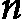
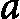
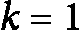
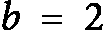

# 第六章：<st c="0">4</st>

# <st c="2">递归与递推函数</st>

<st c="36">估算迭代算法的复杂度或运行时间相对简单，因为它们具有线性和可预测的性质。</st> <st c="177">然而，递归算法涉及在执行过程中函数自我调用一次或多次，在复杂度估算中提出了独特的挑战。</st> <st c="339">这些自我引用的结构通常导致复杂且非直观的运行时间，无法通过简单的观察或传统的</st> <st c="503">迭代分析轻易辨别。</st>

<st c="522">为了应对这一挑战，我们引入了</st> **<st c="578">递推函数</st>**<st c="598">的概念。</st> <st c="620">递推函数是描述递归算法运行时间的数学模型，它以输入大小为基础。</st> <st c="729">通过将运行时间表示为递归自身的函数，我们可以系统地分析并解决这些递推，以获得算法复杂度的准确估算。</st>

<st c="916">本章探讨了递推函数的各个方面，包括它们的公式化、组成部分以及解决这些函数的技术。</st> <st c="1064">我们将探讨这些函数如何捕捉递归调用的本质，以及它们对算法整体计算成本的影响。</st> <st c="1219">理解递推函数对于准确预测递归算法的性能并优化</st> <st c="1346">它们的实现至关重要。</st>

<st c="1367">本章结构</st> <st c="1394">如下：</st>

+   <st c="1405">递归算法</st>

+   <st c="1426">递推函数</st>

+   <st c="1447">展开</st> <st c="1458">递推函数</st>

# <st c="1478">递归算法</st>

<st c="1499">想象一个传统的俄罗斯套娃，它通常在俄罗斯出现。</st> <st c="1565">当你打开最外层的娃娃时，你会发现里面藏着一个更小的娃娃。</st> <st c="1631">打开这个更小的娃娃后，里面还有一个更小的娃娃，这个过程持续进行，直到你找到最小的、无法再分割的娃娃。</st> <st c="1780">这个迷人的嵌套结构是理解递归的完美类比</st> <st c="1863">在算法中的应用。</st>

<st c="1877">就像俄罗斯套娃一样，**<st c="1911">递归算法</st>** <st c="1930">通过将问题分解为同一问题的更小实例来解决问题。</st> <st c="1938">每个实例都比上一个更简单，直到达到基本情况，可以直接解决，无需进一步递归。</st> <st c="2012">这种自我引用的方法是计算机科学中的一个基本概念，用于以直接和</st> <st c="2277">优雅的方式解决复杂问题。</st>

<st c="2292">在本节中，我们将探讨递归算法的原理，从其基本定义和性质开始。</st> <st c="2419">我们将研究递归的工作原理，其优点和潜在风险，以及它特别适用的问题类型。</st> <st c="2563">通过理解递归的核心概念，您将能够有效地设计和实现递归解决方案，利用其能力简化和解决</st> <st c="2731">复杂问题。</st>

## <st c="2750">递归的基础知识</st>

<st c="2774">计算机科学的发展</st> <st c="2812">以深刻理解如何通过计算来模拟智能和问题解决。</st> <st c="2923">在其核心，计算涉及将复杂任务分解为更简单、可重复的步骤。</st> <st c="3017">这一基础概念催生了驱动我们</st> <st c="3092">现代计算机的技术。</st>

<st c="3109">在计算机中实现重复的一个基本方法是</st> <st c="3169">通过</st> **<st c="3178">循环</st>** <st c="3183">或迭代过程。</st> **<st c="3208">循环</st>** <st c="3213">是一种重复执行一系列指令直到满足特定条件的结构。</st> <st c="3321">它们易于理解，其复杂度易于估计，并且相对简单调试。</st> <st c="3440">然而，虽然循环对于许多任务非常有效，但有时可能会在计算上消耗大量资源，并且在某些类型的问题上不太直观。</st>

<st c="3588">管理重复的另一种方法是通过</st> **<st c="3647">递归</st>**<st c="3656">。与循环不同，循环迭代一系列步骤，</st> **<st c="3712">递归</st>** <st c="3721">是一个函数调用自身来解决原始问题的较小实例，这称为子问题。</st> <st c="3832">这种方法根植于</st> <st c="3856">分治</st> **<st c="3861">策略，其中问题被划分为更小的子问题，每个子问题都递归解决，直到达到基本情况。</st> <st c="4009">这种方法通常可以导致更优雅和简单的解决方案，特别是对于自然适合递归结构的问题。</st>

<st c="4142">以下两个</st> <st c="4161">Python 代码示例展示了如何使用两种不同方法实现阶乘(n)算法：迭代方法（使用循环）和</st> <st c="4312">递归方法：</st>

```py
 def factorial_iterative(n):
    result = 1
    for i in range(1, n + 1):
        result *= i
    return result
```

<st c="4422">在迭代实现中，重复是线性且直接的。</st> <st c="4502">迭代的非递归实现的一个优点是，它们的复杂度和运行时间容易估算。</st> <st c="4624">在上面的函数中，运行时间取决于</st> `<st c="4703">for i in range(1, n + 1):</st>` <st c="4728">循环的执行次数。</st> <st c="4747">考虑到循环的范围，可以清楚地看出时间复杂度是</st> <st c="4811"><st c="4818">，简化为</st> <st c="4840"><st c="4857">。</st></st></st>

<st c="4858">现在，让我们来看看递归实现</st> <st c="4914">阶乘（Factorial(n)）的实现：</st>

```py
 def factorial_recursive(n):
    # Base case
    if n == 0:
        return 1
    # Recursive case
    else:
        return n * factorial_recursive(n - 1)
```

<st c="5051">在递归实现中，第一个显著的区别是没有使用循环。</st> <st c="5142">相反，重复通过函数的嵌套自调用来实现。</st> <st c="5217">这使得追踪递归算法的流程变得更加复杂。</st> <st c="5285">此外，估算递归算法的运行时间不像非递归算法那样直接。</st> <st c="5391">非递归算法的估算则更加简单。</st>

<st c="5416">为了估算运行时间，我们需要使用一种计算函数来建模递归过程，这个函数叫做递归函数，下一节将详细讨论它。</st> <st c="5602">对于递归的阶乘（Factorial(n)）函数，递归函数为</st> <st c="5670"><st c="5681">，其中</st>  <st c="5689"><st c="5690">表示计算阶乘</st> <st c="5750"><st c="5799">的运行时间，而</st>  <st c="5805"><st c="5806">是一个常数，表示非递归操作的时间。</st> <st c="5877">在下一章中，我们将看到，解决这个递归函数可以得出递归阶乘（Factorial(n)）的计算复杂度为</st> <st c="6021"><st c="6030">，这比</st> <st c="6060">迭代实现的效果还差。</st></st></st></st></st></st>

<st c="6085">从阶乘（Factorial(n)）的递归算法中，我们可以识别出所有递归算法中共有的三个组件：</st>

+   **<st c="6209">递归调用</st>**<st c="6225">：一种在其定义中调用自身的函数，例如</st> **<st c="6288">factorial_recursive(n - 1)</st>**<st c="6314">。每次调用都会处理原始问题的一个更小或更简单的版本。</st>

+   **<st c="6388">基准情况</st>**<st c="6398">：递归调用停止的条件。</st> <st c="6404">它防止了无限递归，并为问题的最简单版本提供了直接的解决方案。</st> <st c="6453">在递归阶乘中，这个部分是</st> <st c="6564">如下所示：</st> <st c="6610">

    ```py
     if n == 0:
    return 1
    ```

+   **<st c="6641">递归情况</st>**<st c="6656">：函数中发生递归的部分。</st> <st c="6668">它将问题分解为更小的子问题，并通过调用函数自身来解决这些子问题。</st> <st c="6817">在递归阶乘中，这部分是</st> **<st c="6863">return n * factorial_recursive(n -</st>** **<st c="6898">1)</st>**<st c="6900">。</st>

<st c="6901">与</st> `<st c="6909">factorial_recursive(n)</st>`<st c="6931">不同，递归实现通常比非递归实现具有更好的运行时间。</st> <st c="7026">让我们考虑以下使用递归方法计算一个数的幂的例子，该方法利用这一技巧来实现</st> <st c="7168">提高效率：</st>

```py
 def power_recursive(base, exponent):
    # Base case
    if exponent == 0:
        return 1
    # Recursive case
    elif exponent % 2 == 0:
        half_power = power_recursive(base, exponent // 2)
        return half_power * half_power
    else:
        return base * power_recursive(base, exponent - 1)
```

<st c="7442">让我们解释一下</st> <st c="7457">这段代码：</st>

+   **<st c="7466">基本情况</st>**<st c="7476">：如果</st> <st c="7485">指数为</st> **<st c="7498">0</st>**<st c="7499">，结果是</st> **<st c="7515">1</st>**<st c="7516">，因为任何数的零次方</st> <st c="7560">都是 1。</st>

+   `<st c="7947">base</st>` <st c="7951">在递归调用之后。</st>

+   **<st c="7977">递归调用</st>**<st c="7992">：该函数在</st> **<st c="8036">recursive(base, exponent // 2)</st>** <st c="8067">和</st> **<st c="8071">power_recursive(base, exponent -</st>** **<st c="8104">1)</st>**<st c="8106">中递归调用自身。</st>

<st c="8107">这种方法确保递归调用的数量相对于指数以对数方式增长，从而实现</st> <st c="8246"><st c="8255">的时间复杂度。这比迭代方法的线性时间复杂度</st> <st c="8355">要显著提高</st> <st c="8358"><st c="8359">。</st></st></st>

## <st c="8360">递归的类型</st>

**<st c="8379">递归</st>** <st c="8389">可以大致分为两种类型：直接递归和间接递归。</st> <st c="8397">理解这些类型有助于识别递归调用的性质及其对性能</st> <st c="8593">和复杂度的潜在影响。</st>

### <st c="8608">直接递归</st>

**直接递归**发生在一个函数直接调用自身时。这是最常见的递归形式，函数是自引用的。本书迄今为止所有的递归算法示例都是直接递归类型。一些直接递归的主要应用场景如下：

+   简化了那些可以自然分解为相同子问题的问题

+   相较于间接递归，直接递归更易于理解和调试

+   常用于诸如**阶乘计算**、**斐波那契数列**和**树遍历**等问题中

直接递归有几种类型，每种类型适用于不同的计算问题和算法策略。这里是直接递归的主要类型：

+   **尾递归**：这是递归的一种特殊情况，其中递归调用是函数返回前的最后一步操作。这意味着不会对递归调用的结果执行进一步的操作。尾递归的优势在于它可以通过编译器进行优化，从而避免栈溢出。编译器可以复用现有的栈帧，而不是为每个递归调用创建新的栈帧，有效地将递归转化为循环。一个说明性示例是**factorial_tail**函数，它通过直接调用自身作为最后一步来计算一个数的阶乘：

    ```py
     def factorial_tail(n, accumulator=1):
        if n == 0:
            return accumulator
        else:
            return factorial_tail(n - 1, n * accumulator)
    ```

    尾递归的一种应用是管理链表。尽管读者可能已经熟悉链表数据结构，我们将在*第十二章*中详细探讨它们。简而言之，链表是一种基本数据结构，由节点组成，每个节点包含一个值和一个指向下一个节点的引用（或链接）。链表的固有递归结构——每个节点可以看作是整个链表的一个小版本——使得递归成为执行诸如遍历、插入和删除等操作的理想方法。

    <st c="10635">这是一个使用尾递归进行链表递归遍历的示例。</st> <st c="10725">链表的遍历通常通过递归方式进行，处理当前节点后，通过递归调用移动到下一个节点。</st> <st c="10870">在尾递归方法中，处理下一个节点的调用是函数中的最后一个操作。</st> <st c="10975">以下是一个简单的</st> <st c="11001">Python 代码：</st>

    ```py
    def traverse_linked_list(node):
        if node is None:
            return
        print(node.value)
        traverse_linked_list(node.next)
    ```

+   **<st c="11119">头递归</st>**<st c="11134">：这是指一个函数的初始操作是对自身的</st> <st c="11159">递归调用。</st> <st c="11198">这意味着函数中的所有其他操作都要等到递归调用完成后才会执行。</st> <st c="11224">虽然头递归不如尾递归常见，但它确实有其用途。</st> <st c="11333">然而，由于需要维护一个待处理操作的栈，直到递归调用展开，因此它通常被认为效率较低。</st> <st c="11410">以下是一个**<st c="11567">头递归</st>** <st c="11581">的示例：</st>

    ```py
     def head_recursive(n):
        if n == 0:
            return
        else:
            head_recursive(n - 1)
            print(n)
    ```

+   **<st c="11709">线性递归</st>**<st c="11726">：在这种类型的</st> <st c="11744">递归中，一个函数在每次调用时最多进行一次递归调用。</st> <st c="11799">这导致了一个简单的递归调用链，类似一条直线。</st> <st c="11824">以下是一个简单的</st> <st c="11938">线性递归示例：</st>

    ```py
     def linear_recursive(n):
        if n == 0:
            return 0
        else:
            return n + linear_recursive(n - 1)
    ```

+   **<st c="12041">树形递归</st>**<st c="12056">：与线性递归不同，在树形递归中，一个函数在一次调用中会多次调用自身。</st> <st c="12120">这导致了递归调用的分支结构，类似一棵树。</st> <st c="12170">示例包括斐波那契数列计算、树的遍历和快速排序算法：</st>

    ```py
     def fun(n):
        if (n > 0):
            print(n, end=" ")
            fun(n - 1)
            fun(n - 1)
    ```

+   **<st c="12410">二叉递归</st>**<st c="12427">：这是指</st> <st c="12440">一个函数在一次调用中对自身进行两次递归调用的模式。</st> <st c="12493">这种方法常用于分治算法，它将一个问题分解成两个较小的子问题，并递归地解决它们。</st> <st c="12529">这些子问题的解决方案随后被组合起来，以得到</st> <st c="12752">原始问题的</st> <st c="12768">解决方案：</st>

    ```py
     def fibonacci_binary_recursive(n):
        if n <= 1:
            return n
        else:
            return fibonacci_binary_recursive(n - 1) +        fibonacci_binary_recursive(n - 2)
    ```

+   **<st c="12923">多重递归</st>**<st c="12942">：这是一种递归形式，其中一个函数在一次调用中对自身进行</st> <st c="12962">超过两个递归调用。</st> <st c="12996">这种模式比线性递归或二叉递归更为少见，但对于那些固有地分解成多个子问题的问题来说，它可能非常有用。</st> <st c="13064">这些子问题每一个都会递归求解，然后将它们的解决方案结合起来以获得最终结果。</st> <st c="13213">下一个</st> <st c="13328">示例中实现了一个简单的多重递归（</st>**<st c="13398">multiple_recursive</st>**<st c="13417">）：</st>

    ```py
     def multiple_recursive(n):
        if n <= 1:
            return 1
        else:
            return multiple_recursive(n - 1) + multiple_recursive(n - 2) + multiple_recursive(n - 3)
    ```

    <st c="13562">一个更复杂的例子是</st> <st c="13595">如下：</st>

    ```py
    def ternary_search(arr, target, start, end):
        if start > end:
            return -1  # Target not found
        else:
            mid1 = start + (end - start) // 3
            mid2 = start + 2 * (end - start) // 3
            if arr[mid1] == target:
                return mid1
            elif arr[mid2] == target:
                return mid2
            elif arr[mid1] > target:
                return ternary_search(arr, target, start, mid1 - 1)  # First recursive call
            elif arr[mid2] < target:
                return ternary_search(arr, target, mid2 + 1, end)  # Second recursive call
            else:
                return ternary_search(arr, target, mid1 + 1, mid2 - 1)  # Third recursive call
    ```

    <st c="14131">在这个例子中，</st> `<st c="14153">ternary_search</st>` <st c="14167">函数在一个已排序的数组上执行三分查找。</st> <st c="14222">它将数组分成三个大致相等的部分，并进行三次递归调用</st> <st c="14309">来搜索每个部分，演示了多重递归的概念。</st>

+   **<st c="14376">嵌套递归</st>**<st c="14393">：这是递归的一种更复杂的形式，其中一个函数的</st> <st c="14400">递归调用不仅仅传递一个修改过的参数，而是将另一个递归调用包含在参数中。</st> <st c="14458">这意味着递归的深度可能会迅速增加，使得这种递归类型比线性递归或二叉递归更难分析</st> <st c="14582">和理解：</st>

    ```py
     def nested_recursive(n):
        if n > 100:
            return n - 10
        else:
            return nested_recursive_function(nested_recursive(n + 11))
    ```

### <st c="14839">间接递归</st>

`<st c="15199">functionA</st>` <st c="15208">调用</st> `<st c="15215">functionB</st>`<st c="15224">，然后</st> `<st c="15230">functionB</st>` <st c="15239">调用</st> `<st c="15246">functionA</st>`<st c="15255">，形成了一个</st> <st c="15268">间接递归：</st>

```py
 def functionA(n):
    if n <= 0:
        return "End"
    else:
        return functionB(n - 1)
def functionB(n):
    if n <= 0:
        return "End"
    else:
        return functionA(n - 2)
```

<st c="15431">在间接递归的示例中，</st> `<st c="15470">functionA</st>` <st c="15479">调用</st> `<st c="15486">functionB</st>`<st c="15495">，然后</st> `<st c="15514">functionA</st>` <st c="15523">再次被调用。</st> <st c="15531">这个循环会持续，直到任一函数中的基本条件满足（</st>`<st c="15604">n <= 0</st>`<st c="15611">），从而终止递归。</st> <st c="15642">这种递归形式可以涉及两个以上的函数，从而形成一个复杂的调用链</st> <st c="15727">。</st>

<st c="15736">间接递归的一些主要应用场景如下：</st>

+   <st c="15795">对于</st> <st c="15807">需要多个阶段转化或处理的问题非常有用</st> <st c="15863">。</st>

+   <st c="15876">由于涉及多个函数，因此调试和追踪可能会更加困难。</st>

+   <st c="15962">通常</st> <st c="15971">出现在互相递归的算法中</st> <st c="16009">以及某些</st> <st c="16022">状态机中</st>

<st c="16036">理解直接递归和间接递归之间的区别，有助于更好地选择适合给定问题的递归方法。</st> <st c="16192">直接递归直接且广泛使用，而间接递归尽管更复杂，但在某些特定场景下，特别是在需要相互依赖的</st> <st c="16355">函数调用时，间接递归非常强大。</st>

### <st c="16370">递归问题解决</st>

**<st c="16396">递归问题解决</st>** <st c="16422">通常</st> <st c="16428">采用</st> *<st c="16441">分解、征服和合并</st>* <st c="16469">策略。</st> <st c="16480">这一框架在将复杂问题分解为简单的子问题、独立解决这些子问题，然后合并其结果形成最终解决方案方面非常有效。</st> <st c="16678">让我们详细探讨这一框架</st> <st c="16707">：</st>

+   **<st c="16717">分解</st>**<st c="16724">：在</st> <st c="16733">分解步骤中，将问题拆解为较小的子问题，这些子问题更容易解决。</st> <st c="16825">此步骤涉及确定如何将原始问题划分为更小的部分。</st> <st c="16914">关键是要确保子问题与原始问题具有相同的性质，但在大小上更简单或更小。</st> <st c="17027">尺寸上。</st>

+   **<st c="17035">征服</st>**<st c="17043">：在</st> <st c="17053">征服步骤中，子问题通过递归方式解决。</st> <st c="17107">如果子问题仍然太大，则使用相同的分解、征服和合并方法进一步划分。</st> <st c="17226">这个过程将继续，直到子问题达到基本情况，可以直接解决，而不需要</st> <st c="17327">进一步递归。</st>

+   **<st c="17345">合并</st>**<st c="17353">：在</st> <st c="17362">合并步骤中，将子问题的解决方案合并，以形成原始问题的解决方案。</st> <st c="17467">此步骤涉及将递归调用的结果整合，以获得</st> <st c="17547">最终答案。</st>

<st c="17560">值得一提的是，这一框架中的关键要素是识别</st> *<st c="17642">子问题</st>*<st c="17652">。一个</st> **<st c="17656">子问题</st>** <st c="17666">与原始问题相似，但在规模上更小。</st> <st c="17719">本质上，子问题是原始问题的较小实例。</st>

<st c="17791">这一框架将在接下来的章节中详细探讨，特别是在像归并排序这样的排序算法中。</st> <st c="17909">为了让读者了解这一框架，考虑以下归并排序算法，它将在</st> *<st c="18027">第六章</st>*<st c="18036">中讨论：</st>

```py
 def merge_sort(arr):
    if len(arr) <= 1:
        return arr
    mid = len(arr) // 2
    left_half = arr[:mid]
    right_half = arr[mid:]
    sorted_left = merge_sort(left_half)
    sorted_right = merge_sort(right_half)
    return merge(sorted_left, sorted_right)
def merge(left, right):
    sorted_array = []
    i = j = 0
    while i < len(left) and j < len(right):
        if left[i] < right[j]:
            sorted_array.append(left[i])
            i += 1
        else:
            sorted_array.append(right[j])
            j += 1
    # Append any remaining elements
    sorted_array.extend(left[i:])
    sorted_array.extend(right[j:])
    return sorted_array
```

<st c="18574">让我们简要说明在归并排序算法中如何应用分解、征服和</st> <st c="18622">合并框架：</st>

+   **<st c="18668">分治</st>**<st c="18675">: </st>**<st c="18682">归并排序</st>** <st c="18692">函数将数组分成两部分，</st> **<st c="18736">左半部分</st>** <st c="18745">和</st> **<st c="18750">右半部分</st>**<st c="18760">。这是通过使用数组的中点来完成的。</st>

+   **<st c="18807">征服</st>**<st c="18815">: </st>**<st c="18822">归并排序</st>** <st c="18832">函数在两个子数组上递归调用。</st> <st c="18880">每次递归调用都会进一步划分数组，直到达到基准情况，即数组长度为</st> **<st c="18985">0</st>** <st c="18986">或</st> **<st c="18990">1</st>** <st c="18991">(已排序)。</st>

+   **<st c="19009">合并</st>**<st c="19017">: </st>**<st c="19024">归并</st>** <st c="19029">函数用于合并已排序的两部分。</st> <st c="19075">它遍历两部分，比较元素并将较小的元素添加到排序后的数组中。</st> <st c="19182">任何剩余的元素都会被</st> <st c="19226">添加到数组中。</st>

<st c="19240">在接下来的章节中，我们将说明识别这三个组成部分对于递归算法设计和分析的重要性。</st>

### <st c="19388">递归的优点与挑战</st>

<st c="19427">递归是计算机科学和算法设计中的一个基本概念。</st> <st c="19505">虽然它提供了若干优点，但也带来了一些挑战。</st> <st c="19587">理解这两者有助于你决定何时以及如何有效地使用</st> <st c="19646">递归。</st>

<st c="19668">以下是递归解法的三个主要优点：</st>

+   **<st c="19733">简洁性和清晰度</st>**<st c="19756">: 递归通常能为具有重复或自相似结构的问题提供更直接且直观的解决方案，如树的遍历、阶乘计算和斐波那契数列。</st> <st c="19970">与迭代解法相比，递归解法通常更加简洁、易读。</st> <st c="20067">这使得代码更易维护和理解。</st>

+   **<st c="20133">复杂问题的简化</st>**<st c="20163">: 递归简化了将复杂问题分解为更简单子问题的过程。</st> <st c="20259">这在分治算法中尤其有用，如归并排序和快速排序。</st> <st c="20355">递归函数还可以产生优雅且简洁的代码，特别是当问题本身具有递归特性时，如动态规划和</st> <st c="20503">组合问题。</st>

+   **<st c="20526">隐式状态管理</st>**<st c="20552">：递归调用通过调用栈本身来管理状态，在许多情况下不需要显式的状态管理。</st> <st c="20686">这可以简化逻辑，并减少与</st> <st c="20757">状态</st> <st c="20763">管理相关的错误几率。</st>

<st c="20772">另一方面，递归算法也带来了一些挑战。</st> <st c="20840">以下是一些主要的挑战</st> <st c="20880">和缺点：</st>

+   **<st c="20898">性能问题</st>**<st c="20919">：每次</st> <st c="20927">递归调用都会向调用栈添加一个新帧，相较于迭代解决方案，这可能会导致显著的开销，尤其是在递归深度较大时。</st> <st c="21083">深度递归或无限递归可能会导致栈溢出错误，特别是当递归深度超过最大栈大小时。</st> <st c="21200">这是在栈内存有限的语言中常见的问题。</st>

+   **<st c="21262">调试复杂性</st>**<st c="21286">：调试递归函数可能会很具挑战性，因为它涉及跟踪多个层次的函数调用。</st> <st c="21401">理解执行流程和每层递归中的状态可能会很困难。</st> <st c="21496">不正确地定义基准情况也可能导致无限递归或错误结果。</st> <st c="21585">确保所有基准情况都被正确处理是保证算法正确性的关键。</st>

+   **<st c="21684">空间复杂度</st>**<st c="21701">：递归算法可能会因为调用栈所需的额外内存而具有较高的空间复杂度。</st> <st c="21814">对于输入规模较大或递归深度较深的问题，这可能会成为一个问题。</st> <st c="21893">递归函数通常需要为每次递归调用额外分配内存，这可能会导致与其</st> <st c="22038">迭代</st> <st c="22047">对应方法相比，增加辅助空间的使用。</st>

<st c="22061">此外，在设计递归算法时，我们需要注意以下实际问题。</st> <st c="22173">其中一些将在</st> <st c="22217">后续章节中详细讨论：</st>

+   **<st c="22235">尾递归</st>**<st c="22250">：某些</st> <st c="22257">语言和编译器通过将尾递归函数优化为迭代形式，从而减少了调用栈的开销。</st> <st c="22369">在可能的情况下，设计递归函数时应考虑使其成为尾递归。</st>

+   **<st c="22432">备忘录法</st>**<st c="22444">：使用备忘录法</st> <st c="22462">存储昂贵递归调用的结果，避免重复计算。</st> <st c="22547">这种技术在动态规划中尤为有用。</st> <st c="22607">欲了解更多信息，请参见</st> *<st c="22633">第十章</st>*<st c="22643">。</st>

+   **<st c="22644">迭代替代方案</st>**<st c="22667">：当递归导致性能或内存问题时，考虑使用迭代解决方案。</st> <st c="22679">迭代算法通常能更高效地实现相同的结果。</st> <st c="22753">迭代算法通常能以更高效的方式实现相同的结果。</st> <st c="22809">更高效。</st>

<st c="22826">本节介绍了递归的概念，突出了其在计算机科学和算法设计中的重要性。</st> <st c="22868">递归是一种方法，其中一个函数调用自身来解决相同问题的较小实例，示例包括阶乘计算和斐波那契数列。</st> <st c="22955">本节通过示例（如阶乘计算和斐波那契数列）解释了递归，并强调了分治法框架，展示了如何将问题分解为更简单的子问题，独立求解后再合并以形成最终解决方案，以归并排序为</st> <st c="23364">关键示例。</st>

<st c="23376">各种类型的递归，包括直接递归和间接递归，进行了分析，并提供了各自的示例。</st> <st c="23499">讨论了递归的优点，如简洁性、清晰性和有效的问题分解，同时也探讨了其挑战，如函数调用开销、潜在的栈溢出问题以及调试复杂性。</st> <st c="23720">提供了实际的考虑因素，包括尾递归、记忆化和迭代替代方案，以优化</st> <st c="23839">递归函数。</st>

<st c="23859">总之，本节提供了关于递归的全面概述，详细阐述了其原理、优点和挑战。</st> <st c="23989">为理解和应用递归问题解决技巧在算法设计中的应用奠定了坚实的基础。</st> <st c="24106">下一节将讨论递归算法的运行时间模型，即</st> **<st c="24189">递推函数</st>**<st c="24209">，这是</st> <st c="24225">复杂度</st> <st c="24235">分析的关键。</st>

# <st c="24245">递归函数</st>

<st c="24266">表示</st> <st c="24293">增量（非递归）算法运行时间的函数可以由于这些算法线性、顺序的特点而直接确定。</st> <st c="24448">例如，考虑计算阶乘的增量实现</st> <st c="24521"><st c="24522">。</st> *<st c="24524">表 4.1</st>* <st c="24533">展示了该算法以及其在</st> <st c="24612">第二列中的相关计算成本。</st></st>

<st c="24626">描述递归算法运行时间的函数并不像增量算法那样直观。</st> <st c="24755">为了分析递归算法的运行时间，我们使用</st> **<st c="24815">递归函数</st>** <st c="24835">或</st> **<st c="24839">递归关系</st>**<st c="24859">。这些概念源自</st> <st c="24888">数学。</st>

<st c="24905">在数学中，</st> **<st c="24924">递归函数</st>** <st c="24943">是定义</st> *<st c="24976">n</st>*<st c="24977">项序列中第 n 项的方程，该方程以其前几项为基础。</st> <st c="25032">通常，方程只涉及序列的前</st>  <st c="25061"><st c="25062">项，其中</st>  <st c="25121"><st c="25122">是一个不依赖于</st> <st c="25162"><st c="25163">的参数。</st> 这个参数</st> <st c="25180"><st c="25181">被称为递归函数的阶数。</st> <st c="25231">一旦知道了前</st>  <st c="25260"><st c="25261">项的值，剩余的项就可以通过反复应用</st> <st c="25360">递归函数来确定。</st></st></st></st></st></st>

| **<st c="25380">指令</st>** | **<st c="25392">成本</st>** |
| --- | --- |
| `<st c="25397">def factorial_incremental(n):</st>` | <st c="25427">-</st> |
| `<st c="25429">result = 1</st>` |  |
| `<st c="25441">for i in range(1, n +</st>` `<st c="25463">1):</st>` |  |
| `<st c="25471">result *= i</st>` |  |
| `<st c="25532">返回结果</st>` |  |
| `<st c="25547">运行时间</st>` `<st c="25560">函数 T(n)</st>` |  |
| `<st c="25590">复杂度</st>` |  |

<st c="25602">表 4.1：阶乘递增实现及其运行时间</st>

<st c="25678">例如，斐波那契序列可以通过递归函数定义，其中每一项是前两项的和。</st> <st c="25810">通过知道前两项，整个序列可以生成（见</st> *<st c="25884">示例 4.2</st>*<st c="25895">）。</st> <st c="25899">类似地，在算法分析中，递归函数通过表达问题的时间复杂度以</st> <st c="26068">更小的子问题解来帮助我们模拟递归算法的运行时间。</st>

<st c="26088">在递归算法的背景下，</st> <st c="26130">递归函数捕捉了算法如何将问题分解为子问题、递归求解并组合它们解决方案的本质。</st> <st c="26283">这种方法使我们能够系统分析和预测递归算法的性能，即使它们的执行路径和计算成本不如</st> <st c="26488">增量算法那样立即显现。</st>

<st c="26511">两种主要的递归函数类型</st> <st c="26557">是</st> **<st c="26561">减法递归</st>** <st c="26583">和</st> **<st c="26588">分治递归</st>** <st c="26617">函数。</st> <st c="26629">减法和分治</st> <st c="26669">递归是定义问题递归方式的两种方法，其中较大问题的解决方案用较小子问题的解决方案表达。</st> <st c="26746">然而，它们在问题分解和子问题解组合方式上有所不同。</st> <st c="26931">让我们详细探讨这两种递归</st> <st c="26976">类型。</st>

## <st c="26986">减法递归函数</st>

**<st c="27019">减法递归</st>** <st c="27042">函数（也称为</st> **<st c="27066">减法与征服</st>** <st c="27086">和</st> **<st c="27091">递减与征服</st>**<st c="27111">）是一类</st> <st c="27120">线性递归函数，其中序列中的下一个项是前几项的线性组合。</st> <st c="27232">这些</st> <st c="27238">函数在数学和计算机科学中至关重要，用于建模具有</st> <st c="27333">递归结构</st> <st c="27334">的问题。</st>

<st c="27354">线性递归函数是一个方程，它通过线性系数将序列中的一项与其前面的项联系起来。</st> <st c="27483">一个阶数为</st>  <st c="27541"><st c="27542">的线性递归函数的一般形式是：</st></st>


<st c="27559">这里，</st> ![<mml:math xmlns:mml="http://www.w3.org/1998/Math/MathML" xmlns:m="http://schemas.openxmlformats.org/officeDocument/2006/math"><mml:msub><mml:mrow><mml:mi>c</mml:mi></mml:mrow><mml:mrow><mml:mn>1</mml:mn></mml:mrow></mml:msub><mml:mo>,</mml:mo><mml:msub><mml:mrow><mml:mi>c</mml:mi></mml:mrow><mml:mrow><mml:mn>2</mml:mn></mml:mrow></mml:msub><mml:mo>,</mml:mo><mml:mo>…</mml:mo><mml:mo>,</mml:mo><mml:msub><mml:mrow><mml:mi>c</mml:mi></mml:mrow><mml:mrow><mml:mi>k</mml:mi></mml:mrow></mml:msub></mml:math>](img/453.png) <st c="27565"><st c="27578">是常数，</st>  <st c="27597"><st c="27598">是递归函数的阶数。</st></st></st>

<st c="27639">减法递归函数的一般形式是：</st> <st c="27697">如下所示：</st>

![<mml:math xmlns:mml="http://www.w3.org/1998/Math/MathML" xmlns:m="http://schemas.openxmlformats.org/officeDocument/2006/math" display="block"><mml:mi>T</mml:mi><mml:mfenced separators="|"><mml:mrow><mml:mi>n</mml:mi></mml:mrow></mml:mfenced><mml:mo>=</mml:mo><mml:mi>T</mml:mi><mml:mfenced separators="|"><mml:mrow><mml:mi>n</mml:mi><mml:mo>-</mml:mo><mml:msub><mml:mrow><mml:mi>k</mml:mi></mml:mrow><mml:mrow><mml:mn>1</mml:mn></mml:mrow></mml:msub></mml:mrow></mml:mfenced><mml:mo>+</mml:mo><mml:mi>T</mml:mi><mml:mfenced separators="|"><mml:mrow><mml:mi>n</mml:mi><mml:mo>-</mml:mo><mml:msub><mml:mrow><mml:mi>k</mml:mi></mml:mrow><mml:mrow><mml:mn>2</mml:mn></mml:mrow></mml:msub></mml:mrow></mml:mfenced><mml:mo>+</mml:mo><mml:mo>…</mml:mo><mml:mo>+</mml:mo><mml:mi>f</mml:mi><mml:mo>(</mml:mo><mml:mi>n</mml:mi><mml:mo>)</mml:mo></mml:math>](img/455.png)

<st c="27746">以下是</st> <st c="27777">各个组件的详细解析：</st>

<st c="27792"><st c="27794">: 这是一个正整数，其中</st> <st c="27829"><st c="27839">。它表示每次递归调用中问题规模减少的步长。</st> <st c="27930">如果</st> <st c="27933"><st c="27934">，线性递推函数可以写作</st> <st c="27982">如下：</st></st></st></st>


<st c="27995">这里，</st>  <st c="28001"><st c="28021">是待解决的子问题的数量。</st></st>

<st c="28063"><st c="28079">：这是递归函数的递归部分。</st> <st c="28141">它表示函数通过减少</st> <st c="28216"><st c="28231">的大小来调用自身。</st> <st c="28343">这个项捕捉了递归的本质，显示当前问题如何依赖于一个</st> <st c="28343">更小的子问题的解决方案。</st></st></st>

<st c="28362"><st c="28368">：这表示算法非递归部分的运行时间。</st> <st c="28386">它包括函数中执行的所有操作所花费的时间，不包括递归调用所花费的时间。</st> <st c="28434">这可能包括初始化、结果组合或任何其他发生在</st> <st c="28721">递归调用之外的处理。</st></st>

<st c="28737">以下是减法递归函数的主要</st> <st c="28765">特性：</st> <st c="28791">递归函数的主要特性：</st>

+   <st c="28812">减法方法通过从原始问题大小中减去一个常数值（例如</st> <st c="28901"><st c="28902">）来分解问题。</st> <st c="28922">它通过减小问题大小来解决问题。</st>

+   <st c="28934">较小问题的解决方案随后被用来解决原始问题，通常不需要完全解决原始问题的其余部分。</st>

+   <st c="29097">这种方法不像分治法那样常见，但对于某些特定问题，能够从稍微</st> <st c="29262">更小的子问题</st> 获得解答，它是有效的。

<st c="29277">让我们来研究这个类型的递推函数，在两个著名的阶乘和</st> <st c="29357">斐波那契算法中。</st>

**<st c="29378">示例 4.1</st>**

**<st c="29390">实现</st>** **** **<st c="29466">使用线性递推</st>**<st c="29489">：一个数的阶乘</st>  <st c="29518"><st c="29567">可以使用线性递推函数来描述。</st> <st c="29620">在这种情况下，问题的规模每次递归都减少</st>  <st c="29665"><st c="29666">，使其成为一个简单的</st> <st c="29719">线性递推。</st></st></st>

<st c="29737">阶乘的</st> <st c="29752">递推</st> **<st c="29770">阶乘函数</st>** <st c="29788">可以</st> <st c="29793">写成</st> <st c="29804">如下形式：</st>


<st c="29832">以下是</st> <st c="29839">详细分析：</st>

+    <st c="29853"><st c="29855">是每次递归中子问题的数量</st> <st c="29903">，它的值为 1。</st></st>

+    <st c="29908"><st c="29910">表示在每次递归中问题的规模减少 1。</st> <st c="29958">递归步骤。</st></st>

+    <st c="29973"><st c="29981">是递归部分。</st> <st c="30009">它表明阶乘函数调用自身</st> <st c="30059">，并且</st> <st c="30064"><st c="30065">。</st></st></st>

+    <st c="30066"><st c="30068">是非递归部分。</st> <st c="30101">它表示在每一步执行的常量时间操作，如乘法和函数</st> <st c="30212">调用开销。</st></st>

<st c="30226">以下代码为使用</st> <st c="30307">线性递归的 Python 实现阶乘函数：</st>

```py
 def factorial_recursive(n):
    # Base case: if n is 0, the factorial is 1
    if n == 0:
        return 1
    # Recursive case: multiply n by the factorial of (n - 1)
    else:
        return n * factorial_recursive(n - 1)
```

<st c="30516">这个递归函数表明时间复杂度为</st> <st c="30580"><st c="30581">，因为该函数会</st>  <st c="30605"><st c="30606">次递归调用，并且每次调用都进行常量量的工作。</st></st></st>

<st c="30676">阶乘算法的运行时间</st> <st c="30701">对于增量法和递归法而言，其性能不可能优于</st><st c="30792"><st c="30794">。这一限制源自问题本身的性质。</st> <st c="30858">要计算</st> <st c="30886"><st c="30887">的阶乘，必须处理从 2 到</st> <st c="30946"><st c="30947">的每一个数字。</st> <st c="30955">没有任何捷径或优化能将计算成本降低到低于这种线性</st> <st c="31046">时间复杂度的水平。</st></st></st></st>

**<st c="31062">例 4.2</st>**

<st c="31074">**<st c="31079">斐波那契数列</st>** <st c="31097">是</st> <st c="31101">线性递归函数最著名的例子之一。</st> <st c="31170">它由以下递归函数定义：</st><st c="31200">ºu|</st> <st c="31205">递归函数：</st>


<st c="31227">它也被定义为</st> <st c="31255">初始条件：</st>


<st c="31285">这意味着</st> <st c="31301">斐波那契数列中的每一项都是前两项之和。</st> <st c="31376">斐波那契数列可以通过递归算法实现</st> <st c="31446">如下所示：</st>

```py
 def fibonacci_recursive(n):
    if n <= 0:
        return 0
    elif n == 1:
        return 1
    else:
        return fibonacci_recursive(n - 1) + fibonacci_recursive(n - 2)
```

<st c="31596">斐波那契数列的线性递归算法的递推公式是</st> <st c="31686">如下：</st>

![<mml:math xmlns:mml="http://www.w3.org/1998/Math/MathML" xmlns:m="http://schemas.openxmlformats.org/officeDocument/2006/math" display="block"><mml:mi>T</mml:mi><mml:mo>(</mml:mo><mml:mi>n</mml:mi><mml:mo>)</mml:mo><mml:mo>=</mml:mo><mml:mi>T</mml:mi><mml:mo>(</mml:mo><mml:mi>n</mml:mi><mml:mo>-</mml:mo><mml:mn>1</mml:mn><mml:mo>)</mml:mo><mml:mo>+</mml:mo><mml:mi>T</mml:mi><mml:mo>(</mml:mo><mml:mi>n</mml:mi><mml:mo>-</mml:mo><mml:mn>2</mml:mn><mml:mo>)</mml:mo><mml:mo>+</mml:mi>O</mml:mi><mml:mo>(</mml:mo><mml:mn>1</mml:mn><mml:mo>)</mml:mo></mml:math>](img/482.png)

<st c="31730">以下是</st> <st c="31738">分解：</st>

+    <st c="31752"><st c="31761">表示计算第</st> <st c="31809"><st c="31810">个斐波那契数的时间复杂度。</st> <st c="31831">该函数以</st>  <st c="31862"><st c="31863">作为参数递归调用自身。</st></st></st></st>

+    <st c="31880"><st c="31890">表示计算第</st> <st c="31938"><st c="31939">个斐波那契数的时间复杂度。</st> <st c="31960">该函数以</st>  <st c="31991"><st c="31992">作为参数递归调用自身。</st></st></st></st>

+    <st c="32009"><st c="32011">表示每次递归调用中执行的常数时间操作，如加法操作以及其他</st> <st c="32152">常数时间操作。</st></st>

<st c="32177">斐波那契序列的递归</st> <st c="32192">实现具有指数级时间复杂度，</st> <st c="32266"><st c="32267">。这种低效源于相同的</st> <st c="32311">计算被</st> <st c="32328">多次重复</st> <st c="32337">进行。</st></st>

<st c="32352">线性递归函数，如斐波那契序列，不仅是理论构造；它们在许多领域中都有实际应用，除了计算机科学中的算法设计外，还包括预测股价、分析投资策略以及研究生态学</st> <st c="32663">和流行病学中的人口增长。</st>

## <st c="32680">分治法递归函数</st>

<st c="32720">在分治法</st> <st c="32742">的递归函数中，</st> <st c="32769">问题规模被分解成较小的子问题，独立解决后再合并结果。</st> <st c="32869">这些通常表示为：</st> <st c="32901">如下：</st>


<st c="32914">在这里，</st>  <st c="32920"><st c="32940">是子问题的数量，</st>  <st c="32970"><st c="32971">是将问题规模划分的因子，</st>  <st c="33028"><st c="33033">是划分问题和合并结果的时间复杂度。</st></st></st></st>

<st c="33106">需要注意的是，我们通常对</st>  <st c="33173"><st c="33193">和</st> <st c="33197"><st c="33198">有一些约束，这些将在下一章介绍求解递归函数的主定理时讨论。</st> <st c="33314">简单来说，对</st> <st c="33354">参数的约束是：</st></st></st>

+    <st c="33368"><st c="33370">意味着子问题的数量不能小于</st> <st c="33421">1</st></st>

+    <st c="33429"><st c="33434">意味着每个子问题应该比原始问题小，从而确保算法</st> <st c="33529">最终终止</st></st>

<st c="33550">此外，</st>  <st c="33570"><st c="33590">和</st>  <st c="33594"><st c="33595">都应该是常数，并且独立于</st> <st c="33635"><st c="33684">。</st></st></st></st>

<st c="33685">以下是分治法递归函数的主要</st> <st c="33713">特性：</st>

+   <st c="33767">分治法将问题分解为两个或更多大小大致相等的子问题</st>

+   <st c="33875">这些子问题的解决方案然后被组合起来，以得到</st> <st c="33956">原始问题的解决方案</st>

+   <st c="33972">这种方法通常用于那些可以自然地分解成</st> <st c="34049">独立子问题</st>

<st c="34072">让我们以归并排序的</st> <st c="34091">递归函数为例，来展示分治法的应用。</st>

**<st c="34191">例 4.3</st>**

<st c="34203">一个例子是</st> <st c="34221">在诸如</st> <st c="34269">归并排序（参见前一节）等算法中看到的递归函数，其中问题在每一步被减半，且子问题通过递归解决后再合并。</st>

<st c="34417">归并排序算法的递归函数如下：</st>


<st c="34507">这里是</st> <st c="34515">具体的拆解：</st>

+    <st c="34529"><st c="34574">是每次递归中子问题的数量。</st></st>

+    <st c="34621"><st c="34631">表示问题被划分为两个子问题（</st><st c="34687"><st c="34689">），每个子问题的大小为</st> <st c="34705"><st c="34709">。解决每个子问题的时间复杂度为</st> <st c="34759">是</st> <st c="34762"><st c="34771">。</st></st></st></st></st>

+    <st c="34772"><st c="34774">表示合并已排序子数组所需的时间，这与数组的大小成线性关系。</st></st>

<st c="34888">在前面的例子中，展示了一个典型的分治递归，并介绍了它的关键参数。</st> <st c="35002">在下一个例子中，我们将研究二分查找的递归函数，这也是一个分治方法，类似于</st> <st c="35142">归并排序。</st>

**<st c="35153">例 4.4</st>**

**<st c="35165">二分查找</st>** <st c="35179">是一个</st> <st c="35184">经典</st> <st c="35192">的分治算法示例。</st> <st c="35236">二分查找通过反复将查找区间</st> <st c="35299">对半分割并检查目标值位于左半部分还是右半部分来工作。</st> <st c="35375">这是使用递归方法实现的二分查找的 Python 代码：</st>

```py
 def binary_search(arr, target, low, high):
    if low > high:
        return -1  # Target is not in the array
    mid = (low + high) // 2
    if arr[mid] == target:
        return mid
    elif arr[mid] < target:
        return binary_search(arr, target, mid + 1, high)
    else:
        return binary_search(arr, target, low, mid - 1)
```

<st c="35734">二分查找算法在每次递归调用时将问题规模减半。</st> <st c="35821">这可以通过以下</st> <st c="35862">递归函数来表达：</st>


<st c="35884">这里是</st> <st c="35892">分解：</st>

+    <st c="35906"><st c="35908">表示在数组的一半内进行递归调用查找。</st> <st c="35979">从递归函数中我们知道</st>  <st c="36022"><st c="36023">并且</st> <st c="36027"><st c="36028">。</st></st></st></st>

+    <st c="36029"><st c="36031">表示常数时间操作，例如将目标与中间元素进行比较并确定下一步搜索的半部分。</st> <st c="36158">。</st>

<st c="36170">在本节中，我们探讨了递归函数，重点讨论了减法法和分治法两种方法。</st> <st c="36286">我们学习了如何识别每种类型的递归函数并确定其组成部分的参数。</st> <st c="36373">通过这一分析，我们获得了准确分类递归函数的能力。</st> <st c="36441">函数的分类。</st>

<st c="36462">此外，我们将对递归函数的理解应用于一些著名的算法，例如搜索算法和排序算法。</st> <st c="36592">我们研究了具体的例子，如归并排序和二分查找，了解递归函数如何在实践中操作，使我们能够观察到这些概念对算法效率和复杂度的直接影响。</st> <st c="36827">这一综合性的研究为有效分析和设计递归算法提供了坚实的基础。</st> <st c="36918">有效。</st>

# <st c="36941">展开递归函数</st>

<st c="36972">到目前为止，我们已经讨论了算法设计中的递归结构，并介绍了不同类型的递归。</st> <st c="37090">接着我们重点讨论了两种类型的递归函数：减法递归和分治递归。</st> *<st c="37180">表 4.2</st>* <st c="37189">总结了这两种递归函数的性质。</st> <st c="37262">正如表格所示，分治递归通常能提供更高效的解决方案，尽管效率高度依赖于具体解决的问题。</st> <st c="37424">问题。</st>

<st c="37437">在本节中，我们将揭示递归函数的奥秘。</st> <st c="37495">这种理解将在下一章中发挥重要作用，我们将解决递归函数并估算其计算复杂度，换句话说，估算它们的增长速度。</st> <st c="37680">通过展开这些函数，我们可以深入了解递归算法如何运作，以及它们的性能如何随着输入规模的变化而变化。</st> <st c="37819">这些知识将使我们能够更有效地分析和优化算法。</st>

<st c="37901">无论递归函数的类型如何，它们都由两个主要元素组成：递归组件和非递归组件。</st> <st c="38041">其中，**<st c="38045">递归组件</st>** <st c="38064">通过减法或除法减少问题的规模。</st> <st c="38084">另一方面，**<st c="38154">非递归组件</st>**<st c="38177">，也称为</st> **<st c="38197">驱动函数</st>**<st c="38213">，是作为</st> <st c="38245"><st c="38294">的函数形式表达，表示问题的大小。</st> <st c="38321">问题。</st></st>

<st c="38333">递归组件</st> <st c="38357">定义了如何将问题分解为更小的子问题。</st> <st c="38423">对于减法递归函数，这种减少通常是常量量，例如</st> <st c="38519"><st c="38520">。对于分治递归函数，问题通过一个因子来分解，例如</st> <st c="38611"><st c="38624">。由于除法比减法更快速地减少问题规模，分治递归通常会导致更高效的算法。</st> <st c="38772">这类似于乘法比加法增长得更快；同样，分割问题的规模通常比减去常量更迅速。</st> <st c="38944">因此，基于分治策略的算法通常比使用简单</st> <st c="39057">减法递归的算法更高效。</st></st></st>

| **<st c="39079">特征</st>** | **<st c="39087">减法递归</st>** | **<st c="39110">分治递归</st>** |
| --- | --- | --- |
| <st c="39140">问题分解</st> | <st c="39158">按</st> <st c="39168">常量</st> <st c="39174">减少。</st> | <st c="39190">分解成大致相等的</st> <st c="39212">子问题。</st> |
| <st c="39236">子问题组合</st> | <st c="39259">来自一个子问题的解决方案；其他的可以</st> <st c="39303">被忽略。</st> | <st c="39314">将多个解决方案组合以找到</st> <st c="39346">整体解决方案。</st> |
| <st c="39363">子问题的数量</st> <st c="39371">子问题的数量</st> | <st c="39385">一个（在</st> <st c="39394">大多数情况下）</st>。 | <st c="39406">两个</st> <st c="39411">或更多。</st> |
| <st c="39419">适用性</st> | <st c="39433">可以通过稍微简化的问题推导出解决方案的特定问题。</st> <st c="39502">可以从更小的问题中推导解决方案。</st> | <st c="39518">天然可分解为</st> <st c="39562">独立子问题的问题。</st> |
| <st c="39586">效率</st> | <st c="39597">对于那些将问题划分成子问题后能更快解决的问题，可能效率较低。</st> <st c="39725">这是因为在</st> <st c="39778">减法递归中，问题的规模减少得较慢。</st> | <st c="39801">通常，对于那些可以分解为多个子问题的问题，更有效率。</st> <st c="39892">这是因为它可以利用并行处理，并且通常导致对数时间复杂度或线性对数时间复杂度。</st> <st c="40010">然而，划分和合并子问题的开销，有时会让它在处理非常小的</st> <st c="40150">问题规模时，效率低于减法递归。</st> |
| <st c="40164">示例算法</st> | <st c="40183">阶乘、二分查找、</st> <st c="40202">和斐波那契。</st> | <st c="40224">归并排序、快速排序和斯特拉森的</st> <st c="40264">矩阵</st> <st c="40271">乘法算法。</st> |

<st c="40296">表 4.2：总结减法递归与分治递归函数的主要区别</st>

<st c="40403">非递归部分，或称驱动函数，</st> <st c="40454"><st c="40459">，表示递归调用外部完成的工作。</st> <st c="40515">它包含了划分问题和合并子问题结果的所有操作。</st> <st c="40625">这个函数在确定算法的整体时间复杂度中起着至关重要的作用。</st> <st c="40706">算法的时间复杂度由它决定。</st></st>

<st c="40720">让我们将递归函数想象成一辆机械车辆。</st> <st c="40784">递归组件充当引擎的角色。</st> <st c="40828">值越大，</st> <st c="40852"><st c="40853">，引擎运行得越慢，这意味着递归算法需要解决更多的子问题。</st> <st c="40941">另一方面，</st>  <st c="40960"><st c="40961">充当齿轮的角色。</st> <st c="40986">值越大，</st> <st c="41010"><st c="41011">，引擎工作得越快。</st> <st c="41042">这意味着每一步（或递归）都会让问题的规模更快地缩小成</st> <st c="41137">更小的子问题。</st></st></st></st>

<st c="41157">现在，你可能会想知道</st> <st c="41198"><st c="41199">的作用是什么。驱动函数，尽管这个名字可能不太直观，代表了车辆的负载。</st> <st c="41306">较大的</st>  <st c="41317"><st c="41322">意味着在增长速度上，递归算法完成任务所需的工作量会更多。</st> <st c="41425">这意味着，如果</st>  <st c="41444"><st c="41445">增长得很快，算法每一步都需要付出更多的努力，就像车辆承载更</st> <st c="41549">重的负载一样。</st></st></st></st>

<st c="41562">递归算法为许多问题提供了优雅的解决方案，但它们的时间复杂度可能很难分析。</st> <st c="41678">一个有用的指南是，驱动函数，即递归调用外部的工作，设定了总体复杂度的下限。</st> <st c="41817">换句话说，递归算法不能比执行</st> <st c="41910">非递归操作所需的时间更快。</st>

<st c="41935">然而，驱动函数并不是决定最终复杂度的唯一因素。</st> <st c="42023">每个递归步骤中创建的子问题数量（通常用</st> *<st c="42098">a</st>*<st c="42099">表示）和问题规模减少的系数（用</st> *<st c="42172">b</st>*<st c="42173">表示）起着至关重要的作用。</st> <st c="42195">这些参数与驱动函数相互作用，导致不同的时间复杂度。</st> <st c="42288">例如，如果子问题的数量较少，且每一步问题规模显著减少，那么驱动函数的影响可能会被掩盖。</st> <st c="42454">另一方面，如果有许多子问题或者问题规模减少得很慢，驱动函数可能成为</st> <st c="42577">主导因素。</st>

<st c="42593">为了系统地分析所有这些因素的相互作用，并准确估算递归算法的时间复杂度，我们使用了一种强大的工具——</st> **<st c="42762">主定理</st>**<st c="42776">。该定理为解决递归函数提供了一个框架，这些递归函数是数学表达式，定义了递归算法的运行时间，基于</st> <st c="42941">它们的子问题。</st>

# <st c="42959">总结</st>

<st c="42967">在</st> *<st c="42971">第四章</st>*<st c="42980">中，我们探讨了递归函数的复杂性及其在分析递归算法复杂度中的关键作用。</st> <st c="43110">我们首先研究了递归算法的结构，区分了减法型递归函数和分治法递归函数。</st> <st c="43251">这些概念通过各种例子进行了说明，突出了不同类型的递归函数如何影响算法的整体效率。</st>

<st c="43412">接着，我们解释了递归函数的组成部分，强调了递归部分和非递归（驱动）部分的重要性。</st> <st c="43560">本章介绍了主定理作为解决递归函数的强大工具。</st> <st c="43655">通过应用该定理，我们展示了如何估算递归算法的计算复杂度，考虑子问题的数量、缩减比例和驱动函数。</st> <st c="43861">详细的分析和示例为我们提供了全面的理解，帮助我们如何处理和解决递归函数，为更高级的话题，如算法设计和</st> <st c="44053">复杂度分析奠定了基础。</st>

<st c="44073">在下一章，我们将探讨如何解决递归函数。</st> <st c="44146">我们将讨论几种分析递归算法的方法，并估算它们的运行时间，包括主定理。</st> <st c="44276">此外，我们还将研究这些方法在各种递归算法中的应用，深入了解它们的</st> <st c="44413">时间复杂度。</st>

# <st c="44429">参考文献及进一步阅读</st>

+   *<st c="44460">《算法导论》</st>*<st c="44487">. 由 Thomas H.</st> <st c="44502">Cormen, Charles E.</st> <st c="44521">Leiserson, Ronald L.</st> <st c="44542">Rivest 和 Clifford Stein 编著。</st> <st c="44570">第四版。</st> <st c="44586">MIT</st> <st c="44590">出版社。</st> <st c="44597">2022 年：</st>

    +   *<st c="44602">第四章</st>* *<st c="44611">分治法</st>*<st c="44612">,</st> *<st c="44614">Divide-and-Conquer</st>*

    +   *<st c="44632">第三十四章</st>*<st c="44643">,</st> *<st c="44645">高级话题</st>*

+   *<st c="44660">算法设计</st>*<st c="44677">. 作者：乔恩·克莱因伯格和埃娃·塔尔多斯。</st> <st c="44712">第一版。</st> <st c="44727">皮尔逊</st> <st c="44736">2005 年：</st>

    +   *<st c="44741">第五章</st>*<st c="44751">,</st> *<st c="44753">分治法</st>* *<st c="44760">与征服</st>*

    +   *<st c="44771">第六章</st>*<st c="44781">,</st> *<st c="44783">递归关系与</st>* *<st c="44812">主定理</st>*

+   *<st c="44826">算法</st>*<st c="44837">. 作者：罗伯特·塞奇威克和凯文·韦恩。</st> <st c="44876">第四版。</st> <st c="44892">亚迪生-韦斯利</st> <st c="44907">专业出版。</st> <st c="44921">2011 年：</st>

    +   *<st c="44926">第二章</st>*<st c="44936">,</st> *<st c="44938">算法分析原理</st>* *<st c="44952">算法分析原理</st>*

    +   *<st c="44970">第四章</st>*<st c="44980">,</st> *<st c="44982">分治算法</st>*

+   *<st c="45011">计算机程序设计艺术，第 1 卷：基本算法</st>*<st c="45077">. 作者：唐纳德·E·克努斯。</st> <st c="45092">第三版。</st> <st c="45114">亚迪生-韦斯利</st> <st c="45129">专业出版。</st> <st c="45143">1997 年：</st>

    +   *<st c="45148">第一章</st>*<st c="45158">,</st> *<st c="45160">基本概念</st>*

    +   *<st c="45174">第二章</st>*<st c="45184">,</st> *<st c="45186">信息结构</st>*

+   *<st c="45208">算法设计与分析导论</st>*<st c="45262">. 作者：阿纳尼·列维廷。</st> <st c="45282">第三版。</st> <st c="45297">皮尔逊</st> <st c="45306">2011 年：</st>

    +   *<st c="45311">第五章</st>* *<st c="45320">分治法</st>*
