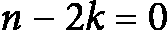
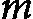
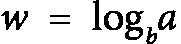
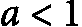
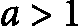
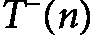
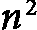
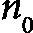
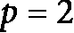
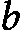

# 第七章：<st c="0">5</st>

# <st c="2">解决递归函数</st>

<st c="30">在上一章中，我们讨论了分析递归算法的挑战，特别是在估算其计算复杂度时。</st> <st c="178">在本章中，我们将探索三种解决递归函数的主要方法：代入法、主定理以及使用</st> <st c="339">递归树的可视化技术。</st>

<st c="355">代入法通过构造严谨的证明来解决递归函数。</st> <st c="449">该方法虽然有时较为复杂，但具有很高的通用性，能够处理多种类型的递归函数。</st> <st c="555">在代入法中，我们使用了多种技术，包括数学归纳法，来验证</st> <st c="659">我们的解法。</st>

<st c="673">主定理，也称为主方法，为确定递归算法的复杂度提供了一种系统化的方式，依据递归函数的参数。</st> <st c="865">该定理提供了一套简明的规则，成为分析许多常见</st> <st c="969">递归函数的强大工具。</st>

<st c="990">最后，递归树通过将递归分解为树状结构，帮助可视化问题的复杂度。</st> <st c="1113">虽然递归树并未提供直接的证明，但它们提供了有价值的洞察和直观理解，可以引导我们找到</st> <st c="1252">正式的解决方案。</st>

<st c="1268">在本章中，我们将彻底审视每种方法的局限性，并展示一整套实际应用的综合示例。</st> <st c="1423">到最后，读者将更加深入地理解如何有效地使用</st> <st c="1531">这些技术解决递归函数。</st>

<st c="1548">我们将在</st> <st c="1589">本章中讨论以下主题：</st>

+   <st c="1602">代入法</st> <st c="1607">方法</st>

+   <st c="1626">递归树作为一种</st> <st c="1647">可视化技术</st>

+   <st c="1670">主定理</st> <st c="1675">方法</st>

+   <st c="1689">超越主定理——</st> <st c="1722">Akra-Bazzi 方法</st>

# <st c="1739">代入法</st>

<st c="1763">**<st c="1768">替换法</st>**<st c="1787">包括</st><st c="1800">一系列技术，包括归纳法，用于为递归函数提供证明。</st><st c="1890">通常情况下，我们需要在进行变量替换时富有创新性，将递归函数转化为我们已知解的形式。</st><st c="2044">这种方法的一个关键特征是其灵活性 - 解决同一递归可能有多种方法。</st><st c="2168">虽然它并非为所有问题提供统一解决方案，但替换法是一个强大的工具。</st><st c="2276">事实上，即使是主定理（在下一节中讨论）也是通过</st><st c="2357">这种方法证明的。</st>

<st c="2369">通过采用替换法，我们可以处理各种递归函数。</st><st c="2461">这个过程通常涉及假设一个解，将其代入原始递归，然后使用归纳法证明假设是正确的。</st><st c="2630">这种方法允许创造性和适应性，使其成为算法分析中宝贵的技术。</st><st c="2738">虽然替换法可能需要深思熟虑和机智，但它为处理复杂递归提供了一个稳健的框架。</st><st c="2876">这种方法的多功能性和强大性突显了它在算法设计</st><st c="2981">和分析中的重要性。</st>

<st c="2994">探索替代法的最好方式，也许是通过实践应用多个例子。</st> <st c="3107">通过处理各种递归函数，我们可以更好地理解这一方法中的细节和技巧。</st> <st c="3238">这种实践方式不仅能展示替代法的多样性和强大功能，还能证明它如何有效地应用于解决不同类型的问题。</st> <st c="3432">让我们通过一些例子来观察这种方法的实际应用，从而更深刻地理解它在算法分析中的价值。</st> <st c="3558">读者应注意，在本章以及本书的其他章节中，当我们提到</st> *<st c="3654">解决递归函数</st>*<st c="3683">时，我们指的是估算复杂度或增长速率。</st> <st c="3738">这通常涉及到确定</st>  <st c="3774"><st c="3775">或</st> <st c="3779"><st c="3785">，在少数</st> <st c="3799">情况下，</st> <st c="3806"><st c="3807">。</st></st></st></st>

## <st c="3808">迭代法或展开递归</st>

<st c="3855">在接下来的例子中，替代法通过使用迭代法应用，也称为</st> **<st c="3964">展开递归函数</st>**<st c="3997">。这一技术涉及逐步展开递归，揭示出一种模式，有助于推导出闭式解。</st> <st c="4004">通过将递归逐步代入原始递归，我们可以系统地识别项是如何发展的，并</st> <st c="4249">积累，进而更清楚地理解函数的增长行为。</st> <st c="4331">这种方法对于解决和简化复杂的</st> <st c="4402">递归函数尤其有用。</st>

**<st c="4423">示例 5.1</st>**

<st c="4435">求解以下减法递归函数：</st> <st c="4489"><st c="4505">.</st></st>

**<st c="4506">解答</st>**<st c="4515">：为了求解递归函数，我们可以使用迭代法找到模式，并推导出闭式解。</st> <st c="4637">我们从扩展递归步骤开始</st> <st c="4682">逐步进行：</st>

<st c="4760">...</st>

<st c="4763">将以下内容代入</st> <st c="4803">原始递归中：</st>

![<mml:math xmlns:mml="http://www.w3.org/1998/Math/MathML" xmlns:m="http://schemas.openxmlformats.org/officeDocument/2006/math" display="block"><mml:mi>T</mml:mi><mml:mfenced separators="|"><mml:mrow><mml:mi>n</mml:mi></mml:mrow></mml:mfenced><mml:mo>=</mml:mo><mml:mfenced open="[" close="]" separators="|"><mml:mrow><mml:mi>T</mml:mi><mml:mfenced separators="|"><mml:mrow><mml:mi>n</mml:mi><mml:mo>-</mml:mo><mml:mn>4</mml:mn></mml:mrow></mml:mfenced><mml:mo>+</mml:mo><mml:mfenced separators="|"><mml:mrow><mml:mi>n</mml:mi><mml:mo>-</mml:mo><mml:mn>2</mml:mn></mml:mrow></mml:mfenced></mml:mrow></mml:mfenced><mml:mo>+</mml:mo><mml:mi>n</mml:mi></mml:math>](img/532.png)

![<mml:math xmlns:mml="http://www.w3.org/1998/Math/MathML" xmlns:m="http://schemas.openxmlformats.org/officeDocument/2006/math" display="block"><mml:mi>T</mml:mi><mml:mfenced separators="|"><mml:mrow><mml:mi>n</mml:mi></mml:mrow></mml:mfenced><mml:mo>=</mml:mo><mml:mfenced open="[" close="]" separators="|"><mml:mrow><mml:mi>T</mml:mi><mml:mfenced separators="|"><mml:mrow><mml:mi>n</mml:mi><mml:mo>-</mml:mo><mml:mn>6</mml:mn></mml:mrow></mml:mfenced><mml:mo>+</mml:mo><mml:mfenced separators="|"><mml:mrow><mml:mi>n</mml:mi><mml:mo>-</mml:mo><mml:mn>4</mml:mn></mml:mrow></mml:mfenced></mml:mrow></mml:mfenced><mml:mo>+</mml:mo><mml:mfenced separators="|"><mml:mrow><mml:mi>n</mml:mi><mml:mo>-</mml:mo><mml:mn>2</mml:mn></mml:mrow></mml:mfenced><mml:mo>+</mml:mo><mml:mi>n</mml:mi></mml:math>](img/533.png)

<st c="4900">...</st>

<st c="4903">继续这个模式，我们得到</st> <st c="4936">如下结果：</st>

![<mml:math xmlns:mml="http://www.w3.org/1998/Math/MathML" xmlns:m="http://schemas.openxmlformats.org/officeDocument/2006/math" display="block"><mml:mi>T</mml:mi><mml:mfenced separators="|"><mml:mrow><mml:mi>n</mml:mi></mml:mrow></mml:mfenced><mml:mo>=</mml:mo><mml:mi>T</mml:mi><mml:mfenced separators="|"><mml:mrow><mml:mi>n</mml:mi><mml:mo>-</mml:mo><mml:mn>2</mml:mn><mml:mi>k</mml:mi></mml:mrow></mml:mfenced><mml:mo>+</mml:mo><mml:mfenced separators="|"><mml:mrow><mml:mi>n</mml:mi><mml:mo>+</mml:mo><mml:mfenced separators="|"><mml:mrow><mml:mi>n</mml:mi><mml:mo>-</mml:mo><mml:mn>2</mml:mn></mml:mrow></mml:mfenced><mml:mo>+</mml:mo><mml:mfenced separators="|"><mml:mrow><mml:mi>n</mml:mi><mml:mo>-</mml:mo><mml:mn>4</mml:mn></mml:mrow></mml:mfenced><mml:mo>+</mml:mo><mml:mo>⋯</mml:mo><mml:mo>+</mml:mo><mml:mfenced separators="|"><mml:mrow><mml:mi>n</mml:mi><mml:mo>-</mml:mo><mml:mn>2</mml:mn><mml:mfenced separators="|"><mml:mrow><mml:mi>k</mml:mi><mml:mo>-</mml:mo><mml:mn>1</mml:mn></mml:mrow></mml:mfenced></mml:mrow></mml:mfenced></mml:mrow></mml:mfenced></mml:math>](img/534.png)

<st c="4952">我们在</st>  <st c="4965"><st c="4966">到达基准情况时停止，我们假设基准情况是</st>  <st c="5009"><st c="5010">或</st> <st c="5014"><st c="5020">。为了简化，假设</st> <st c="5051"><st c="5052">。所以，模式变为</st> <st c="5078">如下：</st></st></st></st></st>

![<mml:math xmlns:mml="http://www.w3.org/1998/Math/MathML" xmlns:m="http://schemas.openxmlformats.org/officeDocument/2006/math" display="block"><mml:mi>T</mml:mi><mml:mfenced separators="|"><mml:mrow><mml:mi>n</mml:mi></mml:mrow></mml:mfenced><mml:mo>=</mml:mo><mml:mi>T</mml:mi><mml:mfenced separators="|"><mml:mrow><mml:mn>0</mml:mn></mml:mrow></mml:mfenced><mml:mo>+</mml:mo><mml:mrow><mml:munderover><mml:mo stretchy="false">∑</mml:mo><mml:mrow><mml:mi>i</mml:mi><mml:mo>=</mml:mo><mml:mn>0</mml:mn></mml:mrow><mml:mrow><mml:mi>k</mml:mi><mml:mo>-</mml:mo><mml:mn>1</mml:mn></mml:mrow></mml:munderover><mml:mrow><mml:mfenced separators="|"><mml:mrow><mml:mi>n</mml:mi><mml:mo>-</mml:mo><mml:mn>2</mml:mn><mml:mi>i</mml:mi></mml:mrow></mml:mfenced></mml:mrow></mml:mrow></mml:math>](img/539.png)

<st c="5094">由于</st> <st c="5100"><st c="5101">，我们得到</st> <st c="5111">如下：</st></st>

![<mml:math xmlns:mml="http://www.w3.org/1998/Math/MathML" xmlns:m="http://schemas.openxmlformats.org/officeDocument/2006/math" display="block"><mml:mi>T</mml:mi><mml:mfenced separators="|"><mml:mrow><mml:mi>n</mml:mi></mml:mrow></mml:mfenced><mml:mo>=</mml:mo><mml:mrow><mml:munderover><mml:mo stretchy="false">∑</mml:mo><mml:mrow><mml:mi>i</mml:mi><mml:mo>=</mml:mo><mml:mn>0</mml:mn></mml:mrow><mml:mrow><mml:mi>k</mml:mi><mml:mo>-</mml:mo><mml:mn>1</mml:mn></mml:mrow></mml:munderover><mml:mrow><mml:mfenced separators="|"><mml:mrow><mml:mi>n</mml:mi><mml:mo>-</mml:mo><mml:mn>2</mml:mn><mml:mi>i</mml:mi></mml:mrow></mml:mfenced></mml:mrow></mml:mrow></mml:math>](img/541.png)

<st c="5155">为了求和的项数，我们解方程</st> <st c="5204"><st c="5205">：</st> <st c="5207"><st c="5208">。</st></st></st>

<st c="5209">因此，和为</st> <st c="5232">如下：</st>

![<mml:math xmlns:mml="http://www.w3.org/1998/Math/MathML" xmlns:m="http://schemas.openxmlformats.org/officeDocument/2006/math" display="block"><mml:mi>T</mml:mi><mml:mfenced separators="|"><mml:mrow><mml:mi>n</mml:mi></mml:mrow></mml:mfenced><mml:mo>=</mml:mo><mml:mrow><mml:munderover><mml:mo stretchy="false">∑</mml:mo><mml:mrow><mml:mi>i</mml:mi><mml:mo>=</mml:mo><mml:mn>0</mml:mn></mml:mrow><mml:mrow><mml:mfenced separators="|"><mml:mrow><mml:mi>n</mml:mi><mml:mo>/</mml:mo><mml:mn>2</mml:mn></mml:mrow></mml:mfenced><mml:mo>-</mml:mo><mml:mn>1</mml:mn></mml:mrow></mml:munderover><mml:mrow><mml:mfenced separators="|"><mml:mrow><mml:mi>n</mml:mi><mml:mo>-</mml:mo><mml:mn>2</mml:mn><mml:mi>i</mml:mi></mml:mrow></mml:mfenced></mml:mrow></mml:mrow></mml:math>](img/544.png)

<st c="5273">这是一个</st> <st c="5284">等差数列，其中第一项</st>  <st c="5323"><st c="5324">和最后一项</st> <st c="5343"><st c="5344">。项数</st> <st c="5366">是</st> <st c="5369"><st c="5370">。</st></st></st></st>

<st c="5371">一个等差数列的和由以下公式给出：</st> <st c="5416">如下所示：</st>

所以，以下是<st c="5480">情况：</st><st c="5501">所示：</st>

![<mml:math xmlns:mml="http://www.w3.org/1998/Math/MathML" xmlns:m="http://schemas.openxmlformats.org/officeDocument/2006/math" display="block"><mml:mi>T</mml:mi><mml:mfenced separators="|"><mml:mrow><mml:mi>n</mml:mi></mml:mrow></mml:mfenced><mml:mo>=</mml:mo><mml:mfrac><mml:mrow><mml:mi>n</mml:mi><mml:mo>/</mml:mo><mml:mn>2</mml:mn></mml:mrow><mml:mrow><mml:mn>2</mml:mn></mml:mrow></mml:mfrac><mml:mo>×</mml:mo><mml:mfenced separators="|"><mml:mrow><mml:mi>n</mml:mi><mml:mo>+</mml:mo><mml:mn>2</mml:mn></mml:mrow></mml:mfenced></mml:math>](img/549.png)

因此，递推函数的闭式解为<st c="5528">如下：</st><st c="5595">所示：</st>

这为我们提供了<st c="5608">渐近复杂度</st><st c="5634">的分析</st><st c="5655"><st c="5657">。</st></st>

在前面的例子中，我们演示了如何使用<st c="5658">替代法证明一个递减递推函数。</st><st c="5757">替代法。</st>

**例 5.2**

解以下递减递推函数：！<mml:math xmlns:mml="http://www.w3.org/1998/Math/MathML" xmlns:m="http://schemas.openxmlformats.org/officeDocument/2006/math"><mml:mi>T</mml:mi><mml:mfenced separators="|"><mml:mrow><mml:mi>n</mml:mi></mml:mrow></mml:mfenced><mml:mo>=</mml:mo><mml:mi>T</mml:mi><mml:mfenced separators="|"><mml:mrow><mml:mi>n</mml:mi><mml:mo>-</mml:mo><mml:mn>2</mml:mn></mml:mrow></mml:mfenced><mml:mo>+</mml:mo><mml:msup><mml:mrow><mml:mi>n</mml:mi></mml:mrow><mml:mrow><mml:mn>2</mml:mn></mml:mrow></mml:msup></mml:math><st c="5843"><st c="5863">。</st></st>

**<st c="5864">解法</st>**<st c="5873">：这个递归函数描述了一个算法，其中大小为</st>  <st c="5950"><st c="5999">的问题被减少到大小为</st> <st c="6034"><st c="6035">的子问题。递归调用外部的工作量是</st> <st c="6084"><st c="6085">。我们可以使用迭代或展开法通过替换法来解决这个递归。</st></st></st></st>

<st c="6190">让我们展开这个递归</st> <st c="6221">几次：</st>

![<mml:math xmlns:mml="http://www.w3.org/1998/Math/MathML" xmlns:m="http://schemas.openxmlformats.org/officeDocument/2006/math" display="block"><mml:mi>T</mml:mi><mml:mfenced separators="|"><mml:mrow><mml:mi>n</mml:mi></mml:mrow></mml:mfenced><mml:mo>=</mml:mo><mml:mi>T</mml:mi><mml:mfenced separators="|"><mml:mrow><mml:mi>n</mml:mi><mml:mo>-</mml:mo><mml:mn>2</mml:mn></mml:mrow></mml:mfenced><mml:mo>+</mml:mo><mml:msup><mml:mrow><mml:mi>n</mml:mi></mml:mrow><mml:mrow><mml:mn>2</mml:mn></mml:mrow></mml:msup></mml:math>](img/552.png)

![<mml:math xmlns:mml="http://www.w3.org/1998/Math/MathML" xmlns:m="http://schemas.openxmlformats.org/officeDocument/2006/math" display="block"><mml:mi>T</mml:mi><mml:mfenced separators="|"><mml:mrow><mml:mi>n</mml:mi></mml:mrow></mml:mfenced><mml:mo>=</mml:mo><mml:mi>T</mml:mi><mml:mfenced separators="|"><mml:mrow><mml:mi>n</mml:mi><mml:mo>-</mml:mo><mml:mn>4</mml:mn></mml:mrow></mml:mfenced><mml:mo>+</mml:mo><mml:msup><mml:mrow><mml:mfenced separators="|"><mml:mrow><mml:mi>n</mml:mi><mml:mo>-</mml:mo><mml:mn>2</mml:mn></mml:mrow></mml:mfenced></mml:mrow><mml:mrow><mml:mn>2</mml:mn></mml:mrow></mml:msup><mml:mo>+</mml:mo><mml:msup><mml:mrow><mml:mi>n</mml:mi></mml:mrow><mml:mrow><mml:mn>2</mml:mn></mml:mrow></mml:msup></mml:math>](img/557.png)

![<mml:math xmlns:mml="http://www.w3.org/1998/Math/MathML" xmlns:m="http://schemas.openxmlformats.org/officeDocument/2006/math" display="block"><mml:mi>T</mml:mi><mml:mfenced separators="|"><mml:mrow><mml:mi>n</mml:mi></mml:mrow></mml:mfenced><mml:mo>=</mml:mo><mml:mi>T</mml:mi><mml:mfenced separators="|"><mml:mrow><mml:mi>n</mml:mi><mml:mo>-</mml:mo><mml:mn>6</mml:mn></mml:mrow></mml:mfenced><mml:mo>+</mml:mo><mml:msup><mml:mrow><mml:mfenced separators="|"><mml:mrow><mml:mi>n</mml:mi><mml:mo>-</mml:mo><mml:mn>4</mml:mn></mml:mrow></mml:mfenced></mml:mrow><mml:mrow><mml:mn>2</mml:mn></mml:mrow></mml:msup><mml:mo>+</mml:mo><mml:msup><mml:mrow><mml:mfenced separators="|"><mml:mrow><mml:mi>n</mml:mi><mml:mo>-</mml:mo><mml:mn>2</mml:mn></mml:mrow></mml:mfenced></mml:mrow><mml:mrow><mml:mn>2</mml:mn></mml:mrow></mml:msup><mml:mo>+</mml:mo><mml:msup><mml:mrow><mml:mi>n</mml:mi></mml:mrow><mml:mrow><mml:mn>2</mml:mn></mml:mrow></mml:msup></mml:math>](img/558.png)

<st c="6288">...</st>

<st c="6291">如果我们继续</st> <st c="6306">这个模式，我们最终会得到基本情况</st>  <st c="6355"><st c="6356">或</st>  <st c="6360"><st c="6361">(取决于基本情况是如何定义的)。</st> <st c="6407">请注意，我们得到一个</st> <st c="6432">平方和：</st></st></st>

![<math xmlns="http://www.w3.org/1998/Math/MathML" display="block"><mrow><mrow><mi>T</mi><mfenced open="(" close=")"><mi>n</mi></mfenced><mo>=</mo><mi>T</mi><mfenced open="(" close=")"><mrow><mi>b</mi><mi>a</mi><mi>s</mi><mi>e</mi><mi>c</mi><mi>a</mi><mi>s</mi><mi>e</mi></mrow></mfenced><mo>+</mo><msup><mn>1</mn><mn>2</mn></msup><mo>+</mo><msup><mn>2</mn><mn>2</mn></msup><mo>+</mo><mo>…</mo><mo>+</mo><msup><mfenced open="(" close=")"><mrow><mi>n</mi><mo>−</mo><mn>2</mn></mrow></mfenced><mn>2</mn></msup><mo>+</mo><msup><mi>n</mi><mn>2</mn></msup></mrow></mrow></math>](img/561.png)

<st c="6492">从 1 到</st>  <st c="6521"><st c="6570">的平方和是一个</st> <st c="6575">著名的公式：</st></st>

<st c="6638">因此，以下是</st> <st c="6666">情况：</st>

![<math xmlns="http://www.w3.org/1998/Math/MathML" display="block"><mrow><mrow><mi>T</mi><mfenced open="(" close=")"><mi>n</mi></mfenced><mo>=</mo><mi>T</mi><mfenced open="(" close=")"><mrow><mi>b</mi><mi>a</mi><mi>s</mi><mi>e</mi><mi>c</mi><mi>a</mi><mi>s</mi><mi>e</mi></mrow></mfenced><mo>+</mo><mfrac><mrow><mi>n</mi><mfenced open="(" close=")"><mrow><mi>n</mi><mo>+</mo><mn>1</mn></mrow></mfenced><mfenced open="(" close=")"><mrow><mn>2</mn><mi>n</mi><mo>+</mo><mn>1</mn></mrow></mfenced></mrow><mn>6</mn></mfrac></mrow></mrow></math>](img/564.png)

<st c="6712">精确解依赖于</st> <st c="6755"><st c="6769">，它是常数时间（</st><st c="6798"><st c="6800">）。</st> <st c="6803">然后，从渐近意义上讲，我们可以说</st> <st c="6836">如下：</st></st></st>

<st c="6864">在这个例子中，为了实现替代方法，我们对递归进行迭代或展开，以识别增长模式。</st> <st c="6986">递归函数</st> ![<mml:math xmlns:mml="http://www.w3.org/1998/Math/MathML" xmlns:m="http://schemas.openxmlformats.org/officeDocument/2006/math"><mml:mi>T</mml:mi><mml:mfenced separators="|"><mml:mrow><mml:mi>n</mml:mi></mml:mrow></mml:mfenced><mml:mo>=</mml:mo><mml:mi>T</mml:mi><mml:mfenced separators="|"><mml:mrow><mml:mi>n</mml:mi><mml:mo>-</mml:mo><mml:mn>2</mml:mn></mml:mrow></mml:mfenced><mml:mo>+</mml:mo><mml:msup><mml:mrow><mml:mi>n</mml:mi></mml:mrow><mml:mrow><mml:mn>2</mml:mn></mml:mrow></mml:msup></mml:math>](img/552.png) <st c="7010"><st c="7030">的时间复杂度为</st> <st c="7055"><st c="7062">。这表明算法的运行时间随着输入规模的增加而立方增长。</st>

**<st c="7144">示例 5.3</st>**

<st c="7156">解决以下减法递归</st> <st c="7200">函数：</st> <st c="7210"><st c="7227">。</st></st>

**<st c="7228">解答</st>**<st c="7237">：我们可以通过展开递归并找到</st> <st c="7296">一个模式来解决它。</st>

<st c="7306">让我们解释递归函数。</st> <st c="7346">这个递归函数涉及子问题规模的对数递减。</st> <st c="7427">递归函数</st>  <st c="7451"><st c="7469">描述了一个算法，其中以下内容为</st> <st c="7515">情况：</st></st>

+   <st c="7524">问题的规模</st>  <st c="7545"><st c="7594">被缩减为一个子问题，规模为</st> <st c="7624">大小为</st> </st>

+   <st c="7636">递归调用外的工作</st> <st c="7680">是</st> 

<st c="7732">让我们通过展开递归来使用迭代方法，以理解</st> <st c="7822">该函数的行为：</st>

![<mml:math xmlns:mml="http://www.w3.org/1998/Math/MathML" xmlns:m="http://schemas.openxmlformats.org/officeDocument/2006/math" display="block"><mml:mi>T</mml:mi><mml:mfenced separators="|"><mml:mrow><mml:mi>n</mml:mi></mml:mrow></mml:mfenced><mml:mo>=</mml:mo><mml:mi>T</mml:mi><mml:mfenced separators="|"><mml:mrow><mml:mi>l</mml:mi><mml:mi>o</mml:mi><mml:mi>g</mml:mi><mml:mi>l</mml:mi><mml:mi>o</mml:mi><mml:mi>g</mml:mi><mml:mi>l</mml:mi><mml:mi>o</mml:mi><mml:mi>g</mml:mi><mml:mi>n</mml:mi></mml:mrow></mml:mfenced><mml:mo>+</mml:mo><mml:mi>l</mml:mi><mml:mi>o</mml:mi><mml:mi>g</mml:mi><mml:mi>l</mml:mi><mml:mi>o</mml:mi><mml:mi>g</mml:mi><mml:mi>n</mml:mi><mml:mo>+</mml:mo><mml:mi>l</mml:mi><mml:mi>o</mml:mi><mml:mi>g</mml:mi><mml:mi>n</mml:mi><mml:mo>+</mml:mo><mml:mi>n</mml:mi></mml:math>](img/577.png)

<st c="7881">...</st>

<st c="7884">注意，每次</st> <st c="7900">迭代都会将对数函数应用于</st> <st c="7960"><st c="7964">的参数。达到基准情况（例如</st> <st c="8028"><st c="8029">）之前的迭代次数大约是我们可以对</st>  <st c="8091"><st c="8140">进行对数运算的次数。</st> <st c="8170">这个次数大约是</st> <st c="8192"><st c="8193">(迭代对数)。</st></st></st></st></st>

<st c="8218">所有迭代中的总工作量大约是</st> <st c="8274">如下所示：</st>

![<math xmlns="http://www.w3.org/1998/Math/MathML" display="block"><mrow><mrow><mi>n</mi><mo>+</mo><mi>l</mi><mi>o</mi><mi>g</mi><mi>n</mi><mo>+</mo><mi>l</mi><mi>o</mi><mi>g</mi><mi>l</mi><mi>o</mi><mi>g</mi><mi>n</mi><mo>+</mo><mi>l</mi><mi>o</mi><mi>g</mi><mi>l</mi><mi>o</mi><mi>g</mi><mi>l</mi><mi>o</mi><mi>g</mi><mi>n</mi><mo>+</mo><mo>…</mo><mfenced open="(" close=")"><mrow><msup><mrow><mi>l</mi><mi>o</mi><mi>g</mi></mrow><mi mathvariant="normal">*</mi></msup><mi>n</mi><mi>t</mi><mi>e</mi><mi>r</mi><mi>m</mi><mi>s</mi></mrow></mfenced></mrow></mrow></math>](img/582.png)

<st c="8340">前述和式中的主导项是</st> <st c="8382"><st c="8383">。由于重复应用对数运算，后续每个项的增长速度远慢于前一个项。</st> <st c="8496">因此，我们可以说</st> <st c="8518">如下所示：</st></st>

<st c="8534">在前面的例子中，算法的运行时间主要由递归调用之外的工作决定（</st><st c="8652"><st c="8654">）。</st> <st c="8657">递归调用对总体运行时间的贡献不大，因为每次递归时问题规模会非常快速地减少（对数级别）。</st> <st c="8819">迭代对数（</st><st c="8843"><st c="8850">) 是一个增长非常缓慢的函数。</st> <st c="8885">在所有实际应用中，它可以视为常数。</st> <st c="8946">这就是为什么我们可以说时间复杂度是</st>  <st c="8997"><st c="8998">尽管在</st>  <st c="9021"><st c="9027">求和中有</st> <st c="9036">项。</st></st></st></st></st>

## <st c="9050">猜测和归纳法</st>

*<st c="9082">示例 5.3</st>* <st c="9094">可以通过猜测和归纳法求解。</st> <st c="9102">我们通过猜测并使用替代法解决</st>  <st c="9154"><st c="9171">假设</st>  <st c="9218"><st c="9219">并通过归纳法证明它。</st> <st c="9249">在</st> *<st c="9252">示例 5.4</st>*<st c="9263">中，我们展示了如何使用猜测和</st> <st c="9338">归纳法求解递归函数。</st></st></st>

**<st c="9357">示例 5.4</st>**

<st c="9369">求解</st>  <st c="9376"><st c="9394">通过猜测</st> <st c="9406"><st c="9407">。</st></st></st>

我们通过猜测<st c="9408">来解决</st>  <st c="9418"><st c="9435">使用替代法，假设</st>  <st c="9482"><st c="9483">然后通过归纳法证明它</st> <st c="9504">来完成。</st></st></st>

<st c="9517">这是</st> <st c="9530">逐步解决方案：</st>

1.  **<st c="9552">猜测</st>** **<st c="9559">形式</st>**<st c="9567">:</st>

    <st c="9569">我们假设</st> <st c="9583"><st c="9584">。具体地，假设</st>  <st c="9613"><st c="9614">对于某个</st> <st c="9624">常数</st> <st c="9633"><st c="9635">。</st></st></st></st>

1.  **<st c="9636">基础情况</st>**<st c="9646">:</st>

    <st c="9648">我们需要建立一个基例。</st> <st c="9682">对于较小的</st>  <st c="9702"><st c="9703">(例如，</st> <st c="9711"><st c="9712">)，递推函数会简化。</st> <st c="9751">假设</st>  <st c="9758"><st c="9759">是一个常数</st> <st c="9774"><st c="9775">。</st> 由于我们关心的是渐进行为，我们专注于较大的</st> <st c="9852">值</st> <st c="9855"><st c="9904">。</st></st></st></st></st></st>

1.  **<st c="9905">归纳假设</st>**<st c="9926">：</st>

    <st c="9928">假设</st>  <st c="9940"><st c="9941">对于所有</st> <st c="9956"><st c="9957">成立。</st></st> 我们需要证明</st>  <st c="9980"><st c="9981">也成立。</st></st></st></st>

1.  **<st c="9992">归纳步骤</st>**<st c="10007">：</st>

    <st c="10009">使用递推函数，我们</st> <st c="10043">得出</st> <st c="10048"><st c="10065">。</st></st>

    根据归纳假设，。将其代入递归函数中，我们得到。

    对于我们的假设，我们需要。

1.  **简化**不等式：

    为了满足这个不等式，我们需要。

    随着 增大， 接近。因此，存在一个充分大的，使得：

1.  **选择** **常数**：

    我们可以选择 使得前述条件在充分大的下成立。例如，对于，有：

<st c="10552">这个</st> <st c="10558">不等式在足够大的</st> <st c="10598"><st c="10599">时成立。因此，我们的假设</st>  <st c="10632"><st c="10633">是有效的。</st> <st c="10644">因此，我们已经证明了该递归的解是</st> <st c="10702"><st c="10735">。</st></st></st></st>

<st c="10736">通过这种猜测和归纳的方法，我们确认了最初的猜测是正确的，并且该递归的复杂度是线性的</st> <st c="10894">关于</st> <st c="10897"><st c="10946">。</st></st>

<st c="10947">猜测与归纳法中的猜测步骤是求解递归函数的关键部分。它涉及根据递归函数的结构对解的形式做出有根据的假设。</st> <st c="11178">以下是猜测步骤的</st> <st c="11210">常规操作：</st>

+   **<st c="11225">理解递归函数</st>**<st c="11263">：我们首先仔细检查递归函数。</st> <st c="11321">我们查看其中的各个组成部分，例如在每次递归调用中问题规模的变化以及非递归的成本函数</st> <st c="11444"><st c="11450">。然后，我们将递归函数与熟悉的模式进行比较，比如常见算法中的模式（例如，归并排序或</st> <st c="11605">二分查找）</st></st>

+   **<st c="11620">分析增长率</st>**<st c="11646">：我们考虑递归函数中的项，以推测它们如何贡献于整体复杂度。</st> <st c="11760">例如，如果递归涉及如下项</st>  <st c="11815"><st c="11816">或</st> <st c="11820"><st c="11821">，我们可能会猜测解中包含一个对数项，因为每一步都将问题规模减少一个倍数。</st> <st c="11932">如果递归包括一个加法线性项，例如</st> <st c="11992"><st c="12041">，这表明解可能涉及线性或非线性的</st> <st c="12107">增长</st> <st c="12114"><st c="12120">。</st></st></st></st></st>

+   **<st c="12121">利用经验和模式</st>**<st c="12156">：我们使用对常见递推函数及其解的了解。</st> <st c="12232">例如，如果递推式看起来像</st> ![<mml:math xmlns:mml="http://www.w3.org/1998/Math/MathML" xmlns:m="http://schemas.openxmlformats.org/officeDocument/2006/math"><mml:mi>T</mml:mi><mml:mfenced separators="|"><mml:mrow><mml:mi>n</mml:mi></mml:mrow></mml:mfenced><mml:mo>=</mml:mo><mml:mi> </mml:mi><mml:mn>2</mml:mn><mml:mi>T</mml:mi><mml:mfenced separators="|"><mml:mrow><mml:mfrac><mml:mrow><mml:mi>n</mml:mi></mml:mrow><mml:mrow><mml:mn>2</mml:mn></mml:mrow></mml:mfrac></mml:mrow></mml:mfenced><mml:mo>+</mml:mo><mml:mi> </mml:mi><mml:mi>n</mml:mi></mml:math>](img/630.png)<st c="12274"><st c="12287">，我们可能猜测</st> ![<mml:math xmlns:mml="http://www.w3.org/1998/Math/MathML" xmlns:m="http://schemas.openxmlformats.org/officeDocument/2006/math"><mml:mi>T</mml:mi><mml:mfenced separators="|"><mml:mrow><mml:mi>n</mml:mi></mml:mrow></mml:mfenced><mml:mo>=</mml:mo><mml:mi> </mml:mi><mml:mi>O</mml:mi><mml:mfenced separators="|"><mml:mrow><mml:mi>n</mml:mi><mml:mrow><mml:mrow><mml:mi mathvariant="normal">log</mml:mi></mml:mrow><mml:mo>⁡</mml:mo><mml:mrow><mml:mi>n</mml:mi></mml:mrow></mml:mrow></mml:mrow></mml:mfenced></mml:math>](img/631.png) <st c="12304"><st c="12320">，因为这个形式对于分治算法来说是典型的。</st> <st c="12384">对于递推式</st> <st c="12403"><st c="12404">，我们可能猜测</st>  <st c="12421"><st c="12422">，因为每一步都会将问题规模减少 1，且具有</st> <st c="12480">常数成本。</st></st></st></st></st>

+   **<st c="12494">做出有根据的猜测</st>**<st c="12519">：基于我们的分析，我们假设一个可能的形式为</st> <st c="12581"><st c="12582">。这可能是</st> ![<mml:math xmlns:mml="http://www.w3.org/1998/Math/MathML" xmlns:m="http://schemas.openxmlformats.org/officeDocument/2006/math"><mml:mi>T</mml:mi><mml:mfenced separators="|"><mml:mrow><mml:mi>n</mml:mi></mml:r></mml:mfenced><mml:mo>=</mml:mo><mml:mi> </mml:mi><mml:mi>O</mml:mi><mml:mfenced separators="|"><mml:mrow><mml:msup><mml:mrow><mml:mi>n</mml:mi></mml:mrow><mml:mrow><mml:mn>2</mml:mn></mml:mrow></mml:msup></mml:mrow></mml:mfenced>+   **<st c="12827">细化猜测</st>**<st c="12846">：有时，在通过归纳法验证初步猜测后，我们可能需要对猜测进行细化。</st> <st c="12949">例如，如果我们的猜测</st>  <st c="12975"><st c="12976">未满足归纳步骤，我们可能需要考虑一个更高阶的项，如</st> <st c="13068"><st c="13069">。</st></st></st>

<st c="13070">通过遵循</st> <st c="13084">这些步骤，我们系统地得出了一个合理的解决方案，可以通过严格的验证。</st> <st c="13180">猜测步骤结合了直觉、经验和分析，提出一个解决方案，然后你可以通过</st> <st c="13291">归纳法进行验证。</st>

## <st c="13309">变量变换方法</st>

<st c="13334">存在</st> <st c="13345">一些不规则的递归函数，传统方法，如</st> *<st c="13429">主定理</st>**<st c="13442">定理</st>* <st c="13448">部分，甚至</st> *<st c="13469">递归树作为可视化技术</st>* <st c="13512">部分，无法解决。</st> <st c="13543">在这些情况下，替代法提供了一种替代解决方案，还有一些先进的、广义的方法，比如</st> <st c="13663">Akra-Bazzi</st> **<st c="13668">方法</st>** <st c="13685">(见</st> *<st c="13695">超越主定理——Akra-Bazzi</st>* *<st c="13738">方法</st>* <st c="13744">部分)。</st>

<st c="13754">替代法</st> **<st c="13759">方法</st>** <st c="13778">涉及通过变量变换将原始递归转化为更易处理的形式。</st> <st c="13878">这种方法可以揭示模式并简化分析，使得找到闭式解变得更加容易。</st> <st c="13988">通过仔细选择新变量，我们可以将复杂的递归函数转换为更直接</st> <st c="14110">易于求解的形式。</st>

<st c="14119">在下一个示例中，我们演示了如何使用变量替换方法有效地解决不规则的递推函数。</st> <st c="14273">这个例子将展示替换法在处理其他方法无法应对的复杂递推函数时的威力与灵活性。</st>

**<st c="14433">例 5.5</st>**

<st c="14445">求解</st> <st c="14452"><st c="14473">。</st></st>

<st c="14474">在前一章中，我们将递推函数分为两类：减法（递减）递推函数和分治法（递分）递推函数。</st> <st c="14634">虽然函数</st>  <st c="14653"><st c="14673">可以被视为分治递推函数的一个子类，但它更准确地属于</st> **<st c="14794">替换法</st>** **<st c="14807">递推函数</st>**<st c="14827">的一类。</st>

<st c="14828">为了解决这个递推函数，我们可以使用变量替换的方法来简化递推，从而更容易进行分析。</st> <st c="14943">这将使分析变得更加简便。</st>

<st c="14954">令</st> <st c="14959"><st c="14960">。</st></st>

<st c="14961">然后，</st> <st c="14968"><st c="14975">。</st></st>

<st c="14976">将递归关系重新表达为</st> <st c="15014"><st c="15015">，我们得到</st> <st c="15024">以下结果：</st></st>

![<mml:math xmlns:mml="http://www.w3.org/1998/Math/MathML" xmlns:m="http://schemas.openxmlformats.org/officeDocument/2006/math" display="block"><mml:mi>T</mml:mi><mml:mfenced separators="|"><mml:mrow><mml:msup><mml:mrow><mml:mn>2</mml:mn></mml:mrow><mml:mrow><mml:mi>m</mml:mi></mml:mrow></mml:msup></mml:mrow></mml:mfenced><mml:mo>=</mml:mo><mml:mn>2</mml:mn><mml:mi>T</mml:mi><mml:mfenced separators="|"><mml:mrow><mml:msup><mml:mrow><mml:mn>2</mml:mn></mml:mrow><mml:mrow><mml:mi>m</mml:mi><mml:mo>/</mml:mo><mml:mn>2</mml:mn></mml:mrow></mml:msup></mml:mrow></mml:mfenced><mml:mo>+</mml:mo><mml:mi>m</mml:mi></mml:math>](img/647.png)

<st c="15040">为了简化符号，设</st> <st c="15066"><st c="15067">。那么我们得到</st> <st c="15082">以下结果：</st></st>

<st c="15114">这是一个常见的递归函数形式，适用于像归并排序算法（参见</st> *<st c="15214">第六章</st>*<st c="15223">)，其递归关系为</st>  <st c="15252"><st c="15253">，其渐近界为</st> <st c="15282"><st c="15283">。因此，</st> <st c="15296"><st c="15297">。通过将</st>  <st c="15315"><st c="15316">替换为</st> <st c="15322"><st c="15323">，我们得到</st> ![<mml:math xmlns:mml="http://www.w3.org/1998/Math/MathML" xmlns:m="http://schemas.openxmlformats.org/officeDocument/2006/math"><mml:mi>T</mml:mi><mml:mfenced separators="|"><mml:mrow><mml:mi>n</mml:mi></mml:mrow></mml:mfenced><mml:mo>=</mml:mo><mml:mi mathvariant="normal">Θ</mml:mi><mml:mfenced separators="|"><mml:mrow><mml:mi>l</mml:mi><mml:mi>o</mml:mi><mml:mi>g</mml:mi><mml:mi>n</mml:mi><mml:mi>l</mml:mi><mml:mi>o</mml:mi><mml:mi>g</mml:mi><mml:mi>l</mml:mi><mml:mi>o</mml:mi><mml:mi>g</mml:mi><mml:mi>n</mml:mi></mml:mrow></mml:mfenced></mml:math>](img/655.png)<st c="15332"><st c="15354">。然而，为了彻底性，我们假设我们不知道这个结果，并详细求解。</st></st></st></st></st></st></st>

现在，我们解这个新的递推函数！<mml:math xmlns:mml="http://www.w3.org/1998/Math/MathML" xmlns:m="http://schemas.openxmlformats.org/officeDocument/2006/math"><mml:mi>S</mml:mi><mml:mo>(</mml:mo><mml:mi>m</mml:mi><mml:mo>)</mml:mo></mml:math>。让我们展开递推几步，找出其中的模式：

![<mml:math xmlns:mml="http://www.w3.org/1998/Math/MathML" xmlns:m="http://schemas.openxmlformats.org/officeDocument/2006/math" display="block"><mml:mi>S</mml:mi><mml:mfenced separators="|"><mml:mrow><mml:mi>m</mml:mi><mml:mo>/</mml:mo><mml:mn>2</mml:mn></mml:mrow></mml:mfenced><mml:mo>=</mml:mo><mml:mn>2</mml:mn><mml:mi>S</mml:mi><mml:mfenced separators="|"><mml:mrow><mml:mfrac><mml:mrow><mml:mi>m</mml:mi></mml:mrow><mml:mrow><mml:mn>4</mml:mn></mml:mrow></mml:mfrac></mml:mrow></mml:mfenced><mml:mo>+</mml:mo><mml:mfenced separators="|"><mml:mrow><mml:mfrac><mml:mrow><mml:mi>m</mml:mi></mml:mrow><mml:mrow><mml:mn>2</mml:mn></mml:mrow></mml:mfrac></mml:mrow></mml:mfenced></mml:math>](img/657.png)

替换为进入第一个方程：

![<mml:math xmlns:mml="http://www.w3.org/1998/Math/MathML" xmlns:m="http://schemas.openxmlformats.org/officeDocument/2006/math" display="block"><mml:mi>S</mml:mi><mml:mfenced separators="|"><mml:mrow><mml:mi>m</mml:mi></mml:mrow></mml:mfenced><mml:mo>=</mml:mo><mml:mn>2</mml:mn><mml:mfenced open="[" close="]" separators="|"><mml:mrow><mml:mn>2</mml:mn><mml:mi>S</mml:mi><mml:mfenced separators="|"><mml:mrow><mml:mfrac><mml:mrow><mml:mi>m</mml:mi></mml:mrow><mml:mrow><mml:mn>4</mml:mn></mml:mrow></mml:mfrac></mml:mrow></mml:mfenced><mml:mo>+</mml:mo><mml:mfenced separators="|"><mml:mrow><mml:mfrac><mml:mrow><mml:mi>m</mml:mi></mml:mrow><mml:mrow><mml:mn>2</mml:mn></mml:mrow></mml:mfrac></mml:mrow></mml:mfenced></mml:mrow></mml:mfenced><mml:mo>+</mml:mo><mml:mi>m</mml:mi></mml:math>](img/659.png)

![<mml:math xmlns:mml="http://www.w3.org/1998/Math/MathML" xmlns:m="http://schemas.openxmlformats.org/officeDocument/2006/math" display="block"><mml:mi>S</mml:mi><mml:mfenced separators="|"><mml:mrow><mml:mi>m</mml:mi></mml:mrow></mml:mfenced><mml:mo>=</mml:mo><mml:mn>4</mml:mn><mml:mi>S</mml:mi><mml:mfenced separators="|"><mml:mrow><mml:mfrac><mml:mrow><mml:mi>m</mml:mi></mml:mrow><mml:mrow><mml:mn>4</mml:mn></mml:mrow></mml:mfrac></mml:mrow></mml:mfenced><mml:mo>+</mml:mo><mml:mn>2</mml:mn><mml:mi>m</mml:mi></mml:math>](img/660.png)

再展开一步：

![<mml:math xmlns:mml="http://www.w3.org/1998/Math/MathML" xmlns:m="http://schemas.openxmlformats.org/officeDocument/2006/math" display="block"><mml:mi>S</mml:mi><mml:mfenced separators="|"><mml:mrow><mml:mfrac><mml:mrow><mml:mi>m</mml:mi></mml:mrow><mml:mrow><mml:mn>4</mml:mn></mml:mrow></mml:mfrac></mml:mrow></mml:mfenced><mml:mo>=</mml:mo><mml:mn>2</mml:mn><mml:mi>S</mml:mi><mml:mfenced separators="|"><mml:mrow><mml:mfrac><mml:mrow><mml:mi>m</mml:mi></mml:mrow><mml:mrow><mml:mn>8</mml:mn></mml:mrow></mml:mfrac></mml:mrow></mml:mfenced><mml:mo>+</mml:mo><mml:mfenced separators="|"><mml:mrow><mml:mfrac><mml:mrow><mml:mi>m</mml:mi></mml:mrow><mml:mrow><mml:mn>4</mml:mn></mml:mrow></mml:mfrac></mml:mrow></mml:mfenced></mml:math>](img/661.png)

<st c="15658">替换</st> 

![<mml:math xmlns:mml="http://www.w3.org/1998/Math/MathML" xmlns:m="http://schemas.openxmlformats.org/officeDocument/2006/math" display="block"><mml:mi>S</mml:mi><mml:mfenced separators="|"><mml:mrow><mml:mi>m</mml:mi></mml:mrow></mml:mfenced><mml:mo>=</mml:mo><mml:mn>4</mml:mn><mml:mfenced open="[" close="]" separators="|"><mml:mrow><mml:mn>2</mml:mn><mml:mi>S</mml:mi><mml:mfenced separators="|"><mml:mrow><mml:mfrac><mml:mrow><mml:mi>m</mml:mi></mml:mrow><mml:mrow><mml:mn>8</mml:mn></mml:mrow></mml:mfrac></mml:mrow></mml:mfenced><mml:mo>+</mml:mo><mml:mfenced separators="|"><mml:mrow><mml:mfrac><mml:mrow><mml:mi>m</mml:mi></mml:mrow><mml:mrow><mml:mn>4</mml:mn></mml:mrow></mml:mfrac></mml:mrow></mml:mfenced></mml:mrow></mml:mfenced><mml:mo>+</mml:mo><mml:mn>2</mml:mn><mml:mi>m</mml:mi></mml:math>](img/663.png)

![<mml:math xmlns:mml="http://www.w3.org/1998/Math/MathML" xmlns:m="http://schemas.openxmlformats.org/officeDocument/2006/math" display="block"><mml:mi>S</mml:mi><mml:mfenced separators="|"><mml:mrow><mml:mi>m</mml:mi></mml:mrow></mml:mfenced><mml:mo>=</mml:mo><mml:mn>8</mml:mn><mml:mi>S</mml:mi><mml:mfenced separators="|"><mml:mrow><mml:mfrac><mml:mrow><mml:mi>m</mml:mi></mml:mrow><mml:mrow><mml:mn>8</mml:mn></mml:mrow></mml:mfrac></mml:mrow></mml:mfenced><mml:mo>+</mml:mo><mml:mn>3</mml:mn><mml:mi>m</mml:mi></mml:math>](img/664.png)

通过展开这个模式，我们可以看到在每个层级中，**S**的系数 <st c="15765"><st c="15766">呈指数性下降，而</st>  <st c="15817"><st c="15818">的系数则呈线性增加。</st></st></st>

我们可以在经过 <st c="15875"><st c="15876">步后概括这个模式：</st></st>

![<mml:math xmlns:mml="http://www.w3.org/1998/Math/MathML" xmlns:m="http://schemas.openxmlformats.org/officeDocument/2006/math" display="block"><mml:mi>S</mml:mi><mml:mfenced separators="|"><mml:mrow><mml:mi>m</mml:mi></mml:mrow></mml:mfenced><mml:mo>=</mml:mo><mml:msup><mml:mrow><mml:mn>2</mml:mn></mml:mrow><mml:mrow><mml:mi>k</mml:mi></mml:mrow></mml:msup><mml:mi>S</mml:mi><mml:mfenced separators="|"><mml:mrow><mml:mfrac><mml:mrow><mml:mi>m</mml:mi></mml:mrow><mml:mrow><mml:msup><mml:mrow><mml:mn>2</mml:mn></mml:mrow><mml:mrow><mml:mi>k</mml:mi></mml:mrow></mml:msup></mml:mrow></mml:mfrac></mml:mrow></mml:mfenced><mml:mo>+</mml:mo><mml:mi>k</mml:mi><mml:mi>m</mml:mi></mml:math>](img/668.png)

当 <st c="15889"><st c="15890">变为 1 时，我们得到</st>  <st c="15910"><st c="15911">，这意味着</st> <st c="15925"><st c="15926">。</st> <st c="15928">代入</st></st></st></st>

<st c="15938"><st c="15940">：</st></st>

![<mml:math xmlns:mml="http://www.w3.org/1998/Math/MathML" xmlns:m="http://schemas.openxmlformats.org/officeDocument/2006/math" display="block"><mml:mi>S</mml:mi><mml:mfenced separators="|"><mml:mrow><mml:mi>m</mml:mi></mml:mrow></mml:mfenced><mml:mo>=</mml:mo><mml:msup><mml:mrow><mml:mn>2</mml:mn></mml:mrow><mml:mrow><mml:mi>l</mml:mi><mml:mi>o</mml:mi><mml:mi>g</mml:mi><mml:mi>m</mml:mi></mml:mrow></mml:msup><mml:mi>S</mml:mi><mml:mfenced separators="|"><mml:mrow><mml:mn>1</mml:mn></mml:mrow></mml:mfenced><mml:mo>+</mml:mo><mml:mfenced separators="|"><mml:mrow><mml:mi>l</mml:mi><mml:mi>o</mml:mi><mml:mi>g</mml:mi><mml:mi>m</mml:mi></mml:mrow></mml:mfenced><mml:mi>m</mml:mi></mml:math>](img/673.png)

<st c="15974">已知</st> ![<mml:math xmlns:mml="http://www.w3.org/1998/Math/MathML" xmlns:m="http://schemas.openxmlformats.org/officeDocument/2006/math"><mml:mi>S</mml:mi><mml:mfenced separators="|"><mml:mrow><mml:mn>1</mml:mn></mml:mrow></mml:mfenced><mml:mo>=</mml:mo><mml:mi>T</mml:mi><mml:mfenced separators="|"><mml:mrow><mml:msup><mml:mrow><mml:mn>2</mml:mn></mml:mrow><mml:mrow><mml:mn>0</mml:mn></mml:mrow></mml:msup></mml:mrow></mml:mfenced><mml:mo>=</mml:mo><mml:mi>T</mml:mi><mml:mfenced separators="|"><mml:mrow><mml:mn>1</mml:mn></mml:mrow></mml:mfenced></mml:math>](img/675.png)<st c="15985"><st c="15986">，为常数，我们表示为</st> <st c="16013">c</st> <st c="16016"><st c="16017">。</st></st></st>

<st c="16018">因此，我们得到</st> <st c="16033">如下结果：</st>

<st c="16050">代入</st> <st c="16061">返回</st> <st c="16066"><st c="16078">：</st></st>

![<mml:math xmlns:mml="http://www.w3.org/1998/Math/MathML" xmlns:m="http://schemas.openxmlformats.org/officeDocument/2006/math" display="block"><mml:mi>S</mml:mi><mml:mfenced separators="|"><mml:mrow><mml:mi>m</mml:mi></mml:mrow></mml:mfenced><mml:mo>=</mml:mo><mml:mi>T</mml:mi><mml:mfenced separators="|"><mml:mrow><mml:msup><mml:mrow><mml:mn>2</mml:mn></mml:mrow><mml:mrow><mml:mi>m</mml:mi></mml:mrow></mml:msup></mml:mrow></mml:mfenced><mml:mo>=</mml:mo><mml:mi>T</mml:mi><mml:mfenced separators="|"><mml:mrow><mml:mi>n</mml:mi></mml:mrow></mml:mfenced><mml:mo>=</mml:mo><mml:mi>l</mml:mi><mml:mi>o</mml:mi><mml:mi>g</mml:mi><mml:mi>n</mml:mi><mml:mfenced separators="|"><mml:mrow><mml:mi>c</mml:mi><mml:mo>+</mml:mo><mml:mi>l</mml:mi><mml:mi>o</mml:mi><mml:mi>g</mml:mi><mml:mi>l</mml:mi><mml:mi>o</mml:mi><mml:mi>g</mml:mi><mml:mi>n</mml:mi></mml:mrow></mml:mfenced></mml:math>](img/680.png)

<st c="16080">因此，递推函数的解</st>  <st c="16131"><st c="16152">为</st> <st c="16155">如下所示：</st></st>

<st c="16190">在这一部分，我们解释了一种强大的技术，通过假设一个解并通过数学归纳法证明其正确性来解决递推函数。</st> <st c="16362">该方法包括将猜测的解代回递推函数中，以验证它是否满足原方程。</st> <st c="16499">这种方法允许在处理各种递推形式时具有灵活性和创造性，特别是对于那些其他方法（如主定理或递归树）无法轻松处理的递推形式。</st> <st c="16710">通过反复精炼猜测并使用归纳法，替代方法提供了一种有结构的方式来推导闭式解，并理解</st> <st c="16885">递归算法的增长行为。</st>

# <st c="16906">递归树作为一种可视化技术</st>

<st c="16950">该</st> **<st c="16955">递归树方法</st>** <st c="16976">是一种强大的技术，用于解决和可视化递归函数，尤其是在分析分治算法时非常有效。</st> <st c="17131">它通过将递归过程可视化为一棵树来实现，每个节点代表一个子问题，而边表示递归调用。</st> <st c="17274">通过求和树中每一层的成本，我们可以确定该算法的整体复杂度。</st>

<st c="17379">这是递归树方法的逐步</st> <st c="17404">解释：</st>

1.  **<st c="17445">构建</st>** **<st c="17460">递归树</st>**<st c="17474">：</st>

    +   <st c="17476">首先写下原始的</st> <st c="17511">递归函数</st>

    +   <st c="17530">树中的每个节点代表一次对</st> <st c="17574">递归的调用</st>

    +   <st c="17588">树的根节点对应于原始的</st> <st c="17638">问题</st> 

    +   <st c="17647">一个节点的子节点表示由</st> <st c="17713">递归调用</st> <st c="17713">生成的子问题</st>

1.  **<st c="17728">识别</st>** **<st c="17738">成本</st>**<st c="17747">：</st>

    +   <st c="17749">确定每个节点的成本。</st> <st c="17782">此成本通常对应于该步骤中的非递归工作，通常表示为</st> <st c="17873">f(n)</st> <st c="17876"><st c="17879">。</st></st>

    +   <st c="17880">写下根节点的成本并将其传播到</st> <st c="17938">树中。</st>

1.  **<st c="17947">展开</st>** **<st c="17955">树</st>**<st c="17963">：</st>

    +   <st c="17965">通过根据</st> <st c="18070">递归函数</st> <st c="18070">将每个子问题拆解成其组成部分，继续展开树。</st>

    +   <st c="18089">此过程会持续进行，直到子问题达到</st> <st c="18158">递归的基本情况</st>

1.  **<st c="18171">计算每一层的总成本</st>** **<st c="18200">每一层</st>**<st c="18210">：</st>

    +   <st c="18212">求出</st> <st c="18219">每一层中所有节点的</st> <st c="18256">成本</st>

    +   <st c="18264">确定每一层的节点数量和每个节点的成本</st> <st c="18321">每个节点</st>

1.  **<st c="18329">求和各层的成本</st>** **<st c="18351">所有层级的成本</st>**<st c="18361">：</st>

    +   <st c="18363">将树中所有层的成本加起来，得到</st> <st c="18416">总成本</st>

    +   分析求和以确定整体<st c="18468">渐进复杂度</st>

递归树方法通过将递归问题分解为较小的子问题并以树形结构进行可视化，来分析其复杂度。<st c="18489">从根节点开始，方法包括绘制每一层递归，其中每个节点代表一个子问题，而边表示递归调用。</st> <st c="18648">在每一层，计算并汇总解决所有子问题的成本。</st> <st c="18829">通过展开树直到达到基准情况，并汇总所有层级的成本，可以确定算法的总复杂度。</st> <st c="18906">该方法提供了一种清晰且系统化的方式来理解成本的分布及递归算法的整体行为，通常能够识别出递归的渐进复杂度。</st> <st c="19058">让我们在</st> <st c="19272">下一个示例中进一步探索该方法。</st>

**示例 5.6**

求解  使用递归树方法。

这是<st c="19387">解决方案：</st>

1.  **构造<st c="19409">递归树</st>**<st c="19424">：</st>

    +   树的根是 

    +   这将分解为 4 个子问题，每个子问题的<st c="19510">大小</st> 

    ...

    第 0 层：

    <st c="19530">/ | | \</st>

    <st c="19538">第 1 级：</st> 

    <st c="19558">/ / / / | | | | \ \ \ \</st>

    <st c="19581">第 2 级：</st>  <st c="19591"><st c="19628">(16 个子问题)</st></st>

    <st c="19644">...</st>

1.  **<st c="19647">识别</st>** **<st c="19657">成本</st>**<st c="19666">：</st>

    +   <st c="19668">根节点（第 0 级）处的成本</st> <st c="19676">是</st> 

    +   <st c="19751">在第 1 级，每个 4 个子问题</st> <st c="19789"><st c="19790">的成本是</st> <st c="19801">!</st> </st>

    +   <st c="19805">在第 2 级，每个 16 个子问题</st> <st c="19844"><st c="19845">的成本是</st> <st c="19856">!</st> </st>

    <st c="19860">...</st>

1.  **<st c="19863">展开</st>** **<st c="19871">树</st>**<st c="19879">：</st>

    +   <st c="19881">继续展开，直到子问题达到基本情况（</st><st c="19943">例如，</st> <st c="19950"><st c="19951">)</st></st>

    +   <st c="19952">树的层数是</st>  <st c="19988"><st c="19989">因为每一层</st> <st c="20028">问题大小会减少一半</st></st>

1.  **<st c="20038">计算每一层的总成本</st>** **<st c="20067">每一层</st>**<st c="20077">：</st>

    +   **<st c="20079">第 0 层</st>**<st c="20086">: 成本 =</st> 

    +   **<st c="20145">第 1 层</st>**<st c="20152">: 成本 =</st> 

    +   **<st c="20172">第 2 层</st>**<st c="20179">: 成本 =</st> 

    +   **<st c="20196">一般层级</st>** ****<st c="20211">: 成本 =</st> ![<mml:math xmlns:mml="http://www.w3.org/1998/Math/MathML" xmlns:m="http://schemas.openxmlformats.org/officeDocument/2006/math"><mml:msup><mml:mrow><mml:mn>4</mml:mn></mml:mrow><mml:mrow><mml:mi>i</mml:mi></mml:mrow></mml:msup><mml:mo>⋅</mml:mo><mml:mfenced separators="|"><mml:mrow><mml:mfrac><mml:mrow><mml:mi>n</mml:mi></mml:mrow><mml:mrow><mml:msup><mml:mrow><mml:mn>2</mml:mn></mml:mrow><mml:mrow><mml:mi>i</mml:mi></mml:mrow></mml:msup></mml:mrow></mml:mfrac></mml:mrow></mml:mfenced><mml:mo>=</mml:mo><mml:msup><mml:mrow><mml:mn>2</mml:mn></mml:mrow><mml:mrow><mml:mi>i</mml:mi></mml:mrow></mml:msup><mml:mi>n</mml:mi></mml:math>](img/702.png)

1.  **<st c="20221">总计各层级的成本</st>** **<st c="20242">所有层级</st>**<st c="20252">：</st>

    +   <st c="20254">总成本</st>  <st c="20269"><st c="20270">是所有层级的成本之和：</st> <st c="20298">所有层级：</st>

        +   ![<mml:math xmlns:mml="http://www.w3.org/1998/Math/MathML" xmlns:m="http://schemas.openxmlformats.org/officeDocument/2006/math"><mml:mi>T</mml:mi><mml:mfenced separators="|"><mml:mrow><mml:mi>n</mml:mi></mml:mrow></mml:mfenced><mml:mo>=</mml:mo><mml:mi>n</mml:mi><mml:mo>+</mml:mo><mml:mn>2</mml:mn><mml:mi>n</mml:mi><mml:mo>+</mml:mo><mml:mn>4</mml:mn><mml:mi>n</mml:mi><mml:mo>+</mml:mo><mml:mn>8</mml:mn><mml:mi>n</mml:mi><mml:mo>+</mml:mo><mml:mo>…</mml:mo><mml:mo>+</mml:mo><mml:msup><mml:mrow><mml:mn>2</mml:mn></mml:mrow><mml:mrow><mml:mi>l</mml:mi><mml:mi>o</mml:mi><mml:mi>g</mml:mi><mml:mi>n</mml:mi></mml:mrow></mml:msup><mml:mi>n</mml:mi></mml:math>](img/704.png)</st>

    +   <st c="20342">这是一个等比数列，其首项为</st>  <st c="20389"><st c="20390">和公比为</st> <st c="20406">比例</st> <st c="20412"><st c="20413">：</st>

        +   </st></st>

    +   <st c="20415">在我们的例子中，</st> <st c="20428"><st c="20429">，</st> <st c="20431"><st c="20432">，</st> <st c="20434">并且</st> <st c="20438"><st c="20439">：</st>

        +   ![<mml:math xmlns:mml="http://www.w3.org/1998/Math/MathML" xmlns:m="http://schemas.openxmlformats.org/officeDocument/2006/math"><mml:mi>T</mml:mi><mml:mfenced separators="|"><mml:mrow><mml:mi>n</mml:mi></mml:mrow></mml:mfenced><mml:mo>=</mml:mo><mml:mi>n</mml:mi><mml:mfrac><mml:mrow><mml:msup><mml:mrow><mml:mn>2</mml:mn></mml:mrow><mml:mrow><mml:mfenced separators="|"><mml:mrow><mml:mi>l</mml:mi><mml:mi>o</mml:mi><mml:mi>g</mml:mi><mml:mi>n</mml:mi></mml:mrow></mml:mfenced><mml:mo>+</mml:mo><mml:mn>1</mml:mn></mml:mrow></mml:msup><mml:mo>-</mml:mo><mml:mn>1</mml:mn></mml:mrow><mml:mrow><mml:mn>2</mml:mn><mml:mo>-</mml:mo><mml:mn>1</mml:mn></mml:mrow></mml:mfrac><mml:mo>=</mml:mo><mml:mi>n</mml:mi><mml:mfenced separators="|"><mml:mrow><mml:mn>2</mml:mn><mml:mi>n</mml:mi><mml:mo>-</mml:mo><mml:mn>1</mml:mn></mml:mrow></mml:mfenced></mml:math>](img/711.png)</st></st></st>

    +   <st c="20441">简化后，我们得到以下结果：</st> 

    +   <st c="20494">渐近地，主导项是</st> <st c="20531"><st c="20535">，因此我们得到以下结果：</st> </st>

<st c="20564">递归树方法</st> <st c="20590">提供了递归算法如何将一个问题分解成子问题的清晰视觉表示。</st> <st c="20698">通过对树中每一层的成本求和，我们可以确定算法的总复杂度。</st> <st c="20802">这种方法特别有助于理解和解决复杂的递归函数，能够为</st> <st c="20950">分治算法</st> <st c="20980">提供洞察。</st>

# <st c="20980">主定理</st>

<st c="20999">在</st> <st c="21007">算法分析中，</st> **<st c="21035">主定理</st>** <st c="21049">在求解分治算法的递归方程中起着关键作用。</st> <st c="21129">主定理于 1980 年提出，现已成为估算各种递归函数复杂度的主流方法。</st> <st c="21256">主定理提供了一个简洁的框架，用于确定以下形式递归的渐近行为：</st>

![<mml:math xmlns:mml="http://www.w3.org/1998/Math/MathML" xmlns:m="http://schemas.openxmlformats.org/officeDocument/2006/math" display="block"><mml:mi>T</mml:mi><mml:mfenced separators="|"><mml:mrow><mml:mi>n</mml:mi></mml:mrow></mml:mfenced><mml:mo>=</mml:mo><mml:mi>a</mml:mi><mml:mi>T</mml:mi><mml:mfenced separators="|"><mml:mrow><mml:mfrac><mml:mrow><mml:mi>n</mml:mi></mml:mrow><mml:mrow><mml:mi>b</mml:mi></mml:mrow></mml:mfrac></mml:mrow></mml:mfenced><mml:mo>+</mml:mo><mml:mi>f</mml:mi><mml:mfenced separators="|"><mml:mrow><mml:mi>n</mml:mi></mml:mrow></mml:mfenced></mml:math>](img/715.png)

<st c="21410">这里，</st>  <st c="21416"><st c="21417">并且</st>  <st c="21422"><st c="21426">是常数，并且</st> *<st c="21445">f(n)</st>*<st c="21449">，驱动函数，是一个渐近正函数，由多项式函数界定。</st> <st c="21545">这意味着存在两个多项式函数</st>  <st c="21593"><st c="21594">和</st>  <st c="21599"><st c="21600">使得以下等式成立：</st> <st c="21628">情况如下：</st></st></st></st></st>

<st c="21639">主定理的重要性在于它能够简化许多常见算法（如归并排序、快速排序和二分查找等）的复杂度分析。</st> <st c="21823">通过基于</st>  <st c="21904"><st c="21907">和</st> <st c="21911"><st c="21912">之间的关系来对递归行为进行分类，主定理使得复杂度估计变得快速且准确，而无需详细的逐个分析。</st></st></st>

<st c="22035">虽然我们在这里没有提供主定理的证明，但读者可以参考本章末尾的文献，获取详细的证明和进一步的阅读资料。</st> <st c="22200">理解主定理及其应用对于任何学习算法设计与分析的人来说都是至关重要的，因为它为评估许多</st> <st c="22383">递归算法的效率奠定了基础。</st>

<st c="22404">让我们来探索主定理的关键概念，这些概念对于理解和描述这种方法的不同情况是必不可少的：</st>

+   **<st c="22547">临界指数（</st>********<st c="22569">）</st>**<st c="22570">：这个值，</st> <st c="22584"><st c="22585">，代表了一个阈值，用于比较驱动函数</st> <st c="22628">的增长速率</st>  <st c="22665"><st c="22668">与递归部分的</st> <st c="22698">递归函数的增长速率。</st></st></st>

+   **<st c="22718">分水岭函数（</st>********<st c="22741">）</st>**<st c="22742">：这个函数,</st> ![<mml:math xmlns:mml="http://www.w3.org/1998/Math/MathML" xmlns:m="http://schemas.openxmlformats.org/officeDocument/2006/math"><mml:msup><mml:mrow><mml:mi>n</mml:mi></mml:mrow><mml:mrow><mml:mi>w</mml:mi></mml:mrow></mml:msup><mml:mo>=</mml:mo><mml:msup><mml:mrow><mml:mi>n</mml:mi></mml:mrow><mml:mrow><mml:mrow><mml:mrow><mml:msub><mml:mrow><mml:mi mathvariant="normal">log</mml:mi></mml:mrow><mml:mrow><mml:mi>b</mml:mi></mml:mrow></mml:msub></mml:mrow><mml:mo>⁡</mml:mo><mml:mrow><mml:mi>a</mml:mi></mml:mrow></mml:mrow></mml:mrow></mml:msup></mml:math>](img/727.png)<st c="22759"><st c="22770">，作为</st> *<st c="22784">分界线</st>* <st c="22797">区分了</st> <st c="22818">主定理的不同情况。</st> <st c="22839">它告诉我们递归的增长速率，假如驱动函数</st>  <st c="22908"><st c="22913">被忽略时。</st></st></st>

## <st c="22929">案例 1 – 递归调用的主导作用或叶子重的递归树</st>

<st c="22997">在</st> *<st c="23001">案例 1</st>*<st c="23007">中，</st> <st c="23013">递归调用之外的工作量（驱动函数</st> <st c="23073"><st c="23078">）被递归调用中的工作量所主导。</st> <st c="23138">驱动函数</st>  <st c="23159"><st c="23164">以多项式的方式增长，但增长速度比分水岭函数</st> <st c="23232"><st c="23233">）慢。</st> <st c="23258">更正式的表达是：</st></st></st></st>

<st c="23269"><st c="23271">其中</st> </st>

<st c="23278">或者，等效地，这是</st> <st c="23304">如下所示：</st>

 <st c="23315"><st c="23328">对于某些</st> </st>

<st c="23338">这意味着</st>  <st c="23354"><st c="23358">的上界是一个多项式，其指数小于</st> <st c="23420">分水岭。</st></st>

<st c="23434">为什么</st> *<st c="23442">情况 1</st>* <st c="23448">是叶节点重的？</st> <st c="23461">为了</st> <st c="23463">理解为什么</st> *<st c="23479">情况 1</st>* <st c="23485">被称为</st> *<st c="23496">叶节点重</st>*<st c="23506">，请想象一个递归树来表示算法的执行过程。</st> <st c="23573">每个节点代表一次递归调用，其子节点代表子问题。</st> <st c="23650">在这种情况下，树中每一层所做的工作（由</st> <st c="23720"><st c="23725">）与递归调用的次数相比相对较小。</st> <st c="23790">因此，大部分的工作都在递归树的叶节点上完成，因此称为</st> <st c="23883">术语</st> **<st c="23888">叶节点重</st>**<st c="23898">。</st></st>

<st c="23899">当递归调用占主导时，算法的整体时间复杂度由递归树中的叶子节点数量决定。</st> <st c="24041">这个数量随着树的深度呈指数增长。</st> <st c="24101">由于树的深度与输入大小的对数成正比（</st><st c="24163"><st c="24170">)，因此，整体时间复杂度变为：</st> <st c="24209">以下形式：</st></st>

![<mml:math xmlns:mml="http://www.w3.org/1998/Math/MathML" xmlns:m="http://schemas.openxmlformats.org/officeDocument/2006/math" display="block"><mml:mi>T</mml:mi><mml:mfenced separators="|"><mml:mrow><mml:mi>n</mml:mi></mml:mrow></mml:mfenced><mml:mo>=</mml:mo><mml:mi>Θ</mml:mi><mml:mfenced separators="|"><mml:mrow><mml:msup><mml:mrow><mml:mi>n</mml:mi></mml:mrow><mml:mrow><mml:mi>w</mml:mi></mml:mrow></mml:msup></mml:mrow></mml:mfenced><mml:mo>=</mml:mo><mml:mi>Θ</mml:mi><mml:mfenced separators="|"><mml:mrow><mml:msup><mml:mrow><mml:mi>n</mml:mi></mml:mrow><mml:mrow><mml:mi>l</mml:mi><mml:mi>o</mml:mi><mml:msub><mml:mrow><mml:mi>g</mml:mi></mml:mrow><mml:mrow><mml:mi>b</mml:mi></mml:mrow></mml:msub><mml:mi>a</mml:mi></mml:mrow></mml:msup></mml:mrow></mml:mfenced></mml:math>](img/739.png)

<st c="24247">换句话说，时间复杂度主要由递归将问题拆分成更小的子问题来主导。</st> <st c="24364">如果递归调用外的工作量（</st><st c="24410"><st c="24414">）相比于递归内部的工作量</st> <st c="24458"><st c="24459">时，绝大部分时间都花费在递归调用中，从而使递归树呈现出叶子结点较重的特点。</st> <st c="24554">在这种情况下，总的运行时间主要由在达到基本情况之前，可以将问题分割多少次来决定。</st> <st c="24692">这一点由指数</st> <st c="24725"><st c="24737">来表示。</st></st></st></st>

**<st c="24738">示例 5.7</st>**

<st c="24750">考虑这个递归：</st> <st c="24777"><st c="24778">。</st></st>

<st c="24779">在这里，</st> <st c="24786"><st c="24787">，</st> <st c="24789"><st c="24790">，和</st> <st c="24796"><st c="24797">。我们有</st> <st c="24807"><st c="24808">。由于</st> <st c="24816"><st c="24817">，</st> *<st c="24819">情况 1</st>* <st c="24825">适用，时间复杂度如下：</st></st></st></st></st></st>

![<mml:math xmlns:mml="http://www.w3.org/1998/Math/MathML" xmlns:m="http://schemas.openxmlformats.org/officeDocument/2006/math" display="block"><mml:mi>T</mml:mi><mml:mfenced separators="|"><mml:mrow><mml:mi>n</mml:mi></mml:mrow></mml:mfenced><mml:mo>=</mml:mo><mml:mi>Θ</mml:mi><mml:mfenced separators="|"><mml:mrow><mml:msup><mml:mrow><mml:mi>n</mml:mi></mml:mrow><mml:mrow><mml:mn>1</mml:mn></mml:mrow></mml:msup></mml:mrow></mml:mfenced><mml:mo>=</mml:mo><mml:mi>Θ</mml:mi><mml:mfenced separators="|"><mml:mrow><mml:mi>n</mml:mi></mml:mrow></mml:mfenced></mml:math>](img/749.png)

## <st c="24875">情况 2 – 平衡增长或平衡递归树</st>

*<st c="24927">情况 2</st>* <st c="24934">中的</st> <st c="24942">主定理处理的场景是，递归调用外部的工作量（</st><st c="25027"><st c="25033">）以与递归调用内部的工作量大致相同的速率增长。</st> <st c="25111">这导致了一个平衡的递归树，其中每一层贡献相同量的工作。</st> <st c="25210">在</st> *<st c="25213">情况 2</st>*<st c="25219">中，驱动函数</st>  <st c="25242"><st c="25247">以与水分界函数相同的速率多项式增长，可能还带有附加的对数因子。</st> <st c="25361">更正式地，这表示如下：</st> 

![<mml:math xmlns:mml="http://www.w3.org/1998/Math/MathML" xmlns:m="http://schemas.openxmlformats.org/officeDocument/2006/math"><mml:mi>f</mml:mi><mml:mfenced separators="|"><mml:mrow><mml:mi>n</mml:mi></mml:mrow></mml:mfenced><mml:mo>=</mml:mo><mml:mi>Θ</mml:mi><mml:mfenced separators="|"><mml:mrow><mml:msup><mml:mrow><mml:mi>n</mml:mi></mml:mrow><mml:mrow><mml:mi>w</mml:mi></mml:mrow></mml:msup><mml:mi>l</mml:mi><mml:mi>o</mml:mi><mml:msup><mml:mrow><mml:mi>g</mml:mi></mml:mrow><mml:mrow><mml:mi>k</mml:mi></mml:mrow></mml:msup><mml:mi>n</mml:mi></mml:mrow></mml:mfenced></mml:math>](img/752.png) <st c="25395"><st c="25397">对于</st> <st c="25402">某些</st> </st>

<st c="25408">这</st> <st c="25413">意味着</st>  <st c="25424"><st c="25428">被一个与</st>  <st c="25500"><st c="25501">成比例的函数（上下界）紧密界定。</st> <st c="25518">并乘以一个</st> <st c="25518">对数因子。</st></st></st>

<st c="25537">为什么</st> *<st c="25545">Case 2</st>* *<st c="25551">是平衡的</st>*<st c="25560">？在递归树中，每个级别的工作量大致与该级别的节点数成比例。</st> *<st c="25586">Case 2</st>*<st c="25592">。随着深度增加，每个级别的节点数呈指数增长，因此每个级别的工作量也呈指数增长。</st> <st c="25684">然而，</st>  <st c="25853"><st c="25858">中的对数因子减缓了这种增长，导致工作在递归树中更</st> **<st c="25902">均衡</st>** <st c="25910">地分布。</st></st>

<st c="25952">当工作在递归树的各级别间平衡时，整体时间复杂度由所有级别的总工作量决定。</st> <st c="26104">这可以通过计算每个级别的工作量之和来计算，其结果如下：</st>

![<mml:math xmlns:mml="http://www.w3.org/1998/Math/MathML" xmlns:m="http://schemas.openxmlformats.org/officeDocument/2006/math" display="block"><mml:mi>T</mml:mi><mml:mfenced separators="|"><mml:mrow><mml:mi>n</mml:mi></mml:mrow></mml:mfenced><mml:mo>=</mml:mo><mml:mi>Θ</mml:mi><mml:mfenced separators="|"><mml:mrow><mml:msup><mml:mrow><mml:mi>n</mml:mi></mml:mrow><mml:mrow><mml:mi>w</mml:mi></mml:mrow></mml:msup><mml:mi>l</mml:mi><mml:mi>o</mml:mi><mml:msup><mml:mrow><mml:mi>g</mml:mi></mml:mrow><mml:mrow><mml:mi>k</mml:mi><mml:mo>+</mml:mo><mml:mn>1</mml:mn></mml:mrow></mml:msup><mml:mi>n</mml:mi></mml:mrow></mml:mfenced><mml:mo>=</mml:mo><mml:mi>Θ</mml:mi><mml:mfenced separators="|"><mml:mrow><mml:msup><mml:mrow><mml:mi>n</mml:mi></mml:mrow><mml:mrow><mml:mi>l</mml:mi><mml:mi>o</mml:mi><mml:msub><mml:mrow><mml:mi>g</mml:mi></mml:mrow><mml:mrow><mml:mi>b</mml:mi></mml:mrow></mml:msub><mml:mi>a</mml:mi></mml:mrow></mml:msup><mml:mi>l</mml:mi><mml:mi>o</mml:mi><mml:msup><mml:mrow><mml:mi>g</mml:mi></mml:mrow><mml:mrow><mml:mi>k</mml:mi><mml:mo>+</mml:mo><mml:mn>1</mml:mn></mml:mrow></mml:msup><mml:mi>n</mml:mi></mml:mrow></mml:mfenced></mml:math>](img/757.png)

<st c="26242">换句话说，时间复杂度是分水岭函数的乘积，再加上一个考虑每个级别工作量的额外对数因子。</st> <st c="26391">每个级别。</st>

<st c="26402">如果递归调用外的工作（</st><st c="26449"><st c="26455">）与递归内部的工作（</st><st c="26513"><st c="26521">）大致以相同的速度增长，那么递归树是平衡的。</st> <st c="26560">每一层对总体运行时间的贡献都很大。</st> <st c="26621">在</st>  <st c="26647"><st c="26648">中的对数因子代表了由于递归的平衡性质，在每一层上所做的额外工作。</st></st></st></st>

**<st c="26738">示例 5.8</st>**

<st c="26750">考虑这个</st> <st c="26765">递推关系：</st> ![<mml:math xmlns:mml="http://www.w3.org/1998/Math/MathML" xmlns:m="http://schemas.openxmlformats.org/officeDocument/2006/math"><mml:mi>T</mml:mi><mml:mfenced separators="|"><mml:mrow><mml:mi>n</mml:mi></mml:mrow></mml:mfenced><mml:mo>=</mml:mo><mml:mn>2</mml:mn><mml:mi>T</mml:mi><mml:mfenced separators="|"><mml:mrow><mml:mfrac><mml:mrow><mml:mi mathvariant="normal">n</mml:mi></mml:mrow><mml:mrow><mml:mn>2</mml:mn></mml:mrow></mml:mfrac></mml:mrow></mml:mfenced><mml:mo>+</mml:mo><mml:mi>n</mml:mi><mml:mi>l</mml:mi><mml:mi>o</mml:mi><mml:mi>g</mml:mi><mml:mi>n</mml:mi></mml:math>](img/761.png)<st c="26777"><st c="26782">。</st></st>

<st c="26783">在这里，</st> <st c="26790"><st c="26791">，</st> <st c="26793"><st c="26794">，以及</st> <st c="26800"><st c="26801">。我们有</st> <st c="26811"><st c="26823">。由于</st> ![<mml:math xmlns:mml="http://www.w3.org/1998/Math/MathML" xmlns:m="http://schemas.openxmlformats.org/officeDocument/2006/math"><mml:mi>f</mml:mi><mml:mfenced separators="|"><mml:mrow><mml:mi>n</mml:mi></mml:mrow></mml:mfenced><mml:mo>=</mml:mo><mml:mi>n</mml:mi><mml:mi>l</mml:mi><mml:mi>o</mml:mi><mml:mi>g</mml:mi><mml:mi>n</mml:mi><mml:mo>=</mml:mo><mml:mi>Θ</mml:mi><mml:mfenced separators="|"><mml:mrow><mml:msup><mml:mrow><mml:mi>n</mml:mi></mml:mrow><mml:mrow><mml:mn>1</mml:mn></mml:mrow></mml:msup><mml:mi>l</mml:mi><mml:mi>o</mml:mi><mml:msup><mml:mrow><mml:mi>g</mml:mi></mml:mrow><mml:mrow><mml:mn>1</mml:mn></mml:mrow></mml:msup><mml:mi>n</mml:mi></mml:mrow></mml:mfenced></mml:math>](img/766.png)<st c="26831"><st c="26857">，</st> *<st c="26859">情况 2</st>* <st c="26865">适用于 k = 1，时间复杂度如下：</st> <st c="26913">如下所示：</st></st></st></st></st></st>

![<mml:math xmlns:mml="http://www.w3.org/1998/Math/MathML" xmlns:m="http://schemas.openxmlformats.org/officeDocument/2006/math" display="block"><mml:mi>T</mml:mi><mml:mfenced separators="|"><mml:mrow><mml:mi>n</mml:mi></mml:mrow></mml:mfenced><mml:mo>=</mml:mo><mml:mi>Θ</mml:mi><mml:mfenced separators="|"><mml:mrow><mml:msup><mml:mrow><mml:mi>n</mml:mi></mml:mrow><mml:mrow><mml:mn>1</mml:mn></mml:mrow></mml:msup><mml:mi>l</mml:mi><mml:mi>o</mml:mi><mml:msup><mml:mrow><mml:mi>g</mml:mi></mml:mrow><mml:mrow><mml:mn>2</mml:mn></mml:mrow></mml:msup><mml:mi>n</mml:mi></mml:mrow></mml:mfenced><mml:mo>=</mml:mo><mml:mi>Θ</mml:mi><mml:mfenced separators="|"><mml:mrow><mml:mi>n</mml:mi><mml:mi>l</mml:mi><mml:mi>o</mml:mi><mml:msup><mml:mrow><mml:mi>g</mml:mi></mml:mrow><mml:mrow><mml:mn>2</mml:mn></mml:mrow></mml:msup><mml:mi>n</mml:mi></mml:mrow></mml:mfenced></mml:math>](img/767.png)

## <st c="26955">情况 3 – 非递归工作或根重递归树的主导作用</st>

*<st c="27025">情况 3</st>* <st c="27032">的</st> <st c="27039">主定理处理的是递归调用外部的工作（</st><st c="27124"><st c="27130">）明显主导了递归调用中的工作量。</st> <st c="27198">这导致了一个“根重”的递归树，其中大部分工作集中在</st> <st c="27297">树的顶层。</st>

<st c="27308">在</st> *<st c="27312">情况 3</st>*<st c="27318">中，驱动函数</st>  <st c="27341"><st c="27344">以比临界点函数更快的速度多项式增长，可能还带有额外的对数因子。</st> <st c="27460">更正式地说，这是</st> <st c="27483">如下：</st>

 <st c="27494"><st c="27509">对于某些</st> </st>

<st c="27519">这意味着</st>  <st c="27535"><st c="27538">被一个比</st> <st c="27599">临界点</st> <st c="27599">的多项式下界所限制，该多项式的指数更大。</st>

除了增长率条件外，*<st c="27656">案例 3</st>* <st c="27662">还需要满足一个规则性条件：</st> <st c="27708"><st c="27710">对于某个常数</st>  <st c="27729"><st c="27730">和足够</st> <st c="27748">大的</st> <st c="27754"><st c="27803">。</st></st></st></st>

<st c="27804">此条件确保递归树每一层的工作量不会随着我们向下遍历树而增长得过快。</st>

<st c="27934">为什么</st> *<st c="27942">案例 3</st>* <st c="27948">是根部集中型的？</st> <st c="27961">再想象一下递归树。</st> <st c="27995">在</st> *<st c="27998">案例 3</st>*<st c="28004">中，树根的工作量（</st><st c="28045"><st c="28051">）远大于子问题中的工作量。</st> <st c="28107">随着我们向下遍历树，每一层的工作量显著减少。</st> <st c="28184">这种工作量在树顶层集中的现象就是为什么</st> *<st c="28236">案例 3</st>* <st c="28242">被称为</st> **<st c="28253">根部集中型</st>**<st c="28263">。</st></st>

<st c="28264">当非递归工作占主导时，算法的整体时间复杂度主要由递归树根部的工作量决定，即</st> <st c="28434"><st c="28439">。因此，时间复杂度变为</st> <st c="28480">以下形式：</st></st>

<st c="28510">如果递归调用外的工作量（</st><st c="28556"><st c="28562">）远大于</st> <st c="28593">递归内部的工作量</st> <st c="28604"><st c="28608">），那么大部分时间都花费在开始时，使得递归树呈现“根重”形态。在这种情况下，整体运行时间主要由在开始拆分问题之前完成的工作量决定</st> <st c="28826">进入子问题的处理。</st></st></st>

**<st c="28843">示例 5.9</st>**

<st c="28855">考虑以下递归：</st> <st c="28869">以下递归：</st>

![<mml:math xmlns:mml="http://www.w3.org/1998/Math/MathML" xmlns:m="http://schemas.openxmlformats.org/officeDocument/2006/math" display="block"><mml:mi>T</mml:mi><mml:mfenced separators="|"><mml:mrow><mml:mi>n</mml:mi></mml:mrow></mml:mfenced><mml:mo>=</mml:mo><mml:mn>2</mml:mn><mml:mi>T</mml:mi><mml:mfenced separators="|"><mml:mrow><mml:mfrac><mml:mrow><mml:mi>n</mml:mi></mml:mrow><mml:mrow><mml:mn>2</mml:mn></mml:mrow></mml:mfrac></mml:mrow></mml:mfenced><mml:mo>+</mml:mo><mml:msup><mml:mrow><mml:mi>n</mml:mi></mml:mrow><mml:mrow><mml:mn>2</mml:mn></mml:mrow></mml:msup></mml:math>](img/781.png)

<st c="28892">这里，</st> <st c="28898"><st c="28899">，和</st> <st c="28905"><st c="28911">。我们有</st> <st c="28921"><st c="28933">。由于</st> ![<mml:math xmlns:mml="http://www.w3.org/1998/Math/MathML" xmlns:m="http://schemas.openxmlformats.org/officeDocument/2006/math"><mml:mi>f</mml:mi><mml:mfenced separators="|"><mml:mrow><mml:mi>n</mml:mi></mml:mrow></mml:mfenced><mml:mo>=</mml:mo><mml:msup><mml:mrow><mml:mi>n</mml:mi></mml:mrow><mml:mrow><mml:mn>2</mml:mn></mml:mrow></mml:msup><mml:mo>=</mml:mo><mml:mi>Ω</mml:mi><mml:mfenced separators="|"><mml:mrow><mml:msup><mml:mrow><mml:mi>n</mml:mi></mml:mrow><mml:mrow><mml:mn>1</mml:mn><mml:mo>+</mml:mo><mml:mn>1</mml:mn></mml:mrow></mml:msup></mml:mrow></mml:mfenced></mml:math>](img/785.png) <st c="28941"><st c="28964">并且如果正则条件成立，</st> *<st c="29003">情况 3</st>* <st c="29009">适用，时间复杂度为</st> <st c="29046">如下：</st></st></st></st></st>

<st c="29071">为了评估</st> <st c="29083">正则性条件，我们检查是否</st> ![<mml:math xmlns:mml="http://www.w3.org/1998/Math/MathML" xmlns:m="http://schemas.openxmlformats.org/officeDocument/2006/math"><mml:mn>2</mml:mn><mml:msup><mml:mrow><mml:mfenced separators="|"><mml:mrow><mml:mfrac><mml:mrow><mml:mi>n</mml:mi></mml:mrow><mml:mrow><mml:mn>2</mml:mn></mml:mrow></mml:mfrac></mml:mrow></mml:mfenced></mml:mrow><mml:mrow><mml:mn>2</mml:mn></mml:mrow></mml:msup><mml:mo>≤</mml:mo><mml:mi>c</mml:mi><mml:msup><mml:mrow><mml:mi>n</mml:mi></mml:mrow><mml:mrow><mml:mn>2</mml:mn></mml:mrow></mml:msup></mml:math>](img/787.png) <st c="29121"><st c="29127">其中</st> <st c="29133"><st c="29136">. 正则性条件成立，且</st> *<st c="29173">情况 3</st>* <st c="29179">适用于</st> <st c="29191">该问题。</st></st></st>

<st c="29204">正则性条件对于</st> *<st c="29245">情况 3</st>*<st c="29251">至关重要。如果没有它，定理的结论可能不成立。</st> <st c="29307">一些函数，如</st> <st c="29331"><st c="29336">，可能看起来最初符合</st> *<st c="29358">情况 3</st>* <st c="29364">，但无法满足</st> <st c="29387">正则性条件。</st></st>

## <st c="29408">修改后的主定理用于解决递减递归函数</st>

<st c="29474">主定理</st> <st c="29494">可以扩展以处理以下形式的递减递归函数的特例：</st>

![<mml:math xmlns:mml="http://www.w3.org/1998/Math/MathML" xmlns:m="http://schemas.openxmlformats.org/officeDocument/2006/math" display="block"><mml:mi>T</mml:mi><mml:mfenced separators="|"><mml:mrow><mml:mi>n</mml:mi></mml:mrow></mml:mfenced><mml:mo>=</mml:mo><mml:mi>a</mml:mi><mml:mi>T</mml:mi><mml:mfenced separators="|"><mml:mrow><mml:mi>n</mml:mi><mml:mo>-</mml:mo><mml:mi>b</mml:mi></mml:mrow></mml:mfenced><mml:mo>+</mml:mo><mml:mi>f</mml:mi><mml:mfenced separators="|"><mml:mrow><mml:mi>n</mml:mi></mml:mrow></mml:mfenced></mml:math>](img/790.png)

<st c="29595">这里，</st>  <st c="29601"><st c="29602">其中</st> <st c="29608"><st c="29609">. 让我们进一步分析：</st></st></st>

+    <st c="29641"><st c="29643">表示减法递归函数中的子问题数量</st></st>

+    <st c="29718"><st c="29720">是每个子问题的规模缩小程度，其中</st>  <st c="29776"><st c="29794">表示</st> <st c="29812">每个子问题的大小</st></st></st>

<st c="29827">在这类问题中，我们有三种</st> <st c="29867">不同的情况：</st>

**<st c="29882">情况 1</st>**<st c="29889">：如果</st> <st c="29895"><st c="29900">，</st> <st c="29902">那么</st><st c="29906"><st c="29920">。</st></st></st>

<st c="29921">当子问题的数量</st>  <st c="29953"><st c="29954">小于 1 时，递推式的主导项是驱动函数</st> <st c="30023"><st c="30026">。因此，整体复杂度直接由</st> <st c="30075">给出</st> <st c="30078"><st c="30081">。</st></st></st></st>

**<st c="30082">案例 2</st>**<st c="30089">：如果</st> <st c="30095"><st c="30096">，</st> <st c="30098">则</st><st c="30102"><st c="30117">。</st></st></st>

<st c="30118">当</st>  <st c="30124"><st c="30125">等于 1 时，每个子问题对整体复杂度的贡献是相同的，从而导致最终解中的附加因子</st>  <st c="30234"><st c="30283">。因此，复杂度是</st>  <st c="30335"><st c="30336">。</st></st></st></st>

**<st c="30337">情况 3</st>**<st c="30344">：如果</st> <st c="30350"><st c="30357">，</st> <st c="30359">那么</st><st c="30363"><st c="30386">。</st></st></st>

<st c="30387">当子问题的数量</st> <st c="30397"> <st c="30419"><st c="30439">大于 1 时，递归函数呈指数增长。</st> <st c="30503">总体复杂度受指数增长因子</st>  <st c="30597"><st c="30598">和驱动函数</st> <st c="30624"><st c="30627">的组合影响</st> <st c="30637">导致</st> <st c="30640"><st c="30651">。</st></st></st></st></st>

**<st c="30652">例子 5.10</st>**

<st c="30665">解</st> <st c="30672"><st c="30694">。</st></st>

**<st c="30695">解决方案</st>**<st c="30704">：让我们确定</st> <st c="30726">关键参数：</st>

+    <st c="30741"><st c="30743">是每次递归时子问题数量减少的因子</st> <st c="30808">每次递归</st></st>

+    <st c="30822"><st c="30824">是每次递归时问题规模减少的量</st> <st c="30880">每次递归</st></st>

+    <st c="30894"><st c="30896">是多项式</st> <st c="30931">项的指数</st> </st>

<st c="30985">由于</st> <st c="30991"><st c="30996">，我们可以应用</st> *<st c="31011">案例 1</st>*<st c="31017">：</st></st>

<st c="31020">在我们的例子中，已知</st> <st c="31044"><st c="31045">，</st> <st c="31047"><st c="31048">，以及</st> <st c="31054"><st c="31070">。由于所有条件都已满足，</st> *<st c="31106">案例 1</st>* <st c="31112">告诉我们</st> <st c="31122">以下内容：</st></st></st></st>

![<mml:math xmlns:mml="http://www.w3.org/1998/Math/MathML" xmlns:m="http://schemas.openxmlformats.org/officeDocument/2006/math" display="block"><mml:mi>T</mml:mi><mml:mfenced separators="|"><mml:mrow><mml:mi>n</mml:mi></mml:mrow></mml:mfenced><mml:mo>=</mml:mo><mml:mi>Θ</mml:mi><mml:mfenced separators="|"><mml:mrow><mml:msup><mml:mrow><mml:mi>n</mml:mi></mml:mrow><mml:mrow><mml:mn>1</mml:mn></mml:mrow></mml:msup></mml:mrow></mml:mfenced><mml:mo>=</mml:mo><mml:mi>Θ</mml:mi><mml:mfenced separators="|"><mml:mrow><mml:mi>n</mml:mi></mml:mrow></mml:mfenced></mml:math>](img/749.png)

<st c="31138">这意味着由递归函数描述的算法的时间复杂度是线性的（即，它与输入大小成正比增长）</st> <st c="31287"><st c="31288">）。</st> <st c="31291">由于</st> <st c="31363"><st c="31364">的因素，递归调用的成本迅速降低，而线性项</st>  <st c="31386"><st c="31435">最终主导了</st> <st c="31456">运行时间。</st></st></st></st>

**<st c="31468">例 5.11</st>**

<st c="31481">解：</st> ![<mml:math xmlns:mml="http://www.w3.org/1998/Math/MathML" xmlns:m="http://schemas.openxmlformats.org/officeDocument/2006/math"><mml:mi>T</mml:mi><mml:mfenced separators="|"><mml:mrow><mml:mi>n</mml:mi></mml:mrow></mml:mfenced><mml:mo>=</mml:mo><mml:mi>T</mml:mi><mml:mfenced separators="|"><mml:mrow><mml:mi>n</mml:mi><mml:mo>-</mml:mo><mml:mn>2</mml:mn></mml:mrow></mml:mfenced><mml:mo>+</mml:mo><mml:msup><mml:mrow><mml:mi>n</mml:mi></mml:mrow><mml:mrow><mml:mn>2</mml:mn></mml:mrow></mml:msup></mml:math>](img/552.png)<st c="31488"><st c="31508">。</st></st>

**<st c="31509">解答</st>**<st c="31518">：让我们识别关键参数：</st> <st c="31556"><st c="31557">，</st> <st c="31559"><st c="31560">，</st> <st c="31562">以及</st> <st c="31566"><st c="31567">。</st></st></st></st>

<st c="31568">由于</st> <st c="31575"><st c="31576">，我们可以应用</st> *<st c="31591">情况 2</st>*<st c="31597">：</st></st>

<st c="31599"><st c="31600">。</st></st>

**<st c="31601">示例 5.12</st>**

<st c="31614">解答</st> <st c="31621"><st c="31622">.</st></st>

**<st c="31623">解法</st>**<st c="31632">：让我们确定关键参数：</st> <st c="31670"><st c="31671">，</st> <st c="31673"><st c="31674">，</st> <st c="31676">和</st> <st c="31680"><st c="31681">。</st></st></st></st>

<st c="31682">在我们的</st> <st c="31690">问题中，我们有</st> <st c="31707"><st c="31732">，它大于 1\。</st> <st c="31759">因此，我们属于</st> *<st c="31783">情况 3</st>* <st c="31789">修改后的主定理。</st> <st c="31822">代入我们的值，我们得到</st> <st c="31854">如下结果：</st></st>

![<mml:math xmlns:mml="http://www.w3.org/1998/Math/MathML" xmlns:m="http://schemas.openxmlformats.org/officeDocument/2006/math" display="block"><mml:mi>T</mml:mi><mml:mfenced separators="|"><mml:mrow><mml:mi>n</mml:mi></mml:mrow></mml:mfenced><mml:mo>=</mml:mo><mml:mi>Θ</mml:mi><mml:mfenced separators="|"><mml:mrow><mml:msup><mml:mrow><mml:mn>4</mml:mn></mml:mrow><mml:mrow><mml:mfenced separators="|"><mml:mrow><mml:mi>n</mml:mi><mml:mo>/</mml:mo><mml:mn>1</mml:mn></mml:mrow></mml:mfenced></mml:mrow></mml:msup><mml:mi mathvariant="normal">*</mml:mi><mml:mi>n</mml:mi></mml:mrow></mml:mfenced><mml:mo>=</mml:mo><mml:mi>Θ</mml:mi><mml:mfenced separators="|"><mml:mrow><mml:msup><mml:mrow><mml:mn>4</mml:mn></mml:mrow><mml:mrow><mml:mi>n</mml:mi></mml:mrow></mml:msup><mml:mi mathvariant="normal">*</mml:mi><mml:mi>n</mml:mi></mml:mrow></mml:mfenced></mml:math>](img/837.png)

<st c="31881">该算法的时间复杂度是指数级的，具体为</st> <st c="31948"><st c="31964">。这意味着随着输入大小的增加，运行时间增长得非常快</st>  <st c="32037"><st c="32038">。</st> <st c="32050">指数项</st>  <st c="32071"><st c="32072">主导着增长，而线性项</st>  <st c="32115"><st c="32164">随着</st>  <st c="32186"><st c="32235">增大而变得可以忽略不计。</st></st></st></st></st></st>

## <st c="32247">主定理的限制</st>

<st c="32274">主定理是分析分治算法的强大工具。</st> <st c="32278">然而，它的有效性仅限于特定类型的递归函数。</st> <st c="32358">认识到这些限制对于选择分析更复杂算法时合适的方法至关重要：</st>

+   **<st c="32554">驱动函数的限制</st>** **<st c="32583">函数</st>** ****<st c="32593">：</st>

    +   **<st c="32594">非多项式函数</st>**<st c="32618">：主定理假设递归调用之外的工作（</st><st c="32696"><st c="32702">）是一个多项式函数（例如，</st> <st c="32736"><st c="32737">，</st> <st c="32739"><st c="32748">）</st>。 <st c="32751">如果</st>  <st c="32754"><st c="32759">是指数函数（</st><st c="32775"><st c="32777">），对数函数（</st><st c="32793"><st c="32799">），阶乘函数（</st><st c="32813"><st c="32817">），或其他非多项式形式，主定理不能</st> <st c="32881">直接应用。</st></st></st></st></st></st></st></st>

    +   **<st c="32898">非正函数</st>**<st c="32921">：主定理要求</st>  <st c="32952"><st c="32957">对于所有相关的输入大小，必须严格为正。</st> <st c="33011">如果</st> <st c="33014"><st c="33016">) 变为负数或零，定理的假设</st> <st c="33070">将被违反。</st></st></st>

    +   **<st c="33083">非光滑函数</st>**<st c="33104">：主定理假设</st> <st c="33167"><st c="33168">具有一定的光滑性。具有突变、间断或分段定义的函数可能不符合该定理的框架。</st></st>

    +   **<st c="33286">不规则函数</st>**<st c="33306">：该定理的有效性取决于</st>  <st c="33347"><st c="33351">与函数的递归部分相比，具有规则的增长模式。</st> <st c="33431">具有振荡行为或可变指数的函数可能会挑战该定理的适用性。</st></st>

+   **<st c="33531">递归参数的约束（</st>********<st c="33572">和</st>** ******<st c="33577">)</st>**<st c="33578">：</st>

    +   **<st c="33579">非恒定参数</st>**<st c="33602">：主定理假设子问题的数量（</st><st c="33664"><st c="33671">）以及输入规模减少的因子（</st><st c="33723"><st c="33725">）是常数。</st> <st c="33742">如果这些中的任何一个依赖于输入规模</st> <st c="33787"><st c="33836">，则主定理不再适用。</st> <st c="33863">。</st></st></st></st>

    +   **<st c="33881">非整数除数</st>**<st c="33902">：该定理假设输入被均匀地划分为子问题（</st><st c="33976"><st c="33978">）。</st> <st c="33981">如果</st>  <st c="34017"><st c="34018">是分数或无理数，</st> <st c="34078">则可能会导致定理无法处理的复杂情况。</st></st></st>

+   **<st c="34088">递推函数的限制</st>** **<st c="34119">函数</st>** ****<st c="34129">：</st>

    +   **<st c="34130">非单调函数</st>**<st c="34153">：主定理假设时间复杂度函数</st>  <st c="34217"><st c="34218">是单调递增的，这意味着随着输入大小的增加，算法的运行时间不会减少。</st> <st c="34326">像</st>  <st c="34344"><st c="34358">等函数</st> <st c="34366">违反了这一假设。</st></st></st>

## <st c="34382">替代方法</st>

<st c="34405">当主定理的条件不满足时，可以使用替代方法来分析</st> <st c="34503">递推函数：</st>

+   **<st c="34523">Akra-Bazzi 方法</st>**<st c="34545">：该</st> <st c="34552">方法推广了主定理，并能够处理更广泛的递推函数，包括那些具有非多项式差异的函数。</st> <st c="34694">它提供了一种系统化的方式来计算</st> <st c="34765">这些递推的渐近复杂度。</st>

+   **<st c="34783">代入法</st>**<st c="34807">：该</st> <st c="34814">方法涉及猜测递推的解，并通过</st> <st c="34902">数学归纳法</st> <st c="34807">来证明其正确性。</st>

+   **<st c="34925">迭代法</st>**<st c="34946">：这涉及到反复展开递推函数，揭示出一种模式，从而得到一个</st> <st c="35045">闭式解。</st>

+   **<st c="35066">递归树方法</st>**<st c="35092">：这种</st> <st c="35099">可视化方法帮助理解递归调用的结构，并估计每一层的整体工作量。</st>

<st c="35219">在下节中，我们将介绍 Akra-Bazzi 方法，这是对主定理的推广。</st> <st c="35326">该方法扩展了我们解决更广泛递推函数的能力，克服了主定理中的许多局限。</st>

<st c="35474">我们来看几个例子，这些例子展示了主定理的局限性。</st>

### **<st c="35560">例子 5.13</st>**

<st c="35573">求解</st> ![<mml:math xmlns:mml="http://www.w3.org/1998/Math/MathML" xmlns:m="http://schemas.openxmlformats.org/officeDocument/2006/math"><mml:mi>T</mml:mi><mml:mfenced separators="|"><mml:mrow><mml:mi>n</mml:mi></mml:mrow></mml:mfenced><mml:mo>=</mml:mo><mml:msup><mml:mrow><mml:mn>2</mml:mn></mml:mrow><mml:mrow><mml:mi>n</mml:mi></mml:mrow></mml:msup><mml:mi>T</mml:mi><mml:mfenced separators="|"><mml:mrow><mml:mfrac><mml:mrow><mml:mi>n</mml:mi></mml:mrow><mml:mrow><mml:mn>2</mml:mn></mml:mrow></mml:mfrac></mml:mrow></mml:mfenced><mml:mo>+</mml:mo><mml:msup><mml:mrow><mml:mi>n</mml:mi></mml:mrow><mml:mrow><mml:mi>n</mml:mi></mml:mrow></mml:msup></mml:math>](img/865.png)<st c="35580"><st c="35581">。</st></st>

**<st c="35582">解法</st>**<st c="35591">：主定理在这里不适用，因为</st>  <st c="35639"><st c="35640">不是常数。</st></st>

<st c="35657">为了求解这个</st> <st c="35671">递推关系，我们需要探索其他方法，如代入法、迭代法或 Akra-Bazzi 方法，这些方法能够处理</st> <st c="35838"><st c="35839">以及复杂的</st> <st c="35860">形式</st> <st c="35863"><st c="35872">的</st></st></st>

### **<st c="35873">例子 5.14</st>**

<st c="35886">求解</st> <st c="35893"><st c="35894">。</st></st>

**<st c="35895">解答</st>**<st c="35904">：</st>

<st c="35906">在分析每种情况之前，我们先复习一下</st> <st c="35991">递归函数的组件：</st>

<st c="36014">临界指数是</st>  <st c="36039"><st c="36040">其中</st>  <st c="36047"><st c="36059">。</st></st></st>

<st c="36062">现在，让我们评估</st> <st c="36099">主定理中的每种情况：</st>

**<st c="36114">情况 1</st>**<st c="36121">：</st>

<st c="36123">检查是否</st>  <st c="36132"><st c="36149">。</st></st>

<st c="36150">这不成立，因为</st>  <st c="36176"><st c="36181">增长速度比</st> <st c="36199"><st c="36203">更快。</st></st></st>

**<st c="36204">案例 2</st>**<st c="36211">:</st>

检查是否<st c="36213">Check if</st> <st c="36222"><st c="36240">。我们需要找到一个</st>  <st c="36260"><st c="36261">使得以下条件</st> <st c="36286">成立：</st></st></st>

<st c="36298">不存在这样一个</st>  <st c="36315"><st c="36316">能够夹住</st>  <st c="36335"><st c="36340">在这些函数之间。</st></st></st>

**<st c="36364">案例 3</st>**<st c="36371">:</st>

<st c="36373">检查是否</st> <st c="36382"><st c="36400">. 这可能适用，因为</st>  <st c="36437"><st c="36442">增长得比</st> <st c="36460"><st c="36461">要快</st> <st c="36498">然而，我们还必须评估</st> <st c="36498">规律性条件：</st></st></st></st>

<st c="36531">代入后，我们得到</st> <st c="36552">以下结果：</st>

![<mml:math xmlns:mml="http://www.w3.org/1998/Math/MathML" xmlns:m="http://schemas.openxmlformats.org/officeDocument/2006/math"><mml:mn>2</mml:mn><mml:mfrac><mml:mrow><mml:mi>n</mml:mi><mml:mo>/</mml:mo><mml:mn>2</mml:mn></mml:mrow><mml:mrow><mml:mrow><mml:mrow><mml:mi mathvariant="italic">log</mml:mi></mml:mrow><mml:mo>⁡</mml:mo><mml:mrow><mml:mfenced separators="|"><mml:mrow><mml:mi>n</mml:mi><mml:mo>/</mml:mo><mml:mn>2</mml:mn></mml:mrow></mml:mfenced></mml:mrow></mml:mrow></mml:mrow></mml:mfrac><mml:mo>≤</mml:mo><mml:mi>c</mml:mi><mml:mfrac><mml:mrow><mml:mi>n</mml:mi></mml:mrow><mml:mrow><mml:mrow><mml:mrow><mml:mi mathvariant="italic">log</mml:mi></mml:mrow><mml:mo>⁡</mml:mo><mml:mrow><mml:mi>n</mml:mi></mml:mrow></mml:mrow></mml:mrow></mml:mfrac></mml:math>](img/887.png) <st c="36566"><st c="36588">对于</st> </st>

<st c="36604">对于较大的</st> <st c="36614"><st c="36663">，不存在一个常数</st>  <st c="36686"><st c="36696">能够满足此条件。</st> <st c="36727">因此，</st> *<st c="36733">案例 3</st>* <st c="36739">不适用。</st></st></st>

<st c="36755">前面例子中的递归函数</st> ![<mml:math xmlns:mml="http://www.w3.org/1998/Math/MathML" xmlns:m="http://schemas.openxmlformats.org/officeDocument/2006/math"><mml:mi>T</mml:mi><mml:mfenced separators="|"><mml:mrow><mml:mi>n</mml:mi></mml:mrow></mml:mfenced><mml:mo>=</mml:mo><mml:mn>2</mml:mn><mml:mi>T</mml:mi><mml:mfenced separators="|"><mml:mrow><mml:mi>n</mml:mi><mml:mo>/</mml:mo><mml:mn>2</mml:mn></mml:mrow></mml:mfenced><mml:mo>+</mml:mo><mml:mfrac><mml:mrow><mml:mi>n</mml:mi></mml:mrow><mml:mrow><mml:mrow><mml:mrow><mml:mi mathvariant="italic">log</mml:mi></mml:mrow><mml:mo>⁡</mml:mo><mml:mrow><mml:mi>n</mml:mi></mml:mrow></mml:mrow></mml:mrow></mml:mfrac></mml:math>](img/892.png) <st c="36783"><st c="36803">不符合主定理的任何情况。</st> <st c="36872">这展示了主定理的一个局限性：它要求</st>  <st c="36938"><st c="36943">被多项式函数有界，并且与临界指数之间有多项式差异</st> <st c="37044"><st c="37045">。在这里，</st>  <st c="37053"><st c="37062">不符合这些界限，这突显了需要使用替代方法，如代入法、迭代法或 Akra-Bazzi 方法来求解</st> <st c="37232">这个递归。</st></st></st></st></st>

### **<st c="37248">示例 5.15</st>**

<st c="37261">求解</st> ![<mml:math xmlns:mml="http://www.w3.org/1998/Math/MathML" xmlns:m="http://schemas.openxmlformats.org/officeDocument/2006/math"><mml:mi>T</mml:mi><mml:mfenced separators="|"><mml:mrow><mml:mi>n</mml:mi></mml:mrow></mml:mfenced><mml:mo>=</mml:mo><mml:mn>0.5</mml:mn><mml:mi>T</mml:mi><mml:mfenced separators="|"><mml:mrow><mml:mfrac><mml:mrow><mml:mi>n</mml:mi></mml:mrow><mml:mrow><mml:mn>2</mml:mn></mml:mrow></mml:mfrac></mml:mrow></mml:mfenced><mml:mo>+</mml:mo><mml:mfrac><mml:mrow><mml:mn>1</mml:mn></mml:mrow><mml:mrow><mml:mi>n</mml:mi></mml:mrow></mml:mfrac></mml:math>](img/896.png)<st c="37268"><st c="37273">。</st></st>

**<st c="37274">解答</st>**<st c="37283">：主定理不适用</st> <st c="37320">因为</st> <st c="37326"><st c="37327">。</st></st>

### **<st c="37328">例 5.16</st>**

<st c="37341">求解</st> ![<mml:math xmlns:mml="http://www.w3.org/1998/Math/MathML" xmlns:m="http://schemas.openxmlformats.org/officeDocument/2006/math"><mml:mi>T</mml:mi><mml:mfenced separators="|"><mml:mrow><mml:mi>n</mml:mi></mml:mrow></mml:mfenced><mml:mo>=</mml:mo><mml:mn>64</mml:mn><mml:mi>T</mml:mi><mml:mfenced separators="|"><mml:mrow><mml:mfrac><mml:mrow><mml:mi>n</mml:mi></mml:mrow><mml:mrow><mml:mn>8</mml:mn></mml:mrow></mml:mfrac></mml:mrow></mml:mfenced><mml:mo>-</mml:mo><mml:msup><mml:mrow><mml:mi>n</mml:mi></mml:mrow><mml:mrow><mml:mn>2</mml:mn></mml:mrow></mml:msup><mml:mi>l</mml:mi><mml:mi>o</mml:mi><mml:mi>g</mml:mi><mml:mi>n</mml:mi></mml:math>](img/898.png)<st c="37348"><st c="37371">。</st></st>

**<st c="37372">解答</st>**<st c="37381">：主定理不适用</st> <st c="37388">因为</st> <st c="37426"><st c="37435">。</st></st>

### **<st c="37436">例 5.17</st>**

<st c="37449">求解</st> <st c="37456"><st c="37457">。</st></st>

**<st c="37458">解答</st>**<st c="37467">：</st>

<st c="37469">该递归函数描述了一个分治算法，其中以下情况成立：</st>

+   <st c="37567">大小为</st>  <st c="37588"><st c="37637">的问题被分解为一个大小为</st> <st c="37671">的子问题</st> </st>

+   <st c="37680">递归调用外的工作</st> <st c="37721">是</st> 

<st c="37736">为什么主定理</st> <st c="37767">不能直接应用？</st>

<st c="37782">主定理最适用于具有简单多项式增长的函数。</st> <st c="37864">在这种情况下，项</st>  <st c="37887"><st c="37899">由于存在余弦函数，它不是一个简单的多项式。</st>

<st c="37977">一种替代方法是简化递归函数中的非递归部分。</st> <st c="38069">我们可以利用余弦函数在-1</st> <st c="38141">和 1 之间震荡的事实：</st>

<st c="38147">-</st>

<st c="38150">乘以-1 并加上 2，我们得到</st> <st c="38189">如下：</st>

<st c="38205">因此，以下是</st> <st c="38233">这种情况：</st>

<st c="38269">这告诉我们</st> <st c="38282">即</st>  <st c="38288"><st c="38298">上下有线性函数的界限。</st> <st c="38346">现在，我们将主定理应用于带界限的函数。</st> <st c="38408">我们可以基于非递归项的上下界创建两个新的递归函数：</st>

+   **<st c="38513">下界</st>** ****

+   **<st c="38527">上界</st>** **<st c="38533">:</st>** ![<mml:math xmlns:mml="http://www.w3.org/1998/Math/MathML" xmlns:m="http://schemas.openxmlformats.org/officeDocument/2006/math"><mml:msup><mml:mrow><mml:mi>T</mml:mi></mml:mrow><mml:mrow><mml:mo>+</mml:mo></mml:mrow></mml:msup><mml:mfenced separators="|"><mml:mrow><mml:mi>n</mml:mi></mml:mrow></mml:mfenced><mml:mo>=</mml:mo><mml:msup><mml:mrow><mml:mi>T</mml:mi></mml:mrow><mml:mrow><mml:mo>+</mml:mo></mml:mrow></mml:msup><mml:mfenced separators="|"><mml:mrow><mml:mfrac><mml:mrow><mml:mi>n</mml:mi></mml:mrow><mml:mrow><mml:mn>2</mml:mn></mml:mrow></mml:mfrac></mml:mrow></mml:mfenced><mml:mo>+</mml:mo><mml:mn>3</mml:mn><mml:mi>n</mml:mi></mml:math>](img/910.png)

<st c="38561">现在，这两个递归都符合</st> <st c="38612">主定理的形式：</st>

+    <st c="38627"><st c="38629">(子问题的数量)</st></st>

+    <st c="38653"><st c="38655">(输入大小的减少因子)</st></st>

+    <st c="38698"><st c="38700">(用于下界) 和</st>  <st c="38727"><st c="38736">(用于</st> <st c="38745">上界)</st></st></st>

在这两种情况下，我们都有![<mml:math xmlns:mml="http://www.w3.org/1998/Math/MathML" xmlns:m="http://schemas.openxmlformats.org/officeDocument/2006/math"><mml:msup><mml:mrow><mml:mi>n</mml:mi></mml:mrow><mml:mrow><mml:mfenced separators="|"><mml:mrow><mml:mi>l</mml:mi><mml:mi>o</mml:mi><mml:msub><mml:mrow><mml:mi>g</mml:mi></mml:mrow><mml:mrow><mml:mi>b</mml:mi></mml:mrow></mml:msub><mml:mi>a</mml:mi></mml:mrow></mml:mfenced></mml:mrow></mml:msup><mml:mo>=</mml:mo><mml:msup><mml:mrow><mml:mi>n</mml:mi></mml:mrow><mml:mrow><mml:mfenced separators="|"><mml:mrow><mml:mi>l</mml:mi><mml:mi>o</mml:mi><mml:msub><mml:mrow><mml:mi>g</mml:mi></mml:mrow><mml:mrow><mml:mn>2</mml:mn></mml:mrow></mml:msub><mml:mn>1</mml:mn></mml:mrow></mml:mfenced></mml:mrow></mml:msup><mml:mo>=</mml:mo><mml:msup><mml:mrow><mml:mi>n</mml:mi></mml:mrow><mml:mrow><mml:mn>0</mml:mn></mml:mrow></mml:msup><mml:mo>=</mml:mo><mml:mn>1</mml:mn></mml:math>](img/915.png)。

应用主定理的*案例 2*，我们对 和，得到如下结果：

由于和被夹在两个其他函数之间，并且这两个和是，因此我们可以得出以下结论：

你应该注意到，前一个例子中余弦函数的振荡特性并不会显著影响递归函数的整体增长率。长期来看，线性项主导了行为，而算法的时间复杂度主要由递归拆分和每步中执行的线性工作决定。

### **例 5.18**

求解。

**<st c="39524">解法</st>**<st c="39533">：乍一看，主定理似乎是正确的工具。</st> <st c="39599">我们有</st> <st c="39607">以下内容：</st>

+    <st c="39621"><st c="39647">(子问题的数量)</st></st>

+    <st c="39670"><st c="39672">(输入大小减少的因子)</st></st>

+    <st c="39715"><st c="39717">(递归调用外的工作量)</st></st>

<st c="39760">这给我们带来了</st> <st c="39772">一个</st> **<st c="39777">分界点</st>** <st c="39786">函数</st> <st c="39796">为</st> ![<mml:math xmlns:mml="http://www.w3.org/1998/Math/MathML" xmlns:m="http://schemas.openxmlformats.org/officeDocument/2006/math"><mml:msup><mml:mrow><mml:mi>n</mml:mi></mml:mrow><mml:mrow><mml:mfenced separators="|"><mml:mrow><mml:mi>l</mml:mi><mml:mi>o</mml:mi><mml:msub><mml:mrow><mml:mi>g</mml:mi></mml:mrow><mml:mrow><mml:mi>b</mml:mi></mml:mrow></mml:msub><mml:mi>a</mml:mi></mml:mrow></mml:mfenced></mml:mrow></mml:msup><mml:mo>=</mml:mo><mml:msup><mml:mrow><mml:mi>n</mml:mi></mml:mrow><mml:mrow><mml:mfenced separators="|"><mml:mrow><mml:mi>l</mml:mi><mml:mi>o</mml:mi><mml:msub><mml:mrow><mml:mi>g</mml:mi></mml:mrow><mml:mrow><mml:mn>2</mml:mn></mml:mrow></mml:msub><mml:mn>4</mml:mn></mml:mrow></mml:mfenced></mml:mrow></mml:msup><mml:mo>=</mml:mo><mml:msup><mml:mrow><mml:mi>n</mml:mi></mml:mrow><mml:mrow><mml:mn>2</mml:mn></mml:mrow></mml:msup></mml:math>](img/931.png)<st c="39799"><st c="39808">。</st></st>

<st c="39809">现在，我们比较</st>  <st c="39826"><st c="39835">与</st> <st c="39838"><st c="39839">进行比较。</st></st></st>

<st c="39840">与</st> *<st c="39852">示例 5.17</st>*<st c="39864">相似，函数</st>  <st c="39879"><st c="39884">无法整齐地适配</st> <st c="39938">主定理的三个情况之一：</st></st>

+   **<st c="39953">案例 1</st>**<st c="39960">:</st> ![<mml:math xmlns:mml="http://www.w3.org/1998/Math/MathML" xmlns:m="http://schemas.openxmlformats.org/officeDocument/2006/math"><mml:mi>f</mml:mi><mml:mfenced separators="|"><mml:mrow><mml:mi>n</mml:mi></mml:mrow></mml:mfenced><mml:mo>=</mml:mo><mml:mi>O</mml:mi><mml:mfenced separators="|"><mml:mrow><mml:msup><mml:mrow><mml:mi>n</mml:mi></mml:mrow><mml:mrow><mml:mfenced separators="|"><mml:mrow><mml:mi>l</mml:mi><mml:mi>o</mml:mi><mml:msub><mml:mrow><mml:mi>g</mml:mi></mml:mrow><mml:mrow><mml:mi>b</mml:mi></mml:mrow></mml:msub><mml:mi>a</mml:mi><mml:mo>-</mml:mo><mml:mi>ε</mml:mi></mml:mrow></mml:mfenced></mml:mrow></mml:msup></mml:mrow></mml:mfenced></mml:math>](img/935.png) <st c="39963"><st c="39985">但是</st>  <st c="39989"><st c="39994">增长速度比</st> <st c="40016">分水岭函数</st></st></st>

+   **<st c="40034">案例 2</st>**<st c="40041">:</st> ![<mml:math xmlns:mml="http://www.w3.org/1998/Math/MathML" xmlns:m="http://schemas.openxmlformats.org/officeDocument/2006/math"><mml:mi>f</mml:mi><mml:mfenced separators="|"><mml:mrow><mml:mi>n</mml:mi></mml:mrow></mml:mfenced><mml:mo>=</mml:mo><mml:mi>Θ</mml:mi><mml:mfenced separators="|"><mml:mrow><mml:msup><mml:mrow><mml:mi>n</mml:mi></mml:mrow><mml:mrow><mml:mfenced separators="|"><mml:mrow><mml:mi>l</mml:mi><mml:mi>o</mml:mi><mml:msub><mml:mrow><mml:mi>g</mml:mi></mml:mrow><mml:mrow><mml:mi>b</mml:mi></mml:mrow></mml:msub><mml:mi>a</mml:mi></mml:mrow></mml:mfenced></mml:mrow></mml:msup><mml:mi>l</mml:mi><mml:mi>o</mml:mi><mml:msup><mml:mrow><mml:mi>g</mml:mi></mml:mrow><mml:mrow><mml:mi>k</mml:mi></mml:mrow></mml:msup><mml:mi>n</mml:mi></mml:mrow></mml:mfenced></mml:math>](img/937.png) <st c="40044"><st c="40055">但是</st>  <st c="40059"><st c="40064">不符合</st> <st c="40076">该形式</st></st></st>

+   **<st c="40085">案例 3</st>****![<mml:math xmlns:mml="http://www.w3.org/1998/Math/MathML" xmlns:m="http://schemas.openxmlformats.org/officeDocument/2006/math"><mml:mo>:</mml:mo><mml:mi>f</mml:mi><mml:mfenced separators="|"><mml:mrow><mml:mi>n</mml:mi></mml:mrow></mml:mfenced><mml:mo>=</mml:mo><mml:mi>Ω</mml:mi><mml:mfenced separators="|"><mml:mrow><mml:msup><mml:mrow><mml:mi>n</mml:mi></mml:mrow><mml:mrow><mml:mfenced separators="|"><mml:mrow><mml:mi>l</mml:mi><mml:mi>o</mml:mi><mml:msub><mml:mrow><mml:mi>g</mml:mi></mml:mrow><mml:mrow><mml:mi>b</mml:mi></mml:mrow></mml:msub><mml:mi>a</mml:mi><mml:mo>+</mml:mo><mml:mi>ε</mml:mi></mml:mrow></mml:mfenced></mml:mrow></mml:msup></mml:mrow></mml:mfenced></mml:math>](img/939.png)** <st c="40102">并且</st>  <st c="40106"><st c="40111">增长速度慢于</st> <st c="40133">分水岭函数</st></st>

尽管*<st c="40164">案例 3</st>* <st c="40170">看起来是一个潜在的适配，但是正则性条件不成立。</st> <st c="40231">该条件要求</st> <st c="40258"><st c="40269">对于某个常数</st>  <st c="40287"><st c="40288">以及足够大的 n。</st> <st c="40315">在这种情况下，它变为</st> <st c="40340">以下内容：</st></st></st>

<st c="40356">简化后，我们得到</st> <st c="40376">如下结果：</st>

![<mml:math xmlns:mml="http://www.w3.org/1998/Math/MathML" xmlns:m="http://schemas.openxmlformats.org/officeDocument/2006/math" display="block"><mml:mn>2</mml:mn><mml:mi>n</mml:mi><mml:mo>/</mml:mo><mml:mfenced separators="|"><mml:mrow><mml:mi>l</mml:mi><mml:mi>o</mml:mi><mml:mi>g</mml:mi><mml:mi>n</mml:mi><mml:mo>-</mml:mo><mml:mi>l</mml:mi><mml:mi>o</mml:mi><mml:mi>g</mml:mi><mml:mn>2</mml:mn></mml:mrow></mml:mfenced><mml:mo>≤</mml:mo><mml:mi>c</mml:mi><mml:mi>n</mml:mi><mml:mo>/</mml:mo><mml:mi>l</mml:mi><mml:mi>o</mml:mi><mml:mi>g</mml:mi><mml:mi>n</mml:mi></mml:math>](img/944.png)

<st c="40418">当</st> <st c="40438"><st c="40439">的值较大时，我们无法找到一个常数</st>  <st c="40467"><st c="40468">来满足这个不等式。</st> <st c="40501">因此，</st> *<st c="40512">主定理的情况 3</st>* <st c="40518">不成立。</st> <st c="40541">。</st>

<st c="40554">本节介绍了解决在分析分治算法中常见的递归关系的系统方法。</st> <st c="40694">主方法提供了一组简单的规则，用于确定递归关系的渐近行为。</st> <st c="40805">它根据</st>  <st c="40891"><st c="40894">和</st> <st c="40898"><st c="40907">的相对增长速度将递归关系分类为三种情况，从而可以快速准确地估算复杂度。</st> <st c="40964">该方法的实用性在于它能够处理广泛的问题，而无需详细的逐案例分析，使其成为算法设计和分析中的宝贵工具。</st> <st c="41137">。</st>

# <st c="41150">超越主定理 – Akra-Bazzi 方法</st>

<st c="41200">在上一节中，我们</st> <st c="41229">讨论了主定理在解决递归函数时的局限性。</st> <st c="41310">尽管主定理能够处理广泛的问题，并且是最常见的方法，但它确实有一些局限性。</st> <st c="41438">例如，它仅适用于特定类型的分治法</st> <st c="41509">递归函数：</st>

<st c="41552">在这里，子问题规模是相等的（</st><st c="41590"><st c="41595">）。</st> <st c="41598">正如我们在上一节所展示的，我们可以使用主定理解决减法递归函数的特殊情况。</st> <st c="41725">它对函数形式</st> <st c="41777"><st c="41780">也有局限。</st> <st c="41830">具体来说，主定理在处理以下问题时会遇到困难：</st></st></st>

+   **<st c="41844">不等的子问题规模</st>**<st c="41869">：递归拆分成大小差异显著的子问题</st> <st c="41928">不同的规模</st>

+   **<st c="41943">更复杂的拆分</st>**<st c="41966">：递归中有超过两个子问题</st> <st c="42008">的情况</st>

+   **<st c="42021">非多项式工作量</st>**<st c="42041">：函数</st>  <st c="42057"><st c="42062">表示递归调用外部工作量的函数，并不能轻易归类为多项式</st> <st c="42156">或对数形式</st></st>

<st c="42170">对于主定理无法解决的情况，</st> **<st c="42223">Akra-Bazzi 方法</st>** <st c="42240">为更广泛的递归函数提供了解决方案。</st> <st c="42306">该方法扩展了我们解决更复杂递归问题的能力，是算法分析中的一项有价值工具。</st> <st c="42423">Akra-Bazzi 方法能够处理以下更</st> <st c="42490">一般形式的递归：</st>

![<mml:math xmlns:mml="http://www.w3.org/1998/Math/MathML" xmlns:m="http://schemas.openxmlformats.org/officeDocument/2006/math" display="block"><mml:mi>T</mml:mi><mml:mfenced separators="|"><mml:mrow><mml:mi>n</mml:mi></mml:mrow></mml:mfenced><mml:mo>=</mml:mo><mml:mi>f</mml:mi><mml:mfenced separators="|"><mml:mrow><mml:mi>n</mml:mi></mml:mrow></mml:mfenced><mml:mo>+</mml:mo><mml:mrow><mml:munderover><mml:mo stretchy="false">∑</mml:mo><mml:mrow><mml:mi>i</mml:mi><mml:mo>=</mml:mo><mml:mn>1</mml:mn></mml:mrow><mml:mrow><mml:mi>k</mml:mi></mml:mrow></mml:munderover><mml:mrow><mml:msub><mml:mrow><mml:mi>a</mml:mi></mml:mrow><mml:mrow><mml:mi>i</mml:mi></mml:mrow></mml:msub><mml:mi>T</mml:mi><mml:mo>(</mml:mo><mml:msub><mml:mrow><mml:mi>b</mml:mi></mml:mrow><mml:mrow><mml:mi>i</mml:mi></mml:mrow></mml:msub><mml:mi>n</mml:mi><mml:mo>+</mml:mo><mml:msub><mml:mrow><mml:mi>h</mml:mi></mml:mrow><mml:mrow><mml:mi>i</mml:mi></mml:mrow></mml:msub><mml:mo>(</mml:mo><mml:mi>n</mml:mi><mml:mo>)</mml:mo><mml:mo>)</mml:mo></mml:mrow></mml:mrow></mml:math>](img/953.png)

<st c="42536">在这里，以下是</st> <st c="42559">的情况：</st>

+    <st c="42568"><st c="42570">是子问题的数量（可以大于</st> <st c="42616">2）</st></st>

+    <st c="42623"><st c="42628">并且</st>  <st c="42632"><st c="42633">是</st> <st c="42637">一个常数</st></st></st>

+   <st c="42647"><st c="42649">，一个对所有的常数</st> <st c="42670"><st c="42671">，表示第</st> <st c="42700"><st c="42701">个子问题出现的次数</st></st></st></st>

+   <st c="42722"><st c="42733">，对于所有的</st>  <st c="42754"><st c="42755">和</st> <st c="42760"><st c="42761">，是</st> <st c="42782"><st c="42783">的子问题大小（不同的子问题可以有</st> <st c="42829">不同的大小）</st></st></st></st></st>

+   ![<mml:math xmlns:mml="http://www.w3.org/1998/Math/MathML" xmlns:m="http://schemas.openxmlformats.org/officeDocument/2006/math"><mml:mfenced open="|" close="|" separators="|"><mml:mrow><mml:mi>f</mml:mi><mml:mi>’</mml:mi><mml:mfenced separators="|"><mml:mrow><mml:mi>n</mml:mi></mml:mrow></mml:mfenced></mml:mrow></mml:mfenced><mml:mo>∈</mml:mo><mml:mi>O</mml:mi><mml:mfenced separators="|"><mml:mrow><mml:msup><mml:mrow><mml:mi>n</mml:mi></mml:mrow><mml:mrow><mml:mi>c</mml:mi></mml:mrow></mml:msup></mml:mrow></mml:mfenced><mml:mo>,</mml:mo></mml:math>](img/964.png) <st c="42845"><st c="42861">其中</st>  <st c="42867"><st c="42868">是</st> <st c="42872">一个常数</st></st></st>

+   ![<mml:math xmlns:mml="http://www.w3.org/1998/Math/MathML" xmlns:m="http://schemas.openxmlformats.org/officeDocument/2006/math"><mml:mfenced open="|" close="|" separators="|"><mml:mrow><mml:msub><mml:mrow><mml:mi>h</mml:mi></mml:mrow><mml:mrow><mml:mi>i</mml:mi></mml:mrow></mml:msub><mml:mo>(</mml:mo><mml:mi>n</mml:mi><mml:mo>)</mml:mo></mml:mrow></mml:mfenced><mml:mo>∈</mml:mo><mml:mi>O</mml:mi><mml:mo>(</mml:mo><mml:mfrac><mml:mrow><mml:mi>n</mml:mi></mml:mrow><mml:mrow><mml:msup><mml:mrow><mml:mi>l</mml:mi><mml:mi>o</mml:mi><mml:mi>g</mml:mi></mml:mrow><mml:mrow><mml:mn>2</mml:mn></mml:mrow></mml:msup><mml:mi>n</mml:mi></mml:mrow></mml:mfrac><mml:mo>)</mml:mo></mml:math>](img/966.png)<st c="42882"><st c="42901">，对于</st> <st c="42907">所有</st> </st>

+    <st c="42912"><st c="42915">是递归的非递归部分或驱动函数，表示递归调用外的工作，并且具有更广泛的</st> <st c="43064">可允许形式</st></st>

<st c="43079">以下</st> <st c="43093">是使用 Akra-Bazzi 方法解递归函数的步骤：</st>

1.  **<st c="43167">求</st>** ****<st c="43174">：解以下方程：</st>

    ![<mml:math xmlns:mml="http://www.w3.org/1998/Math/MathML" xmlns:m="http://schemas.openxmlformats.org/officeDocument/2006/math" display="block"><mml:mrow><mml:munderover><mml:mo stretchy="false">∑</mml:mo><mml:mrow><mml:mi>i</mml:mi><mml:mo>=</mml:mo><mml:mn>1</mml:mn></mml:mrow><mml:mrow><mml:mi>k</mml:mi></mml:mrow></mml:munderover><mml:mrow><mml:msub><mml:mrow><mml:mi>a</mml:mi></mml:mrow><mml:mrow><mml:mi>i</mml:mi></mml:mrow></mml:msub><mml:msubsup><mml:mrow><mml:mi>b</mml:mi></mml:mrow><mml:mrow><mml:mi>i</mml:mi></mml:mrow><mml:mrow><mml:mi>p</mml:mi></mml:mrow></mml:msubsup><mml:mo>=</mml:mo><mml:mn>1</mml:mn></mml:mrow></mml:mrow></mml:math>](img/970.png)

    <st c="43197">这个</st>  <st c="43202"><st c="43203">是至关重要的；它代表了递归的“平衡点”。</st></st>

1.  **<st c="43269">计算积分</st>**<st c="43292">：求以下积分的值：</st>

    ![<mml:math xmlns:mml="http://www.w3.org/1998/Math/MathML" xmlns:m="http://schemas.openxmlformats.org/officeDocument/2006/math" display="block"><mml:mi>I</mml:mi><mml:mo>=</mml:mo><mml:mrow><mml:munderover><mml:mo stretchy="false">∫</mml:mo><mml:mrow><mml:mn>1</mml:mn></mml:mrow><mml:mrow><mml:mi>n</mml:mi></mml:mrow></mml:munderover><mml:mrow><mml:mfenced open="[" close="]" separators="|"><mml:mrow><mml:mfrac><mml:mrow><mml:mi>g</mml:mi><mml:mfenced separators="|"><mml:mrow><mml:mi>u</mml:mi></mml:mrow></mml:mfenced></mml:mrow><mml:mrow><mml:msup><mml:mrow><mml:mi>u</mml:mi></mml:mrow><mml:mrow><mml:mi>p</mml:mi><mml:mo>+</mml:mo><mml:mn>1</mml:mn></mml:mrow></mml:msup></mml:mrow></mml:mfrac></mml:mrow></mml:mfenced><mml:mi>d</mml:mi><mml:mi>u</mml:mi></mml:mrow></mml:mrow></mml:math>](img/972.png)

1.  **<st c="43348">渐近界</st>**<st c="43364">：T(n)的渐近复杂度如下：</st> <st c="43409">如下：</st>

    ![<mml:math xmlns:mml="http://www.w3.org/1998/Math/MathML" xmlns:m="http://schemas.openxmlformats.org/officeDocument/2006/math" display="block"><mml:mi>T</mml:mi><mml:mfenced separators="|"><mml:mrow><mml:mi>n</mml:mi></mml:mrow></mml:mfenced><mml:mo>∈</mml:mo><mml:mi>θ</mml:mi><mml:mo>(</mml:mo><mml:msup><mml:mrow><mml:mi>n</mml:mi></mml:mrow><mml:mrow><mml:mi>p</mml:mi></mml:mrow></mml:msup><mml:mo>(</mml:mo><mml:mn>1</mml:mn><mml:mo>+</mml:mo><mml:mrow><mml:msubsup><mml:mo stretchy="false">∫</mml:mo><mml:mrow><mml:mn>1</mml:mn></mml:mrow><mml:mrow><mml:mi>n</mml:mi></mml:mrow></mml:msubsup><mml:mrow><mml:mfrac><mml:mrow><mml:mi>g</mml:mi><mml:mo>(</mml:mo><mml:mi>u</mml:mi><mml:mo>)</mml:mo></mml:mrow><mml:mrow><mml:msup><mml:mrow><mml:mi>u</mml:mi></mml:mrow><mml:mrow><mml:mi>p</mml:mi><mml:mo>+</mml:mo><mml:mn>1</mml:mn></mml:mrow></mml:msup></mml:mrow></mml:mfrac><mml:mi>d</mml:mi><mml:mi>u</mml:mi></mml:mrow></mml:mrow><mml:mo>)</mml:mo><mml:mo>)</mml:mo></mml:math>](img/973.png)

<st c="43440">请注意以下关于</st> <st c="43476">Akra-Bazzi 方法的事项：</st>

+   <st c="43494">Akra-Bazzi 方法是</st> <st c="43544">主定理</st> <st c="43672">的一种推广。</st>

+   <st c="43558">它处理具有不等子问题大小、更复杂分割以及更广泛工作函数类型的递归关系。</st>

+   <st c="43676">该方法涉及寻找一个平衡指数</st>  <st c="43722"><st c="43723">并对工作函数进行积分，从而确定</st> <st c="43775">渐近复杂度</st></st>

## <st c="43796">为什么它有效？</st> <st c="43815">Akra-Bazzi 背后的直觉</st>

<st c="43842">将递归函数看作一棵树。</st> <st c="43887">每个节点代表一个递归调用，其子节点则是子问题。</st> <st c="43964">值</st>  <st c="43974"><st c="43975">起到平衡树的不同分支贡献的权重作用。</st> <st c="44058">积分然后汇总了树的每一层的工作量，考虑了</st> <st c="44148">这种平衡。</st></st>

**<st c="44163">示例 5.19</st>**

<st c="44176">让我们考虑以下递归：</st> <st c="44196">

**<st c="44247">求解</st>** ****<st c="44253">：</st> <st c="44255"><st c="44256">. 求解此方程（数值方法）得到</st> <st c="44291">我们得到</st> <st c="44294"><st c="44302">。</st></st></st>

**<st c="44303">计算</st>** **<st c="44314">该积分</st>**<st c="44326">：</st>

<st c="44354">渐进界限：</st>

**<st c="44415">示例 5.20</st>**

<st c="44427">求解</st> ![<math xmlns="http://www.w3.org/1998/Math/MathML"><mrow><mrow><mrow><mi>T</mi><mo>(</mo><mi>n</mi><mo>)</mo><mo>=</mo><mn>4</mn><mi>T</mi><mo>(</mo><mstyle scriptlevel="+1"><mfrac><mi mathvariant="normal">n</mi><mn>2</mn></mfrac></mstyle><mo>)</mo><mo>+</mo><mstyle scriptlevel="+1"><mfrac><mi mathvariant="normal">n</mi><mrow><mi mathvariant="normal">l</mi><mi mathvariant="normal">o</mi><mi mathvariant="normal">g</mi><mi mathvariant="normal">n</mi></mrow></mfrac></mstyle></mrow></mrow></mrow></math>](img/982.png)<st c="44434"><st c="44453">。</st></st>

**<st c="44454">解答</st>**<st c="44463">：在上一节中，我们看到这个递归函数无法使用主定理求解。</st> <st c="44571">另一方面，Akra-Bazzi 方法是主定理的推广，能够处理更广泛的递归类型。</st> <st c="44699">让我们在这里应用</st> <st c="44711">它：</st>

**<st c="44719">求解</st>** ****<st c="44726">：解方程：</st> <st c="44748"><st c="44752">. 这给我们带来</st> <st c="44765">结果</st> <st c="44768"><st c="44769">。</st></st></st>

**<st c="44770">计算</st>** **<st c="44781">积分</st>**<st c="44793">：</st>

![<mml:math xmlns:mml="http://www.w3.org/1998/Math/MathML" xmlns:m="http://schemas.openxmlformats.org/officeDocument/2006/math"><mml:mrow><mml:msubsup><mml:mo stretchy="false">∫</mml:mo><mml:mrow><mml:mn>1</mml:mn></mml:mrow><mml:mrow><mml:mi>n</mml:mi></mml:mrow></mml:msubsup><mml:mrow><mml:mfrac><mml:mrow><mml:mi>u</mml:mi><mml:mo>/</mml:mo><mml:mi>l</mml:mi><mml:mi>o</mml:mi><mml:mi>g</mml:mi><mml:mi>u</mml:mi></mml:mrow><mml:mrow><mml:msup><mml:mrow><mml:mi>u</mml:mi></mml:mrow><mml:mrow><mml:mn>3</mml:mn></mml:mrow></mml:msup></mml:mrow></mml:mfrac></mml:mrow></mml:mrow><mml:mi>d</mml:mi><mml:mi>u</mml:mi><mml:mo>=</mml:mo><mml:mrow><mml:msubsup><mml:mo stretchy="false">∫</mml:mo><mml:mrow><mml:mn>1</mml:mn></mml:mrow><mml:mrow><mml:mi>n</mml:mi></mml:mrow></mml:msubsup><mml:mrow><mml:mfrac><mml:mrow><mml:mn>1</mml:mn></mml:mrow><mml:mrow><mml:msup><mml:mrow><mml:mi>u</mml:mi></mml:mrow><mml:mrow><mml:mn>2</mml:mn></mml:mrow></mml:msup><mml:mi>l</mml:mi><mml:mi>o</mml:mi><mml:mi>g</mml:mi><mml:mi>u</mml:mi></mml:mrow></mml:mfrac><mml:mi>d</mml:mi><mml:mi>u</mml:mi></mml:mrow></mml:mrow></mml:math>](img/986.png)

这个积分有点复杂，但它的近似值是 。

**渐近界限**：

![<mml:math xmlns:mml="http://www.w3.org/1998/Math/MathML" xmlns:m="http://schemas.openxmlformats.org/officeDocument/2006/math" display="block"><mml:mi>T</mml:mi><mml:mfenced separators="|"><mml:mrow><mml:mi>n</mml:mi></mml:mrow></mml:mfenced><mml:mo>=</mml:mo><mml:mi>Θ</mml:mi><mml:mfenced separators="|"><mml:mrow><mml:msup><mml:mrow><mml:mi>n</mml:mi></mml:mrow><mml:mrow><mml:mi>p</mml:mi></mml:mrow></mml:msup><mml:mfenced separators="|"><mml:mrow><mml:mn>1</mml:mn><mml:mo>+</mml:mo><mml:mrow><mml:munderover><mml:mo stretchy="false">∫</mml:mo><mml:mrow><mml:mn>1</mml:mn></mml:mrow><mml:mrow><mml:mi>n</mml:mi></mml:mrow></mml:munderover><mml:mrow><mml:mfenced open="[" close="]" separators="|"><mml:mrow><mml:mi>u</mml:mi><mml:mo>/</mml:mo><mml:mi>l</mml:mi><mml:mi>o</mml:mi><mml:mi>g</mml:mi><mml:mi>u</mml:mi></mml:mrow></mml:mfenced><mml:mo>/</mml:mo></mml:mrow></mml:mrow><mml:msup><mml:mrow><mml:mi>u</mml:mi></mml:mrow><mml:mrow><mml:mn>3</mml:mn></mml:mrow></mml:msup><mml:mi>d</mml:mi><mml:mi>u</mml:mi></mml:mrow></mml:mfenced></mml:mrow></mml:mfenced></mml:math>](img/988.png)

![<mml:math xmlns:mml="http://www.w3.org/1998/Math/MathML" xmlns:m="http://schemas.openxmlformats.org/officeDocument/2006/math" display="block"><mml:mi>T</mml:mi><mml:mfenced separators="|"><mml:mrow><mml:mi>n</mml:mi></mml:mrow></mml:mfenced><mml:mo>=</mml:mo><mml:mi>Θ</mml:mi><mml:mfenced separators="|"><mml:mrow><mml:msup><mml:mrow><mml:mi>n</mml:mi></mml:mrow><mml:mrow><mml:mn>2</mml:mn></mml:mrow></mml:msup><mml:mfenced separators="|"><mml:mrow><mml:mn>1</mml:mn><mml:mo>+</mml:mo><mml:mi>l</mml:mi><mml:mi>o</mml:mi><mml:mi>g</mml:mi><mml:mi>l</mml:mi><mml:mi>o</mml:mi><mml:mi>g</mml:mi><mml:mi>n</mml:mi></mml:mrow></mml:mfenced></mml:mrow></mml:mfenced></mml:math>](img/989.png)

![<mml:math xmlns:mml="http://www.w3.org/1998/Math/MathML" xmlns:m="http://schemas.openxmlformats.org/officeDocument/2006/math" display="block"><mml:mi>T</mml:mi><mml:mfenced separators="|"><mml:mrow><mml:mi>n</mml:mi></mml:mrow></mml:mfenced><mml:mo>=</mml:mo><mml:mi>Θ</mml:mi><mml:mfenced separators="|"><mml:mrow><mml:msup><mml:mrow><mml:mi>n</mml:mi></mml:mrow><mml:mrow><mml:mn>2</mml:mn></mml:mrow></mml:msup><mml:mi>l</mml:mi><mml:mi>o</mml:mi><mml:mi>g</mml:mi><mml:mi>l</mml:mi><mml:mi>o</mml:mi><mml:mi>g</mml:mi><mml:mi>n</mml:mi></mml:mrow></mml:mfenced></mml:math>](img/990.png)

<st c="44984">本节详细介绍了一种</st> <st c="45009">用于解决无法通过主定理处理的更复杂递归函数的先进且通用的方法。</st> <st c="45137">该方法特别适用于子问题规模不统一的递归，或者在处理更复杂形式的</st> <st c="45276"><st c="45281">时。Akra-Bazzi 方法通过提供一个框架，扩展了传统递归求解技术的适用性，能够处理更广泛的函数和分裂比。</st> <st c="45470">通过利用此方法，能够为复杂递归推导出精确的渐近界限，使其成为分析复杂递归算法性能的强大工具。</st> <st c="45658">本节包括实际示例，展示了该方法在解决超出</st> <st c="45800">简化方法范围的递归问题中的应用和效果。</st></st>

# <st c="45816">总结</st>

<st c="45824">在</st> *<st c="45828">第五章</st>*<st c="45837">中，讨论了在算法分析背景下解决递归函数的方法。</st> <st c="45937">本章概述了三种主要技术：替代法、主定理和递归树。</st> <st c="46050">替代法通过变量替代和归纳法构造证明，来解决递归函数。</st> <st c="46178">主定理提供了一种系统的方法，基于递归函数来确定递归算法的复杂性。</st> <st c="46319">递归树有助于将问题分解为子问题，从而在没有直接证明的情况下，提供对复杂性的洞察。</st> <st c="46443">证明。</st>

<st c="46456">替代法被详细阐述，突出了它在处理各种递归函数时的灵活性和强大功能。</st> <st c="46585">该方法包括假设一个解，将其代入递归公式，并通过归纳法证明其正确性。</st> <st c="46714">实践例子展示了迭代方法，展示了如何通过展开递归来揭示模式并得出封闭形式的解。</st> <st c="46861">通过多个例子强调了该方法的多功能性，展示了它在解决其他方法可能无法有效处理的复杂递归问题中的应用。</st> <st c="47014">处理效果。</st>

<st c="47033">本章还探讨了主定理的局限性，特别是在处理非多项式、非正、非平滑或不规则的驱动函数时，以及当</st>  <st c="47209"><st c="47210">或</st>  <st c="47214"><st c="47215">不是常数时。</st> <st c="47235">Akra-Bazzi 方法被介绍为主定理的推广，能够处理更广泛的递归函数，包括那些具有不等子问题大小或更复杂分裂的递归函数。</st> <st c="47447">提供了示例，展示了这些方法的应用，强调了当主定理的条件不满足时需要采用替代方法。</st> <st c="47610">本章总结了这些高级方法的应用，确保了对递归函数求解的全面理解，特别是在</st> <st c="47754">算法分析中的应用。</st>

<st c="47773">在下一章，我们将讨论算法中最基础的几种类型：排序。</st> <st c="47872">我们在本章中学到的技巧，特别是在分析递归函数时，将被用来分析排序算法并估算</st> <st c="48019">它们的复杂度。</st>

# <st c="48038">参考文献与进一步阅读资料</st>

+   *<st c="48069">算法导论</st>*<st c="48096">。作者：Thomas H.</st> <st c="48111">Cormen, Charles E.</st> <st c="48130">Leiserson, Ronald L.</st> <st c="48151">Rivest, 和 Clifford Stein。</st> <st c="48179">第四版。</st> <st c="48195">MIT</st> <st c="48199">Press。</st> <st c="48206">2022 年：</st>

    +   *<st c="48211">第四章，</st>* *<st c="48220">递归</st>*

+   *<st c="48234">算法</st>*<st c="48245">。作者：R.</st> <st c="48253">Sedgewick, K.</st> <st c="48267">Wayne。</st> <st c="48274">第四版。</st> <st c="48290">Addison-Wesley。</st> <st c="48306">2011 年：</st>

    +   *<st c="48311">第二章，算法分析原理</st>* *<st c="48337">算法分析</st>*

    +   *<st c="48355">第五章，排序</st>*

+   *<st c="48374">算法设计手册</st>*<st c="48402">。作者：S.</st> <st c="48410">S.</st> <st c="48413">Skiena。</st> <st c="48421">第二版。</st> <st c="48437">Springer。</st> <st c="48447">2008 年：</st>

    +   *<st c="48452">第三章，数据结构</st>* *<st c="48480">与递归</st>*

    +   *<st c="48493">第五章，</st>* *<st c="48505">图算法</st>*

+   *<st c="48521">算法设计</st>*<st c="48538">。作者：Jon Kleinberg 和 Éva Tardos。</st> <st c="48573">第一版。</st> <st c="48588">Pearson。</st> <st c="48597">2005 年：</st>

    +   *<st c="48602">第五章，分治法</st>* *<st c="48621">与征服</st>*

    +   *<st c="48632">第七章，递归</st>*

+   *<st c="48655">线性递归方程的解法</st>*<st c="48702">。Mohamad Akra, Louay Bazzi。</st> *<st c="48731">计算优化与应用</st>*<st c="48774">。第</st> <st c="48781">10 卷，第 2 期，</st> <st c="48791">第 195–210 页。</st> <st c="48803">1998 年。</st>
