# 第九章：<st c="0">6</st>

# <st c="2">排序算法</st>

<st c="20">全球计算能力的惊人 25%用于数据排序，突显了其在现代计算过程中的关键角色。</st> <st c="158">这一重大资源分配凸显了高效排序算法在信息检索、数据库管理、科学模拟和机器学习等各种应用中的重要性。</st> <st c="395">本章系统地探讨了最重要的排序算法，从基本的冒泡排序到高级的快速排序，无论是迭代还是递归方法。</st> <st c="580">每个算法都进行了正确性和复杂性评估。</st> <st c="639">本章以关于线性时间排序的讨论结束，提供了有关</st> <st c="730">数据假设的背景。</st>

<st c="747">排序算法使用不同的方法实现。</st> <st c="811">每个算法都具有独特的特性，如稳定性、原地排序或适应性，这些特性决定了它们在不同任务中的适用性。</st> <st c="990">本章探讨了这些特性，阐明了每种排序机制的优缺点。</st> <st c="1102">通过了解这些细微差别，您将能够选择最佳的排序方法来处理特定的用例</st> <st c="1222">和数据集。</st>

<st c="1235">在建立这一基础概述的基础上，本章深入探讨了迭代和递归排序算法的复杂性。</st> <st c="1370">它从更简单、更直观的迭代方法开始，例如选择排序和插入排序，逐渐过渡到更高效的递归方法，例如归并排序和快速排序。</st> <st c="1575">此外，还探讨了在特定条件下实现线性时间复杂度的排序算法，突出了对输入数据假设的重要性。</st> <st c="1758">这种全面的探索确保您对各种排序技术有深入的理解，使您能够高效处理各种</st> <st c="1920">计算挑战。</st>

<st c="1945">本章涵盖了</st> <st c="1970">以下主题：</st>

+   <st c="1987">排序算法的</st> <st c="2004">分类</st>

+   <st c="2022">迭代</st> <st c="2033">排序算法</st>

+   <st c="2051">递归</st> <st c="2062">排序算法</st>

+   <st c="2080">非比较性</st> <st c="2102">排序算法</st>

# <st c="2120">排序算法的分类</st>

<st c="2155">首先，让我们检查区分不同排序算法的关键特性，为理解它们的独特特征和实际应用提供一个全面的框架。</st> <st c="2353">我们将探讨六个关键特性：比较、递归、适应性、逆序、内存使用和稳定性。</st> <st c="2471">比较决定了一个算法是否依赖于元素间的成对比较来排序数据，进而影响其通用性和时间复杂度的界限。</st> <st c="2633">递归涉及将排序过程分解为更小、更易处理的子问题，通常导致优雅的分治法解决方案。</st> <st c="2786">适应性衡量算法有效处理部分已排序数据的能力，从而提高在实际场景中的表现。</st> <st c="2931">逆序计算出无序的元素对数，作为评估算法在不同上下文中效率的度量。</st> <st c="3073">内存使用检查算法所需的额外空间，区分就地排序和非就地排序方法。</st> <st c="3200">最后，稳定性确保相等的元素保持原始的相对顺序，这对于多级排序任务至关重要。</st> <st c="3333">通过理解这些特性，我们可以更好地理解每种排序算法的优缺点，并做出有关</st> <st c="3483">它们应用的明智决策。</st>

## <st c="3501">比较</st>

<st c="3512">比较是排序和查找算法中的基本操作。</st> <st c="3593">在排序中，比较通过成对评估确定元素的相对顺序。</st> <st c="3688">我们可以根据排序算法是否使用比较来建立顺序对其进行分类。</st> <st c="3762">排序的顺序。</st>

<st c="3778">基于比较的排序算法，如归并排序和快速排序，非常灵活。</st> <st c="3869">我们可以将它们应用于任何具有定义比较函数的数据类型。</st> <st c="3940">这些算法通常可以实现</st> 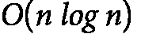 <st c="3975"><st c="3986">的时间复杂度。</st> <st c="4003">另一方面，一些算法并不依赖于比较。</st> <st c="4068">线性时间排序算法的例子包括计数排序和基数排序。</st> <st c="4149">它们采用了替代排序技术，通常能够在</st> <st c="4237"><st c="4239">)的特定条件下实现线性时间复杂度。</st></st></st>

### <st c="4267">基于比较的排序</st>

<st c="4292">比较在许多排序算法中起着核心作用。</st> <st c="4353">在基于比较的排序算法中，确定元素顺序的主要操作是对元素对进行比较。</st> <st c="4501">该算法根据这些比较的结果做出关于元素位置的决策，这些比较通常涉及如</st> `<st c="4660"><</st>`<st c="4661">,</st> `<st c="4663">></st>`<st c="4664">,</st> <st c="4666">或</st> `<st c="4669">==</st>`<st c="4671">。</st>

<st c="4672">这些算法基于对元素的比较来决定它们的顺序。</st> <st c="4745">每次比较操作都会决定一个元素是否应排在另一个元素之前或之后。</st> <st c="4845">基于比较的排序算法可以应用于任何定义了比较函数的数据类型。</st> <st c="4957">这使得它们具有广泛的适用性，</st> <st c="4987">并且应用广泛。</st>

<st c="5005">我们可以证明存在一个下界为</st>  <st c="5049"><st c="5058">用于比较基础排序算法的时间复杂度。</st> <st c="5122">这是由于比较的决策树模型。</st> <st c="5177">这意味着，平均而言，至少需要</st>  <st c="5215"><st c="5224">比较操作才能对</st>  <st c="5257"><st c="5306">个元素进行排序。</st> <st c="5316">我们来解释为什么任何基于比较的排序算法的时间复杂度不能优于</st> <st c="5405"><st c="5414">。</st></st></st></st></st>

<st c="5415">这些算法是通过比较每一对元素来实现的。</st> <st c="5492">我们可以将这些算法做出的决策表示为一个二叉决策树。</st> <st c="5575">以下是该</st> <st c="5614">决策树的元素：</st>

+   <st c="5628">每个内部（非终端）节点表示两个元素之间的比较（</st><st c="5709">例如，A<B？）</st>

+   <st c="5721">每个分支表示该比较的结果（是</st> <st c="5781">或否）</st>

+   <st c="5787">每个叶（终端）节点表示输入数组的一个可能的最终排序顺序。</st>

<st c="5873">让我们通过</st> <st c="5952">一个例子来解释比较排序的决策树表示。</st>

**<st c="5963">示例 6.1</st>**

<st c="5975">让我们考虑一个包含三个随机数的数组：A=[3, 1, 4]。</st> <st c="6040">为了通过比较来排序这个数组，我们可能从决策树开始，如</st> *<st c="6131">图 6</st>**<st c="6139">.1</st>*<st c="6141">所示。</st>


<st c="6271">图 6.1：实现基于比较的三元素数组排序的决策树（白色框为内部节点；左分支为“是”，右分支为“否”）</st>

<st c="6454">这棵树</st> <st c="6463">将继续分支，表示所有可能的比较结果，并指向表示输入数组不同排序顺序的叶节点。</st> <st c="6624">让我们估计使用此</st> <st c="6693">决策树进行排序的下界时间复杂度：</st>

+   <st c="6707">对于一个大小为</st> <st c="6729"><st c="6778">的数组，存在</st>  <st c="6790"><st c="6793">种可能的排列（不同的顺序）。</st> <st c="6838">这些排列中的每一个都有可能是正确的</st> <st c="6900">排序顺序。</st></st></st>

+   <st c="6913">在决策树中，每个叶节点代表这些可能排列中的一个。</st> <st c="6998">因此，树必须至少有</st>  <st c="7037"><st c="7040">个叶子节点来覆盖所有可能性。</st> <st c="7075">在我们的例子中，我们将有</st>  <st c="7104"><st c="7105">种可能的排列或</st> <st c="7131">叶节点。</st></st></st>

+   <st c="7142">一个具有</st> 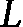 <st c="7162"><st c="7163">叶子节点的二叉树，其最小高度为</st> <st c="7195"><st c="7201">。由于我们的决策树至少需要</st>  <st c="7242"><st c="7245">个叶子节点，其最小高度为</st> <st c="7275"><st c="7283">。使用斯特林近似，我们知道</st> <st c="7330">l</st><st c="7331">o</st><st c="7332">g</st><st c="7333">(</st><st c="7334">n</st><st c="7335">!</st><st c="7336">)</st> <st c="7337">大约等于</st>  <st c="7364"><st c="7372">(见</st> *<st c="7377">示例 3.8</st>* <st c="7388">来自</st> *<st c="7394">第三章</st>*<st c="7403">)。</st></st></st></st></st></st>

<st c="7406">因此，所有基于比较的排序算法的时间复杂度下界为</st> <st c="7460"><st c="7471">。这意味着没有任何算法能够 consistently 排序数组的速度比</st> <st c="7586"><st c="7597">更快。</st></st></st>

<st c="7598">以下是一些知名的基于比较的</st> <st c="7645">排序算法：</st>

+   **<st c="7664">冒泡排序</st>**<st c="7676">：数组中的相邻元素反复比较，如果它们的顺序错误，则交换它们的位置。</st> <st c="7793">每一次遍历，较大的元素逐渐被移动到数组的末尾。</st>

+   **<st c="7869">插入排序</st>**<st c="7884">：该算法通过反复比较并将元素插入到已排序部分的适当位置，逐步构造一个已排序的数组。</st> <st c="8039">排序部分逐步增大。</st>

+   **<st c="8054">快速排序</st>**<st c="8065">：在</st> <st c="8070">快速排序算法中，使用比较将数组围绕一个主元素进行分区，然后递归地排序</st> <st c="8202">结果分区。</st>

+   **<st c="8223">归并排序</st>**<st c="8234">：在</st> <st c="8240">这种排序算法中，数组被分成两部分，几乎相等。</st> <st c="8328">每一部分会递归排序，然后通过比较将已排序的部分合并</st> <st c="8408">。</st>

+   **<st c="8426">堆排序</st>**<st c="8436">：在这种</st> <st c="8446">排序算法中，从原始数组构建一个最大堆（或最小堆）树，然后反复提取最大（或最小）元素。</st> <st c="8597">在整个过程中，使用比较来维持堆的性质（见</st> *<st c="8677">第十三章</st>*<st c="8687">）。</st>

### <st c="8690">非比较排序</st>

<st c="8719">与</st> <st c="8727">基于比较的方法不同，在</st> <st c="8756">非比较算法中，我们并不直接比较元素来确定它们的顺序。</st> <st c="8851">相反，我们使用诸如计数频率、应用哈希函数或利用数据的特定属性等替代技术。</st> <st c="8993">这些方法利用对输入数据的假设</st> <st c="9052">来实现高效排序，通常可以达到线性时间复杂度，</st> <st c="9121"><st c="9122">，在某些条件下。</st> <st c="9150">非比较排序算法的主要</st> <st c="9159">特性包括</st> <st c="9221">以下几点：</st>

+   **<st c="9235">数据特定技术</st>**<st c="9260">：这些算法经常利用数据的特定属性，如范围（特别是针对数值型或整数数据）或位数，来执行</st> <st c="9435">排序过程</st>。

+   **<st c="9450">线性时间复杂度</st>**<st c="9473">：非比较排序算法可以实现优于</st>  <st c="9540"><st c="9541">时间复杂度，通常为</st> <st c="9565"><st c="9566">，通过避免比较并使用更直接的方法来</st> <st c="9625">对元素进行排序</st></st></st>。

+   **<st c="9642">内存使用</st>**<st c="9655">：尽管这些算法可以实现线性时间复杂度，但它们通常需要临时内存，这些内存通常与输入大小或数据值范围成正比。</st> <st c="9825">数据值</st>

<st c="9836">在本章中，我们</st> <st c="9856">介绍了三种著名的非比较排序算法。</st> <st c="9925">第一种是计数排序，它通过计算每个不同元素的出现次数，将其放置到正确的位置上，适用于已知范围内的整数。</st> <st c="10104">接下来是基数排序，它按特定顺序（例如，从最低有效位开始）处理元素的每个数字或字符，并使用稳定的子程序（如计数排序）按每个数字对元素进行排序。</st> <st c="10326">最后，桶排序将输入列表的元素根据其值分配到多个桶或容器中。</st> <st c="10442">每个桶或容器会单独进行排序（通常使用简单的比较排序），所有排序好的桶会被连接在一起，形成最终的</st> <st c="10598">排序列表。</st>

## <st c="10610">递归</st>

<st c="10620">递归</st> <st c="10630">在许多排序算法中发挥着重要作用，使得</st> <st c="10686">它们能够通过分治策略高效地分解并解决排序问题。</st> <st c="10791">递归排序算法提供了简洁直观的实现，但也带来了栈开销和潜在的性能波动。</st> <st c="10930">另一方面，非递归排序算法避免了递归和栈管理的复杂性，提供了内存效率和简洁性，尽管它们在处理</st> <st c="11122">大数据集时可能表现不如递归算法。</st>

### <st c="11137">递归排序算法</st>

<st c="11166">递归是</st> <st c="11180">排序算法中常用的技术，它可以将复杂问题分解成更简单的子问题。</st> <st c="11275">在排序的上下文中，递归使得算法能够将输入数组分割成更小的片段，并独立地对这些</st> <st c="11393">片段进行排序。</st> <st c="11417">最终排序的数组是通过合并已排序的片段生成的。</st> <st c="11484">递归排序算法利用分治策略，这有助于以可管理的</st> <st c="11613">代码复杂度实现高效排序。</st> <st c="11631">递归排序算法具有以下特性：</st>

+   **<st c="11690">分治策略</st>**<st c="11718">：顾名思义，这种策略包含三个步骤：首先，将问题（数组）拆分成更小的子问题（子数组）。</st> <st c="11858">其次，递归地解决（排序）每个子问题（子数组）。</st> <st c="11926">第三，将各个子问题的解合并，解决</st> <st c="11972">原始问题。</st>

+   **<st c="11989">基本情况与递归情况</st>**<st c="12018">：每个递归算法都有一个基本情况，当子问题足够小（例如，只有一个元素或一个空数组）时终止递归。</st> <st c="12173">递归情况继续分解问题并解决</st> <st c="12238">子问题。</st>

+   **<st c="12255">栈的使用</st>**<st c="12267">：递归调用消耗栈空间，这可能导致较高的内存使用，特别是在深度递归时。</st> <st c="12375">然而，尾递归优化和迭代方法在</st> <st c="12464">某些情况下可以缓解这一问题。</st>

*<st c="12475">表 6.1</st>* <st c="12485">提供了一些递归</st> <st c="12494">排序算法的示例：</st>

| **<st c="12541">排序</st>** **<st c="12550">算法</st>** | **<st c="12559">过程</st>** | **<st c="12567">时间与</st>** **<st c="12577">空间复杂度</st>** |
| --- | --- | --- |
| <st c="12593">归并排序</st> |

1.  **<st c="12604">分割</st>**<st c="12611">：如果数组有多个元素，将其分割成两半，尽量</st> <st c="12680">均匀。</st>

1.  **<st c="12693">分治</st>**<st c="12701">：递归地对每一半应用归并排序。</st> <st c="12760">直到每个子数组只有一个元素（一个 trivially</st> <st c="12830">已排序的数组）。</st>

1.  **<st c="12844">合并</st>**<st c="12852">：通过比较每一半的元素，将两个已排序的半部分合并成一个排序后的数组，先取较小的元素，放入</st> <st c="13009">新数组中。</st>

1.  <st c="13019">重复此过程，直到两个半部分的所有元素都已</st> <st c="13081">合并。</st>

| <st c="13093">时间：</st>  <st c="13100"><st c="13111">在所有情况下（最佳、平均</st> <st c="13140">和最坏情况下）</st></st><st c="13151">空间：</st>  <st c="13159"><st c="13160">用于归并组件的临时内存。</st></st> |
| --- |
| <st c="13201">快速排序</st> |

1.  **<st c="13212">选择枢轴</st>**<st c="13225">：从数组中选择一个元素作为枢轴。</st> <st c="13285">常见的选择有第一个元素、最后一个元素或随机</st> <st c="13339">选择的元素。</st>

1.  **<st c="13354">分区</st>**<st c="13364">：将数组划分为两个子数组。</st> <st c="13405">第一个子数组（左边）的元素小于枢轴，第二个子数组（右边）的元素大于枢轴。</st> <st c="13553">枢轴现在处于最终</st> <st c="13583">排序位置。</st>

1.  **<st c="13599">递归排序</st>**<st c="13617">：递归地对左子数组应用快速排序。</st> <st c="13672">递归地对右子数组应用快速排序。</st>

1.  <st c="13724">继续这个过程，直到每个子数组要么为空，要么只包含一个元素（一个 trivially</st> <st c="13826">已排序的数组）。</st>

| <st c="13840">时间复杂度：</st>  <st c="13847"><st c="13858">平均情况下，</st>  <st c="13874"><st c="13881">最坏情况下。</st></st></st><st c="13899">空间复杂度：</st>  <st c="13907"><st c="13916">递归栈的空间，</st> <st c="13947">在平均情况下。</st></st> |
| --- |

| <st c="13960">堆排序</st> | **<st c="13970">构建最大堆</st>**<st c="13985">：从最后一个非叶子节点开始，按反向层次顺序递归堆化每个节点。</st> <st c="14087">这会从输入数组构建一个最大堆。</st>**<st c="14131">提取并重建</st>**<st c="14151">：重复以下步骤，直到堆</st> <st c="14196">为空：</st>

+   <st c="14205">交换根节点（最大元素）与堆的最后一个元素。</st>

+   <st c="14272">将堆大小</st> <st c="14294">减少 1。</st>

+   <st c="14299">对根节点应用递归堆化，恢复</st> <st c="14351">最大堆属性。</st>

<st c="14369">（堆排序将在</st> *<st c="14412">第十三章</st>*<st c="14422">中详细讨论）</st> | <st c="14425">时间：</st> 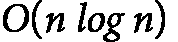 <st c="14432"><st c="14443">在</st> <st c="14446">所有情况下。</st></st><st c="14456">空间：</st>  <st c="14464"><st c="14465">对于迭代版本；递归堆化过程使用</st>  <st c="14528"><st c="14529">栈空间。</st></st></st> |

<st c="14541">表 6.1：递归排序算法的示例</st>

### <st c="14593">非递归排序算法</st>

<st c="14626">非递归排序算法</st> <st c="14660">不使用递归来实现排序。</st> <st c="14701">相反，它们依赖于迭代技术，通过</st> <st c="14750">循环来管理排序过程。</st> <st c="14791">这些算法通常具有更简单的空间复杂度，因为它们避免了递归策略中的栈开销。</st> <st c="14927">非递归排序算法使用迭代方法（通过循环实现），并且通常具有较高的内存效率。</st> <st c="15050">从技术角度讲，非递归排序算法具有以下</st> <st c="15114">特征：</st>

+   **<st c="15140">迭代方法</st>**<st c="15159">：非递归排序算法使用循环（例如，</st> **<st c="15212">for</st>** <st c="15215">循环或</st> **<st c="15225">while</st>** <st c="15230">循环）对数组进行排序，从而避免了</st> <st c="15282">递归调用</st>

+   **<st c="15297">内存效率</st>**<st c="15315">：这些算法通常更加节省内存，因为它们避免了递归调用所需的额外栈空间</st>

+   **<st c="15441">更简化的栈管理</st>**<st c="15466">：通过使用迭代方法，非递归算法避免了管理递归栈深度的复杂性，这在处理</st> <st c="15635">大型数据集</st> <st c="15635">时可能会导致栈溢出</st>

*<st c="15649">表 6.2</st>* <st c="15659">列出了</st> <st c="15679">一些著名的非递归</st> <st c="15704">排序算法：</st>

| **<st c="15723">排序</st>** **<st c="15732">算法</st>** | **<st c="15741">过程</st>** | **<st c="15749">时间和</st>** **<st c="15759">空间复杂度</st>** |
| --- | --- | --- |

| **<st c="15775">插入</st>** **<st c="15786">排序</st>** | <st c="15790">从第二个元素开始。</st> <st c="15822">假设第一个元素已经</st> <st c="15850">排序好了。</st><st c="15865">遍历未排序部分：</st>

+   <st c="15903">将其与已排序部分的元素进行比较（与其左边的元素）。</st>

+   <st c="15969">将已排序部分的元素向右移动，直到当前元素处于</st> <st c="16052">正确位置。</st>

+   <st c="16069">将当前元素插入</st> <st c="16102">该位置。</st>

<st c="16116">继续，直到整个数组排序完成。</st> <st c="16160">对未排序部分的每个元素重复步骤 2。</st> | <st c="16215">时间复杂度：</st>  <st c="16222"><st c="16228">在平均和最坏情况下，</st>  <st c="16266"><st c="16267">在最佳情况下。</st></st></st><st c="16285">空间复杂度：</st>  <st c="16293"><st c="16294">因为它是</st> <st c="16307">原地排序。</st></st> |

| **<st c="16321">选择</st>** **<st c="16332">排序</st>** | <st c="16336">找到最小的元素（初始时为</st> <st c="16378">整个数组）。</st>**<st c="16392">交换</st>**<st c="16397">：将最小的元素与未排序部分最左侧的元素交换。</st> <st c="16477">现在，最左侧的元素已处于其最终的</st> <st c="16518">排序位置。</st>**<st c="16534">重复</st>**<st c="16541">：考虑剩余的未排序部分（排除已经排序的元素）。</st> <st c="16625">重复步骤 1 和 2，直到整个数组</st> <st c="16669">排序完成。</st> | <st c="16679">时间复杂度：</st>  <st c="16686"><st c="16692">在</st> <st c="16695">所有情况下。</st></st><st c="16705">空间复杂度：</st>  <st c="16713"><st c="16714">因为它是</st> <st c="16727">原地排序。</st></st> |
| --- | --- | --- |

| **<st c="16741">冒泡排序</st>** | **<st c="16753">比较</st>** **<st c="16762">并交换：</st>**

+   <st c="16771">比较每两个元素。</st> <st c="16800">如果它们的顺序不正确，</st> <st c="16832">交换它们。</st>

+   <st c="16842">继续这个过程，直到数组的最后一个元素</st> <st c="16901">被访问。</st>

**<st c="16912">重复：</st>**

+   <st c="16920">经过一轮遍历，最大的元素将“冒泡”到</st> <st c="17001">数组的末尾。</st>

+   <st c="17009">重复步骤 1，但这次，停止在距离数组末尾一位的位置（因为最后一个元素已经在其</st> <st c="17128">正确位置）。</st>

+   <st c="17143">继续重复步骤 1，每次减少比较范围一个元素，直到整个数组</st> <st c="17250">排序完成。</st>

| <st c="17260">时间：</st>  <st c="17267"><st c="17273">对于平均情况和最坏情况，</st>  <st c="17311"><st c="17312">在</st> <st c="17320">最佳情况下。</st></st></st><st c="17330">空间：</st>  <st c="17338"><st c="17339">因为它是</st> <st c="17352">原地排序。</st></st> |
| --- |

<st c="17366">表 6.2：非递归排序算法示例</st>

<st c="17422">递归是一个关键因素，</st> <st c="17449">它将排序算法区分开来。</st> <st c="17489">在接下来的子节中，我们将探讨其他方面，</st> <st c="17555">例如适应性。</st>

## <st c="17571">适应性</st>

<st c="17584">在排序中，适应性指的是算法利用数据中已有顺序来提高效率的能力。</st> <st c="17643">一种适应性排序算法在输入数据部分已排序或具有某种内在结构时表现尤为出色，这样就需要更少的操作来完成完全排序。</st> <st c="17714">本质上，输入数据越有序，算法完成任务的速度就越快。</st>

<st c="17968">一种</st> <st c="17971">适应性排序算法</st> <st c="17998">在数据部分有序时，其平均运行时间将比输入完全随机时要快。</st> <st c="18128">此外，当数据接近已排序状态时，这些排序算法进行的比较和交换更少，从而减少了计算量。</st> <st c="18287">适应性排序算法在实际应用中更加高效，因为许多实际数据集并非完全随机，通常具有某种已存在的顺序（例如，时间序列数据或周期性更新的列表）。</st> <st c="18520">适应性排序算法能够更高效地处理此类数据集</st> <st c="18573">。</st>

<st c="18590">让我们考虑</st> <st c="18605">两种自适应排序算法。</st> <st c="18639">首先是插入排序，它具有很高的自适应性。</st> <st c="18690">在最优情况下，当输入数据已经排序时，它的运行时间为</st> <st c="18777"><st c="18778">，因为它只需要进行</st>  <st c="18805"><st c="18806">次比较。</st> <st c="18820">对于小规模或几乎已排序的数据，插入排序是高效的，因为它需要进行较少的交换和比较。</st> <st c="18926">下一个自适应排序算法是冒泡排序，它在某种程度上是自适应的。</st> <st c="19012">如果输入数据已经排序，冒泡排序可以在</st>  <st c="19090"><st c="19091">时间内完成排序，尽管这需要进行优化，以便在没有交换时提前停止</st> <st c="19175">一次遍历。</st></st></st></st>

另一方面，<st c="19182">让我们</st> <st c="19208">考察两种非自适应排序算法：快速排序和堆排序。</st> <st c="19279">快速排序的时间复杂度受枢轴选择和元素初始排列的影响较大。</st> <st c="19394">然而，它本身并不会因为部分排序的数据而得到改善。</st> <st c="19461">堆排序是另一种非自适应算法。</st> <st c="19506">正如我们将在</st> *<st c="19524">第十三章</st>*<st c="19534">中看到的，预排序的数据在</st> <st c="19583">此过程中没有任何优势。</st>

## <st c="19596">逆序</st>

<st c="19606">序列中的反转</st> <st c="19610">是一种情况，其中一对元素的顺序错乱。</st> <st c="19691">形式上，给定一个数组</st> <st c="19716"><st c="19717">，反转被定义为一对索引</st>  <st c="19763"><st c="19765">和</st>  <st c="19783"><st c="19788">且</st> ![<math xmlns="http://www.w3.org/1998/Math/MathML"><mrow><mrow><mrow><mrow><mi>A</mi><mo>[</mo><mi>i</mi><mo>]</mo><mo>></mo><mi>A</mi><mo>[</mo><mi>j</mi><mo>]</mo></mrow></mrow></mrow></mrow></math>](img/1037.png)<st c="19791"><st c="19806">。简单来说，反转发生在数组中较大的元素在较小的元素之前的情况下。</st> <st c="19905">反转在排序中很重要，因为它们衡量数组内部无序的程度。</st> <st c="20004">总反转数提供了数组离排序完的程度的见解。</st> <st c="20096">我们可以</st> <st c="20103">考虑</st> <st c="20112">两种情况：</st></st></st></st></st></st>

+   **<st c="20126">零反转</st>**<st c="20142">：对于所有</st> <st c="20153"><st c="20158">，我们有</st> ![<mml:math xmlns:mml="http://www.w3.org/1998/Math/MathML" xmlns:m="http://schemas.openxmlformats.org/officeDocument/2006/math"><mml:mi>A</mml:mi><mml:mfenced open="[" close="]" separators="|"><mml:mrow><mml:mi>i</mml:mi></mml:mrow></mml:mfenced><mml:mo>≤</mml:mo><mml:mi>A</mml:mi><mml:mfenced open="[" close="]" separators="|"><mml:mrow><mml:mi>j</mml:mi></mml:mrow></mml:mfenced></mml:math>](img/1039.png)<st c="20168"><st c="20180">；换句话说，数组</st>  <st c="20208"><st c="20209">完全排序</st>。</st></st></st></st>

+   **<st c="20225">最大逆序数</st>**<st c="20244">：对于所有</st> <st c="20255"><st c="20260">，我们有</st> ![<math xmlns="http://www.w3.org/1998/Math/MathML"><mrow><mrow><mrow><mi>A</mi><mo>[</mo><mi>i</mi><mo>]</mo><mo>></mo><mi>A</mi><mo>[</mo><mi>j</mi><mo>]</mo></mrow></mrow></mrow></math>](img/1042.png)<st c="20270"><st c="20281">；换句话说，数组</st> <st c="20309"><st c="20310">是按</st> <st c="20323">逆序排列的</st></st></st></st>

<st c="20336">逆序的概念</st> <st c="20362">对于理解排序算法及其分析至关重要。</st> <st c="20432">逆序指的是数组中元素的顺序不正确的元素对。</st> <st c="20505">例如，在冒泡排序中，算法不断交换相邻的元素，直到它们按正确的顺序排列。</st> <st c="20621">冒泡排序过程中执行的交换次数直接对应于数组中逆序对的数量。</st> <st c="20736">数组中的逆序数越多，排序的难度越大。</st>

<st c="20746">在归并排序中，逆序数</st> <st c="20773">可以在归并过程中进行计数。</st> <st c="20805">具体来说，当来自数组右半部分的元素在左半部分的元素之前被插入时，这表示逆序数等于左半部分剩余元素的个数。</st> <st c="20817">这个洞察有助于我们量化数组在排序过程中存在的无序性。</st> <st c="21018">这一过程帮助我们在数组排序时准确把握其中的逆序情况。</st>

<st c="21111">逆序数还会影响排序算法的复杂度。</st> <st c="21173">数组中的逆序数可以用来分析这些算法的效率。</st> <st c="21269">例如，具有</st>  <st c="21299"><st c="21310">复杂度的算法，如归并排序和快速排序，可以高效地处理大量逆序。</st> <st c="21410">相比之下，具有</st>  <st c="21439"><st c="21445">复杂度的算法，如冒泡排序和插入排序，随着逆序数的增加可能变得越来越低效。</st> <st c="21550">当逆序数增多时，效率会显著下降。</st></st></st>

## <st c="21567">内存使用</st>

<st c="21580">内存使用</st> <st c="21593">在排序中是通过算法处理和排列输入数据所需的额外存储量来衡量的。</st> <st c="21711">这与排序算法是否被归类为原地排序</st> <st c="21789">密切相关。</st>

### <st c="21796">原地排序</st>

<st c="21813">原地排序算法</st> <st c="21842">直接在输入数组</st> <st c="21859">内操作。</st> <st c="21883">它们只需要固定数量的额外存储空间。</st> <st c="21939">这些算法通过使用固定的额外空间重新排列给定数组中的元素，通常是</st> 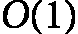 <st c="22054"><st c="22055">额外空间。</st></st>

<st c="22067">原地排序算法具有较高的内存效率，所需的额外空间最小。</st> <st c="22149">在内存资源有限或处理大型数据集的环境中，这一点尤为重要。</st> <st c="22263">这些算法通常通过交换输入数组中的元素来实现排序。</st> <st c="22347">常见的技术包括分区和将元素逐步放入正确的位置。</st> <st c="22449">插入排序、快速排序和堆排序是原地排序算法的例子。</st> <st c="22528">快速排序通过其原地分区方案，通常在不需要额外与输入大小成比例的存储空间的情况下对数组进行排序。</st> <st c="22674">然而，它使用</st> 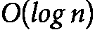 <st c="22691"><st c="22700">额外空间来支持递归栈。</st> <st c="22737">插入排序将元素插入到数组中的正确位置，不需要除了几个用于循环和交换的变量之外的额外空间。</st> <st c="22890">最后，堆排序将数组转换为堆结构，然后在原地进行排序。</st> <st c="22980">这通过反复移除最大元素（或最小元素，取决于所需顺序），然后恢复堆的性质来保持</st> <st c="23134">堆结构。</st></st>

### <st c="23148">非原地排序</st>

<st c="23169">排序算法</st> <st c="23188">如果操作不直接在输入数据上进行并且需要额外的内存空间，无论是线性还是非线性地与输入大小成比例</st> <st c="23294">，则称为非原地排序算法。</st> <st c="23378">这些算法在排序过程中使用额外的空间来存储数据的副本或中间结果。</st> <st c="23491">非原地排序算法消耗更多内存，因为它们需要额外的存储空间来保存数据的临时副本或中间结构。</st> <st c="23645">另一方面，这些算法可能更容易实现和理解，而且它们通常比</st> <st c="23792">原地算法更容易保持排序的稳定性。</st>

<st c="23812">非原地排序的例子包括归并排序、计数排序和基数排序。</st> <st c="23893">归并</st> <st c="23899">排序使用</st>  <st c="23908"><st c="23910">额外的内存来保存输入的两个分区。</st> <st c="23978">每次递归步骤都需要额外的空间来存储中间结果，从而导致更高的整体内存使用。</st> <st c="24095">计数排序使用与输入值范围成比例的额外内存，通常为</st> <st c="24189"><st c="24195">，其中</st>  <st c="24203"><st c="24204">是输入数据的范围。</st> <st c="24237">基数排序与计数排序类似，需要额外的空间来保存每个正在处理的数字或字符的临时数据，因此导致</st>  <st c="24371"><st c="24377">的内存使用。</st></st></st></st></st>

<st c="24390">在选择原地排序和非原地排序算法之间时，有几个权衡需要考虑：</st>

+   <st c="24500">在内存受限的环境中，原地排序算法由于其最小的</st> <st c="24605">内存占用，通常是首选。</st>

+   <st c="24622">非原地算法可能更容易实现和理解，特别是对于复杂的</st> <st c="24716">排序任务。</st>

+   <st c="24730">在某些情况下，非原地算法由于能够高效处理大规模或复杂的数据集，尽管它们的</st> <st c="24890">内存使用量较高，仍然能够提供更好的性能。</st>

+   <st c="24903">非原地算法通常更容易保持相等元素的相对顺序，因此它们是稳定的。</st> <st c="25013">确保原地算法的稳定性可能会</st> <st c="25062">更具挑战性。</st>

<st c="25079">内存使用量</st> <st c="25092">是选择排序算法时的重要考虑因素。</st> <st c="25120">原地排序方法在内存消耗方面非常高效，因为它们直接操作输入数组，几乎不需要额外的空间。</st> <st c="25296">然而，非原地方法，如归并排序和计数排序，虽然可以提供在简单性和稳定性方面的优势，但它们需要与输入大小成比例的额外内存。</st> <st c="25493">选择原地排序和非原地排序取决于具体问题。</st> <st c="25579">例如，如果内存有限，应考虑使用原地排序。</st>

### <st c="25653">稳定性</st>

<st c="25663">排序中的稳定性指的是保持具有相同值的元素的原始相对顺序。</st> <st c="25770">如果排序算法确保具有相同值的元素在排序后保持它们初始的相对顺序，则该排序算法被视为稳定的。</st> <st c="25825">稳定算法包括插入排序、归并排序和冒泡排序。</st> <st c="25923">相反，快速排序、堆排序和选择排序是</st> <st c="26065">不稳定算法的例子。</st>

<st c="26085">稳定排序算法和不稳定排序算法的区别在于它们能否保持相等元素的原始顺序。</st> <st c="26221">稳定算法保证这种顺序的保持，确保相等元素的相对位置在排序过程中不变。</st> <st c="26356">相反，不稳定算法可能会改变相等元素的相对位置。</st>

<st c="26440">考虑以下元组列表，其中每个元组包含一个字母和一个数字：[(‘A’, 3), (‘B’, 1), (‘C’, 3), (‘D’, 2), (‘</st><st c="26572">E’, 1)]</st>

<st c="26580">如果我们使用稳定的排序算法按数字（每个元组的第二个元素）升序排序这个列表，结果可能是</st> <st c="26724">如下：</st>

<st c="26735">[(‘B’, 1), (‘E’, 1), (‘D’, 2), (‘A’, 3), (‘</st><st c="26779">C’, 3)]</st>

<st c="26787">注意，对于具有相同数字的元组（如（‘A’，3）和（‘C’，3）），它们在排序后会保持原有的顺序。</st> <st c="26918">换句话说，在排序后的列表中，‘A’（3）排在‘C’（3）前面，就像它在原始列表中的位置一样。</st> <st c="27018">如果使用不稳定的排序算法，结果顺序可能是</st> <st c="27087">如下：</st>

<st c="27098">[(‘E’, 1), (‘B’, 1), (‘D’, 2), (‘C’, 3), (‘</st><st c="27142">A’, 3)]</st>

<st c="27150">在这里，‘A’（3）和‘C’（3）的相对顺序</st> <st c="27204">未能保持。</st>

<st c="27218">稳定性</st> <st c="27231">在以下场景中特别重要：</st> <st c="27262"></st>

+   **<st c="27282">多关键字排序</st>**<st c="27301">：当</st> <st c="27309">执行多级排序（例如，首先按一个属性排序，然后按另一个属性排序）时，稳定性确保先前排序的顺序得到保持。</st> <st c="27470">例如，如果你首先根据员工的雇佣状态排序，然后再根据员工编号排序，稳定排序会保持雇佣状态的顺序，同时按 id 排序。</st> <st c="27654">在此过程中，雇佣状态的顺序得以保留。</st>

+   **<st c="27660">保持输入顺序</st>**<st c="27683">：在某些应用中，输入元素的顺序除了其排序后的位置外，还具有其他意义。</st> <st c="27787">稳定性确保这种意义</st> <st c="27828">得以保留。</st>

<st c="27841">稳定性在需要多级排序或输入顺序携带额外信息的应用中至关重要。</st> <st c="27973">在这种情况下，稳定的排序算法是首选，以确保数据的完整性</st> <st c="28055">和正确性。</st>

# <st c="28071">迭代排序算法</st>

<st c="28100">迭代排序算法</st> <st c="28130">因其简单性而闻名，使得它们易于理解、实现和调试。</st> <st c="28219">迭代排序方法的主要优点是它们的空间效率；它们通常需要最少的额外内存，这在内存受限的环境中是一个重要的优势。</st> <st c="28416">然而，这些算法在时间复杂度方面通常表现不佳，尤其是在处理大型数据集时。</st> <st c="28543">在数据规模和处理时间至关重要的场景中，这种局限性可能会特别成为问题。</st> <st c="28662">本节介绍了三种常见的迭代排序算法：冒泡排序、选择排序和</st> <st c="28762">插入排序。</st>

## <st c="28777">冒泡排序</st>

<st c="28789">冒泡排序是一个</st> <st c="28806">简单的基于比较的算法</st> <st c="28841">，它反复扫描数组，比较并交换相邻元素，如果它们的顺序错误。</st> <st c="28954">这个过程会一直重复，直到整个数组被排序。</st> <st c="29013">“冒泡”的类比来自于较小的元素逐渐浮升到顶端，而较大的元素则下降到底部。</st>

<st c="29140">尽管</st> <st c="29152">它简单，冒泡排序通常</st> <st c="29190">效率低下，排序数据集时表现出二次方的运行时间，</st>  <st c="29261"><st c="29262">无论是在平均情况还是最坏情况下。</st> <st c="29305">然而，它易于理解和实现，使其成为一个宝贵的教育工具，并且是排序小型数据集的可行选项。</st> <st c="29447">正如我们在上一节中所看到的，冒泡排序是一个稳定的原地算法，并且它的空间复杂度</st> <st c="29560">是</st> <st c="29563"><st c="29564">。</st></st></st>

**<st c="29565">示例 6.2</st>**

*<st c="29577">表 6.3</st>* <st c="29587">展示了冒泡排序的逐步过程，对于数组 [</st>`<st c="29655">5, 3, 8, 4, 2, 7,</st>` `<st c="29674">1, 6</st>`<st c="29678">]：</st>

| **<st c="29681">轮次</st>** | **<st c="29686">操作描述</st>** **<st c="29702">的内容</st>** | **<st c="29715">数组</st>** **<st c="29727">的内容</st>** |
| --- | --- | --- |
| <st c="29736">1</st> | <st c="29738">5 与 3，</st> <st c="29746">交换它们</st><st c="29755">5 与 8，</st> <st c="29764">不交换</st><st c="29771">8 与 4，</st> <st c="29780">交换它们</st><st c="29789">8 与 2，</st> <st c="29798">交换它们</st><st c="29807">8 与 7，</st> <st c="29816">交换它们</st><st c="29825">8 与 1，</st> <st c="29834">交换它们</st><st c="29843">8 与 6，</st> <st c="29852">交换它们</st> | <st c="29861">[3, 5, 8, 4, 2, 7,</st> <st c="29881">1, 6]</st><st c="29886">[3, 5, 8, 4, 2, 7,</st> <st c="29906">1, 6]</st><st c="29911">[3, 5, 4, 8, 2, 7,</st> <st c="29931">1, 6]</st><st c="29936">[3, 5, 4, 2, 8, 7,</st> <st c="29956">1, 6]</st><st c="29961">[3, 5, 4, 2, 7, 8,</st> <st c="29981">1, 6]</st><st c="29986">[3, 5, 4, 2, 7, 1,</st> <st c="30006">8, 6]</st><st c="30011">[3, 5, 4, 2, 7, 1,</st> <st c="30031">6, 8]</st> |
| <st c="30036">2</st> | <st c="30038">3 对 5,</st> <st c="30046">无需交换</st><st c="30053">5 对 4,</st> <st c="30062">交换它们</st><st c="30071">5 对 2,</st> <st c="30080">交换它们</st><st c="30089">5 对 7,</st> <st c="30098">无需交换</st><st c="30105">7 对 1,</st> <st c="30114">交换它们</st><st c="30123">7 对 6,</st> <st c="30132">交换它们</st><st c="30141">8 现在已处于它的</st> <st c="30158">正确位置</st> | <st c="30174">[3, 5, 4, 2, 7, 1,</st> <st c="30194">6, 8]</st><st c="30199">[3, 4, 5, 2, 7, 1,</st> <st c="30219">6, 8]</st><st c="30224">[3, 4, 2, 5, 7, 1,</st> <st c="30244">6, 8]</st><st c="30249">[3, 4, 2, 5, 7, 1,</st> <st c="30269">6, 8]</st><st c="30274">[3, 4, 2, 5, 1, 7,</st> <st c="30294">6, 8]</st><st c="30299">[3, 4, 2, 5, 1, 6,</st> <st c="30319">7, 8]</st> |
| <st c="30324">3</st> | <st c="30326">3 对 4,</st> <st c="30334">无需交换</st><st c="30341">4 对 2,</st> <st c="30350">交换它们</st><st c="30359">4 对 5,</st> <st c="30368">无需交换</st><st c="30375">5 对 1,</st> <st c="30384">交换它们</st><st c="30393">5 对 6,</st> <st c="30402">无需交换</st><st c="30409">7 和 8 现在已处于它们的</st> <st c="30435">正确位置</st> | <st c="30452">[3, 4, 2, 5, 1, 6,</st> <st c="30472">7, 8]</st><st c="30477">[3, 2, 4, 5, 1, 6,</st> <st c="30497">7, 8]</st><st c="30502">[3, 2, 4, 5, 1, 6,</st> <st c="30522">7, 8]</st><st c="30527">[3, 2, 4, 1, 5, 6,</st> <st c="30547">7, 8]</st><st c="30552">[3, 2, 4, 1, 5, 6,</st> <st c="30572">7, 8]</st> |
| <st c="30577">4</st> | <st c="30579">3 对 2,</st> <st c="30587">交换它们</st><st c="30596">3 对 4,</st> <st c="30605">无需交换</st><st c="30612">4 对 1,</st> <st c="30621">交换它们</st><st c="30630">4 对 5,</st> <st c="30639">无需交换</st><st c="30646">6, 7 和 8 现在已处于它们的</st> <st c="30676">正确位置</st> | <st c="30693">[2, 3, 4, 1, 5, 6,</st> <st c="30713">7, 8]</st><st c="30718">[2, 3, 4, 1, 5, 6,</st> <st c="30738">7, 8]</st><st c="30743">[2, 3, 1, 4, 5, 6,</st> <st c="30763">7, 8]</st><st c="30768">[2, 3, 1, 4, 5, 6,</st> <st c="30788">7, 8]</st> |
| <st c="30793">5</st> | <st c="30795">2 对 3,</st> <st c="30803">无需交换</st><st c="30810">3 对 1,</st> <st c="30819">交换它们</st><st c="30828">3 对 4,</st> <st c="30837">无需交换</st><st c="30844">5, 6, 7 和 8 现在已处于它们的</st> <st c="30877">正确位置</st> | <st c="30894">[2, 3, 1, 4, 5, 6,</st> <st c="30914">7, 8]</st><st c="30919">[2, 1, 3, 4, 5, 6,</st> <st c="30939">7, 8]</st><st c="30944">[2, 1, 3, 4, 5, 6,</st> <st c="30964">7, 8]</st> |
| <st c="30969">6</st> | <st c="30971">2 对 1,</st> <st c="30979">交换它们</st><st c="30988">2 对 3,</st> <st c="30997">无需交换</st><st c="31004">4, 5, 6, 7 和 8 现在已处于它们的</st> <st c="31040">正确位置</st><st c="31057">现在数组</st> <st c="31072">已排序。</st> | <st c="31082">[1, 2, 3, 4, 5, 6,</st> <st c="31102">7, 8]</st><st c="31107">[1, 2, 3, 4, 5, 6,</st> <st c="31127">7, 8]</st> |

<st c="31132">表 6.3：演示冒泡排序的示例</st>

<st c="31183">以下是</st> <st c="31196">冒泡排序算法的 Python 实现：</st>

```py
 def bubble_sort_iterative(a):
    n = len(a)
    for i in range(n):
        elements_swapped = False
        for j in range(0, n - i - 1):
            if a[j] > a[j + 1]:
                a[j], a[j + 1] = a[j + 1], a[j]
                elements_swapped = True
        if not elements_swapped:
            break
    return a
```

<st c="31478">冒泡排序算法非常简单。</st> <st c="31522">它由两个嵌套循环组成；外循环总是</st> 执行  <st c="31586"><st c="31587">次，而内循环如果数组已经排序好或接近排序好（表示无需交换</st> <st c="31705">）则可以提前终止。</st></st>

<st c="31720">现在，我们来分析冒泡排序的正确性并评估其</st> <st c="31788">时间复杂度。</st>

### <st c="31804">正确性证明</st>

<st c="31825">如</st> <st c="31828">在</st> *<st c="31842">第二章</st>*<st c="31851">中讨论的那样，我们利用循环不变式的概念来证明算法的正确性。</st> <st c="31936">循环不变式是指在每次循环迭代前后都保持为真的条件。</st>

<st c="32028">冒泡排序的循环不变式说明，在每次外循环迭代开始时（</st>`<st c="32130">for i in range(n):</st>`<st c="32149">），最后的</st> `<st c="32162">i</st>` <st c="32163">个元素已排序，并且处于它们的最终位置。</st> <st c="32214">为了证明算法的正确性，我们需要评估</st> <st c="32279">三个条件：</st>

+   **<st c="32296">初始化</st>**<st c="32311">：在第一次迭代之前（</st>*<st c="32342">i</st>* <st c="32344">= 0），没有任何元素被处理。</st> <st c="32384">由于空子数组</st> <st c="32440">已经是排序的，所以不变式显然成立。</st>

+   **<st c="32450">维护</st>**<st c="32462">：假设不变式在</st> *<st c="32503">i</st>*<st c="32504" class="calibre11">次</st> <st c="32506">迭代之前成立。</st> <st c="32518">在第</st> *<st c="32529">i</st>*<st c="32530" class="calibre11">次</st> <st c="32532">迭代过程中，若相邻元素的顺序不对，则会交换它们。</st> <st c="32627">在第</st> *<st c="32645">i</st>*<st c="32646" class="calibre11">次</st> <st c="32648">遍历结束时，最大的未排序元素会被“冒泡”到数组中的正确位置，从而确保最后的</st> *<st c="32761">i</st>* <st c="32762">个元素已排序。</st> <st c="32784">因此，不变式</st> <st c="32804">得以维持。</st>

+   **终止条件**：该算法在外部循环执行完`n`次迭代后终止，其中`n`是输入数据的大小。在此时，恒等式保证整个数组已排序，因为最后`n`个元素（即整个数组）已处于正确的位置。

### 复杂度分析

要理解时间复杂度，我们可以在以下几种场景中进行分析：

+   **最优情况**：![<mml:math xmlns:mml="http://www.w3.org/1998/Math/MathML" xmlns:m="http://schemas.openxmlformats.org/officeDocument/2006/math"><mml:mi>O</mml:mi><mml:mo>(</mml:mo><mml:mi>n</mml:mi><mml:mo>)</mml:mo></mml:math>]：当数组已排序时，会发生这种情况。算法只需通过数组执行一次遍历，而不需要进行任何交换，提前终止，因为不会找到任何无序对（“冒泡”）。

+   **平均情况**：![<mml:math xmlns:mml="http://www.w3.org/1998/Math/MathML" xmlns:m="http://schemas.openxmlformats.org/officeDocument/2006/math"><mml:mi>O</mml:mi><mml:mfenced separators="|"><mml:mrow><mml:msup><mml:mrow><mml:mi>n</mml:mi></mml:mrow><mml:mrow><mml:mn>2</mml:mn></mml:mrow></mml:msup></mml:mrow></mml:mfenced></mml:math>]：当输入数据是随机时，会发生这种情况。算法需要多次遍历，每次需要进行`n-i-1`次比较。

+   **<st c="33587">最坏情况</st>**<st c="33598">：</st>  <st c="33601"><st c="33607">- 当数组按逆序排列时，会发生这种情况。</st> <st c="33664">冒泡排序在每次遍历数组时都需要执行最多次数的比较和交换操作。</st><st c="33762"> </st>

<st c="33772">为了确定</st> <st c="33785">空间复杂度，我们需要评估排序过程中使用的辅助或临时内存。</st> <st c="33879">冒泡排序被认为是一种原地算法，意味着它直接在输入数组上操作，只需要一个常量数量的额外空间来进行</st> <st c="34031">元素交换。</st>

## <st c="34049">选择排序</st>

<st c="34064">选择排序</st> <st c="34079">是一种基于比较的方法，它</st> <st c="34114">将列表分为两部分：一个已排序部分，从空开始并逐渐增加，一个未排序部分，从包含所有元素开始并逐渐减少。</st> <st c="34266">在每一步中，算法找到未排序部分中最小（或最大）的元素，并将其移到已排序部分的末尾。</st> <st c="34396">这一过程持续进行，直到整个列表</st> <st c="34433">被排序完成。</st>

<st c="34443">选择排序以其简单性为特点，始终表现出二次方的运行时间，</st> <st c="34541"><st c="34542">无论在最好、平均还是最坏情况下。</st> <st c="34590">虽然对于大数据集效率低下，但其简单的特性使得它容易理解和实现。</st> <st c="34693">这个算法不是自适应的，意味着它不会利用数据中的任何现有顺序。</st> <st c="34788">然而，选择排序直接在输入数据中操作，只需要少量的常量额外内存（</st><st c="34915"><st c="34917">）。</st> <st c="34920">需要注意的是，选择排序是不稳定的，它不保证保持相同元素的原始顺序。</st> <st c="35053">尽管有这些缺点，选择排序对于排序小数据集仍然很有用，并且易于</st> <st c="35138">实现。</st></st></st>

**<st c="35151">示例 6.3</st>**

*<st c="35163">表 6.4</st>* <st c="35173">展示了选择排序在数组[</st>`<st c="35244">29, 10, 14, 37,</st>` `<st c="35261">13, 5</st>`<st c="35266">]中的逐步过程：</st>

| **<st c="35269">轮次</st>** | **<st c="35274">操作描述</st>** | **<st c="35290">数组内容</st>** |
| --- | --- | --- |
| <st c="35324">1</st> | <st c="35326">在[29, 10, 14, 37, 13, 5]中找到最小值（即 5），并将最小值与</st> <st c="35414">第一个元素</st> 交换 | <st c="35427">[5, 10, 14, 37,</st> <st c="35444">13, 29]</st> |
| <st c="35451">2</st> | <st c="35453">在[10, 14, 37, 13, 29]中找到最小值（即 10），并将最小值与第二个元素交换（无需交换，因为它已经</st> <st c="35594">就位</st>） | <st c="35603">[5, 10, 14, 37,</st> <st c="35620">13, 29]</st> |
| <st c="35627">3</st> | <st c="35629">在[14, 37, 13, 29]中找到最小值（即 13），并将最小值与</st> <st c="35711">第三个元素</st> 交换 | <st c="35724">[5, 10, 13, 37,</st> <st c="35741">14, 29]</st> |
| <st c="35748">4</st> | <st c="35750">在[37, 14, 29]中找到最小值（即 14），并将最小值与</st> <st c="35828">第四个元素</st> 交换 | <st c="35842">[5, 10, 13, 14,</st> <st c="35859">29, 37]</st> |
| <st c="35866">5</st> | <st c="35868">在[37, 29]中找到最小值（即 29），并将最小值与</st> <st c="35942">第五个元素</st> 交换 | <st c="35955">[5, 10, 13, 14,</st> <st c="35972">37, 29]</st> |
|  | <st c="35979">现在数组</st> <st c="35994">已经排序完毕。</st> | <st c="36004">[5, 10, 13, 14,</st> <st c="36021">29, 37]</st> |

<st c="36028">表 6.4：演示选择排序的示例</st>

<st c="36082">以下是选择排序算法的 Python 实现：</st>

```py
 def selection_sort_iterative(a):
    n = len(a)
    for i in range(n):
        min_id = i
        for j in range(i + 1, n):
            if a[j] < a[min_id]:
                min_id = j
        a[i], a[min_id] = a[min_id], a[i]
    return a
```

<st c="36333">选择排序算法非常简单。</st> <st c="36383">外层循环，</st> `<st c="36399">for i in range(n):</st>`<st c="36417">，遍历数组，</st> `<st c="36440">a</st>`<st c="36441">，内层循环，</st> `<st c="36463">for j in range(i + 1, n):</st>`<st c="36488">，找到最小值的元素。</st> <st c="36532">然后，将最小值与子数组顶部的元素交换：</st> `<st c="36607">a[i], a[min_id] =</st>` `<st c="36625">a[min_id], a[i]</st>`<st c="36640">。</st>

<st c="36641">让我们检查算法的正确性并评估</st> <st c="36707">其复杂度。</st>

### <st c="36724">正确性证明</st>

<st c="36745">选择排序中的</st> <st c="36749">循环不变量表示在每次外层循环的开始（</st>`<st c="36849">for i in range(n):</st>`<st c="36868">），子数组</st> `<st c="36887">a[0:i]</st>`<st c="36893">由原始数组中最小的</st> `<st c="36920">i</st>` <st c="36921">个元素组成，且这些元素按升序排列。</st> <st c="36985">我们需要评估三个条件来验证</st> <st c="37030">算法的正确性：</st>

+   **<st c="37054">初始化</st>**<st c="37069">：在第一次迭代之前（</st>*<st c="37100">i</st>* <st c="37102">= 0），子数组</st> **<st c="37124">a[0:0]</st>**<st c="37130">是空的。</st> <st c="37142">由于空子数组</st> <st c="37198">已经是有序的</st>，因此不变量显然成立。

+   **<st c="37208">维护</st>**<st c="37220">：假设在第</st>  <st c="37272"><st c="37276">次迭代之前，不变量成立。</st> <st c="37287">在这一迭代过程中，算法在子数组</st> **<st c="37378">a[i:n]</st>**<st c="37384">中找出最小的元素，并将其与</st> **<st c="37404">a[i]</st>**<st c="37408">交换。</st> 这样，</st> **<st c="37424">a[i]</st>** <st c="37428">就成了</st> **<st c="37461">a[i:n]</st>**<st c="37467">中的最小元素，子数组</st> **<st c="37488">a[0:i+1]</st>**<st c="37496">也变得有序。</st> <st c="37509">这样可以确保不变量</st> <st c="37536">得以维持。</st></st>

+   **<st c="37550">终止</st>**<st c="37562">：算法在外层循环执行完</st> *<st c="37596">n</st>* <st c="37597">次迭代后终止。</st> <st c="37628">此时，不变量保证整个数组</st> **<st c="37691">a[0:n]</st>**<st c="37697">已排序，因为所有元素都已</st> <st c="37731">处理完毕。</st>

### <st c="37746">复杂度分析</st>

<st c="37766">为了</st> <st c="37770">评估选择排序的时间复杂度，我们需要考虑两个嵌套循环。</st> <st c="37849">外部循环运行</st> 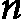 <st c="37869"><st c="37870">次，每次迭代，内部循环运行</st>  <st c="37922"><st c="37923">次，总共进行</st>  <st c="37953"><st c="37964">次比较。</st> <st c="37977">由于此操作主导了算法的运行时间，因此最佳、平均和最坏情况下的时间复杂度为</st> <st c="38095"><st c="38101">。</st></st></st></st></st>

<st c="38102">对于空间复杂度，我们需要确定执行选择排序时使用的辅助或临时内存。</st> <st c="38212">由于它采用原地排序方法，因此只需要一个常量量的额外空间用于交换元素，从而使其空间</st> <st c="38335">复杂度</st> <st c="38346"><st c="38347">。</st></st>

## <st c="38348">插入排序</st>

<st c="38363">插入排序</st> <st c="38378">是一种简单直观的算法，它通过逐步构建最终的有序列表，每次插入一个元素。</st> <st c="38484">插入排序</st> <st c="38498">通过将数组分为有序部分和无序部分来操作。</st> <st c="38578">每一步，算法从无序部分取出下一个元素，并将其插入到有序部分的适当位置。</st> <st c="38721">这个过程类似于排序扑克牌，每张牌都放在相对于已经排序好的牌的位置。</st> <st c="38845">已经排序的部分。</st>

<st c="38860">插入排序的时间复杂度是</st> 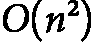 <st c="38902"><st c="38903">在平均情况和最坏情况中均为此复杂度。</st> <st c="38947">然而，在处理接近排序好的或</st>  <st c="39020"><st c="39021">小型数据集时，它展示了卓越的效率。</st></st></st>

<st c="39072">插入排序的一个主要优点是它作为排序方法的稳定性。</st> <st c="39145">此外，它是一个就地排序算法，仅需常量量的额外内存。</st> <st c="39239">它的简单性和对小型数据集的高效性使插入排序在特定情况下非常有价值，同时也是理解基本</st> <st c="39405">排序概念的优秀教育工具。</st>

**<st c="39422">示例 6.4</st>**

*<st c="39434">表 6.5</st>* <st c="39444">展示了</st> <st c="39456">插入排序对数组 [</st>`<st c="39515">8, 3, 1, 7,</st>` `<st c="39528">0, 10</st>`<st c="39533">] 的逐步处理过程：</st>

| **<st c="39536">通过</st>** | **<st c="39541">操作的描述</st>** | **<st c="39570">数组的内容</st>** |
| --- | --- | --- |
| <st c="39591">1</st> | <st c="39593">关键字 = 3，将 3 与 8 比较，并将 8 移到</st> <st c="39634">右边。</st><st c="39644">将 3 插入到</st> <st c="39661">正确的位置。</st> | <st c="39678">[3, 8, 1, 7,</st> <st c="39692">0, 10]</st> |
| <st c="39698">2</st> | <st c="39700">关键字 = 1，将 1 与 8 比较，并将 8 移到</st> <st c="39741">右边。</st><st c="39751">将 1 与 3 比较，并将 3 移到</st> <st c="39784">右边。</st><st c="39794">将 1 插入到</st> <st c="39811">正确的位置。</st> | <st c="39828">[1, 3, 8, 7,</st> <st c="39842">0, 10]</st> |
| <st c="39848">3</st> | <st c="39850">关键字 = 7，将 7 与 8 比较，并将 8 移到</st> <st c="39891">右边。</st><st c="39901">将 7 插入到</st> <st c="39918">正确的位置。</st> | <st c="39935">[1, 3, 7, 8,</st> <st c="39949">0, 10]</st> |
| <st c="39955">4</st> | <st c="39957">键值 = 0，将 0 与 8 进行比较，并将 8 移到右边。</st><st c="40008">将 0 与 7 进行比较，并将 7 移到右边。</st><st c="40041">将 0 与 3 进行比较，并将 3 移到右边。</st><st c="40051">将 0 与 1 进行比较，并将 1 移到右边。</st><st c="40094">将 0 插入到正确的位置。</st> | <st c="40171">[0, 1, 3, 7,</st> <st c="40185">8, 10]</st> |
| <st c="40191">5</st> | <st c="40193">键值 = 10，没有元素需要移动，将 10 插入正确的位置。</st> <st c="40259">现在数组</st> <st c="40273">已经排序。</st> | <st c="40283">[0, 1, 3, 7,</st> <st c="40297">8, 10]</st> |

<st c="40303">表 6.5：演示插入排序的示例</st>

<st c="40357">以下是插入排序的简单 Python 实现：</st>

```py
 def insertion_sort_iterative(a):
    n = len(a)
    for i in range(1, n):
        pointer = a[i]
        j = i - 1
        while j >= 0 and pointer < a[j]:
            a[j + 1] = a[j]
            j -= 1
        a[j + 1] = pointer
    return a
```

<st c="40599">插入排序算法的核心在于其内部的</st> `<st c="40659">while</st>` <st c="40664">循环（</st>`<st c="40671">while j >= 0 and key < a[j]:</st>`<st c="40700">）。</st> <st c="40704">该</st> `<st c="40725">while</st>` <st c="40730">循环的条件确保如果数据是预排序的（或几乎已排序），则算法在时间复杂度上表现为线性。</st> <st c="40856">接下来我们将详细讨论算法的正确性及其复杂度。</st>

### <st c="40927">正确性证明</st>

<st c="40948">插入排序的</st> <st c="40952">循环不变量指出，在外层循环的每次迭代开始时（</st>`<st c="41053">for i in range(1, n):</st>`<st c="41075">），</st> `<st c="41095">a[0:i]</st>` <st c="41101">中的元素与</st> `<st c="41152">a[0:i]</st>`<st c="41158">中的元素相同，但现在它们是按顺序排列的。</st> <st c="41185">为了验证算法的正确性，我们需要评估以下</st> <st c="41264">三个条件：</st>

+   **<st c="41281">初始化</st>**<st c="41296">：在第一次迭代之前（i = 1），子数组</st> **<st c="41350">a[0:1]</st>**<st c="41356">仅包含数组中的第一个元素，该元素自然处于正确的位置（已排序）。</st>

+   **<st c="41450">维护</st>**<st c="41462">：让我们假设循环不变量在第</st> *<st c="41514">i</st>*<st c="41515" class="calibre11">次</st><st c="41517">迭代之前成立。</st> <st c="41529">该算法将</st> **<st c="41551">a[i]</st>** <st c="41555">插入到已排序的子数组</st> **<st c="41583">a[0:i]</st>**<st c="41589">中，方法是将大于</st> **<st c="41632">a[i]</st>** <st c="41636">的元素向右移动一个位置。</st> <st c="41664">这个插入操作确保了</st> **<st c="41692">a[0:i+1]</st>** <st c="41700">是已排序的。</st> <st c="41712">因此，循环不变量</st> <st c="41732">得以保持。</st>

+   **<st c="41746">终止条件</st>**<st c="41758">：该算法在</st> 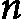 <st c="41792"><st c="41793">次外循环迭代后终止，其中</st>  <st c="41830"><st c="41831">是数组的长度。</st> <st c="41860">此时，不变式保证整个数组</st> **<st c="41923">a[0:n]</st>**<st c="41929">已经排序，因为所有元素都已</st> <st c="41963">处理完毕。</st></st></st>

### <st c="41978">复杂度分析</st>

<st c="41998">要理解</st> <st c="42012">时间复杂度，我们可以在以下情况下进行分析：</st>

+   **<st c="42079">最佳情况</st>**<st c="42089">：</st>  <st c="42092"><st c="42093">– 如前所示，</st> **<st c="42145">while</st>** <st c="42150">循环的条件确保当输入已经排序时，</st> **<st c="42205">while</st>** <st c="42210">循环不会执行，从而保证了线性</st> <st c="42256">时间复杂度。</st></st>

+   **<st c="42272">平均情况</st>**<st c="42285">：</st>  <st c="42288"><st c="42294">– 算法平均执行</st>  <st c="42319"><st c="42328">次比较和</st>  <st c="42344"><st c="42353">次交换操作。</st> <st c="42359">这是算法的平均表现。</st></st></st></st>

+   **<st c="42370">最坏情况</st>**<st c="42381">：</st>  <st c="42384"><st c="42390">- 当输入数组是逆序排列时，发生此情况。</st> <st c="42453">在这种情况下，</st> **<st c="42492">while</st>** <st c="42497">循环的条件使得它在每次迭代中执行</st>  <st c="42524"><st c="42525">次。</st> <st c="42551">考虑到外部循环执行</st>  <st c="42582"><st c="42631">次，最大比较次数和交换次数将</st> <st c="42687">是</st> <st c="42690"><st c="42701">。</st></st></st></st></st>

<st c="42702">要评估</st> <st c="42713">空间复杂度，我们需要评估运行插入排序所需的辅助或临时空间。</st> <st c="42820">鉴于插入排序是一个原地算法，它只需要常量量的额外空间用于元素交换。</st> <st c="42944">因此，它的空间复杂度</st> <st c="42979">是</st> <st c="42982"><st c="42983">。</st></st>

<st c="42984">在介绍了主要的迭代排序算法后，我们现在将重点讨论递归</st> <st c="43092">排序方法。</st>

# <st c="43108">递归排序算法</st>

<st c="43137">那些</st> <st c="43141">迭代的非递归排序算法，虽然通常在空间效率上表现良好，但在时间复杂度方面往往存在不足，特别是在处理大数据集时。</st> <st c="43309">这种限制在涉及大量数据的场景中变得尤为关键，因为这时需要更高效的排序机制。</st> <st c="43449">在</st> *<st c="43452">表 6.1</st>*<st c="43461">中，我们讨论了递归排序算法的一般特点，突出了它们克服</st> <st c="43621">迭代方法所面临的时间复杂度问题的潜力。</st>

<st c="43639">在这一节中，我们分析了两种主要的递归排序算法：归并排序和快速排序。</st> <st c="43735">这两种算法都利用分治策略，与迭代排序算法相比，性能更为优越。</st> <st c="43866">归并排序具有稳定的</st>  <st c="43898"><st c="43909">时间复杂度，提供了稳定且可预测的排序效率。</st> <st c="43978">快速排序以其平均情况的</st> 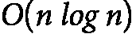 <st c="44019"><st c="44030">性能著称，并且将简洁性</st> <st c="44066">与高效性相结合。</st></st></st>

<st c="44082">还值得一提的是，另一个重要的递归排序算法——堆排序，将在</st> *<st c="44197">第十三章</st>* <st c="44207">中介绍，当时我们会讨论堆结构。</st> <st c="44241">堆排序像归并排序和快速排序一样，采用分治方法，但通过使用二叉堆数据结构来实现，从而提供了一种高效且节省空间的</st> <st c="44429">排序解决方案。</st>

## <st c="44446">归并排序</st>

<st c="44457">归并排序</st> <st c="44469">是一种基于比较的排序</st> <st c="44499">算法，采用分治策略。</st> <st c="44556">其操作过程是通过递归地将未排序的数组分割成两个大致相等的部分，直到每个子数组只包含一个元素（这自然是排序好的）。</st> <st c="44725">然后，算法将这些子数组合并</st> <st c="44770">，生成新的排序子数组，并持续这个过程，直到只剩下一个排序好的数组，这个数组就是原始数组的排序结果。</st> <st c="44915">在合并步骤中，比较每个子数组的最小元素，然后将两个子数组</st> <st c="45011">合并在一起。</st>

**<st c="45024">示例 6.5</st>**

*<st c="45036">表 6.6</st>* <st c="45046">展示了合并排序对于数组[</st>`<st c="45113">38, 27, 43, 3,</st>` `<st c="45129">9, 82</st>`<st c="45134">]的逐步过程：</st>

| **<st c="45137">拆分/合并</st>** | **<st c="45149">数组（子数组）的内容</st>** |
| --- | --- |
| <st c="45175">第一次拆分</st> | <st c="45187">将[38, 27, 43, 3, 9, 82]拆分为[38, 27, 43]和[3,</st> <st c="45243">9, 82]。</st> |
| <st c="45250">第二次拆分（</st><st c="45265">左半部分)</st> | <st c="45276">将[38, 27, 43]拆分为[38]和[</st><st c="45311">27, 43]。</st><st c="45320">将[27, 43]拆分为[27]</st> <st c="45346">和[43]。</st> |
| <st c="45355">合并</st><st c="45361">(</st><st c="45363">左半部分)</st> | <st c="45373">将[27]和[43]合并得到[</st><st c="45402">27, 43]。</st><st c="45411">将[38]和[27, 43]合并得到[27,</st> <st c="45448">38, 43]。</st> |
| <st c="45456">第二次拆分（</st><st c="45471">右半部分）</st> | <st c="45483">将[3, 9, 82]拆分为[3]和[</st><st c="45515">9, 82]。</st><st c="45523">将[9, 82]拆分为[9]</st> <st c="45547">和[82]。</st> |
| <st c="45556">合并</st><st c="45562">(</st><st c="45564">右半部分)</st> | <st c="45575">将[9]和[82]合并得到[</st><st c="45603">9, 82]。</st><st c="45611">将[3]和[9, 82]合并得到[3,</st> <st c="45645">9, 82]。</st> |
| <st c="45652">最终合并</st> | <st c="45664">将[27, 38, 43]和[3, 9, 82]合并得到[3, 9, 27, 38,</st> <st c="45721">43, 82]。</st><st c="45729">现在数组已排序：[3, 9, 27, 38,</st> <st c="45770">43, 82]。</st> |

<st c="45778">表 6.6：演示合并排序的示例</st>

<st c="45828">以下是合并排序算法的 Python 实现：</st> <st c="45876">排序算法：</st>

```py
 import numpy as np
def merge(A,p,q,r):
    n1=q-p+1
    n2=r-q
    n11=n1+1
    n22=n2+1
    left = [0 for i in range(n11)]
    right = [0 for i in range(n22)]
    for i in range(n1):
        left[i]=A[p+i-1]
    for j in range(n2):
        right[j]=A[q+j]
    left[n11-1]=1000  #very large number
    right[n22-1]=1000 #very large number
    i=0
    j=0
    for k in range(p-1,r):
        if left[i]<=right[j]:
            A[k]=left[i]
            i=i+1
        else:
            A[k]=right[j]
            j=j+1
    return(A)
def mergeSort(A,p,r):
    if p<r:
        q=int(np.floor((p+r)/2))
        mergeSort(A,p,q)
        mergeSort(A,q+1,r)
        merge(A,p,q,r)
    return(A)
```

<st c="46397">尽管</st> <st c="46404">有许多不同的合并排序实现</st> <st c="46438">，我们展示的版本非常直接。</st> <st c="46505">该算法的关键组件是一个名为</st> `<st c="46561">merge</st>` <st c="46567">的函数，用于合并已经</st> <st c="46615">递归排序的两个分区。</st>

### <st c="46634">正确性证明</st>

<st c="46655">合并排序中的循环不变量定义指出，在每次合并过程的开始，</st> `<st c="46771">左分区</st>` <st c="46785">和</st> `<st c="46790">右分区</st>` <st c="46805">子数组已经是排序好的。</st> <st c="46829">我们需要评估三个条件以证明</st> <st c="46874">算法的正确性：</st>

+   **<st c="46898">初始化</st>**<st c="46913">：在第一次合并操作之前，子数组包含单个元素，这些元素</st> <st c="47000">本身就是排序好的。</st>

+   **<st c="47018">维护</st>**<st c="47030">：假设在合并两个子数组之前，不变量是成立的。</st> <st c="47091">在合并过程中，从任一子数组中选择最小的剩余元素并将其添加到合并数组中。</st> <st c="47213">这确保了合并数组的排序顺序。</st> <st c="47266">不变量成立的原因是每一步选择都确保合并后的数组</st> <st c="47339">保持有序。</st>

+   **<st c="47354">终止条件</st>**<st c="47366">：当所有子数组都合并成一个排序数组时，算法终止。</st> <st c="47460">此时，不变量保证整个数组</st> <st c="47522">是有序的。</st>

### <st c="47532">复杂度分析</st>

<st c="47552">归并排序是一种递归排序算法，其操作遵循递归函数</st> ![<mml:math xmlns:mml="http://www.w3.org/1998/Math/MathML" xmlns:m="http://schemas.openxmlformats.org/officeDocument/2006/math"><mml:mi>T</mml:mi><mml:mfenced separators="|"><mml:mrow><mml:mi>n</mml:mi></mml:mrow></mml:mfenced><mml:mo>=</mml:mo><mml:mn>2</mml:mn><mml:mi>T</mml:mi><mml:mfenced separators="|"><mml:mrow><mml:mfrac><mml:mrow><mml:mi>n</mml:mi></mml:mrow><mml:mrow><mml:mn>2</mml:mn></mml:mrow></mml:mfrac></mml:mrow></mml:mfenced><mml:mo>+</mml:mo><mml:mi>O</mml:mi><mml:mfenced separators="|"><mml:mrow><mml:mi>n</mml:mi></mml:mrow></mml:mfenced></mml:math>](img/1085.png)<st c="47648"><st c="47666">。在每一步递归中，归并排序将问题分解为两个几乎相等的子问题，反映了典型的分治法关系</st> ![<mml:math xmlns:mml="http://www.w3.org/1998/Math/MathML" xmlns:m="http://schemas.openxmlformats.org/officeDocument/2006/math"><mml:mi>T</mml:mi><mml:mfenced separators="|"><mml:mrow><mml:mi>n</mml:mi></mml:mrow></mml:mfenced><mml:mo>=</mml:mo><mml:mi>a</mml:mi><mml:mi>T</mml:mi><mml:mfenced separators="|"><mml:mrow><mml:mfrac><mml:mrow><mml:mi>n</mml:mi></mml:mrow><mml:mrow><mml:mi>b</mml:mi></mml:mrow></mml:mfrac></mml:mrow></mml:mfenced><mml:mo>+</mml:mo><mml:mi>f</mml:mi><mml:mfenced separators="|"><mml:mrow><mml:mi>n</mml:mi></mml:mrow></mml:mfenced></mml:math>](img/1086.png) <st c="47810"><st c="47829">其中</st>  <st c="47834"><st c="47835">且</st> <st c="47840"><st c="47841">。数组的分割和已排序子数组的合并都是线性时间操作，</st> <st c="47943">因此</st> <st c="47949"><st c="47950">。</st></st></st></st></st></st>

<st c="47951">为了评估归并排序的运行时间复杂度，我们需要通过主定理等方法来求解这个递推函数。</st> <st c="48091">主定理提供了一种简洁的方法来解决形式为</st> ![<mml:math xmlns:mml="http://www.w3.org/1998/Math/MathML" xmlns:m="http://schemas.openxmlformats.org/officeDocument/2006/math"><mml:mi>T</mml:mi><mml:mfenced separators="|"><mml:mrow><mml:mi>n</mml:mi></mml:mrow></mml:mfenced><mml:mo>=</mml:mo><mml:mi>a</mml:mi><mml:mi>T</mml:mi><mml:mfenced separators="|"><mml:mrow><mml:mfrac><mml:mrow><mml:mi>n</mml:mi></mml:mrow><mml:mrow><mml:mi>b</mml:mi></mml:mrow></mml:mfrac></mml:mrow></mml:mfenced><mml:mo>+</mml:mo><mml:mi>f</mml:mi><mml:mfenced separators="|"><mml:mrow><mml:mi>n</mml:mi></mml:mrow></mml:mfenced></mml:math>](img/1090.png) <st c="48174"><st c="48189">通过将</st>  <st c="48202"><st c="48206">与</st> <st c="48209"><st c="48210">进行比较</st></st></st></st>

<st c="48211">在归并排序的情况下，</st> 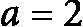<st c="48239"><st c="48240">，</st> 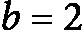<st c="48242"><st c="48243">，</st> <st c="48245">并且</st> <st c="48249"><st c="48250">。</st></st></st></st>

<st c="48251">我们计算</st> <st c="48265"><st c="48281">。根据以下的</st> <st c="48320">主定理：</st></st>

+   <st c="48335">如果</st>  <st c="48339"><st c="48349">其中</st> <st c="48355"><st c="48364">，</st> <st c="48366">则</st> ![<mml:math xmlns:mml="http://www.w3.org/1998/Math/MathML" xmlns:m="http://schemas.openxmlformats.org/officeDocument/2006/math"><mml:mi>T</mml:mi><mml:mfenced separators="|"><mml:mrow><mml:mi>n</mml:mi></mml:mrow></mml:mfenced><mml:mo>=</mml:mo><mml:mi mathvariant="normal">Θ</mml:mi><mml:mfenced separators="|"><mml:mrow><mml:msup><mml:mrow><mml:mi>n</mml:mi></mml:mrow><mml:mrow><mml:mrow><mml:mrow><mml:msub><mml:mrow><mml:mi mathvariant="normal">log</mml:mi></mml:mrow><mml:mrow><mml:mi>b</mml:mi></mml:mrow></mml:msub></mml:mrow><mml:mo>⁡</mml:mo><mml:mrow><mml:mi>a</mml:mi></mml:mrow></mml:mrow></mml:mrow></mml:msup></mml:mrow></mml:mfenced></mml:math>](img/1099.png)</st></st>

+   <st c="48372">如果</st> ![<mml:math xmlns:mml="http://www.w3.org/1998/Math/MathML" xmlns:m="http://schemas.openxmlformats.org/officeDocument/2006/math"><mml:mi>f</mml:mi><mml:mfenced separators="|"><mml:mrow><mml:mi>n</mml:mi></mml:mrow></mml:mfenced><mml:mo>=</mml:mo><mml:mi>T</mml:mi><mml:mi>h</mml:mi><mml:mi>e</mml:mi><mml:mi>t</mml:mi><mml:mi>a</mml:mi><mml:mfenced separators="|"><mml:mrow><mml:msup><mml:mrow><mml:mi>n</mml:mi></mml:mrow><mml:mrow><mml:mrow><mml:mrow><mml:msub><mml:mrow><mml:mi mathvariant="normal">log</mml:mi></mml:mrow><mml:mrow><mml:mi>b</mml:mi></mml:mrow></mml:msub></mml:mrow><mml:mo>⁡</mml:mo><mml:mrow><mml:mi>a</mml:mi></mml:mrow></mml:mrow></mml:mrow></mml:msup></mml:mrow></mml:mfenced></mml:math>](img/1100.png)<st c="48375"><st c="48394">，</st> <st c="48396">那么</st> ![<mml:math xmlns:mml="http://www.w3.org/1998/Math/MathML" xmlns:m="http://schemas.openxmlformats.org/officeDocument/2006/math"><mml:mi>T</mml:mi><mml:mfenced separators="|"><mml:mrow><mml:mi>n</mml:mi></mml:mrow></mml:mfenced><mml:mo>=</mml:mo><mml:mi mathvariant="normal">Θ</mml:mi><mml:mfenced separators="|"><mml:mrow><mml:msup><mml:mrow><mml:mi>n</mml:mi></mml:mrow><mml:mrow><mml:mrow><mml:mrow><mml:msub><mml:mrow><mml:mi mathvariant="normal">log</mml:mi></mml:mrow><mml:mrow><mml:mi>b</mml:mi></mml:mrow></mml:msub></mml:mrow><mml:mo>⁡</mml:mo><mml:mrow><mml:mi>a</mml:mi></mml:mrow></mml:mrow></mml:mrow></mml:msup><mml:mrow><mml:mrow><mml:mi mathvariant="normal">log</mml:mi></mml:mrow><mml:mo>⁡</mml:mo><mml:mrow><mml:mi>n</mml:mi></mml:mrow></mml:mrow></mml:mrow></mml:mfenced></mml:math>](img/1101.png)</st>

+   <st c="48420">如果</st>  <st c="48423"><st c="48432">其中</st> <st c="48438"><st c="48447">，并且如果</st>  <st c="48456"><st c="48467">对于某些</st>  <st c="48476"><st c="48477">且当</st> <st c="48501"><st c="48550">时，</st> <st c="48552">则</st> 

<st c="48571">在我们的例子中，</st>  <st c="48584"><st c="48585">符合主定理的第二种情况，因为</st>  <st c="48640"><st c="48645">为</st> ![<mml:math xmlns=mml="http://www.w3.org/1998/Math/MathML" xmlns:m="http://schemas.openxmlformats.org/officeDocument/2006/math"><mml:mi mathvariant="normal">Θ</mml:mi><mml:mfenced separators="|"><mml:mrow><mml:msup><mml:mrow><mml:mi>n</mml:mi></mml:mrow><mml:mrow><mml:mrow><mml:mrow><mml:msub><mml:mrow><mml:mi mathvariant="normal">log</mml:mi></mml:mrow><mml:mrow><mml:mn>2</mml:mn></mml:mrow></mml:msub></mml:mrow><mml:mo>⁡</mml:mo><mml:mrow><mml:mn>2</mml:mn></mml:mrow></mml:mrow></mml:mrow></mml:msup></mml:mrow></mml:mfenced><mml:mo>=</mml:mo><mml:mi mathvariant="normal">Θ</mml:mi><mml:mfenced separators="|"><mml:mrow><mml:mi>n</mml:mi></mml:mrow></mml:mfenced></mml:math>](img/1110.png)<st c="48648"><st c="48664">。因此，适用第二种情况，得出以下结论：</st></st></st></st>

<st c="48724"><st c="48741">。</st></st>

<st c="48742">为了评估归并排序的时间复杂度，我们可以在以下几种情况进行分析：</st>

+   **<st c="48833">最佳情况</st>**<st c="48843">:</st>  <st c="48846"><st c="48856">– 合并排序始终以对数步长分割数组并合并子数组。</st>

+   **<st c="48942">平均情况</st>**<st c="48955">:</st>  <st c="48958"><st c="48968">– 由于其</st> <st c="49030">分治法</st><st c="48955">，算法在所有情况下都能保持一致的表现。</st>

+   **<st c="49057">最坏情况</st>**<st c="49068">:</st>  <st c="49071"><st c="49081">– 归并排序不是自适应的，这意味着无论初始元素的顺序如何，它的表现始终保持一致。</st> <st c="49189">元素</st>

<st c="49201">要确定空间复杂度，我们需要考虑执行归并排序所需的辅助或临时空间。</st> <st c="49322">在归并排序算法中，使用了两个数组，</st> `<st c="49363">left_partition</st>` <st c="49377">和</st> `<st c="49382">right_partition</st>`<st c="49397">，作为合并操作期间的临时存储。</st> <st c="49457">这两个数组的总大小等于输入大小，因此空间复杂度为</st> <st c="49555">的</st> <st c="49558"><st c="49559">。</st></st>

<st c="49560">总之，归并排序</st> <st c="49584">是一种高效且稳定的排序算法，其时间复杂度为</st><st c="49660"> <st c="49662"><st c="49670">在最佳、平均和最坏情况下均如此。</st> <st c="49709">它采用分治法，将数组分成更小的子数组，递归排序后再按顺序合并。</st> <st c="49856">尽管它需要</st> <st c="49881"><st c="49883">额外的空间，但它稳定的表现和一致性使它成为排序大型数据集的优选，特别是在需要稳定性时。</st> <st c="50039">归并排序的递归特性和可靠性能使其成为计算机科学中的基础算法。</st>

## <st c="50154">快速排序</st>

<st c="50165">快速排序是一种</st> <st c="50179">高效的分治排序算法，像归并排序一样，依赖于比较。</st> <st c="50217">它通过递归从数组中选择一个枢轴元素，并根据其他元素是否小于或大于该枢轴，将剩余元素划分为两个子数组。</st> <st c="50282">然后，这些子数组会递归排序。</st> <st c="50454">这个过程会一直重复，直到达到基准情况：空数组或只有一个元素的子数组，这本身就已经是排序好的。</st> <st c="50500">此过程将一直进行，直到所有子数组为空或只有一个元素为止。</st> <st c="50622">快速排序的效果在很大程度上取决于枢轴的选择和划分方法。</st> <st c="50713">划分方法的选择对于最终性能有很大影响。</st>

<st c="50730">快速排序算法由三个</st> <st c="50778">关键组成部分构成：</st>

+   **<st c="50793">枢轴选择</st>**<st c="50809">：这一步骤涉及从数组中选择一个元素作为枢轴。</st> <st c="50816">常见的选择有第一个、最后一个、中间元素，或随机选择一个元素。</st> <st c="50960">具体的枢轴选择策略会影响算法的整体性能。</st> <st c="51049">在概率快速排序中，枢轴是随机选择的（见</st> *<st c="51116">第九章</st>*<st c="51125">）。</st>

+   **<st c="51128">划分</st>**<st c="51141">：在这一步中，数组被分成两个较小的子数组。</st> <st c="51212">所有小于枢轴的元素放入一个子数组，而大于枢轴的元素放入另一个子数组。</st> <st c="51337">经过这一步，枢轴元素已经处于其最终排序位置。</st> <st c="51403">在数组中。</st>

+   **<st c="51413">递归</st>**<st c="51423">：划分步骤会递归地重复，直到所有子数组为空或只包含一个元素，最终得到一个完全</st> <st c="51571">排序好的数组。</st>

**<st c="51584">示例 6.6</st>**

<st c="51596">我们用六个随机数的数组来说明操作——[</st>`<st c="51665">35, 12, 99, 42,</st>` `<st c="51682">5, 8</st>`<st c="51686">]：</st>

1.  <st c="51689">选择</st> <st c="51696">一个枢轴（例如，</st> **<st c="51712">8</st>**<st c="51713">）并重新排列数组，使得小于枢轴的元素位于其前面，大于枢轴的元素位于其后。</st>

1.  <st c="51826">递归排序左</st> <st c="51849">子数组</st> `<st c="51864">[5]</st>` <st c="51867">已经</st> <st c="51871">排序完毕。</st>

1.  <st c="51886">递归排序右子数组</st> `<st c="51960">35</st>`<st c="51962">）并重新排列：</st> `<st c="51980">[5, 8, 12, 35,</st>` `<st c="51995">42, 99]</st>`<st c="52002">。</st>

1.  <st c="52003">递归排序子数组</st> **<st c="52032">[12]</st>** <st c="52036">和</st> **<st c="52041">[</st>****<st c="52042">42, 99]</st>**<st c="52049">：</st>

    +   **<st c="52051">[12]</st>** <st c="52055">已经排序。</st>

    +   <st c="52074">选择一个枢轴（例如，</st> **<st c="52097">42</st>**<st c="52099">）并重新排列</st> **<st c="52116">[42, 99]</st>**<st c="52124">：</st> **<st c="52127">[5, 8, 12, 35,</st>** **<st c="52142">42, 99]</st>**<st c="52149">。</st>

1.  <st c="52150">现在数组已经排序：</st> **<st c="52176">[5, 8, 12, 35,</st>** **<st c="52191">42, 99]</st>**<st c="52198">。</st>

<st c="52199">以下是快速排序算法的 Python 实现：</st> <st c="52247">排序算法：</st>

```py
 def quick_sort(arr):
    if len(arr) <= 1:
        return arr
    else:
        pivot = arr[len(arr) // 2]
        left = [x for x in arr if x < pivot]
        middle = [x for x in arr if x == pivot]
        right = [x for x in arr if x > pivot]
        return quick_sort(left) + middle + quick_sort(right)
```

<st c="52513">如所示，快速排序算法的核心概念是选择一个枢轴元素进行分区。</st> <st c="52623">这个过程会递归地重复。</st>

### <st c="52665">正确性证明</st>

<st c="52686">归并排序中的循环不变式</st> <st c="52705">定义保证在每次分区过程开始时，所有</st> `<st c="52827">left_partition</st>` <st c="52841">中的元素都不大于</st> `<st c="52867">pivot</st>`<st c="52872">，并且所有</st> `<st c="52894">right_partition</st>` <st c="52909">中的元素都不小于</st> `<st c="52932">pivot</st>`<st c="52937">。我们需要评估以下三个条件来验证</st> <st c="52984">算法的正确性：</st>

+   **<st c="53008">初始化</st>**<st c="53023">：在第一次分区操作之前，子数组是整个数组，由于尚未处理任何元素，循环不变式显然成立。</st>

+   **<st c="53183">维护</st>**<st c="53195">：在分区过程中，元素会与枢轴进行比较，并根据需要交换位置。</st> <st c="53292">这确保了两个子数组，</st> **<st c="53330">left_partition</st>** <st c="53344">和</st> **<st c="53349">right_partition</st>**<st c="53364">，按照定义被维护；</st> **<st c="53410">left_partition</st>** <st c="53424">包含小于</st> **<st c="53460">pivot</st>**<st c="53465">的元素，</st> **<st c="53471">right_partition</st>** <st c="53486">包含大于</st> <st c="53518">pivot</st>**<st c="53522">的元素。</st>

+   **<st c="53528">终止</st>**<st c="53540">：当子数组的长度为 0 或 1 时，算法终止，因为这些子数组本身已经排序。</st> <st c="53643">循环不变式保证在每一步中元素都被正确分区，从而确保整个数组在完成时已经排序。</st>

### <st c="53783">复杂度分析</st>

<st c="53803">快速排序的特点是</st> <st c="53817">以下递归函数：</st> <st c="53849">递归函数：</st>


<st c="53900">这里，</st>  <st c="53906"><st c="53907">是小于主元的元素个数。</st> <st c="53958">为了简化分析，我们假设一个理想情况，其中主元总是将列表分成两个相等的部分，得出以下</st> <st c="54103">递推函数：</st></st>

![<mml:math xmlns:mml="http://www.w3.org/1998/Math/MathML" xmlns:m="http://schemas.openxmlformats.org/officeDocument/2006/math" display="block"><mml:mi>T</mml:mi><mml:mfenced separators="|"><mml:mrow><mml:mi>n</mml:mi></mml:mrow></mml:mfenced><mml:mo>=</mml:mo><mml:mn>2</mml:mn><mml:mi>T</mml:mi><mml:mfenced separators="|"><mml:mrow><mml:mfrac><mml:mrow><mml:mi>n</mml:mi></mml:mrow><mml:mrow><mml:mn>2</mml:mn></mml:mrow></mml:mfrac></mml:mrow></mml:mfenced><mml:mo>+</mml:mo><mml:mi>O</mml:mi><mml:mfenced separators="|"><mml:mrow><mml:mi>n</mml:mi></mml:mrow></mml:mfenced></mml:math>](img/1121.png)

<st c="54141">这可以</st> <st c="54149">表示为一个通用的分治函数形式：</st>

![<mml:math xmlns:mml="http://www.w3.org/1998/Math/MathML" xmlns:m="http://schemas.openxmlformats.org/officeDocument/2006/math"><mml:mi>T</mml:mi><mml:mfenced separators="|"><mml:mrow><mml:mi>n</mml:mi></mml:mrow></mml:mfenced><mml:mo>=</mml:mo><mml:mi>a</mml:mi><mml:mi>T</mml:mi><mml:mfenced separators="|"><mml:mrow><mml:mfrac><mml:mrow><mml:mi>n</mml:mi></mml:mrow><mml:mrow><mml:mi>b</mml:mi></mml:mrow></mml:mfrac></mml:mrow></mml:mfenced><mml:mo>+</mml:mo><mml:mi>f</mml:mi><mml:mfenced separators="|"><mml:mrow><mml:mi>n</mml:mi></mml:mrow></mml:mfenced></mml:math>](img/1090.png) <st c="54216"><st c="54232">与</st> <st c="54237"><st c="54238">，</st> <st c="54240"><st c="54241">，</st> <st c="54243">以及</st> </st></st></st>

<st c="54248">为了确定时间复杂度，我们应用主定理。</st> <st c="54311">主定理帮助求解形式为</st> ![<mml:math xmlns:mml="http://www.w3.org/1998/Math/MathML" xmlns:m="http://schemas.openxmlformats.org/officeDocument/2006/math"><mml:mi>T</mml:mi><mml:mfenced separators="|"><mml:mrow><mml:mi>n</mml:mi></mml:mrow></mml:mfenced><mml:mo>=</mml:mo><mml:mi>a</mml:mi><mml:mi>T</mml:mi><mml:mfenced separators="|"><mml:mrow><mml:mfrac><mml:mrow><mml:mi>n</mml:mi></mml:mrow><mml:mrow><mml:mi>b</mml:mi></mml:mrow></mml:mfrac></mml:mrow></mml:mfenced><mml:mo>+</mml:mo><mml:mi>f</mml:mi><mml:mfenced separators="|"><mml:mrow><mml:mi>n</mml:mi></mml:mrow></mml:mfenced></mml:math>](img/1126.png) <st c="54366"><st c="54381">通过比较</st>  <st c="54394"><st c="54399">与</st> <st c="54402"><st c="54409">进行比较。</st> 在快速排序的情况下，</st> <st c="54438"><st c="54439">，</st> <st c="54441"><st c="54442">，</st> <st c="54444">并且</st> <st c="54448"><st c="54449">。</st></st></st></st></st></st></st>

<st c="54450">在我们的例子中，</st>  <st c="54464"><st c="54465">匹配了主定理的第二种情况，因为</st>  <st c="54520"><st c="54525">是</st> ![<mml:math xmlns:mml="http://www.w3.org/1998/Math/MathML" xmlns:m="http://schemas.openxmlformats.org/officeDocument/2006/math"><mml:mi mathvariant="normal">Θ</mml:mi><mml:mfenced separators="|"><mml:mrow><mml:msup><mml:mrow><mml:mi>n</mml:mi></mml:mrow><mml:mrow><mml:mrow><mml:mrow><mml:msub><mml:mrow><mml:mi mathvariant="normal">log</mml:mi></mml:mrow><mml:mrow><mml:mn>2</mml:mn></mml:mrow></mml:msub></mml:mrow><mml:mo>⁡</mml:mo><mml:mrow><mml:mn>2</mml:mn></mml:mrow></mml:mrow></mml:mrow></mml:msup></mml:mrow></mml:mfenced><mml:mo>=</mml:mo><mml:mi mathvariant="normal">Θ</mml:mi><mml:mfenced separators="|"><mml:mrow><mml:mi>n</mml:mi></mml:mrow></mml:mfenced></mml:math>](img/1134.png)<st c="54528"><st c="54545">。因此，适用第二种情况，得出以下结论：</st></st></st></st>


<st c="54622">这表明，快速排序的平均时间复杂度是</st> <st c="54692"><st c="54701">。由于这种高效性，快速排序对于大数据集非常有效。</st> <st c="54778">然而，在最坏的情况下，当枢轴选择不当，导致持续的不平衡分割（例如，总是选择最小或最大的元素作为枢轴）时，递推关系变为</st> <st c="55005">以下形式：</st></st>


<st c="55051">这简化为</st> <st c="55070">如下结果：</st>


<st c="55086">解决这个递归关系得到</st> <st c="55126">如下结果：</st>


<st c="55142">因此，快速排序的最坏情况时间复杂度是</st> <st c="55201"><st c="55207">。然而，通过采用随机基准选择或三数中值法等策略，可以大大减少遇到最坏情况的几率，从而帮助保持算法的平均情况表现。</st> <st c="55425">以下是快速排序的</st> <st c="55468">时间复杂度总结：</st>

+   **<st c="55484">最佳情况</st>**<st c="55494">：</st> <st c="55496"><st c="55505">– 这种情况发生在基准值始终将数组划分为两个几乎相等的部分时</st> <st c="55580">。</st>

+   **<st c="55592">平均情况</st>**<st c="55605">:</st>  <st c="55608"><st c="55619">– 该算法在随机</st> <st c="55672">枢轴选择</st></st>下表现良好

+   **<st c="55687">最坏情况</st>**<st c="55698">:</st>  <st c="55701"><st c="55707">– 当枢轴选择始终导致最不平衡的划分时发生（例如，最小或</st> <st c="55819">最大元素）</st></st>

<st c="55835">快速排序是一种</st> <st c="55851">递归算法，其特征是递归关系</st> ![<mml:math xmlns:mml="http://www.w3.org/1998/Math/MathML" xmlns:m="http://schemas.openxmlformats.org/officeDocument/2006/math"><mml:mi>T</mml:mi><mml:mfenced separators="|"><mml:mrow><mml:mi>n</mml:mi></mml:mrow></mml:mfenced><mml:mo>=</mml:mo><mml:mn>2</mml:mn><mml:mi>T</mml:mi><mml:mfenced separators="|"><mml:mrow><mml:mfrac><mml:mrow><mml:mi>n</mml:mi></mml:mrow><mml:mrow><mml:mn>2</mml:mn></mml:mrow></mml:mfrac></mml:mrow></mml:mfenced><mml:mo>+</mml:mo><mml:mi>O</mml:mi><mml:mfenced separators="|"><mml:mrow><mml:mi>n</mml:mi></mml:mrow></mml:mfenced></mml:math>](img/1144.png)<st c="55913"><st c="55933">。在每次递归步骤中，快速排序将问题分成两个几乎相等的子问题，从而得到关系</st> ![<mml:math xmlns:mml="http://www.w3.org/1998/Math/MathML" xmlns:m="http://schemas.openxmlformats.org/officeDocument/2006/math"><mml:mi>T</mml:mi><mml:mfenced separators="|"><mml:mrow><mml:mi>n</mml:mi></mml:mrow></mml:mfenced><mml:mo>=</mml:mo><mml:mi>a</mml:mi><mml:mi>T</mml:mi><mml:mfenced separators="|"><mml:mrow><mml:mfrac><mml:mrow><mml:mi>n</mml:mi></mml:mrow><mml:mrow><mml:mi>b</mml:mi></mml:mrow></mml:mfrac></mml:mrow></mml:mfenced><mml:mo>+</mml:mo><mml:mi>f</mml:mi><mml:mfenced separators="|"><mml:mrow><mml:mi>n</mml:mi></mml:mrow></mml:mfenced></mml:math>](img/1145.png)<st c="56050"><st c="56069">，其中</st> <st c="56076"><st c="56083">。分割和合并操作在 O(n) 时间内完成，表示为</st> <st c="56158"><st c="56159">。要理解时间复杂度，我们可以在以下场景中进行分析。</st></st></st></st></st>

<st c="56241">对于空间复杂度，我们需要考虑执行快速排序所需的辅助或临时空间。</st> <st c="56353">快速排序需要额外的空间来存储递归栈。</st> <st c="56415">在平均情况下，栈的深度是</st> <st c="56455"><st c="56464">。然而，在最坏的情况下（例如，不平衡的分区），栈的深度可能是</st> <st c="56544">是</st> <st c="56547"><st c="56548">。</st></st></st>

<st c="56549">总的来说，快速排序的性能受选取枢轴和划分方法的显著影响。</st> <st c="56668">不当的枢轴选择可能导致最坏情况下的时间复杂度为</st> <st c="56735"><st c="56736">，而平均情况下的性能为</st> <st c="56776"><st c="56785">。诸如随机枢轴选择或三数取中法等技术可以帮助减少枢轴选择不当的风险。</st> <st c="56911">尽管快速排序不是稳定排序算法，但它是就地排序，并且在平均情况下仅需要</st>  <st c="56994"><st c="57003">的辅助空间来存储递归栈。</st> <st c="57064">其高效性和简洁性使得快速排序在各种应用中成为处理大数据集时的热门选择。</st> <st c="57157"> </st>

<st c="57178">到目前为止，我们讨论的所有排序算法，无论是递归的还是非递归的，都是基于比较的。</st> <st c="57294">现在，我们将讨论排序算法中的另一个重要主题——非比较排序方法，它可以实现</st> <st c="57419">线性时间</st>。

# <st c="57431">非比较排序</st>

<st c="57460">我们已经注意到</st> <st c="57475">所有基于比较的排序算法具有下界时间复杂度为</st> <st c="57558"><st c="57567">，这意味着没有任何基于比较的算法能够达到比</st>  <st c="57647"><st c="57653">的性能。</st> <st c="57674">然而，也有一些排序算法不依赖于比较。</st> <st c="57747">这些非比较基排序算法利用了关于数据的某些假设或信息，从而实现了</st> <st c="57855">更好的性能。</st></st></st>

<st c="57874">与</st> <st c="57881">基于比较的算法不同，非比较基排序算法可以像线性时间一样高效地实现下界。</st> <st c="58000">这种显著的效率使得它们有时被称为线性时间排序算法。</st> <st c="58100">通过利用数据的特定属性，如有限的整数值范围或数字分布，这些算法能够绕过比较限制，并在合适的条件下更快地排序。</st> <st c="58321">在本节中，我们将探讨三种著名的非比较基排序算法：计数排序、基数排序和</st> <st c="58443">桶排序。</st>

## <st c="58455">计数排序</st>

<st c="58469">计数排序</st> <st c="58484">是我们在本节讨论的第一个非比较排序算法。</st> <st c="58490">它通过计数输入数组中每个不同元素的频率来排序数组中的元素。</st> <st c="58569">然后，这个频率计数被用来确定每个元素在排序输出中的正确位置。</st> <st c="58686">因此，在这个排序过程中没有涉及任何比较操作。</st> <st c="58792">计数排序特别适用于排序在特定范围内的整数，并以其线性时间复杂度而著称，在合适的条件下非常高效。</st> <st c="58868">与其他排序算法不同，计数排序不进行元素之间的比较，从而避开了</st>  <st c="59166"><st c="59175">基于比较的排序的下界。</st> <st c="59215">让我们通过</st> <st c="59279">一个示例逐步演示计数排序算法。</st></st>

<st c="59290">计数排序是一种高效的算法，时间复杂度为</st> <st c="59357"><st c="59363">。它也是一种稳定的排序方法，附加内存使用量最小。</st> <st c="59438">尽管它需要额外的空间来存储输入值的范围，但它保持线性空间复杂度。</st> <st c="59552">由于其线性时间复杂度，计数排序广泛应用于排序元素范围有限的大型数据集。</st> <st c="59677">它在合适条件下的简洁性和高效性，使它成为</st> <st c="59762">算法设计师的重要工具。</st> <st c="59783">接下来，我们通过</st> <st c="59832">以下示例来解释计数排序算法。</st></st>

**<st c="59850">示例 6.7</st>**

<st c="59862">我们通过一个包含六个随机数字的数组来说明计数排序的操作—[</st>`<st c="59948">4, 2, 2, 8,</st>` `<st c="59961">3, 3</st>`<st c="59965">]：</st>

<st c="59968">确定</st> <st c="59979">范围：</st>

+   <st c="59989">找到</st> <st c="59998">最大元素（</st>**<st c="60016">8</st>**<st c="60018">）和最小</st> <st c="60036">元素（</st>**<st c="60045">2</st>**<st c="60047">）</st>

+   <st c="60048">创建一个大小为</st> <st c="60079"><st c="60080">的计数数组，初始化为</st> **<st c="60097">0</st>**</st>

<st c="60098">计数出现次数：</st>

+   <st c="60116">统计每个元素的出现次数并将其存储在</st> <st c="60172">计数数组</st>

+   <st c="60183">计数数组：</st> **<st c="60197">[2, 2, 1, 0, 0,</st>** **<st c="60213">0, 1]</st>**

+   <st c="60218">这对应于元素</st> **<st c="60248">2, 3, 4, 5, 6,</st>** **<st c="60263">7, 8</st>**

<st c="60267">累计计数：</st>

+   <st c="60285">通过将前一个元素的计数加到每个元素中来修改计数数组。</st> <st c="60370">这有助于确定元素的位置</st> <st c="60410">。</st>

+   <st c="60422">累计计数数组：</st> **<st c="60447">[2, 4, 5, 5, 5,</st>** **<st c="60463">5, 6]</st>**<st c="60468">。</st>

<st c="60469">构建</st> <st c="60480">输出数组：</st>

+   <st c="60493">根据累计计数将每个元素放入输出数组的正确位置。</st> <st c="60588">我们从最后一个元素开始，直到</st> <st c="60631">第一个元素。</st>

*<st c="60645">表格 6.7</st>* <st c="60655">展示了数组[</st>`<st c="60725">4, 2, 2, 8,</st>` `<st c="60738">3, 3</st>`<st c="60742">]进行计数排序的逐步过程：</st>

| **<st c="60745">数组中的元素</st>** **<st c="60754">在数组中的位置</st>** | **<st c="60762">累计计数数组</st>** | **<st c="60785">输出数组</st>** |
| --- | --- | --- |
| <st c="60798">3</st> | <st c="60800">2, 3, 5, 5, 5,</st> <st c="60815">5, 6</st> | <st c="60819">0, 0, 0, 3,</st> <st c="60832">0, 0</st> |
| <st c="60836">3</st> | <st c="60838">2, 2, 5, 5, 5,</st> <st c="60853">5, 6</st> | <st c="60857">0, 0, 3, 3,</st> <st c="60870">0, 0</st> |
| <st c="60874">8</st> | <st c="60876">2, 2, 5, 5, 5,</st> <st c="60891">5, 5</st> | <st c="60895">0, 0, 3, 3,</st> <st c="60908">0, 8</st> |
| <st c="60912">2</st> | <st c="60914">1, 2, 5, 5, 5,</st> <st c="60929">5, 5</st> | <st c="60933">0, 2, 3, 3,</st> <st c="60946">0, 8</st> |
| <st c="60950">2</st> | <st c="60952">0, 2, 5, 5, 5,</st> <st c="60967">5, 5</st> | <st c="60971">2, 2, 3, 3,</st> <st c="60984">0, 8</st> |
| <st c="60988">4</st> | <st c="60990">0, 2, 4, 5, 5,</st> <st c="61005">5, 5</st> | <st c="61009">2, 2, 3, 3,</st> <st c="61022">4, 8</st> |

<st c="61026">表格 6.7：演示计数排序的示例</st>

<st c="61092">以下是</st> <st c="61109">一个简单的 Python 实现的计数排序算法：</st>

```py
 def counting_sort(arr):
    if not arr:
        return arr
    max_val = max(arr)
    min_val = min(arr)
    range_of_elements = max_val - min_val + 1
    # Create a count array to store count of individual elements and initialize it to 0
    count = [0] * range_of_elements
    output = [0] * len(arr)
    # Store the count of each element
    for num in arr:
        count[num - min_val] += 1
    # Change count[i] so that count[i] contains the actual position of this element in the output array
    for i in range(1, len(count)):
        count[i] += count[i - 1]
    # Build the output array
    for num in reversed(arr):
        output[count[num - min_val] - 1] = num
        count[num - min_val] -= 1
    # Copy the output array to arr, so that arr contains sorted numbers
    for i in range(len(arr)):
        arr[i] = output[i]
    return arr
```

<st c="61911">该</st> `<st c="61916">计数排序</st>` <st c="61929">算法</st> <st c="61940">相当简单。</st> <st c="61957">前两个循环（</st>`<st c="61978">for i in range(1, len(count)):</st>` <st c="62009">和</st> `<st c="62014">for i in range(1, len(count)):</st>`<st c="62044">）构建了一个累积计数数组。</st> <st c="62079">然后，这个数组在第三个循环（</st>`<st c="62122">for k in reversed(a):</st>`<st c="62144">）中用于构建</st> <st c="62164">排序数组。</st>

### <st c="62177">正确性证明</st>

<st c="62198">计数排序中的循环不变量指出，在处理每个元素之后，累积</st> `<st c="62293">计数</st>` <st c="62298">数组正确反映数组中小于或等于每个值的元素数量，且输出数组包含已排序的元素，直到当前索引。</st> <st c="62474">我们需要评估算法正确性的三个条件：</st>

+   **<st c="62543">初始化</st>**<st c="62558">：在处理任何元素之前，</st> **<st c="62600">计数</st>** <st c="62605">数组初始化为 0，输出数组为空。</st> <st c="62664">此时，不变量</st> <st c="62678">显然成立。</st>

+   **<st c="62694">维护</st>**<st c="62706">：在处理每个元素时，累积</st> **<st c="62754">计数</st>** <st c="62759">数组会更新，以反映元素的正确计数。</st> <st c="62819">在构建输出数组的过程中，元素根据累积计数放入正确的位置，从而确保排序顺序</st> <st c="62974">得以保持。</st>

+   **<st c="62988">终止</st>**<st c="63000">：算法在所有元素处理并放入输出数组后终止。</st> <st c="63099">此时，不变量保证输出数组已排序，且累积</st> **<st c="63191">计数</st>** <st c="63196">数组准确反映了元素的位置。</st>

### <st c="63249">复杂度分析</st>

<st c="63269">计数排序</st> <st c="63284">具有线性时间复杂度，受数组大小（</st><st c="63363"><st c="63365">）和输入值的范围</st>  <st c="63401"><st c="63402">(其中</st> <st c="63410"><st c="63425">)。</st> <st c="63428">让我们在以下三种情况下分析计数排序的时间复杂度：</st>

+   **<st c="63498">最优情况</st>**<st c="63508">：在最优情况下，计数排序遍历输入数组以计算每个元素的频率（</st>**<st c="63627">计数</st>**<st c="63633">），然后遍历</st> **<st c="63663">计数</st>** <st c="63668">数组以计算累计计数，最后再次遍历输入数组，将元素放置到输出数组的正确位置。</st> <st c="63824">这个过程需要</st>  <st c="63846"><st c="63847">时间来计算元素，</st>  <st c="63872"><st c="63873">时间来计算累计计数，最后</st>  <st c="63913"><st c="63914">时间来构建输出数组，最终总时间复杂度为</st> <st c="63984">！</st><st c="63987"><st c="63993">。</st></st></st></st></st>

+   **<st c="63994">平均情况</st>**<st c="64007">：计数排序的平均时间复杂度为</st>  <st c="64068"><st c="64074">因为涉及的步骤（计数元素、计算累计计数、构建输出数组）无论初始顺序或元素分布如何都保持一致。</st> <st c="64274">输入数组中的每个元素都会被处理固定次数</st> <st c="64337">。</st></st>

+   **<st c="64346">最坏情况</st>**<st c="64357">：在最坏情况下，计数排序的时间复杂度仍为</st>  <st c="64422"><st c="64428">。</st> <st c="64445">最坏情况发生在输入值的范围相较于输入数组的大小较大时。</st> <st c="64548">尽管如此，计数、计算累计计数以及将元素放入输出数组的操作相对于元素数量和范围</st> <st c="64738">的值是在线性时间内完成的。</st></st>

<st c="64748">现在，我们需要估算计数排序的空间复杂度。</st> <st c="64813">计数排序需要额外的空间来存储</st> `<st c="64871">count</st>` <st c="64876">数组和输出数组（</st>`<st c="64905">temp</st>`<st c="64910">），因此其辅助空间复杂度为</st> <st c="64958"><st c="64964">。让我们来看看计数排序所需的辅助空间。</st> <st c="65026">首先是 count 数组，它用于存储在</st> ![<math xmlns="http://www.w3.org/1998/Math/MathML"><mrow><mfenced open="[" close="]"><mrow><mtext>min</mtext><mo>,</mo><mtext>max</mtext></mrow></mfenced></mrow></math>](img/1168.png)<st c="65122"><st c="65133">范围内每个元素的频率。</st> <st c="65151">count</st> <st c="65156">数组的大小与输入值的范围成正比，即</st> <st c="65218"><st c="65219">。</st> <st c="65276">第二个辅助内存空间是输出数组。</st> <st c="65293">与输入数组大小相同的输出数组（</st>`<st c="65293">temp</st>`<st c="65298">）用于存储排序后的元素。</st> <st c="65375">这需要</st>  <st c="65389"><st c="65390">额外的空间。</st> <st c="65409">然后，计数排序所需的总辅助空间是 count 数组和输出数组空间的总和，结果为</st> <st c="65543">。</st><st c="65546"><st c="65552">。</st></st></st></st></st></st>

<st c="65553">计数排序是一个高效的线性时间排序算法，但它有一个主要的限制：其效率</st> <st c="65664">高度依赖于待排序数组中元素的范围。</st> <st c="65733">此外，计数排序仅限于整数数值数据。</st> <st c="65799">在下一个小节中，我们将讨论基数排序，它可以解决计数排序固有的一些限制。</st> <st c="65906">计数排序。</st>

## <st c="65920">基数排序</st>

**<st c="65931">基数排序</st>**<st c="65942">，另一种</st> <st c="65952">非比较型</st> <st c="65967">排序技术，通过顺序处理单独的数字或字符来排序元素。</st> <st c="66062">它利用排序可以一次按位置进行，从最不重要的位开始，逐步向最重要的位推进的概念。</st> <st c="66222">通过为每个位置使用稳定的排序算法，如计数排序，基数排序保持元素在共享相同数字或字符时的原始顺序。</st> <st c="66393">这种方法使得基数排序在处理由数字或固定长度字符串组成的数据集时非常高效。</st>

<st c="66519">基数排序特别适用于排序大量固定数字或字符长度的整数或字符串。</st> <st c="66651">该算法利用计数排序保持稳定性，并对每一位实现线性时间复杂度。</st> <st c="66762">虽然基数排序需要额外的空间来存储输出和计数数组，但其整体效率使其成为特定类型数据的绝佳选择，尤其是当数字或字符的数量已知且有限时。</st> <st c="66980">理解基数排序及其机制可以在</st> <st c="67070">适当的场景中提供显著的性能优势。</st>

<st c="67096">除了线性时间复杂度和稳定性外，基数排序算法还提供了若干其他优点，包括</st> <st c="67215">以下几点：</st>

+   **<st c="67229">适用于大数据</st>**<st c="67253">：基数排序对于排序大数据集特别有效，尤其是当输入值的范围并不比元素的数量大很多时。</st> <st c="67407">它能够很好地处理大量数据，特别是当键是整数或长度固定的字符串时。</st>

+   **<st c="67515">可预测的性能</st>**<st c="67539">：基数排序始终表现出色，没有最坏情况的退化，正如快速排序中所见。</st> <st c="67636">它的时间复杂度是可预测的，不依赖于输入数据的</st> <st c="67711">初始顺序。</st>

+   **<st c="67725">可扩展性</st>**<st c="67739">：基数排序可以很容易地适应排序除整数以外的数据类型，例如字符串</st> <st c="67831">或其他序列，方法是使用不同的基数或将每个字符视为</st> <st c="67906">“数字”。</st>

<st c="67916">让我们通过一个例子逐步演示基数排序算法。</st>

**<st c="67989">例 6.8</st>**

<st c="68001">让我们举例说明</st> <st c="68018">基数排序的操作，使用六个随机数的数组——[</st>`<st c="68084">170, 45, 75, 90,</st>` `<st c="68102">802, 24</st>`<st c="68109">]：</st>

1.  <st c="68112">按最不重要的数字排序原始数组（</st><st c="68169">个位数）：</st>

    对最不重要的数字应用计数排序：[`170, 90, 802, 24, 45, 75`]

1.  按照第二个最不重要的数字（10 位）排序：

    对第二个最不重要的数字应用计数排序：[`802, 24, 45, 75, 170, 90`]

1.  按照最重要数字（100 位）排序：

    对最重要数字应用计数排序：[`24, 45, 75, 90, 170, 802`]

现在数组已排序：[`24, 45, 75, 90, 170, 802`]

这是基数排序算法的 Python 实现：

```py
 def count_sort(a, e):
    size = len(a)
    result = [0] * size
    count = [0] * 10  # For digits 0-9
    for i in range(size):
        digit = (a[i] // e) % 10
        count[digit] += 1
    for i in range(1, 10):
        count[i] += count[i - 1]
    for i in range(size - 1, -1, -1):
        digit = (a[i] // e) % 10
        result[count[digit] - 1] = a[i]
        count[digit] -= 1
    for i in range(size):
        a[i] = result[i]
def radix_sort(a):
    maxv = max(a)
    e = 1
    while maxv // e > 0:
        count_sort(a, e)
        e *= 10
```

在上述基数排序算法实现中，`radix_sort(a)`函数接受输入数组（`a`），并从最不重要的数字开始应用计数排序（`count_sort(a, e)`）。它根据每个数字在适当的位数上排序数据（`e`）。

### 正确性证明

在基数排序中，循环不变式定义为：每次按每个数字（从最不重要到最重要的顺序）排序后，数组会相对于该数字部分排序，同时保持具有相同数字的元素的相对顺序。

+   **初始化**：在处理任何数字之前，数组是未排序的。由于没有部分排序，循环不变式显然成立。

+   **维护**：在每次迭代中，应用计数排序基于当前数字对元素进行排序。由于计数排序是稳定的，它保持具有相同数字的元素的相对顺序。这保证了每次经过排序后，数组相对于该数字是部分排序的。

+   **终止**：算法在按最重要数字排序后终止。此时，循环不变式保证数组已完全排序，因为所有数字都按重要性顺序处理过。

### 复杂度分析

<st c="70372">基数排序</st> <st c="70384">的时间复杂度依赖于最大数字的位数</st> 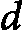<st c="70466"><st c="70467">、元素的数量</st> <st c="70493"><st c="70494">以及位值的范围</st> <st c="70527"><st c="70528">。让我们分析基数排序在</st> <st c="70581">三种情况下的时间复杂度：</st></st></st></st>

+   **<st c="70597">最佳情况</st>**<st c="70607">：在最佳情况下，基数排序处理数组中每个数字的每一位。</st> <st c="70689">对于每一位，它使用计数排序，计数排序的时间复杂度为</st>  <st c="70746"><st c="70754">时间。</st> <st c="70760">由于有</st>  <st c="70776"><st c="70777">位数，总的时间复杂度为</st> <st c="70814">为</st> <st c="70817"><st c="70827">。</st></st></st></st>

+   **<st c="70828">平均情况</st>**<st c="70841">：基数排序的平均时间复杂度保持为</st>  <st c="70899"><st c="70909">因为涉及的步骤（每位使用计数排序排序）对于每一位都一致执行，无论输入值的分布如何。</st></st>

+   **<st c="71073">最坏情况</st>**<st c="71084">：在最坏的情况下，基数排序仍然表现为</st>  <st c="71137"><st c="71147">的时间复杂度。</st> <st c="71164">这是因为每一位数字都通过计数排序在线性时间内处理，并且该过程会重复</st>  <st c="71265"><st c="71266">次，处理</st>  <st c="71277"><st c="71278">个数字。</st></st></st></st>

<st c="71285">关于基数排序的空间复杂度，它需要额外的空间来存储计数排序使用的计数数组和输出数组，因此产生了一个辅助空间复杂度</st> <st c="71478">为</st> <st c="71481"><st c="71487">。</st></st>

<st c="71488">当数组元素分布在一个广泛的范围内时，基数排序的效率较高，这意味着值是稀疏的。</st> <st c="71614">如果元素在范围内密集分布，则可以采用桶排序这一替代方法，具体内容将在</st> <st c="71738">下一小节讨论。</st>

## <st c="71755">桶排序</st>

<st c="71767">我们将要讨论的</st> <st c="71771">最终非比较排序</st> <st c="71806">算法是桶排序。</st> <st c="71849">该方法涉及将数组元素分配到多个容器中，这些容器称为“桶”，每个桶与一特定范围的值相关联。</st> <st c="72005">然后，每个桶中的元素会被独立排序，通常使用另一种排序算法，随后将这些桶合并，形成完整的排序数组。</st> <st c="72168">当输入数据均匀分布在已知范围内时，桶排序表现出卓越的效率。</st> <st c="72275">它利用了分治策略，通过将排序任务分解为更小、更</st> <st c="72394">易管理的子问题来简化排序过程。</st>

<st c="72418">桶排序</st> <st c="72430">对于排序大规模数据集，尤其是具有均匀分布值的数据集，非常有效，在这些场景下，相比基于比较的排序算法，提供了显著的性能优势。</st> <st c="72625">理解桶排序及其机制可以帮助优化适用应用中的排序性能。</st> <st c="72734">让我们通过一个例子，逐步演示桶排序算法。</st>

**<st c="72807">示例 6.9</st>**

<st c="72819">让我们用一个包含六个随机数的数组来演示桶排序的操作— [</st>`<st c="72904">0.78, 0.17, 0.39, 0.26,</st>` `<st c="72929">0.72, 0.94</st>`<st c="72939">]：</st>

1.  <st c="72942">将元素</st> <st c="72963">分配到桶中：</st>

    <st c="72976">创建一个空的桶列表。</st>

    <st c="73009">根据每个元素的值，将其分配到适当的桶中。</st>

    <st c="73081">桶：</st> `<st c="73091">[[0.17, 0.26], [0.39], [0.72,</st>` `<st c="73121">0.78], [0.94]]</st>`<st c="73135">。</st>

1.  <st c="73136">排序</st> <st c="73142">每个桶：</st>

    <st c="73154">将每个桶内的元素排序。</st> <st c="73193">这可以通过使用另一个排序算法，如</st> <st c="73250">插入排序</st>来实现。

    <st c="73265">已排序的桶：</st> `<st c="73282">[[0.17, 0.26], [0.39], [0.72,</st>` `<st c="73312">0.78], [0.94]]</st>`<st c="73326">。</st>

1.  <st c="73327">连接</st> <st c="73340">已排序的桶：</st>

    <st c="73355">将所有已排序的桶合并，形成最终的</st> <st c="73409">已排序数组：</st>

    `<st c="73422">[0.17, 0.26, 0.39, 0.72,</st>` `<st c="73448">0.78, 0.94]</st>`

<st c="73459">数组现在已经排序完毕。</st>

<st c="73484">以下是一个简单的 Python 实现的桶排序算法：</st>

```py
 def bucket_sort(a):
    number_of_buckts = len(a)
    buckts = [[] for _ in range(number_of_buckts)]
    for i in a:
        idx = int(i * number_of_buckts)
        buckts[idx].append(i)
    sorted_a = []
    for b in buckts:
        sorted_a.extend(insertion_sort(b))
    return sorted_a
```

<st c="73803">算法非常简单。</st> <st c="73838">首先，设置桶，然后将数组的元素</st> `<st c="73904">a</st>`<st c="73905">分配到这些桶中（</st>`<st c="73943">for I in a:</st>`<st c="73955">）。</st> <st c="73959">然后，对每个桶进行插入排序并进行连接（</st>`<st c="74025">for b in buckts:</st>`<st c="74042">）。</st> <st c="74046">最后，将已排序的桶进行</st> <st c="74078">合并。</st>

### <st c="74100">正确性证明</st>

<st c="74121">桶排序中的</st> <st c="74125">循环不变式定义为在每次迭代开始时，每个桶内的元素相对于其在桶内的位置是部分排序的。</st> <st c="74301">我们需要评估以下三种条件，以验证</st> <st c="74346">算法的正确性：</st>

+   **<st c="74370">初始化</st>**<st c="74385">：在处理任何元素之前，桶是空的。</st> <st c="74446">由于没有进行部分排序，不变量显然成立。</st>

+   **<st c="74507">维护</st>**<st c="74519">：在每次迭代过程中，元素会根据它们的值被分配到不同的桶中。</st> <st c="74606">逐个对每个桶进行排序确保桶内的元素是有序的。</st> <st c="74696">这保持了</st> <st c="74711">不变量。</st>

+   **<st c="74725">终止</st>**<st c="74737">：当所有的桶都排序完成并连接后，算法终止。</st> <st c="74818">此时，</st> <st c="74821">不变量保证整个数组是有序的，因为每个桶内的元素已排序，且桶被按顺序连接。</st> <st c="74954">按顺序。</st>

### <st c="74963">复杂度分析</st>

<st c="74983">桶排序</st> <st c="74995">的时间复杂度依赖于元素的数量，</st> <st c="75063"><st c="75112">和桶的数量，</st> <st c="75141"><st c="75142">。元素在桶中的分布也在决定总体时间复杂度中起着关键作用。</st> <st c="75261">我们来分析基数排序在以下</st> <st c="75326">三种情况中的时间复杂度：</st></st></st>

+   **<st c="75342">最优情况</st>**<st c="75352">：在最优情况下，元素均匀分布在各个桶中，并且每个桶包含大致相等数量的元素。</st> <st c="75502">如果在桶内使用有效的排序算法，如插入排序，单独排序每个桶的时间是常数时间。</st> <st c="75640">因此，总体时间复杂度</st> <st c="75681">是</st> <st c="75684"><st c="75690">。</st></st>

+   **<st c="75691">平均情况</st>**<st c="75704">：平均来说，桶排序的时间复杂度保持在</st>  <st c="75762"><st c="75771">只要元素分布均匀，且桶的数量</st> <st c="75846"><st c="75847">与元素的数量成正比，</st> <st c="75892"><st c="75893">。每个元素都会被放入一个桶中，时间复杂度为</st>  <st c="75935"><st c="75936">，每个桶根据其包含的元素数量在线性时间内进行排序。</st></st></st></st></st>

+   **<st c="76044">最坏情况</st>**<st c="76055">：在最坏的情况下，如果所有元素都被放入一个桶中，算法的时间复杂度会退化为</st> <st c="76179"><st c="76185">。这是因为所有元素都需要在一个桶内进行排序，当使用像插入排序这样的排序算法时，时间复杂度会达到平方级别，</st> <st c="76363">从而导致最坏情况。</st></st>

<st c="76375">对于桶排序的空间复杂度，我们知道它需要额外的空间来存储桶和输出数组，从而导致辅助空间复杂度为</st> <st c="76546"><st c="76552">。辅助空间有两个组成部分：第一个是桶。</st> <st c="76620">桶是</st> <st c="76636">用来存储特定值范围内的元素。</st> <st c="76689">桶的数量，</st> <st c="76712"><st c="76713">，通常是根据输入值的范围和分布来选择的。</st> <st c="76788">第二个辅助空间是输出数组。</st> <st c="76836">一个与输入数组大小相同的输出数组用于暂时存储已排序的元素。</st> <st c="76938">这需要</st>  <st c="76952"><st c="76953">额外的空间。</st> <st c="76972">然后，桶排序所需的总辅助空间是桶和输出数组所需空间的总和，结果为</st> <st c="77110"><st c="77116">。</st></st></st></st></st>

<st c="77117">这就是我们关于非比较排序算法的讨论。</st> <st c="77186">这些算法相比于基于比较的排序算法提供了更好的时间复杂度，但也有一些局限性。</st> <st c="77306">它们受到特定数据类型的限制，并依赖于对数据的假设，这可能会缩小它们的应用范围。</st> <st c="77418">。</st>

# <st c="77434">总结</st>

<st c="77442">本章全面探讨了各种排序算法，重点介绍了它们的基本原理、效率以及实际应用。</st> <st c="77611">本章首先讨论了区分排序算法的基本属性，例如基于比较与非基于比较的方法、稳定性、适应性和内存使用情况。</st> <st c="77808">这些属性对于理解为什么某些算法更适合特定类型的数据和应用至关重要。</st> <st c="77942">本章强调了时间复杂度的重要性，特别指出基于比较的算法具有一个下限复杂度</st> <st c="78086"><st c="78095">，而非基于比较的算法在</st> <st c="78180">合适的条件下可以实现线性时间复杂度。</st></st>

<st c="78197">接下来，本章讨论了具体的排序算法，从迭代方法开始：冒泡排序、选择排序和插入排序。</st> <st c="78340">尽管这些算法实现简单且易于理解，但由于其</st>  <st c="78472"><st c="78478">时间复杂度，已被证明对于大数据集效率低下。</st> <st c="78495">解释过程中包括了详细的逐步操作、代码实现以及使用循环不变量证明其正确性。</st> <st c="78626">每种算法的独特特性，如稳定性和空间效率，都进行了讨论，提供了清晰的理解，说明了它们的优点</st> <st c="78774">和局限性。</st></st>

<st c="78790">最后，本章探讨了更高级的递归排序算法，包括归并排序和快速排序。</st> <st c="78906">这些算法利用分治策略，通过平均时间复杂度为</st> <st c="79034"><st c="79045">的时间复杂度实现了更高效的排序。</st> 归并排序的一致性和稳定性与快速排序可能出现的</st>  <st c="79145"><st c="79151">最坏情况下的时间复杂度进行了对比，这可以通过良好的枢轴选择策略来减轻。</st> <st c="79240">此外，本章还涉及了非比较排序算法，如计数排序、基数排序和桶排序，解释了它们如何通过利用特定的数据特性实现线性时间复杂度。</st> <st c="79451">本章总结时强调了根据数据集的特点和应用的具体要求选择合适排序算法的重要性。</st> <st c="79613">应用程序的需求。</st></st></st>

<st c="79629">在下一章中，我们将重点讨论算法设计中的另一个核心问题——搜索。</st> <st c="79715">然后，</st> *<st c="79721">第八章</st>* <st c="79730">探讨了排序与搜索之间的关系，揭示了其中的有趣模式</st> <st c="79820">和联系。</st>

# <st c="79836">参考文献及进一步阅读</st>

+   *<st c="79867">算法导论</st>*<st c="79894">. 作者：Thomas H.</st> <st c="79909">Cormen，Charles E.</st> <st c="79928">Leiserson，Ronald L.</st> <st c="79949">Rivest 和 Clifford Stein</st>。<st c="79977">第四版。</st> <st c="79993">MIT</st> <st c="79997">出版社。</st> <st c="80004">2022 年</st>

    +   *<st c="80009">第二章，</st>* *<st c="80021">入门</st>*

    +   *<st c="80036">第四章，分治法（包括</st>* *<st c="80077">归并排序）</st>*

    +   *<st c="80088">第七章，快速排序</st>* 

    +   *<st c="80109">第八章，线性时间排序</st>* *<st c="80131">线性时间排序</st>*

    +   *<st c="80142">第九章，中位数与</st>* *<st c="80166">顺序统计量</st>*

+   *<st c="80182">算法</st>*<st c="80193">. 由 R. </st> <st c="80201">Sedgewick 和 K.</st> <st c="80218">Wayne</st>。<st c="80225">第四版</st>。<st c="80241">Addison-Wesley</st>。<st c="80257">2011 年</st>。

    +   *<st c="80262">第二章：</st>* *<st c="80274">基本排序</st>*

+   *<st c="80290">计算机程序设计艺术，第 3 卷：排序与查找</st>*<st c="80355">，作者：唐纳德·</st> <st c="80367">E.</st> <st c="80370">克努斯</st>。

    +   *<st c="80376">第五章</st>* *<st c="80385">排序</st>*

+   *<st c="80395">C++中的数据结构与算法分析</st>*<st c="80441">，作者：马克·</st> <st c="80451">艾伦·魏斯</st>*<st c="80462">。</st>*

    +   *<st c="80463">第七章</st>* *<st c="80472">排序</st>*

+   *<st c="80482">算法设计手册</st>*<st c="80506">，作者：史蒂文·</st> <st c="80518">S.</st> <st c="80521">斯基纳</st>。

    +   *<st c="80528">第四章</st>* *<st c="80548">排序与查找</st>*
