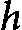
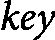
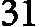
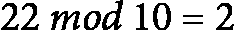
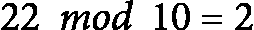
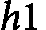

# 第十章：<st c="0">7</st>

# <st c="2">搜索算法</st>

<st c="19">在数据与信息处理领域，搜索和信息检索扮演着至关重要的角色。</st> <st c="126">搜索算法的效率和准确性直接影响到各种应用的效果，从数据库管理系统到搜索引擎。</st> <st c="286">本章讨论了搜索算法的关键重要性，通过一系列示例阐明它们的基本特性。</st> <st c="412">的例子。</st>

<st c="424">搜索算法的设计旨在优化检索过程，使其更加快速高效。</st> <st c="528">这个优化的关键之一是排序，它通过将数据组织成有利于快速搜索的方式来加速检索过程。</st> <st c="653">排序和搜索之间的相互作用在许多应用中都很明显，排序后的数据可以支持更复杂、更快速的搜索技术。</st> <st c="812">我们将在下一章探讨排序和搜索之间的这一重要关系。</st> <st c="907">然而，当我们将搜索的概念与排序分开时，通常会留下基本的顺序搜索。</st> <st c="1021">顺序搜索以线性时间运行，逐个扫描每个元素，直到找到所需的结果。</st> <st c="1132">这种方法虽然简单，但并不总是最有效的，尤其是在处理</st> <st c="1217">大数据集时。</st>

<st c="1232">为了克服顺序搜索的局限性，我们可以利用数据假设来设计更先进的技术，如哈希。</st> <st c="1367">哈希将数据转换为固定大小的值或哈希码（哈希值），在理想条件下，可以实现常数时间的搜索操作。</st> <st c="1511">本章探讨了这些先进技术，说明了数据假设如何显著提升搜索性能。</st> <st c="1646">通过使用哈希函数，我们可以实现常数时间复杂度，大幅提高搜索操作的效率，</st> <st c="1780">在许多应用中。</st>

<st c="1798">在本章中，搜索算法被分为三类：线性时间搜索算法、亚线性（例如对数时间）搜索算法，以及利用哈希的常数时间搜索算法。</st> <st c="2021">每一类都将详细讨论，重点关注其特性、应用场景和性能特征。</st> <st c="2134">本章的结构</st> <st c="2160">如下：</st>

+   <st c="2171">搜索算法的特性</st> <st c="2186">搜索算法</st>

+   <st c="2203">线性时间和对数时间</st> <st c="2232">搜索算法</st>

+   <st c="2249">哈希</st>

# <st c="2257">搜索算法的特性</st>

<st c="2289">在深入了解搜索算法及其特性之前，首先要区分计算机科学中两种搜索类型：</st> **<st c="2430">算法搜索</st>** <st c="2441">和</st> **<st c="2463">人工智能中的搜索</st>** <st c="2486">(</st>**<st c="2488">AI</st>**<st c="2490">)。</st> <st c="2494">虽然这两种搜索类型有一些相似之处，但它们在目标和方法上存在明显的差异</st> <st c="2582">。</st>

<st c="2597">在算法和</st> *<st c="2613">人工智能</st>* <st c="2619">中的</st> *<st c="2638">搜索</st>* <st c="2644">在目标、方法论和应用上可能存在显著差异。</st> <st c="2734">下面是对比两者关键差异的总结。</st>

<st c="2787">算法搜索指的是在数据结构中找到特定元素或元素集的过程，例如数组、列表或树。</st> <st c="2936">其主要目标是尽可能快速地定位到目标元素，通常通过时间复杂度来衡量（例如，</st> <st c="3054"><st c="3055">，</st> <st c="3057"><st c="3066">）。</st> <st c="3069">另一方面，算法搜索的正确性是确保算法正确地识别目标元素的存在与否</st> <st c="3205">。</st>

<st c="3220">我们通过以下方法之一来实现算法搜索：</st>

+   **<st c="3288">线性查找</st>**<st c="3302">：逐个遍历每个元素，直到找到目标或到达结构的末尾</st> <st c="3389">。</st>

+   **<st c="3399">二分查找</st>**<st c="3413">：通过反复将查找区间</st> <st c="3427">对半分割，高效地定位排序数组中的元素</st> <st c="3505">。</st>

+   **<st c="3512">哈希</st>**<st c="3520">：利用哈希函数将元素映射到特定位置，以实现</st> <st c="3528">快速访问</st> <st c="3585">。</st>

+   **<st c="3597">树遍历</st>**<st c="3612">：在树结构中查找，例如二叉搜索树、AVL 树和</st> <st c="3692">红黑树</st>。

<st c="3707">算法搜索的主要应用是在数据检索中，广泛用于数据库、文件系统和一般的数据处理任务。</st>

<st c="3849">另一方面，我们有</st> <st c="3877">AI 中的搜索算法，简称 AI 搜索。</st> <st c="3923">AI 搜索涉及在问题空间中，从初始状态到目标状态，找到一系列动作或路径。</st> <st c="4044">它通常处理更复杂且动态的环境，并且目标与算法搜索不同。</st> <st c="4156">AI 搜索的主要目标是解决问题——找到一个复杂问题的解，该问题可能需要穿越一个庞大的状态空间。</st> <st c="4309">此外，AI 搜索的目标是从众多可能的选项中找到最佳或最有效的解决方案，并且必须能够处理动态和不确定的环境，在这些环境中，条件和目标</st> <st c="4504">可能会发生变化。</st>

<st c="4515">AI 搜索算法</st> <st c="4537">根据问题类型和我们对目标状态的了解，使用不同的</st> <st c="4568">策略来实现。</st> <st c="4646">虽然这些方法可以通过多种方式进行分类，但最著名的 AI 搜索方法是未加信息搜索和加信息搜索。</st> <st c="4787">未加信息搜索技术，如</st> <st c="4822">例如</st> **<st c="4825">广度优先搜索</st>** <st c="4845">(</st>**<st c="4847">BFS</st>**<st c="4850">) 和</st> **<st c="4857">深度优先搜索</st>** <st c="4875">(</st>**<st c="4877">DFS</st>**<st c="4880">)，在没有关于目标的特定知识的情况下，探索搜索空间。</st> <st c="4952">相比之下，加信息搜索技术，如</st> **<st c="5001">A*搜索</st>** <st c="5010">和</st> **<st c="5015">贪心搜索</st>**<st c="5028">，使用启发式方法来引导搜索</st> <st c="5033">过程，使得向目标的搜索更加高效。</st> <st c="5064">启发式方法提供到达目标的估计成本，帮助优先选择那些看起来</st> <st c="5203">更有前景的路径。</st>

<st c="5218">AI 搜索有许多应用。</st> <st c="5252">例如，在机器人技术中，搜索帮助代理在动态环境中进行导航和执行任务。</st> <st c="5350">在游戏中，AI 代理搜索最佳的棋步，在象棋、围棋和</st> <st c="5434">视频游戏等游戏中。</st>

<st c="5446">总之，算法搜索专注于使用明确定义的程序和数据结构，在结构化数据中高效地查找特定元素。</st> <st c="5604">相比之下，AI 搜索涉及探索大型且通常是非结构化的问题空间，以找到复杂问题的最优或可行解，采用未加信息和加信息的技术，通常结合启发式方法和</st> <st c="5831">学习方法。</st>

<st c="5848">本质上，尽管这两种类型的搜索都旨在寻找解决方案，但算法搜索通常更关注在定义明确的约束条件下进行数据检索和操作，而人工智能搜索则处理更广泛和复杂的问题解决场景，通常需要适应性</st> <st c="6137">和学习。</st>

<st c="6150">在本节中，我们介绍了几种属性，用于评估和比较不同的算法搜索算法（在本章中，我们将</st> *<st c="6294">搜索</st>* <st c="6300">用于指代算法搜索）。</st> <st c="6334">这些属性，除了时间和空间复杂度外，还提供了一个基准，帮助我们理解搜索算法的行为和效率。</st> <st c="6479">通过考虑这些属性，我们可以</st> <st c="6518">为特定场景选择最合适的算法：</st>

+   **<st c="6575">数据结构要求</st>**<st c="6602">：不同的搜索算法可能需要特定的数据结构才能高效地运行。</st> <st c="6694">例如，二分查找要求数据是有序的，才能正确执行，而顺序查找可以在任何线性数据结构中工作，如数组或</st> <st c="6857">链表。</st>

+   **<st c="6870">适应性</st>**<st c="6883">：一些搜索算法具有根据输入数据特征进行自我调整的能力，从而提高其性能。</st> <st c="7014">例如，插值搜索可以根据数据分布进行调整，在均匀分布的数据集上，比二分查找表现得要好得多。</st> <st c="7152">分布的数据集。</st>

+   **<st c="7173">实现复杂性</st>**<st c="7199">：算法实现的复杂性是一个实际考虑因素，尤其在时间紧迫的情况下。</st> <st c="7319">例如，顺序搜索等简单算法容易实现和理解，而更复杂的算法，如平衡搜索树（参见</st> *<st c="7467">第十三章</st>*<st c="7477">）或哈希算法，则需要对数据结构和</st> <st c="7545">算法设计有更深入的理解。</st>

+   **<st c="7562">预处理要求</st>**<st c="7589">：某些搜索算法要求在应用之前对数据进行预处理。</st> <st c="7680">例如，二分查找要求数据已排序，这增加了整体时间复杂度。</st> <st c="7782">预处理步骤有时可能会抵消更快搜索时间的好处，特别是当数据频繁变化并需要</st> <st c="7916">不断重新排序时。</st>

+   **<st c="7936">最优性</st>**<st c="7947">：一些算法基于其时间复杂度和性能特征，在特定场景下被认为是最优的。</st> <st c="8076">例如，二分查找在排序数组中进行查找时是</st> <st c="8108">最优的，因为它具有对数时间复杂度。</st> <st c="8192">然而，最优性可能根据上下文和应用的具体要求而变化。</st> <st c="8288">在一个场景中最优的算法，在另一个场景中可能不是最佳选择，特别是当假设条件或</st> <st c="8404">环境变化时。</st>

<st c="8422">通过考察这些关键特性——数据结构需求、适应性、实现复杂度、预处理需求和最优性——我们可以在不同上下文中做出明智的决策，选择合适的搜索算法。</st> <st c="8670">这种全面的理解确保我们为数据处理需求选择最有效和高效的搜索技术。</st> <st c="8790">。

<st c="8807">在</st> <st c="8818">搜索算法的特性中，时间复杂度是最关键的因素。</st> <st c="8907">搜索算法的效率主要由其时间复杂度决定，这决定了算法在数据集中定位元素的速度。</st> <st c="9076">因此，搜索算法通常根据时间复杂度进行分类，以便清晰地理解其在</st> <st c="9228">不同条件下的表现。</st>

<st c="9249">在接下来的章节中，我们将探索按时间复杂度分类的搜索算法。</st> <st c="9350">这些类别提供了一种结构化的方法来分析和比较各种</st> <st c="9423">搜索技术：</st>

+   **<st c="9441">线性时间搜索算法</st>**<st c="9471">：这些</st> <st c="9479">算法，如顺序查找，的运行时间是</st>  <st c="9534"><st c="9535">，这意味着找到一个元素所需的时间随着数据集大小的增加而线性增长。</st> <st c="9558">我们将探索线性时间算法适用的场景以及它们的</st> <st c="9632">实现细节。</st>

+   **<st c="9733">子线性时间搜索算法</st>**<st c="9767">：此类算法包括二分查找，</st> <st c="9832">其操作时间为</st>  <st c="9844"><st c="9853">时间。</st> <st c="9859">二分查找对于排序后的数据集特别高效，利用分治策略迅速缩小搜索空间。</st> <st c="10006">在</st> *<st c="10009">第十三章</st>*<st c="10019">中，我们将讨论一种基于特定数据结构的搜索算法</st> <st c="10091">，该数据结构被称为</st> **<st c="10098">二叉搜索树</st>** <st c="10117">(</st>**<st c="10119">BSTs</st>**<st c="10123">)。</st> <st c="10127">二叉搜索树保持元素的有序排列，从而允许高效的搜索、插入和</st> <st c="10215">删除操作。</st></st>

+   **<st c="10235">常数时间搜索算法</st>**<st c="10267">：这些</st> <st c="10275">算法旨在实现</st>  <st c="10302"><st c="10303">时间复杂度，其中查找元素所需的时间无论数据集大小如何都保持不变。</st> <st c="10335">哈希是实现常数时间搜索操作的主要技术。</st> <st c="10413">我们将研究哈希函数是如何工作的，它们的实现方式，以及在什么条件下它们能提供</st> <st c="10603">最佳性能。</st></st>

<st c="10623">通过理解并根据时间复杂度对搜索算法进行分类，我们可以更好地理解它们的优缺点。</st> <st c="10768">这种结构化的方法使我们能够为给定的应用选择最合适的算法，从而确保高效且有效的</st> <st c="10902">数据检索。</st>

# <st c="10917">线性时间和对数时间搜索算法</st>

<st c="10963">在</st> <st c="10970">搜索算法的研究中，理解线性搜索和子线性搜索方法对于选择最</st> <st c="11088">高效的方法来解决特定问题至关重要。</st> <st c="11129">线性搜索是最简单的方法，它通过顺序检查数据集中的每个元素，直到找到目标元素或达到数据集的末尾。</st> <st c="11298">虽然这种方法简单且对小型或未排序的数据集有效，但其</st>  <st c="11361"><st c="11362">时间复杂度使其在处理大数据集时变得不切实际。</st> <st c="11420">相比之下，子线性搜索算法，如二分搜索和跳跃搜索，提供了更高效的解决方案，时间复杂度优于</st> <st c="11568"><st c="11569">，通常利用已排序数据的属性显著减少所需的比较次数。</st> <st c="11680">通过比较这两类算法，我们可以欣赏搜索技术的进步及其在优化数据</st> <st c="11824">检索过程中的应用。</st></st></st>

## <st c="11844">线性或顺序搜索</st>

<st c="11872">一种</st> <st c="11875">通用的搜索算法，无论数据是否有任何假设（是否排序），其渐近上界为</st> <st c="12005"><st c="12006">。这是因为，在最坏的情况下，我们可能需要访问并评估数据集中的每个元素，以确定目标元素是否存在。</st> <st c="12166">因此，线性搜索算法的时间复杂度为</st> <st c="12229"><st c="12230">。我们来分别分析线性搜索算法的递归和迭代（非递归）实现。</st></st></st>

<st c="12343">线性搜索的迭代（非递归）实现通过逐个检查数组中的每个元素，判断其是否与目标元素匹配。</st> <st c="12514">以下是一个简单的 Python 实现</st> <st c="12565">线性搜索：</st>

```py
 def iterative_linear_search(a, target):
    for index in range(len(a)):
        if a[index] == target:
            return index
    return -1
```

`<st c="12693">估算</st>` `<st c="12704">迭代线性搜索的时间复杂度非常简单。</st>` `<st c="12772">该算法包含一个循环，循环内部的所有命令都会执行</st>`  `<st c="12842"><st c="12891">次，其中</st>`  `<st c="12904"><st c="12953">是数组中的元素个数。</st>` `<st c="12993">此外，循环结束后的最后一条指令只执行一次。</st>` `<st c="13055">这导致了运行时间的上界为</st>` `<st c="13107">O</st>` `<st c="13110"><st c="13111">。</st></st></st></st>`

`<st c="13112">线性搜索的递归实现涉及检查当前元素，如果未找到目标元素，则递归调用以检查下一个元素。</st>` `<st c="13279">以下是一个用 Python 实现递归</st>` `<st c="13333">顺序搜索的代码：</st>`

```py
 def recursive_linear_search(a, target, index=0):
    if index >= len(a):
        return -1
    if a[index] == target:
        return index
    return recursive_linear_search(a, target, index + 1)
```

`<st c="13519">The</st>` `<st c="13524">递归线性搜索</st>` `<st c="13547">函数接受三个参数：</st>` `<st c="13581">a</st>` `<st c="13582">（待搜索的数组），</st>` `<st c="13606">target</st>` `<st c="13612">（要查找的元素），以及</st>` `<st c="13646">index</st>` `<st c="13651">（数组中的当前位置，默认为</st>` `<st c="13699">0</st>` `<st c="13700">）。</st>` `<st c="13703">如果</st>` `<st c="13706">index</st>` `<st c="13711">大于或等于数组的长度，则意味着我们已经到达数组的末尾，目标元素未找到。</st>` `<st c="13840">函数返回</st>` `<st c="13861">-1</st>` `<st c="13863">。如果当前元素在</st>` `<st c="13891">a[index]</st>` `<st c="13899">与</st>` `<st c="13908">target</st>` `<st c="13914">匹配，函数返回当前的</st>` `<st c="13949">index</st>` `<st c="13954">。如果当前元素与目标不匹配，函数会递归调用自己，移动到下一个索引（</st>` `<st c="14071">index + 1</st>` `<st c="14081">）。</st>` `<st c="14085">该算法可以使用减法递归函数进行描述，具体如下：</st>`

<st c="14184"><st c="14186">.</st></st>

<st c="14187">这个递归关系表明，在每次递归中，问题的规模会减少 1（即，需要根据搜索标准评估的数据量减少 1）。</st> <st c="14380">这符合以下</st> <st c="14404">一般形式：</st>

![<mml:math xmlns:mml="http://www.w3.org/1998/Math/MathML" xmlns:m="http://schemas.openxmlformats.org/officeDocument/2006/math"><mml:mi>T</mml:mi><mml:mfenced separators="|"><mml:mrow><mml:mi>n</mml:mi></mml:mrow></mml:mfenced><mml:mo>=</mml:mo><mml:mi>a</mml:mi><mml:mi>T</mml:mi><mml:mfenced separators="|"><mml:mrow><mml:mi>n</mml:mi><mml:mo>-</mml:mo><mml:mi>b</mml:mi></mml:mrow></mml:mfenced><mml:mo>+</mml:mo><mml:mi mathvariant="normal">Θ</mml:mi><mml:mfenced separators="|"><mml:mrow><mml:msup><mml:mrow><mml:mi>n</mml:mi></mml:mrow><mml:mrow><mml:mi>k</mml:mi></mml:mrow></mml:msup></mml:mrow></mml:mfenced></mml:math>](img/1212.png)<st c="14417"><st c="14444">.</st></st>

<st c="14445">使用</st> <st c="14456">用于递减递归的主定理，我们可以识别出适用的</st> <st c="14522">情况：</st>

+   **<st c="14535">情况 1</st>**<st c="14542">：如果</st> <st c="14548"><st c="14553">，</st> <st c="14555">那么</st> </st>

+   **<st c="14571">案例 2</st>**<st c="14577">：如果</st> <st c="14583"><st c="14584">，</st> <st c="14586">那么</st> </st>

+   **<st c="14606">案例 3</st>**<st c="14612">：如果</st> <st c="14618"><st c="14625">，</st> <st c="14627">那么</st> ![<mml:math xmlns:mml="http://www.w3.org/1998/Math/MathML" xmlns:m="http://schemas.openxmlformats.org/officeDocument/2006/math"><mml:mi>T</mml:mi><mml:mfenced separators="|"><mml:mrow><mml:mi>n</mml:mi></mml:mrow></mml:mfenced><mml:mo>=</mml:mo><mml:mi mathvariant="normal">θ</mml:mi><mml:mfenced separators="|"><mml:mrow><mml:msup><mml:mrow><mml:mi>a</mml:mi></mml:mrow><mml:mrow><mml:mi>n</mml:mi><mml:mo>/</mml:mo><mml:mi>b</mml:mi></mml:mrow></mml:msup><mml:mo>.</mml:mo><mml:mi>f</mml:mi><mml:mfenced separators="|"><mml:mrow><mml:mi>n</mml:mi></mml:mrow></mml:mfenced></mml:mrow></mml:mfenced></mml:math>](img/1218.png)</st>

<st c="14650">在</st> <st c="14659"><st c="14660">，</st> <st c="14662"><st c="14663">，以及</st>  <st c="14669"><st c="14670">在减法递归函数中的参数时，</st> *<st c="14722">情况 1</st>* <st c="14728">适用。</st> <st c="14738">因此，时间复杂度</st>  <st c="14764"><st c="14765">为</st> <st c="14769"><st c="14770">，这证明了算法的运行时间</st> <st c="14822">是线性的。</st></st></st></st></st></st>

<st c="14832">两种实现都表现出了</st>  <st c="14866"><st c="14867">的时间复杂度，这意味着在最坏情况下，必须检查数组中的每个元素才能找到目标元素。</st> <st c="14988">然而，两个实现都有</st>  <st c="15025"><st c="15026">或常数空间复杂度，这是一个重要的优势。</st> <st c="15091">线性搜索简单易懂，不需要特定的数据格式、预处理或</st> <st c="15192">先前排序。</st></st></st>

<st c="15206">线性搜索适用于优先考虑简单性和易于实现的场景，尤其是在数据集相对较小或未排序的情况下。</st> <st c="15356">它特别适用于以下情况：</st>

+   **<st c="15410">无序或非结构化数据</st>**<st c="15440">：当数据没有排序或没有存储在一种特定结构中，无法促进更快的搜索方法时，线性搜索是一种直接且</st> <st c="15584">可行的选项</st>

+   **<st c="15597">小型数据集</st>**<st c="15612">：对于小型数据集，更复杂的搜索算法可能不值得投入额外开销，从而使线性搜索成为一个</st> <st c="15728">高效的选择</st>

+   **<st c="15744">首次出现搜索</st>**<st c="15768">：当你需要在数组或列表中找到某个元素的第一次出现时，线性搜索是</st> <st c="15863">适用的</st>

+   **<st c="15877">单次或少量搜索</st>**<st c="15900">：如果你只需要执行一次或几次搜索，线性搜索的简单性可以超过那些需要预处理（例如排序）的复杂算法的优点</st> <st c="16084">。</st>

<st c="16095">线性搜索用于各种应用，其中适用前述条件。</st> <st c="16180">一些常见的应用</st> <st c="16204">包括</st> <st c="16213">以下内容：</st>

+   **<st c="16227">扫描器和解析器</st>**<st c="16248">：线性搜索常用于词法扫描器和解析器中，寻找序列中字符的标记或特定模式</st> <st c="16379">或数据</st>

+   **<st c="16386">无序列表中的查找操作</st>**<st c="16422">：在处理无序列表或数组时，线性搜索被用来找到特定的元素</st> <st c="16517">或值</st>

+   **<st c="16526">验证和核实</st>**<st c="16554">：线性搜索用于验证输入或核实列表中是否存在某个元素，例如检查用户输入的值是否存在于数据库</st> <st c="16712">或列表中</st>

+   **<st c="16719">实时系统</st>**<st c="16737">：在数据不断变化且无法进行排序的实时系统中，线性搜索提供了一种快速查找元素的方法，无需</st> <st c="16884">预处理</st>

+   **<st c="16907">嵌入式系统</st>**<st c="16924">：在资源有限的嵌入式系统中，线性搜索的常数空间复杂度使其成为搜索操作的合适选择</st> <st c="17049">。</st>

<st c="17069">虽然线性搜索可能不是大数据集或已排序数据集的最有效算法，但其简单性、常数空间复杂度和灵活性使其在各种应用中成为一项有价值的工具，尤其是当处理无序或</st> <st c="17311">小型数据集时。</st>

## <st c="17326">子线性搜索</st>

<st c="17344">在算法设计中，子线性查找算法代表了一类比线性时间更高效的查找技术。</st> <st c="17438">这些算法特别强大，因为它们可以在不需要检查数据集中的每一项的情况下定位元素。</st> <st c="17490">通过利用排序数据的特性和先进的分区策略，子线性查找算法减少了所需比较的次数，从而加速了查找过程。</st> <st c="17622">这种效率使得它们在处理大型数据集时显得尤为重要，而线性查找方法在这种情况下会显得</st> <st c="17919">过于缓慢。</st>

<st c="17938">子线性查找算法，如二分查找、跳跃查找和斐波那契查找，利用不同的</st> <st c="18044">策略迅速减少查找空间。</st> <st c="18094">例如，二分查找通过不断将数组一分为二，而跳跃查找则将数据划分为块并在这些较小的块中执行线性查找。</st> <st c="18277">斐波那契查找利用斐波那契数列来确定查找空间的范围，优化适合内存块的数据。</st> <st c="18425">这些算法各有独特的优势，适用于特定类型的问题，突出了子线性查找方法在计算效率方面的多样性和强大功能。</st> <st c="18617">让我们深入探讨最著名的子线性</st> <st c="18669">查找算法。</st>

### <st c="18687">二分查找</st>

**<st c="18701">二分查找</st>** <st c="18715">是一种</st> <st c="18722">在排序数组中定位元素的有效方法。</st> <st c="18782">该算法通过不断地</st> <st c="18821">将查找空间一分为二</st> <st c="18847">来工作。</st> <st c="18919">如果中间元素与目标值匹配，则查找完成。</st> <st c="19018">如果不匹配，查找将继续在目标值可能出现的数组一半中进行。</st> <st c="19066">二分查找通常采用递归方式实现。</st> <st c="19069">以下是二分查找的递归实现：</st>

```py
 def recursive_binary_search(a, target, left, right):
    if right >= left:
        mid = left + (right - left) // 2
        if a[mid] == target:
            return mid
        elif a[mid] > target:
            return recursive_binary_search(a, target, left, mid - 1)
        else:
            return recursive_binary_search(a, target, mid + 1, right)
    return -1
```

<st c="19416">二分</st> <st c="19424">查找</st> <st c="19430">通过反复将查找区间一分为二来工作。</st> <st c="19489">二分查找的时间复杂度是</st> <st c="19529"><st c="19538">。让我们详细分析并证明这一时间复杂度。</st>

<st c="19595">给定一个排序数组</st> `<st c="19618">a</st>`<st c="19619">，以及一个目标值</st> `<st c="19641">target</st>`<st c="19647">，二分查找遵循以下步骤：</st>

1.  **<st c="19683">初始化</st>**<st c="19698">：设置两个指针，</st> **<st c="19719">left</st>** <st c="19723">和</st> **<st c="19728">right</st>**<st c="19733">，分别指向数组的开始和结束位置。</st>

1.  **<st c="19787">中间元素</st>**<st c="19802">：计算中间索引，</st> **<st c="19833">mid = left + (right - left) //</st>** **<st c="19864">2</st>**<st c="19865">。</st>

1.  **<st c="19866">比较</st>**<st c="19877">：</st>

    +   <st c="19879">如果</st> **<st c="19882">a[mid] == target</st>**<st c="19898">，目标已找到，返回</st> **<st c="19929">mid</st>** <st c="19932">索引</st> <st c="19939">。</st>

    +   <st c="19950">如果</st> **<st c="19954">a[mid] < target</st>**<st c="19969">，更新</st> **<st c="19978">left</st>** <st c="19982">为</st> **<st c="19986">mid + 1</st>** <st c="19993">并重复</st> <st c="20005">该过程</st>

    +   <st c="20016">如果</st> **<st c="20020">a[mid] > target</st>**<st c="20035">，更新</st> **<st c="20044">right</st>** <st c="20049">为</st> **<st c="20053">mid - 1</st>** <st c="20060">并重复</st> <st c="20072">该过程</st>

1.  **<st c="20083">终止</st>**<st c="20095">：该过程继续直到</st> **<st c="20126">left > right</st>**<st c="20138">。如果没有找到目标，</st> <st c="20168">返回</st> **<st c="20175">-1</st>**<st c="20177">。</st>

<st c="20178">初始搜索空间是整个大小为</st> <st c="20232"><st c="20281">的数组。在每一步中，算法将目标与中间元素进行比较。</st> <st c="20356">根据比较结果，搜索空间被二分；要么丢弃左半部分，要么丢弃右半部分：</st></st>

+   <st c="20461">第一步之后，搜索空间</st> <st c="20501">是</st> 

+   <st c="20505">第二步之后，搜索空间</st> <st c="20545">是</st> 

+   <st c="20549">在</st>  <st c="20559"><st c="20560">步后，搜索空间</st> <st c="20584">变为</st> </st>

<st c="20588">当搜索空间缩小到 1 个元素时，算法停止，即</st> <st c="20661"><st c="20664">。现在我们求解</st> <st c="20686"><st c="20687">：</st> <st c="20689"><st c="20718">。因此，二分查找算法最多执行</st>  <st c="20776"><st c="20783">次比较。</st></st></st></st></st>

<st c="20795">我们也</st> <st c="20802">可以</st> <st c="20808">通过递归函数来证明时间复杂度。</st> <st c="20863">我们定义</st>  <st c="20876"><st c="20877">为二分查找在大小为</st> <st c="20938"><st c="20987">的数组上的时间复杂度。</st> <st c="21013">如果数组大小为 1 (</st><st c="21015"><st c="21013">)，那么时间复杂度为</st>  <st c="21041"><st c="21042">，因为只需要进行一次比较：</st> <st c="21084"><st c="21085">。</st></st></st></st></st></st>

<st c="21086">对于大小为</st> <st c="21108"><st c="21157">的数组，我们进行一次比较以检查中间元素，然后递归地在左或右半部分进行查找，每一部分的大小为</st> <st c="21281"><st c="21282">。然后，递归二分查找的递推函数为：</st> <st c="21344">如下所示：</st></st></st>

![<mml:math xmlns:mml="http://www.w3.org/1998/Math/MathML" xmlns:m="http://schemas.openxmlformats.org/officeDocument/2006/math"><mml:mi>T</mml:mi><mml:mfenced separators="|"><mml:mrow><mml:mi>n</mml:mi></mml:mrow></mml:mfenced><mml:mo>=</mml:mo><mml:mi>T</mml:mi><mml:mfenced separators="|"><mml:mrow><mml:mfrac><mml:mrow><mml:mi>n</mml:mi></mml:mrow><mml:mrow><mml:mn>2</mml:mn></mml:mrow></mml:mfrac></mml:mrow></mml:mfenced><mml:mo>+</mml:mo><mml:mi>O</mml:mi><mml:mfenced separators="|"><mml:mrow><mml:mn>1</mml:mn></mml:mrow></mml:mfenced></mml:math>](img/1243.png)<st c="21355"><st c="21373">.</st></st>

<st c="21374">使用分治法递归关系的主定理，</st> *<st c="21445">案例 2</st>* <st c="21451">适用。</st> <st c="21461">因此，</st> <st c="21476">以下适用：</st>

<st c="21494"><st c="21510">。</st></st>

<st c="21511">与线性查找不同，二分查找效率非常高，适用于大规模数据集。</st> <st c="21608">该算法实现简单且易于理解。</st> <st c="21670">迭代版本使用常数空间，</st> <st c="21713"><st c="21714">，即使是递归版本，空间开销也相对较低，</st> <st c="21782"><st c="21791">。二分查找的主要用途是查找已排序数组或列表中的元素。</st> <st c="21881">二分查找还用于字典操作，如在排序列表中查找单词。</st> <st c="21972">的条目。</st></st></st>

<st c="21983">另一方面，二分查找仅适用于已排序的数组。</st> <st c="22046">如果数据未排序，则必须先进行排序，这会增加额外的开销。</st> <st c="22128">二分查找最适用于静态数组，其中数据不会频繁变化。</st> <st c="22218">频繁的插入和删除操作会导致数组重新排序，从而增加排序开销。</st> <st c="22321">此外，二分查找在链表或其他非连续内存结构上的效率较低，因为它依赖于数组提供的高效随机访问。</st> <st c="22481">由数组提供的高效访问。</st>

<st c="22491">将数据集按中点划分的概念可以扩展到将数据集划分为多个区间。</st> <st c="22615">三分查找就是这种方法的一个例子。</st> <st c="22662">它是一种分治查找算法，作用于排序数组，通过将数组划分为三个部分，并确定目标元素所在的部分，从而将查找空间缩小到三分之一。</st> <st c="22880">这一过程会一直重复，直到找到目标元素或查找空间耗尽。</st> <st c="22973">因此，三分查找的时间复杂度</st> <st c="23025">是</st> <st c="23028"><st c="23037">。</st></st>

### <st c="23038">插值查找</st>

<st c="23059">插值查找</st> <st c="23080">是在排序数组中查找目标值的二分查找算法的改进版。</st> <st c="23170">而二分查找总是探测中间元素，插值查找</st> <st c="23237">则根据数组边界的值和目标值本身，做出一个关于目标值可能位置的合理猜测。</st>

<st c="23389">以下是</st> <st c="23407">插值查找的递归实现：</st>

```py
 def recursive_interpolation_search(a, target, low, high):
    if low <= high and target >= a[low] and target <= a[high]:
        pos = low + ((high - low) // (a[high] - a[low]) * (target - a[low]))
        if a[pos] == target:
            return pos
        if a[pos] < target:
            return recursive_interpolation_search(a, target, pos + 1, high)
        return recursive_interpolation_search(a, target, low, pos - 1)
    return -1  # Target not found
```

<st c="23852">比较插值查找与二分查找的代码时，主要的区别在于每个算法计算中点（或位置）的方法。</st> <st c="24013">这个差异反映了每个算法用来定位目标元素的不同方法。</st> <st c="24102">在二分查找中，中点是左值和右值的平均值：</st>

`<st c="24192">mid = left + (right - left) // 2</st>`

<st c="24225">二分查找假设元素均匀分布，并将查找区间一分为二，不考虑元素的实际值。</st> <st c="24373">而在插值查找中，中点（由</st> `<st c="24427">pos</st>`<st c="24430">表示）是根据目标元素相对于当前低值和高值的关系来估算的：</st>

`<st c="24546">pos = low + ((high - low) // (arr[high] - a[low]) * (target -</st>` `<st c="24609">a[low]))</st>`

<st c="24617">插值查找尝试</st> <st c="24647">通过考虑元素的分布来改进中点估算。</st> <st c="24732">这使得它在数据均匀分布的情况下更高效，因为它通过跳跃更接近目标元素，从而潜在地减少了比较次数。</st>

<st c="24892">让我们来探讨一下</st> <st c="24910">插值查找背后的直觉。</st> <st c="24950">想象一下数组是一个数轴。</st> <st c="24986">插值查找基于目标值在数组中的最小值和最大值之间的相对位置来估算目标值的位置。</st> <st c="25134">当值均匀分布时，这个估算通常相当准确，导致与</st> <st c="25265">二分查找相比更快的收敛速度。</st>

<st c="25279">我们知道，二分查找的时间复杂度是</st> <st c="25333"><st c="25342">。现在的问题是：插值查找的时间复杂度是多少？</st> <st c="25418">首先，我们需要找到描述插值查找算法行为的递归函数。</st> <st c="25528">插值查找通过估算目标值在数组中的位置，然后递归或迭代地精细化这个估算值。</st> <st c="25682">这个过程的效率在很大程度上依赖于数组中值的分布情况。</st> <st c="25787">对于均匀分布的数据，估算的位置接近目标的实际位置，从而导致比较次数减少。</st> <st c="25919">位置估算由以下公式给出：</st> <st c="25953">如下：</st>

![<mml:math xmlns:mml="http://www.w3.org/1998/Math/MathML" xmlns:m="http://schemas.openxmlformats.org/officeDocument/2006/math" display="block"><mml:mi>p</mml:mi><mml:mi>o</mml:mi><mml:mi>s</mml:mi><mml:mo>=</mml:mo><mml:mi>l</mml:mi><mml:mi>o</mml:mi><mml:mi>w</mml:mi><mml:mo>+</mml:mo><mml:mfenced separators="|"><mml:mrow><mml:mfrac><mml:mrow><mml:mfenced separators="|"><mml:mrow><mml:mi mathvariant="bold-italic">h</mml:mi><mml:mi mathvariant="bold-italic">i</mml:mi><mml:mi mathvariant="bold-italic">g</mml:mi><mml:mi mathvariant="bold-italic">h</mml:mi><mml:mo>-</mml:mo><mml:mi mathvariant="bold-italic">l</mml:mi><mml:mi mathvariant="bold-italic">o</mml:mi><mml:mi mathvariant="bold-italic">w</mml:mi></mml:mrow></mml:mfenced></mml:mrow><mml:mrow><mml:mfenced separators="|"><mml:mrow><mml:mi mathvariant="bold-italic">a</mml:mi><mml:mfenced open="[" close="]" separators="|"><mml:mrow><mml:mi mathvariant="bold-italic">h</mml:mi><mml:mi mathvariant="bold-italic">i</mml:mi><mml:mi mathvariant="bold-italic">g</mml:mi><mml:mi mathvariant="bold-italic">h</mml:mi></mml:mrow></mml:mfenced><mml:mo>-</mml:mo><mml:mi mathvariant="bold-italic">a</mml:mi><mml:mfenced open="[" close="]" separators="|"><mml:mrow><mml:mi mathvariant="bold-italic">l</mml:mi><mml:mi mathvariant="bold-italic">o</mml:mi><mml:mi mathvariant="bold-italic">w</mml:mi></mml:mrow></mml:mfenced></mml:mrow></mml:mfenced></mml:mrow></mml:mfrac></mml:mrow></mml:mfenced><mml:mo>×</mml:mo><mml:mfenced separators="|"><mml:mrow><mml:mi>t</mml:mi><mml:mi>a</mml:mi><mml:mi>r</mml:mi><mml:mi>g</mml:mi><mml:mi>e</mml:mi><mml:mi>t</mml:mi><mml:mo>-</mml:mo><mml:mi>a</mml:mi><mml:mfenced open="[" close="]" separators="|"><mml:mrow><mml:mi>l</mml:mi><mml:mi>o</mml:mi><mml:mi>w</mml:mi></mml:mrow></mml:mfenced></mml:mrow></mml:mfenced></mml:math>](img/1249.png)

<st c="26041">在每次迭代中，搜索区间的大小会根据估计位置按比例缩小。</st> <st c="26151">平均而言，插值查找比二分查找更显著地减少了搜索空间。</st> <st c="26248">然而，估计位置在很大程度上依赖于数据的分布。</st> <st c="26329">在最坏的情况下，当数据分布高度偏斜时，时间复杂度为</st> <st c="26420"><st c="26421">，使得插值查找的效率不比</st> <st c="26466">线性查找更高。</st></st>

<st c="26480">在一个更现实的平均情况中，当数据分布接近均匀时，插值查找表现得更好。</st> <st c="26603">为了分析这一点，我们需要确定此情况下的递推函数。</st> <st c="26684">对于均匀分布的数据，我们假设每次递归时问题规模都会减少为原问题规模的平方根。</st> <st c="26826">这为插值查找在</st> <st c="26906">平均情况中的递推关系提供了以下表达式：</st>

![<mml:math xmlns:mml="http://www.w3.org/1998/Math/MathML" xmlns:m="http://schemas.openxmlformats.org/officeDocument/2006/math" display="block"><mml:mi>T</mml:mi><mml:mfenced separators="|"><mml:mrow><mml:mi>n</mml:mi></mml:mrow></mml:mfenced><mml:mo>=</mml:mo><mml:mi>T</mml:mi><mml:mfenced separators="|"><mml:mrow><mml:msqrt><mml:mi mathvariant="bold-italic">n</mml:mi></mml:msqrt></mml:mrow></mml:mfenced><mml:mo>+</mml:mo><mml:mi>O</mml:mi><mml:mfenced separators="|"><mml:mrow><mml:mn>1</mml:mn></mml:mrow></mml:mfenced></mml:math>](img/1251.png)

<st c="26948">由于</st> <st c="26953">递推函数不符合主定理的标准形式，我们需要使用替代方法，例如代入法，来</st> <st c="27109">解决它。</st>

<st c="27118">我们进行一个变量变化：</st> <st c="27152"><st c="27153">。然后我们可以将递推函数重写为</st> <st c="27199">如下：</st></st>

![<mml:math xmlns:mml="http://www.w3.org/1998/Math/MathML" xmlns:m="http://schemas.openxmlformats.org/officeDocument/2006/math" display="block"><mml:mi>T</mml:mi><mml:mfenced separators="|"><mml:mrow><mml:msup><mml:mrow><mml:mn>2</mml:mn></mml:mrow><mml:mrow><mml:mi>m</mml:mi></mml:mrow></mml:msup></mml:mrow></mml:mfenced><mml:mo>=</mml:mo><mml:mi>T</mml:mi><mml:mfenced separators="|"><mml:mrow><mml:msup><mml:mrow><mml:mn>2</mml:mn></mml:mrow><mml:mrow><mml:mfrac><mml:mrow><mml:mi>m</mml:mi></mml:mrow><mml:mrow><mml:mn>2</mml:mn></mml:mrow></mml:mfrac></mml:mrow></mml:msup></mml:mrow></mml:mfenced><mml:mo>+</mml:mo><mml:mi>O</mml:mi><mml:mfenced separators="|"><mml:mrow><mml:mn>1</mml:mn></mml:mrow></mml:mfenced></mml:math>](img/1253.png)

<st c="27212">接下来，进行另一个变量的变换：</st> <st c="27248"><st c="27249">. 现在递归关系变为</st> <st c="27287">如下：</st></st>

![<mml:math xmlns:mml="http://www.w3.org/1998/Math/MathML" xmlns:m="http://schemas.openxmlformats.org/officeDocument/2006/math" display="block"><mml:mi>S</mml:mi><mml:mfenced separators="|"><mml:mrow><mml:mi>m</mml:mi></mml:mrow></mml:mfenced><mml:mo>=</mml:mo><mml:mi>S</mml:mi><mml:mfenced separators="|"><mml:mrow><mml:mfrac><mml:mrow><mml:mi>m</mml:mi></mml:mrow><mml:mrow><mml:mn>2</mml:mn></mml:mrow></mml:mfrac></mml:mrow></mml:mfenced><mml:mo>+</mml:mo><mml:mi>O</mml:mi><mml:mfenced separators="|"><mml:mrow><mml:mn>1</mml:mn></mml:mrow></mml:mfenced></mml:math>](img/1255.png)

<st c="27320">这是一个熟悉的递归函数（类似于二分查找），我们可以得出</st> <st c="27407">如下结论：</st>


<st c="27438">替换</st>  <st c="27448"><st c="27449">并用</st> <st c="27460"><st c="27467">替代，我们</st> <st c="27472">得到如下结果：</st></st></st>

![<math xmlns="http://www.w3.org/1998/Math/MathML" display="block"><mrow><mrow><mi>S</mi><mfenced open="(" close=")"><mi>m</mi></mfenced><mo>=</mo><mi>T</mi><mfenced open="(" close=")"><msup><mn>2</mn><mi>m</mi></msup></mfenced><mo>=</mo><mi>T</mi><mfenced open="(" close=")"><msup><mn>2</mn><mrow><mi>l</mi><mi>o</mi><mi>g</mi><mi>n</mi></mrow></msup></mfenced><mo>=</mo><mi>T</mi><mfenced open="(" close=")"><mi>n</mi></mfenced><mo>=</mo><mi>O</mi><mfenced open="(" close=")"><mrow><mi>l</mi><mi>o</mi><mi>g</mi><mi>l</mi><mi>o</mi><mi>g</mi><mi>n</mi></mrow></mfenced></mrow></mrow></math>](img/1259.png)

<st c="27525">在最坏情况下，如果元素的分布高度倾斜或不均匀，位置估计可能不准确，导致线性搜索行为。</st> <st c="27688">这导致最坏情况下的时间复杂度为</st> <st c="27736"><st c="27737">。另一方面，空间复杂度为</st>  <st c="27782"><st c="27783">因为插值搜索只需在内存中保留</st> `<st c="27836">pos</st>` <st c="27839">变量，而这并不依赖于数据的大小。</st></st></st>

<st c="27906">插值搜索对于均匀分布的数据非常高效，但对于非均匀分布可能会退化为线性搜索性能。</st> <st c="28055">这一分析表明，虽然插值搜索具有潜在的优势，但其效率高度依赖于</st> <st c="28175">数据分布。</st>

### <st c="28193">指数搜索</st>

**<st c="28212">指数搜索</st>**<st c="28231">，又称</st> <st c="28238">跳跃搜索</st> **<st c="28247">或</st>** **<st c="28267">倍增搜索</st>**<st c="28282">，是</st> <st c="28289">用于查找排序数组中可能包含目标值的区间的算法。</st> <st c="28377">它通过</st> <st c="28389">最初检查第一个元素，然后重复加倍间隔大小直到找到可能包含目标的区间。</st> <st c="28525">一旦找到这个范围，就在其中使用二分搜索来定位</st> <st c="28604">目标值。</st>

<st c="28617">指数搜索的时间复杂度是</st>  <st c="28663">在最坏情况和平均情况下均如此。</st> <st c="28723">这种效率是由算法快速增加区间大小然后在</st> <st c="28856">确定的范围内使用二分搜索所致。</st></st>

<st c="28873">指数搜索首先通过不断翻倍索引来找到目标元素可能所在的范围。</st> <st c="28989">这一过程需要</st>  <st c="29005"><st c="29013">时间，因为翻倍过程实际上对索引执行了二分查找。</st> <st c="29100">一旦找到范围，在该范围内进行的二分查找再需要</st>  <st c="29173"><st c="29181">时间。</st> <st c="29187">然而，由于范围查找步骤已经显著减少了问题规模，整体时间复杂度</st> <st c="29301">保持</st> <st c="29309"><st c="29317">。</st></st></st></st>

<st c="29318">指数搜索的空间复杂度取决于实现方法。</st> <st c="29400">在迭代方法中，空间复杂度为</st> <st c="29451"><st c="29452">。以下是指数搜索的一个简单迭代实现：</st> <st c="29508">exponential search:</st>

```py
 def iterative_exponential_search(a, target):
    if a[0] == target:
        return 0
    n = len(a)
    i = 1
    while i < n and a[i] <= target:
        i = i * 2
    return binary_search(a, i // 2, min(i, n - 1), target)
```

<st c="29714">让我们简要解释一下代码。</st> <st c="29747">代码的关键部分是这一行</st> `<st c="29784">while i < n and a[i] <= target:</st>`<st c="29815">，其中发生了指数增长：</st> `<st c="29854">i = i * 2</st>`<st c="29863">。在这一步骤中，索引翻倍（</st>`<st c="29898">1</st>`<st c="29900">，</st> `<st c="29902">2</st>`<st c="29903">，</st> `<st c="29905">4</st>`<st c="29906">，</st> `<st c="29908">8</st>`<st c="29909">，以此类推），直到找到大于或等于目标值的元素。</st> <st c="29981">一旦确定了这个范围，</st> `<st c="30012">binary_search</st>` <st c="30025">将在该范围内执行，以定位</st> <st c="30071">目标元素。</st>

<st c="30086">迭代实现使用恒定的额外空间，无论输入数组的大小如何。</st> <st c="30197">唯一额外的内存需求是用于跟踪索引和</st> <st c="30293">目标元素的几个变量。</st>

<st c="30308">与迭代方法不同，在递归方法中，空间复杂度是</st> <st c="30389"><st c="30397">。我们来看一下</st> <st c="30424">递归实现：</st></st>

```py
 def recursive_exponential_search(a, target, i=1):
    n = len(a)
    if a[0] == target:
        return 0
    if i < n and a[i] <= target:
        return recursive_exponential_search(a, target, i * 2)
    return binary_search(a, i // 2, min(i, n - 1), target)
```

<st c="30676">递归实现使用额外的空间来处理每次递归调用的调用栈。</st> <st c="30771">由于递归的深度与</st> <st c="30823"><st c="30830">成比例，空间复杂度</st> <st c="30853">是</st> <st c="30856"><st c="30865">。</st></st></st>

<st c="30866">指数搜索是一种有效的算法，用于快速缩小大规模排序数组中的搜索范围。</st> <st c="30981">通过结合指数搜索和二分搜索的优点，它既高效又灵活。</st> <st c="31085">其主要优势在于能够高效处理大数据集，尽管它要求数据必须排序，并且在其双阶段</st> <st c="31256">搜索方法上引入了一定的复杂性。</st>

### <st c="31272">跳跃搜索</st>

**跳跃搜索** 是一种用于在排序数组中查找元素的算法。它的工作原理是将数组分成固定大小的块，通过块大小跳跃到前面，然后在可能包含目标元素的块内执行线性搜索。跳跃的最优步长通常是 ，其中  是数组中的元素数量。该方法的目的是通过最初跳过数组中的大部分部分来减少比较的次数。我们将证明跳跃搜索的时间复杂度是 。跳跃搜索的迭代实现如下：

```py
 import math
def jump_search(a, target):
    n = len(a)
    step = int(math.sqrt(n))
    prev = 0
    while a[min(step, n) - 1] < target:
        prev = step
        step += int(math.sqrt(n))
        if prev >= n:
            return -1
    while a[prev] < target:
        prev += 1
        if prev == min(step, n):
            return -1
    if a[prev] == target:
        return prev
    return -1
```

由于算法的特性，跳跃搜索的递归实现不太常见。尽管如此，它仍可以按照以下方式实现：

```py
 import math
def recursive_jump_search(a, target, prev=0, step=None):
    n = len(a)
    if step is None:
        step = int(math.sqrt(n))  # Block size to jump
    if prev >= n:
        return -1
    if a[min(step, n) - 1] < target:
        return recursive_jump_search(a, target, step, step + int(math.sqrt(n)))
    while prev < min(step, n) and a[prev] < target:
        prev += 1
    if prev < n and a[prev] == target:
        return prev
    return -1
```

我们来分析一下算法，然后估算跳跃搜索的时间复杂度。该算法分为三个步骤：

1.  **初始化**：

    +   设置块大小为 。

    +   初始化 **prev** 为 **0**，**step** 为 。

1.  **跳跃阶段**：按块大小跳跃，直到当前值大于或等于目标值或达到数组的末尾。

1.  **<st c="33056">线性搜索阶段</st>**<st c="33076">：在</st> <st c="33114">识别的块内执行线性搜索。</st>

<st c="33131">现在，让我们分析时间复杂度。</st> <st c="33172">我们知道每个块的大小为</st> <st c="33211"><st c="33212">。在最坏的情况下，我们可能需要遍历整个数组来找到包含目标元素的块。</st> <st c="33327">到达目标块所需的跳跃次数为</st> ![<mml:math xmlns:mml="http://www.w3.org/1998/Math/MathML" xmlns:m="http://schemas.openxmlformats.org/officeDocument/2006/math"><mml:mo>(</mml:mo><mml:mfenced open="⌈" close="⌉" separators="|"><mml:mrow><mml:mfrac><mml:mrow><mml:mi>n</mml:mi></mml:mrow><mml:mrow><mml:msqrt><mml:mi>n</mml:mi></mml:msqrt></mml:mrow></mml:mfrac></mml:mrow></mml:mfenced><mml:mo>=</mml:mo><mml:mfenced open="⌈" close="⌉" separators="|"><mml:mrow><mml:msqrt><mml:mi>n</mml:mi></mml:msqrt></mml:mrow></mml:mfenced><mml:mo>)</mml:mo></mml:math>](img/1276.png)<st c="33385"><st c="33386">。每次跳跃都会进行一次比较，因此跳跃阶段的比较次数为</st> <st c="33477">为</st> <st c="33480"><st c="33481">。</st></st></st></st>

<st c="33482">在这一阶段，</st> <st c="33501">我们准备开始线性搜索阶段。</st> <st c="33545">在识别潜在块后，将在该块内执行线性搜索。</st> <st c="33632">该块内的</st> <st c="33635">最大搜索元素数为</st> <st c="33691"><st c="33692">。因此，线性搜索阶段的比较次数最多为</st> <st c="33766"><st c="33767">。</st></st></st>

<st c="33768">我们有两个</st> <st c="33780">后续阶段：</st>

+   <st c="33797">跳跃阶段</st> <st c="33812">比较：</st> 

+   <st c="33831">线性搜索阶段</st> <st c="33851">比较：</st> 

<st c="33870">我们将两个阶段加在一起；比较的总数为</st> <st c="33933">如下：</st>

![<mml:math xmlns:mml="http://www.w3.org/1998/Math/MathML" xmlns:m="http://schemas.openxmlformats.org/officeDocument/2006/math" display="block"><mml:mi>O</mml:mi><mml:mfenced separators="|"><mml:mrow><mml:msqrt><mml:mi>n</mml:mi></mml:msqrt></mml:mrow></mml:mfenced><mml:mo>+</mml:mo><mml:mi>O</mml:mi><mml:mfenced separators="|"><mml:mrow><mml:msqrt><mml:mi>n</mml:mi></mml:msqrt></mml:mrow></mml:mfenced><mml:mo>=</mml:mo><mml:mi>O</mml:mi><mml:mfenced separators="|"><mml:mrow><mml:msqrt><mml:mi>n</mml:mi></mml:msqrt></mml:mrow></mml:mfenced></mml:math>](img/1282.png)

<st c="33965">跳跃搜索算法的总时间复杂度为</st> <st c="34023"><st c="34029">。这是因为该算法在跳跃阶段最多执行</st>  <st c="34076"><st c="34077">次比较，并在每个区块内的线性搜索阶段最多执行</st>  <st c="34125"><st c="34126">次比较。</st> <st c="34188">这些阶段的组合导致了总的时间复杂度为</st> <st c="34261"><st c="34267">。该分析表明，跳跃搜索的效率低于二分搜索，</st> <st c="34344">O</st><st c="34345">(</st><st c="34346">l</st><st c="34347">o</st><st c="34348">g</st> <st c="34349">n</st><st c="34350">)</st><st c="34351">，但在实现简单性和常数空间复杂度</st>  <st c="34459"><st c="34460">有优势的情况下，仍然具有一定的实用性。</st></st></st></st></st></st>

<st c="34477">跳跃搜索比线性搜索在大数组中更高效，因为它通过跳过一部分元素来减少比较次数。</st> <st c="34626">跳跃搜索算法相对简单易懂，且与二分搜索不同，跳跃搜索除了确保数据已排序外，不需要任何数据预处理。</st>

<st c="34820">然而，跳跃搜索也有一些局限性。</st> <st c="34871">像二分搜索一样，跳跃搜索只适用于排序数组。</st> <st c="34932">此外，跳跃搜索的效率依赖于选择一个最优的块大小，通常是</st> <st c="35030"><st c="35031">，但在实际应用中，这可能并非总是最有效的。</st> <st c="35094">对于非常小的数组，计算块大小并执行跳跃的开销可能使得跳跃搜索不如像</st> <st c="35246">线性搜索</st> <st c="35094">等更简单的算法高效。</st>

<st c="35260">跳跃搜索在大规模排序数组中非常有用，当二分搜索可能不太直观或数据是顺序访问时。</st> <st c="35408">在数据库中，跳跃搜索可以用于高效地索引和查询排序数据。</st> <st c="35497">跳跃搜索的另一个使用场景是在内存受限的环境中。</st> <st c="35571">考虑到其</st>  <st c="35581"><st c="35582">空间复杂度，跳跃搜索适合于内存受限的环境，在这些环境中，无法提供额外的空间来存储数据结构</st> <st c="35704">，如二叉搜索树或哈希表。</st></st>

<st c="35764">总之，跳跃搜索</st> <st c="35788">是一种在排序数组中有效的搜索算法，既保持了线性搜索的简单性，又兼具了二分搜索的高效性。</st> <st c="35943">它的主要优势在于其</st>  <st c="35977"><st c="35983">时间复杂度，使其适用于需要快速搜索排序数据的某些应用。</st> <st c="36074"></st>

### <st c="36091">总结</st>

<st c="36097">所有子线性搜索算法都依赖于排序数据，这意味着如果数据尚未排序，它们必须先对数据进行排序。</st> <st c="36223">当数据是动态变化时，这就构成了一个显著的限制。</st> <st c="36298">我们将在</st> <st c="36336">下一章详细讨论这个问题。</st>

<st c="36349">大多数亚线性搜索算法都是二分搜索的改进或扩展，跳跃查找是一个例外，它基于将数据分段并在每个段内进行查找。</st> <st c="36535">二分搜索及其变种的主要思想是找到数组中最优的中位位置估计。</st> <st c="36660">这将二分搜索与插值搜索和指数搜索区分开来。</st> <st c="36737">另一方面，每种搜索算法的目标都是减少我们寻找目标的搜索空间或范围，并尽量减少遗漏目标的风险。</st> <st c="36903">在所有二分搜索的变种中，都是通过一个或多个中位点来实现这一点，而在跳跃查找中，目标是通过均匀地划分</st> <st c="37039">搜索空间来实现的。</st>

<st c="37052">如果我们将搜索空间（数据集）划分为多个分区，例如，</st> <st c="37127"><st c="37128">，我们指的是跳跃查找。</st> <st c="37163">虽然它看起来与二分查找相似，后者只有一个中位点，但跳跃查找将数据集划分为多个分区，并使用多个中位点（</st>*<st c="37322">分区数 = 中位点数 + 1</st>*<st c="37369">）。</st> <st c="37373">这一区别导致跳跃查找具有不同的时间复杂度模式，即</st> <st c="37461"><st c="37467">，而相比之下，二分查找及其变种的复杂度为</st>  <st c="37485"><st c="37494">的复杂度。</st> <st c="37526">及其变种。</st></st></st></st>

<st c="37541">一种有趣的方法是使用斐波那契数列来划分搜索空间。</st> <st c="37630">这引出了斐波那契搜索。</st> <st c="37669">斐波那契搜索是一种高效的搜索算法，适用于已排序的数组。</st> <st c="37748">它利用斐波那契数的性质将数组划分为更小的部分，使其类似于二分查找和跳跃查找。</st> <st c="37892">斐波那契搜索的主要优势是其在处理适合于</st> <st c="37993">内存块的数组时的高效性。</st>

# <st c="38007">哈希</st>

<st c="38015">在前两部分中，我们探讨了两组搜索算法：具有线性时间复杂度和更高效的次线性时间复杂度的算法。</st>  <st c="38261"><st c="38262">线性搜索算法，例如简单的顺序搜索，具有</st> <st c="38347">的时间复杂度，这使它们简单直接，但对于大数据集不够高效。</st> <st c="38487">另一方面，次线性搜索算法，如二分搜索和跳跃搜索，提供显著更好的时间复杂度，通常为</st>  <st c="38499"><st c="38505">通过利用排序数据的特性来最小化所需的比较次数。</st> <st c="38577">。</st></st></st></st>

<st c="38596">然而，实现这种改进的时间复杂度并非没有代价：对数据进行排序需要时间。</st> <st c="38701">排序是次线性搜索算法效率的先决条件。</st> <st c="38779">没有经过排序的数据，无法实现次线性时间复杂度的理论优势。</st> <st c="38875">排序过程本身可能会耗费时间，通常</st>  <st c="38938"><st c="38949">尤其是对于像快速排序或归并排序这样的高效算法。</st> <st c="39008">因此，虽然次线性搜索算法提供了更快的搜索时间，但仅当数据能够高效排序或数据相对静态时，排序步骤才能在多次搜索中分摊。</st> <st c="39257">在设计和应用搜索算法时，排序时间与搜索效率之间的这种权衡是一个关键考虑因素。</st></st>

<st c="39394">现在的问题是：我们是否可以比亚线性搜索算法获得更好的性能？</st> <st c="39494">具体来说，是否可以在常数时间内执行搜索，或者</st> <st c="39564"><st c="39565">？要回答这个问题，我们需要重新审视搜索操作的目标。</st> <st c="39649">任何搜索算法的目标都是高效地找到关键字在数据结构中的索引或地址。</st> <st c="39765">实现常数时间搜索的一种方法是通过一种称为哈希的技术。</st></st>

<st c="39852">在哈希中，我们使用一个哈希函数，该函数将目标关键字作为输入，并计算一个直接对应于数据结构中关键字位置的值。</st> <st c="40020">这个值被称为哈希值（或哈希码），然后用于索引哈希表，允许对</st> <st c="40150">数据进行常数时间访问。</st>

<st c="40159">在深入讨论哈希主题之前，让我们定义一些</st> <st c="40221">基本术语：</st>

+   **<st c="40233">关键字</st>**<st c="40237">：在搜索算法和数据结构的背景下，关键字是用于搜索、访问或管理集合中元素的唯一标识符，如数组、列表或数据库。</st> <st c="40427">关键字对于高效的数据检索和操作至关重要。</st> <st c="40493">例如，在字典中，关键字可以是一个单词，而相关联的值可以是该单词的定义。</st> <st c="40611">关键字被用于各种数据结构，例如哈希表，其中它们被输入到哈希函数中以生成</st> <st c="40728">一个索引。</st>

+   **<st c="40737">索引</st>**<st c="40743">：在数据结构（如数组或列表）中，索引是位置的数值表示。</st> <st c="40748">它指示了特定元素在结构中存储的位置。</st> <st c="40850">例如，在数组</st> **<st c="40951">[10, 20, 30, 40]</st>**<st c="40967">中，元素</st> **<st c="40986">30</st>** <st c="40988">的索引是</st> **<st c="41000">2</st>**<st c="41001">。索引对于在支持随机访问的数据结构（如数组</st> <st c="41117">和列表）中直接访问元素至关重要。</st>

+   **<st c="41127">地址</st>**<st c="41135">：地址</st> <st c="41149">是指存储数据元素的内存中特定位置。</st> <st c="41221">在搜索和数据结构的上下文中，地址通常是指对应某个索引或键的实际内存位置。</st> <st c="41359">在低级编程中，例如 C 或 C++，地址可能是像</st> **<st c="41441">0x7ffee44b8b60</st>**<st c="41455">这样的值，表示变量的确切内存位置。</st> <st c="41509">地址用于直接访问和操作存储在内存中的数据。</st> <st c="41585">在高级编程中，地址通常会被抽象化，但理解地址对于优化性能和理解</st> <st c="41730">内存管理至关重要。</st>

<st c="41748">在哈希表中，一个键通过哈希函数传递以生成一个索引。</st> <st c="41827">然后，使用该索引来定位哈希表中对应的数据。</st> <st c="41903">另一方面，在数组中，索引直接对应存储数据元素的内存地址。</st>

## <st c="42020">哈希函数</st>

<st c="42035">哈希函数</st> **<st c="42038">是一个</st>** <st c="42051">数学函数，能够将输入的键转换为一个数值，称为</st> <st c="42138">哈希值</st> **<st c="42141">。该哈希值随后映射到哈希表中的一个索引。</st>** <st c="42212">一个好的哈希函数能够将键均匀分布在哈希表中，以最小化碰撞，即两个或更多键哈希到同一个索引。</st> <st c="42353">一个有效的哈希函数有几个</st> <st c="42392">关键属性：</st>

+   **<st c="42407">确定性</st>**<st c="42421">：哈希函数必须对相同的输入始终产生相同的输出（哈希值）。</st> <st c="42515">这确保了数据检索</st> <st c="42598">和验证等应用的可预测性和可靠性。</st>

+   **<st c="42615">固定输出大小</st>**<st c="42633">：无论输入数据的大小如何，输出的哈希值应该具有固定长度。</st> <st c="42728">这使得哈希值容易存储和比较，提升了</st> <st c="42802">各种算法中的效率。</st>

+   **<st c="42821">效率</st>**<st c="42832">：哈希函数应该是计算上快速的，即使对于大输入也能够快速生成哈希值。</st> <st c="42950">这对于实时应用和依赖哈希的算法至关重要</st> <st c="43031">以保证性能。</st>

+   **<st c="43047">均匀性</st>**<st c="43058">：一个好的哈希函数会将其输出值均匀地分布在输出空间中。</st> <st c="43147">即使输入发生微小变化，也应该产生显著不同的哈希值，避免出现模式，并使反向工程</st> <st c="43299">输入变得困难。</st>

+   **<st c="43309">碰撞抗性</st>**<st c="43330">：应该在计算上不可行找到两个不同的输入，产生相同的哈希值（即碰撞）。</st> <st c="43450">碰撞抗性对于密码存储和</st> <st c="43538">数字签名等安全应用至关重要。</st>

<st c="43557">还有一些额外的属性，对于加密哈希函数尤其重要（超出了本书的范围）：</st>

+   **<st c="43687">预图像抗性</st>**<st c="43708">：给定一个哈希值，应该很难找到产生它的原始输入。</st> <st c="43799">这个属性可以防止试图从</st> <st c="43885">哈希值中恢复原始数据的攻击。</st>

+   **<st c="43894">第二预图像抗性</st>**<st c="43922">：给定一个输入及其哈希值，应该很难找到第二个输入，产生相同的哈希值。</st>

+   **<st c="44035">无关性</st>**<st c="44051">：输入的不同部分与结果哈希值之间不应存在任何关联。</st>

<st c="44151">通过</st> <st c="44155">对输入数据应用哈希函数，我们构建了一个哈希表。</st> <st c="44226">哈希表是一种存储键值对的数据结构。</st> <st c="44288">每个键都会通过哈希函数处理，生成一个哈希值，该值决定了存储相应值的索引。</st> <st c="44425">哈希表的主要优点是，它使得查找、插入和删除操作可以在平均情况下以</st>  <st c="44552"><st c="44553">时间复杂度进行。</st></st>

<st c="44569">哈希表的效率取决于哈希函数如何将键分布在表格中。</st> <st c="44674">理想情况下，一个好的哈希函数会最小化空单元格的数量（使表格不那么稀疏），并减少碰撞的数量（即多个键哈希到相同的索引）。</st> <st c="44857">设计一个好的哈希函数的艺术在于在这些因素之间找到平衡，以确保</st> <st c="44959">最佳性能。</st>

<st c="44979">同时，必须注意，在为特定算法选择哈希函数时，考虑应用场景非常重要。</st> <st c="45120">不同的应用可能需要不同的特性。</st> <st c="45177">例如，密码学应用需要强大的碰撞抗性，而数据结构可能更注重速度。</st>

## <st c="45298">常数时间查找通过哈希技术</st>

<st c="45333">哈希的主要目标是</st> <st c="45354">通过使用哈希函数将键直接映射到哈希表中的位置，从而实现常数时间查找。</st> <st c="45480">最直接的哈希函数是</st> <st c="45522"><st c="45536">，其中</st>  <st c="45544"><st c="45545">是哈希函数。</st> <st c="45568">这种方法被称为直接寻址，得到的哈希表被称为</st> <st c="45652">直接寻址表。</st></st></st>

<st c="45673">虽然直接寻址简单易懂，但它也有若干</st> <st c="45754">显著的局限性：</st>

+   **<st c="45778">稀疏哈希表</st>**<st c="45796">：直接寻址通常会创建一个非常稀疏的哈希表，这意味着哈希表的大小必须与可能的输入键的范围一样大。</st> <st c="45939">例如，如果输入键的范围是从 1 到 1,000,000，那么哈希表必须有 1,000,000 个槽位，即使实际上只使用了几个键。</st> <st c="46082">这会导致内存的低效使用。</st>

+   **<st c="46124">高碰撞概率</st>**<st c="46154">：在直接寻址中，如果两个不同的键映射到相同的位置（碰撞），可能会导致数据检索和插入问题。</st> <st c="46294">尽管直接寻址假设每个键是唯一的，但在实际应用中，碰撞是</st> <st c="46382">常常不可避免的。</st>

+   **<st c="46400">仅限于数值数据</st>**<st c="46426">：直接寻址仅对数值型整数数据有效。</st> <st c="46494">它不适用于其他数据类型，如字符串或复合对象，因此限制了其在许多</st> <st c="46612">实际场景中的应用。</st>

<st c="46633">使用哈希实现常数时间搜索涉及两个关键步骤。</st> <st c="46706">首先，必须设计一个高效的哈希函数，尽可能满足许多期望的属性。</st> <st c="46830">尽管努力创建一个好的哈希函数，但碰撞是不可避免的。</st> <st c="46905">因此，第二步是在数据结构操作中有效地处理碰撞，包括搜索</st> <st c="47019">和检索。</st>

### <st c="47033">搜索中使用的哈希函数类型</st>

<st c="47071">哈希函数在决定基于哈希的搜索算法效率中至关重要。</st> <st c="47162">让我们来探讨一些常用的哈希函数，并附上解释</st> <st c="47239">和示例。</st>

#### <st c="47252">除法余数（模）方法</st>

<st c="47287">除法余数（模）方法</st> **<st c="47292">是一种直观且常用的生成哈希值的技术。</st>** <st c="47326">在该方法中，哈希值是通过将键值除以哈希表大小后的余数来获得的。</st> <st c="47529">所使用的公式如下：</st> <st c="47549">公式如下：</st>


<st c="47581">这里，</st>  <st c="47587"><st c="47588">是哈希函数，</st>  <st c="47611"><st c="47615">是输入数据，而</st>  <st c="47638"><st c="47639">是哈希表的大小。</st> <st c="47671">我们来看一个</st> <st c="47688">示例，演示这种方法如何工作。</st>

**<st c="47733">示例 7.1</st>**

<st c="47745">使用除法余数哈希方法，我们为示例键值 *<st c="47837">987654321</st>* 计算哈希值，哈希表的大小为 *<st c="47874">100</st>*。</st>

<st c="47878">让我们一步一步地确定哈希值：</st> <st c="47915">逐步进行：</st>

1.  **<st c="47923">应用模运算</st>**<st c="47950">：通过对键取模哈希表大小来计算哈希值：</st>

    

1.  **<st c="48065">计算余数</st>**<st c="48088">：执行除法并找到</st> <st c="48121">余数：</st>

    

<st c="48137">因此，键的哈希值</st>  <st c="48175"><st c="48176">在哈希表大小为</st>  <st c="48203"><st c="48204">时为</st> <st c="48207"><st c="48208">。</st></st></st></st>

<st c="48209">模运算简单易行，使得此方法既简单又高效。</st> <st c="48314">它在计算上也非常高效，因为模运算的速度相对较快。</st> <st c="48396">此外，相同的输入键始终会产生相同的哈希值，确保了</st> <st c="48494">哈希表的一致性。</st>

<st c="48505">然而，</st> <st c="48519">模运算方法也有其局限性。</st> <st c="48550">如果哈希表的大小选择不当（例如，选择了 2 的幂），则哈希值可能不会均匀分布，导致聚集现象。</st> <st c="48692">为了解决这个问题，通常建议选择质数作为表的大小。</st> <st c="48776">此外，如果输入的键具有某种模式或共同的因子，使用此方法可能会导致碰撞和聚集，从而降低哈希表的效率。</st> <st c="48935">像所有哈希函数一样，除法余数法也可能会发生碰撞。</st> <st c="49016">因此，必须采取有效的碰撞处理策略，例如链式法或开放定址法，来</st> <st c="49111">保持性能。</st>

<st c="49132">除法余数（模）方法是一种简单且高效的哈希函数，广泛应用于各种场景。</st> <st c="49251">它通过将键与哈希表大小取余来生成哈希值。</st> <st c="49351">尽管它提供了简单性和计算效率，但选择合适的表大小（最好是素数）对于确保哈希值的均匀分布非常重要。</st> <st c="49537">此外，处理冲突的机制对于解决此方法的固有局限性至关重要。</st>

#### <st c="49646">乘法方法</st>

<st c="49668">该</st> **<st c="49673">乘法哈希法</st>** <st c="49699">是一种通过将键与常数分数相乘，并提取结果的适当部分来生成哈希值的技术。</st> <st c="49758">此方法旨在将键更均匀地分布到哈希表中。</st> <st c="49873">我们一步步地解释这个方法：</st>

1.  <st c="49986">将键与常数相乘，</st> <st c="50019"><st c="50020">，</st> <st c="50022">其中</st> <st c="50028"><st c="50029">。</st></st></st>

1.  <st c="50030">提取</st> <st c="50062">乘积的小数部分。</st>

1.  <st c="50074">将小数部分与哈希表的</st> <st c="50122">大小</st> <st c="50127"><st c="50128">相乘。</st></st>

1.  <st c="50129">取结果的下限值来获得</st> <st c="50170">哈希值。</st>

<st c="50181">哈希函数的公式如下：</st> <st c="50219">所示：</st>


<st c="50261">这里，</st>  <st c="50268"><st c="50269">（黄金比例的近似值）。</st> <st c="50310">让我们通过</st> <st c="50335">一个例子来看看这个方法。</st></st>

**<st c="50346">例子 7.2</st>**

<st c="50358">使用</st> <st c="50368">乘法</st> <st c="50384">哈希法，我们确定了示例键的哈希值，</st> *<st c="50447">123456</st>*<st c="50453">，以及哈希表大小</st> <st c="50477">为</st> *<st c="50480">100</st>*<st c="50483">。</st>

<st c="50484">让我们一步步确定哈希值：</st>

1.  <st c="50529">将键与</st> <st c="50550"><st c="50551">相乘：</st> </st>

1.  <st c="50554">提取小数部分：</st> 

1.  <st c="50521">通过表大小相乘：</st> 

1.  <st c="50609">取</st> <st c="50618">地板：</st> 

<st c="50642">因此，键</st> *<st c="50680">123456</st>* <st c="50686">在哈希表大小为</st> *<st c="50713">100</st>* <st c="50716">时的哈希值为</st> *<st c="50720">19</st>*<st c="50722">。</st>

<st c="50723">乘法法则倾向于将键更均匀地分布到哈希表中，从而减少聚集。</st> <st c="50842">此外，与除法法则不同，乘法法则的有效性不那么依赖于表大小是素数。</st> <st c="50989">而且，乘法和取模运算是</st> <st c="51044">计算上高效的。</st>

<st c="51070">然而，乘法方法有一些局限性。</st> <st c="51128">它的有效性很大程度上依赖于常数的选择</st> <st c="51192"><st c="51193">。虽然黄金比例通常被使用，但其他值可能需要进行测试，以获得最佳性能。</st> <st c="51296">对于非常大的密钥或高度精确的</st> <st c="51344"><st c="51345">，浮点运算中的精度问题可能会影响哈希值。</st> <st c="51423">最后，处理浮点运算的需求可能使得该方法的实现比</st> <st c="51542">除法方法</st> <st c="51542">稍显复杂。</st>

#### <st c="51558">中平方方法</st>

<st c="51576">该</st> <st c="51581">中平方哈希函数</st> <st c="51605">是一种通过平方密钥然后从结果中提取适当数量的中间数字或位来生成哈希值的技术。</st> <st c="51754">该方法旨在通过利用平方的性质将密钥更均匀地分布到哈希表中。</st> <st c="51892">让我们通过一个示例来说明中平方</st> <st c="51947">哈希函数。</st>

**<st c="51961">示例 7.3</st>**

<st c="51973">使用中平方</st> <st c="51994">哈希方法，我们为示例密钥</st> *<st c="52056">456</st>* <st c="52059">计算哈希值，哈希表大小为</st> <st c="52083">100</st>*<st c="52086">：</st>

1.  **<st c="52091">平方密钥</st>**<st c="52105">：平方密钥以获得一个较大的</st> <st c="52141">数字：</st> <st c="52149"><st c="52150">。</st></st>

1.  **<st c="52151">提取中间数字</st>**<st c="52177">：从平方值中提取适当数量的中间数字。</st> <st c="52251">提取的数字数量可以根据哈希表的大小而有所不同。</st> <st c="52325">为了简单起见，我们提取两个</st> <st c="52359">中间数字：</st>

    +   <st c="52373">平方值：</st> *<st c="52389">207936</st>*

    +   <st c="52395">中间数字：</st> *<st c="52411">07</st>* <st c="52413">（来自平方数的中间部分）</st>

1.  **<st c="52453">使用中间数字作为哈希值</st>**<st c="52493">：使用这些中间数字来确定哈希表中的索引。</st> <st c="52562">因此，密钥</st> *<st c="52581">456</st>* <st c="52584">被映射到哈希表中的索引</st> *<st c="52604">07</st>* <st c="52606">。</st>

<st c="52625">中平方哈希函数的</st> <st c="52629">关键特性如下：</st> <st c="52677">：</st>

+   **<st c="52688">均匀分布</st>**<st c="52709">：通过对密钥进行平方并提取中间的数字，这种方法倾向于产生更均匀的密钥分布，因为平方有助于将</st> <st c="52864">数值分散开来。</st>

+   **<st c="52875">简洁性</st>**<st c="52886">：中平方方法实现起来十分简单。</st> <st c="52944">它涉及对密钥进行平方，然后提取结果的中间部分。</st>

+   **<st c="53026">独立于密钥大小</st>**<st c="53053">：该方法相对独立于密钥的大小，适用于各种</st> <st c="53149">密钥长度。</st>

<st c="53161">另一方面，中平方方法存在一些限制：</st>

+   **<st c="53224">依赖于中间数字</st>**<st c="53251">：该方法的效率依赖于平方值的中间数字。</st> <st c="53334">如果中间数字分布不均，可能导致</st> <st c="53393">聚集。</st>

+   **<st c="53407">选择数字</st>**<st c="53427">：决定提取多少中间数字可能是一个挑战，并且可能需要实验来优化</st> <st c="53545">特定应用。</st>

+   **<st c="53567">有限的密钥范围</st>**<st c="53585">：对于非常小的密钥，平方后的值可能无法提供足够的数字来提取，从而降低该方法的有效性。</st>

+   **<st c="53712">计算成本</st>**<st c="53731">：对非常大的密钥进行平方计算可能在计算上开销较大，特别是在处理能力有限的环境中。</st>

<st c="53866">中平方哈希函数</st> <st c="53870">是一种有效的生成哈希码的方法，通过对密钥进行平方并提取中间的数字。</st> <st c="53999">该技术利用平方的特性来分散数值，并在哈希表中实现更均匀的密钥分布。</st> <st c="54147">尽管它简单且与密钥大小无关，但该方法的效率取决于中间数字的分布，并且对于大密钥可能涉及一定的计算成本。</st> <st c="54331">总体而言，中平方哈希函数仍然是设计哈希函数的有用工具，适用于</st> <st c="54427">各种应用。</st>

#### <st c="54448">折叠方法</st>

<st c="54463">折叠哈希函数是一种通过将键拆分成多个部分，将这些部分相加，然后对表大小取模生成哈希值的技术。</st> <st c="54521">这种方法对于大键（例如电话号码或身份证号码）特别有用，旨在将键更均匀地分布到哈希表中。</st> <st c="54677">我们可以考虑一个实际的例子来说明折叠</st> <st c="54904">哈希函数。</st>

**<st c="54918">例子 7.4</st>**

<st c="54930">使用折叠</st> <st c="54948">哈希方法，我们可以为示例键</st> *<st c="55010">987654321</st>* <st c="55019">计算哈希值，哈希表大小为</st> *<st c="55046">100</st>*<st c="55049">：</st>

1.  **<st c="55051">拆分键</st>**<st c="55064">：将键分成相等的部分。</st> <st c="55100">为了简单起见，我们将其拆分为每组三位数：</st> 

1.  **<st c="55161">将部分相加</st>**<st c="55174">：将各部分相加：</st> 

1.  **<st c="55202">取模</st>**<st c="55218">：将总和对表的大小取模得到哈希值</st> <st c="55285">代码：</st> <st c="55291"></st>

<st c="55305">因此，键</st>  <st c="55324"><st c="55325">映射到哈希表的索引</st>  <st c="55345"><st c="55346">位置。</st></st></st>

<st c="55365">折叠</st> <st c="55370">哈希方法具有以下特点：</st>

+   **<st c="55419">均匀分布</st>**<st c="55440">：折叠方法旨在通过确保密钥的所有部分都对哈希值做出贡献，从而产生更均匀的密钥分布。</st> <st c="55582">这有助于减少聚集现象，并提高哈希表的整体性能。</st>

+   **<st c="55668">简洁性</st>**<st c="55679">：该算法实现和理解都非常直接。</st> <st c="55744">它仅涉及拆分、求和和取模运算。</st>

+   **<st c="55806">灵活性</st>**<st c="55818">：它可以通过调整键的拆分方式，处理各种大小的键。</st>

<st c="55906">另一方面，折叠</st> <st c="55934">哈希方法也有</st> <st c="55950">其局限性：</st>

+   **<st c="55966">依赖于键结构</st>**<st c="55993">：折叠哈希函数的效率取决于键的结构。</st> <st c="56078">如果键的各部分具有相似的模式或值，可能无法均匀分布这些</st> <st c="56161">键值。</st>

+   **<st c="56176">不适合小键值</st>**<st c="56201">：对于小键值，拆分和求和的开销可能比简单的哈希函数（如除法余数法）提供的益处要小。</st>

+   **<st c="56350">处理不同长度</st>**<st c="56377">：如果键值长度不同，可能很难决定如何均匀拆分它们，这可能导致</st> <st c="56496">分布不均。</st>

+   **<st c="56516">求和溢出</st>**<st c="56529">：对于非常大的键值，部分的总和可能超过典型的整数范围，导致溢出问题。</st> <st c="56639">不过，这可以通过在每一步使用模运算来缓解。</st>

<st c="56711">折叠哈希函数是一个高效且直接的方法，用于哈希大键值。</st> <st c="56805">通过</st> <st c="56807">将键拆分成多个部分，对这些部分求和，然后取模运算，可以产生相对均匀的哈希值分布，从而提高哈希表的性能。</st> <st c="56995">然而，其效率可能会受到键的结构、需要处理不同键长度以及潜在溢出问题的影响。</st> <st c="57138">尽管存在这些局限性，折叠方法依然是设计哈希函数的重要工具，广泛应用于</st> <st c="57244">各种场景。</st>

#### <st c="57265">通用哈希</st>

<st c="57283">通用哈希方法是一种旨在</st> <st c="57287">最小化哈希表碰撞概率的技术。</st> <st c="57333">它通过使用一组哈希函数，并随机选择其中一个进行哈希计算。</st> <st c="57393">该方法提供了一种概率性保证，确保碰撞次数较低，因此在安全性和性能要求较高的应用中尤其有用。</st> <st c="57497">以下是通用方法的逐步实现：</st> <st c="57734">通用方法的步骤：</st>

+   <st c="57751">定义一组哈希函数</st>  <st c="57786"><st c="57787">从中选择一个特定的函数</st>  <st c="57819"><st c="57820">来使用。</st> <st c="57832">每个哈希函数</st>  <st c="57851"><st c="57852">应该能够在哈希表中均匀地映射键。</st></st></st></st>

+   <st c="57926">随机选择一个哈希函数</st>  <st c="57959"><st c="57960">从这组函数中</st>  <st c="57977"><st c="57978">选择一个用于哈希</st> <st c="57998">键。</st></st></st>

+   <st c="58007">使用选定的哈希函数</st>  <st c="58039"><st c="58040">计算</st> <st c="58071">键的哈希值。</st></st>

**<st c="58080">示例 7.5</st>**

<st c="58092">使用折叠</st> <st c="58111">哈希方法，计算示例键</st> *<st c="58175">123456</st>* <st c="58181">的哈希值，哈希表大小为</st> *<st c="58208">100</st>*<st c="58211">。</st>

<st c="58212">让我们</st> <st c="58219">计算</st> 

<st c="58260">这里，</st> <st c="58265"><st c="58267">是一个比任何可能的键都大的质数，</st> <st c="58315"><st c="58317">而</st>  <st c="58322"><st c="58323">是随机选取的整数，使得</st>  <st c="58363"><st c="58372">且</st> <st c="58376"><st c="58386">，且</st> <st c="58391"><st c="58393">是</st> <st c="58413">哈希表的大小。</st></st></st></st></st></st></st>

<st c="58424">现在，我们在</st> <st c="58465">这个例子中使用以下参数：</st>

+   <st c="58478">键：</st> *<st c="58484">123456</st>*

+   <st c="58490">表格大小</st> <st c="58502"><st c="58503">：</st> *<st c="58505">100</st>*</st>

+   <st c="58508">质数</st> <st c="58522"><st c="58523">：</st> *<st c="58525">101</st>*</st>

+   <st c="58528">随机选择的</st>  <st c="58545"><st c="58565">和</st> <st c="58569"><st c="58570">：假设</st>  <st c="58585"><st c="58586">和</st> </st></st></st>

+   <st c="58591">我们计算</st> <st c="58606">哈希值：</st>

    

+   <st c="58668">首先，我们计算</st> <st c="58692">中间值：</st>

    

    

+   <st c="58715">然后，我们计算最终的哈希</st> <st c="58749">值：</st>  <st c="58756"><st c="58757">因此，选定参数下，键</st> *<st c="58795">123456</st>* <st c="58801">的哈希值为</st> *<st c="58834">90</st>*<st c="58836">。</st></st>

<st c="58837">通用哈希</st> <st c="58856">显著降低了</st> <st c="58897">碰撞的概率，提供了强大的概率保障，确保不同的键值会映射到不同的哈希值。</st> <st c="59002">通过从哈希函数族中随机选择哈希函数，它还具有抵抗敌对攻击的能力，使其在密码学应用中非常有用。</st> <st c="59160">此外，这种方法通过选择合适的哈希函数族，可以适应不同的键分布。</st>

<st c="59281">但是，通用哈希方法存在一些局限性。</st> <st c="59331">定义和实现一组哈希函数比简单的方法如除法-余数或乘法更复杂。</st> <st c="59474">此外，需要随机选择哈希函数并计算可能更复杂的哈希值，可能会增加额外的计算开销。</st> <st c="59630">最后，通用哈希方法的有效性依赖于所选择的哈希函数的真实随机性，在某些环境中可能难以实现。</st> <st c="59773">某些环境中。</st>

<st c="59791">接下来的两种方法是为了对字符串数据进行哈希处理，其中字符串中的字符会影响哈希码。</st> <st c="59900">哈希码。</st>

#### <st c="59910">多项式哈希用于字符串</st>

**<st c="59941">多项式哈希</st>** <st c="59960">(也被称为</st> **<st c="59976">拉宾-卡普滚动哈希</st>**<st c="59999">) 是</st> <st c="60006">一种</st> <st c="60032">高效</st> <st c="60042">计算</st> <st c="60093">大字符串内子串哈希值的技术。</st> <st c="60308">它将字符串的字符视为多项式的系数，其中每个字符的 ASCII（或 Unicode）值被一个与其在字符串中位置相对应的素数幂所乘。</st> <st c="60416">在多项式哈希方法中，字符串中的每个字符都视为多项式的系数。</st> <st c="60424">哈希码是在某个值处计算的多项式值。</st> <st c="60478">对于字符串</st> *<st c="60493">abcd</st>* <st c="60497">和选择的基数</st> <st c="60519"><st c="60520">，哈希码可以计算如下：</st> <st c="60557"></st></st>


<st c="60627">多项式哈希的实现步骤如下：</st>

1.  **<st c="60684">初始化</st>**<st c="60699">：选择一个素数</st>  <st c="60724"><st c="60725">(通常是 11 或 31) 和一个模数</st>  <st c="60760"><st c="60761">(通常是一个大素数，以最小化哈希冲突，并且与</st> <st c="60849">哈希表的大小相对应).</st></st></st>

1.  **<st c="60861">哈希计算</st>**<st c="60878">：</st>

    1.  <st c="60880">初始化哈希值</st> <st c="60906">为</st> *<st c="60909">0</st>*<st c="60910">。</st>

    1.  <st c="60911">遍历字符串中的每个字符。</st>

    1.  <st c="60954">对于每个字符，执行</st> <st c="60978">以下操作：</st>

    +   <st c="60992">将当前哈希值</st> <st c="61025">乘以</st> <st c="61028"><st c="61029">。</st></st>

    +   <st c="61030">加上</st> <st c="61054">字符的 ASCII 值。</st>

    +   <st c="61068">对结果应用模运算</st>  <st c="61086"><st c="61087">，确保哈希值保持在一个</st> <st c="61154">可管理的范围内。</st></st>

1.  **<st c="61171">滚动哈希</st>**<st c="61184">：要计算子字符串的哈希值，我们可以减去已经不在子字符串中的字符的哈希值，并加上新包含的字符的哈希值。</st> <st c="61358">这种“滚动”更新非常高效，可以快速比较</st> <st c="61428">不同的子字符串。</st>

<st c="61449">以下是</st> <st c="61466">一个使用</st> <st c="61487">多项式哈希的 Python 示例：</st>

```py
 def polynomial_hash(string, p=11, m=2**31):
  hash_value = 0
  for char in string:
    hash_value = (hash_value * p + ord(char)) % m
  return hash_value
# Example usage
string = "Hello"
hash_value = polynomial_hash(string)
print(f"The polynomial hash value of '{string}' is: {hash_value}")
```

<st c="61786">让我们来解释</st> <st c="61800">这个示例</st> <st c="61813">Python 代码：</st>

+   <st c="61825">该</st> **<st c="61830">polynomial_hash</st>** <st c="61845">函数接受一个字符串作为输入，并可以带有可选参数，</st> **<st c="61911">p</st>** <st c="61912">(素数) 和</st> **<st c="61932">m</st>** <st c="61933">(模数)</st>

+   <st c="61943">它将</st> **<st c="61959">hash_value</st>** <st c="61969">初始化为</st> **<st c="61973">0</st>**

+   <st c="61974">它遍历每个字符（</st>**<st c="62007">char</st>**<st c="62012">）在</st> <st c="62018">字符串中</st>

+   <st c="62028">对于每个字符，执行哈希</st> <st c="62070">更新计算：</st>

    +   **<st c="62089">hash_value * p</st>** <st c="62104">有效地将前一个字符在</st> <st c="62176">多项式中向左移动一个位置</st>

    +   **<st c="62190">ord</st>**<st c="62194">(char) 获取</st> <st c="62226">字符</st> 的 ASCII 值

    +   <st c="62239">结果通过取模</st> **<st c="62267">m</st>** <st c="62268">来防止溢出，并确保</st> <st c="62327">哈希值</st> 的范围一致

    +   <st c="62338">最后，它返回计算得到的</st> <st c="62372">哈希值</st>

    +   <st c="62382">字符串</st> **<st c="62412">"Hello"</st>** <st c="62419">的多项式哈希值是</st> **<st c="62423">99162322</st>**

<st c="62431">多项式哈希在</st> <st c="62454">比较大字符串中的子字符串时尤其高效。</st> <st c="62526">它避免了为每个子字符串重新计算整个哈希值，使其适用于抄袭检测或模式匹配等应用。</st> <st c="62672">冲突仍然是可能的，特别是当模数</st>  <st c="62729"><st c="62730">没有仔细选择时。</st> <st c="62756">使用一个大质数作为</st>  <st c="62787"><st c="62788">可以帮助减少冲突的频率。</st> <st c="62826">质数的选择</st>  <st c="62853"><st c="62854">和模数</st>  <st c="62867"><st c="62868">会影响性能和冲突概率。</st> <st c="62919">可能需要进行实验以找到适用于</st> <st c="62978">特定应用的最佳值。</st></st></st></st></st>

#### <st c="63000">DJB2 哈希函数用于字符串</st>

<st c="63031">该</st> **<st c="63036">DJB2 哈希函数</st>** <st c="63054">是一种</st> <st c="63060">简单且有效的算法</st> <st c="63091">用于从字符串生成哈希值（数值表示）。</st> <st c="63158">它以其速度和良好的哈希值分布而闻名，使其适用于各种应用，如哈希表。</st> <st c="63289">以下是此</st> <st c="63330">哈希函数的四个步骤：</st>

1.  **<st c="63344">初始化</st>**<st c="63359">：哈希值的初始值设为</st> *<st c="63415">5381</st>*<st c="63419">。这个初始值的选择有些任意，但在实际应用中证明效果良好。</st> <st c="63500">实践中已被证明有效。</st>

1.  **<st c="63512">迭代</st>**<st c="63522">：该函数遍历输入字符串中的每个字符。</st>

1.  **<st c="63587">哈希更新</st>**<st c="63599">：对于每个字符，当前的哈希值会被乘以 33（左移 5 位后再加到自身）。</st> <st c="63716">该字符的 ASCII 值会被加到</st> <st c="63765">哈希值中。</st>

1.  **<st c="63776">最终化</st>**<st c="63789">：在处理完所有字符后，哈希值通常会进行掩码处理，以确保其适合 32 位无符号</st> <st c="63903">整数范围。</st>

<st c="63917">以下是该</st> <st c="63960">哈希函数的 Python 示例：</st>

```py
 def djb2(string):
  hash = 5381
  for char in string:
    hash = ((hash << 5) + hash) + ord(char)
  return hash & 0xFFFFFFFF
```

<st c="64089">该</st> `<st c="64094">djb2</st>` <st c="64098">函数以字符串作为输入。</st> <st c="64133">它将哈希变量初始化为</st> `<st c="64169">5381</st>`<st c="64173">。它遍历字符串中的每个字符（</st>`<st c="64208">char</st>`<st c="64213">）。</st> <st c="64231">对于每个字符，它执行哈希更新计算：</st> `<st c="64292">(hash << 5) + hash</st>` <st c="64310">等价于将</st> `<st c="64340">hash</st>` <st c="64344">乘以</st> `<st c="64348">33</st>`<st c="64350">。</st>

`<st c="64351">ord(char)</st>` <st c="64361">获取</st> <st c="64366">字符的 ASCII 值。</st> <st c="64401">最后，函数返回掩码后的哈希值，该值会被处理为 32 位无符号整数。</st> <st c="64483">例如，如果</st> `<st c="64499">string = "Hello"</st>`<st c="64515">，则 DJB2 哈希函数的输出为</st> `<st c="64550">99162322</st>` <st c="64558">。</st>

<st c="64569">DJB2 是</st> <st c="64578">相对容易理解和实现的。</st> <st c="64623">它计算速度较快，这在性能关键的场景中具有优势。</st> <st c="64707">虽然 DJB2 通常表现良好，但并不完美，碰撞仍然可能发生，特别是在处理非常</st> <st c="64807">大的数据集时。</st>

### <st c="64822">碰撞处理</st>

<st c="64841">使用哈希函数的主要挑战之一是处理冲突。</st> <st c="64924">冲突</st> <st c="64934">发生在两个不同的</st> <st c="64960">键值产生相同的哈希值时，从而导致数据检索和存储上的潜在冲突。</st> <st c="65056">有效处理冲突对于保持哈希表的性能和可靠性至关重要。</st> <st c="65163">有多种策略可用于解决此问题，如链式法和开放地址法，但每种方法都有其自身的权衡和复杂性。</st> <st c="65323">理解和缓解冲突问题对于设计健壮且高效的哈希数据结构至关重要。</st> <st c="65450">以下是主要的冲突处理技术，每种技术都有示例、局限性</st> <st c="65551">和属性。</st>

#### <st c="65566">链式法</st>

<st c="65575">在链式法中，哈希表中的每个位置都指向一个链表（或链）</st> <st c="65659">，该链表包含哈希到相同索引的元素。</st> <st c="65697">当发生冲突时，新元素将简单地添加到</st> <st c="65768">链表的末尾。</st>

**<st c="65777">示例 7.6</st>**

<st c="65789">在这里，我们正在</st> <st c="65802">使用链式法处理哈希表的冲突</st> <st c="65821">，哈希表的大小为</st> *<st c="65862">10</st>* <st c="65864">，键值为</st> *<st c="65874">12</st>*<st c="65876">、</st> *<st c="65878">22</st>*<st c="65880">和</st> *<st c="65886">32</st>* <st c="65888">（所有这些都生成哈希值</st> *<st c="65918">2</st>* <st c="65919">，其公式为</st> <st c="65924"><st c="65940">）。</st></st>

| **<st c="65942">索引</st>** | **<st c="65948">哈希表</st>** |
| --- | --- |
| <st c="65959">0</st> |  |
| <st c="65961">1</st> |  |
| <st c="65962">2</st> | <st c="65963">12</st> <st c="65966">à</st> <st c="65967">22</st><st c="65969">à</st> <st c="65971">32</st> |
| <st c="65974">3</st> |  |
| <st c="65976">4</st> |  |
| <st c="65977">5</st> |  |
| <st c="65978">6</st> |  |
| <st c="65979">7</st> |  |
| <st c="65980">8</st> |  |
| <st c="65981">9</st> |  |

<st c="65982">表 7.1 – 使用链式法处理冲突的示例</st>

<st c="66041">链式结构</st> <st c="66053">实现起来相对简单，并且支持动态调整大小，允许列表在添加更多元素时增长。</st> <st c="66167">然而，这种方法需要额外的内存来存储链表。</st> <st c="66239">此外，如果发生许多冲突，链条可能会变长，从而导致</st>  <st c="66310"><st c="66311">最坏情况下的时间复杂度。</st> <st c="66347">在平均情况下，插入、删除和查找操作的运行时间是</st>  <st c="66430"><st c="66431">如果链条较短的话。</st> <st c="66457">为了更精确的分析，必须引入</st> <st c="66519">负载因子。</st></st></st>

<st c="66531">负载因子，通常表示为</st> <st c="66566"><st c="66567">，是哈希表中一个重要的概念，包括那些使用链式处理冲突的哈希表。</st> <st c="66676">它衡量了哈希表的填充程度，定义为哈希表中元素的数量</st>  <st c="66769"><st c="66818">与表中槽位数量</st>  <st c="66859"><st c="66860">之比：</st></st></st></st>


<st c="66881">负载因子有助于理解哈希表的性能。</st> <st c="66955">低负载因子表示表中有很多空槽，导致较短的链条和更快的平均查找时间。</st> <st c="67079">而高负载因子则表示链条较长，可能导致更慢的</st> <st c="67165">查找时间。</st>

<st c="67178">重新审视基本操作（插入、删除和搜索）的运行时间，使用</st> <st c="67261">链式法来处理碰撞时，平均运行时间为</st>  <st c="67322"><st c="67323">这包括访问哈希表槽位的常数时间和</st>  <st c="67395"><st c="67396">扫描链表的时间，链表的平均大小为</st> <st c="67446"><st c="67447">，假设数据均匀分布在槽位中，形成大小均匀的链表。</st></st></st></st>

<st c="67536">在许多实现中，负载因子被用作判断何时调整哈希表大小的阈值。</st> <st c="67642">当负载因子超过某个值时，哈希表会进行调整（通常是加倍大小），以保持</st> <st c="67754">高效的操作。</st>

**<st c="67775">示例 7.7</st>**

<st c="67787">考虑一个有 10 个槽位（大小为</st> <st c="67830"><st c="67831">）的哈希表，和以下的键值：</st> *<st c="67857">12</st>*<st c="67859">,</st> *<st c="67861">22</st>*<st c="67863">,</st> *<st c="67865">32</st>*<st c="67867">,</st> *<st c="67869">42</st>*<st c="67871">, 和</st> *<st c="67877">52</st>*<st c="67879">。我们使用一个简单的</st> <st c="67900">哈希函数：</st></st>

<st c="67914"><st c="67936">:</st></st>

<st c="67937">哈希值为</st> *<st c="67957">2</st>*<st c="67958">,</st> *<st c="67960">2</st>*<st c="67961">,</st> *<st c="67963">2</st>*<st c="67964">,</st> *<st c="67966">2</st>*<st c="67967">, 和</st> *<st c="67973">2</st>*<st c="67974">。所有键值都存储在</st> <st c="68012">索引</st> *<st c="68018">2</st>*<st c="68019">的链表中：</st>

| **<st c="68020">索引</st>** | **<st c="68025">哈希表</st>** |
| --- | --- |
| <st c="68036">0</st> |  |
| <st c="68038">1</st> |  |
| <st c="68039">2</st> | <st c="68040">12</st> <st c="68043">à</st> <st c="68044">22</st><st c="68047">à</st> <st c="68049">32</st><st c="68051">à</st><st c="68053">42</st><st c="68055">à</st> <st c="68057">52</st> |
| <st c="68060">3</st> |  |
| <st c="68062">4</st> |  |
| <st c="68063">5</st> |  |
| <st c="68064">6</st> |  |
| <st c="68065">7</st> |  |
| <st c="68066">8</st> |  |
| <st c="68067">9</st> |  |

<st c="68068">表 7.2 – 使用简单链式法处理碰撞的示例</st>

+   <st c="68134">元素数量：</st> 

+   <st c="68156">槽位数：</st> 

+   <st c="68174">负载因子：</st> 

<st c="68188">负载因子的</st> <st c="68192">特性</st> <st c="68203">如下：</st>

+   <st c="68237">较低的负载因子通常意味着更高的效率，因为链条较短，搜索时间</st> <st c="68332">更快</st>

+   <st c="68343">较高的负载因子表示更好的内存利用率，因为更多的槽位被使用，但也可能由于</st> <st c="68485">更长的链条</st>而导致性能下降

+   <st c="68498">维持一个最优的负载因子（通常低于 0.75）通常需要动态调整哈希表的大小，以平衡性能和</st> <st c="68642">内存利用率</st>

<st c="68660">然而，负载因子</st> <st c="68673">有其限制：</st>

+   <st c="68702">随着负载因子的增加，每个索引处的链条变得更长，从而导致搜索、插入和</st> <st c="68815">删除时间增加</st>

+   <st c="68829">较高的负载因子增加了碰撞的可能性，这可能会降低哈希表的性能</st>

+   <st c="68942">频繁调整大小以维持最优负载因子可能会带来开销，并影响调整大小操作期间的性能</st>

<st c="69069">许多哈希表实现会设置一个阈值负载因子（例如，</st> *<st c="69137">0.75</st>*<st c="69141">）。</st> <st c="69145">当负载因子超过该阈值时，表会被重新调整大小。</st> <st c="69212">在调整大小时，一个常见的策略是将哈希表的大小加倍，并将所有现有元素重新哈希到</st> <st c="69325">新表中。</st>

#### <st c="69335">开放寻址</st>

<st c="69351">开放地址法</st> <st c="69367">通过使用系统化的探测序列直接处理哈希表中的冲突，以为每个键找到一个空槽。</st> <st c="69406">当发生冲突时，算法根据特定策略探测表格，直到找到一个空槽。</st> <st c="69495">在这里，我们介绍三种常见的开放地址法——线性探测法、二次探测法和</st> <st c="69712">双重哈希法：</st>

+   **<st c="69727">线性探测法</st>**<st c="69742">：当</st> <st c="69749">发生冲突时，线性探测法检查表中的下一个槽，继续这一过程，直到找到一个空槽。</st>

    **<st c="69873">示例 7.8</st>**

    <st c="69885">为了</st> <st c="69889">使用线性探测法处理冲突，针对一个</st> <st c="69934">大小为</st> *<st c="69953">10</st>* <st c="69955">的哈希表和键</st> *<st c="69965">12</st>*<st c="69967">,</st> *<st c="69969">13</st>*<st c="69971">,</st> *<st c="69973">22</st>*<st c="69975">, 和</st> *<st c="69981">32</st>*<st c="69983">, 我们使用哈希函数</st> <st c="70010"><st c="70026">。这些键的哈希值分别为</st> *<st c="70063">2</st>*<st c="70064">,</st> *<st c="70066">3</st>*<st c="70067">,</st> *<st c="70069">2</st>*<st c="70070">, 和</st> *<st c="70076">2</st>*<st c="70077">。</st></st>

1.  <st c="70092">计算</st> <st c="70103">哈希值：</st>

    +   <st c="70115">对于键</st> *<st c="70124">12</st>*<st c="70126">：</st>  <st c="70129"><st c="70130">2</st></st>

    +   <st c="70132">对于键</st> *<st c="70140">13</st>*<st c="70142">：</st> 

    +   <st c="70146">对于键</st> *<st c="70154">22</st>*<st c="70156">：</st> 

    +   <st c="70160">对于键</st> *<st c="70168">32</st>*<st c="70170">：</st> <st c="70173"><st c="70174">2</st></st>

1.  <st c="70175">使用</st> <st c="70199">线性探测处理冲突：</st>

    +   <st c="70214">键</st> *<st c="70219">12</st>* <st c="70221">哈希到索引</st> *<st c="70238">2</st>*<st c="70239">，因此它被放置在</st> <st c="70260">索引</st> *<st c="70266">2</st>*<st c="70267">。</st>

    +   <st c="70268">键</st> *<st c="70273">13</st>* <st c="70275">哈希到索引</st> *<st c="70292">3</st>*<st c="70293">，因此它被放置在</st> <st c="70314">索引</st> *<st c="70320">3</st>*<st c="70321">。</st>

    +   <st c="70322">键</st> *<st c="70327">22</st>* <st c="70329">哈希到索引</st> *<st c="70346">2</st>*<st c="70347">，此位置已被</st> *<st c="70378">12</st>*<st c="70380">占用。使用线性探测，我们检查下一个槽（索引</st> *<st c="70434">3</st>*<st c="70435">），该槽已被</st> *<st c="70459">13</st>*<st c="70461">占用。然后我们检查下一个槽（索引</st> *<st c="70498">4</st>*<st c="70499">），该槽为空，因此</st> *<st c="70521">22</st>* <st c="70523">被放置在</st> <st c="70537">索引</st> *<st c="70543">4</st>*<st c="70544">。</st>

    +   <st c="70545">键</st> *<st c="70550">32</st>* <st c="70552">哈希到索引</st> *<st c="70569">2</st>*<st c="70570">，此位置已被</st> *<st c="70593">12</st>*<st c="70595">占用。使用线性探测，我们检查下一个槽（索引</st> *<st c="70650">3</st>*<st c="70651">，该槽已被</st> *<st c="70665">13</st>*<st c="70667">占用），以及下一个槽（索引</st> *<st c="70679">4</st>*<st c="70680">，该槽已被</st> *<st c="70694">22</st>*<st c="70696">占用）。</st> <st c="70700">下一个空槽位位于索引</st> *<st c="70732">5</st>*<st c="70733">，因此</st> *<st c="70738">32</st>* <st c="70740">被放置在</st> <st c="70754">索引</st> *<st c="70760">5</st>*<st c="70761">。</st>

1.  <st c="70762">这是结果的</st> <st c="70785">哈希表：</st>

| **<st c="70796">索引</st>** | **<st c="70802">哈希表</st>** |
| --- | --- |
| <st c="70813">0</st> |  |
| <st c="70815">1</st> |  |
| <st c="70816">2</st> | <st c="70817">12</st> |
| <st c="70819">3</st> | <st c="70821">13</st> |
| <st c="70823">4</st> | <st c="70825">22</st> |
| <st c="70827">5</st> | <st c="70829">32</st> |
| <st c="70831">6</st> |  |
| <st c="70833">7</st> |  |
| <st c="70834">8</st> |  |
| <st c="70835">9</st> |  |

<st c="70836">表 7.3 – 使用线性探测处理冲突的示例</st>

<st c="70901">这个例子</st> <st c="70913">展示了线性探测如何通过顺序检查下一个可用槽来解决哈希冲突</st> <st c="71022">的过程。</st>

<st c="71033">线性探测</st> <st c="71052">简单易行，易于实现。</st> <st c="71091">它访问连续的内存位置，使得它对缓存友好。</st> <st c="71158">然而，它可能导致主要集群，其中填充的槽位形成群组，导致较长的探测序列。</st> <st c="71274">在最坏情况下，其运行时间会恶化为</st>  <st c="71331"><st c="71332">随着表</st> <st c="71346">填充。</st></st>

+   **<st c="71355">二次探测</st>**<st c="71373">：这种方法类似于线性探测，但使用二次函数来确定下一个槽位。</st> <st c="71380">探测序列是</st> <st c="71490"><st c="71515">，其中</st>  <st c="71523"><st c="71524">是探测次数。</st>

    **<st c="71545">例子 7.9</st>**

    <st c="71557">为了处理哈希表大小为</st> *<st c="71628">10</st>* <st c="71630">和关键字</st> *<st c="71640">12</st>*<st c="71642">，</st> *<st c="71644">13</st>*<st c="71646">，</st> *<st c="71648">22</st>*<st c="71650">和</st> *<st c="71656">32</st>*<st c="71658">的碰撞，我们使用哈希函数</st> <st c="71685"><st c="71701">。这些关键字的哈希值分别为</st> *<st c="71738">2</st>*<st c="71739">，</st> *<st c="71741">3</st>*<st c="71742">，</st> *<st c="71744">2</st>*<st c="71745">和</st> *<st c="71751">2</st>*<st c="71752">。</st></st></st></st>

1.  <st c="71767">计算</st> <st c="71778">哈希值：</st>

    +   <st c="71790">对于关键字</st> <st c="71799">12：</st> 

    +   <st c="71804">对于键</st> <st c="71812">13：</st> 

    +   <st c="71817">对于键</st> <st c="71825">22：</st> 

    +   <st c="71830">对于键</st> <st c="71838">32：</st> 

1.  <st c="71843">处理冲突</st> <st c="71861">使用</st> <st c="71867">二次探测法：</st>

    +   <st c="71885">键 12 哈希到索引 2，因此它被放置在</st> <st c="71931">索引 2</st></st>

    +   <st c="71939">键 13 哈希到索引 3，因此它被放置在</st> <st c="71985">索引 3</st></st>

    +   <st c="71993">键 22 哈希到索引 2，该位置已经被 12 占用。</st> <st c="72053">使用二次探测法，我们检查下一个槽位</st> <st c="72102">如下：</st>

        <st c="72113"><st c="72146">，该位置被</st> <st c="72166">13 占用</st></st>

        <st c="72171"><st c="72200">，该位置为空，因此 22 被放置在</st> <st c="72237">索引 6</st></st>

    +   <st c="72244">键 32 哈希到索引 2，该位置被 12 占用。</st> <st c="72296">使用二次探测法，我们检查下一个槽位</st> <st c="72334">如下：</st> <st c="72345">

        <st c="72356"><st c="72385">，该位置被</st> <st c="72405">13 占用</st></st>

        <st c="72410"><st c="72438">，该位置被</st> <st c="72458">22</st></st>

        <st c="72463"><st c="72496">，该位置为空，因此 32 被放置在</st> <st c="72533">索引 1</st></st>

1.  <st c="72540">这是得到的</st> <st c="72563">哈希表：</st>

| **<st c="72574">索引</st>** | **<st c="72580">哈希表</st>** |
| --- | --- |
| <st c="72591">0</st> |  |
| <st c="72593">1</st> | <st c="72594">32</st> |
| <st c="72596">2</st> | <st c="72598">12</st> |
| <st c="72600">3</st> | <st c="72602">13</st> |
| <st c="72604">4</st> |  |
| <st c="72606">5</st> |  |
| <st c="72607">6</st> | <st c="72608">22</st> |
| <st c="72610">7</st> |  |
| <st c="72612">8</st> |  |
| <st c="72613">9</st> |  |

<st c="72614">表 7.4 – 使用二次探测处理碰撞的示例</st>

<st c="72682">这个例子</st> <st c="72695">演示了二次探测如何通过检查逐渐远离的槽位来解决碰撞，使用二次函数来确定</st> <st c="72836">探测序列。</st>

<st c="72851">在</st> <st c="72855">二次探测中，主聚集的可能性相比线性探测有所降低。</st> <st c="72950">然而，它的访问模式较</st><st c="72984">不利于缓存。</st> <st c="73003">虽然二次探测缓解了主聚集，但仍可能出现次聚集，若多个元素哈希到相同的初始索引，且按照相同的探测序列进行探测。</st> <st c="73184">此外，相比于</st> <st c="73257">线性探测，二次探测实现起来更加复杂。</st>

+   **<st c="73272">双重哈希</st>**<st c="73287">：这个方法</st> <st c="73295">使用一个辅助哈希函数来确定探测序列，从而进一步减少聚集。</st> <st c="73388">探测序列如下：</st>

    ![<math xmlns="http://www.w3.org/1998/Math/MathML"><mrow><mrow><mi>h</mi><mfenced open="(" close=")"><mrow><mi>k</mi><mi>e</mi><mi>y</mi><mo>,</mo><mi>i</mi></mrow></mfenced><mo>=</mo><mfenced open="(" close=")"><mrow><msub><mi>h</mi><mn>1</mn></msub><mfenced open="(" close=")"><mrow><mi>k</mi><mi>e</mi><mi>y</mi></mrow></mfenced><mo>+</mo><mi>i</mi><mo>⋅</mo><msub><mi>h</mi><mn>2</mn></msub><mfenced open="(" close=")"><mrow><mi>k</mi><mi>e</mi><mi>y</mi></mrow></mfenced></mrow></mfenced><mi>m</mi><mi>o</mi><mi>d</mi><mi>m</mi></mrow></mrow></math>](img/1396.png)<st c="73421"><st c="73458">。</st></st>

    **<st c="73459">例 7.10</st>**

    <st c="73472">要使用双重哈希处理一个大小为 10 的哈希表，并且键为 12、13、22 和 32，我们使用</st> <st c="73583">主哈希函数</st> <st c="73605"><st c="73626">。这些键的哈希值分别是 2、3、2 和 2。</st> <st c="73693">我们还使用了一个次级哈希函数，</st> <st c="73732">h</st><st c="73733">2</st><st c="73734">(</st><st c="73735">k</st><st c="73736">e</st><st c="73737">y</st><st c="73738">)</st> <st c="73739">=</st> <st c="73740">1</st> <st c="73741">+</st> <st c="73742">(</st><st c="73743">k</st><st c="73744">e</st><st c="73745">y</st> <st c="73746">m</st><st c="73747">o</st><st c="73748">d</st> <st c="73749">9</st><st c="73750">)</st><st c="73751">，用于确定</st> <st c="73770">探测序列：</st></st>

1.  <st c="73785">计算主</st> <st c="73808">哈希值：</st>

    +   <st c="73820">对于键</st> <st c="73829">12：</st> 

    +   <st c="73847">对于键</st> <st c="73855">13：</st> 

    +   <st c="73871">对于键</st> <st c="73879">22：</st> 

    +   <st c="73895">对于键</st> <st c="73903">32：</st> 

1.  <st c="73919">使用</st> <st c="73943">双重哈希处理冲突：</st>

    +   <st c="73958">键 12 哈希到索引 2，因此它被放置在</st> <st c="74004">索引 2。</st>

    +   <st c="74012">键 13 哈希到索引 3，因此它被放置在</st> <st c="74058">索引 3。</st>

    +   <st c="74066">键值 22 哈希到索引 2，已经被 12 占用。</st> <st c="74081">使用二次哈希函数，我们计算出</st> <st c="74126">探测序列：</st>

        <st c="74193">二次哈希</st> <st c="74209">对于 22：</st>

        

        <st c="74243">探测序列：</st>

        

        <st c="74294">第一次探测：</st> <st c="74307"><st c="74308">，该位置为空，因此 22 被放置在</st> <st c="74345">索引 7</st></st>

    +   <st c="74352">键值 32 哈希到索引 2，已经被 12 占用。</st> <st c="74404">使用二次哈希函数，我们计算出</st> <st c="74456">探测序列：</st>

        <st c="74471">二次哈希</st> <st c="74487">对于 32：</st>

        

        <st c="74522">探测序列：</st>

        

        <st c="74575">第一次探测：</st> <st c="74588"><st c="74589">，该位置为空，因此 32 被放置在</st> <st c="74626">索引 8</st></st>

1.  <st c="74633">这是</st> <st c="74645">结果</st> <st c="74656">哈希表：</st>

| **<st c="74667">索引</st>** | **<st c="74673">哈希表</st>** |
| --- | --- |
| <st c="74684">0</st> |  |
| <st c="74686">1</st> |  |
| <st c="74687">2</st> | <st c="74688">12</st> |
| <st c="74690">3</st> | <st c="74692">13</st> |
| <st c="74694">4</st> |  |
| <st c="74696">5</st> |  |
| <st c="74697">6</st> |  |
| <st c="74698">7</st> | <st c="74699">22</st> |
| <st c="74701">8</st> | <st c="74703">32</st> |
| <st c="74705">9</st> |  |

<st c="74707">表格 7.5 – 使用双重哈希处理碰撞的示例</st>

<st c="74772">这个示例</st> <st c="74785">演示了双重哈希如何通过使用次级哈希函数来确定探测序列，从而解决碰撞问题，减少聚集的可能性</st> <st c="74929">。</st>

<st c="74943">双重哈希的主要</st> <st c="74953">优势是它显著减少了主聚集和次聚集。</st> <st c="75054">它保持</st>  <st c="75067"><st c="75068">插入、删除和搜索操作的平均时间复杂度。</st> <st c="75137">然而，由于需要使用两个哈希函数，双重哈希的实现更为复杂。</st> <st c="75230">此外，由于非连续的</st> <st c="75301">内存访问，它可能效率较低，特别是在缓存方面。</st>

#### <st c="75317">布谷鸟哈希 – 吸取鸟类碰撞解决方法的灵感</st>

**<st c="75373">布谷鸟哈希</st>** <st c="75388">是一种</st> <st c="75394">独特的开放寻址方案</st> <st c="75424">用于处理哈希表中的碰撞，灵感来源于</st> <st c="75480">布谷鸟的行为。</st> <st c="75506">就像布谷鸟的雏鸟将其他鸟蛋推出巢外，布谷鸟哈希允许一个新键“踢出”一个已存在的键，为自己腾出空间。</st> <st c="75652">让我们一步一步来解释它是如何工作的：</st> <st c="75684">接下来：</st>

1.  **<st c="75692">两个哈希函数</st>**<st c="75711">：布谷鸟哈希采用两个独立的哈希函数（</st> <st c="75769"><st c="75771">和</st> <st c="75776"><st c="75777">)，它们将键映射到哈希表中的槽位。</st> <st c="75821">这使得每个键有两个潜在的位置可以</st> <st c="75878">存储。</st></st></st>

1.  **<st c="75888">插入</st>**<st c="75898">：当插入一个键时，算法首先尝试将其放置在由</st> <st c="75987"><st c="75995">：确定的槽位</st>。

    +   <st c="75996">如果槽位为空，键</st> <st c="76026">将被插入。</st>

    +   <st c="76037">如果该槽位已被占用，现有的键将被“踢出”，新键将取而代之。</st>

    <st c="76127">被“踢出的”键然后会尝试插入到其备用位置，该位置由</st> <st c="76217"><st c="76225">确定。</st> 该过程会持续进行，可能会继续踢出更多的键，直到找到一个空槽或达到最大踢出次数</st> <st c="76350">为止。</st></st></st>

1.  **<st c="76361">查找</st>**<st c="76368">：为了查找一个键，算法会检查两个可能的位置（</st> <st c="76432"><st c="76441">和</st> <st c="76445"><st c="76453">)。</st> <st c="76456">如果在任一位置找到该键，查找</st> <st c="76507">就成功了。</st></st></st>

1.  **<st c="76521">删除</st>**<st c="76530">: 删除一个键是直接的；只需从找到它的槽中移除即可。</st>

<st c="76616">让我们在下面的例子中说明这种哈希方法。</st>

**<st c="76679">示例 7.11</st>**

<st c="76692">我们来处理碰撞</st> <st c="76717">，使用布谷鸟哈希算法来处理大小为 10 的哈希表，包含键 12、13、22 和 32：</st>

1.  <st c="76794">我们使用以下</st> <st c="76816">哈希函数：</st>

    +   

    +    <st c="76853"><st c="76879">(‘/’ 是</st> <st c="76887">整数除法)</st></st>

1.  <st c="76904">插入步骤：</st>

    +   <st c="76921">键 12：</st>

        <st c="76929">哈希</st> <st c="76935">值：</st> 

        <st c="76967">将 12 放入表格 1 的</st> <st c="76990">索引 2 处。</st>

    +   <st c="76998">键 13：</st>

        <st c="77006">哈希</st> <st c="77012">值：</st> 

        <st c="77045">将 13 放入表格 1 的</st> <st c="77068">索引 3 处。</st>

    +   <st c="77076">键 22：</st>

        <st c="77084">哈希</st> <st c="77090">值：</st> 

        <st c="77122">表格 1 中的索引 2 已被 12 占用。</st> <st c="77160">将 12 踢出并将 22 放入</st> <st c="77188">表格 1</st>

    +   <st c="77195">索引 2。</st>

        <st c="77204">重新插入 12，使用</st>  <st c="77223"><st c="77224">：</st> </st>

        <st c="77255">将 12 放入表 2 的</st> <st c="77278">索引 1 处。</st>

    +   <st c="77286">键 32：</st>

        <st c="77294">哈希</st> <st c="77300">值：</st> 

        <st c="77332">表 1 中的索引 2 被 22 占据。</st> <st c="77370">踢出 22 并将 32 放入表</st> <st c="77404">1 中的</st>

    +   <st c="77408">索引 2。</st>

        <st c="77417">重新插入 22，使用</st> <st c="77436"><st c="77437">：</st> </st>

        <st c="77468">表 2 中的索引 2 为空，因此将 22 放入表 2 的</st> <st c="77523">索引 2 处。</st>

1.  <st c="77531">以下是</st> <st c="77540">结果</st> <st c="77545">哈希表：</st>

| **<st c="77567">索引</st>** | **<st c="77573">哈希</st>** **<st c="77579">表(1)</st>** |  | **<st c="77588">索引</st>** | **<st c="77594">哈希</st>** **<st c="77600">表(2)</st>** |
| --- | --- | --- | --- | --- |
| <st c="77609">0</st> |  |  | <st c="77611">0</st> |  |
| <st c="77612">1</st> |  |  | <st c="77613">1</st> | <st c="77614">12</st> |
| <st c="77616">2</st> | <st c="77618">32</st> |  | <st c="77620">2</st> | <st c="77622">22</st> |
| <st c="77624">3</st> | <st c="77626">13</st> |  | <st c="77628">3</st> |  |
| <st c="77630">4</st> |  |  | <st c="77631">4</st> |  |
| <st c="77632">5</st> |  |  | <st c="77633">5</st> |  |
| <st c="77634">6</st> |  |  | <st c="77635">6</st> |  |
| <st c="77636">7</st> |  |  | <st c="77637">7</st> |  |
| <st c="77638">8</st> |  |  | <st c="77639">8</st> |  |
| <st c="77640">9</st> |  |  | <st c="77641">9</st> |  |

<st c="77642">表 7.6 – 使用布谷鸟哈希处理碰撞的示例</st>

<st c="77707">布谷鸟哈希</st> <st c="77723">提供了恒定的</st>  <st c="77739"><st c="77740">最坏情况查找时间，这相比于其他碰撞解决技术（如线性探测或链式哈希）是一个显著的优势。</st> <st c="77877">它还通过确保每个键只能位于两个可能的位置之一来消除聚集现象。</st> <st c="77978">然而，布谷鸟哈希需要相对较低的负载因子才能有效运行，这意味着相比于其他方法，表格可能需要更大。</st> <st c="78134">此外，如果表格过于满或检测到循环，需要进行重新哈希操作，这可能会</st> <st c="78248">带来高昂的成本。</st></st>

<st c="78258">布谷鸟哈希是当需要在高负载下进行极其快速的查找和删除时的绝佳选择。</st> <st c="78376">然而，重要的是要意识到关于负载因子的限制以及重新哈希的潜在开销。</st>

### <st c="78494">总结</st>

<st c="78500">哈希具有多个优点，最显著的是它的速度。</st> <st c="78560">哈希提供了平均情况的</st>  <st c="78590"><st c="78591">查找、插入和删除操作的时间复杂度，使其非常快速。</st> <st c="78677">哈希表能够高效地处理大量条目，前提是负载因子（条目与表格大小的比率）得到了良好的管理。</st> <st c="78818">此外，哈希表具有多功能性，可用于各种应用，如实现字典、缓存</st> <st c="78942">和集合。</st></st>

<st c="78951">然而，哈希也有其局限性。</st> <st c="78995">虽然碰撞被最小化，但仍然可能发生，并且必须高效管理以保持性能。</st> <st c="79097">哈希表可能需要比其他数据结构更多的内存，尤其是在表格稀疏填充时。</st> <st c="79210">在最坏情况下，当发生许多碰撞时，时间复杂度可能会退化为</st> <st c="79302"><st c="79303">。</st></st>

<st c="79304">尽管存在这些挑战，哈希依然是一种强大的方法，能够实现常数时间的搜索操作。</st> <st c="79412">哈希表广泛应用于数据库索引（在此它们使快速记录检索成为可能）和缓存中，帮助快速定位缓存数据。</st> <st c="79581">它们在编译器和解释器中也起着至关重要的作用，用于存储标识符的信息，并在许多编程语言中用于实现集合和关联数组（映射）。</st> <st c="79764">哈希的效率和多功能性使其成为计算机科学中不可或缺的技术，用于快速且高效的</st> <st c="79884">数据检索。</st>

# <st c="79899">总结</st>

<st c="79907">本章我们探讨了搜索和搜索算法的基本概念，从线性搜索和子线性搜索方法的概述开始。</st> <st c="80063">我们分析了线性搜索，尽管其简单且易于实现，但在效率上存在局限性，特别是在处理大数据集时。</st> <st c="80207">接着，我们讨论了子线性搜索算法，如二分查找、跳跃查找和插值查找，突出了它们改善的时间复杂度，并讨论了它们在何种条件下</st> <st c="80410">表现最佳。</st>

<st c="80425">最后，我们介绍了哈希的概念及其在实现搜索、插入和删除操作常数时间复杂度中的关键作用。</st> <st c="80574">我们涵盖了不同的哈希方法，包括除法余数法、乘法法、中平方法和通用哈希，解释了每种方法的工作原理及其各自的优势</st> <st c="80758">和不足。</st>

<st c="80773">我们还讨论了处理冲突的各种技术，例如线性探测、二次探测、双重哈希和布谷鸟哈希。</st> <st c="80915">分析了每种方法的优缺点，展示了它们如何解决不同场景下搜索操作的挑战。</st> <st c="81058">这些技术展示了如何通过有效管理搜索空间并</st> <st c="81195">最小化冲突来优化搜索操作，从而实现更复杂的策略。</st>

<st c="81217">本章最后强调了哈希在各种应用中的重要性，如数据库索引、缓存、符号表以及在编程语言中实现集合和映射。</st> <st c="81414">尽管存在诸如冲突处理和内存开销等挑战，但哈希被证明是计算机科学中一种多功能且高效的技术，能够实现快速</st> <st c="81570">数据检索。</st>

<st c="81585">在下一章中，我们将探讨排序与搜索在计算系统和算法设计中的关系。</st> <st c="81717">我们将研究如何在这两个过程之间找到平衡，以最小化</st> <st c="81797">计算成本。</st>

# <st c="81817">参考文献与进一步阅读</st>

+   *<st c="81848">《算法导论》</st>*<st c="81875">. 作者：Thomas H.</st> <st c="81890">科门，Charles E.</st> <st c="81909">莱瑟森，Ronald L.</st> <st c="81930">里维斯特，和 Clifford Stein。</st> <st c="81958">第四版。</st> <st c="81974">MIT</st> <st c="81978">出版社。</st> <st c="81985">2022 年：</st>

    +   *<st c="81990">第十一章</st>*<st c="82001">,</st> *<st c="82003">哈希表</st>*

+   *<st c="82014">《计算机程序设计的艺术》</st>*<st c="82046">. 作者：D.</st> <st c="82054">E.</st> <st c="82057">克努斯。</st> <st c="82064">第 3 卷：排序与查找（第二版）。</st> <st c="82110">Addison-Wesley。</st> <st c="82126">1998 年：</st>

    +   *<st c="82131">第 6.1 节</st>* *<st c="82140">,</st> *<st c="82145">查找</st>*

    +   *<st c="82154">第 6.2 节</st>*<st c="82166">,</st> *<st c="82168">二分查找</st>*

    +   *<st c="82181">第 6.4 节</st>* *<st c="82190">,</st> *<st c="82195">哈希</st>*

+   *<st c="82202">《C++中的数据结构与算法分析》</st>*<st c="82248">. 作者：M.</st> <st c="82256">A.</st> <st c="82259">威斯。</st> <st c="82266">(第四版）。</st> <st c="82280">Pearson。</st> <st c="82289">2012 年：</st>

    +   *<st c="82294">第五章</st>* *<st c="82303">,</st> *<st c="82306">哈希</st>*

    +   *<st c="82313">第七章</st>*<st c="82323">,</st> *<st c="82325">查找树</st>*

+   *<st c="82337">算法</st>*<st c="82348">. 作者：R.</st> <st c="82356">塞奇威克，K.</st> <st c="82370">韦恩。</st> <st c="82377">第四版。</st> <st c="82393">Addison-Wesley。</st> <st c="82409">2011 年：</st>

    +   *<st c="82414">第 3.4 节</st>*<st c="82426">,</st> *<st c="82428">哈希表</st>*
