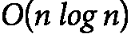

# 第十一章：<st c="0">8</st>

# <st c="2">排序与搜索的共生关系</st>

<st c="48">一些估计表明，排序消耗了全球计算能力的相当一部分，本章将探讨排序和搜索之间的共生关系。</st> <st c="231">我们将提供这些基本操作的概述，并探索它们如何相互作用并互相补充。</st> <st c="348">讨论将重点介绍现实世界的例子，说明如何在</st> <st c="450">数据处理</st>中平衡这些关键任务。</st>

<st c="466">本章作为一本实用指南，帮助你运用分析技术解决复杂的现实问题。</st> <st c="583">你将比较排序和搜索的复杂性，理解如何在它们的应用中实现平衡。</st> <st c="705">通过分析现实世界的场景，你将获得有关如何在决策中有效利用算法分析的见解。</st> <st c="839">通过这些例子，本章旨在突出选择适合特定情况的方法的重要性，优化排序和搜索过程，从而提高整体效率</st> <st c="1042">和性能。</st>

<st c="1058">我们将在</st> <st c="1099">本章中探讨以下主题：</st>

+   <st c="1112">在排序</st> <st c="1156">和搜索</st>之间找到合适的平衡

+   <st c="1169">效率困境——组织</st> <st c="1207">还是不组织？</st>

# <st c="1214">在排序和搜索之间找到合适的平衡</st>

<st c="1271">让我们花一点时间思考我们与各种信息系统的互动，从本地数据库到搜索引擎和图书馆。</st> <st c="1419">这些互动中有多少涉及与搜索相关的任务？</st> <st c="1480">考虑决策过程。</st> <st c="1516">我们能否假设，在大多数情况下，做决策都涉及寻找最佳选项？</st> <st c="1618">同样，我们能否推断出，大多数问题解决任务都涉及某种形式的</st> <st c="1692">搜索？</st>

<st c="1702">在前一章中，我们探讨了算法搜索和人工智能驱动搜索之间的区别。</st> <st c="1805">虽然本章重点讨论的是算法搜索，但我们提出的一些问题也与人工智能搜索</st> <st c="1915">相关。</st>

<st c="1923">我们之前提出的问题的答案是，确实，我们与计算机的大多数交互都涉及</st> <st c="2025">直接的搜索任务，或者可以被表述为搜索问题，例如</st> *<st c="2091">优化</st>* <st c="2103">和</st> *<st c="2108">约束满足问题</st>*<st c="2140">。搜索的概念不仅限于计算机</st> <st c="2193">系统。</st> <st c="2202">在我们的日常生活中，我们经常解决搜索问题。</st> <st c="2262">无论是寒冷冬日里在杂乱的衣橱中寻找合适的衬衫，还是在一堆重要文件、传单和杂物中寻找电费单，我们都在不断地进行搜索活动。</st> <st c="2497">这证明了搜索操作在计算机领域以及我们</st> <st c="2597">日常生活中的基础性和普遍性。</st>

<st c="2612">这突显了在搜索任务中投入的巨大计算和人力成本。</st> <st c="2702">在算法设计与分析中，这些努力通常通过时间和空间复杂度来衡量。</st> <st c="2798">虽然还涉及其他成本因素，但这些超出了我们</st> <st c="2883">当前讨论的范围。</st>

## <st c="2902">排序与搜索的共生关系</st><st c="2946">g</st>

<st c="2948">本节的主要目标是</st> <st c="2988">从实践角度分析搜索操作的成本，重点关注其时间和空间复杂度。</st> <st c="3105">理解这些成本对于优化搜索算法和提高整体</st> <st c="3197">系统效率至关重要。</st>

<st c="3215">在前一章中，我们展示了线性搜索在没有任何预处理（如排序）的情况下，其时间复杂度为</st>  <st c="3349"><st c="3350">在最坏的情况下。</st> <st c="3370">这意味着我们可能需要进行最多</st>  <st c="3412"><st c="3461">次比较才能找到目标键。</st> <st c="3499">此外，如果我们搜索所有具有相同键的项，比较的次数仍然是</st>  <st c="3593"><st c="3642">并且无法</st> <st c="3653">减少。</st></st></st></st>

<st c="3664">然而，我们可以通过在进行任何查找操作之前投入一些计算资源对数据进行排序，从而实现比</st>  <st c="3713"><st c="3714">更好的性能。</st> <st c="3815">如在</st> *<st c="3831">第六章</st>*<st c="3840">中讨论的那样，*<st c="3842">归并排序</st>*<st c="3852">是最有效的排序算法之一，其运行时间为</st> <st c="3926"><st c="3937">。一旦数据被排序，我们可以使用更高效的查找算法，例如二分查找类算法。</st> <st c="4056">例如，标准的</st> *<st c="4081">二分查找</st>* <st c="4094">其运行时间为</st> <st c="4117"><st c="4126">。此外，对于均匀分布的数据，我们还可以采用更高效的算法，例如</st> *<st c="4236">插值查找</st>*<st c="4256">，其平均情况下的运行时间为</st> <st c="4300"><st c="4313">。</st></st></st></st></st>

<st c="4314">为了讨论的目的，假设我们选择标准的二分查找算法，其</st>  <st c="4412"><st c="4421">运行时间。</st> <st c="4435">通过将排序与高效的查找算法相结合，我们可以显著降低与在未排序数据上使用线性查找相比的整体计算成本。</st> <st c="4599">如我们所见，排序与查找之间呈现出一种</st> <st c="4646">共生关系。</st></st>

<st c="4669">我们</st> <st c="4672">借用了“共生”这一术语，源自生物系统。</st> <st c="4728">在生物学中，共生关系指的是两种不同的有机体、物种或实体之间的互利互动。</st> <st c="4864">在这种关系中，双方通常都能获得某种形式的好处，其性质可以有所不同。</st> <st c="4965">共生有三种主要类型</st> <st c="4992">：</st>

+   **<st c="5005">共生关系</st>**<st c="5015">：两种生物</st> <st c="5033">都从这种关系中受益。</st> <st c="5064">例如，蜜蜂和花朵之间有共生关系；蜜蜂从花朵中获取花蜜，而花朵通过蜜蜂的传粉得到授粉。</st>

+   **<st c="5200">共栖关系</st>**<st c="5213">：一种生物受益，而另一种生物既不受到帮助也不受到伤害。</st> <st c="5284">例如，螺旋藻附着在鲸鱼身上，借助被鲸鱼带到不同的觅食场所而受益，但不影响</st> <st c="5407">鲸鱼。</st>

+   **<st c="5417">寄生关系</st>**<st c="5428">：一种生物</st> <st c="5443">以另一种生物为代价获得好处。</st> <st c="5482">例如，蜱虫吸食哺乳动物的血液，使蜱虫受益，但可能对宿主造成伤害。</st>

<st c="5584">从广义上讲，“共生”可以描述各种背景下的关系，在这些关系中，合作和互惠互利是关键。</st> <st c="5700">然而，排序和搜索可以被视为一种具有独特形式的共生关系，类似于寄生关系。</st> <st c="5710">在这种关系中，排序对搜索有利，因为已排序的数据可以显著提高搜索操作的效率。</st> <st c="5830">例如，二分查找要求数据已排序才能正常工作，并且能够在对数时间内快速定位元素，这比在未排序数据中进行线性查找要快得多。</st> <st c="5962">此外，某些搜索算法，如数据库或特定应用中的搜索算法，固有地涉及排序作为预处理步骤，以优化</st> <st c="6309">搜索过程。</st>

<st c="6324">然而，反过来并非如此。</st> <st c="6359">高效的搜索算法并不会提高排序算法的效率。</st> <st c="6440">在基于比较的排序算法中，排序算法的性能不受搜索算法效率的影响。</st> <st c="6577">排序有其固有的复杂性，而与之相关的成本并不会因搜索技术的进步而减少。</st> <st c="6706">因此，虽然排序为搜索提供了显著的优势，但这一好处是单方面的。</st> <st c="6799">这里的共生关系更像是寄生关系，搜索在利用已排序的数据获得好处时，没有回报排序过程的任何</st> <st c="6927">优势。</st> <st c="6944">

<st c="6960">以下是搜索和</st> <st c="6987">排序如何相互作用：</st>

+   **<st c="7004">搜索操作的效率</st>**<st c="7036">：二分查找算法要求数据是已排序的，才能正确工作。</st> <st c="7113">当数据已排序时，二分查找可以在</st>  <st c="7181"><st c="7190">时间内快速定位元素，这比</st>  <st c="7226"><st c="7227">线性查找在</st> <st c="7266">无序数据中的时间复杂度要快得多。</st></st></st>

+   **<st c="7280">排序作为预处理步骤</st>**<st c="7313">：许多与搜索相关的问题从排序作为预处理步骤中受益。</st> <st c="7389">例如，当处理范围查询或搜索多个元素时，首先对数据进行排序可以带来更</st> <st c="7511">高效的算法。</st>

+   **<st c="7532">复杂算法</st>**<st c="7551">：一些复杂算法结合了排序和搜索，以更高效地解决问题。</st> <st c="7644">例如，寻找中位数、众数或其他统计量的算法通常会从</st> <st c="7735">排序数据开始。</st>

+   **<st c="7748">数据结构</st>**<st c="7764">：如平衡二叉查找树（例如，AVL 树和红黑树）等数据结构本身维持有序顺序，从而支持高效的搜索、插入和删除操作。</st> <st c="7957">类似地，数据库中使用的 B 树也维持有序数据，以优化</st> <st c="8027">搜索操作。</st>

<st c="8045">排序和搜索并非计算机科学中唯一具有共生关系的概念。</st> <st c="8135">还有其他概念对，它们也表现出类似的互惠关系。</st> <st c="8225">让我们来看看其中的一些：</st> <st c="8251">它们：</st>

+   **<st c="8259">AI 搜索中的探索与利用</st>**<st c="8292">：</st>

    +   **<st c="8303">探索</st>**<st c="8314">：由像</st> **<st c="8351">广度优先搜索</st>** <st c="8371">(</st>**<st c="8373">BFS</st>**<st c="8376">)等算法实现，探索涉及</st> <st c="8400">广泛地扫描搜索空间。</st> <st c="8444">我们在探索上投入的越多，就越不需要依赖于利用，而后者可能</st> <st c="8531">是有风险的。</st>

    +   **<st c="8540">利用</st>**<st c="8553">：由如</st> **<st c="8590">深度优先搜索</st>** <st c="8608">(</st>**<st c="8610">DFS</st>**<st c="8613">)等算法实现，利用</st> <st c="8629">专注于深入探索一条路径，然后再尝试其他路径。</st> <st c="8689">平衡探索与利用对于避免搜索失败的风险和确保</st> <st c="8787">高效解决问题至关重要。</st>

+   **<st c="8813">成本与人工智能中的启发式搜索策略</st>** **<st c="8843">策略</st>**<st c="8860">：</st>

    +   <st c="8862">在人工智能的搜索策略中，搜索成本与启发式方法之间存在共生关系。</st> <st c="8979">在搜索过程的早期，投入精心选择的启发式方法可以显著降低整体搜索成本，帮助搜索朝着更有成效的方向发展。</st> <st c="9146">这种平衡有助于更高效地解决问题。</st> <st c="9200">一个典型的例子是 A*搜索算法，它将启发式方法和路径成本相结合，最优地找到最</st> <st c="9316">高效的解决方案。</st>

<st c="9335">这些例子</st> <st c="9351">展示了不同概念之间的共生关系是计算机科学中的一个常见主题。</st> <st c="9461">平衡和优化这些关系是开发高效算法和解决复杂</st> <st c="9569">计算问题的关键。</st>

<st c="9592">让我们通过一个示例来结束这一部分。</st> <st c="9651">假设有一种假设的货币，用于支付任务的计算复杂度，这种货币被称为“比较”。当从未排序的数据库中搜索和检索一个项目时，我们需要支付</st>  <st c="9876"><st c="9925">次比较，其中</st>  <st c="9944"><st c="9945">是数据集的大小。</st> <st c="9974">然而，如果我们提前使用高效的排序算法对数据进行排序，搜索的成本可以降低到</st>  <st c="10105"><st c="10112">次比较。</st></st></st></st>

<st c="10124">但是，搜索成本的降低伴随着前期成本的增加。</st> <st c="10187">高效地排序数据大约需要</st>  <st c="10239"><st c="10248">次比较。</st> <st c="10261">因此，先排序再搜索的总成本是</st>  <st c="10326"><st c="10333">(排序的成本)加上</st>  <st c="10352"><st c="10357">(搜索的成本)，这简化为大约</st>  <st c="10408"><st c="10415">次比较，因为</st>  <st c="10434"><st c="10441">相较于</st> <st c="10470">而言，</st> <st c="10473"><st c="10482">较小。</st></st></st></st></st></st></st>

<st c="10483">考虑到这一点，你可能会疑惑，为什么要投资于排序。</st> <st c="10556">排序的好处在于，当需要多个搜索操作时，排序的优势变得显而易见。</st> <st c="10639">如果我们先排序一次，然后进行多次搜索，那么最初的排序成本会通过大量搜索操作摊销，使得每个单独的搜索操作显著更快、更高效。</st> <st c="10839">因此，在需要频繁搜索的场景下，排序的前期投入是值得的，这突显了排序优化搜索任务整体效率的共生关系。</st> <st c="11029">搜索任务。</st>

<st c="11042">然而，在这种情境下有一个强大的潜在假设，这个假设在许多实际应用中可能不成立——即数据是静态的，不会发生变化。</st> <st c="11222">实际上，数据集通常是动态的，除了需要搜索操作，还需要频繁的插入</st> <st c="11328">和删除。</st>

<st c="11342">处理未排序数据时，插入新项目很简单，不会产生比较成本，因为新项目只是添加到集合的末尾。</st> <st c="11509">然而，删除项目需要搜索它，这可能需要最多</st>  <st c="11584">比较，然后进行</st> <st c="11658">删除。</st>

<st c="11670">相反，对于已排序的数据，插入新项目需要维护顺序，这通常意味着重新排序数据或找到新项目的适当位置，增加了额外的比较成本。</st> <st c="11890">从已排序数据集中删除项目涉及在对数时间内搜索它，这得益于顺序，但不需要在移除后重新排序。</st>

<st c="12046">总之，在</st> <st c="12068">排序数据前，当搜索频繁时可以显著减少搜索操作的成本，但这种好处在动态数据集中会减弱。</st> <st c="12217">每次插入可能需要额外的排序，增加了总体成本。</st> <st c="12294">因此，在数据经常修改的环境中，需要权衡为了高效搜索而预先排序的优势与维护排序顺序的持续成本。</st> <st c="12484">这一考虑挑战了在</st> <st c="12570">动态场景中通过排序提高搜索效率的影响。</st>

<st c="12588">在接下来的章节中，我们将通过现实世界的例子展示如何在排序和搜索之间实现平衡，以设计高效的算法。</st> <st c="12732">我们将通过信息系统内外的实例来探索这种平衡，帮助做出更有效和</st> <st c="12870">高效的决策。</st>

# <st c="12890">效率困境——组织还是不组织？</st>

<st c="12935">我们注意到</st> <st c="12952">许多专业人士和大学教授办公室乱七八糟，到处堆满了文件、书籍和账单。</st> <st c="13084">他们常常苦于找不到需要的物品，在这个过程中花费大量时间。</st> <st c="13189">担心可能会丢失重要物品，他们倾向于几乎保留一切。</st> <st c="13282">相比之下，一些人非常重视组织（即排序）。</st> <st c="13366">他们花费大量时间来整理和分类自己的物品。</st> <st c="13454">然而，当需要检索物品时，他们投入的组织时间是值得的。</st>

<st c="13561">一个根本性的问题是，哪种方法更高效——有序还是无序？</st> <st c="13657">在这一部分，我旨在探讨过度重视组织可能被高估的观点，并从排序与搜索之间的共生关系中获得启示</st> <st c="13827">。</st>

<st c="13841">办公环境凌乱的专业人士往往在一个需要立即检索特定物品却充满挑战的环境中工作。</st> <st c="13971">这种无序的方法可能导致低效，因为大量时间都浪费在寻找所需的文件或工具上。</st> <st c="14099">尽管表面上看似混乱，但往往存在某种对个人有意义的内在系统，虽然这种系统对他人来说可能并不明显</st> <st c="14243">。</st>

<st c="14253">相反，优先考虑组织的人会提前花时间对物品进行分类和整理。</st> <st c="14362">这种有条理的方法起初可能显得费时，但当他们需要迅速取回某些东西时，这种方法却大有裨益。</st> <st c="14484">检索效率的提升通常足以弥补整理所花费的时间。</st> <st c="14562">通过拥有一个结构良好的系统，他们减少了搜索时间，使工作流程更加顺畅和</st> <st c="14664">可预测。</st>

<st c="14681">组织与无序哪个更高效的核心问题取决于具体的背景和个人的需求。</st> <st c="14826">对于某些人来说，凌乱的工作环境可能激发创造力和灵活性，而对于另一些人来说，井然有序的环境提供了清晰</st> <st c="14960">和效率。</st>

<st c="14975">从排序和搜索算法中得到的启示可以看出，每种方法的有效性会有所不同。</st> <st c="15091">在计算机术语中，一个有序的系统（例如排序数组）允许更快的搜索时间（使用二分查找等算法），而一个无序的系统（例如未排序的数组）可能需要更为全面的搜索方法（例如线性查找）。</st> <st c="15361">然而，初始的排序过程本身有一定成本，是否进行排序取决于搜索操作的频率和紧迫性。</st>

<st c="15500">总之，组织与无序的价值可以类比于算法中排序与搜索的权衡。</st> <st c="15653">两种方法各有优缺点，最佳策略通常是在适应具体需求和限制的情况下找到平衡。</st> <st c="15831">通过理解排序与搜索之间的共生关系，我们可以做出更为明智的决策，</st> <st c="15951">更有效地管理我们的资源和</st> <st c="15980">时间。</st>

## <st c="15997">像计算机科学家一样思考</st>

<st c="16029">让我们考虑以下场景——Janet 是一名数学教授，她收到一堆科研论文；假设她平均每天收到</st>  <st c="16187"><st c="16188">篇论文。</st> <st c="16206">她每天需要检索几篇论文用于研究。</st> <st c="16271">她挑选的论文数量不定，但平均来说，她每天检索</st>  <st c="16340"><st c="16341">篇论文。</st> <st c="16358">其中有几篇是她的最爱，经常引用，而大部分论文是</st> <st c="16446">很少访问的。</st></st></st>

<st c="16462">利用我们对搜索、排序及其计算成本的理解，我们旨在帮助 Janet 做出高效的决策。</st> <st c="16598">首先，Janet 需要决定是否应该对她桌上的文献进行排序，如果需要，排序的频率应是多少。</st> <st c="16711">这个决策将取决于排序成本与检索效率之间的平衡。</st> <st c="16822">其次，她希望计算在</st>  <st c="16899"><st c="16900">天内进行操作的总运行时间，考虑到排序和检索的时间。</st> <st c="16947"> </st></st>

<st c="16957">以下是</st> <st c="16976">我们的假设：</st>

+   <st c="16992">平均每天收到的新论文数量</st> <st c="17035">：p</st>

+   <st c="17041">平均每天访问的科研论文数量</st> <st c="17091">：s</st>

+   <st c="17097">总天数</st> <st c="17114">：k</st>

<st c="17121">如果文档未排序，访问每篇文档将需要</st>  <st c="17184"><st c="17185">的时间，其中</st>  <st c="17198"><st c="17247">是她桌面上的文档总数。</st> <st c="17290">经过</st>  <st c="17296"><st c="17297">天后，文档的总数大约是</st> <st c="17348"><st c="17352">。如果文档已排序，访问每篇文档将需要</st>  <st c="17412"><st c="17421">的时间，因为要进行二分查找。</st> <st c="17448">排序</st>  <st c="17456"><st c="17505">篇文档需要</st>  <st c="17518"><st c="17528">的时间。</st></st></st></st></st></st></st></st>

<st c="17533">让我们估算一下在未排序的情况下的总运行时间。</st> <st c="17589">一天的总访问时间是</st> <st c="17626"><st c="17633">。在</st>  <st c="17640"><st c="17641">天内，运行时间为：</st></st></st>

![<mml:math xmlns:mml="http://www.w3.org/1998/Math/MathML" xmlns:m="http://schemas.openxmlformats.org/officeDocument/2006/math" display="block"><mml:mrow><mml:munderover><mml:mo stretchy="false">∑</mml:mo><mml:mrow><mml:mi>d</mml:mi><mml:mo>=</mml:mo><mml:mn>1</mml:mn></mml:mrow><mml:mrow><mml:mi>k</mml:mi></mml:mrow></mml:munderover><mml:mrow><mml:mi>s</mml:mi></mml:mrow><mml:mo>.</mml:mo><mml:mi>O</mml:mi><mml:mfenced separators="|"><mml:mrow><mml:mi>p</mml:mi><mml:mi>d</mml:mi></mml:mrow></mml:mfenced><mml:mo>≈</mml:mo><mml:mi>O</mml:mi><mml:mfenced separators="|"><mml:mrow><mml:mi>s</mml:mi><mml:mi>p</mml:mi><mml:msup><mml:mrow><mml:mi>k</mml:mi></mml:mrow><mml:mrow><mml:mn>2</mml:mn></mml:mrow></mml:msup></mml:mrow></mml:mfenced></mml:math>](img/1460.png)

<st c="17689">如果珍妮特每天整理她的文件，那么一天的整理时间是</st> ![<mml:math xmlns:mml="http://www.w3.org/1998/Math/MathML" xmlns:m="http://schemas.openxmlformats.org/officeDocument/2006/math"><mml:mi>O</mml:mi><mml:mfenced separators="|"><mml:mrow><mml:mfenced separators="|"><mml:mrow><mml:mi>p</mml:mi><mml:mi>d</mml:mi></mml:mrow></mml:mfenced><mml:mrow><mml:mrow><mml:mi mathvariant="normal">log</mml:mi></mml:mrow><mml:mo>⁡</mml:mo><mml:mrow><mml:mfenced separators="|"><mml:mrow><mml:mi>p</mml:mi><mml:mi>d</mml:mi></mml:mrow></mml:mfenced></mml:mrow></mml:mrow></mml:mrow></mml:mfenced></mml:math>](img/1461.png)<st c="17759"><st c="17774">。一天的访问时间可以</st> <st c="17807">估算为：</st></st>

<st c="17820"><st c="17836">，并且超过</st>  <st c="17847"><st c="17848">天：</st></st></st>

![<mml:math xmlns:mml="http://www.w3.org/1998/Math/MathML" xmlns:m="http://schemas.openxmlformats.org/officeDocument/2006/math" display="block"><mml:mrow><mml:munderover><mml:mo stretchy="false">∑</mml:mo><mml:mrow><mml:mi>d</mml:mi><mml:mo>=</mml:mo><mml:mn>1</mml:mn></mml:mrow><mml:mrow><mml:mi>k</mml:mi></mml:mrow></mml:munderover><mml:mrow><mml:mfenced separators="|"><mml:mrow><mml:mi>O</mml:mi><mml:mfenced separators="|"><mml:mrow><mml:mi>p</mml:mi><mml:mi>d</mml:mi><mml:mi>l</mml:mi><mml:mi>o</mml:mi><mml:mi>g</mml:mi><mml:mfenced separators="|"><mml:mrow><mml:mi>p</mml:mi><mml:mi>d</mml:mi></mml:mrow></mml:mfenced></mml:mrow></mml:mfenced><mml:mo>+</mml:mo><mml:mi>s</mml:mi><mml:mi>O</mml:mi><mml:mfenced separators="|"><mml:mrow><mml:mi>l</mml:mi><mml:mi>o</mml:mi><mml:mi>g</mml:mi><mml:mfenced separators="|"><mml:mrow><mml:mi>p</mml:mi><mml:mi>d</mml:mi></mml:mrow></mml:mfenced></mml:mrow></mml:mfenced></mml:mrow></mml:mfenced></mml:mrow></mml:mrow><mml:mo>≈</mml:mo><mml:mi>O</mml:mi><mml:mfenced separators="|"><mml:mrow><mml:mi>p</mml:mi><mml:msup><mml:mrow><mml:mi>k</mml:mi></mml:mrow><mml:mrow><mml:mn>2</mml:mn></mml:mrow></mml:msup><mml:mi>l</mml:mi><mml:mi>o</mml:mi><mml:mi>g</mml:mi><mml:mfenced separators="|"><mml:mrow><mml:mi>p</mml:mi><mml:msup><mml:mrow><mml:mi>k</mml:mi></mml:mrow><mml:mrow><mml:mn>2</mml:mn></mml:mrow></mml:msup></mml:mrow></mml:mfenced></mml:mrow></mml:mfenced></mml:math>](img/1464.png)

<st c="17907">频繁地整理文件</st> <st c="17932">如果 Janet 访问的文件数量相比她收到的文件数量很大，那么频繁整理文件是有益的。</st> <st c="18041">更精确地说，若</st> <st c="18060"><st c="18071">，其中</st>  <st c="18079"><st c="18128">是文件的总数量，那么整理文件是有利的。</st> <st c="18189">例如，假设 Janet 的档案中有</st>  <st c="18216"><st c="18222">个文件，并且她一天内取回超过 100 个文件（因为</st> <st c="18297"><st c="18313">），那么整理文件将变得有利。</st> <st c="18344">然而，这个数字会每天增加，这并不是</st> <st c="18399">非常现实的。</st></st></st></st></st>

<st c="18414">尽管如此，我们对 Janet 的情况做出了若干隐含的假设：</st>

+   **<st c="18501">排序能力</st>**<st c="18520">：我们假设 Janet 能够使用高效的算法（例如归并排序）对她的文件进行排序。</st> <st c="18616">然而，通常情况下，人类排序的效率不及简单的算法（如冒泡排序），后者的效率要低得多。</st>

+   **<st c="18736">平等访问概率</st>**<st c="18761">：我们假设所有文件被访问的可能性相同。</st> <st c="18835">但实际上，一些文件被频繁引用，而其他文件则很少甚至从未被检索，可能遵循幂律分布。</st>

+   **<st c="18973">将文件返回顶部</st>**<st c="19001">：在无排序的情况下，我们假设 Janet 通常会把用过的文件放回堆顶。</st> <st c="19100">这意味着她不必重新翻找整个堆来找到该文件。</st> <st c="19170">此外，尽管人类在系统排序方面表现不佳，但他们通常具有很强的能力在随机杂乱的物品中定位物品，这与心理学上的</st> <st c="19343">哈希机制类似。</st>

<st c="19361">考虑到这些因素，最初支持频繁排序的分析可能并不成立。</st> <st c="19452">人类天然具备定位常用物品的能力，而且在动态环境中维持排序系统并不实际，这些都表明对于 Janet 而言，排序可能并非最有效的方式。</st>

<st c="19668">需要注意的是，所提供的示例是一个计算分析，当然可以为决策提供参考，但它并不是唯一需要考虑的因素。</st> <st c="19833">换句话说，当涉及到人类或人类参与的过程时，计算效率并不一定能转化为生产力。</st> <st c="19986">保持一个整洁有序的环境能够在心理上改善我们的情绪，帮助我们集中注意力，并促进</st> <st c="20096">深度工作。</st>

<st c="20106">毫不奇怪</st> <st c="20127">，即使是在涉及机器人起义的假设场景中，机器人本身也可能表现出无序和缺乏组织！</st>

<st c="20260">尽管我们的分析表明，从纯粹的计算角度来看，排序可能并非最有效的方式，但人类因素，如对整洁工作空间的需求以及组织的心理益处，仍不应被忽视。</st> <st c="20513">这些因素能够显著提升整体生产力和幸福感，因此将文件进行排序和组织的决策比单纯的计算效率所建议的更为复杂。</st> <st c="20688">。</st>

# <st c="20702">总结</st>

<st c="20710">在本章中，我们详细探讨了排序和搜索之间的共生关系。</st> <st c="20808">结果表明，尽管排序可以显著降低搜索操作的时间复杂度，但从排序中获得的整体效率必须仔细权衡，在动态环境中，其中数据经常更新。</st> <st c="21103">通过各种场景和例子，我们突出了在决定是否以及如何频繁地对数据进行排序时所涉及的权衡。</st> <st c="21230">我们还指出，尽管排序的计算优势不一定会转化为在考虑人因素和心理影响时的实际效率。</st> <st c="21407">我们的分析表明，人类发现物品的自然能力和有组织工作空间的心理优势增加了决策过程的复杂性。</st>

<st c="21589">本章结束时，我们认识到尽管计算分析提供了宝贵的洞见，但在涉及人类时并不是生产力的唯一决定因素。</st> <st c="21778">排序的假设性好处必须与实际考虑和个体的固有优势和偏好取得平衡。</st> <st c="21921">在我们继续前进时，下一章将介绍随机算法，为处理计算问题提供新的视角。</st> <st c="22059">这些算法利用随机性来实现高效的解决方案，并提供了与迄今为止讨论的确定性方法的激动人心的对比。</st>

# <st c="22211">参考资料和进一步阅读</st>

+   *<st c="22242">《活出算法：人类决策的计算机科学》</st>*<st c="22305">。作者：布莱恩·克里斯汀和汤姆·格里菲斯。</st> <st c="22345">出版社：亨利霍尔特和</st> <st c="22360">公司。</st> <st c="22364">2016 年</st>

+   *<st c="22368">《深度工作：专注成功的规则在分心世界中》</st>*<st c="22427">。作者：卡尔·纽波特，大中央</st> <st c="22459">出版社，2016 年</st>
