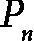

# 第十二章：<st c="0">9</st>

# <st c="2">随机算法</st>

<st c="23">在前几章讨论的确定性算法的基础上，我们现在转向那些不确定性和随机性是关键因素的情况。</st> <st c="195">在本章中，我们将探讨如何设计算法，即使在存在不可预测因素的情况下，也能做出最佳决策。</st> <st c="339">随机算法将机会元素引入其逻辑，提供创新的方式来解决那些可能用纯粹确定性方法解决起来具有挑战性或效率低下的问题。</st> <st c="537">这些算法通常能够简化解决方案、提高性能，并为问题解决提供新的视角。</st> <st c="652">在本章中，我们将审视利用随机性实现期望结果的各种策略和技术。</st> <st c="781">通过理解随机算法背后的原理，我们可以在不确定的环境中开发出强大的解决方案。</st> <st c="913">我们的讨论将涵盖理论基础、实际应用以及一些示例，展示将随机性融入</st> <st c="1076">算法设计中的力量与多样性。</st>

<st c="1093">请注意，虽然本章中使用了一些概率论的初步内容，但要全面理解本章，仍然需要具备足够的概率论基础。</st> <st c="1303">如果你对概率论不够熟悉，我们建议在继续之前，使用可信的参考书籍和教材来刷新你的知识。</st> <st c="1453">。</st>

<st c="1471">在本章中，我们将涵盖以下内容：</st> <st c="1507">主题：</st>

+   <st c="1524">概率算法综述</st> <st c="1537">的回顾</st>

+   <st c="1561">随机算法分析</st> <st c="1574">的分析</st>

+   <st c="1595">案例研究</st>

# <st c="1608">概率算法综述</st>

<st c="1645">首先，让我们探索是否可以将到目前为止讨论的概念应用于解决以下</st> <st c="1742">假设问题：</st>

+   <st c="1764">一个新的在线约会应用程序</st> *<st c="1790">Matcher</st>*<st c="1797">已经开发出来，旨在帮助用户找到潜在的伴侣。</st> <st c="1857">该应用程序像一个游戏，旨在将用户与他们最合适的</st> <st c="1926">约会对象配对：</st>

    +   <st c="1941">该应用程序中有</st>  <st c="1952"><st c="1953">潜在的匹配项可供选择（匹配总数对用户是未知的）。</st> <st c="2048">让我们考虑一个名为 Tom 的用户。</st></st>

    +   当 Tom 打开*Matcher*应用时，系统会一次展示一个潜在匹配对象，随机选择。Tom 可以选择喜欢（向右滑动）或不喜欢（向左滑动）每个个人资料。

    +   Tom 的决定是不可逆的；一旦他在个人资料上向右滑动或向左滑动，他就无法改变主意。所有的决定都是最终的。

    +   Tom 最多可以喜欢**n**个个人资料（其中**n**远小于**N**）。一旦 Tom 喜欢了**n**个个人资料，应用程序将不再向他展示更多个人资料。

    +   互动结束的条件是：要么 Tom 已经喜欢了**n**个个人资料，要么没有更多的个人资料可以显示。

    +   需要注意的是，喜欢一个个人资料并不保证匹配；还需要对方喜欢 Tom 的个人资料。

    +   对 Tom 来说，挑战在于如何最有效地利用他的**n**个喜欢，选择最合适的匹配对象。他需要决定何时停止浏览，开始喜欢个人资料，以最大化选择最佳可用选项的机会。

+   <st c="3081">芳被邀请去她朋友家，朋友家位于一条长长的单行道的中间。</st> <st c="3185">街道的一个侧面允许停车。</st> <st c="3236">街道上交通繁忙，找到停车位非常具有挑战性。</st> <st c="3299">根据经验，约有 10%的</st>  <st c="3337"><st c="3338">停车位通常在任何时刻可用。</st> <st c="3396">芳每次经过时只能看到一个停车位，无法看到前方的停车位。</st> <st c="3482">目标是确定她何时应决定停车并占用一个可用的</st> <st c="3570">停车位。</st></st>

<st c="3583">上述两种问题有一个根本的相似性：它们都是搜索问题。</st> <st c="3670">在每种情境中，目标是从一系列的可能性中识别出最佳选项：</st> <st c="3749">选择最优解：</st>

+   <st c="3766">汤姆正在寻找一个最佳匹配的</st> <st c="3808">约会应用程序</st>

+   <st c="3818">芳正在尝试找到一个最靠近她</st> <st c="3874">朋友家的停车位</st>

<st c="3888">然而，这些问题与传统的搜索设置有所不同。</st> <st c="3954">与传统搜索问题不同，在这些问题中，所有数据项并非一开始就能进行比较，而是数据项会按顺序和不可预测地出现。</st> <st c="4094">数据的顺序到达意味着我们无法预测下一个数据项，从而使得基于比较的标准搜索</st> <st c="4208">算法变得无效。</st>

<st c="4231">在这些情境中，挑战不在于通过比较识别最佳数据项，而是在于决定何时停止搜索并</st> <st c="4369">做出选择。</st> <st c="4387">决策过程涉及对每个选项进行评估，并确定是否接受它，或继续搜索可能更好的选项。</st> <st c="4553">以下是这些问题的关键特征：</st> <st c="4594">这些问题的特点：</st>

+   **<st c="4609">数据顺序到达</st>**<st c="4633">：数据项逐一到达，必须立即做出决策，而无法预知</st> <st c="4724">未来的数据。</st>

+   **<st c="4736">不可逆决策</st>**<st c="4759">：一旦做出接受或拒绝某个选项的决策，就无法撤回。</st> <st c="4840">这增加了复杂性，因为你不能重新审视</st> <st c="4894">之前的选择。</st>

+   **<st c="4911">最佳停顿规则</st>**<st c="4933">：这些问题的核心在于找到最佳的停顿时刻。</st> <st c="5002">这涉及到决定在何时停止搜索，并接受当前选项作为</st> <st c="5094">最佳可用选项。</st>

<st c="5109">最优停止理论提供了解决这类问题的框架。</st> <st c="5192">该理论有助于确定在何时继续寻找的成本超过找到更好选项的概率时，停止寻找的最佳时机。</st> <st c="5338">例如，我们可以考虑</st> <st c="5366">以下情况：</st>

+   <st c="5380">汤姆可以使用一种策略，他最初会查看一定数量的资料，而不做任何决定（以收集匹配质量的信息），然后选择一个比他已经查看过的资料更好的资料。</st> <st c="5614">到目前为止。</st>

+   <st c="5620">方可以开车经过前几个停车位（以评估可用性和接近度），然后停在一个比她已看到的更近的停车位。</st> <st c="5770">已经看到的停车位。</st>

<st c="5782">这些问题展示了最优停止理论在实际生活中的应用，特别是在数据按顺序到达并且必须实时做出决策的场景中。</st> <st c="5903">通过理解和应用这一理论，人们可以在不确定性和信息不完全的情况下，做出何时停止寻找并接受选项的明智决策。</st> <st c="5957">这一方法将焦点从寻找最佳数据项转向确定做出决策的最佳时刻。</st> <st c="6140">这一方法将重点从寻找最佳数据项转向确定做出决策的最佳时机。</st> <st c="6240">决策的最佳时机。</st>

<st c="6256">最优停止问题是随机算法的一个典型示例。</st> <st c="6332">在我们详细探讨随机算法之前，让我们回顾一下算法的基本概念。</st> <st c="6438">算法是一个将一组输入数据转化为一组输出数据的系统。</st> *<st c="6526">图 9</st>**<st c="6534">.1</st>* <st c="6536">提供了一个简单的框图来说明</st> <st c="6583">这一概念。</st>


<st c="6630">图 9.1：一个框图，展示了通过算法将输入数据映射到输出数据的过程。</st>

<st c="6727">让我们通过将输入映射到输出的视角重新审视算法的概念。</st> <st c="6815">假设我们有一个输入数据集表示为</st> ![<mml:math xmlns:mml="http://www.w3.org/1998/Math/MathML" xmlns:m="http://schemas.openxmlformats.org/officeDocument/2006/math"><mml:mi>A</mml:mi><mml:mo>=</mml:mo><mml:mo><</mml:mo><mml:msub><mml:mrow><mml:mi>a</mml:mi></mml:mrow><mml:mrow><mml:mn>1</mml:mn></mml:mrow></mml:msub><mml:mo>,</mml:mo><mml:msub><mml:mrow><mml:mi>a</mml:mi></mml:mrow><mml:mrow><mml:mn>2</mml:mn></mml:mrow></mml:msub><mml:mo>,</mml:mo><mml:mo>…</mml:mo><mml:mo>,</mml:mo><mml:msub><mml:mrow><mml:mi>a</mml:mi></mml:mrow><mml:mrow><mml:mi>n</mml:mi></mml:mrow></mml:msub><mml:mo>></mml:mo></mml:math>](img/1475.png)<st c="6862"><st c="6874">。一个由一组过程指令组成的算法，会将</st>  <st c="6953"><st c="6954">转化为</st> <st c="6963">一个</st> 输出 ![<mml:math xmlns:mml="http://www.w3.org/1998/Math/MathML" xmlns:m="http://schemas.openxmlformats.org/officeDocument/2006/math"><mml:mi>B</mml:mi><mml:mo>=</mml:mo><mml:mo><</mml:mo><mml:msub><mml:mrow><mml:mi>b</mml:mi></mml:mrow><mml:mrow><mml:mn>1</mml:mn></mml:mrow></mml:msub><mml:mo>,</mml:mo><mml:msub><mml:mrow><mml:mi>b</mml:mi></mml:mrow><mml:mrow><mml:mn>2</mml:mn></mml:mrow></mml:msub><mml:mo>,</mml:mo><mml:mo>…</mml:mo><mml:mo>,</mml:mo><mml:msub><mml:mrow><mml:mi>b</mml:mi></mml:mrow><mml:mrow><mml:mi>m</mml:mi></mml:mrow></mml:msub><mml:mo>></mml:mo></mml:math>](img/1477.png)<st c="6970"><st c="6994">。</st></st></st></st>

<st c="6995">在确定性算法的上下文中，这一转化过程是一致且可重复的。</st> <st c="7098">给定相同的输入</st> <st c="7119"><st c="7120">，一个确定性算法总是会产生相同的输出</st> <st c="7184"><st c="7185">。这种可预测性是确定性算法的一个标志，确保它们的行为完全由输入决定</st> <st c="7312">它们接收到的输入。</st></st></st>

<st c="7325">例如，考虑我们在前几章介绍的排序和搜索算法。</st> <st c="7427">这些算法是确定性的，因为它们保证每次使用相同的输入运行时，都会产生相同的结果。</st> <st c="7533">相同的输入。</st>

<st c="7544">确定性算法通过确保相同的输入总是产生相同的输出，提供了可预测性和可靠性。</st> <st c="7676">这一特性对计算机科学中许多算法至关重要，尤其是那些需要一致且可重复结果的任务，如排序和搜索。</st> <st c="7855">理解这一概念为探索引入随机元素的算法奠定了基础，后者通过引入随机性来实现不同的目标，并以独特的方式处理不确定性。</st>

# <st c="8039">非确定性算法</st>

**<st c="8068">非确定性算法</st>** <st c="8097">是主要用于计算复杂度研究的理论构造。</st> <st c="8182">它们假设存在一种“非确定性”机器，如非确定性图灵机，可以做出任意选择，从而同时探索不同的计算路径。</st> <st c="8376">非确定性算法常用于定义问题的类别，如</st> **<st c="8459">非确定性多项式时间</st>** <st c="8491">(</st>**<st c="8493">NP</st>**<st c="8495">)，包括那些其解可以通过确定性算法在多项式时间内验证的问题。</st> <st c="8609">非确定性算法无法在标准的确定性机器上实际实现。</st> <st c="8708">它们作为理解并行计算潜力的一种方式，并用来分类</st> <st c="8802">问题的复杂度。</st>

<st c="8821">注</st>

<st c="8826">非确定性算法无法在标准的确定性机器上实际实现。</st> <st c="8926">另一方面，随机算法是可以实际实现的算法，它们使用随机数来影响决策过程。</st> <st c="9061">这些算法可以在标准计算机上实现，并在计算机科学</st> <st c="9175">和工程的许多领域中有应用。</st>

*<st c="9191">图 9</st>**<st c="9200">.2</st>* <st c="9202">提供了一个简单的框图，以说明随机算法的概念。</st> <st c="9287">随机算法包含一个随机性元素，作为一个额外的隐藏输入，我们无法控制它。</st> <st c="9404">这一随机性元素引入了不确定性，实质上作为算法的第二个输入。</st> <st c="9511">正是这种固有的随机性导致算法即使在显式输入保持不变的情况下，仍然表现出不同的行为和/或性能。</st>

<st c="9660">考虑一下</st> **<st c="9674">随机快速排序</st>** <st c="9695">算法。</st> <st c="9707">与传统的快速排序不同，后者通常选择一个固定的基准（如第一个、最后一个或中间的元素），随机快速排序则随机选择基准。</st> <st c="9875">这种随机选择可能导致每次运行算法时产生不同的比较和交换序列，即使是在相同的输入序列上。</st> <st c="10019">例如，给定输入序列</st> ![<math xmlns="http://www.w3.org/1998/Math/MathML"><mrow><mrow><mrow><mi mathvariant="normal"> </mi><mi>A</mi><mo>=</mo><mo>[</mo><mn>3</mn><mo>,</mo><mn>1</mn><mo>,</mo><mn>4</mn><mo>,</mo><mn>1</mn><mo>,</mo><mn>5</mn><mo>,</mo><mn>9</mn><mo>,</mo><mn>2</mn><mo>,</mo><mn>6</mn><mo>,</mo><mn>5</mn><mo>]</mo></mrow></mrow></mrow></math>](img/1480.png)<st c="10058"><st c="10059">，传统的快速排序算法可能总是选择中间元素作为基准。</st> <st c="10149">相比之下，随机快速排序可能选择任何元素作为基准，从而在每次运行中产生不同的步骤顺序和分区。</st> <st c="10296">因此，中间步骤可能会有所不同，可能会导致即使使用相同的数据，整体运行时间也会有所不同。</st> <st c="10412">同样的数据。</st></st>


<st c="10467">图 9.2：一个方框图，展示了通过非确定性算法将输入数据映射到输出数据的过程</st>

<st c="10581">任何输入的随机性都会引入算法性能和行为的变动。</st> <st c="10684">尽管随机快速排序的平均时间复杂度保持在</st> <st c="10756"><st c="10765">，但由于基准选择是随机的，特定实例的实际运行时间可能会有所不同。</st> <st c="10856">在最坏情况下，如果基准选择反复很差，性能可能会下降，尽管这种情况在统计上是不太可能发生的。</st> <st c="10988">统计上不太可能。</st></st>

<st c="11011">通过引入随机性，这些</st> <st c="11045">算法可以避免确定性算法可能遇到的特殊情况。</st> <st c="11132">例如，随机化快速排序避免了在某些输入下传统快速排序的最坏情况</st>  <st c="11202"><st c="11208">出现的情况。</st> <st c="11267">随机化算法通常更加健壮和适应性强。</st> <st c="11326">它们在各种输入下表现良好，使其成为实践中的多用途工具。</st> <st c="11427">在下一节中，我们将探讨分析</st> <st c="11484">随机化算法的框架。</st>

<st c="11506">为了有效地学习随机化算法，我们需要探讨几个</st> <st c="11578">关键主题：</st>

+   **<st c="11589">随机化算法的分析</st>**<st c="11623">：理解算法在概率和期望结果方面的表现至关重要。</st> <st c="11725">这涉及到分析平均情况的表现，而不仅仅是关注最坏情况。</st> <st c="11831">这一主题将在接下来的名为</st> *<st c="11899">随机化算法的分析</st>*<st c="11911">的部分中详细讲解。</st>

+   **<st c="11933">随机化数据结构</st>**<st c="11960">：设计包含随机性的 数据结构可以带来更高效的操作。</st> <st c="12056">例如，跳表和哈希表就是其中的典型。</st> <st c="12101">尤其是跳表，我们将在</st> *<st c="12148">第十一章</st>*<st c="12158">中深入探讨。</st>

+   **<st c="12159">案例研究</st>**<st c="12172">：为了应用所学的概念，我们将分析一些在不确定性下的特定问题，比如本节开始时提到的问题。</st> <st c="12317">详细的解决方案和讨论将在名为</st> *<st c="12392">案例研究</st>*<st c="12404">的部分中呈现。</st>

<st c="12405">通过探索这些主题，我们将全面了解随机化算法的运作方式，以及如何在</st> <st c="12553">各种应用中有效利用它们。</st>

# <st c="12574">随机化算法的分析</st>

<st c="12608">在分析</st> <st c="12620">随机算法时，我们常常使用</st> **<st c="12656">概率分析</st>**<st c="12678">。与其专注于最坏情况，我们更倾向于检查</st> *<st c="12743">期望</st>* <st c="12751">算法在所有可能随机选择下的表现。</st> <st c="12815">这个期望值提供了一个更现实的算法典型行为的图像。</st> <st c="12906">以下是一些</st> <st c="12919">关键原则：</st>

+   <st c="12934">我们计算关键性能指标的期望值，如运行时间或空间使用。</st> <st c="13032">这涉及对所有可能输入的性能进行平均，并按</st> <st c="13110">它们的概率加权。</st>

+   <st c="13128">我们研究算法性能指标的分布和方差，以了解它们偏离期望值的程度。</st> <st c="13268">这有助于评估算法的可靠性和一致性。</st> <st c="13327">算法。</st>

+   <st c="13341">重点是分析算法在典型或随机选择的输入下的行为，而不是最坏情况下的输入。</st> <st c="13461">这提供了一个更现实的算法</st> <st c="13519">实际性能衡量标准。</st>

+   <st c="13541">我们使用反映算法预期使用场景的现实输入模型。</st> <st c="13632">例如，在排序中，假设输入是随机排列的，而不是总是已排序或</st> <st c="13722">倒序排序的。</st>

+   <st c="13737">我们建立了具有高概率的性能界限。</st> <st c="13803">例如，一个算法可能会在</st>  <st c="13842"><st c="13851">时间内高概率运行，即使它偶尔会</st> <st c="13903">运行较慢。</st></st>

+   <st c="13915">使用随机变量来模拟算法内部的随机性。</st> <st c="13997">我们分析这些变量如何影响算法的行为和性能。</st> <st c="14080">我们还考虑随机变量之间的独立性或相关性，以简化分析或得出更准确的</st> <st c="14203">性能估计。</st>

<st c="14225">除了前面讨论的原则之外，随机算法的分析通常还涉及具体的技术和模型。</st> <st c="14360">随机抽样是一种基本技术，用于高效地做出决策或估计大数据集的属性。</st> <st c="14481">蒙特卡洛算法和拉斯维加斯算法以不同的方式利用随机性。</st> <st c="14557">蒙特卡洛算法提供概率性保证，并在固定时间内运行，具有一定的错误概率，而拉斯维加斯算法保证正确性，但运行时间是可变的。</st> <st c="14749">马尔可夫链和随机游走是分析更高级随机算法的重要模型。</st> <st c="14852">马尔可夫链有助于理解具有状态转移的系统行为，而随机游走被应用于各种网络算法和</st> <st c="14992">优化问题。</st>

<st c="15014">分析方法可以是自适应的或对抗性的。</st> <st c="15030">自适应分析研究算法如何应对变化的输入条件或环境变化。</st> <st c="15079">自适应分析研究算法如何响应变化的输入条件或环境变化。</st> <st c="15182">另一方面，对抗性分析考虑的是输入被设计为挑战算法性能至极限的情形。</st> <st c="15325">需要注意的是，尽管这些原则和技术对于全面理解随机算法至关重要，但它们超出了本书的范围。</st> <st c="15507">因此，我们不会在这里详细讨论所有这些原则。</st> <st c="15563">。</st>

<st c="15575">通过几个例子来说明随机算法的分析往往最为有效，逐步展示详细的过程。</st> <st c="15729">第一个例子是著名的</st> *<st c="15765">蒙提·霍尔问题</st>*<st c="15783">。第二个例子是</st> *<st c="15811">生日悖论</st>* <st c="15827">，最后，我们讨论著名的</st> *<st c="15867">招聘</st>* *<st c="15874">秘书问题</st>*<st c="15891">。</st>

## <st c="15892">蒙提·霍尔问题</st>

<st c="15911">**<st c="15916">蒙提·霍尔问题</st>** <st c="15934">是一个经典的脑筋急转弯，展示了概率推理的力量以及有时反直觉的特性，而概率推理是分析</st> <st c="16097">随机算法</st>的核心概念。</st>

<st c="16119">问题如下：你面前有三扇门（分别标为 A、B 和 C）。</st> <st c="16208">其中一扇门后有一辆车，另外两扇门后是山羊。</st> <st c="16270">你选择了一扇门（假设是 A 门）。</st> <st c="16306">主持人知道每扇门后面有什么，打开了另一扇门（假设是 B 门）露出了一只山羊。</st> <st c="16408">主持人然后给你选择，是否换到剩下的封闭门（C 门）。</st> <st c="16493">你应该坚持最初的选择，还是换门以最大化赢得汽车的机会呢？</st> <st c="16581">该怎么做？</st>

<st c="16589">反直觉的答案是：是的，你应该毫不犹豫地换门。</st> <st c="16656">换门能使你赢得汽车的机会加倍。</st> <st c="16713">乍一看，似乎在揭示了一扇门之后，剩下两扇门的胜率是 50/50。</st> <st c="16829">然而，这是一种常见的误解。</st> <st c="16870">正确的策略是始终换门，以下是原因：</st>

+   <st c="16934">汽车在 A 门后（你最初选择的门）的概率：</st> <st c="17004"><st c="17005">。</st></st>

+   <st c="17006">汽车在 B 门或 C 门后面的概率：</st> <st c="17059"><st c="17060">。</st></st>

+   <st c="17061">主持人打开 B 门的动作（它总是会露出一只山羊）并不会改变最初的概率。</st> <st c="17171">相反，它提供了额外的信息，影响了这些概率的分布。</st> <st c="17248">这些概率的分布情况。</st>

<st c="17268">让我们来分析一下概率，并考虑汽车可能位置的两种情况：</st>

+   <st c="17372">汽车在你最初选择的门后（门 A）的概率：</st> <st c="17443"><st c="17444">：</st>

    +   如果你坚持选择 A 门，你有概率赢得汽车，概率为

    +   如果你切换到 C 门，你有概率输掉，概率为

+   汽车可能在其他门（B 门或 C 门）后的概率为: 

    +   由于主持人已经在 B 门后揭示了山羊，如果汽车不在 A 门后，那么它一定在 C 门后。

    +   如果你切换到 C 门，你有概率赢得汽车，概率为

<st c="17818">然后，通过换门，你实际上是在押注你最初选择的门是错误的概率，这个概率是</st> <st c="17928"><st c="17932">. 因此，换门会将你赢得汽车的机会从</st>  <st c="18008"><st c="18010">提高到</st> <st c="18013"><st c="18017">. 这一违反直觉的结果是一个经典例子，展示了在人类直觉常常在</st> <st c="18118">概率情境中产生误导时的情况。</st> <st c="18144">蒙提霍尔问题凸显了理解概率和基于数学分析做出决策的重要性，而不是</st> <st c="18286">依赖直觉。</st></st></st></st>

## <st c="18299">生日悖论</st>

<st c="18316">**<st c="18321">生日悖论</st>**<st c="18337">，也</st> <st c="18344">被称为**<st c="18357">生日问题</st>**<st c="18373">，是一个著名的概率问题，展示了一个违反直觉的结果。</st> <st c="18452">它涉及到在一群人中，至少有两个人共享相同生日的可能性。</st> <st c="18564">令人惊讶的是，这个概率在群体很小的时候就能相对较高。</st> <st c="18648">

<st c="18664">问题可以这样表述：在一群</st>  <st c="18747"><st c="18748">人中，至少有两个人共享相同的生日的概率是多少？</st> <st c="18802">假设一年有 365 天，每个人的生日在这些天中任意一天出现的概率相同。</st></st>

<st c="18913">为了理解生日悖论，计算互补概率更为简单——即没有两个人共享相同生日的概率——然后从 1 中减去这个概率。</st> <st c="19110">我们可以按如下方式分解生日问题的互补概率的计算：</st> <st c="19200">如下所示：</st>

+   <st c="19211">第一个人拥有独特生日的概率是</st>  <st c="19275"><st c="19281">(因为还没有选择其他人)</st></st>

+   <st c="19320">第二个人和第一个人生日不同的概率</st> <st c="19400">是</st> 

+   <st c="19404">第三个人和前两个人生日不同的概率</st> <st c="19486">是</st> 

+   <st c="19490">….</st>

+   <st c="19492">对于</st>  <st c="19497"><st c="19546">个人，所有生日都独特的概率</st>  <st c="19570"><st c="19589">如下所示：</st> <st c="19622">如下：</st>

    ![<math xmlns="http://www.w3.org/1998/Math/MathML" display="block"><mrow><mrow><mi>P</mi><mfenced open="(" close=")"><mrow><mtext>独特</mtext><mtext>生日</mtext></mrow></mfenced><mo>=</mo><mfrac><mn>365</mn><mn>365</mn></mfrac><mo>×</mo><mfrac><mn>364</mn><mn>365</mn></mfrac><mo>×</mo><mfrac><mn>363</mn><mn>365</mn></mfrac><mo>×</mo><mo>…</mo><mo>×</mo><mfrac><mrow><mn>365</mn><mo>−</mo><mfenced open="(" close=")"><mrow><mi>n</mi><mo>−</mo><mn>1</mn></mrow></mfenced></mrow><mn>365</mn></mfrac></mrow></mrow></math>](img/1500.png)

    <st c="19675">或者，它是</st> <st c="19685">如下所示：</st>

    </st></st>

<st c="19738">然后，至少两个人共享同一生日的概率</st>  <st c="19760"><st c="19779">如下所示：</st> <st c="19831">如下所示：</st></st>


<st c="19887">结果表明，</st> <st c="19912">共享生日的概率随着群体大小的增加而迅速增加。</st> <st c="19991">以下是一个简单的 Python 核心代码，用于模拟</st> <st c="20045">生日悖论：</st>

```py
 import random
import matplotlib.pyplot as plt
def simulate_birthday_paradox(trials, n):
    shared_birthday_count = 0
    for _ in range(trials):
        birthdays = []
        for person in range(n):
            birthday = random.randint(1, 365)
            if birthday in birthdays:
                shared_birthday_count += 1
                break
            birthdays.append(birthday)
    return shared_birthday_count / trials
def main():
    trials = 10000
    results = []
    group_sizes = range(2, 367)
    for n in group_sizes:
        probability = simulate_birthday_paradox(trials, n)
        results.append(probability)
        print(f"Group size: {n}, Probability of shared birthday: {probability:.4f}")
    plt.figure(figsize=(10, 6))
    plt.plot(group_sizes, results, marker='o')
    plt.title('Birthday Paradox Simulation')
    plt.xlabel('Group Size')
    plt.ylabel('Probability of Shared Birthday')
    plt.grid(True)
    plt.show()
if __name__ == "__main__":
    main()
```

<st c="20885">该函数运行</st> <st c="20909">给定群体大小的生日悖论模拟</st>  <st c="20960"><st c="21009">和一定次数的试验，默认是 10,000 次。</st> <st c="21050">它计算至少有两个人共享相同生日的试验次数。</st> <st c="21132">对于每次试验，它为</st>  <st c="21182"><st c="21231">个人生成随机生日，并检查是否有重复。</st> *<st c="21265">图 9</st>**<st c="21273">.3</st>* <st c="21275">展示了模拟的结果。</st></st></st>


<st c="21445">图 9.3：模拟演示了随着群体大小的增加，共享生日的概率如何迅速增加</st>

<st c="21571">共享生日的概率急剧增加，违反了直觉，因为我们的本能可能认为需要一个更大的群体，才能获得更高的共享生日的概率。</st> <st c="21770">这一点可以在</st> *<st c="21794">图 9</st>**<st c="21802">.3</st>*<st c="21804">中观察到。</st>

<st c="21805">生日悖论</st> <st c="21827">说明了在人类直觉上，如何常常错误地判断涉及组合和大数的概率。</st> <st c="21947">它作为概率论中的一堂宝贵课程，展示了数学计算在理解看似简单的问题中的重要性。</st> <st c="22104">这个悖论还有实际应用，比如在密码学中，哈希碰撞的概念类似于</st> <st c="22231">生日问题。</st>

## <st c="22248">雇佣秘书问题</st>

<st c="22273">**雇佣秘书问题**</st><st c="22302">，也被称为</st> **<st c="22323">秘书问题</st>** <st c="22340">或</st> **<st c="22348">最佳选择问题</st>**<st c="22367">，是最优停止理论中的一个著名问题。</st> <st c="22417">它描述了一个场景，雇主希望从</st>  <st c="22499"><st c="22500">逐一面试的申请者中挑选出最合适的秘书。</st> <st c="22546">雇主必须决定是否在面试后立即聘用某个候选人，而不能回头考虑之前的候选人。</st> <st c="22693">目标是最大化选择</st> <st c="22750">最佳候选人的概率。</st>

<st c="22765">以下是在</st> <st c="22793">这个问题中给出的内容：</st>

+   **<st c="22806">顺序面试</st>**<st c="22828">：</st>  <st c="22831"><st c="22880">候选人</st> <st c="22891">以随机顺序逐一进行面试。</st></st>

+   **<st c="22934">立即决策</st>**<st c="22953">：在</st> <st c="22962">每次面试后，雇主必须决定是否聘用该候选人。</st> <st c="23035">如果拒绝，该候选人将</st> <st c="23069">无法重新考虑。</st>

+   **<st c="23085">目标</st>**<st c="23095">：目标是最大化选择</st> <st c="23102">最佳候选人的概率。</st>

<st c="23170">这个问题的最优策略出人意料地优雅且违背直觉。</st> <st c="23255">它涉及</st> <st c="23267">两个阶段：</st>

+   **<st c="23278">观察阶段</st>**<st c="23296">：直接拒绝前</st> <st c="23310">第一个</st>  <st c="23316"><st c="23317">候选人。</st> <st c="23339">此阶段纯粹是为了观察，以便了解候选人的质量。</st> <st c="23421">第一个</st>  <st c="23431"><st c="23432">候选人也被称为</st> <st c="23460">训练样本。</st></st></st>

+   **<st c="23476">选择阶段</st>**<st c="23492">：从</st> <st c="23500">第</st>  <st c="23504"><st c="23505">候选人开始，聘用第一个比所有之前</st> <st c="23587">面试过的候选人都更优秀的人。</st></st>

<st c="23610">可能会出现一个问题：如果第一个</st>  <st c="23697"><st c="23698">之后的候选人都不比那些最初被拒绝的更优秀，怎么办？</st> <st c="23741">在这种不幸的情况下，唯一的选择是聘用最后一个候选人。</st> <st c="23818">这种结果增加了面试的整体成本，并加大了聘用不合适候选人的风险。</st> <st c="23910">不合适的候选人。</st></st>

<st c="23931">值为</st>  <st c="23945"><st c="23946">最大化选择最佳候选者的概率可以近似为</st> <st c="24033"><st c="24034">，其中</st>  <st c="24042"><st c="24043">是自然对数的底数（大约为</st> <st c="24096"><st c="24097">）。</st> <st c="24100">对于较大的</st> <st c="24110"><st c="24111">，这大约简化为</st>  <st c="24140"><st c="24145">总候选人数的</st> <st c="24165">百分比。</st></st></st></st></st></st></st>

<st c="24179">使用最优停顿规则选择最佳候选者的概率由以下公式给出：</st>


我们知道 。

以下 Python 代码估算  对于不同的  值的估算，并且还估算了最大化  的比率，这个比率最大化了  的概率。

```py
 import numpy as np
import matplotlib.pyplot as plt
def calculate_p_n(n, k):
    if k == 1:
        return 1 / n
    sum_term = sum(1 / (j - 1) for j in range(k, n + 1))
    return (k - 1) / n * sum_term
def find_optimal_k(n):
    probabilities = [calculate_p_n(n, k) for k in range(1, n + 1)]
    optimal_k = np.argmax(probabilities) + 1
    return optimal_k, probabilities
n_values = np.arange(10, 501, 1)  # Smoother plot with more points
optimal_k_ratios = []
for n in n_values:
    optimal_k, probabilities = find_optimal_k(n)
    optimal_k_ratios.append(optimal_k / n)
plt.figure(figsize=(10, 6))
plt.plot(n_values, optimal_k_ratios, marker='o', linestyle='-', markersize=4, label='Optimal k/n Ratio')
plt.axhline(1/np.e, color='r', linestyle='--', label='1/e (approximately 0.3679)')
plt.title('Optimal k/n Ratio for Different Values of n')
plt.xlabel('n')
plt.ylabel('Optimal k/n Ratio')
plt.legend()
plt.grid(True)
plt.show()
```

<st c="25336">让我们简要解释一下代码。</st> <st c="25369">该</st> `<st c="25373">calculate_p_n</st>` <st c="25386">函数计算给定条件下的概率</st>  <st c="25423"><st c="25429">对于给定的</st>  <st c="25441"><st c="25490">和</st>  <st c="25494"><st c="25495">使用提供的公式计算。</st> <st c="25524">该</st> `<st c="25528">find_optimal_k</st>` <st c="25542">函数计算</st>  <st c="25561"><st c="25567">对于所有的</st>  <st c="25575"><st c="25576">从 1 到</st>  <st c="25587"><st c="25636">并找出能够最大化</st> <st c="25676"><st c="25677">的</st> <st c="25659"><st c="25660">值。</st> <st c="25676">参数如下：</st></st></st></st></st></st></st></st></st>

+   **<st c="25709">n_values</st>**<st c="25718">：用于分析的不同</st>  <st c="25741"><st c="25790">值。</st></st>

+   **<st c="25801">optimal_k_ratios</st>**<st c="25818">：此项存储比率</st>  <st c="25843"><st c="25844">最大化</st>  <st c="25860"><st c="25861">每个</st> <st c="25871"><st c="25920">的值。</st></st></st></st>

+   第一个图（*图 9.4*）显示了与的关系，针对不同的值。第二个图（*图 9.5*）显示了最大化的比例，针对不同的值，且包含了一条参考水平线，表示。

*<st c="26197">图 9</st>**<st c="26206">.4</st>* <st c="26208">展示了概率如何</st>  <st c="26235"><st c="26241">随</st>  <st c="26253"><st c="26254">的变化</st>  <st c="26279"><st c="26280">以及</st> *<st c="26285">图 9</st>**<st c="26293">.5</st>* <st c="26295">展示了最大化该概率的比率</st>  <st c="26324"><st c="26325">趋向于</st>  <st c="26379"><st c="26380">或 37% 的候选人总数，这验证了</st> <st c="26438">理论近似。</st></st></st></st></st></st>

<st c="26464">这一策略背后的逻辑</st> <st c="26487">基于在收集足够的信息以做出明智决策和等待过久而错过最佳候选人的风险之间进行权衡。</st> <st c="26659">通过拒绝前</st>  <st c="26682"><st c="26683">个候选人，雇主为后续候选人的评估设定了一个基准。</st> <st c="26768">使用这种策略选择最佳候选人的概率大约是</st> <st c="26853"><st c="26854">，或者大约是</st>  <st c="26865"><st c="26870">(见</st> *<st c="26875">图 9</st>**<st c="26883">.4</st>*<st c="26885">)。</st> <st c="26889">这意味着，平均来说，雇主按照此</st> <st c="26997">最优策略选择最佳候选人的概率为 37%。</st>

### <st c="27014">示例 9.1</st>

<st c="27026">使用最优停留理论，提出一个在</st>  <st c="27109"><st c="27158">个候选人中选择一个的策略。</st></st>

<st c="27169">假设有</st>  <st c="27179"><st c="27180">个候选人。</st> <st c="27193">使用最优</st> <st c="27211">停留规则：</st>

+   **<st c="27225">观察阶段</st>**<st c="27243">：拒绝前</st>  <st c="27263"><st c="27276">个候选人。</st></st>

+   **<st c="27287">选择阶段</st>**<st c="27303">：从第五个候选人开始，聘用第一个比所有</st> <st c="27381">前面候选人都优秀的人。</st>

<st c="27401">如果最佳候选人位于前四名之内，将会被错过。</st> <st c="27470">如果最佳候选人位于第五名或之后，选择到他们的机会很大，因为他们可能比处于</st> <st c="27627">观察阶段的候选人更优秀。</st>


<st c="27838">图 9.4：概率</st>  <st c="27866"><st c="27867">与</st>  <st c="27875"><st c="27876">在不同候选人数 (</st><st c="27913"><st c="27915">)</st></st></st></st>


<st c="28087">图 9.5：不同候选人数 (n) 的最优 k/n 比例。</st> <st c="28155">随着 n 的增加，</st>  <st c="28175"><st c="28176">比率趋向黄金比率</st>  <st c="28210"><st c="28211">或</st>  <st c="28215"><st c="28216">的候选人总数。</st></st></st></st>

<st c="28247">上述</st> <st c="28261">招聘问题是最优停止理论的经典示例，展示了在实时场景中应用概率决策的过程。</st> <st c="28413">它有几个有趣的意义</st> <st c="28453">和扩展：</st>

+   **<st c="28468">未知候选人数量</st>**<st c="28497">：如果候选人数量</st>  <st c="28528"><st c="28529">未知，可以开发自适应策略</st> <st c="28566">来应对。</st></st>

+   **<st c="28578">多重选择</st>**<st c="28598">：可以选择多个候选人的变体，相应调整</st> <st c="28671">策略</st>

<st c="28691">这个理论有许多实际应用。</st> <st c="28737">尽管该模型经过简化，但它为招聘和其他顺序选择场景中的决策过程提供了深入的见解（见下一节）。</st> <st c="28891">类似的策略可以应用于在线拍卖，竞标者必须根据观察到的价格决定何时停止竞标。</st> <st c="29018">该理论也有一些行为学上的见解。</st> <st c="29063">该问题突显了最优策略如何常常违背直觉，需要严谨的数学方法来识别最佳行动路线。</st> <st c="29202">行动方向。</st>

<st c="29212">招聘</st> <st c="29224">秘书问题优雅地结合了概率论、决策理论和最优停止理论的元素。</st> <st c="29325">它提供了一个清晰的例子，展示了在不确定性和连续选择的情境中，结构化策略如何显著改善决策。</st> <st c="29490">通过理解这个问题背后的原理，人们可以获得关于最优停止理论及其应用的宝贵见解。</st>

# <st c="29642">案例研究</st>

<st c="29655">在本章开始时，我们介绍了汤姆和方面临的三个问题。</st> <st c="29742">这些问题涉及随机算法和概率推理，可以通过最优停止理论来解决。</st> <st c="29868">从本质上讲，这些问题集中在确定何时停止搜索，而不是搜索什么。</st> <st c="29972">作为案例研究，我们将详细分析并解决这些问题，应用我们在</st> <st c="30082">本章中学到的概念。</st>

## <st c="30095">在线约会应用中的最佳选择</st>

<st c="30137">一个新的</st> <st c="30144">在线约会应用，</st> *<st c="30163">Matcher</st>*<st c="30170">，已</st> <st c="30175">被设计来帮助用户找到最佳配对。</st> <st c="30239">该应用程序类似于游戏，用户每次只能看到一个潜在的匹配对象，随机从一个</st>  <st c="30372"><st c="30373">潜在匹配对象中选出（匹配总数对用户是未知的）。</st> <st c="30447">Tom，我们的用户，最多可以使用</st>  <st c="30479"><st c="30480">个喜欢（其中</st><st c="30503"><st c="30505">）。</st> <st c="30508">他的目标是最大化利用有限的喜欢数，找到最佳匹配。</st> </st>

<st c="30605">当 Tom 打开</st> *<st c="30625">Matcher</st>* <st c="30632">应用时，他可以选择</st> *<st c="30652">喜欢</st>* <st c="30656">(右滑)或</st> *<st c="30674">不喜欢</st>* <st c="30681">(左滑)每个资料。</st> <st c="30709">一旦做出决定，就无法更改。</st> <st c="30778">Tom 需要仔细决定何时停止浏览，并开始使用他的喜欢，以最大化选择最佳匹配的机会。</st> <st c="30921">我们应该注意</st> <st c="30936">以下几点：</st>

+   <st c="30950">Tom 必须实时决定是</st> *<st c="30991">喜欢</st>* <st c="30995">还是</st> *<st c="30999">不喜欢</st>* <st c="31006">每个呈现的资料</st> <st c="31032">按顺序展示</st>

+   <st c="31054">一旦 Tom 选择了</st> *<st c="31068">喜欢</st>*  <st c="31073"><st c="31123">个资料后，应用程序将不再向他展示任何</st> <st c="31169">其他资料</st></st>

+   <st c="31182">目标是在他的限制条件下，最大化选择最佳匹配的概率</st>  <st c="31288">*<st c="31337">喜欢</st>*</st>

<st c="31342">存在一些限制条件：</st>

+   <st c="31370">Tom 无法重新访问</st> <st c="31390">之前的资料</st>

+   *<st c="31407">喜欢</st>* <st c="31414">一个资料并不保证匹配；还需要对方也</st> <st c="31501">喜欢 Tom 的资料</st>

<st c="31513">最优停止</st> <st c="31535">理论提供了一种策略，旨在最大化从一系列选择中选择最佳选项的机会。</st> <st c="31643">该策略包括两个阶段：观察阶段和</st> <st c="31704">选择阶段：</st>

+   **<st c="31720">观察阶段</st>**<st c="31738">：Tom 应该观察并拒绝前</st>  <st c="31781"><st c="31782">个资料，以收集关于候选池的信息。</st> <st c="31844">在经典的秘书问题中，最优选择的</st>  <st c="31866"><st c="31867">大约是</st> <st c="31917"><st c="31918">。然而，由于</st>  <st c="31935"><st c="31936">是未知的，Tom 可以使用一种自适应策略来</st> <st c="31985">估计</st> <st c="31994"><st c="31995">。</st></st></st></st></st></st>

+   **<st c="31996">选择阶段</st>**<st c="32012">：在观察阶段之后，Tom 应该开始选择下一个比他在观察阶段看到的所有资料更好的资料。</st> <st c="32171">如果 Tom 没有找到更好的资料，他将选择他遇到的最后几个资料，确保他使用所有</st>  <st c="32281"><st c="32282">选择。</st></st>

<st c="32288">如果不知道总共有多少资料（</st><st c="32353"><st c="32355">），一种实用的方法是假设</st>  <st c="32394"><st c="32395">是一个很大的数字，例如</st> <st c="32423"><st c="32424">。然后 Tom 可以采用基于最优停留理论的策略。</st> <st c="32492">然而，在</st> <st c="32563">现实情况下，使用此方法存在显著的缺点。</st></st></st></st>

<st c="32583">Tom 假设</st>  <st c="32596"><st c="32597">是很大的，例如</st> <st c="32612">1000</st> <st c="32621"><st c="32622">：</st></st></st>

+   **<st c="32623">观察阶段</st>**<st c="32640">: 排除第一个</st>  <st c="32660"><st c="32664">的资料。</st> <st c="32681">例如对于</st> <st c="32685"><st c="32686">，这意味着排除前</st>  <st c="32719"><st c="32720">个资料。</st></st></st></st>

+   **<st c="32729">选择阶段</st>**<st c="32745">: 从</st>  <st c="32779"><st c="32780">开始喜欢资料，仅当它们比观察阶段看到的所有资料更好时，才可以选择。</st></st>

<st c="32873">这些是该策略的缺点</st> <st c="32923">，具体有两个方面：</st>

+   **<st c="32935">人类记忆的局限性</st>**<st c="32959">：对于汤姆来说，记住并比较</st>  <st c="33012"><st c="33013">每个他看到的新资料是不现实的。</st> <st c="33055">这会带来巨大的认知负担，并且对</st> <st c="33119">大多数人来说并不可行。</st></st>

+   **<st c="33136">按顺序排列的资料潜在偏差</st>**<st c="33171">：如果资料是按某种方式排序的（例如按他们收到的点赞数排序），则此策略可能会失败。</st> <st c="33288">如果最佳资料出现在开始或结束位置，这种策略将无法有效工作，因为它依赖于</st> <st c="33394">资料排序的随机性。</st>

<st c="33427">考虑到前述策略的不可行性，我们可以采用一种更实际的方法来缓解这些问题。</st> <st c="33548">我们不再使用固定的</st>  <st c="33573"><st c="33577">的一个大假设</st> <st c="33596"><st c="33597">，而是将观察阶段缩减为基于汤姆总喜欢数的一个可管理的资料数（</st><st c="33701"><st c="33703">）。</st> <st c="33706">例如，可以使用一个较小的分数，如</st>  <st c="33750"><st c="33751">作为观察阶段的参考。</st> <st c="33779">这种实际方法的另一个好处是，它采用了一种相对比较策略，在这种策略下，汤姆只需记住目前为止看到的最佳资料，而不是</st> <st c="33945">所有资料。</st></st></st></st></st>

<st c="33958">让我们探索提出的实际方法。</st> <st c="34006">汤姆可以选择观察前</st>  <st c="34042"><st c="34043">个档案，其中</st> <st c="34059"><st c="34062">。这是一种在缺乏信息的情况下平衡探索和开发的启发式方法。</st> <st c="34157">关于</st> <st c="34163"><st c="34164">。</st></st></st></st>

<st c="34165">假设汤姆有 10 个可用的喜欢。</st> <st c="34207">首先，我们</st> <st c="34217">选择 k：</st>


<st c="34228">汤姆观察并拒绝前五个档案。</st> <st c="34278">从第六个档案开始，汤姆会喜欢比他观察到的前五个档案更好的下一个档案。</st> <st c="34305">如果后续没有更好的档案，他会把喜欢用在他看到的最后几个档案上。</st> <st c="34401">如果没有更好的后续档案，他会在最后的档案上使用他的喜欢。</st>

<st c="34495">通过使用这种策略，汤姆最大化了在他的</st>  <st c="34608"><st c="34657">喜欢限制内找到高质量匹配的机会。</st> <st c="34664">这种启发式方法平衡了收集信息和及时决策的需求，而不知道候选人总数。</st></st>

<st c="34812">对于汤姆在</st> *<st c="34866">Matcher</st>* <st c="34873">应用上的修订最优停止策略</st> <st c="34877">包括将部分“喜欢”用于观察阶段，然后应用收集到的信息，在选择阶段做出决策。</st> <st c="35028">这种方法为不确定条件下的顺序决策提供了实际的解决方案，确保汤姆能有效使用“喜欢”，最大化找到</st> <st c="35199">最佳匹配的机会。</st>

## <st c="35212">寻找最靠近的停车位</st>

<st c="35245">方正在驾车前往她朋友的</st> <st c="35278">住所，沿着一条繁忙的单行道，路上有</st>  <st c="35314"><st c="35363">停车位，停车仅限于街道的一侧。</st> <st c="35435">根据过去的经验，约有</st>  <st c="35467"><st c="35471">的停车位通常在任何给定时刻是空的。</st> <st c="35535">方每次经过时只能看到一个空位，无法看到前方的空位。</st> <st c="35621">目标是确定方在何时才是停车的最佳时机，使用最优停止理论。</st> *<st c="35742">图 9</st>**<st c="35750">.6</st>* <st c="35752">展示了这个问题。</st> <st c="35779">图中，街道的左侧显示了可以停车的地方，并突出显示了某些空位。</st> <st c="35888">街道的右侧是</st> <st c="35922">禁止停车区。</st></st></st>

<st c="35938">最优停止理论帮助方决定何时停止寻找并停车，通过平衡对停车位的探索与利用已找到的最佳空位</st> <st c="36125">。</st>


<st c="36145">图 9.6：方停车问题的示意图</st>

<st c="36195">在招聘和约会应用的问题中，存在隐性和主观的标准来排名候选人。</st> <st c="36308">相比之下，停车问题有一个明确的标准：停车位到方朋友家距离。</st> <st c="36429">因此，我们的策略高度依赖于目的地的位置</st> <st c="36483">。</st> <st c="36504">我们可以识别出</st> <st c="36520">三种情景：</st>

+   **<st c="36536">街道起点的目的地</st>**<st c="36579">：这是最简单的情况，因为方应该选择她遇到的第一个可用停车位。</st> <st c="36683">在这里无需应用最优停止理论，因为这代表的是</st> <st c="36766">最理想的情况。</st>

+   **<st c="36785">街道尽头的目的地</st>**<st c="36822">：这是最坏的情况。</st> <st c="36858">方需要找到离目的地最近的可用停车位，因此她应该尽可能多地拒绝停车位，以最大化找到接近街道尽头的停车位的机会。</st> <st c="37016">最优停止理论在</st> <st c="37070">这种情况下特别有用。</st>

+   **<st c="37085">街道中间的目的地</st>**<st c="37125">：这代表了一个平均情况，假设目的地正好位于街道的中间。</st> <st c="37235">在这里，最优停止理论同样适用，帮助方决定何时停止并选择一个可用的停车位。</st> <st c="37357">我们为</st> <st c="37382">这个情况解决问题。</st>

<st c="37392">平均情况可以分成</st> <st c="37440">两部分：</st>

+   **<st c="37450">到达目的地之前</st>**<st c="37482">：这一部分与最坏情况类似。</st> <st c="37534">方将尽量使用最优停止理论拒绝尽可能多的停车位。</st> <st c="37619">她应该拒绝前</st>  <st c="37647"><st c="37648">个停车位，然后选择第</st>  <st c="37675"><st c="37676">个可用的停车位。</st></st></st>

+   **<st c="37700">经过目的地后</st>**<st c="37730">：如果方在到达目的地之前找不到任何可用停车位，策略就会发生变化。</st> <st c="37827">此时，问题转变为最理想的情况。</st> <st c="37889">方应当在经过目的地后，停车于她遇到的第一个可用停车位。</st> <st c="37968">目的地之后。</st>

<st c="37984">我们可以一步步解决这个问题，适用于平均情况（以下简称，目的地称为</st> <st c="38100">中点）：</st>

+   **<st c="38114">确定</st>** ****<st c="38126">: 对于最优停车策略，我们计算</st> <st c="38176"><st c="38179">。然而，考虑到通常只有约</st>  <st c="38212"><st c="38215">的停车位在任何时候是可用的，我们需要相应地调整我们的计算。</st> <st c="38321">方可以通过考虑街道的长度除以普通轿车的平均长度来估算街道上可以停放的车辆总数。</st> <st c="38483">由于她的目的地位于街道中间，我们将可用性乘以</st> <st c="38569"><st c="38570">。如果她的目的地在街道的前三分之一，那么这个系数将是</st> <st c="38670"><st c="38671">。因此，我们按以下方式调整</st>  <st c="38689"><st c="38690">：</st>

    </st></st></st></st></st>

<st c="38703">以下表示方在开始认真考虑</st> <st c="38732">停车之前将经过的停车位数量：</st>

+   **<st c="38811">中点之前</st>**<st c="38831">：方应当开车经过第一个</st>  <st c="38867"><st c="38868">停车位而不停车。</st> <st c="38892">经过</st>  <st c="38906"><st c="38907">停车位后，方将选择下一个比她之前见过的所有停车位都更好的空位停车。</st> <st c="39012">到目前为止。</st></st></st>

+   **<st c="39019">中点之后</st>**<st c="39038">：如果方在到达中点时尚未找到合适的停车位，她将停在遇到的第一个空闲停车位。</st> <st c="39164">她遇到的第一个停车位。</st>

<st c="39179">这一方法将问题分解为可管理的部分，并在每部分内有效地应用最优停止理论。</st> <st c="39306">在中点之前，方通过拒绝前</st>  <st c="39350"><st c="39351">个停车位，收集足够的信息，以便根据停车位的质量做出明智的决策。</st> <st c="39455">这一策略最大化了她找到一个更好停车位的机会，尤其是在她接近目的地时。</st> <st c="39542">然而，在中点之后，我们转向最佳情况方法，确保如果方在中点之前没有找到停车位，她能够尽量减少步行到朋友家时的距离。</st> <st c="39724">中点之前。</st></st>

# <st c="39737">总结</st>

<st c="39745">在这一章中，我们探讨了使用最优停止定理和随机算法在不确定性条件下做出最优决策的各种问题。</st> <st c="39911">我们考察了诸如招聘问题、</st> *<st c="39965">匹配器</st>* <st c="39972">约会应用程序，以及方的停车问题等场景，每个问题都要求在收集信息与及时决策之间找到战略性的平衡。</st> <st c="40107">通过这些示例，我们展示了最优停止定理如何通过设置适当的观察阶段和选择标准，提供一种结构化的方法来最大化选择最佳选项的机会。</st> <st c="40329">本章展示了概率推理和最优停止规则在实际决策情境中的强大作用。</st> <st c="40459">在下一章中，我们将探讨动态规划，这是一种通过将复杂问题分解为</st> <st c="40594">更简单的子问题来解决问题的强大技术。</st>

# <st c="40614">参考文献与进一步阅读</st>

+   *<st c="40645">算法导论</st>*<st c="40672">。作者：Thomas H.</st> <st c="40687">Cormen，Charles E.</st> <st c="40706">Leiserson，Ronald L.</st> <st c="40727">Rivest 和 Clifford Stein。</st> <st c="40755">第四版。</st> <st c="40771">MIT</st> <st c="40775">出版社。</st> <st c="40782">2022 年：</st>

    +   *<st c="40787">第五章</st>*<st c="40797">，</st> *<st c="40799">概率分析与</st>* *<st c="40826">随机算法</st>*

+   *<st c="40847">算法与人生：人类决策的计算机科学</st>*<st c="40910">。作者：Brian Christian 和 Tom Griffiths。</st> <st c="40950">亨利·霍尔特出版社</st> <st c="40965">公司</st> <st c="40969">2016 年。</st>

+   *<st c="40974">谁解答了秘书问题</st>*<st c="41007">。作者：T.</st> <st c="41015">S.</st> <st c="41018">Ferguson。</st> *<st c="41028">统计学</st>*<st c="41037">科学</st>*<st c="41040">。4（</st><st c="41044">3）：282–89。</st>

+   *<st c="41056">蒙提·霍尔</st>* *<st c="41068">问题</st>*<st c="41075">。</st> [<st c="41077">https://en.wikipedia.org/wiki/Monty_Hall_problem</st>](https://en.wikipedia.org/wiki/Monty_Hall_problem)<st c="41125">。</st>
