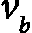
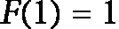
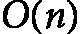
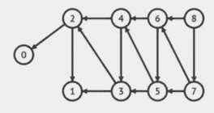
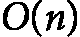
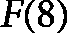

# 第十三章：<st c="0">10</st>

# <st c="3">动态规划</st>

<st c="23">动态规划是一种</st> <st c="48">强大的技术，能够显著降低许多复杂算法的计算成本，尽管它也有一些权衡。</st> <st c="186">本章介绍了动态规划，并包括对</st> <st c="255">贪心算法的回顾。</st>

<st c="273">我们将通过回顾分治法的原则，来与动态规划进行对比。</st> <st c="393">动态规划在算法设计中脱颖而出，因为它能够解决涉及重叠子问题和最优子结构的问题。</st> <st c="544">通过存储这些子问题的结果，动态规划避免了冗余计算，从而显著提高了</st> <st c="665">效率。</st>

<st c="682">通过各种示例，我们将探索如何应用动态规划来解决经典问题，如背包问题、最长公共子序列问题和旅行推销员问题。</st> <st c="890">每个示例将展示如何逐步分解问题，定义状态空间，并制定递推关系，进而得出动态规划解法。</st>

<st c="1087">需要注意的是，动态规划是一个广泛的主题，不能仅通过一章内容完全覆盖。</st> <st c="1209">在这一章中，我们将重点讨论这一方法的关键方面，包括其主要元素、应用和示例。</st> <st c="1345">此外，我们还将讨论如何估算动态规划解法的复杂度，并探讨这种方法的优缺点。</st> <st c="1496">这一方法的优缺点。</st>

<st c="1510">具体来说，我们将在以下</st> <st c="1563">主要部分中进行详细阐述：</st>

+   <st c="1577">动态规划</st> <st c="1598">与分治法</st>

+   <st c="1623">探索</st> <st c="1634">动态规划</st>

+   <st c="1653">贪心算法 –</st> <st c="1674">简介</st>

# <st c="1689">动态规划与分治法</st>

<st c="1735">在</st> *<st c="1739">第四章</st>* <st c="1749">和</st> *<st c="1754">第五章</st>*<st c="1755">中，我们</st> <st c="1759">探讨了递归算法及其复杂度分析方法。</st> <st c="1837">我们还探讨了分治策略。</st> <st c="1885">分治法背后的基本思想是将问题分解为更小的子问题，优化解决这些子问题，然后将它们的解合并形成最终解。</st> <st c="2092">这一过程通常是递归进行的，也就是说，问题会不断被分解为子问题，直到达到一个子问题足够小，可以通过直觉或简单的方法解决。</st> <st c="2321">这个最小且最简单的问题被称为</st> **<st c="2375">基本情况</st>**<st c="2384">。</st>

<st c="2385">动态规划遵循与分治法相似的策略。</st> <st c="2456">它将一个问题分解为多个子问题，明确假设任何子问题的最优解将有助于最终最优解的形成。</st> <st c="2618">这一特性被称为</st> **<st c="2654">最优子结构</st>**<st c="2674">。虽然</st> <st c="2681">这一特性在分治算法中也存在，但通常是隐式假设，而非</st> <st c="2793">明确声明。</st>

<st c="2811">然而，动态规划在一个关键方面超越了分治方法，这也是它的独特之处。</st> <st c="2921">在动态规划中，子问题通常会共享公共的子子问题，也就是说，子问题之间会有重叠。</st> <st c="3048">这一特性被称为</st> **<st c="3080">重叠子问题</st>**<st c="3103">。并非所有问题都会表现出这种行为。</st> <st c="3145">当一个问题没有重叠子问题时，使用简单的分治方法更为合适，因为在</st> <st c="3339">这种情况下，动态规划不会提供额外的好处。</st>

<st c="3350">但为什么重叠子问题如此重要呢？</st> <st c="3394">算法设计和分析的主要目标之一，正是我们始终关注的，是减少算法的计算成本或复杂度。</st> <st c="3556">重叠子问题的重要性在于它们能够显著降低计算复杂度。</st> <st c="3676">在子问题重叠的情况下，分治算法可能会冗余地多次求解这些重叠的子子问题。</st> <st c="3817">相比之下，动态规划会存储这些子子问题的解，并在需要时重复使用它们。</st> <st c="3938">这种对先前计算结果的重用，可以大大减少计算复杂度。</st> <st c="4047">然而，这种高效性是有代价的：需要额外的空间来存储这些</st> <st c="4146">子子问题的解。</st>

<st c="4168">现在我们理解了分治法与动态规划之间的联系，让我们来讨论一下动态规划本身。</st> <st c="4301">首先，需要明确的是，动态规划这一术语并不涉及编写代码或计算机编程。</st> <st c="4424">相反，它指的是一种数学优化方法。</st> <st c="4485">动态规划最初被提出作为解决优化问题的一种技术，这也是为什么它在数学优化和计算机科学中都有研究的原因。</st> <st c="4662">在本章中，我们将重点讨论动态规划在</st> <st c="4759">计算机科学领域中的应用。</st>

<st c="4776">正如我们</st> <st c="4782">之前讨论的，动态规划建立在两个基本概念之上：最优子结构的假设和重叠子问题的存在。</st> <st c="4947">最优子结构意味着问题的最优解可以通过其子问题的最优解来构建。</st> <st c="5076">重叠子问题是指在递归过程中，同一子问题被多次求解。</st> <st c="5188">在接下来的子节中，我们将更详细地探讨这些概念，研究它们如何成为动态规划的基础，以及它们如何促进高效算法的发展，以应对</st> <st c="5411">复杂问题。</st>

## <st c="5428">最优子结构</st>

<st c="5449">最优子结构</st> <st c="5471">是算法设计中的一个核心概念，意味着一个给定问题的最优解可以通过有效利用其较小子问题的最优解来构建。</st> <st c="5653">这一特性表明，问题可以被分解为更简单、相互重叠的子问题，每个子问题都可以独立解决。</st> <st c="5793">一旦子问题得到最优解，它们的解就可以被组合起来，形成原始更大问题的解。</st> <st c="5908">大的问题。</st>

<st c="5923">最优子结构的存在至关重要，因为它使我们能够将复杂问题分解为更易处理的组件。</st> <st c="6057">这种分解不仅简化了问题解决过程，而且使得可以应用像动态规划和分治这样的算法策略。</st> <st c="6235">在动态规划中，最优子结构特性确保一旦我们获得了所有子问题的最优解，就能利用它们系统地构建整个问题的最优解。</st> <st c="6447">通过将子问题的结果存储在表中，避免了重新计算，从而提高了</st> <st c="6575">算法的效率。</st>

<st c="6598">在分治算法中，尽管方式不同，最优子结构同样至关重要。</st> <st c="6702">这些算法将问题分解为不重叠的子问题，独立解决每个子问题，然后合并它们的解。</st> <st c="6843">动态规划和分治方法的成功依赖于问题具备最优子结构，因为它保证了通过最优解决较小部分问题将导致整体问题的最优解。</st> <st c="7074">整体问题。</st>

<st c="7090">最优子结构不仅是一个理论概念，也是算法设计中的一个实用工具。</st> <st c="7115">它帮助我们识别何时可以通过动态规划或其他依赖于从较小组件逐步构建解决方案的策略高效地解决问题。</st> <st c="7193">理解并识别不同问题中的最优子结构是开发高效且有效算法的关键技能。</st> <st c="7363">接下来，我们将通过一些</st> <st c="7544">示例问题来探讨这一概念。</st>

<st c="7561">第一个例子是最短路径问题。</st> <st c="7610">在图上的最短路径问题中，目标是找到从源节点（顶点）到目标节点的最短路径。</st> <st c="7740">这个问题展示了最优子结构特性，因为两个节点之间的最短路径可以分解为经过中间节点的更小的最短路径。</st> <st c="7902">假设</st> **<st c="7915">S</st>** <st c="7916">是源节点，</st> **<st c="7940">G</st>** <st c="7941">是目标节点。</st> <st c="7962">我们的目标是找到这两个节点之间的最短路径。</st> <st c="8020">假设</st> **<st c="8028">A</st>** <st c="8029">是从</st> **<st c="8076">S</st>** <st c="8077">到</st> **<st c="8081">G</st>** <st c="8082">的最优（最短）路径上的一个节点。</st> 最优子结构特性表明，因为**<st c="8146">A</st>** <st c="8147">是最优路径的一部分，从</st> **<st c="8207">S</st>** <st c="8208">到</st> **<st c="8212">G</st>** <st c="8213">的整个最优路径必须包含从</st> **<st c="8252">S</st>** <st c="8253">到</st> **<st c="8257">A</st>** <st c="8258">的最优路径，接着是从</st> **<st c="8294">A</st>** <st c="8295">到</st> **<st c="8299">G</st>** <st c="8300">的最优路径。</st> 最优子结构也意味着，任何不是最优的子路径不能成为整体最优解的一部分。</st> <st c="8421">这意味着，如果从 S 到</st> **<st c="8460">A</st>** <st c="8461">或从</st> **<st c="8470">A</st>** <st c="8471">到</st> **<st c="8475">G</st>** <st c="8476">的子路径不是最短的，那么从</st> **<st c="8524">S</st>** <st c="8525">到</st> **<st c="8529">G</st>** <st c="8530">的整个路径就不可能是最短的（见</st> *<st c="8559">图 10.1</st>*<st c="8568">）。</st>


<st c="8587">图 10.1：展示最短路径问题中的最优子结构。</st>

<st c="8656">第二个例子是寻找</st> **<st c="8691">最长公共子序列</st>** <st c="8717">(</st>**<st c="8719">LCS</st>**<st c="8722">)。</st> <st c="8726">这个问题涉及</st> <st c="8746">识别可以在一组序列中找到的最长子序列。</st> <st c="8824">需要理解的是，子序列不同于子串。</st> <st c="8899">在子序列中，与子串不同，元素不需要在序列中连续出现。</st> <st c="9017">这种区别在计算机科学的许多应用中至关重要，例如数据压缩、序列比对和</st> <st c="9144">文件比较。</st>

<st c="9160">LCS 问题中的最优子结构</st> <st c="9184">意味着找到两个序列的 LCS 的解决方案可以通过较小子问题的解决方案构建。</st> <st c="9323">具体来说，两个序列 X 和 Y 的 LCS 可以通过考虑这些序列的前缀的 LCS 来构建。</st>

<st c="9437">假设我们有两个序列</st>  <st c="9473"><st c="9474">的长度为</st>  <st c="9485"><st c="9486">和</st>  <st c="9491"><st c="9492">的长度为</st> <st c="9503"><st c="9504">。这两个序列的最长公共子序列（LCS）表示为 LCS</st><st c="9551"><st c="9553">，可以通过以下方法确定：如果</st>  <st c="9613"><st c="9614">或</st>  <st c="9618"><st c="9619">是空序列，那么 LCS 也是空序列。</st> <st c="9682">这是我们递归的基本情况。</st> <st c="9723">如果</st>  <st c="9749"><st c="9750">和</st>  <st c="9755"><st c="9756">的最后一个字符相同</st> ![<mml:math xmlns:mml="http://www.w3.org/1998/Math/MathML" xmlns:m="http://schemas.openxmlformats.org/officeDocument/2006/math"><mml:mfenced separators="|"><mml:mrow><mml:mi>s</mml:mi><mml:mi>a</mml:mi><mml:mi>y</mml:mi><mml:mi>X</mml:mi><mml:mfenced open="[" close="]" separators="|"><mml:mrow><mml:mi>m</mml:mi></mml:mrow></mml:mfenced><mml:mo>=</mml:mo><mml:mi>Y</mml:mi><mml:mfenced open="[" close="]" separators="|"><mml:mrow><mml:mi>n</mml:mi></mml:mrow></mml:mfenced></mml:mrow></mml:mfenced></mml:math>](img/1615.png)<st c="9763"><st c="9780">，那么这些字符必须是 LCS 的一部分。</st> <st c="9829">因此，问题转化为查找前缀的 LCS</st> ![<mml:math xmlns:mml="http://www.w3.org/1998/Math/MathML" xmlns:m="http://schemas.openxmlformats.org/officeDocument/2006/math"><mml:mi>X</mml:mi><mml:mfenced open="[" close="]" separators="|"><mml:mrow><mml:mn>1</mml:mn><mml:mo>…</mml:mo><mml:mi>m</mml:mi><mml:mo>-</mml:mo><mml:mn>1</mml:mn></mml:mrow></mml:mfenced></mml:math>](img/1616.png) <st c="9895"><st c="9896">和</st> ![<mml:math xmlns:mml="http://www.w3.org/1998/Math/MathML" xmlns:m="http://schemas.openxmlformats.org/officeDocument/2006/math"><mml:mi>Y</mml:mi><mml:mfenced open="[" close="]" separators="|"><mml:mrow><mml:mn>1</mml:mn><mml:mo>…</mml:mo><mml:mi>n</mml:mi><mml:mo>-</mml:mo><mml:mn>1</mml:mn></mml:mrow></mml:mfenced></mml:math>](img/1617.png)<st c="9901"><st c="9902">，然后将匹配的字符附加到</st> <st c="9949">这个 LCS 中。</st></st></st></st></st></st></st></st></st></st></st></st></st>

然而，如果最后的字符在  和  不匹配（即，![<mml:math xmlns:mml="http://www.w3.org/1998/Math/MathML" xmlns:m="http://schemas.openxmlformats.org/officeDocument/2006/math"><mml:mi>X</mml:mi><mml:mfenced open="[" close="]" separators="|"><mml:mrow><mml:mi>m</mml:mi></mml:mrow></mml:mfenced><mml:mo>≠</mml:mo><mml:mi>Y</mml:mi><mml:mfenced open="[" close="]" separators="|"><mml:mrow><mml:mi>n</mml:mi></mml:mrow></mml:mfenced></mml:math>](img/1620.png))，那么最长公共子序列（LCS）是通过以下两种方法中得到的较长的一个：

+   排除  的最后一个字符，并考虑 ![<mml:math xmlns:mml="http://www.w3.org/1998/Math/MathML" xmlns:m="http://schemas.openxmlformats.org/officeDocument/2006/math"><mml:mi>X</mml:mi><mml:mfenced open="[" close="]" separators="|"><mml:mrow><mml:mn>1</mml:mn><mml:mo>…</mml:mo><mml:mi>m</mml:mi><mml:mo>-</mml:mo><mml:mn>1</mml:mn></mml:mrow></mml:mfenced></mml:math>](img/1622.png) 和 ![<mml:math xmlns:mml="http://www.w3.org/1998/Math/MathML" xmlns:m="http://schemas.openxmlformats.org/officeDocument/2006/math"><mml:mi>Y</mml:mi><mml:mfenced open="[" close="]" separators="|"><mml:mrow><mml:mn>1</mml:mn><mml:mo>…</mml:mo><mml:mi>n</mml:mi></mml:mrow></mml:mfenced></mml:math>](img/1623.png) 的最长公共子序列。

+   <st c="10176">排除最后一个字符</st>  <st c="10208"><st c="10209">并考虑</st> ![<mml:math xmlns:mml="http://www.w3.org/1998/Math/MathML" xmlns:m="http://schemas.openxmlformats.org/officeDocument/2006/math"><mml:mi>X</mml:mi><mml:mfenced open="[" close="]" separators="|"><mml:mrow><mml:mn>1</mml:mn><mml:mo>…</mml:mo><mml:mi>m</mml:mi></mml:mrow></mml:mfenced></mml:math>](img/1625.png) <st c="10237"><st c="10243">和</st> ![<mml:math xmlns:mml="http://www.w3.org/1998/Math/MathML" xmlns:m="http://schemas.openxmlformats.org/officeDocument/2006/math"><mml:mi>Y</mml:mi><mml:mfenced open="[" close="]" separators="|"><mml:mrow><mml:mn>1</mml:mn><mml:mo>…</mml:mo><mml:mi>n</mml:mi><mml:mo>-</mml:mo><mml:mn>1</mml:mn></mml:mrow></mml:mfenced></mml:math>](img/1626.png)</st></st>

<st c="10248">设</st>  <st c="10252"><st c="10260">表示前缀的 LCS</st> ![<mml:math xmlns:mml="http://www.w3.org/1998/Math/MathML" xmlns:m="http://schemas.openxmlformats.org/officeDocument/2006/math"><mml:mi>X</mml:mi><mml:mfenced open="[" close="]" separators="|"><mml:mrow><mml:mn>1</mml:mn><mml:mo>…</mml:mo><mml:mi>i</mml:mi></mml:mrow></mml:mfenced></mml:math>](img/1628.png) <st c="10294"><st c="10300">和</st> ![<mml:math xmlns:mml="http://www.w3.org/1998/Math/MathML" xmlns:m="http://schemas.openxmlformats.org/officeDocument/2006/math"><mml:mi>Y</mml:mi><mml:mfenced open="[" close="]" separators="|"><mml:mrow><mml:mn>1</mml:mn><mml:mo>…</mml:mo><mml:mi>j</mml:mi></mml:mrow></mml:mfenced></mml:math>](img/1629.png)<st c="10304"><st c="10313">。然后，最优子结构性质可以表示为</st> <st c="10371">如下：</st></st></st></st>


**<st c="10467">示例 10.1：</st>**

<st c="10480">考虑以下序列：</st>


<st c="10542">如果两个序列的最后一个字符相同（这里，两者都以</st> <st c="10615"><st c="10616">) 结尾，那么</st>  <st c="10624"><st c="10625">是最长公共子序列（LCS）的一部分，问题简化为寻找</st>  <st c="10692"><st c="10705">和</st>  <st c="10709"><st c="10722">如果最后一个字符不同，我们必须考虑较小序列的 LCS</st>  <st c="10810"><st c="10824">和</st> <st c="10828"><st c="10841">，或者</st>  <st c="10846"><st c="10859">和</st> <st c="10863"><st c="10876">，然后取</st> <st c="10891">较长的那个。</st></st></st></st></st></st></st></st></st>

<st c="10902">LCS 问题中的最优子结构确保了可以通过较小子问题的 LCS 来构建整体 LCS。</st> <st c="11032">这一性质对动态规划方法至关重要，在动态规划中，我们系统地解决并存储这些子问题的结果，以高效地构建最终的</st> <st c="11184">解决方案。</st>

<st c="11205">并非所有问题</st> <st c="11223">都具有最优子结构性质。</st> <st c="11258">最长路径问题就是一个例子。</st> <st c="11299">特别是在可能存在环的图中，最长路径问题被认为不具有最优子结构性质。</st> <st c="11434">要理解这一点，我们首先回顾一下最优子结构的含义：一个问题如果具有最优子结构性质，那么该问题的最优解可以通过其子问题的最优解来构造。</st> <st c="11633">其子问题的最优解。</st>

<st c="11649">在最长路径问题中，目标是找到图中两个节点之间的最长简单路径（即不重复节点的路径）。</st> <st c="11789">当图中包含环时，这个问题特别具有挑战性，因为环的存在可能使得识别最长路径变得复杂。</st> <st c="11943">在最长路径问题中，最优子结构性质不成立，原因如下：</st>

+   **<st c="12049">后续路径的依赖性</st>**<st c="12080">：在许多情况下，一个看似是从一个节点到另一个节点的最长路径的一部分的子路径，扩展到其他节点时可能并不会导致整体的最长路径。</st> <st c="12250">这是因为，选择一个看起来很长的子路径，可能会迫使你在后续选择较短的路径，从而减少整体的</st> <st c="12386">路径长度。</st>

+   **<st c="12398">环的参与</st>**<st c="12416">：如果图中包含环，那么最长路径可能涉及以某种方式穿越图的部分，使得它无法简单地分解为独立贡献于整体最长路径的子问题。</st> <st c="12641">是否包含或排除某些边缘的决定，可能会显著改变最终的</st> <st c="12728">路径长度。</st>

+   **<st c="12742">非加性特性</st>**<st c="12762">：在具有最优子结构的问题中，通常可以独立地解决子问题，然后将它们组合起来得到最优解。</st> <st c="12903">然而，在最长路径问题中，优化地解决一个子问题（即，从一个节点到另一个节点找到最长路径）并不能保证这个子路径将成为整个图中最优解的一部分。</st> <st c="13129">例如，如果你已经找到了从顶点</st>  <st c="13189"><st c="13190">到顶点</st>  <st c="13201"><st c="13202">，然后从顶点</st>  <st c="13224"><st c="13225">到顶点</st> <st c="13236"><st c="13237">，这些路径的组合可能并不会产生从</st>  <st c="13308"><st c="13309">到</st> <st c="13313"><st c="13314">的最长路径。</st> 可能全局最优解会绕过</st>  <st c="13367"><st c="13368">，如果有一条更长的替代路径</st> <st c="13407">可用的话。</st></st></st></st></st></st></st></st>

**<st c="13420">示例 10.2：</st>**

<st c="13434">考虑一个加权图，其中节点为</st> <st c="13481"><st c="13482">、</st> <st c="13484"><st c="13485">、</st> <st c="13487"><st c="13488">和</st> <st c="13494"><st c="13495">，且存在边</st> <st c="13517"><st c="13518">、</st> <st c="13520"><st c="13521">、</st> <st c="13523"><st c="13524">和</st> <st c="13530"><st c="13531">。从</st>  <st c="13555"><st c="13556">到</st>  <st c="13560"><st c="13561">的最远路径最初可能看起来会经过 B 和 C。</st> <st c="13617">然而，如果直接边</st>  <st c="13645"><st c="13646">比路径的总和更长</st> <st c="13683"><st c="13684">，那么最优解并不涉及从</st>  <st c="13751"><st c="13752">到</st> <st c="13756"><st c="13757">、</st>  <st c="13759"><st c="13760">到</st>  <st c="13764"><st c="13765">，以及</st>  <st c="13770"><st c="13771">到</st> <st c="13774"><st c="13775">的最长路径。</st></st></st></st></st></st></st></st></st></st></st></st></st></st></st></st></st></st></st>

<st c="13776">显然，这个图是有向的且带权重的。</st> <st c="13797">如果这个图是无向图且无权重的，那么这个场景是不可行的，因为它违反了三角不等式，三角不等式指出，两个点之间的直接距离应该小于或等于经过中间点的距离之和。</st> <st c="14100">然而，即使在这样一个有向的无权重图中，结果也可能</st> <st c="14172">让人感到反直觉。</st>

假设这些节点<st c="14192">代表</st> <st c="14221"><st c="14222">、</st> <st c="14224"><st c="14225">、</st> <st c="14227"><st c="14228">和</st> <st c="14234"><st c="14235">分别代表四个城市：多伦多、芝加哥、丹佛和洛杉矶。</st> <st c="14315">边表示直飞航班的票价。</st> <st c="14372">例如，</st>  <st c="14385"><st c="14386">表示从多伦多到芝加哥的直飞航班票价。</st></st></st></st></st></st>

<st c="14458">如在</st> *<st c="14474">图 10</st>**<st c="14483">.2</st>*<st c="14485">中所示，从多伦多到洛杉矶的最远路径是通过一班直飞航班（由边</st>  <st c="14593"><st c="14614">，权重为</st> <st c="14631"><st c="14632">）且不包含任何在芝加哥或丹佛的停留。</st> <st c="14687">这个结果可能显得反直觉，因为人们通常认为，较长的路径会涉及更多的停留，但在这种情况下，直飞航班最贵，因此在成本方面形成了最长路径。</st> <st c="14894">。</st>

<st c="14902">值得一提的是，在图中没有循环的情况下，正如我们简单的示例所示，解决最长路径问题的一个简单算法是将所有权重取负，然后将其作为最短路径问题来解决。</st> <st c="15137">这个转换之所以有效，是因为在一个负权图中寻找最短路径，相当于在原始图中寻找最长路径。</st>


<st c="15314">图 10.2：最长路径问题的一个示例</st>

<st c="15365">最长路径问题缺乏最优子结构，这意味着动态规划以及类似的依赖于将问题分解为子问题的技术并不奏效。</st> <st c="15461">这是因为，最长路径问题需要图的全局知识，不能仅仅依赖从较小、独立解决的子问题逐步构建。</st> <st c="15560">因此，最长路径问题通常更具挑战性，尤其是在包含循环的图中，并且不适合依赖最优子结构的动态规划等方法。</st>

## <st c="15946">重叠子问题</st>

<st c="15970">动态规划的第二个特点，区分它与分治算法的地方，是重叠子问题的概念。</st> <st c="15982">在一个设计良好的分治策略中，每一步递归通常解决一个新的、独特的子问题。</st> <st c="16113">一个很好的例子是归并排序，在每一步划分中，划分之间不会重叠，并且每个子问题都是相互独立的。</st>

<st c="16382">然而，也有一些问题，其中某些子问题会重叠，意味着在递归过程中同一个子问题会被解决多次。</st> <st c="16527">这正是动态规划的优势所在，它通过避免冗余计算来提升效率。</st> <st c="16604">为了说明这一点，我们可以考虑斐波那契数列作为一个例子。</st>

<st c="16674">斐波那契数列的定义如下：</st>


<st c="16753">使用分治法计算斐波那契数时，相同的子问题会被反复求解。</st> <st c="16869">例如，为了计算</st> <st c="16894"><st c="16895">，算法需要计算</st>  <st c="16935"><st c="16936">和</st> <st c="16941"><st c="16942">。但是为了计算</st> <st c="16959"><st c="16960">，算法又会计算</st>  <st c="16991"><st c="16992">和</st> <st c="16997"><st c="16998">，这意味着</st>  <st c="17008"><st c="17009">会被计算多次。</st> <st c="17040">避免这种冗余的方法之一是将之前计算的子问题结果存储在具有近乎常数访问时间的数据结构中，例如</st> <st c="17193">哈希表。</st></st></st></st></st></st></st></st>

<st c="17204">这种冗余导致了指数级的时间复杂度，因为递归调用的数量随着</st> <st c="17320"><st c="17321">增长呈指数级。这就是动态规划提供显著优势的地方。</st> <st c="17391">通过避免重复解决相同的子问题，动态规划存储这些子问题的结果，并在需要时重用它们，从而大大减少了计算次数。</st></st>

<st c="17580">通过利用重叠子问题，动态规划将斐波那契数列的递归解法从指数级时间复杂度</st>  <st c="17735"><st c="17736">转换为线性时间复杂度</st> <st c="17765"><st c="17766">。这种效率提升是动态规划在存在重叠子问题的情况下优于分治法的原因。</st> <st c="17913">在下一节中，我们将通过几个示例更详细地探讨动态规划。</st> <st c="17998">接下来，我们将深入分析这些例子。</st></st></st>

# <st c="18015">探索动态规划</st>

<st c="18045">一个问题</st> <st c="18059">当我们识别出重叠子问题时会出现：如何存储这些解以避免冗余的计算呢？</st> <st c="18182">这就是动态规划引入“记忆化”概念的地方。</st> **<st c="18242">记忆化</st>**<st c="18253">技术</st> <st c="18258">包括将子问题的结果存储在数据结构中，如数组或字典中，这样当相同的子问题再次出现时，可以立即使用已存储的结果，避免重新计算。</st> <st c="18468">从而省去了重新计算的必要。</st>

<st c="18486">在我们开始之前，重要的是澄清一下，“记忆化”（memoization）并不是“记忆”（memorization）的拼写错误。这两个术语有着不同的含义。</st> <st c="18629">记忆化来源于拉丁语单词“memo”，意思是“要被记住”。它指的是计算机科学中的一种技术，其中昂贵的函数调用结果被存储并重用，以避免冗余的计算。</st> <st c="18853">相反，记忆是指通过学习和重复将信息记住的过程。</st> <st c="18957">通常是通过重复进行的。</st>

<st c="18976">记忆化是一种在动态规划中使用的技术，通过存储代价较高的函数调用的结果，并在相同输入再次出现时重用它们，从而优化递归算法。</st> <st c="19167">记忆化避免了多次重新计算相同的结果，在第一次解决子问题时保存结果，然后每当再次遇到相同的子问题时返回存储的结果。</st> <st c="19384">这显著降低了具有</st> <st c="19455">重叠子问题</st> <st c="19384">的算法的时间复杂度。</st>

<st c="19479">让我们探讨记忆化是如何工作的。</st> <st c="19517">在典型的递归算法中，一个函数会不断地用更小的输入调用自己，直到达到基准情况。</st> <st c="19636">没有记忆化时，函数可能会用相同的输入被多次调用，从而导致冗余计算。</st> <st c="19760">这种低效在使用分治策略的直接递归算法中非常常见。</st> <st c="19868">通过存储这些重复的子问题的结果，记忆化消除了这些冗余计算，使算法变得</st> <st c="20009">更加高效。</st>

<st c="20024">使用记忆化时，当一个函数被调用时，算法首先检查给定输入的结果是否已经被存储。</st> <st c="20155">如果已经存储，则立即返回存储的结果，避免冗余计算。</st> <st c="20240">子问题的结果被存储在一个数据结构中，通常是字典或数组，充当查找表。</st> <st c="20365">这个表通常被称为</st> <st c="20400">一个</st> **<st c="20402">记忆表</st>**<st c="20406">。</st>

**<st c="20407">例子 10.3：</st>**

<st c="20421">让我们重新回顾斐波那契数列的例子，通过它来说明记忆化，并与不使用记忆化的方法进行比较。</st>

<st c="20542">斐波那契数列定义为</st> <st c="20577">如下：</st>





### <st c="20620">没有记忆化时</st>

<st c="20639">以下是</st> <st c="20657">使用朴素递归方法实现斐波那契数列的一个简单 Python 实现：</st>

```py
 def fib(n):
    if n <= 1:
        return n
    return fib(n-1) + fib(n-2)
n = 10
print(f"Fibonacci number F({n}) is: {fib(n)}")
```

<st c="20860">这种方法具有指数时间复杂度</st>  <st c="20910"><st c="20911">因为它会重新计算相同的斐波那契数</st> <st c="20963">多次。</st></st>

<st c="20978">首先，让我们分析递归斐波那契数列算法的复杂性。</st> <st c="21060">该算法将问题分解为两个子问题，子问题的规模分别减少了一个和两个。</st> <st c="21194">递归部分有两个组件，而驱动函数用于计算前两个斐波那契数的和，并在常数</st> <st c="21344">时间内操作（</st><st c="21350"><st c="21366">)。</st></st>

<st c="21368">这个算法的递归关系可以表示为</st> <st c="21429">如下：</st>

![<mml:math xmlns:mml="http://www.w3.org/1998/Math/MathML" xmlns:m="http://schemas.openxmlformats.org/officeDocument/2006/math" display="block"><mml:mi>T</mml:mi><mml:mfenced separators="|"><mml:mrow><mml:mi>n</mml:mi></mml:mrow></mml:mfenced><mml:mo>=</mml:mo><mml:mi>T</mml:mi><mml:mfenced separators="|"><mml:mrow><mml:mi>n</mml:mi><mml:mo>-</mml:mo><mml:mn>1</mml:mn></mml:mrow></mml:mfenced><mml:mo>+</mml:mo><mml:mi>T</mml:mi><mml:mfenced separators="|"><mml:mrow><mml:mi>n</mml:mi><mml:mo>-</mml:mo><mml:mn>2</mml:mn></mml:mrow></mml:mfenced><mml:mo>+</mml:mo><mml:mi>O</mml:mi><mml:mfenced separators="|"><mml:mrow><mml:mn>1</mml:mn></mml:mrow></mml:mfenced></mml:math>](img/1690.png)

<st c="21478">这个递归关系并不完全符合分治法或减法递归函数的标准形式。</st> <st c="21598">因此，我们将其简化为</st> <st c="21624">如下：</st>

![<mml:math xmlns:mml="http://www.w3.org/1998/Math/MathML" xmlns:m="http://schemas.openxmlformats.org/officeDocument/2006/math" display="block"><mml:mi>T</mml:mi><mml:mfenced separators="|"><mml:mrow><mml:mi>n</mml:mi></mml:mrow></mml:mfenced><mml:mo>=</mml:mo><mml:mi>T</mml:mi><mml:mfenced separators="|"><mml:mrow><mml:mi>n</mml:mi><mml:mo>-</mml:mo><mml:mn>1</mml:mn></mml:mrow></mml:mfenced><mml:mo>+</mml:mo><mml:mi>T</mml:mi><mml:mfenced separators="|"><mml:mrow><mml:mi>n</mml:mi><mml:mo>-</mml:mo><mml:mn>2</mml:mn></mml:mrow></mml:mfenced><mml:mo>+</mml:mo><mml:mi>c</mml:mi><mml:mo>≈</mml:mo><mml:mn>2</mml:mn><mml:mfenced separators="|"><mml:mrow><mml:mi>T</mml:mi><mml:mfenced separators="|"><mml:mrow><mml:mi>n</mml:mi><mml:mo>-</mml:mo><mml:mn>1</mml:mn></mml:mrow></mml:mfenced><mml:mo>+</mml:mo><mml:mi>c</mml:mi></mml:mrow></mml:mfenced></mml:math>](img/1691.png)

<st c="21637">通过这种</st> <st c="21647">简化，递归函数呈现出一种可以使用主定理分析的形式（见</st> *<st c="21783">第五章</st>*<st c="21792">）。</st> <st c="21796">根据主定理，由于</st> <st c="21835"><st c="21836">2 且</st> <st c="21842"><st c="21845">，递归斐波那契数列算法的时间复杂度为：</st></st></st>

![<mml:math xmlns:mml="http://www.w3.org/1998/Math/MathML" xmlns:m="http://schemas.openxmlformats.org/officeDocument/2006/math" display="block"><mml:mi>T</mml:mi><mml:mo>(</mml:mo><mml:mi>n</mml:mi><mml:mo>)</mml:mo><mml:mo>=</mml:mo><mml:mi>Θ</mml:mi><mml:mfenced separators="|"><mml:mrow><mml:msup><mml:mrow><mml:mi>a</mml:mi></mml:mrow><mml:mrow><mml:mi>n</mml:mi><mml:mo>/</mml:mo><mml:mi>b</mml:mi></mml:mrow></mml:msup><mml:mo>⋅</mml:mo><mml:mi>f</mml:mi><mml:mfenced separators="|"><mml:mrow><mml:mi>n</mml:mi></mml:mrow></mml:mfenced></mml:mrow></mml:mfenced><mml:mo>=</mml:mo><mml:mi>Θ</mml:mi><mml:mfenced separators="|"><mml:mrow><mml:msup><mml:mrow><mml:mn>2</mml:mn></mml:mrow><mml:mrow><mml:mi>n</mml:mi></mml:mrow></mml:msup></mml:mrow></mml:mfenced></mml:math>](img/1694.png)

<st c="21950">这个结果显示，递归的斐波那契算法具有指数时间复杂度，具体为</st> <st c="22053"><st c="22054">，使得它在处理大值时效率低下</st> <st c="22098"><st c="22099">。这种低效是为什么备忘录技术或动态规划常用于优化斐波那契数的计算。</st></st></st>


<st c="22478">图 10.3：展示计算斐波那契(5)的非备忘录方法的树形图</st>

*<st c="22567">图 10</st>**<st c="22577">.3</st>* <st c="22579">展示了一个树形结构的例子，表示用于计算斐波那契(5)的分治（非备忘录）实现。</st> <st c="22706">如图所示，叶节点重复包含斐波那契(1)和斐波那契(0)。</st> <st c="22784">此外，许多斐波那契数在整个过程中被重复计算多次。</st>

### <st c="22876">使用备忘录技术</st>

<st c="22893">通过应用备忘录技术，该算法避免了冗余的计算。</st> <st c="22964">这是一个简单的 Python</st> <st c="22987">实现斐波那契数列的动态规划实现，它使用备忘录技术来优化</st> <st c="23091">计算：</st>

```py
 def dp_fib(n, memo={}):
    if n in memo:
        return memo[n]
    if n <= 1:
        return n
    memo[n] = dp_fib(n-1, memo) + dp_fib(n-2, memo)
    return memo[n]
n = 10
print(f"Fibonacci number F({n}) is: {dp_fib(n)}")
```

<st c="23300">在这个版本中，时间复杂度被降低为</st> <st c="23352"><st c="23353">，因为每个斐波那契数仅计算一次，并存储以供</st> <st c="23427">以后参考。</st></st>



<st c="23446">图 10.4：演示计算斐波那契(8)的备忘录方法的图表</st>

*<st c="23532">图 10</st>**<st c="23542">.4</st>* <st c="23544">展示了使用备忘化的动态规划方法来计算 Fibonacci(8) 的图示。</st> <st c="23660">在这种方法中，没有任何斐波那契数被重复计算。</st> <st c="23727">相反，之前解决过的子问题会被重用，这在从节点延伸出的边中得以体现。</st> <st c="23832">这种对子问题的重用是我们使用树形结构可视化分治算法的原因（</st>*<st c="23920">图 10</st>**<st c="23930">.3</st>*<st c="23932">），而动态规划更适合用图形来表示（</st>*<st c="23997">图 10</st>**<st c="24007">.4</st>*<st c="24009">）。</st>

<st c="24012">备忘化在动态规划中至关重要，尤其是对于有重叠子问题的问题。</st> <st c="24114">通过存储这些子问题的结果，备忘化最小化了解决整体问题所需的计算次数，从而显著提高了时间复杂度。</st> <st c="24303">然而，这一好处是以额外的</st> <st c="24356">存储空间为代价的。</st> <st c="24390">这种权衡通常在时间效率更为关键的场景中是有利的。</st> <st c="24478">需要注意的是，备忘化通常用于自顶向下的动态规划方法中，在这种方法中，问题是递归地解决的，结果在计算时就会被存储。</st> <st c="24670">在接下来的子章节中，我们将简要讨论自顶向下和自底向上</st> <st c="24740">动态规划。</st>

## <st c="24760">自顶向下与自底向上动态规划方法</st>

<st c="24821">实现动态规划有</st> <st c="24831">两种主要方法：自顶向下和自底向上。</st> <st c="24913">这两种方法都旨在通过避免冗余计算来降低计算复杂度，但它们的实现方式</st> <st c="25022">不同。</st>

<st c="25037">自顶向下的动态规划，也叫做备忘化，是一种递归方法。</st> <st c="25120">它从顶部开始解决问题，逐步将其分解为更小的子问题。</st> <st c="25207">当算法解决这些子问题时，它会将结果存储在一个数据结构中（通常是字典或数组），这样如果相同的子问题需要再次解决时，就可以直接使用已存储的结果，而不是</st> <st c="25434">重新计算它。</st>

<st c="25451">自顶向下的过程从原始问题开始，递归地将其分解为更小的子问题。</st> <st c="25563">每次解决一个子问题时，结果会被存储（备忘化）。</st> <st c="25630">如果再次遇到该子问题，算法会检索已存储的结果，而不是</st> <st c="25721">重新计算它。</st>

<st c="25736">自顶向下方法相对较容易实现，特别是从分治递归解决方案适应而来。</st> <st c="25876">在自顶向下动态规划中，只处理解决原问题必要的子问题，这在某些子问题不需要时可以是有利的。</st> <st c="26051">然而，这种方法也有其缺点。</st> <st c="26099">由于需要在调用堆栈上存储递归函数调用，可能需要更多的内存。</st> *<st c="26294">例子 10.3</st>* <st c="26306">说明了斐波那契数列计算的备忘录版本，是自顶向下</st> <st c="26420">动态规划的经典示例。</st>

<st c="26440">自顶向下方法的替代方案是动态规划的自底向上实现。</st> <st c="26538">自底向上动态规划，也称为表格法，是一种迭代方法。</st> <st c="26619">它从解决最小的子问题开始，然后利用这些解来构建原问题的解。</st> <st c="26754">在这种方法中，创建一个表（通常是一个数组），每个条目代表一个子问题的解。</st> <st c="26870">该过程从处理基本情况开始，并首先解决最小的子问题。</st> <st c="26962">解决方案存储在表中，然后迭代使用它们来解决更大的子问题，最终导致</st> <st c="27082">最终解。</st>

<st c="27097">自</st> <st c="27101">底向上方法通常比自顶向下方法更节省空间，因为它避免了递归函数调用的开销。</st> <st c="27253">此外，通过使用迭代过程而不是递归，它消除了堆栈溢出的风险。</st> <st c="27360">这种方法通常提供了解决方案构建方式的更清晰视角，使其更易于管理和理解。</st> <st c="27483">然而，自底向上方法有两个显著的缺点。</st> <st c="27546">首先，它需要解决所有子问题，即使对最终解也可能不必要。</st> <st c="27651">此外，在初始实现时可能更复杂，特别是从</st> <st c="27751">递归方法过渡时。</st>

<st c="27770">以下是斐波那契数列的自底向上 Python 实现：</st>

```py
 def bottom_up_fib(n):
    if n <= 1:
        return n
    fib = [0] * (n+1)
    fib[1] = 1
    for i in range(2, n+1):
        fib[i] = fib[i-1] + fib[i-2]
    return fib[n]
n = 10
print(f"Fibonacci number F({n}) is: {bottom_up_fib(n)}")
```

*<st c="28062">表格 10.1</st>* <st c="28073">总结了动态规划中自顶向下和自底向上方法的特点。</st>

| **<st c="28185">特点</st>** | **<st c="28193">自顶向下（记忆化）</st>** | **<st c="28216">自底向上（表格法）</st>** |
| --- | --- | --- |
| <st c="28239">方法</st> | <st c="28248">递归，从顶部（主要问题）开始解决问题，并将其拆分为</st> <st c="28326">子问题。</st> | <st c="28343">迭代，从底部（基本情况）开始解决问题，并逐步构建到</st> <st c="28424">主要问题。</st> |
| <st c="28437">空间复杂度</st> | <st c="28454">可能由于调用栈和</st> <st c="28502">记忆化存储使用更多内存。</st> | <st c="28522">通常使用较少的内存，因为它主要依赖于一个表</st> <st c="28582">或数组。</st> |
| <st c="28591">时间复杂度</st> | <st c="28607">通过存储子问题的结果来避免重新计算，</st> <st c="28665">通常是</st> <st c="28675"><st c="28676">。</st></st> | <st c="28677">也避免了重新计算，</st> <st c="28706">通常是</st> <st c="28716"><st c="28717">。</st></st> |
| <st c="28718">实现难度</st> <st c="28724">实现难度</st> | <st c="28741">如果从朴素的</st> <st c="28792">递归解法过渡，通常更容易实现。</st> | <st c="28811">最初可能会更难实现，尤其是在转换自</st> <st c="28887">递归方法时。</st> |
| <st c="28906">栈溢出风险</st> | <st c="28915">由于</st> <st c="28929">深度递归，风险较高。</st> | <st c="28964">没有风险，因为它完全避免了</st> <st c="28987">递归。</st> |

<st c="29008">表 10.1：自上而下与自下而上的方法对比</st>

<st c="29070">自上而下</st> <st c="29085">和自下而上的动态规划方法实现相同的目标：通过避免冗余计算来优化计算过程。</st> <st c="29219">两者之间的选择通常取决于特定问题、程序员对递归或迭代的熟悉程度以及任务的内存和性能约束。</st> *<st c="29403">表 10.1</st>* <st c="29413">展示了动态规划中自上而下和自下而上的方法对比。</st>

<st c="29500">让我们花点时间讨论一下如何计算动态规划实现的时间复杂度。</st> <st c="29609">正如我们所指出的，动态规划算法更适合用有向图而非树来表示。</st> <st c="29717">在</st> *<st c="29720">第五章</st>*<st c="29729">中，我们探讨了使用递归树来估算递归算法的时间复杂度。</st> <st c="29827">在这里，我们将不再使用树，而是利用图形来可视化动态规划算法。</st>

<st c="29924">在动态规划图中，节点表示子问题，从这些节点发出的边表示我们在每个子问题中遇到的选择。</st> <st c="30085">我们可以从边的目标节点的角度来解读这一点，因为图是有向的。</st> <st c="30176">每个指向节点的入边代表一个函数调用——这意味着子问题是被回忆而不是重新计算的，就像在典型的</st> <st c="30349">分治法中那样。</st>

<st c="30377">现在，让我们假设总共有</st>  <st c="30406"><st c="30407">个子问题（或函数），每个子问题被回忆</st>  <st c="30477"><st c="30478">次，其中</st> <st c="30492"><st c="30493">。这个动态规划算法的时间复杂度可以表示如下：</st> <st c="30570">如下所示：</st></st></st></st>

![<mml:math xmlns:mml="http://www.w3.org/1998/Math/MathML" xmlns:m="http://schemas.openxmlformats.org/officeDocument/2006/math" display="block"><mml:mi>T</mml:mi><mml:mfenced separators="|"><mml:mrow><mml:mi>n</mml:mi></mml:mrow></mml:mfenced><mml:mo>=</mml:mo><mml:mi>O</mml:mi><mml:mfenced separators="|"><mml:mrow><mml:mrow><mml:munderover><mml:mo stretchy="false">∑</mml:mo><mml:mrow><mml:mi>i</mml:mi><mml:mo>=</mml:mo><mml:mn>1</mml:mn></mml:mrow><mml:mrow><mml:mi>m</mml:mi></mml:mrow></mml:munderover><mml:mrow><mml:mi>i</mml:mi></mml:mrow></mml:mrow><mml:mo>⋅</mml:mo><mml:msub><mml:mrow><mml:mi>r</mml:mi></mml:mrow><mml:mrow><mml:mi>i</mml:mi></mml:mrow></mml:msub></mml:mrow></mml:mfenced><mml:mo>,</mml:mo><mml:mn>1</mml:mn><mml:mo>≤</mml:mo><mml:mi>i</mml:mi><mml:mo>≤</mml:mo><mml:mi>m</mml:mi></mml:math>](img/1703.png)

<st c="30592">这种方法通常会导致线性时间复杂度，特别是在子问题的数量</st>  <st c="30707"><st c="30708">与输入的大小成正比的情况下</st> <st c="30750"><st c="30751">。在最坏的情况下，其中</st> <st c="30787"><st c="30788">，每个子问题都直接对应输入的唯一状态，算法必须精确地处理每个状态</st> <st c="30901">一次。</st></st></st></st>

<st c="30914">当这种情况发生时，动态规划算法会高效地在</st>  <st c="31004"><st c="31005">时间内计算出解。</st> <st c="31012">这是因为算法通过存储并重用重叠的子问题的结果，而不是重新计算它们，从而避免了指数时间复杂度的产生。</st> <st c="31165">因此，总操作次数与输入的大小成线性关系，避免了在朴素</st> <st c="31376">递归方法中出现的指数时间复杂度。</st></st>

<st c="31397">这种线性时间复杂度是动态规划的一个关键优势。</st> <st c="31479">它使得算法能够有效地随着输入规模的变化进行扩展，从而使得解决大规模和复杂问题变得可行，而这些问题如果使用暴力法或</st> <st c="31683">分治策略将是计算上不可行的。</st>

<st c="31713">让我们应用前面讨论的方法来分析动态规划实现斐波那契数列的时间复杂度，如</st> *<st c="31869">示例 10.3</st>*<st c="31881">所示。通过考虑</st> *<st c="31898">图 10</st>**<st c="31907">.4</st>*<st c="31909">，该图表示计算斐波那契数列第 8 个数的图（</st><st c="32006"><st c="32008">），我们可以推导出</st> <st c="32029">时间复杂度。</st></st>

<st c="32045">在图中，每个节点对应一个子问题——具体来说，就是需要计算的斐波那契数之一。</st> <st c="32168"> <st c="32182"><st c="32183">包括 8 个节点，每个节点代表一个重叠的子问题。</st> <st c="32247">此外，这个图中的每个节点都有两种选择：一种对应于前一个斐波那契数的函数调用</st>  <st c="32375"><st c="32376">和另一个对应于再前一个斐波那契数的函数调用</st> <st c="32428"><st c="32429">。这些选择被描绘为每个节点的出边，或者等效地，作为每个节点的两条入边。</st> <st c="32544">在图中。</st></st></st></st>

<st c="32554">为了计算</st> <st c="32572">时间复杂度，我们观察到图结构导致每个节点（或子问题）只被处理一次，每个节点涉及两个操作：分别对应每个出边。</st> <st c="32762">这导致总共</st>  <st c="32789"><st c="32790">操作</st> <st c="32802">为</st> <st c="32806"><st c="32807">。</st></st></st>

<st c="32808">将这一推广到</st> <st c="32830"><st c="32831">，我们观察到对于任意斐波那契数</st> <st c="32874"><st c="32875">，操作的总数可以表达为：</st> <st c="32925">如下：</st></st></st>

![<mml:math xmlns:mml="http://www.w3.org/1998/Math/MathML" xmlns:m="http://schemas.openxmlformats.org/officeDocument/2006/math" display="block"><mml:mi>T</mml:mi><mml:mfenced separators="|"><mml:mrow><mml:mi>n</mml:mi></mml:mrow></mml:mfenced><mml:mo>=</mml:mo><mml:mi>O</mml:mi><mml:mfenced separators="|"><mml:mrow><mml:mn>2</mml:mn><mml:mo>×</mml:mo><mml:mi>n</mml:mi></mml:mrow></mml:mfenced><mml:mo>=</mml:mo><mml:mi>O</mml:mi><mml:mfenced separators="|"><mml:mrow><mml:mi>n</mml:mi></mml:mrow></mml:mfenced></mml:math>](img/1716.png)

<st c="32938">该公式表明，动态规划计算斐波那契数列的方法随着输入规模呈线性增长</st> <st c="33065"><st c="33066">。这一效率是通过动态规划避免冗余计算，存储和重用子问题的结果（备忘录法）实现的，从而显著降低了时间复杂度，相较于朴素递归方法，其时间复杂度是指数级的</st> <st c="33339">时间复杂度。</st></st>

<st c="33355">让我们来看另一个经典的动态规划例子，那就是</st> **<st c="33446">背包问题</st>**<st c="33462">。</st>

## <st c="33463">使用动态规划解决 0/1 背包问题</st>

<st c="33522">背包问题是一个经典的</st> <st c="33527">优化问题，目标是确定通过选择物品放入背包，在满足重量限制的前提下能够获得的最大价值。</st> <st c="33647">每个物品都有特定的重量和价值，挑战在于选择最优的物品组合，以最大化总价值，同时不超过背包的重量限制。</st> <st c="33734">假设我们有一组</st>  <st c="33946"><st c="33947">物品，每个物品都有一个重量</st>  <st c="33974"><st c="33975">和一个价值</st>  <st c="33988"><st c="33989">和一个最大重量容量为</st> <st c="34036"><st c="34037">的背包。目标是最大化背包中物品的总价值，使得</st> <st c="34129">以下条件成立：</st></st></st></st></st></st>

![<mml:math xmlns:mml="http://www.w3.org/1998/Math/MathML" xmlns:m="http://schemas.openxmlformats.org/officeDocument/2006/math" display="block"><mml:mi>V</mml:mi><mml:mo>=</mml:mo><mml:mrow><mml:mrow><mml:mi mathvariant="normal">max</mml:mi></mml:mrow><mml:mo>⁡</mml:mo><mml:mrow><mml:mrow><mml:munderover><mml:mo stretchy="false">∑</mml:mo><mml:mrow><mml:mi>i</mml:mi><mml:mo>=</mml:mo><mml:mn>1</mml:mn></mml:mrow><mml:mrow><mml:mi>n</mml:mi></mml:mrow></mml:munderover><mml:mrow><mml:msub><mml:mrow><mml:mi>v</mml:mi></mml:mrow><mml:mrow><mml:mi>i</mml:mi></mml:mrow></mml:msub></mml:mrow></mml:mrow></mml:mrow></mml:mrow><mml:mo>×</mml:mo><mml:msub><mml:mrow><mml:mi>x</mml:mi></mml:mrow><mml:mrow><mml:mi>i</mml:mi></mml:mrow></mml:msub></mml:math>](img/1723.png)

<st c="34147">受限于：</st>

![<mml:math xmlns:mml="http://www.w3.org/1998/Math/MathML" xmlns:m="http://schemas.openxmlformats.org/officeDocument/2006/math" display="block"><mml:mrow><mml:munderover><mml:mo stretchy="false">∑</mml:mo><mml:mrow><mml:mi>i</mml:mi><mml:mo>=</mml:mo><mml:mn>1</mml:mn></mml:mrow><mml:mrow><mml:mi>n</mml:mi></mml:mrow></mml:munderover><mml:mrow><mml:msub><mml:mrow><mml:mi>w</mml:mi></mml:mrow><mml:mrow><mml:mi>i</mml:mi></mml:mrow></mml:msub></mml:mrow></mml:mrow><mml:mo>×</mml:mo><mml:msub><mml:mrow><mml:mi>x</mml:mi></mml:mrow><mml:mrow><mml:mi>i</mml:mi></mml:mrow></mml:msub><mml:mo>≤</mml:mo><mml:mi>W</mml:mi></mml:math>](img/1724.png)

<st c="34160">根据我们如何定义</st> <st c="34187"><st c="34188">，我们会遇到以下几种类型的</st> <st c="34226">背包问题：</st></st>

+   <st c="34243">如果</st> <st c="34247"><st c="34258">，这个问题被称为 0/1 背包问题。</st> <st c="34310">这是我们将在</st> <st c="34358">本章集中解决的问题。</st></st>

+   <st c="34371">如果</st> <st c="34375"><st c="34394">，其中</st>  <st c="34402"><st c="34403">是一个常数，</st> <st c="34422">这个问题被称为</st> **<st c="34453">有界背包问题</st>** **<st c="34470">（BKP）</st>**<st c="34477">。</st></st></st>

+   <st c="34485">如果</st>  <st c="34489"><st c="34490">可以是任何非负整数，那么</st> <st c="34528">该问题称为</st> **<st c="34550">无限背包问题</st>** **<st c="34569">问题</st>** <st c="34576">(</st>**<st c="34578">UKP</st>**<st c="34581">).</st></st>

<st c="34584">首先，让我们</st> <st c="34597">通过一种朴素的方法来分析 0/1 背包问题的复杂度。</st> <st c="34673">给定</st>  <st c="34679"><st c="34680">个物品，一种直接的解决方案是生成这些</st>  <st c="34770"><st c="34819">物品的所有可能子集，计算每个子集的对应重量和价值，然后确定最优解。</st> <st c="34933">这种方法的时间复杂度为</st> <st c="34979"><st c="34980">，使得该问题成为非多项式问题，对于较大的</st> <st c="35067"><st c="35116">值来说，计算上是不可行的。</st></st></st></st></st>

<st c="35117">目标是使用动态规划方法来解决 0/1 背包问题。</st> <st c="35202">背包问题具有最优子结构和重叠子问题的特性，使其成为动态</st> <st c="35330">规划解决方案的理想选择。</st>

最优子结构意味着问题的最优解可以看作一个背包问题，包含</st>  <st c="35455"><st c="35456">项和容量</st> <st c="35476"><st c="35477">。假设我们已经有了该问题的最优解。</st> <st c="35538">如果我们从这个最优解中去除最后一项，那么剩下的项必须形成一个背包问题的最优解，包含</st>  <st c="35671"><st c="35672">项和容量</st>  <st c="35692"><st c="35693">减去被去除项的重量。</st>

换句话说，较大问题（ <st c="35792"><st c="35842">项，容量</st> <st c="35858"><st c="35859">) 的最优解由一个较小子问题（ <st c="35921"><st c="35923">项，减少后的容量） 的最优解加上是否包括第</st>  <st c="35993"><st c="35996">项的决策组成。</st> <st c="36009">这一性质使得我们可以将问题分解为更小的子问题，并递归地求解它们，这是动态</st> <st c="36151">规划方法的基础。</st>

<st c="36172">例如，如果我们</st> <st c="36192">已经得到了一个包含 5 个物品和容量为 12 的背包问题的最优解，并且我们去除第五个物品，那么剩下的 4 个物品必须形成一个包含 4 个物品且容量减少了第五个物品重量的最优解。</st>

<st c="36448">重叠的</st> <st c="36461">子问题在这个问题中指的是在寻找最优解的过程中，同样的子问题被多次解决的情况。</st> <st c="36617">在使用递归方法解决 0/1 背包问题时，我们常常会发现相同的子问题被重复解决。</st> <st c="36738">具体来说，当决定是否将某个物品放入背包时，我们实际上是在解决相同的问题，只是背包容量减少了或</st> <st c="36896">物品数量减少了。</st>

<st c="36908">考虑一个包含三个物品和背包容量为</st> <st c="36977"><st c="36978">的简单例子。每个物品都有一个重量</st>  <st c="37003"><st c="37004">和一个</st> <st c="37011">价值</st> <st c="37017"><st c="37018">：</st></st></st></st>

+   <st c="37019">物品</st> <st c="37024">1:</st> 

+   <st c="37028">物品</st> <st c="37033">2:</st> 

+   项目 3：

递归解决这个问题时，我们可能会遇到以下子问题：

+   包括项目 1：这会导致解决剩余容量为的子问题  <st c="37209"><st c="37210">和剩余的项目（项目 2 和</st> <st c="37247">项目 3)</st></st>

+   不包括项目 1：这会导致解决带有完全容量的子问题  <st c="37333"><st c="37334">和剩余的项目（项目 2 和</st> <st c="37371">项目 3)</st></st>

然而，当我们考虑项目 2 时，你将再次遇到</st> <st c="37453">相同的子问题：</st>

+   包括项目 2：解决容量为的**问题**  <st c="37527"><st c="37528">(如果包含项目 1) 或</st>  <st c="37557"><st c="37558">(如果不包含项目 1) 和剩余项目（</st><st c="37608">项目 3)</st></st></st>

+   不包括项目 2：解决当前容量的问题，剩余只有项目</st> <st c="37694">3</st> 剩下

正如我们所见，一些子问题（例如，带有的子问题）  <st c="37765"><st c="37766">和项目 3）会多次出现。</st> <st c="37811">如果没有动态规划，我们将反复解决这些子问题，导致</st> <st c="37896">不必要的计算。</st></st>

现在我们已经清楚理解了 0/1 背包问题中动态规划的两个基本要素，让我们一步步地走过</st> <st c="38066">解决方案：</st>

1.  <st c="38088">创建</st> <st c="38095">一个二维表格</st>  <st c="38120"><st c="38121">，其中有</st>  <st c="38127"><st c="38131">行和</st>  <st c="38140"><st c="38142">列，其中</st>  <st c="38157"><st c="38158">表示物品数量，</st>  <st c="38186"><st c="38187">表示背包的总容量。</st> <st c="38227">令</st>  <st c="38231"><st c="38241">表示使用前</st>  <st c="38306"><st c="38307">个物品，且背包容量为</st> <st c="38342"><st c="38343">时所能获得的最大值。例如，</st>  <st c="38359"><st c="38364">表示使用前 4 个物品，假设背包最大容量为 5 时能达到的最大值，尽管实际容量可能</st> <st c="38522">更大。</st>

1.  <st c="38533">初始化第一行</st>  <st c="38559"><st c="38560">和第一列</st> <st c="38578"><st c="38579">，这意味着</st>  <st c="38593"><st c="38594">对于所有</st>  <st c="38603"><st c="38604">和</st>  <st c="38609"><st c="38610">对于所有</st> <st c="38619"><st c="38620">. 假设我们有三个物品，其重量和价值如下：</st>  <st c="38694"><st c="38698">和</st>  <st c="38702"><st c="38708">并且背包容量是 6。</st> <st c="38740">(见</st> *<st c="38745">表 10.2</st>*<st c="38755">)。</st>

    |  |  |
    | --- | --- |
    |  |  | <st c="38761">0</st> | <st c="38762">1</st> | <st c="38763">2</st> | <st c="38764">3</st> | <st c="38765">4</st> | <st c="38766">5</st> | <st c="38767">6</st> |
    | <st c="38768">0</st> | <st c="38769">0</st> | <st c="38770">0</st> | <st c="38771">0</st> | <st c="38772">0</st> | <st c="38773">0</st> | <st c="38774">0</st> | <st c="38775">0</st> |
    | <st c="38776">1</st> | <st c="38777">0</st> |  |  |  |  |  |  |
    | <st c="38778">2</st> | <st c="38779">0</st> |  |  |  |  |  |  |

    | <st c="38780">3</st> | <st c="38781">0</st> |  |  |  |  |  |  |</st></st></st></st></st></st></st></st>

<st c="38782">表格 10.2：初始化表格</st> 

1.  <st c="38814">通过以下规则填充表格：</st> <st c="38840">以下规则：</st>

    <st c="38856">对于每个项</st>  <st c="38871"><st c="38872">和</st> <st c="38877">重量</st> <st c="38884"><st c="38885">：</st></st></st>

    +   <st c="38886">如果新项的重量超过当前重量限制，我们将排除新项：</st> <st c="38973"><st c="38996">)</st> <st c="38998">如果</st> <st c="39001"><st c="39002">。</st></st></st>

    +   <st c="39003">否则，我们有</st> <st c="39023">两种选择：</st>

        +   <st c="39035">包含当前</st> <st c="39056">项：</st> ![<mml:math xmlns:mml="http://www.w3.org/1998/Math/MathML" xmlns:m="http://schemas.openxmlformats.org/officeDocument/2006/math"><mml:mi>d</mml:mi><mml:mfenced separators="|"><mml:mrow><mml:mi>i</mml:mi><mml:mo>,</mml:mo><mml:mi>w</mml:mi></mml:mrow></mml:mfenced><mml:mo>=</mml:mo><mml:msub><mml:mrow><mml:mi>v</mml:mi></mml:mrow><mml:mrow><mml:mi>i</mml:mi></mml:mrow></mml:msub><mml:mo>+</mml:mo><mml:mi>d</mml:mi><mml:mfenced separators="|"><mml:mrow><mml:mi>i</mml:mi><mml:mo>-</mml:mo><mml:mn>1</mn><mml:mo>,</mml:mo><mml:mi>w</mml:mi><mml:mo>-</mml:mo><mml:msub><mml:mrow><mml:mi>w</mml:mi></mml:mrow><mml:mrow><mml:mi>i</mml:mi></mml:mrow></mml:msub></mml:mrow></mml:mfenced></mml:math>](img/1777.png)

        +   <st c="39090">排除当前</st> <st c="39110">项：</st> 

    <st c="39137">选择这两个值中的最大值：</st>

    ![<mml:math xmlns:mml="http://www.w3.org/1998/Math/MathML" xmlns:m="http://schemas.openxmlformats.org/officeDocument/2006/math"><mml:mi>d</mml:mi><mml:mfenced separators="|"><mml:mrow><mml:mi>i</mml:mi><mml:mo>,</mml:mo><mml:mi>w</mml:mi></mml:mrow></mml:mfenced><mml:mo>=</mml:mo><mml:mrow><mml:mrow><mml:mi mathvariant="italic">max</mml:mi></mml:mrow><mml:mo>⁡</mml:mo><mml:mrow><mml:mfenced separators="|"><mml:mrow><mml:msub><mml:mrow><mml:mi>v</mml:mi></mml:mrow><mml:mrow><mml:mi>i</mml:mi></mml:mrow></mml:msub><mml:mo>+</mml:mo><mml:mi>d</mml:mi><mml:mfenced separators="|"><mml:mrow><mml:mi>i</mml:mi><mml:mo>-</mml:mo><mml:mn>1</mn><mml:mo>,</mml:mo><mml:mi>w</mml:mi><mml:mo>-</mml:mo><mml:msub><mml:mrow><mml:mi>w</mml:mi></mml:mrow><mml:mrow><mml:mi>i</mml:mi></mml:mrow></mml:msub></mml:mrow></mml:mfenced><mml:mo>,</mml:mo><mml:mi>d</mml:mi><mml:mfenced separators="|"><mml:mrow><mml:mi>i</mml:mi><mml:mo>-</mml:mo><mml:mn>1</mn><mml:mo>,</mml:mo><mml:mi>w</mml:mi></mml:mrow></mml:mfenced></mml:mrow></mml:mfenced></mml:mrow></mml:mrow></mml:math>](img/1779.png) <st c="39176"><st c="39219">如果</st> </st>

1.  <st c="39225">生成</st> <st c="39233">解。</st> <st c="39248">该解位于</st> <st c="39275"><st c="39276">，表示通过整个物品集合和完整背包容量可以达到的最大值。</st> *<st c="39385">表 10.3</st>* <st c="39395">显示了完整的表格，</st> <st c="39423"><st c="39424">，最终的解在右下角被突出显示。</st> <st c="39490">最大值为 45，表示仅选择物品 1 和物品 3。</st>

    |  |  |
    | --- | --- |
    |  |  | <st c="39581">0</st> | <st c="39582">1</st> | <st c="39583">2</st> | <st c="39584">3</st> | <st c="39585">4</st> | <st c="39586">5</st> | <st c="39587">6</st> |
    | <st c="39588">0</st> | <st c="39589">0</st> | <st c="39590">0</st> | <st c="39591">0</st> | <st c="39592">0</st> | <st c="39593">0</st> | <st c="39594">0</st> | <st c="39595">0</st> |
    | <st c="39596">1</st> | <st c="39597">0</st> | <st c="39598">15</st> | <st c="39600">15</st> | <st c="39603">15</st> | <st c="39606">15</st> | <st c="39609">15</st> | <st c="39612">15</st> |
    | <st c="39615">2</st> | <st c="39617">0</st> | <st c="39618">15</st> | <st c="39620">15</st> | <st c="39623">20</st> | <st c="39626">30</st> | <st c="39629">30</st> | <st c="39632">30</st> |

    | <st c="39635">3</st> | <st c="39637">0</st> | <st c="39638">15</st> | <st c="39640">15</st> | <st c="39643">20</st> | <st c="39646">30</st> | <st c="39649">30</st> | <st c="39652">45</st> |</st></st>

<st c="39655">表 10.3：完成的表格</st> <st c="39684"><st c="39685">。最终结果已突出显示</st></st>

<st c="39718">以下是使用动态规划解决 0/1 背包问题的 Python 实现：</st>

```py
 def dp_knapsack(weights, values, W):
  n = len(weights)
  d = [[0 for _ in range(W + 1)] for _ in range(n + 1)]
  for i in range(n + 1):
    for w in range(W + 1):
      if i == 0 or w == 0:
        d[i][w] = 0
      elif weights[i - 1] <= w:
        dp[i][w] = max(values[i - 1] + d[i - 1][w - weights[i - 1]], d[i - 1][w])
      else:
        d[i][w] = d[i - 1][w]
  return d[n][W]
weights = [2, 3, 4]
values = [3, 4, 5]
W = 5
result = knapsack(weights, values, W)
print("Maximum value:", result)
```

<st c="40259">正如我们</st> <st c="40266">之前所展示的，解决 0/1 背包问题的朴素分治法导致指数级的</st> <st c="40379">时间复杂度</st> <st c="40395"><st c="40401">)，因为它会探索每一种可能的物品组合，使得对于大数据集来说不切实际。</st> <st c="40498">另一方面，动态规划方法只解决每个子问题一次，并将结果存储在表格中，从而导致时间复杂度为</st> <st c="40651"><st c="40652">。空间复杂度也是</st>  <st c="40683"><st c="40684">，因为需要存储</st>  <st c="40711"><st c="40712">表格。</st></st></st></st></st>

## <st c="40718">动态规划的局限性</st>

<st c="40753">在前面的章节中，我们通过两个例子和复杂度分析演示了动态规划的诸多优点。</st> <st c="40896">以下是</st> <st c="40917">这些优点的总结：</st>

+   **<st c="40932">最优解</st>**<st c="40950">：动态规划保证在存在重叠子问题和最优子结构的问题中找到最优解。</st> <st c="41081">通过系统地解决并存储子问题的解，动态规划确保最终解是</st> <st c="41208">最佳可能解。</st>

+   **<st c="41222">效率</st>**<st c="41233">：通过避免重计算重叠子问题，动态规划将许多问题的时间复杂度从指数级降低到多项式级，使得解决大规模问题成为可能，这些问题使用</st> <st c="41473">其他方法是不可行的。</st>

+   **<st c="41490">多功能性</st>**<st c="41502">：动态规划可应用于广泛的问题领域，包括但不限于优化问题如背包问题、最短路径问题和序列比对。</st> <st c="41698">它是解决各种组合、概率和</st> <st c="41773">确定性问题的强大工具。</st>

+   **<st c="41796">空间与时间的权衡</st>**<st c="41816">：动态规划通常允许在空间和</st> <st c="41880">时间复杂度之间进行权衡。</st> <st c="41898">例如，通过存储中间结果，可以降低时间复杂度，但以增加空间使用为代价。</st> <st c="42012">在某些情况下，还可以应用空间优化技术以减少</st> <st c="42087">空间需求。</st>

<st c="42106">然而，这些优势伴随着某些缺点</st> <st c="42159">和局限性：</st>

+   **<st c="42175">高空间复杂度</st>**<st c="42197">：动态规划的主要缺点之一是可能具有高空间复杂度。</st> <st c="42292">存储所有子问题的解可能需要大量内存，尤其是对于输入规模或维度较大的问题，在</st> <st c="42452">内存受限的环境中可能是不可行的。</st>

+   **<st c="42484">复杂的实现</st>**<st c="42507">：与贪婪算法或分治法等简单方法相比，动态规划的实现可能更为复杂。</st> <st c="42632">正确定义子问题、识别递归结构以及管理动态规划表格的需要，可能使实现变得具有挑战性，特别是对于</st> <st c="42803">复杂的问题。</st>

+   **<st c="42820">问题特定</st>**<st c="42837">：动态规划并非通用解决方案，只适用于展示重叠子问题和最优子结构的问题。</st> <st c="42991">对于不符合这些条件的问题，动态规划可能不提供任何优势，甚至</st> <st c="43104">可能效率低下。</st>

+   **<st c="43119">难以识别子问题</st>**<st c="43157">：在某些情况下，确定适当的子问题并构建动态规划解的递推关系可能并不容易。</st> <st c="43310">这需要对问题有深刻的理解，这可能是有效应用动态</st> <st c="43404">规划的障碍。</st>

+   **<st c="43428">表格管理的开销</st>**<st c="43457">：特别是在具有多个维度或状态的复杂问题中，管理动态规划表格可能会增加额外的开销和复杂性。</st> <st c="43633">如果不</st> <st c="43695">有效管理，这也可能导致增加的计算开销。</st>

<st c="43715">动态规划</st> <st c="43735">是一种强大的技术，能够显著降低时间复杂度，并确保广泛问题的最优解。</st> <st c="43868">然而，它也有权衡，特别是在空间复杂度和实现复杂度方面。</st> <st c="43975">理解何时以及如何应用动态规划是充分利用其优势，同时减少其局限性的关键。</st> <st c="44101">在本章的下一节也是最后一节中，我们将介绍贪心算法。</st> <st c="44185">虽然它们可能无法完全解决动态规划的所有局限性，但它们在解决更广泛问题时提供了更大的灵活性。</st>

# <st c="44334">贪心算法——简介</st>

<st c="44370">在本章的开始</st> <st c="44388">我们强调了分治算法和动态规划之间的一个关键区别：尽管两者都利用最优子结构，分治算法通常不涉及重叠子问题。</st> <st c="44634">动态规划在存在重叠子问题时特别有效，因为它通过存储和重用这些子问题的解决方案避免了冗余计算。</st>

<st c="44820">但如果我们无法为当前问题定义最优子结构，会发生什么呢？</st> <st c="44907">在这种情况下，我们转向另一类算法，即贪心算法。</st> **<st c="44996">贪心算法</st>** <st c="45013">采用了与问题求解的根本不同的方法。</st> <st c="45075">与动态规划通过最优地解决子问题逐步构建解决方案不同，贪心算法基于每一步看似最佳的选择做出一系列决策，期望这些局部最优的决策最终会导致全局最优解。</st>

<st c="45397">贪心算法的关键特征</st> <st c="45418">如下：</st>

+   **<st c="45454">局部最优选择</st>**<st c="45475">：贪心算法通过选择每一步看似最好的选项来做出决策，而不考虑该选择的全局后果。</st>

+   **<st c="45624">没有重叠子问题</st>**<st c="45651">：贪心算法不需要重叠的子问题。</st> <st c="45712">相反，它们最适用于每个选择互不依赖的问题。</st>

+   **<st c="45791">简单实现</st>**<st c="45813">：由于贪心算法通常涉及直接、顺序的决策，因此相比于</st> <st c="45996">动态规划，它们更容易实现，且在时间复杂度上更高效。</st>

<st c="46016">让我们解释一个经典的优化问题中的贪心算法。</st>

## <st c="46088">旅行商问题</st>

<st c="46115">该</st> **<st c="46120">旅行商问题</st>** <st c="46146">(</st>**<st c="46148">TSP</st>**<st c="46151">)是计算机科学和运筹学中的经典挑战。</st> <st c="46222">给定一组位置和它们之间的距离，目标是确定一条最短的路径，经过每个位置一次并返回起点。</st> <st c="46398">TSP 以其计算复杂性著称，因为找到确切的最优解需要检查所有可能的城市访问排列，对于大量城市来说，这是不可行的。</st> <st c="46602">然而，贪心算法提供了一种更简单的解决方法，尽管它不一定是最优的。</st>

<st c="46712">贪心算法背后的核心概念是使用启发式方法。</st> <st c="46781">在下一节中，我们将讨论启发式方法的详细信息。</st> <st c="46845">现在，让我们暂停一下，专注于使用贪心方法解决 TSP。</st>

<st c="46921">解决 TSP 的常见贪心启发式算法之一是最近邻算法。</st> <st c="47009">步骤如下：</st>

1.  **<st c="47034">从一个随机城市开始</st>**<st c="47057">：选择一个任意城市作为起点。</st>

1.  **<st c="47107">访问最近的未访问城市</st>**<st c="47140">：从当前城市出发，访问尚未访问的最近城市。</st> <st c="47220">这一决策是根据当前城市与潜在下一个城市之间的最短距离做出的。</st>

1.  **<st c="47328">重复直到所有城市都被访问</st>**<st c="47364">：继续移动到最近的未访问城市，直到所有城市都已被访问。</st>

1.  **<st c="47463">返回起始城市</st>**<st c="47491">：当所有城市都被访问过后，返回起始城市以完成旅行。</st>

**<st c="47578">示例 10.4：</st>**

<st c="47592">让我们考虑一个简化的例子，包含四个城市：A、B、C 和 D。</st> <st c="47663">这些是城市之间的距离：</st>

+   <st c="47702">A 到 B =</st> <st c="47712">10</st>

+   <st c="47714">A 到 C =</st> <st c="47724">15</st>

+   <st c="47726">A 到 D =</st> <st c="47736">20</st>

+   <st c="47738">B 到 C =</st> <st c="47748">35</st>

+   <st c="47750">B 到 D =</st> <st c="47760">25</st>

+   <st c="47762">C 到 D =</st> <st c="47772">30</st>

<st c="47774">最近邻算法的步骤如下：</st> <st c="47816">：

1.  <st c="47827">从</st> <st c="47837">城市 A 开始。</st>

1.  <st c="47844">访问最近的城市：从 A 出发，最近的城市是 B（距离 =</st> <st c="47911">10）。</st>

1.  <st c="47915">移动到 B 城市：从 B 出发，最近的未访问城市是 D（距离 =</st> <st c="47984">25）。</st>

1.  <st c="47988">移动到 D 城市：从 D 出发，最近的未访问城市是 C（距离 =</st> <st c="48057">30）。</st>

1.  <st c="48061">移动到 C 城市：现在所有城市都已访问。</st> <st c="48112">最后，返回起始城市 A（距离 =</st> <st c="48163">15）。</st>

1.  <st c="48167">使用贪心算法得到的最终旅游路径是 A → B → D → C → A，总距离是 10 + 25 + 30 + 15 =</st> <st c="48281">80 单位。</st>

## <st c="48290">启发式方法及其在贪心算法中的作用</st>

<st c="48337">术语</st> *<st c="48347">启发式方法</st>* <st c="48356">源自拉丁词</st> *<st c="48388">heuristicus</st>*，<st c="48399">该词本身源自希腊词</st> *<st c="48445">heuriskein</st>*，意思是</st> *<st c="48468">发现</st>*。<st c="48472">启发式方法被广泛应用于各个领域。</st> <st c="48522">在这里，我们将重点讨论它们在问题解决和</st> <st c="48586">人工智能中的应用。</st>

启发式方法是<st c="48610">解决问题的策略或技巧</st>，<st c="48625">旨在快速高效地产生解决方案，尽管不一定是最优的。</st> <st c="48667">启发式方法在复杂问题中尤其有用，在这些问题中，找到准确的解决方案可能需要过多的时间或计算能力。</st> <st c="48766">与其穷举所有可能的解决方案，启发式方法采用经验法则、教育性猜测或直觉策略来生成一个在合理时间内的解决方案，</st> *<st c="49079">足够好</st>* <st c="49090">而且通常是可接受的。</st>

<st c="49126">贪心算法是一类常常依赖启发式方法做决策的算法。</st> <st c="49220">在贪心算法中，策略是基于当前信息在每一步做出最佳选择，期望这将导致一个最优或近似最优的解决方案。</st> <st c="49409">每一步的</st> *<st c="49413">最佳选择</st>* <st c="49433">是由</st> <st c="49464">启发式方法决定的。</st>

<st c="49476">让我们讨论贪婪算法中启发式方法的工作原理。</st> <st c="49533">在贪婪算法中，启发式方法帮助算法决定在每个步骤中选择哪个选项。</st> <st c="49632">这个决定基于局部信息，意味着算法不考虑整个问题，而是专注于当前步骤。</st> <st c="49769">在使用最近邻居算法的 TSP 中，启发式方法是</st> *<st c="49835">选择最近的未访问城市</st>*<st c="49870">。这个决定基于当前城市到其他城市的距离，而不考虑</st> <st c="49979">整体路径。</st>

<st c="49992">启发式方法</st> <st c="50007">通过提供一条简单快速的规则来指导算法。</st> <st c="50075">这个规则基于特定问题的特征设计，旨在导致一个好的解决方案。</st> <st c="50180">让我们在找零问题中详细探讨一下。</st> <st c="50227">找零问题是一个经典的优化问题，目标是使用给定的硬币面额确定达到特定金额所需的最少硬币数量。</st> <st c="50427">例如，如果我们有面额为 1、5 和 10 的硬币，需要凑出 12 元，挑战在于找到最小化使用硬币总数的组合。</st> <st c="50611">这个问题可以使用各种方法来解决，包括贪婪算法、动态规划或递归，具体取决于硬币的具体面额。</st> <st c="50776">对于这个问题，贪婪启发式方法可能会</st> *<st c="50819">总是先选择最大面额的硬币</st>*<st c="50866">。这条简单规则易于遵循，并且通常能够快速找到</st> <st c="50924">解决方案。</st>

<st c="50941">启发式方法还</st> <st c="50957">使得贪心算法能够快速找到解，即使是在复杂的问题中。</st> <st c="51035">然而，这种速度是以可能错过最优解为代价的。</st> <st c="51118">启发式方法在快速找到解和找到最佳解之间提供了平衡。</st> <st c="51226">让我们讨论一下霍夫曼编码算法中的这种行为。</st> <st c="51287">霍夫曼编码是一种用于无损数据压缩的贪心算法。</st> <st c="51360">它根据输入数据中字符的频率为字符分配可变长度的编码，频率较高的字符分配较短的编码。</st> <st c="51508">该算法构建了一棵二叉树，称为霍夫曼树，其中每个叶子节点代表一个字符及其频率。</st> <st c="51632">通过遍历这棵树，为每个字符生成唯一的二进制编码，从而最小化编码数据的总长度。</st> <st c="51761">霍夫曼编码广泛应用于文件压缩和编码等领域。</st> <st c="51843">在霍夫曼编码算法中，贪心方法采用启发式策略，总是首先合并两个最不常见的符号，这样可以得到一个高效的编码，尽管不一定是</st> <st c="52021">最优的编码。</st>

<st c="52039">启发式方法为贪心算法提供了显著的优势。</st> <st c="52104">它们通过使决策无需探索所有可能的选项，来加速这些算法。</st> <st c="52209">此外，基于启发式的决策通常易于理解和实施，使得贪心算法变得直观。</st> <st c="52335">在许多实际场景中，特别是在人工智能中，快速找到一个近似解往往比需要过多计算时间的精确解更有价值。</st>

<st c="52530">然而，启发式方法有其自身的局限性。</st> <st c="52579">因为启发式方法依赖于局部信息，有时会导致次优解；在短期内看似最佳的选择，长期来看可能并非最优。</st> <st c="52770">此外，启发式方法通常是</st> <st c="52805">问题特定的，这意味着对于某个问题有效的启发式方法可能对另一个问题无效。</st> <st c="52909">由启发式方法指导的贪心算法，也可能会陷入局部最优解——即比邻近的替代方案更好的解，但并非全局最佳解。</st> <st c="53078">这可能导致启发式方法错过全局</st> <st c="53128">最优解。</st>

<st c="53145">贪心算法</st> <st c="53163">并不总能得到最优解。</st> <st c="53205">在前面讨论的旅行商问题（TSP）示例中，贪心策略可能忽略了需要更多战略决策的较短路径，而不仅仅是每一步选择最近的邻居。</st> <st c="53390">由于贪心算法是启发式的，它提供了一个快速的近似解，但无法保证解是最优的。</st> <st c="53521">此外，贪心策略可能会陷入局部最优解，其中某个看似最好的决策实际上会妨碍实现</st> <st c="53656">全局最优解。</st>

<st c="53671">贪心算法最适用于以下场景：</st>

+   <st c="53733">最优子结构不存在。</st> <st c="53770">如果问题没有明确的最优子结构，动态规划可能不适用。</st> <st c="53864">在这种情况下，贪心算法可以提供更直接的解决方案。</st> <st c="53929">例如。</st>

+   <st c="53940">贪心算法适用于特定类型的问题，例如调度、最短路径或资源分配问题，在这些问题中，每一步的局部最优选择能够产生整体</st> <st c="54152">最优解。</st>

+   <st c="54169">可以接受快速的近似解，数据量较小，且计算资源</st> <st c="54258">有限。</st>

+   <st c="54270">问题的背景允许在解的质量与</st> <st c="54355">计算效率之间进行潜在的权衡。</st>

<st c="54380">虽然贪心算法提供了一个比动态规划更简单且通常更高效的替代方案，但它并不是万能的。</st> <st c="54525">由于缺乏重叠的子问题和依赖局部优化，贪心算法只能应用于某些类型的问题。</st> <st c="54682">理解何时使用贪心算法与动态规划是算法设计中有效问题求解的关键。</st>

*<st c="54814">表 10.4</st>* <st c="54825">展示了分治法、动态规划与</st> <st c="54905">贪心算法的比较。</st>

| **<st c="54923">特征</st>** | **<st c="54931">分治法</st>** | **<st c="54950">动态规划</st>** | **<st c="54970">贪心算法</st>** |
| --- | --- | --- | --- |
| <st c="54988">问题求解</st> <st c="55005">策略</st> | <st c="55013">将问题分解为独立的子问题，递归求解，</st> <st c="55079">合并解决方案</st> | <st c="55097">将问题分解为重叠的子问题，一次性求解，</st> <st c="55156">存储结果</st> | <st c="55170">通过局部</st> <st c="55215">最优选择逐步构建解决方案</st> |
| <st c="55230">最优</st> <st c="55239">子结构</st> | <st c="55251">隐式使用最优</st> <st c="55265">子结构</st> | <st c="55288">高度依赖</st> <st c="55307">最优子结构</st> | <st c="55327">假设局部最优能导出</st> <st c="55359">全局最优</st> |
| <st c="55373">重叠</st> <st c="55386">子问题</st> | <st c="55397">子问题通常是独立的；解决一个子问题不会影响</st> <st c="55487">另一个子问题的解</st> | <st c="55497">通过存储和重用结果来处理具有重叠子问题的问题，以避免</st> <st c="55584">冗余计算</st> | <st c="55606">通常不涉及重叠子问题。</st> <st c="55663">每个决策是基于当前状态做出的，与</st> <st c="55728">之前的决策无关</st> |
| <st c="55746">使用场景</st> | <st c="55756">排序、查找、</st> <st c="55777">数值问题</st> | <st c="55795">优化问题、</st> <st c="55819">复杂问题</st> | <st c="55835">最小生成树、最短</st> <st c="55868">路径、调度</st> |
| <st c="55884">计算</st> <st c="55899">效率</st> | <st c="55909">取决于问题性质，</st> <st c="55937">递归开销</st> | <st c="55955">更多占用空间，避免</st> <st c="55985">冗余计算</st> | <st c="56007">通常更快，占用更少空间，但可能并不总是</st> <st c="56053">最优的</st> |
| <st c="56063">示例</st> <st c="56072">问题</st> | <st c="56080">归并排序、快速排序、</st> <st c="56105">二分查找</st> | <st c="56118">背包问题、最长公共子序列、</st> <st c="56157">Floyd-Warshall</st> | <st c="56171">Kruskal 算法、Dijkstra 最短路径、</st> <st c="56209">活动选择</st> |

<st c="56227">表 10.4：分治法、动态规划和贪心算法的比较</st>

# <st c="56316">总结</st>

<st c="56324">在本章中，我们探讨了这些算法策略的关键概念和差异，重点讲解了每种方法如何利用最优子结构解决问题。</st> <st c="56497">我们讨论了分治算法如何将问题分解为较小且不重叠的子问题，以及动态规划如何通过存储和重用子问题的解来高效地处理重叠子问题。</st> <st c="56714">本章还涵盖了贪心算法，强调了它们依赖启发式方法在每一步做出局部最优选择，尽管这并不总是能导致全局</st> <st c="56897">最优解。</st>

<st c="56914">在本章中，我们提供了像 0/1 背包问题和旅行商问题（TSP）这样的例子，以说明每种方法的优缺点。</st> <st c="57067">我们还探讨了启发式在贪心算法中的作用，指出它们如何实现快速的近似解，但有时可能导致次优解。</st> <st c="57227">在总结讨论时，我们承认根据问题的实际情况选择合适的算法策略的重要性。</st> <st c="57354">在处理当前问题时，算法策略的选择至关重要。</st>

<st c="57362">在下一章中，我们将介绍数据结构，它是支持高效算法设计和实现的基础元素。</st> <st c="57510">数据结构在算法设计中的作用不容小觑。</st>

# <st c="57529">参考书目与进一步阅读</st>

+   <st c="57560">算法导论。</st> <st c="57589">作者：Thomas H.</st> <st c="57602">Cormen，Charles E.</st> <st c="57621">Leiserson，Ronald L.</st> <st c="57642">Rivest，Clifford Stein。</st> <st c="57670">第四版。</st> <st c="57686">MIT 出版社。</st> <st c="57690">2022 年。</st>

    +   *<st c="57702">第十五章，</st>* *<st c="57715">动态规划</st>*

    +   *<st c="57734">第十六章，</st>* *<st c="57747">贪心算法</st>*

    +   *<st c="57764">第三十四章，NP 完全性（用于算法复杂度的比较）</st>* *<st c="57814">算法复杂度比较</st>*

+   <st c="57837">算法设计。</st> <st c="57856">作者：J.</st> <st c="57862">Kleinberg 和 É.</st> <st c="57879">Tardos。</st> <st c="57887">Pearson 出版。</st> <st c="57896">2006 年。</st>

    +   *<st c="57901">第四章，</st>* *<st c="57913">贪心算法</st>*

    +   *<st c="57930">第五章，</st>* *<st c="57939">分治法</st>*

    +   *<st c="57960">第六章，</st>* *<st c="57972">动态规划</st>*

+   <st c="57991">算法。</st> <st c="58004">作者：S.</st> <st c="58010">Dasgupta，C.</st> <st c="58023">H.</st> <st c="58026">Papadimitriou 和 U.</st> <st c="58048">V.</st> <st c="58051">Vazirani。</st> <st c="58061">McGraw-Hill 出版。</st> <st c="58074">2008 年</st>

    +   *<st c="58078">第二章，</st>* *<st c="58087">分治法</st>*

    +   *<st c="58108">第五章，</st>* *<st c="58120">贪心算法</st>*

    +   *<st c="58137">第六章，</st>* *<st c="58149">动态规划</st>*
