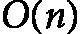
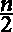

# 第十六章：<st c="0">12</st>

# <st c="3">线性数据结构</st>

<st c="26">在本章中，我们将探索</st> **<st c="89">线性数据结构</st>**<st c="111">的基础概念，这些概念在计算机科学和算法设计中发挥着</st> <st c="125">至关重要的作用。</st> <st c="182">我们将从理解数组和链表的基本知识开始，学习这些结构如何存储和管理数据。</st> <st c="308">本章将引导你了解这些结构上的关键操作，如插入、删除和查找，并通过分析它们的时间复杂度来理解它们的效率。</st> <st c="514">通过比较数组和链表，你将更好地理解在特定应用中选择合适数据结构时的权衡。</st> <st c="644">应用。</st>

<st c="666">随着我们的深入学习，我们将发现更多高级的线性数据结构，如栈、队列和</st> **<st c="765">双端队列</st>** <st c="784">(</st>**<st c="786">双向队列</st>**<st c="792">)。</st> <st c="796">我们</st> <st c="799">将学习这些结构如何扩展基本列表的功能，以及它们如何应用于实际场景，如任务调度和资源管理。</st> <st c="970">此外，本章还将介绍</st> **<st c="1018">跳表</st>**<st c="1028">，一种</st> <st c="1032">概率数据结构，在数组的高效性和链表的灵活性之间提供了平衡。</st> <st c="1153">通过本章的学习，你将掌握有效实现和使用这些线性数据结构所需的知识。</st> <st c="1276">结构。</st>

<st c="1299">本章将涵盖以下主题：</st>

+   <st c="1358">列表</st>

+   <st c="1364">跳表</st>

+   <st c="1375">栈</st>

+   <st c="1382">队列</st>

+   <st c="1388">双端队列</st>

# <st c="1394">列表</st>

<st c="1400">A</st> **<st c="1403">列表</st>** <st c="1407">是一个有序的元素集合，可以容纳相同或不同类型的元素，其中每个元素都有索引并在列表中占据特定位置。</st> <st c="1572">列表通常用于存储可以轻松访问、插入或删除的数据序列。</st> <st c="1674">它们可以包含不同类型的元素，尽管在一些编程语言中，列表通常是同质的，意味着所有元素都属于</st> <st c="1821">相同类型。</st>

<st c="1831">列表通常通过数组或链式结构来实现，这两种方式在性能和内存使用上有明显不同。</st> <st c="2006">当列表中的元素存储在连续的内存位置时，该列表被称为</st> **<st c="2097">数组</st>**<st c="2102">。在</st> <st c="2106">这种情况下，通过索引访问元素非常高效，通常需要常数时间（</st><st c="2197"><st c="2199">），因为可以直接计算任何元素的内存位置。</st> <st c="2269">然而，数组一旦创建后大小固定，如果元素的数量频繁变化，就可能导致效率低下，需要创建新的数组并复制</st> <st c="2454">数据。</st></st>

<st c="2462">另一方面，如果列表是通过链式结构实现的，则称为</st> **<st c="2557">链表</st>**<st c="2568">。在链表中，每个元素，称为</st> <st c="2610">一个</st> **<st c="2613">节点</st>**<st c="2617">，包含一个指向序列中下一个节点的引用（或链接）。</st> <st c="2684">这种结构使得列表可以在添加或删除元素时动态增长或缩小，而无需占用大块的连续内存。</st> <st c="2836">然而，由于节点分散在内存中，通过索引访问元素需要从头遍历列表，这可能会很耗时（</st> <st c="3004"><st c="3006">在最坏情况下）。</st></st>

<st c="3026">在选择使用数组还是链表时，取决于应用程序的具体需求，比如插入和删除的频率与快速访问元素的需求之间的权衡。</st> <st c="3224">当快速访问和可预测的内存使用至关重要时，通常优先选择数组，而链表则更适用于需要动态调整大小和频繁修改的场景。</st> <st c="3427">在接下来的小节中，我们将探讨数组的关键特性，特别是在算法效率和可以执行的各种操作方面。</st> <st c="3606">。</st>

## <st c="3614">数组</st>

<st c="3621">一个</st> **<st c="3625">数组</st>** <st c="3630">是一个基本的数据结构，由一组元素组成，每个元素通过</st> <st c="3725">至少一个数组索引或键来标识。</st> <st c="3758">数组是计算机科学中最简单且最广泛使用的数据结构之一。</st> <st c="3847">它们通常用于存储相同类型的固定大小的元素序列。</st> <st c="3932">每个元素的位置由其索引定义，通常从零开始。</st>

<st c="4017">数组具有以下</st> <st c="4036">定义特征，影响它们的行为</st> <st c="4047">和性能：</st>

+   **<st c="4118">固定大小</st>**<st c="4129">：一旦创建了数组，它的大小就被设置好，无法更改。</st> <st c="4197">这意味着数组能够容纳的元素数量在创建时就已预定。</st> <st c="4305">例如，在大多数编程语言中，我们必须在声明数组时指定数组的大小，例如</st> **<st c="4415">int[] a = new int[10];</st>** <st c="4437">在 Java 中，这会创建一个能够容纳 10 个整数的数组。</st> <st c="4497">以下是一个简单的数组声明</st> <st c="4541">在 Python 中的例子：</st>

    ```py
     # Define an array (list) of integers
    a = [10, 20, 30, 40, 50]
    # Print the array
    print(a)  # Outputs: [10, 20, 30, 40, 50]
    ```

+   **<st c="4672">连续内存分配</st>**<st c="4701">：数组的元素存储在连续的内存位置中。</st> <st c="4772">这使得通过简单的数学公式计算内存地址，从而高效地访问任何元素成为可能。</st> <st c="4888">例如，在一个一维数组</st> *<st c="4929">a</st>* <st c="4930">，其大小为</st> <st c="4939"><st c="4940">，元素的地址</st> *<st c="4969">a[i]</st>* <st c="4973">可以通过以下公式计算：</st> <st c="4995"><st c="5013">，其中</st>  <st c="5021"><st c="5026">是基地址，</st>  <st c="5054"><st c="5055">是数组中元素的索引</st> *<st c="5097">a</st>*<st c="5098">，而</st>  <st c="5104"><st c="5111">是数组中每个元素的大小。</st> <st c="5153">例如，对于 1 字节的元素，大小为 1；对于 16 位或字的元素，大小为 2，等等。</st> *<st c="5221">表 12.1</st>* <st c="5231">展示了一个简单的数组示例。</st></st></st></st></st></st>

| <st c="5273">内存地址</st> | <st c="5288">FF01</st> | <st c="5293">FF02</st> | <st c="5298">FF03</st> | <st c="5303">FF04</st> | <st c="5308">FF05</st> | <st c="5313">FF06</st> |
| --- | --- | --- | --- | --- | --- | --- |
| <st c="5318">内容</st> | <st c="5326">23</st> | <st c="5329">123</st> | <st c="5333">54</st> | <st c="5336">67</st> | <st c="5339">34</st> | <st c="5342">87</st> |
| <st c="5345">索引</st> | <st c="5351">0</st> | <st c="5353">1</st> | <st c="5354">2</st> | <st c="5355">3</st> | <st c="5356">4</st> | <st c="5357">5</st> |

<st c="5358">表 12.1：一个数组示例</st>

+   **<st c="5386">同质元素</st>**<st c="5407">：数组中的所有元素必须具有相同的数据类型，确保数组是一个统一的集合。</st> <st c="5515">例如，整数数组</st> **<st c="5549">int[]</st>** <st c="5554">只能存储整数值，而字符串数组</st> **<st c="5610">String[]</st>** <st c="5618">只能存储</st> <st c="5634">字符串值。</st>

+   **<st c="5648">索引访问</st>**<st c="5663">：数组</st> <st c="5672">允许通过索引直接访问任何元素，提供常数时间的访问，这是这种数据结构的主要优势之一。</st> <st c="5816">访问数组中的第三个元素</st> *<st c="5856">a</st>* <st c="5857">就像是</st> *<st c="5874">a</st>* <st c="5875">[2]一样简单。</st>

<st c="5880">数组</st> <st c="5888">支持多种操作，每种操作都有其独特的性能影响。</st> <st c="5965">以下是</st> <st c="5977">常见的数组操作及其</st> <st c="6042">时间复杂度：</st>

+   **<st c="6060">插入</st>**<st c="6070">：这是指向数组中添加新元素。</st> <st c="6123">例如，考虑</st> **<st c="6145">a = [1, 2, 3, 4]</st>**<st c="6161">。如果有空间，将</st> **<st c="6173">5</st>** <st c="6174">插入数组的末尾是非常直接的。</st> <st c="6237">然而，若要将</st> **<st c="6256">5</st>** <st c="6257">插入到索引</st> **<st c="6267">1</st>** <st c="6268">，则需要将索引</st> **<st c="6311">1</st>** <st c="6312">到右边的所有元素移动。</st> <st c="6327">数组插入操作的时间复杂度是</st>  <st c="6373"><st c="6374">在最佳情况下，时间复杂度为</st>  <st c="6396"><st c="6397">在最坏情况下，时间复杂度为</st>。</st> <st c="6417">最佳情况是在部分填充的数组末尾插入元素。</st> <st c="6484">如果是在数组的开头或中间插入，则需要移动元素，属于最坏情况。</st> <st c="6578">以下是一个</st> <st c="6597">Python 示例：</st>

    ```py
     a = [1, 2, 3, 4]
    a.insert(1, 5)  # a becomes [1, 5, 2, 3, 4]
    print(a)
    ```

    <st c="6681">由于 Python 使用零索引，因此</st> `<st c="6725">a.insert(1, 5)</st>` <st c="6739">操作会将值插入数组的第二个位置。</st></st></st>

+   **<st c="6806">删除</st>**<st c="6815">: 删除</st> <st c="6823">是指从数组中移除一个元素。</st> <st c="6868">假设有</st> **<st c="6874">a = [1, 2, 3, 4]</st>**<st c="6890">，删除索引</st> **<st c="6909">2</st>** <st c="6910">处的元素</st> **<st c="6920">1</st>** <st c="6921">需要将索引</st> **<st c="6965">1</st>** <st c="6966">之后的所有元素向左移动，以填补空缺。</st> <st c="6996">在最好的情况下，删除最后一个元素的时间复杂度为</st> <st c="7065"><st c="7066">。然而，如果我们删除数组开头或中间的元素，则需要将随后的元素移动，导致最坏情况下的时间复杂度为</st> <st c="7235"><st c="7236">：</st>

    ```py
     a = [1, 2, 3, 4]
    a.pop(1)  # a becomes [1, 3, 4]
    ```</st>

+   **<st c="7285">编辑或更新</st>**<st c="7300">: 编辑是</st> <st c="7314">修改数组中现有元素的操作。</st> <st c="7358">假设有</st> **<st c="7364">a = [1, 2, 3, 4]</st>**<st c="7380">，将索引</st> **<st c="7412">2</st>** <st c="7413">处的元素</st> **<st c="7419">3</st>** <st c="7420">改为</st> **<st c="7424">5</st>** <st c="7425">是一个直接的</st> <st c="7438">操作。</st> <st c="7449">我们可以通过索引直接访问该元素并更新它，因此其时间复杂度为</st> <st c="7533">!<mml:math xmlns:mml="http://www.w3.org/1998/Math/MathML" xmlns:m="http://schemas.openxmlformats.org/officeDocument/2006/math"><mml:mi>O</mml:mi><mml:mo>(</mml:mo><mml:mn>1</mml:mn><mml:mo>)</mml:mo></mml:math></st><st c="7544"><st c="7545">:</st>

    ```py
     a = [1, 2, 3, 4]
    a[2] = 5  # a becomes [1, 2, 5, 4]
    ```</st>

+   **<st c="7597">搜索</st>**<st c="7604">: 搜索</st> <st c="7616">是指在数组中查找特定元素。</st> <st c="7670">这一主题在</st> *<st c="7708">第七章</st>*<st c="7717">中进行了广泛讨论，讨论的多数搜索算法是基于数组作为底层数据结构的。</st> <st c="7820">在</st> *<st c="7823">第十三章</st>*<st c="7833">中，我们将探讨如何在非线性数据结构上进行搜索，如树形结构。</st>

+   **<st c="7927">访问</st>**<st c="7934">：访问</st> <st c="7944">指的是在数组中特定索引处检索元素的值。</st> <st c="8009">数组的一个关键优势之一是其访问时间是常数时间（</st><st c="8097"><st c="8099">），允许直接通过其索引检索任何元素，无需遍历。</st>

<st c="8192">数组可以在更复杂的结构中实现。</st> <st c="8253">一个例子是</st> `<st c="8292">列表</st>` <st c="8296">在 Python 中）。</st> <st c="8309">这些</st> <st c="8314">数组可以在元素添加到初始容量之外时调整大小。</st> <st c="8397">然而，其基本原理保持不变，数组提供了高效的访问和遍历。</st> <st c="8503">另一个</st> <st c="8510">例子是</st> **<st c="8522">多维数组</st>**<st c="8545">。这些数组可以扩展到多个维度，如 2D 数组（矩阵）或 3D 数组，在图像处理、科学模拟和游戏开发等应用中特别有用。</st> <st c="8763">以下是 Python 中的一个 2D 数组示例</st> <st c="8800">：</st>

```py
 matrix = [
      [1, 2, 3],
      [4, 5, 6],
      [7, 8, 9]
]
print(matrix[1][2])  # Outputs: 6 (element at second row, third column)
```

**<st c="8926">数组</st>** <st c="8933">是</st> <st c="8939">一种基本且高效的数据结构，用于存储和管理元素集合，特别是当集合的大小已知且保持恒定时。</st> <st c="9112">它们的连续内存分配使得访问快速，并且各种操作的实现直接明了。</st> <st c="9228">然而，它们的固定大小和插入、删除可能存在的低效性使得它们相比于其他数据结构如链表而言不够灵活。</st> <st c="9389">了解数组的权衡和适当的使用案例对于有效的算法设计和实现至关重要。</st>

## <st c="9518">链表</st>

<st c="9531">链表</st> **<st c="9534">是</st>** <st c="9545">一种</st> <st c="9550">线性</st> <st c="9557">数据结构，其中元素（称为节点）按顺序排列。</st> <st c="9633">与数组不同，链表不在连续的内存位置存储其元素。</st> <st c="9721">相反，链表中的每个节点至少包含两个部分：数据和指向序列中下一个节点的引用（或指针）。</st> <st c="9858">这种结构允许链表在元素添加或删除时动态调整大小，轻松增长或缩小。</st>

<st c="9977">链表有几个</st> <st c="10003">关键特点，使其与其他数据结构（如数组）区分开来：</st>

+   **<st c="10088">动态大小</st>**<st c="10101">：链表的大小可以动态增长或缩小，因为节点可以根据需要添加或删除，而无需重新分配或重新组织整个数据结构。</st> <st c="10270">例如，我们可以继续向链表中添加节点，而不必担心预先定义的大小。</st>

+   **<st c="10370">非连续内存分配</st>**<st c="10403">：与数组不同，链表不要求连续的内存位置。</st> <st c="10478">每个节点都独立存储在内存中，并通过指针连接在一起。</st> <st c="10558">例如，在单向链表中，每个节点包含指向下一个节点的指针，这样元素就可以分散存储在内存中。</st> <st c="10678">通过内存分布。</st>

+   **<st c="10696">顺序访问</st>**<st c="10714">：链表必须从头开始顺序访问，因为没有直接通过索引访问特定元素的方法。</st> <st c="10845">例如，要访问链表中的第三个元素，我们必须先遍历前两个节点。</st>

+   **<st c="10941">变种</st>**<st c="10950">：链表</st> <st c="10965">有不同的形式，包括单向链表（每个节点指向下一个节点）、双向链表（每个节点指向下一个节点和上一个节点）以及循环链表（最后一个节点指向第一个节点）。</st> <st c="11215">例如，在双向链表中，由于每个节点都有指向前后节点的指针，因此可以在两个方向上进行遍历。</st> <st c="11338">下一个节点。</st>

<st c="11349">链表支持各种操作，每个操作具有特定的性能特征。</st> <st c="11439">让我们回顾一下主要操作及其时间复杂度</st> <st c="11509">和示例。</st>

### <st c="11522">链表插入</st>

<st c="11549">考虑</st> <st c="11558">这个链表：</st> `<st c="11577">24</st>` <st c="11579">→</st> `<st c="11582">3</st>` <st c="11583">→</st> `<st c="11586">12</st>` <st c="11588">→</st> `<st c="11591">17</st>`<st c="11593">。如果我们想将值</st> `<st c="11626">8</st>` <st c="11627">插入</st> `<st c="11636">3</st>` <st c="11637">和</st> `<st c="11642">12</st>`<st c="11644">之间，过程包括创建一个新节点，节点值为</st> `<st c="11702">8</st>` <st c="11703">并相应地更新指针。</st> <st c="11743">下面是逐步操作：</st> <st c="11772">步骤：</st>

1.  **<st c="11780">创建新节点</st>**<st c="11800">：首先，我们创建一个包含值</st> **<st c="11855">8</st>**<st c="11856">的新节点。初始时，这个新节点的指针被设置为</st> **<st c="11908">null</st>**<st c="11912">，因为它尚未指向任何内容。</st>

1.  **<st c="11951">更新新节点的指针</st>**<st c="11986">：接下来，将新节点的指针设置为指向下一个节点，</st> **<st c="12065">3</st>**<st c="12066">，即包含</st> **<st c="12097">12</st>**<st c="12099">的节点。现在，新节点</st> **<st c="12119">3</st>** <st c="12120">已连接到</st> <st c="12137">节点</st> **<st c="12142">4</st>**<st c="12143">。</st>

1.  **<st c="12144">更新前一个节点的指针</st>**<st c="12184">：最后，更新包含</st> **<st c="12238">3</st>** <st c="12239">的节点的指针，使其指向新节点</st> **<st c="12265">8</st>**<st c="12266">。这完成了插入，结果是链表</st> **<st c="12322">24</st>** <st c="12329">→</st> **<st c="12332">3</st>** <st c="12333">→</st> **<st c="12336">8</st>** <st c="12337">→</st> **<st c="12340">12</st>** <st c="12342">→</st> **<st c="12345">17</st>**<st c="12347">。</st>

*<st c="12348">图 12.1</st>* <st c="12361">展示了在</st> <st c="12412">链表中插入新节点的过程。</st>


<st c="12540">图 12.1：在三步中向链表添加新节点的过程</st>

<st c="12617">在</st> *<st c="12621">图 12.1</st>*<st c="12632">中，</st> *<st c="12634">Link</st>* <st c="12638">表示指向</st> `<st c="12710">24</st>`<st c="12712">的指针。</st> <st c="12716">最后一个节点，称为</st> `<st c="12776">17</st>`<st c="12778">)，指向</st> `<st c="12792">null</st>`<st c="12796">，表示链表的结束。</st> <st c="12830">我们用</st> `<st c="12856">null</st>` <st c="12860">表示一个指向</st> `<st c="12870">/</st>` <st c="12871">符号的指针。</st> <st c="12880">新创建的节点的地址标记为</st> `<st c="12932">New</st>`<st c="12935">，初始时，它指向</st> `<st c="12965">null</st>`<st c="12969">。</st>

<st c="12970">这是一个简单的 Python 实现，展示了</st> <st c="13017">上述过程：</st>

```py
 class Node:
    def __init__(self, data):
        self.data = data  # Store data
        self.next = None  # Initialize next as null (None in Python)
class LinkedList:
    def __init__(self):
        self.head = None  # Initialize the head of the list as None
    def insert_after(self, prev_node, new_data):
        if prev_node is None:
            print("The given previous node must be in the LinkedList.")
            return
        new_node = Node(new_data)  # Create a new node with the provided data
        new_node.next = prev_node.next  # Point the new node to the next node (e.g., 4)
        prev_node.next = new_node  # Point the previous node (e.g., 2) to the new node (e.g., 3)
    def print_list(self):
        temp = self.head
        while temp:
            print(temp.data, end=" -> ")
            temp = temp.next
        print("None")
```

<st c="13741">为了测试</st> <st c="13753">`Node` 类和 `LinkedList` 类的功能，我们可以使用以下示例：</st>

```py
 if __name__ == "__main__":
    llist = LinkedList()
    # Creating the initial linked list 1 -> 2 -> 4
    llist.head = Node(1)
    second = Node(2)
    third = Node(4)
    llist.head.next = second
    second.next = third
    # Insert 3 between 2 and 4
    llist.insert_after(second, 3)
    # Print the updated linked list
    llist.print_list()
```

<st c="14152">让我们简要解释一下</st> <st c="14175">这段代码：</st>

+   **<st c="14184">Node</st>**<st c="14189">：每个</st> **<st c="14197">Node</st>** <st c="14201">对象存储一个</st> **<st c="14218">数据</st>** <st c="14222">值和一个</st> **<st c="14235">指向下一个节点的</st>** <st c="14239">指针，在</st> <st c="14272">链表中。</st>

+   **<st c="14284">LinkedList</st>**<st c="14295">：`LinkedList`</st> **<st c="14302">类管理链表，包括</st>** <st c="14358">插入操作。</st>

+   **<st c="14378">insert_after</st>**<st c="14391">：该方法在给定节点（</st>**<st c="14445">prev_node</st>**<st c="14455">）后插入新节点。</st><st c="14459">新节点的数据为</st> **<st c="14492">new_data</st>** <st c="14500">，并且更新指针以正确插入到</st> <st c="14561">链表中。</st>

+   **<st c="14570">print_list</st>**<st c="14581">：该方法遍历链表并打印每个节点的数据。</st>

<st c="14655">链表中插入操作的时间复杂度为</st> <st c="14665"><st c="14709">，最佳情况下，例如在链表开头或结尾插入时，如果位置已知。</st> <st c="14822">最坏情况下，如果需要通过链表遍历特定位置进行插入，时间复杂度为</st> <st c="14936"><st c="14939">。</st>

### <st c="14941">链表中的删除操作</st>

<st c="14966">链表中的删除操作涉及删除特定节点。</st> <st c="14989">例如，给定链表</st> `<st c="15054">24</st>` <st c="15056">→</st> `<st c="15059">3</st>` <st c="15060">→</st> `<st c="15063">12</st>` <st c="15065">→</st> `<st c="15068">17</st>` <st c="15070">，删除值为</st> `<st c="15117">3</st>` <st c="15118">的节点需要通过更新前一个节点（</st>`<st c="15187">2</st>`<st c="15189">）的指针来绕过它（</st>`<st c="15218">4</st>`<st c="15220">）。</st> <st c="15223">与插入类似，链表中删除操作的时间复杂度取决于要删除节点的位置。</st> <st c="15352">最坏情况下，需要遍历查找节点，时间复杂度为</st> <st c="15437">。</st> *<st c="15440">图 12</st>**<st c="15449">.2</st>* <st c="15451">展示了示例链表中的删除过程。</st></st>


<st c="15545">图 12.2：链表中删除节点的过程</st>

<st c="15605">在</st> *<st c="15609">图 12</st>**<st c="15618">.3</st>*<st c="15620">中，顶部部分显示了删除值为</st> `<st c="15707">12</st>`<st c="15709">的节点之前的链表，底部部分则显示了删除后的链表。</st> <st c="15775">以下是一个</st> <st c="15794">删除链表中节点的示例 Python 代码：</st>

```py
 def delete_node(self, key):
    temp = self.head
    if (temp is not None):
        if (temp.data == key):
            self.head = temp.next
            temp = None
            return
    while(temp is not None):
        if temp.data == key:
            break
        prev = temp
        temp = temp.next
    if(temp == None):
        return
    prev.next = temp.next
    temp = None
# Example usage:
llist.delete_node(3)  # Deletes the node with value 3
llist.print_list()
```

<st c="16213">`<st c="16218">delete_node</st>` <st c="16229">函数应当添加到</st> `<st c="16262">LinkedList</st>` <st c="16272">类中，参见前一节。</st>

### <st c="16303">在链表中编辑</st>

<st c="16322">编辑操作涉及</st> <st c="16339">修改链表中现有节点的数据。</st> <st c="16403">例如，如果我们想将第二个节点的值从</st> `<st c="16472">2</st>` <st c="16473">改为</st> `<st c="16477">5</st>` <st c="16478">，那么在链表</st> `<st c="16486">1</st>` <st c="16487">→</st> `<st c="16490">2</st>` <st c="16491">→</st> `<st c="16494">3</st>` <st c="16495">→</st> `<st c="16498">4</st>` <st c="16499">中，我们需要相应地更新该节点的数据。</st> <st c="16558">这个操作的时间复杂度是</st>  <st c="16600"><st c="16601">因为我们可能需要遍历链表来找到要更新的节点。</st> <st c="16677">以下是一个进行</st> <st c="16723">编辑/更新操作的示例 Python 代码：</st></st>

```py
 def update_node(self, old_data, new_data):
    temp = self.head
    while temp is not None:
        if temp.data == old_data:
            temp.data = new_data
            return
        temp = temp.next
# Example usage:
llist.update_node(2, 5)  # Updates node with value 2 to 5
```

<st c="16974">`<st c="16979">update_node</st>` <st c="16990">函数应当添加到</st> `<st c="17023">LinkedList</st>` <st c="17033">类中，参见前一节。</st>

### <st c="17064">在链表中查找</st>

`<st c="17090">In</st>` *<st c="17094">第七章</st>*<st c="17103">，我们详细探讨了多种搜索算法，这些算法都基于数组作为底层数据结构。</st> <st c="17226">例如，在二分查找中，我们可以直接访问数组中特定索引处的元素，例如数组的中间元素。</st> <st c="17346">然而，当使用链表时，由于数据结构的顺序特性，找到具有特定值的节点变得更加困难。</st> <st c="17495">这意味着无论使用何种搜索算法，当应用于单链表时，搜索本质上变成了顺序的线性查找。</st> <st c="17650">因此，链表中的搜索时间复杂度为</st> <st c="17715"><st c="17716">.</st></st>

`<st c="17717">Here is the Python code example using a singly</st>` `<st c="17765">linked list:</st>`

```py
 def search_node(self, key):
    temp = self.head
    while temp is not None:
        if temp.data == key:
            return True
        temp = temp.next
    return False
# Example usage:
found = llist.search(3)  # Returns True if 3 is found
```

`<st c="17979">The</st>` `<st c="17984">search_node</st>` `<st c="17995">function</st>` `<st c="18005">should be added to the</st>` `<st c="18028">LinkedList</st>` `<st c="18038">class in the</st>` `<st c="18052">previous section.</st>`

### `<st c="18069">Access in link lists</st>`

`<st c="18090">This</st>` `<st c="18096">operation involves retrieving the value of a node at a specific position in the linked list.</st>` <st c="18189">例如，访问</st> `<st c="18235">17</st>` <st c="18237">→</st> `<st c="18240">12</st>` <st c="18242">→</st> `<st c="18245">3</st>` <st c="18246">→</st> `<st c="18249">24</st>` <st c="18251">→</st> `<st c="18254">6</st>` <st c="18255">链表中的第四个节点时，需要顺序遍历直到到达目标节点。</st> <st c="18325">此操作的时间复杂度为</st> <st c="18367"><st c="18368">。以下是一个实现链表访问的简单 Python 代码：</st></st>

```py
 def get_nth(self, index):
    temp = self.head
    count = 0
    while (temp):
        if (count == index):
            return temp.data
    count += 1
    temp = temp.next
    return None
# Example usage:
value = llist.get_nth(2)  # Returns the value of the third node
```

`<st c="18670">The</st>` `<st c="18675">get_nth</st>` `<st c="18682">function should be added to the</st>` `<st c="18715">LinkedList</st>` `<st c="18725">class in the</st>` `<st c="18739">previous section.</st>`

<st c="18756">在实际应用中，链表</st> <st c="18783">通常作为实现栈和队列的基础数据结构，因为它们具有动态调整大小的能力。</st> <st c="18913">它们也被操作系统用于内存分配管理，在这种情况下，空闲内存块被连接在一个链表中。</st> <st c="19045">链表的另一个重要应用是在图或树中表示邻接表，每个顶点指向一个包含</st> <st c="19193">邻接顶点的链表。</st>

<st c="19211">链表提供了一个灵活且动态的替代数组的方案，特别是在数据结构需要频繁改变大小的场景中。</st> <st c="19366">它们的非连续内存分配允许高效的插入和删除操作，无需像数组那样移动元素。</st> <st c="19502">然而，这种灵活性也带来了顺序访问时间的问题，使得链表不太适合需要频繁随机访问的应用。</st> <st c="19668">理解链表与其他数据结构（如数组）之间的权衡，对于选择最合适的数据结构来解决特定问题至关重要。</st> <st c="19840">在下一节中，我们将简要探讨其他类型的</st> <st c="19903">链表。</st>

### <st c="19916">双向和循环链表</st>

<st c="19949">一个</st> **<st c="19952">双向链表</st>** <st c="19970">是</st> <st c="19975">一种链表类型，其中每个节点</st> <st c="20015">包含两个指针：一个指向下一个节点，另一个指向前一个节点（参见</st> *<st c="20115">图 12</st>**<st c="20124">.3</st>*<st c="20126">）。</st> <st c="20130">这种双向结构允许在前向和反向方向上遍历链表，使得某些操作更加高效。</st> <st c="20271">尽管双向链表允许双向访问，但它们的顺序性质意味着主要操作的时间复杂度与单向链表类似。</st>


<st c="20478">图 12.3：一个示例双向链表</st>

<st c="20520">另一种链表的变体是</st> <st c="20542">循环链表</st> <st c="20552">，其中最后一个节点指向第一个节点，形成一个循环结构（见</st> *<st c="20671">图 12</st>**<st c="20680">.4</st>*<st c="20682">）。</st> <st c="20686">这可以应用于单向链表和双向链表。</st> <st c="20746">由于最后一个节点连接回第一个节点，我们可以在不遇到空引用的情况下循环遍历链表。</st> <st c="20868">这一特性非常适用于需要持续循环遍历数据的应用场景，如轮询调度或缓冲区管理。</st> <st c="21022">与</st> <st c="21027">双向链表类似，循环链表在</st> <st c="21104">时间复杂度上并没有比非循环链表提供任何改进。</st> <st c="21145">链表。</st>


<st c="21184">图 12.4：循环链表</st>

<st c="21219">双向链表和循环链表在不同的使用场景中各自具有独特的优势。</st> <st c="21324">双向链表在导航上提供了更大的灵活性，且节点移除更为容易，而循环链表则能够高效地进行数据的循环遍历。</st> <st c="21479">在性能方面，这两种结构的时间复杂度与单向链表相似，但在特定操作中具有额外的优势。</st> <st c="21625">在下一节中，我们将探讨一种结合了链表和数组优势的数据结构。</st> <st c="21729">和数组。</st>

# <st c="21740">跳表</st>

<st c="21751">正如我们在上一章讨论的那样，在学习数据结构时，评估其在插入、删除和查找三项关键操作中的性能非常重要。</st> <st c="21927">数组在查找方面表现优异，特别是在数据已经排序的情况下，因为它们具备直接（或随机）访问能力，允许实现亚线性时间复杂度。</st> <st c="22099">然而，由于数组是静态的，当涉及到插入新数据或删除现有数据时，它们可能会带来挑战。</st> <st c="22229">另一方面，链表表现出相反的行为。</st> <st c="22292">它们的动态分配使得插入和删除变得容易，但由于缺乏直接访问，甚至在排序数据中，查找也变成了一个顺序过程，具有线性</st> <st c="22471">时间复杂度。</st>

<st c="22487">这个问题由此产生：是否有可能结合数组和链表的优点？</st> <st c="22587">换句话说，是否能像数组一样实现比顺序访问更快的访问，同时享受链表的动态内存分配优势？</st> <st c="22735">答案就在于</st> **<st c="22758">跳表</st>**<st c="22767">。跳表是一种概率数据结构，通过在基本链表的基础上增加多个链表层级，从而实现更快速的搜索、插入和删除操作。</st> <st c="22957">跳表的每一层包含来自下层的部分元素，最底层包含所有元素，形成一个简单的链表。</st> <st c="23114">更高的层级充当“快速通道”，一次跳过多个元素，这就是</st> *<st c="23206">跳表</st>*<st c="23215">的名字来源。</st> *<st c="23217">图 12</st>**<st c="23226">.6</st>* <st c="23228">展示了一个跳表的示例。</st> <st c="23268">第 1 层作为标准链表工作，而所有上层则充当</st> <st c="23349">快速通道。</st>

<st c="23363">让我们通过类比来解释</st> <st c="23382">跳表的概念。</st> <st c="23423">假设我们正在前往一个特定车站见朋友，车站位于公交系统中的某一站。</st> <st c="23504">公交车会在每个车站停靠，每次停靠都需要耗费相当的时间，所以我们希望在前往朋友车站的途中尽量减少停靠站点的数量。</st> <st c="23666">一共有</st>  <st c="23676"><st c="23677">个车站，而我们知道朋友所在车站的具体编号。</st> <st c="23763">该公交系统有两种</st> <st c="23792">线路类型：</st></st>

+   <st c="23801">常规公交车会在每个</st> <st c="23833">车站停靠。</st>

+   快速线路仅停靠四个车站，具体为：，，，<st c="23919">和</st>。

乘坐常规公交是最安全的选择，因为它确保我们能够到达目的地，但它需要在每个站点停靠，这可能会低效，总共需要停靠的次数为  <st c="24142"><st c="24191">站点。</st> <st c="24207">另外，我们可以选择快线公交，它只停靠四个站点。</st> <st c="24282">如果我们朋友的站点位于这些快线停靠站之间的某个区间内（例如，在 1 和</st> <st c="24396"><st c="24397">之间，或者在</st>  <st c="24410"><st c="24411">和</st> <st c="24416"><st c="24417">之间），我们可以在离朋友的站点最近的快线停靠站下车，然后换乘常规公交，直达朋友的站点。</st> <st c="24538">通过这样做，我们将停靠站的数量从最多的</st>  <st c="24601"><st c="24602">减少到大约</st> <st c="24613"><st c="24614">，使得我们的旅程更加高效。</st> <st c="24656">跳表的结构与这种</st> <st c="24689">公交系统类似。</st>

<st c="24700">跳表具有几个定义特征，</st> <st c="24733">这些特征会影响其行为</st> <st c="24780">和性能：</st>

+   **<st c="24796">多个层级</st>**<st c="24812">：跳表由多个层级组成，每个层级包含前一个层级的一个子集。</st> <st c="24947">最底层是一个标准的链表，包含所有元素。</st> <st c="25019">在跳表中，第一层可能包含所有元素，第二层可能包含一半元素，第三层可能包含四分之一元素，</st> <st c="25161">以此类推。</st>

+   **<st c="25167">概率平衡</st>**<st c="25191">：跳表使用随机化来确定每个元素出现的层级。</st> <st c="25281">这使得跳表的平均时间复杂度与平衡二叉搜索树类似，而无需复杂的平衡算法。</st> <st c="25418">例如，在插入一个元素时，会为该元素随机选择一个（最多的）层级。</st>

+   **<st c="25546">高效的查找</st>**<st c="25566">：跳表通过使用更高层级跳过列表中的大部分部分，从而提高查找速度，减少所需比较次数。</st> <st c="25719">例如，在跳表中查找一个元素时，可以通过跳过多个节点来迅速找到该元素。</st> <st c="25829">通过上层级，可以加速查找。</st>

+   **<st c="25842">动态调整大小</st>**<st c="25859">：跳表可以在添加或删除元素时动态调整其结构，保持高效的操作而无需重建整个结构。</st> <st c="26028">例如，随着新元素的插入，可能会根据</st> <st c="26125">随机化过程将它们添加到多个层级。</st>

<st c="26147">跳表支持各种操作，每个操作都有特定的性能特征。</st> <st c="26235">以下部分概述了主要操作及其时间复杂度</st> <st c="26323">和示例。</st>

## <st c="26336">跳表中的插入</st>

<st c="26360">向跳表中插入</st> <st c="26371">数字需要几个步骤。</st> <st c="26418">在这个例子中，我们将插入数字</st> `<st c="26463">3</st>`<st c="26464">,</st> `<st c="26466">4</st>`<st c="26467">,</st> `<st c="26469">5</st>`<st c="26470">,</st> `<st c="26472">7</st>`<st c="26473">,</st> `<st c="26475">8</st>`<st c="26476">,</st> `<st c="26478">9</st>`<st c="26479"> 和</st> `<st c="26485">10</st>` <st c="26487">到一个有四个层级的跳表中。</st> <st c="26520">每个数字将一个接一个地插入，层级将根据随机化过程进行分配。</st> <st c="26617">以下是这个</st> <st c="26672">过程的详细逐步描述：</st>

+   **<st c="26686">步骤 1: 初始化跳表</st>**<st c="26719">：从一个空的跳表开始，该跳表有四个层级：</st> *<st c="26774">等级 4</st>* <st c="26781">（最上层），</st> *<st c="26793">等级 3</st>*<st c="26800">，</st> *<st c="26802">等级 2</st>*<st c="26809">，以及</st> *<st c="26815">等级 1</st>* <st c="26822">（最底层）。</st> <st c="26837">最初，列表的每个层级只有一个头节点，指向</st> <st c="26901">null</st><st c="26908">。</st>

+   **<st c="26909">步骤 2:</st>** **<st c="26918">插入 3</st>**<st c="26926">：</st>

    +   **<st c="26928">确定 3 的层级</st>**<st c="26950">：随机确定</st> **<st c="26992">3</st>** <st c="26993">应该出现在的层级。</st> <st c="27009">假设它出现在</st> <st c="27036">所有层级。</st>

    +   **<st c="27047">插入</st>**<st c="27057">：在</st> *<st c="27063">等级 1</st>* <st c="27071">到</st> *<st c="27075">4</st>*<st c="27076">，没有其他节点；所以，</st> **<st c="27108">3</st>** <st c="27109">只是被插入，且</st> *<st c="27151">等级 1</st>* <st c="27159">到</st> *<st c="27163">4</st>* <st c="27164">的头节点现在指向</st> <st c="27176">3</st><st c="27180">。</st>

<st c="27181">这里是</st> <st c="27194">跳表：</st>

+   <st c="27204">等级 4: 3 --></st> <st c="27220">null</st>

+   <st c="27224">等级 3: 3 --></st> <st c="27240">null</st>

+   <st c="27244">等级 2: 3 --></st> <st c="27260">null</st>

+   <st c="27264">等级 1: 3 --></st> <st c="27280">null</st>

+   **<st c="27284">步骤 3:</st>** **<st c="27293">插入 4</st>**<st c="27301">：</st>

    +   **<st c="27303">确定 4 的层级</st>**<st c="27325">：随机确定</st> **<st c="27367">4</st>** <st c="27368">应该出现在的层级。</st> <st c="27384">假设它只出现在</st> *<st c="27411">等级 1</st>*<st c="27418">。较高层级保持不变，因为</st> **<st c="27458">3</st>** <st c="27459">不出现在那里。</st>

    +   **<st c="27482">插入</st>**<st c="27492">：从头到适当位置遍历</st> *<st c="27504">等级 1</st>* <st c="27511">。应该将</st> **<st c="27555">4</st>** <st c="27556">插入到</st> **<st c="27582">3</st>**<st c="27583">之后。</st> 更新指针，使得</st> **<st c="27613">3</st>** <st c="27614">现在指向</st> **<st c="27629">4</st>** <st c="27630">在</st> *<st c="27634">等级 1</st>*<st c="27641">。</st>

<st c="27642">这里是</st> <st c="27654">跳表：</st>

+   <st c="27665">等级 4: 3 --></st> <st c="27681">null</st>

+   <st c="27685">等级 3: 3 --></st> <st c="27701">null</st>

+   <st c="27705">等级 2: 3 --></st> <st c="27721">null</st>

+   <st c="27725">等级 1: 3 --> 4 --></st> <st c="27747">null</st>

+   `<st c="27808">5</st>` <st c="27809">被随机分配到</st> *<st c="27834">等级 1</st>*<st c="27842">，</st> *<st c="27844">2</st>*<st c="27845">，</st> <st c="27847">和</st> *<st c="27851">3</st>*<st c="27852">。</st>

    +   **<st c="27853">插入</st>**<st c="27863">：在</st> *<st c="27869">级别 2</st>* <st c="27877">和</st> *<st c="27882">3</st>*<st c="27883">，元素</st> **<st c="27893">5</st>** <st c="27894">是下一个元素，</st> **<st c="27918">3</st>**<st c="27919">。然后，这些级别的</st> **<st c="27939">3</st>** <st c="27940">的指针会更新，指向</st> **<st c="27981">5</st>**<st c="27982">。在</st> *<st c="27987">级别 1</st>*<st c="27994">，将</st> **<st c="28003">5</st>** <st c="28004">插入到</st> **<st c="28011">4</st>** <st c="28012">之后，并相应更新指针。</st>

<st c="28050">这是</st> <st c="28063">跳表：</st>

+   <st c="28073">级别 4：3 --></st> <st c="28089">null</st>

+   <st c="28093">级别 3：3 --> 5 --></st> <st c="28115">null</st>

+   <st c="28119">级别 2：3 --> 5 --></st> <st c="28141">null</st>

+   <st c="28145">级别 1：3 --> 4 -->5 --></st> <st c="28172">null</st>

+   **<st c="28176">步骤 5：</st>** **<st c="28185">插入 7</st>**<st c="28193">：</st>

    +   **<st c="28195">确定 7 的级别</st>**<st c="28217">：假设</st> **<st c="28228">7</st>** <st c="28229">被随机分配给</st> *<st c="28254">级别 1</st>*<st c="28261">。所有上级</st> <st c="28280">保持不变。</st>

    +   **<st c="28297">插入</st>**<st c="28307">：在</st> *<st c="28313">级别 1</st>* <st c="28321">将</st> **<st c="28328">7</st>** <st c="28329">插入到</st> **<st c="28335">5</st>**<st c="28336">之后。</st>

<st c="28337">这是</st> <st c="28349">跳表：</st>

+   <st c="28360">级别 4：3 --></st> <st c="28376">null</st>

+   <st c="28380">级别 3：3 --></st> <st c="28396">5 -->null</st>

+   <st c="28405">级别 2：3 --></st> <st c="28421">5 -->null</st>

+   <st c="28430">级别 1：3 --> 4 --> 5 -->7 --></st> <st c="28463">null</st>

+   **<st c="28467">步骤 6：</st>** **<st c="28476">插入 8</st>**<st c="28484">：</st>

    +   **<st c="28486">确定 8 的级别</st>**<st c="28508">：假设</st> **<st c="28524">8</st>** <st c="28525">被随机分配给</st> *<st c="28550">级别 1</st>* <st c="28558">和</st> *<st c="28563">2</st>*<st c="28564">。</st>

    +   **<st c="28565">插入</st>**<st c="28575">：在</st> *<st c="28581">级别 2</st>*<st c="28588">，将</st> **<st c="28597">8</st>** <st c="28598">插入到</st> **<st c="28605">5</st>** <st c="28606">之后，通过更新指针。</st> <st c="28633">在</st> *<st c="28636">级别 1</st>*<st c="28643">，将</st> **<st c="28652">8</st>** <st c="28653">插入到</st> **<st c="28659">7</st>**<st c="28660">之后。</st>

<st c="28661">这是</st> <st c="28674">跳表：</st>

+   <st c="28684">级别 4：3 --></st> <st c="28700">null</st>

+   <st c="28704">级别 3：3 --> 5 --></st> <st c="28726">null</st>

+   <st c="28730">级别 2：3 --> 5 --> 8 --></st> <st c="28758">null</st>

+   <st c="28762">级别 1：3 --> 4 --> 5 --> 7 --> 8 --></st> <st c="28802">null</st>

+   <st c="28806">对于</st> *<st c="28811">步骤 9</st>* <st c="28818">和</st> *<st c="28823">步骤 10</st>*<st c="28825">，我们会像处理元素</st> **<st c="28869">7</st>**<st c="28870">一样进行。插入所有元素后的最终跳表在</st> *<st c="28939">图 12</st>**<st c="28948">.5</st>*<st c="28950">中进行了展示。</st>


<st c="29049">图 12.5：一个具有四个层级的跳表示例</st>

<st c="29099">跳表中的插入</st> <st c="29114">过程涉及确定新元素将出现在何层，并更新每个相关层级的指针以维持顺序。</st> <st c="29276">层级的随机分配确保跳表保持平衡，从而提供高效的查找、插入和删除操作。</st> <st c="29417">上述步骤展示了每个数字是如何被插入到跳表中的，利用了</st> <st c="29550">更高层级创建的快速通道。</st>

<st c="29564">以下是插入到跳表中的 Python 代码实现：</st>

```py
 import random
class Node:
    def __init__(self, value, level):
        self.value = value
        self.forward = [None] * (level + 1)
class SkipList:
    def __init__(self, max_level):
        self.max_level = max_level
        self.head = Node(-1, max_level)  # Head node with value -1 (acts as a sentinel)
        self.level = 0
    def random_level(self):
        level = 0
        while random.random() < 0.5 and level < self.max_level:
            level += 1
        return level
    def insert(self, value):
        update = [None] * (self.max_level + 1)
        current = self.head
        for i in range(self.level, -1, -1):
            while current.forward[i] and current.forward[i].value < value:
                current = current.forward[i]
            update[i] = current
        level = self.random_level()
        if level > self.level:
            for i in range(self.level + 1, level + 1):
                update[i] = self.head
            self.level = level
        new_node = Node(value, level)
        for i in range(level + 1):
            new_node.forward[i] = update[i].forward[i]
            update[i].forward[i] = new_node
    def print_skiplist(self):
        print("Skip List:")
        for i in range(self.level, -1, -1):
            print(f"Level {i}: ", end="")
            node = self.head.forward[i]
            while node:
                print(node.value, end=" -> ")
                node = node.forward[i]
            print("None")
# Example usage
if __name__ == "__main__":
    skiplist = SkipList(3)
    # Insert elements into the skip list
    skiplist.insert(3)
    skiplist.insert(4)
    skiplist.insert(5)
    skiplist.insert(7)
    skiplist.insert(8)
    skiplist.insert(9)
    skiplist.insert(10)
    # Print the skip list
    skiplist.print_skiplist()
```

<st c="31042">让我们来看一下</st> <st c="31061">代码，并解释该算法的主要类：</st>

+   **<st c="31116">节点</st>**<st c="31121">：每个**<st c="31129">节点</st>**<st c="31133">对象存储一个</st> **<st c="31150">值</st>**<st c="31155">和一个指向</st> **<st c="31170">前向</st>**<st c="31177">指针的列表，在第 1 层有 4 个指针，第 2 层有 5 个，第 3 层有 5 个，第 4 层为 null</st>

+   **<st c="31256">跳表</st>**<st c="31265">：包含以下功能：</st>

    +   **<st c="31306">random_level()</st>**<st c="31321">：此方法根据</st> <st c="31383">概率模型</st> <st c="31383">为每个新节点生成一个随机层级</st>

    +   **<st c="31402">insert()</st>**<st c="31411">：此方法将在跳表的</st> <st c="31465">适当层级插入一个新值</st>

    +   **<st c="31483">print_skiplist()</st>**<st c="31500">：此方法打印跳表，显示从最高层到</st> <st c="31600">最低层的每一层节点</st>

<st c="31616">作为示例，我们</st> <st c="31635">创建一个最多包含三层的跳表。</st> <st c="31679">插入的值为</st> `<st c="31690">3</st>`<st c="31691">，</st> `<st c="31693">4</st>`<st c="31694">，</st> `<st c="31696">5</st>`<st c="31697">，</st> `<st c="31699">7</st>`<st c="31700">，</st> `<st c="31702">8</st>`<st c="31703">，</st> `<st c="31705">9</st>`<st c="31706">，和</st> `<st c="31712">10</st>` <st c="31714">被插入到跳表中。</st> <st c="31748">最后，我们打印跳表，显示节点在各个层级中的组织方式，如下所示：</st>

```py
 Skip List:
Level 2: 7 --> 10 --> None
Level 1: 5 --> 7 --> 8 --> 9 --> 10 --> None
Level 0: 3 --> 4 --> 5 --> 7 --> 8 --> 9 --> 10 --> None
```

<st c="32019">插入后，我们来讨论跳表在</st> <st c="32086">查找操作中的表现。</st>

## <st c="32104">在跳表中搜索</st>

<st c="32125">在跳表中搜索一个项，通常是从最高层开始，沿着列表向前移动，直到找到目标或者需要下移一层。</st> <st c="32306">以下是一步步的解释，如何在我们之前构建的跳表中搜索数字</st> *<st c="32372">8</st>* <st c="32373">。</st>

+   **<st c="32417">步骤 1</st>**<st c="32424">: 从最高层开始（</st>*<st c="32455">Level 4</st>*<st c="32463">）：</st>

    +   <st c="32466">从</st> *<st c="32493">Level 3</st>*<st c="32500">的头节点开始。</st>

    +   <st c="32501">是</st> **<st c="32505">3</st>** <st c="32506">(第一个值在</st> *<st c="32527">Level 3</st>*<st c="32534">) 小于</st> **<st c="32547">7</st>**<st c="32548">吗？是的；下一个节点</st> <st c="32569">是</st> **<st c="32572">null</st>**<st c="32576">。</st>

+   **<st c="32577">步骤 2</st>**<st c="32584">: 移动到</st> *<st c="32600">Level 3</st>*<st c="32607">：</st>

    +   <st c="32609">现在，下降到节点</st> **<st c="32632">3</st>** <st c="32633">在</st> *<st c="32637">Level 3</st>* <st c="32644">，下一个节点</st> <st c="32663">是</st> **<st c="32666">5</st>**<st c="32667">。</st>

    +   <st c="32668">是</st> **<st c="32672">5</st>** <st c="32673">小于</st> **<st c="32684">9</st>**<st c="32685">吗？是的。</st> <st c="32692">移动到节点</st> **<st c="32705">5</st>**<st c="32706">。下一个节点</st> <st c="32728">为空。</st>

+   **<st c="32736">步骤 3</st>**<st c="32743">: 移动到</st> *<st c="32759">Level 2</st>*<st c="32766">：</st>

    +   <st c="32768">现在，下降到节点</st> **<st c="32791">5</st>** <st c="32792">在</st> *<st c="32796">Level 3</st>* <st c="32803">，下一个节点</st> <st c="32822">是</st> **<st c="32825">8</st>**<st c="32826">。</st>

    +   <st c="32827">是</st> **<st c="32831">8</st>** <st c="32832">小于</st> **<st c="32843">9</st>**<st c="32844">吗？不。</st>

+   **<st c="32849">步骤 4</st>**<st c="32856">: 移动到</st> *<st c="32872">Level 1</st>*<st c="32879">：</st>

    +   <st c="32881">下一个节点是</st> **<st c="32898">7</st>**<st c="32899">。目标</st> <st c="32912">已找到。</st>

<st c="32921">总比较次数为三次，显示出相较于标准链表中</st> *<st c="33028">Level 1</st>* <st c="33035">顺序查找的明显改进。</st> <st c="33086">跳表在效率上明显优于链表，尤其是在处理</st> <st c="33178">大数据集时。</st>

<st c="33193">以下是必须添加到之前描述的</st> `<st c="33213">search</st>` <st c="33219">方法，它将添加到</st> `<st c="33274">SkipList</st>` <st c="33282">类中：</st>

```py
 def search(self, value):
        current = self.head
        for i in range(self.level, -1, -1):
            while current.forward[i] and current.forward[i].value < value:
                current = current.forward[i]
        current = current.forward[0]
        if current and current.value == value:
            return True
        return False
```

<st c="33555">以下是</st> `<st c="33593">search</st>` <st c="33599">在</st> `<st c="33605">SkipList</st>` <st c="33613">类中的示例用法：</st>

```py
 if __name__ == "__main__":
    skiplist = SkipList(3)
    skiplist.insert(3)
    skiplist.insert(4)
    skiplist.insert(5)
    skiplist.insert(7)
    skiplist.insert(8)
    skiplist.insert(9)
    skiplist.insert(10)
    skiplist.print_skiplist()
    value_to_search = 7
    found = skiplist.search(value_to_search)
    print(f"\nSearch for {value_to_search}: {'Found' if found else 'Not Found'}")
    value_to_search = 6
    found = skiplist.search(value_to_search)
    print(f"Search for {value_to_search}: {'Found' if found else 'Not Found'}")
```

<st c="34106">通过插入</st> <st c="34119">示例数据，得到以下结果：</st>

```py
 Skip List:
Level 1: 3 --> 8 --> 9 --> 10 --> None
Level 0: 3 --> 4 --> 5 --> 7 --> 8 --> 9 --> 10 --> None
Search for 7: Found
Search for 6: Not Found
```

<st c="34323">为了总结我们关于跳表的讨论，我们将跳过删除的详细解释。</st> <st c="34417">跳表中的删除操作首先进行查找，然后更新</st> <st c="34502">必要的指针。</st>

<st c="34521">跳表为搜索、删除和插入操作提供了高效的平均时间复杂度，通常为</st> <st c="34647"><st c="34656">。这种效率是通过使用多级链表实现的，使得操作可以跳过大量数据，类似于二叉搜索树。</st> <st c="34828">在最优情况下，当目标元素靠近起始点时，操作的时间复杂度可以接近</st>  <st c="34870"><st c="34871">。</st> <st c="34928">然而，由于跳表的概率性质，结构有可能退化，导致最坏情况下的时间复杂度为</st>  <st c="35088"><st c="35089">。</st> <st c="35112">尽管如此，跳表在平均情况下的性能仍然稳健，使其成为动态数据结构的实用选择，特别是在平衡搜索、插入和删除时间</st> <st c="35289">至关重要的场景中。</st></st></st></st>

# <st c="35301">栈</st>

<st c="35308">一个</st> **<st c="35311">栈</st>** <st c="35316">是一个</st> <st c="35321">线性数据结构，遵循后进先出（LIFO）原则，这意味着最后添加到栈中的元素会最先被移除。</st> <st c="35458">可以将其想象为一堆盘子：我们将新的盘子放在顶部，当需要盘子时，我们首先取走最上面的那个。</st> <st c="35575">栈广泛用于各种应用，包括表达式求值、函数调用管理和软件中的撤销机制。</st>

<st c="35707">栈有几个</st> <st c="35727">决定其行为和性能的特征：</st>

+   **<st c="35799">LIFO 顺序</st>**<st c="35810">: 最后插入的元素是最先被移除的。</st> <st c="35886">例如，如果我们将数字</st> **<st c="35922">1</st>**<st c="35923">,</st> **<st c="35925">2</st>**<st c="35926">和</st> **<st c="35932">3</st>** <st c="35933">推入栈中，它们将以相反的顺序被弹出：</st> **<st c="35991">3</st>**<st c="35992">,</st> **<st c="35994">2</st>**<st c="35995">,</st> **<st c="35997">1</st>**<st c="35998">。</st>

+   **<st c="35999">一端操作</st>**<st c="36031">: 所有的插入（push）和删除（pop）操作都在栈的顶部进行。</st> <st c="36115">无法直接访问栈中间或底部的元素。</st> <st c="36191">如果我们将多个元素推入栈中，我们只能直接访问最近添加的元素。</st> <st c="36294">这也意味着栈不支持随机访问。</st> <st c="36348">与数组不同，我们不能直接访问栈中某个特定索引的元素。</st> <st c="36430">访问仅限于栈顶</st> <st c="36462">元素。</st>

+   **<st c="36475">动态大小</st>**<st c="36488">: 栈可以随着元素的推入或弹出动态增大或缩小。</st> <st c="36563">当我们将更多元素推入栈时，栈的大小会增加；而当我们弹出元素时，栈的大小会减小。</st>

<st c="36669">栈支持几个基本操作，每个操作具有特定的性能特点。</st> <st c="36763">以下是这些主要操作及其时间复杂度</st> <st c="36840">和示例：</st>

+   **<st c="36853">push</st>**<st c="36858">: 它将一个新元素添加到栈顶。</st> <st c="36908">它的时间复杂度是</st> <st c="36931"><st c="36932">，因为此操作仅涉及将元素添加到栈顶。</st> <st c="37010">以下是一个简单的</st> <st c="37036">Python 示例：</st>

    ```py
     stack = []
    stack.append(3)  # Stack is now [3]
    stack.append(5)  # Stack is now [3, 5]
    print(stack)
    ```</st>

+   **<st c="37148">pop</st>**<st c="37152">: 这会移除栈顶元素。</st> <st c="37200">它在常数时间内执行移除操作 (</st><st c="37242"><st c="37244">).</st> <st c="37247">以下是一个</st> <st c="37266">Python 示例：</st>

    ```py
     top_element = stack.pop()
    print(stack)
    ```</st>

+   **<st c="37320">peek</st>**<st c="37325">: 它用于获取栈顶元素的值，但不将其从栈中移除。</st> <st c="37333">对于栈</st> **<st c="37428">[1, 2, 3]</st>**<st c="37437">，peek 操作将返回</st> **<st c="37460">3</st>** <st c="37461">，并且不会改变栈的状态。</st> <st c="37490">时间复杂度为</st> <st c="37513"><st c="37514">，因为它只涉及访问栈顶元素。</st> <st c="37563">一个简单的 Python 指令如下：</st>

    ```py
     top_element = stack[-1]
    ```</st>

+   **<st c="37629">search</st>**<st c="37636">: 通常用于在栈中查找一个元素。</st> <st c="37694">例如，如果我们在栈</st> **<st c="37732">[1, 2, 3]</st>**<st c="37733">中查找元素</st> **<st c="37747">2</st>**<st c="37756">，我们会在栈顶往下数第 1 位找到它。</st> <st c="37803">显然，栈中</st> **<st c="37837">search</st>** <st c="37843">操作的时间复杂度是</st> <st c="37857"><st c="37858">，因为它可能需要从栈顶到栈底逐个扫描。</st> <st c="37932">让我们来看一个简单的</st> <st c="37951">Python 示例：</st>

    ```py
     element_to_find = 2
    position = stack.index(element_to_find)  # Finds the position of 2 in the stack
    ```</st>

+   **<st c="38065">edit</st>**<st c="38070">: 该操作修改栈顶元素的值。</st> <st c="38130">如果栈顶元素是</st> **<st c="38162">[1, 2, 3]</st>** <st c="38171">，其值为</st> **<st c="38175">3</st>** <st c="38176">，我们希望将其改为</st> **<st c="38205">5</st>**<st c="38206">，则栈会变为</st> **<st c="38231">[1, 2, 5]</st>**<st c="38240">。此操作的时间复杂度为常数时间（</st><st c="38283"><st c="38285">），因为该操作只影响栈顶元素。</st> <st c="38337">一个 Python 代码示例如下：</st>

    ```py
     stack[-1] = 5  # Changes the top element to 5; Stack becomes [3, 5]
    ```</st>

<st c="38440">一些编程语言还支持额外的操作，例如</st> `<st c="38511">isFull</st>`<st c="38517">，用于检查栈是否已满，以及</st> `<st c="38563">isEmpty</st>`<st c="38570">，用于判断栈是否为空。</st>

<st c="38616">栈在计算机编程中有着广泛的应用，涉及多个关键场景。</st> <st c="38699">以下是一些重要的</st> <st c="38724">使用案例：</st>

+   <st c="38734">栈用于存储函数调用，将每个调用压入栈中，并在</st> <st c="38827">函数完成时弹出</st>

+   <st c="38845">它们用于转换和评估表达式，特别是将中缀表达式转换为后缀或</st> <st c="38961">前缀表示法</st>

+   <st c="38976">栈在软件中实现撤销功能，每个操作都会压入栈中，可以通过弹出操作撤销</st> <st c="39093">它</st>

<st c="39099">栈是许多算法和应用中使用的基础且多功能的数据结构。</st> <st c="39196">它们提供高效的</st> `<st c="39219">push</st>` <st c="39223">和</st> `<st c="39228">pop</st>` <st c="39231">操作，时间复杂度为</st>  <st c="39269"><st c="39270">，特别适用于需要先入后出的场景。</st> <st c="39376">然而，它们缺乏随机访问和 LIFO 特性，可能不适用于需要按不同顺序访问元素的情况。</st> <st c="39529">了解栈的权衡和适用场景对于有效的算法设计和实现至关重要。</st> <st c="39659">在下一节中，我们将探讨与栈相反操作的队列。</st> <st c="39739">队列。</st>

# <st c="39749">队列</st>

<st c="39755">一个</st> **<st c="39758">队列</st>** <st c="39763">按 FIFO 原则操作，这意味着它的行为与栈相反：第一个添加的元素是第一个被移除的。</st> <st c="39894">这种结构类似于排队等待服务的人群：排队的第一个人是第一个被服务的。</st> <st c="40015">队列用于多种场景，包括任务调度、缓冲和计算机系统中的资源管理。</st> <st c="40117">计算机系统中。</st>

<st c="40134">队列有几个</st> <st c="40155">影响其行为和性能的特点：</st> <st c="40201">和性能：</st>

+   **<st c="40217">FIFO 顺序</st>**<st c="40228">：插入到队列中的第一个元素是第一个被</st> <st c="40293">移除的。</st>

+   **<st c="40304">两端操作</st>**<st c="40332">：元素在队列的后端（末端）添加，并从队列的前端（开始）移除。</st>

+   **<st c="40437">动态大小</st>**<st c="40450">：队列</st> <st c="40460">可以在元素入队或出队时动态增大或减小。</st> <st c="40529">当我们入队更多元素时，队列的大小会增加；当我们出队元素时，</st> <st c="40623">队列的大小会减少。</st>

+   **<st c="40638">没有随机访问</st>**<st c="40655">：像栈一样，队列与数组不同，不能直接通过特定的索引访问元素。</st> <st c="40756">访问仅限于队列的前端</st> <st c="40790">元素。</st>

<st c="40803">队列支持一些基本操作，每个操作都有特定的性能特点。</st> <st c="40896">以下是主要操作：</st>

+   **<st c="40935">入队</st>**<st c="40943">：这涉及将一个新元素添加到队列的末尾。</st> <st c="41007">假设队列当前包含元素</st> **<st c="41058">1</st>** <st c="41059">和</st> **<st c="41064">2</st>**<st c="41065">。将</st> **<st c="41077">3</st>** <st c="41078">加入队列时，它会被放置在队列的末尾，结果是队列变为</st> **<st c="41145">[1, 2, 3]</st>**<st c="41154">。此操作在常数时间内执行，或</st> <st c="41204"><st c="41205">，因为该操作仅涉及将元素添加到队列的末尾。</st> <st c="41283">一个简单的 Python 示例如下：</st> <st c="41310">如下：</st>

    ```py
     queue = []
    queue.append(1)  # Queue is now [1]
    queue.append(2)  # Queue is now [1, 2]
    queue.append(3)  # Queue is now [1, 2, 3]
    print(queue)
    ```</st>

+   **<st c="41459">出队</st>**<st c="41467">：此操作用于移除队列的前端元素。</st> <st c="41515">如果我们出队队列</st> **<st c="41539">[1, 2, 3]</st>**<st c="41548">，前端元素</st> **<st c="41568">1</st>** <st c="41569">会被移除，剩下队列</st> **<st c="41608">[2, 3]</st>**<st c="41614">。与</st> **<st c="41627">入队</st>**<st c="41634">相似，此操作的时间复杂度是</st> <st c="41664"><st c="41665">，因为它仅涉及移除前端元素。</st> <st c="41710">这里是一个简单的</st> <st c="41727">Python 指令：</st>

    ```py
     front_element = queue.pop(0)
    ```</st>

+   **<st c="41775">查看队首</st>**<st c="41780">：此操作用于检索队列前端元素的值，而不将其从队列中移除，且此操作在常数时间内执行。</st> <st c="41906">对于队列</st> **<st c="41920">[1, 2, 3]</st>**<st c="41929">，查看队首会返回</st> **<st c="41952">1</st>** <st c="41953">，并且队列不发生变化。</st> <st c="41982">查看队首的 Python 指令可以如下：</st> <st c="42029">如下：</st>

    ```py
     front_element = queue[0]
    ```

+   **<st c="42068">查找</st>**<st c="42075">：队列的查找操作是线性时间的，因为它可能需要从队列的前端扫描到队列的末尾。</st> <st c="42192">以下是实现队列查找的 Python 代码：</st> <st c="42248">如下：</st>

    ```py
     target = 2
    position = queue.index(target)
    ```

<st c="42298">一些编程语言还支持额外的操作，如</st> `<st c="42369">isFull</st>`<st c="42375">，用于检查队列是否已满，以及</st> `<st c="42421">isNull</st>`<st c="42427">，用于确定队列</st> <st c="42464">是否为空。</st>

<st c="42473">类似于堆栈，队列</st> <st c="42499">在计算机编程中有着广泛的应用。</st> <st c="42552">一个著名的例子是</st> **<st c="42576">任务调度</st>**<st c="42591">，在操作系统中，队列被用来管理进程。</st> <st c="42657">当进程准备好运行时，它们会被加入队列，执行完毕后则会从队列中移除。</st> <st c="42744">另一个例子是缓冲，在这种情况下，队列临时存储数据，直到数据被处理，比如在打印队列或流媒体服务中。</st> <st c="42881">最后，队列在资源管理中起着至关重要的作用，确保对共享资源的访问是按照请求的顺序进行的。</st> <st c="43014">队列是一个基本的数据结构，广泛用于许多算法和应用，特别是在需要以 FIFO 方式管理任务或资源的场景中。</st>

<st c="43027">队列提供高效的入队和出队操作，时间复杂度为</st>  <st c="43275"><st c="43276">但不允许对元素进行随机访问。</st> <st c="43321">理解队列的适当使用场景对于有效的算法设计和实现至关重要。</st> <st c="43436">在本章的最后一节中，我们通过引入一种具有两个端点的结构，扩展了队列的概念，从而有效地结合了堆栈和</st> <st c="43618">队列的功能。</st></st>

# <st c="43626">双端队列</st>

<st c="43632">双端队列（Deque）</st> **<st c="43635">是一种</st>** <st c="43640">多功能的数据结构，允许从序列的两个端点插入和删除元素，使其成为堆栈和队列的广义形式。</st> <st c="43808">双端队列可以同时作为堆栈和队列使用，提供了更大的灵活性来处理元素的添加</st> <st c="43912">或移除。</st>

<st c="43923">让我们重点介绍一下</st> <st c="43943">双端队列（Deque）的</st> <st c="43955">特性：</st>

+   **<st c="43965">在两个端点进行插入和删除</st>**<st c="44003">：元素可以从双端队列的前端或后端进行添加或移除。</st> <st c="44087">例如，我们可以将元素推入双端队列的前端或后端，并从任一端弹出它们。</st> <st c="44190">同样也可以进行操作。</st>

+   **<st c="44198">无固定方向</st>**<st c="44217">：双端队列不强制执行严格的 LIFO 或 FIFO 顺序；相反，它们允许在两端进行操作。</st> <st c="44316">例如，我们可以将双端队列视为栈，只使用一端，或视为队列，使用两端。</st>

+   **<st c="44417">动态大小</st>**<st c="44430">：双端队列可以随着元素的添加或删除动态增长或收缩。</st>

+   **<st c="44520">无随机访问</st>**<st c="44537">：像栈和队列一样，双端队列不允许直接访问指定索引处的元素。</st>

<st c="44630">双端队列支持多种操作，每种操作具有特定的性能特点。</st> <st c="44722">以下是主要操作及其时间复杂度</st> <st c="44736">和示例：</st>

+   **<st c="44810">从前端添加（在前端插入）</st>**<st c="44845">：此操作将一个新元素添加到双端队列的前端。</st> <st c="44910">例如，如果当前双端队列为</st> **<st c="44952">[2, 3]</st>**<st c="44958">，将</st> **<st c="44967">1</st>** <st c="44968">添加到前端，将变成</st> **<st c="44998">[1, 2, 3]</st>**<st c="45007">。此操作在常数时间内完成，因为它只涉及将元素添加到前端。</st> <st c="45105">下面是一个简单的</st> <st c="45131">Python 代码：</st>

    ```py
     from collections import deque
    d = deque([2, 3])
    d.appendleft(1)  # Deque is now [1, 2, 3]
    print(d)
    ```

+   **<st c="45241">从后端添加（在后端插入）</st>**<st c="45274">：此操作将一个新元素添加到双端队列的后端。</st> <st c="45327">如果当前双端队列为</st> **<st c="45356">[1, 2]</st>**<st c="45362">，将</st> **<st c="45371">3</st>** <st c="45372">添加到后端，将变成</st> **<st c="45401">[1, 2, 3]</st>**<st c="45410">。与</st> *<st c="45423">从前端添加</st>*<st c="45435">类似，时间复杂度为</st> <st c="45460"><st c="45461">。下面是一个简单的 Python 指令来执行</st> <st c="45514">此操作：</st>

    ```py
     d.append(3)  # Deque is now [1, 2, 3]
    ```</st>

+   **<st c="45566">从前端删除（从前端删除）</st>**<st c="45608">：此操作以常数时间从双端队列的前端删除元素。</st> <st c="45685">如果我们从双端队列</st> **<st c="45731">[1, 2, 3]</st>**<st c="45740">删除前端元素，它将变为</st> **<st c="45753">[2, 3]</st>**<st c="45759">。执行</st> *<st c="45804">从前端删除</st>* <st c="45821">操作的简单 Python 指令如下：</st>

    ```py
     front_element = d.popleft
    ```

+   **<st c="45872">从后端删除（从后端删除）</st>**<st c="45912">：与前一个操作类似，只是从双端队列的后端删除元素。</st> <st c="45983">执行此操作的 Python 代码如下：</st>

    ```py
     rear_element = d.pop()
    ```

+   **<st c="46055">Peek（访问前端或后端元素）</st>**<st c="46095">：在常数时间内检索前端或后端元素的值，而不将其从双端队列中移除。</st> <st c="46199">对于双端队列</st> **<st c="46213">[1, 2, 3]</st>**<st c="46222">，查看前端将返回</st> **<st c="46255">1</st>**<st c="46256">，查看后端将返回</st> <st c="46285">3</st>**<st c="46292">：</st>

    ```py
     front_element = d[0]  #Returns the front element w/o removing it; Deque remains [1, 2]
    rear_element = d[-1]  #Returns the rear element w/o removing it; Deque remains [1, 2]
    ```

<st c="46465">需要注意的是，许多用于双端队列的函数可能会或不会被不同的编程语言支持。</st> <st c="46597">幸运的是，Python 提供了对</st> <st c="46647">这些函数的内置支持。</st>

<st c="46663">双端队列在计算机编程中有几个重要的应用场景。</st> <st c="46729">一个关键的例子是任务调度，在任务调度算法中，双端队列被用于根据需要从队列的两端添加或移除任务。</st> <st c="46875">另一个应用场景是在滑动窗口算法中，双端队列被用来高效管理元素，随着窗口在数据集上滑动，元素被添加或移除。</st> <st c="47060">最后，双端队列也被用于实现应用程序中的撤销/重做功能，允许从队列的任意一端添加或移除操作。</st>

<st c="47215">双端队列是一种灵活的</st> <st c="47238">数据结构，它综合了栈和队列的特点，允许在两端进行插入和删除操作。</st> <st c="47340">它们提供高效的操作，时间复杂度为</st>  <st c="47400"><st c="47401">，用于在任意一端添加或移除元素。</st> <st c="47449">双端队列在需要从两端管理元素的场景中特别有用，如任务调度、滑动窗口算法以及撤销/重做功能。</st> <st c="47624">理解双端队列的适用场景对于有效的算法设计</st> <st c="47719">和实现至关重要。</st>

# <st c="47738">总结</st>

<st c="47746">在这一章中，我们探讨了各种线性数据结构，重点关注它们的定义、特性和操作。</st> <st c="47872">我们首先深入研究了数组和链表，分析了它们如何处理基本操作，如插入、删除和查找。</st> <st c="48024">我们讨论了这些结构之间的权衡，指出数组在访问元素方面的高效性，以及链表在动态内存分配方面的灵活性。</st> <st c="48198">本章还介绍了更高级的线性结构，如栈、队列和双端队列，展示了它们在计算机编程中的实际应用，从任务调度到表达式求值和</st> <st c="48408">资源管理。</st>

<st c="48428">接着，我们介绍了跳表，一种概率性数据结构，它结合了数组和链表的优点，提供了高效的查找、插入和删除操作。</st> <st c="48619">通过详细示例，我们展示了跳表如何改进传统链表的局限性。</st> <st c="48735">在本章的结尾，我们强调了理解每种数据结构的适用场景的重要性，以优化算法设计。</st> <st c="48890">现在，你已经对线性数据结构有了透彻的了解，这些数据结构在算法设计中起着至关重要的作用。</st> <st c="49002">在下一章中，我们将转向非线性数据结构，探讨它们独特的特性</st> <st c="49112">和应用。</st>

# <st c="49129">参考文献及进一步阅读</st>

+   *<st c="49160">算法导论</st>*<st c="49187">. 作者：Thomas H.</st> <st c="49202">Cormen，Charles E.</st> <st c="49221">Leiserson，Ronald L.</st> <st c="49242">Rivest，和 Clifford Stein.</st> <st c="49270">第四版.</st> <st c="49286">MIT</st> <st c="49290">Press.</st> <st c="49297">2022 年：</st>

    +   *<st c="49302">第十章</st>*<st c="49313">,</st> *<st c="49315">基本</st>* *<st c="49326">数据结构</st>*

+   *<st c="49341">算法</st>*<st c="49352">. 作者：R.</st> <st c="49360">Sedgewick，K.</st> <st c="49374">Wayne.</st> <st c="49381">第四版.</st> <st c="49397">Addison-Wesley.</st> <st c="49413">2011 年：</st>

    +   *<st c="49418">第一章</st>* *<st c="49427">,</st>* *<st c="49430">基础知识</st>*

+   *<st c="49442">C++中的数据结构与算法分析</st>*<st c="49488">. 作者：Mark A.</st> <st c="49501">Weiss.</st> <st c="49508">第四版.</st> <st c="49524">Pearson.</st> <st c="49533">2012 年：</st>

    +   *<st c="49538">第三章</st>*<st c="49548">,</st> *<st c="49550">列表、栈</st>* *<st c="49565">和队列</st>*
