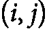
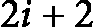
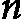

# 第十七章：<st c="0">13</st>

# <st c="3">非线性数据结构</st>

**<st c="30">非线性数据结构</st>** <st c="57">构成</st> <st c="63">一个关键的数据结构类别，广泛应用于设计高效算法。</st> <st c="161">与线性数据结构（如数组和链表）不同，非线性结构允许数据元素以更复杂、层次化的方式存储和访问。</st> <st c="333">这些结构使得高效处理关系、依赖性和层次数据成为可能，因而在解决各种计算问题时至关重要。</st> <st c="481">计算问题。</st>

<st c="504">在本章中，我们首先探索定义非线性数据结构的一般属性和特征。</st> <st c="627">接着，我们讨论两大类：图和树。</st> **<st c="690">图</st>** <st c="696">是</st> <st c="701">用于模拟对象之间关系的多功能结构，而</st> **<st c="773">树</st>** <st c="778">则表示</st> <st c="788">层次关系，以更结构化的形式展现。</st> <st c="843">最后，我们</st> <st c="854">研究一种特殊的二叉树，称为</st> **<st c="904">堆</st>**<st c="909">，它在实现高效算法（如堆排序）中至关重要。</st> <st c="987">学习非线性数据结构对于算法设计至关重要，因为它们在许多算法中扮演着关键角色，包括排序和搜索算法。</st> <st c="1151">此外，图、树以及其他形式的非线性数据结构在人工智能、机器学习和优化等先进领域得到广泛应用，这些领域对高效的数据管理和处理要求极高。</st> <st c="1361">在这些领域中，数据管理和处理的效率至关重要。</st>

<st c="1374">本章涵盖以下主题：</st>

+   <st c="1416">非线性</st> <st c="1444">数据结构简介</st>

+   <st c="1459">图</st>

+   <st c="1466">树</st>

+   <st c="1472">堆</st>

# <st c="1478">非线性数据结构简介</st>

<st c="1521">在</st> *<st c="1525">第十一章</st>*<st c="1535">中，我们</st> <st c="1539">介绍了</st> **<st c="1566">抽象数据类型</st>** <st c="1585">(</st>**<st c="1587">ADTs</st>**<st c="1591">)，并将其分为两大类：线性和非线性。</st> <st c="1606">随后，我们在</st> *<st c="1735">第十二章</st>*<st c="1745">中深入讨论了线性数据结构，分析了它们与我们核心目标——设计和分析高效算法——之间的关系。</st> <st c="1847">虽然我们触及了线性数据结构的许多关键方面，但值得注意的是，这一领域非常广泛，完全可以单独进行更深入的探讨。</st> <st c="2023">对于那些有兴趣深入探索数据结构的人，我们在</st> *<st c="2133">第十一章</st>* <st c="2144">和</st> *<st c="2149">第十二章</st>*<st c="2151">的末尾已列出了相关参考资料。</st>

<st c="2152">在本章中，我们的重点转向非线性数据结构。</st> <st c="2218">与前一章类似，我们将从它与高效算法设计的关系出发，来探讨这一话题。</st> <st c="2338">我们的目标不仅仅是介绍各种非线性数据结构，更是要突出它们在提高算法性能方面的作用和应用。</st> <st c="2495">。</st>

<st c="2509">让我们从简要讨论非线性数据结构的定义、其主要特征以及一些常用类型开始。</st>

<st c="2653">与线性数据结构不同，线性数据结构中的元素按顺序排列（例如，数组、链表），非线性数据结构以层级或互联的方式组织数据。</st> <st c="2848">在非线性结构中，每个元素可能与多个其他元素相连接，形成复杂的关系，从而在</st> <st c="3009">某些操作中实现更高效的数据处理。</st>

<st c="3028">以下是非线性</st> <st c="3051">数据结构的主要特点：</st>

+   **<st c="3094">层级关系</st>**<st c="3121">：元素的结构呈现出反映层次关系的方式，这意味着</st> <st c="3192">某些元素可能作为</st> **<st c="3217">父元素</st>** <st c="3224">而其他元素则是</st> **<st c="3242">子元素</st>**<st c="3250">。这种情况在像</st> **<st c="3301">树形结构</st>** <st c="3306">和</st> **<st c="3311">图形</st>**<st c="3317">等结构中尤为明显。</st>

+   **<st c="3318">复杂的遍历模式</st>**<st c="3345">：与线性结构不同，线性结构的遍历相对</st> <st c="3403">简单，遍历非线性数据结构需要更复杂的技术，这些技术通常是特定于所使用的结构的。</st>

+   **<st c="3546">变量访问时间</st>**<st c="3567">：搜索、插入或删除元素所需的时间可以根据结构和实现方式的不同而大相径庭。</st> <st c="3579">在许多情况下，非线性数据结构相比</st> <st c="3701">于其</st> <st c="3788">线性结构，能够实现更高效的操作。</st>

<st c="3817">非线性数据结构由</st> <st c="3848">若干关键元素组成，这些元素定义了其结构和功能。</st> <st c="3929">最重要的组成部分包括节点、边、父节点、子节点、根节点、叶子节点和子树。</st> <st c="4029">让我们详细了解这些组成部分：</st>

+   **<st c="4073">节点</st>**<st c="4079">：节点或顶点是大多数非线性数据结构的基本构建块。</st> <st c="4084">每个节点通常包含数据，并且根据结构的类型，可能还会与其他顶点连接。</st> <st c="4169">例如，在树结构中，顶点表示层级中的独立元素。</st> <st c="4288">例如，在社交网络图中，每个节点代表一个用户，节点中存储的数据可能是该用户的</st> <st c="4372">个人资料信息。</st>

+   **<st c="4513">边</st>**<st c="4519">：边或箭头是连接两个节点的链接。</st> <st c="4525">在非线性结构中，边在定义节点之间的关系中起着至关重要的作用。</st> <st c="4582">在二叉树中，边定义了父节点与子节点之间的关系。</st> <st c="4680">例如，如果父节点代表经理，那么边将连接到表示其员工的子节点。</st> <st c="4763">在图中，边表示两个实体之间的关系。</st> <st c="4886">例如，在交通网络中，一条边可能表示两座城市之间的直飞航班。</st> <st c="4954">在运输网络中，一条边可能代表</st> <st c="5045">两座城市之间的航班。</st>

+   **<st c="5056">父母和子女</st>**<st c="5077">：在树等层级非线性数据结构中，节点按层级组织，父节点直接连接到其下方的子节点。</st> <st c="5242">父子关系是树结构的基本概念：</st>

    +   **<st c="5306">父节点</st>**<st c="5313">：一个具有一个或多个直接</st> <st c="5318">子节点的节点</st>

    +   **<st c="5375">子节点</st>**<st c="5381">：一个直接连接到其上方节点的节点（</st><st c="5444">即父节点）</st>

    <st c="5456">例如，在企业层级树中，经理是父节点，子下属是</st> <st c="5560">子节点。</st>

+   **<st c="5572">根</st>**<st c="5577">：根是</st> <st c="5591">树结构中最顶部的节点，作为遍历树的起点。</st> <st c="5685">一棵树只能有一个根，所有其他节点都是该根的后代。</st> <st c="5766">如果一个节点没有父节点，它被认为是根。</st> <st c="5818">在文件系统中，根目录是最顶层的文件夹，所有其他目录或文件都从</st> <st c="5923">它那里分支出来。</st>

+   **<st c="5931">叶子</st>**<st c="5936">：叶子是没有子节点的节点。</st> <st c="5941">叶子表示树结构的端点，在这些地方不会再发生分支。</st> <st c="5978">在许多算法中，叶子非常关键，因为它们通常标志着遍历</st> <st c="6065">或搜索的完成点。</st> <st c="6156">。</st>

+   **<st c="6168">子树</st>**<st c="6176">：子树是树的一部分，包括一个节点及其所有子孙节点。</st> <st c="6180">子树使得树可以递归处理，其中每个节点及其子节点可以被视为一个独立的树。</st> <st c="6266">在决策树中，每个节点及其分支构成一个子树，代表一部分</st> <st c="6393">可能的决策。</st> <st c="6481">。</st>

<st c="6500">非线性数据结构有多种类型，每种类型都适用于不同的算法问题。</st> <st c="6612">最常见的非线性数据结构包括图、树和堆。</st> <st c="6689">在接下来的章节中，我们将详细探讨这三种基本的非线性数据结构。</st> <st c="6794">每种结构都有其独特的特点和应用，理解它们对于设计高效的算法至关重要。</st> <st c="6932">我们将探讨它们的属性、实现方式以及它们在解决各种</st> <st c="7035">计算问题中的作用。</st>

# <st c="7058">图</st>

**<st c="7065">图</st>** <st c="7072">是</st> <st c="7076">最具多功能性且广泛使用的非线性数据结构之一。</st> <st c="7147">它们用于表示实体之间的关系，其中实体表示为节点（也称为</st> **<st c="7259">顶点</st>**<st c="7267">），</st> <st c="7273">关系则表示为边。</st> <st c="7298">图可以建模各种现实世界的问题，从社交网络到交通系统和</st> <st c="7403">通信协议。</st>

<st c="7427">图有多种类型，每种类型具有特定的属性，使其适合不同的任务。</st> <st c="7533">以下是最常见的图类型：</st> <st c="7564">。</st>

+   **<st c="7574">无向图</st>**<st c="7592">：在</st> <st c="7598">无向图中，边没有方向。</st> <st c="7642">两个节点之间的关系是双向的（参见</st> *<st c="7699">图 13</st>**<st c="7708">.1</st>*<st c="7710">）。</st> <st c="7714">如果节点 A 和节点 B 之间有一条边，你可以从 A 遍历到 B，也可以从 B 遍历到 A，且没有任何限制。</st> <st c="7831">无向图的一个例子是 Facebook 好友的社交网络，其中的连接是相互的。</st> <st c="7938">这意味着如果 A 是 B 的朋友，那么 B 也是 A 的朋友，体现了关系的双向性质。</st>


<st c="8062">图 13.1：无向图</st>

+   **<st c="8094">有向图（有向图）</st>**<st c="8121">：在有向图中，边具有方向。</st> <st c="8161">节点之间的关系是单向的，这意味着</st> <st c="8211">如果存在从节点 A 指向节点 B 的有向边，你只能从 A 遍历到 B，而不能反过来。例如，网站上的页面有指向其他页面的链接，形成了一个有向图。</st> *<st c="8419">图 13</st>**<st c="8428">.2</st>* <st c="8430">展示了有向图的一个例子。</st> <st c="8461">如图所示，图形不必是</st> <st c="8502">完全连接的。</st>


<st c="8522">图 13.2：有向图</st>

+   **<st c="8544">带权图</st>**<st c="8560">：在带权图中，每条边都被赋予一个数值或</st> **<st c="8627">权重</st>**<st c="8633">。这个权重通常表示与节点之间连接相关的成本、距离或时间。</st> <st c="8736">带权图的一个例子是道路网络，其中每条边的权重代表城市之间的</st> <st c="8828">距离或旅行时间。</st> <st c="8852">图 13.3 描绘了一个带权图，其中权重被分配给了</st> <st c="8940">各个边。</st>


<st c="8952">图 13.3：带权图</st>

+   **<st c="8981">无权图</st>**<st c="8999">：在无权图中，所有边具有相同的重要性，这意味着</st> <st c="9067">在节点之间的旅行没有特定的成本或距离。</st> <st c="9112">在</st> *<st c="9156">图 13</st>**<st c="9165">.1</st>*<st c="9167">中，图是无权图。</st>

+   **<st c="9193">有向图与无向图</st>**<st c="9219">：有向图包含至少一个循环，即</st> <st c="9273">你可以从一个节点出发，遍历</st> <st c="9310">边，最后回到</st> <st c="9335">同一个节点。</st> <st c="9346">无向图没有这样的循环，因此在任务调度等应用中至关重要。</st> <st c="9447">图中的</st> *<st c="9460">图 13.1</st>**<st c="9469">包含循环。</st>

+   **<st c="9483">符号图</st>**<st c="9497">：在符号图中，边上标有</st> <st c="9540">正号或负号，通常代表有利或不利的关系。</st> <st c="9639">这种图在关系可以有极性时非常有用，例如在社交网络中，边可以表示</st> <st c="9757">友谊（正向）或冲突（负向）。</st> <st c="9819">其中，正边代表友谊，负边代表竞争关系的社交网络就是符号图的一个例子。</st>

+   **<st c="9952">超图</st>**<st c="9964">：超图通过允许边（称为</st> **<st c="10041">超边</st>**<st c="10051">）一次连接多个节点，从而推广了图的概念。</st> <st c="10096">这种类型的图在表示复杂关系时尤为有用，尤其是当单一连接可能涉及多个实体时。</st> <st c="10235">例如，在研究合作网络中，一个超边可能代表三位或更多研究人员共同撰写的论文，同时连接所有研究人员。</st>


<st c="10406">图 13.4：超图</st>

*<st c="10431">图 13</st>**<st c="10441">.4</st>* <st c="10443">展示了一个超图的示例，包含以下组件：顶点集合为</st> ![<mml:math xmlns:mml="http://www.w3.org/1998/Math/MathML" xmlns:m="http://schemas.openxmlformats.org/officeDocument/2006/math"><mml:mi>V</mml:mi><mml:mo>=</mml:mo><mml:mfenced open="{" close="}" separators="|"><mml:mrow><mml:mi>a</mml:mi><mml:mo>,</mml:mo><mml:mi>b</mml:mi><mml:mo>,</mml:mo><mml:mi>c</mml:mi><mml:mo>,</mml:mo><mml:mi>d</mml:mi><mml:mo>,</mml:mo><mml:mi>e</mml:mi><mml:mo>,</mml:mo><mml:mi>f</mml:mi><mml:mo>,</mml:mo><mml:mi>g</mml:mi><mml:mo>,</mml:mo><mml:mi>h</mml:mi><mml:mo>,</mml:mo><mml:mi>k</mml:mi></mml:mrow></mml:mfenced></mml:math>](img/1836.png)<st c="10537"><st c="10562">，超边集合为</st> ![<mml:math xmlns:mml="http://www.w3.org/1998/Math/MathML" xmlns:m="http://schemas.openxmlformats.org/officeDocument/2006/math"><mml:mi>E</mml:mi><mml:mo>=</mml:mo><mml:mfenced open="{" close="}" separators="|"><mml:mrow><mml:msub><mml:mrow><mml:mi>e</mml:mi></mml:mrow><mml:mrow><mml:mn>1</mml:mn></mml:mrow></mml:msub><mml:mo>,</mml:mo><mml:msub><mml:mrow><mml:mi>e</mml:mi></mml:mrow><mml:mrow><mml:mn>2</mml:mn></mml:mrow></mml:msub><mml:mo>,</mml:mo><mml:msub><mml:mrow><mml:mi>e</mml:mi></mml:mrow><mml:mrow><mml:mn>3</mml:mn></mml:mrow></mml:msub></mml:mrow></mml:mfenced></mml:math>](img/1837.png)<st c="10593"><st c="10605">。每个超边连接多个顶点，如下所示：</st> <st c="10661"><st c="10677">，</st> <st c="10679"><st c="10693">，</st> <st c="10695">以及</st> <st c="10699"><st c="10714">。</st></st></st></st></st></st>

<st c="10715">在接下来的</st> <st c="10733">章节中，我们将探讨如何表示算法中最常用的几种图，并讨论与每种表示方法相关的复杂性。</st> <st c="10877">。</st>

## <st c="10899">图的表示</st>

<st c="10921">图可以以</st> <st c="10936">多种方式表示，每种方法都适用于特定的使用场景，取决于图的结构和所需的操作类型。</st> <st c="11087">在接下来的小节中，我们将探讨三种常见的图表示方法及其关键特性。</st> <st c="11205">在评估每种方法时，我们将重点关注它们性能的三个关键方面：</st>

+   **<st c="11296">空间复杂度</st>**<st c="11313">：使用所选表示方法存储图所需的内存量</st> <st c="11373">。</st>

+   **<st c="11394">访问节点所有邻居的时间复杂度</st>**<st c="11452">：检索所有直接连接（相邻）到某一给定节点的节点的效率</st> <st c="11538">。</st>

+   **<st c="11548">检查边是否存在的时间复杂度</st>**<st c="11596">：确定两个特定节点之间是否存在边所需的时间</st> <st c="11665">。</st>

<st c="11679">通过分析这些复杂性，我们可以更好地理解每种图形表示的优缺点，以及它们如何应用于不同的</st> <st c="11829">算法任务。</st>

### <st c="11847">邻接矩阵</st>

<st c="11864">一个</st> **<st c="11868">邻接矩阵</st>** <st c="11884">用</st> <st c="11895">图形</st> <st c="11904">表示为</st>  <st c="11912"><st c="11914">矩阵，其中</st>  <st c="11928"><st c="11929">是图中的节点或顶点数。</st> <st c="11979">矩阵中的每个单元格在位置</st>  <st c="12015"><st c="12016">指示节点</st>  <st c="12090"><st c="12091">和节点</st> <st c="12101"><st c="12102">之间边的存在（可能带有权重）。</st> 在无向图中，邻接矩阵 <st c="12149"> <st c="12150">对称，这意味着</st> <st c="12178"><st c="12179">’，其中</st> <st c="12188">*<st c="12189">’</st>* <st c="12190">表示矩阵</st> <st c="12226"><st c="12227">的转置。这种对称性是因为无向图中的边没有方向，所以</st> <st c="12313">如果节点</st>  <st c="12346"><st c="12347">和节点</st> <st c="12357"><st c="12358">之间有边，关系是互相的。</st> <st c="12388">因此，</st>  <st c="12404"><st c="12406">和</st>  <st c="12410"><st c="12411">将具有相同的值。</st></st></st></st></st></st></st></st></st></st></st></st></st></st></st></st></st></st></st></st></st></st></st></st></st></st></st></st></st></st></st></st></st></st></st></st></st></st></st></st></st></st></st></st></st></st></st></st></st></st></st></st></st></st></st></st></st></st></st></st></st></st></st></st></st></st></st></st></st></st></st></st></st></st></st></st></st></st></st></st></st></st></st></st></st></st></st></st></st

<st c="12437">对于</st> <st c="12442">无权重、无符号图，邻接矩阵是一个二进制矩阵，其中每个元素的值为 0 或 1。</st> <st c="12547">在</st>  <st c="12563"><st c="12570">的值为 1 表示顶点</st>  <st c="12619"><st c="12620">和</st> <st c="12625"><st c="12626">之间有一条边，值为 0 表示它们之间没有边。</st></st></st></st>

**<st c="12670">示例 13.1</st>**<st c="12683">：</st>

<st c="12685">这里是一个表示带权有向图的矩阵</st> <st c="12725">： </st>

<st c="12738">A --></st> <st c="12745">B (2)</st>

<st c="12750">B --></st> <st c="12757">C (3)</st>

<st c="12762">A --></st> <st c="12769">C (4)</st>

<st c="12774">表示这个简单图的邻接矩阵是一个</st>  <st c="12832"><st c="12838">矩阵</st> <st c="12845">如下所示：</st></st>


![<mml:math xmlns:mml="http://www.w3.org/1998/Math/MathML" xmlns:m="http://schemas.openxmlformats.org/officeDocument/2006/math" display="block"><mml:mtable><mml:mtr><mml:mtd><mml:mi>A</mml:mi></mml:mtd></mml:mtr><mml:mtr><mml:mtd><mml:mi>B</mml:mi></mml:mtd></mml:mtr><mml:mtr><mml:mtd><mml:mi>C</mml:mi></mml:mtd></mml:mtr></mml:mtable><mml:mfenced open="[" close="]" separators="|"><mml:mrow><mml:mtable><mml:mtr><mml:mtd><mml:mn>0</mml:mn></mml:mtd><mml:mtd><mml:mn>2</mml:mn></mml:mtd><mml:mtd><mml:mn>4</mml:mn></mml:mtd></mml:mtr><mml:mtr><mml:mtd><mml:mn>0</mml:mn></mml:mtd><mml:mtd><mml:mn>0</mml:mn></mml:mtd><mml:mtd><mml:mn>3</mml:mn></mml:mtd></mml:mtr><mml:mtr><mml:mtd><mml:mn>0</mml:mn></mml:mtd><mml:mtd><mml:mn>0</mml:mn></mml:mtd><mml:mtd><mml:mn>0</mml:mn></mml:mtd></mml:mtr></mml:mtable></mml:mrow></mml:mfenced></mml:math>](img/1859.png)

<st c="12859">显然，该表示的空间复杂度是</st> <st c="12925"><st c="12926">。无论边的数量如何，邻接矩阵都需要与顶点数的平方成比例的空间，因为它必须考虑所有顶点对之间的每条可能边。</st> <st c="13131">这对于大型图可能效率低下，特别是如果图是稀疏的（即边的数量相对于可能边的数量较少）。</st></st>

在图中，访问节点的所有邻居是图中的一个操作。<st c="13366">使用邻接矩阵表示，时间复杂度是</st> <st c="13428"><st c="13429">。要找到给定节点的所有邻居，需要检查矩阵的相应行（或列）中的所有条目。</st> <st c="13553">对于节点</st> <st c="13564"><st c="13565">，您扫描</st>  <st c="13580"><st c="13584">行以检查哪些顶点从</st> <st c="13636"><st c="13637">具有直接边缘，这让我们想起了线性搜索算法，其中我们要报告所有非零条目。</st> <st c="13734">这一操作需要检查</st>  <st c="13768"><st c="13769">条目，导致时间复杂度为</st> <st c="13813"><st c="13814">，无论节点实际有多少邻居。</st> <st c="13875">相比之下，检查邻接矩阵表示中是否存在边的时间复杂度为</st> <st c="13984">O</st><st c="13985">(</st><st c="13986">1</st><st c="13987">)</st><st c="13988">，因为我们可以直接在常数时间内访问任何边。</st> <st c="14043">由于邻接矩阵</st> <st c="14069">是一个二维数组，检查节点</st>  <st c="14143"><st c="14144">和</st> <st c="14149">节点</st>  <st c="14154"><st c="14155">之间是否存在边是对位置</st> <st c="14209"><st c="14210">的直接访问操作。只需检查</st>  <st c="14246"><st c="14247">处的值是否非零（对于加权图）或</st>  <st c="14290"><st c="14291">（对于</st> <st c="14297">无权图）。</st></st></st></st></st></st></st></st></st></st></st></st></st></st></st></st></st></st></st></st></st></st></st></st></st></st></st></st></st></st></st></st></st></st></st></st></st></st></st></st></st></st></st></st></st></st></st></st></st></st></st></st></st></st></st></st></st></st></st></st></st></st></st></st></st></st></st></st></st></st></st></st></st></st></st></st></st></st></st></st></st></st></st></st></st></st></st></st></st></st></st></st></st></st>

<st c="14316">我们什么时候应该使用邻接矩阵？</st>

<st c="14356">当图是稠密图（即边的数量接近</st> <st c="14446"><st c="14447">)，此时高空间需求变得不那么重要。</st> <st c="14520">此外，如果我们的算法需要常量时间的边存在性检查，邻接矩阵则具有明显的优势。</st> <st c="14641">最后，邻接矩阵实现简单，对于某些注重易用性的算法来说，它是一个实用的选择。</st>

### <st c="14778">邻接表</st>

<st c="14793">在</st> <st c="14797">一个</st> **<st c="14800">邻接表</st>**<st c="14814">中，每个节点存储其邻居节点的列表</st> <st c="14859">（或与之相连的节点）。</st> <st c="14896">这是一种更节省空间的表示方法，尤其适用于稀疏图。</st> <st c="14973">示例 13.1 的邻接表</st> *<st c="14996">如以下所示</st>* <st c="15008">是</st> <st c="15012">如下：</st>

<st c="15023">A:</st> <st c="15027">B(2), C(4)</st>

<st c="15037">B: C(3)</st>

<st c="15045">C: -</st>

<st c="15050">邻接表表示使用</st>  <st c="15090"><st c="15099">空间，其中</st>  <st c="15112"><st c="15113">是边的数量。</st> <st c="15138">这种表示方式通常对于</st> <st c="15175">稀疏图更加高效。</st></st></st>

访问一个节点的邻居（即相邻的顶点）需要耗费<st c="15189">时间</st> <st c="15256"><st c="15257">，其中</st>  <st c="15265"><st c="15266">是该节点的度（即与该节点相连的边的数量）。</st> <st c="15338">在最坏的情况下，这个时间复杂度可能是</st> <st c="15371"><st c="15374">，但是对于大多数实际应用来说，它要小得多。</st> <st c="15432">在上述邻接表中，冒号后列出的节点表示该节点左侧的邻居或相邻节点。</st></st></st></st>

<st c="15571">要检查</st> <st c="15581">两个特定顶点之间是否存在一条边，你需要遍历相邻顶点的列表。</st> <st c="15689">这需要</st>  <st c="15700"><st c="15701">的时间，因为我们可能需要扫描源节点的所有邻居。</st> <st c="15776">在最坏的情况下，这需要</st> <st c="15803"><st c="15806">，但对于稀疏图来说，通常要小得多。</st></st></st>

<st c="15854">何时使用邻接表</st>

<st c="15884">邻接表在图较为稀疏时最为高效——也就是说，当边的数量远小于</st> <st c="16002"><st c="16003">。由于空间复杂度是</st> <st c="16035"><st c="16045">，因此对于边较少的图，邻接表更加节省内存。</st> <st c="16104">此外，如果我们的算法经常需要访问某个节点的所有邻居，邻接表提供高效的</st>  <st c="16225"><st c="16226">访问。</st> <st c="16235">它对于动态图也非常有益，在这种图中，节点和边经常被添加或删除，因为更新邻接表直接且在</st> <st c="16405">内存方面的开销较小。</st></st></st></st>

### <st c="16415">边列表</st>

<st c="16425">一个</st> **<st c="16429">边列表</st>** <st c="16438">明确地</st> <st c="16449">存储图中的所有边</st> <st c="16482">以及它们的权重（如果有的话）。</st> <st c="16517">当图较为稀疏并且你主要需要处理边时，边列表非常有用。</st> <st c="16604">该边列表在</st> *<st c="16625">示例 13.1</st>* <st c="16637">中的图是</st> <st c="16647">如下：</st>

<st c="16658">(A,</st> <st c="16663">B, 2)</st>

<st c="16668">(A,</st> <st c="16673">C, 4)</st>

<st c="16678">(B,</st> <st c="16683">C, 3)</st>

边列表表示法使用 <st c="16723"><st c="16724">空间。</st> <st c="16732">对于非常稀疏的图，这种表示方式非常高效。</st> <st c="16774">要访问节点的所有邻居，边列表并没有直接存储它们，因此查找所有邻居需要扫描整个边列表，最坏情况下的时间复杂度为</st> <st c="16960"><st c="16961">。</st> 同样，检查两个顶点之间是否存在边也需要扫描整个边列表，导致时间复杂度为</st> <st c="17105"><st c="17106">。</st></st></st></st>

当使用边列表

边列表是<st c="17132">非常适合稀疏图，在这种图中，我们主要需要处理边本身，而不是频繁访问邻居或检查边的存在。</st> 它使用 <st c="17315"><st c="17320">空间，使其在边较少的图中具有很高的内存效率。</st> <st c="17388">然而，它的主要限制在于，它对于某些操作并不高效，例如查找节点的所有邻居或检查特定边是否存在，这两者都需要扫描整个列表。</st> <st c="17603">因此，边列表最适合用于那些直接处理边的算法，例如一些以边为中心的算法，如 Kruskal 最小生成树算法。</st>

## 图遍历

**<st c="17819">遍历</st>** <st c="17829">是图算法中的一种基础操作，其目标是按照特定顺序访问所有节点。</st> <st c="17939">两种最广泛使用的图遍历技术是</st> **<st c="17995">深度优先搜索</st>** <st c="18013">（</st>**<st c="18015">DFS</st>**<st c="18018">）和</st> **<st c="18025">广度优先搜索</st>** <st c="18045">（</st>**<st c="18047">BFS</st>**<st c="18050">）。</st> <st c="18054">在接下来的章节中，我们将详细探讨这两种方法</st> <st c="18074">，重点介绍它们的过程、应用场景</st> <st c="18120">和复杂度。</st>

### <st c="18190">DFS 图遍历</st>

<st c="18210">DFS 是一种</st> <st c="18220">图遍历技术，它会在回溯之前尽可能深入地探索每一条分支或路径。</st> <st c="18277">它通常通过递归或栈实现，特别适合用于探索深层结构或在图中发现特定路径。</st> <st c="18462">在图中运作良好。</st>

<st c="18470">DFS 的核心思想是从一个任意节点开始（通常称为</st> *<st c="18544">根节点</st>*<st c="18548">），然后尽可能深入地探索图的每一条分支，再转向下一个分支。</st> <st c="18647">DFS 按照以下</st> <st c="18665">基本步骤进行：</st>

1.  <st c="18677">访问起始节点。</st>

1.  <st c="18702">对于当前节点的每个未访问的邻居，执行一次对该邻居的 DFS。</st>

1.  <st c="18783">重复此过程，直到所有从起始节点可达的节点都被访问。</st>

<st c="18865">让我们</st> <st c="18872">考虑</st> <st c="18880">图中的</st> *<st c="18894">图 13</st>**<st c="18903">.5</st>* <st c="18905">，它包含六个节点。</st>


<st c="18923">图 13.5：一个示例图</st>

<st c="18952">从</st> *<st c="18973">节点 A</st>*<st c="18979">开始进行 DFS，遍历顺序如下：A --> B --> D --> E --> F --> C。</st> <st c="19049">这个遍历完全探索了一条路径（分支），然后才转向下一个。</st>

<st c="19131">这里是一个使用递归实现的 Python 深度优先搜索（DFS）。</st> <st c="19188">首先，我们定义一个</st> <st c="19207">简单的图：</st>

```py
 # You will need first: pip install networkx matplotlib
import networkx as nx
import matplotlib.pyplot as plt
# Define the graph as an adjacency list
graph = {
    'A': ['B', 'C'],
    'B': ['D', 'E'],
    'C': ['B' , 'F'],
    'D': ['E'],
    'E': ['F'],
    'F': ['A']
}
```

<st c="19468">下面的</st> <st c="19473">代码可视化了</st> <st c="19483">示例图：</st>

```py
 # Visualize the graph
visualize_graph(G)
# Create a directed graph using NetworkX
G = nx.DiGraph()
# Add edges to the graph
for node, neighbors in graph.items():
    for neighbor in neighbors:
        G.add_edge(node, neighbor)
# Visualize the graph using NetworkX and Matplotlib
def visualize_graph(G):
    pos = nx.spring_layout(G)  # Positions for all nodes
    nx.draw(G, pos, with_labels=True, node_color='lightblue', node_size=2000, font_size=10, font_weight='bold')
    plt.title("Graph Visualization")
    plt.show()
```

<st c="20013">现在，我们</st> <st c="20022">实现 DFS</st> <st c="20040">遍历算法：</st>

```py
 # DFS function (optional, same as before)
visited = set()
def dfs(node):
    if node not in visited:
        print(node)
        visited.add(node)
        for neighbor in graph[node]:
            dfs(neighbor)
# Start DFS at node 'A'
dfs('A')
```

<st c="20263">让我们来看一下</st> <st c="20277">代码：</st>

+   <st c="20287">该图表示为一个</st> <st c="20319">邻接表</st>

+   <st c="20333">我们使用一个</st> **<st c="20343">访问</st>** <st c="20350">集合来确保节点不被重复访问</st> <st c="20380">。</st>

+   <st c="20393">**<st c="20398">dfs</st>**</st> <st c="20401">函数打印当前节点，标记其为已访问，并递归地对所有</st> <st c="20493">未访问的邻居节点</st> <st c="20512">进行调用。</st>

<st c="20553">对于给定的图，输出将如下所示：</st>

```py
<st c="20564" class="calibre11">A, B, D, E, F, C</st>
```

<st c="20581">与广度优先搜索（BFS）相比，深度优先搜索（DFS）在内存使用上更为高效，特别是在处理深度图时。</st> <st c="20657">这是因为 DFS 只需要跟踪当前路径和回溯信息，而 BFS 必须在每一层存储所有节点。</st> <st c="20811">DFS 在路径寻找方面也非常有用，尤其是在需要探索所有可能路径的场景下，比如迷宫求解算法。</st> <st c="20954">此外，DFS</st> <st c="20975">经常用于拓扑排序</st> **<st c="21018">有向无环图</st>** <st c="21041">(</st>**<st c="21043">DAGs</st>**<st c="21047">)，这一技术在任务调度和</st> <st c="21094">解决依赖关系时非常有用。</st>

<st c="21117">然而，DFS 也有一些</st> <st c="21140">局限性。</st> <st c="21153">一个主要的缺点是，DFS 在无权图中可能无法找到最短路径，因为它可能在找到解决方案之前就探索了一个较深的路径，而这条路径可能不是最优的。</st> <st c="21329">此外，在非常大或无限的图中，DFS 可能会陷入探索长路径或循环的困境，除非采取如循环检测等预防措施。</st> <st c="21485">在诸如 Python 这样的语言中，递归深度有限，如果图特别深，使用递归的 DFS 可能会导致栈溢出错误。</st> <st c="21644">为了避免这种情况，可以通过使用显式栈来迭代实现 DFS，而不依赖</st> <st c="21737">递归。</st>

<st c="21750">DFS 的</st> <st c="21754">时间复杂度是</st> <st c="21781"><st c="21791">，其中 V。</st> <st c="21802">这是因为 DFS 会访问图中的每个节点和每条边一次。</st> <st c="21874">在一个稀疏图中，其中</st> <st c="21898"><st c="21900">，时间复杂度接近</st> <st c="21934"><st c="21935">。另一方面，在一个稠密图中，其中</st> <st c="21979"><st c="21980">，时间复杂度</st> <st c="22002">接近</st> <st c="22013"><st c="22014">。</st></st></st></st></st></st>

<st c="22015">DFS 的空间复杂度</st> <st c="22037">是</st>  <st c="22047"><st c="22050">在最坏的情况下，由于递归栈的深度或迭代版本中使用的显式栈。</st> <st c="22161">在最坏的情况下，如果图是一个长的线性链，栈可能会保存所有</st>  <st c="22252"><st c="22253">节点。</st></st></st>

<st c="22259">DFS 有两种常见的变种：</st> **<st c="22298">先序 DFS</st>**<st c="22311">，即在探索邻居之前先访问节点（如前面的示例所示），以及</st> **<st c="22402">后序 DFS</st>**<st c="22416">，即只在访问完所有邻居后才访问节点。</st> <st c="22477">在</st> <st c="22484">同一图中（</st>*<st c="22496">图 13</st>**<st c="22506">.5</st>*<st c="22508">），如果我们执行后序 DFS，遍历的顺序将是：D --> F --> E --> B --> C --> A。</st> <st c="22627">这些变种在不同的场景中很有用，比如树的遍历和需要特定顺序处理节点的算法。</st>

<st c="22766">DFS 在算法设计中有很多应用，包括在 AI 搜索算法中的使用。</st> <st c="22861">例如，DFS 用于需要探索节点之间所有可能路径的问题，如解决谜题或在迷宫中寻找路径。</st> <st c="23016">它对于检测有向图和无向图中的环路非常有效，帮助识别图结构中的循环。</st> <st c="23136">此外，DFS 还可以用于查找图中的所有连通分量，特别是在无向图中。</st> <st c="23158">在有向无环图（DAG）中，DFS 在拓扑排序中起着关键作用，这对于调度和依赖解析等任务至关重要。</st> <st c="23401">这些多样化的应用突显了 DFS 在各种</st> <st c="23471">计算问题中的重要性。</st>

<st c="23494">总之，DFS 是一种强大且高效的图遍历技术，特别适用于路径寻找和解决需要探索所有可能性的问题。</st> <st c="23663">尽管它不能保证找到最短路径，但在内存效率至关重要或处理深度结构时，它表现得非常出色。</st> <st c="23693">其主要的权衡是，对于大型图可能需要较长的搜索时间，并且在深度递归时可能会发生栈溢出。</st> <st c="23809">在下一节中，我们将探讨广度优先搜索（BFS）</st> <st c="23978">遍历方法。</st>

### <st c="23997">广度优先搜索（BFS）图遍历</st>

**<st c="24017">广度优先搜索（BFS）</st>** <st c="24021">是另一种</st> <st c="24032">图遍历算法，它从给定的源节点开始，逐层探索节点。</st> <st c="24079">与深度优先搜索（DFS）不同，DFS 会尽可能深入一个分支，直到回溯，而 BFS 会先探索一个节点的所有邻居，然后再移动到下一级的邻居。</st> <st c="24296">这使得 BFS 在寻找</st> <st c="24367">无权图中的最短路径时特别有效。</st>

<st c="24385">BFS 算法从根节点（或任意起始节点）开始，首先探索所有邻居节点。</st> <st c="24494">在访问完当前层级的所有邻居后，算法会继续到下一层，访问那些邻居的邻居，以此类推。</st> <st c="24630">遍历会持续进行，直到所有从起始节点可达的节点都被访问过。</st>

<st c="24721">BFS 的核心依赖于使用队列数据结构，这确保了节点按照正确的顺序被探索（</st>**<st c="24838">先进先出</st>** <st c="24857">(</st>**<st c="24859">FIFO</st>**<st c="24863">））。</st> <st c="24868">让我们考虑</st> *<st c="24896">图 13</st>**<st c="24905">.6</st>* <st c="24907">中包含六个节点的图。</st> <st c="24924">从</st> *<st c="24944">节点 A</st>*<st c="24950">开始 BFS，遍历顺序将是 A --> B --> C --> D --> E --> F --> C。</st> <st c="25019">这种遍历方式会先完全探索一条路径（分支），然后再移动到下一条。</st>


<st c="25103">图 13.6：BFS 遍历示例图</st>

<st c="25150">这是一个</st> <st c="25161">Python</st> <st c="25167">实现 BFS 的代码，使用了</st> <st c="25196">队列：</st>

```py
 from collections import deque
# Graph represented as an adjacency list
graph = {
    'A': ['B', 'C'],
    'B': ['D', 'E'],
    'C': ['F'],
    'D': ['A'],
    'E': ['B','D'],
    'F': ['E','D']
}
# BFS function
def bfs(start_node):
    visited = set()           # Set to track visited nodes
    queue = deque([start_node])  # Initialize the queue with the starting node
    while queue:
        node = queue.popleft()  # Dequeue a node
        if node not in visited:
            print(node)
            visited.add(node)  # Mark it as visited
            queue.extend(graph[node])  # Enqueue all unvisited neighbors
# Start BFS at node 'A'
bfs('A')
```

<st c="25752">这就是</st> <st c="25761">代码的工作原理。</st> <st c="25781">首先，我们使用邻接表表示图。</st> <st c="25836">接下来，我们实现队列数据结构，这是 BFS 算法的核心。</st> <st c="25923">最后，我们实现 BFS 遍历</st> <st c="25963">算法本身：</st>

+   **<st c="25980">图的表示</st>**<st c="26001">：图使用</st> <st c="26035">邻接表</st> <st c="26049">来表示。</st>

+   **<st c="26049">队列</st>**<st c="26055">：</st> **<st c="26058">deque</st>** <st c="26063">用于高效地处理队列操作（入队和</st> <st c="26127">出队节点）</st>

+   **<st c="26144">bfs</st>**<st c="26148">：节点按照出队顺序被处理，它们的邻居被加入队列以供</st> <st c="26250">进一步探索</st>

<st c="26269">对于给定的图，输出将会是：</st> <st c="26310">如下所示：</st>

```py
 A, B, C, D, E, F
```

<st c="26338">BFS 相对于 DFS 有几个优点</st> <st c="26368">。 </st> <st c="26379">在无权图中，BFS 保证了第一次到达一个节点时，是通过从源节点出发的最短路径，这使得它在路径查找问题中非常理想。</st> <st c="26549">此外，BFS 会在转向下一层之前，先探索当前层的所有节点，这在需要首先访问所有直接邻居的情况下尤为有用，例如在交通系统中寻找最短路径。</st> <st c="26789">另外，BFS 在识别无向图中所有连通分量方面非常有效，因为它会系统地探索所有</st> <st c="26924">可达的节点。</st>

<st c="26940">然而，BFS</st> <st c="26953">也有其缺点。</st> <st c="26973">它需要将当前层的所有节点存储在内存中，这可能导致显著的内存消耗，尤其是在分支因子较大的图中。</st> <st c="27138">此外，BFS 对于深层结构的图可能效率较低，因为它是逐层探索的。</st> <st c="27239">在图的深度较大而宽度不宽的情况下，DFS 可能是一个更高效的替代方案，因为它在探索时更侧重深度而非广度。</st>

<st c="27397">BFS 的时间复杂度是</st> <st c="27428"><st c="27437">，因为在遍历过程中每个顶点和边都只会被处理一次。</st> <st c="27511">相比之下，BFS 的空间复杂度是</st> <st c="27555"><st c="27560">，因为在最坏的情况下，某一层的所有节点可能会同时被存储在队列中。</st> <st c="27664">在分支因子大或层宽较大的图中，这一点尤其重要，因为内存需求可能</st> <st c="27791">会大幅增加。</st></st></st>

<st c="27810">BFS 有两个显著的变种：</st> **<st c="27841">双向 BFS</st>** <st c="27858">和</st> **<st c="27863">多源 BFS</st>**<st c="27879">。双向 BFS 用于</st> <st c="27902">找到两个节点之间的最短路径。</st> <st c="27952">它同时进行两个 BFS 遍历——一个从源节点开始，</st> <st c="28025">一个从目标节点开始——直到两次搜索在中间相遇。</st> <st c="28100">这种方法显著减少了搜索空间，使得在源节点和目标节点相距较远的情况下，比传统 BFS 更快。</st> <st c="28255">多源 BFS 涉及多个起始点。</st> <st c="28307">BFS 从所有源节点同时启动，允许从多个起点同时进行探索。</st> <st c="28427">这种变种在需要从多个位置探索路径的场景中非常有用，例如在图中找到从多个源到目标的最短距离。</st>

<st c="28607">BFS 有着广泛的</st> <st c="28623">应用范围，包括它在人工智能搜索策略中的使用。</st> <st c="28689">其一个关键优势是能够在无权图中找到最短路径。</st> <st c="28777">由于 BFS 会在深入之前先探索同一层级的所有节点，因此它可以保证节点首次被访问时，必定是通过最短路径。</st> <st c="28937">这使得 BFS 非常适合用于路径寻找算法，例如导航系统或解决所有动作成本相等的谜题。</st>

<st c="29064">让我们修改 BFS 算法来找到</st> <st c="29130">两个节点之间的最短路径：</st>

```py
 def bfs_shortest_path(start_node, target_node):
    visited = set()
    queue = deque([[start_node]])  # Queue stores paths
    while queue:
        path = queue.popleft()  # Dequeue the first path
        node = path[-1]  # Get the last node from the path
        if node == target_node:
            return path  # Return the path when target is reached
        if node not in visited:
            visited.add(node)
            for neighbor in graph[node]:
                new_path = list(path)
                new_path.append(neighbor)
                queue.append(new_path)  # Enqueue the new path
    return None  # Return None if there is no path
# Find the shortest path between 'A' and 'F'
print(bfs_shortest_path('A', 'F'))
```

<st c="29734">对于给定的图，</st> <st c="29760">节点</st> `<st c="29782">A</st>` <st c="29783">和</st> `<st c="29788">F</st>` <st c="29789">之间的最短路径</st> <st c="29793">如下所示：</st>

```py
 ['A', 'C', 'F']
```

<st c="29820">另一个</st> <st c="29829">BFS 的重要应用是在无向图中。</st> <st c="29881">BFS 尤其适用于识别从给定起点可达的所有节点。</st> <st c="29982">通过这种方式，BFS 可以高效地检测并标记连通分量，这在网络分析和社交</st> <st c="30106">网络映射中至关重要。</st>

<st c="30122">此外，BFS 广泛用于树的层次遍历。</st> <st c="30192">在这种情况下，BFS 会先访问每个深度级别的所有节点，然后才会继续到下一个深度层级，这使得它在节点的层级或等级很重要时成为理想的算法，例如在组织结构图、文件系统结构或</st> <st c="30419">层次聚类中。</st>

除了这些核心应用，BFS 还广泛应用于人工智能搜索算法中，与 DFS 一起成为两种主要的搜索技术。此外，BFS 还被用于在各种图相关问题中寻找最小生成树和最短路径：

+   **BFS 在人工智能中的应用**：BFS 作为许多人工智能搜索策略的基础，特别是那些需要逐层探索所有可能状态的策略，如游戏树或**谜题求解**。

+   **寻找最小生成树**：在无权图中，BFS 可以作为构建块，用来通过确保所有节点按最短路径顺序从源节点访问来找到最小生成树。

+   **网络广播**：在计算机网络中，BFS 用于模拟广播路由，在这种情况下，信息必须在最短时间内发送到所有节点，这使得它在网络发现协议中至关重要，如**开放最短路径优先**（**OSPF**）。

这些多样化的应用突出展示了 BFS 的多功能性，使其成为算法设计和实践应用中的基本工具，广泛应用于各个领域。

总结来说，BFS 是一种基本的图遍历技术，特别适用于当目标是逐层探索所有节点或在无权图中寻找最短路径时。虽然它在时间复杂度上效率较高，但由于其较高的内存需求，对于具有较大分支因子的图而言，可能会成为一个缺点。BFS 保证的最短路径特性以及其在各种算法任务中的多功能性使其成为许多现实世界应用中的强大工具。

在继续讨论下一个非线性数据结构之前，让我们通过总结图的意义和在算法设计中的应用来结束对图的讨论。图是极其多功能的结构，它使我们能够在网络、社会分析和人工智能等领域建模和解决各种问题。图可以表示实体之间的复杂关系，通过 BFS 和 DFS 等算法，我们可以高效地遍历、搜索和处理图数据。图在路径寻找、网络路由、环检测甚至层级问题解决等关键应用中发挥着核心作用。

它们在算法设计中的重要性不言而喻，因为它们为解决涉及连通性、优化和搜索策略的问题奠定了基础，无论是在理论领域还是实践领域。

# <st c="32827">树</st>

<st c="32833">树</st> **<st c="32836">是一种</st>** <st c="32840">层次化的非线性数据结构，由节点和连接这些节点的边构成。</st> <st c="32929">树在各种应用中被广泛使用，如数据组织、数据库、网络结构等。</st> <st c="33042">树有一个根节点，所有其他节点都通过父子关系连接。</st> <st c="33138">树的结构确保没有循环，每个子节点恰好有</st> <st c="33218">一个父节点。</st>

<st c="33229">在本节中，我们将探索不同类型的树及其特性，以及如何表示树和</st> <st c="33338">讨论</st> <st c="33346">两种重要类型：</st> **<st c="33367">二叉搜索树</st>** <st c="33386">(</st>**<st c="33388">BSTs</st>**<st c="33392">) 和</st> **<st c="33399">红黑树</st>**<st c="33414">。</st>

## <st c="33415">不同类型的树及其特性</st>

<st c="33461">树木有许多类型，每种类型都有适合不同应用的独特特性。</st> <st c="33556">以下是一些最</st> <st c="33582">常见的类型：</st>

+   **<st c="33595">通用树</st>**<st c="33608">：通用树是一种树，其中任何节点可以</st> <st c="33662">拥有任意数量的子节点。</st> <st c="33701">这种树类型可用于表示层次化数据，如文件系统或组织结构图。</st> *<st c="33807">图 13</st>**<st c="33816">.7</st>* <st c="33818">展示了一个通用树的示例。</st>


<st c="33862">图 13.7：一个通用树的示例</st>

+   **<st c="33898">二叉树</st>**<st c="33910">：二叉树是一种每个节点最多有两个子节点的树，子节点分别称为</st> **<st c="34005">左子节点</st>** <st c="34015">和</st> **<st c="34024">右子节点</st>**<st c="34035">。它是计算机科学中最常用的树结构之一。</st> <st c="34110">在</st> *<st c="34113">图 13</st>**<st c="34122">.7</st>*<st c="34124">中，所有以</st> *<st c="34149">节点 1</st>*<st c="34156">、</st> *<st c="34158">节点 5</st>*<st c="34159">、</st> *<st c="34165">节点 6</st>* <st c="34166">为根的子树是二叉树的示例。</st>

+   **<st c="34196">完全二叉树</st>**<st c="34213">：如果每个节点有零个或两个子节点，则称为完全二叉树。</st> <st c="34218">没有节点只有一个子节点。</st> <st c="34273">在</st> *<st c="34329">图 13</st>**<st c="34338">.7</st>*<st c="34340">中，以</st> *<st c="34364">节点 5</st>* <st c="34370">为根的子树是一个完全</st> <st c="34381">二叉树。</st>

+   **<st c="34393">完全二叉树</st>**<st c="34414">：一个</st> <st c="34418">完全二叉树是一个</st> <st c="34445">所有层级都已完全填充，除非是最后一层，该层必须从左到右填充。</st> <st c="34558">一个著名的完全二叉树是堆结构，我们将在本章末尾讨论它。</st> <st c="34651">本章。</st>

+   **<st c="34664">平衡二叉树</st>**<st c="34685">：如果</st> <st c="34689">任何节点的左右子树的高度差不超过一，则该树被认为是平衡的。</st> <st c="34725">平衡树更受欢迎，因为它们可以确保搜索、插入和删除操作的最佳性能。</st> <st c="34804">在</st> *<st c="34924">图 13</st>**<st c="34933">.8</st>*<st c="34935">中，二叉树是</st> <st c="34956">完全平衡的。</st>


<st c="34973">图 13.8：一个完全平衡的二叉树</st>

*<st c="35018">图 13</st>**<st c="35028">.9</st>* <st c="35030">展示了一个非平衡二叉树的反例。</st> <st c="35091">在这棵树中，子树的高度差异很大，违反了平衡二叉树的特性，即任何节点的左右子树高度差不应超过一。</st> <st c="35296">这种不平衡会导致搜索、插入和删除等操作效率低下，因为树的结构开始类似于</st> <st c="35433">线性链表。</st>


<st c="35448">图 13.9：一个非平衡二叉树的反例</st>

+   **<st c="35507">AVL 树</st>**<st c="35516">：一种</st> <st c="35521">AVL 树（以发明者 Adelson-Velsky 和 Landis 命名）是一种自平衡的二叉查找树（BST）。</st> <st c="35627">它</st> <st c="35630">为每个节点维护一个平衡因子（即左右子树高度的差值），确保在插入</st> <st c="35798">和删除操作后，树保持平衡。</st>

+   **<st c="35812">B 树</st>**<st c="35819">：B 树</st> <st c="35830">是一种自平衡的树形数据结构，用于维护</st> <st c="35885">排序的数据，并允许在对数时间内进行搜索、顺序访问、插入和删除操作。</st> <st c="35985">B 树通常用于数据库</st> <st c="36024">和文件系统中。</st>

+   **<st c="36040">红黑树</st>**<st c="36055">：一种</st> <st c="36060">红黑树是另一种类型的自平衡二叉查找树。</st> <st c="36114">树中的每个节点都会被分配一个颜色（红色或黑色），以确保树保持平衡，这样可以保证插入</st> <st c="36279">和删除操作的最坏时间复杂度更好。</st>

<st c="36293">接下来，我们将讨论两种常见的树表示方法：</st> **<st c="36356">链式表示法</st>** <st c="36377">和</st> **<st c="36382">数组表示法</st>**<st c="36402">。每种方法都有不同的优点，适用于特定类型的操作和树结构。</st> <st c="36512">通过了解这两种方法，我们可以为特定应用选择最有效的表示法。</st>

## <st c="36607">树的表示法</st>

<st c="36627">树可以</st> <st c="36640">以多种方式表示，具体选择取决于使用场景和操作的复杂度。</st> <st c="36735">接下来我们将详细探讨这一点。</st>

### <st c="36764">链式表示法</st>

<st c="36786">在</st> <st c="36794">二叉树的链式表示法中，每个节点包含数据和指向其左子节点和右子节点的指针（或引用）。</st> <st c="36919">与数组表示法相比，这种表示法更灵活，因为它不要求树必须是完全二叉树。</st> <st c="37050">相反，每个节点直接引用其子节点，从而允许</st> <st c="37116">不规则结构的存在。</st>

<st c="37137">这种</st> <st c="37143">表示法通常用于二叉树和二叉搜索树（BST），其中节点可以有任意的排列。</st> <st c="37250">树中的每个节点被定义为一个类或结构体，包含一个值和指向其左子节点和右子节点的两个指针。</st> <st c="37365">子节点。</st>

<st c="37377">以下代码是一个使用</st> <st c="37448">链式表示法在 Python 中实现节点的示例：</st>

```py
 # Definition of a TreeNode class in Python
class TreeNode:
    def __init__(self, key):
        self.key = key       # Node value
        self.left = None     # Pointer to left child
        self.right = None    # Pointer to right child
# Creating nodes and linking them to form a binary tree
root = TreeNode(10)          # Root node
root.left = TreeNode(5)      # Left child of root
root.right = TreeNode(20)    # Right child of root
# Adding more nodes to the tree
root.left.left = TreeNode(3) # Left child of node with value 5
root.left.right = TreeNode(7) # Right child of node with value 5
root.right.left = TreeNode(15) # Left child of node with value 20
root.right.right = TreeNode(25) # Right child of node with value 20
# Function to perform an in-order traversal of the tree
def inorder_traversal(node):
    if node:
        inorder_traversal(node.left)
        print(node.key, end=' ')
        inorder_traversal(node.right)
# In-order traversal of the tree
print("In-order Traversal:")
inorder_traversal(root)
```

<st c="38405">接下来</st> <st c="38411">我们来解释一下</st> <st c="38420">代码的各个组件：</st>

+   **<st c="38452">TreeNode</st>**<st c="38461">：每个节点包含一个值（</st>**<st c="38492">key</st>**<st c="38496">）和两个指针（</st>**<st c="38517">left</st>** <st c="38522">和</st> **<st c="38527">right</st>**<st c="38532">），分别引用左子节点和右子节点。</st>

+   **<st c="38593">创建节点</st>**<st c="38608">：我们创建节点并将它们链接在一起，形成一个</st> <st c="38668">二叉树</st>。

+   **<st c="38679">中序遍历</st>**<st c="38698">：**<st c="38705">inorder_traversal</st>** <st c="38722">函数递归地访问左子树、根节点，然后是右子树，对于</st> <st c="38848">二叉搜索树（BST）</st> <st c="38848">以排序顺序打印节点。</st>

<st c="38853">链式表示法适用于任何类型的二叉树，无论是完全二叉树、平衡二叉树还是不规则二叉树。</st> <st c="38963">对于稀疏树，这种方法特别节省内存，因为只有实际存在的节点才会分配内存。</st> <st c="39044">这样就不需要为不存在的节点连续分配内存，这与</st> <st c="39184">数组表示法</st> <st c="39184">不同。</st>

<st c="39205">此外，</st> <st c="39223">链式表示法对于动态操作，如插入、删除和遍历，更加灵活。</st> <st c="39330">由于每个节点直接引用其子节点，修改树结构非常直接，不需要像数组表示中那样重新排序或移动元素。</st> <st c="39534">这使得它非常适用于频繁增长或变化的树，例如</st> <st c="39604">在二叉搜索树（BST）中。</st>

### <st c="39612">数组表示</st>

<st c="39633">这种</st> <st c="39639">方法常用于表示</st> <st c="39680">完全二叉树，例如堆结构。</st> <st c="39728">在这种方法中，二叉树作为数组或列表存储，其中根节点位于索引</st> <st c="39831"><st c="39832">。对于索引</st> <st c="39856"><st c="39857">上的任何节点，其子节点的位置如下：</st> <st c="39887">。</st></st></st>

+   <st c="39898">左子节点位于</st> <st c="39928">索引</st> 

+   <st c="39935">右子节点位于</st> <st c="39965">索引</st> 

<st c="39972">这种基于数组的表示对于完全二叉树非常高效，因为它避免了需要指针来追踪父子关系。</st> <st c="40131">它还允许通过计算索引快速访问子节点或父节点。</st> <st c="40224">以下是一个简单的 Python 示例，演示了一个小的完全</st> <st c="40314">二叉树的数组表示：</st>

```py
 # Array representation of a complete binary tree
binary_tree = [10, 5, 20, 3, 7, 15, 25]
# Accessing elements
root = binary_tree[0]
left_child_of_root = binary_tree[2 * 0 + 1]  # index 1
right_child_of_root = binary_tree[2 * 0 + 2]  # index 2
# Display the values
print(f"Root: {root}")
print(f"Left Child of Root: {left_child_of_root}")
print(f"Right Child of Root: {right_child_of_root}")
```

<st c="40715">这种</st> <st c="40720">基于数组的结构非常适合堆，其中</st> <st c="40768">插入和删除操作需要高效的重新排序以保持堆属性。</st> <st c="40863">基于索引的父子关系的简洁性使得这种表示方法在完全</st> <st c="40989">二叉树</st>中既快速又节省内存。</st>

### <st c="41002">父数组表示</st>

<st c="41030">另一种</st> <st c="41039">表示树的方法是通过将每个节点的父节点存储在一个数组中。</st> <st c="41114">在这种方法中，数组的每个索引对应一个节点，索引处的值表示该节点的父节点。</st> <st c="41243">根节点被赋予一个特殊的值（通常是</st> `<st c="41295">-1</st>`<st c="41297">），以表示它没有父节点。</st>

<st c="41334">这种表示法在我们需要从父子关系重建树时特别有用，或者当树以某种方式存储，使得不需要直接访问子节点时</st> <st c="41525">尤其适用。</st>

<st c="41539">这里是一个简单的 Python 实现，用于通过父节点数组表示树。</st> <st c="41625">第一部分是一个根据父节点数组构建树的函数：</st>

```py
 def build_tree(parent_array):
    n = len(parent_array)
    nodes = [None] * n
    root = None
    # Create tree nodes for each index
    for i in range(n):
        nodes[i] = TreeNode(i)
    # Assign parents to each node
    for i in range(n):
        if parent_array[i] == -1:
            root = nodes[i]  # This is the root node
        else:
            parent_node = nodes[parent_array[i]]
            if parent_node.left is None:
                parent_node.left = nodes[i]
            else:
                parent_node.right = nodes[i]
    return root
```

<st c="42114">接下来，我们</st> <st c="42123">定义</st> <st c="42130">`TreeNode`</st> <st c="42143">类：</st>

```py
 class TreeNode:
    def __init__(self, key):
        self.key = key
        self.left = None
        self.right = None
```

<st c="42241">最后，我们构建一个示例父节点数组，其中</st> `<st c="42291">-1</st>` <st c="42293">表示根节点：</st>

```py
 parent_array = [-1, 0, 0, 1, 1, 2, 2]
# Build the tree from the parent array
root = build_tree(parent_array)
# Function to perform an in-order traversal of the tree
def inorder_traversal(node):
    if node:
        inorder_traversal(node.left)
        print(node.key, end=' ')
        inorder_traversal(node.right)
# In-order traversal of the tree
print("In-order Traversal:")
inorder_traversal(root)
```

<st c="42687">让我们</st> <st c="42694">解释一下代码的各个组成部分：</st>

+   **<st c="42734">父节点数组</st>**<st c="42747">：该数组表示每个节点的父节点。</st> <st c="42796">例如，如果</st> **<st c="42812">parent_array[3] = 1</st>**<st c="42831">，则意味着</st> *<st c="42842">节点 3</st>* <st c="42848">的父节点是</st> *<st c="42853">节点 1</st>* <st c="42859">。根节点的值为</st> **<st c="42903">-1</st>**<st c="42905">，表示它没有父节点。</st>

+   **<st c="42935">构建树</st>**<st c="42946">：我们首先创建一个节点数组，然后通过父节点数组将每个节点链接到它的父节点。</st> <st c="43045">这些节点根据可用性，作为左子节点或右子节点相连接。</st>

+   **<st c="43130">中序遍历</st>**<st c="43148">：我们进行树的中序遍历，以按照它们的</st> <st c="43224">排序顺序访问节点。</st>

<st c="43237">父节点数组表示法有几个优点。</st> <st c="43297">其中一个显著的好处是它的空间效率。</st> <st c="43346">由于这种方法仅存储父子关系，它省去了额外指向左子节点和右子节点的指针，从而使其成为一种紧凑的结构。</st> <st c="43514">这一特点使得它特别适用于内存</st> <st c="43588">有限的环境。</st>

<st c="43599">另一个优点是它在从给定的父子关系中重建树时非常有用，比如在文件系统、组织结构图或其他层次结构中。</st> <st c="43791">这种方法使得树的重建变得简单而高效。</st>

<st c="43853">此外，在需要直接访问父节点的应用中，它也非常高效。</st> <st c="43873">由于数组中的每个索引都对应一个特定的节点并存储其父节点，检索任何节点的父节点可以在</st> <st c="44082">常数时间内完成。</st>

<st c="44096">最后，</st> <st c="44109">父节点数组表示法非常适合存储在外部存储器中的树结构。</st> <st c="44205">它需要最小的数据存储空间，这使得它在数据库或大型系统中尤其有用，在这些系统中，树结构需要按需重建，而不占用过多空间。</st>

<st c="44406">这种表示方式在处理静态树结构时非常有用，尤其是在只需要存储父节点关系即可进行预期操作的情况下。</st>

## <st c="44582">二叉搜索树</st>

**<st c="44587">A</st>** **<st c="44590">二叉搜索树（BST）</st>** <st c="44593">是一种二叉树，其中的节点按照特定方式组织：每个节点的左子树只包含值小于该节点的节点，而右子树只包含值大于该节点的节点。</st> <st c="44825">这一特性使得二叉搜索树在搜索操作中非常高效。</st> *<st c="44883">图 13</st>**<st c="44892">.10</st>* <st c="44895">展示了一个简单的二叉搜索树。</st> <st c="44922">以下是</st> <st c="44939">二叉搜索树的</st> <st c="44958">一些属性：</st>

+   <st c="44964">左子节点包含的值小于</st> <st c="45010">父节点的值</st>

+   <st c="45021">右子节点包含的值大于</st> <st c="45071">父节点的值</st>

+   <st c="45082">二叉搜索树的中序遍历会生成一个</st> <st c="45122">有序序列</st>


<st c="45139">图 13.10：一个示例二叉搜索树</st>

<st c="45168">在探讨二叉搜索树的操作之前，首先了解如何遍历二叉搜索树非常重要。</st> <st c="45185">在二叉搜索树中，遍历类似于图的遍历，指的是访问并处理树中每个节点的过程。</st> <st c="45270">二叉搜索树有三种常见的遍历方法（或树走访方式）：中序遍历、前序遍历和后序遍历。</st> <st c="45381">每种遍历方法都有特定的节点访问顺序，且它们的时间复杂度都是</st>  <st c="45594"><st c="45595">因为每个节点只会被访问一次。</st> <st c="45623">。</st></st>

### <st c="45636">中序遍历</st>

**<st c="45655">中序遍历</st>** <st c="45674">访问</st> <st c="45681">节点的顺序为：左子树，根节点，右子树。</st> <st c="45751">在二叉搜索树（BST）中，中序遍历将按升序访问节点。</st> <st c="45833">中序遍历的步骤如下：</st> <st c="45866">如下所示：</st>

1.  <st c="45877">遍历</st> <st c="45891">左子树。</st>

1.  <st c="45904">访问</st> <st c="45915">根节点。</st>

1.  <st c="45925">遍历</st> <st c="45939">右子树。</st>

<st c="45953">对于图示的二叉搜索树（BST）</st> *<st c="45975">图 13</st>**<st c="45984">.11</st>*<st c="45987">，我们希望对树执行中序遍历。</st>


<st c="46043">图 13.11：一个示例二叉搜索树（BST）</st>

<st c="46071">以下是用于</st> <st c="46100">中序遍历的 Python 代码：</st>

```py
 # Definition of TreeNode class
class TreeNode:
    def __init__(self, key):
        self.key = key
        self.left = None
        self.right = None
# Function for in-order traversal
def inorder_traversal(node):
    if node:
        inorder_traversal(node.left)
        print(node.key, end=' ')
        inorder_traversal(node.right)
```

<st c="46397">首先，我们使用以下</st> <st c="46413">Python 代码构建</st> <st c="46442">二叉搜索树（BST）：</st>

```py
 # Example: Build the BST
root = TreeNode(22)
root.left = TreeNode(35)
root.right = TreeNode(30)
root.left.left = TreeNode(5)
root.left.right = TreeNode(15)
root.right.left = TreeNode(25)
root.right.right = TreeNode(35)
```

<st c="46673">然后，我们调用</st> `<st c="46688">inorder_traversal</st>` <st c="46705">来执行中序</st> <st c="46726">二叉搜索树（BST）遍历：</st>

```py
 # Perform in-order traversal
print("In-Order Traversal:")
inorder_traversal(root)
```

<st c="46822">中序遍历</st> <st c="46842">生成</st> <st c="46852">如下：</st>

```py
<st c="46866" class="calibre11">5 10 15 20 25 30 35</st>
```

### <st c="46886">先序遍历</st>

**<st c="46906">先序遍历</st>** <st c="46926">访问</st> <st c="46934">节点的顺序为：根节点，左子树，右子树。</st> <st c="47003">这种方法对于创建树的副本或打印树结构非常有用。</st> <st c="47093">先序遍历的步骤如下：</st> <st c="47127">如下所示：</st>

1.  <st c="47138">访问</st> <st c="47149">根节点。</st>

1.  <st c="47159">遍历</st> <st c="47173">左子树。</st>

1.  <st c="47186">遍历</st> <st c="47200">右子树。</st>

<st c="47214">先序遍历将按照以下顺序访问二叉搜索树（BST）中的节点：</st> *<st c="47270">图 13</st>**<st c="47279">.11</st>* <st c="47282">中的顺序：</st> `<st c="47307">20, 10, 5, 15, 30,</st>` `<st c="47326">25, 35</st>`<st c="47332">。</st>

<st c="47333">以下是用于</st> <st c="47371">先序遍历的 Python 代码：</st>

```py
 # Function for pre-order traversal
def preorder_traversal(node):
    if node:
        print(node.key, end=' ')
        preorder_traversal(node.left)
        preorder_traversal(node.right)
# Perform pre-order traversal
print("Pre-Order Traversal:")
preorder_traversal(root)
```

### <st c="47636">后序遍历</st>

**<st c="47657">后序遍历</st>** <st c="47678">访问</st> <st c="47685">节点的顺序为：左子树，右子树，根节点。</st> <st c="47755">这种遍历通常用于树的删除操作中，因为在删除父节点之前需要先删除子节点。</st> <st c="47891">后序遍历的步骤如下：</st> <st c="47926">如下所示：</st>

1.  <st c="47937">遍历</st> <st c="47951">左子树。</st>

1.  <st c="47964">遍历</st> <st c="47978">右子树。</st>

1.  <st c="47992">访问</st> <st c="48003">根节点。</st>

<st c="48013">在</st> *<st c="48033">图 13</st>**<st c="48042">.11</st>*<st c="48045">中，后序遍历将按照以下顺序访问节点：</st> `<st c="48117">5, 15, 10, 25, 35,</st>` `<st c="48136">30, 20</st>`<st c="48142">。</st>

<st c="48143">以下是</st> <st c="48172">后序遍历的 Python 代码：</st>

```py
 # Function for post-order traversal
def postorder_traversal(node):
    if node:
        postorder_traversal(node.left)
        postorder_traversal(node.right)
        print(node.key, end=' ')
# Perform post-order traversal
print("Post-Order Traversal:")
postorder_traversal(root)
```

<st c="48445">总之，先序遍历按顺序访问节点（左、根、右），通常用于</st> <st c="48554">从二叉搜索树中提取排序数据。</st> <st c="48589">先序遍历按顺序访问节点（根、左、右），适用于复制树结构或打印树。</st> <st c="48720">后序遍历按顺序访问节点（左、右、根），有助于像树删除这样的任务，其中需要先处理子节点再处理父节点。</st> <st c="48880">。</st>

<st c="48893">在二叉搜索树中，主要操作——插入、删除和搜索——依赖于树的结构和属性。</st> <st c="49006">这些操作的效率很大程度上取决于树是否平衡。</st> <st c="49097">接下来，让我们详细探讨这些操作。</st>

### <st c="49138">二叉搜索树中的搜索操作</st>

<st c="49168">在二叉搜索树中搜索</st> <st c="49178">利用了左子树的值小于当前节点，右子树的值大于当前节点的特性。</st> <st c="49347">这使得我们可以在每一步有效地将搜索空间减半，类似于</st> <st c="49427">二分搜索：</st>

+   **<st c="49441">平均情况（平衡树）</st>**<st c="49470">：在平衡的二叉搜索树（如</st> *<st c="49517">图 13</st>**<st c="49526">.6</st>*<st c="49528">所示），搜索</st> <st c="49542">操作需要</st>  <st c="49559"><st c="49568">时间。</st> <st c="49574">这是因为树的高度相对于节点数量是对数级别的，我们在</st> <st c="49688">每一层都缩小了搜索空间。</st></st>

+   **<st c="49699">最坏情况（不平衡树）</st>**<st c="49728">：如果二叉搜索树（BST）不平衡，搜索的时间复杂度</st> <st c="49784">可能接近</st> <st c="49797"><st c="49798">，此时树形结构类似于链表。</st> <st c="49848">在这种情况下，树的高度会随着节点数量的增加而线性增长，导致</st> <st c="49927">搜索效率低下。</st></st>

<st c="49948">对于极端情况，如</st> *<st c="49995">图 13</st>**<st c="50004">.12</st>*<st c="50007">中偏斜的树，搜索复杂度达到</st> <st c="50039"><st c="50040">，在这种情况下，每个节点只有一个子节点，树退化成一个</st> <st c="50111">线性结构。</st></st>


<st c="50130">图 13.12：极端不平衡二叉搜索树的示例</st>

<st c="50180">以下是一个在 BST 中搜索的 Python 实现。</st> <st c="50194">第一部分是对 BST 中</st> `<st c="50283">TreeNode</st>` <st c="50291">类的定义：</st>

```py
 class TreeNode:
    def __init__(self, key):
        self.key = key
        self.left = None
        self.right = None
```

<st c="50401">为了构建二叉搜索树（BST），我们使用</st> `<st c="50467">insert</st>` <st c="50473">函数实现插入操作</st> <st c="50483">，代码如下：</st>

```py
 Function to insert a node in the BST
def insert(node, key):
    # If the tree is empty, return a new node
    if node is None:
        return TreeNode(key)
    # Otherwise, recur down the tree
    if key < node.key:
        node.left = insert(node.left, key)
    else:
        node.right = insert(node.right, key)
    return node
```

<st c="50776">以下是</st> `<st c="50781">search</st>` <st c="50787">操作的实现代码：</st>

```py
 # Function to search a key in the BST
def search(node, key):
    # Base case: the node is None (key not found) or the key matches the current node's key
    if node is None or node.key == key:
        return node
    # If the key is smaller than the node's key, search the left subtree
    if key < node.key:
        return search(node.left, key)
    # Otherwise, search the right subtree
    return search(node.right, key)
```

<st c="51208">让我们创建根节点并将元素插入</st> <st c="51261">二叉搜索树（BST）：</st>

```py
 root = None
keys = [20, 10, 30, 5, 15, 25, 35]
for key in keys:
    root = insert(root, key)
```

<st c="51358">下面展示了如何在 BST 中搜索一个键：</st> <st c="51399">在 BST 中搜索：</st>

```py
 search_key = 25
found_node = search(root, search_key)
# Output the result
if found_node:
    print(f"Key {search_key} found in the BST.")
else:
    print(f"Key {search_key} not found in the BST.")
```

<st c="51595">让我们解释一下</st> <st c="51613">算法中的重要部分：</st>

+   **<st c="51647">TreeNode</st>**<st c="51656">：每个 BST 中的节点包含一个键（节点的值），以及指向其左子节点和</st> **<st c="51736">右子节点</st>**<st c="51741">的引用。</st>

+   **<st c="51785">insert</st>**<st c="51792">：insert 函数将值插入到 BST 中。</st> <st c="51844">它递归遍历树并根据 BST 的属性将新节点插入到正确的位置。</st>

+   **<st c="51953">search</st>**<st c="51960">：search 函数递归地查找给定的键。</st> <st c="52018">如果当前节点的键与正在搜索的键匹配，它会返回该节点。</st> <st c="52098">否则，根据键是小于还是大于当前节点的键，它会继续在左子树或右子树中进行搜索。</st>

<st c="52235">在二叉搜索树中，查找操作的时间复杂度取决于树的平衡程度。</st> <st c="52315">在最坏的情况下，时间复杂度为</st> <st c="52352"><st c="52353">，其中</st>  <st c="52361"><st c="52362">是二叉搜索树的深度。</st> <st c="52388">在极度不平衡的情况下，如果二叉搜索树实际上形成了线性结构，则时间复杂度变为</st> <st c="52501"><st c="52502">。然而，在完全平衡的二叉搜索树中，时间复杂度为</st> <st c="52561"><st c="52569">，从而确保更高效的查找。</st></st></st></st></st>

### <st c="52604">二叉搜索树中的插入操作</st>

<st c="52637">当</st> `<st c="52886">null</st>`<st c="52891">)，新节点被</st> <st c="52911">插入到该位置。</st>

<st c="52926">让我们简要讨论一下在二叉搜索树（BST）中插入操作的时间复杂度：与搜索类似，插入操作的时间复杂度取决于树的平衡性。</st> <st c="53075">在最坏的情况下，当树非常不平衡并且类似于线性结构时，时间复杂度为</st> <st c="53186"><st c="53187">，其中</st>  <st c="53195"><st c="53196">表示</st> <st c="53203">节点的数量。</st> <st c="53221">相比之下，在平衡的二叉搜索树中，插入操作的时间复杂度为</st> <st c="53276"><st c="53284">，因为插入操作涉及到遍历</st> <st c="53337">树的高度：</st></st></st></st>

+   **<st c="53351">平均情况（平衡树）</st>**<st c="53380">：在平衡的二叉搜索树中，插入操作平均需要</st>  <st c="53418"><st c="53427">的时间，因为我们本质上是在执行搜索，找到合适的位置来插入</st> <st c="53533">新节点</st></st>

+   **<st c="53541">最坏情况（不平衡树）</st>**<st c="53570">：与搜索类似，如果二叉搜索树不平衡，插入时间可能退化为</st> <st c="53651"><st c="53668">，尤其是当插入的值使树变得</st> <st c="53730">倾斜</st></st>

<st c="53743">在提供的 Python 搜索算法代码中，`<st c="53802">insert</st>` <st c="53808">函数负责将节点插入到二叉搜索树中，同时保持树的属性。</st> <st c="53902">它通过递归方式工作，找到插入</st> <st c="53960">新节点的正确位置。</st>

<st c="53969">让我们来看看</st> `<st c="53988">insert</st>` <st c="53994">函数是如何工作的。</st> <st c="54011">如果树为空（即当前节点是</st> `<st c="54059">None</st>`<st c="54063">），函数会创建一个新的节点，并返回它，从而使其成为根节点或叶子节点。</st> <st c="54176">如果要插入的键小于当前节点的键，函数会递归地向左子树移动，以找到合适的位置。</st> <st c="54327">如果要插入的键大于当前节点的键，函数会递归地向右子树移动。</st> <st c="54435">一旦找到合适的位置，新的节点会作为左子节点或右子节点添加。</st>

<st c="54531">这是一个简单的 Python 代码实现，用于在</st> <st c="54587">二叉搜索树（BST）中插入：</st>

```py
 # Function to insert a node in the BST
def insert(node, key):
    # If the tree is empty, return a new node
    if node is None:
        return TreeNode(key)
    # Otherwise, recur down the tree
    if key < node.key:
        node.left = insert(node.left, key)
    else:
        node.right = insert(node.right, key)
    return node
```

<st c="54877">例如，如果我们插入值</st> `<st c="54915">20</st>`<st c="54917">,</st> `<st c="54919">10</st>`<st c="54921">,</st> `<st c="54923">30</st>`<st c="54925">,</st> `<st c="54927">5</st>`<st c="54928">,</st> `<st c="54930">15</st>`<st c="54932">,</st> `<st c="54934">25</st>`<st c="54936">, 和</st> `<st c="54942">35</st>` <st c="54944">使用这个</st> `<st c="54956">insert</st>` <st c="54962">函数，它将创建如</st> *<st c="55008">图 13</st>**<st c="55017">.13</st>*<st c="55020">所示的二叉搜索树（BST）。</st>

![图 13.13：表示[20, 10, 30, 5, 15, 25, 35]的最终二叉搜索树（BST）](img/B22248_13_13.jpg)

<st c="55023">图 13.13：表示[20, 10, 30, 5, 15, 25, 35]的最终二叉搜索树（BST）</st>

<st c="55091">值</st> <st c="55096">35</st> <st c="55096">的插入过程在树中被高亮显示。</st> <st c="55150">插入</st> `<st c="55165">35</st>`<st c="55167">时，首先将其与根节点</st> `<st c="55211">20</st>`<st c="55213">进行比较。由于</st> `<st c="55221">35</st>` <st c="55223">大于</st> `<st c="55240">20</st>`<st c="55242">，我们移动到右子树。</st> <st c="55274">接下来，</st> `<st c="55280">35</st>` <st c="55282">与节点</st> `<st c="55309">30</st>`<st c="55311">进行比较。由于</st> `<st c="55319">35</st>` <st c="55321">大于</st> `<st c="55338">30</st>`<st c="55340">，它将被插入为节点</st> `<st c="55389">30</st>`<st c="55391">的右子节点。</st> <st c="55433">关键字比较过程确保了</st> `<st c="55433">35</st>` <st c="55435">根据二叉搜索树的属性正确地放置，其中右子树中的值大于</st> <st c="55553">父节点。</st>

<st c="55565">总结来说，</st> `<st c="55584">insert</st>` <st c="55590">函数通过将每个新值与现有节点值进行比较，确保每个新值都被放置在树中的正确位置。</st> <st c="55719">它保持了二叉搜索树的属性，即左子树中的所有值都小于父节点，而右子树中的所有值</st> <st c="55858">都大于父节点。</st>

### <st c="55869">二叉搜索树（BST）中的删除操作</st>

<st c="55901">在二叉搜索树（BST）中，</st> <st c="55916">删除操作比插入操作更复杂，因为我们需要在删除节点后维护二叉搜索树的特性。</st> <st c="56048">删除节点时，需要考虑三种可能的情况：</st> <st c="56105">删除一个节点：</st>

+   **<st c="56112">删除叶子节点</st>**<st c="56133">：没有子节点的节点可以</st> <st c="56167">直接删除。</st>

+   **<st c="56184">删除具有一个子节点的节点</st>**<st c="56215">：该节点将被</st> <st c="56242">其子节点替代。</st>

+   **<st c="56252">删除具有两个子节点的节点</st>**<st c="56286">：该节点将被其中序前驱节点（左子树中的最大节点）或中序后继节点（右子树中的最小节点）替换。</st> <st c="56452">替换后，替换源节点也必须</st> <st c="56522">被删除。</st>

<st c="56533">以下是实现二叉搜索树（BST）中删除操作的 Python 代码。</st> <st c="56616">首先，我们必须定义</st> `<st c="56642">TreeNode</st>` <st c="56650">类（参见前面的例子）。</st> <st c="56687">接下来，我们使用前面讨论过的</st> `<st c="56733">insert</st>` <st c="56739">函数来构建树。</st> <st c="56777">接下来，我们实现</st> `<st c="56800">min_value_node</st>` <st c="56814">函数，以便在删除节点时找到后继节点：</st>

```py
 # Function to find the minimum value node in the right subtree (in-order successor)
def min_value_node(node):
    current = node
    while current.left is not None:
        current = current.left
    return current
```

<st c="57064">最后，我们实现</st> `<st c="57081">delete_node</st>` <st c="57092">函数来处理删除操作的三种情况</st> <st c="57148">在二叉搜索树（BST）中的实现：</st>

```py
 # Function to delete a node from the BST
def delete_node(root, key):
    # Base case: the tree is empty
    if root is None:
        return root
    # If the key to be deleted is smaller than the root's key, go to the left subtree
    if key < root.key:
        root.left = delete_node(root.left, key)
    # If the key to be deleted is greater than the root's key, go to the right subtree
    elif key > root.key:
        root.right = delete_node(root.right, key)
    # If key is equal to the root's key, this is the node to be deleted
    else:
        # Case 1: Node with only one child or no child
        if root.left is None:
            return root.right
        elif root.right is None:
            return root.left
        # Case 2: Node with two children
        # Get the in-order successor (smallest in the right subtree)
        temp = min_value_node(root.right)
        # Replace the current node's key with the in-order successor's key
        root.key = temp.key
        # Delete the in-order successor
        root.right = delete_node(root.right, temp.key)
    return root
```

<st c="58081">以下是一个使用</st> `<st c="58142">insert</st>` <st c="58148">函数构建二叉搜索树（BST）并删除值为</st> `<st c="58194">30</st>`<st c="58202">的节点的例子：</st>

```py
 # Create a BST and insert values into it
root = None
keys = [20, 10, 30, 5, 15, 25, 35]
for key in keys:
    root = insert(root, key)
# Delete a node from the BST
delete_key = 30
root = delete_node(root, delete_key)
# Function to perform in-order traversal
def inorder_traversal(node):
    if node:
        inorder_traversal(node.left)
        print(node.key, end=' ')
        inorder_traversal(node.right)
# Perform in-order traversal after deletion
print("In-order Traversal after Deletion:")
inorder_traversal(root)
```

<st c="58691">让我们解释一下</st> <st c="58705">这个例子。</st> <st c="58719">我们首先比较</st> *<st c="58736">节点 30</st>* <st c="58743">和根节点</st> *<st c="58758">节点 20</st>*<st c="58765">。由于 30 大于 20，我们移动到右子树。</st> <st c="58826">我们发现</st> *<st c="58834">节点 30</st>* <st c="58841">并注意到它有两个子节点（</st>*<st c="58879">节点 25</st>* <st c="58888">和</st> *<st c="58893">35</st>*<st c="58895">）。</st> <st c="58899">我们用它的中序后继节点</st> *<st c="58910">节点 30</st>* <st c="58917">替换该节点，</st> *<st c="58947">节点 35</st>*<st c="58954">，然后从原位置删除</st> *<st c="58972">节点 35</st>* <st c="58979">。</st> *<st c="59008">图 13</st>**<st c="59017">.14</st>* <st c="59020">展示了移除</st> *<st c="59057">节点 35</st>*<st c="59064">后的二叉搜索树（BST）。</st>


<st c="59067">图 13.14：移除 35 后的二叉搜索树（见图 13.9）</st>

<st c="59121">在二叉搜索树（BST）中，删除操作的时间复杂度是</st>  <st c="59165"><st c="59174">平均情况下，当树是平衡时，因为我们只需遍历树的高度来定位并删除节点。</st> <st c="59305">然而，在最坏的情况下，时间复杂度是</st> <st c="59356"><st c="59357">，特别是在树不平衡并且呈现为</st> <st c="59424">链表的情况下。</st></st></st>

<st c="59436">在下一节中，我们将探讨堆结构，它在排序算法和其他需要高效</st> <st c="59582">数据管理的应用中发挥着至关重要的作用。</st>

# <st c="59598">堆</st>

<st c="59604">A</st> **<st c="59607">堆</st>** <st c="59611">是一种特殊类型的二叉树，满足堆的性质。</st> <st c="59679">在堆中，父节点总是与其子节点之间遵循特定的顺序关系。</st> <st c="59777">堆常用于各种算法，特别是在排序和优先队列中，因为它们能够高效地访问最小或</st><st c="59881">最大元素。</st>

<st c="59932">根据它们遵循的顺序性质，堆主要有两种类型：</st>

+   **<st c="60008">最大堆</st>**<st c="60017">：在最大堆中，每个节点的值都大于或等于其子节点的值，最大的元素位于根节点。</st> <st c="60158">最大堆通常用于需要高效访问最大元素的算法中，比如堆排序和优先队列的实现。</st> <st c="60304">在最大堆中，堆的性质如下：</st> <st c="60341">对于每个节点</st> ![<math xmlns="http://www.w3.org/1998/Math/MathML"><mrow><mrow><mi mathvariant="normal">T</mi><mi mathvariant="normal">y</mi><mi mathvariant="normal">p</mi><mi mathvariant="normal">e</mi><mi mathvariant="normal">e</mi><mi mathvariant="normal">q</mi><mi mathvariant="normal">u</mi><mi mathvariant="normal">a</mi><mi mathvariant="normal">t</mi><mi mathvariant="normal">i</mi><mi mathvariant="normal">o</mi><mi mathvariant="normal">n</mi><mi mathvariant="normal">h</mi><mi mathvariant="normal">e</mi><mi mathvariant="normal">r</mi><mi mathvariant="normal">e</mi><mo>.</mo></mrow></mrow></math>](img/1916.png) <st c="60350">*   ![<math xmlns="http://www.w3.org/1998/Math/MathML"><mrow><mrow><mi>A</mi><mfenced open="[" close="]"><mi>i</mi></mfenced><mo>≥</mo><mi>A</mi><mfenced open="[" close="]"><mrow><mn>2</mn><mi>i</mi><mo>+</mo><mn>1</mn></mrow></mfenced></mrow></mrow></math>](img/1917.png)<st c="60370"><st c="60390">(左子节点)</st></st>

    +   ![<mml:math xmlns:mml="http://www.w3.org/1998/Math/MathML" xmlns:m="http://schemas.openxmlformats.org/officeDocument/2006/math"><mml:mi>A</mml:mi><mml:mfenced open="[" close="]" separators="|"><mml:mrow><mml:mi>i</mml:mi></mml:mrow></mml:mfenced><mml:mo>≥</mml:mo><mml:mi>A</mml:mi><mml:mfenced open="[" close="]" separators="|"><mml:mrow><mml:mn>2</mml:mn><mml:mi>i</mml:mi><mml:mo>+</mml:mo><mml:mn>2</mml:mn></mml:mrow></mml:mfenced></mml:math>](img/1918.png) <st c="60402"><st c="60419">(右子节点)，其中</st>  <st c="60440"><st c="60441">是</st> <st c="60473">堆的数组表示</st></st></st></st>

+   **<st c="60481">最小堆</st>**<st c="60490">：在最小堆中，</st> <st c="60512">每个节点的值都小于或等于其子节点的值。</st> <st c="60584">最小元素始终位于根节点。</st> <st c="60628">最小堆通常用于像 Dijkstra 最短路径算法和 Prim 最小生成树这样的算法中。</st> <st c="60737">在这种情况下，堆的性质如下：对于每个节点</st> <st c="60798"><st c="60799">，这是</st> <st c="60809">成立的：</st>

    +   ![<mml:math xmlns:mml="http://www.w3.org/1998/Math/MathML" xmlns:m="http://schemas.openxmlformats.org/officeDocument/2006/math"><mml:mi>A</mml:mi><mml:mfenced open="[" close="]" separators="|"><mml:mrow><mml:mi>i</mml:mi></mml:mrow></mml:mfenced><mml:mo>≤</mml:mo><mml:mi>A</mml:mi><mml:mfenced open="[" close="]" separators="|"><mml:mrow><mml:mn>2</mn><mml:mi>i</mml:mi><mml:mo>+</mo><mml:mn>1</mml:mn></mml:mrow></mml:mfenced></mml:math>](img/1921.png) <st c="60818"><st c="60839">(</st><st c="60840">左子节点)</st></st>

    +   ![<mml:math xmlns:mml="http://www.w3.org/1998/Math/MathML" xmlns:m="http://schemas.openxmlformats.org/officeDocument/2006/math"><mml:mi>A</mml:mi><mml:mfenced open="[" close="]" separators="|"><mml:mrow><mml:mi>i</mml:mi></mml:mrow></mml:mfenced><mml:mo>≤</mml:mo><mml:mi>A</mml:mi><mml:mfenced open="[" close="]" separators="|"><mml:mrow><mml:mn>2</mn><mml:mi>i</mml:mi><mml:mo>+</mo><mml:mn>2</mn></mml:mrow></mml:mfenced></mml:math>](img/1922.png) <st c="60851"><st c="60869">(</st><st c="60870">右子节点)</st></st></st>

<st c="60882">堆通常表示为存储在数组中的完全二叉树。</st> <st c="60960">在完全二叉树中，情况是这样的：</st> <st c="60995">如下所示：</st>

+   <st c="61004">根节点位于</st> <st c="61025">索引 0</st>

+   <st c="61032">对于索引</st> <st c="61053"><st c="61054">处的节点，左子节点位于索引</st> <st c="61083"><st c="61084">，右子节点位于索引</st> <st c="61112">处</st> </st></st>

+   <st c="61119">位于索引</st>  <st c="61149"><st c="61150">的节点的父节点位于</st> <st c="61162">索引</st> </st>

<st c="61182">这种数组表示法使得堆能够高效地存储在内存中，而无需使用指针来表示子节点（见</st> *<st c="61304">图 13</st>**<st c="61313">.15</st>*<st c="61316">）。</st>


<st c="61321">图 13.15：一个示例最大堆</st>

| **<st c="61354">索引</st>** | <st c="61360">1</st> | <st c="61362">2</st> | <st c="61363">3</st> | <st c="61364">4</st> | <st c="61365">5</st> | <st c="61366">6</st> | <st c="61367">7</st> | <st c="61368">8</st> | <st c="61369">9</st> | <st c="61370">10</st> | <st c="61372">11</st> | <st c="61375">12</st> | <st c="61378">13</st> |
| --- | --- | --- | --- | --- | --- | --- | --- | --- | --- | --- | --- | --- | --- |
| **<st c="61381">节点</st>** | <st c="61386">98</st> | <st c="61389">81</st> | <st c="61392">86</st> | <st c="61395">63</st> | <st c="61398">21</st> | <st c="61401">68</st> | <st c="61404">18</st> | <st c="61407">10</st> | <st c="61410">51</st> | <st c="61413">4</st> | <st c="61415">14</st> | <st c="61417">1</st> | <st c="61419">50</st> |

<st c="61421">图 13.16：图 13.15 中最大堆的数组表示</st>

<st c="61492">现在我们已经了解了堆的属性和堆的表示方法，接下来让我们探讨堆上的操作。</st>

## <st c="61604">堆操作</st>

<st c="61620">堆的</st> <st c="61625">主要操作包括</st> *<st c="61657">插入</st>*<st c="61666">，</st> *<st c="61668">删除</st>*<st c="61676">和</st> *<st c="61682">堆化</st>* <st c="61689">（用于维护堆的属性）。</st> <st c="61732">这些操作都依赖于堆的属性，以确保结构保持有效的</st> <st c="61824">堆。</st>

### <st c="61835">堆中的插入</st>

<st c="61855">要将一个元素插入堆中，我们首先将元素添加到数组的最后一个位置（堆的末尾）。</st> <st c="61972">然后，执行</st> `<st c="61991">堆化向上</st>` <st c="62001">操作，涉及将插入的元素与其父元素进行比较。</st> <st c="62076">如果堆的属性被破坏，我们交换这两个元素。</st> <st c="62127">此过程会一直重复，直到恢复堆的属性。</st>

<st c="62188">以下是插入操作的 Python 代码，适用于</st> <st c="62230">最大堆：</st>

```py
 def heapify_up(heap, index):
    parent = (index - 1) // 2
    if index > 0 and heap[parent] < heap[index]:
        # Swap the parent and current node
        heap[parent], heap[index] = heap[index], heap[parent]
        # Recursively heapify the parent node
        heapify_up(heap, parent)
def insert_max_heap(heap, element):
    heap.append(element)
    heapify_up(heap, len(heap) - 1)
```

<st c="62582">以下是构建</st> <st c="62586">最大堆的例子：</st>

```py
 # Example usage
heap = []
insert_max_heap(heap, 20)
insert_max_heap(heap, 15)
insert_max_heap(heap, 30)
insert_max_heap(heap, 5)
insert_max_heap(heap, 40)
print("Heap after insertions:", heap)
```

<st c="62827">插入操作的时间复杂度是</st> <st c="62865"><st c="62874">，因为我们可能需要交换树中的元素以恢复</st> <st c="62935">堆的属性。</st></st>

### <st c="62949">堆中的删除</st>

<st c="62968">在堆中，删除</st> <st c="62988">通常涉及移除根元素（在最大堆中是最大值，在最小堆中是最小值）。</st> <st c="63092">删除过程分为</st> <st c="63129">三步：</st>

1.  <st c="63141">用数组中的最后一个元素替换根元素。</st>

1.  <st c="63202">从</st> <st c="63232">数组中移除最后一个元素。</st>

1.  堆化根元素的过程涉及将其与子节点进行比较。在堆属性被破坏的情况下，会在最大堆中将根与最大的子节点交换，或者在最小堆中将根与最小的子节点交换。此过程会持续直到堆属性**恢复**。

这里是一个用于在最大堆中删除元素的**简单 Python 代码**：

```py
 def heapify_down(heap, index):
    largest = index
    left = 2 * index + 1
    right = 2 * index + 2
    if left < len(heap) and heap[left] > heap[largest]:
        largest = left
    if right < len(heap) and heap[right] > heap[largest]:
        largest = right
    if largest != index:
        heap[index], heap[largest] = heap[largest], heap[index]
        heapify_down(heap, largest)
def delete_max_heap(heap):
    if len(heap) == 0:
        return None
    if len(heap) == 1:
        return heap.pop()
    root = heap[0]
    heap[0] = heap.pop()  # Move last element to the root
    heapify_down(heap, 0)  # Restore heap property
    return root
```

让我们用一个**示例最大堆**并使用`delete_max_heap`删除根元素：

```py
 heap = [40, 30, 20, 5, 15]
deleted = delete_max_heap(heap)
print("Heap after deletion of max element:", heap)
```

删除最大元素后的堆是`[30, 15, 20, 5]`。

删除操作的时间复杂度是，因为我们可能需要交换树中的元素以恢复堆的**堆属性**。

### 堆化（构建堆）

为了从任意数组构建堆，我们使用堆化过程。从第一个非叶子节点开始，向上遍历至根节点，确保堆属性得以保持。考虑以下`heapify`的 Python 实现：

```py
 def heapify(heap, n, i):
    largest = i
    left = 2 * i + 1
    right = 2 * i + 2
    if left < n and heap[left] > heap[largest]:
        largest = left
    if right < n and heap[right] > heap[largest]:
        largest = right
    if largest != i:
        heap[i], heap[largest] = heap[largest], heap[i]
        heapify(heap, n, largest)
```

如我们所见，`heapify`函数递归调用自身，以确保整个树的堆属性得以保持。如果在任何节点发现堆属性被破坏，`heapify`将继续向下遍历树，通过比较和交换节点来修复结构，直到堆属性**完全恢复**。

以下是一个使用`heapify`递归算法构建最大堆的 Python 代码：

```py
 def build_max_heap(a):
    n = len(a)
    # Start from the first non-leaf node and heapify each node
    for i in range(n // 2 - 1, -1, -1):
        heapify(a, n, i)
```

以下是一个简单的`build_max_heap`用法示例：

```py
 arr = [5, 15, 20, 30, 40]
build_max_heap(a)
print("Array after building max-heap:", a)
```

建立最大堆后，表示最大堆的`数组`是`[40, 30, 20, 5, 15]`。

<st c="65863">构建堆的时间复杂度是</st>  <st c="65907"><st c="65908">因为每个节点最多需要</st>  <st c="65942"><st c="65951">次交换，但大多数节点位于树的底部，需要</st> <st c="66014">较少的交换。</st></st></st>

<st c="66026">让我们探索堆的一个主要应用</st> <st c="66069">：堆排序。</st>

## <st c="66090">堆排序</st>

**<st c="66099">堆排序</st>** <st c="66108">是一种</st> <st c="66115">高效的基于比较的排序算法，利用堆数据结构（尤其是最大堆）对元素进行排序，其时间复杂度为</st>  <st c="66247"><st c="66258">。</st> <st c="66264">它的工作方式首先将输入数组转换为最大堆，然后重复提取最大元素（堆的根），以构建排序好的输出。</st> <st c="66427">这个过程确保元素按升序排列。</st> <st c="66497">以下概述</st> <st c="66520">执行堆排序所涉及的步骤：</st></st>

1.  <st c="66562">从输入数组构建一个最大堆。</st>

1.  <st c="66601">交换根（最大元素）与</st> <st c="66643">最后一个元素。</st>

1.  <st c="66656">减小堆的大小并</st> **<st c="66689">堆化</st>** <st c="66696">根元素。</st>

1.  <st c="66714">重复这个过程直到堆</st> <st c="66749">为空。</st>

<st c="66758">这是堆排序的 Python 实现：</st>

```py
 def heapsort(arr):
    n = len(arr)
    build_max_heap(arr)  # Step 1: Build a max-heap
    for i in range(n - 1, 0, -1):
        arr[0], arr[i] = arr[i], arr[0]  # Step 2: Swap root with last element
        heapify(arr, i, 0)  # Step 3: Heapify the reduced heap
```

<st c="67038">让我们通过一个例子来详细讨论堆排序算法：</st>

```py
 a = [5, 15, 20, 30, 40]
heapsort(arr)
print("Sorted array:", arr)
```

<st c="67156">输出将会</st> <st c="67176">如下所示：</st>

```py
<st c="67187" class="calibre11">Sorted array: [5, 15, 20, 30, 40]</st>
```

<st c="67221">堆排序的时间</st> <st c="67230">复杂度是</st> <st c="67257"><st c="67268">，因为构建堆需要</st> <st c="67297"><st c="67298">，而每次提取最大值（在最大堆中）或最小值（在最小堆中）需要</st>  <st c="67387"><st c="67396">，总共需要</st>  <st c="67401"><st c="67402">个元素。</st> <st c="67413">正如在</st> *<st c="67446">第六章</st>*<st c="67455">中讨论并展示的那样，堆排序的时间复杂度无法优于</st>  <st c="67511"><st c="67522">，因为它是一种基于比较的排序算法，这对此类算法的时间复杂度设定了下界。</st> <st c="67646">堆排序是一种就地排序算法，其空间复杂度</st> <st c="67713">是</st> <st c="67716"><st c="67717">。</st></st></st></st></st></st></st>

<st c="67718">通过堆结构，我们结束了关于非线性数据结构的讨论。</st> <st c="67802">本章提供了这一重要数据结构类的关键要点，但并不打算作为一本专门讲解数据结构的书籍的全面替代。</st> <st c="67988">它提供了一个概览，强调了它们在算法设计中的作用，更多的细节可以在</st> <st c="68103">专业书籍中找到。</st>

# <st c="68121">总结</st>

<st c="68129">在本章中，我们探讨了非线性数据结构的关键概念和应用，这些结构对于设计高效的算法至关重要。</st> <st c="68280">我们首先讨论了非线性结构的一般特性，强调了它们在组织和访问模式方面与线性数据结构的不同。</st> <st c="68455">我们详细介绍了两个主要类别：图和树。</st> <st c="68518">图被介绍为建模关系的多功能结构，而树则提供了数据的更层次化的组织方式。</st> <st c="68655">我们考察了不同类型的树，如二叉搜索树，讨论了它们的特性、操作和在</st> <st c="68765">算法设计中的应用。</st>

<st c="68782">本章以堆作为重点，堆是二叉树的一种特殊形式，广泛应用于优先队列和排序算法（如堆排序）中。</st> <st c="68939">我们介绍了堆的构建过程，如何通过插入、删除和堆化操作维护堆的性质，以及堆在排序中的作用。</st> <st c="69102">总体而言，本章为非线性数据结构提供了基础理解，并强调了它们在高效处理和操作复杂数据关系中的重要性。</st> <st c="69302">本章结束时，我们的算法讨论暂时告一段落。</st> <st c="69377">然而，在下一章中，我们将探讨算法发展中的新兴趋势和未来方向。</st>

# <st c="69486">参考文献及进一步阅读</st>

+   *<st c="69517">《算法导论》</st>*<st c="69544">. 作者：Thomas H.</st> <st c="69559">Cormen, Charles E.</st> <st c="69578">Leiserson, Ronald L.</st> <st c="69599">Rivest, 和 Clifford Stein.</st> <st c="69627">第四版.</st> <st c="69643">MIT</st> <st c="69647">出版社.</st> <st c="69654">2022 年：</st>

    +   *<st c="69659">第六章</st>* *<st c="69668">6</st>*<st c="69669">,</st> *<st c="69671">堆排序</st>*

    +   *<st c="69679">第十二章</st>*<st c="69690">,</st> *<st c="69692">二叉</st>* *<st c="69699">查找树</st>*

    +   *<st c="69711">第二十二章</st>*<st c="69722">,</st> *<st c="69724">基础</st>* *<st c="69735">图算法</st>*

+   *<st c="69751">《C++中的数据结构与算法分析》</st>* <st c="69798">. 作者：Mark A.</st> <st c="69810">Weiss.</st> <st c="69817">第四版.</st> <st c="69833">Pearson.</st> <st c="69842">2012 年：</st>

    +   *<st c="69847">第四章</st>* *<st c="69856">4</st>*<st c="69857">,</st> *<st c="69859">树</st>*

    +   *<st c="69864">第五章</st>*<st c="69874">,</st> *<st c="69876">二叉</st>* *<st c="69883">查找树</st>*

    +   *<st c="69895">第六章</st>* *<st c="69904">6</st>*<st c="69905">,</st> *<st c="69907">堆</st>*

    +   *<st c="69912">第九章</st>*<st c="69922">,</st> *<st c="69924">图算法</st>*

+   *<st c="69940">算法</st>*<st c="69951">. 作者：R.</st> <st c="69959">Sedgewick，K.</st> <st c="69973">Wayne。</st> <st c="69980">第四版。</st> <st c="69996">Addison-Wesley 出版社。</st> <st c="70012">2011 年。</st>

    +   *<st c="70017">第三章</st>*<st c="70027">,</st> *<st c="70029">查找（二叉</st>* *<st c="70047">搜索树）</st>*

    +   *<st c="70060">第四章</st>*<st c="70070">,</st> *<st c="70072">排序（堆排序）</st>*

    +   *<st c="70090">第五章</st>* *<st c="70099">,</st>* <st c="70100">图</st>
