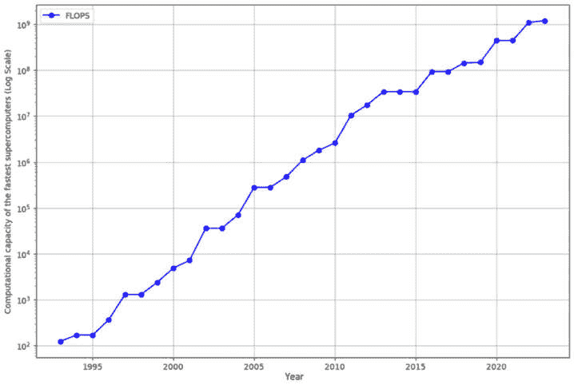
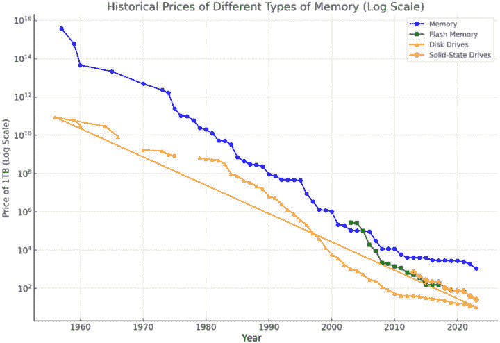
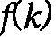

# 第十九章：<st c="0">14</st>

# <st c="3">明日算法</st>

<st c="25">本章探讨了在算法设计中塑造计算未来的先进和新兴主题。</st> <st c="145">随着技术以前所未有的速度发展，算法处于这一转型的最前沿，推动了量子计算、机器学习和大数据处理等领域的创新。</st> <st c="349">我们概述了多种影响可扩展、上下文感知和伦理意识算法发展的趋势。</st> <st c="476">这些趋势包括处理大规模数据的新方法、生物启发式技术的整合、内存高效且环保可持续的算法日益重要，以及在算法部署中对伦理考虑的迫切需求。</st> <st c="753">本章旨在提供这些前沿领域的概述，洞察它们如何重新定义计算机科学和</st> <st c="908">软件工程的格局。</st>

<st c="929">本章将涵盖以下主题：</st> <st c="970">本章内容包括：</st>

+   <st c="983">从</st> <st c="998">过去汲取经验</st>

+   <st c="1006">可扩展性</st>

+   <st c="1018">上下文感知</st>

+   <st c="1036">道德责任</st>

+   <st c="1057">总结</st>

# <st c="1069">从过去汲取经验</st>

<st c="1092">自计算机问世以来，出现了许多突破性的思想、概念和技术进展，极大地改变了我们与机器的互动方式以及信息处理的方式。</st> <st c="1302">以下是计算技术演变的关键阶段的简要概述：</st> <st c="1364">计算技术的发展历程：</st>

+   **<st c="1385">早期计算机</st>**<st c="1401">：这一旅程始于 20 世纪中期早期计算机的开发，例如 ENIAC 和 UNIVAC。</st> <st c="1517">这些机器是大型的、占据整个房间的设备，使用真空管和打孔卡片进行基本的计算。</st> <st c="1633">它们标志着自动化计算的开始，为</st> <st c="1710">未来的创新奠定了基础。</st>

+   **<st c="1729">第一波人工智能（AI）</st>**<st c="1776">：人工智能的概念与早期计算机同时出现，研究人员探索了机器能够模仿人类思维的可能性。</st> <st c="1912">早期的 AI</st> <st c="1920">集中于符号推理和问题解决，为这个快速发展的领域奠定了基础。</st> <st c="2026">这一领域迅速演变。</st>

+   **<st c="2041">大型主机计算机</st>**<st c="2061">：随着</st> <st c="2067">技术的进步，大型主机计算机逐渐崭露头角。</st> <st c="2132">这些强大的机器主要被大型组织用于复杂的数据处理任务。</st> <st c="2234">主机计算机引入了集中式计算的概念，允许多个用户访问单一的强大</st> <st c="2347">计算机系统。</st>

+   **<st c="2363">专家系统与第二波人工智能</st>**<st c="2404">：第二波人工智能带来了</st> <st c="2461">专家系统的发展，这些系统旨在模仿人类</st> <st c="2548">专家在特定领域中的决策能力。</st> <st c="2577">这些系统依赖于基于规则的逻辑，并被用于医学诊断和</st> <st c="2672">金融分析等领域。</st>

+   **<st c="2691">个人计算机（PC）</st>**<st c="2716">：1970 年代和 1980 年代个人计算机的发明标志着计算机领域的重大转变。</st> <st c="2723">个人计算机使计算变得更加普及，</st><st c="2853">将其从大型机构的工具转变为家庭必备品。</st> <st c="2953">这个时代见证了用户友好界面、软件应用程序的兴起，以及计算能力的民主化。</st>

+   **<st c="3070">互联网与网络</st>**<st c="3087">：1990 年代互联网</st> <st c="3116">和万维网的出现彻底改变了我们获取和分享信息的方式。</st> <st c="3139">它将全球的计算机连接起来，实现了即时通讯、数据交换，以及在线服务和数字经济的兴起。</st> <st c="3345">这一时期还见证了电子商务、社交媒体和</st> <st c="3408">云计算的崛起。</st>

+   **<st c="3424">移动计算</st>**<st c="3441">：2000 年代初期带来了移动计算时代，智能手机和</st> <st c="3523">平板电脑变得无处不在。</st> <st c="3553">这些设备将计算能力与便携性相结合，允许用户随时随地访问信息、进行沟通，并执行各种任务。</st> <st c="3706">移动应用程序和无线技术进一步扩展了</st> <st c="3781">这些设备的功能。</st>

+   **<st c="3795">第三波及当前的人工智能</st>**<st c="3828">：我们现在正处于第三波人工智能的浪潮中，特点是机器学习、深度学习和自然语言处理的进展。</st> <st c="3975">这一波的重点是构建能够从大量数据中学习、识别模式并做出自主决策的系统。</st> <st c="4106">人工智能正在融入日常生活的各个方面，从虚拟助手和自动驾驶汽车到医学诊断和</st> <st c="4240">金融服务。</st>

<st c="4259">这些阶段中的每一个都代表了技术能力的跃升，以及我们与计算机交互和利用计算机的方式的转变，塑造了现代的</st> <st c="4405">数字化格局。</st>

<st c="4423">尽管每一次技术革命都带来了快速且深刻的变化，但有一点始终未变：算法的基本需求。</st> <st c="4585">无论硬件和软件能力如何飞跃，算法始终是每一次进步的核心，推动着每项</st> <st c="4767">新发展</st>的效率和功能。</st>

<st c="4783">就像数学归纳法中一个原则在每个步骤中都成立一样，我们可以推断出，设计、分析和优化算法的必要性将在未来继续至关重要。</st> <st c="5004">事实上，随着技术的日益复杂以及我们处理的数据量呈指数增长，强大且高效的算法的重要性只会更加</st> <st c="5171">突出。</st>

<st c="5187">算法</st> <st c="5198">是使系统能够处理信息、解决问题和做出决策的基础框架。</st> <st c="5309">随着我们进一步进入如人工智能、量子计算和大数据等领域，挑战变得越来越复杂。</st> <st c="5438">高效的算法将是充分发挥这些技术潜力的关键，确保它们能够在规模化、实时运行以及最优</st> <st c="5603">资源利用方面表现出色。</st>

<st c="5624">此外，随着我们继续将技术融入社会的关键领域，如医疗、金融和基础设施，对不仅高效而且安全、公平、可解释的算法的需求变得更加迫切。</st> <st c="5879">未来可能会要求算法能够适应动态环境、管理不确定性并自主运行，同时保持道德标准并</st> <st c="6050">保护隐私。</st>

<st c="6071">总之，我们可以说，尽管我们使用的工具和平台可能会不断发展，但算法在塑造未来技术中的基础性作用将始终存在。</st> <st c="6241">它们的设计、分析和优化将始终是进步的基石，随着我们面临更复杂和</st> <st c="6391">严峻的挑战，它们的重要性只会日益增加。</st>

<st c="6411">众多新兴的算法趋势正受到当前人工智能革命和其他技术进步的影响。</st> <st c="6535">本章的目的不是预测未来，而是通过三个关键方面来提供理解这些趋势的框架：可扩展性、上下文感知和</st> <st c="6727">道德责任。</st>

<st c="6748">通过探讨这些维度，我们旨在启动一场关于算法设计不断演变的对话及其更广泛影响。</st> <st c="6893">目标是鼓励读者积极参与这些话题，思考这些趋势如何可能影响技术</st> <st c="7034">和社会的未来。</st>

<st c="7046">在接下来的部分，我们将更详细地探讨这些方面，讨论它们如何塑造当前的趋势以及算法的未来。</st> <st c="7201">本讨论并非旨在穷尽所有内容，而是作为深入探索的起点。</st> <st c="7299">我们邀请读者加入这一持续的对话，反思这些趋势如何影响他们的工作以及算法设计在更广泛社会层面的影响。</st>

# <st c="7468">可扩展性</st>

<st c="7480">数据爆炸和现代系统日益复杂的需求，迫使算法</st> <st c="7568">必须在前所未有的规模上有效运作。</st> <st c="7625">无论是处理海量数据集、管理大规模分布式系统，还是为数百万用户优化流程，可扩展性已成为核心问题。</st> <st c="7796">算法不仅要高效，还必须能够适应日益增长的需求和多样化的</st> <st c="7884">应用场景。</st>

<st c="7905">当前的人工智能革命，不仅仅是由算法的进步推动的，还受到三大</st> <st c="8017">重要发展推动：</st>

+   **<st c="8036">处理能力的指数级增长</st>**<st c="8080">：处理能力的持续提升，已经达到即使是**<st c="8155">摩尔定律</st>**（即每两年微芯片上晶体管数量翻倍的预测）可能不再成立的程度，这使得更加复杂和资源密集型的算法得以执行（参见*<st c="8364">图 14</st>**<st c="8373">.1</st>*<st c="8375">）。</st> <st c="8379">专用硬件的出现，如</st> <st c="8422">**<st c="8426">图形处理单元</st>**（**<st c="8454">GPU</st>**）和**<st c="8465">张量处理单元</st>**（**<st c="8490">TPU</st>**），进一步加速了处理大规模计算的能力，尤其是那些机器学习模型所需的计算。</st><st c="8608">GPUs 最初是为了加速计算机图形中的图像和视频渲染而设计的。</st> <st c="8725">它们已经发展成为处理深度学习、科学模拟和数据分析等任务所需的复杂数学计算。</st> <st c="8872">由于其高度并行的结构，GPU 非常适合同时处理大量数据块，使其在训练和运行机器学习模型时尤其高效。</st>

    <st c="9069">TPU 是一种由 Google 专门为机器学习任务设计的硬件加速器，特别是那些涉及神经网络和深度学习模型的任务。</st> <st c="9243">TPU 经过优化，能够高效地运行大规模计算，提供高性能以支持机器学习应用中的训练和推理。</st> <st c="9400">它们专门设计用于处理 AI 算法的计算需求，尤其是使用 TensorFlow 这一 Google 开源机器学习框架的算法（参见*<st c="9568">图 14</st>**<st c="9577">.1</st>*<st c="9579">）。</st>

<st c="9733">图 14.1：过去 20 年最快计算机的计算能力（对数尺度）</st>

+   **<st c="9824">存储成本下降和容量增加</st>**<st c="9875">：虽然存储和内存成本大幅下降，但其容量大幅增长（见</st> *<st c="9967">图 14</st>**<st c="9976">.2</st>*<st c="9978">）。</st> <st c="9982">这</st> <st c="9986">意味着现在可以廉价地存储大量数据，从而实现对庞大数据集的保留和处理。</st> <st c="10037">这些趋势使得数据驱动的算法得以蓬勃发展，因为曾经限制模型大小或可用数据量的存储约束已经不复存在（见</st> *<st c="10291">图 14</st>**<st c="10300">.2</st>*<st c="10302">）。</st>

<st c="10531">图 14.2：不同类型的 1 TB 存储器的历史价格（对数刻度）</st>

+   **<st c="10607">互联网推动的数据爆炸</st>**<st c="10645">：自 1991 年互联网诞生以来，</st> <st c="10696">可用数据量呈现爆炸式增长。</st> <st c="10736">网络的自由和</st> <st c="10752">开放性释放了一股信息潮流，从用户生成的内容到交易数据，为算法提供了无与伦比的数据集。</st> <st c="10937">社交网络、在线平台和物联网设备进一步推动了这一日益增长的数据海洋。</st> <st c="11034">数据海洋。</st>

<st c="11042">这三个因素改变了算法，尤其是那些用于人工智能和机器学习的算法。</st> <st c="11144">大量数据的可用性使得算法可以更加依赖统计学习和大规模的模式识别。</st> <st c="11290">因此，像神经网络这样的算法已经演变成了极其庞大且复杂的模型，如具有数十亿参数的深度学习架构。</st> <st c="11448">参数数量。</st>

<st c="11462">反过来，这些模型推动了对更大处理能力和存储的需求，强化了不断扩大的规模循环。</st> <st c="11599">并行计算和并行性已成为处理训练这些巨大模型需求的关键策略。</st> <st c="11725">分布式计算、基于云的机器学习和并行处理框架（如 MapReduce）等技术已经被开发出来，以应对这一</st> <st c="11890">不断增长的需求。</st>

<st c="11903">因此，今天的人工智能革命不仅仅是关于扩展基础设施，也在于设计更智能的算法。</st> <st c="12022">如果没有处理能力、存储和数据的丰盈发展，许多人工智能的突破是不可能实现的。</st> <st c="12162">这种对规模的关注持续推动着能够从庞大数据集中学习、处理并采取行动的算法的发展。</st> <st c="12285">庞大数据集。</st>

<st c="12302">与</st> <st c="12319">设计和分析算法并行进行时，考虑规模问题以及算法如何利用和支持新兴硬件技术是至关重要的。</st> <st c="12478">随着数据和计算需求的持续增长，可扩展的算法变得愈加重要，以确保在大规模系统中高效地进行处理和问题解决。</st> <st c="12658">以下是一些支持可扩展算法发展的新兴趋势：</st> <st c="12720">可扩展算法：</st>

+   **<st c="12740">量子算法</st>**<st c="12759">：量子</st> <st c="12769">计算有望彻底改变我们解决大规模</st> <st c="12833">问题的方式。</st> <st c="12843">传统计算机在某些类型的计算中表现不佳，如大数因式分解或量子系统模拟。</st> <st c="12973">量子算法，如</st> **<st c="13001">Shor 算法</st>** <st c="13017">用于</st> <st c="13022">因式分解，以及</st> **<st c="13040">Grover 算法</st>** <st c="13058">用于搜索，可以提供指数级的速度提升，使得</st> <st c="13112">它们成为处理当前对经典计算机来说无法解决的大规模问题的理想选择。</st> <st c="13183">经典计算机。</st>

+   **<st c="13203">近似算法</st>**<st c="13228">：在许多</st> <st c="13239">大规模问题中，找到</st> <st c="13269">一个精确的解决方案在计算上是昂贵的，甚至是不可能的。</st> <st c="13336">近似算法提供了一种方法，可以在合理的时间内获得接近最优的解。</st> <st c="13440">这些算法在那些完美解并非必要，但一个足够好的解却很有价值并且必须迅速找到的场景中至关重要，如路由、调度和</st> <st c="13626">优化问题。</st>

+   **<st c="13648">参数化复杂度</st>**<st c="13673">：这是</st> <st c="13684">计算复杂度理论中的一个框架，通过关注输入数据中的特定方面或参数，而不是整体输入大小，从而为分析问题的复杂度提供了更细致的途径。</st> <st c="13913">仅仅依赖于总体输入大小。</st> <st c="13920">在传统的复杂度分析中，问题是根据其运行时间随着输入大小的增长进行分类的。</st> <st c="14046">然而，对于许多现实世界中的问题，输入的某些参数可能比数据的总大小对算法的性能有更大的影响。</st> <st c="14210">通过识别和隔离这些关键参数，参数化复杂度使得即使问题在一般情况下仍然是计算上困难的，也能为实际使用场景设计出更高效的算法。</st> <st c="14422">一般情况下。</st>

    <st c="14435">参数化复杂性中的主要目标是开发算法，其运行时间不一定对于问题的每个实例都是最优的，但在某些参数保持较小的情况下是可管理的，即使总体输入规模很大。</st> <st c="14683">中心概念</st> <st c="14703">是</st> **<st c="14706">固定参数可解性</st>** <st c="14734">（</st>**<st c="14736">FPT</st>**<st c="14739">），其中问题被认为是固定参数可解的，如果它可以在时间内解决</st> <st c="14827">，其中</st>  <st c="14844">是输入规模，</st>  <st c="14865">是参数，并且</st>  <st c="14889">是一个仅依赖于参数而不是总体输入规模的函数。</st> <st c="14969">如果</st>  <st c="14972">很小，即使</st>  <st c="14996">很大，算法仍然可以有效运行。</st> <st c="15096">参数化复杂性在生物信息学、调度问题和</st> <st c="15196">数据库系统中的实际应用。</st></st></st></st></st></st></st>

+   **<st c="15213">亚线性算法</st>**<st c="15234">：随着</st> <st c="15240">数据集的规模不断增大，甚至读取整个输入都变得不切实际时，亚线性算法变得至关重要。</st> <st c="15302">这些算法通过仅检查输入的一小部分来产生有用的结果，特别适用于属性测试等应用，在这些应用中，我们希望在不完全处理数据的情况下确定数据集的属性。</st>

+   **<st c="15611">流数据算法</st>**<st c="15632">：在数据以连续流的方式到达的场景中，例如网络流量监控或金融行情数据，算法必须在有限的内存下即时处理信息。</st> <st c="15638">流数据算法旨在在这些约束条件下工作，通过对数据进行单次或有限次数的遍历，提取有意义的洞察或维持摘要，即使数据量不断增长。</st>

+   **<st c="16026">并行和分布式算法</st>**<st c="16062">：为了充分利用现代硬件的强大能力，算法必须设计成能够高效地在多核处理器和</st> <st c="16191">分布式系统上运行。</st> <st c="16212">并行和分布式算法</st> <st c="16247">将大型问题分解为可以并行解决的小子问题，从而减少计算时间，并使得大规模数据能够实时或接近实时地处理。</st>

+   **<st c="16437">平滑分析</st>**<st c="16455">：传统的</st> <st c="16470">算法分析通常侧重于最坏情况或平均情况，这可能无法准确反映实际的性能。</st> <st c="16505">平滑分析通过分析算法在输入数据轻微随机扰动下的表现，提供了一个更为细致的视角。</st> <st c="16601">这种方法为实际的大规模设置中的算法性能提供了更为真实的度量，弥合了理论分析</st> <st c="16736">与</st> <st c="16888">经验性能</st> <st c="16893">之间的差距。</st>

+   **<st c="16915">大规模数据的算法</st>**<st c="16947">：大数据应用需要能够高效处理和分析海量数据集的算法。</st> <st c="16954">这些算法旨在处理</st> <st c="17050">跨不同存储系统分布的高维数据，同时确保可扩展性和性能。</st> <st c="17090">它们包括数据挖掘、聚类和机器学习方法，能够在海量数据上有效运作。</st>

+   **<st c="17326">图神经网络（GNNs）</st>**<st c="17355">：在许多现实世界的场景中，数据自然地以图的形式呈现，如社交网络、生物系统和通信网络。</st> <st c="17502">GNNs 是</st> <st c="17511">一类新兴的算法，能够直接在图结构数据上操作，使其能够随着数据中关系的复杂性扩展。</st> <st c="17672">GNNs 在处理涉及大规模互联数据集的任务时尤其强大，使它们成为从网络分析到</st> <st c="17832">分子化学等应用领域中非常有价值的工具。</st>

<st c="17855">这些趋势从不同角度应对扩展性挑战，从利用量子计算等新型计算范式到优化算法如何与大型数据集交互。</st> <st c="18057">尤其是生物启发的算法和内存高效算法，通过利用自然过程并最大限度地利用有限资源，提供了创新的问题解决方法。</st> <st c="18259">这些进展共同构成了在数据日益增长和计算需求不断增加的时代中，算法设计的关键基础。</st> <st c="18385">计算需求。</st>

<st c="18407">虽然计算能力至关重要，但仅有计算能力不足以在波动、混乱和动态的环境中做出有效决策。</st> <st c="18551">除了单纯的处理能力外，我们还必须投资于能够适应多变甚至敌对环境的算法。</st> <st c="18670">这要求使算法具备更强的上下文意识，使其能够智能地应对周围环境的复杂性。</st> <st c="18784">它们能够响应复杂的外部环境。</st>

# <st c="18803">上下文意识</st>

<st c="18821">现代算法越来越多地需要在多样、动态且常常不可预测的环境中运行。</st> <st c="18856">这些环境从实时数据流到嵌入式系统，要求快速处理和决策，而嵌入式系统的计算资源则受到严格限制。</st> <st c="18936">此外，算法还必须在复杂的生态系统中运行，这些生态系统包括云基础设施、边缘计算环境，以及</st> <st c="19113">物联网（IoT）</st> <st c="19256">设备的整合。</st> <st c="19294">在这些多变的环境中，算法必须具备韧性、适应性，并能够在不同的条件和约束下执行。</st> <st c="19429">以下是支持上下文意识算法发展的新兴趋势：</st>

+   **<st c="19520">生物启发的算法</st>**<st c="19553">：自然为开发能够适应变化环境的算法提供了丰富的灵感来源。</st> <st c="19616">生物启发的算法，如遗传算法、蚁群优化和</st> <st c="19760">神经网络启发的计算，利用自然过程中的机制。</st> <st c="19835">例如，遗传算法模拟自然选择过程，通过连续几代的演化优化复杂问题。</st> <st c="19986">蚁群优化受到蚂蚁寻找资源最优路径行为的启发，提供了有效的路由和调度解决方案。</st> <st c="20149">这些算法在传统方法可能力不从心的情况下表现出色，尤其是在需要适应性和鲁棒性的复杂、大规模环境中。</st> <st c="20302">并且具有很强的适应性。</st>

+   **<st c="20317">内存高效的算法</st>**<st c="20345">：在内存资源有限的环境中，如</st> <st c="20408">嵌入式系统和物联网设备，最小化内存使用的能力至关重要。</st> <st c="20491">内存高效的算法旨在这些约束条件下有效运行，使用数据压缩、就地计算和空间高效的数据结构等技术。</st> <st c="20562">通过减少内存占用，这些算法使得在存储和处理能力有限的设备上能够进行复杂的计算，扩展了可从先进算法解决方案中受益的应用范围。</st> <st c="20683">这在需要设备本地处理数据，且由于延迟、带宽或</st> <st c="21058">隐私问题无法依赖云资源的情境中尤其重要。</st>

+   **<st c="21075">在线算法</st>**<st c="21093">：这些</st> <st c="21101">算法</st> <st c="21112">旨在通过不完整的信息实时做出决策。</st> <st c="21186">在许多现实应用中，数据是连续到达的，决策必须在没有提前知道完整输入的情况下即时做出。</st> <st c="21343">在线算法在这种动态环境中表现出色，使其适用于股票交易、网络</st> <st c="21463">路由以及</st> <st c="21475">负载均衡等需要即时响应的应用场景。</st> <st c="21518">这些算法可以在这些领域中发挥重要作用。</st>

+   **<st c="21532">自适应与动态算法</st>**<st c="21564">：为了在变化的环境中有效运行，一些</st> <st c="21622">算法被设计为自适应，能够根据新的</st> <st c="21692">输入数据或变化的条件进行调整。</st> <st c="21728">自适应算法可以根据观察到的数据修改其行为，随着时间的推移不断学习和改进。</st> <st c="21836">动态算法则能够处理问题结构本身的变化，如图形更新或调度问题的变动。</st> <st c="21994">这些能力对于自动化系统等应用至关重要，这些系统必须持续适应其环境以</st> <st c="22125">有效运作。</st>

+   **<st c="22146">机器学习算法</st>**<st c="22174">：机器学习算法天生具有一定的上下文感知能力</st> <st c="22253">因为它们能够从数据中学习。</st> <st c="22294">这些算法能够适应各种环境，无论是处理静态数据集还是</st> <st c="22394">处理实时数据流。</st> <st c="22430">强化学习等技术使算法能够通过与环境的互动学习最优行为，使它们适合在动态环境中进行复杂决策任务。</st> <st c="22636">此外，机器学习模型可以部署在边缘设备等环境中，在这些设备上本地处理和分析数据，从而减少对持续</st> <st c="22803">云连接的需求。</st>

<st c="22822">这些新兴趋势表明，算法不仅需要高效，还需要具有上下文感知能力。</st><st c="22874">在当今快速发展的技术环境中，算法必须能够适应新数据、在资源限制下运行并做出实时决策。</st> <st c="22946">无论是从自然过程中汲取灵感、为有限的内存优化，还是从数据中学习，上下文感知算法对于解决现代</st> <st c="23122">计算环境中的复杂性至关重要。</st>

<st c="23334">尽管超高速计算机、智能算法和先进设备看起来像是通向乌托邦未来的路径，但仅凭它们无法实现这一结果。</st> <st c="23495">过去一个世纪的痛苦教训——无休止的战争、环境破坏以及个人隐私的侵蚀——已向我们展示，未经控制的技术进步推动可能带来更多危害而非好处。</st> <st c="23720">这就是为什么在处理技术时，保持道德警觉至关重要，确保创新受到伦理考量的引导，并服务于</st> <st c="23879">更大的利益。</st>

# <st c="23892">道德责任</st>

<st c="23913">算法已深深</st> <st c="23943">嵌入到我们生活的几乎每个方面，影响着从医疗和金融到我们消费的媒体和购买的产品等决策。</st> <st c="24089">虽然它们极大地提升了许多人的生活质量，提供了效率、便利和新功能，但算法的兴起也带来了重大伦理挑战</st> <st c="24275">和责任。</st>

<st c="24296">其中一个紧迫的关注点是算法误用的风险以及其可能产生的无意负面副作用。</st> <st c="24421">大公司设计算法以最大化用户参与度和利润，通常通过引导用户浏览广告或内容来增加股东价值。</st> <st c="24595">尽管这些做法合法，属于商业模型的范围内，但它们引发了伦理问题。</st> <st c="24708">例如，优先推送吸引眼球内容的算法可能无意中推动了耸人听闻、虚假信息或极化内容，这对社会产生有害影响。</st> <st c="24900">一个现实世界的例子是社交媒体算法在政治选举期间放大分裂性内容的作用。</st> <st c="25019">例如，2016 年，Facebook 的算法因推动高度情绪化和极化的政治内容而受到批评，这在美国</st> <st c="25239">总统选举期间加剧了虚假信息的传播，并加深了社会分裂。</st>

<st c="25261">除了这些合法但在伦理上有疑问的做法，还有一些明显不道德和非法的算法使用。</st> <st c="25385">这些包括传播虚假信息、针对易受害群体发布有害或剥削性内容，以及加剧偏见，比如种族或性别歧视。</st> <st c="25561">如果算法设计和监控不当，可能会加剧刻板印象和系统性不平等。</st> <st c="25675">例如，偏见的训练数据可能会导致在招聘、贷款批准和</st> <st c="25793">执法等领域产生不公平的结果。</st>

另一个关键问题是<st c="25809">算法的</st> <st c="25840">环境影响。</st> <st c="25876">训练大型语言模型所需的计算能力支持大规模数据中心并开采加密货币，这需要巨大的能量。</st> <st c="26012">这些活动消耗大量电力，导致显著的碳足迹。</st> <st c="26114">算法的环境成本不仅仅包括能源消耗，还包括技术的整个生命周期，其中包括电子设备的生产和处理，涉及原材料的开采和</st> <st c="26364">电子垃圾的产生。</st>

<st c="26381">此外，算法驱动系统的社会影响深远。</st> <st c="26460">全球向自动化和 AI 的转变导致了就业模式的变化，某些工作岗位消失，而其他岗位则需要越来越专业化的技能。</st> <st c="26635">这一转型可能导致经济上的 displacement 和不平等，特别是在缺乏支持再培训和适应新工作市场的基础设施的地区。</st> <st c="26824">此外，人才流失现象——即来自发展中国家的人才迁移到发达国家从事先进算法的工作——可能加剧全球不平等，使某些地区缺乏推动本地创新所需的专业知识。</st> <st c="27067">。</st>

<st c="27084">考虑到这些复杂性，算法设计和部署所涉及的道德责任是巨大的。</st> <st c="27196">这需要一种超越技术考量的深思熟虑的方法，纳入伦理、社会和环境因素。</st> <st c="27328">开发者、企业和政策制定者必须共同努力，制定促进算法负责任使用的指南和框架。</st> <st c="27475">这些指南和框架可以围绕以下考虑因素建立：</st>

+   **<st c="27554">伦理设计与实施</st>**<st c="27588">：确保算法的设计考虑公平性、透明性和问责制。</st> <st c="27686">这包括使用多样化的数据集，实施偏见检测和缓解策略，并提供清晰的解释，说明算法是如何做出决策的。</st>

+   **<st c="27845">监管与监督</st>**<st c="27870">：政府和监管机构需要建立并执行标准，以防止算法的滥用，保护用户隐私，并确保 AI 系统在伦理边界内运作。</st> <st c="28050">。</st>

+   **<st c="28069">环境考虑</st>**<st c="28098">：开发和采用节能的算法和实践，最大限度地减少对环境的影响。</st> <st c="28203">这包括优化数据中心，投资可再生能源，并考虑技术基础设施的全生命周期。</st>

+   **<st c="28363">公众意识与教育</st>**<st c="28394">：提高公众对算法如何影响日常生活的理解，并赋予个人做出明智选择的能力。</st> <st c="28524">这还包括教育未来的开发者了解他们工作中的伦理影响。</st>

+   **<st c="28631">算法风险管理</st>**<st c="28661">：算法可能引入各种类型的风险，其中最突出的是算法偏差，即基于性别、种族或社会阶层等因素而使某些用户群体受到偏好或劣势化。</st> <st c="28881">这些偏差通常源于用于训练机器学习模型的数据存在偏见，导致不公平的结果。</st> <st c="28990">例如，在招聘、贷款批准或刑事司法系统中使用的算法在未经适当审计或监控时已被证明会持续甚至放大社会偏见。</st> <st c="29176">责任在于确保算法基于多样化、代表性数据集进行训练，并定期测试其公平性</st> <st c="29314">和准确性。</st>

    <st c="29327">另一类</st> <st c="29347">风险涉及代码的误用或滥用，特别是在嵌入式系统中。</st> <st c="29435">嵌入式系统被集成到无数设备中，从家用电器到医疗设备和工业控制系统，使它们容易受到恶意利用。</st> <st c="29622">人们常说，如果任何设备中的任何代码遭到破坏，这可能成为一种责任。</st> <st c="29705">这在安全性和安全性至关重要的系统中尤其令人担忧，如自动驾驶车辆、医疗设备和国防技术。</st> <st c="29861">如果这些系统中的嵌入式代码被破坏，后果可能是灾难性的，从人员伤亡到大规模的财务和</st> <st c="30016">基础设施损失。</st>

<st c="30039">尽管前述考虑涉及各种利益相关者，作为工程师和计算机科学家，我们有责任捍卫道德原则，特别是与人权和公共利益相关的原则。</st> <st c="30267">除了依赖监管机构，我们必须培养自己的伦理指南，由深刻的道德意识引导。</st> <st c="30394">这需要在我们的工作中积极维护伦理标准，确保我们的贡献以公平和</st> <st c="30523">负责任的方式造福社会。</st>

## <st c="30542">软件实践中的道德意识</st>

<st c="30583">在道德、环境和社会领域已被认可的责任之外，软件从业者必须培养更高层次的伦理意识，或者我们所说的</st> **<st c="30772">道德意识</st>**<st c="30791">。这不仅仅是遵守伦理指南或法律要求。</st> <st c="30871">它涉及对其创新的更广泛影响和潜在间接用途的深入主动考虑，即使这些创新是出于最好的意图和</st> <st c="31060">伦理应用。</st>

<st c="31081">具有道德意识的从业者意识到，算法一旦开发出来，可能会独立于原始创造者的意图或预期，被以不同的方式使用。</st> <st c="31274">例如，一个旨在提升社交媒体平台用户参与度的算法，可能无意中促成了错误信息的传播或成瘾行为。</st> <st c="31451">类似地，一个为安全目的开发的面部识别算法，可能会被重新用于监视，从而侵犯隐私或</st> <st c="31598">公民自由。</st>

<st c="31614">为了降低这些风险，从业者可以采取</st> <st c="31663">几种策略：</st>

+   **<st c="31682">知识产权和许可</st>**<st c="31725">：控制算法使用的一种方式是通过知识产权保护它。</st> <st c="31824">通过申请专利或采用特定的许可协议，开发者可以对其作品的使用方式施加限制，确保其符合伦理标准。</st> <st c="31997">然而，这种方法并非万无一失，因为执行知识产权可能具有挑战性，特别是在全球范围内，不同国家有不同的</st> <st c="32178">法律框架。</st>

+   **<st c="32195">伦理保障和影响评估</st>**<st c="32237">：从业者应在开发过程中进行全面的</st> <st c="32277">伦理影响评估。</st> <st c="32337">这不仅包括分析算法的直接应用，还要考虑其潜在的次要效应和意外后果。</st> <st c="32483">通过考虑算法可能被误用的各种方式，开发者可以实施保障措施，如使用限制或内置监控系统，以防止</st> <st c="32652">不道德的应用。</st>

+   **<st c="32675">双重用途考虑</st>**<st c="32698">：在发布算法之前，必须考虑其双重用途潜力——它如何可能合法且有益地使用，同时也要考虑它如何可能被用于非法或有害的目的。</st> <st c="32897">如果一个算法被误用的风险较高，从业者需要仔细考虑是否应将其公开发布，或者是否需要额外的保障措施来</st> <st c="33086">限制访问。</st>

+   **<st c="33099">透明度与合作</st>**<st c="33130">：与利益相关者（包括伦理学家、法律专家和更广泛的社区）进行交流，可以为算法潜在的影响提供宝贵的见解。</st> <st c="33298">在开发实践中保持透明，并与伦理相关的考虑进行公开对话，有助于做出更明智的决策，并在问题变得严重之前识别潜在风险。</st>

+   **<st c="33509">持续的伦理教育</st>**<st c="33537">：了解不断变化的伦理环境，并对重新审视自己工作的道德影响保持开放态度，对从业人员至关重要。</st> <st c="33632">这包括对新兴伦理问题的持续教育，以及反思社会规范和价值观如何随着时间的推移而变化。</st>

<st c="33830">道德意识</st> <st c="33851">是指在算法的技术创建和部署之外，保持警觉和责任。</st> <st c="33961">它要求我们不仅要时刻质疑算法的直接收益，还要考虑它的更广泛社会影响、间接效应和滥用的潜力。</st> <st c="34147">通过采取这种有责任心的方式，软件从业者可以为优先考虑伦理问题并致力于追求</st> <st c="34316">更大利益的技术环境做出贡献。</st>

<st c="34329">总之，虽然算法具有带来重大积极变化的潜力，但它们也承担着不可忽视的道德责任。</st> <st c="34488">解决与算法使用相关的伦理、社会和环境挑战，对于确保它们对社会的影响既积极又可持续至关重要。</st> <st c="34643">。</st>

# <st c="34659">最后的话</st>

<st c="34671">在我们结束本书时，我们的目标是为计算机科学学生和软件工程师提供一份全面的概述，涵盖他们在学术旅程和实际应用中会遇到的算法设计与分析的最重要话题。</st> <st c="34944">我们努力在理论基础和实践问题解决能力之间取得平衡，这两者对构建高效且</st> <st c="35094">有效的算法至关重要。</st>

<st c="35115">在本书中，我们力求在呈现复杂概念时做到准确和清晰。</st> <st c="35209">然而，鉴于该领域的广度和深度，错误和遗漏是不可避免的。</st> <st c="35298">我们鼓励读者在遇到任何问题、错误或模糊之处时提出反馈，以便在未来的版本中得到解决和改进。</st> <st c="35445">您的反馈对完善内容并确保其作为学习者和</st> <st c="35558">从业者的可靠资源具有不可估量的价值。</st>

<st c="35578">我们故意在本章中没有讨论的话题是生成性 AI 在软件工程和算法设计中的角色。</st> <st c="35723">这个省略的原因很简单：生成性 AI 对算法领域的影响和发展方向仍在展开。</st> <st c="35853">我们正处于一场技术演变之中，很难准确预测生成性 AI 将如何重塑</st> <st c="35997">算法设计的格局。</st>

<st c="36014">然而，有一点是肯定的：</st> **<st c="36046">大型语言模型</st>** <st c="36067">(</st>**<st c="36069">LLMs</st>**<st c="36073">)和生成式人工智能正在迅速成为推动</st> <st c="36144">对更高效算法需求的核心力量。</st> <st c="36182">它们的复杂性要求进行精密的分析和评估。</st> <st c="36247">在所有新兴的应用场景中，LLMs 和生成式 AI 尤为突出，成为了可扩展性、上下文感知和道德</st> <st c="36373">责任交汇的领域。</st>

<st c="36398">对可扩展 AI 算法的压力已经显现。</st> <st c="36459">这些模型的规模以及与之互动的用户数量正以惊人的速度增长。</st> <st c="36566">例如，OpenAI 的 ChatGPT 在技术普及方面打破了纪录，在短时间内就达到了每周 2 亿用户。</st> <st c="36694">这种前所未有的规模要求有高度高效、可扩展的算法来支撑如此</st> <st c="36781">庞大的基础设施。</st>

<st c="36805">此外，对话式 AI 和 LLMs 正迅速从突破性创新转变为日常产品中的标准功能。</st> <st c="36948">这种转变意味着 AI 系统必须在高度多样化的情境下有效运行，往往是在不确定性和波动性中操作，同时涉及到人类互动。</st> <st c="37118">设计能够适应这些挑战性环境的算法对其</st> <st c="37210">长期成功至关重要。</st>

<st c="37228">或许关于生成式 AI 和 LLMs 最紧迫的问题是它们对社会和环境的影响。</st> <st c="37335">训练像 GPT-4 这样的巨大模型的碳足迹已经相当可观，除非我们开发更高效的算法并采纳更严格的行业规范，否则这一影响只会加剧。</st> <st c="37524">此外，道德风险同样令人担忧。</st> <st c="37573">这些系统可能在大范围内传播错误信息，扩大社会经济差距，并有可能通过操纵</st> <st c="37731">公众舆论来破坏民主进程。</st>

<st c="37746">展望 AI 和</st> <st c="37783">LLMs 在算法设计中的角色，我坚信，尽管该领域无疑将被生成式 AI 所改变，但解决问题的核心原则将始终不变。</st> <st c="37949">我们可能会获得新的工具和方法，但在算法设计和分析中对人类洞察力的需求将持续存在。</st> <st c="38078">生成式 AI 可以自动化开发过程的某些方面，加速周期并扩展算法能力。</st> <st c="38208">然而，人类在过程中所带来的创造性和批判性思维将始终不可或缺，特别是在那些需要伦理判断、情境敏感性以及</st> <st c="38389">深思熟虑决策的领域。</st>

<st c="38416">最后，我希望这本书能成为那些进入算法世界的人们的宝贵指南和伴侣。</st> <st c="38537">在这个领域学习和创新的旅程仍在继续，我鼓励读者继续探索、质疑和为不断发展的计算机科学和</st> <st c="38734">软件工程领域做出贡献。</st>

# <st c="38755">参考文献和进一步阅读</st>

+   *<st c="38786">摩尔定律是什么？</st>* <st c="38807">作者 Max Roser, Hannah Ritchie, 和 Edouard Mathieu (2023).</st> <st c="38866">在线出版</st> <st c="38883">于</st> [<st c="38886">OurWorldinData.org</st>](http://OurWorldinData.org)<st c="38904">.</st>

+   *<st c="38905">量子计算与量子信息</st>*<st c="38949">. 作者 M.</st> <st c="38957">A.</st> <st c="38960">Nielsen 和 I.</st> <st c="38975">L.</st> <st c="38978">Chuang.</st> <st c="38986">剑桥大学</st> <st c="39007">出版社.</st> <st c="39014">2010.</st>

+   *<st c="39019">近似算法</st>*<st c="39044">. 作者 V.</st> <st c="39049">V.</st> <st c="39052">Vazirani.</st> <st c="39062">Springer.</st> <st c="39072">2001.</st>

+   *<st c="39077">参数化算法</st>*<st c="39102">. 作者 M.</st> <st c="39110">Cygan, F.</st> <st c="39120">V.</st> <st c="39123">Fomin, Ł.</st> <st c="39133">Kowalik, D.</st> <st c="39145">Lokshtanov, D.</st> <st c="39160">Marx, M.</st> <st c="39169">Pilipczuk 和 M., A.</st> <st c="39190">Saurabh.</st> <st c="39199">Springer.</st> <st c="39209">2016.</st>

+   *<st c="39214">亚线性时间算法</st>*<st c="39240">. 在数据结构与应用手册中.</st> <st c="39291">作者 A.</st> <st c="39297">Czumaj 和 C.</st> <st c="39311">Sohler.</st> <st c="39319">Chapman &</st> <st c="39329">Hall/CRC.</st> <st c="39339">2004.</st>

+   *<st c="39344">数据流: 算法与应用</st>*<st c="39386">. 作者 S.</st> <st c="39394">Muthukrishnan.</st> <st c="39409">现在的基础和</st> <st c="39429">趋势.</st> <st c="39437">2005.</st>

+   *<st c="39442">并行计算简介</st>*<st c="39477">. 作者 A.</st> <st c="39485">Grama, A.</st> <st c="39495">Gupta, G.</st> <st c="39505">Karypis, 和 V.</st> <st c="39521">Kumar.</st> <st c="39528">Pearson</st> <st c="39536">Education.</st> <st c="39547">2003.</st>

+   *<st c="39552">分布式系统: 原理与范例</st>*<st c="39598">. 作者 A.</st> <st c="39604">A.</st> <st c="39607">S.</st> <st c="39610">Tanenbaum 和 M.</st> <st c="39627">V.</st> <st c="39630">Steen.</st> <st c="39637">Pearson</st> <st c="39645">Education.</st> <st c="39656">2007.</st>

+   *<st c="39661">算法的平滑分析: 为什么单纯形算法通常需要多项式时间</st>*<st c="39750">. 作者 D.</st> <st c="39758">A.</st> <st c="39761">Spielman 和 S.-H.</st> <st c="39780">Teng.</st> <st c="39786">ACM 期刊, 51(3),</st> <st c="39813">385-463\.</st> <st c="39822">2004.</st>

+   *<st c="39827">大数据集挖掘</st>*<st c="39854">. 作者：J.</st> <st c="39862">Leskovec, A.</st> <st c="39875">Rajaraman 和 J.</st> <st c="39893">D.</st> <st c="39896">Ullman。</st> <st c="39904">剑桥大学</st> <st c="39925">出版社。</st> <st c="39932">2014 年。</st>

+   *<st c="39937">图神经网络：方法与应用综述。</st>* <st c="39998">作者：</st> <st c="40003">J.</st> <st c="40006">Zhou, G.</st> <st c="40015">Cui, S.</st> <st c="40023">Hu, Z.</st> <st c="40030">Zhang, C, Yang, Z.</st> <st c="40049">Liu 和 M.</st> <st c="40061">Sun。</st> <st c="40066">AI Open, 1,</st> <st c="40078">57-81。</st> <st c="40085">2020 年。</st>

+   *<st c="40090">进化计算导论</st>*<st c="40129">. 作者：A.</st> <st c="40137">E.</st> <st c="40140">Eiben 和 J.</st> <st c="40153">E.</st> <st c="40156">Smith。</st> <st c="40163">Springer</st> <st c="40173">出版社。</st> <st c="40173">2003 年。</st>

+   *<st c="40178">蚁群算法优化</st>*<st c="40202">. 作者：M.</st> <st c="40210">Dorigo 和 T.</st> <st c="40224">Stützle.</st> <st c="40233">MIT</st> <st c="40237">出版社。</st> <st c="40244">2004 年。</st>

+   *<st c="40249">在线计算与竞争分析</st>*<st c="40293">. 作者：A.</st> <st c="40301">Borodin 和 R.</st> <st c="40316">El-Yaniv。</st> <st c="40326">剑桥大学</st> <st c="40347">出版社。</st> <st c="40354">2005 年。</st>

+   *<st c="40359">算法伦理：辩论的框架</st>*<st c="40404">. 作者：B.</st> <st c="40412">D.</st> <st c="40415">Mittelstadt, P.</st> <st c="40431">Allo, M.</st> <st c="40440">Taddeo, S.</st> <st c="40451">Wachter 和 L.</st> <st c="40467">Floridi。</st> <st c="40476">Big Data & Society,</st> <st c="40496">3(2)。</st> <st c="40502">2016 年。</st>

+   *<st c="40507">数据中心电力使用增长 2005 至 2010</st>*<st c="40558">. 作者：J.</st> <st c="40566">G.</st> <st c="40569">Koomey.</st> <st c="40577">Analytics</st> <st c="40587">出版社。</st> <st c="40594">2011 年。</st>
