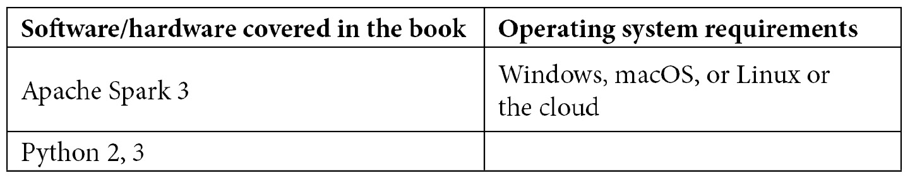

# 前言

Apache Spark 是一个统一的数据分析引擎，旨在以快速高效的方式处理海量数据。PySpark 是 Apache Spark 的 Python 语言 API，为 Python 开发人员提供了一个易于使用且可扩展的数据分析框架。

*可扩展数据分析的必备 PySpark* 通过探索分布式计算范式开始，并提供 Apache Spark 的高层次概述。然后，你将开始数据分析之旅，学习执行数据摄取、数据清洗和大规模数据集成的过程。

本书还将帮助你构建实时分析管道，使你能够更快速地获得洞察。书中介绍了构建基于云的数据湖的技术，并讨论了 Delta Lake，它为数据湖带来了可靠性和性能。

本书介绍了一个新兴的范式——数据湖仓（Data Lakehouse），它将数据仓库的结构和性能与基于云的数据湖的可扩展性结合起来。你将学习如何使用 PySpark 执行可扩展的数据科学和机器学习，包括数据准备、特征工程、模型训练和模型生产化技术。还介绍了如何扩展标准 Python 机器学习库的技术，以及在 PySpark 上提供的类似 pandas 的新 API，名为 Koalas。

# 本书适合人群

本书面向那些已经在使用数据分析探索分布式和可扩展数据分析世界的实践数据工程师、数据科学家、数据分析师、公民数据分析师和数据爱好者。建议你具有数据分析和数据处理领域的知识，以便获得可操作的见解。

# 本书内容概述

*第一章*，*分布式计算概述*，介绍了分布式计算范式。它还讲述了随着过去十年数据量的不断增长，分布式计算为何成为一种必需，并最终介绍了基于内存的数据并行处理概念，包括 Map Reduce 范式，并介绍了 Apache Spark 3.0 引擎的最新功能。

*第二章*，*数据摄取*，涵盖了各种数据源，如数据库、数据湖、消息队列，以及如何从这些数据源中摄取数据。你还将了解各种数据存储格式在存储和处理数据方面的用途、差异和效率。

*第三章*，*数据清洗与集成*，讨论了各种数据清洗技术，如何处理不良输入数据、数据可靠性挑战以及如何应对这些挑战，以及数据集成技术，以构建单一的集成数据视图。

*第四章*，*实时数据分析*，解释了如何进行实时数据的获取和处理，讨论了实时数据集成所面临的独特挑战及其解决方法，以及它所带来的好处。

*第五章*，*使用 PySpark 进行可扩展的机器学习*，简要讲解了扩展机器学习的需求，并讨论了实现这一目标的各种技术，从使用原生分布式机器学习算法，到令人尴尬的并行处理，再到分布式超参数搜索。它还介绍了 PySpark MLlib 库，并概述了其各种分布式机器学习算法。

*第六章*，*特征工程——提取、转换与选择*，探讨了将原始数据转化为适合机器学习模型使用的特征的各种技术，包括特征缩放和转换技术。

*第七章*，*监督式机器学习*，探讨了用于机器学习分类和回归问题的监督学习技术，包括线性回归、逻辑回归和梯度提升树。

*第八章*，*无监督式机器学习*，介绍了无监督学习技术，如聚类、协同过滤和降维，以减少应用监督学习前的特征数量。

*第九章*，*机器学习生命周期管理*，解释了仅仅构建和训练模型是不够的，在现实世界中，同一个模型会构建多个版本，并且不同版本适用于不同的应用。因此，有必要跟踪各种实验、它们的超参数、指标，以及它们训练所用的数据版本。还需要在一个集中可访问的库中跟踪和存储各种模型，以便能够轻松地将模型投入生产并进行共享；最后，还需要机制来自动化这一重复出现的过程。本章通过一个端到端的开源机器学习生命周期管理库 MLflow 介绍了这些技术。

*第十章**, 使用 PySpark 进行单节点机器学习的横向扩展*，解释了在*第五章**, 使用 PySpark 进行可扩展机器学习*中，您学习了如何利用 Apache Spark 的分布式计算框架在大规模上训练和评分机器学习模型。Spark 的本地机器学习库很好地覆盖了数据科学家通常执行的标准任务；然而，标准的单节点 Python 库提供了多种功能，但这些库并非为分布式方式而设计。本章介绍了如何将标准 Python 数据处理和机器学习库（如 pandas、scikit-learn 和 XGBoost）进行横向扩展。本章将涵盖常见数据科学任务的横向扩展，如探索性数据分析、模型训练、模型推理，最后还将介绍一个可扩展的 Python 库——Koalas，它使您能够使用非常熟悉且易于使用的类似 pandas 的语法轻松编写 PySpark 代码。

*第十一章**,* *使用 PySpark 进行数据可视化*，介绍了数据可视化，这是从数据中传递意义并获得洞察力的重要方面。本章将介绍如何使用最流行的 Python 可视化库与 PySpark 结合。

*第十二章**, Spark SQL 入门*，介绍了 SQL，这是一种用于临时查询和数据分析的表达语言。本章将介绍 Spark SQL 用于数据分析，并展示如何交替使用 PySpark 进行数据分析。

*第十三章**, 将外部工具与 Spark SQL 集成*，解释了当我们在高效的数据湖中拥有干净、整理过且可靠的数据时，未能将这些数据普及到组织中的普通分析师将是一个错失的机会。最流行的方式是通过各种现有的**商业智能**（**BI**）工具。本章将讨论 BI 工具集成的需求。

*第十四章**, 数据湖屋*，解释了传统的描述性分析工具，如商业智能（BI）工具，是围绕数据仓库设计的，并期望数据以特定方式呈现，而现代的高级分析和数据科学工具则旨在处理可以轻松访问的大量数据，这些数据通常存储在数据湖中。将冗余数据存储在单独的存储位置以应对这些独立的用例既不实际也不具成本效益。本章将介绍一种新的范式——数据湖屋，它试图克服数据仓库和数据湖的局限性，通过结合两者的最佳元素来弥合差距。

# 要最大限度地利用本书

预计读者具备数据工程、数据科学和 SQL 分析的基础至中级知识。能够使用任何编程语言，特别是 Python，并且具备使用 pandas 和 SQL 等框架进行数据分析的基本知识，将有助于你从本书中获得最大收益。



本书使用 Databricks Community Edition 来运行所有代码：[`community.cloud.databricks.com`](https://community.cloud.databricks.com)。注册说明可在[`databricks.com/try-databricks`](https://databricks.com/try-databricks)找到。

本书中使用的整个代码库可以从[`github.com/PacktPublishing/Essential-PySpark-for-Scalable-Data-Analytics/blob/main/all_chapters/ess_pyspark.dbc`](https://github.com/PacktPublishing/Essential-PySpark-for-Scalable-Data-Analytics/blob/main/all_chapters/ess_pyspark.dbc)下载。

本章使用的数据集可以在[`github.com/PacktPublishing/Essential-PySpark-for-Data-Analytics/tree/main/data`](https://github.com/PacktPublishing/Essential-PySpark-for-Data-Analytics/tree/main/data)找到。

**如果你正在使用本书的数字版本，我们建议你自己输入代码，或者从本书的 GitHub 仓库获取代码（链接将在下一个章节提供）。这样做有助于避免由于复制和粘贴代码而导致的潜在错误。**

# 下载示例代码文件

你可以从 GitHub 上下载本书的示例代码文件：[`github.com/PacktPublishing/Essential-PySpark-for-Scalable-Data-Analytics`](https://github.com/PacktPublishing/Essential-PySpark-for-Scalable-Data-Analytics)。如果代码有更新，GitHub 仓库会进行更新。

我们的书籍和视频丰富目录中还提供了其他代码包，可以在[`github.com/PacktPublishing/`](https://github.com/PacktPublishing/)查看！

# 下载彩色图片

我们还提供了一个包含本书中使用的截图和图表的彩色图片的 PDF 文件。你可以在这里下载：`static.packt-cdn.com/downloads/9781800568877_ColorImages.pdf`

# 使用的约定

本书中使用了多种文本约定。

`文本中的代码`：表示文本中的代码词汇、数据库表名、文件夹名、文件名、文件扩展名、路径名、虚拟 URL、用户输入和 Twitter 账户名。例如：“DataStreamReader 对象的 `readStream()` 方法用于创建流式 DataFrame。”

代码块按如下方式设置：

```py
lines = sc.textFile("/databricks-datasets/README.md") 
words = lines.flatMap(lambda s: s.split(" ")) 
word_tuples = words.map(lambda s: (s, 1)) 
word_count = word_tuples.reduceByKey(lambda x, y: x + y) 
word_count.take(10) 
word_count.saveAsTextFile("/tmp/wordcount.txt") 
```

任何命令行输入或输出都按如下方式书写：

```py
%fs ls /FileStore/shared_uploads/delta/online_retail
```

**粗体**：表示一个新术语、一个重要词汇或屏幕上看到的词汇。例如，菜单或对话框中的词汇通常是**粗体**。例如：“可以有多个**Map**阶段，接着是多个**Reduce**阶段。”

提示或重要注意事项

以这种方式显示。

# 联系我们

我们始终欢迎读者的反馈。

`customercare@packtpub.com` 并在邮件主题中注明书名。

**勘误**：尽管我们已尽力确保内容的准确性，但错误难免发生。如果您在本书中发现错误，我们将非常感激您向我们报告。请访问 [www.packtpub.com/support/errata](http://www.packtpub.com/support/errata) 并填写表格。

`copyright@packt.com` 并附上相关材料的链接。

**如果您有兴趣成为作者**：如果您在某个主题上具有专业知识，并且有兴趣撰写或为书籍贡献内容，请访问 [authors.packtpub.com](http://authors.packtpub.com)。

# 分享您的想法

阅读完 *Essential PySpark for Scalable Data Analytics* 后，我们非常期待听到您的想法！请访问 [`packt.link/r/1-800-56887-8`](https://packt.link/r/1-800-56887-8) 为本书留下评价并分享您的反馈。

您的评价对我们以及技术社区都至关重要，它将帮助我们确保提供优质的内容。
