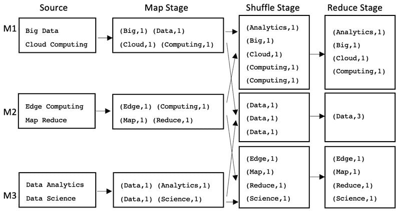
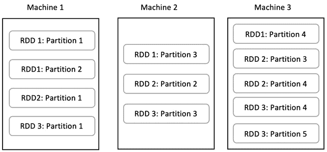
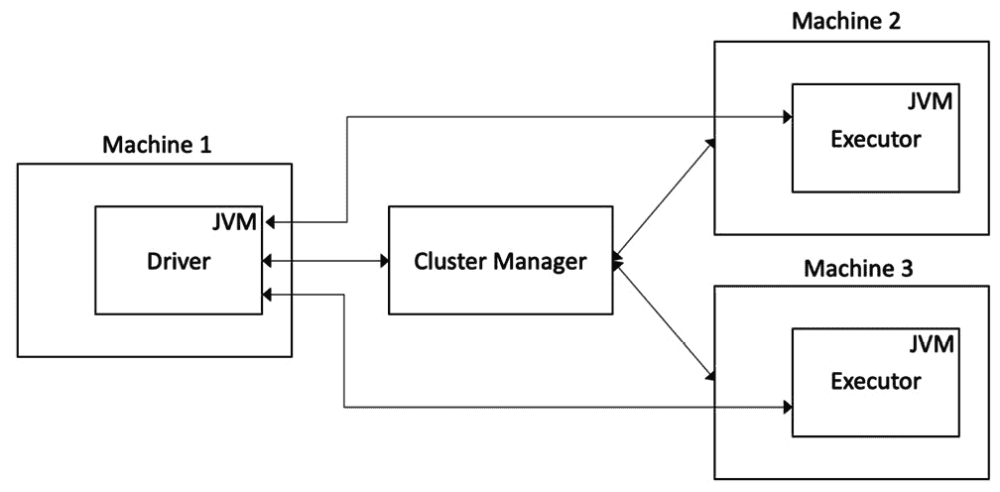
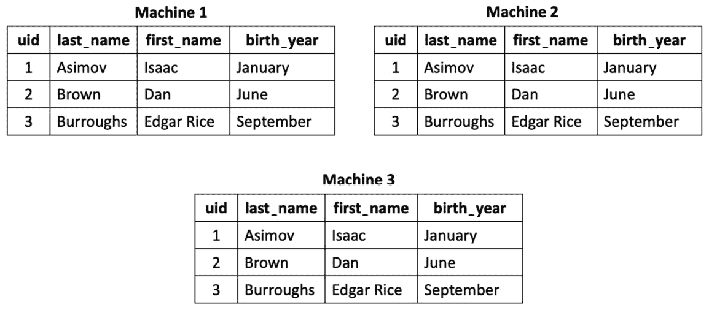

# 第一章：分布式计算入门

本章介绍了**分布式计算**范式，并展示了分布式计算如何帮助你轻松处理大量数据。你将学习如何使用**MapReduce**范式实现**数据并行处理**，并最终了解如何通过使用内存中的统一数据处理引擎（如 Apache Spark）来提高数据并行处理的效率。

接下来，你将深入了解 Apache Spark 的架构和组件，并结合代码示例进行讲解。最后，你将概览 Apache Spark 最新的 3.0 版本中新增的功能。

在本章中，你将掌握的关键技能包括理解分布式计算范式的基础知识，以及分布式计算范式的几种不同实现方法，如 MapReduce 和 Apache Spark。你将学习 Apache Spark 的基本原理及其架构和核心组件，例如 Driver、Executor 和 Cluster Manager，并了解它们如何作为一个整体协同工作以执行分布式计算任务。你将学习 Spark 的**弹性分布式数据集**（**RDD**）API，及其高阶函数和 lambda 表达式。你还将了解 Spark SQL 引擎及其 DataFrame 和 SQL API。此外，你将实现可运行的代码示例。你还将学习 Apache Spark 数据处理程序的各个组件，包括转换和动作，并学习**惰性求值**的概念。

在本章中，我们将涵盖以下主要内容：

+   介绍 分布式计算

+   使用 Apache Spark 进行分布式计算

+   使用 Spark SQL 和 DataFrames 进行大数据处理

# 技术要求

在本章中，我们将使用 Databricks Community Edition 来运行代码。你可以在[`community.cloud.databricks.com`](https://community.cloud.databricks.com)找到该平台。

注册说明可在[`databricks.com/try-databricks`](https://databricks.com/try-databricks)找到。

本章使用的代码可以从[`github.com/PacktPublishing/Essential-PySpark-for-Data-Analytics/tree/main/Chapter01`](https://github.com/PacktPublishing/Essential-PySpark-for-Data-Analytics/tree/main/Chapter01)下载。

本章使用的数据集可以在[`github.com/PacktPublishing/Essential-PySpark-for-Data-Analytics/tree/main/data`](https://github.com/PacktPublishing/Essential-PySpark-for-Data-Analytics/tree/main/data)找到。

原始数据集可以从以下来源获取：

+   在线零售：[`archive.ics.uci.edu/ml/datasets/Online+Retail+II`](https://archive.ics.uci.edu/ml/datasets/Online+Retail+II)

+   图像数据：[`archive.ics.uci.edu/ml/datasets/Rice+Leaf+Diseases`](https://archive.ics.uci.edu/ml/datasets/Rice+Leaf+Diseases)

+   人口普查数据：[`archive.ics.uci.edu/ml/datasets/Census+Income`](https://archive.ics.uci.edu/ml/datasets/Census+Income)

+   国家数据：[`public.opendatasoft.com/explore/dataset/countries-codes/information/`](https://public.opendatasoft.com/explore/dataset/countries-codes/information/)

# 分布式计算

在本节中，你将了解分布式计算，它的需求，以及如何利用它以快速且高效的方式处理大量数据。

## 分布式计算简介

**分布式计算**是一类计算技术，我们通过使用一组计算机作为一个整体来解决计算问题，而不是仅仅依赖单台机器。

在数据分析中，当数据量变得太大，无法在单台机器中处理时，我们可以将数据拆分成小块并在单台机器上迭代处理，或者可以在多台机器上并行处理数据块。虽然前者可以完成任务，但可能需要更长时间来迭代处理整个数据集；后者通过同时使用多台机器，能够在更短的时间内完成任务。

有多种分布式计算技术；然而，在数据分析中，一种流行的技术是 **数据并行处理**。

## 数据并行处理

**数据并行处理**包含两个主要部分：

+   需要处理的实际数据。

+   需要应用于数据的代码片段或业务逻辑，以便进行处理。

我们可以通过将大量数据拆分成小块，并在多台机器上并行处理它们，从而处理大规模数据。这可以通过两种方式实现：

+   首先，将数据带到运行代码的机器上。

+   第二步，将我们的代码带到数据实际存储的位置。

第一种技术的一个缺点是，随着数据量的增大，数据移动所需的时间也会成比例增加。因此，我们最终会花费更多的时间将数据从一个系统移动到另一个系统，从而抵消了并行处理系统带来的任何效率提升。同时，我们还会在数据复制过程中产生多个数据副本。

第二种技术要高效得多，因为我们不再移动大量数据，而是可以将少量代码移到数据实际存放的位置。这种将代码移到数据所在位置的技术称为数据并行处理。数据并行处理技术非常快速和高效，因为它节省了之前在不同系统之间移动和复制数据所需的时间。这样的数据并行处理技术之一被称为 **MapReduce 模式**。

## 使用 MapReduce 模式进行数据并行处理

MapReduce 模式将数据并行处理问题分解为三个主要阶段：

+   Map 阶段

+   Shuffle 阶段

+   Reduce 阶段

`(key, value)`对，应用一些处理，将它们转换为另一组`(key, value)`对。

从 Map 阶段获取的`(key, value)`对，将其洗牌/排序，使得具有相同*key*的对最终聚集在一起。

从 Shuffle 阶段获取的`(key, value)`对，经过归约或聚合，产生最终结果。

可以有多个**Map**阶段，后跟多个**Reduce**阶段。然而，**Reduce**阶段仅在所有**Map**阶段完成后开始。

让我们看一个例子，假设我们想要计算文本文件中所有不同单词的计数，并应用**MapReduce**范式。

以下图表展示了 MapReduce 范式的一般工作原理：



图 1.1 – 使用 MapReduce 计算单词计数

之前的例子按照以下方式工作：

1.  在*图 1.1*中，我们有一个包含三台节点的集群，标记为**M1**、**M2**和**M3**。每台机器上都有几个文本文件，包含若干句子的纯文本。在这里，我们的目标是使用 MapReduce 来计算文本文件中所有单词的数量。

1.  我们将所有文本文件加载到集群中；每台机器加载本地的文档。

1.  `(word, count)`对。

1.  从**Map 阶段**获取的`(word, count)`对，进行洗牌/排序，使得具有相同关键词的单词对聚集在一起。

1.  **Reduce 阶段**将所有关键字分组，并对其计数进行汇总，得到每个单独单词的最终计数。

MapReduce 范式由**Hadoop**框架推广，曾在大数据工作负载处理领域非常流行。然而，MapReduce 范式提供的是非常低级别的 API 来转换数据，且要求用户具备如 Java 等编程语言的熟练知识。使用 Map 和 Reduce 来表达数据分析问题既不直观也不灵活。

MapReduce 被设计成可以在普通硬件上运行，由于普通硬件容易发生故障，因此对于硬件故障的容错能力至关重要。MapReduce 通过将每个阶段的结果保存到磁盘上来实现容错。每个阶段结束后必须往返磁盘，这使得 MapReduce 在处理数据时相对较慢，因为物理磁盘的 I/O 性能普遍较低。为了克服这个限制，下一代 MapReduce 范式应运而生，它利用比磁盘更快的系统内存来处理数据，并提供了更灵活的 API 来表达数据转换。这个新框架叫做 Apache Spark，接下来的章节和本书其余部分你将学习到它。

重要提示

在分布式计算中，你会经常遇到**集群**这个术语。集群是由一组计算机组成的，它们共同作为一个单一的单元来解决计算问题。集群的主要计算机通常被称为**主节点**，负责集群的协调和管理，而实际执行任务的次要计算机则被称为**工作节点**。集群是任何分布式计算系统的关键组成部分，在本书中，你将会遇到这些术语。

# 使用 Apache Spark 进行分布式计算

在过去的十年中，Apache Spark 已发展成为大数据处理的事实标准。事实上，它是任何从事数据分析工作的人手中不可或缺的工具。

在这里，我们将从 Apache Spark 的基础知识开始，包括其架构和组件。接着，我们将开始使用 PySpark 编程 API 来实际实现之前提到的单词计数问题。最后，我们将看看最新的 Apache Spark 3.0 版本有什么新功能。

## Apache Spark 介绍

Apache Spark 是一个内存中的统一数据分析引擎，相较于其他分布式数据处理框架，它的速度相对较快。

它是一个统一的数据分析框架，因为它可以使用单一引擎处理不同类型的大数据工作负载。这些工作负载包括以下内容：

+   批量数据处理

+   实时数据处理

+   机器学习和数据科学

通常，数据分析涉及到之前提到的所有或部分工作负载来解决单一的业务问题。在 Apache Spark 出现之前，没有一个单一的框架能够同时容纳所有三种工作负载。通过 Apache Spark，参与数据分析的各个团队可以使用同一个框架来解决单一的业务问题，从而提高团队之间的沟通与协作，并显著缩短学习曲线。

我们将在本书中深入探索每一个前述的工作负载，从*第二章**，数据摄取*，到*第八章**，无监督机器学习*。

此外，Apache Spark 在两个方面都非常快：

+   它在数据处理速度方面非常快。

+   它在开发速度方面很快。

Apache Spark 具有快速的作业/查询执行速度，因为它将所有数据处理都在内存中进行，并且还内置了一些优化技术，如**惰性求值**、**谓词下推**和**分区修剪**，仅举几例。我们将在接下来的章节中详细介绍 Spark 的优化技术。

其次，Apache Spark 为开发者提供了非常高级的 API，用于执行基本的数据处理操作，例如 *过滤*、*分组*、*排序*、*连接* 和 *聚合*。通过使用这些高级编程结构，开发者能够非常轻松地表达数据处理逻辑，使开发速度大大提高。

Apache Spark 的核心抽象，正是使其在数据分析中既快速又富有表现力的，是 RDD。我们将在下一节中介绍这个概念。

## 使用 RDD 进行数据并行处理

RDD 是 Apache Spark 框架的核心抽象。可以将 RDD 看作是任何一种不可变数据结构，它通常存在于编程语言中，但与一般情况下只驻留在单台机器的不同，RDD 是分布式的，驻留在多台机器的内存中。一个 RDD 由多个分区组成，分区是 RDD 的逻辑划分，每个机器上可能会有一些分区。

下图帮助解释 RDD 及其分区的概念：



图 1.2 – 一个 RDD

在之前的示意图中，我们有一个由三台机器或节点组成的集群。集群中有三个 RDD，每个 RDD 被分成多个分区。每个节点包含一个或多个分区，并且每个 RDD 通过分区在集群的多个节点之间分布。

RDD 抽象伴随着一组可以操作 RDD 的高阶函数，用于操作存储在分区中的数据。这些函数被称为 **高阶函数**，你将在接下来的章节中了解它们。

## 高阶函数

高阶函数操作 RDD，并帮助我们编写业务逻辑来转换存储在分区中的数据。高阶函数接受其他函数作为参数，这些内部函数帮助我们定义实际的业务逻辑，转换数据并并行应用于每个 RDD 的分区。传递给高阶函数的内部函数称为 **lambda 函数** 或 **lambda 表达式**。

Apache Spark 提供了多个高阶函数，例如 `map`、`flatMap`、`reduce`、`fold`、`filter`、`reduceByKey`、`join` 和 `union` 等。这些函数是高级函数，帮助我们非常轻松地表达数据操作逻辑。

例如，考虑我们之前展示的字数统计示例。假设你想将一个文本文件作为 RDD 读取，并根据分隔符（例如空格）拆分每个单词。用 RDD 和高阶函数表示的代码可能如下所示：

```py
lines = sc.textFile("/databricks-datasets/README.md")
words = lines.flatMap(lambda s: s.split(" "))
word_tuples = words.map(lambda s: (s, 1))
```

在之前的代码片段中，发生了以下情况：

1.  我们使用内置的 `sc.textFile()` 方法加载文本文件，该方法会将指定位置的所有文本文件加载到集群内存中，将它们按行拆分，并返回一个包含行或字符串的 RDD。

1.  然后，我们对新的行 RDD 应用 `flatMap()` 高阶函数，并提供一个函数，指示它将每一行按空格分开。我们传递给 `flatMap()` 的 Lambda 函数只是一个匿名函数，它接受一个参数，即单个 `StringType` 行，并返回一个单词列表。通过 `flatMap()` 和 `lambda()` 函数，我们能够将一个行 RDD 转换为一个单词 RDD。

1.  最后，我们使用 `map()` 函数为每个单词分配 `1` 的计数。这相对简单，且比使用 Java 编程语言开发 MapReduce 应用程序直观得多。

总结你所学的内容，Apache Spark 框架的主要构建块是 RDD。一个 RDD 由分布在集群各个节点上的 *分区* 组成。我们使用一种叫做高阶函数的特殊函数来操作 RDD，并根据我们的业务逻辑转化 RDD。这些业务逻辑通过高阶函数以 Lambda 或匿名函数的形式传递到 Worker 节点。

在深入探讨高阶函数和 Lambda 函数的内部工作原理之前，我们需要了解 Apache Spark 框架的架构以及一个典型 Spark 集群的组件。我们将在接下来的章节中进行介绍。

注意

RDD 的 *Resilient* 特性来源于每个 RDD 知道它的血统。任何时候，一个 RDD 都拥有它上面执行的所有操作的信息，追溯到数据源本身。因此，如果由于某些故障丢失了 Executors，且其某些分区丢失，它可以轻松地通过利用血统信息从源数据重新创建这些分区，从而使其对故障具有 *Resilient*（韧性）。

## Apache Spark 集群架构

一个典型的 Apache Spark 集群由三个主要组件组成，即 Driver、若干 Executors 和 Cluster Manager：



图 1.3 – Apache Spark 集群组件

让我们仔细看看这些组件。

### Driver – Spark 应用程序的核心

Spark Driver 是一个 Java 虚拟机进程，是 Spark 应用程序的核心部分。它负责用户应用程序代码的声明，同时创建 RDD、DataFrame 和数据集。它还负责与 Executors 协调并在 Executors 上运行代码，创建并调度任务。它甚至负责在失败后重新启动 Executors，并最终将请求的数据返回给客户端或用户。可以把 Spark Driver 想象成任何 Spark 应用程序的 `main()` 程序。

重要说明

Driver 是 Spark 集群的单点故障，如果 Driver 失败，整个 Spark 应用程序也会失败；因此，不同的集群管理器实现了不同的策略以确保 Driver 高可用。

### 执行器 – 实际的工作节点

Spark 执行器也是 Java 虚拟机进程，它们负责在 RDD 上运行实际的转换数据操作。它们可以在本地缓存数据分区，并将处理后的数据返回给 Driver，或写入持久化存储。每个执行器会并行运行一组 RDD 分区的操作。

### 集群管理器 – 协调和管理集群资源

**集群管理器**是一个在集群上集中运行的进程，负责为 Driver 提供所请求的资源。它还监控执行器的任务进度和状态。Apache Spark 自带集群管理器，称为 Standalone 集群管理器，但它也支持其他流行的集群管理器，如 YARN 或 Mesos。在本书中，我们将使用 Spark 自带的 Standalone 集群管理器。

## 开始使用 Spark

到目前为止，我们已经学习了 Apache Spark 的核心数据结构 RDD、用于操作 RDD 的函数（即高阶函数）以及 Apache Spark 集群的各个组件。你还见识了一些如何使用高阶函数的代码片段。

在这一部分，你将把所学知识付诸实践，编写你的第一个 Apache Spark 程序，你将使用 Spark 的 Python API —— **PySpark** 来创建一个词频统计应用程序。然而，在开始之前，我们需要准备以下几样东西：

+   一个 Apache Spark 集群

+   数据集

+   词频统计应用程序的实际代码

我们将使用免费的 **Databricks 社区版** 来创建我们的 Spark 集群。所使用的代码可以通过本章开头提到的 GitHub 链接找到。所需资源的链接可以在本章开头的 *技术要求* 部分找到。

注意

尽管本书中使用的是 Databricks Spark 集群，但提供的代码可以在任何运行 Spark 3.0 或更高版本的 Spark 集群上执行，只要数据位于 Spark 集群可以访问的位置。

现在你已经理解了 Spark 的核心概念，如 RDD、高阶函数、Lambda 表达式以及 Spark 架构，让我们通过以下代码实现你的第一个 Spark 应用程序：

```py
lines = sc.textFile("/databricks-datasets/README.md")
words = lines.flatMap(lambda s: s.split(" "))
word_tuples = words.map(lambda s: (s, 1))
word_count = word_tuples.reduceByKey(lambda x, y:  x + y)
word_count.take(10)
word_count.saveAsTextFile("/tmp/wordcount.txt")
```

在上一个代码片段中，发生了以下操作：

1.  我们使用内建的 `sc.textFile()` 方法加载文本文件，该方法会读取指定位置的所有文本文件，将其拆分为单独的行，并返回一个包含行或字符串的 RDD。

1.  接着，我们对 RDD 中的行应用 `flatMap()` 高阶函数，并传入一个函数，该函数指示它根据空格将每一行拆分开来。我们传给 `flatMap()` 的 lambda 函数只是一个匿名函数，它接受一个参数——一行文本，并将每个单词作为列表返回。通过 `flatMap()` 和 `lambda()` 函数，我们能够将行的 RDD 转换成单词的 RDD。

1.  然后，我们使用 `map()` 函数为每个单独的单词分配一个 `1` 的计数。

1.  最后，我们使用 `reduceByKey()` 高阶函数对多次出现的相似单词进行计数求和。

1.  一旦计算出单词的计数，我们使用 `take()` 函数展示最终单词计数的一个示例。

1.  尽管展示一个示例结果集通常有助于确定我们代码的正确性，但在大数据环境下，将所有结果展示到控制台上并不现实。因此，我们使用 `saveAsTextFile()` 函数将最终结果持久化到持久存储中。

    重要提示

    不推荐使用 `take()` 或 `collect()` 等命令将整个结果集展示到控制台。这在大数据环境下甚至可能是危险的，因为它可能试图将过多的数据带回驱动程序，从而导致驱动程序因 `OutOfMemoryError` 失败，进而使整个应用程序失败。

    因此，建议你在结果集非常小的情况下使用 `take()`，而仅在确信返回的数据量确实非常小时，才使用 `collect()`。

让我们深入探讨下面这一行代码，了解 lambda 的内部工作原理，以及它们如何通过高阶函数实现数据并行处理：

```py
words = lines.flatMap(lambda s: s.split(" "))
```

在之前的代码片段中，`flatMmap()` 高阶函数将 lambda 中的代码打包，并通过一种叫做 *序列化* 的过程将其发送到网络上的 Worker 节点。这个 *序列化的 lambda* 随后会被发送到每个执行器，每个执行器则将此 lambda 并行应用到各个 RDD 分区上。

重要提示

由于高阶函数需要能够序列化 lambda，以便将你的代码发送到执行器。因此，lambda 函数需要是 `可序列化` 的，如果不满足这一要求，你可能会遇到 *任务不可序列化* 的错误。

总结来说，高阶函数本质上是将你的数据转换代码以序列化 lambda 的形式传递到 RDD 分区中的数据上。因此，我们并不是将数据移动到代码所在的位置，而是将代码移动到数据所在的位置，这正是数据并行处理的定义，正如我们在本章前面所学的那样。

因此，Apache Spark 及其 RDD 和高阶函数实现了内存中版本的数据并行处理范式。这使得 Apache Spark 在分布式计算环境中，进行大数据处理时既快速又高效。

Apache Spark 的 RDD 抽象相较于 MapReduce 确实提供了一个更高级的编程 API，但它仍然需要一定程度的函数式编程理解，才能表达最常见的数据转换类型。为了克服这个挑战，Spark 扩展了已有的 SQL 引擎，并在 RDD 上增加了一个叫做 DataFrame 的抽象。这使得数据处理对于数据科学家和数据分析师来说更加容易和熟悉。接下来的部分将探索 Spark SQL 引擎的 DataFrame 和 SQL API。

# 使用 Spark SQL 和 DataFrame 处理大数据

Spark SQL 引擎支持两种类型的 API，分别是 DataFrame 和 Spark SQL。作为比 RDD 更高层次的抽象，它们更加直观，甚至更具表现力。它们带有更多的数据转换函数和工具，你作为数据工程师、数据分析师或数据科学家，可能已经熟悉这些内容。

Spark SQL 和 DataFrame API 提供了一个低门槛进入大数据处理的途径。它们让你可以使用现有的数据分析知识和技能，轻松开始分布式计算。它们帮助你开始进行大规模数据处理，而无需处理分布式计算框架通常带来的复杂性。

本节内容将教你如何使用 DataFrame 和 Spark SQL API 来开始你的可扩展数据处理之旅。值得注意的是，这里学到的概念在本书中会非常有用，并且是必须掌握的。

## 使用 Spark DataFrame 转换数据

从 Apache Spark 1.3 开始，Spark SQL 引擎被作为一层添加到 RDD API 之上，并扩展到 Spark 的每个组件，以提供一个更易于使用且熟悉的 API 给开发者。多年来，Spark SQL 引擎及其 DataFrame 和 SQL API 变得更加稳健，并成为了使用 Spark 的事实标准和推荐标准。在本书中，你将专门使用 DataFrame 操作或 Spark SQL 语句来进行所有数据处理需求，而很少使用 RDD API。

可以把 Spark DataFrame 想象成一个 Pandas DataFrame 或一个具有行和命名列的关系型数据库表。唯一的区别是，Spark DataFrame 存储在多台机器的内存中，而不是单台机器的内存中。下图展示了一个具有三列的 Spark DataFrame，分布在三台工作机器上：



图 1.4 – 分布式 DataFrame

Spark DataFrame 也是一种不可变的数据结构，类似于 RDD，包含行和命名列，其中每一列可以是任何类型。此外，DataFrame 提供了可以操作数据的功能，我们通常将这些操作集合称为 **领域特定语言** (**DSL**)。Spark DataFrame 操作可以分为两大类，即转换（transformations）和动作（actions），我们将在接下来的章节中进行探讨。

使用 DataFrame 或 Spark SQL 相较于 RDD API 的一个优势是，Spark SQL 引擎内置了一个查询优化器，名为 **Catalyst**。这个 Catalyst 优化器分析用户代码，以及任何可用的数据统计信息，以生成查询的最佳执行计划。这个查询计划随后会被转换为 Java 字节码，原生运行在 Executor 的 Java JVM 内部。无论使用哪种编程语言，这个过程都会发生，因此在大多数情况下，使用 Spark SQL 引擎处理的任何代码都能保持一致的性能表现，不论是使用 Scala、Java、Python、R 还是 SQL 编写的代码。

### 转换

`read`、`select`、`where`、`filter`、`join` 和 `groupBy`。

### 动作

`write`、`count` 和 `show`。

### 懒评估

Spark 转换是懒评估的，这意味着转换不会在声明时立即评估，数据也不会在内存中展现，直到调用一个动作。这样做有几个优点，因为它给 Spark 优化器提供了评估所有转换的机会，直到调用一个动作，并生成最优化的执行计划，以便从代码中获得最佳性能和效率。

懒评估与 Spark 的 Catalyst 优化器相结合的优势在于，你可以专注于表达数据转换逻辑，而不必过多担心按特定顺序安排转换，以便从代码中获得最佳性能和效率。这可以帮助你在任务中更高效，不至于被新框架的复杂性弄得困惑。

重要提示

与 Pandas DataFrame 相比，Spark DataFrame 在声明时不会立即加载到内存中。它们只有在调用动作时才会被加载到内存中。同样，DataFrame 操作不一定按你指定的顺序执行，因为 Spark 的 Catalyst 优化器会为你生成最佳的执行计划，有时甚至会将多个操作合并成一个单元。

让我们以之前使用 RDD API 实现的词频统计为例，尝试使用 DataFrame DSL 来实现。

```py
from pyspark.sql.functions import split, explode
linesDf = spark.read.text("/databricks-datasets/README.md")
wordListDf = linesDf.select(split("value", " ").alias("words"))
wordsDf = wordListDf.select(explode("words").alias("word"))
wordCountDf = wordsDf.groupBy("word").count()
wordCountDf.show()
wordCountDf.write.csv("/tmp/wordcounts.csv")
```

在前面的代码片段中，发生了以下情况：

1.  首先，我们从 PySpark SQL 函数库中导入几个函数，分别是 split 和 explode。

1.  然后，我们使用 `SparkSession` 的 `read.text()` 方法读取文本，这会创建一个由 `StringType` 类型的行组成的 DataFrame。

1.  接着，我们使用`split()`函数将每一行拆分为独立的单词；结果是一个包含单一列的 DataFrame，列名为`value`，实际上是一个单词列表。

1.  然后，我们使用`explode()`函数将每一行中的单词列表分解为每个单词独立成行；结果是一个带有`word`列的 DataFrame。

1.  现在我们终于准备好计算单词数量了，因此我们通过`word`列对单词进行分组，并统计每个单词的出现次数。最终结果是一个包含两列的 DataFrame，即实际的`word`和它的`count`。

1.  我们可以使用`show()`函数查看结果样本，最后，使用`write()`函数将结果保存到持久化存储中。

你能猜出哪些操作是动作操作吗？如果你猜测是`show()`或`write()`，那你是对的。其他所有函数，包括`select()`和`groupBy()`，都是转换操作，不会触发 Spark 任务的执行。

注意

尽管`read()`函数是一种转换操作，但有时你会注意到它实际上会执行一个 Spark 任务。之所以这样，是因为对于某些结构化和半结构化的数据格式，Spark 会尝试从底层文件中推断模式信息，并处理实际文件的小部分以完成此操作。

## 使用 Spark 上的 SQL

SQL 是一种用于临时数据探索和商业智能查询的表达性语言。因为它是一种非常高级的声明式编程语言，用户只需关注输入、输出以及需要对数据执行的操作，而无需过多担心实际实现逻辑的编程复杂性。Apache Spark 的 SQL 引擎也提供了 SQL 语言 API，并与 DataFrame 和 Dataset APIs 一起使用。

使用 Spark 3.0，Spark SQL 现在符合 ANSI 标准，因此，如果你是熟悉其他基于 SQL 的平台的数据分析师，你应该可以毫不费力地开始使用 Spark SQL。

由于 DataFrame 和 Spark SQL 使用相同的底层 Spark SQL 引擎，它们是完全可互换的，通常情况下，用户会将 DataFrame DSL 与 Spark SQL 语句混合使用，尤其是在代码的某些部分，用 SQL 表达更加简洁。

现在，让我们使用 Spark SQL 重写我们的单词计数程序。首先，我们创建一个表，指定我们的文本文件为 CSV 文件，并以空格作为分隔符，这是一个巧妙的技巧，可以读取文本文件的每一行，并且同时将每个文件拆分成单独的单词：

```py
CREATE TABLE word_counts (word STRING)
USING csv
OPTIONS("delimiter"=" ")
LOCATION "/databricks-datasets/README.md"
```

现在我们已经有了一个包含单列单词的表格，我们只需要对`word`列进行`GROUP BY`操作，并执行`COUNT()`操作来获得单词计数：

```py
SELECT word, COUNT(word) AS count
FROM word_counts
GROUP BY word
```

在这里，你可以观察到，解决相同的业务问题变得越来越容易，从使用 MapReduce 到 RRDs，再到 DataFrames 和 Spark SQL。每一个新版本发布时，Apache Spark 都在增加更多的高级编程抽象、数据转换和实用函数，以及其他优化。目标是让数据工程师、数据科学家和数据分析师能够将时间和精力集中在解决实际的业务问题上，而无需担心复杂的编程抽象或系统架构。

Apache Spark 最新版本 3 的主要发布包含了许多增强功能，使数据分析专业人员的工作变得更加轻松。我们将在接下来的章节中讨论这些增强功能中最突出的部分。

## Apache Spark 3.0 有什么新特性？

在 Apache Spark 3.0 中有许多新的显著特性；不过这里只提到了其中一些，你会发现它们在数据分析初期阶段非常有用：

+   **速度**：Apache Spark 3.0 比其前版本快了几个数量级。第三方基准测试表明，Spark 3.0 在某些类型的工作负载下速度是前版本的 2 到 17 倍。

+   **自适应查询执行**：Spark SQL 引擎根据用户代码和之前收集的源数据统计信息生成一些逻辑和物理查询执行计划。然后，它会尝试选择最优的执行计划。然而，有时由于统计信息过时或不存在，Spark 可能无法生成最佳的执行计划，导致性能不佳。通过自适应查询执行，Spark 能够在运行时动态调整执行计划，从而提供最佳的查询性能。

+   **动态分区修剪**：商业智能系统和数据仓库采用了一种名为 **维度建模** 的数据建模技术，其中数据存储在一个中央事实表中，周围是几个维度表。利用这些维度模型的商业智能类型查询涉及多个维度表和事实表之间的连接，并带有各种维度表的筛选条件。通过动态分区修剪，Spark 能够根据应用于这些维度的筛选条件，过滤掉任何事实表分区，从而减少内存中读取的数据量，进而提高查询性能。

+   **Kubernetes 支持**：之前，我们了解到 Spark 提供了自己的独立集群管理器，并且还可以与其他流行的资源管理器如 YARN 和 Mesos 配合使用。现在，Spark 3.0 原生支持 **Kubernetes**，这是一个流行的开源框架，用于运行和管理并行容器服务。

# 总结

在本章中，你学习了分布式计算的概念。我们发现，分布式计算变得非常重要，因为生成的数据量正在快速增长，使用单一专用系统处理所有数据既不切实际也不现实。

然后，你学习了数据并行处理的概念，并通过 MapReduce 范式回顾了它的实际实现示例。

接着，你了解了一个名为 Apache Spark 的内存中统一分析引擎，并学习了它在数据处理方面的速度和高效性。此外，你还了解到，它非常直观且容易上手，适合开发数据处理应用程序。你还了解了 Apache Spark 的架构及其组件，并理解了它们如何作为一个框架结合在一起。

接下来，你学习了 RDD（弹性分布式数据集）的概念，它是 Apache Spark 的核心抽象，了解了它如何在一群机器上以分布式方式存储数据，以及如何通过高阶函数和 lambda 函数结合使用 RDD 实现数据并行处理。

你还学习了 Apache Spark 中的 Spark SQL 引擎组件，了解了它提供了比 RDD 更高层次的抽象，并且它有一些你可能已经熟悉的内置函数。你学会了利用 DataFrame 的 DSL 以更简单且更熟悉的方式实现数据处理的业务逻辑。你还了解了 Spark 的 SQL API，它符合 ANSI SQL 标准，并且允许你高效地在大量数据上执行 SQL 分析。

你还了解了 Apache Spark 3.0 中一些显著的改进，例如自适应查询执行和动态分区修剪，这些都大大提高了 Spark 3.0 的性能，使其比前几版本更快。

现在你已经学习了使用 Apache Spark 进行大数据处理的基础知识，接下来你可以开始利用 Spark 踏上数据分析之旅。一个典型的数据分析旅程从从各种源系统获取原始数据开始，将其导入到历史存储组件中，如数据仓库或数据湖，然后通过清洗、集成和转换来处理原始数据，以获得一个统一的真实数据源。最后，你可以通过干净且集成的数据，利用描述性和预测性分析获得可操作的业务洞察。我们将在本书的后续章节中讨论这些方面，首先从下一章的数据清洗和数据导入过程开始。
