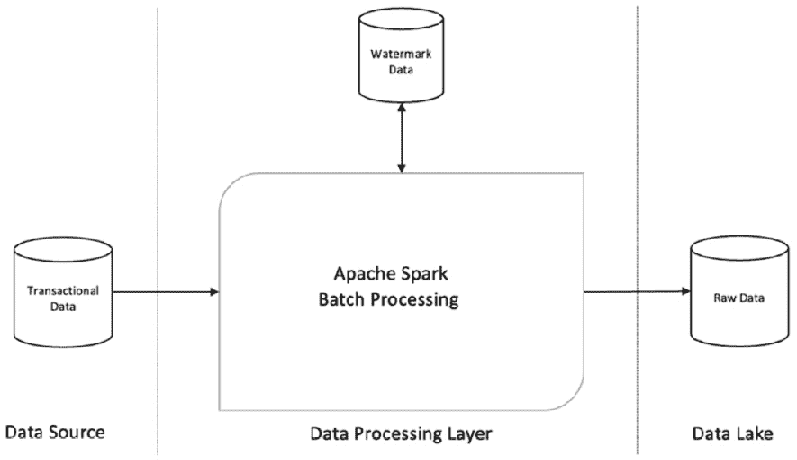

# 第二章：数据摄取

**数据摄取**是将数据从不同的操作系统迁移到中央位置（如数据仓库或数据湖）以便进行处理，并使其适用于数据分析的过程。这是数据分析过程的第一步，对于创建可以集中访问的持久存储至关重要，在这里，数据工程师、数据科学家和数据分析师可以访问、处理和分析数据，以生成业务分析。

你将了解 Apache Spark 作为批量和实时处理的数据摄取引擎的功能。将介绍 Apache Spark 支持的各种数据源以及如何使用 Spark 的 DataFrame 接口访问它们。

此外，你还将学习如何使用 Apache Spark 的内置函数，从外部数据源访问数据，例如**关系数据库管理系统**（**RDBMS**）以及消息队列，如 Apache Kafka，并将其摄取到数据湖中。还将探讨不同的数据存储格式，如结构化、非结构化和半结构化文件格式，以及它们之间的主要差异。Spark 的实时流处理引擎——**结构化流**（Structured Streaming）也将被介绍。你将学习如何使用批处理和实时流处理创建端到端的数据摄取管道。最后，我们将探索一种将批处理和流处理统一的技术——**Lambda 架构**，并介绍如何使用 Apache Spark 实现它。

在本章中，你将学习执行批量和实时数据摄取所需的基本技能，使用 Apache Spark。此外，你将掌握构建端到端可扩展且高效的大数据摄取管道所需的知识和工具。

本章将涵盖以下主要主题：

+   企业决策支持系统简介

+   从数据源摄取数据

+   向数据接收端摄取数据

+   使用文件格式进行数据湖中的数据存储

+   构建批量和实时数据摄取管道

+   使用 Lambda 架构统一批量和实时数据摄取

# 技术要求

在本章中，我们将使用 Databricks 社区版来运行我们的代码。你可以在[`community.cloud.databricks.com`](https://community.cloud.databricks.com)找到它。

注册说明请参见[`databricks.com/try-databricks`](https://databricks.com/try-databricks)。

本章使用的代码可以从[`github.com/PacktPublishing/Essential-PySpark-for-Data-Analytics/tree/main/Chapter02`](https://github.com/PacktPublishing/Essential-PySpark-for-Data-Analytics/tree/main/Chapter02)下载。

本章使用的数据集可以在[`github.com/PacktPublishing/Essential-PySpark-for-Data-Analytics/tree/main/data`](https://github.com/PacktPublishing/Essential-PySpark-for-Data-Analytics/tree/main/data)找到。

# 企业决策支持系统简介

**企业决策支持系统**（**Enterprise DSS**）是一个端到端的数据处理系统，它将企业组织生成的运营和交易数据转换为可操作的洞察。每个企业决策支持系统都有一些标准组件，例如数据源、数据接收器和数据处理框架。企业决策支持系统以原始交易数据为输入，并将其转化为可操作的洞察，如运营报告、企业绩效仪表板和预测分析。

以下图示展示了在大数据环境中典型的企业决策支持系统的组成部分：


图 2.1 – 企业决策支持系统架构

大数据分析系统也是一种企业决策支持系统，但其处理的规模要大得多，涉及的数据种类更多，且数据到达速度更快。作为企业决策支持系统的一种类型，大数据分析系统的组件与传统企业决策支持系统相似。构建企业决策支持系统的第一步是从数据源摄取数据并将其传送到数据接收器。您将在本章中学习这一过程。让我们从数据源开始，详细讨论大数据分析系统的各个组件。

# 从数据源摄取数据

在本节中，我们将了解大数据分析系统使用的各种数据源。典型的数据源包括事务系统（如 RDBMS）、基于文件的数据源（如**数据湖**）以及**消息队列**（如**Apache Kafka**）。此外，您将学习 Apache Spark 内置的连接器，以便从这些数据源摄取数据，并编写代码以查看这些连接器的实际操作。

## 从关系型数据源摄取数据

**事务系统**，或称**操作系统**，是一种数据处理系统，帮助组织执行日常的业务功能。这些事务系统处理单个业务交易，例如零售自助服务亭的交易、在线零售门户下单、航空票务预订或银行交易。这些交易的历史汇总构成了数据分析的基础，分析系统摄取、存储并处理这些交易数据。因此，这类事务系统构成了分析系统的数据源，并且是数据分析的起点。

交易系统有多种形式；然而，最常见的是关系型数据库管理系统（RDBMS）。在接下来的章节中，我们将学习如何从 RDBMS 中摄取数据。

关系型数据源是一组关系型数据库和关系型表，这些表由行和命名列组成。用于与 RDBMS 进行通信和查询的主要编程抽象称为 **结构化查询语言** (**SQL**)。外部系统可以通过 JDBC 和 ODBC 等通信协议与 RDBMS 进行通信。Apache Spark 配备了一个内置的 JDBC 数据源，可以用来与存储在 RDBMS 表中的数据进行通信和查询。

让我们来看一下使用 PySpark 从 RDBMS 表中摄取数据所需的代码，如以下代码片段所示：

```py
dataframe_mysql = spark.read.format("jdbc").options(
    url="jdbc:mysql://localhost:3306/pysparkdb",
    driver = "org.mariadb.jdbc.Driver",
    dbtable = "authors",
    user="#####",
    password="@@@@@").load()
dataframe_mysql.show()
```

在前面的代码片段中，我们使用 `spark.read()` 方法通过指定格式为 `jdbc` 来加载来自 JDBC 数据源的数据。在这里，我们连接到一个流行的开源 RDBMS，名为 `url`，该 URL 指定了 MySQL 服务器的 `jdbc url`，并包含其 `hostname`、`port number` 和 `database name`。`driver` 选项指定了 Spark 用来连接并与 RDBMS 通信的 JDBC 驱动程序。`dtable`、`user` 和 `password` 选项指定了要查询的表名以及进行身份验证所需的凭证。最后，`show()` 函数从 RDBMS 表中读取示例数据并显示在控制台上。

重要提示

前面的代码片段使用了虚拟的数据库凭证，并以纯文本形式显示。这会带来巨大的数据安全风险，并且不推荐这种做法。处理敏感信息时，应遵循适当的最佳实践，比如使用配置文件或其他大数据软件供应商提供的机制，如隐藏或模糊化敏感信息。

要运行此代码，您可以使用自己的 MySQL 服务器并将其配置到您的 Spark 集群中，或者可以使用本章提供的示例代码来设置一个简单的 MySQL 服务器。所需的代码可以在 [`github.com/PacktPublishing/Essential-PySpark-for-Data-Analytics/blob/main/Chapter02/utils/mysql-setup.ipynb`](https://github.com/PacktPublishing/Essential-PySpark-for-Data-Analytics/blob/main/Chapter02/utils/mysql-setup.ipynb) 中找到。

提示

Apache Spark 提供了一个 JDBC 数据源，能够连接几乎所有支持 JDBC 连接并具有 JDBC 驱动程序的关系型数据库管理系统（RDBMS）。然而，它并不自带任何驱动程序；需要从相应的 RDBMS 提供商处获取，并且需要将驱动程序配置到 Spark 集群中，以便 Spark 应用程序可以使用。

## 从基于文件的数据源进行数据摄取

文件型数据源在不同数据处理系统之间交换数据时非常常见。举个例子，假设一个零售商想要用外部数据（如邮政服务提供的邮政编码数据）来丰富他们的内部数据源。这两个组织之间的数据通常通过文件型数据格式进行交换，如 XML 或 JSON，或者更常见的方式是使用分隔符的纯文本或 CSV 格式。

Apache Spark 支持多种文件格式，如纯文本、CSV、JSON 以及二进制文件格式，如 Apache Parquet 和 ORC。这些文件需要存储在分布式文件系统上，如**Hadoop 分布式文件系统**（**HDFS**），或者是基于云的数据湖，如**AWS S3**、**Azure Blob**或**ADLS**存储。

让我们来看一下如何使用 PySpark 从 CSV 文件中读取数据，如下面的代码块所示：

```py
retail_df = (spark
         .read
         .format("csv")
         .option("inferSchema", "true")
         .option("header","true")
         .load("dbfs:/FileStore/shared_uploads/snudurupati@outlook.com/")
      )
retail_df.show()
```

在前面的代码片段中，我们使用 `spark.read()` 函数来读取 CSV 文件。我们将 `inferSchema` 和 `header` 选项设置为 `true`，这有助于 Spark 通过读取数据样本来推断列名和数据类型信息。

重要提示

文件型数据源需要存储在分布式文件系统中。Spark 框架利用数据并行处理，每个 Spark Executor 尝试将数据的一个子集读取到其本地内存中。因此，文件必须存储在分布式文件系统中，并且所有 Executor 和 Driver 都能够访问该文件。HDFS 和基于云的数据湖，如 AWS S3、Azure Blob 和 ADLS 存储，都是分布式数据存储层，是与 Apache Spark 一起使用的理想文件型数据源。

在这里，我们从`dbfs/`位置读取 CSV 文件，这是 Databricks 的专有文件系统，称为**Databricks 文件系统**（**DBFS**）。DBFS 是一个抽象层，实际上使用的是 AWS S3、Azure Blob 或 ADLS 存储。

提示

由于每个 Executor 只尝试读取数据的一个子集，因此文件类型必须是可拆分的。如果文件不能拆分，Executor 可能会尝试读取比其可用内存更大的文件，从而导致内存溢出并抛出“内存不足”错误。一个不可拆分文件的例子是`gzipped`的 CSV 文件或文本文件。

## 从消息队列中读取数据

另一种在实时流处理分析中常用的数据源是**消息队列**。消息队列提供了一种发布-订阅模式的数据消费方式，其中发布者将数据发布到队列，而多个订阅者可以异步地消费数据。在**分布式计算**环境中，消息队列需要是分布式的、容错的，并且可扩展的，以便作为分布式数据处理系统的数据源。

其中一个消息队列是 Apache Kafka，它在与 Apache Spark 一起处理实时流式工作负载时非常突出。Apache Kafka 不仅仅是一个消息队列；它本身是一个端到端的分布式流处理平台。然而，在我们的讨论中，我们将 Kafka 视为一个分布式、可扩展且容错的消息队列。

让我们看一下使用 PySpark 从 Kafka 导入数据的代码，如下面的代码块所示：

```py
kafka_df = (spark.read
        .format("kafka")
        .option("kafka.bootstrap.servers", "localhost:9092")
        .option("subscribe", "wordcount")
        .option("startingOffsets", "earliest")
        .load()
        )
kafka_df.show()
```

在前面的代码示例中，我们使用`spark.read()`通过提供*主机名*和*端口号*，从 Kafka 服务器加载数据，主题名为`wordcount`。我们还指定了 Spark 应该从队列的最开始处读取*事件*，使用`StartingOffsets`选项。尽管 Kafka 通常用于与 Apache Spark 一起处理流式用例，但这个前面的代码示例将 Kafka 作为批量处理数据的数据源。你将在*使用结构化流实时导入数据*部分学习如何使用 Kafka 和 Apache Spark 处理流。

提示

在 Kafka 术语中，单个队列称为*主题*，而每个事件称为*偏移量*。Kafka 是一个队列，因此它按照事件发布到主题的顺序处理事件，个别消费者可以选择自己的起始和结束偏移量。

现在你已经熟悉了使用 Apache Spark 从不同类型的**数据源**导入数据，在接下来的部分中，让我们学习如何将数据导入到**数据汇**中。

# 导入数据到数据汇

数据汇，顾名思义，是用于存储原始或处理过的数据的存储层，既可以用于短期暂存，也可以用于长期持久存储。尽管*数据汇*一词通常用于实时数据处理，但没有特定的限制，任何存储层中存放导入数据的地方都可以称为数据汇。就像数据源一样，数据汇也有不同的类型。你将在接下来的章节中学习一些最常见的类型。

## 导入到数据仓库

**数据仓库**是一种特定类型的持久数据存储，最常用于商业智能类型的工作负载。商业智能和数据仓库是一个完整的研究领域。通常，数据仓库使用 RDBMS 作为其数据存储。然而，数据仓库与传统数据库不同，它遵循一种特定的数据建模技术，称为**维度建模**。维度模型非常直观，适合表示现实世界的业务属性，并有利于用于构建商业报告和仪表板的商业智能类型查询。数据仓库可以建立在任何通用 RDBMS 上，或者使用专业的硬件和软件。

让我们使用 PySpark 将 DataFrame 保存到 RDBMS 表中，如下面的代码块所示：

```py
wordcount_df = spark.createDataFrame(
    [("data", 10), ("parallel", 2), ("Processing", 30),       	     ("Spark", 50), ("Apache", 10)], ("word", "count"))
```

在前面的代码块中，我们通过编程方式从一个 Python `List` 对象创建了一个包含两列的 DataFrame。然后，我们使用 `spark.write()` 函数将 Spark DataFrame 保存到 MySQL 表中，如下所示的代码片段所示：

```py
wordcount_df.write.format("jdbc").options(
    url="jdbc:mysql://localhost:3306/pysparkdb",
    driver = "org.mariadb.jdbc.Driver",
    dbtable = "word_counts",
    user="######",
    password="@@@@@@").save()
```

前面的代码片段写入数据到 RDBMS 与读取数据的代码几乎相同。我们仍然需要使用 MySQL JDBC 驱动程序，并指定*主机名*、*端口号*、*数据库名*和*数据库凭据*。唯一的区别是，在这里，我们需要使用 `spark.write()` 函数，而不是 `spark.read()`。

## 向数据湖中注入数据

数据仓库非常适合直观地表示现实世界的业务数据，并以有利于商业智能类型工作负载的方式存储高度结构化的关系型数据。然而，当处理数据科学和机器学习类型工作负载所需的非结构化数据时，数据仓库就显得不足。数据仓库不擅长处理大数据的高*体积*和*速度*。这时，数据湖就填补了数据仓库留下的空白。

从设计上讲，数据湖在存储各种类型的数据时具有高度的可扩展性和灵活性，包括高度结构化的关系型数据以及非结构化数据，如图像、文本、社交媒体、视频和音频。数据湖也擅长处理批量数据和流数据。随着云计算的兴起，数据湖如今变得非常普遍，并且似乎是所有大数据分析工作负载的持久存储的未来。数据湖的一些例子包括 Hadoop HDFS、AWS S3、Azure Blob 或 ADLS 存储以及 Google Cloud 存储。

基于云的数据湖相较于本地部署的版本有一些优势：

+   它们是按需的，并且具有无限的可扩展性。

+   它们是按使用量计费的，从而节省了前期投资。

+   它们与计算资源完全独立；因此，存储可以独立于计算资源进行扩展。

+   它们支持结构化数据和非结构化数据，并同时支持批处理和流式处理，使得同一存储层可以用于多个工作负载。

由于上述优势，基于云的数据湖在过去几年变得越来越流行。Apache Spark 将这些数据湖视为另一种基于文件的数据存储。因此，使用 Spark 操作数据湖就像操作任何其他基于文件的数据存储层一样简单。

让我们来看一下使用 PySpark 将数据保存到数据湖是多么简单，如下所示的代码示例：

```py
(wordcount_df
        .write
        .option("header", "true")
        .mode("overwrite")
        .save("/tmp/data-lake/wordcount.csv")
)
```

在前面的代码块中，我们将前一节中创建的 `wordcount_df` DataFrame 保存到数据湖中的 CSV 格式，使用的是 DataFrame 的 `write()` 函数。`mode` 选项指示 `DataFrameWriter` 替换指定文件位置中任何现有的数据；请注意，你也可以使用 `append` 模式。

## 向 NoSQL 和内存数据存储中注入数据

数据仓库一直以来都是数据分析用例的传统持久存储层，而数据湖作为新的选择，正在崛起，旨在满足更广泛的工作负载。然而，还有其他涉及超低延迟查询响应时间的大数据分析用例，这些用例需要特定类型的存储层。两种这样的存储层是 NoSQL 数据库和内存数据库，本节将详细探讨这两种存储层。

### 用于大规模操作分析的 NoSQL 数据库

NoSQL 数据库是传统关系型数据库的替代方案，主要用于处理杂乱且非结构化的数据。NoSQL 数据库在以 **键值** 对的形式存储大量非结构化数据方面表现非常出色，并且能够在高并发情况下，以常数时间高效地检索任何给定 **键** 对应的 **值**。

假设一个业务场景，其中一家企业希望通过毫秒级的查询响应时间，以高度并发的方式向单个客户提供预计算的、超个性化的内容。像 Apache Cassandra 或 MongoDB 这样的 NoSQL 数据库将是这个用例的理想选择。

注意

Apache Spark 并不自带针对 NoSQL 数据库的连接器。然而，这些连接器由各自的数据库提供商构建和维护，可以从相应的提供商处下载，并与 Apache Spark 配置使用。

### 内存数据库用于超低延迟分析

内存数据库仅将数据存储在内存中，不涉及磁盘等持久存储。正是由于这一特点，内存数据库在数据访问速度上比基于磁盘的数据库更快。一些内存数据库的例子包括 **Redis** 和 **Memcached**。由于系统内存有限且存储在内存中的数据在断电后无法持久保存，因此内存数据库不适合用于存储大量历史数据，这在大数据分析系统中是典型需求。然而，它们在涉及超低延迟响应时间的实时分析中有其应用。

假设有一家在线零售商希望在顾客结账时，在其在线门户上展示产品的预计运输交付时间。大多数需要估算交货时间的参数可以预先计算。然而，某些参数，如客户邮政编码和位置，只有在客户结账时提供时才能获得。在这种情况下，需要立即从 Web 门户收集数据，利用超快的事件处理系统进行处理，然后将结果计算并存储在超低延迟的存储层中，以便通过 Web 应用程序访问并返回给客户。所有这些处理应该在几秒钟内完成，而像 Redis 或 Memcached 这样的内存数据库将充当超低延迟数据存储层的角色。

到目前为止，你已经学习了如何访问来自不同数据源的数据并将其导入到各种数据接收端。此外，你已经了解到你对数据源的控制有限，但你对数据接收端有完全的控制。为某些高并发、超低延迟的用例选择正确的数据存储层非常重要。然而，对于大多数大数据分析用例，数据湖已成为首选的持久数据存储层，几乎成了事实上的标准。

另一个优化数据存储的关键因素是数据的实际格式。在接下来的部分，我们将探讨几种数据存储格式及其相对优点。

# 使用文件格式在数据湖中存储数据

你选择用于在数据湖中存储数据的文件格式对数据存储和检索的便捷性、查询性能以及存储空间有关键影响。因此，选择一个可以平衡这些因素的最佳数据格式至关重要。数据存储格式大致可以分为结构化、非结构化和半结构化格式。在本节中，我们将通过代码示例探讨这几种类型。

## 非结构化数据存储格式

非结构化数据是指没有预定义数据模型表示的数据，可以是人工或机器生成的。例如，非结构化数据可以是存储在纯文本文件、PDF 文件、传感器数据、日志文件、视频文件、图像、音频文件、社交媒体流等中的数据。

非结构化数据可能包含重要的模式，提取这些模式可能带来有价值的见解。然而，由于以下原因，以非结构化格式存储数据并不十分有用：

+   非结构化数据可能并不总是具有固有的压缩机制，并且可能占用大量存储空间。

+   对非结构化文件进行外部压缩可以节省空间，但会消耗用于文件压缩和解压的处理能力。

+   存储和访问非结构化文件比较困难，因为它们本身缺乏任何模式信息。

鉴于上述原因，摄取非结构化数据并在将其存储到数据湖之前将其转换为结构化格式是合理的。这样可以使后续的数据处理更加轻松和高效。让我们看一个例子，我们将一组非结构化的图像文件转换为图像属性的 DataFrame，然后使用 CSV 文件格式存储它们，如下所示的代码片段所示：

```py
Raw_df = spark.read.format("image").load("/FileStore/FileStore/shared_uploads/images/")
raw_df.printSchema()
image_df = raw_df.select("image.origin", "image.height", "image.width", "image.nChannels", "image.mode", "image.data")
image_df.write.option("header", "true").mode("overwrite").csv("/tmp/data-lake/images.csv") 
```

在之前的代码块中，发生了以下情况：

+   我们使用 Spark 内置的`image`格式加载一组图像文件，结果是一个包含图像属性的 Spark DataFrame。

+   我们使用`printSchema()`函数查看 DataFrame 的模式，并发现 DataFrame 有一个名为`image`的单一嵌套列，其中包含`origin`、`height`、`width`、`nChannels`等作为其内部属性。

+   然后，我们使用`image`前缀将内部属性提升到顶层，例如`image.origin`，并创建一个新的 DataFrame，命名为`image_df`，其中包含图像的所有单独属性作为顶层列。

+   现在我们已经得到了最终的 DataFrame，我们将其以 CSV 格式写入数据湖。

+   在浏览数据湖时，你可以看到该过程向数据湖写入了几个 CSV 文件，文件大小大约为 127 字节。

    提示

    写入存储的文件数量取决于 DataFrame 的分区数量。DataFrame 的分区数量取决于执行器核心的数量以及`spark.sql.shuffle.partitions`的 Spark 配置。每当 DataFrame 进行洗牌操作时，这个数量也会发生变化。在 Spark 3.0 中，**自适应查询执行**会自动管理最优的洗牌分区数量。

文件大小和查询性能是考虑文件格式时的两个重要因素。因此，我们进行一个快速测试，在 DataFrame 上执行一个适度复杂的操作，如以下代码块所示：

```py
from pyspark.sql.functions import max, lit
temp_df = final_df.withColumn("max_width", lit(final_df.agg(max("width")).first()[0]))
temp_df.where("width == max_width").show()
```

前面的代码块首先创建了一个新列，其中每一行的值为所有行中最大的宽度。然后，它过滤掉具有`width`列最大值的行。这个查询是适度复杂的，典型的数据分析查询类型。在我们的示例测试中，在一个非结构化二进制文件上运行的查询大约花费了*5.03 秒*。在接下来的章节中，我们将查看其他文件格式上的相同查询，并比较查询性能。

## 半结构化数据存储格式

在前面的示例中，我们能够获取一个二进制图像文件，提取其属性，并将其存储为 CSV 格式，这使得数据结构化，但仍保持人类可读格式。CSV 格式是另一种数据存储格式，称为半结构化数据格式。半结构化数据格式与非结构化数据格式类似，没有预定义的数据模型。然而，它们以一种方式组织数据，使得从文件本身推断模式信息变得更加容易，而无需提供外部元数据。它们是不同数据处理系统之间交换数据的流行数据格式。半结构化数据格式的示例包括 CSV、XML 和 JSON。

让我们看看如何使用 PySpark 处理半结构化数据的示例，如以下代码块所示：

```py
csv_df = spark.read.options(header="true", inferSchema="true").csv("/tmp/data-lake/images.csv")
csv_df.printSchema()
csv_df.show() 
```

前面的代码示例使用在先前图像处理示例中生成的 CSV 文件，并将其加载为 Spark 数据框。我们启用了从实际数据推断列名和数据类型的选项。`printSchema()`函数显示 Spark 能够正确推断所有列的数据类型，除了来自半结构化文件的二进制数据列。`show()`函数显示数据框已经从 CSV 文件中正确重建，并且包含列名。

我们将在`csv_df`数据框上运行一个适度复杂的查询，如下所示代码块：

```py
from pyspark.sql.functions import max, lit
temp_df = csv_df.withColumn("max_width", lit(csv_df.agg(max("width")).first()[0]))
temp_df.where("width == max_width").show()
```

在前面的代码块中，我们执行了一些数据框操作，以获取`width`列最大值的行。使用 CSV 数据格式执行的代码花费了*1.24 秒*，而我们在*非结构化数据存储格式*部分执行的类似代码大约花费了*5 秒*。因此，显然，半结构化文件格式比非结构化文件更适合数据存储，因为从这种数据存储格式中推断模式信息相对更容易。

然而，请注意前面代码片段中`show()`函数的结果。包含二进制数据的数据列被错误地推断为字符串类型，并且列数据被截断。因此，需要注意的是，半结构化格式并不适合表示所有数据类型，并且在从一种数据格式转换到另一种数据格式时，某些数据类型可能会丢失信息。

## 结构化数据存储格式

结构化数据遵循预定义的数据模型，具有表格格式，具有明确定义的行和命名列以及定义的数据类型。结构化数据格式的一些示例包括关系数据库表和事务系统生成的数据。请注意，还有一些完全结构化数据及其数据模型的文件格式，如 Apache Parquet、Apache Avro 和 ORC 文件，它们可以轻松存储在数据湖中。

**Apache Parquet**是一种二进制、压缩的列式存储格式，旨在提高数据存储效率和查询性能。Parquet 是 Apache Spark 框架的一级公民，Spark 的内存存储格式**Tungsten**旨在充分利用 Parquet 格式。因此，当你的数据存储在 Parquet 格式中时，你将从 Spark 中获得最佳的性能和效率。

注意

Parquet 文件是一种二进制文件格式，意味着文件的内容经过二进制编码。因此，它们不可供人类阅读，不像基于文本的文件格式，如 JSON 或 CSV。然而，这种格式的一个优点是，机器可以轻松解析这些文件，并且在编码和解码过程中不会浪费时间。

让我们将`image_df` DataFrame（包含来自*未结构化数据存储格式*部分的图像属性数据）转换为 Parquet 格式，如下所示的代码块所示：

```py
final_df.write.parquet("/tmp/data-lake/images.parquet")
parquet_df = spark.read.parquet("/tmp/data-lake/images.parquet")
parquet_df.printSchema()
parquet_df.show()
```

上一个代码块将二进制图像文件加载到 Spark DataFrame 中，并将数据以 Parquet 格式写回数据湖。`show()`函数的结果显示，*data*列中的二进制数据并未被截断，并且已经从源图像文件中如实保留。

让我们执行一个中等复杂度的操作，如下所示的代码块：

```py
temp_df = parquet_df.withColumn("max_width", lit(parquet_df.agg(max("width")).first()[0]))
temp_df.where("width == max_width").show()
```

上述代码块提取了列名为`width`的最大值所在的行。该查询大约需要*4.86 秒*来执行，而使用原始未结构化的图像数据时则需要超过*5 秒*。因此，这使得结构化的 Parquet 文件格式成为在 Apache Spark 数据湖中存储数据的最佳格式。表面上看，半结构化的 CSV 文件执行查询所需时间较短，但它们也截断了数据，导致它们并不适合所有使用场景。作为一个通用的经验法则，几乎所有 Apache Spark 的使用场景都推荐使用 Parquet 数据格式，除非某个特定的使用场景需要其他类型的数据存储格式。

到目前为止，你已经看到选择合适的数据格式会影响数据的正确性、易用性、存储效率、查询性能和可扩展性。此外，无论你使用哪种数据格式，将数据存储到数据湖中时，还有另一个需要考虑的因素。这个技术叫做**数据分区**，它可以真正决定你的下游查询性能是成功还是失败。

简而言之，数据分区是将数据物理地划分到多个文件夹或分区中的过程。Apache Spark 利用这些分区信息，只将查询所需的相关数据文件加载到内存中。这一机制称为**分区剪枝**。你将会在*第三章*，*数据清理与整合*中了解更多关于数据分区的内容。

到目前为止，你已经了解了企业决策支持系统（DSS）的各个组成部分，即数据源、数据目标和数据存储格式。此外，在上一章中，你对 Apache Spark 框架作为大数据处理引擎也有了一定的了解。现在，让我们运用这些知识，构建一个端到端的数据摄取管道。

# 构建批处理和实时数据摄取管道

一个端到端的数据摄取管道涉及从数据源读取数据，并将其摄取到数据目标中。在大数据和数据湖的背景下，数据摄取通常涉及大量数据源，因此需要一个高可扩展性的数据处理引擎。市场上有一些专门的工具，旨在处理大规模数据摄取，例如 StreamSets、Qlik、Fivetran、Infoworks 等第三方供应商提供的工具。此外，云服务提供商也有其自有的本地工具，例如 AWS 数据迁移服务、Microsoft Azure 数据工厂和 Google Dataflow。还有一些免费的开源数据摄取工具可以考虑使用，例如 Apache Sqoop、Apache Flume、Apache Nifi 等。

提示

Apache Spark 足够适合用于临时数据摄取，但将 Apache Spark 作为专门的数据摄取引擎并不是行业中的常见做法。相反，您应该考虑选择一个专门的、为数据摄取需求量身定制的工具。您可以选择第三方供应商提供的工具，或者选择自己管理一个开源工具。

在本节中，我们将探讨 Apache Spark 在批量处理和流处理方式下的数据摄取能力。

## 批量处理的数据摄取

批量处理是指一次处理一组或一批数据。批量处理通常是在预定的时间间隔内运行的，且不需要用户干预。通常情况下，批量处理会安排在夜间、业务时间之外运行。其简单的原因在于，批量处理通常需要从操作系统中读取大量的事务数据，这会给操作系统带来很大的负担。这是不可取的，因为操作系统对于企业的日常运营至关重要，我们不希望给事务系统带来那些对日常业务操作没有关键影响的工作负载。

此外，批量处理任务通常是重复性的，因为它们会在固定的时间间隔内运行，每次都会引入自上次成功的批处理以来生成的新数据。批量处理可以分为两种类型，分别是 **完整数据加载** 和 **增量数据加载**。

### 完整数据加载

完全数据加载涉及完全覆盖现有数据集。这对于数据量相对较小且变化不频繁的数据集非常有用。它也是一个更容易实现的过程，因为我们只需要扫描整个源数据集并完全覆盖目标数据集。无需维护任何关于上次数据导入作业的状态信息。以数据仓库中的维度表为例，例如日历表或包含所有零售商实体店数据的表。这些表变化不大且相对较小，非常适合进行完全数据加载。虽然实现简单，但在处理非常大的源数据集并且数据经常变化时，完全数据加载有其缺点。

假设我们考虑一个大型零售商的交易数据，该零售商在全国拥有超过一千家门店，每家门店每月产生大约 500 笔交易。换算下来，大约每天有 15,000 笔交易被导入数据湖。考虑到历史数据，这个数字会迅速增加。假设我们刚开始构建数据湖，目前只导入了大约 6 个月的交易数据。即使在这种规模下，我们的数据集中已经有了 300 万条交易记录，完全清空并重新加载数据集并非一项轻松的任务。

另一个需要考虑的重要因素是，通常操作系统只保留小时间间隔的历史数据。在这里，完全加载意味着也会丢失数据湖中的历史数据。此时，您应考虑增量加载来进行数据导入。

### 增量数据加载

在增量数据加载过程中，我们只导入在上次成功的数据导入后，数据源中新创建的一组数据。这个增量数据集通常被称为 delta（增量集）。与完全加载相比，增量加载导入的数据集更小，并且由于我们已经在 delta 湖中维护了完整的历史数据，因此增量加载不需要依赖数据源来维护完整的历史记录。

基于前面提到的零售商示例，假设我们每晚运行一次增量批量加载。在这种情况下，我们每天只需要将 15,000 笔交易导入数据湖，这相对容易管理。

设计增量数据导入管道并不像设计完全加载管道那么简单。需要维护增量作业上次运行的状态信息，以便我们能够识别所有来自数据源的尚未导入到数据湖中的新记录。这个状态信息被存储在一个特殊的数据结构中，称为*水印*表。这个水印表需要由数据导入作业来更新和维护。一个典型的数据导入管道如下图所示：



图 2.2 – 数据摄取

上面的图示展示了一个典型的使用 Apache Spark 的数据摄取管道，并且包含了用于增量加载的水印表。在这里，我们使用 Spark 内建的数据源从源系统摄取原始交易数据，使用 DataFrame 操作进行处理，然后将数据发送回数据湖。

在扩展上一节的零售示例时，让我们使用 PySpark 构建一个端到端的数据摄取管道，采用批处理方式。构建数据管道的一个前提条件当然是数据，对于这个示例，我们将使用*UC Irvine 机器学习库*提供的*在线零售*数据集。该数据集以 CSV 格式存放在本章*技术要求*部分提到的 GitHub 仓库中。*在线零售*数据集包含了一个在线零售商的交易数据。

我们将下载包含两个 CSV 文件的数据集，并通过笔记本文件菜单中的上传接口将它们上传到*Databricks Community Edition*笔记本环境。一旦数据集上传完成，我们将记录文件位置。

注意

如果你使用的是自己的 Spark 环境，请确保数据集存放在 Spark 集群可以访问的位置。

现在，我们可以开始实际的代码部分，构建数据摄取管道，如以下代码示例所示：

```py
retail_df = (spark
                 .read
                 .option("header", "true")
                 .option("inferSchema", "true")
                 .csv("/FileStore/shared_uploads/online_retail/online_retail.csv")
            )
```

在前面的代码块中，我们启用了`header`和`inferSchema`选项来加载 CSV 文件。这会创建一个包含八个列及其相应数据类型和列名的 Spark DataFrame。现在，让我们将这些数据以 Parquet 格式摄取到数据湖中，如以下代码块所示：

```py
(retail_df
       .write
       .mode("overwrite")
       .parquet("/tmp/data-lake/online_retail.parquet")
)
```

在这里，我们将包含原始零售交易数据的`retail_df` Spark DataFrame 使用 DataFrameWriter 的`write()`函数保存到数据湖中，以 Parquet 格式存储。我们还将`mode`选项设置为`overwrite`，基本上执行的是全量数据加载。

需要注意的一点是，整个数据摄取作业仅仅是**10**行代码，而且它可以轻松扩展到数千万条记录，处理多达数个 PB 的数据。这就是 Apache Spark 的强大与简洁，它使得 Apache Spark 在极短的时间内成为大数据处理的事实标准。那么，你将如何扩展前述的数据摄取批处理作业，并最终将其投入生产环境呢？

Apache Spark 是从头开始构建的，旨在具备可扩展性，其可扩展性完全依赖于集群上作业可用的核心数量。因此，要扩展你的 Spark 作业，你只需为作业分配更多的处理核心。大多数商业化的 Spark 作为托管服务的提供方案都提供了便捷的**自动扩展**功能。通过此自动扩展功能，你只需指定集群的最小和最大节点数，**集群管理器**就能动态计算出为你的作业分配的最优核心数。

大多数商业化的 Spark 提供方案也配备了内置的**作业调度器**，并支持将笔记本直接作为作业进行调度。外部调度器，从简单的**crontab**到复杂的作业协调器如**Apache Airflow**，也可以用来将 Spark 作业生产化。这大大简化了集群容量规划的过程，帮助你腾出时间，专注于实际的数据分析，而不是在容量规划、调优和维护 Spark 集群上耗费时间和精力。

到目前为止，在本节中，你已经查看了一个完整加载批处理摄取作业的示例，该作业从数据源加载整个数据集，并覆盖数据湖中的数据集。你需要添加一些业务逻辑，以在水印数据结构中维护摄取作业的状态，然后计算增量进行增量加载。你可以自己构建所有这些逻辑，或者，也可以简单地使用 Spark 的结构化流处理引擎来为你完成繁重的工作，正如接下来的部分将讨论的那样。

## 使用结构化流处理进行实时数据摄取

企业通常需要在实时做出战术决策的同时进行战略决策，以保持竞争力。因此，实时将数据摄取到数据湖的需求应运而生。然而，跟上大数据的快速数据*速度*需要一个强大且可扩展的流处理引擎。Apache Spark 就有这样一个流处理引擎，叫做**结构化流处理**，我们接下来将探讨它。

### 结构化流处理入门

**结构化流处理**是一个基于 Spark SQL 引擎的 Spark 流处理引擎。与 Spark 的其他所有组件一样，结构化流处理也具备可扩展性和容错性。由于结构化流处理基于 Spark SQL 引擎，你可以使用与批处理一样的 Spark DataFrame API 来进行流处理。结构化流处理支持 DataFrame API 所支持的所有函数和构造。

结构化流处理将每个传入的数据流视为一批小数据，称为*微批次（micro-batch）*，并不断将每个微批次附加到目标数据集。结构化流处理的编程模型持续处理微批次，将每个微批次视为一个批处理作业。因此，现有的 Spark 批处理作业可以通过少量的修改轻松转换为流处理作业。结构化流处理旨在提供最大吞吐量，这意味着结构化流处理作业可以扩展到集群中的多个节点，并以分布式方式处理大量传入数据。

结构化流处理还具备额外的故障容忍能力，保证精确一次语义（exactly-once semantics）。为了实现这一点，结构化流处理跟踪数据处理进度。它通过**检查点（checkpointing）**和**预写日志（write-ahead logs）**等概念，跟踪任何时刻处理的偏移量或事件。预写日志是关系型数据库中的一个概念，用来保证数据库的原子性和持久性。在此技术中，记录会先写入日志，然后再写入最终的数据库。检查点是结构化流处理中另一种技术，它将当前读取的偏移量位置记录在持久化存储系统中。

通过这些技术，结构化流处理能够记录流中最后一个处理过的偏移量的位置，使其具备在流处理作业失败时从中断点恢复处理的能力。

注意

我们建议将检查点存储在具有高可用性和分区容忍支持的持久化存储中，例如基于云的数据湖。

这些技术（检查点、预写日志和可重放的流式数据源）以及支持重新处理数据的流式数据接收器，使得结构化流处理能够保证每个流事件都被处理一次且仅处理一次。

注意

结构化流处理的微批处理模型不适合处理源端事件发生时立即进行处理。像 Apache Flink 或 Kafka Streams 这样的其他流处理引擎，更适合超低延迟的流处理。

### 增量加载数据

由于结构化流处理（Structured Streaming）内置了机制，帮助你轻松维护增量加载所需的状态信息，因此你可以简单地选择结构化流处理来处理所有增量加载，真正简化你的架构复杂性。让我们构建一个管道，以实时流式方式执行增量加载。

通常，我们的数据摄取从已经加载到数据源的数据开始，例如数据湖或像 Kafka 这样的消息队列。在这里，我们首先需要将一些数据加载到 Kafka 主题中。你可以从一个已经在主题中包含数据的现有 Kafka 集群开始，或者你可以设置一个快速的 Kafka 服务器，并使用[`github.com/PacktPublishing/Essential-PySpark-for-Data-Analytics/blob/main/Chapter02/utils/kafka-setup.ipynb`](https://github.com/PacktPublishing/Essential-PySpark-for-Data-Analytics/blob/main/Chapter02/utils/kafka-setup.ipynb)中提供的代码加载*在线零售*数据集。

让我们来看一下如何使用结构化流处理从 Kafka 实时摄取数据到数据湖，以下是相关的代码片段：

```py
from pyspark.sql.types import StructType, StructField, StringType, IntegerType, TimestampType, DoubleType
eventSchema = ( StructType()
  .add('InvoiceNo', StringType()) 
  .add('StockCode', StringType())
  .add('Description', StringType()) 
  .add('Quantity', IntegerType()) 
  .add('InvoiceDate', StringType()) 
  .add('UnitPrice', DoubleType()) 
  .add('CustomerID', IntegerType()) 
  .add('Country', StringType())     
)
```

在前面的代码块中，我们声明了所有我们打算从 Kafka 事件中读取的列及其数据类型。结构化流处理要求数据模式必须提前声明。一旦定义了模式，我们就可以开始从 Kafka 主题中读取数据，并将其加载到 Spark DataFrame 中，如以下代码块所示：

```py
kafka_df = (spark
                 .readStream
                   .format("kafka")
                   .option("kafka.bootstrap.servers", 
                           "localhost:9092")
                   .option("subscribe", "retail_events")
                   .option("startingOffsets", "earliest")
                 .load()
            )
```

在前面的代码块中，我们开始从一个 Kafka 主题 `retail_events` 中读取事件流，并告知 Kafka 我们希望从流的开始处加载事件，使用 `startingOffsets` 选项。Kafka 主题中的事件遵循键值对模式。这意味着我们的实际数据被编码在 `value` 列中的 JSON 对象内，我们需要提取这些数据，如下代码块所示：

```py
from pyspark.sql.functions import col, from_json, to_date
retail_df = (kafka_df
              .select(from_json(col("value").cast(StringType()), eventSchema).alias("message"), col("timestamp").alias("EventTime"))
              .select("message.*", "EventTime")
)
```

在前面的代码块中，我们通过传递之前定义的数据模式对象，使用 `from_json()` 函数提取数据。这样会得到一个 `retail_df` DataFrame，其中包含我们需要的事件所有列。此外，我们从 Kafka 主题中附加了一个 `EventTime` 列，它显示了事件实际到达 Kafka 的时间。这个信息在之后的进一步数据处理过程中可能会有所帮助。由于这个 DataFrame 是通过 `readStream()` 函数创建的，Spark 本身就知道这是一个流式 DataFrame，并为该 DataFrame 提供了结构化流处理 API。

一旦我们从 Kafka 流中提取了原始事件数据，就可以将其持久化到数据湖中，如以下代码块所示：

```py
base_path = "/tmp/data-lake/retail_events.parquet"
(retail_df
  .withColumn("EventDate", to_date(retail_df.EventTime))
    .writeStream
      .format('parquet')
      .outputMode("append")
      .trigger(once=True)
      .option('checkpointLocation', base_path + '/_checkpoint')
  .start(base_path)
)
```

在前面的代码块中，我们利用了 `writeStream()` 函数，这是流式 DataFrame 提供的功能，可以以流式方式将数据保存到数据湖中。在这里，我们以 Parquet 格式写入数据，结果数据湖中的数据将是一组 `.parquet` 文件。保存后，这些 Parquet 文件与任何其他由批处理或流处理创建的 Parquet 文件没有区别。

此外，我们将`outputMode`设置为`append`，以表明我们将其视为一个无界数据集，并将继续追加新的 Parquet 文件。`checkpointLocation`选项存储结构化流处理的写前日志及其他检查点信息。这使其成为一个增量数据加载作业，因为流处理仅基于存储在检查点位置的偏移信息处理新的和未处理的事件。

注意

结构化流处理支持`complete`和`update`模式，除了`append`模式外。关于这些模式的描述以及何时使用它们，可以在 Apache Spark 的官方文档中找到，网址为[`spark.apache.org/docs/latest/structured-streaming-programming-guide.html#output-modes`](https://spark.apache.org/docs/latest/structured-streaming-programming-guide.html#output-modes)。

那如果你需要将增量数据加载作业作为较少频繁的批处理作业运行，而不是以持续流处理方式运行呢？

结构化流处理也支持这种情况，方法是通过`trigger`选项。我们可以将`once=True`用于该选项，流处理作业将在外部触发时处理所有新的和未处理的事件，然后在没有新的事件需要处理时停止流处理。我们可以根据时间间隔安排该作业定期运行，它的行为就像一个批处理作业，但具备增量加载的所有优势。

总结来说，Spark SQL 引擎的 DataFrame API 在批量数据处理和流处理方面都非常强大且易于使用。静态 DataFrame 和流式 DataFrame 在功能和工具方面有一些微小的差别。然而，在大多数情况下，使用 DataFrame 的批处理和流处理编程模型非常相似。这减少了学习曲线，有助于使用 Apache Spark 的统一分析引擎来统一批处理和流处理。

现在，在下一节中，让我们探讨如何使用 Apache Spark 实现一个统一的数据处理架构，采用的概念就是**Lambda 架构**。

# 使用 Lambda 架构统一批量数据和实时数据

批量数据处理和实时数据处理是现代企业决策支持系统（DSS）中的重要组成部分，能够无缝实现这两种数据处理技术的架构有助于提高吞吐量、减少延迟，并使您能够更快速地获得最新数据。这样的架构被称为**Lambda 架构**，我们接下来将详细探讨。

## Lambda 架构

Lambda 架构是一种数据处理技术，用于以单一架构摄取、处理和查询历史数据与实时数据。在这里，目标是提高吞吐量、数据新鲜度和容错性，同时为最终用户提供历史数据和实时数据的统一视图。以下图示展示了一个典型的 Lambda 架构：


图 2.3 – Lambda 架构

如前图所示，Lambda 架构由三个主要组件组成，即 **批处理层**、**速度层** 和 **服务层**。我们将在接下来的章节中讨论这几个层。

## 批处理层

批处理层就像任何典型的 ETL 层，涉及从源系统批量处理数据。这个层通常涉及定期运行的调度作业，通常在晚上进行。

Apache Spark 可用于构建批处理作业或按计划触发的结构化流式作业，也可用于批处理层构建数据湖中的历史数据。

## 速度层

速度层持续从数据湖中与批处理层相同的数据源中摄取数据，生成实时视图。速度层不断提供批处理层尚未提供的最新数据，这是由于批处理层固有的延迟。Spark Structured Streaming 可用于实现低延迟的流式作业，持续从源系统中摄取最新数据。

## 服务层

服务层将批处理层中的历史数据和速度层中的最新数据合并为一个视图，以支持终端用户的临时查询。Spark SQL 是服务层的一个优秀候选，它可以帮助用户查询批处理层中的历史数据以及速度层中的最新数据，并为用户呈现一个统一的数据视图，以便进行低延迟的临时查询。

在前面的章节中，你实现了批处理和流式处理的数据摄取作业。现在，让我们探讨如何将这两种视图结合起来，向用户提供一个统一的视图，如下所示的代码片段所示：

```py
batch_df = spark.read.parquet("/tmp/data-lake/online_retail.parquet")
speed_df = spark.read.parquet("/tmp/data-lake/retail_events.parquet").drop("EventDate").drop("EventTime")
serving_df = batch_df.union(speed_df)
serving_df.createOrReplaceGlobalTempView("serving_layer")
```

在前面的代码块中，我们创建了两个 DataFrame，一个是通过`union`函数将这两个 DataFrame 合并，然后使用合并后的 DataFrame 创建一个 **Spark Global Temp View**。结果是一个可以在集群中所有 **Spark Sessions** 中访问的视图，它为你提供了跨批处理层和速度层的数据统一视图，如下代码所示：

```py
%sql
SELECT count(*) FROM global_temp.serving_layer;
```

前面的代码行是一个 SQL 查询，它查询来自 Spark 全局视图的数据，Spark 全局视图充当 **服务层**，并可以呈现给终端用户，以便跨最新数据和历史数据进行临时查询。

通过这种方式，您可以利用 Apache Spark SQL 引擎的 DataFrame、结构化流处理和 SQL API 来构建一个 Lambda 架构，从而提高数据的新鲜度、吞吐量，并提供统一的数据视图。然而，Lambda 架构的维护较为复杂，因为它有两个独立的数据导入管道，分别用于批处理和实时处理，并且有两个独立的数据接收端。实际上，有一种更简单的方式可以使用开源存储层 Delta Lake 来统一批处理和实时层。您将在*第三章*，*数据清洗与整合*中学习到这一点。

# 总结

在本章中，您了解了在大数据分析背景下的企业决策支持系统（DSS）及其组成部分。您学习了各种类型的数据源，如基于 RDBMS 的操作系统、消息队列、文件源，以及数据接收端，如数据仓库和数据湖，并了解了它们的相对优缺点。

此外，您还探索了不同类型的数据存储格式，如非结构化、结构化和半结构化数据，并了解了使用结构化格式（如 Apache Parquet 与 Spark）带来的好处。您还了解了数据批量导入和实时导入的方式，并学习了如何使用 Spark DataFrame API 来实现它们。我们还介绍了 Spark 的结构化流处理框架，用于实时流数据处理，您学习了如何使用结构化流处理来实现增量数据加载，同时减少编程负担。最后，您探索了 Lambda 架构，将批处理和实时数据处理进行统一，并了解了如何使用 Apache Spark 来实现它。您在本章中学到的技能将帮助您通过 Apache Spark 实施可扩展且高性能的分布式数据导入管道，支持批处理和流处理模式。

在下一章中，您将学习如何处理、清洗和整合在本章中导入数据湖的原始数据，将其转化为干净、整合且有意义的数据集，供最终用户进行业务分析并生成有价值的洞察。
