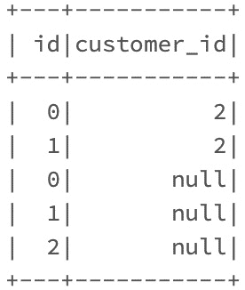
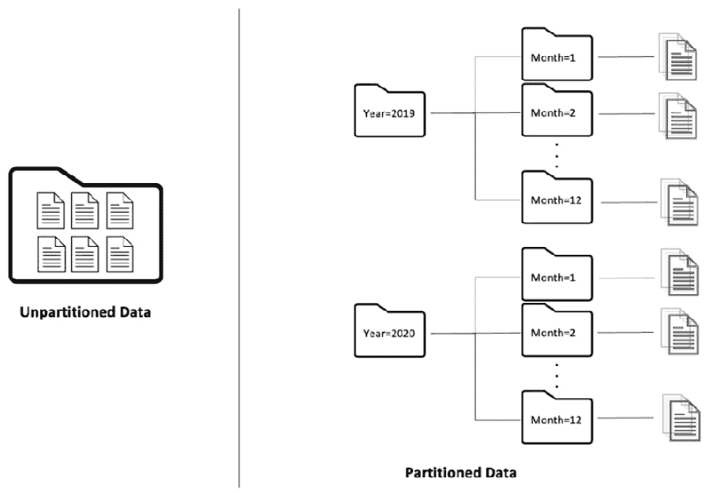

# 第三章：数据清洗与集成

在上一章中，你了解了数据分析过程的第一步——即将来自各个源系统的原始事务数据导入云数据湖。一旦获得原始数据，我们需要对其进行处理、清洗，并转换为有助于提取有意义的、可操作的商业洞察的格式。这个清洗、处理和转换原始数据的过程被称为数据清洗与集成。本章将讲解这一过程。

来自运营系统的原始数据，在其原始格式下并不适合进行数据分析。在本章中，你将学习各种数据集成技术，这些技术有助于整合来自不同源系统的原始事务数据，并将它们合并以丰富数据，向最终用户展示一个统一的、经过整合的真实版本。接着，你将学习如何使用数据清洗技术清理和转换原始数据的形式和结构，使其适合数据分析。数据清洗主要涉及修复数据中的不一致性，处理坏数据和损坏数据，消除数据中的重复项，并将数据标准化以符合企业的数据标准和惯例。你还将了解使用云数据湖作为分析数据存储所面临的挑战。最后，你将了解一种现代数据存储层——Delta Lake，以克服这些挑战。

本章将为你提供将原始数据整合、清洗和转换为适合分析结构的核心技能，并为你提供在云中构建可扩展、可靠且适合分析的数据湖的有用技术。作为开发者，本章的内容将帮助你随时让业务用户访问所有数据，让他们能够更快速、更轻松地从原始数据中提取可操作的洞察。

本章将涵盖以下主要内容：

+   将原始数据转换为丰富的有意义数据

+   使用云数据湖构建分析数据存储

+   使用数据集成整合数据

+   使用数据清洗使原始数据准备好进行分析

# 技术要求

在本章中，我们将使用 Databricks 社区版来运行我们的代码（[`community.cloud.databricks.com`](https://community.cloud.databricks.com)）。注册说明可以在[`databricks.com/try-databricks`](https://databricks.com/try-databricks)找到。

本章中的代码可以从[`github.com/PacktPublishing/Essential-PySpark-for-Data-Analytics/tree/main/Chapter03`](https://github.com/PacktPublishing/Essential-PySpark-for-Data-Analytics/tree/main/Chapter03)下载。

本章的数据集可以在[`github.com/PacktPublishing/Essential-PySpark-for-Data-Analytics/tree/main/data`](https://github.com/PacktPublishing/Essential-PySpark-for-Data-Analytics/tree/main/data)找到。

# 将原始数据转换为有意义的丰富数据

每个数据分析系统都包括几个关键阶段，包括数据摄取、数据转换以及加载到数据仓库或数据湖中。只有在数据经过这些阶段后，才能准备好供最终用户进行描述性和预测性分析。有两种常见的行业实践用于进行此过程，广泛称为**提取、转换、加载**（**ETL**）和**提取、加载、转换**（**ELT**）。在本节中，你将探讨这两种数据处理方法，并理解它们的主要区别。你还将了解在云端大数据分析背景下，ELT 相比 ETL 所具备的主要优势。

## 提取、转换和加载数据

这是几乎所有数据仓库系统遵循的典型数据处理方法。在这个方法中，数据从源系统中提取，并存储在临时存储位置，如关系数据库，称为暂存区。然后，暂存区中的数据会被整合、清洗和转换，最后加载到数据仓库中。下图展示了典型的 ETL 过程：


图 3.1 – 提取、转换和加载

如前面的图所示，ETL 过程由三个主要阶段组成。我们将在接下来的章节中讨论这些阶段。

### 从运营系统中提取数据

ETL 阶段涉及从多个源系统中提取选择性的原始事务数据，并将其暂存于临时存储位置。此步骤相当于数据摄取过程，你可以在*第二章*《数据摄取》中学习到。ETL 过程通常处理大量数据，尽管直接在源系统上运行可能会对它们造成过重的负担。运营系统对日常业务功能至关重要，因此不建议不必要地增加其负担。因此，**提取**过程会在非工作时间从源系统中提取数据，并将其存储在暂存区。此外，ETL 处理可以在暂存区中的数据上进行，从而使运营系统能够处理其核心功能。

### 转换、清洗和整合数据

这一阶段涉及各种数据转换过程，如数据集成、数据清洗、连接、过滤、拆分、标准化、验证等。此步骤将原始事务数据转化为清晰、集成和丰富的版本，准备进行业务分析。我们将在本章的*使用数据集成整合数据*和*使用数据清洗使原始数据具备分析能力*部分深入探讨这一阶段。

### 将数据加载到数据仓库

这是 ETL 过程的最后阶段，经过转换的数据最终被加载到持久的历史数据存储层中，如数据仓库。通常，ETL 处理系统会在一个单一的流程中完成**转换**和**加载**步骤，其中暂存区的原始数据经过清洗、集成和根据业务规则转换后加载到数据仓库中。

### ETL 和数据仓库的优缺点

ETL 方法的某些优势在于，数据被转换并加载到一个结构化的分析数据存储中，如数据仓库，这使得数据的分析既高效又具有较高的性能。由于 ETL 模式已经存在了几十年，现在市场上有一些成熟的平台和工具，可以非常高效地在单一统一的流程中执行 ETL。

ETL 的另一个优点是，由于数据在加载到最终存储之前已经处理过，因此可以有机会省略不需要的数据或掩盖敏感数据。这在满足数据合规性和监管要求方面非常有帮助。

然而，ETL 过程以批处理方式运行，通常每天晚上执行一次。因此，只有在 ETL 批处理成功完成后，最终用户才能访问新数据。这就产生了对数据工程师的依赖，需要他们高效地运行 ETL 过程，同时最终用户在获取最新数据之前会有相当的延迟。

每次在下一次计划的 ETL 负载开始之前，暂存区的数据几乎都会被完全清除。而且，操作系统通常不会保留超过几年的事务数据的历史记录。这意味着，最终用户无法访问历史原始数据，除了数据仓库中的已处理数据。对于某些类型的数据分析（如预测分析）来说，这些历史原始数据可能非常有用，但数据仓库通常不会保留这些数据。

ETL 过程围绕数据仓库概念演变，更多适用于本地环境下的商业智能工作负载。数据仓库高度结构化且相对僵化的特性使得 ETL 不太适合数据科学和机器学习，这两者都涉及大量非结构化数据。此外，ETL 过程的批处理特性使其不适用于实时分析。而且，ETL 和数据仓库没有充分利用云技术及基于云的数据湖。因此，一种新的数据处理方法 **提取、加载和转换**（ELT）应运而生，接下来的章节将详细介绍这一方法。

## 提取、加载和转换数据

在 ELT 方法中，来自源系统的事务性数据以其原始、未经处理的格式被摄取到数据湖中。摄取到数据湖中的原始数据随后按需或定期进行转换。在 ELT 过程中，原始数据直接存储在数据湖中，通常不会被删除。因此，数据可能会以巨大的规模增长，并且几乎需要无限的存储和计算能力。传统的本地数据仓库和数据湖并未设计用来处理如此庞大的数据规模。因此，ELT 方法的实现仅能依赖现代云技术，这些技术提供了高度可扩展和弹性的计算与存储资源。下图展示了典型的 ELT 过程：


图 3.2 – 提取、加载和转换

在前述图示中，原始数据从多个源系统连续或定期地摄取到数据湖中。然后，数据湖中的原始数据被集成、清洗并转换，之后再存储回数据湖中。数据湖中的清洗和聚合数据作为所有类型下游分析的单一事实来源。

使用 ELT，几乎可以保留任何量的历史数据，且数据可以在源系统中创建后立即提供。无需在摄取数据之前进行预处理，并且由于数据湖对数据格式或结构没有严格要求，ELT 可以摄取并存储各种结构化、非结构化和半结构化的数据。因此，ETL 过程使得所有历史原始数据都可用，从而使数据转换完全按需进行。

## 选择 ELT 而非 ETL 的优势

ELT 方法学的一些优势在于数据可以以更快的速度进行摄取，因为不需要预处理步骤。它在数据摄取的灵活性方面也更强，有助于解锁如数据科学和机器学习等新的分析用例。ETL 利用云数据湖提供的弹性存储，帮助组织维护事务数据的副本，并保存几乎无限的历史记录。作为云端技术，ELT 还消除了数据复制和归档管理的麻烦，因为大多数云提供商都提供了这些托管服务，并保证**服务水平协议**（**SLAs**）。

ELT 方法学正在迅速成为云端大数据处理的事实标准，特别适用于处理大量事务数据的组织。对于已经进入云端或未来有云端战略的组织，推荐采用 ELT 方法学进行数据处理。

然而，云端的 ELT 方法学仍处于起步阶段，云数据湖并未提供其数据仓库对应物所具备的任何事务性或可靠性保障。在下一节中，您将探索构建基于云的数据湖所涉及的一些挑战，并探讨克服这些挑战的方法。

# 使用云数据湖构建分析数据存储

在本节中，您将探讨基于云的数据湖为大数据分析系统提供的优势，并了解在利用基于云的数据分析系统时，大数据分析系统面临的一些挑战。您还将编写几个**PySpark**代码示例，亲自体验这些挑战。

## 云数据湖的挑战

基于云的数据湖提供无限的、可扩展的、相对廉价的数据存储。它们由各大云提供商作为托管服务提供，具备高可用性、可扩展性、高效性和较低的**总拥有成本**。这帮助组织加速数字创新，缩短上市时间。然而，云数据湖作为对象存储，主要是为了解决存储可扩展性的问题而发展起来的。它们并非为了存储高度结构化、强类型的分析数据而设计。因此，使用基于云的数据湖作为分析存储系统存在一些挑战。

### 数据湖的可靠性挑战

数据湖并不是基于任何底层文件系统，而是基于对象存储机制，将数据作为对象进行管理。对象存储将数据表示为具有唯一标识符及其相关元数据的对象。对象存储并非为管理频繁变化的事务数据而设计，因此在作为分析数据存储和数据处理系统时，存在一些限制，比如最终一致性、缺乏事务性保障等。我们将在接下来的章节中探讨这些问题。

#### 数据的最终一致性

基于云的数据湖是分布式存储系统，数据存储分布在多台机器上，而不是单一机器上。分布式存储系统受到一个称为 CAP 定理的理论的约束。**CAP 定理**表明，分布式存储系统只能在一致性、可用性和分区容忍性这三者中选择其中的两个来进行调优。不保证强一致性和分区容忍性可能导致数据丢失或错误，因此基于云的数据湖优先保证这两者，以便使其最终一致。

最终一致性意味着写入云数据湖的数据可能不会立即可用。这可能会导致数据分析系统中的`FileNotFound`错误，尤其是在下游的商业分析过程试图在 ELT 过程写入数据的同时读取数据时。

#### 缺乏事务性保证

一个典型的关系型数据库在数据写入时提供事务性保证。这意味着数据库操作要么完全成功，要么完全失败，并且任何同时尝试读取数据的消费者都不会因为数据库操作失败而读取到不一致或错误的数据。

数据湖不提供任何此类原子事务或持久性保证。这意味着开发人员需要清理并手动回滚任何失败作业中半写入的不完整数据，并重新处理这些数据。

请考虑以下代码片段，我们正在摄取 CSV 数据，将其转换为 Parquet 格式，并将其保存到数据湖中：

```py
(spark
   .read
     .csv("/FileStore/shared_uploads/online_retail/")
   .write
     .mode("overwrite")
     .format("parquet")
     .save("/tmp/retail.parquet")
)
```

在这里，我们尝试在工作过程中中断任务，以模拟 Spark 作业失败。在浏览`/tmp/retail.parquet`数据湖时，你会注意到一些半写入的 Parquet 文件。接下来，我们尝试通过另一个 Spark 作业读取这些 Parquet 文件，代码如下所示：

```py
(spark
   .read
     .format("parquet")
     .load("dbfs:/tmp/retail.parquet/part-00006-tid-6775149024880509486-a83d662e-809e-4fb7-beef-208d983f0323-212-1-c000.snappy.parquet")
   .count()
) 
```

在前面的代码块中，我们读取了一个 Parquet 文件，它是一个数据摄取作业未完全完成时的结果。当我们尝试在支持原子事务的数据存储上读取这些数据时，预期的结果是查询要么不返回任何结果，要么因为数据不正确而失败。然而，在前述的 Spark 作业中，我们却得到了一些几千条记录，这是错误的。这是因为 Apache Spark 及数据湖缺乏原子事务保障。

#### 缺乏模式强制执行

数据湖作为对象存储，并不关心数据的结构和模式，能够存储任何数据，而不会执行任何检查来确保数据的一致性。Apache Spark 也没有内建的机制来强制执行用户定义的模式。这导致了损坏和不良数据的产生，数据类型不匹配的数据最终进入数据湖。这会降低数据质量，而数据质量对于最终用户的分析应用至关重要。

看一下以下代码示例，我们已经创建了一个包含几列的初始 DataFrame。第一列的数据类型是`IntegerType`，第二列的数据类型是`StringType`。我们将第一个 DataFrame 写入数据湖，格式为 Parquet。接着，我们生成了第二个 DataFrame，两个列的数据类型都是`IntegerType`。然后，我们尝试将第二个 DataFrame 追加到已经存在于数据湖中的原 Parquet 数据集，如下所示：

```py
from pyspark.sql.functions import lit
df1 = spark.range(3).withColumn("customer_id", lit("1"))
(df1
   .write
     .format("parquet")
     .mode("overwrite")
   .save("/tmp/customer")
)
df2 = spark.range(2).withColumn("customer_id", lit(2))
(df2
   .write
     .format("parquet")
     .mode("append")
   .save("/tmp/customer"))
```

在强类型分析数据存储（如数据仓库）上，预期的结果应该是数据类型不匹配错误。然而，Apache Spark、数据湖或 Parquet 数据格式本身并不会在我们尝试执行此操作时抛出错误，事务似乎成功完成。这是不可取的，因为我们允许不一致的数据进入数据湖。然而，对 Parquet 数据集执行读取操作时会因类型不匹配而失败，这可能令人困惑且相当难以调试。如果数据湖或 Apache Spark 具备数据验证支持，这个错误本来可以在数据加载过程中就被捕获。在将数据提供给业务分析之前，始终验证数据的正确性和一致性非常重要，因为业务决策者依赖这些数据。

### 统一批处理和流处理

现代大数据分析系统的一个关键要求是实时访问最新数据和洞察。Apache Spark 提供了结构化流处理功能，能够处理所有实时分析需求。尽管流处理是核心，但批处理依然是大数据分析的一个重要方面，而 Apache Spark 通过其 Spark SQL 引擎将实时和批处理分析统一，Spark SQL 引擎作为批处理和流处理 Spark 作业的核心抽象层，表现得非常好。

然而，数据湖不支持任何级别的原子事务或同一表或数据集上不同事务之间的隔离。因此，像**Lambda 架构**这样的技术，就需要被用来统一批处理和流处理管道，这个架构你在*第二章*中学习过，*数据摄取*。这就导致了需要维护不同的数据处理管道、不同的代码库以及不同的表，一个用于批处理，另一个用于流处理。你大数据分析系统的架构设计和维护非常复杂。

### 更新和删除数据

在 ELT 方法论中，你是持续地将新数据摄取到数据湖，并在其中维护源交易的副本以及一段时间内的历史记录。操作系统不断生成交易。然而，时不时你需要更新和删除记录。

以一个客户在在线零售商处下单的例子为例。交易经历不同的阶段，从下订单、订单处理中、订单准备发货、订单已发货、订单运输中，到订单已交付。这一交易状态的变化必须在数据湖中得到反映。

捕获数据状态变化的过程被称为数据湖中的 `UPDATE` 和 `DELETE` 操作。数据湖是仅附加的系统，并不设计用来处理大量的任意更新和删除。因此，实施任意更新和删除会增加你 ELT 应用程序的复杂性。

### 回滚错误数据

之前，你了解到数据湖不支持任何关于写操作的原子事务保证。数据工程师需要识别错误记录，清理它们，并在失败的任务中重新处理数据。对于较小的数据集，这个清理过程可能只是简单的截断并重新加载整个数据集。然而，对于大规模数据集，包含数千 TB 数据的情况下，截断并加载数据根本不可行。数据湖和 Apache Spark 都没有便捷的回滚选项，这就要求数据工程师构建复杂的机制来处理失败的任务。

一类新的现代数据存储格式应运而生，旨在克服上一节提到的数据湖挑战。这些技术的一些例子包括 Apache Hudi、Apache Iceberg 和 Delta Lake。在接下来的部分，我们将探索 Delta Lake，并看看它如何帮助克服各种数据湖挑战。

## 使用 Delta Lake 克服数据湖挑战

在这一部分中，你将了解 Delta Lake，并理解它如何帮助克服数据湖的一些挑战。你还将编写一些代码示例，看看 Delta Lake 如何实际应用。

### Delta Lake 简介

**Delta Lake** 是一个开源的数据存储层，旨在为基于云的数据湖带来可靠性、ACID 事务保证、架构验证和演进。Delta Lake 还帮助统一批处理和流处理。Delta Lake 由 Databricks 创建，Databricks 是 Apache Spark 的原始开发者，且它完全兼容所有 Apache Spark API。

Delta Lake 由一组版本化的 Parquet 文件组成，并配有一个称为 **事务日志** 的写前日志。Delta 事务日志有助于实现 Delta Lake 的所有功能。让我们深入了解 Delta 事务日志的内部工作原理，以便更好地理解 Delta Lake 的运作方式。

### Delta Lake 事务日志

**Delta 事务日志**基于一种流行的技术，该技术应用于关系型数据库，被称为**预写日志**（**WAL**）。这种技术保证了数据库写操作的原子性和持久性。这是通过在数据写入数据库之前，将每个写操作作为事务记录到预写日志中来实现的。Delta 事务日志基于与 WAL 相同的技术，但在这里，WAL 以及已写入的数据存储在数据湖中的文件里。

让我们尝试通过一个简单的 Spark 作业来理解 Delta 事务日志，该作业将 CSV 数据以 Delta 格式导入数据湖，如以下代码块所示：

```py
(spark
   .read
     .option("header", True)
     .option("inferSchema", True)
     .csv("/FileStore/shared_uploads/online_retail/")
   .write
     .format("delta")
     .save("/FileStore/shared_uploads/delta/online_retail")
)
```

上述代码从数据湖读取 CSV 文件，推断底层数据的模式以及表头，将数据转换为 Delta 格式，并将数据保存到数据湖的不同位置。现在，让我们使用以下命令探索数据湖中 Delta 文件的位置：

```py
%fs ls /FileStore/shared_uploads/delta/online_retail
```

执行上述命令后，您将注意到 Delta 位置的文件夹结构，如下图所示：


图 3.3 – Delta 文件夹结构

在前面的截图中，您可以看到一个 Delta Lake 位置包含两部分：一个名为 `_delta_log` 的文件夹和一组 Parquet 文件。`_delta_log` 文件夹包含 Delta 事务日志的文件。我们可以通过以下命令来探索事务日志：

```py
%fs ls dbfs:/FileStore/shared_uploads/delta/online_retail/_delta_log/
```

上述命令显示了 `_delta_log` 文件夹的内容，如下图所示：


图 3.4 – Delta 事务日志

在前面的截图中，我们可以看到文件夹中包含几种不同类型的文件。还有一些带有 `.json` 扩展名的文件。这些 JSON 文件是实际的 Delta 事务日志文件，包含对 Delta 表执行的所有成功事务的有序记录。

注意

之前使用的 `%fs` 文件系统命令仅适用于 Databricks 平台。您需要使用适合您 Spark 和数据湖分发版的命令来浏览数据湖。

Delta Lake 事务可以是对 Delta 表执行的任何操作，如插入、更新、删除，甚至是元数据操作，如重命名表、修改表架构等。每次操作发生时，Delta 事务日志都会附加一条新记录，记录诸如**添加文件**、**删除文件**、**更新元数据**等操作。这些操作是原子单位，并按发生顺序记录下来，它们被称为**提交**。

每 10 次提交后，Delta Lake 会生成一个 Parquet 格式的检查点文件，其中包含到该时刻为止的所有事务。这些周期性的 Parquet 检查点文件使得 Spark 作业能够快速、轻松地读取并重建表的状态。以下 Spark 代码可以轻松地说明这一点：

```py
spark.read.json("/FileStore/shared_uploads/delta/online_retail/_delta_log/").show()
```

在前面的代码行中，我们像读取其他 JSON 文件一样，使用`spak.read()`函数读取 Delta 事务日志，并创建了一个 Spark 数据帧。每次在 Delta Lake 表上运行`spak.read()`命令时，都会执行一个小的 Spark 作业来读取表的状态，从而使对 Delta Lake 的元数据操作完全可扩展。

注意

用于在数据湖中浏览文件的`%fs`文件系统命令仅在 Databricks 平台上可用。你需要为你的 Spark 环境和数据湖选择合适的机制。

现在你已经了解了 Delta Lake 的组件以及 Delta 事务日志的内部工作原理，接下来我们来看一下 Delta Lake 如何帮助解决数据湖面临的挑战。

### 使用 Delta Lake 提高数据湖的可靠性

Delta Lake 及其事务日志保证了写入数据湖的数据的原子性和持久性。只有当操作的所有数据完全写入数据湖时，Delta Lake 才会将事务提交到事务日志中。任何读取 Delta 表数据的 Delta 感知消费者都会首先解析 Delta 事务日志，以获取 Delta 表的最新状态。

这样，如果数据摄取任务在中途失败，Delta 事务日志感知消费者会解析事务日志，获取表的最后稳定状态，并只读取事务日志中有提交的数据。任何半写入的脏数据（可能存在于数据湖中）都会被完全忽略，因为这些数据在事务日志中没有任何提交。因此，Delta Lake 与其事务日志结合，通过提供事务的原子性和持久性保证，使数据湖更加可靠。

提示

数据读取器和数据写入器需要是*Delta 事务日志感知的*，才能获得 Delta Lake 的 ACID 事务保证。任何使用 Apache Spark 的读取器或写入器，只需在 Spark 集群中包含适当版本的 Delta Lake 库，就可以完全*Delta 事务日志感知*。Delta Lake 还具有与外部数据处理系统的连接器，例如 Presto、Athena、Hive、Redshift 和 Snowflake。

### 启用 Delta Lake 的模式验证

干净且一致的数据是任何商业分析应用程序的基本要求。确保只有干净数据进入数据湖的一个简单方法是确保在数据摄取过程中验证模式。Delta Lake 内置了模式验证机制，确保写入 Delta Lake 的任何数据都符合用户定义的 Delta 表模式。让我们通过创建一个新的 Delta 表并尝试插入数据类型不匹配的数据来探索此功能，如下所示：

```py
from pyspark.sql.functions import lit
df1 = spark.range(3).withColumn("customer_id", lit("1"))
(df1
   .write
     .format("delta")
     .mode("overwrite")
   .save("/tmp/delta/customer"))
df2 = spark.range(2).withColumn("customer_id", lit(2))
(df2
   .write
     .format("delta")
     .mode("append")
   .save("/tmp/delta/customer"))
```

在前面的代码片段中，我们创建了一个名为 `df1` 的 Spark DataFrame，它有两列，且两列的数据类型均为 `StringType`。我们使用 Delta Lake 格式将此 DataFrame 写入数据湖中。然后，我们创建了另一个名为 `df2` 的 Spark DataFrame，同样包含两列，但它们的数据类型分别设置为 `LongType` 和 `IntegerType`。

接下来，我们尝试将第二个 DataFrame 附加到原始的 Delta 表中。正如预期的那样，Delta Lake 失败了该操作并抛出了 *无法合并不兼容的数据类型 StringType 和 IntegerType* 异常。通过这种方式，Delta Lake 在数据湖中通过提供模式验证和强制执行，确保数据质量。

### Delta Lake 支持模式演变

在数据摄取和 ELT 过程中，另一个常见的用例是源模式可能会随着时间的推移发生变化，并且需要在数据湖中进行处理。一个这样的场景是可能会向源系统表中添加新的列。希望将这些新列引入我们的数据湖表中，而不影响我们已有的数据。这个过程通常被称为 **模式演变**，而 Delta Lake 已内建对此的支持。让我们通过以下代码示例来探讨 Delta Lake 中的模式演变：

```py
from pyspark.sql.functions import lit
df1 = spark.range(3)
(df1
   .write
     .format("delta")
     .mode("overwrite")
   .save("/tmp/delta/customer"))
df2 = spark.range(2).withColumn("customer_id", lit(2))
(df2
   .write
     .format("delta")
     .option("mergeSchema", True)
     .mode("append")
   .save("/tmp/delta/customer"))
```

在前面的代码片段中，我们创建了一个名为 `df1` 的 Spark DataFrame，它只有一个名为 `id` 的列。然后，我们将此 DataFrame 以 Delta Lake 格式保存到数据湖中。接着，我们创建了第二个名为 `df2` 的 Spark DataFrame，包含两个名为 `id` 和 `customer_id` 的列。之后，我们将第二个 DataFrame 附加到由 `df1` 创建的原始 Delta 表中。这次，我们使用了 `mergeSchema` 选项。该 `mergeSchema` 选项指定我们期望将新列写入 Delta Lake，并需要将这些列附加到现有表中。我们可以通过对 Delta 表运行以下命令轻松验证这一点：

```py
spark.read.format("delta").load("/tmp/delta/customer").show()
```

在前面的代码块中，我们将 Delta 表中的数据加载到 Spark DataFrame 中，并调用 `show()` 操作来显示 DataFrame 的内容，如下图所示：



图 3.5 – Delta Lake 模式演变

如你所见，启用新的`mergeSchema`后，Delta Lake 会自动将新列添加到现有表中，并将之前不存在的行的值标记为`null`值。

### Delta Lake 中的任意更新和删除

事务不仅会被插入到操作系统中——它们还会时常被更新和删除。在 ELT 过程中，源系统数据的副本会被保存在数据湖中。因此，能够不仅将数据插入到数据湖中，还能更新和删除它变得非常必要。然而，数据湖是仅追加的存储系统，几乎没有或完全没有支持任何更新或删除的功能。Delta Lake，然而，完全支持插入、更新和删除记录。

让我们看一个例子，演示如何从 Delta Lake 更新和删除任意数据，如下代码块所示：

```py
from pyspark.sql.functions import lit
df1 = spark.range(5).withColumn("customer_id", lit(2))
df1.write.format("delta").mode("overwrite").save("/tmp/df1")
```

在前面的代码块中，我们创建了一个 Spark DataFrame，包含两个列：`id` 和 `customer_id`。`id` 的值从 1 到 5。我们使用 Delta Lake 格式将此表保存到数据湖中。现在，让我们更新`id`列大于`2`的`customer_id`列，如下代码块所示：

```py
%sql
UPDATE delta.`/tmp/df1` SET customer_id = 5 WHERE id > 2;
SELECT * FROM delta.`/tmp/df1`;
```

在前面的代码块中，我们使用`UPDATE` SQL 子句更新了`customer_id`列，并通过`WHERE`子句指定了条件，就像你在任何关系型数据库管理系统（RDBMS）中操作一样。

提示

`%sql` 魔法命令指定我们打算在当前笔记本单元格中执行 SQL 查询。尽管我们没有明确创建表，但我们仍然可以使用`` delta.`path-to-delta-table` ``语法将 Delta Lake 位置视为一个表来引用。

第二个 SQL 查询从 Delta 表中读取数据，并使用`SELECT` SQL 子句显示出来，如下图所示：


图 3.6 – 使用 Delta Lake 进行更新

在这里，我们可以验证所有`id`列值大于`2`的 Delta 表中的行都已成功更新。因此，Delta Lake 完全支持使用简单的类似 SQL 的语法，在大规模上更新多个任意记录。

提示

Delta 表的元数据完全存储在 Delta 事务日志中。这使得将 Delta 表注册到外部**元存储**（如**Hive**）成为完全可选的。这样，直接将 Delta 表保存到数据湖中，并通过 Spark 的 DataFrame 和 SQL API 无缝使用变得更加容易。

现在，让我们看一下 Delta 如何通过以下代码块来支持删除：

```py
%sql
DELETE FROM delta.`/tmp/df1` WHERE id = 4;
SELECT * FROM delta.`/tmp/df1`;
```

在前面的代码片段中，我们使用`DELETE`命令删除了所有`id`值为`4`的记录。第二个查询，我们使用`SELECT`子句，显示了`DELETE`操作后的 Delta 表内容，如下图所示：


图 3.7 – 使用 Delta Lake 进行删除

在这里，我们可以轻松验证我们不再拥有任何 `id` 值为 `4` 的行。因此，Delta Lake 也支持大规模删除任意记录。

提示

Delta Lake 同时支持 SQL 和 DataFrame 语法来执行 DELETES、UPDATES 和 UPSERTS。有关语法的参考可以在开源文档中找到，文档链接为：[`docs.delta.io/latest/delta-update.html#table-deletes-updates-and-merges`](https://docs.delta.io/latest/delta-update.html#table-deletes-updates-and-merges)。

即使是 `DELETE` 和 `UPDATE` 操作，Delta Lake 也能像写入操作一样支持原子性和持久性的事务保证。然而，值得注意的是，每次执行 `DELETE` 或 `UPDATE` 操作时，Delta Lake 并不是直接更新或删除任何数据，而是生成一个包含更新或删除记录的新文件，并将这些新文件附加到现有的 Delta 表中。然后，Delta Lake 在事务日志中为此次写入事务创建一个新的 **提交**，并将删除或更新记录的旧 **提交** 标记为无效。

因此，Delta Lake 实际上并没有删除或更新数据湖中的实际数据文件；它只是为每个操作附加新文件并更新事务日志。更新较小的事务日志文件比更新大量非常大的数据文件要快得多，效率也更高。使用 Delta Lake 更新和删除记录的过程非常高效，并且可以扩展到 PB 级数据。这一功能对于需要识别并删除客户任意记录的用例非常有用，例如 GDPR 合规的用例。

这种始终附加数据文件而从不删除文件的技术的另一个有趣副作用是，Delta Lake 保留了所有数据变化的历史审计记录。这个审计日志保存在 **Delta 事务日志** 中，借助它，Delta Lake 可以回溯到过去，重现某一时刻的 Delta 表快照。我们将在下一节中探讨这个功能。

### Delta Lake 的时间旅行与回滚

Delta Lake 在其事务日志中保留数据如何随时间变化的审计日志。每次数据发生变化时，它还会保持旧版本的 Parquet 数据文件。这使得 Delta Lake 能够在某一时刻重现整个 Delta 表的快照。这个功能叫做 **时间旅行**。

你可以通过以下 SQL 查询轻松浏览 Delta 表的审计记录：

```py
%sql DESCRIBE HISTORY delta.`/tmp/df1`
```

在前面的 Spark SQL 查询中，我们使用了 `DESCRIBE HISTORY` 命令来重现 Delta 表上发生的所有变更的审计日志，如下所示：


图 3.8 – Delta Lake 的时间旅行

在前面的截图中，你可以看到这个 Delta 表发生了三次变化。首先，数据被插入到表中，然后表被更新，最后从表中删除了记录。Delta Lake 将所有这些事件记录为称为**提交**的事务。提交事件的时间戳和版本号也会记录在变更审计日志中。时间戳或表的版本号可以通过 SQL 查询，用于回溯到 Delta 表的特定快照，示例如下：

```py
%sql SELECT * from delta.`/tmp/delta/df1` VERSION AS OF 0
```

在前面的 SQL 查询中，我们执行了 Delta Time Travel，回到了表的原始版本。Time Travel 在数据工程和 ELT 处理过程中非常有用，可以在数据摄取过程失败时执行回滚。Delta Time Travel 可以用于将 Delta 表恢复到先前的状态，如下所示：

```py
%sql 
INSERT OVERWRITE delta.`/tmp/df1`
SELECT * from delta.`/tmp/df1` VERSION AS OF 0
```

在前面的 SQL 查询中，我们使用来自表的先前版本的快照覆盖了 Delta 表，并充分利用了**Delta Time Travel**特性。

另一个 Delta Time Travel 很有用的场景是数据科学和机器学习的应用场景。数据科学家通常通过修改用于实验的数据集来进行多个机器学习实验。在这个过程中，他们最终会维护多个物理版本的相同数据集或表。Delta Lake 可以通过 Time Travel 帮助消除这些物理版本的表，因为 Delta 内置了数据版本管理。你将在*第九章*《机器学习生命周期管理》中更详细地探讨这种技术。

提示

Delta 会在每次修改数据的操作中保持 Parquet 数据文件的版本。这意味着旧版本的数据文件会不断积累，且 Delta Lake 不会自动删除它们。这可能会导致数据湖的大小随着时间的推移显著增加。为了解决这一问题，Delta Lake 提供了 `VACUUM` 命令来永久删除不再被 Delta 表引用的旧文件。有关 `VACUUM` 命令的更多信息，请参见 [`docs.delta.io/latest/delta-utility.html#vacuum`](https://docs.delta.io/latest/delta-utility.html#vacuum)。

### 使用 Delta Lake 统一批处理和流处理

批处理和实时流处理是任何现代大数据架构中的关键组件。在*第二章*《数据摄取》中，你学习了如何使用 Apache Spark 进行批处理和实时数据摄取。你还学习了 Lambda 架构，利用它可以实现同时的批处理和流处理。使用 Apache Spark 实现 Lambda 架构仍然相对复杂，因为需要为批处理和实时处理分别实现两个独立的数据处理管道。

这种复杂性来源于数据湖的局限性，因为它们本质上不提供任何写操作的事务性、原子性或持久性保障。因此，批处理和流处理无法将数据写入数据湖的同一个表或位置。由于 Delta Lake 已经解决了数据湖面临的这一挑战，可以将单一的 Delta Lake 与多个批处理和实时管道结合使用，从而进一步简化 Lambda 架构。你将在*第四章*中进一步探讨这一点，*实时数据分析*。

总结来说，在本节中，你学到了数据湖在支持真正可扩展的大数据处理系统中的重要作用。然而，它们并非为数据分析存储系统而构建，存在一些不足之处，例如缺乏 ACID 事务保障，以及无法支持更新或删除记录、保持数据质量的模式执行或批处理与流处理的统一。你还学到了现代数据存储层（如 Delta Lake）如何帮助克服数据湖的挑战，并使其更接近真正的数据分析存储系统。

现在，既然你已经了解了如何让基于云的数据湖更加可靠并适合数据分析，你已经准备好学习将原始事务数据转化为有意义的商业洞察的过程。我们将从整合来自不同来源的数据并创建统一的单一视图开始。

# 使用数据集成进行数据整合

**数据集成**是 ETL 和 ELT 数据处理模式中的一个重要步骤。数据集成是将来自不同数据源的数据进行组合和融合，生成代表单一事实版本的丰富数据的过程。数据集成不同于数据摄取，因为数据摄取只是将数据从不同来源收集并带到一个中心位置，例如数据仓库。另一方面，数据集成将这些不同的数据源结合起来，创建一个有意义的统一版本的数据，代表数据的所有维度。数据集成有多种实现方式，本节将探讨其中的一些。

## 通过 ETL 和数据仓库进行数据整合

提取、转换和加载数据到数据仓库是过去几十年来数据集成的最佳技术之一。数据整合的主要目标之一是减少数据存储位置的数量。ETL 过程从各种源系统中提取数据，然后根据用户指定的业务规则对数据进行合并、过滤、清洗和转换，最后将其加载到中心数据仓库。

通过 ETL 和数据仓库技术以及专门为此构建的工具和技术支持数据整合和数据集成。虽然 ELT 过程与 ETL 略有不同，并且使用 Apache Spark，我们打算构建一个数据湖，但数据集成和数据整合的技术仍然保持相同，即使是 ETL 也是如此。

让我们使用 PySpark 实现数据整合过程。作为第一步，将本章提供的所有数据集上传到可以被您的 Spark 集群访问的位置。在 Databricks Community Edition 的情况下，可以直接从笔记本的**File**菜单中将数据集上传到数据湖中。数据集和代码文件的链接可以在本章开头的*Technical requirements*部分找到。

让我们使用以下代码块探索标记为`online_retail.csv`和`online_retail_II.csv`的两个交易数据集的架构信息：

```py
from pyspark.sql.types import StructType, StructField, IntegerType, TimestampType, StringType, DoubleType
schema = (StructType()
            .add("InvoiceNo", StringType(), True)
            .add("StockCode", StringType(), True)
            .add("Description", StringType(), True)
            .add("Quantity", StringType(), True)
            .add("InvoiceDate", StringType(), True)
            .add("UnitPrice", StringType(), True)
            .add("CustomerID", StringType(), True)
            .add("Country", StringType(), True))
df1 = spark.read.schema(schema).option("header", True).csv("dbfs:/FileStore/shared_uploads/online_retail/online_retail.csv")
df2 = spark.read.schema(schema).option("header", True).csv("dbfs:/FileStore/shared_uploads/online_retail/online_retail_II.csv")
df1.printSchema()
df2.printSchema()
```

在前面的代码片段中，我们执行了以下操作：

1.  我们将 Spark DataFrame 的架构定义为由多个 StructField 组成的`StructType`。PySpark 提供了这些内置结构来编程地定义 DataFrame 的架构。

1.  然后，我们将两个 CSV 文件加载到单独的 Spark DataFrames 中，同时使用`schema`选项指定我们在*Step 1*中创建的数据模式。我们仍然将头部选项设置为`True`，因为 CSV 文件的第一行有一个定义好的标题，我们需要忽略它。

1.  最后，我们打印了在*Step 2*中创建的两个 Spark DataFrames 的架构信息。

现在我们已经将来自 CSV 文件的零售数据集加载到 Spark DataFrames 中，让我们将它们整合成一个单一数据集，如以下代码所示：

```py
retail_df = df1.union(df2)
retail_df.show()
```

在前述代码中，我们简单地使用`union()`函数将包含在线零售交易数据的两个 Spark DataFrames 组合成一个单一的 Spark DataFrame。联合操作将这两个不同的 DataFrame 合并成一个 DataFrame。合并后的数据集被标记为`retail_df`。我们可以使用`show()`函数验证结果。

提示

`union()`函数是一种转换操作，因此它是延迟评估的。这意味着当您在两个 Spark DataFrames 上调用`union()`时，Spark 会检查这两个 DataFrame 是否具有相同数量的列，并且它们的数据类型是否匹配。它不会立即将 DataFrame 映射到内存中。`show()`函数是一个动作操作，因此 Spark 会处理转换并将数据映射到内存中。然而，`show()`函数仅在 DataFrame 的少量分区上工作，并返回一组样本结果给 Spark Driver。因此，这个动作帮助我们快速验证我们的代码。

接下来，我们有一些描述国家代码和名称的数据存储在`country_codes.csv`文件中。让我们使用以下代码块将其与前一步中创建的`retail_df` DataFrame 集成：

```py
df3 = spark.read.option("header", True).option("delimiter", ";").csv("/FileStore/shared_uploads/countries_codes.csv")
country_df = (df3
   .withColumnRenamed("OFFICIAL LANG CODE", "CountryCode")
   .withColumnRenamed("ISO2 CODE", "ISO2Code")
   .withColumnRenamed("ISO3 CODE", "ISO3Code")
   .withColumnRenamed("LABEL EN", "CountryName")
   .withColumnRenamed("Geo Shape", "GeoShape")
   .drop("ONU CODE")
   .drop("IS ILOMEMBER")
   .drop("IS RECEIVING QUEST")
   .drop("LABEL FR")
   .drop("LABEL SP")
   .drop("geo_point_2d")
)
integrated_df = retail_df.join(country_df, retail_df.Country == country_df.CountryName, "left_outer")
```

在前面的代码片段中，我们做了以下操作：

1.  我们将`country_codes.csv`文件加载到一个 Spark 数据框中，并将`header`选项设置为`True`，文件分隔符设置为`";"`。

1.  我们重命名了一些列名，以遵循标准命名约定，使用了`withColumnRenamed()`函数。我们删除了几个我们认为对任何业务用例都不必要的列。这导致生成了一个名为`country_df`的数据框，其中包含了国家代码和其他描述性列。

1.  然后，我们将这个数据框与之前步骤中的`retail_df`数据框进行了连接。我们使用的是`retail_df`数据框，无论它们是否在`country_df`数据框中有匹配记录。

1.  结果生成的`integrated_df`数据框包含了来自`country_codes.csv`数据集的描述性列，并对在线零售交易数据进行了增强。

我们还有一个名为`adult.data`的数据集，其中包含了来自美国人口普查的收入数据集。我们将这个数据集与已经集成和增强的零售交易数据集进行集成，代码如下所示：

```py
from pyspark.sql.functions import monotonically_increasing_id
income_df = spark.read.schema(schema).csv("/FileStore/shared_uploads/adult.data").withColumn("idx", monotonically_increasing_id())
retail_dfx = retail_df.withColumn("CustomerIDx", monotonically_increasing_id())
income_dfx = income_df.withColumn("CustomerIDx", monotonically_increasing_id()) 
income_df = spark.read.schema(schema).csv("/FileStore/shared_uploads/adult.data").withColumn("idx", monotonically_increasing_id())
retail_dfx = integrated_df.withColumn("RetailIDx", monotonically_increasing_id())
income_dfx = income_df.withColumn("IncomeIDx", monotonically_increasing_id()) 
retail_enriched_df = retail_dfx.join(income_dfx, retail_dfx.RetailIDx == income_dfx.IncomeIDx, "left_outer")
```

在前面的代码片段中，我们做了以下操作：

1.  我们使用`csv()`函数从收入数据集中创建了一个 Spark 数据框。该文件是逗号分隔的，并且有一个头部，因此我们使用了适当的选项。最终，我们得到了一个名为`income_df`的数据框，包含了与消费者人口统计和收入水平相关的一些列。

1.  然后，我们添加了两个`income_df`和`integrated_df`数据框，以便可以进行连接。我们使用了`monotonically_increasing_id()`函数，它生成唯一的递增数字。

1.  然后，两个数据框基于新生成的`integrated_df`数据框进行了连接，无论它们是否在`income_df`数据框中有对应的匹配行。结果是集成的、增强的零售交易数据，包含了国家、客户人口统计信息和收入信息，所有数据都统一在一个数据集中。

这个中间数据集对于执行`retail_enriched.delta`非常有用，下面的代码展示了如何使用它：

```py
(retail_enriched_df
   .coalesce(1)
   .write
     .format("delta", True)
     .mode("overwrite")
    .save("/FileStore/shared_uploads/retail.delta"))
```

在前面的代码块中，我们使用`coalesce()`函数将`retailed_enriched_df`数据框的分区数量减少到一个分区。这样就生成了一个单一的可移植 Parquet 文件。

注意

学习和实验大数据分析的最大挑战之一是找到干净且有用的数据集。在前面的代码示例中，我们必须引入一个代理键来连接两个独立的数据集。在实际应用中，除非数据集之间相关且存在公共连接键，否则你永远不会强行连接数据集。

因此，使用 Spark 的数据框操作或 Spark SQL，你可以从不同来源集成数据，创建一个增强的、有意义的数据集，表示单一版本的真实数据。

## 使用数据虚拟化技术进行数据集成

**数据虚拟化**，顾名思义，是一种虚拟过程，在该过程中，数据虚拟化层作为所有不同数据源之上的逻辑层。这个虚拟层充当业务用户的通道，使他们能够实时无缝访问所需数据。与传统的**ETL**和**ELT**过程相比，数据虚拟化的优势在于它不需要任何数据移动，而是直接向业务用户展示集成的数据视图。当业务用户尝试访问数据时，数据虚拟化层会查询底层数据集并实时获取数据。

数据虚拟化层的优势在于，它完全绕过了数据移动，节省了通常需要投入到这个过程中的时间和资源。它能够实时展示数据，几乎没有延迟，因为它直接从源系统获取数据。

数据虚拟化的缺点是它并不是一种广泛采用的技术，而且提供这项技术的产品价格通常较高。Apache Spark 并不支持纯粹意义上的数据虚拟化。然而，Spark 支持一种称为**数据联邦**的数据虚拟化技术，您将在下一节中学习到。

## 通过数据联邦实现数据集成

**数据联邦**是一种数据虚拟化技术，它使用虚拟数据库（也称为联邦数据库）来提供异构数据源的统一和同质化视图。这里的思路是通过单一的数据处理和元数据层访问任何地方的数据。Apache Spark SQL 引擎支持数据联邦，Spark 的数据源可以用来定义外部数据源，从而在 Spark SQL 中实现无缝访问。使用 Spark SQL 时，可以在单一的 SQL 查询中使用多个数据源，而不需要先合并和转换数据集。

让我们通过一个代码示例来学习如何使用 Spark SQL 实现数据联邦：

```py
%sql
CREATE TABLE mysql_authors IF NOT EXISTS
USING org.apache.spark.sql.jdbc
OPTIONS (
  url "jdbc:mysql://localhost:3306/pysparkdb",
  dbtable "authors",
  user "@@@@@@",
  password "######"
);
```

在前一块代码中，我们创建了一个以 MySQL 为数据源的表。这里，我们使用 Spark 创建的表只是指向 MySQL 中实际表的指针。每次查询这个 Spark 表时，它都会通过 JDBC 连接从底层的 MySQL 表中获取数据。接下来，我们将从 Spark DataFrame 创建另一个表，并将其保存为 CSV 格式，如下所示：

```py
from pyspark.sql.functions import rand, col
authors_df = spark.range(16).withColumn("salary", rand(10)*col("id")*10000)
authors_df.write.format("csv").saveAsTable("author_salary")
```

在前面的代码块中，我们生成了一个包含 16 行和 2 列的 Spark DataFrame。第一列标记为`id`，它只是一个递增的数字；第二列标记为`salary`，它是使用内置的`rand()`函数生成的随机数。我们将 DataFrame 保存到数据湖中，并使用`saveAsTable()`函数将其注册到 Spark 内置的 Hive 元数据存储中。现在我们有了两个表，它们分别存在于不同的数据源中。接下来，看看我们如何在 Spark SQL 中通过联邦查询将它们一起使用，如下所示：

```py
%sql
SELECT
  m.last_name,
  m.first_name,
  s.salary
FROM
  author_salary s
  JOIN mysql_authors m ON m.uid = s.id
ORDER BY s.salary DESC
```

在之前的 SQL 查询中，我们将 MySQL 表与位于数据湖中的 CSV 表在同一查询中连接，生成了数据的集成视图。这展示了 Apache Spark 的数据联合功能。

提示

某些专门的数据处理引擎纯粹设计为联合数据库，例如 Presto。Presto 是一个分布式的大数据大规模并行处理（MPP）查询引擎，旨在在任何数据上提供非常快速的查询性能。使用 Apache Spark 而不是 Presto 的一个优势是，它支持数据联合，并且能够处理其他用例，如批处理和实时分析、数据科学、机器学习和交互式 SQL 分析，所有这些都由单一的统一引擎支持。这使得用户体验更加无缝。然而，组织在不同用例中采用多种大数据技术也是非常常见的。

总结来说，数据集成是将来自不同数据源的数据进行整合和结合，生成有意义的数据，提供单一版本的真实情况。数据集成围绕着多种技术，包括使用 ETL 或 ELT 技术整合数据以及数据联合。在本节中，您学习了如何利用这些技术通过 Apache Spark 实现数据的集成视图。数据分析旅程的下一步是学习如何通过称为**数据清洗**的过程来清理混乱和脏数据。

# 使用数据清洗使原始数据适合分析

原始事务数据可能存在多种不一致性，这些不一致性可能是数据本身固有的，或是在不同数据处理系统之间传输过程中、数据摄取过程中产生的。数据集成过程也可能引入数据不一致性。这是因为数据正在从不同系统中整合，而这些系统有各自的数据表示机制。这些数据并不十分干净，可能包含一些坏记录或损坏的记录，在生成有意义的业务洞察之前，需要通过称为**数据清洗**的过程进行清理。

数据清洗是数据分析过程的一部分，通过修复不良和损坏的数据、删除重复项，并选择对广泛业务用例有用的数据集来清理数据。当来自不同来源的数据被合并时，可能会出现数据类型的不一致，包括错误标签或冗余数据。因此，数据清洗还包括数据标准化，以便将集成数据提升至企业的标准和惯例。

数据清洗的目标是生成干净、一致、完美的数据，为最终一步的生成有意义和可操作的洞察力做好准备，这一步骤来自原始事务数据。在本节中，您将学习数据清洗过程中的各种步骤。

## 数据选择以消除冗余

一旦来自不同源的数据被整合，集成数据集中可能会出现冗余项。可能有些字段对于你的业务分析团队来说并不必要。数据清洗的第一步就是识别这些不需要的数据元素并将其移除。

让我们对我们在*通过 ETL 和数据仓库进行的数据整合*部分中生成的集成数据集进行数据选择。我们首先需要查看表模式，了解有哪些列以及它们的数据类型。我们可以使用以下代码行来做到这一点：

```py
retail_enriched_df.printSchema()
```

前一行代码的结果显示了所有列，我们可以轻松发现`Country`和`CountryName`列是冗余的。数据集中还有一些为了数据集成而引入的列，这些列对后续分析并没有太大用处。让我们清理集成数据集中不需要的冗余列，如下所示的代码块所示：

```py
retail_clean_df = (retail_enriched_df
                    .drop("Country")
                    .drop("ISO2Code")
                    .drop("ISO3Code")
                    .drop("RetailIDx")
                    .drop("idx")
                    .drop("IncomeIDx")
                   )
```

在前面的代码片段中，我们使用了`drop()` DataFrame 操作来删除不需要的列。现在我们已经从集成数据集中选择了正确的数据列，接下来的步骤是识别并消除任何重复的行。

## 去重数据

去重过程的第一步是检查是否有任何重复的行。我们可以通过组合 DataFrame 操作来做到这一点，如下所示的代码块所示：

```py
(retail_enriched_df
   .select("InvoiceNo", "InvoiceDate")
   .groupBy("InvoiceNo", "InvoiceDate")
   .count()
   .show())
```

前面的代码行显示了在根据`InvoiceNo`、`InvoiceDate`和`StockCode`列对行进行分组后，所有行的计数。在这里，我们假设`InvoiceNo`、`InvoiceDate`和`StockCode`的组合是唯一的，并且它们构成了`1`。然而，在结果中，我们可以看到一些行的计数大于`1`，这表明数据集中可能存在重复行。这应该在你抽样检查了一些显示重复的行后手动检查，以确保它们确实是重复的。我们可以通过以下代码块来做到这一点：

```py
(retail_enriched_df.where("InvoiceNo in ('536373', '536382', '536387') AND StockCode in ('85123A', '22798', '21731')")
   .display()
)
```

在前面的查询中，我们检查了`InvoiceNo`和`StockCode`值的示例，以查看返回的数据是否包含重复项。通过目视检查结果，我们可以看到数据集中存在重复项。我们需要消除这些重复项。幸运的是，PySpark 提供了一个叫做`drop_duplicates()`的便捷函数来实现这一点，如下所示的代码行所示：

```py
retail_nodupe = retail_clean_df.drop_duplicates(["InvoiceNo", "InvoiceDate", "StockCode"])
```

在前一行代码中，我们使用了`drop_duplicates()`函数，根据一组列来消除重复项。让我们通过以下代码行来检查它是否成功删除了重复行：

```py
(retail_nodupe
   .select("InvoiceNo", "InvoiceDate", "StockCode")
   .groupBy("InvoiceNo", "InvoiceDate", "StockCode")
   .count()
   .where("count > 1")
   .show())
```

之前的代码根据**复合键**对行进行了分组，并检查了每组的计数。结果是一个空数据集，这意味着所有重复项已经成功消除。

到目前为止，我们已经从集成的数据集中删除了不需要的列并消除了重复。在数据选择步骤中，我们注意到所有列的数据类型都是`string`，且列名称遵循不同的命名惯例。这可以通过数据标准化过程进行修正。

## 数据标准化

**数据标准化**是指确保所有列都遵循其适当的数据类型。这也是将所有列名称提升到我们企业命名标准和惯例的地方。可以通过以下 DataFrame 操作在 PySpark 中实现：

```py
retail_final_df = (retail_nodupe.selectExpr(
    "InvoiceNo AS invoice_num", "StockCode AS stock_code", 
    "description AS description", "Quantity AS quantity", 
    "CAST(InvoiceDate AS TIMESTAMP) AS invoice_date", 
    "CAST(UnitPrice AS DOUBLE) AS unit_price", 
    "CustomerID AS customer_id",
    "CountryCode AS country_code",
    "CountryName AS country_name", "GeoShape AS geo_shape",
    "age", "workclass AS work_class", 
    "fnlwgt AS final_weight", "education", 
    "CAST('education-num' AS NUMERIC) AS education_num", 
    "'marital-status' AS marital_status", "occupation", 
    "relationship", "race", "gender", 
    "CAST('capital-gain' AS DOUBLE) AS capital_gain", 
    "CAST('capital-loss' AS DOUBLE) AS capital_loss", 
    "CAST('hours-per-week' AS DOUBLE) AS hours_per_week", 
    "'native-country' AS native_country")
)
```

在前面的代码块中，实际上是一个 SQL `SELECT` 查询，它将列转换为其适当的数据类型，并为列名称指定别名，以便它们遵循合适的 Python 命名标准。结果是一个最终数据集，包含来自不同来源的数据，已集成成一个清洗、去重和标准化的数据格式。

这个最终的数据集，是数据集成和数据清洗阶段的结果，已经准备好向业务用户展示，供他们进行业务分析。因此，将这个数据集持久化到数据湖并提供给最终用户使用是有意义的，如下所示的代码行所示：

```py
retail_final_df.write.format("delta").save("dbfs:/FileStore/shared_uploads/delta/retail_silver.delta")
```

在前面的代码行中，我们将最终版本的原始事务数据以 Delta Lake 格式保存到数据湖中。

注意

在业界惯例中，从源系统直接复制的事务数据被称为**铜数据**，经过清洗和集成的事务数据被称为**银数据**，而聚合和汇总后的数据被称为**金数据**。数据分析过程，简而言之，就是一个不断摄取铜数据并将其转化为银数据和金数据的过程，直到它可以转化为可执行的业务洞察。

为了总结数据清洗过程，我们获取了数据集成过程的结果集，移除了任何冗余和不必要的列，消除了重复的行，并将数据列提升到企业标准和惯例。所有这些数据处理步骤都是通过 DataFrame API 实现的，该 API 由 Spark SQL 引擎提供支持。它可以轻松地将此过程扩展到数 TB 甚至 PB 的数据。

提示

在本章中，数据集成和数据清洗被视为两个独立且互相排斥的过程。然而，在实际使用案例中，将这两个步骤作为一个数据处理管道共同实现是非常常见的做法。

数据集成和数据清洗过程的结果是可用的、干净的且有意义的数据，已准备好供业务分析用户使用。由于我们在这里处理的是大数据，因此数据必须以一种提高业务分析查询性能的方式进行结构化和呈现。你将在接下来的章节中了解这一点。

## 通过数据分区优化 ELT 处理性能

**数据分区**是一个将大数据集物理拆分为较小部分的过程。这样，当查询需要大数据集的一部分时，它可以扫描并加载分区的子集。这种排除查询不需要的分区的技术被称为**分区修剪**。

**谓词下推**是另一种技术，将查询中的一些过滤、切片和切割数据的部分，即**谓词**，下推到数据存储层。然后，由数据存储层负责过滤掉所有查询不需要的分区。

传统的关系型数据库管理系统（RDBMS）和数据仓库一直都支持数据分区、分区修剪和谓词下推。像 CSV 和 JSON 这样的半结构化文件格式支持数据分区和分区修剪，但不支持谓词下推。Apache Spark 完全支持这三种技术。通过谓词下推，Spark 可以将过滤数据的任务委派给底层数据存储层，从而减少需要加载到 Spark 内存中的数据量，并进一步进行处理。

结构化数据格式如 Parquet、ORC 和 Delta Lake 完全支持分区修剪和谓词下推。这有助于 Spark 的 Catalyst 优化器生成最佳的查询执行计划。这是优先选择像 Apache Parquet 这样结构化文件格式而不是半结构化数据格式的一个有力理由。

假设你的数据湖中包含跨越数年的历史数据，而你的典型查询通常只涉及几个月到几年之间的数据。你可以选择将数据完全不分区，所有数据存储在一个文件夹中。或者，你可以按照年份和月份属性对数据进行分区，如下图所示：



图 3.9 – 数据分区

在前面图示的右侧，我们有未分区的数据。这样的数据存储模式使得数据存储变得稍微简单一些，因为我们只是反复将新数据追加到同一个文件夹中。然而，到了一定程度后，数据会变得难以管理，也使得执行任何更新或删除操作变得困难。此外，Apache Spark 需要将整个数据集读取到内存中，这样会丧失分区修剪和谓词下推可能带来的优势。

在图表的右侧，数据按照年份分区，然后按照月份分区。这使得写入数据稍微复杂一些，因为 Spark 应用程序每次写入数据之前都需要选择正确的分区。然而，与更新、删除以及下游查询带来的效率和性能相比，这只是一个小代价。对这种分区数据的查询将比未分区的数据快几个数量级，因为它们充分利用了分区修剪和谓词下推。因此，推荐使用适当的分区键对数据进行分区，以从数据湖中获得最佳的性能和效率。

由于数据分区在决定下游分析查询性能方面起着至关重要的作用，因此选择合适的分区列非常重要。一般的经验法则是，选择一个基数较低的分区列。至少为一千兆字节的分区大小是实际可行的，通常，基于日期的列是一个很好的分区键候选。

注意

云端对象存储的递归文件列出通常较慢且费用昂贵。因此，在云端对象存储上使用层次分区并不是很高效，因此不推荐使用。当需要多个分区键时，这可能会成为性能瓶颈。Databricks 的专有版本 Delta Lake 以及他们的 Delta Engine 支持**动态文件修剪**和**Z-order**多维索引等技术，帮助解决云端数据湖中层次分区的问题。你可以在[`docs.databricks.com/delta/optimizations/dynamic-file-pruning.html`](https://docs.databricks.com/delta/optimizations/dynamic-file-pruning.html)了解更多信息。然而，这些技术目前还没有在 Delta Lake 的开源版本中提供。

# 总结

在本章中，你了解了两种著名的数据处理方法——**ETL**和**ELT**，并看到了使用 ETL 方法能解锁更多分析用例的优势，这些用例是使用 ETL 方法无法实现的。通过这样做，你理解了 ETL 的可扩展存储和计算需求，以及现代云技术如何帮助实现 ELT 的数据处理方式。接着，你了解了将基于云的数据湖作为分析数据存储的不足之处，例如缺乏原子事务和持久性保证。然后，你被介绍到 Delta Lake，这是一种现代数据存储层，旨在克服基于云的数据湖的不足。你学习了数据集成和数据清洗技术，这些技术有助于将来自不同来源的原始事务数据整合起来，生成干净、纯净的数据，这些数据准备好呈现给最终用户以生成有意义的见解。你还学习了如何通过 DataFrame 操作和 Spark SQL 实现本章中使用的每一种技术。你获得了将原始事务数据转换为有意义的、丰富的数据的技能，这些技能对于使用 ELT 方法在大规模大数据中进行处理至关重要。

通常，数据清洗和集成过程是性能密集型的，且以批处理方式实现。然而，在大数据分析中，你必须在事务数据在源头生成后尽快将其传递给最终用户。这对战术决策非常有帮助，并且通过实时数据分析得以实现，实时数据分析将在下一章中讲解。
