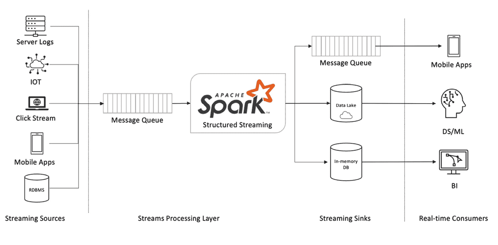

# 第四章：实时数据分析

在现代大数据世界中，数据生成的速度非常快，快到过去十年中的任何技术都无法处理，例如批处理 ETL 工具、数据仓库或商业分析系统。因此，实时处理数据并从中提取洞察力对于企业做出战术决策至关重要，以帮助他们保持竞争力。因此，迫切需要能够实时或近实时处理数据的实时分析系统，帮助最终用户尽可能快地获取最新数据。

本章中，您将探索实时大数据分析处理系统的架构和组件，包括作为数据源的消息队列、作为数据汇聚点的 Delta 和作为流处理引擎的 Spark Structured Streaming。您将学习使用有状态处理的 Structured Streaming 处理迟到数据的技巧。还将介绍使用 **变更数据捕获**（**CDC**）技术，在数据湖中保持源系统的精确副本。您将学习如何构建多跳流处理管道，逐步改进从原始数据到已清洗和丰富数据的质量，这些数据已准备好进行数据分析。您将掌握使用 Apache Spark 实现可扩展、容错且近实时的分析系统的基本技能。

本章将涵盖以下主要主题：

+   实时分析系统架构

+   流处理引擎

+   实时分析行业应用案例

+   使用 Delta Lake 简化 Lambda 架构

+   CDC

+   多跳流处理管道

# 技术要求

本章中，您将使用 Databricks Community Edition 来运行您的代码。可以通过以下链接找到：[`community.cloud.databricks.com`](https://community.cloud.databricks.com)：

+   注册说明请参见：[`databricks.com/try-databricks`](https://databricks.com/try-databricks)。

+   本章中使用的代码和数据可以从以下链接下载：[`github.com/PacktPublishing/Essential-PySpark-for-Scalable-Data-Analytics/tree/main/Chapter04`](https://github.com/PacktPublishing/Essential-PySpark-for-Scalable-Data-Analytics/tree/main/Chapter04)。

在我们深入探讨如何使用 Apache Spark 实现实时流处理数据管道之前，首先，我们需要了解实时分析管道的一般架构及其各个组件，具体内容将在以下部分中描述。

# 实时分析系统架构

实时数据分析系统，顾名思义，是实时处理数据的系统。由于数据在源头生成，使其可以以最小的延迟提供给业务用户。它由几个重要组件组成，即流数据源、流处理引擎、流数据汇聚点以及实际的实时数据消费者，如下图所示：



图 4.1 – 实时数据分析

上图展示了一个典型的实时数据分析系统架构。在接下来的部分，我们将更详细地探讨各个组件。

## 流数据源

类似于其他**企业决策支持系统**，**实时数据分析系统**也从数据源开始。企业在实时中持续生成数据；因此，任何被批处理系统使用的数据源也是流数据源。唯一的区别在于你从数据源摄取数据的频率。在批处理模式下，数据是周期性摄取的，而在实时流式系统中，数据是持续不断地从同一数据源摄取的。然而，在持续摄取数据之前，有几个需要注意的事项。这些可以描述如下：

+   数据源能否跟上实时流式分析引擎的需求？否则，流引擎是否会给数据源带来压力？

+   数据源能否异步与流引擎进行通信，并按流引擎要求的任意顺序重放事件？

+   数据源能否以它们在源端发生的精确顺序重放事件？

上述三点提出了关于流数据源的一些重要要求。流数据源应该是分布式且可扩展的，以便跟上实时流式分析系统的需求。需要注意的是，它必须能够以任何任意顺序重放事件。这样，流引擎可以灵活地按任何顺序处理事件，或者在发生故障时重新启动处理。对于某些实时使用场景，如 CDC，必须按事件发生的精确顺序重放事件，以保持数据完整性。

由于前述原因，没有操作系统适合做流数据源。在云和大数据领域，建议使用可扩展、容错且异步的消息队列，如 Apache Kafka、AWS Kinesis、Google Pub/Sub 或 Azure Event Hub。云端数据湖如 AWS S3、Azure Blob 和 ADLS 存储，或者 Google Cloud Storage 在某些使用场景下也适合作为流数据源。

现在我们已经了解了流数据源，让我们来看一下如何以流的方式从数据源（如数据湖）摄取数据，如以下代码片段所示：

```py
stream_df = (spark.readStream
                    .format("csv")
                    .option("header", "true")
                    .schema(eventSchema)
                    .option("maxFilesPerTrigger", 1)
                    .load("/FileStore/shared_uploads/online_retail/"))
```

在之前的代码中，我们定义了一个流式数据框架，该框架一次从数据湖位置读取一个文件。`DataStreamReader`对象的`readStream()`方法用于创建流式数据框架。数据格式指定为 CSV，并且使用`eventSchema`对象定义了模式信息。最后，通过`load()`函数指定了数据湖中 CSV 文件的位置。`maxFilesPerTrigger`选项指定流每次只能读取一个文件。这对于控制流处理速率非常有用，尤其是在计算资源有限的情况下。

一旦我们创建了流式数据框架，它可以使用数据框架 API 中的任何可用函数进行进一步处理，并持久化到流式数据接收器中，例如数据湖。我们将在接下来的章节中介绍这一部分内容。

## 流式数据接收器

一旦数据流从各自的流式数据源中读取并处理完毕，它们需要存储到某种持久存储中，以供下游进一步消费。尽管任何常规的数据接收器都可以作为流式数据接收器，但在选择流式数据接收器时需要考虑许多因素。以下是一些考虑因素：

+   数据消费的延迟要求是什么？

+   消费者将消费数据流中的哪种类型的数据？

延迟是选择流式数据源、数据接收器和实际流式引擎时的重要因素。根据延迟要求，您可能需要选择完全不同的端到端流式架构。根据延迟要求，流式用例可以分为两大类：

+   实时事务系统

+   接近实时的分析系统

### 实时事务系统

实时事务系统是操作系统，通常关注于一次处理与单个实体或事务相关的事件。让我们考虑一个在线零售业务的例子，其中一个顾客访问了一个电商网站并在某个会话中浏览了几个产品类别。一个操作系统将专注于捕捉该会话的所有事件，并可能实时向该用户展示折扣券或进行特定推荐。在这种场景下，延迟要求是超低的，通常在亚秒级范围内。这类用例需要一个超低延迟的流式引擎，以及一个超低延迟的流式接收器，例如内存数据库，如**Redis**或**Memcached**。

另一个实时事务型用例的例子是 CRM 系统，其中客户服务代表试图向在线客户进行追加销售或交叉销售推荐。在这种情况下，流处理引擎需要从数据存储中获取针对特定客户的某些预先计算好的指标，而数据存储包含关于数百万客户的信息。它还需要从 CRM 系统本身获取一些实时数据点，以生成针对该客户的个性化推荐。所有这些操作都需要在几秒钟内完成。一个`CustomerID`。

重要提示

Spark 的结构化流处理（Structured Streaming）采用微批次的流处理模型，这对于实时流处理用例并不理想，尤其是在需要超低延迟来处理源头发生的事件时。结构化流处理的设计目标是最大化吞吐量和可扩展性，而非追求超低延迟。Apache Flink 或其他为此目的专门设计的流处理引擎更适合实时事务型用例。

现在，您已经了解了实时分析引擎，并且掌握了一个实时分析用例的示例，在接下来的部分，我们将深入探讨一种处理接近实时分析的更突出的、实际可行的方式。

### 接近实时分析系统

接近实时的分析系统是那些在接近实时的状态下处理大量记录并具有从几秒钟到几分钟的延迟要求的分析系统。这些系统并不关注单个实体或交易的事件处理，而是为一组交易生成指标或关键绩效指标（KPI），以实时展示业务状态。有时，这些系统也可能为单个交易或实体生成事件会话，但供后续离线使用。

由于这种类型的实时分析系统处理的数据量非常庞大，因此吞吐量和可扩展性至关重要。此外，由于处理后的输出要么被输入到商业智能系统中进行实时报告，要么被存储到持久化存储中以供异步消费，数据湖或数据仓库是此类用例的理想数据接收端。在*实时分析行业用例*部分，详细介绍了接近实时分析的用例。Apache Spark 的设计旨在处理需要最大吞吐量的大量数据的接近实时分析用例，并具有良好的可扩展性。

现在，您已经理解了流数据源、数据接收端以及 Spark 的结构化流处理更适合解决的实时用例，让我们进一步深入了解实际的流处理引擎。

# 流处理引擎

流处理引擎是任何实时数据分析系统中最关键的组件。流处理引擎的作用是持续处理来自流数据源的事件，并将其摄取到流数据接收端。流处理引擎可以实时处理传入的事件，或者将事件分组为一个小批量，每次处理一个微批量。

以接近实时的方式进行处理。引擎的选择在很大程度上取决于使用案例的类型和处理延迟的要求。现代流处理引擎的一些例子包括 Apache Storm、Apache Spark、Apache Flink 和 Kafka Streams。

Apache Spark 配备了一个流处理引擎，叫做**结构化流处理**，该引擎基于 Spark 的 SQL 引擎和 DataFrame API。结构化流处理采用微批量处理方式，将每个传入的小批量数据视为一个小的 Spark DataFrame。它对每个微批量应用 DataFrame 操作，就像对待任何其他 Spark DataFrame 一样。结构化流处理的编程模型将输出数据集视为一个无限制的表，并将传入的事件作为连续微批流进行处理。结构化流处理为每个微批生成查询计划，处理它们，然后将其附加到输出数据集，就像处理一个无限制的表一样，具体请参见下图：


图 4.2 – 结构化流处理编程模型

如前面的图所示，结构化流处理将每个传入的小批量数据视为一个小的 Spark DataFrame，并将其附加到现有的流处理 DataFrame 末尾。关于结构化流处理编程模型的详细解释，并附带示例，已在*第二章*的*实时数据摄取*部分中介绍。

结构化流处理可以简单地处理传入的小批量流事件，并将输出持久化到流数据接收端。然而，在实际应用中，由于**数据延迟到达**，流处理的简单模型可能不太实用。结构化流处理还支持有状态的处理模型，以应对延迟到达或无序的数据。关于如何处理延迟到达数据，您将在*处理延迟到达数据*部分中学习更多内容。

## 实时数据消费者

实时数据分析系统的最终组件是实际的数据消费者。数据消费者可以是通过临时的 Spark SQL 查询、交互式操作仪表板或其他系统来消费实时数据的实际业务用户，这些系统会接收流引擎的输出并进一步处理。实时业务仪表板由业务用户使用，通常这些仪表板对延迟的要求较高，因为人类大脑只能在一定的速率下理解数据。结构化流处理（Structured Streaming）非常适合这些用例，可以将流输出写入数据库，并进一步将其提供给商业智能系统。

流引擎的输出还可以被其他业务应用程序消费，例如移动应用或 Web 应用。在这种情况下，使用场景可能是超个性化的用户推荐，其中流引擎的处理输出可以进一步传递给在线推理引擎，用于生成个性化的用户推荐。只要延迟要求在几秒钟到几分钟的范围内，结构化流处理也可以用于这些用例。

总结来说，实时数据分析包含几个重要的组件，比如流数据源和数据接收端、实际的流处理引擎以及最终的实时数据消费者。在架构中，数据源、数据接收端和实际引擎的选择依赖于你的实际实时数据消费者、要解决的用例、处理延迟以及吞吐量要求。接下来，在以下章节中，我们将通过一些现实世界的行业用例来了解如何利用实时数据分析。

# 实时数据分析行业用例

实时处理数据确实有需求，并且具有优势，因此公司正在迅速从批处理转向实时数据处理。在本节中，我们将通过行业垂直的几个示例来了解实时数据分析。

## 制造业中的实时预测分析

随着**物联网**（**IoT**）的到来，制造业及其他行业从其机器和重型设备中产生了大量的物联网数据。这些数据可以通过几种不同的方式来提升行业的工作方式，帮助它们节省成本。一个这样的例子是预测性维护，其中物联网数据不断从工业设备和机械中获取，应用数据科学和机器学习技术对数据进行分析，以识别可以预测设备或部件故障的模式。当这一过程在实时情况下执行时，可以在故障发生之前预测设备和部件的故障。通过这种方式，可以主动进行维护，防止停机，从而避免任何损失的收入或错过的生产目标。

另一个例子是建筑行业，其中 IoT 数据（如设备正常运行时间、燃料消耗等）可以被分析，以识别任何使用不足的设备，并实时调整设备以实现最佳利用率。

## 汽车行业中的联网车辆

现代车辆配备了大量的联网功能，显著提高了消费者的生活便利性。车辆遥感技术，以及由这些车辆生成的用户数据，可用于多种应用场景，或进一步为终端用户提供便利功能，如实时个性化车载内容和服务、先进的导航与路线指引以及远程监控。制造商可以利用遥感数据解锁诸如预测车辆维修时间窗或零部件故障，并主动提醒附属供应商和经销商等应用场景。预测零部件故障并更好地管理车辆召回，能帮助汽车制造商节省巨额成本。

## 财务欺诈检测

现代个人财务正迅速从传统的物理方式转向数字化，并由此带来了诸如欺诈和身份盗窃等数字金融威胁。因此，金融机构需要主动评估数百万笔交易的实时欺诈行为，并向个人消费者发出警告并保护其免受此类欺诈。为了在如此大规模下检测和防止金融欺诈，要求具备高度可扩展、容错性强的实时分析系统。

## IT 安全威胁检测

消费电子产品制造商和在线联网设备的公司必须不断监控其终端用户设备中的任何恶意活动，以保障用户身份和资产的安全。监控 PB 级别的数据需要实时分析系统，能够每秒处理数百万条记录。

根据前述的行业应用案例，你可能会注意到实时数据分析日益显得尤为重要。然而，实时数据分析系统并不一定意味着可以完全代替批处理数据的需求。批处理依然是非常必要的，特别是在用静态数据丰富实时数据流、生成为实时数据提供上下文的查找表，以及为实时数据科学和机器学习应用场景生成特征方面。在*第二章*，《数据摄取》中，你学习了一个可以高效统一批处理和实时处理的架构，称为**Lambda 架构**。在接下来的部分，你将学习如何结合 Delta Lake 使用结构化流处理进一步简化 Lambda 架构。

# 使用 Delta Lake 简化 Lambda 架构

一个典型的 Lambda 架构有三个主要组件：批处理层、流处理层和服务层。在 *第二章*，*数据摄取* 中，你已经查看了使用 Apache Spark 的统一数据处理框架来实现 Lambda 架构的例子。Spark DataFrames API、Structured Streaming 和 SQL 引擎有助于简化 Lambda 架构。然而，仍然需要多个数据存储层来分别处理批量数据和流数据。这些单独的数据存储层可以通过使用 Spark SQL 引擎作为服务层轻松合并。但这可能仍然会导致数据的多重副本，并且可能需要通过额外的批处理作业进一步整合数据，以便为用户呈现一个一致的集成视图。这个问题可以通过将 Delta Lake 作为 Lambda 架构的持久数据存储层来解决。

由于 Delta Lake 内建了 ACID 事务和写操作隔离特性，它能够提供批量数据和流数据的无缝统一，从而进一步简化 Lambda 架构。如下图所示：


](img/B16736_04_03.jpg)

图 4.3 – 带有 Apache Spark 和 Delta Lake 的 Lambda 架构

在前面的图中，展示了一个简化的 Lambda 架构。在这里，批量数据和流数据分别通过 Apache Spark 的批处理和 Structured Streaming 进行同时处理。将批量数据和流数据同时注入到一个 Delta Lake 表中，大大简化了 Lambda 架构。一旦数据被注入到 Delta Lake 中，它便可以立即用于进一步的下游用例，如通过 Spark SQL 查询进行的临时数据探索、近实时的商业智能报告和仪表盘，以及数据科学和机器学习的用例。由于处理后的数据是持续流入 Delta Lake 的，因此可以以流式和批量方式进行消费：

1.  让我们看看如何使用 Apache Spark 和 Delta Lake 来实现这个简化的 Lambda 架构，如以下代码块所示：

    ```py
    retail_batch_df = (spark
                     .read
                     .option("header", "true")
                     .option("inferSchema", "true")
                     .csv("/FileStore/shared_uploads/online_retail/online_retail.csv"))
    ```

    在前面的代码片段中，我们通过使用 `read()` 函数从数据湖中读取存储的 CSV 文件来创建一个 Spark DataFrame。我们指定选项，从半结构化的 CSV 文件中推断出头部和模式。结果是一个名为 `retail_batch_df` 的 Spark DataFrame，它指向存储在 CSV 文件中的零售数据的内容和结构。

1.  现在，让我们将这些 CSV 数据转换为 Delta Lake 格式，并将其作为 Delta 表存储在数据湖中，如以下代码块所示：

    ```py
    (retail_batch_df
           .write
           .mode("overwrite")
           .format("delta")
           .option("path", "/tmp/data-lake/online_retail.delta")
           .saveAsTable("online_retail"))
    ```

    在前面的代码片段中，我们使用 `write()` 函数和 `saveAsTable()` 函数将 `retail_batch_df` Spark DataFrame 保存为数据湖中的 Delta 表。格式指定为 `delta`，并通过 `path` 选项指定表的位置。结果是一个名为 `online_retail` 的 Delta 表，其数据以 Delta Lake 格式存储在数据湖中。

    提示

    当一个 Spark DataFrame 作为表保存时，指定了位置，则该表被称为外部表。作为最佳实践，建议始终创建外部表，因为即使删除表定义，外部表的数据仍然会被保留。

在前面的代码块中，我们使用 Spark 的批处理进行了数据的初始加载：

+   现在，让我们使用 Spark 的结构化流处理将一些增量数据加载到之前定义的同一个 Delta 表中，名为 `online_retail`。这一过程在以下代码块中有所展示：

    ```py
    retail_stream_df = (spark
                     .readStream
                     .schema(retailSchema)
                     .csv("/FileStore/shared_uploads/online_retail/"))
    ```

    在前面的代码片段中，我们使用 `readStream()` 函数以流的方式读取存储在数据湖中的一组 CSV 文件。结构化流处理要求在读取数据时必须提前指定数据的模式，这可以通过 `schema` 选项来提供。结果是一个名为 `retail_stream_df` 的结构化流处理 DataFrame。

+   现在，让我们将这一数据流注入到之前在初始加载时创建的同一个 Delta 表中，名为 `online_retail`。这个过程展示在以下代码块中：

    ```py
    (retail_stream_df
           .writeStream
           .outputMode("append")
           .format("delta")
           .option("checkpointLocation", "/tmp/data-lake/online_retail.delta/")
           .start("/tmp/data-lake/online_retail.delta"))
    ```

    在前面的代码块中，结构化流处理的 `retail_stream_df` DataFrame 被加载到名为 `online_retail` 的现有 Delta 表中，使用的是结构化流的 `writeStream()` 函数。`outputMode` 选项指定为 `append`。这是因为我们希望将新数据持续追加到现有的 Delta 表中。由于结构化流处理保证必须指定 `checkpointLocation`，以便在发生故障或流处理重新启动时，能够跟踪处理数据的进度，并从中断点精确恢复。

    注意

    Delta 表将所有必需的模式信息存储在 Delta 事务日志中。这使得将 Delta 表注册到元数据存储（metastore）成为完全可选的，只有在通过外部工具或 Spark SQL 访问 Delta 表时，才需要进行注册。

从之前的代码块中，你可以看到，Spark 的统一批处理和流处理的结合，已经通过使用单一的统一分析引擎简化了 Lambda 架构。随着 Delta Lake 事务和隔离特性以及批处理和流处理统一性的加入，你的 Lambda 架构可以进一步简化，提供一个强大且可扩展的平台，让你能够在几秒钟到几分钟内访问最新的数据。一个流数据摄取的显著用例是，在数据湖中维护源事务系统数据的副本。该副本应包括源系统中发生的所有删除、更新和插入操作。通常，这个用例被称为 CDC，并遵循类似本节描述的模式。在接下来的部分，我们将深入探讨如何使用 Apache Spark 和 Delta Lake 实现 CDC。

# 数据变更捕捉（Change Data Capture）

一般来说，操作系统不会长期保留历史数据。因此，必须在数据湖中维护事务系统数据的精确副本，并保留其历史记录。这有几个优点，包括为你提供所有事务数据的历史审计日志。此外，这一大量的数据可以帮助你解锁新的商业用例和数据模式，推动业务迈向更高的水平。

在数据湖中维护事务系统的精确副本意味着捕获源系统中发生的每一笔交易的所有变更，并将其复制到数据湖中。这个过程通常被称为 CDC。CDC 不仅要求你捕获所有的新交易并将其追加到数据湖中，还要捕获源系统中对交易的任何删除或更新。这在数据湖中并非易事，因为数据湖通常不支持更新或删除任意记录。然而，通过 Delta Lake 完全支持插入、更新和删除任意数量的记录，CDC 在数据湖上成为可能。此外，Apache Spark 和 Delta Lake 的结合使得架构变得简单。

让我们实现一个使用 Apache Spark 和 Delta Lake 的 CDC 过程，如下一个代码块所示：

```py
(spark
   .read
     .option("header", "true")
     .option("inferSchema", "true")
     .csv("/FileStore/shared_uploads/online_retail/online_retail.csv")
   .write
     .mode("overwrite")
     .format("delta")
     .option("path", "/tmp/data-lake/online_retail.delta")
     .saveAsTable("online_retail"))
```

在前面的代码片段中，我们使用 Spark 的批处理处理初始加载一组静态数据到 Delta 表中。我们简单地使用 Spark DataFrame 的 `read()` 函数读取一组静态的 CSV 文件，并使用 `saveAsTable()` 函数将其保存到 Delta 表中。这里，我们使用 `path` 选项将表定义为外部表。结果是一个包含源表初始静态数据的 Delta 表。

这里的问题是，如何将来自操作系统（通常是关系型数据库管理系统 RDBMS）的事务数据最终转化为数据湖中的一组文本文件？答案是使用专门的工具集，这些工具专门用于从操作系统读取 CDC 数据，并将其转换并暂存到数据湖、消息队列或其他数据库中。像 Oracle 的 Golden Gate 和 AWS 数据库迁移服务就是此类 CDC 工具的一些示例。

注意

Apache Spark 可以处理 CDC 数据并将其无缝地导入 Delta Lake；然而，它不适合构建端到端的 CDC 流水线，包括从操作源加载数据。专门为此目的构建的开源和专有工具，如 StreamSets、Fivetran、Apache Nifi 等，可以帮助完成这一工作。

现在，我们已经将一组静态的事务数据加载到 Delta 表中，让我们将一些实时数据加载到同一个 Delta 表中，代码如下所示：

```py
retail_stream_df = (spark
                 .readStream
                 .schema(retailSchema)
                 .csv("/FileStore/shared_uploads/online_retail/"))
```

在前面的代码片段中，我们从数据湖中的一个位置定义了一个流式 DataFrame。这里的假设是一个第三方 CDC 工具正在不断地将包含最新事务数据的新文件添加到数据湖中的该位置。

现在，我们可以将变更数据合并到现有的 Delta 表中，如下代码所示：

```py
from delta.tables import *
deltaTable = DeltaTable.forPath(spark, "/tmp/data-lake/online_retail.delta")
def upsertToDelta(microBatchOutputDF, batchId):
  deltaTable.alias("a").merge(
      microBatchOutputDF.dropDuplicates(["InvoiceNo", "InvoiceDate"]).alias("b"),
      "a.InvoiceNo = b.InvoiceNo and a.InvoiceDate = b.InvoiceDate") \
    .whenMatchedUpdateAll() \
    .whenNotMatchedInsertAll() \
    .execute()
```

在前面的代码块中，发生了以下操作：

1.  我们使用 Delta Lake 位置和`DeltaTable.forPath()`函数重新定义现有 Delta 表的定义。结果是指向 Spark 内存中 Delta 表的指针，命名为`deltaTable`。

1.  然后，我们定义了一个名为`upsertToDelta()`的函数，它执行实际的`merge`或`upsert`操作，将数据合并到现有的 Delta 表中。

1.  现有的 Delta 表被使用字母`a`作为别名，包含来自每个流式微批的最新更新的 Spark DataFrame 被别名为字母`b`。

1.  从流式微批处理传入的更新可能实际上包含重复数据。重复的原因是，在数据到达结构化流处理（Structured Streaming）时，某个给定的事务可能已经经历了多次更新。因此，在将数据合并到 Delta 表之前，需要对流式微批处理数据进行去重。通过在流式微批处理 DataFrame 上应用`dropDuplicates()`函数来实现去重。

1.  然后，流式更新通过在现有 Delta 表上应用`merge()`函数将其合并到 Delta 表中。对两个 DataFrame 的关键列应用相等条件，并使用`whenMatchedUpdateAll()`函数将所有与流式微批更新匹配的记录更新到现有的 Delta 表中。

1.  来自流式微批处理的任何记录，如果尚未存在于目标 Delta 表中，将通过`whenNotMatchedInsertAll()`函数进行插入。

    注意

    需要对以微批次形式到达的流式更新进行去重，因为在我们的流处理任务实际处理数据时，某个事务可能已经经历了多次更新。业界的常见做法是基于键列和最新时间戳选择每个事务的最新更新。如果源表中没有这样的时间戳列，大多数 CDC 工具具备扫描记录的功能，按创建或更新的正确顺序插入它们自己的时间戳列。

通过使用一个简单的`merge()`函数，可以轻松地将变更数据合并到存储在任何数据湖中的现有 Delta 表中。这一功能大大简化了实时分析系统中实现 CDC 场景的架构复杂性。

重要提示

对于 CDC 场景，确保事件按其在源端创建的准确顺序到达至关重要。例如，删除操作不能在插入操作之前执行，否则会导致数据错误。某些消息队列无法保持事件到达队列时的顺序，因此在处理时应特别注意保持事件的顺序。

在幕后，Spark 会自动扩展合并过程，使其能够处理 PB 级别的数据。通过这种方式，Delta Lake 将类似数据仓库的功能引入到本来并未设计用于处理分析类用例的基于云的数据湖中。

提示

随着目标 Delta 表中数据量的增加，Delta 合并可能会逐渐变慢。通过使用合适的数据分区方案，并在合并子句中指定数据分区列，可以提高 Delta 合并的性能。这样，Delta 合并只会选择那些确实需要更新的分区，从而大大提高合并性能。

另一个在实时流分析场景中独特的现象是延迟到达的数据。当某个事件或事件更新比预期稍晚到达流处理引擎时，就称为延迟到达的数据。一个强大的流处理引擎需要能够处理延迟到达的数据或乱序到达的数据。在接下来的部分，我们将更详细地探讨如何处理延迟到达的数据。

# 处理延迟到达的数据

延迟到达的数据是实时流分析中的一种特殊情况，其中与同一事务相关的事件未能及时到达以便一起处理，或者它们在处理时是乱序到达的。结构化流处理支持有状态流处理来处理此类场景。我们接下来将进一步探讨这些概念。

## 使用窗口和水印的有状态流处理

假设我们考虑一个在线零售交易的例子，用户正在浏览电子零售商网站。我们希望根据以下两种事件之一计算用户会话：用户退出电子零售商门户或发生超时。另一个例子是用户下订单后又更新订单，由于网络或其他延迟，我们首先接收到更新事件，然后才接收到原始订单创建事件。在这种情况下，我们希望等待接收任何迟到或乱序的数据，然后再将数据保存到最终存储位置。

在前面提到的两种场景中，流引擎需要能够存储和管理与每个事务相关的某些状态信息，以便处理迟到的数据。Spark 的结构化流处理可以通过使用**窗口化**概念实现有状态处理，从而自动处理迟到的数据。

在深入探讨结构化流处理中的窗口化概念之前，您需要理解事件时间（event time）的概念。**事件时间**是指事务事件在源端生成时的时间戳。例如，订单创建事件的事件时间就是订单下单的时间戳。同样，如果同一事务在源端进行了更新，则更新的时间戳成为该事务更新事件的事件时间。事件时间是任何有状态处理引擎中的一个重要参数，用于确定哪个事件先发生。

使用窗口化（windowing）时，结构化流处理（Structured Streaming）会为每个键维护一个状态，并在相同键的新的事件到达时更新该键的状态，如下图所示：


图 4.4 – 有状态流处理

在上面的示意图中，我们有一个订单放置的事务事件流。**O1**、**O2**和**O3**分别表示订单号，而**T**、**T+03**等则表示订单创建的时间戳。输入流有一个稳定的订单相关事件生成流。我们定义了一个持续**10**分钟的有状态窗口，并且每**5**分钟滑动一次窗口。我们在窗口中想要实现的是更新每个唯一订单的计数。如你所见，在每个**5**分钟的间隔内，同一订单的任何新事件都会更新计数。这个简单的示意图描述了有状态处理在流处理场景中的工作原理。

然而，这种类型的状态处理有一个问题；即状态似乎被永久维护，随着时间的推移，状态数据本身可能变得过大，无法适应集群内存。永久维护状态也不现实，因为实际场景中很少需要长期维护状态。因此，我们需要一种机制来在一定时间后使状态过期。结构化流处理具有定义水印的能力，水印控制每个键的状态维护时间，一旦水印过期，系统将删除该键的状态。

注意  

尽管定义了水印，状态可能仍然会变得非常大，并且结构化流处理有能力在需要时将状态数据溢出到执行器的本地磁盘。结构化流处理还可以配置使用外部状态存储，例如 RocksDB，以维护数百万个键的状态数据。  

以下代码块展示了使用 Spark 的结构化流式处理，通过事件时间、窗口函数和水印函数进行任意状态处理的实现细节：  

1.  让我们通过将`InvoiceDate`列从`StringType`转换为`TimestampType`来实现`InvoiceTime`的概念。  

1.  接下来，我们将在`raw_stream_df`流式数据框上执行一些状态处理操作，通过在其上定义窗口函数和水印函数，如下所示的代码块：  

    ```py
    aggregated_df = (
        raw_stream_df.withWatermark("InvoiceTime", 
                                    "1 minutes")
        .groupBy("InvoiceNo", window("InvoiceDate", 
                                     "30 seconds", 
                                     "10 seconds", 
                                     "0 seconds"))
        .agg(max("InvoiceDate").alias("event_time"),
             count("InvoiceNo").alias("order_count"))
    )
    ```

    从前面的代码片段可以得出以下观察结论：  

    1.  我们在`raw_stream_df`流式数据框上定义了一个水印，持续时间为`1`分钟。这意味着结构化流处理应当为每个键维护一个状态，仅持续`1`分钟。水印的持续时间完全取决于你的用例以及数据预期到达的延迟时间。  

    1.  我们在键列`InvoiceNo`上定义了一个分组函数，并为我们的状态操作定义了所需的窗口，窗口大小为`30`秒，滑动窗口为每`10`秒一次。这意味着我们的键将在初始的`30`秒窗口后，每`10`秒进行一次聚合。  

    1.  我们定义了聚合函数，其中对时间戳列使用`max`函数，对键列使用`count`函数。  

    1.  一旦水印过期，流处理过程会立即将数据写入流式接收器。  

1.  一旦使用窗口函数和水印函数定义了状态流，我们可以快速验证流是否按预期工作，如下所示的代码片段所示：  

    ```py
    (aggregated_df
       .writeStream
       .queryName("aggregated_df")
       .format("memory")
       .outputMode("complete")
       .start())
    ```

    上述代码块将状态处理流式数据框的输出写入内存接收器，并指定了一个`queryName`属性。该流被注册为一个内存表，使用指定的查询名称，可以通过 Spark SQL 轻松查询，以便快速验证代码的正确性。  

通过利用结构化流式处理提供的窗口功能和水印功能，可以实现有状态的流处理，并且可以轻松处理迟到的数据。在本章之前所有的代码示例中，另一个需要注意的方面是流数据如何逐步从原始状态转化为处理后的状态，再进一步转化为聚合后的状态。这种使用多个流式过程逐步转化数据的方法通常被称为**多跳架构**。在接下来的部分，我们将进一步探讨这种方法。

# 多跳管道

多跳管道是一种架构，用于构建一系列链式连接的流式作业，使得管道中的每个作业处理数据并逐步提升数据的质量。一个典型的数据分析管道包括多个阶段，包括数据摄取、数据清洗与整合、数据聚合等。随后，它还包括数据科学和机器学习相关的步骤，如特征工程、机器学习训练和评分。这个过程逐步提高数据质量，直到它最终准备好供终端用户使用。

使用结构化流式处理，所有这些数据分析管道的阶段可以被链式连接成一个**有向无环图**（**DAG**）的流式作业。通过这种方式，新的原始数据持续进入管道的一端，并通过管道的每个阶段逐步处理。最终，经过处理的数据从管道的尾端输出，准备供终端用户使用。以下是一个典型的多跳架构：


图 4.5 – 多跳管道架构

上面的图示代表了一个多跳管道架构，其中原始数据被摄取到数据湖中，并通过数据分析管道的每个阶段进行处理，从而逐步提高数据的质量，直到最终准备好供终端用户使用。终端用户的使用场景可能是商业智能与报告，或者进一步处理为预测分析的使用场景，利用数据科学和机器学习技术。

虽然这看起来是一个简单的架构实现，但为了无缝实现多跳管道，必须满足一些关键的前提条件，以避免频繁的开发者干预。前提条件如下：

1.  为了使管道的各个阶段能够无缝连接，数据处理引擎需要支持“恰好一次”数据处理保证，并且能够在故障发生时对数据丢失具有恢复能力。

1.  数据处理引擎需要具备维护水印数据的能力。这样可以确保它能够在给定的时间点了解数据处理的进度，并且能够无缝地接收以流式方式到达的新数据并进行处理。

1.  底层数据存储层需要支持事务性和隔离性保障，以便在作业失败时，无需开发人员干预处理任何错误或不正确的数据清理。

Apache Spark 的结构化流式处理解决了前面提到的*1*和*2*问题，因为它保证了精确一次的数据处理语义，并且内建支持检查点。这是为了跟踪数据处理进度，并帮助在作业失败后从停止的地方重新启动。*3*问题由 Delta Lake 提供支持，其提供 ACID 事务保障，并支持同时进行批处理和流式作业。

1.  让我们实现一个多跳管道示例，使用结构化流式处理和 Delta Lake，如下面的代码块所示：

    ```py
     raw_stream_df = (spark
                     .readStream
                     .schema(retailSchema)
                     .option("header", True)
                     .csv("/FileStore/shared_uploads/online_retail/"))
    (raw_stream_df
       .writeStream
         .format("delta")
         .option("checkpointLocation", 
                 "/tmp/delta/raw_stream.delta/checkpoint")
         .start("/tmp/delta/raw_stream.delta/"))
    ```

    在前面的代码块中，我们通过将源数据从其原始格式摄取到 Delta Lake 格式的数据湖中，创建了一个原始流式 DataFrame。`checkpointLocation` 为流式作业提供了容错性，而 Delta Lake 作为目标位置则为 `write` 操作提供了事务性和隔离性保障。

1.  现在，我们可以使用另一个作业进一步处理原始摄取的数据，进一步提高数据质量，如下面的代码块所示：

    ```py
    integrated_stream_df = (raw_stream_df
                              .withColumn("InvoiceTime", to_timestamp("InvoiceDate", 'dd/M/yy HH:mm')))
    (integrated_stream_df
       .writeStream
         .format("delta")
         .option("checkpointLocation", "/tmp/delta/int_stream.delta/checkpoint")
         .start("/tmp/delta/int_stream.delta/"))
    ```

    在前面的代码块中，我们将一个字符串列转换为时间戳列，并将清理后的数据持久化到 Delta Lake。这是我们多跳管道的第二阶段，通常，这个阶段从前一阶段的原始数据摄取所生成的 Delta 表中读取数据。同样，这里使用的检查点位置有助于执行数据的增量处理，并在新的记录到达时处理添加到原始 Delta 表中的数据。

1.  现在我们可以定义管道的最终阶段，在这个阶段，我们将数据汇总为高度摘要的数据，准备供最终用户消费，如下面的代码片段所示：

    ```py
    aggregated_stream_df = (integrated_stream_df
    .withWatermark("InvoiceTime", "1 minutes")
    .groupBy("InvoiceNo", window("InvoiceTime", 
             "30 seconds", "10 seconds", "0 seconds"))
    .agg(max("InvoiceTime").alias("event_time"),
             count("InvoiceNo").alias("order_count")))
    (aggregated_stream_df
       .writeStream
         .format("delta")
         .option("checkpointLocation", 
                 "/tmp/delta/agg_stream.delta/checkpoint")
         .start("/tmp/delta/agg_stream.delta/"))
    ```

    在前面的代码块中，已集成并清理过的数据被汇总成最高级别的摘要数据。这个数据可以进一步供商业智能或数据科学与机器学习使用。管道的这一阶段也使用了检查点位置和 Delta 表，以确保作业失败时的容错性，并跟踪到达时需要处理的新数据。

因此，通过结合 Apache Spark 的结构化流和 Delta Lake，实现多跳架构变得无缝且高效。多跳架构的不同阶段可以实现为一个包含多个流处理过程的单一整体作业。作为最佳实践，管道中每个阶段的单独流处理过程被拆分为多个独立的流作业，这些作业可以通过外部调度器（如 Apache Airflow）进一步链接成一个 DAG。后者的优点在于更易于维护各个流作业，并且在需要更新或升级管道的某个阶段时，可以最大限度地减少整个管道的停机时间。

# 总结

本章介绍了实时数据分析系统的需求以及它们在向业务用户提供最新数据、帮助企业提高市场响应速度并最小化任何机会损失方面的优势。展示了典型实时分析系统的架构，并描述了主要组件。还展示了一个使用 Apache Spark 结构化流的实时分析架构。描述了实时数据分析的几个突出行业应用案例。此外，还介绍了一个简化的 Lambda 架构，使用结构化流和 Delta Lake 的组合。介绍了 CDC 的应用案例，包括其要求和好处，并展示了如何利用结构化流实现 CDC 用例的技术。

最后，你学习了一种通过多跳管道逐步改善数据质量的技术，从数据摄取到高度聚合和汇总的数据，几乎实时完成。你还研究了使用结构化流和 Delta Lake 强大组合实现的多跳管道的简单实现。

本书的数据工程部分到此结束。你迄今为止学到的技能将帮助你开始数据分析之旅，从操作源系统的原始事务数据开始，摄取到数据湖中，进行数据清洗和整合。此外，你应该熟悉构建端到端的数据分析管道，这些管道能够以实时流的方式逐步提高数据质量，并最终生成可以供商业智能和报告使用的、清晰且高度聚合的数据。

在接下来的章节中，你将基于迄今为止学到的数据工程概念，深入探索利用 Apache Spark 的数据科学和机器学习功能进行预测分析的领域。在下一章中，我们将从探索性数据分析和特征工程的概念开始。
