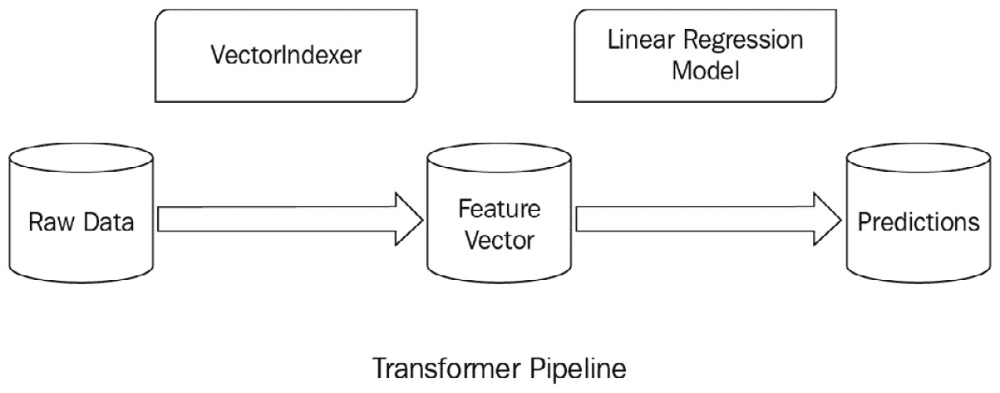
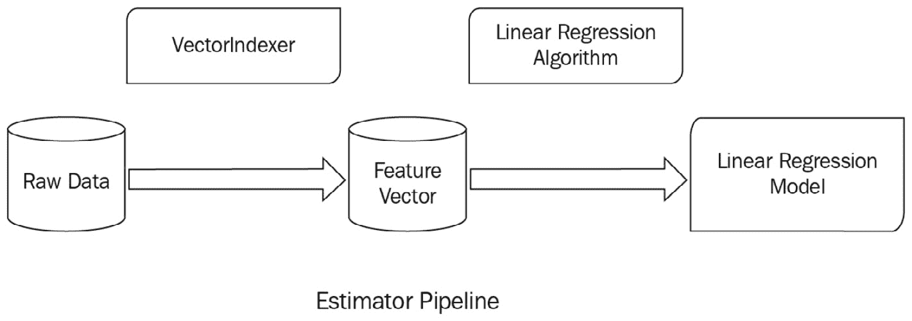

# 第五章：使用 PySpark 进行可扩展机器学习

在前几章中，我们已经建立了现代数据以惊人的速度增长，且其体量、速度和准确性是传统系统无法跟上的。因此，我们学习了分布式计算，以跟上日益增长的数据处理需求，并通过实际案例了解如何摄取、清洗和整合数据，将其处理到适合商业分析的水平，充分利用 Apache Spark 统一的数据分析平台的强大功能和易用性。本章及后续章节将探索数据科学和**机器学习**（**ML**）在数据分析中的应用。

如今，人工智能（AI）和机器学习（ML）计算机科学领域正经历大规模复兴，并且无处不在。各行各业的企业都需要利用这些技术来保持竞争力，扩大客户群，推出新产品线，并保持盈利。然而，传统的机器学习和数据科学技术是为了处理有限的数据样本而设计的，本身并不具备扩展性。

本章为你提供了传统机器学习算法的概述，包括有监督和无监督的 ML 技术，并探索了机器学习在商业应用中的实际案例。接着，你将了解可扩展机器学习的必要性。将介绍一些以分布式方式扩展 ML 算法、处理非常大的数据样本的技术。然后，我们将深入探讨 Apache Spark 的 ML 库——MLlib，并结合代码示例，使用 Apache Spark 的 MLlib 进行数据整理，探索、清洗并操作数据，为机器学习应用做好准备。

本章涵盖以下主要内容：

+   机器学习概述

+   扩展机器学习

+   使用 Apache Spark 和 MLlib 进行数据整理

到本章结束时，你将会对可扩展的机器学习（ML）及其商业应用有所了解，并掌握 Apache Spark 的可扩展 ML 库——MLlib 的基本知识。你将掌握使用 MLlib 清洗和转换数据的技能，为大规模机器学习应用做准备，帮助你减少数据清洗任务所需的时间，使你的整体 ML 生命周期更加高效。

# 技术要求

在本章中，我们将使用 Databricks Community Edition 来运行我们的代码：[`community.cloud.databricks.com`](https://community.cloud.databricks.com)。

+   注册说明可以在 [`databricks.com/try-databricks`](https://databricks.com/try-databricks) 找到。

+   本章使用的代码和数据可以从 [`github.com/PacktPublishing/Essential-PySpark-for-Scalable-Data-Analytics/tree/main/Chapter05`](https://github.com/PacktPublishing/Essential-PySpark-for-Scalable-Data-Analytics/tree/main/Chapter05) 下载。

# 机器学习概述

**机器学习**是人工智能和计算机科学的一个领域，利用统计模型和计算机算法学习数据中固有的模式，而无需显式编程。机器学习由能够自动将数据中的模式转换为模型的算法组成。当纯数学或基于规则的模型一遍又一遍地执行相同任务时，机器学习模型则从数据中学习，并且通过暴露于大量数据，性能可以大大提高。

一个典型的机器学习过程涉及将机器学习算法应用于已知数据集（称为训练数据集），以生成新的机器学习模型。这个过程通常被称为*模型训练*或*模型拟合*。一些机器学习模型是在包含已知正确答案的数据集上进行训练的，目的是在未知数据集中预测这些答案。训练数据集中已知的正确值称为*标签*。

一旦模型训练完成，生成的模型将应用于新数据以预测所需的值。这个过程通常被称为**模型推断**或**模型评分**。

提示

与其训练单一模型，最佳做法是使用不同的模型参数（称为**超参数**）训练多个模型，并根据定义明确的**准确性指标**从所有训练过的模型中选择最佳模型。这个基于不同参数训练多个模型的过程通常被称为超参数**调优**或**交叉验证**。

机器学习算法的示例包括分类、回归、聚类、协同过滤和降维。

## 机器学习算法的类型

机器学习算法可以分为三大类，即监督学习、无监督学习和强化学习，以下部分将详细讨论这些内容。

### 监督学习

**监督学习**是一种机器学习方法，其中模型在已知标签的训练数据集上进行训练。该标签是在训练数据集中标记的，并代表我们尝试解决问题的正确答案。我们进行监督学习的目的是在模型在已知数据集上经过训练后，预测未知数据集中的标签。

监督学习算法的示例包括线性回归、逻辑回归、朴素贝叶斯分类器、K 近邻、决策树、随机森林、梯度提升树和支持向量机。

监督学习可以分为两大类，即回归问题和分类问题。回归问题涉及预测一个未知标签，而分类问题则尝试将训练数据集分类到已知类别中。使用**Apache Spark** **MLlib**进行监督学习的详细实现将在*第六章*，“*监督学习*”中介绍。

### 无监督学习

**无监督学习**是机器学习的一种类型，其中训练数据对算法是未知的，且没有提前标注正确答案。无监督学习涉及学习一个未知、未标注的数据集的结构，没有用户的任何指导。在这种情况下，机器的任务是根据某些相似性或差异将数据分组或归类，而无需任何预先的训练。

无监督学习可以进一步分为**聚类**和**关联**问题。聚类问题涉及发现训练数据集中的类别，而关联问题则涉及发现数据中描述实体关系的规则。无监督学习的例子包括 K-means 聚类和协同过滤。无监督学习将在*第七章*中详细探讨，*无监督机器学习*，并通过 Apache Spark MLlib 提供编码示例。

### 强化学习

**强化学习**被软件系统和机器用于在给定情境下找到最优的行为或路径。与已经在训练数据集中包含正确答案的监督学习不同，在强化学习中没有固定答案，强化学习代理通过反复试验来决定结果，并且旨在从经验中学习。强化学习代理会根据选择的路径获得奖励或受到惩罚，目标是最大化奖励。

强化学习应用于自驾车、机器人技术、工业自动化以及用于聊天机器人代理的自然语言处理等领域。Apache Spark MLlib 中没有现成的强化学习实现，因此深入探讨这一概念超出了本书的范围。

注意

数据科学和机器学习的另一个分支是**深度学习**，它利用了先进的机器学习技术，如神经网络，这些技术近年来也变得非常突出。虽然 Apache Spark 确实支持某些深度学习算法，但这些概念过于先进，无法在本书的范围内涉及。

## 机器学习的业务应用案例

到目前为止，我们讨论了机器学习的不同类别，并简要介绍了机器学习模型可以执行的任务。在本节中，您将了解一些机器学习算法在现实生活中如何帮助解决不同行业的实际商业问题。

### 客户流失预防

使用机器学习建立客户流失模型对于识别那些可能停止与您的业务互动的客户非常有用，并且还可以帮助您深入了解导致客户流失的因素。流失模型可以简单地是一个回归模型，用于估算每个个体的风险评分。客户流失模型可以帮助企业识别面临流失风险的客户，从而实施客户保持策略。

### 客户终生价值建模

零售企业的收入大部分来自少数高价值客户，这些客户带来了重复购买。客户终生价值模型可以估算一个客户的生命周期，即客户可能流失的时期。它们还可以预测一个客户在其生命周期内可能带来的总收入。因此，估算潜在高价值客户在其生命周期内可能带来的收入，对于重新分配营销资金来吸引和留住这些客户至关重要。

### 需求预测

实体店和在线商店都有有限的实际存储空间，无论是在商店内还是在仓库里。因此，如何将这些有限的存储空间填充上实际需求的产品是非常重要的。您可以基于季节性和每年的月份开发一个简单的模型。然而，建立一个更复杂的机器学习模型，不仅包括季节性和历史数据，还包括外部数据，例如社交媒体上的当前趋势、天气预报数据和社交媒体上的客户情绪，可能会导致更准确的需求预测，并因此帮助最大化收入。

### 运输交货时间预测

任何涉及配送和物流操作的企业，无论是在线零售商还是食品配送平台，都需要能够估算订单送达客户所需的时间。通常，运输的交货时间是客户在选择是否与您合作时做决策的一个关键因素，客户可能会因此选择与竞争对手合作。回归模型可以根据产品的起始地和目的地、天气及其他季节性数据准确估算产品交付到客户邮政编码所需的时间。

### 市场篮分析

市场篮分析是一种根据客户购物篮中已有的商品向其推荐其他产品的技术。通过利用协同过滤算法，机器学习（ML）可以发现产品类别之间的关联规则，从而根据客户购物车中的商品和过去的购买记录向在线客户推荐产品。这是几乎所有电子零售商常用的一个重要应用。

### 财务欺诈检测

机器学习具备从数据中检测模式的固有能力。因此，可以利用机器学习构建能够检测财务交易异常的模型，以标记某些交易为欺诈行为。传统上，金融机构已经在利用基于规则的模型进行欺诈检测，但将机器学习模型纳入其中会使欺诈检测模型更加有效，从而帮助发现新的欺诈模式。

### 使用自然语言处理进行信息提取

制药公司和产生大量知识的企业面临着一个特定于其行业的独特挑战。在拥有数万名员工的组织中，尝试识别某个知识点是否已经由另一个小组创建，并非一件简单的事情。机器学习的自然语言处理技术可以用来整理、分组、分类和标注大量文档，从而使用户能够轻松搜索是否已有类似的知识点存在。

到目前为止，你已经了解了机器学习的基本知识、不同类型的机器学习算法以及它们在实际商业案例中的应用。在接下来的部分中，我们将讨论可扩展机器学习的需求，以及扩展机器学习算法的一些技术，并介绍 Apache Spark 的原生可扩展机器学习库**MLlib**及其在数据整理中的应用。

# 扩展机器学习

在前面的章节中，我们了解到，机器学习是一套算法，而不是显式编程，它能够自动学习数据中隐藏的模式。因此，暴露给更大数据集的机器学习算法，可能会导致更好的模型表现。然而，传统的机器学习算法设计是基于有限的数据样本并在单台机器上训练的。这意味着现有的机器学习库本身并不具备扩展性。解决这一问题的一个方法是将较大的数据集下采样，以适应单台机器的内存，但这也可能意味着最终得到的模型不如可能的最优模型准确。

此外，通常会在同一数据集上构建多个机器学习模型，仅仅是改变提供给算法的参数。在这些模型中，选择最优的模型用于生产环境，这个过程叫做**超参数调优**。在单台机器上按顺序构建多个模型，需要很长时间才能得到最佳模型，这导致生产周期更长，从而也增加了推向市场的时间。

鉴于传统机器学习算法的可扩展性挑战，迫切需要扩展现有的机器学习算法或开发新的可扩展机器学习算法。我们将在接下来的部分中探索一些扩展机器学习算法的技术。

## 扩展机器学习的技术

以下部分将介绍两种扩展机器学习算法的主要技术。

### 令人尴尬的并行处理

**令人尴尬的并行处理**是一种并行计算技术，在这种技术中，几乎不需要任何努力就可以将给定的计算问题分解成较小的并行任务。当并行化的任务之间没有任何相互依赖，且所有任务都可以完全独立执行时，这种方式就可以实现。

现在，让我们尝试将这个方法应用到在非常大的数据集上扩展单机机器学习算法的问题上，乍一看，这似乎不是一个简单的任务。然而，考虑到超参数调优或交叉验证的问题，我们可以运行多个并行模型，每个模型都有不同的参数，但它们都可以在一个单机的内存中处理相同的小数据集。在这种情况下，我们可以通过调整模型参数轻松地在相同的数据集上训练多个模型。因此，通过利用令人尴尬的并行处理技术，我们可以将模型构建过程加速数个数量级，帮助我们在数小时内而非数周或数月内找到最优的模型，从而加速你的业务价值实现。你将进一步了解如何在*第十章**中应用这一技术，使用 PySpark 扩展单节点机器学习*。

### 可扩展的机器学习算法

尽管令人尴尬的并行计算技术帮助我们在更短时间内得到更好的模型，并提高了准确性，但它仍然受限于较小的数据集大小。这意味着我们可能会因为数据的下采样而错失潜在的数据模式。为了解决这个问题，我们需要能够天然扩展至多个机器的机器学习算法，并能够在分布式的方式下训练非常大的数据集。Apache Spark 的原生 ML 库，名为 MLlib，包含了这些本质上可扩展的机器学习算法，接下来的部分我们将进一步探讨 MLlib。

## Apache Spark 的 ML 库简介

MLlib 是 Apache Spark 的原生机器学习库。作为一个原生库，MLlib 与 Spark 的其他 API 和库紧密集成，包括 Spark SQL 引擎、DataFrame API、Spark SQL API，甚至结构化流处理。这个特性使得 Apache Spark 成为一个真正统一的数据分析平台，可以执行所有与数据分析相关的任务，从数据摄取到数据转换，再到数据的临时分析、构建复杂的机器学习模型，甚至将这些模型应用于生产环境中。在接下来的部分，你将更深入地了解 Spark MLlib 及其核心组件。

### Spark MLlib 概览

在 Apache Spark 的早期版本中，MLlib 基于 Spark 的 RDD API。自 Spark 2.0 版本开始，推出了一个基于 DataFrame API 的新 ML 库。现在，在 Spark 3.0 及更高版本中，基于 DataFrame API 的 MLlib 是标准，而旧的基于 RDD 的 MLlib 处于维护模式，未来不会再进行扩展。

基于 DataFrame 的 MLlib 与传统的基于 Python 的单机 ML 库（如 scikit-learn）高度相似，包含三个主要组件，分别是转换器、估算器和管道，具体内容将在接下来的章节中介绍。

### 转换器

**转换器** 是一种算法，它接受一个 DataFrame 作为输入，对 DataFrame 列进行处理，并返回另一个 DataFrame。使用 Spark MLlib 训练的 ML 模型是一个转换器，它接受一个原始 DataFrame，并返回一个包含原始数据和新预测列的 DataFrame。典型的转换器管道如下图所示：



图 5.1 – 一个转换器管道

在前面的图中，展示了一个典型的转换器管道，其中一系列的转换器阶段，包括 **VectorIndexer** 和已训练的 **线性回归模型**，被应用到原始的 DataFrame。结果是一个新的 DataFrame，包含了所有原始列，并新增了包含预测值的新列。

注

转换操作与 Spark 的 MLlib 中的转换器是不同的概念。虽然两者都将一个 DataFrame 转换为另一个 DataFrame，并且都是惰性计算，但前者是对 DataFrame 执行的操作，而后者则是一个实际的 ML 算法。

### 估算器

**估算器**是另一种算法，它接受一个 DataFrame 作为输入，并生成一个转换器。任何 ML 算法都是一个估算器，因为它将包含原始数据的 DataFrame 转换为包含实际预测结果的 DataFrame。估算器管道在下图中描述：



图 5.2 – 一个估算器管道

在上图中，首先将 **Transformer** 应用于一个包含原始数据的 DataFrame，生成一个 **特征向量** DataFrame。然后，将 **估算器**（以 **线性回归** **算法** 的形式）应用于包含 **特征向量** 的 DataFrame，生成一个新的 **线性回归模型**，该模型作为 **Transformer** 返回。

注

特征向量是 Spark MLlib 库中的一种特殊数据结构。它是一个 DataFrame 列，包含实际的浮动点类型向量对象。由于 ML 基于数学和统计学，所有 ML 算法只对浮动点值的向量进行操作。原始数据通过特征提取和特征工程技术转换为特征向量。

### 管道

Spark MLlib 中的 ML 管道将多个转换器和估算器的阶段链在一起，形成一个执行端到端 ML 操作的有向无环图（DAG），该操作从数据清理到特征工程，再到实际的模型训练。一个管道可以是仅包含转换器的管道，也可以是仅包含估算器的管道，或者两者的结合。

使用 Spark MLlib 中的可用转换器和估算器，可以构建一个完整的端到端机器学习（ML）管道。一个典型的 ML 管道由多个阶段组成，从数据清理、特征工程、模型训练到模型推理。你将在接下来的章节中学习更多关于数据清理的技术。

# 使用 Apache Spark 和 MLlib 进行数据清理

**数据清理**，在数据科学社区中也称为 **数据清洗** 或简而言之 **数据准备**，是典型数据科学过程中的第一步。数据清理涉及采样、探索、选择、操作和清洗数据，以使其准备好进行机器学习应用。数据清理占整个数据科学过程的 60% 到 80%，是确保构建的 ML 模型准确性的最关键步骤。接下来的章节将使用 Apache Spark 和 MLlib 探讨数据清理过程。

## 数据预处理

数据预处理是数据清理过程中的第一步，涉及收集、探索和选择对于解决当前问题有用的数据元素。数据科学过程通常继承数据工程过程，假设数据湖中已经存在干净和集成的数据。然而，足够干净的数据可能对于商业智能（BI）来说是合适的，但可能并不适合数据科学应用。同时，数据科学应用需要额外的数据集，这些数据集可能对其他分析用例无用，因此可能尚未清理。

在开始操作和清理数据之前，我们需要将其加载到 Spark DataFrame 中，并探索数据以了解其结构。以下代码示例将使用在 *第三章*《数据清理与集成》末尾产生的集成数据集，名为 `retail_silver.delta`：

```py
raw_data = spark.read.format("delta").load("dbfs:/FileStore/shared_uploads/delta/retail_silver.delta")
raw_data.printSchema()
(select_data = raw_data.select("invoice_num", "stock_code",
                               "quantity", "invoice_date", 
                               "unit_price","country_code",
                               "age", "work_class", 
                               "final_weight")
select_data.describe().show()
```

在前面的代码片段中，我们执行了以下操作：

1.  我们使用 `spark.read()` 函数将数据从数据湖加载到 Spark DataFrame 中。

1.  我们使用 `printSchema()` 函数打印其架构，以检查列的数据类型。

1.  我们使用 `select()` 操作显示 DataFrame 中的几个列，以检查它们的值。

1.  我们使用 `describe()` 操作生成 DataFrame 的基本统计信息。

## 数据清理

在上一节的代码示例中，你应该注意到大多数数据类型只是字符串类型。数据集可能还包含重复项，并且数据中也可能存在 `NULL` 值。让我们解决数据集中的这些不一致性，如下所示的代码片段所示：

```py
dedupe_data = select_data.drop_duplicates(["invoice_num",
                                           "invoice_date", 
                                           "stock_code"])
interim_data = (select_data
    .withColumn("invoice_time", to_timestamp("invoice_date", 
                                             'dd/M/yy HH:mm'))
    .withColumn("cust_age", col("age").cast(FloatType()))
    .withColumn("working_class", 
                col("work_class").cast(FloatType()))
    .withColumn("fin_wt", 
                col("final_weight").cast(FloatType()))
)
clean_data = interim_data.na.fill(0)
```

在上面的代码片段中，我们执行了以下操作：

1.  我们使用`dropduplicates()`操作通过键列去重数据。

1.  然后，我们使用`to_timestamp()`函数将 datetime 列转换为正确的时间戳类型，通过提供正确的时间戳格式。

1.  我们使用`CAST()`方法更改 DataFrame 的数据类型。

1.  我们使用`na.fill()`操作将缺失值和`NULL`值替换为`0`。

本节展示了如何使用 PySpark 进行大规模的数据清洗。下一节将展示如何执行数据处理步骤，如过滤和重命名。

## 数据操作

一旦你有了更干净的数据集，你可以执行操作来过滤掉任何不需要的数据、重命名列以遵循你的命名约定，并删除任何不需要的数据列，如下代码块所示：

```py
final_data = (clean_data.where("year(invoice_time) = 2009")
                       .withColumnRenamed("working_class", 
                                          "work_type")
                       .withColumnRenamed("fin_wt", 
                                          "final_weight")
                       .drop("age")
                       .drop("work_class")
                       .drop("fn_wt"))
pd_data = final_data.toPandas()
```

在上面的代码片段中，我们执行了以下操作：

1.  我们使用`where()`函数过滤、切片和处理数据。

1.  我们使用`withColumnsRenamed()`函数重命名列，并使用`drop()`函数删除不需要的列。

1.  我们使用`toPandas()`函数将 Spark DataFrame 转换为 PySpark DataFrame。

有时，Spark MLlib 中没有可用的 ML 算法，或者有一个使用单节点 Python 库构建的自定义算法。对于这些用例，你可以将 Spark DataFrame 转换为 pandas DataFrame，如前面的*步骤 3*所示。

注意

将 Spark DataFrame 转换为 pandas DataFrame 涉及将所有数据从 Executor 收集到 Spark 驱动程序。因此，需要注意此转换仅应用于较小的数据集，否则可能会导致驱动节点的`OutOfMemory`错误。

# 总结

在本章中，你了解了机器学习（ML）的概念和不同类型的 ML 算法。你还学习了 ML 在现实世界中的一些应用，帮助企业减少损失、最大化收入并加速上市时间。你还了解了可扩展 ML 的必要性，以及两种不同的技术来扩展 ML 算法。介绍了 Apache Spark 的本地 ML 库 MLlib 及其主要组件。

最后，你学习了一些执行数据清理、处理和转换的技术，使数据更适合数据科学流程。在接下来的章节中，你将学习机器学习（ML）流程的发送阶段，称为特征提取和特征工程，你将学习如何应用各种可扩展的算法来转换单个数据字段，使其更适合数据科学应用。
