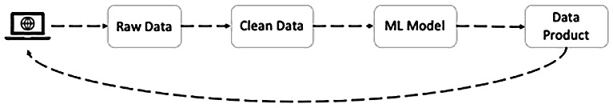
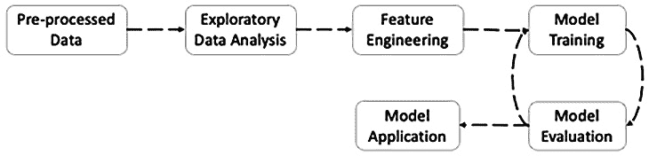
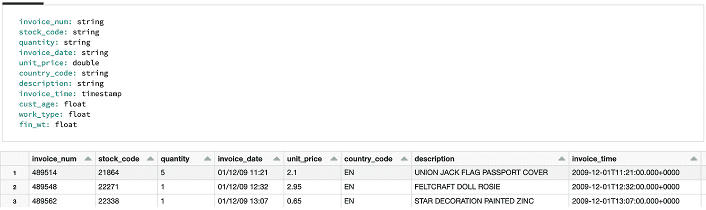
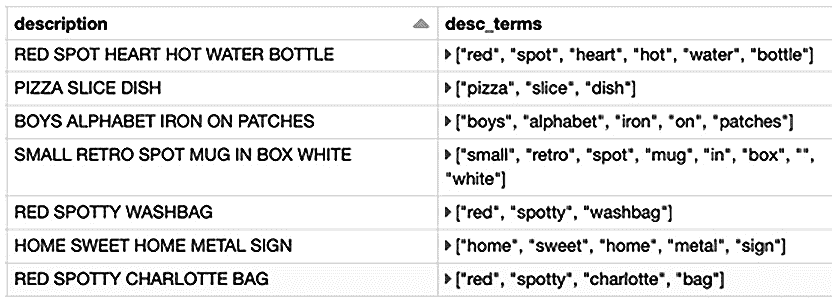
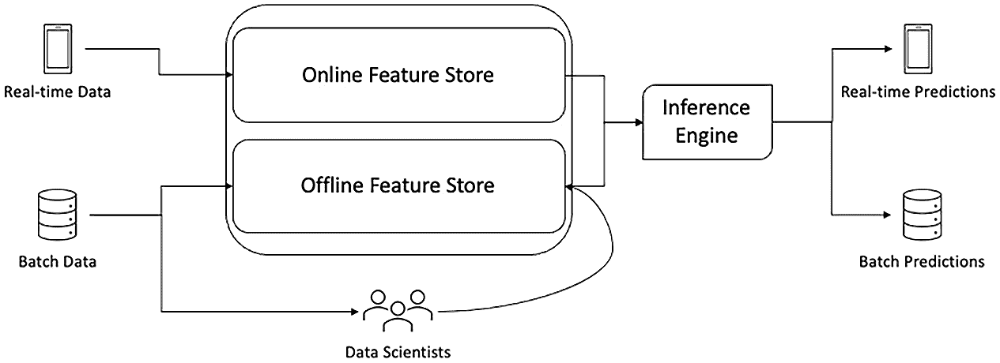
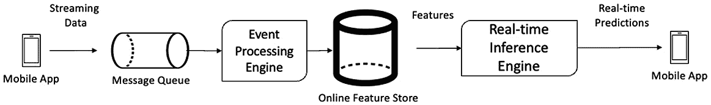

# 第六章：特征工程 – 提取、转换和选择

在上一章中，您了解了 Apache Spark 的原生、可扩展的机器学习库**MLlib**，并获得了其主要架构组件的概述，包括转换器、估算器和管道。

本章将带领您进入**可扩展机器学习**旅程的第一阶段——**特征工程**。特征工程涉及从预处理和清理后的数据中提取机器学习特征的过程，以便为机器学习做准备。您将学习**特征提取**、**特征转换**、**特征缩放**和**特征选择**等概念，并通过 Spark MLlib 中的算法和一些代码示例实现这些技术。在本章结束时，您将掌握实施可扩展特征工程管道的必要技术，将预处理的数据转换为适合并准备好用于机器学习模型训练过程的格式。

特别地，在本章中，您将学习以下内容：

+   机器学习过程

+   特征提取

+   特征转换

+   特征选择

+   特征库作为中央特征存储库

+   Delta 作为离线特征存储库

# 技术要求

在本章中，我们将使用 Databricks 社区版来运行代码。可以在[`community.cloud.databricks.com`](https://community.cloud.databricks.com)找到。

+   注册说明可以在[`databricks.com/try-databricks`](https://databricks.com/try-databricks)找到。本章使用的代码可以从[`github.com/PacktPublishing/Essential-PySpark-for-Data-Analytics/tree/main/Chapter06`](https://github.com/PacktPublishing/Essential-PySpark-for-Data-Analytics/tree/main/Chapter06)下载。

+   本章使用的数据集可以在[`github.com/PacktPublishing/Essential-PySpark-for-Data-Analytics/tree/main/data`](https://github.com/PacktPublishing/Essential-PySpark-for-Data-Analytics/tree/main/data)找到。

# 机器学习过程

一个典型的数据分析和数据科学过程包括收集原始数据、清理数据、整合数据和集成数据。之后，我们将统计学和机器学习技术应用于预处理后的数据，以生成机器学习模型，最后以数据产品的形式总结并向业务相关方传达过程结果。机器学习过程的高层次概述见下图：



图 6.1 – 数据分析和数据科学过程

从前面的图表可以看出，实际的机器学习过程只是整个数据分析过程的一小部分。数据团队花费大量时间进行数据策划和预处理，而其中只有一部分时间用于构建实际的机器学习模型。

实际的机器学习过程包括多个阶段，这些阶段使你能够执行诸如数据探索、特征提取、模型训练、模型评估以及应用模型到实际商业场景等步骤，如下图所示：



图 6.2 – 机器学习过程

在本章中，你将了解机器学习过程中的**特征工程**阶段。接下来的章节将介绍一些在**Spark MLlib**库中可用的突出算法和工具，这些算法和工具涉及**特征提取**、**特征转换**、**特征缩放**和**特征选择**等**特征工程**步骤。

# 特征提取

机器学习模型等同于数学中的函数或计算机编程中的方法。机器学习模型接受一个或多个参数或变量作为输入，并生成一个输出，称为预测。在机器学习术语中，这些输入参数或变量称为**特征**。特征是机器学习算法或模型中输入数据集的一列。特征是一个可度量的数据点，如个人的姓名、性别或年龄，或者是与时间相关的数据、天气数据，或其他对分析有用的数据。

机器学习算法利用线性代数这一数学领域，并使用矩阵和向量等数学结构在内部以及算法代码层面上表示数据。即使在经过数据工程处理之后，实际世界中的数据也很少以矩阵和向量的形式出现。因此，特征工程过程会应用于预处理数据，以将其转换为适合机器学习算法的格式。

特征提取过程专门处理将文本、图像、地理空间或时间序列数据转换为特征向量的问题。Apache Spark MLlib 提供了多种特征提取方法，如`TF-IDF`、`Word2Vec`、`CountVectorizer`和`FeatureHasher`。

让我们以一组单词为例，使用`CountVectorizer`算法将其转换为特征向量。在本书的早期章节中，我们查看了一个在线零售商的样本数据集，并对这些数据集应用了数据工程过程，以获得一个干净且整合的、适合分析的数据集。

那么，让我们从在*第五章*《可扩展机器学习与 PySpark》末尾产生的预处理和清理后的数据集开始，该数据集名为`retail_ml.delta`。这个预处理的数据集，作为机器学习过程的输入，通常被称为**训练数据集**：

1.  作为第一步，让我们将数据从数据湖以 Delta 格式加载到 Spark DataFrame 中。如下方代码片段所示：

    ```py
    preproc_data = spark.read.format("delta").load("dbfs:/FileStore/shared_uploads/delta/retail_ml.delta")
    preproc_data.show()
    ```

    在前面的代码块中，我们将存储在数据湖中的 Delta 格式数据加载到 Spark DataFrame 中，然后使用`show()`命令显示数据。

1.  显示函数的结果如下图所示：

    图 6.3 – 预处理数据

    在前面的图示中，我们得到了经过数据工程和数据整理步骤后的预处理数据。请注意，数据集中有`11`列，数据类型各异，包含字符串、双精度数和时间戳。在当前格式下，它们不适合作为机器学习算法的输入；因此，我们需要通过特征工程过程将其转换为适合的格式。

1.  让我们从`description`列开始，该列为文本类型，并对其应用`CountVectorizer`特征提取算法，以便将其转换为特征向量，如下方代码块所示：

    ```py
    from pyspark.sql.functions import split, trim
    from pyspark.ml.feature import CountVectorizer
    cv_df = preproc_data.withColumn("desc_array", split(trim("description"), " ")).where("description is NOT NULL")
    cv = CountVectorizer(inputCol="desc_array", 
                         outputCol="description_vec", 
                         vocabSize=2, minDF=2.0)
    cv_model = cv.fit(cv_df)
    train_df = model.transform(cv_df)
    train_df.display()
    ```

    在前面的代码块中，发生了以下操作：

    1.  我们从`pyspark.ml.feature`库中导入`CountVectorizer`。

    1.  `CountVectorizer`接受一个`Array`对象作为输入，因此我们使用`split()`函数将 description 列分割成一个单词的`Array`对象。

    1.  然后，我们使用之前定义的估算器在输入数据集上初始化一个新的`CountVectorizer` `fit()`方法。结果是一个经过训练的模型`transform()`方法应用于输入 DataFrame，从而生成一个新的 DataFrame，并为 description 列添加一个新的特征向量列。

    通过使用 Spark MLlib 中的`CountVectorizer`特征提取器，我们能够从文本类型的列中提取特征向量。

1.  Spark MLlib 中还可以使用其他特征提取器，如`Word2Vec`，如下方代码片段所示：

    ```py
    from pyspark.ml.feature import Word2Vec
    w2v_df = preproc_data.withColumn("desc_array", split(trim("description"), "\t")).where("description is NOT NULL")
    word2vec = Word2Vec(vectorSize=2, minCount=0, 
                        inputCol="desc_array", 
                        outputCol="desc_vec")
    w2v_model = word2vec.fit(w2v_df)
    train_df = w2v_model.transform(w2v_df)
    ```

    在前面的代码块中，`Word2Vec`估算器的使用方式与之前提到的`CountVectorizer`类似。在这里，我们用它从基于文本的数据列中提取特征向量。虽然`CountVectorizer`和`Word2Vec`都帮助将一个单词语料库转换成特征向量，但它们在每个算法的内部实现上有所不同。它们各自有不同的用途，取决于问题情境和输入数据集，并且在不同的情况下可能会产生不同的结果。

请注意，讨论这些算法的细微差别或提出何时使用特定特征提取算法的建议超出了本书的范围。

现在您已经学习了几种特征提取技术，在下一节中，让我们探讨几种**特征转换**的 Spark MLlib 算法。

# 特征转换

特征转换是仔细审查训练数据中存在的各种变量类型，如分类变量和连续变量，并确定最佳转换类型以实现最佳模型性能的过程。本节将描述如何转换机器学习数据集中发现的几种常见变量类型的示例代码，例如文本和数值变量。

## 转换分类变量

分类变量是具有有限和有限范围的离散值的数据片段。它们通常是基于文本的性质，但也可以是数字的。例如，国家代码和年份的月份。我们在前一节中提到了关于如何从文本变量中提取特征的几种技术。在本节中，我们将探讨几种其他算法来转换分类变量。

### 将文本标记化为单独的术语

`Tokenizer`类可以用来将文本分解为其组成的术语，如下面的代码示例所示：

```py
from pyspark.ml.feature import Tokenizer
tokenizer = Tokenizer(inputCol="description", 
                      outputCol="desc_terms")
tokenized_df = tokenizer.transform(preproc_data)
tokenized_df.show()
```

在前面的代码块中，我们通过传入`inputCol`和`outputCol`参数来初始化`Tokenizer`类，从而生成一个转换器。然后，我们转换训练数据集，得到一个 Spark DataFrame，其中包含一个新列，其中包含每个句子中被转换为小写的单词数组。这在下表中显示：



图 6.4 – 使用 Tokenizer 标记化文本

在上表中，您可以从标记化的单词中看到有一些不需要的词，我们需要将它们去掉，因为它们没有添加任何价值。

### 使用`StopWordsRemover`删除常见词

每种语言都包含常见且频繁出现的单词，如介词、冠词、连词和感叹词。这些词在机器学习过程中不具备任何意义，并且最好在训练机器学习算法之前将其删除。在 Spark 中，可以使用`StopWordsRemover`类来实现这一过程，如下面的代码片段所示：

```py
from pyspark.ml.feature import StopWordsRemover
stops_remover = StopWordsRemover(inputCol="desc_terms", 
                                 outputCol="desc_nostops")
stops_df = stops_remover.transform(tokenized_df)
stops_df.select("desc_terms", "desc_nostops").show()
```

在前面的代码块中，我们通过传入`inputCol`和`outputCol`参数来初始化`StopWordsRemover`类，从而生成一个转换器。然后，我们转换训练数据集，得到一个 Spark DataFrame，其中包含一个新列，该列具有一个数组，其中包含已删除停用词的单个单词。

一旦我们有了一个删除了停用词的字符串数组，就可以使用诸如`Word2Vec`或`CountVectorizer`等特征提取技术来构建特征向量。

### 编码离散的分类变量

现在我们有其他类型的字符串类型列，例如需要转换为数值形式以供机器学习算法使用的国家代码。你不能简单地为这些离散的分类变量分配任意的数值，因为这样可能会引入一种数据中本不存在的模式。

让我们考虑一个例子，其中我们按字母顺序单调递增地为分类变量分配值。然而，这可能会为这些变量引入一种排名，而这种排名在最初并不存在。这将扭曲我们的机器学习模型，并且并不理想。为了解决这个问题，我们可以使用 Spark MLlib 中的多种算法来编码这些分类变量。

### 使用 StringIndexer 编码字符串变量

在我们的训练数据集中，我们有字符串类型或分类变量，它们具有离散值，如`country_code`。这些变量可以使用`StringIndexer`分配标签索引，如下方代码示例所示：

```py
from pyspark.ml.feature import StringIndexer
string_indexer = StringIndexer(inputCol="country_code", 
                               outputCol="country_indexed", 
                               handleInvalid="skip" )
indexed_df = string_indexer.fit(stops_df).transform(stops_df)
indexed_df.select("country_code", "country_indexed").show()
```

在前面的代码片段中，我们初始化了`StringIndexer`类，并设置了输入和输出列的名称。然后，我们将`handleInvalid`设置为`skip`，以跳过`NULL`和无效值。这样就得到了一个可以应用于训练数据框的估算器，进而得到了一个变换器。该变换器可以应用于训练数据集，从而生成一个新的 Spark 数据框，并且在其中新增了一个列，包含输入分类变量的标签索引。

### 使用 OneHotEncoder 将分类变量转换为向量

一旦我们将分类变量编码为标签索引，它们最终可以使用`OneHotEncoder`类转换为二进制向量，如下方代码片段所示：

```py
from pyspark.ml.feature import OneHotEncoder
ohe = OneHotEncoder(inputCol="country_indexed", 
                    outputCol="country_ohe")
ohe_df = ohe.fit(indexed_df).transform(indexed_df)
ohe_df.select("country_code", "country_ohe").show()
```

在前面的代码片段中，我们初始化了`OneHotEncoder`类，并设置了输入和输出列的名称。这样就得到了一个估算器，可以应用于训练数据框，进而生成一个变换器。该变换器可以应用于训练数据集，从而生成一个新的 Spark 数据框，并在其中新增一个列，包含表示原始分类变量的特征向量。

## 变换连续变量

连续变量以测量或观测值的形式表示数据。通常，它们是数值型的，几乎可以具有无限的范围。在这里，数据是连续的，而非离散的，一些例子包括年龄、数量和单价。它们看起来很直接，并可以直接输入机器学习算法。然而，它们仍然需要进行特征工程，因为连续变量可能有太多值，机器学习算法无法处理。处理连续变量的方法有很多种，比如分箱、归一化、应用自定义业务逻辑等，应该根据所解决的问题和业务领域选择适当的方法。

一种特征工程连续变量的技术是二值化，其中将连续的数值转换为基于用户定义阈值的二进制值，如以下代码示例所示：

```py
from pyspark.ml.feature import Binarizer
binarizer = Binarizer(threshold=10, inputCol="unit_price", 
                      outputCol="binarized_price")
binarized_df = binarizer.transform(ohe_df)
binarized_df.select("quantity", "binarized_price").show()
```

在前面的代码块中，我们通过输入和输出列参数初始化 `Binarizer` 类，生成一个转换器。然后可以将此转换器应用于训练数据框，从而得到一个新的数据框，并附加一个表示连续变量的二进制值的新列。

## 转换日期和时间变量

日期或时间戳类型的列本身对机器学习模型的训练过程并没有太大价值。然而，日期的组成部分，如月份、年份或星期几，可能会有某些模式。因此，选择日期时间列的某一部分并将其转换为适当的特征是非常有用的。

在以下代码示例中，我们从日期时间列中提取月份值并将其转换为特征，将其视为类别变量：

```py
from pyspark.sql.functions import month
month_df = binarized_df.withColumn("invoice_month", 
                                   month("invoice_time"))
month_indexer = StringIndexer(inputCol="invoice_month", 
                              outputCol="month_indexed", 
                              handleInvalid="skip" )
month_df = month_indexer.fit(month_df).transform(month_df)
month_df.select("invoice_month", "month_indexed").show()
```

在前面的代码块中，我们首先使用 `month()` 函数从时间戳列中提取月份，并将其附加到数据框中。然后，我们将新列通过 `StringIndexer` 估算器进行转换，将月份的数字列转换为标签索引。

## 将单个特征组合成特征向量

大多数机器学习算法接受一个单一的特征向量作为输入。因此，将提取并转换的单个特征合并为一个特征向量是很有用的。可以使用 Spark MLlib 的 `VectorAssembler` 转换器来实现，如以下代码示例所示：

```py
from pyspark.ml.feature import VectorAssembler
vec_assembler = VectorAssembler(
    inputCols=["desc_vec", "country_ohe", 
               "binarized_price", "month_indexed", 
               "quantity_indexed"],
    outputCol="features")
features_df = vec_assembler.transform(month_df)
features_df.select("features").show()
```

在前面的代码块中，我们通过输入和输出参数初始化 `VectorAssembler` 类，生成一个转换器对象。我们利用该转换器将单个特征合并为一个特征向量。这样，新的向量类型列就会附加到训练数据框中。

## 特征缩放

训练数据集通常会有不同计量单位的列。例如，一列可能使用公制计量单位，而另一列可能使用英制单位。某些列可能具有较大的数值范围，例如，一列表示美元金额，另一列表示数量。这些差异可能导致机器学习模型不当地对某些值赋予更多权重，从而产生不良影响，可能会引入偏差或模型失真。为了解决这个问题，可以使用一种称为特征缩放的技术。Spark MLlib 内置了一些特征缩放算法，如`Normalizer`、`StandardScaler`、`RobustScaler`、`MinMaxScaler`和`MaxAbsScaler`。

在下面的代码示例中，我们将使用`StandardScaler`来演示如何在 Apache Spark 中应用特征缩放。`StandardScaler`转换特征向量，并将每个向量规范化为具有标准差单位：

```py
from pyspark.ml.feature import StandardScaler
std_scaler = StandardScaler(inputCol="features", 
                            outputCol="scaled_features")
scaled_df = std_scaler.fit(features_df).transform(features_df)
scaled_df.select("scaled_features").show()
```

在前面的代码块中，`StandardScaler`类被初始化为输入和输出列的参数。然后，`StandardScaler`估算器应用于训练数据集，生成一个`StandardScaler`模型转换对象。接着，可以将该对象应用到训练 DataFrame，从而生成一个新 DataFrame，并添加一个包含规范化特征的新列。

到目前为止，在本节中，你已经学习了如何从数据集的列中提取机器学习特征。此外，你还学习了将基于文本的列转换为特征向量的特征提取技术。我们还探讨了将分类、连续以及基于日期和时间的变量转换的特征转换技术。介绍了将多个单独的特征组合成单个特征向量的技术，最后，你还学习了一种特征缩放技术来规范化特征。

在接下来的部分，你将学习减少特征数量的技术，这被称为**特征选择**。

# 特征选择

特征选择是一种技术，它通过减少机器学习过程中的特征数量，同时利用较少的数据，并提高训练模型的准确性。特征选择是一个过程，可以自动或手动选择那些对你所关注的预测变量贡献最大的特征。特征选择是机器学习中的一个重要方面，因为不相关或半相关的特征可能会严重影响模型的准确性。

Apache Spark MLlib 提供了一些特征选择器，包括`VectorSlicer`、`ChiSqSelector`、`UnivariateFeatureSelector`和`VarianceThresholdSelector`。让我们通过以下代码示例，探索如何在 Apache Spark 中实现特征选择，利用`ChiSqSelector`根据我们试图预测的标签列选择最优特征：

```py
from pyspark.ml.feature import ChiSqSelector
chisq_selector=ChiSqSelector(numTopFeatures=1, 
                             featuresCol="scaled_features", 
                             outputCol="selected_features", 
                             labelCol="cust_age")
result_df = chisq_selector.fit(scaled_df).transform(scaled_df)
result_df.select("selected_features").show()
```

在前面的代码块中，我们使用输入列和输出列初始化`ChiSqSelector`。我们还指定了标签列，因为`ChiSqSelector`选择最适合预测标签列的最优特征。然后，将`ChiSqSelector`估算器应用于训练数据集，生成一个`ChiSqSelector`模型转换器对象。接下来，可以将该对象应用于训练数据框，以生成一个新的数据框列，其中包含新选择的特征。

类似地，我们也可以利用`VectorSlicer`从给定的特征向量中选择一部分特征，如下列代码片段所示：

```py
from pyspark.ml.feature import VectorSlicer
vec_slicer = VectorSlicer(inputCol="scaled_features", 
                          outputCol="selected_features", 
                          indices=[1])
result_df = vec_slicer.transform(scaled_df)
result_df.select("scaled_features", 
                 "selected_features").display()
```

前面的代码块也执行了特征选择。然而，与`ChiSqSelector`不同，`VectorSlicer`并没有针对给定的变量优化特征选择。相反，`VectorSlicer`接受一个带有指定索引的向量列。这将生成一个新的向量列，其值通过指定的索引进行选择。每个特征选择器都有自己进行特征选择的方法，应该根据给定的场景和待解决的问题选择合适的特征选择器。

到目前为止，你已经学习了如何从基于文本的变量中提取特征，以及如何对分类和连续类型的变量进行特征转换。此外，你还探索了特征切片和特征选择的技术。你已经掌握了将预处理后的原始数据转换为特征向量的技术，这些特征向量可以直接输入到机器学习算法中，用于构建机器学习模型。

然而，对于每一个机器学习问题都执行特征工程似乎既冗余又耗时。那么，能不能直接使用一些已经构建好的特征来为新模型服务呢？答案是肯定的，你应该在新的机器学习问题中重用之前构建的特征。你也应该能够利用你其他团队成员的特征。这可以通过一个集中式特征存储来实现。我们将在接下来的部分进一步探讨这个话题。

# 特征存储作为中央特征库

在任何机器学习问题上花费的大部分时间都用于数据清洗和数据整理，以确保我们建立模型的基础是干净且有意义的数据。特征工程是机器学习过程中的另一个关键步骤，数据科学家们花费大量时间策划机器学习特征，这是一个复杂且耗时的过程。为每个新的机器学习问题再次创建特征似乎是违反直觉的。

通常，特征工程是在已经存在的历史数据上进行的，新特征在不同的机器学习问题中是可以完全重用的。事实上，数据科学家花费大量时间寻找问题所需的正确特征。因此，拥有一个集中的特征库，可搜索并具有用于识别特征的元数据将是非常有益的。这个集中的可搜索特征库通常被称为**特征存储**。典型的特征存储架构如下图所示：



图 6.5 – 特征存储架构

特征不仅在机器学习过程的模型训练阶段中有用，而且在模型推断过程中也是必需的。**推断**，也称为**模型评分**，是将已构建的模型与新的未见特征一起输入，以便在新数据上生成预测的过程。根据推断过程是批处理模式还是流式实时模式，特征可以被广泛分类为离线特征和在线特征。

## 使用离线特征存储进行批量推断

离线特征，顾名思义，是使用批处理作业离线生成的。它们的消耗也是离线进行的，可以通过模型训练过程或批量机器学习管道中的模型推断来进行，即使用定期安排的批处理方式。这些特征可能需要耗费时间来创建，通常使用大数据框架（如 Apache Spark）创建，或通过从数据库或数据仓库运行定期查询来创建。

用于生成离线特征的存储机制被称为离线特征存储。历史数据存储、关系型数据库、数据仓库系统和数据湖都是离线特征存储的良好选择。离线特征存储应具有强类型、模式强制执行机制，并具有存储元数据以及实际特征的能力。任何数据库或数据仓库都适用于离线特征存储；然而，在下一节中，我们将探讨 Delta Lake 作为离线特征存储。

# Delta Lake 作为离线特征存储

在*第三章*《数据清洗与集成》中，我们将数据湖确立为长期存储历史数据的可扩展且相对便宜的选择。我们讨论了数据可靠性和基于云的数据湖的一些挑战，并且你了解了 Delta Lake 是如何设计来克服这些挑战的。作为云数据湖的抽象层，Delta Lake 的优势不仅限于数据工程工作负载，也扩展到了数据科学工作负载，我们将在本节中深入探讨这些优势。

Delta Lake 是基于云的数据湖中理想的离线特征存储候选，因为它具备数据可靠性特性和 Delta Lake 提供的独特时间旅行功能。我们将在接下来的章节中讨论这些内容。

## Delta 表的结构和元数据

Delta Lake 支持具有明确定义列数据类型的结构化数据。这使得 Delta 表具有强类型，确保可以将各种数据类型的特征存储在 Delta 表中。相比之下，实际存储发生在相对便宜且可以无限扩展的基于云的数据湖中。这使得 Delta Lake 成为云中理想的离线特征存储候选。

## Delta Lake 的模式强制执行与演变

Delta Lake 完全支持模式强制执行，这意味着插入到 Delta Lake 特征存储中的特征数据的完整性得到了良好的维护。这将确保只有正确的、具有适当数据类型的数据用于机器学习模型的构建过程，从而确保模型的性能。Delta Lake 对模式演变的支持也意味着可以轻松地将新特征添加到基于 Delta Lake 的特征存储中。

## 支持同时处理批处理和流处理工作负载

由于 Delta Lake 完全支持统一的批处理和流处理工作负载，数据科学家除了批处理管道之外，还可以构建近实时的流式特征工程管道。这将有助于使用最新特征训练机器学习模型，并且也能够近实时地生成预测。这将通过仅利用 Apache Spark 的统一分析引擎，帮助消除高延迟推断需求的操作开销。

## Delta Lake 时间旅行

数据科学家经常通过微小的数据变动来改善模型准确度，通常会为此目的维护相同物理数据的多个版本。利用 Delta Lake 的时间旅行功能，单个 Delta 表可以轻松支持数据的多个版本，从而消除数据科学家维护多个物理数据版本的开销。

## 与机器学习操作工具的集成

Delta Lake 还支持与流行的机器学习操作和工作流管理工具 **MLflow** 集成。我们将在*第九章*《机器学习生命周期管理》中探讨 MLOps 和 MLflow。

这里展示了一个利用 Delta Lake 作为离线特征存储的代码示例：

```py
spark.sql("CREATE DATABASE feature_store")
(result_df
   .write
   .format("delta")
   .mode("append")
   .option("location", "/FileStore/shared_uploads/delta/retail_features.delta")
   .saveAsTable("feature_store.retail_features"))
```

首先，我们创建一个名为 `feature_store` 的数据库。然后，我们将上一节中的 *特征选择* 步骤的结果保存为 Delta 表。

通过这种方式，可以使用简单的 SQL 命令搜索特征，并且还可以通过共享的 Hive 元存储库将其共享并用于其他机器学习应用场景。Delta Lake 还支持常见的元数据，例如列名和数据类型，其他元数据，如用户备注和评论，也可以添加，以便为特征存储中的特征提供更多上下文信息。

提示

大多数大数据平台，包括 Databricks，都支持内置的 Hive 元存储库来存储表的元数据。此外，这些平台还提供了安全机制，如数据库、表格，有时甚至包括行级和列级访问控制机制。通过这种方式，特征存储可以得到保护，特征可以在数据团队之间进行选择性共享。

通过这种方式，使用 Delta Lake 可以作为云数据湖上的离线特征存储。一旦特征被存储在 Delta 表中，它们可以通过 Spark 的所有 API 访问，包括 DataFrame 和 SQL API。

注意

Spark MLlib 中的所有函数和方法都经过设计，可以原生地进行扩展。因此，使用 Spark MLlib 执行的任何机器学习操作天生具有可扩展性，并且可以运行具有并行和分布式任务的 Spark 作业。

## 用于实时推理的在线特征存储

用于在线机器学习推理的特征被称为在线特征。通常，这些特征具有超低延迟的要求，通常从毫秒到秒级。在线特征的一些使用场景包括在最终用户应用中的实时预测。

让我们考虑一个客户浏览电商网站应用的例子。客户将一个产品加入购物车，基于客户的邮政编码，网页应用需要在几秒钟内提供一个预计的送货时间。这里涉及的机器学习模型需要一些特征来估算交货时间，比如仓库位置、产品库存、历史交货时间，甚至可能还需要天气和季节性条件，但最重要的是，它需要客户的邮政编码。大多数特征可能已经在离线特征存储中预先计算并可用。然而，鉴于该用例的低延迟要求，特征存储必须能够以最低的延迟提供这些特征。数据湖、数据库或数据仓库并不是该用例的理想选择，需要一个超低延迟的在线特征存储。

从前面的示例中，我们可以得出结论，实时在线推理需要一些关键组件：

+   一个超低延迟的、最好是内存中的特征存储。

+   一个事件处理、低延迟流处理引擎

+   用于与终端用户的网页和移动应用集成的 RESTful API

以下图示展示了一个实时推理管道的例子：



图 6.6 – 实时机器学习推理管道

在前面的图示中，数据从网页或移动应用实时到达消息队列，如 Apache Kafka。一个低延迟的事件处理引擎，如 Apache Flink，处理传入的特征并将其存储到 NoSQL 数据库（如 Apache Cassandra）或内存数据库（如 Redis）中，以便用于在线特征存储。机器学习推理引擎从在线特征存储中提取特征，生成预测，并通过 REST API 将预测推送回网页或移动应用。

注意

无论是 Apache Spark 还是基于云的数据湖中的 Delta Lake，都不适合用作在线特征存储。Spark 的结构化流处理被设计用来处理高吞吐量，而非低延迟处理。结构化流处理的微批处理不适合在事件到达源头时进行处理。通常，基于云的数据湖是为了可扩展性而设计的，并且具有延迟规范，因此 Delta Lake 无法满足在线特征存储对超低延迟的要求。

# 总结

在本章中，你了解了特征工程的概念，以及它为何是整个机器学习过程中的重要部分。此外，你还了解了为何需要创建特征并训练机器学习模型。

你探索了各种特征工程技术，如特征提取，以及它们如何将基于文本的数据转换为特征。介绍了在处理类别型和连续变量时有用的特征转换技术，并展示了如何将它们转换为特征的示例。你还探索了有助于归一化特征的特征缩放技术，以防止某些特征对训练模型产生过度偏倚。

最后，你了解了通过特征选择技术选择合适特征的方法，以优化预测标签的模型性能。本章所学的技能将帮助你使用 Apache Spark 实现可扩展且高效的特征工程管道，并利用 Delta Lake 作为特征的中央共享存储库。

在接下来的章节中，你将学习属于监督学习范畴的各种机器学习训练算法。此外，你将实现代码示例，利用本章生成的特征，在 Apache Spark MLlib 中训练实际的机器学习模型。
