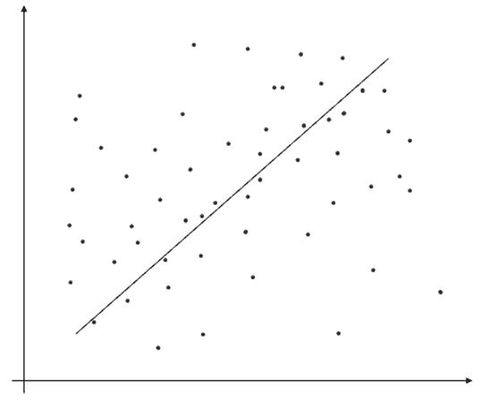
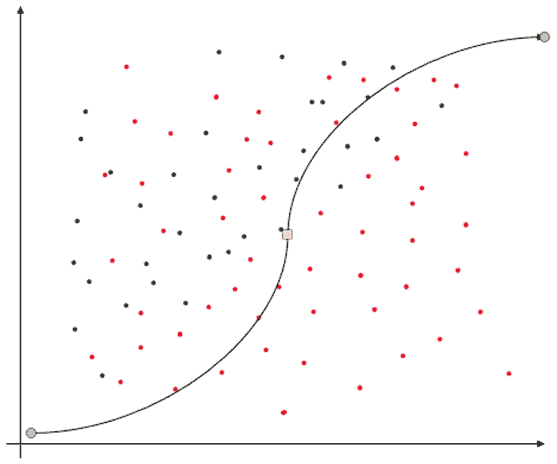

# 第七章：监督机器学习

在前两章中，你已经了解了机器学习过程、各个阶段以及该过程的第一步——**特征工程**。掌握了机器学习过程的基本知识，并拥有一组可用的机器学习特征后，你已准备好进入机器学习过程的核心部分——**模型训练**。

在本章中，你将接触到**监督学习**类别的机器学习算法，了解**参数化**和**非参数化**算法，掌握使用机器学习解决**回归**和**分类**问题所需的知识。最后，你将使用 Spark 机器学习库实现一些回归算法，如**线性回归**和**决策树**，以及一些分类算法，如**逻辑回归**、**朴素贝叶斯**和**支持向量机**。还将介绍**树集成**方法，这可以提高决策树的性能和准确性。本章还将展示回归和分类的几个现实世界应用，帮助你理解机器学习如何在日常场景中得到应用。

本章将涵盖以下主要主题：

+   监督学习简介

+   回归

+   分类

+   树集成

+   现实世界中的监督学习应用

到本章结束时，你应已掌握足够的知识和技能，能够使用 Spark MLlib 构建你自己的回归和分类模型并进行大规模训练。

# 技术要求

在本章中，我们将使用 Databricks Community Edition 来运行我们的代码([`community.cloud.databricks.com`](https://community.cloud.databricks.com))。

+   注册说明可以在[`databricks.com/try-databricks`](https://databricks.com/try-databricks)找到。

+   本章的代码可以从[`github.com/PacktPublishing/Essential-PySpark-for-Data-Analytics/tree/main/Chapter07`](https://github.com/PacktPublishing/Essential-PySpark-for-Data-Analytics/tree/main/Chapter07)下载。

+   本章的数据集可以在[`github.com/PacktPublishing/Essential-PySpark-for-Data-Analytics/tree/main/data`](https://github.com/PacktPublishing/Essential-PySpark-for-Data-Analytics/tree/main/data)找到。

# 监督学习简介

机器学习问题可以看作是一个过程，通过数学或统计函数从一组已知变量中推导出一个未知变量。不同之处在于，机器学习算法从给定的数据集中学习映射函数。

监督学习是一类机器学习算法，其中模型在一个数据集上进行训练，每一组输入的结果已经是已知的。这被称为监督学习，因为在此过程中，算法像教师一样引导训练，直到达到期望的模型性能水平。监督学习需要已经标注的数据。监督学习算法可以进一步分为参数化算法和非参数化算法。我们将在接下来的章节中详细讨论这些内容。

## 参数化机器学习

一种通过用一组固定参数总结数据来简化学习过程的机器学习算法称为参数化学习算法。它通过假设学习函数具有已知的形式，并从给定的数据集中学习线性函数的系数来实现这一点。学习函数的假定形式通常是线性函数或描述直线的代数方程。因此，参数化学习函数也被称为线性机器学习算法。

参数化学习算法的一个重要特性是，线性学习函数所需的参数数量与输入的训练数据集无关。这大大简化了学习过程，使得训练相对更快。这里的一个缺点是，给定数据集的潜在学习函数不一定是直线，因此可能会过度简化所学模型。然而，大多数实际的机器学习算法是参数化学习算法，例如线性回归、逻辑回归和朴素贝叶斯。

## 非参数化机器学习

非参数化学习算法不对学习函数的形式做任何假设。这些算法通过学习映射函数最大限度地利用训练数据集，同时保持对未见数据的适应能力。这意味着非参数化学习算法可以学习更广泛的学习函数。这些算法的优势在于它们灵活，并且能生成更优性能的模型，而劣势是通常需要更多的数据来学习，训练时间较慢，并且有时可能导致模型过拟合。一些非参数化学习算法的例子包括 K 最近邻、决策树和支持向量机。

监督学习算法有两个主要应用，即回归和分类。我们将在接下来的章节中探讨这些内容。

# 回归

回归是一种监督学习技术，它帮助我们学习一个称为**标签**的连续输出参数与一组输入参数（称为**特征**）之间的关系。回归生成的机器学习模型根据特征向量预测一个连续的标签。回归的概念可以通过以下图示来最好地解释：



图 7.1 – 线性回归

在前面的图示中，散点图表示分布在二维空间中的数据点。线性回归算法是一种参数化学习算法，它假设学习函数将呈线性形式。因此，它学习表示直线的系数，这条直线大致拟合散点图中的数据点。

Spark MLlib 提供了几种著名回归算法的分布式和可扩展实现，例如线性回归、决策树、随机森林和梯度提升树。在接下来的章节中，我们将使用 Spark MLlib 实现这些回归算法中的几个。

## 线性回归

在前几章中，我们清理、整合并策划了一个包含客户在线零售销售交易的数据集，并在同一整合数据集中捕获了他们的 demographic 信息。在 *第六章*，*特征工程 – 提取、转换和选择* 中，我们还将预处理的数据转换成了一个适合机器学习训练的特征向量，并将其存储在 **Delta Lake** 中，作为我们的离线 **特征存储**。让我们利用这个特征工程数据集来训练一个回归算法，利用其他特征作为参数预测客户的年龄，如下方代码块所示：

```py
from pyspark.ml.regression import LinearRegression
retail_features = spark.read.table("retail_features")
train_df = retail_features.selectExpr("cust_age as label", "selected_features as features")
lr = LinearRegression(maxIter=10, regParam=0.3, 
                      elasticNetParam=0.8)
lr_model = lr.fit(train_df)
print("Coefficients: %s" % str(lr_model.coefficients))
print("Intercept: %s" % str(lr_model.intercept))
summary = lr_model.summary
print("RMSE: %f" % summary.rootMeanSquaredError)
print("r2: %f" % summary.r2)
```

在前面的代码块中，我们做了以下操作：

1.  首先，我们从 Spark MLlib 导入了 `LinearRegression` 算法。

1.  零售特征是从 Delta 表中加载的，并被加载到 Spark DataFrame 中。

1.  我们只需要特征向量和标签列来训练一个 `LinearRegression` 模型，因此我们仅在训练 DataFrame 中选择了这两列。

1.  然后，我们通过指定该算法所需的超参数来初始化一个 `LinearRegression` 变换器。

1.  然后，我们在训练数据集上调用了 `fit` 方法来启动训练过程，这会在后台启动一个 Spark 任务，分布式地执行训练任务。

1.  一旦模型成功训练完成，我们打印了模型训练摘要，包括学习到的线性学习函数的系数和截距。

1.  我们还显示了模型的准确性指标，例如 RMSE 和 R 平方值。通常，理想的情况是得到一个尽可能低的 RMSE 的模型。

因此，利用 Spark MLlib 的线性回归分布式实现，您可以在大型数据集上以分布式方式训练回归模型，而无需处理任何底层的分布式计算复杂性。然后，模型可以应用于新数据集，以生成预测。Spark MLlib 模型还可以使用内置方法持久化到磁盘或数据湖中，然后稍后重新使用。

现在，我们已经使用参数学习算法训练了一个简单的线性回归模型，让我们来看看如何使用非参数学习算法来解决同样的回归问题。

## 使用决策树进行回归

决策树是解决回归和分类机器学习问题的流行非参数学习算法。决策树之所以流行，是因为它们易于使用，能够处理各种分类和连续特征，同时也易于解释和说明。

Spark MLlib 的决策树实现通过按行划分数据来实现分布式训练。由于非参数学习算法通常需要大量数据，Spark 的决策树实现能够扩展到非常大规模的数据集，甚至是数百万或数十亿行。

让我们训练一个决策树模型，通过使用其他在线零售交易特征作为输入，预测客户的年龄，如下方代码块所示：

```py
from pyspark.ml.evaluation import RegressionEvaluator
from pyspark.ml.regression import DecisionTreeRegressor
retail_features = spark.read.table("retail_features").selectExpr("cust_age as label", 
           "selected_features as features")
(train_df, test_df) = retail_features.randomSplit([0.8, 0.2])
dtree = DecisionTreeRegressor(featuresCol="features")
model = dtree.fit(train_df)
predictions = model.transform(test_df)
evaluator = RegressionEvaluator(
    labelCol="label", predictionCol="prediction", 
    metricName="rmse")
rmse = evaluator.evaluate(predictions)
print("RMSE for test data = %g" % rmse)
print(model.toDebugString)
```

在前面的代码片段中，我们完成了以下操作：

1.  首先，我们导入了`DecisionTreeRegressor` Spark ML 库，并引入了一个工具方法来帮助评估训练模型的准确性。

1.  我们将特征向量数据集从 Delta Lake 加载到 Spark DataFrame，并只选择特征和标签列。

1.  为了能够在训练过程后评估我们模型的准确性，我们需要一个不会用于训练的数据集。因此，我们将数据集分为训练集和测试集两部分。我们使用 80%的数据进行模型训练，同时保留 20%用于模型评估。

1.  然后，我们用所需的超参数初始化了`DecisionTreeRegressor`类，从而得到了一个`Transformer`对象。

1.  我们将`DecisionTreeRegressor`变换器拟合到我们的训练数据集，从而得到一个决策树模型估算器。

1.  我们将模型的`Estimator`对象应用于测试数据集，以生成实际预测结果。

1.  随后，这个预测数据框（DataFrame）与`RegressionEvaluator`工具方法一起使用，用于推导模型的 RMSE，该值可用于评估训练模型的准确性。

通过使用 Spark MLlib 内置的决策树回归算法，我们可以在非常大量的数据上，以分布式的方式快速高效地训练回归模型。需要注意的一点是，这两个回归模型的 RMSE 值大致相同。这些模型可以通过模型调优技术进一步调优，以提高其准确性。你将会在*第九章*，*机器学习生命周期管理*中学到更多关于模型调优的内容。

# 分类

分类是另一种监督学习技术，其任务是将给定的数据集分类到不同的类别中。机器学习分类器从输入参数（称为**特征**）中学习映射函数，输出一个离散的输出参数（称为**标签**）。在这里，学习函数尝试预测标签是否属于几个已知类别中的一个。下图展示了分类的概念：



图 7.2 – 逻辑回归

在前面的图示中，逻辑回归算法正在学习一个映射函数，将二维空间中的数据点分成两个不同的类别。学习算法学习**Sigmoid 函数**的系数，该函数将一组输入参数分类为两个可能类别之一。这种分类方法可以分为两个不同的类别，这就是**二分类**或**二项分类**。

## 逻辑回归

逻辑回归是一种流行的分类算法，可以从标记数据中学习模型，以预测输出变量的类别。Spark MLlib 实现的逻辑回归支持二项分类和多项分类问题。

### 二项分类

二项分类或二分类是指学习算法需要判断输出变量是否属于两个可能结果之一。基于前面章节的示例，我们将使用逻辑回归训练一个模型，尝试根据在线零售交易中的其他特征预测顾客的性别。让我们看看如何使用 Spark MLlib 来实现这一点，代码示例如下：

```py
from pyspark.ml import Pipeline
from pyspark.ml.feature import StringIndexer
from pyspark.ml.classification import LogisticRegression
train_df = spark.read.table("retail_features").selectExpr("gender", "selected_features as features")
string_indexer = StringIndexer(inputCol="gender", 
                               outputCol="label", 
                               handleInvalid="skip" )
lr = LogisticRegression(maxIter=10, regParam=0.9, 
                        elasticNetParam=0.6)
pipeline = Pipeline(stages=[string_indexer, lr])
model = pipeline.fit(train_df)
lr_model = model.stages[1]
print("Coefficients: " + str(lr_model.coefficientMatrix))
print("Intercepts: " + str(lr_model.interceptVector))
summary.roc.show()
print("areaUnderROC: " + str(summary.areaUnderROC))
```

在前面的代码块中，我们做了以下操作：

1.  我们的训练数据集中，性别是一个字符串数据类型，因此首先需要将其转换为数字格式。为此，我们使用了 `StringIndexer` 将其转换为一个数字标签列。

1.  然后，我们通过指定该算法所需的超参数，初始化了 `LogisticRegression` 类。

1.  接着，我们将 `StringIndexer` 和 `LogisticRegression` 阶段串联在一起，形成一个管道。

1.  然后，我们在训练数据集上调用 `fit` 方法，开始使用管道中的 `Transformer` 对象进行训练过程。

1.  一旦模型成功训练，我们打印了模型的系数和截距，并且展示了接收器操作特征曲线（ROC）以及 ROC 曲线下的面积（AUC）指标，以衡量训练模型的准确性。

这样，我们已经展示了如何利用 Spark 机器学习库中的逻辑回归算法，以可扩展的方式实现二分类。

### 多项分类

在**多项分类**中，学习算法需要预测多个可能的结果。让我们从前一节的示例出发，扩展一个模型，使用逻辑回归来预测一个客户的来源国家，基于来自在线零售交易的其他特征，如下面的代码片段所示：

```py
train_df = spark.read.table("retail_features").selectExpr("country_indexed as label", "selected_features as features")
mlr = LogisticRegression(maxIter=10, regParam=0.5, 
                         elasticNetParam=0.3, 
                         family="multinomial")
mlr_model = mlr.fit(train_df)
print("Coefficients: " + str(mlr_model.coefficientMatrix))
print("Intercepts: " + str(mlr_model.interceptVector))
print("areaUnderROC: " + str(summary.areaUnderROC))
summary.roc.show()
```

前面的代码片段几乎与二分类示例相同，唯一的区别是标签列具有多个可能值，并且我们为 `LogisticRegression` 类指定了 `multinomial` 的 family 参数。一旦模型训练完成，可以通过显示模型的接收者操作特征（ROC）和 ROC 曲线下的面积来衡量模型的准确性。

## 使用决策树进行分类

Spark MLlib 提供了一个 `DecisionTreeClassifier` 类来解决分类问题。在下面的代码中，我们将使用决策树实现二分类：

```py
retail_df = spark.read.table("retail_features").selectExpr("gender", "selected_features as features")
(train_df, test_df) = retail_df.randomSplit([0.8, 0.2])
string_indexer = StringIndexer(inputCol="gender", 
                               outputCol="label", 
                               handleInvalid="skip" )
dtree = DecisionTreeClassifier(labelCol="label", 
                               featuresCol="features")
pipeline = Pipeline(stages=[string_indexer, dtree])
model = pipeline.fit(train_df)
predictions = model.transform(test_df)
evaluator = MulticlassClassificationEvaluator(
    labelCol="label", predictionCol="prediction", 
    metricName="accuracy")
accuracy = evaluator.evaluate(predictions)
print("Accuracy = %g " % (accuracy))
dtree_model = model.stages[1]
#print(dtree_model.toDebugString)
```

在前面的代码块中，我们做了以下操作：

1.  首先，我们将数据集分为两个集合，用于训练和测试。这使我们能够在训练完成后评估模型的准确性。

1.  然后，我们使用了 `StringIndexer` 将性别字符串列转换为数值标签列。

1.  之后，我们初始化了一个带有所需超参数的 `DecisionTreeClassifier` 类。

1.  然后，我们将 `StringIndexer` 和 `DecisionTreeClassifier` 阶段组合成一个管道。

1.  之后，我们在训练数据集上调用了 `fit` 方法开始模型训练过程，并将模型的 `Estimator` 对象应用于测试数据集以计算预测值。

1.  最后，我们使用这个 DataFrame，并结合 `MulticlassClassificationEvaluator` 工具方法，推导出训练模型的准确性。

通过这种方式，我们展示了如何使用 Spark 机器学习库的决策树来解决大规模的分类问题。

## 朴素贝叶斯

朴素贝叶斯是基于贝叶斯定理的概率分类算法家族，它假设输入学习算法的特征之间是独立的。贝叶斯定理可以用来预测一个事件发生的概率，前提是另一个事件已经发生。朴素贝叶斯算法计算给定输入特征集的所有可能输出标签类别的概率，然后选择具有最大概率的输出。朴素贝叶斯可以用于二项分类问题以及多项分类问题。让我们来看一下如何使用 Spark MLlib 实现朴素贝叶斯，如下面的代码示例所示：

```py
from pyspark.ml.classification import NaiveBayes
from pyspark.ml.evaluation import MulticlassClassificationEvaluator
retail_df = spark.read.table("retail_features").selectExpr("gender", "selected_features as features")
(train_df, test_df) = retail_df.randomSplit([0.8, 0.2])
string_indexer = StringIndexer(inputCol="gender", 
                               outputCol="label", 
                               handleInvalid="skip" )
nb = NaiveBayes(smoothing=0.9, modelType="gaussian")
pipeline = Pipeline(stages=[string_indexer, nb])
model = pipeline.fit(train_df)
predictions = model.transform(test_df)
evaluator = MulticlassClassificationEvaluator(
    labelCol="label",
    predictionCol="prediction",
    metricName="accuracy")
accuracy = evaluator.evaluate(predictions)
print("Model accuracy = %f" % accuracy)
```

在前面的代码块中，我们做了以下操作：

1.  首先，我们将数据集分别分为训练集和测试集。

1.  然后，我们使用了 `StringIndexer` 将性别字符串列转换为数值标签列。

1.  之后，我们初始化了一个带有所需超参数的 `NaiveBayes` 类。

1.  然后我们将`StringIndexer`和`NaiveBayes`阶段合并到一个管道中。

1.  然后，我们在训练数据集上调用了`fit`方法，以启动模型训练过程，将模型的`Estimator`对象应用到测试数据集上进行预测计算。

1.  然后，将这个 DataFrame 与`MulticlassClassificationEvaluator`工具方法一起使用，以推导训练模型的准确性。

    注意

    多项式和伯努利朴素贝叶斯模型需要非负特征。因此，建议只选择具有正值的特征，或者使用其他能够处理非负值特征的分类算法。

## 支持向量机

**支持向量机** (**SVM**) 是一类分类算法，它以数据点作为输入，输出最佳分隔给定数据点的超平面，将数据点分为两个不同的类别，并在二维平面上表示。因此，SVM 仅支持二分类问题。让我们使用 Spark MLlib 的 SVM 实现来实现二分类，如以下代码块所示：

```py
from pyspark.ml.classification import LinearSVC
train_df = spark.read.table("retail_features").selectExpr("gender", "selected_features as features")
string_indexer = StringIndexer(inputCol="gender",
                               outputCol="label", 
                               handleInvalid="skip" )
svm = LinearSVC(maxIter=10, regParam=0.1)
pipeline = Pipeline(stages=[string_indexer, svm])
model = pipeline.fit(train_df)
svm_model = model.stages[1]
# Print the coefficients and intercept for linear SVC
print("Coefficients: " + str(svm_model.coefficients))
print("Intercept: " + str(svm_model.intercept))
```

在前面的代码块中，我们做了以下操作：

1.  首先，我们使用了`StringIndexer`将性别列转换为数值标签列。

1.  然后，我们通过指定此算法所需的超参数来初始化`LinearSVC`类。

1.  然后，我们将`StringIndexer`和`LinearSVC`阶段合并到一个管道中。

1.  然后，我们在训练数据集上调用了`fit`方法，以开始使用管道的`Transformer`对象进行训练过程。

1.  一旦模型成功训练，我们打印了模型的系数和截距。

到目前为止，你已经了解了最流行的有监督学习算法，用于解决回归和分类问题，并通过实际代码示例看到它们在 Spark MLlib 中的实现。在接下来的章节中，你将了解树集成的概念，以及如何使用树集成方法将多个决策树模型结合起来，以获得最佳模型。

# 树集成

非参数化学习算法，如决策树，不对学习函数的形式做任何假设，而是尝试将模型拟合到手头的数据。然而，决策树可能会出现过拟合训练数据的风险。树集成方法是利用决策树优势同时最小化过拟合风险的好方法。树集成方法将多个决策树结合起来，从而生成表现更好的预测模型。一些常见的树集成方法包括随机森林和梯度提升树。我们将探讨如何使用这些集成方法通过 Spark MLlib 构建回归和分类模型。

## 使用随机森林进行回归

随机森林构建多个决策树并将它们合并，从而生成一个更准确的模型并减少过拟合的风险。随机森林可以用于训练回归模型，如以下代码示例所示：

```py
from pyspark.ml.regression import RandomForestRegressor
from pyspark.ml.evaluation import RegressionEvaluator
retail_features = spark.read.table("retail_features").selectExpr("cust_age as label", "selected_features as features")
(train_df, test_df) = retail_features.randomSplit([0.8, 0.2])
rf = RandomForestRegressor(labelCol="label", 
                           featuresCol="features", 
                           numTrees=5)
rf_model = rf.fit(train_df)
predictions = rf_model.transform(test_df)
evaluator = RegressionEvaluator(
    labelCol="label", predictionCol="prediction", 
    metricName="rmse")
rmse = evaluator.evaluate(predictions)
print("RMSE for test data = %g" % rmse)
print(rf_model.toDebugString)
```

在前面的代码片段中，我们做了以下操作：

1.  首先，我们将数据集拆分为两个子集，分别用于训练和测试。

1.  然后，我们初始化`RandomForestRegressor`类，并设置多个树进行训练。我们将其设置为`5`。

1.  接下来，我们将`RandomForestRegressor`转换器应用于训练数据集，以获得一个随机森林模型。

1.  然后，我们将模型的`Estimator`对象应用于测试数据集，以生成实际的预测结果。

1.  然后，这个 DataFrame 被用在`RegressionEvaluator`工具方法中，以得出`RMSE`值。

1.  最后，我们使用模型对象的`toDebugString`属性打印训练好的随机森林。

## 使用随机森林进行分类

就像决策树一样，随机森林也支持训练多类分类模型，如下面的代码块所示：

```py
retail_df = spark.read.table("retail_features").selectExpr("gender", "selected_features as features")
(train_df, test_df) = retail_df.randomSplit([0.8, 0.2])
string_indexer = StringIndexer(inputCol="gender", 
                               outputCol="label", 
                               handleInvalid="skip" )
rf = RandomForestClassifier(labelCol="label", 
                            featuresCol="features", 
                            numTrees=5)
pipeline = Pipeline(stages=[string_indexer, rf])
model = pipeline.fit(train_df)
predictions = model.transform(test_df)
evaluator = MulticlassClassificationEvaluator(
    labelCol="label", predictionCol="prediction", 
    metricName="accuracy")
accuracy = evaluator.evaluate(predictions)
print("Accuracy = %g " % (accuracy))
rf_model = model.stages[1]
print(rf_model.toDebugString)
```

在前面的代码片段中，我们做了以下操作：

1.  首先，我们将数据集拆分为两个子集，分别用于训练和测试。这将使我们能够在训练完成后评估模型的准确性。

1.  我们利用`StringIndexer`将性别字符串列转换为数值标签列。

1.  然后，我们初始化一个`RandomForestClassifier`类，设置所需的超参数，并指定训练的决策树数量为`5`。

1.  然后，我们将`StringIndexer`和`RandomForestClassifier`阶段合并到一个管道中。

1.  然后，我们在训练数据集上调用`fit`方法，开始模型训练过程，并将模型的`Estimator`对象应用于测试数据集，以计算预测结果。

1.  然后，这个 DataFrame 被用在`MulticlassClassificationEvaluator`工具方法中，以得出训练模型的准确性。

1.  随机森林模型也可以使用`toDebugString`属性进行打印，模型对象上可以访问该属性。

这样，机器学习分类就可以通过 Spark 机器学习库在大规模上实现。

## 使用梯度提升树进行回归

**梯度提升树**（**GBTs**）是另一种基于决策树的集成方法，它也能提高训练模型的稳定性和准确性，同时最小化过拟合的风险。GBTs 通过梯度提升的过程，迭代训练多个决策树，同时最小化损失函数。让我们通过下面的代码示例，探讨如何在 Spark 中使用 GBTs 训练回归模型：

```py
from pyspark.ml.regression import GBTRegressor
from pyspark.ml.evaluation import RegressionEvaluator
retail_features = spark.read.table("retail_features").selectExpr("cust_age as label", "selected_features as features")
(train_df, test_df) = retail_features.randomSplit([0.8, 0.2])
gbt = GBTRegressor(labelCol="label",featuresCol="features",
                   maxIter=5)
gbt_model = gbt.fit(train_df)
predictions = gbt_model.transform(test_df)
evaluator = RegressionEvaluator(
    labelCol="label", predictionCol="prediction", 
    metricName="rmse")
rmse = evaluator.evaluate(predictions)
print("RMSE for test data = %g" % rmse)
print(gbt_model.toDebugString)
```

在前面的代码片段中，我们做了以下操作：

1.  首先，我们将数据集拆分为两个子集，分别用于训练和测试。

1.  然后，我们初始化`GBTRegressor`类，并将最大迭代次数设置为`5`。

1.  接下来，我们将`RandomForestRegressor`转换器应用于训练数据集。这导致了一个随机森林模型估算器。之后，我们将要训练的树的数量设置为`5`。

1.  然后，我们将模型的`Estimator`对象应用于测试数据集，以生成实际的预测结果。

1.  然后，我们使用`RegressionEvaluator`工具方法对这个 DataFrame 进行处理，以得出`RMSE`值。

1.  训练后的随机森林也可以通过模型对象的`toDebugString`属性打印出来。

通过这种方式，可以使用 Spark MLlib 中的 GBT 算法在大规模上实现回归。

## 使用 GBT 进行分类

GBT 也可以用来训练分类模型，如以下代码示例所示：

```py
retail_df = spark.read.table("retail_features").selectExpr("gender", "selected_features as features")
(train_df, test_df) = retail_df.randomSplit([0.8, 0.2])
string_indexer = StringIndexer(inputCol="gender", 
                               outputCol="label", 
                               handleInvalid="skip" )
gbt = GBTClassifier(labelCol="label", 
                    featuresCol="features",
                    maxIter=5)
pipeline = Pipeline(stages=[string_indexer, gbt])
model = pipeline.fit(train_df)
predictions = model.transform(test_df)
evaluator = MulticlassClassificationEvaluator(
    labelCol="label", predictionCol="prediction", 
    metricName="accuracy")
accuracy = evaluator.evaluate(predictions)
print("Accuracy = %g " % (accuracy))
gbt_model = model.stages[1]
print(gbt_model.toDebugString)
```

在前面的代码片段中，我们做了以下操作：

1.  首先，我们使用`StringIndexer`将性别字符串列转换为数字标签列。

1.  接着，我们初始化了`GBTClassifier`类，并将要训练的决策树数量设置为`5`。

1.  然后，我们将`StringIndexer`和`RandomForestClassifier`阶段合并到一个管道中。

1.  之后，我们在训练数据集上调用`fit`方法，开始模型训练过程，并将模型的`Estimator`对象应用到测试数据集上以计算预测值。

1.  然后，我们使用`MulticlassClassificationEvaluator`工具方法对这个 DataFrame 进行处理，以得出训练模型的准确度。

到目前为止，您已经探索了如何使用树集成方法将多个决策树结合起来，生成更好、更准确的机器学习模型，以解决回归和分类问题。在接下来的部分中，您将了解一些可以应用于日常场景的机器学习分类和回归模型的真实世界应用。

# 真实世界的监督学习应用

过去，数据科学和机器学习仅用于学术研究。然而，在过去的十年里，这一领域已在实际商业应用中找到了用途，帮助企业寻找竞争优势、提升整体业务表现并实现盈利。在本节中，我们将探讨一些机器学习的真实世界应用。

## 回归应用

本节将介绍机器学习回归模型的一些应用及其如何帮助改善业务表现。

### 客户生命周期价值估算

在任何零售或消费品行业中，客户流失率是一个重要因素，因此必须将营销预算定向到那些具有盈利潜力的客户。在非订阅型业务中，通常 20%的客户群体贡献了 80%的收入。可以利用机器学习模型来模拟并预测每个客户的**生命周期价值**。**客户生命周期价值**（**CLV**）模型有助于预测一个客户的**预期生命周期**，这是衡量我们预计客户还能盈利多久的一个指标。CLV 模型还可以预测单个客户在其预期生命周期内可能产生的收入。因此，回归模型可以用来估算 CLV，并帮助将营销预算集中用于吸引和留住那些在预期生命周期内具有盈利潜力的客户。

### 货运提前期估算

零售商、物流公司、餐饮服务聚合商或任何需要将产品交付给客户的企业，都需要能够预测将产品送达客户所需的时间。回归模型可以用来考虑诸如起始和目的地邮政编码、这两个地点之间过往的运输表现、库存可用性，以及季节性、天气状况甚至当地交通等因素，从而建立模型，估算产品到达客户所需的时间。这有助于企业进行库存优化、供应链规划，甚至提升整体客户满意度。

### 动态定价优化

**动态定价优化**，也称为**动态定价**，是根据当前产品需求或市场状况为产品或服务设定价格的过程。这在多个行业中都是一种常见做法，包括交通、旅游和酒店业、电子商务、娱乐业以及数字聚合平台等。企业可以利用数字经济中产生的大量数据，通过实时调整价格来优化定价。虽然动态定价是一个**优化**问题，回归模型可以用来预测特定时刻的价格、当前需求、市场状况以及竞争对手的定价。

## 分类应用

本节将讨论一些分类模型如何应用于解决业务场景的示例。

### 金融欺诈检测

金融欺诈和身份盗窃是金融行业面临的最大挑战之一。金融机构历来使用统计模型和基于规则的引擎来检测金融欺诈；然而，欺诈分子已通过使用新型欺诈手段绕过传统的欺诈检测机制。分类模型可以使用一些简单的算法，例如朴素贝叶斯，或者一些更为复杂的方法，例如决策树集成方法来构建。这些模型可以帮助企业应对新兴的欺诈模式，并将金融交易标记为欺诈交易。

### 邮件垃圾信息检测

这是任何使用电子邮件的人都曾经历过的常见场景：即收到不需要的、推销性质的或有时甚至是令人反感的电子邮件内容。电子邮件提供商正在使用分类模型来将电子邮件分类，并将垃圾邮件标记出来，从而将其排除在用户的收件箱之外。

### 工业机械设备故障预测

油气和建筑等重工业公司已经在其重型工业设备上安装或开始安装物联网设备，这些设备不断向后台服务器发送遥测和诊断数据。经过训练的分类模型可以帮助预测机器故障，帮助行业防止停机，标记出问题的辅助零部件供应商，甚至通过防止大规模的机械召回来节省巨额成本。

### 物体检测

分类模型一直是高端相机的组成部分，这些相机内置了物体跟踪和自动对焦功能。现代手机应用程序也利用分类模型来将照片中的主体与背景分离，以及识别和标记照片中的人物。

# 总结

在本章中，我们介绍了一类叫做监督学习算法的机器学习算法，它可以从已标记的现有数据中学习。你探讨了参数化和非参数化学习算法的概念及其优缺点。还介绍了监督学习算法的两个主要应用场景——回归和分类。通过模型训练示例以及来自 Spark MLlib 的代码，我们探索了几种常见的回归和分类模型。同时，介绍了树集成方法，这些方法通过结合多个模型并防止过拟合，提升了决策树模型的稳定性、准确性和性能。

最后，你探索了本章中介绍的各种机器学习模型在现实世界商业中的应用。我们解释了如何利用监督学习来解决商业用例，并提供了工作代码示例，帮助你使用 Spark MLlib 在大规模上训练模型并高效解决商业问题。

在下一章中，我们将探索无监督机器学习算法，了解它们与监督学习模型的区别，以及它们在解决现实世界商业问题中的应用。我们还将提供工作代码示例来展示这一点。
