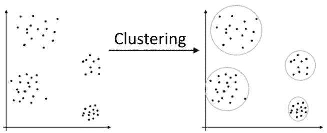

# 第八章：无监督机器学习

在前两章中，你已经了解了监督学习类的机器学习算法、它们的实际应用，以及如何使用 Spark MLlib 在大规模环境中实现它们。在本章中，你将接触到无监督学习类别的机器学习，学习有关参数化和非参数化的无监督算法。为了帮助你理解 **无监督学习** 在解决实际问题中的应用，我们将介绍一些 **聚类** 和 **关联** 算法的实际应用。你将获得使用无监督机器学习进行聚类和关联问题的基本知识和理解。我们还将讨论在 Spark ML 中实现一些聚类算法的细节，如 **K-means 聚类**、**层次聚类**、**潜在狄利克雷分配**，以及一种叫做 **交替最小二乘法** 的关联算法。

在本章中，我们将讨论以下主要内容：

+   无监督学习简介

+   使用机器学习进行聚类

+   使用机器学习建立关联

+   无监督学习的实际应用

到本章结束时，你应该已经获得了足够的知识和实践经验，了解聚类和关联类型的无监督机器学习算法、它们的实际应用，并能够使用 Spark MLlib 在大规模环境中实现这些类型的算法。

# 技术要求

在本章中，我们将使用 Databricks 社区版来运行我们的代码（[`community.cloud.databricks.com`](https://community.cloud.databricks.com)）。

+   注册说明可以在[`databricks.com/try-databricks`](https://databricks.com/try-databricks)找到。

+   本章的代码可以从[`github.com/PacktPublishing/Essential-PySpark-for-Data-Analytics/tree/main/Chapter08`](https://github.com/PacktPublishing/Essential-PySpark-for-Data-Analytics/tree/main/Chapter08)下载。

+   本章的 datasets 可以在[`github.com/PacktPublishing/Essential-PySpark-for-Data-Analytics/tree/main/data`](https://github.com/PacktPublishing/Essential-PySpark-for-Data-Analytics/tree/main/data)找到。

# 无监督机器学习简介

无监督学习是一种机器学习技术，在这种技术中，学习算法在训练数据中没有已知标签值的指导。无监督学习在根据数据中固有的模式、相似性或差异将未知数据点分组时非常有用，而无需任何先验数据知识。

在监督学习中，模型是在已知数据上进行训练的，然后使用新数据（未见过的数据）从模型中推断结论。另一方面，在无监督学习中，模型训练过程本身就是最终目标，在模型训练过程中会发现隐藏在训练数据中的模式。与监督学习相比，无监督学习更难，因为在没有任何外部评估的情况下，很难确定无监督学习算法的结果是否有意义，特别是当无法访问任何正确标记的数据时。

无监督学习的一个优势是，它有助于解释非常大的数据集，在这些数据集上标注现有数据并不现实。无监督学习还可用于预测数据集中类别的数量，或在应用监督学习算法之前对数据进行分组和聚类。它在解决分类问题时也非常有用，因为无监督学习可以很好地处理未标记的数据，且无需任何人工干预。无监督学习可以分为两种主要的学习技术，分别是聚类和关联。接下来的部分将介绍这两种方法。

# 使用机器学习进行聚类

在机器学习中，聚类是指在不需要任何外部指导的情况下识别未分类数据中的模式或结构。聚类算法会解析给定的数据，以识别数据集中具有匹配模式的簇或数据组。聚类算法的结果是数据簇，这些簇可以定义为在某种方式上相似的对象集合。下图展示了聚类是如何工作的：



图 8.1 – 聚类

在前面的图示中，一个未分类的数据集通过聚类算法进行处理，结果是根据数据点与另一个数据点在二维欧几里得空间中的接近程度，将数据分类成较小的簇或数据组。

因此，聚类算法基于二维平面上数据之间的欧几里得距离进行数据分组。聚类算法会考虑训练数据集中数据点之间的欧几里得距离，在同一簇内，数据点之间的距离应当较小，而簇外，数据点之间的距离应当较大。接下来的部分将介绍 Spark MLlib 中几种可用的聚类技术。

## K-means 聚类

**K-means** 是最流行的聚类算法，也是最简单的无监督学习算法之一。K-means 聚类算法在给定数据集上以迭代的方式工作，将其分为 *k* 组。*k* 的值越大，聚类的大小越小，反之亦然。因此，使用 K-means，用户可以控制在给定数据集内识别的聚类数量。

在 K-means 聚类中，每个簇都是通过为每个簇创建一个中心来定义的。这些质心尽可能远离彼此。然后，K-means 将每个数据点与给定数据集中的最近质心进行关联，从而形成第一个簇。K-means 随后会迭代地重新计算质心在数据集中的位置，使其尽可能接近已识别簇的中心。当质心不再需要移动时，过程停止。

以下代码块演示了如何使用 Spark MLlib 实现 K-means 聚类：

```py
from pyspark.ml.clustering import KMeans
from pyspark.ml.evaluation import ClusteringEvaluator
retail_features = spark.read.table("retail_features")
train_df = retail_features.selectExpr("selected_features as features")
kmeans = KMeans(k=3, featuresCol='features')
kmeans_model = kmeans.fit(train_df)
predictions = kmeans_model.transform(train_df)
evaluator = ClusteringEvaluator()
silhouette = evaluator.evaluate(predictions)
print("Silhouette measure using squared Euclidean distance = " + str(silhouette))
cluster_centers = kmeans_model.clusterCenters()
print(cluster_centers)
```

在前面的代码片段中，我们进行了以下操作：

1.  首先，我们使用 `import` 导入了与聚类和聚类评估相关的适当 MLlib 包。

1.  然后，我们将之前在特征工程过程中获得的现有特征向量导入到 Spark DataFrame 中，并以 Delta 格式将其存储在数据湖中。

1.  接下来，我们初始化了一个新的 `KMeans` 对象，通过传入所需的聚类数和特征向量的列名来进行设置。

1.  我们在训练 DataFrame 上调用了 `fit()` 方法，启动了学习过程。结果生成了一个模型对象。

1.  通过调用模型对象的 `transform()` 方法，生成了原始训练数据集上的预测结果。

1.  接下来，我们调用了 Spark MLlib 的 `ClusteringEvaluator()` 辅助函数，该函数用于评估聚类算法，并将其应用于我们在前一步生成的预测 DataFrame。这会得到一个被称为 `silhouette` 的值，它是衡量聚类一致性的指标，计算方式基于数据点之间的欧氏距离度量。`silhouette` 值越接近 `1`，表示簇内的数据点越聚集，簇外的数据点则相距较远。`silhouette` 值越接近 `1`，表示学习到的模型性能越好。

1.  最后，我们打印了每个分类簇的质心。

这样，只需几行代码，就可以通过 Spark 实现的 K-means 聚类算法轻松地将未分类数据进行聚类。

## 使用二分 K-means 的层次聚类

**层次聚类**是一种聚类技术，其中所有数据点从一个单一的聚类开始。然后它们通过递归地向下分割到更小的聚类中，从而构成一个层次结构。Spark ML 通过二分 K 均值算法实现这种分裂式的层次聚类。以下示例说明了如何使用 Spark MLlib 实现二分 K 均值聚类：

```py
from pyspark.ml.clustering import BisectingKMeans
from pyspark.ml.evaluation import ClusteringEvaluator
retail_features = spark.read.table("retail_features")
train_df = retail_features.selectExpr("selected_features as features")
bkmeans = BisectingKMeans(k=3, featuresCol='features')
bkmeans_model = kmeans.fit(train_df)
predictions = bkmeans_model.transform(train_df)
evaluator = ClusteringEvaluator()
silhouette = evaluator.evaluate(predictions)
print("Silhouette measure using squared euclidean distance = " + str(silhouette))
cluster_centers = kmeans_model.clusterCenters()
print(cluster_centers)
```

在之前的代码片段中，我们执行了以下操作：

1.  首先，我们通过传入所需聚类的数量和特征列的列名来初始化一个新的`BisectingKMeans`对象。

1.  我们在训练数据集上调用了`fit()`方法以开始学习过程。作为结果，生成了一个模型对象。

1.  接下来，我们通过在模型对象上调用`transform()`方法，对原始训练数据集生成了预测结果。

1.  然后，我们调用了 Spark MLlib 的`ClusteringEvaluator()`辅助函数，该函数对于评估聚类算法非常有用，并将其应用于我们在前一步生成的预测数据框。这将得到`silhouette`值，它是衡量聚类内一致性的指标，基于数据点之间的欧几里得距离计算。

1.  最后，我们打印了每个聚类的中心点。

现在我们已经学习了一种聚类技术，让我们在下一节中了解另一种学习技术。

## 使用潜在狄利克雷分配进行主题建模

**主题建模**是一种学习技术，通过它你可以对文档进行分类。主题建模与主题分类不同，因为主题分类是一种有监督学习技术，其中学习模型尝试根据一些先前标注的数据对未见过的文档进行分类。而主题建模则像聚类算法对数值数据进行分组一样，在没有任何外部指导的情况下对包含文本或自然语言的文档进行分类。因此，主题建模是一个无监督学习问题。

**潜在狄利克雷分配**（**LDA**）是一种流行的主题建模技术。LDA 的目标是根据文档中发现的关键词将给定文档与特定主题关联起来。在这里，主题是未知的，隐藏在文档中，这就是 LDA 中的潜在部分。LDA 的工作方式是，假设文档中的每个单词都属于一个不同的主题，并为每个单词分配一个概率值。一旦估算出每个单词属于特定主题的概率，LDA 就会通过设置阈值并选择所有符合或超过该阈值的单词来挑选属于某个主题的所有单词。LDA 还认为每个文档只是一个词袋，并不重视单个单词在语法中的角色。此外，像文章、连词和感叹词等停用词需要在应用 LDA 之前被去除，因为这些词并不携带任何主题信息。

以下代码示例说明了如何使用 Spark MLlib 实现 LDA：

```py
from pyspark.ml.clustering import LDA
train_df = spark.read.table("retail_features").selectExpr("selected_features as features")
lda = LDA(k=3, maxIter=1)
lda_model = lda.fit(train_df)
topics = lda_model.describeTopics(3)
topics.show()
transformed = lda_model.transform(dataset)
transformed.show()
```

在前面的代码片段中，我们做了以下操作：

1.  首先，我们导入了与 LDA 相关的适当 MLlib 包。

1.  接下来，我们将特征工程过程中生成的现有特征向量导入到 Spark DataFrame 中，并以 Delta 格式将其存储在数据湖中。

1.  之后，我们通过传入聚类的数量和最大迭代次数来初始化一个新的`LDA`对象。

1.  接下来，我们在训练 DataFrame 上调用了`fit()`方法，开始了学习过程。最终生成了一个模型对象。

1.  使用 LDA 算法建模的主题可以通过在模型对象上使用`describeTopics()`方法来显示。

正如我们所见，通过使用 Apache Spark 实现的 LDA 算法，主题建模可以在大规模上实现。

## 高斯混合模型

K-means 聚类的一个缺点是它会将每个数据点与一个特定的聚类关联起来。这样，就无法获得数据点属于某一特定聚类的概率。**高斯混合模型**（**GSM**）尝试解决 K-means 聚类的硬聚类问题。

GSM 是一个概率模型，用于表示数据点总体样本中的一个子集。GSM 表示多个高斯分布的数据点的混合，其中数据点从其中一个*K*高斯分布中抽取，并具有属于这些分布之一的概率得分。

以下代码示例描述了使用 Spark ML 实现 GSM 的实现细节：

```py
from pyspark.ml.clustering import GaussianMixture
train_df = spark.read.table("retail_features").selectExpr("selected_features as features")
gmm = GaussianMixture(k=3, featuresCol='features')
gmm_model = gmm.fit(train_df)
gmm_model.gaussiansDF.display()
```

在前面的代码块中，我们在从`pyspark.ml.clustering`包中导入适当的库后，初始化了一个新的`GaussianMixture`对象。然后，我们传入了一些超参数，包括聚类的数量和包含特征向量的列的名称。接着，我们使用`fit()`方法训练了模型，并通过模型的`gaussianDF`属性显示了训练后的结果。

到目前为止，您已经看到了不同类型的聚类和主题建模技术及其在使用 Spark MLlib 时的实现。在接下来的部分中，您将了解另一种叫做**关联规则**的无监督学习算法。

# 使用机器学习构建关联规则

`if-then-else`语句有助于展示实体之间关系的概率。关联规则技术广泛应用于推荐系统、市场篮子分析和亲和力分析等问题。

## 使用交替最小二乘法进行协同过滤

在机器学习中，**协同过滤**更常用于 **推荐系统**。推荐系统是一种通过考虑用户偏好来过滤信息的技术。根据用户的偏好并考虑他们的过去行为，推荐系统可以预测用户可能喜欢的项。协同过滤通过利用历史用户行为数据和他们的偏好，构建用户-项关联矩阵来执行信息过滤。Spark ML 使用 **交替最小二乘法** 算法实现协同过滤技术。

以下代码示例演示了 Spark MLlib 中交替最小二乘算法的实现：

```py
from pyspark.ml.evaluation import RegressionEvaluator
from pyspark.ml.recommendation import ALS
from pyspark.sql import Row
ratings_df = (spark.read.table("retail_features").selectExpr(
    "CAST(invoice_num AS INT) as user_id",
    "CAST(stock_code AS INT) as item_id",
    "CAST(quantity AS INT) as rating")
    .where("user_id is NOT NULL AND item_id is NOT NULL"))
df.display()
(train_df, test_df) = ratings_df.randomSplit([0.7, 0.3])
als = ALS(maxIter=3, regParam=0.03, userCol="user_id", 
          itemCol="item_id", ratingCol="rating", 
          coldStartStrategy="drop")
als_model = als.fit(train_df)
predictions = model.transform(test_df)
evaluator = RegressionEvaluator(metricName="rmse", 
                                labelCol="rating", 
                                predictionCol="prediction")
rmse = evaluator.evaluate(predictions)
print("Root-mean-square error = " + str(rmse))
user_recs = als_model.recommendForAllUsers(5)
user_recs.show()
item_recs = als_model.recommendForAllItems(5)
item_recs.show()
```

在前面的代码块中，我们做了以下操作：

1.  首先，我们使用存储在 Delta Lake 中的特征数据集生成了一个 Spark DataFrame 作为评分数据集。ALS 算法所需的几个列，如 `user_id`、`item_id` 和 `ratings`，并未采用所需的整数格式。因此，我们使用了 `CAST` Spark SQL 方法将其转换为所需的数据格式。

1.  接下来，我们使用所需的参数初始化了一个 ALS 对象，并通过 `randomSplit()` 方法将训练数据集随机分成了两部分。

1.  然后，我们通过在训练数据集上调用 `fit()` 方法启动了学习过程。

1.  接下来，我们使用 Spark MLlib 提供的评估器评估了准确度指标的 `RMSE`。

1.  最后，我们通过内置的 `recommendForAllUsers()` 和 `recommendForAllItems()` 方法分别收集了每个用户的前 5 个推荐项和每个项的前 5 个用户推荐。

通过这种方式，你可以利用交替最小二乘法构建推荐系统，用于诸如 **视频点播** 平台的电影推荐、产品推荐或电子商务应用中的 **市场篮分析** 等用例。Spark MLlib 使你能够只用几行代码就实现这一规模。

除了聚类和关联规则外，Spark MLlib 还允许你实现 **降维** 算法，如 **奇异值分解**（**SVD**）和 **主成分分析**（**PCA**）。降维是减少考虑的随机变量数量的过程。尽管它是一种无监督学习方法，但降维在特征提取和选择中非常有用。关于这一主题的详细讨论超出了本书的范围，Spark MLlib 仅为 RDD API 提供了降维算法的实现。有关降维的更多详细信息，可以在 Apache Spark 的公共文档中找到，网址为 [`spark.apache.org/docs/latest/mllib-dimensionality-reduction.html`](https://spark.apache.org/docs/latest/mllib-dimensionality-reduction.html)。

在下一节中，我们将深入探讨一些当前各大企业正在使用的无监督学习算法的实际应用。

# 无监督学习的实际应用

无监督学习算法如今正被用来解决一些现实世界中的商业挑战。在本节中，我们将探讨几个这样的挑战。

## 聚类应用

本节介绍了一些聚类算法在实际商业中的应用。

### 客户细分

零售营销团队以及面向消费者的企业组织，始终致力于优化其营销支出。尤其是营销团队，他们关注一个特定的指标——**每次获取成本**（**CPA**）。CPA 表示组织需要花费多少才能获得一个客户，最优的 CPA 意味着更好的营销投资回报。优化 CPA 的最佳方式是通过客户细分，因为这能提高营销活动的效果。传统的客户细分会考虑标准的客户特征，如人口统计、地理位置和社会信息，以及历史交易数据，从而定义标准的客户群体。然而，传统的客户细分方法费时费力，且容易出错。与此同时，可以利用机器学习算法发现数据源之间隐藏的模式和关联。近年来，客户接触点的数量大幅增加，手动识别所有这些接触点之间的模式变得不实际且不直观。然而，机器学习算法能够轻松地分析数百万条记录，提取出营销团队可以迅速利用的见解，从而满足客户的需求，在客户需要的时候、他们想要的地方。因此，通过利用聚类算法，营销人员可以通过更加精准的客户细分，提高营销活动的有效性。

### 零售产品组合优化

拥有实体店面的零售商面临有限的店铺空间。因此，他们需要确保通过放置那些最有可能销售的产品来实现店铺空间的最佳利用。一个经典的商品组合优化案例是美国中西部地区的一个五金零售商，在寒冷的冬季进货草坪割草机，当时雪季几乎在整个冬季都会持续。在这个例子中，店铺空间没有得到最佳利用，因为草坪割草机在雪季几乎没有销售机会。更好的选择应该是空间加热器、雪铲或其他冬季用品。为了解决这个问题，零售商通常会雇佣分析师，结合历史交易数据、季节性变化和当前趋势，提出适合季节和商店位置的商品组合推荐。然而，如果我们把这个问题规模扩大到一个拥有成千上万仓库和数万个零售店的大型零售商呢？在这种规模下，手动规划商品的最佳组合变得不切实际且非常耗时，极大地降低了实现价值的速度。商品组合优化可以看作一个聚类问题，聚类算法可以应用于帮助规划如何对这些群体进行排序。在这里，必须考虑更多的数据点，包括历史消费者购买模式、季节性变化、社交媒体上的趋势、搜索引擎的搜索模式等。这不仅有助于更好的商品组合优化，还能提高收入，减少产品浪费，并加快企业的市场响应速度。

### 客户流失分析

由于客户偏好的不断变化和市场竞争的激烈，企业越来越难以获取新客户。因此，企业需要留住现有客户。**客户流失率**是企业高层希望最小化的一个重要指标。机器学习分类算法可以用于预测某个客户是否会流失。然而，了解影响流失的因素会很有帮助，这样企业可以调整或改进运营以提高客户满意度。聚类算法不仅可以用来识别哪些客户群体可能会流失，还可以通过识别影响流失的一组因素来进一步分析。企业可以根据这些流失因素采取行动，引入新产品或改进产品以提高客户满意度，进而减少客户流失。

### 保险欺诈检测

保险公司传统上使用人工检查以及规则引擎来标记保险索赔是否为欺诈。然而，随着数据量的增加，传统方法可能会错过相当大一部分的索赔，因为人工检查既费时又容易出错，且欺诈者不断创新并策划新的欺诈方式。机器学习的聚类算法可以用来将新的索赔与现有的欺诈群体进行分组，而分类算法可以用来判断这些索赔是否为欺诈。通过利用机器学习和聚类算法，保险公司可以不断地检测和防止保险欺诈。

## 关联规则和协同过滤应用

关联规则和协同过滤是用于构建推荐系统的技术。本节将探讨推荐系统的一些实际应用案例，以便于实际商业应用。

### 推荐系统

推荐系统被电子零售商用来进行市场购物篮分析，在该分析中，系统根据用户的偏好以及购物车中已存在的商品向用户推荐产品。推荐系统还可以用于基于位置或临近度的推荐，例如，当客户靠近特定商店时，系统可以显示广告或优惠券。推荐系统还广泛应用于营销领域，营销人员可以通过推荐系统获取有关可能购买某商品的用户的信息，从而提高营销活动的效果。

推荐系统在在线音乐和视频服务提供商中也得到了广泛应用，用于用户内容个性化。在这里，推荐系统根据用户的偏好和历史使用模式，向用户推荐新的音乐或视频。

# 总结

本章介绍了无监督学习算法，以及如何对未标记的数据进行分类并识别数据实体之间的关联。介绍了无监督学习算法的两个主要领域，即聚类和关联规则。你了解了最流行的聚类算法和协同过滤算法，并通过 Spark MLlib 中的代码示例展示了 K-means、二分 K-means、LDA 和 GSM 等聚类算法的工作原理。你还看到了使用 Spark MLlib 中替代最小二乘法算法构建推荐引擎的代码示例。最后，展示了一些无监督学习算法在现实商业中的应用。我们探讨了关于无监督学习算法的若干概念、技术和代码示例，以便你能够使用 Spark MLlib 在大规模上训练模型。

到目前为止，在本章和前一章中，你只探讨了机器学习过程中的数据清洗、特征工程和模型训练部分。在下一章中，你将接触到机器学习生命周期管理，在这里你将探索一些概念，如模型性能调优、跟踪机器学习实验、将机器学习模型存储在中央仓库中，以及在将它们投入生产应用之前进行机器学习模型的运营化。最后，还将介绍并探索一个开源的端到端机器学习生命周期管理工具——MLflow。
