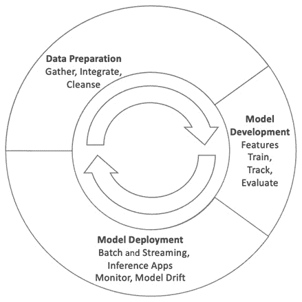
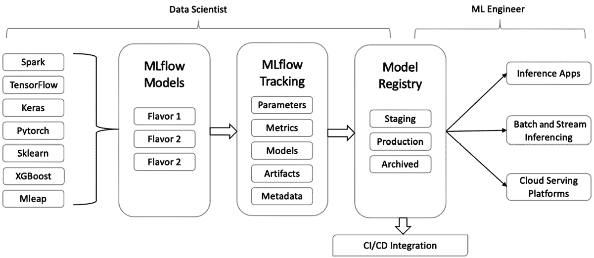
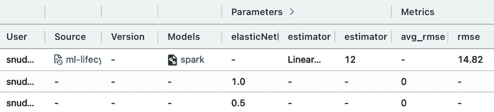
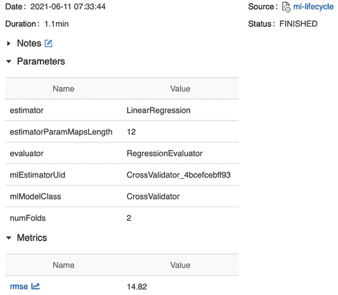
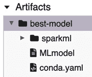

# 第九章：机器学习生命周期管理

在前面的章节中，我们探讨了使用**Apache Spark**进行**可扩展机器学习**的基础知识。介绍了处理**监督学习**和**无监督学习**的算法，并展示了如何使用**Apache Spark MLlib**实现这些算法。在现实世界中，仅训练一个模型是不够的。相反，必须通过调整模型参数，使用相同的数据集构建多个版本的同一模型，以获得最佳的模型。此外，同一个模型可能并不适用于所有应用，因此需要训练多个模型。因此，有必要跟踪各种实验、它们的参数、指标以及它们训练所用的数据版本。而且，模型通常会出现漂移，意味着它们的预测能力会因为环境变化而降低，因此需要进行监控并在必要时重新训练。

本章将介绍实验跟踪、模型调优、模型生产化以及使用离线和在线技术进行模型推理的概念。本章将通过一个端到端的开源机器学习生命周期管理工具**MLflow**来展示这些概念。最后，我们将探讨机器学习的持续部署概念，以自动化整个**机器学习**（**ML**）生命周期管理过程。

本章我们将覆盖以下主要内容：

+   机器学习生命周期简介

+   使用**MLflow**跟踪实验

+   使用**MLflow 模型注册表**跟踪模型版本

+   模型服务和推理

+   机器学习的持续部署

# 技术要求

本章我们将使用 Databricks Community Edition 来运行代码（[`community.cloud.databricks.com`](https://community.cloud.databricks.com)）。

+   注册说明可以在[`databricks.com/try-databricks`](https://databricks.com/try-databricks)找到。

+   本章的代码可以从[`github.com/PacktPublishing/Essential-PySpark-for-Data-Analytics/tree/main/Chapter09`](https://github.com/PacktPublishing/Essential-PySpark-for-Data-Analytics/tree/main/Chapter09)下载，而本章的数据集可以在[`github.com/PacktPublishing/Essential-PySpark-for-Data-Analytics/tree/main/data`](https://github.com/PacktPublishing/Essential-PySpark-for-Data-Analytics/tree/main/data)找到。

我们还将使用 Databricks Community Edition 提供的托管版 MLflow。安装独立版 MLflow 的说明可以在这里找到：[`mlflow.org/docs/latest/quickstart.html`](https://mlflow.org/docs/latest/quickstart.html)。

# 机器学习生命周期简介

**机器学习生命周期**是数据科学项目所遵循的一个持续过程。它包含四个主要阶段，分别是数据收集与准备、模型训练、模型评估，最后是模型推理和监控。机器学习过程是一个持续的过程，生命周期在优化数据和不断提高模型性能之间反复迭代；或者说，防止模型性能随着时间的推移而下降：



图 9.1 – 机器学习生命周期

前面的图表展示了机器学习生命周期管理的持续过程，从数据准备到模型开发，然后从训练到模型部署和监控。当模型性能因训练数据的变化、模型代码的变化或模型参数的变化而下降时，循环过程将重新开始。

前几章介绍了数据收集与准备、清洗和整合的过程，以及在大规模上训练各种机器学习模型的技术。本章将介绍机器学习生命周期的其余阶段，包括模型评估、模型推理和监控。

机器学习生命周期管理的这一循环过程帮助你不断优化数据集和模型，并保持模型的性能。你在机器学习生命周期中的迭代速度决定了你将模型投入实际应用的速度，从而决定了你的数据科学项目对企业的价值以及与数据科学项目相关的成本。因此，使用机器学习生命周期管理工具来简化整个机器学习过程、从数据科学项目中获取最大价值，并确保业务用户能够从中获得实际收益是至关重要的。目前存在多种机器学习生命周期管理工具可以处理这一任务。*Pacyderm*、*Kubeflow*、*MLflow*和*Metaflow*是一些开源工具，而*AWS Sagemaker*、*Google Cloud AutoML*和*Microsoft Azure ML*都是具有完整机器学习生命周期管理支持的云原生服务。本章将探索*MLflow*作为机器学习生命周期管理工具，接下来的章节将更详细地探讨*MLflow*。

## MLflow 介绍

在传统软件开发中，生命周期代码是按照给定的功能规格编写的。然而，在机器学习中，目标是优化特定的指标，直到达到所需的准确度。优化某一特定指标的过程不是一次性的，而是一个持续的实验和改进过程。此外，在机器学习中，结果的质量不仅仅依赖于代码的质量，还与其他参数有关，比如用于机器学习训练过程的数据以及提供给训练算法的参数。传统机器学习使用的编程堆栈在不同的数据科学家之间差异很大。最后，在一个环境中创建的机器学习模型通常会被部署到不同的环境中，因此确保模型的可移植性和可复现性也非常重要。因此，整个机器学习生命周期是非常迭代的，涉及多个参数、数据集和各种编程库。

MLflow 是一款易于使用、模块化的端到端机器学习生命周期管理开源软件，旨在解决上述机器学习生命周期中的挑战：



图 9.2 – 使用 MLflow 的机器学习生命周期

MLflow 包含以下四个组件，用于解决机器学习生命周期中的挑战，如实验跟踪管理、实验可复现性、模型库和模型部署：

+   MLflow 跟踪

+   MLflow 项目

+   MLflow 模型

+   模型注册表

下面的章节将进一步探讨这些组件。你将学习这些组件如何帮助解决机器学习生命周期管理中的挑战，并查看一些代码示例。

# 使用 MLflow 跟踪实验

在现实中，构建单一模型是远远不够的。一个典型的模型构建过程需要多次迭代，有时需要改变模型参数，有时需要调整训练数据集，直到达到理想的模型准确度。有时，适合某个特定用例的模型在另一个场景中可能并不适用。这意味着一个典型的数据科学过程涉及对多个模型进行实验，以解决单一的业务问题，并记录所有数据集、模型参数和模型指标，以供未来参考。传统上，实验跟踪是通过使用简单的工具，如电子表格来完成的，但这会拖慢生产速度，而且是一个繁琐的过程，容易出错。

MLflow 跟踪组件通过其 API 和 UI 来解决这个问题，用于记录机器学习实验，包括模型参数、模型代码、指标、模型训练过程的输出，以及与实验相关的任何任意文档。让我们学习如何安装 MLflow 并使用跟踪服务器跟踪实验：

```py
%pip install mlflow
```

上述命令将在你的 Databricks 笔记本中安装 MLflow 并重启 Python 会话。

注意

前一个命令只会在您的本地 Python 会话中安装 MLflow 客户端库。我们将使用 Databricks 社区版提供的托管 MLflow 作为跟踪服务器组件。有关在 Databricks 之外配置和运行 MLflow Tracking 服务器的说明可以在这里找到：[`mlflow.org/docs/latest/tracking.html#how-runs-and-artifacts-are-recorded`](https://mlflow.org/docs/latest/tracking.html#how-runs-and-artifacts-are-recorded)。

在以下代码示例中，我们正在构建一个简单的回归模型，该模型在之前的章节中使用过，并使用 MLflow Tracking 来跟踪实验：

```py
import mlflow
import mlflow.spark
from pyspark.ml.evaluation import RegressionEvaluator
from pyspark.ml.regression import LinearRegression
from pyspark.ml.tuning import ParamGridBuilder, CrossValidator
```

在之前的代码示例中，我们执行了以下操作：

+   首先，我们导入相关的库。在这里，我们导入了各种 MLflow 客户端库，还通过`mlflow.spark`导入了特定于 Spark 的 MLflow 组件。

+   在这个代码示例中，我们使用`pyspark.ml`库构建了多个回归模型来执行这些操作以衡量我们模型的准确性。

现在，我们需要初始化 MLflow Tracking，以便开始跟踪我们的实验，如下面的代码块所示：

```py
mlflow.set_tracking_uri("databricks")
retail_features = spark.read.table("retail_features")
retail_df = retail_features.selectExpr("cust_age as label", "selected_features as features")
train_df, test_df = retail_df.randomSplit([0.9, 0.1])
```

现在，我们必须初始化训练数据集，如下面的代码块所示：

+   首先，从我们在之前章节中创建的特征 Delta 表中创建一个`retail_features` DataFrame。我们必须从包含我们从丰富的零售交易数据中提取的所有特征的 DataFrame 中选择用于模型训练的标签和特征列。

+   现在，我们必须使用`randomSplit()`函数将包含标签和特征列的 DataFrame 随机拆分为两个单独的 DataFrame。训练 DataFrame 用于模型训练目的，而测试 DataFrame 则保留用于在训练模型后检查模型准确性。

在这一点上，我们可以开始实验过程，如下面的代码块所示：

```py
evaluator = RegressionEvaluator(labelCol="label", 
                                metricName="rmse")
mlflow.set_tracking_uri("databricks")
mlflow.set_experiment("/Users/snudurupati@outlook.com/linregexp")
experiment = mlflow.get_experiment_by_name("/Users/snudurupati@outlook.com/linregexp")
```

在前面的代码块中，我们设置了我们的初始算法参数和 MLflow Tracking 服务器参数：

+   我们实例化了`RegressionEvaluator`对象，该对象传递标签列并使用 RMSE 作为准确性指标。这在交叉验证过程中计算标签列上的`rmse`时非常有用。

+   现在我们准备开始我们的实验，通过使用`mlflow.set_tracking_uri("databricks")`函数为 MLflow Tracking 服务器配置我们的实验。

+   MLflow Tracking 服务器可以跟踪来自多个用户、多个会话的多个实验。因此，您必须为您的实验提供一个唯一的名称，我们可以使用`mlflow.set_experiment("/Users/user_name/exp_name")`来实现。指定给实验名称的路径需要是一种持久存储形式，比如本地磁盘或数据湖位置。在这种情况下，我们使用了**Databricks 文件系统**（**DBFS**）。

在之前的代码块中，我们将 URI 指定为`databricks`，因为我们打算使用 Databricks 社区版自带的 MLflow Tracking 服务器。如果你在本地运行 MLflow，可以将 URI 指定为`./mlruns`，或者如果你自己设置了远程跟踪服务器，可以提供远程服务器的 URI。如何设置自己的跟踪服务器的说明请参见[`mlflow.org/docs/latest/tracking.html#mlflow-tracking-servers`](https://mlflow.org/docs/latest/tracking.html#mlflow-tracking-servers)：

```py
lr = LinearRegression(maxIter=10)
paramGrid = (ParamGridBuilder()
    .addGrid(lr.regParam, [0.1, 0.01]) 
    .addGrid(lr.fitIntercept, [False, True])
    .addGrid(lr.elasticNetParam, [0.0, 0.5, 1.0])
    .build())
csv = CrossValidator(estimator=lr,
                          estimatorParamMaps=param_grid,
                          evaluator=RegressionEvaluator(),
                          numFolds=2)
```

现在我们已经初始化了所有实验所需的对象，并通过 MLflow 配置了实验跟踪，我们可以开始训练过程：

+   首先，我们必须实例化`LinearRegression`模型对象，并将`maxIter`参数设置为`10`。

+   然后，我们必须为交叉验证过程设置参数网格，并为模型参数指定一系列值。

+   最后，我们必须通过初始化`CrossValidator`对象来配置训练-验证拆分过程。我们可以通过将实际模型对象、参数网格对象和评估对象作为参数传递来完成此操作。

关于`CrossValidator`对象如何工作的更多细节将在接下来的章节中提供。现在，我们准备好开始模型训练实验过程，如下方代码块所示：

```py
with mlflow.start_run() as run_id:
  lr_model = csv.fit(train_df)
  test_metric = evaluator.evaluate(lr_model.transform(test_df))
  mlflow.log_metric(evaluator.getMetricName(), 
                    test_metric) 
  mlflow.spark.log_model(spark_model=lr_model.bestModel, 
                         artifact_path='best-model') 
```

在之前的代码示例中，我们调用了 MLflow Tracking 服务器以开始跟踪我们的实验：

+   由于我们使用的是交叉验证技术，并且已经定义了一个带有值范围的参数网格，`fit()`过程将构建多个模型，而不是单一模型，并根据指定的准确度指标记录最佳模型。由于我们希望记录在此过程中构建的所有模型，因此我们必须使用`mlflow.start_run()`方法调用 MLflow Tracking 服务。

+   在交叉验证过程中生成的度量值将使用`mlflow.log_metric()`函数记录到 MLflow Tracking 服务器。在 Databricks 管理的 MLflow 环境中，使用`CrossValidator`时，模型参数会自动记录。然而，也可以使用`mlflow.log_parameter()`函数显式记录模型参数，并且任何任意的工件，如图表或图像，可以使用`mlflow.log_artifact()`函数记录。

+   `CrossValidator`会遍历多个模型，并根据指定的准确度指标生成最佳模型。在此过程中生成的最佳模型作为`bestModel`对象可用。可以使用`mlflow.spark.log_model(spark_model=lr_model.bestModel, artifact_path='best-model')`命令记录该模型。这里，`artifact_path`表示模型在 MLflow Tracking 服务器中存储的路径。

以下截图显示了我们刚刚执行的 ML 实验的 MLflow Tracking 界面：



图 9.3 – MLflow 模型跟踪界面

在前面的截图中，我们可以看到，MLflow 记录了我们在 **交叉验证** 过程中为每个模型构建的准确度指标和模型参数，作为一个单独的实验。然而，只有所有运行中表现最好的模型被记录下来。可以通过点击其中一项运行来访问单个运行的详细信息，如以下截图所示：



图 9.4 – 从 MLflow Tracking UI 运行的各个模型

在前面的截图中，所有的模型参数和指标都已记录在 MLflow Tracking UI 中，并附带其他元数据，如模型的运行日期和时间、用户名、此特定模型运行的源代码版本、模型运行的持续时间以及模型的状态。只要数据的相同版本可用，这些信息在未来重现实验或在不同环境中重现相同实验时非常有用。

提示

如果数据存储在 Delta 表中，可以使用 MLflow Tracking 跟踪实验中使用的数据版本，因为 Delta 提供了内置的数据版本控制。可以通过将 Delta 表的版本作为任意工件记录到 MLflow 来实现这一点。

`mlflow.` 命令在前面的代码片段中指定了我们使用的是 MLflow 模型的 Spark 版本。MLflow 支持其他类型的模型，如以下章节所述。

### MLflow 模型

MLflow 模型是一种通用的、可移植的模型格式，支持多种模型类型，从简单的 Python pickle 对象到 scikit-learn、TensorFlow、PyTorch、MLeap 和其他模型格式，包括 Parquet 格式的 Spark 模型。MLflow 模型提供了可以使用各种常见机器学习工具生成的抽象模型，并可部署到各种机器学习环境中。MLflow 模型以 MLflow 格式提供来自流行机器学习框架的模型。MLflow 模型具有标准的目录结构，其中包含配置文件和序列化的模型工件。它还包含所有模型评估依赖项，以 `conda` 环境的形式通过 `conda.yaml` 文件提供模型的可移植性和可重现性。



图 9.5 – MLflow 模型

上面的截图展示了一个典型的 MLflow 模型结构。这个标准模型格式创建了一个可以被任何下游工具理解的模型风味。模型风味用于部署目的，帮助我们理解来自任何机器学习库的模型，而无需将每个工具与每个库集成。MLflow 支持许多它内建的部署工具支持的主要模型风味，例如描述如何将模型作为 Python 函数运行的简单 Python 函数风味。例如，在前面的代码示例中，我们将模型存储为一个 Spark 模型，然后可以将其加载为 **Spark** 对象，或者作为一个简单的 Python 函数，在任何 Python 应用程序中使用，即使这些应用程序根本不理解 Spark。

## ML 模型调优

模型调优是模型构建过程中一个重要的环节，通过编程识别最佳模型参数，以实现最佳模型性能。通过反复调整模型参数来选择模型的过程称为 *超参数调优*。典型的超参数调优过程包括将可用数据分割成多个训练集和测试集。然后，对于每个训练数据集，一个测试对会遍历一组模型参数，称为参数网格，并从所有训练过的模型中选择性能最佳的模型。

Spark ML 提供了一个 `ParamGridBuilder` 工具来帮助构建参数网格，以及 `CrossValidator` 和 `TrainValidationSplit` 类来处理模型选择。`CrossValidator` 通过将数据集分割成一组折叠，将这些折叠作为独立的训练集和测试集对进行模型选择，每个折叠仅使用一次作为测试集。使用 `ParamGridBuilder` 和 `CrossValidator` 进行模型调优和选择的示例已在前一节的代码示例中展示。`TrainValidationSplit` 是另一种流行的超参数调优技术。有关其在 Apache Spark 中的实现细节，可以参阅 Spark 的文档页面 [`spark.apache.org/docs/latest/ml-tuning.html#train-validation-split`](https://spark.apache.org/docs/latest/ml-tuning.html#train-validation-split)。

现在，我们已经学习了如何使用 Apache Spark 进行模型选择调优，以及如何使用 MLflow 跟踪实验，机器学习生命周期管理的下一步是将模型及其版本存储在中央模型仓库中，以便后续使用。在接下来的章节中，我们将使用 **MLflow 模型注册表** 探索这一过程。

# 使用 MLflow 模型注册表跟踪模型版本

虽然 MLflow 跟踪服务器可以让您跟踪所有机器学习实验的属性，MLflow 模型注册中心提供了一个集中式的模型存储库，让您跟踪模型生命周期的各个方面。MLflow 模型注册中心包括一个用户界面和 API，用于跟踪模型的版本、血统、阶段过渡、注释以及任何开发者评论。MLflow 模型注册中心还包含用于 CI/CD 集成的 Webhooks 和用于在线模型服务的模型服务器。

MLflow 模型注册中心为我们提供了一种跟踪和组织在开发、测试和生产过程中由企业生成和使用的众多机器学习模型的方法。模型注册中心通过利用访问控制列表提供了一种安全的共享模型方式，并提供与模型治理和审批工作流集成的方法。模型注册中心还允许我们通过其 API 监控 ML 部署及其性能。

提示

模型注册中心的访问控制和设置已注册模型权限的功能仅在 Databricks 完整版中可用。它们在 Databricks 社区版或开源版本的 MLflow 中不可用。

一旦模型被记录到模型注册中心，您可以通过 UI 或 API 添加、修改、更新、过渡或删除模型，如下列代码示例所示：

```py
import mlflow
from mlflow.tracking.client import MlflowClient
client = MlflowClient()
model_name = "linear-regression-model"
artifact_path = "best_model"
model_uri = "runs:/{run_id}/{artifact_path}".format (run_id=run_id, artifact_path=artifact_path)
registered_model = mlflow.register_model(model_uri=model_uri, name=model_name, )
client.update_model_version(
  name=registered_model.name,
  version=registered_model.version,
  description="This predicts the age of a customer using transaction history."
)
client.transition_model_version_stage(
  name=registered_model.name,
  version=registered_model.version,
  stage='Staging',
)
model_version = client.get_model_version(
  name=registered_model.name,
  version=registered_model.version,
)
model_uri = "models:/{model_name}/staging".format(model_name=model_name)
spark_model = mlflow.spark.load_model(model_uri)
```

在之前的代码片段中，我们执行了以下操作：

1.  首先，我们导入了相关的 MLflow 库和 `MlflowClient`，它是一个通过 Python 访问 MLflow 跟踪服务器和模型注册中心工件的 MLflow 接口。客户端接口通过 `MlflowClient()` 方法调用。

1.  然后，我们通过提供模型、名称、模型工件位置和来自已跟踪实验的 `run_id` 属性来构建 `model_uri`。这些信息可以通过 MLflow 跟踪服务器访问，无论是通过 API 还是 UI。

1.  由于我们已经从跟踪服务器重建了模型 URI，我们通过 `register_model()` 函数将模型注册到模型注册中心。如果该模型尚未存在于模型注册中心，则会注册一个版本为**1**的新模型。

1.  一旦模型注册完成，我们就可以通过 `update_model_version()` 方法添加或更新模型描述。

1.  在模型的生命周期中，它通常会不断演变，并需要过渡其阶段，比如从暂存阶段到生产阶段或归档阶段。可以使用 `transition_model_version_stage()` 方法来实现这一点。

1.  可以使用 `get_model_version()` 方法列出已注册模型的版本和阶段。

1.  最后，我们使用 `load_model()` 方法从模型注册中心加载特定版本/阶段的模型，在构建模型 URI 时使用了 `models` 关键字、模型名称及其版本或阶段名称。

模型注册表还提供了其他实用功能，用于列出和搜索个别已注册模型的不同版本，以及存档和删除已注册的模型。相关方法的参考资料可以在 [`www.mlflow.org/docs/latest/model-registry.html#model-registry-workflows`](https://www.mlflow.org/docs/latest/model-registry.html#model-registry-workflows) 中找到。

重要提示

我们将在本书中使用的 Databricks Community Edition 并不包含模型注册表，因此你需要使用 Databricks 的完整版来执行前面的代码示例。或者，你可以部署自己的 MLflow 远程跟踪服务器，并在 Databricks 环境之外使用数据库支持的后端存储，具体方法可以参见：[`mlflow.org/docs/latest/tracking.html#mlflow-tracking-servers`](https://mlflow.org/docs/latest/tracking.html#mlflow-tracking-servers)。

现在你已经学会了如何使用 MLflow 模型注册表存储、版本管理和检索模型，机器学习生命周期的下一步是将训练、评估和调优后的模型应用到实际业务中，通过它们来进行推理。我们将在下一节中讨论这一内容。

# 模型服务与推理

模型服务与推理是整个机器学习生命周期中最重要的步骤。这是将已构建的模型部署到业务应用程序中的阶段，以便我们能够从中得出推理。模型服务与推理可以通过两种方式进行：在离线模式下使用批处理，或者在在线模式下实时推理。

## 离线模型推理

离线模型推理是指使用批处理生成来自机器学习模型的预测。批处理推理作业按预定时间表定期运行，每次都在一组新的数据上生成预测。这些预测会存储在数据库中或数据湖中，并以离线或异步的方式供业务应用程序使用。批处理推理的一个例子是由营销团队使用的数据驱动客户细分，或者零售商预测客户的生命周期价值。这些用例并不需要实时预测，批处理推理可以满足需求。

对于 Apache Spark，批处理推理可以利用 Spark 的可扩展性，在非常大的数据集上大规模地进行预测，以下代码示例演示了这一点：

```py
model_uri = "runs:/{run_id}/{artifact_path}".format(run_id=active_run.info.run_id, artifact_path="best-model")
spark_udf = mlflow.pyfunc.spark_udf(spark, model_uri)
predictions_df = retail_df.withColumn("predictions", spark_udf(struct("features")))
predictions_df.write.format("delta").save("/tmp/retail_predictions")
```

在之前的代码块中，我们使用模型的名称和跟踪服务器中的工件位置重新创建了模型的 URI。然后，我们使用来自跟踪服务器中 Spark 模型的 MLflow Python 函数模型风格创建了一个 Spark **用户定义函数**（**UDF**）。这个 Spark UDF 可以与 Spark DataFrame 一起使用，以批量方式进行大规模推理。这个代码片段可以作为定时任务定期执行，预测结果可以保存到数据湖中的某个位置。

Apache Spark 框架可以帮助我们实现完整的机器学习生命周期，从模型训练到模型推理，使用一个统一的数据处理框架。Spark 还可以通过 Spark Structured Streaming 将批量推理扩展到接近实时的推理。然而，在超低延迟实时模型服务方面，Apache Spark 并不适用。我们将在下一节进一步探讨这个问题。

## 在线模型推理

在线推理是指在实时生成机器学习预测的过程，可以通过将推理代码嵌入到业务应用程序中，或者使用超低延迟的 API 来实现。与批量推理不同，后者是在大数据集上批量生成的，实时在线推理通常是针对每次一个观察生成的。在线推理可以通过在毫秒到秒之间生成预测，而不是小时到天，帮助机器学习的全新应用。

以一个移动游戏应用为例，假设你想根据玩家的等级或他们所玩的游戏类型向他们展示个性化的促销。在线推理可以迅速从移动应用收集用户行为数据，并在应用内或通过低延迟 API 服务器生成预测推荐。例如，这可以帮助企业为客户实时生成个性化的体验。尽管 Apache Spark 本身不适合在线推理，MLflow 模型注册中心包含一个可以激活的模型服务组件，使用以下命令进行启动：

```py
mlflow models serve -m "models:/ linear-regression-model/Production"
```

在之前的命令中，我们调用了 MLflow 内置的模型服务来为我们之前在模型注册中心注册的模型提供服务。这个模型服务提供了一个 RESTful API，外部应用程序可以通过 HTTP 与模型服务进行通信，发送一个称为负载的单一观察，并一次性接收一个预测结果。

注意

MLflow 的模型服务功能在 Databricks Community Edition 中不可用，因此如果你使用的是该版本，之前的命令将无法执行。此功能可以在开源的 MLflow 或 Databricks 的完整版本中使用。

截至目前，MLflow 的模型服务功能仍处于预览阶段，并且存在一些限制，如目标吞吐量为每秒 20 个查询，以及每次请求的有效载荷大小限制为 16MB。因此，这个选项仅建议用于低吞吐量、非生产环境的应用。不过，MLflow 确实提供与其他模型服务平台的集成，例如**AWS Sagemaker**、**Azure ML**和**Google Cloud AI**。有关这些集成的详细信息，请参阅各自云服务提供商的文档。

# 机器学习的持续交付

与传统软件代码不同，ML 代码是动态的，并且不断受到模型代码本身、底层训练数据或模型参数变化的影响。因此，ML 模型的性能需要持续监控，且模型需要定期重新训练和重新部署，以保持所期望的模型性能水平。这个过程如果手动进行，可能会很费时且容易出错。但**机器学习的持续交付**（**CD4ML**）可以帮助简化并自动化这个过程。

CD4ML 来源于**持续集成**和**持续交付**（**CI/CD**）的 软件工程原则，这些原则旨在推动自动化、质量和纪律，帮助创建一个可靠且可重复的流程，使得软件能够顺利地投入生产。CD4ML 在此基础上对 CI/CD 流程进行了扩展和调整，应用于机器学习（ML）领域，其中数据团队生成与 ML 过程相关的工件，如代码数据和模型，并以安全和小步长的方式逐步推进，这些工件可以在任何时候可靠地重复和发布。

CD4ML 流程包括数据科学家构建模型及其参数、源代码和所需的训练数据。下一步是模型评估和调优。达到可接受的模型精度后，模型需要进行生产化，并对其进行测试。最后一步是部署和监控模型。如果模型需要调整，CD4ML 管道应该触发 ML 过程，从头开始重新进行。这确保了持续交付的实现，并将最新的代码变更和模型推送到生产环境。MLflow 提供了大部分实施此 CD4ML 过程所需的组件，如下所示：

1.  首先，MLflow Tracking 服务器可以帮助你跟踪模型训练过程，包括所有训练工件、数据版本以及已被版本控制并标记为测试或生产使用的模型，通过模型注册表进行管理。

1.  然后，已注册的模型可以用自定义标签进行注释，帮助编码多种信息。这包括指示模型的部署方式，无论是批处理模式还是在线模式，或是模型部署所在的区域。

1.  数据科学家、测试工程师和 ML 工程师可以在模型中添加评论，指定测试失败、模型不准确或生产部署失败的备注，以帮助跨职能团队之间的讨论。

1.  可以通过模型注册中的 Webhook 推送通知，帮助通过外部 CI/CD 工具触发各种操作和自动化测试。例如，模型创建、版本更改、添加新评论等事件都可以触发相应的操作。

1.  最后，MLflow Projects 有助于将整个模型开发工作流打包成一个可重用、可参数化的模块。

通过利用 MLflow 组件，例如 MLflow Tracking 服务器、模型注册、MLflow Projects 及其 Webhook 功能，再结合 Jenkins 等过程自动化服务器，可以编排整个 CD4ML 流水线。

注意

MLflow Model Registry 的 Webhook 功能仅在 Databricks 的完整版中可用，社区版或开源 MLflow 中无法使用。有关 MLflow Projects 及其使用方法的更多信息，请访问：[`www.mlflow.org/docs/latest/projects.html`](https://www.mlflow.org/docs/latest/projects.html)。

通过这种方式，MLflow 通过其模型追踪和模型注册流程，可以帮助简化整个 CD4ML 流程，否则这一过程将非常复杂，涉及许多手动步骤，缺乏可重复性，并且容易导致跨职能团队之间的错误和混乱。

# 总结

本章介绍了端到端的 ML 生命周期及其中涉及的各个步骤。MLflow 是一个完整的端到端 ML 生命周期管理工具。介绍了 MLflow Tracking 组件，它对于流式处理 ML 实验过程非常有用，帮助你追踪所有的属性，包括数据版本、ML 代码、模型参数和指标，以及任何其他任意的工件。介绍了 MLflow Model 作为一种基于标准的模型格式，提供了模型的可移植性和可重复性。还介绍了 MLflow Model Registry，它是一个集中式的模型库，支持新创建的模型的整个生命周期，从暂存到生产再到归档。还介绍了模型服务机制，如使用批处理和在线处理。最后，介绍了 ML 的持续交付，它用于简化整个 ML 生命周期，并通过 Model Registry 功能自动化模型生命周期过程，如模型阶段转换、添加评论和注释的方式，以及通过外部编排工具使用 Webhook 来帮助自动化模型生命周期过程。

到目前为止，你已经掌握了在大规模进行数据工程和数据科学的实用技能。在下一章，我们将重点介绍如何基于标准 Python 扩展单机 ML 库的技术。
