# 第十一章：使用 PySpark 进行数据可视化

到目前为止，从 *第一章**,* **分布式计算基础**，到 *第九章*，*机器学习生命周期管理*，你已经学习了如何获取、整合和清洗数据，以及如何使数据适合用于分析。你还学会了如何使用清洗后的数据，通过数据科学和机器学习来解决实际的业务应用。本章将向你介绍如何利用数据可视化从数据中提取意义的基本知识。

在本章中，我们将涵盖以下主要主题：

+   数据可视化的重要性

+   使用 PySpark 进行数据可视化的技巧

+   PySpark 转换为 pandas 时的注意事项

数据可视化是通过使用图表、图形和地图等视觉元素，将数据图形化呈现的过程。数据可视化帮助你以视觉化的方式理解数据中的模式。在大数据的世界中，面对海量的数据，使用数据可视化来从中提取意义并以简单易懂的方式呈现给业务用户变得尤为重要；这有助于他们做出基于数据的决策。

# 技术要求

在本章中，我们将使用 Databricks Community Edition 来运行代码。

+   Databricks Community Edition 可以通过 [`community.cloud.databricks.com`](https://community.cloud.databricks.com) 访问。

+   注册说明可以在 [`databricks.com/try-databricks`](https://databricks.com/try-databricks) 找到。

+   本章的代码和数据可以从 [`github.com/PacktPublishing/Essential-PySpark-for-Scalable-Data-Analytics/tree/main/Chapter11`](https://github.com/PacktPublishing/Essential-PySpark-for-Scalable-Data-Analytics/tree/main/Chapter11) 下载。

# 数据可视化的重要性

数据可视化是将数据转化为图形、图表或地图等形式的过程。这使得人类大脑更容易理解复杂的信息。通常，数据可视化是商业分析的最后阶段，也是任何数据科学过程的第一步。虽然有些专业人员专门从事数据可视化，但任何数据专业人员都需要能够理解和制作数据可视化。数据可视化帮助以易于理解的方式向业务用户传达隐藏在数据中的复杂模式。每个企业都需要信息以实现最佳性能，而数据可视化通过以视觉方式展示数据集之间的关系，并揭示可操作的见解，帮助企业做出更简单的数据驱动决策。随着大数据的到来，结构化和非结构化数据爆炸性增长，若没有可视化工具的帮助，很难理解这些数据。数据可视化通过揭示关键信息，加速决策过程，帮助业务用户迅速采取行动。数据可视化还帮助讲故事的过程，通过向正确的受众传递正确信息来传达信息。

数据可视化可以是一个简单的图表，代表当前业务状态的某一方面，也可以是一个复杂的销售报告，或是一个展示组织整体表现的仪表盘。数据可视化工具是解锁数据可视化潜力的关键。我们将在接下来的部分探讨不同类型的数据可视化工具。

## 数据可视化工具类型

数据可视化工具为我们提供了一个更简单的方式来创建数据可视化。它们通过提供图形用户界面、数据库连接和有时的数据处理工具，在单一统一的界面中，方便数据分析师和数据科学家创建数据可视化。有不同类型的数据可视化工具，每种工具都有略微不同的用途。在这一部分，我们将深入探讨这些工具。

### 商业智能工具

**商业智能** (**BI**) 工具通常是企业级工具，帮助组织追踪和直观呈现其**关键绩效指标** (**KPIs**)。BI 工具通常包括用于创建复杂逻辑数据模型的功能，并包含数据清洗和集成功能。BI 工具还包括连接到各种数据源的连接器，并内置了拖放功能的数据可视化，帮助业务用户快速创建数据可视化、运营和绩效仪表盘以及计分卡，以追踪某一部门或整个组织的表现。BI 工具的主要用户是参与制定战术和战略决策的业务分析师和高管。

BI 工具传统上使用数据仓库作为数据源，但现代 BI 工具支持 RDMS、NoSQL 数据库和数据湖作为数据源。一些著名的 BI 工具包括 **Tableau**、**Looker**、**Microsoft Power BI**、**SAP Business Objects**、**MicroStrategy**、**IBM Cognos** 和 **Qlikview** 等。BI 工具可以连接到 Apache Spark，并通过 ODBC 连接消费存储在 Spark SQL 表中的数据。这些概念将在 *第十三章*，*与 Spark SQL 集成外部工具* 中详细探讨。一类没有任何数据处理能力，但具备所有必要的数据可视化和数据连接组件的数据可视化工具，如 Redash，也可以通过 ODBC 连接到 Apache Spark。

### 可观察性工具

可观察性是一个持续监控和理解高度分布式系统中发生的事情的过程。可观察性帮助我们理解哪些地方变慢或出现故障，以及哪些方面需要修复以提高性能。然而，由于现代云环境是动态的，并且不断扩展和复杂化，大多数问题既不被知晓，也没有被监控。可观察性通过使你能够持续监控和暴露可能出现的问题，解决了现代云环境中常见的问题，这些问题具有动态性并且规模不断扩大。可观察性工具帮助企业持续监控系统和应用程序，并使企业能够获得关于系统行为的可操作见解，提前预测停机或问题的发生。数据可视化是可观察性工具的重要组成部分；一些流行的示例包括 Grafana 和 Kibana。

数据团队通常不负责监控和维护数据处理系统的健康状况——这通常由 **DevOps** 工程师等专业人员来处理。Apache Spark 默认没有与任何可观察性工具的直接集成，但它可以与流行的可观察性平台如 **Prometheus** 和 **Grafana** 集成。Apache Spark 与可观察性工具的集成超出了本书的范围，因此我们在此不做讨论。

### Notebooks

Notebooks 是交互式计算工具，用于执行代码、可视化结果并分享见解。Notebooks 是数据科学过程中不可或缺的工具，并且在整个数据分析开发生命周期中变得越来越重要，正如你在本书中所见。Notebooks 也是优秀的数据可视化工具，它们帮助你将 Python 或 SQL 代码转化为易于理解的交互式数据可视化。一些 notebooks，如 Databricks、Jupyter 和 Zeppelin notebooks，甚至可以作为独立的仪表盘使用。本章剩余部分将重点介绍如何在使用 PySpark 时将 notebooks 用作数据可视化工具。

# 使用 PySpark 可视化数据的技术

Apache Spark 是一个统一的数据处理引擎，默认并不带有图形用户界面。正如前面部分所讨论的，经过 Apache Spark 处理的数据可以存储在数据仓库中，并使用 BI 工具进行可视化，或者使用笔记本进行本地可视化。在本节中，我们将重点介绍如何利用笔记本以交互方式使用 PySpark 处理和可视化数据。正如我们在本书中所做的那样，我们将使用 **Databricks Community Edition** 提供的笔记本，尽管 **Jupyter** 和 **Zeppelin** 笔记本也可以使用。

## PySpark 本地数据可视化

没有任何数据可视化库可以原生地与 PySpark DataFrame 一起使用。然而，基于云的 Spark 分发版的笔记本实现，如 Databricks 和 Qubole，支持使用内置的 `display()` 函数原生可视化 Spark DataFrame。让我们看看如何在 Databricks Community Edition 中使用 `display()` 函数可视化 PySpark DataFrame。

我们将使用我们在 *第六章* 结束时制作的已清洗、集成和整理的数据集，*特征工程 – 提取、转换和选择*，如下所示的代码片段：

```py
retail_df = spark.read.table("feature_store.retail_features")
viz_df = retail_df.select("invoice_num", "description", 
                          "invoice_date", "invoice_month", 
                          "country_code", "quantity", 
                          "unit_price", "occupation", 
                          "gender")
viz_df.display()
```

在前面的代码片段中，我们将一个表格读入了 Spark DataFrame，并选择了我们打算可视化的列。接着，我们在 Spark DataFrame 上调用了 `display()` 方法。结果是在笔记本中显示的一个网格，如下图所示：

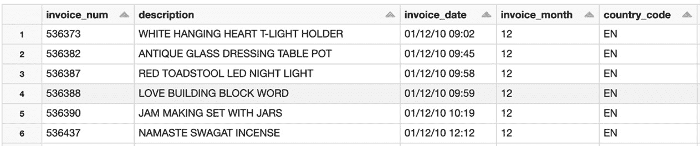

图 11.1 – 网格小部件

上一截图显示了在 Databricks 笔记本中调用 `display()` 函数在 Spark DataFrame 上的结果。通过这种方式，任何 Spark DataFrame 都可以在 Databricks 笔记本中以表格格式进行可视化。该表格网格支持对任意列进行排序。Databricks 笔记本还支持图表和图形，这些可以在笔记本内使用。

提示

Databricks 的 `display()` 方法支持 Spark 所有编程 API，包括 Python、Scala、R 和 SQL。此外，`display()` 方法还可以渲染 Python pandas DataFrame。

我们可以使用相同的网格显示，并通过点击图表图标并从列表中选择所需的图表，将其转换为图表，如下图所示：

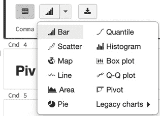

图 11.2 – 图表选项

正如我们所看到的，图表菜单有多个图表选项，柱状图排在列表的首位。如果选择柱状图，图表选项可以用来配置图表的关键字段、值字段和系列分组选项。类似地，我们也可以使用折线图或饼图，如下所示：

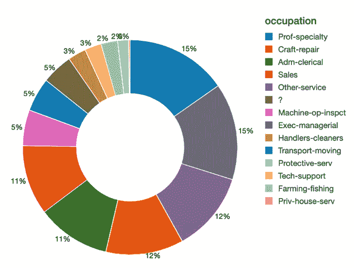

图 11.3 – 饼图

这里，`display()` 函数可以用于在笔记本中显示各种图表，并帮助配置各种图形选项。Databricks 笔记本还支持一个基础的地图小部件，可以在世界地图上可视化指标，如以下截图所示：

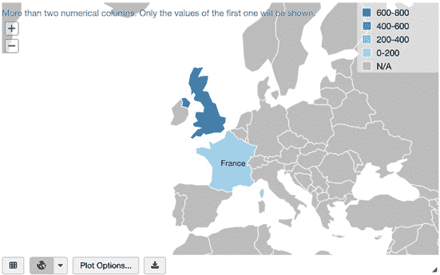

图 11.4 – 世界地图

上述截图展示了世界地图上的指标。由于我们的数据集只包含少数几个欧洲国家，法国和英国在地图小部件中已经被高亮显示。

注意

对于这个小部件，值应为 ISO 3166-1 alpha-3 格式的国家代码（例如 "GBR"）或美国州的缩写（例如 "TX"）。

除了基本的条形图和图表外，Databricks 笔记本还支持科学可视化，如**散点图**、**直方图**、**分位数图**和**Q-Q 图**，如下图所示：

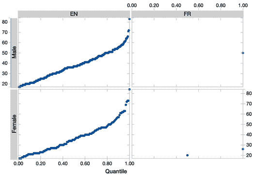

图 11.5 – 分位数图

如前面图中所示，分位数图帮助判断两个数据集是否具有共同的分布。Databricks 笔记本可以通过图表菜单访问分位数图，图表属性如键、值和系列分组可以通过图表选项菜单进行设置。

我们可以使用以下代码使 Databricks 笔记本显示图像：

```py
image_df = spark.read.format("image").load("/FileStore/FileStore/shared_uploads/images")
```

上述代码片段使用 Apache Spark 内置的图像数据源从持久存储（如数据湖）中的目录加载图像：

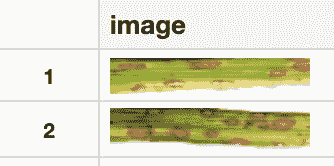

图 11.6 – 图像数据

这张图像通过 Databricks 的 `display()` 函数在笔记本中渲染显示，因为它能够显示图像预览。

Databricks 笔记本还能够渲染机器学习特定的可视化内容，例如使用 `display()` 函数可视化我们训练的**决策树**模型，如下图所示：

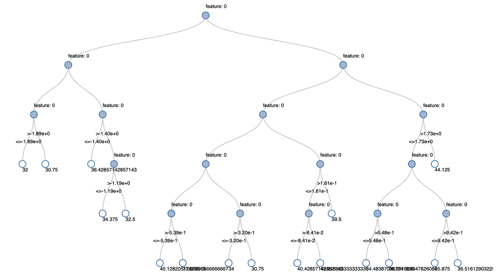

图 11.7 – 决策树模型

上述截图展示了我们使用 Spark ML 构建的决策树模型，并在 Databricks 笔记本中渲染显示。

提示

更多关于使用 Databricks 笔记本渲染机器学习特定可视化的信息，请参阅 Databricks 的公开文档：[`docs.databricks.com/notebooks/visualizations/index.html#machine-learning-visualizations`](https://docs.databricks.com/notebooks/visualizations/index.html#machine-learning-visualizations)。

### 使用 JavaScript 和 HTML 的交互式可视化

Databricks 笔记本还支持 `displayHTML()` 函数。你可以将任意 HTML 代码传递给 `displayHTML()`，并将其渲染在笔记本中，如以下代码片段所示：

```py
displayHTML("<a href ='/files/image.jpg'>Arbitrary Hyperlink</a>")
```

上述代码片段在笔记本中显示了一个任意的 HTML 超链接。其他 HTML 元素，如段落、标题、图片等，也可以与 `displayHTML()` 函数一起使用。

提示

可以使用超链接、图像和表格等 HTML 块来使你的笔记本更具描述性和交互性，这些可以帮助讲述过程中的交互性。

同样地，可以使用`displayHTML()`函数来渲染 SVG 图形，如下代码块所示：

```py
displayHTML("""<svg width="400" height="400">
  <ellipse cx="300" cy="300" rx="100" ry="60" style="fill:orange">
    <animate attributeType="CSS" attributeName="opacity" from="1" to="0" dur="5s" repeatCount="indefinite" />
  </ellipse>
</svg>""")
```

上述代码渲染了一个橙色的动画椭圆，可以淡入淡出。还可以渲染更复杂的 SVG 图形，并且可以传递来自 Spark DataFrame 的数据。同样，流行的基于 HTML 和 JavaScript 的可视化库也可以与 Databricks 笔记本一起使用，如下所示：


图 11.8 – 使用 D3.js 的词云

在这里，我们从我们在前几章节中处理数据时创建的`retail_sales` Delta 表中取出了`description`列，然后从商品描述列中提取了各个单词。接着，我们利用 HTML、CSS 和 JavaScript 使用词云可视化渲染了这些单词。之后，我们使用流行的 D3.js JavaScript 库基于数据操作 HTML 文档。这个可视化的代码可以在[`github.com/PacktPublishing/Essential-PySpark-for-Scalable-Data-Analytics/blob/main/Chapter11/databricks-charts-graphs.py`](https://github.com/PacktPublishing/Essential-PySpark-for-Scalable-Data-Analytics/blob/main/Chapter11/databricks-charts-graphs.py)找到。

到目前为止，您已经看到了一些通过 Databricks 笔记本界面可以直接与 Spark DataFrame 一起使用的基本和统计图表。然而，有时您可能需要一些在笔记本中不可用的额外图表和图形，或者您可能需要更多对图表的控制。在这些情况下，可以使用诸如`matplotlib`、`plotly`、`seaborn`、`altair`、`bokeh`等流行的 Python 可视化库与 PySpark 一起使用。我们将在下一节中探讨一些这些可视化库。

## 使用 PySpark 进行 Python 数据可视化

正如您在前一节中学到的那样，PySpark 本身并不具备任何可视化能力，但您可以选择使用 Databricks 笔记本功能来在 Spark DataFrame 中可视化数据。在无法使用 Databricks 笔记本的情况下，您可以选择使用流行的基于 Python 的可视化库，在任何您熟悉的笔记本界面中进行数据可视化。在本节中，我们将探讨一些著名的 Python 可视化库以及如何在 Databricks 笔记本中使用它们进行数据可视化。

### 使用 Matplotlib 创建二维图

使用像`pip`这样的包管理器在`PyPI`仓库中获取。以下代码示例展示了如何在 PySpark 中使用 Matplotlib：

```py
import pandas as pd
import matplotlib.pyplot as plt
retail_df = spark.read.table("feature_store.retail_features")
viz_df = retail_df.select("invoice_num", "description", 
                          "invoice_date", "invoice_month", 
                          "country_code", "quantity", 
                          "unit_price", "occupation", 
                          "gender")
pdf = viz_df.toPandas()
pdf['quantity'] = pd.to_numeric(pdf['quantity'], 
                                errors='coerce')
pdf.plot(kind='bar', x='invoice_month', y='quantity',
         color='orange')
```

在前面的代码片段中，我们执行了以下操作：

1.  首先，我们导入了`pandas`和`matplotlib`库，假设它们已经在笔记本中安装好了。

1.  然后，我们使用在前几章的数据处理步骤中创建的在线零售数据集生成了一个包含所需列的 Spark DataFrame。

1.  由于基于 Python 的可视化库不能直接使用 Spark DataFrame，我们将 Spark DataFrame 转换为 pandas DataFrame。

1.  接着，我们将数量列转换为数值数据类型，以便进行绘制。

1.  之后，我们使用 Matplotlib 库的`plot()`方法在 pandas DataFrame 上定义了一个图表，指定生成的图表类型为柱状图，并传入了 x 轴和 y 轴的列名。

1.  某些笔记本环境可能需要显式调用 `display()` 函数才能显示图表。

通过这种方式，如果我们将 Spark DataFrame 转换为 pandas DataFrame，就可以使用 Matplotlib。生成的图表如下所示：

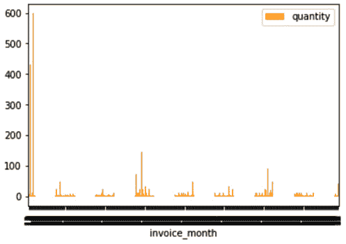

图 11.9 – Matplotlib 可视化

上一个图表显示了在某一特定时间段内已售出的商品数量。

### 使用 Seaborn 进行科学可视化

`pip`。以下代码示例展示了如何在 PySpark DataFrame 中使用 Seaborn：

```py
import matplotlib.pyplot as plt
import seaborn as sns
data = retail_df.select("unit_price").toPandas()["unit_price"]
plt.figure(figsize=(10, 3))
sns.boxplot(data)
```

在上一个代码片段中，我们执行了以下操作：

1.  首先，我们导入了 `matplotlib` 和 `seaborn` 库。

1.  接下来，我们将包含名为 `unit_price` 的单列的 Spark DataFrame 使用 `toPandas()` PySpark 函数转换为 pandas DataFrame。

1.  接着，我们使用 `plot.figure()` Matplotlib 方法定义了图表的尺寸。

1.  最后，我们通过调用 `seaborn.boxplot()` 方法并传入包含单列的 pandas DataFrame 绘制了箱线图。生成的图表如下所示：

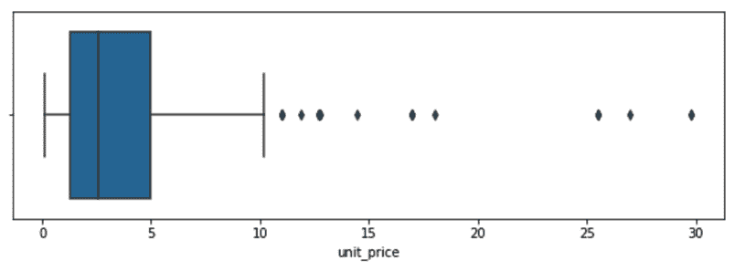

图 11.10 – Seaborn 箱线图可视化

上一个截图显示了如何使用 **unit_price** 列的最小值、第一个四分位数、中位数、第三个四分位数和最大值将其分布为箱线图。

### 使用 Plotly 进行交互式可视化

**Plotly** 是一个基于 JavaScript 的可视化库，使得 Python 用户能够创建交互式的网页可视化，并可以在笔记本中展示或保存为独立的 HTML 文件。Plotly 已预装在 Databricks 中，可以按以下方式使用：

```py
import plotly.express as plot
df = viz_df.toPandas()
fig = plot.scatter(df, x="fin_wt", y="quantity",
                   size="unit_price", color="occupation",
                   hover_name="country_code", log_x=True, 
                   size_max=60)
fig.show()
```

在上一个代码片段中，我们执行了以下操作：

1.  首先，我们导入了 `matplotlib` 和 `seaborn` 库。

1.  接下来，我们将包含所需列的 Spark DataFrame 转换为 pandas DataFrame。

1.  然后，我们使用 `plot.scatter()` 方法定义了 Plotly 图表的参数。该方法配置了一个具有三维坐标的散点图。

1.  最后，我们使用 `fig.show()` 方法渲染了图表。生成的图表如下所示：

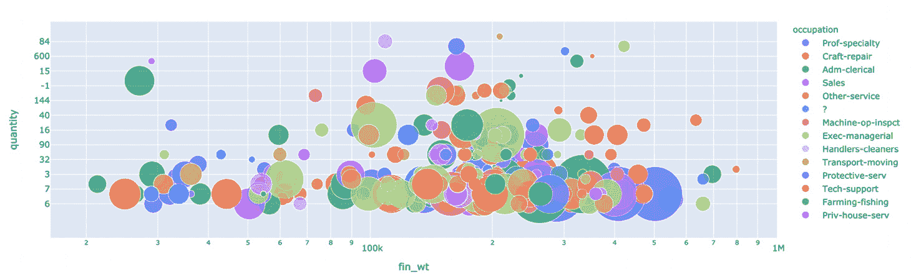

图 11.11 – Plotly 气泡图可视化

上面的截图展示了一个气泡图，显示了三个指标在三个维度上的分布。该图是互动式的，当您将鼠标悬停在图表的不同部分时，会显示相关信息。

### 使用 Altair 的声明性可视化

**Altair** 是一个用于 Python 的声明性统计可视化库。Altair 基于一个名为**Vega**的开源声明性语法引擎。Altair 还提供了一种简洁的可视化语法，使用户能够快速构建各种各样的可视化图表。可以使用以下命令安装它：

```py
%pip install altair 
```

上面的命令将 Altair 安装到笔记本的本地 Python 内核中，并重新启动它。一旦 Altair 成功安装后，可以像通常那样使用 Python 的`import`语句来调用它，代码示例如下：

```py
import altair as alt
import pandas as pd
source = (viz_df.selectExpr("gender as Gender", "trim(occupation) as Occupation").where("trim(occupation) in ('Farming-fishing', 'Handlers-cleaners', 'Prof-specialty', 'Sales', 'Tech-support') and cust_age > 49").toPandas())
```

在前面的代码片段中，我们导入了 Altair 和 pandas 库。然后，我们从 Spark 表中选择所需的列，并将其转换为 pandas DataFrame。一旦数据在 Python 中以 pandas DataFrame 的形式存在，就可以使用 Altair 来创建图表，如下所示：

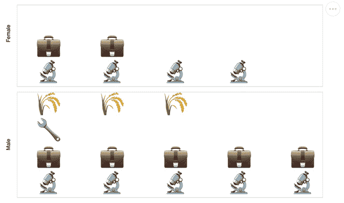

图 11.12 – Altair 等型图可视化

上面的图展示了一个等型图可视化，显示了不同国家按性别分布的职业情况。其他开源库，如`bokeh`、`pygal`和`leather`，也可以用于可视化 PySpark DataFrame。Bokeh 是另一个流行的 Python 数据可视化库，提供高性能的互动图表和图形。Bokeh 基于 JavaScript 和 HTML，与 Matplotlib 不同，它允许用户创建自定义可视化图表。关于在 Databricks 笔记本中使用 Bokeh 的信息，可以在 Databricks 的公共文档中找到，网址为[`docs.databricks.com/notebooks/visualizations/bokeh.html#bokeh`](https://docs.databricks.com/notebooks/visualizations/bokeh.html#bokeh)。

到目前为止，您已经学习了如何通过将 PySpark DataFrame 转换为 pandas DataFrame，使用一些在 Python 中与 Spark DataFrame 兼容的流行可视化方法。然而，在将 PySpark DataFrame 转换为 pandas DataFrame 时，您需要考虑一些性能问题和限制。我们将在下一部分讨论这些问题。

# PySpark 到 pandas 转换的注意事项

本节将介绍**pandas**，演示 pandas 与 PySpark 的差异，并介绍在 PySpark 与 pandas 之间转换数据集时需要注意的事项。

## pandas 简介

**pandas** 是 Python 中最广泛使用的开源数据分析库之一。它包含了一系列用于处理、操作、清洗、整理和转换数据的实用工具。与 Python 的列表、字典和循环相比，pandas 更加易于使用。从某种意义上讲，pandas 类似于其他统计数据分析工具，如 R 或 SPSS，这使得它在数据科学和机器学习爱好者中非常受欢迎。

pandas 的主要抽象是**Series**和**DataFrames**，前者本质上是一个一维数组，后者是一个二维数组。pandas 和 PySpark 之间的基本区别之一在于，pandas 将其数据集表示为一维和二维的**NumPy**数组，而 PySpark 的 DataFrames 是基于 Spark SQL 的**Row**和**Column**对象的集合。虽然 pandas DataFrames 只能通过 pandas DSL 进行操作，但 PySpark DataFrames 可以使用 Spark 的 DataFrame DSL 和 SQL 进行操作。由于这个差异，熟悉使用 pandas 的开发者可能会发现 PySpark 不同，并且在使用该平台时可能会遇到学习曲线。Apache Spark 社区意识到这一难题，启动了一个新的开源项目——Koalas。Koalas 在 Spark DataFrames 上实现了类似 pandas 的 API，以尝试克服 pandas 和 PySpark 之间的差异。关于如何使用 Koalas 的更多信息将在*第十章*，*使用 PySpark 扩展单节点机器学习*中介绍。

注意

NumPy 是一个用于科学计算的 Python 包，它提供了多维数组和一组用于快速操作数组的例程。有关 NumPy 的更多信息，请访问：[`numpy.org/doc/stable/user/whatisnumpy.html`](https://numpy.org/doc/stable/user/whatisnumpy.html)。

另一个基本区别是在大数据和处理大规模数据的上下文中，pandas 是为了处理单台机器上的数据而设计的，而 PySpark 从设计上就是分布式的，可以以大规模并行的方式在多台机器上处理数据。这突显了 pandas 与 PySpark 相比的一个重要限制，以及开发者在从 pandas 转换到 PySpark 时需要考虑的一些关键因素。我们将在接下来的章节中探讨这些内容。

## 从 PySpark 转换到 pandas

PySpark API 提供了一个方便的实用函数 `DataFrame.toPandas()`，可以将 PySpark DataFrame 转换为 pandas DataFrame。该函数在本章中有多次演示。如果你回顾一下我们在*第一章*，“*分布式计算入门*”中的讨论，尤其是关于 *Spark 集群架构* 部分，Spark 集群由 **Driver** 进程和一组在工作节点上运行的执行进程组成，Driver 负责编译用户代码，将其传递给工作节点，管理并与工作节点通信，并在需要时从工作节点聚合和收集数据。而 Spark 工作节点则负责所有数据处理任务。然而，pandas 并非基于分布式计算范式，它仅在单一计算机上运行。因此，当你在 Spark 集群上执行 pandas 代码时，它会在 Driver 或 Master 节点上执行，如下图所示：

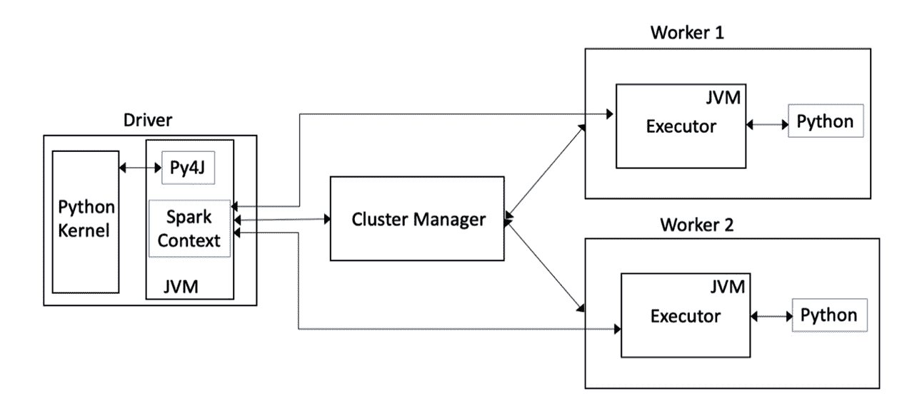

图 11.13 – PySpark 架构

如我们所见，当在 Spark DataFrame 上调用 Python 和 `toPandas()` 函数时，它会从所有 Spark 工作节点收集行数据，然后在 Driver 内部的 Python 内核上创建一个 pandas DataFrame。

这个过程面临的第一个问题是 `toPandas()` 函数实际上会将所有数据从工作节点收集并带回 Driver。如果收集的数据集过大，这可能会导致 Driver 内存不足。另一个问题是，默认情况下，Spark DataFrame 的 **Row** 对象会作为 **list** 的 **tuples** 收集到 Driver 上，然后再转换为 pandas DataFrame。这通常会消耗大量内存，有时甚至会导致收集到的数据占用的内存是 Spark DataFrame 本身的两倍。

为了减轻 PySpark 转换为 pandas 时的内存问题，可以使用 Apache Arrow。Apache Arrow 是一种内存中的列式数据格式，类似于 Spark 内部数据集的表示方式，且在 JVM 和 Python 进程之间传输数据时非常高效。默认情况下，Spark 没有启用 Apache Arrow，需要通过将 `spark.sql.execution.arrow.enabled` Spark 配置设置为 `true` 来启用它。

注意

PyArrow，Apache Arrow 的 Python 绑定，已在 Databricks Runtime 中预装。然而，你可能需要安装适用于你的 Spark 集群和 Python 版本的 PyArrow 版本。

Apache Arrow 有助于缓解使用 `toPandas()` 时可能出现的一些内存问题。尽管进行了优化，但转换操作仍然会导致 Spark DataFrame 中的所有记录被收集到 Driver 中，因此你应该仅在原始数据的一个小子集上执行转换。因此，通过利用 PyArrow 格式并小心地对数据集进行抽样，你仍然可以在笔记本环境中使用所有与标准 Python 兼容的开源可视化库来可视化你的 PySpark DataFrame。

# 总结

在本章中，你了解了使用数据可视化以简单的方式传达复杂数据集中的含义的重要性，以及如何轻松地将数据模式呈现给业务用户。介绍了多种使用 Spark 进行数据可视化的策略。你还学习了如何在 Databricks 笔记本中原生使用 PySpark 进行数据可视化。我们还探讨了使用普通 Python 可视化库来可视化 Spark DataFrame 数据的技巧。介绍了一些知名的开源可视化库，如 Matplotlib、Seaborn、Plotly 和 Altair，并提供了它们的实际使用示例和代码示例。最后，你了解了在 PySpark 中使用普通 Python 可视化时的陷阱，PySpark 转换的需求，以及克服这些问题的一些策略。

下一章将讨论如何将各种 BI 和 SQL 分析工具连接到 Spark，这将帮助你执行临时数据分析并构建复杂的操作和性能仪表板。
