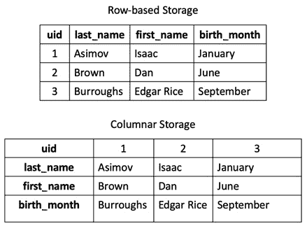
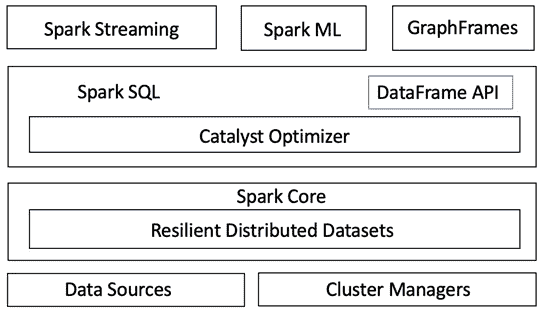
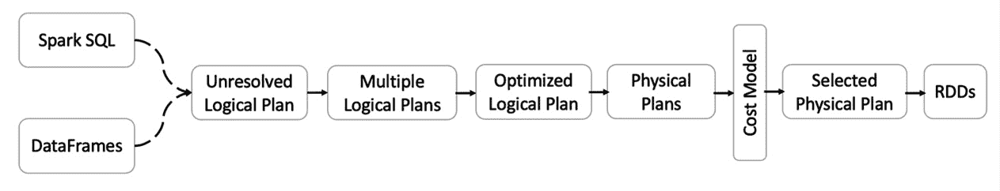

# 第十二章：Spark SQL 入门

在上一章中，你了解了数据可视化作为数据分析的强大工具。你还学习了可以用于可视化 pandas DataFrame 数据的各种 Python 可视化库。另一个同样重要、普遍且必不可少的技能是**结构化查询语言**（**SQL**）。**SQL** 自数据分析领域诞生以来一直存在，即使在大数据、数据科学和**机器学习**（**ML**）兴起的今天，SQL 仍然被证明是不可或缺的。

本章将向你介绍 SQL 的基础知识，并探讨如何通过 Spark SQL 在分布式计算环境中应用 SQL。你将了解构成 Spark SQL 的各种组件，包括存储、元数据存储和实际的查询执行引擎。我们将比较**Hadoop Hive**和 Spark SQL 之间的差异，最后介绍一些提高 Spark SQL 查询性能的技巧。

在本章中，我们将涵盖以下主要内容：

+   SQL 简介

+   Spark SQL 简介

+   Spark SQL 语言参考

+   优化 Spark SQL 性能

本章涉及的内容包括 SQL 作为数据切片和切割语言的实用性、Spark SQL 的各个组件，以及它们如何结合起来在 Apache Spark 上创建一个强大的分布式 SQL 引擎。你将查阅 Spark SQL 语言参考，以帮助你的数据分析需求，并学习一些优化 Spark SQL 查询性能的技巧。

# 技术要求

本章所需的内容如下：

+   在本章中，我们将使用 Databricks Community Edition 运行我们的代码 (https://community.cloud.databricks.com)。注册说明可以在 [`databricks.com/try-databricks`](https://databricks.com/try-databricks) 找到。

+   本章使用的代码和数据可以从 [`github.com/PacktPublishing/Essential-PySpark-for-Scalable-Data-Analytics/tree/main/Chapter12`](https://github.com/PacktPublishing/Essential-PySpark-for-Scalable-Data-Analytics/tree/main/Chapter12) 下载。

# SQL 简介

**SQL** 是一种声明式语言，用于存储、操作和查询存储在关系型数据库中的数据，也称为**关系数据库管理系统**（**RDBMSes**）。关系型数据库中的数据以表格形式存储，表格包含行和列。在现实世界中，实体之间存在关系，关系型数据库试图将这些现实世界中的关系模拟为表格之间的关系。因此，在关系型数据库中，单个表格包含与特定实体相关的数据，这些表格可能存在关联。

SQL 是一种声明式编程语言，帮助你指定想要从给定表中检索的行和列，并指定约束以过滤掉任何数据。RDBMS 包含一个查询优化器，它将 SQL 声明转换为查询计划，并在数据库引擎上执行。查询计划最终被转换为数据库引擎的执行计划，用于读取表中的行和列到内存中，并根据提供的约束进行过滤。

SQL 语言包括定义模式的子集——称为**数据定义语言**（**DDL**）——以及修改和查询数据的子集——称为**数据操作语言**（**DML**），如以下章节所述。

## DDL

`CREATE`、`ALTER`、`DROP`、`TRUNCATE`等。以下 SQL 查询表示一个 DDL SQL 语句：

```py
CREATE TABLE db_name.schema_name.table_name (
    column1 datatype,
    column2 datatype,
    column3 datatype,
   ....
);
```

上一个 SQL 语句表示在特定数据库中创建新表的典型命令，并定义了几个列及其数据类型。数据库是数据和日志文件的集合，而模式是数据库中的逻辑分组。

## DML

`SELECT`、`UPDATE`、`INSERT`、`DELETE`、`MERGE`等。以下是一个 DML 查询示例：

```py
SELECT column1, SUM(column2) AS agg_value
FROM db_name.schema_name.table_name 
WHERE column3 between value1 AND value2
GROUP BY column1
ORDER BY SUM(column2)
);
```

上一个查询结果通过对`column1`的每个不同值进行聚合，在基于`column3`上指定的约束过滤行后，最终根据聚合值对结果进行排序。

注意

尽管 SQL 通常遵循**美国国家标准协会**（**ANSI**）设定的某些标准，但每个 RDBMS 供应商对 SQL 标准的实现略有不同，您应参考特定 RDBMS 的文档以获取正确的语法。

上一个 SQL 语句表示标准的 DDL 和 DML 查询；然而，每个 RDBMS 在 SQL 标准的实现上可能会有细微的差异。同样，Apache Spark 也有自己对 ANSI SQL 2000 标准的实现。

## 连接与子查询

关系型数据库中的表包含相关数据，通常需要在不同表之间进行连接，以生成有意义的分析。因此，SQL 支持诸如连接和子查询等操作，使用户能够跨表合并数据，如以下 SQL 语句所示：

```py
SELECT a.column1, b.cloumn2, b.column3
FROM table1 AS a JOIN  table2 AS b
ON a.column1 = b.column2
```

在之前的 SQL 查询中，我们使用一个公共键列连接了两个表，并在`JOIN`操作后从这两个表中生成了列。类似地，子查询是查询中的查询，可以出现在`SELECT`、`WHERE`或`FROM`子句中，它允许你从多个表中合并数据。接下来的章节将探讨在 Spark SQL 中这些 SQL 查询的具体实现。

## 基于行存储与列存储

数据库以两种方式之一物理存储数据，要么以行存储方式，要么以列存储方式。每种方式都有其优缺点，取决于使用场景。在行存储中，所有的值一起存储，而在列存储中，单个列的所有值会连续存储在物理存储介质上，如下图所示：



图 12.1 – 行存储与列存储

如前面截图所示，在行存储中，整行及其所有列值会被一起存储在物理存储介质上。这使得查找单个行并快速高效地从存储中检索其所有列变得更容易。而列存储则将单个列的所有值连续存储在物理存储介质上，这使得检索单个列既快速又高效。

行存储在事务系统中更为流行，在这些系统中，快速检索单个事务记录或行更为重要。另一方面，分析系统通常处理的是行的聚合，只需要每个查询检索少量的列。因此，在设计分析系统时，选择列存储更加高效。列存储还提供了更好的数据压缩比，从而在存储大量历史数据时，能够更有效地利用可用存储空间。包括 **数据仓库** 和 **数据湖** 在内的分析存储系统更倾向于使用列存储而非行存储。流行的大数据文件格式如 **Parquet** 和 **优化行列存储**（**ORC**）也采用列存储。

SQL 的易用性和普遍性促使许多非关系型数据处理框架的创建者，如 Hadoop 和 Apache Spark，采纳 SQL 的子集或变体来创建 Hadoop Hive 和 Spark SQL。我们将在接下来的章节中详细探讨 Spark SQL。

# Spark SQL 简介

**Spark SQL** 为 Apache Spark 提供了原生的 SQL 支持，并统一了查询存储在 Spark DataFrames 和外部数据源中的数据的过程。Spark SQL 将 DataFrames 和关系表统一，使得开发者可以轻松地将 SQL 命令与外部数据查询结合，进行复杂的分析。随着 **Apache Spark 1.3** 的发布，Spark SQL 驱动的 Spark DataFrames 成为表达数据处理代码的事实标准抽象方式，而 **弹性分布式数据集**（**RDDs**）仍然是 Spark 的核心抽象方法，如下图所示：



图 12.2 – Spark SQL 架构

如前面的图所示，你可以看到现在大多数 Spark 组件都利用了 Spark SQL 和 DataFrames。Spark SQL 提供了关于数据结构和正在执行的计算的更多信息，**Spark SQL 引擎**利用这些额外的信息对查询进行进一步的优化。使用 Spark SQL，Spark 的所有组件——包括**结构化流**、**DataFrames**、**Spark ML**和**GraphFrames**——以及所有的编程**应用程序编程接口**（**APIs**）——包括**Scala**、**Java**、**Python**、**R**和**SQL**——都使用相同的执行引擎来表达计算。这种统一性使你可以轻松地在不同的 API 之间切换，并让你根据当前任务选择合适的 API。某些数据处理操作，如连接多个表格，在 SQL 中表达起来更容易，开发者可以轻松地将**SQL**与**Scala**、**Java**或**Python**代码混合使用。

Spark SQL 还引入了一个强大的新优化框架，名为**Catalyst**，它可以自动将任何数据处理代码，不论是使用 Spark DataFrames 还是使用 Spark SQL 表达的，转换为更高效的执行方式。我们将在接下来的章节中深入探讨**Catalyst**优化器。

## Catalyst 优化器

**SQL 查询优化器**在关系型数据库管理系统（RDBMS）中是一个过程，它确定给定 SQL 查询处理存储在数据库中的数据的最有效方式。SQL 优化器尝试生成给定 SQL 查询的最优执行方式。优化器通常会生成多个查询执行计划，并从中选择最优的一个。它通常会考虑因素如**中央处理单元**（**CPU**）、**输入/输出**（**I/O**）以及查询的表格的任何可用统计信息，以选择最优的查询执行计划。优化器根据选择的查询执行计划，决定以任何顺序重新排序、合并和处理查询，以获得最优结果。

Spark SQL 引擎也配备了一个名为**Catalyst**的查询优化器。**Catalyst**基于**函数式编程**的概念，像 Spark 的其他代码库一样，利用 Scala 编程语言的特性来构建一个强大且可扩展的查询优化器。Spark 的 Catalyst 优化器通过一系列步骤为给定的 Spark SQL 查询生成一个最优执行计划，如下图所示：



图 12.3 – Spark 的 Catalyst 优化器

如前图所示，Catalyst 优化器首先在解析引用后生成逻辑计划，然后基于标准的规则优化技术优化逻辑计划。接着，使用优化后的逻辑计划生成一组物理执行计划，并选择最佳的物理计划，最终使用最佳的物理计划生成**Java 虚拟机**（**JVM**）字节码。这个过程使得 Spark SQL 能够将用户查询转化为最佳的数据处理代码，而开发者无需了解 Spark 分布式数据处理范式的微观细节。此外，Spark SQL DataFrame API 在 Java、Scala、Python 和 R 编程语言中的实现都经过相同的 Catalyst 优化器。因此，无论使用哪种编程语言编写的 Spark SQL 或任何数据处理代码，性能都是相当的。

提示

在某些情况下，PySpark DataFrame 的代码性能可能无法与 Scala 或 Java 代码相比。一个例子是当在 PySpark DataFrame 操作中使用非矢量化的**用户定义函数**（**UDFs**）时。Catalyst 无法查看 Python 中的 UDF，因此无法优化代码。因此，应该将其替换为 Spark SQL 的内置函数或在 Scala 或 Java 中定义的 UDF。

一位经验丰富的数据工程师，如果对 RDD API 有深入了解，可能写出比 Catalyst 优化器更优化的代码；然而，通过让 Catalyst 处理代码生成的复杂性，开发者可以将宝贵的时间集中在实际的数据处理任务上，从而提高效率。在深入了解 Spark SQL 引擎的内部工作原理后，理解 Spark SQL 可以处理的数据源类型会非常有用。

## Spark SQL 数据源

由于 Spark DataFrame API 和 SQL API 都基于由 Catalyst 优化器提供支持的相同 Spark SQL 引擎，它们也支持相同的数据源。这里展示了一些突出的 Spark SQL 数据源。

### 文件数据源

Spark SQL 原生支持基于文件的数据源，例如 Parquet、ORC、Delta 等，以下是一个 SQL 查询示例：

```py
SELECT * FROM delta.'/FileStore/shared_uploads/delta/retail_features.delta' LIMIT 10;
```

在前面的 SQL 语句中，数据直接从 `delta.` 前缀查询。同样的 SQL 语法也可以用于数据湖中的 Parquet 文件位置。

其他文件类型，如**JavaScript 对象表示法**（**JSON**）和**逗号分隔值**（**CSV**），需要先在元数据存储中注册表或视图，因为这些文件不自描述，缺乏固有的模式信息。以下是使用 CSV 文件与 Spark SQL 的示例 SQL 查询：

```py
CREATE OR REPLACE TEMPORARY VIEW csv_able
USING csv
OPTIONS (
  header "true",
  inferSchema "true",
  path "/FileStore/ConsolidatedCities.csv"
);
SELECT * FROM csv_able LIMIT 5;
```

在前面的 SQL 语句中，我们首先使用数据湖中的 CSV 文件通过 CSV 数据源创建一个临时视图。我们还使用 `OPTIONS` 来指定 CSV 文件包含标题行，并从文件本身推断出模式。

注意

元存储是一个 RDBMS 数据库，Spark SQL 将数据库、表、列和分区等元数据信息持久化存储在其中。

如果表需要在集群重启后保持持久化，并且将来会被重用，您也可以创建一个永久表而不是临时视图。

### JDBC 数据源

现有的 RDBMS 数据库也可以通过 **Java 数据库连接**（**JDBC**）与元存储进行注册，并作为 Spark SQL 的数据源。以下代码块展示了一个示例：

```py
CREATE TEMPORARY VIEW jdbcTable
USING org.apache.spark.sql.jdbc
OPTIONS (
  url "jdbc:mysql://localhost:3306/pysparkdb",
  dbtable "authors",
  user 'username',
  password 'password'
);
SELECT * FROM resultTable; 
```

在前面的代码块中，我们使用 `jdbc` 数据源创建了一个临时视图，并指定了数据库连接选项，如数据库 **统一资源定位符**（**URL**）、表名、用户名、密码等。

### Hive 数据源

**Apache Hive** 是 Hadoop 生态系统中的一个数据仓库，可以使用 SQL 读取、写入和管理存储在 Hadoop 文件系统或数据湖中的数据集。Spark SQL 可以与 Apache Hive 一起使用，包括 Hive 元存储、Hive **序列化/反序列化器**（**SerDes**）以及 Hive UDF。Spark SQL 支持大多数 Hive 特性，如 Hive 查询语言、Hive 表达式、用户定义的聚合函数、窗口函数、连接、并集、子查询等。然而，像 Hive **原子性、一致性、隔离性、持久性**（**ACID**）表更新、Hive I/O 格式以及某些 Hive 特定优化等特性是不支持的。支持和不支持的特性完整列表可以在 Databricks 的公共文档中找到，链接如下：[`docs.databricks.com/spark/latest/spark-sql/compatibility/hive.html`](https://docs.databricks.com/spark/latest/spark-sql/compatibility/hive.html)。

现在，您已经了解了 Spark SQL 组件，如 Catalyst 优化器及其数据源，我们可以深入探讨 Spark SQL 特定的语法和函数。

# Spark SQL 语言参考

作为 Hadoop 生态系统的一部分，Spark 一直以来都与 Hive 兼容。尽管 Hive 查询语言与 ANSI SQL 标准有很大差异，Spark 3.0 的 Spark SQL 可以通过配置 `spark.sql.ansi.enabled` 来实现 ANSI SQL 兼容。启用此配置后，Spark SQL 将使用 ANSI SQL 兼容的方言，而不是 Hive 方言。

即使启用了 ANSI SQL 兼容，Spark SQL 可能仍无法完全符合 ANSI SQL 方言，本节将探讨一些 Spark SQL 的突出 DDL 和 DML 语法。

## Spark SQL DDL

使用 Spark SQL 创建数据库和表的语法如下所示：

```py
CREATE DATABASE IF NOT EXISTS feature_store;
CREATE TABLE IF NOT EXISTS feature_store.retail_features
USING DELTA
LOCATION '/FileStore/shared_uploads/delta/retail_features.delta';
```

在前面的代码块中，我们执行了以下操作：

+   首先，如果数据库不存在，我们使用 `CREATE DATABASE` 命令创建一个数据库。通过此命令，还可以指定一些选项，如持久存储中的物理仓库位置和其他数据库属性。

+   然后，我们使用 `delta` 作为数据源创建一个表，并指定数据的位置。这里，指定位置的数据已经存在，因此无需指定任何模式信息，如列名及其数据类型。然而，为了创建一个空的表结构，仍然需要指定列及其数据类型。

要更改现有表的某些属性，例如重命名表、修改或删除列，或修改表分区信息，可以使用 `ALTER` 命令，如下所示的代码示例所示：

```py
ALTER TABLE feature_store.retail_features RENAME TO feature_store.etailer_features;
ALTER TABLE feature_store.etailer_features ADD COLUMN (new_col String);
```

在前面的代码示例中，我们在第一个 SQL 语句中重命名了表。第二个 SQL 语句修改了表并添加了一个新的 `String` 类型的列。在 Spark SQL 中，仅支持更改列注释和添加新列。以下代码示例展示了 Spark SQL 语法，用于完全删除或删除对象：

```py
TRUNCATE TABLE feature_store.etailer_features;
DROP TABLE feature_store.etailer_features;
DROP DATABASE feature_store;
```

在前面的代码示例中，`TRUNCATE` 命令删除了表中的所有行，并保持表结构和模式不变。`DROP TABLE` 命令删除了表及其模式，而 `DROP DATABASE` 命令则删除整个数据库。

## Spark DML

数据操作涉及从表中添加、修改和删除数据。以下代码语句展示了一些示例：

```py
INSERT INTO feature_store.retail_features
SELECT * FROM delta.'/FileStore/shared_uploads/delta/retail_features.delta';
```

前面的 SQL 语句通过另一个 SQL 查询的结果将数据插入到现有表中。类似地，`INSERT OVERWRITE` 命令可用于覆盖现有数据，然后将新数据加载到表中。以下 SQL 语句可用于选择性地删除表中的数据：

```py
DELETE FROM feature_store.retail_features WHERE country_code = 'FR';
```

前面的 SQL 语句根据筛选条件从表中删除选择性的数据。虽然 `SELECT` 语句不是必须的，但它们在数据分析中至关重要。以下 SQL 语句展示了使用 `SELECT` 语句进行 Spark SQL 数据分析：

```py
SELECT
  year AS emp_year
  max(m.last_name),
  max(m.first_name),
  avg(s.salary) AS avg_salary
FROM
  author_salary s
  JOIN mysql_authors m ON m.uid = s.id
GROUP BY year
ORDER BY s.salary DESC
```

前面的 SQL 语句根据公共键对两个表进行**内连接**，并按年份计算每位员工的平均薪资。此查询的结果提供了员工薪资随年份变化的见解，并且可以轻松安排定期刷新。

通过这种方式，使用 Apache Spark 强大的分布式 SQL 引擎及其富有表现力的 Spark SQL 语言，您可以在无需学习任何新编程语言的情况下，以快速高效的方式执行复杂的数据分析。有关支持的数据类型、函数库和 SQL 语法的完整参考指南，可以在 Apache Spark 的公共文档中找到：[`spark.apache.org/docs/latest/sql-ref-syntax.html`](https://spark.apache.org/docs/latest/sql-ref-syntax.html)。

尽管 Spark SQL 的**Catalyst**优化器承担了大部分优化工作，但了解一些进一步调整 Spark SQL 性能的技巧还是很有帮助的，以下部分将介绍几个显著的技巧。

# 优化 Spark SQL 性能

在上一节中，你了解了 Catalyst 优化器是如何通过将代码运行经过一系列优化步骤，直到得出最佳执行计划，从而优化用户代码的。为了充分利用 Catalyst 优化器，推荐使用利用 Spark SQL 引擎的 Spark 代码——即 Spark SQL 和 DataFrame API——并尽量避免使用基于 RDD 的 Spark 代码。Catalyst 优化器无法识别 UDF（用户定义函数），因此用户可能会编写出次优的代码，从而导致性能下降。因此，推荐使用内置函数，而不是 UDF，或者在 Scala 和 Java 中定义函数，然后在 SQL 和 Python API 中使用这些函数。

尽管 Spark SQL 支持基于文件的格式，如 CSV 和 JSON，但推荐使用序列化数据格式，如 Parquet、AVRO 和 ORC。半结构化格式（如 CSV 或 JSON）会带来性能开销，首先是在模式推断阶段，因为它们无法将模式直接提供给 Spark SQL 引擎。其次，它们不支持诸如**谓词下推**（Predicate Pushdown）之类的数据过滤功能，因此必须将整个文件加载到内存中，才能在源头过滤掉数据。作为天生的无压缩文件格式，CSV 和 JSON 相比于 Parquet 等二进制压缩格式，也消耗更多的内存。甚至传统的关系型数据库比使用半结构化数据格式更为推荐，因为它们支持谓词下推，并且可以将一些数据处理任务委托给数据库。

对于诸如机器学习（ML）等迭代工作负载，数据集被多次访问的情况下，将数据集缓存到内存中非常有用，这样后续对表或 DataFrame 的扫描就会在内存中进行，从而大大提高查询性能。

Spark 提供了各种 `BROADCAST`、`MERGE`、`SHUFFLE_HASH` 等。然而，Spark SQL 引擎有时可能无法预测某个查询的策略。可以通过将**提示**传递给 Spark SQL 查询来缓解这个问题，如下代码块所示：

```py
SELECT /*+ BROADCAST(m) */
  year AS emp_year
  max(m.last_name),
  max(m.first_name),
  avg(s.salary) AS avg_salary
FROM
  author_salary s
  JOIN mysql_authors m ON m.uid = s.id
GROUP BY year
ORDER BY s.salary DESC;
```

在前面的代码块中，我们传入了一个`SELECT`子句。这指定了较小的表会被广播到所有的工作节点，这应该能够提高连接操作的性能，从而提升整体查询性能。同样，`COALESCE`和`REPARTITION`提示也可以传递给 Spark SQL 查询；这些提示减少了输出文件的数量，从而提升了性能。

注意

SQL 提示、查询提示或优化器提示是标准 SQL 语句的补充，用于提示 SQL 执行引擎选择开发者认为最优的特定物理执行计划。SQL 提示在所有关系型数据库管理系统（RDBMS）引擎中通常都得到支持，现在 Spark SQL 也支持某些类型的查询，如前所述。

虽然 Catalyst 优化器在生成最佳物理查询执行计划方面表现出色，但仍然可能会因为表上的陈旧统计数据而受到影响。从 Spark 3.0 开始，`spark.sql.adaptive.enabled` 配置项得以引入。这些只是 Spark SQL 性能调优技术中的一部分，每项技术的详细描述可以在 Apache Spark 官方文档中找到，链接如下：[`spark.apache.org/docs/latest/sql-performance-tuning.html`](https://spark.apache.org/docs/latest/sql-performance-tuning.html)。

# 摘要

本章介绍了 SQL 作为一种声明式语言，它因易用性和表达能力而被普遍接受为结构化数据分析的语言。你了解了 SQL 的基本构造，包括 SQL 的 DDL 和 DML 方言。你还介绍了 Spark SQL 引擎，这是一个统一的分布式查询引擎，支持 Spark SQL 和 DataFrame API。一般来说，介绍了 SQL 优化器，Spark 自己的查询优化器 Catalyst 也做了介绍，并说明了它如何将 Spark SQL 查询转换为 Java JVM 字节码。还介绍了 Spark SQL 语言的参考资料，以及最重要的 DDL 和 DML 语句，并提供了示例。最后，我们讨论了一些性能优化技术，帮助你在数据分析过程中充分发挥 Spark SQL 的优势。在下一章，我们将进一步拓展 Spark SQL 知识，探讨外部数据分析工具，如 **商业智能**（**BI**）工具和 SQL 分析工具，如何利用 Apache Spark 的分布式 SQL 引擎，以快速高效地处理和可视化大量数据。
