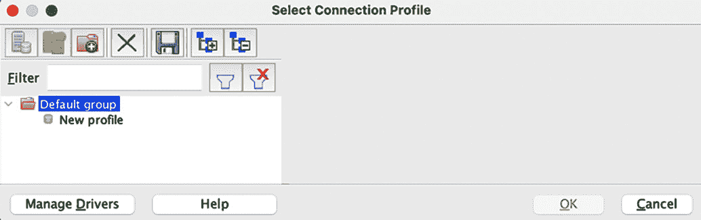

# 第十三章：将外部工具与 Spark SQL 集成

**商业智能**（**BI**）指的是使组织能够做出明智的、数据驱动的决策的能力。BI 结合了数据处理能力、数据可视化、业务分析和一套最佳实践，帮助组织在战略和战术决策中优化、精炼和简化其业务流程。组织通常依赖专业的软件工具，称为 BI 工具，以满足其 BI 需求。BI 工具将战略与技术结合，收集、分析和解释来自不同来源的数据，并提供有关企业过去和现在状态的业务分析。

BI 工具传统上依赖数据仓库作为数据源和数据处理引擎。然而，随着大数据和实时数据的出现，BI 工具已经扩展到使用数据湖和其他新的数据存储和处理技术作为数据源。在本章中，您将探索如何通过 Spark Thrift **Java 数据库连接/开放数据库连接**（**JDBC/ODBC**）服务器，将 Spark SQL 作为分布式**结构化查询语言**（**SQL**）引擎，用于 BI 和 SQL 分析工具。将介绍 Spark SQL 与 SQL 分析和 BI 工具的连接要求，以及详细的配置和设置步骤。最后，本章还将介绍从任意 Python 应用程序连接到 Spark SQL 的选项。

本章将涵盖以下主要内容：

+   Apache Spark 作为**分布式 SQL 引擎**

+   Spark 与 SQL 分析工具的连接

+   Spark 与 BI 工具的连接

+   使用`pyodbc`将 Python 应用程序连接到 Spark SQL

本章所获得的技能包括理解 Spark Thrift JDBC/ODBC 服务器、如何通过 JDBC 和 Spark Thrift 服务器将 SQL 编辑器和 BI 工具连接到 Spark SQL，以及使用 Pyodbc 将基于 Python 的业务应用程序与 Spark SQL 引擎连接。

# 技术要求

本章所需内容如下：

+   在本章中，我们将使用 Databricks 社区版来运行代码（[`community.cloud.databricks.com`](https://community.cloud.databricks.com)）。注册说明请参见[`databricks.com/try-databricks`](https://databricks.com/try-databricks)。

+   我们将使用一个免费的开源 SQL 编辑器工具**SQL Workbench/J**，可以从[`www.sql-workbench.eu/downloads.html`](https://www.sql-workbench.eu/downloads.html)下载。

+   您需要下载一个 JDBC 驱动程序，使 SQL Workbench/J 能够与 Databricks 社区版连接。您可以从[`databricks.com/spark/jdbc-drivers-download`](https://databricks.com/spark/jdbc-drivers-download)下载该驱动程序。

+   我们还将使用 **Tableau Online** 来演示 BI 工具的集成。你可以在 [`www.tableau.com/products/online/request-trial`](https://www.tableau.com/products/online/request-trial) 申请免费的 14 天 Tableau Online 试用。

# Apache Spark 作为一个分布式 SQL 引擎

SQL 的一个常见应用是与 BI 和 SQL 分析工具的结合。这些基于 SQL 的工具通过 JDBC 或 ODBC 连接以及内置的传统 RDBMS JDBC/ODBC 连接来连接到 **关系型数据库管理系统** (**RDBMS**)。在前面的章节中，你已经看到，Spark SQL 可以通过笔记本使用，并与 PySpark、Scala、Java 或 R 应用程序混合使用。然而，Apache Spark 也可以作为一个强大且快速的分布式 SQL 引擎，通过 JDBC/ODBC 连接或命令行使用。

注意

JDBC 是一个基于 SQL 的 **应用程序编程接口** (**API**)，Java 应用程序通过它连接到关系型数据库管理系统 (RDBMS)。类似地，ODBC 是由 Microsoft 创建的一个 SQL 基础的 API，用于为基于 Windows 的应用程序提供 RDBMS 访问。JDBC/ODBC 驱动程序是一个客户端软件组件，由 RDBMS 厂商自己开发或由第三方开发，可与外部工具一起使用，通过 JDBC/ODBC 标准连接到 RDBMS。

在接下来的章节中，我们将探讨如何利用 Apache Spark 的 **JDBC/ODBC** 服务功能。

## Hive Thrift JDBC/ODBC 服务器介绍

虽然 JDBC/ODBC 驱动程序赋予 BI 或 SQL 分析工具等客户端软件连接数据库服务器的能力，但数据库服务器也需要一些服务器端组件才能利用 JDBC/ODBC 标准。大多数 RDBMS 都内置了这些 JDBC/ODBC 服务功能，Apache Spark 也可以通过 Thrift JDBC/ODBC 服务器启用此服务器端功能。

**HiveServer2** 是一个服务器端接口，旨在使 Hadoop Hive 客户端能够执行针对 Apache Hive 的 Hive 查询。HiveServer2 已经开发出来，旨在通过 JDBC 和 ODBC 等开放的 API 提供多客户端并发能力。HiveServer2 本身基于 Apache Thrift，这是一种用于在多种编程语言中创建服务的二进制通信协议。Spark Thrift Server 是 Apache Spark 对 HiveServer2 的实现，允许 JDBC/ODBC 客户端在 Apache Spark 上执行 Spark SQL 查询。

Spark Thrift Server 随 Apache Spark 发行版一起捆绑，且大多数 Apache Spark 厂商默认在他们的 Spark 集群上启用此服务。以 Databricks 为例，可以通过 **集群** 页面访问此服务，如下图所示：


](img/B16736_13_01.jpg)

图 13.1 – Databricks JDBC/ODBC 接口

你可以通过导航到 Databricks Web 界面内的**Clusters**页面，然后点击**高级选项**，再点击**JDBC/ODBC**选项卡，来访问前一屏幕截图中显示的 Databricks JDBC/ODBC 接口。Databricks JDBC/ODBC 接口提供了外部工具连接 Databricks Spark 集群所需的主机名、端口、协议、HTTP 路径和实际的 JDBC URL。在接下来的部分中，我们将探讨如何使用 Spark Thrift Server 功能，使外部基于 SQL 的客户端能够利用 Apache Spark 作为分布式 SQL 引擎。

# Spark 与 SQL 分析工具的连接

SQL 分析工具，如其名称所示，是专为快速和简便 SQL 分析而设计的工具。它们允许您连接到一个或多个关系数据库管理系统（RDBMS），浏览各种数据库、模式、表和列。它们甚至帮助您可视化分析表及其结构。它们还具有设计用于快速 SQL 分析的界面，具有多个窗口，让您可以在一个窗口浏览表和列，在另一个窗口中编写 SQL 查询，并在另一个窗口中查看结果。其中一种这样的 SQL 分析工具，称为**SQL Workbench/J**，如下屏幕截图所示：


图 13.2 – SQL Workbench/J 界面

前面的屏幕截图展示了**SQL Workbench/J**的界面，它代表了一个典型的 SQL 编辑器界面，左侧窗格有数据库、模式、表和列浏览器。顶部窗格有一个用于编写实际 SQL 查询的文本界面，底部窗格显示已执行 SQL 查询的结果，并有其他选项卡显示任何错误消息等等。顶部还有一个菜单和工具栏，用于建立数据库连接、在各个数据库之间切换、执行 SQL 查询、浏览数据库、保存 SQL 查询、浏览查询历史记录等等。这种类型的 SQL 分析界面非常直观，非常适合快速 SQL 分析，以及构建基于 SQL 的数据处理作业，因为可以轻松浏览数据库、表和列。可以轻松地将表和列名拖放到**查询组合器**窗口中，快速查看和分析结果。

此外，还有一些更复杂的 SQL 分析工具，可以让你在同一个界面内可视化查询结果。一些开源工具如**Redash**、**Metabase**和**Apache Superset**，以及一些云原生工具如**Google Data Studio**、**Amazon QuickSight**等。

提示

Redash 最近被 Databricks 收购，并可在 Databricks 付费版本中使用；截至目前，它在 Databricks 社区版中不可用。

现在，您已经了解了 SQL 分析工具的外观和工作原理，接下来让我们来看一下将 SQL 分析工具（如 **SQL Workbench/J**）连接到 **Databricks Community Edition** 所需的步骤。

**SQL Workbench/J** 是一个免费的、独立于 RDBMS 的 SQL 分析工具，基于 Java，可以与任何您选择的操作系统一起使用。有关下载和运行 **SQL Workbench/J** 的说明，请参阅此处：[`www.sql-workbench.eu/downloads.html`](https://www.sql-workbench.eu/downloads.html)。

一旦您在本地机器上成功设置并运行 **SQL Workbench/J**，接下来的步骤将帮助您将其与 **Databricks Community Edition** 连接：

1.  从 [`databricks.com/spark/jdbc-drivers-download`](https://databricks.com/spark/jdbc-drivers-download) 下载 Databricks JDBC 驱动程序，并将其存储在已知位置。

1.  启动 **SQL Workbench/J** 并打开 **文件** 菜单。然后，点击 **连接窗口**，以进入以下屏幕：

    ](img/B16736_13_03.jpg)

    图 13.3 – SQL Workbench/J 连接窗口

1.  在前面的窗口中，点击 **管理驱动程序**，以进入以下屏幕：

    ](img/B16736_13_04.jpg)

    图 13.4 – 管理驱动程序屏幕

1.  如前所述的 **管理驱动程序** 窗口截图所示，点击文件夹图标，导航到您存储已下载 Databricks 驱动程序的文件夹并打开它，然后点击 **OK** 按钮。

1.  现在，导航到您的 Databricks `UID` 和 `PWD` 部分，并将其粘贴到 **URL** 字段中，位于 **SQL Workbench/J** 连接窗口，如下所示截图所示：

    ](img/B16736_13_06.jpg)

    图 13.6 – SQL Workbench/J 连接参数

1.  在输入来自 Databricks **集群** 页面所需的 JDBC 参数后，在 **SQL Workbench/J** 连接窗口中的 **用户名** 和 **密码** 字段中输入您的 Databricks 用户名和密码。然后，点击 **测试** 按钮以测试与 Databricks 集群的连接。如果所有连接参数已正确提供，您应该会看到一个 **连接成功** 的消息弹出。

    提示

    如果您看到任何连接失败或 **Host Not Found** 类型的错误，请确保 Databricks 集群已启动并正在运行。

通过遵循之前的步骤，您可以成功地将 SQL 分析工具（如 **SQL Workbench/J**）连接到 Databricks 集群，并远程运行 Spark SQL 查询。也可以连接到运行在其他供应商集群上的其他 Spark 集群——只需确保直接从供应商处获取适当的 **HiveServer2** 驱动程序。现代 BI 工具也认识到连接大数据技术和数据湖的重要性，在接下来的部分中，我们将探讨如何通过 JDBC 连接将 BI 工具与 Apache Spark 连接。

# Spark 连接到 BI 工具

在大数据和**人工智能**（**AI**）时代，Hadoop 和 Spark 将数据仓库现代化为分布式仓库，能够处理高达**拍字节**（**PB**）的数据。因此，BI 工具也已发展为利用基于 Hadoop 和 Spark 的分析存储作为其数据源，并通过 JDBC/ODBC 连接到这些存储。包括 Tableau、Looker、Sisense、MicroStrategy、Domo 等在内的 BI 工具都支持与 Apache Hive 和 Spark SQL 的连接，并内置了相应的驱动程序。在本节中，我们将探讨如何通过 JDBC 连接将 BI 工具，如 Tableau Online，连接到 Databricks Community Edition。

**Tableau Online** 是一个完全托管在云中的 BI 平台，允许你进行数据分析、发布报告和仪表盘，并创建交互式可视化，所有操作都可以通过网页浏览器完成。以下步骤描述了将 Tableau Online 与 Databricks Community Edition 连接的过程：

1.  如果你已经拥有一个现有的 Tableau Online 账户，请登录。如果没有，你可以在此处请求免费试用：[`www.tableau.com/products/online/request-trial`](https://www.tableau.com/products/online/request-trial)。

1.  登录后，点击右上角的**新建**按钮，如以下截图所示：

    图 13.7 – Tableau Online 新工作簿

1.  新创建的工作簿会提示你**连接到数据**。点击**连接器**标签，并从可用数据源列表中选择**Databricks**，如以下截图所示：

    图 13.8 – Tableau Online 数据源

1.  然后，提供 Databricks 集群的详细信息，如**服务器主机名**、**HTTP 路径**、**身份验证**、**用户名**和**密码**，如以下截图所示，并点击**登录**按钮。这些详细信息可以在 Databricks **集群**页面找到：

    图 13.9 – Tableau Online Databricks 连接

1.  一旦连接成功，你的新工作簿将在**数据源**标签页中打开，你可以浏览现有的数据库和表格，如以下截图所示：

    图 13.10 – Tableau Online 数据源

1.  **数据源**标签页还允许你拖放表格并定义表之间的关系和连接，如以下截图所示：

    图 13.11 – Tableau Online：定义表连接

1.  Tableau Online 数据源还允许你与基础数据源创建两种类型的连接——一种是实时连接，它会在每次请求时查询基础数据源，另一种是创建**提取**，它从数据源中提取数据并将其存储在 Tableau 中。对于像 Apache Spark 这样的庞大数据源，建议创建实时连接，因为查询的数据量可能远大于平常。

1.  还可以通过点击**更新现在**按钮在**数据源**标签中浏览示例数据，如下图所示：

    图 13.12 – Tableau Online 数据源预览

1.  一旦数据源连接建立，你可以通过点击`Sheet1`或创建新的附加工作表来继续可视化数据并创建报告和仪表板。

1.  一旦进入工作表，你可以通过将**数据**窗格中的列拖放到空白工作表上来开始可视化数据。

1.  Tableau 会根据选择的字段自动选择合适的可视化方式。可视化方式也可以通过**可视化**下拉选择器进行更改，数据过滤器可以通过**过滤器**框定义。在**列**字段中可以定义度量的聚合，还可以根据需要将列定义为**维度**、**属性**或**度量**。顶部菜单还提供了排序和透视数据的其他设置，并有其他格式化选项。Tableau Online 还提供了高级分析选项，如定义四分位数、中位数等。通过这种方式，利用 Tableau Online 内置的 Databricks 连接器，数据可以在 Apache Spark 的强大和高效的支持下进行大规模分析，同时还可以享受像 Tableau Online 这样显著 BI 工具的**图形用户界面**（**GUI**）的易用性，截图如下所示：


图 13.13 – Tableau Online 工作表与可视化

**Tableau Online**是许多流行的 BI 工具之一，支持开箱即用的原生 Databricks 连接。现代 BI 工具还提供了 Spark SQL 连接选项，用于连接 Databricks 之外的 Apache Spark 发行版。

连接 Apache Spark 不仅限于 SQL 分析和 BI 工具。由于 JDBC 协议基于 Java，并且是为了被基于 Java 的应用程序使用而设计的，因此任何使用**Java 虚拟机**（**JVM**）基础编程语言（如**Java**或**Scala**）构建的应用程序也可以使用 JDBC 连接选项连接 Apache Spark。

那么，像 Python 这样流行的编程语言构建的应用程序怎么办？这些类型的 Python 应用程序可以通过**Pyodbc**连接到 Apache Spark，我们将在接下来的部分中探讨这一点。

# 将 Python 应用程序连接到 Spark SQL，使用 Pyodbc

**Pyodbc**是一个开源的 Python 模块，用于通过 ODBC 连接将 Python 应用程序连接到数据源。Pyodbc 可以与任何本地 Python 应用程序一起使用，通过 ODBC 驱动程序连接到 Apache Spark，并访问使用 Apache Spark SQL 定义的数据库和表格。在本节中，我们将探讨如何通过以下步骤使用**Pyodbc**将运行在本地机器上的 Python 连接到 Databricks 集群：

1.  从这里下载并安装 Databricks 提供的 Simba ODBC 驱动程序到本地机器：[`databricks.com/spark/odbc-drivers-download`](https://databricks.com/spark/odbc-drivers-download)。

1.  使用`pip`在本地机器的 Python 中安装 Pyodbc，如下所示的命令：

    ```py
    sudo pip install pyodbc
    ```

1.  使用您选择的文本编辑器创建一个新的 Python 文件，并将以下代码粘贴到其中：

    ```py
    import pyodbc
    odbc_conn = pyodbc.connect("Driver /Library/simba/spark/lib/libsparkodbc_sbu.dylib;" +
                          "HOST=community.cloud.databricks.com;" +
                          "PORT=443;" +
                          "Schema=default;" +
                          "SparkServerType=3;" +
                          "AuthMech=3;" +
                          "UID=username;" +
                          "PWD=password;" +
                          "ThriftTransport=2;" +
                          "SSL=1;" +
                          "HTTPPath= sql/protocolv1/o/4211598440416462/0727-201300-wily320",
                          autocommit=True)
    cursor = odbc_conn.cursor()
    cursor.execute(f"SELECT * FROM retail_features LIMIT 5")
    for row in cursor.fetchall():
      print(row)
    ```

1.  前述代码配置的驱动路径可能会根据您的操作系统有所不同，具体如下：

    ```py
    macOS: /Library/simba/spark/lib/libsparkodbc_sbu.dylib
    Linux 64-bit: /opt/simba/spark/lib/64/libsparkodbc_sb64.so
    Linux 32-bit: /opt/simba/spark/lib/32/libsparkodbc_sb32.so
    ```

1.  主机名、端口和 HTTP 路径的值可以从 Databricks 集群的**JDBC/ODBC**标签页获取。

1.  一旦您添加了所有代码并输入了适当的配置值，保存 Python 代码文件并命名为`pyodbc-databricks.py`。

1.  现在，您可以使用以下命令在 Python 解释器中执行代码：

    ```py
    python pyodbd-databricks.py
    ```

1.  一旦代码成功运行，您在 SQL 查询中指定的表格的前五行将显示在控制台上。

    注意

    配置 Windows 机器上的 ODBC 驱动程序以供 Pyodbc 使用的说明，请参考 Databricks 公开文档页面：[`docs.databricks.com/dev-tools/pyodbc.html#windows`](https://docs.databricks.com/dev-tools/pyodbc.html#windows)。

通过这种方式，使用**Pyodbc**，您可以将 Apache Spark SQL 集成到任何运行在您本地机器或云端、数据中心等远程机器上的 Python 应用程序中，同时仍能利用 Apache Spark 自带的快速强大的分布式 SQL 引擎。

# 摘要

在本章中，你已经探索了如何利用 Apache Spark 的 Thrift 服务器启用 JDBC/ODBC 连接，并将 Apache Spark 用作分布式 SQL 引擎。你学习了 HiveServer2 服务如何允许外部工具使用 JDBC/ODBC 标准连接到 Apache Hive，以及 Spark Thrift 服务器如何扩展 HiveServer2，从而在 Apache Spark 集群上实现类似的功能。本章还介绍了连接 SQL 分析工具（如 SQL Workbench/J）所需的步骤，并详细说明了如何将 Tableau Online 等 BI 工具与 Spark 集群连接。最后，还介绍了如何使用 Pyodbc 将任意 Python 应用程序（无论是本地运行在你的机器上，还是远程部署在云端或数据中心）连接到 Spark 集群的步骤。在本书的下一章也是最后一章中，我们将探索 Lakehouse 模式，这一模式可以帮助组织通过一个统一的分布式和持久化存储层，结合数据仓库和数据湖的最佳特性，轻松应对数据分析的三种工作负载——数据工程、数据科学和 SQL 分析。
