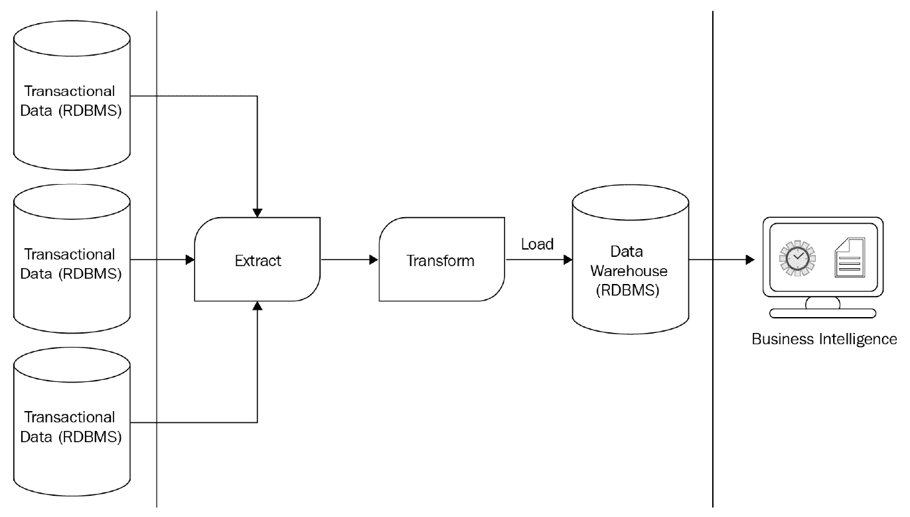

# 第十四章：数据湖仓

在本书中，您已经接触到了两种主要的数据分析用例：描述性分析（包括 BI 和 SQL 分析）和高级分析（包括数据科学和机器学习）。您了解到，作为统一数据分析平台的 Apache Spark，可以满足所有这些用例。由于 Apache Spark 是一个计算平台，它与数据存储无关，能够与任何传统存储机制（如数据库和数据仓库）以及现代分布式数据存储系统（如数据湖）协同工作。然而，传统的描述性分析工具，如 BI 工具，通常是围绕数据仓库设计的，且期望数据以特定方式呈现。现代的高级分析和数据科学工具则倾向于处理可以轻松访问的数据湖中的大量数据。将冗余数据存储在单独的存储系统中以满足这些独立用例，不仅不实际，而且成本效益较低。

本章将介绍一种新的范式——**数据湖仓**，它试图克服数据仓库和数据湖的局限性，通过结合两者的最佳元素来弥合这两者之间的差距。

本章将涵盖以下主题：

+   从 BI 到 AI 的转变

+   数据湖仓范式

+   数据湖仓的优势

本章结束时，您将了解现有数据存储架构（如数据仓库和数据湖）的关键挑战，以及数据湖仓如何帮助弥合这一差距。您将理解数据湖仓的核心要求和参考架构，并探讨一些现有的商业化数据湖仓及其局限性。最后，您将了解数据湖仓的参考架构，它利用 Apache Spark 和 Delta Lake，并学习它们的一些优势。

# 从 BI 到 AI 的转变

**商业智能**（**BI**）仍然是数据分析的核心。在 BI 中，组织从各种数据源收集原始事务数据，并通过 ETL 将其转换成一种有利于生成运营报告和企业仪表板的格式，这些报告和仪表板展示了过去一段时间内整个企业的运营情况。这也帮助企业高层做出有关未来战略的明智决策。然而，如果生成的事务数据量增加了几个数量级，那么很难（如果不是不可能的话）从中提取出相关且及时的洞察，帮助企业做出决策。此外，仅仅依赖结构化的事务数据进行业务决策也不再足够。如果你希望了解企业的当前状态、市场状况、客户和社会趋势以保持企业的相关性和盈利性，那么就需要考虑新的非结构化数据类型，例如以自然语言形式的客户反馈、客户服务中心的语音记录，以及产品和客户评论的视频和图像。因此，你必须从传统的 BI 和决策支持系统转变，并且用预测分析来补充运营报告和高层仪表板，甚至完全用**人工智能**（**AI**）替代**BI**。传统的 BI 和数据仓库工具在应对 AI 用例时完全失效。这个问题将在接下来的几节中详细探讨。

## 数据仓库的挑战

传统上，数据仓库一直是 BI 工具的主要数据来源。数据仓库期望数据按照预定义的架构进行转化和存储，这使得 BI 工具可以轻松地查询数据。BI 工具已经发展成能够利用数据仓库的优势，这使得处理过程变得非常高效且具有较好的性能。下图表示了**BI 和 DW**系统的典型参考架构：

图 14.1 – 商业智能（BI）和数据仓库（DW）架构

如前面的图所示，**BI 和 DW**系统从事务系统中提取原始事务数据，根据数据仓库定义的架构转化数据，然后将数据加载到数据仓库中。这个整个过程通常会定期执行，通常是每晚一次。现代的 ETL 和数据仓库系统已经发展到支持更频繁的数据加载，比如每小时一次。然而，这种方法存在一些关键的缺点，限制了这些系统真正支持现代 AI 用例。具体来说，以下几点：

+   传统数据仓库的计算和存储通常位于本地的单台服务器上。它们的容量通常为峰值负载进行规划，因为这些数据库的存储和计算能力与其运行的机器或服务器紧密相关。这使得它们的扩展性差，甚至无法扩展。这意味着传统的本地数据仓库的数据容量是固定的，无法处理大数据带来的快速数据涌入。这使得它们的架构显得僵化，无法适应未来的发展。

+   数据仓库的设计初衷是仅在特定时间间隔加载数据，几乎所有传统的数据仓库都没有设计成能够处理实时数据摄取。这意味着，基于这些数据仓库的分析师和企业高管通常只能处理过时的数据，从而延迟了决策过程。

+   最后，数据仓库基于关系型数据库，而关系型数据库无法处理视频、音频或自然语言等非结构化数据。这使得数据仓库无法扩展以支持数据科学、机器学习或人工智能等高级分析应用场景。

为了克服数据仓库上述的缺点，尤其是无法分离计算和存储，因此无法按需扩展，且处理实时和非结构化数据的能力较弱，企业转向了数据湖架构。这些架构最早由**Hadoop**生态系统引入。我们将在以下章节中详细探讨这一点。

## 数据湖的挑战

数据湖是低成本的存储系统，具有类似文件系统的 API，可以容纳任何形式的数据，无论是结构化还是非结构化数据，例如**Hadoop 分布式文件系统**（**HDFS**）。企业采用数据湖范式来解决计算与存储分离和可扩展性的问题。随着大数据和 Hadoop 的出现，第一个 HDFS 被采用，数据湖开始存储在像 Apache Parquet 和 ORC 这样的通用开放文件格式中。随着云计算的到来，像 Amazon S3、Microsoft Azure ADLS 和 Google Cloud Storage 这样的对象存储被采纳为数据湖。这些存储非常便宜，并且能够自动归档数据。

虽然数据湖具有高度的可扩展性，成本较低，并且能够支持多种数据和文件类型，但它们不符合 BI 工具严格的“写时模式”要求。因此，基于云的数据湖架构被补充了额外的一层云数据仓库，以专门支持 BI 应用场景。下图展示了云中典型决策支持系统的架构：

图 14.2 – 云中的数据湖架构

在上图中，我们可以看到一个典型的云端数据湖架构。首先，原始数据以原样、无任何转换的方式通过流式处理或其他时尚方式输入到数据湖中。然后，原始数据会被 ETL 处理，并重新放回数据湖，供下游的使用场景，如数据科学、机器学习和人工智能使用。对于 BI 和运营报告所需的部分数据，会进行清洗、整合并加载到基于云的数据仓库中，以供 BI 工具使用。这种架构解决了传统数据仓库的所有问题。数据湖具有无限的可扩展性，且完全独立于任何计算资源。这是因为计算资源仅在进行数据摄取、转换或消费时才需要。数据湖还可以处理各种数据类型，从结构化和半结构化数据到非结构化数据。

然而，数据湖架构确实存在一些关键挑战：

+   数据湖不具备内建的事务控制或数据质量检查功能，因此数据工程师需要在数据处理管道中编写额外的代码来执行事务控制。这有助于确保数据一致性，并保证数据具有适合下游使用的质量。

+   数据湖可以存储如 Parquet 和 ORC 这样的结构化文件数据；然而，传统的 BI 工具可能无法读取这些文件中的数据，因此必须引入另一个数据仓库层来满足这些用例。这增加了额外的复杂性，因为需要存在两条独立的数据处理管道——一条用于将数据 ELT 到用于高级分析的场景，另一条用于将数据 ETL 到数据仓库。这也增加了运营成本，因为数据存储几乎翻倍，并且需要管理两个独立的数据存储系统。

+   虽然原始数据可以流入数据仓库，但在原始数据经过 ETL（提取、转换、加载）处理并加载到数据仓库之前，它可能无法直接供下游的业务分析系统使用，从而导致业务用户和数据分析师看到的是陈旧的数据，延缓了他们的决策过程。

数据湖仓承诺克服传统数据仓库和现代数据湖所面临的挑战，帮助将两者的最佳特性带给最终用户。我们将在接下来的部分详细探讨数据湖仓模式。

# 数据湖仓模式

数据湖仓范式结合了数据仓库和数据湖的最佳方面。数据湖仓基于开放标准，实现了数据仓库的数据结构和数据管理特性。这种范式还利用数据湖的成本效益和可扩展的数据存储。通过结合数据仓库和数据湖的优点，数据湖仓同时满足数据分析师和数据科学家的需求，无需维护多个系统或冗余数据副本。数据湖仓帮助加速数据项目，团队可以在一个地方访问数据，无需访问多个系统。数据湖仓还提供访问最新数据的机会，这些数据完整且及时更新，可以用于商业智能、数据科学、机器学习和人工智能项目。虽然数据湖仓基于云端对象存储等数据湖，但它们需要遵守特定的要求，如下一节所述。

## 数据湖仓的关键要求

数据湖仓需要满足一些关键要求，以便提供数据仓库的结构和数据管理能力，以及数据湖的可伸缩性和处理非结构化数据的能力。以下是必须考虑的一些关键要求：

+   数据湖仓需要支持**ACID**事务，以确保 SQL 查询的数据读取。在数据湖仓中，多个数据管道可以同时写入和读取相同的数据集，事务支持保证数据读取者和写入者永远不会看到不一致的数据视图。

+   数据湖仓应该能够将计算与存储解耦，确保它们可以独立扩展。这不仅使数据湖仓更经济实惠，还有助于支持使用多个集群和非常大的数据集的并发用户。

+   数据湖仓需要基于开放标准。这允许各种工具、API 和库直接访问数据湖仓，并防止任何昂贵的供应商或数据锁定。

+   要支持结构化数据和数据模型，如数据仓库世界中的**Star/Snowflake**模式，数据湖仓必须支持模式强制执行和演进。数据湖仓应支持管理数据完整性、治理和审计的机制。

+   数据湖仓需要支持多种数据类型，包括结构化和非结构化数据类型，因为数据湖仓可用于存储、分析和处理各种数据，从文本、交易、物联网数据、自然语言到音频转录和视频文件。

+   需要支持传统的结构化数据分析，如商业智能（BI）和 SQL 分析，以及包括数据科学、机器学习和人工智能（AI）在内的高级分析工作负载。数据湖屋应能够通过支持**JDBC/ODBC**标准连接，直接支持 BI 和数据发现。

+   数据湖屋应能够支持端到端的流处理，从能够将实时数据直接摄取到数据湖屋，到数据的实时 ELT 和实时商业分析。数据湖屋还应支持实时机器学习和低延迟的机器学习推理。

现在您已经了解了数据湖屋的关键需求，让我们试着理解它的核心组件和参考架构。

## 数据湖屋架构

数据湖屋的功能，如可扩展性、处理非结构化数据的能力以及能够将存储和计算分离，得益于用于持久化存储的底层数据湖。然而，为了提供类似数据仓库的功能，仍然需要一些核心组件，比如**ACID**事务、索引、数据治理和审计以及其他数据级优化。可扩展的元数据层是其中一个核心组件。元数据层位于开放文件格式（如 Apache Parquet）之上，帮助跟踪文件和表格的版本以及像**ACID**事务这样的功能。元数据层还支持流数据摄取、架构强制和演化以及数据验证等功能。

基于这些核心组件，已经产生了一个参考数据湖屋架构，如下图所示：

图 14.3 – 数据湖屋架构

数据湖屋是建立在廉价的云存储基础上的，这些存储提供的吞吐量数据访问并不特别高。为了能够满足低延迟和高度并发的使用场景，数据湖屋需要通过数据跳跃索引、文件夹和文件级修剪等功能，提供快速的数据访问能力，并能够收集和存储表格和文件统计信息，帮助查询执行引擎推导出最优的查询执行计划。数据湖屋应具备高速数据缓存层，以加快对频繁访问数据的访问。

## 现有数据湖屋架构示例

一些市面上商业化的云服务产品在一定程度上（如果不是完全）满足了数据湖屋的需求。部分产品在本节中有列出。

**Amazon Athena** 是 AWS 提供的一项交互式查询服务，作为其托管服务的一部分。AWS 基于开源的可扩展查询引擎 Presto，允许你查询存储在 S3 桶中的数据。它支持由 Hive 支持的元数据层，并允许你创建表的模式定义。然而，像 Athena 这样的查询引擎无法解决数据湖和数据仓库的所有问题。它们仍然缺乏基本的数据管理功能，如 ACID 事务，以及性能提升功能，如索引和缓存。

基于云的商业数据仓库，如 Snowflake，紧随其后，因为它提供了传统数据仓库的所有功能，以及支持人工智能、机器学习和数据科学的更多高级功能。它将数据仓库、特定主题的数据集市和数据湖结合成一个单一的真实版本，能够支持多种工作负载，包括传统分析和高级分析。然而，Snowflake 不提供数据管理功能；数据存储在其存储系统中，并且对于存储在数据湖中的数据，它没有提供相同的功能。对于大规模机器学习项目，Snowflake 可能也不适用，因为数据需要被流式传输到数据湖中。

**Google BigQuery**，这款按 PB 级扩展的实时数据仓库解决方案，提供了几乎所有数据湖仓所需的功能。它支持同时的批处理和流处理工作负载，以及通过其 BigQuery ML 提供的 SQL 和类查询语言进行的机器学习工作负载，甚至支持 AutoML。然而，BigQuery 仍然要求数据以其内部格式存储，并且对于存储在数据湖中的外部数据，它没有提供所有增强查询性能的功能。在接下来的部分中，我们将探讨如何利用 Apache Spark、Delta Lake 和基于云的数据湖作为数据湖仓。

## 基于 Apache Spark 的数据湖仓架构

当 Apache Spark 与 Delta Lake 和基于云的数据湖结合时，几乎可以满足数据湖仓的所有需求。在本节中，我们将探讨这一点，并展示一个基于 Apache Spark 的参考架构。让我们开始吧：

+   Delta Lake 通过其事务日志，完全支持 ACID 事务，类似于传统数据仓库，以确保写入 Delta Lake 的数据是一致的，并且任何下游读取者永远不会读取脏数据。这也允许多个读取操作发生，并从多个 Spark 集群将数据写入同一数据集，而不会影响数据集的完整性。

+   Apache Spark 一直以来都不依赖于特定的数据存储，可以从各种数据源中读取数据，包括将数据读取到内存中以便处理，然后将结果写入持久存储。因此，当 Apache Spark 与分布式持久存储系统（如基于云的数据湖）结合时，完全支持存储和计算解耦。

+   Apache Spark 支持多种方式访问存储在 Delta Lake 中的数据，包括使用 Spark 的 Java、Scala、PySpark 和 SparkR API 进行直接访问。Apache Spark 还支持通过 Spark ThriftServer 进行 JDBC/ODBC 连接，便于与 BI 工具连接。Delta Lake 还支持用于 Apache Spark 外部连接的纯 Java API。

+   Delta Lake 通过其事务日志支持内置的元数据层。事务日志为 Delta Lake 提供了版本控制、表更改的审计跟踪和时间旅行功能，能够在不同版本的表之间进行切换，并能在特定时间点恢复表的任何快照。

+   Apache Spark 和 Delta Lake 都支持所有类型的结构化和非结构化数据。此外，Delta Lake 支持模式强制执行，并支持模式演化。

+   Apache Spark 支持通过结构化流处理进行实时分析，而 Delta Lake 完全支持批处理和流处理的并发执行。

因此，Apache Spark 与 Delta Lake 配合使用，同时依托云数据湖，支持内存数据缓存和性能提升特性，如数据跳跃索引和收集表与文件统计信息。这种组合使得数据湖仓成为一个很好的候选方案。

注意

Spark 结构化流处理仅支持基于微批次的流处理，不支持事件处理。此外，Apache Spark 和 Delta Lake 共同使 SQL 查询性能非常快。然而，Spark 固有的 JVM 调度延迟仍会引入相当大的查询处理时间差，这使其不适用于超低延迟查询。此外，Apache Spark 可以通过多个集群和调整某些 Spark 集群参数来支持并发用户，尽管这种复杂性需要用户进行管理。这些原因使得即使与 Delta Lake 一起使用，Apache Spark 也不适合用于非常高并发、超低延迟的应用场景。Databricks 开发了一个名为 Photon 的下一代查询处理引擎，可以克服开源 Spark 的这些问题。然而，Databricks 在撰写本文时尚未将 Photon 发布到开源 Apache Spark 中。

现在你已经看到 Apache Spark 和 Delta Lake 如何作为数据湖仓一起工作，接下来让我们看看这个参考架构的样子：

图 14.4 – 由 Apache Spark 和 Delta Lake 提供支持的数据湖仓

上述图示展示了使用 Apache Spark 和 Delta Lake 的数据湖屋架构。在这里，数据摄取可以通过结构化流处理（Structured Streaming）以实时或批量方式完成，也可以通过常规的 Spark 批处理作业，或使用一些第三方数据集成工具完成。来自各种来源的原始数据，如事务性数据库、物联网数据、点击流数据、服务器日志等，直接流入数据湖屋并以 Delta 文件格式存储。接着，这些原始数据会使用 Apache Spark DataFrame API 或 Spark SQL 进行转换。同样，这可以通过结构化流处理以批量或流式方式完成。表格元数据、索引和统计信息都由 Delta Lake 事务日志处理，Hive 可以作为元存储。商业智能（BI）和 SQL 分析工具可以通过 JDBC/ODBC 连接直接访问数据湖屋中的数据，高级分析工具和库也可以通过 Spark 集群使用 Spark SQL 或 DataFrame API 直接与湖中的数据交互。通过这种方式，Apache Spark 和 Delta Lake 在云中与对象存储作为数据湖结合，可以用于实现数据湖屋范式。现在我们已经实现了一个参考数据湖屋架构，接下来让我们了解其一些优势。

# 数据湖屋的优势

数据湖屋解决了使用数据仓库和数据湖时的多数挑战。使用数据湖屋的一些优势包括：减少由云中数据湖和数据仓库等双层系统引起的数据冗余。这意味着减少存储成本，并简化维护和数据治理，因为任何数据治理功能，如访问控制和审计日志，都可以在一个地方实现。这消除了在多个工具上管理数据治理的操作开销。

你应该将所有数据存储在一个单一的存储系统中，这样可以简化数据处理和 ETL 架构，这也意味着更容易维护和管理数据管道。数据工程师无需为不同的系统维护独立的代码库，这极大地减少了数据管道中的错误。此外，当数据问题被识别时，也更容易追踪数据的血缘关系并进行修复。

数据湖屋为数据分析师、企业高管和数据科学家提供了直接访问湖屋中最新数据的权限。这减少了他们对 IT 团队在数据访问方面的依赖，帮助他们做出及时且明智的决策。数据湖屋最终降低了总体拥有成本，因为它们消除了数据冗余、减少了操作开销，并且提供了具有高性能的数据处理和存储系统，相比于某些商业化的专业数据仓库，其成本大大降低。

尽管数据湖屋提供了诸多优势，但该技术仍处于初期阶段，因此可能会落后于一些已经有数十年研发背景的专用产品。随着技术的成熟，数据湖屋将变得更加高效，并能与更多常见的工作流和工具连接，同时保持简单易用且具有成本效益。

# 摘要

在本章中，您了解了数据仓库和数据湖在设计和实施处理大规模数据的系统时所面临的挑战。我们还探讨了企业从高级分析转向简单描述性分析的需求，以及现有系统如何无法同时解决这两者的问题。接着，介绍了数据湖屋的概念，它解决了数据仓库和数据湖的挑战，并通过结合两者的最佳元素弥合了这两种系统的差距。随后，展示了数据湖屋的参考架构，并介绍了几种现有商业化的大规模数据处理系统中可用的数据湖屋候选方案及其缺点。接下来，展示了基于 Apache Spark 的数据湖屋架构，它利用了 Delta Lake 和基于云的数据湖。最后，介绍了数据湖屋的一些优势，同时也提到了一些不足之处。
