# 第四章：3 配置 Python 与 Power BI

正如 *第二章，使用 Python 配置 R* 中所述，你必须安装 R 引擎才能与 Power BI 交互，同样，你也将需要在你的机器上安装 Python 引擎。你还将了解如何配置一些 IDE，以便在将 Python 代码用于 Power BI 之前，你可以舒适地开发和测试 Python 代码。因此，类似于我们在 *第二章，使用 Python 配置 R* 中已经看到的，本章将讨论以下主题：

+   可用的 Python 引擎

+   我应该安装哪个 Python 引擎？

+   安装 Python 开发环境的 IDE

+   配置 Power BI Desktop 以与 Python 一起工作

+   配置 Power BI 服务以与 Python 一起工作

+   Python 可视化的限制

## 技术要求

本章要求你拥有一个正常工作的互联网连接，并且你的机器上已经安装了 **Power BI Desktop**。本章的最后部分还要求你注册 Power BI 服务（这里有一个教程：[`bit.ly/signup-powerbiservice`](http://bit.ly/signup-powerbiservice))。一个 **Power BI 免费版** 许可证就足够测试本书中的所有代码，因为你将仅在个人 **工作区** 中共享报告。

## 可用的 Python 引擎

与 R 语言一样，你可以为 Python 安装几个发行版：**标准 Python**、**ActivePython**、**Anaconda** 等等。通常，“纯”开发者会从 [`www.python.org/`](https://www.python.org/) 下载 Python 引擎的最新版本，然后从 **Python 包索引**（**PyPI**）安装各种社区开发的、对他们的项目有用的包。其他供应商，如 ActiveState 和 Anaconda，会预先打包特定版本的 Python 引擎和一系列包，以加速项目的启动。虽然标准 Python 和 ActiveState 发行版更针对通用开发者，但 Anaconda 是数据科学家和与机器学习项目紧密合作的人士首选的发行版。反过来，Anaconda 本身也有两个不同的发行版：Anaconda 和 **Miniconda**。

Anaconda 发行版，包含超过 150 个内置包，可以被认为是数据科学家最佳的 DIY 超市，其中所有东西都已准备好并配置好以供使用。另一方面，Miniconda 发行版被认为是数据科学家寻求将资源削减到适当水平的最小必需工具箱。

但 Anaconda 和 Miniconda 有一个共同的基本工具：那就是**Conda**，它是 Python 最受欢迎的包管理器之一。Conda 为开发者提供了一个易于使用的系统来管理所谓的**虚拟环境**。虚拟环境，或简称**环境**，旨在封装一组特定版本的 Python 引擎和包的安装。目标是创建一个隔离的环境，通常与项目或任务相关联，可以保证**结果的再现性**。这是一个非常重要的概念，对于确保 Python 项目在处理一个由独立创建和维护自己包的开发者群体时能够顺利运行至关重要。

> **注意**
> 
> 与您在*第二章，使用 Power BI 配置 R*中看到的情况相反，Python 社区没有“时间机器”可以轻松引用发布日期的特定 Python 引擎版本以及 PyPI 包在那天版本的整个生态系统快照。您需要自己使用环境来构建自己的“时间胶囊”，以确保代码的可再现性。

Conda 是一个非常通用的工具。除了管理环境之外，它还可以安装各种包（无论使用的编程语言是什么，而不仅仅是 Python），并仔细管理它们的所有依赖关系。但官方推荐的从 PyPI 安装 Python 包的工具是**pip**，它只安装用 Python 编写的包，通常与 Python 引擎一起安装。

话虽如此，除了围绕 Python 引擎安装的“车身”之外，各种 Python 发行版并没有添加显著提高引擎性能的功能，这与我们在*第二章，使用 Power BI 配置 R*中看到的 Microsoft R 引擎不同。因此，我们不会详细介绍每个发行版安装的功能。

## 选择要安装的 Python 引擎

回到我们的场景，为了在 Power Query 或 Python 可视化中使用 Python 代码，您肯定需要以下内容：

+   一个 Python 引擎

+   包管理器，用于安装转换数据或适当可视化的所需的最小数量的包

为了选择最适合您需求的产品，您需要更详细地了解您的 Power BI 需求。

### Power BI 使用的 Python 引擎

正如 Power BI 服务中的 R 可视化一样，以下说明也适用于 Python 可视化。

> **重要说明**
> 
> Power BI 服务用于**Python 可视化**的 Python 引擎和包是预先安装在云上的，因此用户必须适应服务采用的版本。

如您所想，Power BI 服务采用的引擎版本略落后于最新发布版（现在为 3.9.1）。有关更多详细信息，请参阅以下说明。

> **重要说明**
> 
> 到目前为止，Power BI 服务在实现 Python 可视化时依赖于 **Python 3.7.7** 运行时。始终关注 Power BI 服务每次发布提供的 Python 引擎和包的版本非常重要，以确保要发布的报告能够正常工作。更多信息请参阅以下链接：[`bit.ly/powerbi-python-limits`](http://bit.ly/powerbi-python-limits)。

在 Power Query 中进行数据转换时，Power BI 服务的表现与我们已经看到的 R 脚本相同。

> **重要提示**
> 
> 在数据刷新阶段，Power BI 服务使用的 Python 引擎必须安装在任何您选择的机器上（服务之外），并且在该同一台机器上，您必须以 **个人模式** 安装 **本地数据网关**。请注意，即使要刷新的数据不通过网关流动，而是来自网关本身未引用的数据源，您也必须使用外部引擎。

只要通过数据网关引用的 Python 环境是基本环境，只要两者都安装在同一台机器上就足够了。否则，以下注意事项适用。

> **重要提示**
> 
> 如果您需要在使用机器上的 Power Query 转换中使用多个已安装的环境，您还必须安装 **Power BI Desktop**。它允许您通过其选项切换数据网关的路由到所选环境，更新位于 `C:\Users\<your-username>\AppData\Local\PowerBIScripting\PythonSettings.xml` 的配置文件。此文件允许覆盖数据网关默认引用的 Python 环境。

简而言之，无论您是想运行 R 脚本还是 Python 脚本，Power BI Desktop 和 Power BI 服务所需的基础设施都以相同的方式进行管理。因此，再次强调，如果您需要为个人桌面上的使用生成报告，您对使用的 Python 引擎没有限制，因此您可以安装最适合您的 Python 版本和包。另一方面，如果您事先知道您将创建的报告将包含 Python 可视化并打算在 Power BI 服务上与同事共享，那么对版本和预先安装在服务中的包都有严格的限制。

但让我们言归正传，开始安装 Python 相关内容！

### 安装建议的 Python 引擎

在长期管理嵌入报告中的 Python 脚本的依赖关系可能会变得复杂。考虑到在同一台机器上可以创建多个环境，我们建议以下技巧。

> **技巧**
> 
> 我们建议您**专门为 Power BI 报告使用的 Python 引擎分配一台机器**。我们的建议是为在 Power Query 中开发 Python 脚本或为 Python 可视化可能出现的每个需求创建一个 Python 环境。如果您已经为运行 R 脚本准备了一台专用机器，如*第二章，使用 Power BI 配置 R*中所示，那么您也可以使用同一台机器来安装 Python 引擎。请记住，在这种情况下，您需要确保机器的资源足够运行所有引擎，并满足来自各个报告的各种请求。

让我们先安装最新版本的 Python 引擎，用于数据转换。

#### 数据转换的 Python 引擎

当然，为了使用 Python 丰富您的报告，您不需要 150 个预安装的包。此外，为了轻松管理您的环境，Conda 是您应该包括在您的工具箱中的工具。考虑到我们即将安装的引擎将被 Power BI 服务用作外部 Python 引擎，通过 Power Query 在本地数据网关以个人模式转换数据，以下提示适用。

> **提示**
> 
> 我们建议采用最新版本的**Miniconda**作为默认发行版。这是因为，除了预安装非常少的包，让您有机会选择要安装的包之外，它还包括了 Conda 在发行版中。

Miniconda 的安装非常简单：

1.  前往[`docs.conda.io/en/latest/miniconda.html`](https://docs.conda.io/en/latest/miniconda.html)。

1.  点击您操作系统可用的最新版本（截至写作时间为 3.8）：

    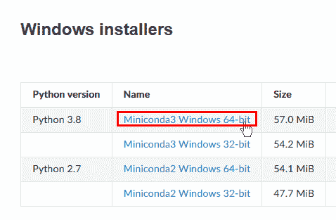

    图 3.1 – 下载 Miniconda 的最新版本

1.  文件下载完成后，双击它，在弹出的欢迎窗口中点击**下一步**，然后点击**我同意**以接受许可协议。

1.  在下一个窗口中，您将被询问是否要为仅您或所有用户安装 Miniconda。保留默认设置（仅为您）并点击**下一步**。

1.  在下一屏上保留安装的默认文件夹，并点击**下一步**。请记住，安装路径是这样的形式：`C:\Users\<你的用户名>\miniconda3`。

1.  在下一个窗口中，勾选**将 Miniconda3 注册为我的默认 Python 3.8**并点击**安装**：

    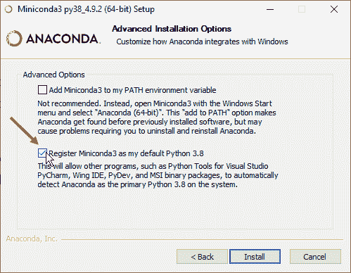

    图 3.2 – 将 Miniconda 设置为默认 Python 3.8 引擎

1.  安装结束时，一个**安装完成**窗口会通知您安装已成功完成。然后，点击**下一步**。

1.  最后一屏为您提供打开包含提示和资源的文档的可能性，以开始使用 Miniconda。您可以取消选中两个选项，然后点击**完成**。

就这些了！现在你可以使用 Miniconda 编写和运行你的 Python 代码了。

> **重要提示**
> 
> 通常，你开发报告的 Power BI Desktop 安装位于与选定的 Power BI 服务 Python 引擎机器不同的机器上，其中数据网关也经常安装。在这种情况下，你必须在安装 Power BI Desktop 的机器上安装 Miniconda。

安装完成后，在开始菜单中的 **Anaconda3 (64-bit)** 文件夹下，你会找到两个命令行界面（标准 **命令提示符** 和 **PowerShell**）的快捷方式，这确保了你可以在后台激活 **Conda** 并与 Miniconda 提供的工具交互：

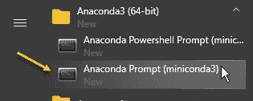

图 3.3 – 与 Miniconda 交互的有用 Anaconda 提示

我们最喜欢的命令行是 **Anaconda Prompt**，我们很快就会向你展示如何使用它。

如我们在 *可用的 Python 引擎* 部分所述，**conda** 和 **pip** 都是很好的包管理器。作为包依赖关系求解器，conda 更好，尽管比 pip 略慢。但 pip 常用作包管理器的原因是它直接从 PyPI 拉取包，PyPI 是一个比 Anaconda 的更完整的仓库。出于同样的原因，*我们将使用 pip 作为我们的默认包管理器*。

#### 创建用于数据转换的环境

与你看到的 R 引擎不同，对于 R 引擎，已经安装了两个不同版本的独立引擎，在 Python 的情况下，安装是唯一的，*只有环境会变化*。

在这里，我们将创建一个专门用于数据转换的环境，并包含 Miniconda 提供的最新版本的 Python 和少量对进行首次转换至关重要的包。

首先，你必须找到你刚刚安装的分布中存在的最新版本的 Python：

1.  如前所述，从开始菜单打开 Anaconda Prompt。

1.  如果提示符中的字体很小，只需右键单击其标题栏，选择 **选项**，然后在 **字体** 选项卡中更改你喜欢的字体。首先要注意的是当前路径前的单词 **(base)**。路径前的字符串表示 *当前环境的名称*。**base** 环境是在 Miniconda 分发安装期间创建的默认环境。

1.  输入 `conda search python` 命令并按 *Enter*。

1.  你将看到可用的 Python 版本列表：

    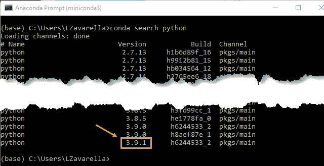

    图 3.4 – 所有可用的 Python 版本列表

    我们案例中可用的最新版本是 **3.9.1**。

一旦我们找到了可用的最新版本的 Python，我们就可以创建我们的环境，该环境专门用于 Power Query 中的数据转换，我们将称之为 `pbi_powerquery_env`：

1.  输入以下命令以创建一个名为`pbi_powerquery_env`并包含 Python 版本`3.9.1`的新环境：

    ```py
    conda create --name pbi_powerquery_env python==3.9.1
    ```

    如果您使用的是`=3.9`（单个`=`）而不是`==3.9.1`，您将实现相同的效果，让 conda 找到最新的微版本。

1.  Anaconda Prompt 将要求您安装创建环境所需的某些包。在`Proceed ([y]/n)?`提示下，输入`y`并按*Enter*键。

当包安装完成时，您仍然会看到**(base)**作为提示前缀：

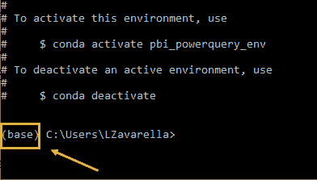

图 3.5 – 创建新环境后，您仍然在旧的环境中，名为“base”

这意味着您仍然在基础环境中。您确定您正确创建了新环境吗？让我们检查一下：

1.  通过输入`conda env list`命令尝试列出系统上现有的环境：

    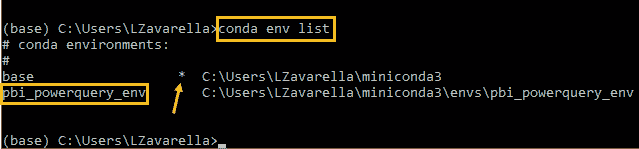

    图 3.6 – 系统中 conda 环境的列表

    幸运的是，新环境被列出来了，但它不是活动环境。活动环境由一个星号标识。

1.  为了在新建的环境中安装我们的包，您必须首先使用`conda activate pbi_powerquery_env`命令**激活**它：

    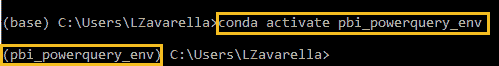

    图 3.7 – 激活新环境

    现在您的提示前缀正确地表明您已进入您的新环境。

1.  为了安全起见，使用`python --version`命令检查新环境中的 Python 版本是否如您预期：

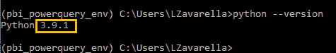

图 3.8 – 检查新环境中安装的 Python 版本

您已进入您的新环境，Python 已正确安装！您现在可以开始安装您稍后需要的某些包。要安装的包如下：

+   **NumPy**：Python 中用于处理数组和线性代数、傅里叶变换和矩阵函数的最广泛使用的库。

+   **SciPy**：用于解决科学和数学问题；它基于 NumPy 扩展，并允许用户操作和可视化数据。

+   **Pandas**：一个 Python 包，提供快速、灵活和表达式的表格、多维和时间序列数据。

+   **Requests**：允许您极其容易地发送 HTTP 请求。

+   **BeautifulSoup**：一个库，使从网页中抓取信息变得容易。

+   **PyYAML**：允许您轻松地读取和写入 YAML 文件。

在下一节中，您将使用前面列表中的最后三个包，在那里您将隐式地使用网络爬取程序！

但让我们回到正题，通过`pip`安装每个包：

1.  输入以下命令安装**NumPy**：`pip install numpy`。

1.  输入以下命令安装 **SciPy**：`pip install scipy`。

1.  输入以下命令安装 **Pandas**：`pip install pandas`。

1.  输入以下命令安装 **Requests**：`pip install requests`。

1.  输入以下命令安装 **BeautifulSoup**：`pip install beautifulsoup4`。

1.  输入以下命令安装 **PyYAML**：`pip install pyyaml`。

1.  使用 `conda list` 命令检查所有包是否已正确安装：

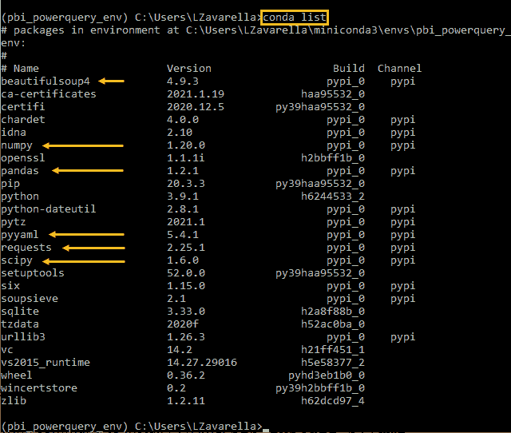

图 3.9 – 检查所有选定的 Python 包是否已安装

太棒了！您的新环境现在已正确配置。现在让我们为 Power BI 服务上的 Python 视觉效果配置另一个环境。

#### 在 Power BI 服务上创建 Python 视觉效果的环境

如前所述，Power BI 服务上发布的 Python 视觉脚本在云上预安装的 Python 引擎上运行，其版本可能会随着 Power BI 服务本身的更新而变化。如果您需要与同事共享包含 Python 视觉效果的报告，您需要确保您的 Python 代码在预安装的引擎上正确运行。

> **提示**
> 
> 我们强烈建议您在您的机器上也安装 Power BI 服务用于 Python 视觉效果的 **相同版本** 的 Python。

请记住，如果您使用 Python 视觉效果的报告不用于共享，并且您仅通过 Power BI Desktop 使用它们，那么这些限制将不会存在。在这种情况下，是您机器上的引擎被视觉效果使用。

要创建新环境，您必须检查 Power BI 服务支持的 Python 和允许的包的版本。您可以通过此链接检查这些要求：[`bit.ly/powerbi-python-limits`](http://bit.ly/powerbi-python-limits)。如您所见，截至目前，支持的 Python 版本是 3.7.7：


图 3.10 – Power BI 服务上用于视觉效果的 Python 版本

此外，截至目前，允许的包仅限于以下这些：

+   `matplotlib 3.2.1`

+   `numpy 1.18.4`

+   `pandas 1.0.1`

+   `scikit-learn 0.23.0`

+   `scipy 1.4.1`

+   `seaborn 0.10.1`

+   `statsmodels 0.11.1`

+   `xgboost 1.1.0`

最引人注目的是，与 Power BI 服务提供的 R 包相比，Python 包的数量要少得多（8 个 Python 包与 900 多个 R 包相比！）。这种明显的包可用性不平衡主要归因于两个原因：

+   **Python** 相比 R（2019 年 2 月引入）较晚被引入，因此引入的 Python 包主要是那些用于数据转换和可视化的基本包。

+   **R** 是一种主要用于数据分析的语言，这一点立即就很明显，因为它提供了各种用于科学可视化的包。另一方面，**Python** 是一种通用编程语言，也可以用于数据分析。

> **提示**
> 
> 由于 Power BI 服务支持的 Python 包数量很少，我们建议创建一个专门的环境来运行 Power BI 服务上的 Python 脚本，直接**安装所有当前允许的包**。

请记住，不安装一些默认包就无法正确运行 Python 可视化。请参阅以下说明。

> **重要提示**
> 
> 为了正确运行 Python 可视化，无论您是在 Power BI Desktop 上还是在 Power BI 服务上运行，都必须安装 **pandas** 和 **Matplotlib** 软件包。

话虽如此，您已经可以继续创建另一个环境，满足上述版本规格，并遵循创建先前环境时使用的步骤。尽管 Power BI 服务引擎更新不频繁，但这项手动任务仍然很繁琐。不幸的是，没有现成的“快照”可以即时安装以重现环境，正如您在 R 引擎案例中看到的那样。

> **提示**
> 
> 为了避免不必要的手动工作，我们创建了一个 Python 脚本，该脚本可以**抓取 Power BI 服务上包含 Python 引擎要求的网页**，并自动生成用于创建新环境的 **YAML 文件**。

**YAML**（由某个使用递归缩写词 **YAML Ain't Markup Language** 的有趣人物定义）是一种用于序列化数据（它与 JSON 有点竞争关系）且可读性强的语言。它通常用于序列化计算机系统配置文件的内容。

在我们的情况下，一个 YAML 文件帮助我们收集创建新环境所需的所有规格。我们之所以考虑使用 YAML 文件，是因为 `conda` 也允许使用 YAML 文件作为参数来创建环境。我们将要创建的新环境，我们将称之为 `pbi_visuals_env`，应该具备以下特性：

+   Python 引擎版本 3.7.7

+   pip 软件包管理器

+   所有之前看到的 8 个包，每个都安装到所需的版本，使用 pip 安装

前述要求可以总结如下 YAML 文件：

```py
name: pbi_visuals_env
dependencies:
  - python==3.7.7
  - pip
  - pip:
    - matplotlib==3.2.1
    - numpy==1.18.4
    - pandas==1.0.1
    - scikit-learn==0.23.0
    - scipy==1.4.1
    - seaborn==0.10.1
    - statsmodels==0.11.1
    - xgboost==1.1.0
```

因此，让我们使用我们的 Python 脚本生成 YAML 文件，如下所示：

1.  打开您的 **Anaconda Prompt**（如果您之前没有关闭它，它应该仍然打开），确保 `pbi_powerquery_env` 是激活的环境。如果不是，请使用 `conda activate pbi_powerquery_env` 命令激活它。

1.  您的当前路径应该是 `C:/Users/<your-username>` 的形式。在我的情况下，我有以下内容：

    

    图 3.11 – 我们默认的 Anaconda Prompt 路径

    如果没有，请使用以下命令转到您的用户名文件夹：`cd C:/Users/<your-username>`。

1.  让我们使用 `md py-environments` 命令创建一个名为 `py-environments` 的新文件夹（这将包含用于网络爬取的 Python 脚本以及 YAML 文件）。

1.  现在，前往书籍的 GitHub 仓库 [`github.com/PacktPublishing/Extending-Power-BI-with-Python-and-R`](https://github.com/PacktPublishing/Extending-Power-BI-with-Python-and-R)。

1.  如果你已经下载了整个仓库的 `.zip` 文件并在你的硬盘上解压，你将在 `Chapter03` 文件夹中找到我们感兴趣的 Python 脚本文件，文件名为 `01-create-pbi-service-py-packages-env-yaml-file.py`。

1.  如果你还没有下载整个仓库，请点击前一个链接页面右上角的 **Code**，然后点击 **Download ZIP**：

    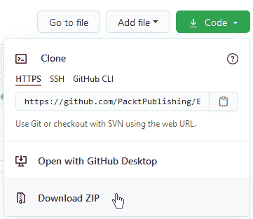

    图 3.12 – 下载整个压缩仓库

    解压后，你会在 `Chapter03` 文件夹中找到我们需要的文件。

1.  现在将文件 `01-create-pbi-service-py-packages-env-yaml-file.py` 复制到 `C:/Users/<your-username>/py-environments` 文件夹中，使用文件资源管理器完成此操作。

1.  返回 Anaconda Prompt 并使用此命令将当前文件夹更改为 `py-environment`：`cd py-environment`。

1.  现在，你可以最终运行这个网络爬取并生成 YAML 文件的 Python 脚本，使用以下命令：`python 01-create-pbi-service-py-packages-env-yaml-file.py`。你将在提示符中看到 YAML 文件的内容，如下所示：

    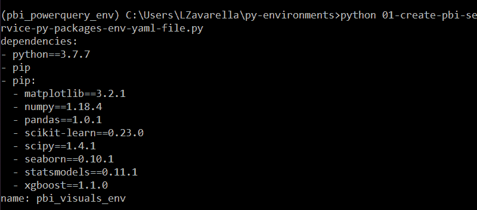

    图 3.13 – 执行 Python 脚本以创建 YAML 文件

    你也可以通过再次查看 `C:/Users/<your-username>/py-environments` 文件夹的内容来验证 YAML 文件是否正确生成：

    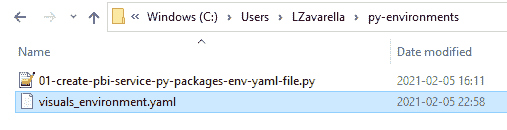

    图 3.14 – 正确创建的 YAML 文件

1.  在此阶段，我们可以直接使用以下命令创建新环境：`conda env create -f visuals_environment.yaml`。

1.  当 Python 和包的安装都完成后，使用以下命令激活新创建的环境：`conda activate pbi_visuals_env`。

1.  然后通过输入 `python –version` 命令检查 Python 版本是否与 YAML 文件中定义的此环境版本一致。你应该会看到以下输出：

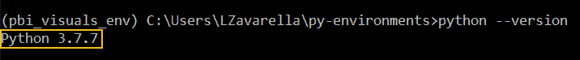

图 3.15 – 新环境包含正确的 Python 版本

太棒了！你终于创建了一个新环境，这个环境将在你为 Power BI 服务发布 Python 可视化时派上用场。如果你对详细了解之前的 Python 脚本是如何捕获创建环境所需的所有信息感兴趣，你可以在任何代码编辑器中打开它，并阅读代码上的详细注释。

#### 当 Power BI 服务升级 Python 引擎时该怎么做

正如我们在 *第二章，配置 R 与 Power BI* 中所做的那样，让我们假设您已经使用之前创建的新环境开发和发布了包含 Python 可视化的报告。假设微软决定升级 Power BI 服务支持的 Python 版本，以及相应地升级当前支持的包版本。正如您可能已经猜到的，这些更新可能会使代码失败（这是一个罕见的事件，因为通常向后兼容性是有保证的）。

> **提示**
> 
> 在这种情况下，通常更方便的是在 Python 脚本中**即时创建一个新环境**，以适应微软更新的要求。接下来，您需要**在 Power BI Desktop 上包含 Python 可视化的服务中进行测试报告**，确保它引用了新创建的环境。您需要修复那些 Python 可视化中存在的任何代码问题，之后您可以将这些报告重新发布到 Power BI 服务。

一旦您确认所有报告都运行正常，您就可以决定是否要卸载“旧”环境以释放磁盘空间并避免在处理这些特定报告时产生混淆。

在这一点上，我们可以继续配置和安装一些便于 Python 脚本开发的 IDE。

## 安装 Python 开发 IDE

在 *第二章，配置 R 与 Power BI* 中，您安装了 RStudio 以方便地开发您自己的 R 脚本。您知道吗？从版本 1.4 开始，您可以直接在 RStudio 中编写和运行 Python 代码，利用高级工具来查看实例化的 Python 对象。

让我们看看如何配置您的 RStudio 安装以运行 Python 代码。

### 使用 RStudio 配置 Python

为了允许 RStudio 与 Python 世界进行通信，您需要安装一个名为 **reticulate** 的包，该包包含了一组用于 Python 和 R 之间互操作性的工具，这是由于 R 会话中嵌入的 Python 会话。之后，在 RStudio 中配置 Python 就变得非常简单。让我们看看如何操作：

1.  打开 RStudio 并确保引用的引擎是最新版本，在我们的例子中是 **MRO 4.0.2**。正如在 *第二章，配置 R 与 Power BI* 中所见，您可以通过访问 **工具** 菜单然后 **全局选项...** 来在 RStudio 中设置您的 R 引擎。

1.  让我们通过在命令行界面中输入`getOption("repos")`来检查当前快照被冻结的日期：

    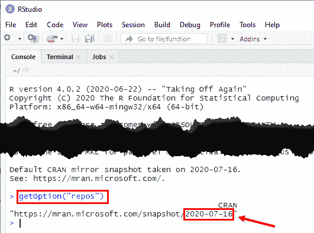

    图 3.16 – 使用 MRO 4.0.2 的当前快照日期

    如您所见，快照日期并不十分近期。

1.  由于安装最新 R 引擎的目标是使用最新包来开发代码，我们可以通过覆盖包仓库 URL 来移除快照限制。你可以通过创建一个新的 R 脚本，点击左上角的绿色 **+** 图标，然后选择 **R Script** 来完成此操作：

    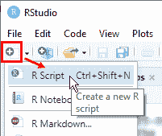

    图 3.17 – 将仓库 URL 重置为 CRAN 镜像

1.  然后，将以下脚本复制到 RStudio 添加的新脚本选项卡中：

    ```py
    local({
      r <- getOption("repos")
      r["CRAN"] <- https://cloud.r-project.org/
      options(repos = r)
     })
    ```

    现在，只需高亮显示脚本，然后在右上角点击 **Run**：

    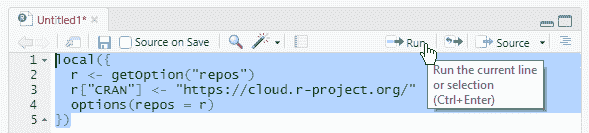

    图 3.18 – 在 RStudio 中运行你的第一个 R 脚本

1.  如果你现在去底部的控制台，再次输入 `getOption("repos")`，你会看到更新的仓库 URL：

    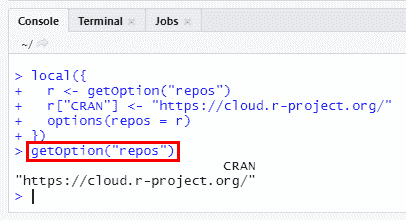

    图 3.19 – 包仓库已更新

    现在，你肯定能始终安装 CRAN 上的最新版本的包。

1.  现在，你可以通过点击 RStudio 右下角的 **Packages** 选项卡，然后点击 **Install**，在文本框中输入 `reticulate` 字符串，并最终点击 **Install** 按钮来安装 reticulate 包：

    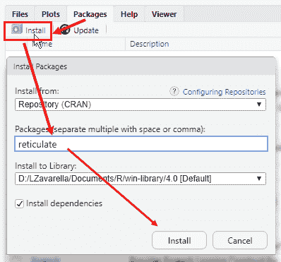

    图 3.20 – 安装 reticulate 包

1.  之后，转到 **Tools** 菜单，然后选择 **Global Options…**。在弹出的 **Options** 窗口中，点击 **Python**，然后点击 **Select…** 来选择你的 Python 解释器可执行文件。请注意，你将有多少个可执行文件，就有多少个环境你创建了：

    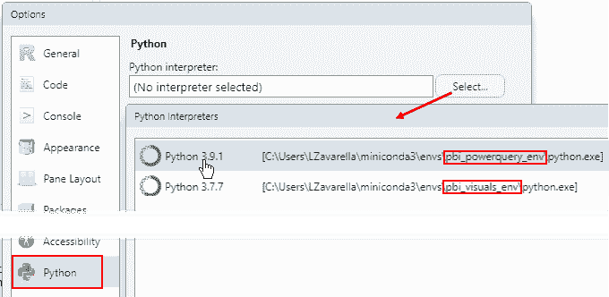

    图 3.21 – 在 RStudio 中设置你的首选 Python 解释器

1.  选择最新版本的 Python 解释器（在我们的例子中是 3.9.1）。你将被要求重新启动当前的 R 会话。选择 **Yes**。

1.  现在，你可以通过点击左上角的绿色 **+** 图标，然后选择 **Python Script** 来打开一个新的 Python 脚本文件：

    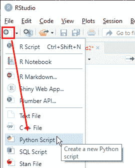

    图 3.22 – 在 RStudio 中创建一个新的 Python 脚本

1.  在新的脚本文件中编写代码 `a = [1, 2]`，将其高亮显示，然后点击右上角的 **Run** 图标：

    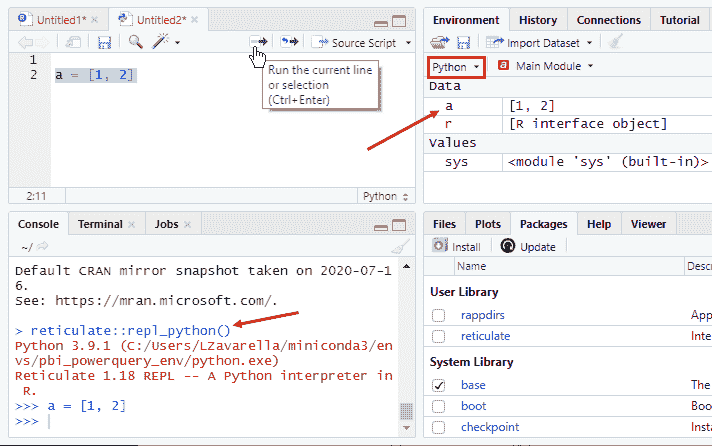

    图 3.23 – 在 RStudio 中运行你的第一个 Python 脚本

    你可以从控制台看到，RStudio 在幕后使用 reticulate。此外，在右上角的面板中，你可以检查代码执行后创建的 Python 变量。

太好了！你已经成功配置了 RStudio 来运行你的 Python 代码。

### 使用 Visual Studio Code 配置 Python

如果您是 R 语言爱好者，那么您可能会更喜欢在 RStudio 上运行 R 和 Python 代码。然而，如果您有真正的*Pythonista*精神，那么您一定会喜欢使用最近备受追捧的其中一个高级编辑器：**Visual Studio Code**（**VSCode**）。让我们来安装和配置它！

1.  通过点击**下载 Windows 版**按钮，从此链接([`code.visualstudio.com/`](https://code.visualstudio.com/))下载 VSCode。

1.  运行可执行文件，当它询问是否继续使用用户安装程序时点击**确定**。

1.  接受协议并在下一个窗口上点击**下一步**。

1.  然后保持默认目标文件夹并点击**下一步**。

1.  还要在下一个窗口中保持默认的启动菜单文件夹并点击**下一步**。

1.  在**附加任务**窗口中，选择您喜欢的任务并点击**下一步**。

1.  在摘要窗口上点击**安装**。

1.  安装完成后，保持**启动 Visual Studio Code**复选框选中，并点击**完成**。

1.  VSCode 启动后，点击左侧的**扩展**图标，然后开始输入`python`字符串并点击**Python**扩展：

    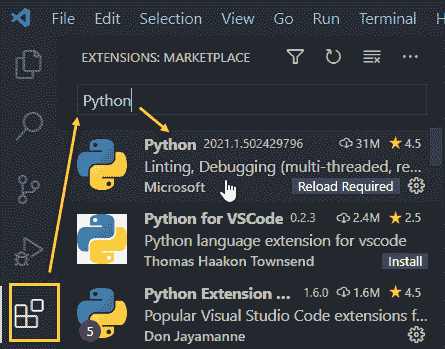

    图 3.24 – 在 RStudio 中运行您的第一个 Python 脚本

1.  在扩展的主面板上的欢迎页面上点击**安装**。

1.  现在转到顶部的**文件**菜单并点击**打开文件夹…**。

1.  从**打开文件夹**窗口中创建一个名为**Hello**的新测试文件夹，然后选择该文件夹：

    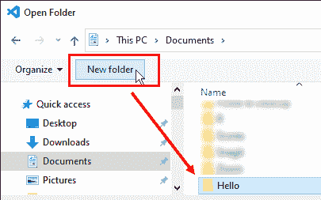

    图 3.25 – 在打开文件夹窗口中创建新文件夹并选择它

1.  现在您必须通过使用*Ctrl* + *Shift* + *P*访问**命令面板**来选择 Python 解释器。然后开始输入`interpreter`字符串并点击**Python：选择解释器**：

    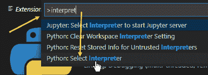

    图 3.26 – 在命令面板中选择 Python：选择解释器选项

1.  您将被提示选择您机器上实际拥有的其中一个环境。选择**pbi_powerquery_env**环境：

    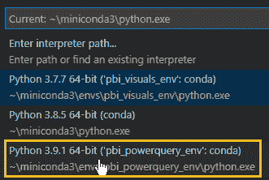

    图 3.27 – 选择您首选的环境

1.  您可以在左侧的状态栏上看到所选环境：

    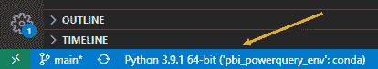

    图 3.28 – 在状态栏上检查所选环境

1.  返回左侧的资源管理器面板中的**HELLO**文件夹。点击**HELLO**标签旁边的**新建文件**图标，并将新文件命名为`hello.py`：

    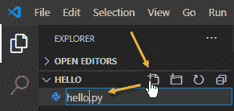

    图 3.29 – 在 Hello 文件夹中创建一个名为 hello.py 的新文件

1.  在新文件中输入以下代码：

    ```py
    msg = "Hello World"
    print(msg)
    ```

    然后在主面板右上角点击**运行**图标（绿色的三角形）：

    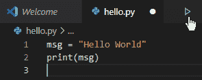

    图 3.30 – 输入示例代码并运行

1.  您可以在以下终端输出中看到结果：

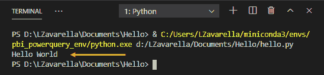

图 3.31 – 在 VSCode 中运行您的第一个 Python 脚本

很好！您的 VSCode 现在已正确配置，可以运行 Python 脚本。

## 配置 Power BI 桌面版以与 Python 协同工作

由于您已经安装了所有必需的组件，您现在可以配置 Power BI 桌面版以与 Python 引擎和 IDE 交互。这实际上是一个非常简单的任务：

1.  在 Power BI 桌面版中，转到**文件**菜单，点击**选项和设置**选项卡，然后点击**选项**：

    

    图 3.32 – 打开 Power BI 桌面版的选项和设置窗口

1.  在**选项**窗口中，点击左侧的**Python 脚本**链接。右侧面板的内容将更新，您可以选择要引用的 Python 环境和用于 Python 可视化的 Python IDE。默认情况下，检测到的解释器是由 Miniconda 安装的默认解释器。为了选择特定的环境，您需要选择**其他**，然后点击**浏览**并提供对环境文件夹的引用：

    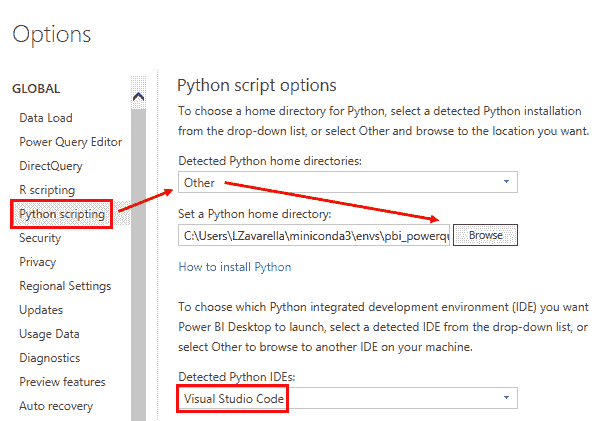

    图 3.33 – 在 Power BI 中配置您的 Python 环境和 IDE

    通常，您可以在`C:\Users\<your-username>\miniconda3\envs\`中找到默认的环境文件夹。然后选择您的`pbi_powerquery_env`子文件夹。

1.  默认情况下，Power BI 将 VSCode 识别为 Python IDE。保持原样并点击**确定**。

当我们在第十二章“探索性数据分析”中介绍 R 和 Python 脚本可视化时，您将看到如何从 Power BI 桌面版与 IDE 交互。

## 配置 Power BI 服务以与 R 协同工作

如您在第二章“配置 Power BI 中的 R”中所学，为了允许 Power BI 服务在数据转换步骤中使用 R 和 Power Query，您必须在安装了 R 引擎的外部机器上安装**本地数据网关**，并设置为**个人模式**。同样，Power BI 服务中的 Power Query 使用 Python 也是如此。因此，如果您尚未安装本地数据网关，请按照第二章中的步骤进行安装。

> **重要提示**
> 
> Python 引擎和 R 引擎可以**安装在同一外部机器**上，并且可以通过单个数据网关**引用**。然而，您必须确保机器的资源足以处理来自 Power BI 服务的请求负载。

### 在 Power BI 服务中共享使用 Python 脚本的报告

关于如何在 Power BI 服务中使用 R 脚本进行数据转换的说明，在 *第二章，配置 Power BI 中的 R* 中提到，也适用于使用 Python 脚本的报告。以下是一些总结性的提示。

> **提示**
> 
> 你可以使用一个非官方架构，该架构利用一个与物理人无关，而是与一个 *虚构的“服务”用户* 关联的个人数据网关。此用户的凭证在所有使用 Python（以及 R）代码将数据转换到其报告中的分析师之间共享。此外，由于网关引用的 Python 引擎所在的机器是共享的，因此必须在计划活动期间保持开启。同一台机器通常也托管 R 引擎。在这个架构中，经常使用一个 *Azure Windows 虚拟机*，在该虚拟机上运行 R 和 Python 引擎以及数据网关。

作为提醒，*图 3.34* 总结了上述架构：

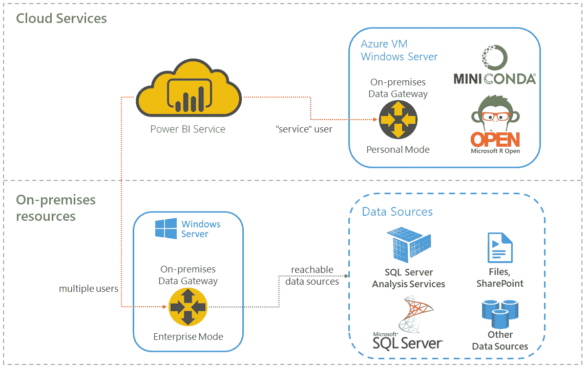

图 3.34 – 在数据转换中使用 Python 和 R 的企业架构

多亏了这种架构，才使得一组分析师能够使用 Python 脚本在他们的报告中，尽管个人模式下的本地数据网关施加了限制。

话虽如此，除了 Power Query 中 Python 脚本的限制之外，还有一些对于 Python 可视化也很重要的限制需要注意。

## Python 可视化的限制

Python 可视化在处理数据方面有一些重要的限制，包括输入和输出：

+   Python 可视化可以处理 *只有 150,000 行的数据框*。如果行数超过 150,000，则只使用前 150,000 行。

+   Python 可视化有一个 *输出大小限制为 2MB*。

你还必须小心不要超过 Python 可视化的 *5 分钟运行时计算*，以避免超时错误。此外，为了避免性能问题，*Python 可视化图表的分辨率固定为 72 DPI*。

如你所想，Python 可视化的某些限制取决于你是在 Power BI Desktop 还是 Power BI 服务上运行该可视化。

在使用 *Power BI Desktop* 创建报告时，你可以执行以下操作：

+   在你的 Python 可视化引擎中安装任何类型的包（PyPI 和自定义）。

+   从 Python 可视化访问互联网。

在 *Power BI 服务* 中创建报告时，你可以执行以下操作：

+   你只能使用此链接中列出的 PyPI 包：[`bit.ly/powerbi-python-limits`](https://bit.ly/powerbi-python-limits)。

+   你不能从 Python 可视化访问互联网。

> **重要提示**
> 
> 与 R 可视化的情况相反，你 **没有** 开发自定义 Python 可视化的选项。

一旦你的报告在 Power BI 服务上发布，你可以选择通过“发布到网络”选项将其分享到你的博客、你的网站之一或社交媒体上。不幸的是，根据微软的设计，Python 可视化（以及 R 可视化）*在公开发布到网络上的报告中不可用*。

> **提示**
> 
> 如果你绝对需要将特定的可视化发布到网络上，请记住，*自定义 R 可视化*可以克服发布到网络上的限制。因此，你需要从 Python 切换到 R。

## 摘要

在本章中，你了解了社区中最受欢迎的免费 Python 发行版及其使用最佳实践。

通过使用 Power BI Desktop 和 Power BI 服务的独特功能，你学习了如何正确创建特定的 Python 环境。

你还了解到在 R 社区中最受欢迎的 IDE（RStudio）也可以运行 Python 代码。此外，你已安装并配置了 VSCode，这是迄今为止最广泛使用的 Python 高级编辑器之一。

你还了解了在开发或企业环境中使用 Python 正确配置 Power BI Desktop 和 Power BI 服务的最佳实践。

最后，你了解了一些使用 Python 与 Power BI 相关的限制，这些知识对于避免在开发和部署报告时犯错误至关重要。

在下一章中，我们将最终开始使用 Power BI 中的 R 和 Python 脚本，进行数据摄取和数据转换。
