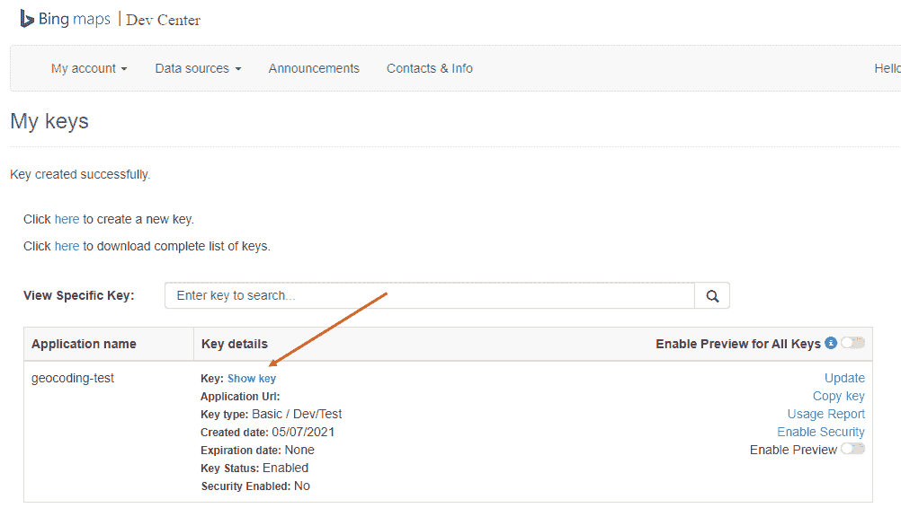
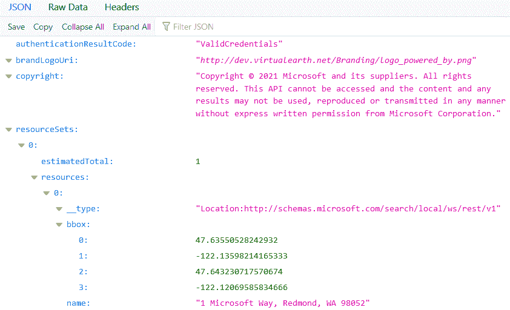
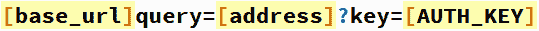
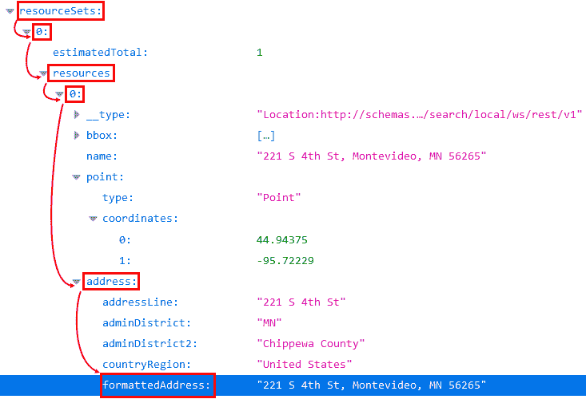
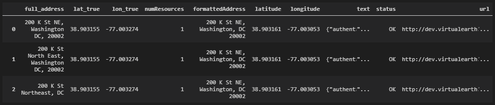
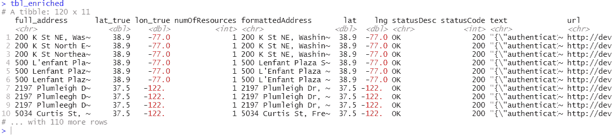
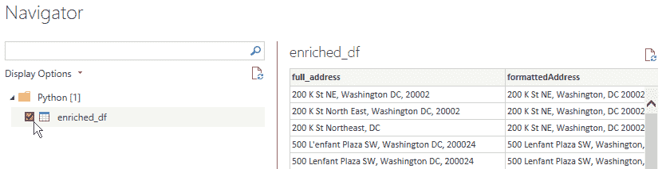
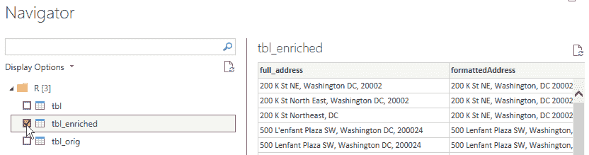

# 第十章：9 调用外部 API 以丰富您的数据

在上一章中，您看到了如何使用外部信息丰富您已有的数据的示例。在那个例子中，数据是通过 CSV 文件提供的，但这种情况并不总是如此。很多时候，用于丰富数据的有用数据是通过外部**应用程序编程接口**（**API**）暴露的，通常以网络服务端点形式存在。Power BI 允许您通过专用 UI 从网络服务中读取数据，但大多数情况下它不可用。因此，您必须求助于编写**M 代码**来完成这项工作。编写 M 代码并不太难，但也不是那么直接。您还必须小心不要编写在将报告发布到 Power BI 服务时会导致刷新问题的代码。此外，在 Power BI 中，无法并行调用同一网络服务以减少检索数据时的等待时间。采用 Python 或 R 从网络服务中获取数据可以非常容易地解决所有这些问题。

在本章中，您将学习以下主题：

+   什么是网络服务

+   注册 Bing Maps 网络服务

+   使用 Python 进行地址地理编码

+   使用 R 进行地址地理编码

+   使用 Power BI 访问网络服务

## 技术要求

本章要求您在计算机上已安装并配置好工作状态的互联网连接和**Power BI 桌面版**。您必须已按照*第二章*、*配置 Power BI 中的 R*和*第三章*、*配置 Power BI 中的 Python*中概述的方式正确配置了 R 和 Python 引擎以及 IDE。

## 什么是网络服务

在您作为分析师的工作过程中，您可能需要通过您网络内的系统公开的 API 检索数据，例如。然而，这种情况很少见，因为如今几乎所有的外部数据源都作为**网络服务**公开，即使在公司内部也是如此。

网络服务是异构信息系统之间通信信息最常见和最受欢迎的方式。网络服务基本上是一个托管在服务器上的软件模块，通过互联网向客户端提供数据以响应特定的请求。

网络服务的设计模型主要有两种：**简单对象访问协议**（**SOAP**）和**表示状态转移**（**REST**）。

+   SOAP 严重依赖于**XML**，并通过模式定义了一个高度类型化的消息结构。服务与客户端之间交换的所有消息都是通过**网络服务定义语言**（**WSDL**）编码的，而 WSDL 是基于 XML 格式的。WSDL 最重要的方面之一是它定义了服务提供者和每个服务消费者之间的绑定合同。因此，任何对 API 的更改都涉及到对客户端的更改。如今，几乎所有重要的事情都在 HTTP 上运行。但请记住，除了 HTTP 之外，SOAP 还可以利用任何其他传输协议（如 SMTP 和 TCP）。

+   REST 正在成为所有公共 API 的默认设计模型。它是一种完全依赖于 HTTP 协议（与 SOAP 相对）的架构。它不使用 WSDL 合约，因此更加灵活且易于实现。REST 可以处理任何格式的数据，如 XML 或 YAML，但最常用的无疑是**JSON**。与以功能驱动的 SOAP 不同，REST 非常**数据驱动**。正因为如此，所有用于数据丰富化的 Web 服务都是**RESTful**（更多详情请参阅参考资料）并且可以生成任何格式的输出——不仅限于 JSON，还有 CSV，或者例如**真正简单的聚合**（**RSS**）等！基本上，REST 提供了一种更轻量级的方法与服务交互，在大多数情况下使用 URL 来接收或发送信息。公开的基本方法有`GET`、`POST`、`PUT`和`DELETE`。

很可能您已经听说过**Web 服务端点**。一般来说，Web 服务通过接受客户端的`GET`请求并提供响应来工作。考虑到 REST API，端点是一个客户端应用程序可以访问 Web 服务的 URL。一个 Web 服务可以提供多个端点。例如，如果您考虑**Bing Maps REST 服务**，用于地理编码的端点如下：`dev.virtualearth.net/REST/v1/Locations`。用于提供两个航点之间路线的端点是这个：`dev.virtualearth.net/REST/v1/Routes`。

现在我们已经清楚什么是 Web 服务以及经常与之相关的技术术语的含义，我们可以继续向您展示如何使用 RESTful 的 Web 服务。

## 注册 Bing Maps Web 服务

在本章中，我们将以 Bing Maps Web 服务为例。因此，您需要通过您的 Microsoft 账户创建一个免费的 Bing Maps Basic 密钥。完成此操作的必要步骤如下：

1.  前往[`www.microsoft.com/en-us/maps/create-a-bing-maps-key`](https://www.microsoft.com/en-us/maps/create-a-bing-maps-key)，在主横幅之后选择**基本密钥**选项，然后点击**获取免费基本密钥**按钮。

1.  在下一个**欢迎**页面，点击**登录**并使用您的 Microsoft 账户进行登录。

1.  在下一页，您将被告知这是您第一次使用电子邮件在**Bing Maps 开发者中心**进行身份验证。点击**是的，让我们创建一个新账户**以创建一个新账户。

1.  在下一页输入您的账户详情并点击**创建**。之后，您将登录到开发者中心，页面上会显示一些声明，如**公告**和**重要提醒**。

1.  在该页面上，在**我的账户**菜单下，点击**我的密钥**。

1.  您将看到一个表单，要求输入新的密钥。只需填写所需的字段，在**应用程序名称**字段中输入`geocoding-test`，并将**密钥类型**保留为**基本**，将**应用程序类型**保留为**开发/测试**。然后，点击**创建**。

1.  将出现一个页面来确认密钥已创建，如下所示：

    

    图 9.1 – Bing Maps 密钥确认

1.  点击**显示密钥**来查看你将在下一个示例中使用的密钥，并将其复制。

1.  在你的浏览器 URL 栏中输入以下 URL，将`<your-bing-maps-api-key>`字符串替换为你的密钥：[`dev.virtualearth.net/REST/v1/Locations/1%20Microsoft%20Way%20Redmond%20WA%2098052?key=<your-bing-maps-api-key>`](http://dev.virtualearth.net/REST/v1/Locations/1%20Microsoft%20Way%20Redmond%20WA%2098052?key=%3Cyour-bing-maps-api-key%3E)。然后，按*Enter*键。

1.  一些浏览器，如 Firefox，会美化 Web 服务返回的 JSON 响应。在你的情况下，如果一切顺利，你应该看到如下结果：



图 9.2 – 使用 Bing Maps Locations API 通过浏览器进行的第一次地理编码

太好了！你刚刚使用 Bing Maps Locations API 将作为查询参数传递的地址进行了地理编码！现在让我们看看如何使用 Python 自动化这个过程。

## 使用 Python 进行地址地理编码

在本节中，我们将向你展示如何使用直接通过`GET`方法调用 URL（这最终等同于你之前通过浏览器进行的示例调用）以及一个专门的 Python **软件开发工具包**（**SDK**），它简化了查询过程。

### 使用显式的 GET 请求

如果我们想要从 Bing API 接收地址的地理编码数据，我们需要通过传递感兴趣的地址作为参数来向 Web 服务发起请求。参数通过将参数与端点 URL 进行适当的连接传递。在我们的例子中，用于地理编码地址的端点 URL 的完整格式如下：



图 9.3 – 使用 Bing Maps Locations API 的 GET 请求的 URL 格式

以下是在图*9.3*中可以看到的每个字符串标记的定义：

+   `base_url`：端点 URL 字符串，即`http://dev.virtualearth.net/REST/v1/Locations/`

+   `address`：你想要进行地理编码的地址字符串，使用*百分编码*技术转换，以避免在最终的 URL 中使用特殊字符

+   `AUTH_KEY`：你的 Bing 密钥

以这种方式构建了 URL 后，可以使用`requests`模块的`get()`方法来发起一个`GET`请求。在请求成功后，你会捕获包含 JSON 的 Web 服务响应内容，并从中提取感兴趣的值。例如，为了提取`formattedAddress`值，你需要导航到数据结构中，如图*9.4*所示：



图 9.4 – Bing Maps Locations API 响应的视觉结构

因此，你可以像这样导航你的 JSON 变量 `data`，以获取该值：

```py
data['resourceSets'][0]['resources'][0]['address']['formattedAddress']
```

从 *图 9.4* 中，你可以看到资源节点可以包含多个子节点，这些子节点用整数标识。这是因为有时地理编码引擎无法精确地从传递的地址中识别地理点，因此返回多个结果。`estimatedTotal` 属性指示已识别的可能地理编码的数量。为了简单起见，我们从 JSON 中提取了最后识别的资源，即具有最高标识符的资源。

除了 JSON 格式的答案外，你还可以从请求中提取其他值，例如答案状态的理由（有助于了解 `GET` 操作是否成功），文本格式的答案的完整内容，以及用于 `GET` 请求的 URL。你需要 `requests`、`urllib`、`json`、`pandas` 和 `time` 模块。后者用于测量数据集中所有地址的地理编码执行时间。所有这些都可以封装在一个方便的函数中，称为 `bing_geocode_via_address()`：

```py
def bing_geocode_via_address(address):
    # trim the string from leading and trailing spaces using strip
    full_url = f"{base_url}query={urllib.parse.quote(address.strip(), safe='')}?key={AUTH_KEY}"
    r = requests.get(full_url)
    try:
        data = r.json()
        # number of resources found, used as index to get 
        # the latest resource
        num_resources = data['resourceSets'][0]['estimatedTotal']
        formattedAddress = data['resourceSets'][0]['resources'][num_resources-1]['address']['formattedAddress']
        lat = data['resourceSets'][0]['resources'][num_resources-1]['point']['coordinates'][0]
        lng = data['resourceSets'][0]['resources'][num_resources-1]['point']['coordinates'][1]
    except:
        num_resources = 0
        formattedAddress = None
        lat = None
        lng = None

    text = r.text
    status = r.reason
    url = r.url

    return num_resources, formattedAddress, lat, lng, text, status, url
```

本节包含的代码块可在 `Chapter09\Python` 文件夹中的 `01-geocoding-with-python.py` 文件中找到。

假设我们有一个包含要地理编码地址的 pandas DataFrame 的列表，编写一个方便的函数，该函数接受 DataFrame 行和存储地址的列名作为输入是有意义的。它将调用前面的函数以获取地理编码值以添加到当前行，并将返回它：

```py
def enrich_with_geocoding(passed_row, col_name):
    # Fixed waiting time to avoid the "Too many requests" 
    # error as basic accounts are limited to 5 queries per second
    time.sleep(3)
    address_value = str(passed_row[col_name])

    num_resources, address_formatted, address_lat, address_lng, text, status, url = bing_geocode_via_address(address_value)

    passed_row['numResources'] = num_resources
    passed_row['formattedAddress'] = address_formatted
    passed_row['latitude'] = address_lat
    passed_row['longitude'] = address_lng
    passed_row['text'] = text
    passed_row['status'] = status
    passed_row['url'] = url

    return passed_row
```

你可以使用此链接中的测试数据集测试这些函数：[`bit.ly/geocoding-test-addresses`](http://bit.ly/geocoding-test-addresses)。它也位于 `Chapter09` 文件夹中。

你只需将前面的函数作为参数传递给地址的 DataFrame `apply()` 方法，以将其应用于其每一行，如下所示：

```py
base_url= "http://dev.virtualearth.net/REST/v1/Locations/"
AUTH_KEY = os.environ.get('BINGMAPS_API_KEY')
df_orig = pd.read_csv(r'D:\<your-path>\Chapter09\geocoding_test_data.csv', encoding='latin-1')
df = df_orig[['full_address','lat_true','lon_true']]
tic = time.perf_counter()
enriched_df = df.apply(enrich_with_geocoding, col_name='full_address', axis=1)
toc = time.perf_counter()
print(f"{df.shape[0]} addresses geocoded in {toc - tic:0.4f} seconds")
```

注意，Bing Maps 服务密钥是通过 `os.environ.get('BINGMAPS_API_KEY')` 函数调用来设置的。这种方式访问敏感数据避免了在代码中以纯文本形式写入它。因此，它必须已经预先写入到 `BINGMAPS_API_KEY` 环境变量中。你也可以通过以下脚本使用 Python 来完成此操作：

```py
 os.environ['BINGMAPS_API_KEY'] = '<your-bing-api-key>'
```

然而，每次你重新启动 Visual Studio Code 时，该变量都会丢失。为了使其永久可用，你必须通过你的操作系统直接设置用户变量环境。在 Windows 上，你可以按照以下指南操作：[`phoenixnap.com/kb/windows-set-environment-variable`](https://phoenixnap.com/kb/windows-set-environment-variable)。一旦添加，你必须重新启动 Visual Studio Code 以使其对代码可见。

> **重要提示**
> 
> 我们更倾向于直接将 CSV 文件加载到 Python 脚本中。这相当于首先通过 Power BI **文本/CSV** 连接器加载 CSV 文件，然后添加一个转换步骤，该步骤将运行我们刚刚分析的 Python 代码。

地理编码操作对于 120 个地址大约需要 34 秒。最终 DataFrame 的一部分内容如下：



图 9.5 – 地理编码 DataFrame 的内容

壮观！您仅用几行 Python 代码在 34 秒内地理编码了多达 120 个地址。但您知道您还可以通过地理编码所有地址来并行化 `GET` 请求，从而在更短的时间内完成吗？让我们看看您如何实现这一点。

### 使用并行显式 GET 请求

正如您在 *第八章* 中学到的，*在 Power BI 中加载超过可用 RAM 的大型数据集*，瑞士军刀允许您在 Python 中并行化您的计算是 Dask。好事是 Dask DataFrame 提供了 `apply()` 方法，它具有与 pandas DataFrame 的 `apply()` 函数相同的功能，不同之处在于它是并行的。因此，上一节中使用的代码经过一些小的修改就可以实现显著减少执行时间。您可以在 `Chapter09\Python` 文件夹中的 `02-geocoding-parallel-with-python.py` 文件中找到完整的脚本。

> **重要提示**
> 
> 当 API 需要时，最好使用 **批量模式** 提供多个输入，而不是并行进行多次调用。然而，如果批量模式不受 API 支持，那么多次并行调用是提高执行时间的唯一方法。Bing Maps Locations API 支持批量模式，但为了演示目的，我们更喜欢采用多次调用技术。

`enrich_with_geocoding()` 和 `bing_geocode_via_address()` 函数保持不变。相反，Dask DataFrame 已经在数据读取阶段引入，如下所示：

```py
import dask.dataframe as dd
ddf_orig = dd.read_csv(r'D:\<your-path>\Chapter09\geocoding_test_data.csv', encoding='latin-1')
ddf = ddf_orig[['full_address','lat_true','lon_true']]
```

内部，Dask DataFrame 被划分为许多分区，其中每个分区都是一个 pandas DataFrame。现在，当数据量不大时，它可能通过 `read_csv()` 在单个分区中加载。实际上，如果您运行以下代码：`ddf.npartitions`，您将看到它返回 `1`。正因为如此，在这种情况下，有必要将 Dask DataFrame 重新分区到适当的分区数量，以利用并行性，如下所示：

```py
ddf = ddf.repartition(npartitions=os.cpu_count()*2)
```

以下适用于 DataFrame 中的分区数量：

> **重要提示**
> 
> 在 DataFrame 中确定理想分区数量的精确规则并不存在。之前使用的公式对我们正在考虑的数据集是有效的，并且是通过经验确定的。

在这个阶段，你只需通过传递`enrich_with_geocoding()`函数来调用 Dask DataFrame 的`apply()`方法，就像你在上一节中使用 pandas DataFrame 的`apply()`方法时做的那样：

```py
enriched_ddf = ddf.apply(enrich_with_geocoding, axis=1, col_name='full_address', meta={'full_address': 'string', 'lat_true': 'float64', 'lon_true': 'float64', 'numResources': 'int32', 'formattedAddress': 'string', 'latitude': 'float64', 'longitude': 'float64', 'text': 'string', 'status': 'string', 'url': 'string'})
```

在这种情况下，我们必须指定预期的输出元数据。这是因为许多 DataFrame 上的操作依赖于知道列的名称和类型。内部，Dask DataFrame 尽其所能通过所有操作传播此信息。通常，这是通过在小型虚拟数据集上评估操作来完成的。有时，然而，这种操作可能会在用户定义的函数（如`apply`）中失败。在这些情况下，许多函数支持一个可选的`meta`关键字，它允许你直接指定元数据，从而避免推断步骤。

> **重要提示**
> 
> Dask DataFrame 的`apply()`方法现在只支持`axis=1`模式（按行）。

你刚刚定义了一个懒转换。要实际执行它，你必须使用`compute()`函数，因此在这种情况下，你可以测量地理编码所有地址所需的时间：

```py
tic = time.perf_counter()
enriched_df = enriched_ddf.compute()
toc = time.perf_counter()
print(f'{enriched_df.shape[0]} addresses geocoded in {toc - tic:0.4f} seconds')
```

最终结果是惊人的：120 个地址在仅仅*3.5 秒*内就被地理编码了，而顺序代码需要 35 秒！多亏了 Dask，你实现了运行时间的 10 倍提升！

正如你在本节和上一节中看到的，代码中最不舒服的部分可能是从网络服务返回的 JSON 中检索每个值（`bing_geocode_via_address()`函数中的逻辑），因为你必须事先知道结果的架构。然而，有一些 Python 模块包含用于与特定网络服务交互的函数。让我们看看如何使用`Geocoder`库，它简化了最广泛使用的地理编码提供商（如 Google 和 Bing）的采用。

### 并行使用 Geocoder 库

**Geocoder**模块([`geocoder.readthedocs.io/`](https://geocoder.readthedocs.io/))是一个用 Python 编写的简单且一致的地理编码库。它使用独特的 JSON 模式从预期的地理编码提供商那里获得一致的响应。一些可用的提供商包括 Google、Bing、Mapbox 和 TomTom。

首先，你需要在`pbi_powerquery_env`环境中安装 Geocoder 库。你可以通过以下步骤完成：

1.  打开 Anaconda 提示符。

1.  通过输入以下命令切换到`pbi_powerquery_env`环境：`conda activate pbi_powerquery_env`。

1.  通过输入以下命令安装 Geocoder 库：`pip install geocoder`。

多亏了 Geocoder，对地址的`GET`请求被简单地转换成了命令`r = geocoder.bing(address, key = AUTH_KEY)`。而且，返回的对象`r`已经包含了用于地理编码的有用属性，例如`r.address`、`r.lat`或`r.lng`。因此，你在上一节中遇到的`bing_geocode_via_address()`函数被尴尬地简化了，如下所示：

```py
def bing_geocode_via_address(address):
    r = geocoder.bing(address, key = AUTH_KEY)
    return r.address, r.lat, r.lng, r.json, r.status, r.url
```

在这种情况下，如果地理编码操作返回多个匹配项，Geocoder 会选择最合适的匹配项，从而节省你进一步的麻烦。返回多个结果的功能目前还在开发中。在包的较新版本中，你可以通过将大于一值的 `MaxRows` 参数传递给地理编码函数，以获取尽可能多的可能结果。这样，分析师就可以选择满足他们需求的结果。

你可以在 `Chapter09\Python` 文件夹中的 `03-geocoding-parallel-using-sdk-with-python.py` 文件中找到使用 Geocoder 库并行地理编码地址的完整脚本。

现在，你可以理解拥有一个旨在简化你使用特定 API 生活的 SDK 是一件大好事。

> **重要提示**
> 
> 我们始终建议的一个主要原则是，每次你需要它时都 *避免重新发明轮子*。如果你需要完成一个目标（在我们的案例中，地理编码一个地址），很可能在你之前有人已经想到了它，并且可能已经与社区分享了一个简化你生活的库。始终花半小时在网络上搜索可能的现有解决方案，这些解决方案可以智能地解决你的问题。除了节省宝贵的时间外，你还避免了陷入别人已经克服的复杂性的风险。

虽然我们已知 Geocoder 库的存在，但我们仍然想在前面几节中向你展示如何从头开始向网络服务发送 `GET` 请求。这是因为并不能确定所有你未来可能需要的网络服务都有 SDK。

现在我们来看看如何使用 R 获取相同的结果。

## 使用 R 进行地址地理编码

你刚刚学习了如何通过原始 `GET` 请求到端点以及通过方便的 SDK 使用 Python 查询网络服务。正如你所能猜到的，你也可以使用 R 来做这两件事。让我们看看如何操作。

### 使用显式的 `GET` 请求

允许在 R 中调用 URL 的包是 `httr`（默认与引擎一起安装）。通过它，简单的 `GET` 请求直接转换为 `GET(your_url)`。正如你在前面的章节中已经看到的，**百分编码**必须应用于要作为网络参数传递给 Bing Maps Locations API 端点的地址。允许你对字符串应用此类编码的函数在 `RCurl` 包中，命名为 `curlPercentEncode()`。此外，方便的 `tictoc` 包将被用来测量运行时间。`RCurl` 和 `tictoc` 包都需要安装，如下面的步骤所示：

1.  打开 RStudio 并确保它在 **全局选项** 中引用你最新的 CRAN R 引擎。

1.  点击 **控制台** 窗口，并输入以下命令：`install.packages("RCurl")`。然后按 *Enter* 键。

1.  输入以下命令：`install.packages("tictoc")`。然后按 **Enter**。

在这一点上，一旦你定义了针对查询的特定于 Web 服务的 `base_url` 和 `AUTH_KEY` 变量，执行以下代码就足以获得 `GET` 请求的结果：

```py
encoded_address <- RCurl::curlPercentEncode(address)
full_url <- stringr::str_glue('{base_url}query={encoded_address}?key={AUTH_KEY}')
r <- httr::GET(full_url)
```

`stringr` 包的 `str_glue()` 函数已被用于连接字符串。请注意，在这种情况下，`AUTH_KEY` 变量也是通过使用 `AUTH_KEY = Sys.getenv('BINGMAPS_API_KEY')` 从环境变量设置的。这意味着必须在之前设置环境变量。你可以在 R 会话中使用以下 R 脚本直接设置它：

```py
Sys.setenv(BINGMAPS_API_KEY = '<your-bing-api-key>')
```

然而，每次你重新启动 RStudio 时，该变量都会丢失。为了使其永久可用，你必须通过你的操作系统直接设置用户变量环境。在 Windows 中，你可以遵循以下指南：[`phoenixnap.com/kb/windows-set-environment-variable`](https://phoenixnap.com/kb/windows-set-environment-variable)。一旦添加，你必须重新启动 RStudio 以使其对代码可见。

一旦你获得了请求的结果，你就可以继续解析 JSON 内容以获取所需的地理编码值。在前面章节中解析结果时所考虑的一切仍然适用。因此，你将不得不处理一些地理编码操作可能返回的多个结果。正如之前用于 Python 脚本所做的那样，所有这些逻辑都可以封装到 R 中的 `bing_geocode_via_address()` 函数中，该函数返回通过地理编码传递的地址所获得的一系列值。你可以在 `R\Chapter09` 文件夹中的 `01-geocoding-with-r.R` 文件中找到代码。

一旦你将 `geocoding_test_data.csv` 文件的内容加载到 `tbl_orig` tibble 中，并在 `tbl` 中选择了感兴趣的列，你将利用 `purrr` 包的 `map()` 函数的便利性来为从 tibble 中提取的每个地址执行之前定义的 `bing_geocode_via_address()` 函数：

```py
tic()
tbl_enriched <- tbl %>%
    pull( full_address ) %>% 
    map_dfr( ~ bing_geocode_via_address(.x) ) %>% 
    bind_cols( tbl, . )
toc()
```

注意我们如何使用 `pull()` 函数将 `full_address` tibble 列转换为向量，然后将它作为参数传递给 `map_dfr()` 函数，该函数只接受列表或向量作为输入。你可能想知道 `map_dfr()` 函数是做什么用的。它是 `map()` 函数家族的一部分。虽然 `map()` 返回一个结果列表（每个结果都是通过将输入函数应用于输入向量的每个元素获得的）作为输出，但 `map_dfr()` 直接将行绑定，当 `map()` 的每个输出元素都是一个命名 DataFrame、列表或向量时。因此，`map_dfr()` 的最终结果是一个由输入函数返回的元素按行排列的 DataFrame/tibble。整个逻辑被 `tic()` 和 `toc()` 函数对封装起来。通过运行整个代码块（从 `tic()` 到 `toc()` 包括），你可以非常方便地获得代码内部的执行时间。

你可能已经注意到，在这种情况下不需要像`enrich_with_geocoding()`这样的中间函数，该函数接受 tibble 的单独行作为参数。由于`bing_geocode_via_address()`函数返回一个命名列表，`map_dfr()`函数能够正确地解释它并将其绑定到一个单一的 tibble 中。

> **重要提示**
> 
> 我们更喜欢直接将 CSV 文件加载到 R 脚本中。这相当于首先通过 Power BI 的**文本/CSV**连接器加载 CSV 文件，然后添加一个运行我们刚刚分析的 R 代码的转换步骤。

由于`map_dfr()`只返回一个地理编码值的 tibble，你必须将这个 tibble 绑定到初始的`tbl`上，以便得到一个单一的增强型 tibble。因此，我们使用了函数`bind_cols(tbl, .)`，其中参数`.`表示通过管道操作传递的地理编码值 tibble。话虽如此，整个地理编码操作大约需要 30 秒（这与使用 Python 得到的结果相当），最终的 tibble 将如下所示：



图 9.6 – 地理编码 DataFrame 的内容

干得好！你甚至使用 R 也能通过网络服务进行地址地理编码。简单，对吧？你现在是否好奇想了解如何利用机器提供的并行性来完成这项工作？让我们看看如何进行。

### 使用并行显式 GET 请求

就像在 Python 中一样，我们不得不使用 Dask 模块来并行化计算；在 R 中，我们需要引入一个新的包来实现相同的功能。这个新包叫做`furrr`([`furrr.futureverse.org/`](https://furrr.futureverse.org/))，旨在将`purrr`家族映射函数的表达能力与`future`包提供的并行处理能力结合起来([`future.futureverse.org/`](https://future.futureverse.org/))。`furrr`和`future`包都是称为**Futureverse**([`www.futureverse.org/`](https://www.futureverse.org/))的有趣框架的一部分，该框架旨在以最简单的方式并行化现有的 R 代码。在实践中，`furrr`允许你用最小的努力将`purrr`的`map()`和`map_*()`函数替换为`furrr`的`future_map()`和`future_map_*()`函数，你的代码将神奇地并行运行。请注意，未来引擎也是你在第八章“在 Power BI 中加载超过可用 RAM 的大型数据集”中了解到的`disk.frame`包的后端。

首先，你需要安装`furrr`包。只需在 RStudio 的**控制台**窗口中运行命令`install.packages("furrr")`即可。

要将刚刚所说的应用到前一个章节中分析的代码，只需修改其最后一部分如下即可获得相同的结果（并且显然加载`furrr`库而不是`purrr`），但在并行化计算的同时：

```py
n_cores <- availableCores() - 1
plan(cluster, workers = n_cores)
tic()
tbl_enriched <- tbl %>%
    pull( full_address ) %>% 
    future_map_dfr( ~ bing_geocode_via_address(.x) ) %>% 
    bind_cols( tbl, . )
toc()
```

多亏了`availableCores()`函数，您可以识别出机器上存在的虚拟处理器的数量。不使用所有这些是一个好的做法，因为它可以使机器变得无响应。未来实例的`plan()`函数允许您定义未来引擎执行计算的策略（同步或异步）。它还允许您定义将并行工作的工人数。

> **重要提示**
> 
> 通常，Windows 机器上使用的默认策略是**多会话**，并且它在 RStudio 中运行代码时表现良好。我们发现，使用这种策略，Power BI 无法处理为并行计算生成的多个会话。相反，我们发现选择**集群**策略，尽管机器是唯一的，但允许 Power BI 完成计算。

另一个最小的改动是将与网络服务相关的`base_url`和`AUTH`变量直接声明在由`future_map_dfr()`调用的函数中，而不是在主代码中，以简化操作。通过`furrr`调用函数传递变量与标准实践略有不同（请参阅此链接：[`furrr.futureverse.org/articles/articles/gotchas.html`](https://furrr.futureverse.org/articles/articles/gotchas.html))，我们希望避免增加最小复杂性，以免分散对主要概念的注意力。

您可以在`Chapter09\R`文件夹中的`02-geocoding-parallel-with-r.R`文件中找到完整的脚本。

如果您运行代码，您将得到令人印象深刻的结果：120 个地址在仅仅*3 秒*内就被地理编码了，而顺序代码需要 30 秒！此外，在这种情况下，您通过`furrr`实现了运行时间的 10 倍提升！就这么简单，对吧？

您可以通过采用一个为您调用网络服务的大部分工作的地理编码包来进一步简化您刚刚运行的代码。让我们看看这是怎么回事。

### 使用 tidygeocoder 包并行处理

`tidygeocoder` ([`jessecambon.github.io/tidygeocoder/`](https://jessecambon.github.io/tidygeocoder/)) 包提供了一组受支持的地理编码服务的统一高级接口，并以 tibble 格式返回结果。一些可用的提供者包括 Google、Mapbox、TomTom 和 Bing（从版本 1.0.3 开始）。

首先，您需要安装它。如果您想安装最新版本，请记住使用以下代码重置快照存储库：

```py
local({
  r <- getOption("repos")
  r["CRAN"] <- "https://cloud.r-project.org/"
  options(repos = r)
})
```

然后，您只需在控制台窗口中运行`install.packages("tidygeocoder")`命令即可。

多亏了 Tidygeocoder，对地址的 `GET` 请求被简单地转换为 `details_tbl <- geo(address, method = 'bing', full_results = TRUE)` 命令，而且令人高兴的是，返回的对象 `r` 已经包含了用于地理编码的有用属性，例如 `details_tbl$bing_address.formattedAddress`。因此，您在前几节中遇到的 `bing_geocode_via_address()` 函数显得过于简单，如下面的代码块所示：

```py
bing_geocode_via_address <- function(address) {

    details_tbl <- geo(address, method = 'bing', full_results = TRUE)

    details_lst <- list(
        formattedAddress = details_tbl$bing_address.formattedAddress,
        lat = details_tbl$point.coordinates[[1]][1],
        lng = details_tbl$point.coordinates[[1]][2],
        details_tbl = details_tbl
    )
    return( details_lst )
}
```

此外，在这种情况下，tidygeocoder 包会在地理编码操作返回多个匹配项时选择最合适的匹配项，从而让您免受更多头痛的困扰。

> **重要提示**
> 
> 注意，Tidygeocoder 假设已经设置了 `BINGMAPS_API_KEY` 环境变量，并使用它来登录到网络服务。

您可以在 `Chapter09\R` 文件夹中的 `03-geocoding-parallel-using-sdk-with-r.R` 文件中找到使用 Geocoder 库并行地理编码地址的完整脚本。

如您现在可能已经猜到的，使用社区提供的 SDK 可以使您的生活更加轻松，是一个明智的选择。如果某个网络服务的 SDK 不可用，您仍然学习了如何使用 R 进行原始 `GET` 请求。

现在，让我们通过在 Power BI 中使用 R 和 Python 实现网络服务数据丰富解决方案来查看我们迄今为止所学内容的益处。

## 使用 Power BI 访问网络服务

Power BI 已经具有允许您将网络服务公开的数据访问到 Power Query 的默认功能。有两种主要模式：

+   通过 GUI（点击 **获取数据**，然后 **网络**，如果需要，可以设置高级选项）

+   通过 M 语言，使用 `Web.Contents()` 函数

使用 GUI 非常繁琐，几乎总是无法达到预期的结果。要有效地使用 Power BI 的原生功能连接到网络服务，唯一的方法是编写 M 代码。在 M 中编写代码并不太难。然而，当将使用 `Web.Contents()` 函数的报告发布到 Power BI 服务时，会出现一些复杂情况。简而言之，当您需要以动态方式构建用于 `GET` 请求的 URL 时，必须小心使用 **相对路径** 和 **查询选项**。如果您不使用这种特定的结构，服务将无法刷新数据。此外，Power BI 服务不允许您安全地存储敏感数据，例如 API 密钥，迫使您将此信息嵌入到代码中。此外，使用 M 无法并行地对端点进行多次调用。

正是因为上述原因，我们建议使用 R 或 Python 来访问网络服务，尤其是如果 SDK 可用以简化其使用。

请记住，以下限制适用：

> **重要提示**
> 
> 如果使用网络服务数据的报告需要发布到 Power BI 服务，您只能通过 Power Query 查询网络服务，而不能在 R 可视化中查询，因为它们在服务上使用的环境没有暴露在互联网上。

话虽如此，为了能够使用我们提供的脚本在 Power BI 中通过 Bing Maps Locations API 进行地址地理定位，以下条款适用：

> **重要提示**
> 
> 您必须在您的操作系统上定义 `BINGMAPS_API_KEY` 环境变量作为用户环境变量，才能使用我们为 Power BI 提供的地理编码脚本。如果使用从网络服务中提取的数据的报表需要发布到 Power BI 服务，请确保在数据网关机器上也创建相同的环境变量。

现在，让我们看看如何使用 Python 在 Power BI 中从网络服务中提取数据。

### 使用 Python 在 Power BI 中进行地址地理编码

在 Power BI 中，我们将使用通过地理编码 SDK 调用网络服务的 Python 代码，并利用 Dask 实现并行处理。要使用的代码实际上与之前分析过的代码相同。因此，只需遵循以下步骤：

1.  打开 Power BI 桌面并确保它引用了 `pbi_powerquery_env` 环境。

1.  点击 **获取数据**，搜索并选择 **Python 脚本**，然后将您在 `04-geocoding-parallel-using-sdk-in-power-bi-with-python.py` 文件中找到的脚本复制到 `Chapter09\Python` 文件夹中。请确保编辑 `geocoding_test_data.csv` 文件的路径。然后点击 **确定**。

1.  几秒钟后，您将看到 **导航器** 窗口出现，您可以在其中选择 `enriched_df` 表：

    

    图 9.7 – 在 Power BI 中加载的 enriched_df 数据框

    然后，点击 **加载**。

您刚刚使用 Python 在 Power BI 中并行查询了 Bing Maps Locations API！简单，对吧？

同样可以使用 R 来做同样的事情。让我们看看如何进行。

### 使用 R 在 Power BI 中进行地址地理编码

在 Power BI 中，我们将使用通过 Tidygeocoder SDK 调用网络服务的 R 代码，并利用 `furrr` 包实现并行处理。要使用的代码实际上与之前分析过的代码相同。因此，只需遵循以下步骤：

1.  打开 Power BI 桌面并确保它引用了您最新的 CRAN R。

1.  点击 **获取数据**，搜索并选择 **Python 脚本**，然后将您在 `04-geocoding-parallel-using-sdk-in-power-bi-with-r.R` 文件中找到的脚本复制到 `Chapter09\R` 文件夹中。请确保编辑 `geocoding_test_data.csv` 文件的路径。然后点击 **确定**。

1.  几秒钟后，您将看到 **导航器** 窗口出现，您可以在其中选择 `tbl_enriched` 表：

    

    图 9.8 – 在 Power BI 中加载的 tbl_enriched 数据框

    然后，点击 **加载**。

您还从 Power BI 内部并行查询了 Bing Maps Locations API，并使用了 R 语言！

## 摘要

在本章中，您学习了如何使用 Python 和 R 查询 RESTful 网络服务。除了学习如何使用这两种语言执行原始的 `GET` 请求外，您还学习了如何利用机器的多线程能力并行调用同一端点的多个调用。此外，您还遇到了 Bing Maps Locations API 的 Python 和 R SDK，这些 SDK 使得访问数据变得更加容易。最后，您看到了如何在 Power BI 中轻松实现所有这些。

在下一章中，您将了解到如何通过应用复杂算法到您已有的数据来丰富您的数据。这样，您将创建出新的变量，为您的数据带来新的视角，使其更有助于实现您的目标。

## 参考文献

为了进一步阅读，请查看以下书籍和文章：

1.  *RESTful 实际上意味着什么* ([`codewords.recurse.com/issues/five/what-restful-actually-means`](https://codewords.recurse.com/issues/five/what-restful-actually-means))

1.  *Bing Maps REST 服务* ([`docs.microsoft.com/en-us/bingmaps/rest-services`](https://docs.microsoft.com/en-us/bingmaps/rest-services))

1.  *R 的未来：全面概述* ([`cran.r-project.org/web/packages/future/vignettes/future-1-overview.html`](https://cran.r-project.org/web/packages/future/vignettes/future-1-overview.html))

1.  *[视频] 使用 Power Query 访问 API 和网络服务数据* ([`www.youtube.com/watch?v=SoJ52o7ni2A`](https://www.youtube.com/watch?v=SoJ52o7ni2A))

1.  *使用 List.ParallelInvoke() 并行调用 M 函数* ([`blog.crossjoin.co.uk/2018/09/20/invoking-m-functions-in-parallel-using-list-parallelinvoke/`](https://blog.crossjoin.co.uk/2018/09/20/invoking-m-functions-in-parallel-using-list-parallelinvoke/))
