# 第十一章：使用复杂算法计算 10 个列

数据摄入阶段允许你从任何数据源收集你分析所需的所有信息。一旦各种数据集被导入，可能的情况是，这些信息中的一些，未经处理，在从分析的角度描述现象时可能并不有用。通常需要应用非平凡算法来处理你拥有的数据，以便得到能够解决问题的度量或指标，而 Power BI 通常没有计算它们的工具。幸运的是，多亏了 R 和 Python，我们拥有了计算度量所需的一切。

在本章中，你将学习以下主题：

+   两个地理位置之间的距离

+   使用 Python 实现距离计算

+   使用 R 实现距离计算

+   线性规划的基本原理

+   要解决的 LP 问题的定义

+   使用 Python 处理优化问题

+   使用 R 解决 LP 问题

## 技术要求

本章要求你拥有一个工作的互联网连接，并且**Power BI 桌面版**已经安装在你的机器上。你必须已经按照*第二章*、*配置 Power BI 中的 R*和*第三章*、*配置 Power BI 中的 Python*中概述的方式正确配置了 R 和 Python 引擎以及 IDE。

## 两个地理位置之间的距离

通常情况下，你的数据集中会有用经纬度表示的坐标，这些坐标标识了地球上的点。根据你需要完成的分析的用途，你可以利用这些坐标来计算最能帮助你描述你想要处理的场景的度量。例如，假设你有一个数据集中包含一些酒店的地理坐标，如果你想要给游客提供额外的有价值的信息，那么计算每个酒店到最近机场的距离可能是有意义的。让我们先确定我们案例中需要考虑的距离类型。

### 球面三角学

如何测量三角形（**三角学**）的研究在过去一直非常有趣。古埃及人和巴比伦人已经处理了边之间的关系问题，尽管他们还没有角度的概念。多亏了**希腊数学**，我们现在所知的三角函数的概念开始在世界范围内传播，甚至达到了印度和中国。

是古希腊人，在探索了在平面上绘制的三角形的所有相关属性之后，提出了在球面上绘制三角形的想法。测量球面上点之间距离的重要性很快就被证明在后来的几个世纪中对于导航和天文学具有兴趣。因此，几个头脑热切地致力于发现今天可以收集在球面三角学名称下的重要属性。

如果你画一个球面三角形，你将立即注意到它与平面三角形的区别：

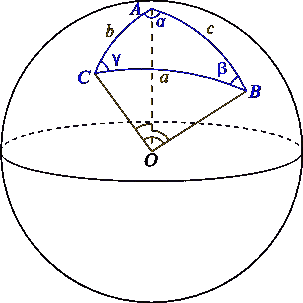

图 10.1 – 球面三角形

与平面三角形的主要区别在于，球面三角形的边是**大圆**或**测地线**（总是将球体分成两半的圆周），由于中心角（靠近中心，*O*）与它们各自弧的长度成比例（*长度 = π x 角度*），因此边*a*、*b*和*c*是以*角度单位*而不是线性单位来测量的。如果你想可视化球面三角形的边属于三个大圆的事实，*图 10.2*可以帮到你：

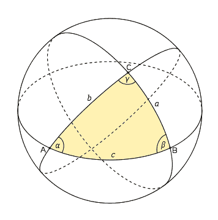

图 10.2 – 生成球面三角形的球大圆

描述球面三角学的数学使得能够定义过去被伟大的数学家所强调的球面上两点之间的所有距离。

至于两个地理点之间的距离，参考坐标系将是使用**纬度**和**经度**的那个。显然，我们不会深入探讨我们即将提出的距离证明的数学细节（也因为我们中的一些确实非常复杂）。然而，我们确实想提供一个介绍，为地理距离最常用的概念奠定基础。

现在我们来探讨两点之间最直接的距离，即余弦定理距离。

### 余弦定理距离

**余弦定理距离**（也称为**大圆距离**）是在球面上两点之间的最短距离，沿着球面测量。给定两个点，*P*和*Q*，一个唯一的大圆穿过它们。这两个点将大圆分成两个不同的弧。较短弧的长度是两点之间大圆的距离：

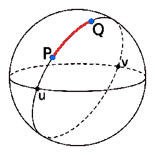

图 10.3 – 点 P 和点 Q 之间的大圆距离

注意，如果计算距离的两个点位于球体的对径点（**对径点** *u* 和 *v*），那么穿过它们的大圆是无限的，这两点之间的距离很容易计算，因为它正好测量了球体周长的一半。

另一方面，当点不是对称点时，可以通过控制球面三角学的 **球面余弦定律**（见本章末尾的 *参考文献*）推导出前面的距离。不经过繁琐的数学步骤，计算球面上两点之间余弦（或大圆）距离的公式如下：

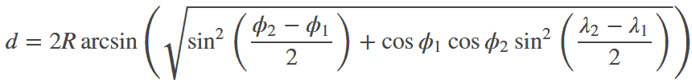

图 10.4 – 两点之间余弦距离定律的公式

看起来，这并不是你见过的最简单、最干净的公式，对吧？尽管如此，今天有了方便的计算器，前面的计算仍然可行。现在想象一下古代的航海家，他们曾经使用地球上的各个点之间的大圆距离。即使他们有正弦和余弦表可以简化一些计算，他们又如何能使用前面的公式呢？这将是一项非常复杂的活动，可能会出现导致水手丧生的错误。

> **重要提示**
> 
> 如果两个点很近（例如，在球面上相隔几公里）并且你没有精确度高的计算器，你可能会得到不准确的结果。

由于这些原因，那个时代的数学家引入了新的三角函数 `haversin`（或 `hav`），它允许你转换和平滑大圆距离公式，同时也避免了之前提到的小距离误差。让我们看看它是如何做到这一点的。

### Haversine 距离定律

被称为 `haversine`（来自 *half-versed sine*）的函数定义如下：

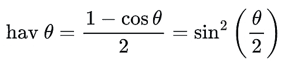

图 10.5 – haversine 函数的定义

多亏了这个新函数，可以将余弦距离定律重写如下：

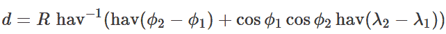

图 10.6 – Haversine 距离定律的定义

这种新的距离公式被称为 **Haversine 距离定律**。当你考虑到，除了正弦和余弦表，还出版了 Haversine 表时，它对当时航海者的无疑有用性就变得明显了。因此，两点之间的距离计算变得即时。

> **重要提示**
> 
> 即使这个公式也受到特殊（并且有些不寻常）的对称点情况下的舍入误差的影响。

要得到比 Haversine 公式更精确的距离公式，你必须使用 Vincenty 公式。让我们看看这是怎么回事。

### Vincenty 的距离

地球测量学家 Vincenty 得出两点之间距离更精确公式的获胜假设是将地球视为不是球体，而是一个在两极略微扁平的椭球体（差异仅为约 21 公里）：

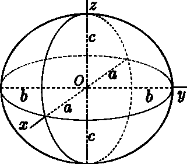

图 10.7 – 椭球体表示

与计算球面上距离的 Haversine 方法不同，**Vincenty 的公式**描述了一种需要通过多次迭代收敛到解的方法。具体来说，计算一系列方程，其输出被反馈到同一序列的方程中，目的是在经过一定次数的迭代后最小化计算值。因此，Vincenty 的公式在计算上要求更高。

Vincenty 的公式与两个问题相关：

+   **直接问题**：给定初始点，*(Φ1, L1)*，初始方位角，*α1*，和距离，*s*，找到终点，*(Φ2, L2)*，和方位角，*α2*。

+   **反向问题**：给定两点的坐标，*(Φ1, L1)*和*(Φ2, L2)*，找到方位角*α1*，*α2*和椭球体距离，*s*。

我们感兴趣的反向问题是计算距离。为了了解公式的复杂性，请查看本章末尾的*参考文献*部分。

Vincenty 的公式在需要高精度测量的项目中广泛使用，因为它们在地球椭球体上的精度在 0.5 毫米（0.020 英寸）以内。

> **重要提示**
> 
> 如果点几乎是对抗的，算法无法收敛，误差会很大或收敛缓慢。

2013 年，Karney 使用牛顿法为所有输入点对提供了快速收敛，没有任何误差。

在这一点上，出现的问题是使用哪种距离最好以及何时使用。让我们在下一节中尝试理解这一点。

### 使用哪种距离以及何时使用

考虑到余弦定理距离法在两点之间短距离的强烈限制，今天在常见应用中最常用的方法是 Haversine 定律（简称 Haversine）和 Vincenty 的公式（简称 Vincenty）。以下是我们在特定场景下关于使用哪种距离的建议：

+   对于*彼此靠近的点*（想想短程飞行），地球近似为一个球体的可能性非常大。因此，基于球体地球模型的方法，如 Haversine，由于计算上更简单（因此更快），将非常合适。

+   对于 *远离地点*（例如长途飞行，尤其是连接相反半球的情况），球形地球模型开始变得不那么精确。在这些情况下，Vincenty 的椭球体逆公式，它计算上更为复杂（因此通常更慢），将给出更好的结果。如果您有计算限制，您需要考虑更快的模型是否足够精确以满足您的需求。

既然您已经对理论有了深入的了解，让我们继续在 Python 和 R 中实现这些算法。

## 使用 Python 实现距离

我们将要实现的距离算法的场景涉及一个包含美国酒店经纬度的数据集。目标是增加距离最近机场的距离。

酒店数据在 *Back4App* 上公开可用（[`bit.ly/data-hotels-usa`](https://bit.ly/data-hotels-usa)）。为了方便，我们只从纽约市提取了 100 家酒店，我们将使用 Haversine（球形模型）和 Karney（椭球模型）方法计算每家酒店与拉瓜迪亚机场和约翰·肯尼迪机场的距离（您可以在以下位置找到机场数据：[`datahub.io/core/airport-codes`](https://datahub.io/core/airport-codes)）。您可以在 GitHub 仓库的 `Chapter10` 文件夹中找到方便的已提取数据集。具体来说，您将在 `hotels-ny.xlsx` 文件中找到酒店数据，在 `airport-codes.csv` 文件中找到机场数据。

### 使用 Python 计算距离

如我们之前提到的，我们并不是喜欢重新发明轮子的人，尤其是在解决特定问题领域可能遇到复杂性的风险时。幸运的是，Python 拥有一个非常活跃的程序员社区，他们在特定的科学领域拥有专业知识，并且公开分享他们的成果。这就是 Jean M. Brouwers 创建的 `PyGeodesy` 包（[`github.com/mrJean1/PyGeodesy`](https://github.com/mrJean1/PyGeodesy)）的例子，它由 Jean M. Brouwers 创建，纯 Python 实现了各种用于地球的球形和椭球模型的各种计算工具，这些工具由 Chris Veness 为 Java 制作，Charles Karney 本人为 C++ 制作。

要使用此模块，您显然必须在您的环境中安装它，并且由于我们打算使用 Karney 优化的距离公式，我们还必须安装 `geographiclib` 包，该包由他直接维护。因此，按照以下步骤操作：

1.  打开 Anaconda Prompt。

1.  切换到 `pbi_powerquery_env` 环境，输入 `conda activate pbi_powerquery_env` 命令，然后按 *Enter*。

1.  安装 `PyGeodesy` 包，输入 `pip install PyGeodesy`，然后按 *Enter*。

1.  安装 `geographiclib` 包，输入 `pip install geographiclib`，然后按 *Enter*。

1.  如果你还没有这样做，也可以通过输入`pip install openpyxl`来安装`openpyxl`包，然后按*Enter*键。

到这一点，你可以继续进行 Python 代码。首先，请注意`PyGeodesy`包包含一个具有基本大地测量函数的表单，称为`formy`。在这个模块中，有直接根据 Haversine 和 Vincenty 公式计算距离的函数，但它不包含 Karney 公式的变体。因此，除了标准的 pandas 和 NumPy 模块外，还必须导入以下内容：

```py
from pygeodesy import formy as frm
from pygeodesy.ellipsoidalKarney import LatLon as kLatLon
```

要根据 Karney 计算距离，必须使用`ellipsoidalKarney`模块提供的对象。基本上，你必须使用该模型的`LatLon`方法在这两个椭球体上创建两个点，然后计算距离。这总结在以下`karney`用户定义函数中：

```py
def karney(lat1, lng1, lat2, lng2):
return kLatLon(lat1, lng1).distanceTo(kLatLon(lat2, lng2))
```

之后，为了方便起见，创建了一个用户定义的第二个函数作为调用各种距离计算的包装器：

```py
def geodistance(lat1, lng1, lat2, lng2, func):
return func(lat1, lng1, lat2, lng2)
```

然后，将酒店数据导入到`hotel_df`数据框中，将机场数据导入到`airports_df`数据框中。由于机场数据框包含一个`coordinates`列，其中包含用逗号分隔的经纬度字符串，因此这两个值使用`split()`函数分割成两个单独的列，然后追加到没有`coordinates`列的相同源数据框中，现在这个列已经没有用了：

```py
airports_df = pd.concat([
airports_df.drop([’coordinates’], axis=1),
airports_df[’coordinates’].str.split(‘, ‘, expand=True).rename(columns={0:’longitude’, 1:’latitude’}).astype(float)], axis=1)
```

为了方便地访问特定机场的纬度和经度值，创建了一个用户定义的`airportLatLongList()`函数，它接受一个包含机场数据的数据框作为参数，该数据框具有`iata_code`、`latitude`和`longitude`列，以及感兴趣的机场的特定**IATA 代码**。记住，IATA 机场代码是一个三字母代码，用于识别世界上许多机场和都市地区，由**国际航空运输协会**(**IATA**)定义。因此，约翰·F·肯尼迪国际机场由 IATA 代码`JFK`识别，拉瓜迪亚机场由代码`LGA`识别。因此，为了获取这些机场的坐标，你可以使用以下代码：

```py
jfk_lat, jfk_long  = airportLatLongList(airports_df, ‘JFK’)
lga_lat, lga_long = airportLatLongList(airports_df, ‘LGA’)
```

话虽如此，多亏了`geodistance()`函数，只需要两个点的地理坐标就可以计算它们之间的距离。例如，如果你想计算点`A(lat1,lng1)`和点`B(lat2,lng2)`之间的 haversine 距离，你只需使用以下代码：

```py
geodistance(lat1, lng1, lat2, lng2, func=frm.harvesine)
```

要能够计算它们之间的 Karney 距离，可以利用`karney()`函数并使用以下代码：

```py
geodistance(lat1, lng1, lat2, lng2, func=karney)
```

然而，如果您不再想将`geodistance()`函数应用于两个单独的点，而是应用于包含在数据框列中的一个点序列和第二个固定点，您应该如何操作？由于前面的函数需要五个输入参数，我们可以使用 pandas 数据框的`apply()`方法（如此处所示：[`bit.ly/pandas-apply-lambda`](http://bit.ly/pandas-apply-lambda)）。相反，我们引入了一种方便的方法来评估输入 Series 的连续元组的函数。为了向量化一个函数，您必须调用`np.vectorize()`方法，并将要应用于地理坐标 Series 的函数作为参数传递。然后，您还必须按照以下方式传递输入函数的参数：

```py
hotels_df[’haversineDistanceFromJFK’] = np.vectorize(geodistance)(
hotels_df[’latitude’],
hotels_df[’longitude’],
jfk_lat,
jfk_long,
func=frm.haversine)
```

上次计算得出的距离（以米为单位）存储在`hotels_df`数据框的新`haversineDistanceFromJFK`列中。同样，可以通过简单地引用代码块中的`karney`函数来计算 Karney 距离。

> **重要提示**
> 
> **向量函数**与使用`np.vectorize()`的函数不同。向量函数是 NumPy 内置的函数，在底层编译代码（C 或 Fortran）中执行，以便使用特殊处理器寄存器同时操作多个项目。正如您所想象的，向量化比`for`循环更高效且更可取。有关更多详细信息，请参阅**参考文献**部分。

如果您在`Python`文件夹中的`01-distances-from-airports-in-python.py`文件中运行代码，您将得到类似以下内容：


图 10.8 – 从酒店到 JFK 和 LGA 机场的 Haversine 和 Karney 距离已添加

太棒了！您已经能够使用 Python 计算出所有酒店和两个机场之间的 Haversine 和 Karney 距离（以米为单位）。在这个阶段，使用类似的代码在 Power BI 中计算距离是直接的。让我们看看如何做。

### 使用 Python 在 Power BI 中计算距离

是时候在 Power BI 中实现您所学的知识了。因此，启动 Power BI 桌面，让我们开始吧：

1.  确保 Power BI 桌面在**选项**中引用了您的最新环境。之后，点击**Excel**导入`hotels-ny.xlsx`文件，您可以在`Chapter10`文件夹中找到它。选择它并点击**打开**。

1.  从**导航器**窗口中选择**Sheet 1**表：

    

    图 10.9 – 选择 Sheet 1 表

    然后，点击**变换数据**。

1.  点击**变换**菜单，然后点击**运行 Python 脚本**。

1.  将`Chapter10\Python`文件夹中的`02-distances-from-airports-in-power-bi-with-python.py`文件中的脚本复制到 Python 脚本编辑器中，然后点击**确定**。

1.  你可能会被提示将 Excel 文件中的权限与为脚本最初选择的权限（在我们的案例中，**组织**）对齐。在这种情况下，你根据在*第五章*中看到的，*在 Power BI 中使用正则表达式*，已经知道如何进行操作。

1.  我们只对`dataset`中的数据感兴趣。因此，点击其**表**值。

1.  Power Query 将通过添加 Haversines 和 Karney 两种方法计算每个酒店到两个机场（JFK 和 LGA）的距离来转换你的数据：

    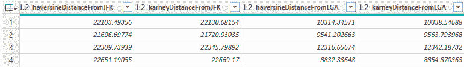

    图 10.10 – Python 脚本转换的结果

1.  然后，你可以在**主页**选项卡中点击**关闭并应用**。

太好了！你刚刚通过在 Power BI 中使用 Python 添加了两个地理点之间的距离，丰富了你的数据。让我们看看如何在 R 中做到这一点。

## 使用 R 实现距离

情景将与前一个章节中描述的相同。因此，我们将用将纽约市的一些酒店与纽约的两个主要机场——约翰·肯尼迪机场和拉瓜迪亚机场——之间的距离来丰富与这些酒店相关的数据。

要处理的数据文件可以在 GitHub 仓库的`Chapter10`文件夹中找到。具体来说，你将在`hotels-ny.xlsx`文件中找到酒店数据，在`airport-codes.csv`文件中找到机场数据。

### 使用 R 计算距离

R 社区也很幸运，有一个免费提供的包，该包实现了地理应用中的球面三角函数。这个包叫做`geosphere` ([`cran.r-project.org/web/packages/geosphere/`](https://cran.r-project.org/web/packages/geosphere/))，就像 Python 的`PyGeodesy`包一样，它受到了 Chris Veness 和 Charles Karney 公开提供的代码的启发。

首先，你需要安装这个新包：

1.  打开 RStudio 并确保它引用的是你最新的 CRAN R（在我们的案例中是版本 4.0.2）。

1.  点击**控制台**窗口，输入此命令：`install.packages('geosphere')`。然后，按*Enter*键。

现在，你已准备好在 R 中编写代码。除了允许你读取 CSV 和 Excel 文件（`readr`和`readxl`）并简化数据转换操作（`dplyr`和`purrr`）的常用包之外，你当然必须加载你刚刚安装的包。

你可以使用`read_xlsx()`函数轻松地将酒店数据导入`hotels_tbl` tibble，使用`read_csv()`函数将机场数据导入`airport_tbl` tibble。在此阶段，要做的第一个操作是将`airports_tbl`中的`coordinates`列的内容拆分到两个新列，`longitude`和`latitude`：

```py
airports_tbl <- airports_tbl %>% 
tidyr::separate(
col = coordinates,
into = c(‘longitude’, ‘latitude’),
sep = ‘, ‘,
remove = TRUE,
convert = TRUE )
```

注意使用`tidyr`包中的`separate`函数的简单性：

1.  管道将`airports_tbl` tibble 作为函数的第一个参数传递。

1.  声明要拆分的列（`col = coordinates`）。

1.  声明两个新的目标列（`into = c('longitude', 'latitude')`）。

1.  声明要拆分的列值中找到的分隔符（`sep = ', '`）。

1.  转换完成后，删除要拆分的列（`remove = TRUE`）。

1.  如果目标列是数值列，则自动转换数据类型（`convert = TRUE`）。

所有这些操作都在一个操作中完成，并且非常清晰。这也是数据分析员喜欢 R 的原因之一！

再次强调，我们使用一个函数来方便地访问特定机场的经纬度值。这个函数是`airportLongLatVec()`，它接受两个参数：一个包含机场数据的 dataframe，其中包含`iata_code`、`latitude`和`longitude`列，以及感兴趣的机场的特定**IATA 代码**：

```py
airportLongLatVec <- function(df, iata) {
ret_vec <- df %>% 
filter( iata_code == iata ) %>% 
select( longitude, latitude ) %>% 
unlist()
return(ret_vec)
}
```

输出是一个命名向量。因此，可以通过这种方式轻松找到两个机场的坐标：

```py
jfk_coordinates <- airportLongLatVec(airports_tbl, ‘JFK’)
lga_coordinates <- airportLongLatVec(airports_tbl, ‘LGA’)
```

你基本上已经准备好转换数据了。从`geosphere`包中，你将使用`distHaversine()`和`distGeo()`函数。前者的名称本身就说明了其功能。`distGeo()`函数根据 Karney 的公式计算椭球面上两点之间的最短距离。这两个函数都接受两对坐标（按经度和纬度的顺序）以向量形式。为了得到与 Python 相同的结果，`distHaversine()`函数必须接受与 PyGeodesy 默认使用的地球球面模型相同的平均半径作为参数。这个半径是**国际大地测量和地球物理学联合会**（**IUGG**）定义的**R1**（平均半径），其值为 6,371,008.771415 米。

在这一点上，可以使用`purrr`包中已经看到的`map()`函数族来对`hotels_tbl` tibble 进行增强操作。在第一步中，我们创建一个新列`p1`，使用`map2()`函数包含经纬度对向量。在第二步中，我们将`distHaversine()`和`distGeo()`函数应用于新创建的点`p1`以及标识机场的固定点（`jfk_coordinates`和`lga_coordinates`），以创建包含距离的新列。这是所需的代码：

```py
hotels_tbl <- hotels_tbl %>% 
mutate(
p1 = map2(longitude, latitude, ~ c(.x, .y))
    ) %>% 
mutate(
haversineDistanceFromJFK = map_dbl(p1, ~ distHaversine(p1 = .x, p2 = jfk_coordinates, r = 6371008.771415)),
karneyDistanceFromJFK = map_dbl(p1, ~ distGeo(p1 = .x, p2 = jfk_coordinates)),
haversineDistanceFromLGA = map_dbl(p1, ~ distHaversine(p1 = .x, p2 = lga_coordinates, r = 6371008.771415)),
karneyDistanceFromLGA = map_dbl(p1, ~ distGeo(p1 = .x, p2 = lga_coordinates))
    ) %>%
select( -p1 )
```

回想一下，`map2()`函数接受两个向量作为输入，并将它们并行运行，将它们的值传递给`~`符号后面的函数（在我们的例子中是声明向量的`c()`函数）。而`map_dbl()`函数接受包含地理坐标（以向量格式）的列`p1`作为输入，并将它的元素传递给`~`后面的函数（在我们的例子中是带有其他固定参数的`distGeo()`），将输出转换为双精度数值数据类型的向量。

如果你运行`R`文件夹中`01-distances-from-airports-in-r.R`文件的代码，你会得到类似以下内容：


图 10.11 – 增强后的包含距离的 hotels tibble

哇！你能够使用 R 计算所有酒店和两个机场之间的 Haversine 和 Karney 距离。在这个阶段，使用类似的代码在 Power BI 中计算距离是直接的。让我们看看如何做。

### 使用 R 在 Power BI 中计算距离

是时候将你在 Power BI 中学到的知识付诸实践了。因此，启动 Power BI Desktop，让我们开始吧：

1.  确保 Power BI Desktop 在**选项**中引用你的最新环境。之后，点击**Excel**导入`hotels-ny.xlsx`文件，该文件位于`Chapter10`文件夹中。选择它并点击**打开**。

1.  从**导航器**窗口中选择**Sheet 1**表：

    

    图 10.12 – 选择 Sheet 1 表

    然后，点击 **转换数据**。

1.  点击 **转换** 菜单，然后点击 **运行 R 脚本**。

1.  将`Chapter10\R`文件夹中的`02-distances-from-airports-in-power-bi-with-r.R`文件中的脚本复制到 R 脚本编辑器中，然后点击**确定**。

1.  我们只对 `hotels_df` 中的数据进行关注。因此，点击其 **表** 值。

1.  Power Query 将通过添加每个酒店到两个机场（`JFK` 和 `LGA`）的距离来转换你的数据，使用 Haversines 和 Karney 的两种方法：

    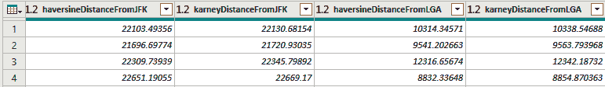

    图 10.13 – Python 脚本转换的结果

1.  你可以点击 **关闭并应用** 在 **主页** 选项卡。

太好了！你刚刚通过在 Power BI 中使用 R 添加两个地理点之间的距离来丰富了你的数据。

在下一节中，你将看到如何使用线性优化算法丰富你的数据集。

## 线性规划的基础

**线性规划**（**LP**）**算法**被应用于所有那些优化和因此资源经济对于活动持续至关重要的领域。为了理解这一切，你需要一些数学知识。这样，让我们回顾一下我们在年轻时学习过程中遇到的几何概念。

### 线性方程和不等式

我们在生活中至少遇到过一次线性方程这个术语。在 simplest sense 中，**线性方程**由两个变量 *x* 和 *y* 之间的数学关系组成，形式为 *ax + by + c = 0*，在笛卡尔平面上标识一条 **直线**：

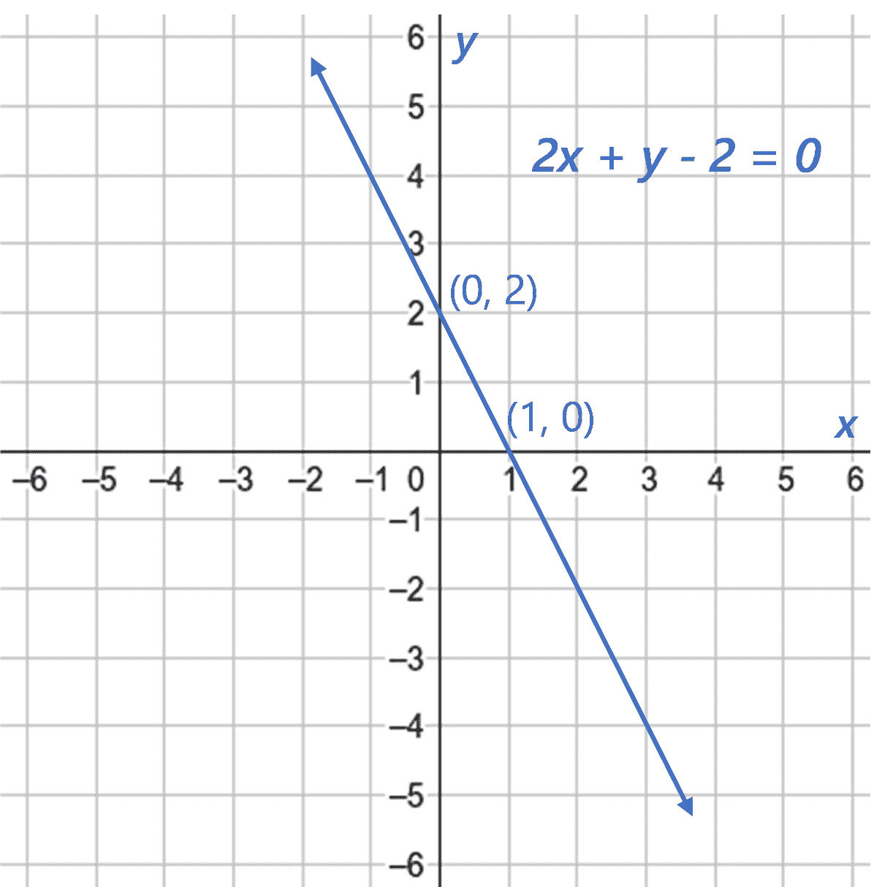

图 10.14 – 线性方程 2x + y = 2 的表示

显然，线性方程中涉及的变量可以超过两个。只要我们有三个变量（我们能够看到的著名的三维），线性方程的表示就是可能的。在这种情况下，形式为 *ax + by + cz + d = 0* 的三个变量的线性方程表示空间中的一个 **平面**：

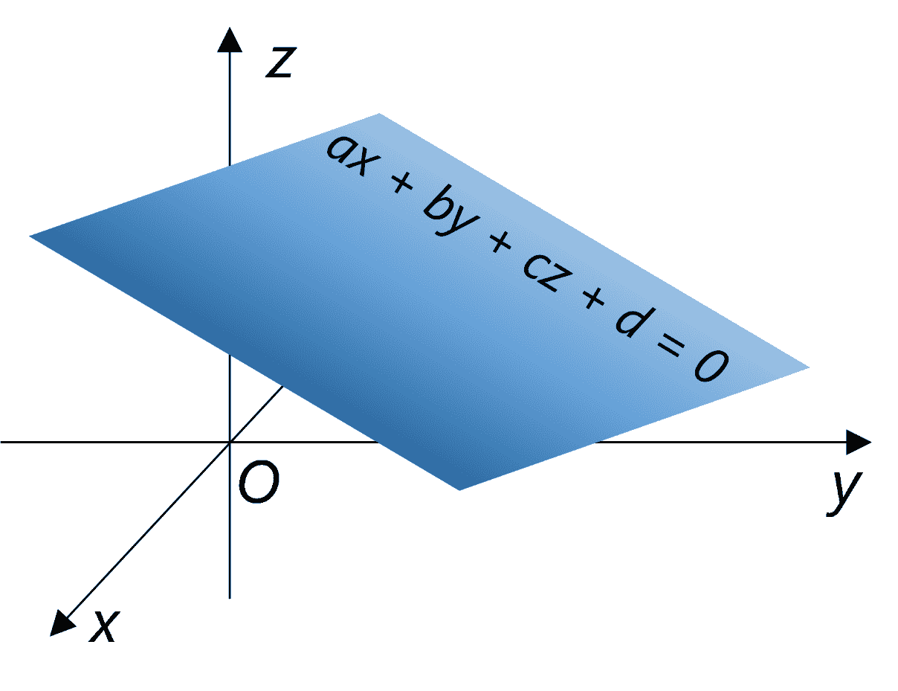

图 10.15 – 通用线性方程 ax + by + cz + d = 0 的表示

当线性方程中有超过三个变量时，我们通常称其表示不再是平面，而是一个**超平面**。

还有**线性不等式**，它们是涉及不等式的线性函数（由符号 `<`、`>`、`≤` 和 `≥` 标识）。就像线性方程一样，同样地，你可以用两个变量或三个变量来绘制线性不等式。在两个变量的情况下，它们表示线的一侧的所有点（即平面的一个区域），在三个变量的情况下，它们表示直平面的两侧的点（即一个体积）：

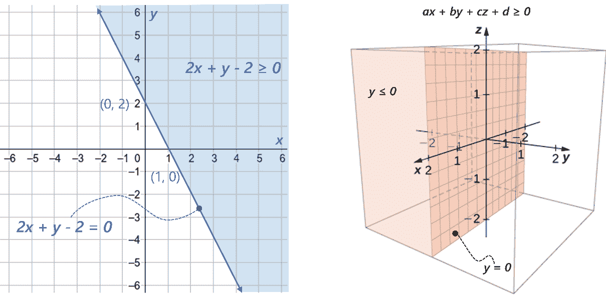

图 10.16 – 两个或三个变量的通用线性不等式的表示

注意到由不等式确定的区域是无限的，但有一个边缘是由来自相同不等式的线性方程构成的，考虑的是 `=` 符号而不是不等式符号。

嗯，当你思考这些概念时，你通常会联想到它们与理论数学相关，但事实并非如此。与运输、制造、运输等相关的一些简单概念可以追溯到线性方程或不等式。让我们看看一个例子。

### 公式化线性优化问题

想象一下，你在一个制造公司工作，需要生产两种产品，P1 和 P2。为了生产它们，你需要一台机器。具体来说，生产一个单位的 P1 产品需要机器上 30 分钟的加工时间，而生产一个单位的 P2 产品需要同样的机器上 25 分钟。此外，机器 M 可以连续运行的小时数是 40 小时（= 40*60 分钟）。也就是说，30 分钟乘以 P1 产品数量的总和加上 25 分钟乘以 P2 产品数量的总和不能超过 40 小时的加工时间。因此，在加工结束时，生产 *x* 个 P1 产品和 *y* 个 P2 产品的机器小时 **约束**可以总结如下：

哇！你刚刚使用了一个简单的线性不等式来描述一个制造过程的约束。

现在想象一下，你已经收到了客户对 P1 和 P2 产品的需求。具体来说，将所有请求加起来，你需要至少生产 45 个单位的 P1 和 25 个单位的 P2 来满足你的客户。这些需求约束可以总结如下：

太棒了！你已经为你的问题添加了两个更多的线性约束。如果你给这些业务约束添加一个目标，例如，你想要最大化 P1 和 P2 的总单位数 *z*，那么约束集和目标就构成了一个线性优化问题：

简单来说，对吧？如果我们想更正式一点，线性规划（也称为**线性优化**）包括一套用于解决线性方程组和不等式系统的技术，目的是最大化或最小化线性目标函数。特别是，变量*x*和*y*被称为**决策变量**，设定的目标被称为**目标函数**或**成本函数**。在这个例子中，业务案例只需要不等式约束，但也可能有等式约束。

太棒了！但是，我们现在已经从数学角度设定了问题，那么我们该如何解决它呢？首先，我们需要将所有不等式表示在轴上（在这种情况下可以，因为它们只包含两个变量）。如开头所见，线性不等式表示一个平面的一部分，这部分由直线界定，考虑不等式本身的等号符号。相交所有这些平面，我们就能确定一个所有不等式共有的区域，称为**可行区域**。基本上，所有在这个区域内的点都满足由不等式确定的约束。

如果你想绘制与我们所展示的示例约束相关的可行区域，无需复习所有在中学学习的几何知识，只需使用**WolframAlpha** ([`www.wolframalpha.com/`](https://www.wolframalpha.com/))即可。在搜索引擎中输入以下字符串：`plot 30x+25y<=2400 and x>=45 and y>=25`。所有约束必须同时满足，因此使用了`and`运算符。按下*Enter*键，你将看到以下结果：

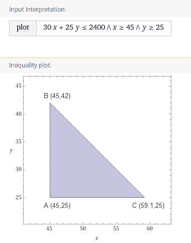

图 10.17 – WolframAlpha 绘制的可行区域

我们在 WolframAlpha 的结果中添加了可行区域顶点的值，这是一个三角形。

> **重要提示**
> 
> 已证明，如果优化问题是可解的，那么最大化或最小化目标函数的解恰好位于可行区域的某个顶点上。

正如你在*图 10.17*中看到的，顶点 C 的*x*值为`59.1`。显然，由于无法只生产一个单位的分数部分，因此不可能有分数部分的产品 P1。因此，应该考虑最近的整数值，即 59。如果业务问题要求决策变量必须为**整数**，那么问题就变成了**混合整数线性规划**（**MILP**）的问题。因此，在我们的例子中，我们考虑顶点*A*、*B*和*C**=(59,25)作为我们问题的可能解，并将它们的坐标代入目标函数*z = x + y*：

+   *A*：*z = 45 + 25 = 70*

+   *B*：*z = 45 + 42 = 87*

+   *C*：*z = 59 + 25 = 84*

我们推断出我们问题的解是顶点*B*，最大值为 87 单位，即*P1 = 45*和*P2 = 42*。

> **注意**
> 
> 总结来说，生产 45 个产品 P1 和 42 个产品 P2 满足机器的每小时生产约束和客户需求约束，同时最大化总生产量。

你以前想过你今天之前能解决一个线性优化问题吗？好吧，你已经做到了！显然，当这些问题如此简单时，用手解决这些问题是可能的。但是当决策变量的数量增加时，就不再可能绘制可行区域，因此也就无法通过肉眼在多维空间中定位顶点。在这些情况下，是数学，尤其是社区为 Python 和 R 提供的包，使我们能够找到问题的解决方案。让我们首先看看一个稍微复杂一点的线性规划问题案例。

## 要解决的线性规划问题的定义

现在想象一下，你正在为一家公司工作，该公司需要从全球不同仓库向不同国家运输产品。你必须提供以下内容：

+   仓库中可用的产品数量：

    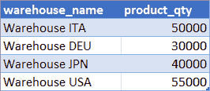

    图 10.18 – 仓库中可用的产品数量

+   国家所需的产品数量：

    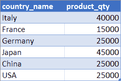

    图 10.19 – 国家所需的产品数量

+   从每个仓库到所有请求国家的运输成本：

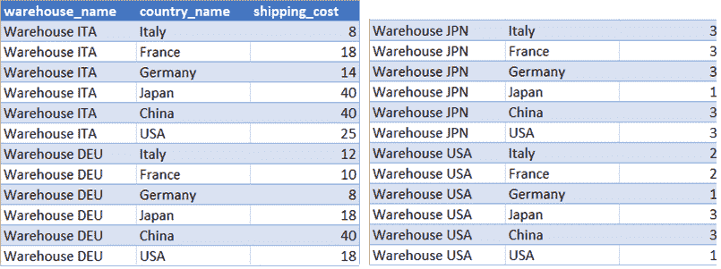

图 10.20 – 从仓库到国家的成本

你的目标是通过满足来自不同国家的所有客户需求来最小化你公司的成本。

### 表述线性规划问题

如前所述，你必须首先用数学方法表述问题。让我们使用几个数值索引，*i* 和 *j*，来识别发送的数量和成本。具体来说，考虑从 *Warehouse i* 发送到 *Country j* 的产品数量 *x[ij]*，根据这个定义决策变量和成本的矩阵：


图 10.21 – 发送产品和成本的数量定义矩阵

量 *x[ij]* 是一个整数且非负（）。

根据前面的定义，问题的目标是使目标函数最小化，该函数可以写成从 *Warehouse i* 到 *Country j* 的运输成本 (*Cij*) 与从 *Warehouse i* 到 *Country j* 发送的产品数量 (*xij*) 之间的乘积之和：

将其完整写出，并按仓库组织以方便阅读，从 *图 10.21* 中的成本金额来看，前面的目标函数可以重写如下：

到目前为止，你必须正式化约束条件，它们有两种类型：*仓库供应约束*和*客户需求约束*：

+   **仓库供应约束**：一旦确定了仓库（例如，*Warehouse ITA*，其中 *i = 1*），从这个仓库向所有国家（*x[1j]*的总和）发送的产品总和不能超过该仓库包含的产品最大数量（对于*Warehouse ITA*，50,000 个产品；见 *图 10.18*）。也就是说，对于所有六个国家，我们有以下结果：因此，您将为每个仓库有一个类似的约束（总共四个约束）。

+   **客户需求约束**：无论货物来自哪个仓库，您都必须满足每个国家产品的需求。因此，从所有仓库向给定国家（例如，*法国*，其中 *j = 2*）发送的产品总和必须至少等于该国家的需求（法国至少需要 15,000 个产品；见 *图 10.19*）。因此，考虑到所有四个仓库，我们得到以下结果：因此，您将为每个国家有一个类似的约束（总共六个约束）。

因此，最终的线性优化问题可以表述如下：

太棒了！您成功地用数学术语表述了一个非平凡的业务问题。现在让我们看看如何用 Python 来解决它。

## 使用 Python 处理优化问题

如您可能已经猜到的，开发 Python 包的大型社区永远不会停滞不前。在这种情况下，它提供了一个帮助我们解决线性优化问题的模块。它的名字是**PuLP** ([`github.com/coin-or/pulp`](https://github.com/coin-or/pulp))，它是一个用 Python 编写的 LP 模型器。它与解决 LP、**混合整数规划**（**MIP**）和其他相关问题的最常见免费和非免费引擎进行接口，例如**GNU 线性规划工具包**（**GLPK**）、**Coin-or 分支和剪枝**（**CBC**），这是默认的，以及**IBM ILOG CPLEX**。它的使用非常直接。让我们立即用上一节的问题来实践一下。

### 在 Python 中解决 LP 问题

本节将解释的代码可以在存储库的`Chapter10\Python`文件夹中的`03-linear-optimizaiont-in-python.py`文件中找到。

首先，您必须在您的环境中安装`PuLP`模块：

1.  打开 Anaconda Prompt。

1.  输入`conda activate pbi_powerquery_env`命令。

1.  输入`pip install pulp`命令。

之后，您可以使用 NumPy 向量和矩阵定义将构成约束和成本的值：

```py
import pandas as pd
import numpy as np
import pulp as plp
warehouse_supply_df = pd.read_excel(r’D:\<your-path>\Chapter10\RetailData.xlsx’, sheet_name=’Warehouse Supply’, engine=’openpyxl’)
warehouse_supply = warehouse_supply_df[’product_qty’].to_numpy()
country_demands_df = pd.read_excel(r’D:\<your-path>\Chapter10\RetailData.xlsx’, sheet_name=’Country Demand’, engine=’openpyxl’)
country_demands = country_demands_df[’product_qty’].to_numpy()
cost_matrix_df = pd.read_excel(r’D:\<your-path>\Chapter10\RetailData.xlsx’, sheet_name=’Shipping Cost’, engine=’openpyxl’)
n_warehouses = cost_matrix_df.nunique()[’warehouse_name’]
n_countries = cost_matrix_df.nunique()[’country_name’]
cost_matrix = cost_matrix_df[’shipping_cost’].to_numpy().reshape(n_warehouses,n_countries)
```

在脚本文件中，您还会找到直接从`Chapter10`文件夹中的`RetailData.xlsx`文件导入值的代码。

然后，您可以定义一个`LpProblem`对象，给它一个名称，并指定要应用于目标函数的优化类型（最小化或最大化）：

```py
model = plp.LpProblem(“supply-demand-minimize-costs-problem”, plp.LpMinimize)
```

您可以稍后向这个空对象添加目标函数和约束。

为了构建目标函数，我们首先必须通过`LpVariable`函数定义决策变量(*x[ij]*)，该函数接受变量名称、表示变量索引的字符串完整列表、变量的类别（连续、整数或二进制）以及任何上界或下界值。索引列表只是通过嵌套**列表推导**([`bit.ly/nested-list-comprehensions`](http://bit.ly/nested-list-comprehensions))构建的：

```py
var_indexes = [str(i)+str(j) for i in range(1, n_warehouses+1) for j in range(1, n_countries+1)]
print(“Variable indexes:”, var_indexes)
```

这是一个示例输出：

```py
Variable Indices: [’11’, ‘12’, ‘13’, ‘14’, ‘15’, ‘16’, ‘21’, ‘22’, ‘23’, ‘24’, ‘25’, ‘26’, ‘31’, ‘32’, ‘33’, ‘34’, ‘35’, ‘36’, ‘41’, ‘42’, ‘43’, ‘44’, ‘45’, ‘46’]
```

现在可以轻松地定义决策变量如下：

```py
decision_vars = plp.LpVariable.matrix(
name=”x”,
indexs=var_indexes,
cat=”Integer”,
lowBound=0 )
```

由于决策变量需要乘以之前在`cost_matrix`中定义的*C[ij]*成本，因此将`decision_vars`列表格式化为与成本矩阵相同的形状，以便能够执行元素级乘法，也称为**Hadamard 乘积**：

```py
shipping_mtx = np.array(decision_vars).reshape(n_warehouses,n_countries)
print(“Shipping quantities matrix:”)
print(shipping_mtx)
```

它返回以下输出：

```py
Shipping quantities matrix:
[[x_11 x_12 x_13 x_14 x_15 x_16]
[x_21 x_22 x_23 x_24 x_25 x_26]
[x_31 x_32 x_33 x_34 x_35 x_36]
[x_41 x_42 x_43 x_44 x_45 x_46]]
```

目标函数随后定义为成本矩阵和运输矩阵元素级乘积的总和：

```py
objective_func = plp.lpSum(cost_matrix * shipping_mtx)
print(objective_func)
```

输出如下：

```py
8*x_11 + 18*x_12 + 14*x_13 + 40*x_14 + 40*x_15 + 25*x_16 + 12*x_21 + 10*x_22 + 8*x_23 + 18*x_24 + 40*x_25 + 18*x_26 + 34*x_31 + 32*x_32 + 30*x_33 + 10*x_34 + 33*x_35 + 35*x_36 + 25*x_41 + 20*x_42 + 18*x_43 + 35*x_44 + 30*x_45 + 10*x_46
```

如果你记得正确，这个表达式与你在上一节中看到的完整目标函数是一致的。

然后，你可以将目标函数添加到模型中，如下所示：

```py
model += objective_func
```

约束不等式也是以相同的方式添加的：

```py
for i in range(n_warehouses):
model += plp.lpSum(shipping_mtx[i][j] for j in range(n_countries)) <= warehouse_supply[i], “Warehouse supply constraints “ + str(i)
for j in range(n_countries):
model += plp.lpSum(shipping_mtx[i][j] for i in range(n_warehouses)) >= country_demands[j] , “Country demand constraints “ + str(j)
```

最后，我们可以通过运行这个简单的脚本来解决问题：

```py
model.solve()
```

首先要做的事情是检查解的状态，它可以取`Optimal`、`Not Solved`、`Infeasible`、`Unbounded`和`Undefined`等值：

```py
status = plp.LpStatus[model.status]
print(status)
```

在我们的情况下，状态是`Optimal`，因此已经找到了问题的最优解。那么，让我们看看目标函数在找到的解上的值：

```py
print(“Total Cost:”, model.objective.value())
```

该值等于 2,270,000 欧元，这对应于满足所有施加约束条件下的最低可能成本。如果你想以非常可读的方式查看组成运输矩阵的变量的解值，你最好将它们转换成 pandas 数据框：

```py
decision_var_results = np.empty(shape=(n_warehouses * n_countries))
z = 0
for v in model.variables():
try:
decision_var_results[z] = v.value()
z += 1
except:
print(“error couldn’t find value”)
decision_var_results = decision_var_results.reshape(n_warehouses,n_countries)
col_idxs = [’Italy’,’France’,’Germany’,’Japan’,’China’,’USA’]
row_idxs = [’Warehouse ITA’,’Warehouse DEU’,’Warehouse JPN’,’Warehouse USA’]
dv_res_df = pd.DataFrame(decision_var_results, columns=col_idxs, index=row_idxs)
dv_res_df
```

出现的结果如下：

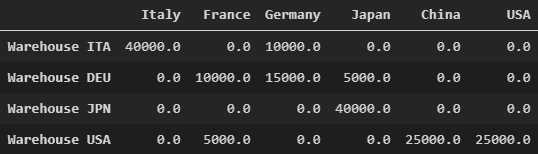

图 10.22 – 根据找到的解决方案发送的数量

例如，很容易看出，法国客户必须从德国仓库接收 10,000 个单位，从美国仓库接收 5,000 个单位以满足他们的需求。

如果你想要检查每个仓库发送的总数量，你可以运行以下代码：

```py
warehouse_shipped_qty = np.zeros(shape=(n_warehouses))
z = 0
for i in range(n_warehouses):
warehouse_shipped_qty[z] = plp.lpSum(shipping_mtx[i][j].value() for j in range(n_countries)).value()
z += 1
w_shipped_df = pd.DataFrame(warehouse_shipped_qty, columns=[’qty’], index=row_idxs)
w_shipped_df
```

你将得到以下结果：

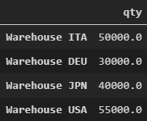

图 10.23 – 从每个仓库发送的总数量

太棒了！你只用几行 Python 代码就解决了非简单线性优化问题。你能猜到吗？现在让我们看看如何将你在 Power BI 中学到的知识应用到实践中。

### 使用 Python 在 Power BI 中解决 LP 问题

在 Power BI 中应用我们刚刚看到的方法并不像在上一章中遇到的其它情况那样直接。首先，我们必须已经在数据模型中加载了国家需求、仓库供应和运输成本的数据，这些数据可能来自任何数据源。在我们的案例中，它们已经在 Excel 中准备好了，所以我们将继续在 Power BI Desktop 中加载它们：

1.  点击功能区上的**Excel 工作簿**（或在主画布上的**从 Excel 导入数据**），在 `Chapter10` 文件夹中选择 `RetailData.xlsx` 文件，然后点击**打开**。

1.  选择**CountryDemand**、**ShippingCost**和**WarehouseSupply**表（带有蓝色标题的表），然后点击**转换数据**：


图 10.24 – 从 Excel 选择三个表

现在，你处于之前描述的情况。在此阶段，Power Query 中的每个查询都有自己的步骤堆栈，这些步骤生成了它：

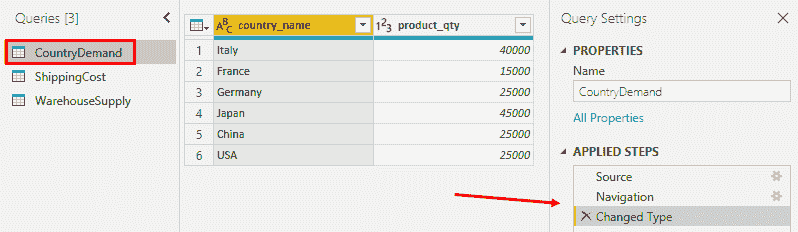

图 10.25 – 带有其应用步骤堆栈的 CountryDemand 查询

在上一节中，你看到为了计算最优分配，*你需要能够在单个 Python 脚本中使用所有三个数据集*。如果你将 Python 脚本作为之前列出的三个查询之一中的步骤添加，你只能在脚本中与该单个查询的数据进行交互。那么你如何创建一个可以使用所有可用数据的脚本呢？你必须求助于以下策略：

为了在 Python 脚本中使用属于多个查询的数据，你必须首先将每个查询导出的每个数据结构序列化到一个 pickle 文件中。然后，通过连接创建一个新的查询，该查询由三个查询合并而成（连接后的数据集是否有意义并不重要，因为它将不会被使用）。此时，为这个合并查询添加一个 Python 脚本步骤，在这个步骤中反序列化每个查询中之前序列化的所有三个对象。你最终将在一个脚本中拥有来自三个不同数据源的对象。

这样，你可以确保首先执行序列化三个数据集对象的 Python 脚本，然后按照顺序执行反序列化脚本来解决线性优化问题。

让我们详细看看如何完成上一段中描述的任务：

1.  在左侧选择**CountryDemand**查询，点击功能区上的**转换**选项卡，然后点击**运行 Python 脚本**。

1.  在脚本编辑器中输入以下 Python 代码，然后点击**确定**：

    ```py
    import pickle
    country_demands = dataset[’product_qty’].to_numpy()
    pickle.dump( country_demands, open(r”D:\<your-path>\Chapter10\Python\country_demands.pkl”, “wb”) )
    ```

1.  点击**值**下对应的**数据集**的**表**。你将始终看到国家需求数据，但在幕后，一个名为 `country_demands.pkl` 的 NumPy 向量已经被序列化，存储在 `Chapter10/Python` 文件夹中。

1.  在左侧选择**ShippingCost**查询，点击功能区上的**转换**选项卡，然后点击**运行 Python 脚本**。

1.  在脚本编辑器中输入以下 Python 代码，然后点击**确定**：

    ```py
    import pickle
    n_warehouses = dataset.nunique()[’warehouse_name’]
    n_countries = dataset.nunique()[’country_name’]
    cost_matrix = dataset[’shipping_cost’].to_numpy().reshape(n_warehouses, n_countries)
    pickle.dump( cost_matrix, open(r”D:\<your-path>\Chapter10\Python\cost_matrix.pkl”, “wb”) )
    ```

1.  点击**值**下对应的**dataset**的**表**。你将始终看到成本矩阵数据，但幕后，一个名为`cost_matrix.pkl`的 NumPy 向量已在`Chapter10/Python`文件夹中序列化。

1.  在左侧选择**WarehouseSupply**查询，点击功能区上的**转换**选项卡，然后点击**运行 Python 脚本**。

1.  在脚本编辑器中输入以下 Python 代码，然后点击**确定**：

    ```py
    import pickle
    warehouse_supply = dataset[’product_qty’].to_numpy()
    pickle.dump( warehouse_supply, open(r”D:\<your-path>\Chapter10\Python\warehouse_supply.pkl”, “wb”) )
    ```

1.  点击**值**下对应的**dataset**的**表**。你将始终看到仓库供应数据，但幕后，一个名为`warehouse_supply.pkl`的 NumPy 向量已在`Chapter10/Python`文件夹中序列化。

1.  在左侧的查询面板上右键单击，选择**新建查询**，然后选择**组合**，然后选择**合并查询为新**。

1.  在**合并**窗口中，选择**CountryDemand**和**ShippingCost**表，点击两个表中的`country_name`列，然后点击**确定**。

1.  将出现新的**Merge1**查询。点击它，展开**ShippingCost**列的内容，然后点击**确定**。

1.  切换到**主页**选项卡，确保已选择**Merge1**查询，然后点击**合并查询**以合并**WarehouseSupply**：

    

    图 10.26 – 将另一个查询合并到 Merge1

1.  在**合并**窗口上选择**WarehouseSupply**表，然后点击两个表中的`ShippingCost.warehouse_name`和`warehouse_name`列，然后点击**确定**。

1.  展开**WarehouseSupply**列，保留所有选中项，然后点击**确定**。

1.  点击功能区上的**转换**选项卡，点击**运行 Python 脚本**，并将脚本输入到`Chapter10\Python`文件夹中的`04-linear-optimization-in-power-bi-with-python.py`文件中。

1.  你将得到以下错误：**Formula.Firewall: 查询‘Merge1’（步骤‘Run Python script’）引用了其他查询或步骤，因此它可能无法直接访问数据源。请重新构建此数据组合**。

1.  前往**文件**，点击**选项和设置**，然后点击**选项**。在**选项**窗口中，选择**隐私**选项卡，然后点击**始终忽略隐私级别设置**：

    

    图 10.27 – 隐私级别设置选项

    你可以安全地这样做，因为你确信你已经将所有数据源的权限设置为**组织**。

1.  切换到**主页**选项卡，点击**刷新预览**。几秒钟后，点击`result_df`数据框的**表**：

    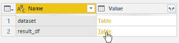

    图 10.28 – 选择 result_df 表

1.  你将看到以下表格的内容，该表格显示了针对每个仓库和国家的组合，线性优化问题的解提供的运输数量以及相应的成本：

    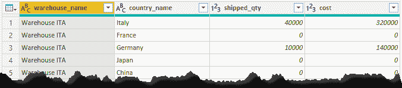

    图 10.29 – 选择 result_df 表

1.  点击 **关闭并应用**。

记住，对源隐私级别的控制已被禁用。你应该在项目结束时将其重新启用，以便根据每个文件的隐私级别设置*组合数据*，以防因查询折叠机制而导致可能的数据泄露（更多详情，请参阅 *参考文献* 部分）。

> **重要提示**
> 
> 还要记住，如果你想将报告发布到 Power BI 服务，所有数据源的隐私级别必须设置为 **公共**。

你知道吗？你看到的所有关于 LP 问题的内容也可以在 R 中实现？让我们看看如何实现它。

## 使用 R 解决 LP 问题

如果 Python 社区非常活跃，那么 R 社区当然也不会停滞不前！实际上，**优化建模包**（**OMPR**）是可用的（[`dirkschumacher.github.io/ompr/`](https://dirkschumacher.github.io/ompr/)），这是一个为在 R 中建模和解决 LP 问题而创建的领域特定语言。

通常，所有其他在 R 中开发的、服务于相同目的的包大多是矩阵导向的，迫使你在将对象传递给求解器之前将所有对象转换为矩阵和向量。这项任务乍一看可能足够简单，但当要解决的问题变得复杂时，编写解决这些问题的 R 代码可能会变得困难。

另一方面，`ompr` 包提供了足够的表达能力，允许你增量地建模你的 LP 问题，这也要归功于 `%>%` 管道的使用。因此，你会感觉就像在使用 `dplyr` 函数编写代码一样，忘记了矩阵和向量。

此外，`ompr` 包依赖于另一个名为 `ompr.roi` 的包，以便能够选择解决 LP 问题的首选引擎。该包在幕后使用一个复杂的框架来处理 R 中的线性和非线性优化问题，这个框架被称为 **R 优化基础设施**（**ROI**），由另一个名为 `ROI` 的包提供（[`roi.r-forge.r-project.org/`](http://roi.r-forge.r-project.org/)）。

在我们的示例中，我们将使用由 **ROI** 添加的插件 **GLPK** 求解器。

因此，让我们看看如何使用 `ompr` 包在 R 中设置我们在上一节中描述的 LP 问题。

### 在 R 中解决 LP 问题

首先，你需要安装 `ompr` 正确运行所需的包。因此，按照以下步骤操作：

1.  打开 RStudio 并确保它引用的是你最新的 CRAN R 版本（在我们的例子中是版本 4.0.2）。

1.  点击 **控制台** 窗口，输入以下命令：`install.packages('ompr')`。然后，按 *Enter*。

1.  输入以下命令：`install.packages(‘ompr.roi’)`。然后，按*Enter*键。

1.  输入以下命令：`install.packages(‘ROI.plugin.glpk’)`。然后，按*Enter*键。

你可以在`Chapter10\R`文件夹中的`03-linear-optimization-in-r.R`文件中找到所有将展示的代码。

首先，你需要导入所需的包和来自`Chapter10`文件夹中的`RetailData.xlsx`文件的数据：

```py
library(dplyr)
library(tidyr)
library(readxl)
library(ompr)
library(ompr.roi)
library(ROI.plugin.glpk)
warehouse_supply_tbl = read_xlsx(r’{D:\<your-path>\Chapter10\RetailData.xlsx}’, sheet = ‘Warehouse Supply’)
country_demands_tbl = read_xlsx(r’{D:\<your-path>\Chapter10\RetailData.xlsx}’, sheet = ‘Country Demand’)
cost_matrix_tbl = read_xlsx(r’{D:\<your-path>\Chapter10\RetailData.xlsx}’, sheet = ‘Shipping Cost’)
```

之后，你可以从 tibbles 中计算数组和成本矩阵，这些是随后使用`ompr`设置模型所需的：

```py
n_warehouses <- cost_matrix_tbl %>% 
distinct(warehouse_name) %>% 
count() %>% 
pull(n)
n_countries <- cost_matrix_tbl %>% 
distinct(country_name) %>% 
count() %>% 
pull(n)
warehouse_supply <- warehouse_supply_tbl %>% 
pull(product_qty)
country_demands <- country_demands_tbl %>% 
pull(product_qty)
cost_matrix <- data.matrix(
cost_matrix_tbl %>% 
pivot_wider( names_from = country_name, values_from = shipping_cost ) %>% 
select( -warehouse_name )
)
rownames(cost_matrix) <- warehouse_supply_tbl %>% pull(warehouse_name)
```

为了将`cost_matrix_tbl` tibble 中成本数据的垂直形式转换为水平形式，我们使用了`tidyr`包提供的非常方便的`pivot_wider()`函数。

在此阶段，如果我们遵循*公式化 LP 问题*部分中展示的数学模型，使用`ompr`暴露的函数定义模型几乎是直截了当的：

```py
model <- MIPModel() %>% 
# define the x integer variables, paying attention to define also the lower bound of 0
add_variable( x[i, j], i = 1:n_warehouses, j = 1:n_countries, type = “integer”, lb = 0 ) %>% 
# define the objective function, declaring also the “sense” that is the type of problem (minimize)
set_objective( sum_expr(cost_matrix[i, j] * x[i, j], i = 1:n_warehouses, j = 1:n_countries), sense = ‘min’ ) %>% 
# add warehouse supply constraints
add_constraint( sum_expr(x[i, j], j = 1:n_countries) <= warehouse_supply[i], i = 1:n_warehouses ) %>% 
# add customer demand constraints
add_constraint( sum_expr(x[i, j], i = 1:n_warehouses) >= country_demands[j], j = 1:n_countries )
```

`sum_expr()`函数乍一看可能难以理解。让我们以这段代码为例：

```py
sum_expr(x[i, j], j = 1:n_countries)
```

可以完整阅读如下：*将决策变量 x[i,j]替换为从 1 到 n_countries（即 6）的值，然后对结果变量求和*。总之，你要求计算如下：

```py
x[i,1] + x[i,2] + x[i,3] + x[i,4] + x[i,5] + x[i,6]
```

在此阶段，一旦定义了模型，你可以使用以下代码使用`glpk`求解器来解决问题：

```py
result <- model %>% 
solve_model(with_ROI(solver = ‘glpk’))
```

获得的结果（显然，因为解决方案是最优的）与之前使用 Python 的`PuLP`模块看到的结果一致：

```py
decision_var_results <- matrix(result$solution, nrow = n_warehouses, ncol = n_countries, )
rownames(decision_var_results) <- warehouse_supply_tbl %>% pull(warehouse_name)
colnames(decision_var_results) <- country_demands_tbl %>% pull(country_name)
decision_var_results
```

你一定会认出之前已经看到的解决方案：

```py
              Italy France Germany Japan China   USA
Warehouse ITA 40000      0   10000     0     0     0
Warehouse DEU     0  10000   15000  5000     0     0
Warehouse JPN     0      0       0 40000     0     0
Warehouse USA     0   5000       0     0 25000 25000
```

你看到你也能在 R 中解决 LP 问题了吗？并没有什么特别复杂的地方，对吧？非常好！

让我们现在应用在 Power BI 中看到的内容。

### 使用 R 在 Power BI 中解决 LP 问题

在*使用 Python 解决 Power BI 中的 LP 问题*部分中已经暴露了解决我们的 LP 问题在 Power BI 中的实现复杂性。因此，我们将在这里使用 R 进行单独的步骤，而不深入细节：

1.  打开 Power BI Desktop，确保在**选项**中将隐私设置为**始终忽略隐私级别设置**。

1.  点击功能区上的**Excel Workbook**（或在主画布上的**从 Excel 导入数据**），选择`Chapter10`文件夹中的`RetailData.xlsx`文件，然后点击**打开**。

1.  选择**CountryDemand**、**ShippingCost**和**WarehouseSupply**表格（带有蓝色标题的表格），然后点击**Transform Data**：

    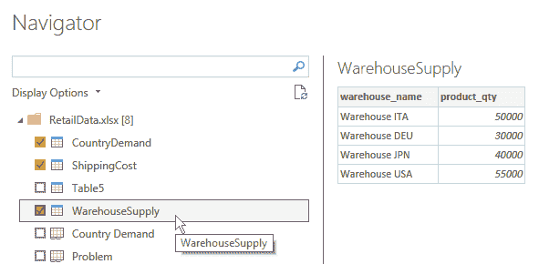

    图 10.30 – 从 Excel 中选择三个表格

1.  在左侧选择**CountryDemand**查询，点击功能区上的**Transform**选项卡，然后点击**Run R Script**。

1.  在脚本编辑器中输入以下 R 代码（正确更改路径），然后点击**OK**：

    ```py
    library(dplyr)
    country_demands <- dataset %>% 
    pull(product_qty)
    saveRDS(country_demands, r’{D:\<your-path>\Chapter10\R\country_demands.rds}’)
    country_demand_df <- dataset
    ```

    你将看到国家需求数据，但幕后，一个名为`country_demands.rds`的向量已经被序列化，存放在`Chapter10/R`文件夹中。

1.  在左侧选择**ShippingCost**查询，点击功能区上的**转换**选项卡，然后点击**运行 R 脚本**。

1.  在脚本编辑器中输入以下 R 代码，然后点击**确定**：

    ```py
    library(dplyr)
    library(tidyr)
    n_warehouses <- dataset %>% 
    distinct(warehouse_name) %>% 
    count() %>% 
    pull(n)
    n_countries <- dataset %>% 
    distinct(country_name) %>% 
    count() %>% 
    pull(n)
    cost_matrix <- data.matrix(
    dataset %>% 
    pivot_wider( names_from = country_name, values_from = shipping_cost ) %>% 
    select( -warehouse_name )
    )
    rownames(cost_matrix) <- dataset %>% 
    distinct(warehouse_name) %>% 
    pull(warehouse_name)
    saveRDS(cost_matrix, r’{D:\<your-path>\Chapter10\R\cost_matrix.rds}’)
    cost_matrix <- dataset
    ```

    你将看到成本矩阵数据，但幕后，一个名为`cost_matrix.rds`的矩阵已经在`Chapter10/R`文件夹中序列化。

1.  在左侧选择**WarehouseSupply**查询，点击功能区上的**转换**选项卡，然后点击**运行 R 脚本**。

1.  在脚本编辑器中输入以下 R 代码，然后点击**确定**：

    ```py
    library(dplyr)
    warehouse_supply <- dataset %>% 
    pull(product_qty)
    saveRDS(warehouse_supply, r’{D:\<your-path>\Chapter10\R\warehouse_supply.rds}’)
    warehouse_supply_df <- dataset
    ```

    你将看到仓库供应数据，但幕后，一个名为`warehouse_supply.rds`的向量已经在`Chapter10/R`文件夹中序列化。

1.  在左侧的查询面板上右键单击，选择**新建查询**，然后**合并**，然后**合并查询为新建**。

1.  在**合并**窗口中，选择**CountryDemand**和**ShippingCost**表，然后选择两个表中的`country_name`列并点击**确定**。

1.  将出现一个新的**Merge1**查询。点击它，展开**ShippingCost**表的内容，然后点击**确定**。

1.  切换到**主页**选项卡，确保已选择**Merge1**查询，然后点击功能区上的**合并查询**以合并**WarehouseSupply**。

1.  在**合并**窗口中选择**WarehouseSupply**表，然后点击两个表中的`ShippingCost.warehouse_name`和`warehouse_name`列，然后点击**确定**。

1.  展开**WarehouseSupply**列并点击**确定**。

1.  点击功能区上的**转换**选项卡，点击**运行 R 脚本**，并输入脚本，你可以在`Chapter10\R`文件夹中的`04-linear-optimization-in-power-bi-with-r.R`文件中找到该脚本。

1.  你将看到以下表格的内容，该表格显示了每个仓库和国家的组合提供的线性优化问题的解的发货量值以及相应的成本：

    

    图 10.31 – **WarehouseSupply**表的内容

1.  点击**关闭并应用**。

记住，源隐私级别控制已被禁用。你应该在项目结束时将其重新启用，以便根据每个文件的隐私级别设置*合并数据*，以防因查询折叠机制可能导致的潜在数据泄露（更多详情，请参阅*参考文献*部分）。

## 摘要

在本章中，你学习了如何使用 Python 和 R 根据球面三角学中最常用的定义来计算两个地理点之间的距离。然后你将这一知识应用于 Power BI 中的实际案例。

你还学习了如何通过一些 Python 和 R 包解决最简单的线性规划问题。同样，你将所学知识应用于 Power BI 中的实际案例。

在下一章中，你将看到如何通过统计学为你的商业分析添加一些盐分。

## 参考文献

对于额外的阅读，请参阅以下书籍和文章：

+   *关于球面三角学* ([`www.robingilbert.com/blog/2017-10-01-on-spherical-trigonometry/`](http://www.robingilbert.com/blog/2017-10-01-on-spherical-trigonometry/))

+   *使用 Python 计算两个 GPS 点之间的距离（Vincenty 逆公式）* ([`nathanrooy.github.io/posts/2016-12-18/vincenty-formula-with-python/`](https://nathanrooy.github.io/posts/2016-12-18/vincenty-formula-with-python/))

+   *使用 NumPy 和 pandas 在 Python 中进行向量化和平行化* ([`datascience.blog.wzb.eu/2018/02/02/vectorization-and-parallelization-in-python-with-numpy-and-pandas/`](https://datascience.blog.wzb.eu/2018/02/02/vectorization-and-parallelization-in-python-with-numpy-and-pandas/))

+   *数据隐私防火墙背后的场景* ([`docs.microsoft.com/en-us/power-query/dataprivacyfirewall`](https://docs.microsoft.com/en-us/power-query/dataprivacyfirewall))
