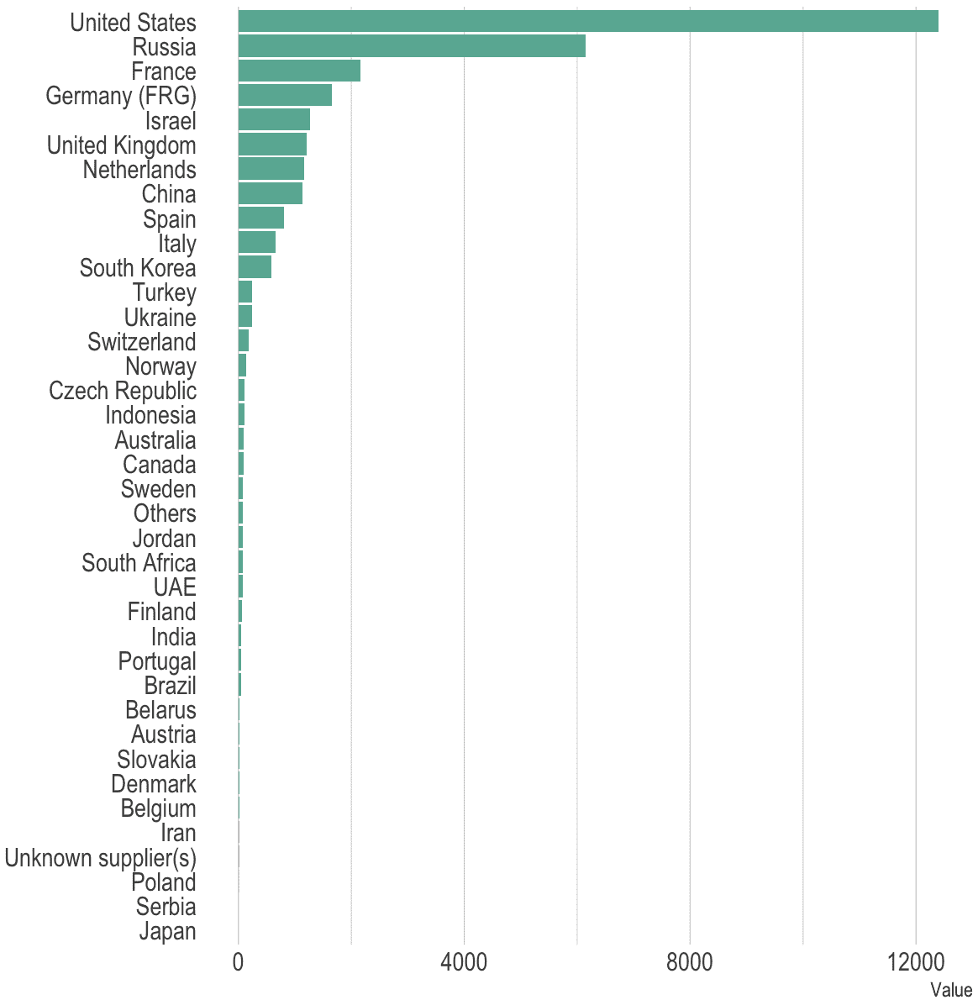
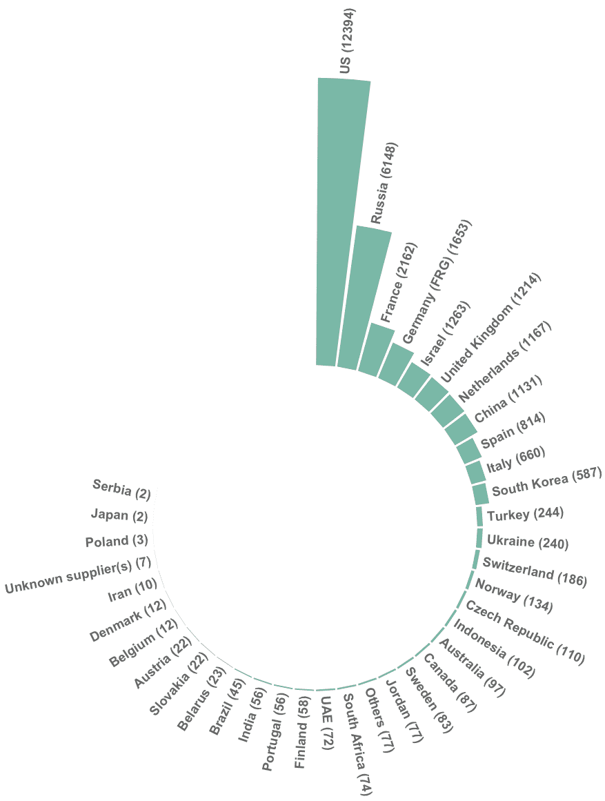
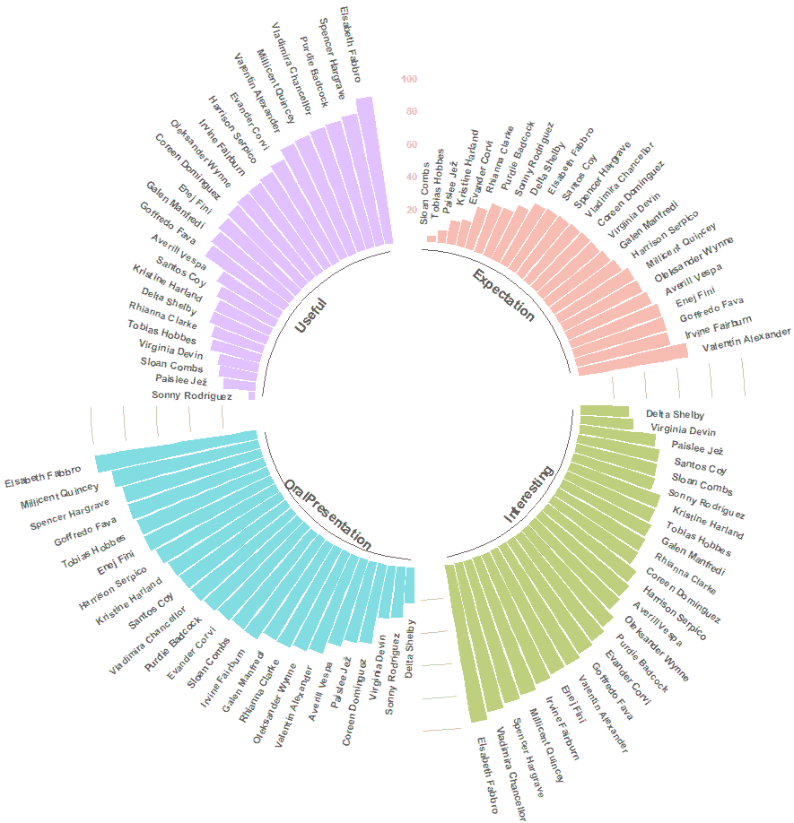
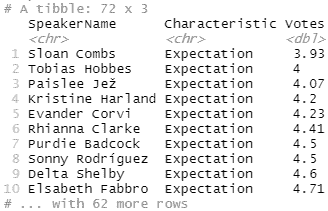
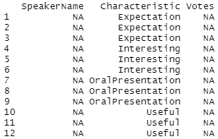
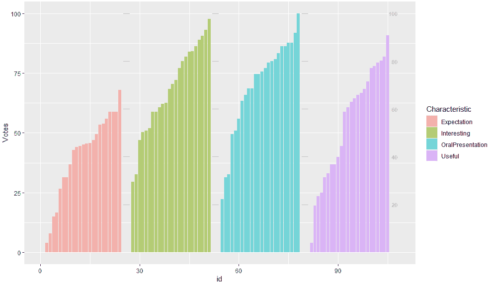
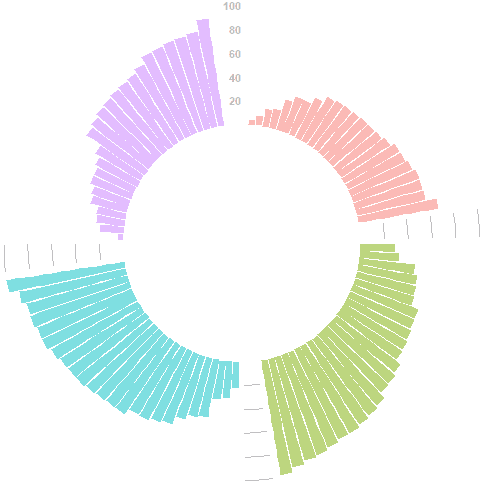
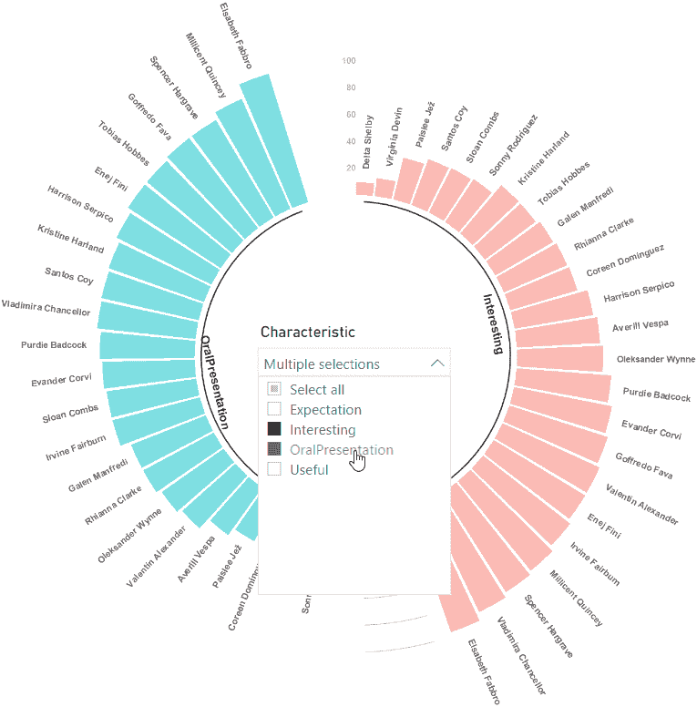

# 第十六章：15 高级可视化

正如您在*第十四章*、*探索性数据分析*中已经看到的，得益于`ggplot2`包及其扩展，您可以创建非常专业的图表。在本章中，您将了解如何创建一个非常高级且吸引人的自定义图表。您将学习以下主题：

+   选择圆形条形图

+   在 R 中实现圆形条形图

+   在 Power BI 中实现圆形条形图

## 技术要求

本章要求您在计算机上已经安装了可工作的互联网连接和**Power BI Desktop**。您必须已按照*第二章*、*配置 Power BI 中的 R*和*第三章*、*配置 Power BI 中的 Python*中概述的方式正确配置了 R 和 Python 引擎以及 IDE。

## 选择圆形条形图

非常常见的情况是我们需要使用**条形图**（或**条形图**）来表示与各种分类实体相关的度量。然而，当要表示的实体数量超过 15 或 20 个时，图表开始变得难以阅读，即使您将其垂直排列：



图 15.1 – 全球武器销售商的条形图

在这种情况下，正如您在*第十四章*、*探索性数据分析*中已经看到的，通常在表示尽可能多的实体之后，将后续的个别实体分组到一个单独的类别中（在我们的例子中，是*其他*类别）是一个好主意。这样，图表的可读性得到了保留，但您想要表示的部分信息却丢失了。

如果严格必要显示所有实体及其度量，我们通常会求助于一种更引人注目的条形图空间组织方式，将其包裹成圆形形状，从而获得**圆形条形图**：



图 15.2 – 全球武器销售商的圆形条形图

当您不仅需要表示所有实体，而且还需要适当地对它们进行分组时，图表变得更加有趣。考虑一个有 24 位演讲者的活动列表，每位演讲者都从观众那里收到了对其在演讲中展示的一些特征（*期望*、*有趣*、*有用*和*口头表达*）的反馈（1 到 5 分）。因此，最终您有*24 x 4 = 96*个实体需要展示。描述这种情况的分组圆形条形图非常有说明性：



图 15.3 – 演讲者反馈组的圆形条形图

图 15.3 中的圆形条形图是我们将在下一节中使用 R 和`ggplot2`包实现的。

## 在 R 中实现圆形条形图

本节中你将看到的 R 代码受到了 **R Graph Gallery** 网站分享给整个 R 社区的代码的启发（[`www.r-graph-gallery.com/index.html`](https://www.r-graph-gallery.com/index.html)）。除了几个非常小的添加之外，我们使用 `tidy evaluation` 框架重构和泛化了代码，形成了 `circular_grouped_barplot()` 函数，以便它可以与任何数据集一起使用。

如果你记得正确的话，在之前章节中你看到的 R 函数中，你将列名作为字符串传递给函数。多亏了 `tidy evaluation`，你可以使用 *tidyverse 语法* 将它们传递给函数，也就是说，通过管道直接传递。以下是一个例子：

```py
circular_grouped_barplot(data = speakers_tbl,
                         grp_col_name = 'Characteristics',
                         label_col_name = 'SpeakerName',
                         value_col_name = 'Value')
```

你将不会看到之前函数的调用，而是以下调用：

```py
speakers_tbl %>% 
  circular_grouped_barplot(grp_col_name = Characteristics,
                           label_col_name = SpeakerName,
                           value_col_name = Value)
```

注意在最后的脚本中，标识字符串的引号消失了。

让我们一步一步地看看这个函数做了什么。这里提供的代码摘自 `Chapter15` 文件夹中的 `01-circular-grouped-barplot.R` 文件。让我们按以下步骤进行：

1.  首先，确保 `scales` 包已经安装在你的 CRAN R 专用视觉包中（在我们的案例中，版本为 3.4.4）。只需检查其名称是否在 RStudio 右下角的 **包** 选项卡中列出的列表中。如果不是，像往常一样使用 `install.packages('scales')` 命令进行安装。

1.  你将使用的数据集来自 `Chapter15` 文件夹中的 `Scores.csv` 文件。正如前文所述，它包含了 24 位演讲者从会议参与者那里获得的关于他们在演讲中展示的一些特征的平均反馈。tibble 的样子如下：

    

    图 15.4 – 讲演者 tibble

1.  在调用 `circular_grouped_barplot()` 函数之后，立即定义了内部的 `rescale100()` 函数，该函数用于将整个数据集（在我们的案例中是投票）的值缩放到 0 到 100 的范围内。

1.  通过 `enquo()` 函数传递给函数的参数执行被延迟（更多细节请参阅参考文献）：

    ```py
    grp_var <- enquo(grp_col_name)
    label_var <- enquo(label_col_name)
    value_var <- enquo(value_col_name)
    ```

1.  输入数据集的分类变量被转换成因子，并且通过之前定义的函数对值进行缩放，所有这些操作都使用了 `tidy evaluation`：

    ```py
    data <- data %>% 
      mutate( 
        !!quo_name(grp_var) := as.factor(!!grp_var),
        !!quo_name(label_var) := as.factor(!!label_var),
        !!quo_name(value_var) := rescale100(!!value_var) )
    ```

1.  为了在每个条形图组末尾分隔每个条形图组，添加了一些空条形图。首先，定义一个空条形图 DataFrame：

    ```py
    empty_bars <- 3
    # Create the empty dataframe to add to the source dataframe
    data_to_add <- data.frame(matrix(NA, empty_bars * nlevels(data[[quo_name(grp_var)]]), ncol(data)) )
    colnames(data_to_add) <- colnames(data)
    data_to_add[[quo_name(grp_var)]] <- rep(levels(data[[quo_name(grp_var)]]), each = empty_bars)
    ```

    它具有以下形状：

    

    图 15.5 – 空条形图 DataFrame

1.  然后，空 DataFrame 被添加到源 DataFrame（`data`）中。一旦结果 DataFrame 按分组变量和值重新排序，空条形图的行将自动分布在每个组的末尾：

    ```py
    data <- rbind(data, data_to_add)
    # Reorder data by groups and values
    data <- data %>% arrange(!!grp_var, !!value_var)
    ```

1.  添加了一个条形图标识符：

    ```py
    data$id <- seq(1, nrow(data))
    ```

    它用于计算每个标签必须显示的角度：

    ```py
    # Get the total number of bars
    number_of_bars <- nrow(data)
    # Subtract 0.5 from id because the label must have the angle of the center of the bars,
    # Not extreme right(1) or extreme left (0)
    angles_of_bars <- 90 - 360 * (data$id - 0.5) / number_of_bars
    ```

1.  我们从 `data` DataFrame 开始定义标签 DataFrame，考虑到标签与条形的正确对齐以及它们必须具有的正确角度以便可读：

    ```py
    label_data <- data
    label_data$hjust <- ifelse( angles_of_bars < -90, 1, 0)
    label_data$angle <- ifelse( angles_of_bars < -90, angles_of_bars + 180, angles_of_bars)
    ```

1.  定义了一个用于组基线的 DataFrame。它包含每个组的起始和结束 ID（条形），每个组的平均 ID（用作组文本标签的基准点），以及每个文本标签必须旋转的角度：

    ```py
    base_data <- data %>% 
      group_by(!!grp_var) %>% 
      summarize(start = min(id),
                end = max(id) - empty_bars) %>% 
      rowwise() %>% 
      mutate(title = floor(mean(c(start, end)))) %>% 
      inner_join( label_data %>% select(id, angle),
                  by = c('title' = 'id')) %>% 
      mutate( angle = ifelse( (angle > 0 & angle <= 90) |
                             (angle > 180 & angle <= 270),
                              angle-90, angle+90 ) )
    ```

1.  一个 `if` 子句确定是否根据源数据集的内容最初定义一个只有一个组或多个组的条形图。在我们的例子中，由于有四个组，代码如下：

    ```py
    p <- data %>%
      ggplot(aes_string(x = 'id', y = quo_name(value_var), fill = quo_name(grp_var))) +
      # Add a barplot
      geom_bar(stat = 'identity', alpha=0.5) +
      # Add 100/75/50/25 indicators
      geom_segment(data = grid_data,
          aes(x = end, y = 100, xend = start, yend = 100),
          colour = 'grey', alpha=1, size=0.3 ,
          inherit.aes = FALSE ) +
      geom_segment(data = grid_data,
          aes(x = end, y = 80, xend = start, yend = 80),
          colour = 'grey', alpha=1, size=0.3 ,
          inherit.aes = FALSE ) +
      geom_segment(data = grid_data,
          aes(x = end, y = 60, xend = start, yend = 60),
          colour = 'grey', alpha=1, size=0.3 ,
          inherit.aes = FALSE ) +
      geom_segment(data = grid_data,
          aes(x = end, y = 40, xend = start, yend = 40),
          colour = 'grey', alpha=1, size=0.3 ,
          inherit.aes = FALSE ) +
      geom_segment(data = grid_data,
          aes(x = end, y = 20, xend = start, yend = 20),
          colour = 'grey', alpha=1, size=0.3 ,
          inherit.aes = FALSE ) +
      # Add text showing the value of each 100/75/50/25 lines
      annotate('text', x = rep(max(data$id), 5),
               y = c(20, 40, 60, 80, 100),
               label = c('20', '40', '60', '80', 100) ,
               color='grey', size=3,
               angle=0, fontface='bold', hjust=1)
    ```

    条形图表示如下：

    

    图 15.6 – 条形图初稿的表示

1.  在定义文本对齐向量后，之前的图表通过使用 `coord_polar()` 函数被清理了不必要的图形装饰，并神奇地被包裹成圆形形状：

    ```py
    p <- p +
      # The space between the x-axis and the lower edge of the figure will implicitly define the width of the empty circle inside the plot 
      ylim(-120,120) +
      theme_minimal() +
      theme(
        legend.position = 'none',
        axis.text = element_blank(),
        axis.title = element_blank(),
        panel.grid = element_blank(),
        plot.margin = unit(rep(-1,4), 'cm') 
      ) +
      # Wrap all in a circle!
      coord_polar()
    ```

    你将得到以下初稿：

    

    图 15.7 – 圆形条形图的初稿

    不幸的是，`coord_polar()` 函数不会旋转或弯曲标签。因此，你必须单独添加它们，并在需要时手动旋转。

1.  最后，让我们添加适当旋转的条形标签、组基线和适当旋转的组文本标签：

    ```py
    p <- p +
      # Add labels
      geom_text(data = label_data %>% mutate( y_pos = !!value_var + 10),
          aes_string(x = 'id', y = 'y_pos',
                     label = quo_name(label_var),
                     hjust = 'hjust'),
          color = 'black', fontface = 'bold',
          alpha = 0.6, size = 3,
          angle = label_data$angle,
          inherit.aes = FALSE) +

      # Add base lines of groups
      geom_segment(data = base_data,
          aes(x = start, y = -5, xend = end, yend = -5),
          colour = 'black', alpha=0.8,
          size=0.6 , inherit.aes = FALSE ) +

      # Add groups text
      geom_text(data = base_data %>% mutate(y = -14),
          aes_string(x = 'title', y = 'y',
                     label=quo_name(grp_var),
                     angle = 'angle'),
          hjust = text_horiz_justification,
          colour = 'black', alpha=0.8, size=4,
          fontface='bold', inherit.aes = FALSE)
    ```

    结果可以在 *图 15.3* 中看到。

这只是利用图形语法制作复杂图表有效性的一个示例。正如你所看到的，这个框架允许你通过一次添加一个模块化逻辑块来逐步创建复杂图表，并通过直观测试结果。

> **重要提示**
> 
> 本节中使用的代码使用了 `tidy evaluation` 的旧版本，与较旧的 `rlang`、`dplyr` 和 `ggplot2` 版本相关联。这种选择是由于 Power BI 服务使用较旧的 R 引擎版本（3.4.4）以及之前包的较旧版本所迫。
> 
> 从 `rlang` 的 4.0 版本、`ggplot2` 的 3.0.0 版本和 `dplyr` 的 1.0.0 版本开始，`tidy evaluation` 所使用的语法已经简化并标准化。你可以在 `02-circular-grouped-barplot-new-tidy-eval.R` 文件中找到一个相同功能的示例，该示例为之前包的新版本绘制圆形条形图。

现在我们来看看如何在 Power BI 中实现圆形条形图。

## 在 Power BI 中实现圆形条形图

正如你在前面的章节中已经看到的，Power BI 能够使用 R 可视化渲染由 `ggplot2` 开发的图表。因此，无论使用 `ggplot2` 创建的图表有多复杂，你都可以确信 Power BI 能够很好地处理它。

在 Power BI 中创建圆形条形图，请按照以下步骤操作：

1.  确保 Power BI 桌面版在**选项**中引用的是针对 R 视觉的 CRAN R 版本。

1.  点击**获取数据**，然后点击**文本/CSV**，接着点击**连接**。

1.  选择`Chapter15`文件夹中找到的`Scores.csv`文件，然后点击**打开**。

1.  你将看到 CSV 文件的预览。请确保选择`65001: Unicode (UTF-8)`作为**文件来源**。这样，演讲者名称中的特殊字符将正确显示。然后，点击**加载**。

1.  在**可视化**面板中点击**R 视觉**图标，启用它，然后将视觉调整到所有可用画布的大小。

1.  在**字段**面板下展开选中的 R 视觉，并检查所有字段。

1.  点击 R 视觉的**格式**选项卡，关闭**标题**。

1.  将`01-circular-grouped-barplot.R`文件的代码复制到`Chapter15`文件夹中，并将其粘贴到 R 视觉脚本编辑器中。然后，点击 R 脚本编辑器右上角的**运行脚本**箭头图标（每次请求时都启用 R 视觉）。你将得到一个圆形条形图。

1.  首先在报告画布上的空白处点击，然后点击筛选器视觉图标。然后，在**字段**面板下展开`Scores`表，并检查`特征`度量。

1.  点击筛选器右上角的向下箭头以选择**下拉**筛选器类型。

1.  调整筛选器的底部和右边框，将其移动到圆形条形图的中心，点击其**格式**选项，然后在**选择控件**下打开**显示全选选项**。

现在，你可以使用*Ctrl*键过滤多个特征，并且圆形条形图将相应更新：



图 15.8 – Power BI 中通过筛选器过滤的圆形条形图

非常令人印象深刻，对吧？通过稍微练习一下`ggplot2`和 R，你可以得到你想要的任何令人印象深刻的图表来丰富你的分析。

## 摘要

在本章中，你学习了如何使用 R 和`ggplot2`实现圆形条形图。你还首次体验了在重构实现圆形条形图功能的代码为函数时使用`tidy evaluation`。

之后，你在 Power BI 中实现了一个圆形条形图。

在下一章中，你将学习如何在 R 和 Power BI 中开发交互式自定义视觉。

## 参考文献

对于额外的阅读，请查看以下书籍和文章：

1.  *谁卖更多的武器？* ([`www.data-to-viz.com/story/OneNumOneCat.html`](https://www.data-to-viz.com/story/OneNumOneCat.html))

1.  *分组圆形条形图* ([`www.r-graph-gallery.com/297-circular-barplot-with-groups.html`](https://www.r-graph-gallery.com/297-circular-barplot-with-groups.html))

1.  *tidy eval 的兔子洞之旅 — 第一部分（旧的 tidy eval 方法)* ([`colinfay.me/tidyeval-1/)`](https://colinfay.me/tidyeval-1/))

1.  *整洁评估（新的整洁评估方式）* ([`tidyeval.tidyverse.org/)`](https://tidyeval.tidyverse.org/))
