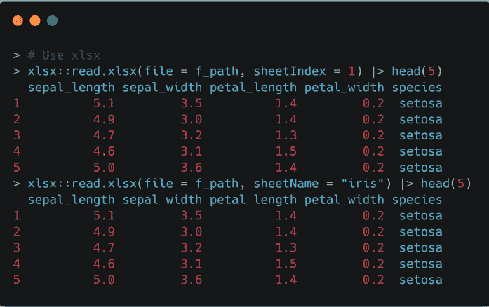
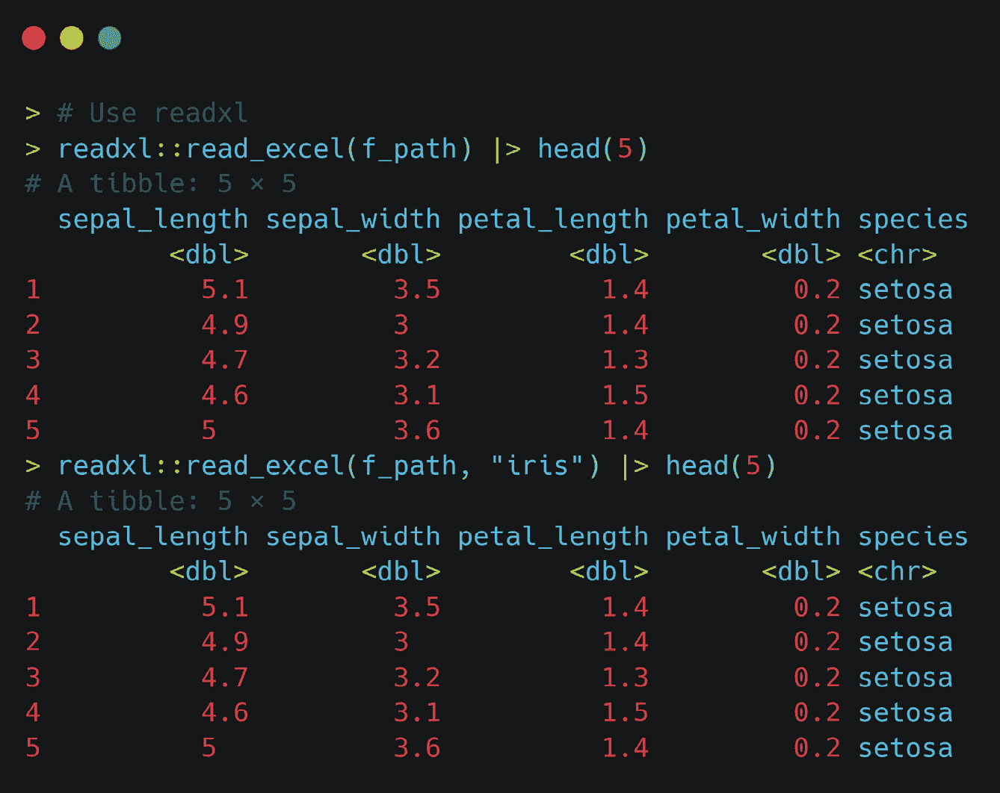
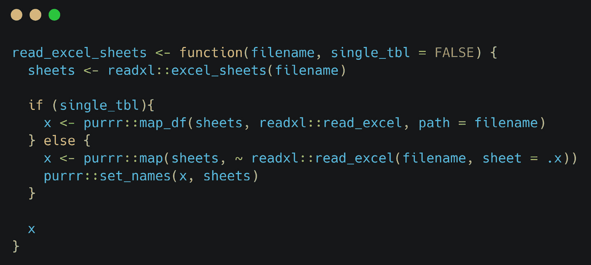
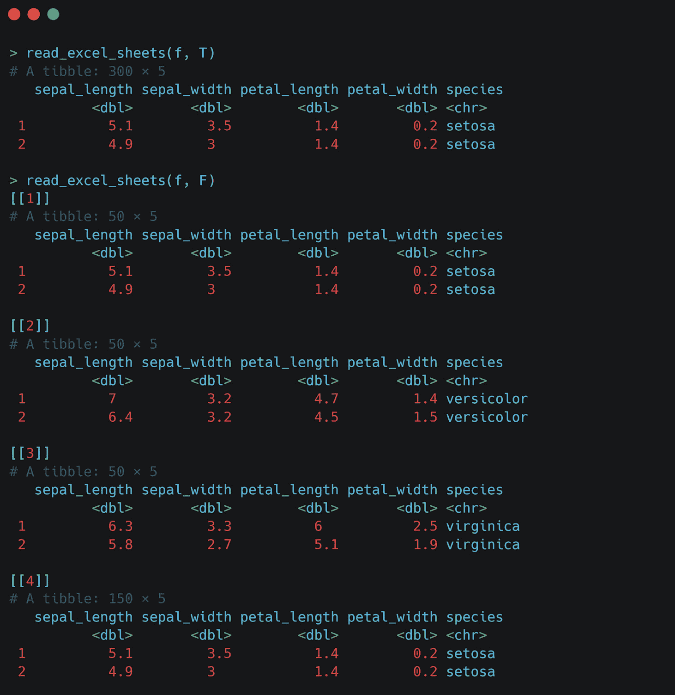
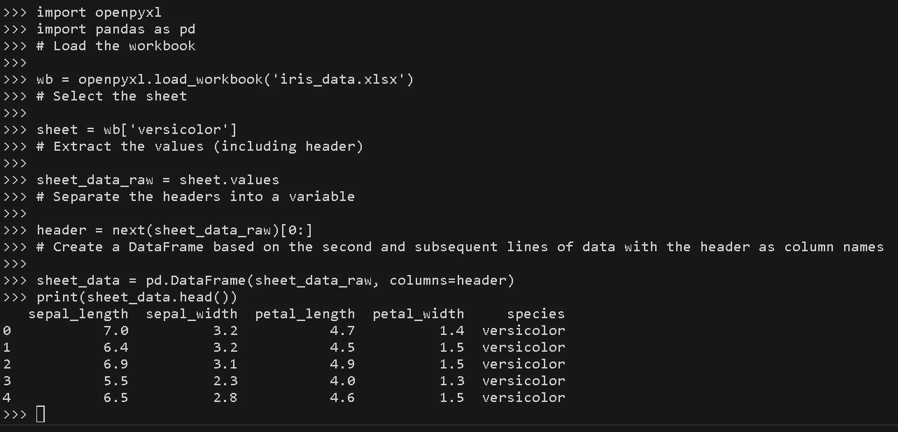

# 第一章：读取 Excel 电子表格

在深入和广泛的数据分析领域中，Excel 作为一位值得信赖的战士，站在您的身边，简化了组织、计算和展示信息的过程。其直观的界面和广泛的使用使其在商业世界中成为必备品。然而，随着数据量和复杂性的指数级增长，Excel 的功能可能会开始感到受限。正是在这一点上，Excel、R 和 Python 的世界交汇。通过 R 和 Python 扩展 Excel，邀请您踏上真正变革的旅程。这次旅行将向您展示这些编程语言与 Excel 协同工作的力量，扩展其视野，并使您能够轻松征服数据挑战。在这本书中，我们将深入研究如何将 Excel 与 R 和 Python 集成，揭示隐藏在表面之下的潜力，并使您能够提取有价值的见解，自动化流程，并释放数据分析的真正力量。

微软 Excel 于 1985 年上市，并一直是一种流行的电子表格软件选择。Excel 最初被称为 MultiPlan。在组织和管理数据方面，Microsoft Excel 和数据库在某种程度上具有相似之处，尽管它们服务于不同的目的。Excel 是一种电子表格程序，允许用户以表格格式存储和操作数据。它由行和列组成，其中每个单元格可以包含文本、数字或公式。同样，数据库是一个结构化数据集合，以表格形式存储，由行和列组成。

Excel 和数据库都提供了一种存储和检索数据的方式。在 Excel 中，您可以输入数据，执行计算，并创建图表和图形。同样，数据库存储和管理大量结构化数据，并支持查询、排序和过滤。Excel 和数据库也支持关系概念。在 Excel 中，您可以链接不同工作表中的单元格或范围，创建数据之间的连接。数据库使用关系根据公共字段链接表，允许您从多个表中检索相关数据。

本章旨在使您熟悉将 Excel 文件读取到 R 环境中，并对它们进行一些操作。具体来说，在本章中，我们将涵盖以下主要主题：

+   用于 Excel 操作的 R 包

+   使用 R 读取 Excel 文件进行操作

+   使用自定义 R 函数读取多个 Excel 工作表

+   用于 Excel 操作的 Python 包

+   从 Python 打开 Excel 工作表并读取数据

# 技术要求

在编写本文档时，我们使用以下：

+   R 4.2.1

+   RStudio 2023.03.1+446“樱花”版本，适用于 Windows

对于本章，您需要安装以下包：

+   `readxl`

+   `openxlsx`

+   `xlsx`

要运行本章中的 Python 代码，我们将使用以下：

+   Python 3.11

+   `pandas`

+   `openpyxl`

+   本书 GitHub 仓库中提供的 `iris.xlsx` Excel 文件

虽然设置 Python 环境超出了本书的范围，但这很容易做到。可以通过运行以下命令来安装必要的包：

```py
python -m pip install pandas==2.0.1
python -m pip install openpyxl==3.1.2
```

注意，这些命令必须在终端中运行，而不是在 Python 脚本内部运行。它们需要在 `requirements.txt` 文件所在的文件夹中运行，或者必须包含 `requirements.txt` 文件的完整路径。

本书 GitHub 仓库还包含一个 `requirements.txt` 文件，你可以使用它来安装所有依赖。你可以通过运行以下命令来完成此操作：

```py
python -m pip install -r requirements.txt
```

此命令安装了本章将使用的所有包，这样你就不必逐个安装它们。它还保证了整个依赖树（包括依赖的依赖）将与本书作者使用的完全相同。

或者，当使用 Jupyter Notebooks 时，你可以使用以下魔法命令：

```py
%pip install pandas==2.0.1
%pip install openpyxl==3.1.2
```

本书中的所有代码示例的 GitHub 账户位于以下链接：[`github.com/PacktPublishing/Extending-Excel-with-Python-and-R`](https://github.com/PacktPublishing/Extending-Excel-with-Python-and-R)。每个章节都有自己的文件夹，当前文件夹名为 `Chapter01`。

注意

本书对 Python 的技术要求方便地编译在 `requirements.txt` 文件中，可在 GitHub 仓库中找到，[`github.com/PacktPublishing/Extending-Excel-with-Python-and-R/blob/main/requirements.txt`](https://github.com/PacktPublishing/Extending-Excel-with-Python-and-R/blob/main/requirements.txt)。安装这些依赖项将简化你的编码体验，并确保你在本书中的学习过程顺利。在开始练习之前，请确保安装所有这些依赖项。

# 使用 R 包进行 Excel 操作

在 CRAN 和 GitHub 上都有几个包可用于读取和操作 Excel 文件。在本节中，我们将特别关注以下包：`readxl`、`openxlsx` 和 `xlsx`，用于读取 Excel 文件。这些包都有自己的函数来读取 Excel 文件。这些函数如下：

+   `readxl::read_excel()`

+   `openxlsx::read.xlsx()`

+   `xlsx::read.xlsx()`

每个函数都有一组参数和遵循的约定。由于 `readxl` 是 `tidyverse` 包集合的一部分，它遵循其约定，并在读取文件时返回一个 `tibble` 对象。如果你不知道什么是 tibble，它是一种 R 的 `data.frame` 的现代版本，在 R 环境中类似于电子表格。它是大多数分析的基础。接下来是 `openxlsx` 和 `xlsx`，它们都返回一个基本的 R `data.frame` 对象，后者还能返回一个 `list` 对象。如果你想知道这如何与操作实际的 Excel 文件相关联，我可以解释。首先，要在 R 中操作某些东西，数据必须位于 R 环境中，因此除非数据被读取，否则你不能操作文件。这些包有不同的函数用于以特定方式操作 Excel 或读取数据，从而允许进行进一步的分析和或操作。需要注意的是，`xlsx` 需要安装 Java。

随着我们从对 R 包的 Excel 操作探索过渡，我们将把注意力转向一个关键任务，即有效地将 Excel 文件读入 R，从而解锁数据分析和处理更多的可能性。

# 将 Excel 文件读入 R

在本节中，我们将使用几个不同的 R 库从 Excel 中读取数据。在我们考虑对 Excel 文件中的工作表中的数据进行任何类型的操作或分析之前，我们必须这样做。

如技术要求部分所述，我们将使用 `readxl`、`openxlsx` 和 `xlsx` 包将数据读入 R。

## 安装和加载库

在本节中，如果你还没有这些库，我们将安装和加载必要的库。我们将使用 `openxlsx`、`xlsx`、`readxl` 和 `readxlsb` 库。要安装和加载它们，请运行以下代码块：

```py
pkgs <- c("openxlsx", "xlsx", "readxl")
install.packages(pkgs, dependencies = TRUE)
lapply(pkgs, library, character.only = TRUE)
```

R 中的 `lapply()` 函数是一个适用于将函数应用于列表、向量或 `DataFrame` 中每个元素的通用工具。它接受两个参数，`x` 和 `FUN`，其中 `x` 是列表，`FUN` 是应用于列表对象 `x` 的函数。

现在库已经安装好了，我们可以开始工作了。为此，我们将读取由 R 的基础库中构建的 Iris 数据集构建的电子表格。我们将使用三个不同的库来读取文件，然后我们将创建一个自定义函数来使用 `readxl` 库读取 Excel 文件的全部工作表。我们将把这个函数称为 `read_excel_sheets()`。

让我们开始读取文件。我们将使用 `openxlsx` 库来打开 Excel 文件。要读取我们正在处理的 Excel 文件，你可以运行本书 GitHub 仓库中 `chapter1` 文件夹中的 `ch1_create_iris_dataset.R` 文件中的代码。参考以下截图以了解如何将文件读入 R。

你会注意到一个名为`f_pat`的变量。这是将 Iris 数据集保存为 Excel 文件的路径——例如，`C:/User/UserName/Documents/iris_data.xlsx`：


图 1.1 – 使用 openxlsx 包读取 Excel 文件

上述截图显示了如何读取 Excel 文件。这个例子假设你已经使用了`ch1_create_iris_datase.R`文件来创建示例 Excel 文件。实际上，你可以读取任何你想要或需要的 Excel 文件。

现在，我们将执行相同类型的操作，但这次使用的是`xlsx`库。参考以下截图，它使用了与`openxlsx`包相同的方法：



图 1.2 – 使用 xlsx 库和 read.xlsx()函数打开我们创建的 Excel 文件

最后，我们将使用`readxl`库，它是 tidyverse 的一部分：



图 1.3 – 使用 readxl 库和 read_excel()函数将 Excel 文件读入内存

在本节中，我们学习了如何使用几个不同的包读取 Excel 文件。虽然这些包可以完成比简单地读取 Excel 文件更多的工作，但这是我们本节需要关注的内容。你现在应该熟悉如何使用`readxl::read_excel()`、`xlsx::read.xlsx()`和`openxlsx::read.xlsx()`函数。

建立在将 Excel 文件读入 R 的专长之上，我们现在将开始旅程的下一阶段：揭示从 Excel 文件中的多个工作表高效提取数据的秘密。

# 使用 readxl 和自定义函数读取多个工作表

在 Excel 中，我们经常遇到包含多个工作表的电子表格。这些可能是不同月份的统计数据，按月遵循特定格式的表格数据，或者某些其他周期。关键是，我们可能出于某种原因想要读取文件中的所有工作表，并且我们不应该为每个工作表从特定的包中调用读取函数。相反，我们应该使用 R 的力量通过`purrr`循环遍历：

让我们构建一个自定义函数。为此，我们将加载`readxl`函数。如果我们已经加载了它，那么这就不必要了；然而，如果它已经安装并且我们不希望将库加载到内存中，那么我们可以通过使用`readxl::excel_sheets()`来调用`excel_sheets()`函数：



图 1.4 – 创建一个函数，一次性将所有工作表读入 Excel 文件 – read_excel_sheets()

新代码可以分解如下：

```py
 read_excel_sheets <- function(filename, single_tbl) {
```

这一行定义了一个名为`read_excel_sheets`的函数，它接受两个参数：`filename`（要读取的 Excel 文件名）和`single_tbl`（一个逻辑值，指示函数是否应返回单个表格或表格列表）。

接下来，我们有以下行：

```py
sheets <- readxl::excel_sheets(filename)
```

这一行使用`readxl`包从指定的`filename` Excel 文件中提取所有工作表的名称。工作表名称存储在`sheets`变量中。

这是下一行：

```py
if (single_tbl) {
```

这一行开始了一个`if`语句，用于检查`single_tbl`参数的值。

现在，我们有以下内容：

```py
x <- purrr::map_df(sheets, read_excel, path = filename)
```

如果`single_tbl`为`TRUE`，则这一行使用`purrr`包的`map_df`函数遍历`sheets`中的每个工作表名称，并使用`readxl`包的`read_excel`函数读取相应的工作表。结果`DataFrame`合并为一个单独的表格，并分配给`x`变量。

现在，我们有以下行：

```py
} else {
```

这一行表示`if`语句的`else`块的开始。如果`single_tbl`为`FALSE`，则执行此块中的代码。

这是下一行：

```py
 x <- purrr::map(sheets, ~ readxl::read_excel(filename, sheet = .x))
```

在这一行中，使用`purrr`包的`map`函数遍历`sheets`中的每个工作表名称。对于每个工作表，调用`readxl`包中的`read_excel`函数从指定的`filename` Excel 文件中读取相应的工作表。结果`DataFrame`存储在分配给`x`变量的列表中。

现在，我们有以下内容：

```py
 purrr::set_names(x, sheets)
```

这一行使用`purrr`包的`set_names`函数将`x`列表中元素的名字设置为`sheets`中的工作表名称。

最后，我们有以下行：

```py
 x
```

这一行返回函数中的`x`值，如果`single_tbl`为`TRUE`，则返回单个表格（`data.frame`），如果`single_tbl`为`FALSE`，则返回表格列表（`data.frame`）。

总结来说，`read_excel_sheets`函数接受一个 Excel 文件名和一个逻辑值，表示是否返回单个表格或表格列表。它使用`readxl`包从 Excel 文件中提取工作表名称，然后根据`single_tbl`的值（如果为`TRUE`则将对应的工作表读入单个表格，如果为`FALSE`则读入表格列表）读取相应的工作表。结果数据作为函数的输出返回。为了了解其工作原理，让我们看看以下示例。

我们有一个包含四个标签的工作表——每个标签对应著名的 Iris 数据集中的每个物种，还有一个名为`iris`的工作表，它包含完整的数据集。

如*图 1**.5*所示，`read_excel_sheets()`函数已读取 Excel 文件中的所有四个工作表。我们还可以看到，该函数已将工作表作为列表对象导入，并且已将列表中的每个项目命名为 Excel 文件中对应标签的名称。值得注意的是，为了使此操作生效，所有工作表必须具有相同的列名和结构：



图 1.5 – 使用 read_excel_sheets() 读取的 Excel 文件

在本节中，我们学习了如何编写一个函数，该函数将读取任何 Excel 文件中的所有工作表。此函数还将它们作为命名项列表返回，其中名称是文件本身中标签页的名称。

现在我们已经学习了如何在 R 中读取 Excel 表格，在下一节中，我们将介绍 Python，我们将从 Python 语言的角度重新审视相同的概念。

# 用于 Excel 操作的 Python 包

在本节中，我们将探讨如何使用 Python 读取 Excel 工作表。在 Python 中处理 Excel 文件的一个关键方面是拥有提供必要功能的正确包集。在本节中，我们将讨论一些常用的用于 Excel 操作的 Python 包，并突出它们的优点和考虑因素。

## 用于 Excel 操作的 Python 包

当涉及到在 Python 中与 Excel 文件交互时，有几个包提供了一系列的功能和特性。这些包允许您从 Excel 文件中提取数据，操作数据，并将其写回 Excel 文件。让我们来看看一些流行的用于 Excel 操作的 Python 包。

### pandas

`pandas` 是一个强大的数据处理库，它可以通过 `read_excel` 函数读取 Excel 文件。使用 `pandas` 的优点是它提供了一个 `DataFrame` 对象，这使得您能够以表格形式操作数据。这使得进行数据分析和操作变得容易。`pandas` 在高效处理大型数据集方面表现出色，并提供了灵活的数据过滤、转换和聚合选项。

### openpyxl

`openpyxl` 是一个广泛使用的库，专门设计用于处理 Excel 文件。它提供了一套全面的特性用于读取和写入 Excel 工作表，包括对各种 Excel 文件格式的支持以及与不同版本 Excel 的兼容性。此外，`openpyxl` 允许对 Excel 文件的结构和内容进行精细控制，使得访问单个单元格、创建新工作表和应用格式等任务成为可能。

### xlrd 和 xlwt

`xlrd` 和 `xlwt` 是一些较老的库，它们仍然被用于读取和写入 Excel 文件，尤其是用于 `.xls` 这样的旧格式。`xlrd` 允许从 Excel 文件中读取数据，而 `xlwt` 则便于将数据写入 Excel 文件。这些库轻量级且易于使用，但它们缺乏 `pandas` 和 `openpyxl` 提供的一些高级特性。

## 考虑因素

在选择用于 Excel 操作的 Python 包时，考虑您项目的具体需求至关重要。以下是一些需要考虑的因素：

+   **功能**：评估包的功能，并确保它满足您读取 Excel 文件的需求。考虑您是否需要高级数据操作功能，或者一个更简单的包是否足够。

+   `pandas` 拥有优化的算法，可以提供显著的性能优势。

+   **兼容性**：检查包与不同 Excel 文件格式和版本的兼容性。确保它支持您正在使用的特定格式，以避免任何兼容性问题。

+   `pandas` 拥有更广泛的功能，但可能需要更多的时间和精力来掌握。

每个包都提供独特的功能，各有其优势和劣势，使您能够有效地在 Python 中读取 Excel 电子表格。例如，如果您需要读取和操作大量数据，`pandas` 可能是更好的选择。然而，如果您需要精细控制 Excel 文件，`openpyxl` 可能更适合您的需求。

考虑您项目的具体要求，例如数据大小、功能性和兼容性，以选择最适合您需求的包。在接下来的章节中，我们将深入探讨如何使用这些包通过 Python 读取和提取 Excel 文件中的数据。

# 从 Python 中打开 Excel 工作表并读取数据

在 Python 中处理 Excel 文件时，通常需要打开特定的工作表并将数据读入 Python 进行进一步分析。这可以通过使用前面章节中讨论的流行库，如 `pandas` 和 `openpyxl` 来实现。

您很可能会使用其他 Python 和包版本，但本节中的代码尚未与其他任何内容进行测试，除了我们在此处所提到的。

## 使用 pandas

`pandas` 是一个强大的数据处理库，简化了处理结构化数据的过程，包括 Excel 电子表格。要使用 `pandas` 读取 Excel 工作表，您可以使用 `read_excel` 函数。让我们考虑使用名为 `setosa` 的工作表来使用 `iris_data.xlsx` 文件的一个示例：

```py
import pandas as pd
# Read the Excel file
df = pd.read_excel('iris_data.xlsx', sheet_name='setosa')
# Display the first few rows of the DataFrame
print(df.head())
```

您需要将此代码运行在 Python 的工作目录设置为 Excel 文件所在的位置，或者您需要在 `read_excel()` 命令中提供文件的完整路径：


图 1.6 – 使用 pandas 包读取 Excel 文件

在前面的代码片段中，我们导入了 `pandas` 库并使用了 `read_excel` 函数从 `iris_data.xlsx` 文件中读取 `setosa`。结果数据存储在 `pandas` 的 `DataFrame` 中，它提供了数据的表格表示。通过在 `DataFrame` 上调用 `head()`，我们显示了数据的前几行，以便快速预览。

## 使用 openpyxl

`openpyxl` 是一个强大的库，用于处理 Excel 文件，它提供了对单个单元格和工作表的更细粒度控制。要使用 `openpyxl` 打开 Excel 工作表并访问其数据，我们可以使用 `load_workbook` 函数。请注意，`openpyxl` 无法处理 `.xls` 文件，只能处理更现代的 `.xlsx` 和 `.xlsm` 版本。

让我们考虑一个使用名为 `versicolor` 的工作表的 `iris_data.xlsx` 文件的例子：

```py
import openpyxl
import pandas as pd
# Load the workbook
wb = openpyxl.load_workbook('iris_data.xlsx')
# Select the sheet
sheet = wb['versicolor']
# Extract the values (including header)
sheet_data_raw = sheet.values
# Separate the headers into a variable
header = next(sheet_data_raw)[0:]
# Create a DataFrame based on the second and subsequent lines of data with the header as column names
sheet_data = pd.DataFrame(sheet_data_raw, columns=header)
print(sheet_data.head())
```

以下代码的结果如下：



图 1.7 – 使用 openpyxl 包读取 Excel 文件

在这个代码片段中，我们从 `openpyxl` 库中导入 `load_workbook` 函数。然后，我们通过提供 `iris_data.xlsx` 文件名来加载工作簿。接下来，我们通过访问其名称来选择所需的工作表——在这种情况下，这是 `versicolor`。一旦我们完成这个操作，我们就使用加载的工作表对象的 `values` 属性来读取原始数据。这是一个生成器，可以通过 `for` 循环或将其转换为列表或 `DataFrame` 等方式来访问。在这个例子中，我们将其转换为 `pandas` `DataFrame`，因为这是以后最舒适的工作格式。

`pandas` 和 `openpyxl` 都为在 Python 中处理 Excel 文件提供了有价值的特性。虽然 pandas 通过其 `DataFrame` 结构简化了数据操作，但 `openpyxl` 提供了对单个单元格和工作表的更精细的控制。根据您的具体需求，您可以选择最适合您需求的库。

通过掌握打开 Excel 工作表并将数据读入 Python 的技术，您将能够从 Excel 数据中提取有价值的见解，执行各种数据转换，并为其进一步的分析或可视化做准备。这些技能对于任何寻求利用 Python 和 Excel 的力量在他们的数据驱动工作流程中的人来说是必不可少的。

# 使用 Python 读取多个工作表（openpyxl 和自定义函数）

在许多 Excel 文件中，常见的情况是包含多个工作表，每个工作表包含不同的数据集。能够读取多个工作表并将数据合并到单一的数据结构中，对于分析和处理来说非常有价值。在本节中，我们将探讨如何使用 `openpyxl` 库和自定义函数来实现这一点。

## 读取多个工作表的重要性

当处理复杂的 Excel 文件时，遇到相关数据分散在不同工作表中的情况并不少见。例如，您可能有一个用于销售数据的工作表，另一个用于客户信息，还有一个用于产品库存。通过读取多个工作表并合并数据，您可以获得全面的视角并执行全面的分析。

让我们先来检查读取多个工作表所涉及的基本步骤：

1.  由 `openpyxl` 提供的 `load_workbook` 函数。

1.  `sheetnames` 属性。这允许我们识别我们想要读取的工作表。

1.  `Openpyxl` 提供了 `iter_rows` 或 `iter_cols` 等方法来遍历每个工作表的单元格并检索所需的数据。

1.  `pandas` `DataFrame` 或 Python 列表。当我们从每个工作表读取数据时，我们将它连接或合并到合并的数据结构中：

    +   如果所有工作表中的数据都遵循相同的格式（如本章中使用的示例），我们可以简单地连接数据集

    +   然而，如果数据集具有不同的结构，因为它们描述了数据集的不同方面（例如，一个工作表包含产品信息，下一个包含客户数据，第三个包含产品对客户的销售），那么我们可以根据唯一标识符合并这些数据集以创建一个综合数据集

## 使用 openpyxl 访问工作表

`openpyxl` 是一个强大的库，它允许我们使用 Python 与 Excel 文件交互。它提供了一系列功能，包括访问和操作多个工作表。在我们深入了解细节之前，让我们花点时间了解为什么 `openpyxl` 是这个任务的流行选择。

`openpyxl` 的一个主要优点是它能够处理各种 Excel 文件格式，如 `.xlsx` 和 `.xlsm`。这种灵活性允许我们处理不同版本的 Excel 文件而不会出现兼容性问题。此外，`openpyxl` 提供了一个简单直观的接口来访问工作表数据，这使得我们更容易检索所需的信息。

## 从每个工作表中读取数据

要开始读取多个工作表，我们需要使用 `openpyxl` 提供的 `load_workbook` 函数加载 Excel 工作簿。这个函数接受文件路径作为输入，并返回一个表示整个 Excel 文件的工作簿对象。

一旦我们加载了工作簿，我们可以使用 `sheetnames` 属性检索所有工作表的名称。这给我们一个在 Excel 文件中存在的表名列表。然后我们可以遍历这些表名，逐个读取每个工作表中的数据。

## 使用 openpyxl 获取工作表数据

`openpyxl` 提供了各种方法来访问工作表中的数据。

两种常用的方法是 `iter_rows` 和 `iter_cols`。这些方法允许我们遍历工作表的行或列，并检索单元格值。

让我们看看 `iter_rows` 可以如何使用：

```py
# Assuming you are working with the first sheet
sheet = wb['versicolor']
# Iterate over rows and print raw values
for row in sheet.iter_rows(min_row=1, max_row=5, values_only=True):
    print(row)
```

类似地，`iter_cols` 可以这样使用：

```py
# Iterate over columns and print raw values
for column in sheet.iter_cols(min_col=1, max_col=5, values_only=True):
    print(column)
```

当使用 `iter_rows` 或 `iter_cols` 时，我们可以指定我们想要检索单元格值是原始值还是格式化值。原始值给我们实际的单元格数据，而格式化值包括应用于单元格的任何格式，例如日期格式或数字格式。

通过遍历工作表的行或列，我们可以检索所需数据并将其存储在合适的数据结构中。一个流行的选择是使用 `pandas` `DataFrame`，它提供了数据的表格表示，并提供了方便的数据操作和分析方法。

另一种解决方案是使用工作表对象的`values`属性。这为工作表中的所有值提供了一个生成器（类似于`iter_rows`和`iter_cols`分别对行和列做的那样）。虽然生成器不能直接用于访问数据，但它们可以在`for`循环中使用以遍历每个值。`pandas`库的`DataFrame`函数还允许直接从合适的生成器对象转换为`DataFrame`。

## 从多个工作表中合并数据

在我们从每个工作表中读取数据时，我们可以根据需要将其存储在列表或字典中。一旦我们从所有工作表中检索到数据，我们就可以将其组合成一个单一的综合数据结构。这一步对于进一步的分析和处理至关重要。

为了合并数据，我们可以使用`pandas` `DataFrame`。通过为每个工作表的数据创建单独的`DataFrame`，然后将它们连接或合并成一个单一的`DataFrame`，我们可以获得一个包含多个工作表中所有信息的综合数据集。

## 读取多个工作表的自定义函数

为了简化读取多个工作表和合并数据的过程，我们可以创建针对特定需求的自定义函数。这些函数封装了必要的步骤，并允许我们高效地重用代码。

在我们的示例中，我们定义了一个名为`read_multiple_sheets`的函数，该函数接受文件路径作为输入。在函数内部，我们使用`load_workbook`加载工作簿，并遍历通过`sheets`属性检索到的工作表名称。

对于每个工作表，我们使用工作簿对象访问它，并使用自定义的`read_single_sh`eet`函数检索数据。然后我们将检索到的数据存储在列表中。最后，我们使用`pandas`的适当连接方法将所有工作表的数据合并成一个单一的`pandas` `DataFrame`。

通过使用这些自定义函数，我们可以轻松地从 Excel 文件中读取多个工作表，并获取一个准备分析的综合数据集。该函数提供了一个可重用且高效的解决方案，节省了我们处理复杂 Excel 文件的时间和精力。

## 自定义代码

提供的示例是一个起点，你可以根据具体需求进行自定义。以下是自定义代码的一些考虑因素：

+   使用`iter_cols`方法而不是`values`属性，并在`for`循环中使用过滤列表或通过过滤结果`pandas` `DataFrame`对象。

+   **处理缺失数据**：如果工作表包含缺失数据，你可以采用适当的数据处理技术，例如填充缺失值或排除不完整行。

+   **应用转换**：根据数据性质，你可能需要对综合数据集应用转换或计算。自定义函数可以扩展以适应这些转换。

记住，目标是使代码适应您独特的需求并确保它与数据处理要求保持一致。

通过利用`openpyxl`的力量并创建自定义函数，您可以高效地从 Excel 文件中读取多个工作表，合并数据，并为其进一步分析做好准备。这种能力使您能够从复杂的 Excel 文件中解锁有价值见解并发挥数据的全部潜力。

现在，让我们深入一个示例，演示这个过程：

```py
from openpyxl import load_workbook
import pandas as pd
def read_single_sheet(workbook, sheet_name):
   # Load the sheet from the workbook
    sheet = workbook[sheet_name]
    # Read out the raaw data including headers
    sheet_data_raw = sheet.values
    # Separate the headers into a variable
    columns = next(sheet_data_raw)[0:]
    # Create a DataFrame based on the second and subsequent lines of data with the header as column names and return it
    return pd.DataFrame(sheet_data_raw, columns=columns)
def read_multiple_sheets(file_path):
    # Load the workbook
    workbook = load_workbook(file_path)
    # Get a list of all sheet names in the workbook
    sheet_names = workbook.sheetnames
    # Cycle through the sheet names, load the data for each and concatenate them into a single DataFrame
    return pd.concat([read_single_sheet(workbook=workbook, sheet_name=sheet_name) for sheet_name in sheet_names], ignore_index=True)
# Define the file path and sheet names
file_path = 'iris_data.xlsx' # adjust the path as needed
# Read the data from multiple sheets
consolidated_data = read_multiple_sheets(file_path)
# Display the consolidated data
print(consolidated_data.head())
```

让我们看看结果：


图 1.8 – 使用 openxlsx 包读取 Excel 文件

在前面的代码中，我们定义了两个函数：

+   `read_single_sheet`: 这将从单个工作表读取数据到`pandas` `DataFrame`

+   `read_multiple_sheets`: 这将读取并连接工作簿中所有工作表的数据

在`read_multiple_sheets`函数中，我们使用`load_workbook`加载工作簿，并遍历工作表名称。对于每个工作表，我们使用`read_single_sheet`辅助函数检索数据，该函数从工作表读取数据并为每个工作表的数据创建一个`pandas` `DataFrame`，使用标题行作为列名。最后，我们使用`pd.concat`将所有`DataFrame`合并成一个单一的综合`DataFrame`。

通过利用这些自定义函数，我们可以轻松地从 Excel 文件中读取多个工作表并获取一个综合数据集。这使我们能够对合并后的数据进行各种数据操作、分析或可视化。

理解如何高效地处理多个工作表增强了我们处理复杂 Excel 文件和从不同数据集中提取有价值见解的能力。

# 摘要

在本章中，我们探讨了将数据从 Excel 工作表导入到我们的编程环境中的过程。对于 R 用户，我们深入探讨了`readxl`、`xlsx`和`openxlsx`等库的功能，提供了高效的数据提取和操作解决方案。我们还介绍了一个自定义函数`read_excel_sheets`，以简化从 Excel 文件中的多个工作表提取数据的过程。在 Python 方面，我们讨论了用于 Excel 操作的必要`pandas`和`openpyxl`包，并通过实际示例展示了它们的功能。到这一点，你应该对这些工具及其在高效 Excel 操作和数据分析方面的能力有了坚实的理解。

在下一章中，我们将学习如何将结果写入 Excel。
