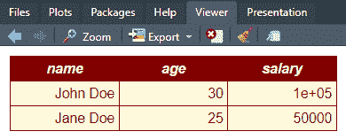
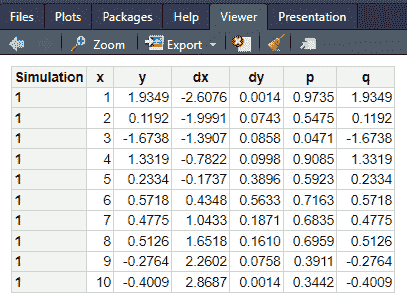
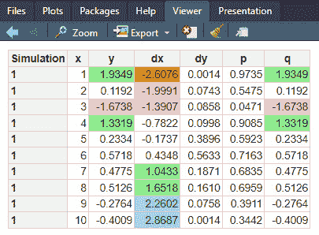

# 第五章：格式化您的 Excel 工作表

本章中，我们将探讨 R 中的两个不同库以及 Python 中的一些库，这些库可以用来格式化 Excel 工作表中的表格和数据。

我们将讨论 R 中的几个包，包括以下内容：

+   `styledTables`

+   `basictabler`

我们将创建一些虚构数据，并使用 R 的一个内置数据集 Iris，然后我们将应用上述包中的样式。每个包都有自己的方法来应用这种样式，所以最好浏览一下它们，看看你更喜欢哪种工作流程。

在本章的 Python 部分，我们将探讨`pandas`和`openpyxl`在 Python 中创建美观的表格和交叉表的高级选项。特别是，我们将使用`pandas`、`openpyxl`和`pywin32`。

本章中，我们将了解以下主题：

+   在 R 中安装和使用`styledTables`

+   使用 Python 进行格式化的高级选项

到本章结束时，你将深入理解单元格格式化、条件格式化和交叉表。所以，无需进一步延迟，让我们开始吧。

# 技术要求

本章的代码可以在以下 GitHub 链接中找到：[`github.com/PacktPublishing/Extending-Excel-with-Python-and-R/tree/main/Chapter5`](https://github.com/PacktPublishing/Extending-Excel-with-Python-and-R/tree/main/Chapter5)。

如前所述，在 R 部分，我们将使用几个不同的包。`styledTables`包只能通过`devtools`包从 GitHub 安装。

对于 Python 部分，你需要一个新包（特别是用于与`pandas`一起进行格式化任务的包）：`jinja2==3.1.2`。

# 在 R 中安装和使用 styledTables

如我们之前所做的那样，在使用它们之前，我们需要安装必要的包。在本节中，我们将安装`styledTables`包。因为`styledTables`不在 CRAN 上，我们不能使用`install.packages()`函数的典型方法来安装它，所以我们需要从 GitHub 安装此包。这将需要我们安装`devtools`包，它具有执行此类操作的功能。

这是您需要安装此包的完整代码：

```py
install.packages("devtools")
# Install development version from GitHub
devtools::install_github(
'R-package/styledTables',
build_vignettes = TRUE
)
```

在运行前面的代码后，我们可以通过在控制台中发出`library(styledtables)`的典型方式将库调用到当前会话中。现在我们已经加载了库，我们可以继续创建我们的第一个脚本，该脚本将根据简单标准对表格进行样式化。让我们开始吧：

```py
library(TidyDensity)
library(styledTables)
library(xlsx)
st <- tidy_normal() |>
  styled_table(keep_header = TRUE) |>
  set_border_position("all", row_id = 1) |>
  set_bold(row_id = 1) |>
  set_fill_color("#00FF00", col_id = 3,
                 condition = X >= 0.5)
# open new xlsx workbook and create a worksheet
wb <- createWorkbook()
sheet <- createSheet(wb, "tidy_normal")
# insert the styled table in the worksheet
write_excel(sheet, st)
# save the workbook
saveWorkbook(wb, "chapter5/styledTables_test.xlsx")
```

这段 R 代码使用了几个库（`TidyDensity`、`styledTables`和`xlsx`），从数据集创建样式化的表格，将其保存到 Excel 文件中，并对其应用一些格式。让我们一步一步地分解代码：

1.  首先，我们加载所需的库——`TidyDensity` 用于从高斯分布创建随机数据表，`styledTables` 用于格式化表格，以及 `xlsx` 用于处理 Excel 文件。

1.  然后，我们创建并格式化表格。此代码使用 `tidy_normal()` 函数的输出创建了一个样式化的表格 `st`。`tidy_normal()` 函数从高斯分布生成一些数据，并以 tibble 格式呈现。然后，使用 `styled_table()` 函数并设置 `keep_header = TRUE` 来格式化表格，这意味着标题行将被保留并单独格式化。接下来的三行代码为表格的第一行（标题行）应用特定的样式。它为第一行的所有单元格设置边框，使第一行的文本加粗，并将第三列的单元格填充颜色（`#00FF00`，绿色）设置为对应列的值（用 `X` 表示）大于或等于 0.5 的情况。

1.  然后，我们使用 `xlsx` 包通过创建一个新的工作簿并使用 `createWorkbook()` 函数来创建一个新的 Excel 工作簿和工作表。一旦创建了这个工作簿，我们使用 `createSheet()` 函数在具有 `tidy_normal` 名称的工作簿中创建工作表。

1.  接下来，我们使用 `styledTables` 库中的 `write_excel()` 函数将样式化的表格插入到工作表中。这会将样式化的表格 `st` 放入 `tidy_normal` 工作表中。

1.  最后，我们使用 `saveWorkbook()` XLSX 函数将工作簿保存为 Excel 文件，我们告诉它将 `wb` 工作簿保存到名为 `styledTables_test.xlsx` 的子目录中。

总结来说，这段 R 代码从一些数据（从 `tidy_normal()` 获取）生成一个样式化的表格，对标题行和第三列的单元格应用特定的格式化，将样式化的表格保存到 Excel 文件中，并将其放置在名为 `tidy_normal` 的工作表中。生成的 Excel 文件将包含具有指定格式的样式化表格。

## 在 R 中安装和使用 basictabler

`basictabler` R 包提供了一个简单的方法，可以从 `DataFrame` 或矩阵创建丰富的表格。这些表格可以渲染为 HTML、HTML 小部件或 Excel 工作表。

要创建一个 `basictabler` 对象，你需要创建一个 `DataFrame` 或矩阵。一旦你有数据，你可以通过调用 `qhtbl()` 函数来创建一个 `basictabler` 对象。`qhtbl()` 函数接受两个参数：`DataFrame` 或矩阵，以及一个格式化选项列表。我们将花费时间在 `qhtbl()` 函数和 `BasicTable()` 函数上。`qhtbl()` 函数是生成表格的一种快速方式，而 `BasicTable()` 函数是逐步构建表格的方式。首先，我们将使用 `qhtbl()` 函数创建一个非常基础的示例，如下所示：

```py
# Load in the library
library(basictabler)
# Create a data frame
data <- data.frame(
  name = c("John Doe", "Jane Doe"),
  age = c(30, 25),
  salary = c(100000, 50000))
# Create a Plain table
table_plain <- qhtbl(data, theme = "largeplain")
table_plain
```

下面是代码的输出：


图 5.1 – 使用 basictabler 创建一个普通表格

现在我们已经看到了它的样子，让我们回顾一下刚才发生了什么。首先，我们创建了一个名为`data`的数据集。这是一个简单的小数据集，纯粹是为了帮助说明`basictabler`包的使用。一旦数据创建完成，我们只需在数据上调用`ghtbl()`函数，给它一个`largeplain`的主题，并将其分配给`table_plain`变量。这仅仅创建了一个表格 – 它不会将其发送到 Excel。我们稍后会讨论这一点。

现在，让我们看看另一个稍微复杂一点的例子：

```py
# Create a basictabler object
table <- qhtbl(data,
  theme = "largeplain",
  tableStyle = list("border-color" = "maroon"),
  headingStyle = list(
    "color" = "cornsilk", "background-color" = "maroon",
    "font-style" = "italic", "border-color" = "maroon"
  ),
  cellStyle = list(
    "color" = "maroon", "background-color" = "cornsilk",
    "border-color" = "maroon"
  )
)
# Render the table to HTML
table
```

这段代码将生成一个包含相同数据的表格。然而，这里的区别在于这个表格将有一些样式。让我们回顾一下我们使用的样式选项；然后，我们将看到最终的产品。

第一个区别在于我们使用了`tableStyle`选项。这个函数的参数接受一个 CSS 样式声明列表对象，这些样式将被应用到表格上。对于这个选项，我们提供了`"border-color" = "maroon"`的值。

我们使用的下一个选项是`headingStyle`，它也接受一个 CSS 样式声明列表对象，这些样式将被应用到表格的标题上。在先前的代码中，我们在列表中使用了四个不同的选项。首先，我们选择了使用`color`选项，其值为`cornsilk`，然后我们选择了`background-color`，其值为`maroon`。接下来的选项是我们选择了`font-style`用于`italics`，最后是`border-color`，其值为`maroon`。让我们看看这会是什么样子：



图 5.2 – 使用一些不同样式的第二个 basictabler 示例

现在，让我们通过一个更长的例子来了解如何使用`basictabler`包的不同功能，根据我们指定的某种逻辑映射样式。参考以下代码：

```py
# A longer example
library(TidyDensity)
tn <- tidy_normal(.n = 10)
```

`library(TidyDensity)`将`TidyDensity`包导入 R 环境。这个包提供了可视化和总结分布的工具。我们特别使用它来生成一个包含 10 个点的正态分布的 tibble。我们不需要调用`basictabler`，因为此时它已经加载了。

接下来，我们分配`tn <- tidy_normal(.n = 10)`。这一行通过从标准正态分布中生成 10 个随机点来创建一个名为`tn`的数据集。该函数还创建了数据的密度（`dx`，`dy`），以及`pnorm`和`qnorm`作为表格的列：

```py
tbl <- BasicTable$new()
# formatting values (explained in the introduction vignette)
columnFormats <- list(
  NULL, NULL, "%.4f", "%.4f", "%.4f", "%.4f", "%.4f"
)
```

`tbl <- BasicTable$new()`创建了一个名为`tbl`的`BasicTable`对象的新实例。`BasicTable`类是来自`basictabler`包的`R6`类对象。这个函数与许多不同的公共方法相关联。这些方法帮助创建表格本身及其样式：

```py
tbl$addData(tn,
  firstColumnAsRowHeaders = TRUE,
  explicitColumnHeaders = c(
"Simulation", "x", "y", "dx", "dy", "p", "q"
  ),
  columnFormats = columnFormats
)
```

从前面的代码片段中，我们理解到以下内容：

+   `tbl$addData(tn, ...)`: 这一行将 `tn` 数据集中的数据添加到 `tbl` 表格对象中。它还设置了一些数据应如何显示的选项，例如使用第一列作为行标题，并显式设置列标题。

+   `columnFormats <- list(...)`: 在这里，创建了一个名为 `columnFormats` 的列表，其中包含表格每一列的格式。指定的格式是针对第二列到第七列（索引 1 到 6），并使用 `strings.tbl$renderTable()` 表示。在这里，我们使用了 `%.4f`。

+   `tbl$renderTable()`: 这一行根据之前提供的数据和格式渲染表格，并在 R 环境中显示它。这为我们提供了必要的预样式表格，以便我们可以看到基本表格与我们对其所做的修改。

接下来，我们有以下代码：

```py
# Add some conditional formatting
cells <- tbl$getCells(
rowNumbers = 2:11,
columnNumbers = 3:7,
matchMode = "combinations"
)
```

在这里，`cells <- tbl$getCells(...)` 行从 `tbl` 表格对象中检索一个子集的单元格。它使用 `getCells()` 方法从第 2 行到第 11 行和第 3 列到第 7 列（`y`、`dx`、`dy`、`p`、`q`）选择单元格：

```py
tbl$mapStyling(
  cells = cells,
  styleProperty = "background-color",
  valueType = "color",
  mapType = "logic",
  mappings = list(
    "v<=-3", "red",
    "-3<v<=-2", "orange",
    "-2<v<=-1", "pink",
    "-1<v<= 0", "white",
    "0<v<=1", "white",
    "1<v<=2", "lightgreen",
    "2<v<=3", "lightblue",
    "3<v", "green"
  )
)
```

`tbl$mapStyling(...)` 行对所选单元格应用条件格式化。`mapStyling()` 方法用于根据某些条件将样式（如背景颜色）映射到单元格值：

```py
tbl$renderTable()
```

在应用条件格式化后，`tbl$renderTable()` 行渲染了带有格式化单元格的更新后的表格，并将其再次显示在 R 环境中。

总结一下，前面的 R 代码导入了一个包，创建了一个随机数字的数据集，生成了一个带有格式化数据的表格，显示了表格，对特定单元格应用了条件格式化，并最终再次显示带有格式化单元格的表格。条件格式化根据指定列中的值将不同的背景颜色分配给单元格。

现在，让我们看看我们创建了什么。请记住，由于值是随机的，您得到的数据可能与我不同。首先，我们将查看普通表格，然后是样式化表格：



图 5.3 – BasicTable R6 普通表格

下面的表格是根据 `mapStyling()` 函数中创建的逻辑样式化的：



图 5.4 – BasicTable R6 样式化表格

现在我们已经创建了表格，让我们看看如何使用 `basictabler` 包将它们保存到 Excel 文件中。首先，我们将依赖于之前介绍过的包：`openxlsx`。

下面是我们将要使用的脚本；您会注意到使用了 `chapter5` 目录，因为它是最先创建的：

```py
# Write styled table out to Excel
library(openxlsx)
# Create Workbook
wb <- createWorkbook()
# Add a sheet called Data
addWorksheet(wb, "Data")
# Use basictabler to write the tbl to excel
tbl$writeToExcelWorksheet(
  wb = wb,
  wsName = "Data",
  topRowNumber = 1,
  leftMostColumnNumber = 1,
  applyStyles = TRUE
  )
# Use openxlsx to save the file
saveWorkbook(
  wb,
  file="chapter5/basictabler_excel.xlsx",
  overwrite = TRUE
)
```

在这里，我们使用了 `basictabler` 包的 `writeToExcelWorksheet()` 的公共方法。虽然它不会直接写入 Excel 文件，但它将对象格式化为可以使用 `openxlsx` 等包写入 Excel 的格式。

现在，您已经了解了在 R 中编写的一些可能性，让我们来看看 Python 中的类似工具。我们将再次回顾如何为 Excel 格式化单元格和表格。有关更多详细信息，您可以查看一些额外的包，如 `gt` 和 `gtextras`。

# 使用 Python 的格式化高级选项

本章的 Python 部分分为以下三个部分：

+   *单元格格式化*：单元格格式化对于以视觉吸引力和组织化的方式展示数据至关重要。我们将演示如何将各种格式化样式应用于单元格，例如设置字体属性（例如，大小、颜色、粗体和斜体）、调整单元格背景颜色以及调整单元格内的文本对齐。您将学习如何创建具有良好格式化单元格的专业表格，从而增强数据的可读性。

+   *条件格式化*：条件格式化允许您根据特定条件动态地格式化单元格。我们将向您介绍如何应用条件格式化来突出显示重要数据点、可视化趋势和识别异常值。您将了解如何使用 `pandas` 和 `openpyxl` 实现各种条件格式化规则，例如颜色刻度、数据条和图标集，使您的数据在 Excel 工作表中更加突出。

+   *数据透视表*：数据透视表是 Excel 中用于汇总和分析数据的强大工具。我们将向您展示如何使用 `pywin32` 创建数据透视表，以及如何调整小计和总计、自定义标签和样式。

在本章中，我们将提供实际示例和详细解释，指导您有效地格式化 Excel 工作表。通过掌握单元格格式化、条件格式化和数据透视表，您将能够专业地展示您的数据，使其视觉上引人注目，从而促进更好的洞察力和数据分析。

让我们开始单元格格式化！

## 单元格格式化

单元格格式化是有效地在 Excel 中展示数据的关键方面。使用 `pandas` 和 `openpyxl`，您拥有强大的工具来自定义单元格的外观。您可以应用广泛的各种格式化样式，使您的表格视觉上吸引人并增强数据的可读性。

要开始单元格格式化，您将学习如何设置各种字体属性，例如字体大小、颜色、粗体和斜体。这些调整允许您强调某些数据点，并在您的表格中创建一致的视觉层次结构。

此外，您还可以控制单元格的背景颜色以分组相关数据或突出特定值。通过设置单元格背景颜色，您可以在表格的不同部分之间创建清晰的界限，使读者更容易理解数据。

在单元格内对齐文本是另一种重要的格式化技术。使用`pandas`和`openpyxl`，您可以水平垂直地对齐文本，确保您的数据以整洁有序的方式呈现。

在本节中，我们将通过使用`pandas`和`openpyxl`的单元格格式化实际示例来引导您。您将学习如何应用不同的格式化样式、调整字体属性、更改单元格背景颜色以及在单元格内对齐文本。掌握这些技能后，您将能够创建专业外观的表格，有效地传达您数据的信息和洞察。

### 设置字体属性

让我们先探讨如何使用`pandas`和`openpyxl`设置单元格的字体属性。

在`pandas`中，为了进行更高级的样式设置，包括自定义 CSS 样式，我们可以使用`Styler.apply`方法，结合自定义函数来格式化单元格，以应用字体属性以符合我们的偏好，如下所示：

```py
# import pandas
import pandas as pd
data = {'Name': ['John', 'Alice', 'Michael'],
        'Age': [25, 30, 22],
        'City': ['New York', 'London', 'Paris']}
df = pd.DataFrame(data)
# Define a function to apply font properties
def apply_font_properties(value):
    return 'font-weight: bold; font-size: 14px; font-style: italic; color: blue'
# Applying font properties
styled_df = df.style.applymap(apply_font_properties, subset='Name')
# Save the styled DataFrame to an Excel file
styled_df.to_excel('styled_table_pandas.xlsx', index=False)
```

本章的 GitHub 仓库中提供了生成的 Excel 工作表。

在`openpyxl`中，您可以使用`Font`类来设置字体属性。例如，要使文本加粗，可以将字体对象的`bold`属性设置为`True`。您还可以调整其他字体属性，如`size`和`color`，以实现所需的格式。请参考以下示例：

```py
# OpenPyXL example for setting font properties
from openpyxl import Workbook
from openpyxl.styles import Font
wb = Workbook()
ws = wb.active
# Applying font properties
font = Font(size=14, bold=True, italic=True, color='0000FF')
ws['A1'].font = font
ws['A1'] = 'Name'
ws['B1'] = 'Age'
ws['C1'] = 'City'
wb.save('styled_table_openpyxl.xlsx')
```

### 单元格背景颜色

更改单元格的背景颜色是另一种有助于在表格中视觉区分不同部分的格式化技术。在`pandas`中，您可以使用`Styler`对象设置`background-color` CSS 样式，如下所示：

```py
# Pandas example for cell background colors
import pandas as pd
data = {'Name': ['John', 'Alice', 'Michael'],
        'Age': [25, 30, 22],
        'City': ['New York', 'London', 'Paris']}
df = pd.DataFrame(data)
# Create a styler object
styled_df = df.style
# Define the style for the cells
styled_df = styled_df.applymap( \
    lambda _: 'background-color: yellow', \
    subset=pd.IndexSlice[0, ['Name', 'Age']])
# Save the styled DataFrame to an Excel file
styled_df.to_excel('colored_table_pandas.xlsx', index=False)
```

之前的代码演示了如何使用`pandas`创建包含一些样本数据的`DataFrame`，然后应用`DataFrame`中特定单元格的背景颜色。该`DataFrame`包含有关个人姓名、年龄和城市的信息。通过使用`pandas`的`Styler`对象，我们可以为特定单元格定义背景颜色。在此示例中，第一行的`Name`和`Age`列使用黄色背景颜色突出显示。最后，将格式化的`DataFrame`保存到名为`colored_table_pandas.xlsx`的 Excel 文件中。这种技术允许在从 Python 导出到 Excel 时轻松灵活地格式化单元格。

现在，让我们看看如何使用`openpyxl`实现类似的效果！

在`openpyxl`中，您可以使用`Fill`类设置单元格的背景颜色，如下所示：

```py
# openpyxl example for cell background colors
from openpyxl import Workbook
from openpyxl.styles import PatternFill
wb = Workbook()
ws = wb.active
# Applying cell background colors
yellow_fill = PatternFill(start_color='FFFF00', end_color='FFFF00', fill_type='solid')
ws['A1'].fill = yellow_fill
ws['A1'] = 'Name'
ws['B1'] = 'Age'
ws['C1'] = 'City'
wb.save('colored_table_openpyxl.xlsx')
```

### 在单元格内对齐文本

正确地在单元格内对齐文本可以显著提高表格的视觉表现。在`pandas`中，您可以使用`Styler`对象应用文本对齐样式：

```py
# Pandas example for aligning text within cells
import pandas as pd
data = {'Name': ['John', 'Alice', 'Michael'],
        'Age': [25, 30, 22],
        'City': ['New York', 'London', 'Paris']}
df = pd.DataFrame(data)
# Applying text alignment
alignment_styles = {'text-align': 'center'}
styled_df = df.style.set_properties( \
    subset=['Name', 'Age', 'City'], **alignment_styles)
styled_df.to_excel('aligned_table_pandas.xlsx', index=False)
```

使用此代码，`DataFrame`中指定列的文本将居中对齐。此代码使用`set_properties`方法将文本对齐应用于指定列。然后，将生成的`DataFrame`保存到名为`aligned_table_pandas.xlsx`的 Excel 文件中。

在`openpyxl`中，你可以使用`Alignment`类设置文本对齐，如下所示：

```py
# OpenPyXL example for aligning text within cells
from openpyxl import Workbook
from openpyxl.styles import Alignment
wb = Workbook()
ws = wb.active
# Applying text alignment
alignment = Alignment(horizontal='center', vertical='center')
ws['A1'].alignment = alignment
ws['A1'] = 'Name'
ws['B1'] = 'Age'
ws['C1'] = 'City'
wb.save('aligned_table_openpyxl.xlsx')
```

通过这些示例，你已经学会了如何使用`pandas`和`openpyxl`自定义单元格格式，设置字体属性，更改单元格背景颜色，并在单元格内对齐文本。通过利用这些格式化选项，你可以创建视觉上吸引人且信息丰富的表格，有效地在 Excel 中展示你的数据。

现在，我们继续深入探讨条件格式化。

## 条件格式化

条件格式化是 Excel 中的一个强大功能，允许你根据特定条件自动应用单元格格式。它使你能够视觉上突出重要数据，识别趋势，并使你的 Excel 表更具交互性。在本章中，我们将探讨如何使用`openpyxl`实现条件格式化。我们将涵盖各种场景，例如根据值范围、文本和日期标准突出显示单元格。此外，我们还将演示如何创建定制的条件格式化规则以满足你的特定需求。

到本章结束时，你将具备直接从 Python 中为 Excel 表添加动态和视觉上吸引人的条件格式的技能。让我们深入探讨，学习如何通过条件格式化让你的数据脱颖而出！

### 使用条件格式化可视化数据

通过对你的 Excel 表应用条件格式化，你可以有效地可视化你的数据，并一眼获得宝贵的洞察。例如，你可以突出显示列中的最高和最低值，根据特定类别着色单元格，或强调随时间的变化。

条件格式化在处理大型数据集时特别有用，因为它允许你快速识别关键信息并做出基于数据的决策。

`openpyxl`提供了在 Excel 表中实现条件格式化的功能。该库提供了一系列选项，可以根据特定条件应用不同的格式化样式。使用`openpyxl`进行条件格式化的过程涉及以下步骤：

1.  从`openpyxl`导入所需的模块并将你的数据加载到工作簿对象中。

1.  使用`openpyxl.formatting.rule`创建一个条件格式化规则。

1.  定义规则的条件，例如根据单元格值、文本或日期标准应用样式。

1.  使用`openpyxl.worksheet.conditional.ConditionalFormatting.add()`将规则应用于所需的单元格范围。

使用`openpyxl`，你可以轻松实现条件格式化规则并为你的 Excel 表添加视觉提示，增强数据的展示并便于数据分析。

让我们看看一些实现上述概念的代码示例：

```py
import pandas as pd
import openpyxl
from openpyxl.formatting.rule import ColorScaleRule, CellIsRule
# Create some sample data
data = {'Name': ['John', 'Alice', 'Michael', 'Emily'],
        'Age': [25, 30, 22, 28],
        'City': ['New York', 'London', 'Paris', 'Sydney'],
        'Sales': [1000, 800, 1200, 900]}
df = pd.DataFrame(data)
# Write the DataFrame to a worksheet
df.to_excel("conditional_formatting.xlsx", index=False)
# Load the workbook
wb = openpyxl.load_workbook('conditional_formatting.xlsx')
ws = wb.active
# Define conditional formatting rule for red text
red_text_rule = CellIsRule( \
    operator="lessThan", formula=["1000"], stopIfTrue=True, \
    font=openpyxl.styles.Font(color="FF0000"))
ws.conditional_formatting.add(f"D2:D{len(df)+1}", red_text_rule)
# Define the condition for the green fill color scale
min_sales = min(df['Age'])
max_sales = max(df['Age'])
green_fill_rule = ColorScaleRule( \
    start_type='num', start_value=min_sales, start_color='0000FF00', \
    end_type='num', end_value=max_sales, end_color='00FFFF00')
ws.conditional_formatting.add(f"B2:B{len(df)+1}", green_fill_rule)
# Save the Excel workbook
wb.save('conditional_formatting.xlsx')
```

在此代码中，我们从一个`pandas` `DataFrame`创建一个 Excel 工作簿。然后，我们定义两个条件格式化规则：如果`Sales`值小于`1000`，则使用红色文本，而`green_fill_rule`使用`Age`列的最小和最大年龄值来设置颜色刻度条件。这样，`Age`列中的单元格将根据它们在最小和最大值之间的相对值填充绿色。这些规则被添加到工作表的`conditional_formatting`属性中。最后，我们保存 Excel 工作簿，当您使用 Microsoft Excel 打开 Excel 文件时，将应用条件格式化。

自定义条件格式化规则为您提供对数据显示方式的精确控制，使您更容易在 Excel 表格中识别模式、趋势和异常。

接下来，我们将介绍一个条件格式化可以真正大放异彩的案例研究：一个动态热力图！

### 案例研究 - 使用条件格式化动态热力图

为了进一步展示条件格式的强大功能，我们将通过一个案例研究来展示如何使用 Python 和 Excel 创建一个动态热力图。我们将使用条件格式化根据数据的幅度来着色热力图中的单元格，使我们能够有效地可视化数据的强度和模式。由于表中除了热力图的颜色外，还有注释（数字），因此这里创建的也被称为**高亮表**。

让我们来看看这样一个热力图的实现：

```py
import pandas as pd
import openpyxl
from openpyxl.utils.dataframe import dataframe_to_rows
from openpyxl.formatting.rule import ColorScaleRule
# Sample data for the heatmap
data = {
    'Category': ['A', 'B', 'C', 'D'],
    'Jan': [10, 20, 30, 40],
    'Feb': [15, 25, 35, 45],
    'Mar': [12, 22, 32, 42],
    'Apr': [18, 28, 38, 48]
}
# Convert data to a pandas DataFrame
df = pd.DataFrame(data)
# Write the DataFrame to a worksheet
df.to_excel("heatmap_with_conditional_formatting.xlsx", index=False)
# Load the workbook
wb = openpyxl.load_workbook( \
    'heatmap_with_conditional_formatting.xlsx')
ws = wb.active
# Define the range for conditional formatting (excluding the 'Category' column)
data_range = f'B2:E{len(df) + 1}'  # Adjust the range based on the DataFrame size
# Apply color scale conditional formatting to the range
color_scale_rule = ColorScaleRule(start_type='min', \
    start_color='FFFFFF', end_type='max', end_color='FF0000')
ws.conditional_formatting.add(data_range, color_scale_rule)
# Save the workbook
wb.save('heatmap_with_conditional_formatting.xlsx')
```

条件格式化是增强 Excel 中数据视觉表示的有价值工具。无论您是使用`pandas`还是`openpyxl`，都可以轻松实现条件格式化规则，根据指定的条件动态格式化单元格。通过将条件格式化纳入您的 Excel 表格中，您可以创建引人入胜的视觉图表，更好地理解您的数据，使数据分析和管理决策更加高效和有效。

## 交叉表

交叉表是 Excel 中强大的工具，允许您快速总结和分析大量数据集。它们提供了一种灵活的方式来聚合、分组和计算数据，只需几点击就能从您的数据中获得有价值的见解。在本节中，我们将探讨如何使用`pywin32`从 Python 创建和操作交叉表。此外，我们还将介绍一些调整小计和总计以及自定义标签和样式的技术。

### 使用 pywin32 创建交叉表

`pywin32`允许您通过 COM 接口与 Microsoft Excel 交互。使用这个库，您可以控制 Excel 的功能，包括创建交叉表。

要在 Python 中使用`win32com.client`创建交叉表，您可以使用本节提供的代码片段。

首先，通过导入所需的模块、启动 Excel 实例（就像我们在*第三章*中所做的那样）以及获取我们可以操作的工作表来设置一切：

```py
# Import the required modules from the `win32com.client` package:
import win32com.client as win32
import os.path
# Create a new instance of Excel and make it visible:
excel = win32.Dispatch('Excel.Application')
excel.Visible = True
# Create a new workbook or open an existing one:
workbook = excel.Workbooks.Add()  # Create a new workbook
# Or to open an existing workbook:
# workbook = excel.Workbooks.Open('path/to/your/workbook.xlsx')
# Get the reference to the sheet where you want to create the Pivot Table:
sheet = workbook.ActiveSheet  # Get the active sheet
# Or specify the sheet by its name:
# sheet = workbook.Sheets('Sheet1')
```

接下来，生成一些示例数据并将其写入工作表（这是可选的；也就是说，只有当您有要分析的数据时才这样做）：

```py
# Sample data
data = [
    ['Product', 'Category', 'Sales'],
    ['Product A', 'Category 1', 100],
    ['Product B', 'Category 2', 200],
    ['Product C', 'Category 1', 150],
    ['Product D', 'Category 2', 50],
    # Add more data rows here...
]
# Write the data to the sheet
for row_index, row in enumerate(data, start=1):
    for col_index, value in enumerate(row, start=1):
        sheet.Cells(row_index, col_index).Value = value
```

有趣的事实

当这个嵌套的 `for` 循环运行时，您可以看到工作簿填充值！

现在，我们可以开始实际的透视表了！我们将从创建一个新工作表开始，该工作表将用于放置透视表：

```py
# Add a new worksheet to the workbook to hold the Pivot Table:
pivot_table_sheet = workbook.Worksheets.Add()
pivot_table_sheet.Name = 'Pivot Table'
```

接下来，我们可以通过使用工作簿的 `PivotCaches` 属性的 `Create()` 方法然后调用 `CreatePivotTable()` 来创建数据透视表本身：

```py
# Create a Pivot Cache using the data range (UsedRange highlights the whole used range in the sheet):
pivot_cache = workbook.PivotCaches().Create(SourceType=1, \
    SourceData=sheet.UsedRange)
# Create the Pivot Table on the new sheet using the Pivot Cache:
pivot_table = pivot_cache.CreatePivotTable( \
    TableDestination=pivot_table_sheet.Cells(3, 1), \
    TableName='MyPivotTable')
```

在定义了数据透视表之后，我们可以添加我们想要用作行、列和数据字段的字段：

```py
# Add fields to the Pivot Table, specifying their orientation (rows, columns, data, etc.):
pivot_table.PivotFields('Product').Orientation = 1 # row field
pivot_table.PivotFields('Category').Orientation = 2 # column field
pivot_table.PivotFields('Sales').Orientation = 4 # data field
```

我们几乎完成了！我们现在有一个工作表，但我们可能想要开关总计数和子计数：

```py
# Control row and column grandtotals
pivot_table.ColumnGrand = False
pivot_table.RowGrand = False
# Decide which fields have Subtotals
pivot_table.PivotFields('Sales').Subtotals = [False]*12
pivot_table.PivotFields('Product').Subtotals = [False]*12
pivot_table.PivotFields('Category').Subtotals = [True]*12
```

最后，我们可以自定义标签和样式：

```py
# Customize labels and styles
pivot_table.ShowTableStyleRowStripes = True
pivot_table.PivotFields('Product').Caption = 'Product Name'
pivot_table.PivotFields('Sales').NumberFormat = '#,##0'
pivot_table.PivotFields('Sales').Caption = 'Total Sales'
# Note: labels change the Pivot Table wizard available when clicking into the Pivot Table, not the table itself.
# Save the workbook and close Excel:
 # Note: you will want to change the path to a path that exists on your computer.
file_path = os.path.join('C:' + os.sep, 'Users', 'david_1q5aypk', 'Extending-Excel-with-Python-and-R')
workbook.SaveAs(os.path.join(file_path, 'pivot_table.xlsx'))
workbook.Close()
excel.Quit()
```

这样，您就学会了如何使用 `win32com.client` 在 Excel 中创建数据透视表，这使您能够有效地分析和总结数据。该库允许您完全控制 Excel，包括根据您特定的数据分析需求创建和自定义数据透视表。

# 摘要

在本章中，我们深入探讨了格式化 Excel 工作表的艺术，以以视觉上吸引人和有组织的方式展示数据。分为三个部分，我们涵盖了将原始数据转换为专业外观表格的基本技术，这些表格增强了数据的可读性。

第一部分专注于单元格格式化，我们展示了如何将各种样式应用于单元格，例如调整字体属性、单元格背景和文本对齐。通过掌握单元格格式化，您可以创建组织良好且视觉上吸引人的表格。

接下来，我们探讨了条件格式化，这是一个强大的功能，允许您根据特定条件动态格式化单元格。我们提供了使用 `styledTables` 和 `basictabler` 为 R 以及使用 `pandas` 和 `openpyxl` 为 Python 实现各种条件格式化规则的实用示例，例如颜色刻度、数据条和图标集，使您的数据脱颖而出并揭示关键见解。

最后，我们发掘了数据透视表潜力，这些是总结和分析数据的不可或缺的工具。使用 `pywin32`，我们创建了数据透视表，并学习了如何调整子计数和总计数，以及自定义标签和样式。

在本章中，您已经通过使用 `styledTables`、`basictabler`、`pandas`、`openpyxl` 和 `pywin32` 在 Excel 操作中获得了宝贵的技能，从而能够专业地展示您的数据，使其视觉上引人注目，并为更明智的决策揭示有意义的见解。有了这些技术，您在数据分析与可视化方面已经准备充分，可以将您的 Excel 熟练程度提升到新的高度。

请期待下一章，*插入 ggplot2/matplotlib 图表*！在那里，您将学习如何使用 R 和 Python 将美丽的数据可视化添加到您的 Excel 工作表中。
