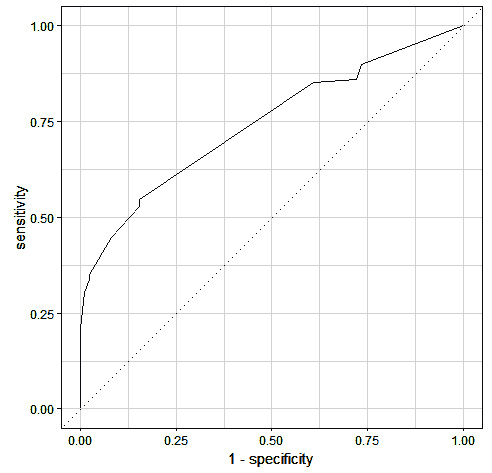
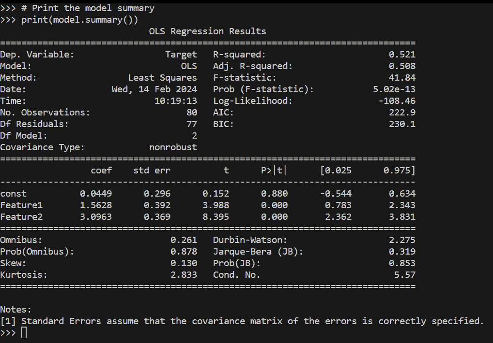
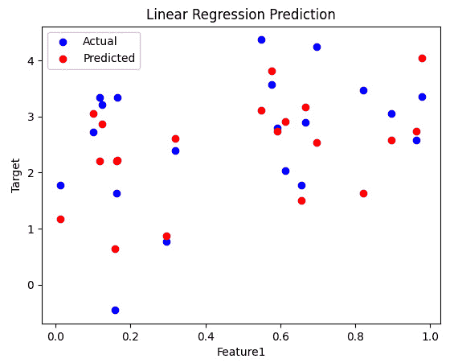
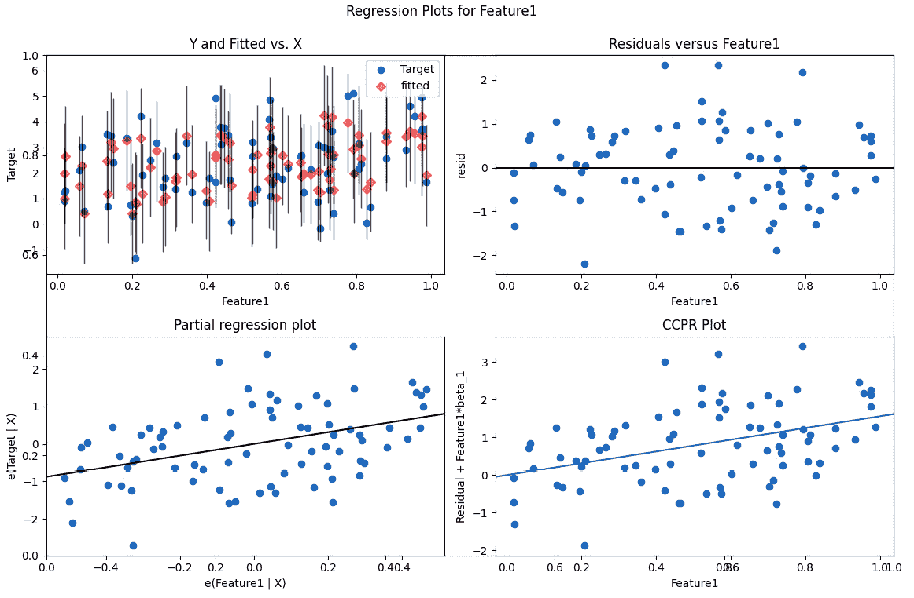
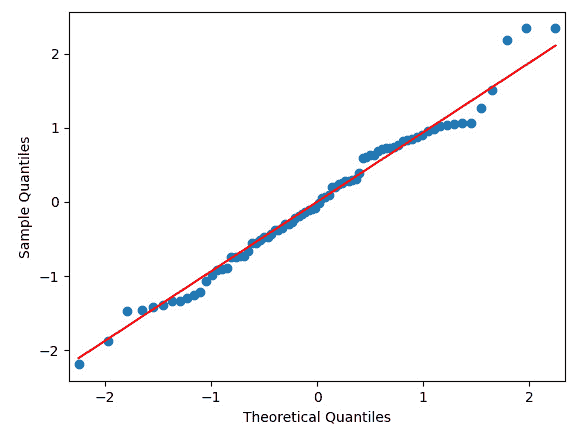
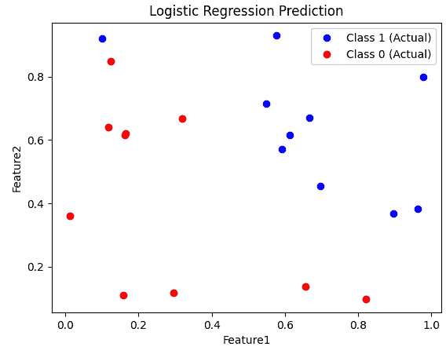
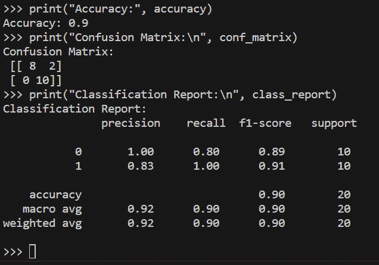

# 第九章：统计分析：线性与逻辑回归

欢迎阅读我们关于使用 R 和 Python 进行线性与逻辑回归的全面指南，我们将使用两个流行的框架：`tidymodels`和基础 R 与 Python 来探索这些重要的统计技术。无论您是数据科学爱好者还是希望提升技能的专业人士，本教程都将帮助您深入理解**线性**和**逻辑回归**，以及如何在 R 和 Python 中实现它们。现在，执行线性与逻辑回归成为可能。问题在于，线性回归只能应用于单个未分组的数据序列，而执行逻辑回归则较为繁琐，可能需要使用外部求解器插件。此外，这个过程只能针对未分组或非嵌套数据进行。在 R 和 Python 中，我们没有这样的限制。

在本章中，我们将使用基础 R、Python 以及`tidymodels`框架来介绍以下主题：

+   在基础 R、Python 以及`tidymodels`框架中执行线性回归，以及在 Python 中

+   在基础 R、Python 以及`tidymodels`框架中执行逻辑回归，以及在 Python 中

# 技术要求

本章所有代码可在 GitHub 上通过此 URL 找到：[`github.com/PacktPublishing/Extending-Excel-with-Python-and-R/tree/main/Chapter9`](https://github.com/PacktPublishing/Extending-Excel-with-Python-and-R/tree/main/Chapter9)。为了跟随教程，您需要安装以下 R 包：

+   `readxl 1.4.3`

+   `performance 0.10.8`

+   `tidymodels 1.1.1`

+   `purrr 1.0.2`

我们将首先了解线性与逻辑回归是什么，然后深入探讨所有相关细节。

# 线性回归

线性回归是一种基本的统计方法，用于建模因变量（通常表示为“Y”）与一个或多个自变量（通常表示为“X”）之间的关系。它的目标是找到最佳拟合的线性方程，描述自变量的变化如何影响因变量。你们中许多人可能知道这是**普通最小二乘法**（**OLS**）。

简而言之，线性回归帮助我们根据一个或多个输入特征预测连续数值结果。为了使其工作，如果您不知道，必须满足许多假设。如果您想了解更多，简单的搜索会为您带来大量关于这些假设的好信息。在本教程中，我们将深入探讨简单线性回归（一个自变量）和多元线性回归（多个自变量）。

# 逻辑回归

逻辑回归是另一种重要的统计技术，主要用于二元分类问题。逻辑回归不是预测连续结果，而是预测事件发生的概率，通常表示为“是”或“否”的结果。这种方法在需要模拟事件发生可能性的场景中特别有用，例如，客户是否会流失或电子邮件是否为垃圾邮件。逻辑回归模型独立变量与二元结果的逻辑优势之间的关系。

## 框架

我们将探讨两种在 R 中实现线性回归和逻辑回归的方法。首先，我们将使用基础 R 框架，这是理解基本概念和函数的绝佳起点。然后，我们将深入研究`tidymodels`，这是 R 中建模和机器学习的现代且整洁的方法。`tidymodels`提供了一种一致且高效的方式来构建、调整和评估模型，使其成为数据科学家的一个宝贵工具。在 Python 中，我们将使用两个突出的库来并行这一探索：`sklearn`和`statsmodels`。`sklearn`，或 Scikit-learn，提供了一系列简单且高效的预测数据分析工具，这些工具对每个人都是可访问的，并且可以在各种环境中重复使用。`statsmodels`更专注于统计模型和假设检验。这两个 Python 库共同提供了一个强大的框架，用于实现线性回归和逻辑回归，满足机器学习和统计需求。

在本章中，我们将提供逐步说明、代码示例和实用见解，以确保你可以自信地将线性回归和逻辑回归技术应用于自己的数据分析项目中。

让我们开始这段学习之旅，并解锁 R 中回归分析的力量！有了这个基础，我们将转向第一个示例，使用我们保存在*第一章*中的`iris`数据集在基础 R 中进行操作。

# 在 R 中执行线性回归

在本节中，我们将使用 R 进行线性回归，包括基础 R 和通过`tidymodels`框架。在本节中，你将学习如何在包含不同组的数据集中进行这一操作。我们将这样做，因为如果你能学会这种方式，那么在单一组中进行操作就会变得简单，因为不需要按组分组数据并按组执行操作。这里的思路是，通过在分组数据上操作，我们希望你能学会一项额外的技能。

## 基础 R 中的线性回归

我们将要展示的第一个示例是使用`lm()`函数在基础 R 中执行线性回归。让我们直接使用`iris`数据集来深入探讨。

我们将把代码分解成块，并讨论每个步骤中发生的事情。对我们来说，第一步是使用`library`命令将必要的包引入我们的开发环境：

```py
library(readxl)
```

在本节中，我们正在加载一个名为`readxl`的库。库是预先编写的 R 函数和代码的集合，我们可以在自己的 R 脚本中使用它们。在这种情况下，我们正在加载`readxl`库，它通常用于从 Excel 文件中读取数据。路径假设你有一个名为`chapter1`的文件夹，其中包含一个名为`iris_data.xlsx`的数据文件：

```py
df <- read_xlsx(
  path = "chapter1/iris_data.xlsx",
  sheet = "iris"
)
head(df)
```

在这里，我们正在从位于`chapter1`文件夹中的 Excel 文件`iris_data.xlsx`中读取数据。我们特别读取该 Excel 文件中的`iris`工作表。`read_xlsx`函数用于此目的。得到的数据存储在一个名为`df`的变量中。`head(df)`函数显示这个数据框（`df`）的前几行，以便我们可以看到它的样子：

```py
iris_split <- split(df, df$species)
```

这段代码将`df`数据集根据`species`列中的唯一值分割成多个子集。结果是包含多个数据框的列表，其中每个数据框只包含对应特定`iris`物种的行。

现在，我们将定义将是什么是因变量和自变量，以及`formula`对象：

```py
dependent_variable <- "petal_length"
independent_variables <- c("petal_width", "sepal_length", "sepal_width")
f_x <- formula(
  paste(
dependent_variable,
"~",
paste(independent_variables, collapse = " + ")
)
)
```

在这里，我们正在定义线性回归所需的变量。`dependent_variable`是`petal_length`，这是我们想要预测的变量。`independent_variables`是`petal_width`、`sepal_length`和`sepal_width`，我们将使用这些变量来预测因变量。

代码随后创建了一个`f_x`公式，它代表了线性回归模型。它本质上表示我们想要使用其他列出的变量来预测`petal_length`，这些变量通过加号分隔：

```py
perform_linear_regression <- function(data) {
  lm_model <- lm(f_x, data = data)
  return(lm_model)
}
```

在这部分，我们正在定义一个名为`perform_linear_regression`的自定义 R 函数。这个函数接受一个`data`参数，它是一个数据框。在函数内部，我们使用`lm`函数执行线性回归，使用我们之前定义的`f_x`公式和提供的数据框。得到的线性模型存储在`lm_model`中，并将其作为函数的输出返回：

```py
results <- lapply(iris_split, perform_linear_regression)
```

在这里，我们正在使用`lapply`函数将`perform_linear_regression`函数应用于`iris`数据集的每个子集。这意味着我们正在为每个 iris 物种单独运行线性回归，并将结果存储在`results`列表中：

```py
lapply(results, summary)
```

这段代码再次使用`lapply`，但这次我们将`summary`函数应用于`results`列表中的每个线性回归模型。`summary`函数提供了关于线性回归模型的统计信息，例如系数和 R-squared 值：

```py
par(mfrow = c(2,2))
lapply(results, plot)
par(mfrow = c(1, 1))
```

这几行代码用于创建一组四个图表来可视化模型性能。我们首先使用`par(mfrow = c(2,2))`设置图表布局为 2x2 网格，这样 4 个图表将显示在一个 2x2 网格中。然后，我们使用`lapply`来绘制`results`列表中的每个线性回归模型。最后，我们使用`par(mfrow = c(1, 1))`将绘图布局重置为默认设置：

```py
lm_models <- lapply(
iris_split,
function(df) lm(f_x, data = df)
)
```

这一部分与之前完成的线性回归分析相同，但将线性模型创建和总结结合成一个更简洁的形式，使用匿名函数实现。首先，它将 `lm` 函数应用于 `iris_split` 中的每个物种子集，创建一个存储在 `lm_models` 中的线性模型列表。然后，使用 `lapply` 获取这些线性模型的总结。

总结来说，这段 R 代码从 Excel 文件中读取鸢尾花数据，对 `iris` 的每个物种进行线性回归，总结结果，并创建可视化来评估模型性能。它详细分析了每个物种的因变量（`petal_length`）如何受自变量（`petal_width`、`sepal_length` 和 `sepal_width`）的影响。

## 使用 tidymodels 和 purrr 进行线性回归

既然我们已经介绍了如何在 R 中对 `iris` 数据集进行简单线性回归，我们将使用 `tidymodels` 框架进行相同的操作。让我们直接进入正题：

```py
f_x <- formula(paste("petal_width", "~", "petal_length + sepal_width + sepal_length"))
```

此部分定义了线性回归模型的公式。`formula()` 函数接受两个参数：响应变量和预测变量。响应变量是我们想要预测的变量，预测变量是我们认为可以帮助我们预测响应变量的变量。在这种情况下，响应变量是 `petal_width`，预测变量是 `petal_length`、`sepal_width` 和 `sepal_length`：

```py
library(dplyr)
library(tidyr)
library(purrr)
library(tidymodels)
nested_lm <- df |>
 nest(data = -species) |>
 mutate(split = map(data, ~ initial_split(., prop = 8/10)),
        train = map(split, ~ training(.)),
        test = map(split, ~ testing(.)),
        fit  = map(train, ~ lm(f_x, data = .)),
        pred = map2(.x = fit, .y = test, ~ predict(object = .x, newdata = .y)))
```

此部分使用 `tidyr` 包中的 `nest()` 函数创建一个嵌套的线性回归模型。`nest()` 函数根据指定的变量分组数据，在这种情况下，是 `species` 变量。

对于每个组，`nest()` 函数创建一个包含该组数据的列表。然后，使用 `mutate()` 函数向嵌套数据框添加新列。

`split()` 函数用于将每个组中的数据随机分成训练集和测试集。然后，使用 `training()` 和 `testing()` 函数分别选择训练集和测试集。通过 `map()` 和 `map2()`，我们可以遍历一个向量或列表，或者两个向量或列表，并应用一个函数。

使用 `lm()` 函数将线性回归模型拟合到每个组中的训练数据。然后，使用 `predict()` 函数预测每个组测试数据的响应变量，使用拟合的线性回归模型：

```py
nested_lm |>
 select(species, pred) |>
 unnest(pred)
```

此部分从嵌套数据框中选择 `species` 和 `pred` 列，并解包 `pred` 列。`unnest()` 函数将嵌套数据框转换为常规数据框，每行对应一个观测值。

结果数据框是一个嵌套的线性回归模型，每个物种都有一个拟合的线性回归模型。

让我们看看一个例子。我们将使用之前创建的`f_x`公式以及我们在开头创建的`df` `tibble`变量。以下代码展示了如何使用嵌套线性回归模型预测新鸢尾花的花瓣宽度：

```py
library(dplyr)
library(tidyr)
library(purrr)
library(tidymodels)
# Create a nested linear regression model
nested_lm <- df |>
 nest(data = -species) |>
 mutate(split = map(data, ~ initial_split(., prop = 8/10)),
        train = map(split, ~ training(.)),
        test = map(split, ~ testing(.)),
        fit  = map(train, ~ lm(f_x, data = .)),
        pred = map2(.x = fit, .y = test, ~ predict(object = .x, newdata = .y)))
# Predict the petal width for a new iris flower
new_iris <- data.frame(sepal_length = 5.2, sepal_width = 2.7, 
    petal_length = 3.5)
# Predict the petal width
predicted_petal_width <- predict(nested_lm[[1]]$fit, 
    newdata = new_iris))
# Print the predicted petal width
print(predicted_petal_width)
```

这是输出结果：

```py
1.45
```

预测的花瓣宽度是 1.45 厘米。我们现在已经用基本示例完成了 R 中的线性回归的讲解。我们将在下一节继续本章，讲解在 R 中执行逻辑回归。

# 在 R 中执行逻辑回归

正如我们在线性回归部分所做的那样，在这一节中，我们也将使用基础 R 和`tidymodels`框架执行逻辑回归。我们将只使用`Titanic`数据集执行一个简单的二元分类回归问题，我们将决定某人是否会幸存。让我们直接进入正题。

## 逻辑回归使用基础 R

为了开始，我们将从`Titanic`数据集上的基础 R 实现逻辑回归开始，我们将对`Survived`的响应进行建模。所以，让我们直接进入正题。

下面的代码将执行数据建模，并解释正在发生的事情：

```py
library(tidyverse)
df <- Titanic |>
       as.data.frame() |>
       uncount(Freq)
```

这段代码块首先加载了一个名为`tidyverse`的库，其中包含各种数据处理和可视化工具。然后，通过使用`|>`运算符对`Titanic`数据集（假设它存在于你的环境中）执行三个操作来创建一个名为`df`的数据框，其中我们使用`as.data.frame()`将数据集转换为数据框，接着是`uncount(Freq)`，它根据`Freq`列中的值重复数据集中的每一行。这通常是为了扩展汇总数据：

```py
set.seed(123)
train_index <- sample(nrow(df), floor(nrow(df) * 0.8), replace = FALSE)
train <- df[train_index, ]
test <- df[-train_index, ]
```

本节内容是关于将数据分为训练集和测试集，这在机器学习中是一种常见的做法：

+   `set.seed(123)`：这设置了一个随机种子以确保可重复性，确保每次随机操作产生相同的结果。

+   `sample(nrow(df), floor(nrow(df) * 0.8), replace = FALSE)`：这随机选择`df`数据框（训练集）中的 80%的行，不进行替换，并将它们的索引存储在`train_index`中。

+   `train <- df[train_index, ]`：这是通过使用`train_index`索引从`df`中选择行来创建训练集。

+   `test <- df[-train_index, ]`：这是通过从`df`中选择不在训练集中的行来创建测试集。接下来，我们创建模型。

    ```py
    model <- glm(Survived ~ Sex + Age + Class, data = train, family = "binomial")
    ```

现在，让我们按以下方式讨论模型代码：

+   这个代码块使用`glm`函数训练逻辑回归模型。

+   该模型被训练来根据训练数据中的`Sex`、`Age`和`Class`变量预测`Survived`变量。在这里，`Age`实际上是离散的。

+   `family = "binomial"` 参数指定这是一个二元分类问题，其中结果要么是 `Yes`，要么是 `No`。以下链接有助于选择合适的家族：[`stats.stackexchange.com/a/303592/35448`](https://stats.stackexchange.com/a/303592/35448)。

现在，让我们设置模型预测和响应变量：

```py
predictions <- predict(model, newdata = test, type = "response")
pred_resp <- ifelse(predictions <= 0.5, "No", "Yes")
```

现在，让我们回顾一下我们刚才所做的工作：

+   这里，我们使用训练好的模型对测试集进行预测。

+   `predict(model, newdata = test, type = "response")` 计算测试集中每个乘客的生存预测概率。

+   `ifelse(predictions <= 0.5, "No", "Yes")` 将这些概率转换为二元预测：如果概率小于或等于 `0.5`，则输出 `"No"`，否则输出 `"Yes"`。这是一种常见做法，但您必须首先了解您的项目，才能确定这种方法是否正确。现在，让我们继续到 `accuracy` 变量：

    ```py
    accuracy <- mean(pred_resp == test$Survived)
    ```

我们通过以下方式创建了 `accuracy` 变量：

+   这一行通过比较 `pred_resp`（模型的预测）与测试集中的实际生存状态（`test$Survived`）来计算模型预测的准确度。

+   它计算了结果逻辑值的平均值，其中 `TRUE` 代表正确预测，而 `FALSE` 代表错误预测。现在，让我们回顾一下代码的其余部分：

    ```py
    print(accuracy)
    table(pred_resp, test$Survived)
    ```

代码打印了两件事：

+   测试集上模型的准确度。

+   一个混淆矩阵，显示了有多少预测是正确的，有多少是错误的。如果您想更深入地了解混淆矩阵，这里有一个好的链接：[`www.v7labs.com/blog/confusion-matrix-guide`](https://www.v7labs.com/blog/confusion-matrix-guide)。

总结来说，这段代码加载了一个数据集，将其分为训练集和测试集，训练了一个逻辑回归模型来预测生存，评估了模型的准确度，并显示了结果。这是一个二元分类机器学习工作流程的基本示例。现在我们已经覆盖了在基础 R 中执行分类问题的逻辑回归，我们将尝试使用 `tidymodels` 框架来完成同样的任务。

## 使用 tidymodels 进行逻辑回归

在本节中，我们将使用 `tidymodels` 框架对 `Titanic` 数据集进行逻辑回归。由于我们已经在基础 R 中完成了这项工作，让我们直接进入正题：

```py
library(tidymodels)
library(healthyR.ai)
```

这段代码加载了我们将需要用于分析的两个库：`tidymodels` 和 `healthyR.ai`。`tidymodels` 是一个库，它为许多机器学习算法提供了一个通用接口，而 `healthyR.ai` 提供了一套用于评估机器学习模型性能的工具：

```py
df <- Titanic |>
    as_tibble() |>
    uncount(n) |>
    mutate(across(where(is.character), as.factor))
```

这段代码将`Titanic`数据集转换为`tibble`，这是一种与`tidymodels`兼容的数据结构。它还取消了`n`列的计数，该列包含每行在数据集中出现的次数，由`uncount()`函数创建。最后，它将数据集中的所有字符变量转换为因子：

```py
# Set seed for reproducibility
set.seed(123)
# Split the data into training and test sets
split <- initial_split(df, prop = 0.8)
train <- training(split)
test <- testing(split)
```

这段代码将`df`数据集拆分为训练集和测试集。训练集用于训练模型，而测试集用于评估模型在未见数据上的性能。使用`tidymodels`中的`initial_split()`函数进行拆分。`prop`参数指定了应该用于训练的数据比例。在这种情况下，我们使用 80%的数据进行训练，20%的数据进行测试：

```py
# Create a recipe for pre-processing
recipe <- recipe(Survived ~ Sex + Age + Class, data = train)
# Specify logistic regression as the model
log_reg <- logistic_reg() |> set_engine("glm", family = "binomial")
# Combine the recipe and model into a workflow
workflow <- workflow() %>% add_recipe(recipe) %>% add_model(log_reg)
# Train the logistic regression model
fit <- fit(workflow, data = train)
```

这段代码训练了一个逻辑回归模型来预测泰坦尼克号上的生存情况。使用`tidymodels`中的`recipe()`函数来预处理数据。使用`tidymodels`中的`logistic_reg()`函数来指定逻辑回归模型。使用`tidymodels`中的`workflow()`函数将 recipe 和模型组合成一个工作流程。最后，使用`tidymodels`中的`fit()`函数在训练数据上训练模型：

```py
# Predict on the test set
predictions <- predict(fit, new_data = test) |> bind_cols(test) |> select(Class:Survived, .pred_class)
# Better method
pred_fit_tbl <- fit |> augment(new_data = test)
```

这段代码预测测试集中每位乘客的生存概率。使用`tidymodels`中的`predict()`函数进行预测。`new_data`参数指定了我们想要进行预测的数据。在这种情况下，我们正在对测试集进行预测。使用`bind_cols()`函数将预测绑定到测试集数据上。使用`select()`函数选择我们想要保留的列。`pred_fit_tbl`对象是一个包含模型预测以及真实生存标签的`tibble`实例。该对象将用于评估模型的性能：

```py
# Accuracy metrics for the model to be scored against from the healthyR.ai package
perf <- hai_default_classification_metric_set()
# Calculate the accuracy metrics
perf(pred_fit_tbl, truth = Survived, estimate = .pred_class)
# Print the confusion matrix
predictions |> conf_mat(truth = Survived, estimate = .pred_class)
```

准确度检查代码块通过使用来自 healthyR.ai 包的`hai_default_classification_metric_set()`函数创建一组默认分类指标来评估模型在测试集上的性能。这些指标包括准确率、精确率、召回率和 F1 分数。

然后，使用`perf()`函数在测试集上计算准确度指标。`pred_fit_tbl`对象是一个包含模型预测以及真实生存标签的数据框。`truth`和`estimate`参数指定了数据框中包含真实标签和预测标签的列。

然后，使用`conf_mat()`函数打印模型的混淆矩阵。混淆矩阵是一个表格，显示了模型正确和错误预测的观测数。

最后，可以使用 `broom` 包中的 `tidy()` 和 `glance()` 函数来整理和总结拟合的模型。`tidy()` 函数将模型对象转换为 `tibble` 实例，这是一种易于处理的数据结构。`glance()` 函数打印出模型的摘要，包括模型中所有变量的系数、标准误差和 p 值。

这里是对准确性检查代码块中计算的每个准确性指标的一个简单解释：

+   **准确率**：模型的准确率是指模型正确预测的观测值的比例。

+   **精确率**：模型的精确率是指正确预测的正预测的比例。

+   **召回率**：模型的召回率是指模型正确预测的实际正观测值的比例。

+   **F1 分数**：F1 分数是精确率和召回率的调和平均值。它是衡量模型性能的良好整体指标。

混淆矩阵是理解模型性能的有用工具。理想的混淆矩阵将对角线上的所有观测值都正确预测。然而，在实践中，没有模型是完美的，总会有一些观测值被错误预测。

最后，我们将使用 **接收者操作特征**（ROC）曲线来可视化模型。要了解更多关于这种曲线的信息，请参阅以下链接：[`www.tmwr.org/performance`](https://www.tmwr.org/performance)。以下是创建 ROC 曲线的代码：

```py
roc_curve(
  pred_fit_tbl, truth = Survived, .pred_Yes,
  event_level = "second"
) |>
  autoplot()
```

这里是输出结果：



图 9.1 – 逻辑回归模型的 ROC 曲线

现在，我们已经学会了如何在基础 R 和 `tidymodels` 模型框架中执行线性回归和逻辑回归。我们使用 `Titanic` 和 `iris` 数据集做到了这一点。现在是时候在 Python 中做同样的事情了！

# 使用 Excel 数据在 Python 中执行线性回归

在 Python 中，可以使用 `pandas`、`scikit-learn`、`statsmodels` 和 `matplotlib` 等库执行线性回归。以下是一个逐步的代码示例：

1.  首先，导入必要的库：

    ```py
    # Import necessary libraries
    import pandas as pd
    import numpy as np
    import matplotlib.pyplot as plt
    from sklearn.model_selection import train_test_split
    import statsmodels.api as sm
    from statsmodels.graphics.regressionplots import plot_regress_exog
    from statsmodels.graphics.gofplots import qqplot
    ```

1.  然后，我们创建一个包含测试数据的 Excel 文件。当然，在实际场景中，你不需要模拟数据 - 你会跳过这一步，在加载必要的库之后（见下一步）从 Excel 加载数据：

    ```py
    # Step 0: Generate sample data and save as Excel file
    np.random.seed(0)
    n_samples = 100
    X = np.random.rand(n_samples, 2)  # Two features
    y = 2 * X[:, 0] + 3 * X[:, 1] + np.random.randn(n_samples)
    # Linear relationship with noise
    # Create a pandas DataFrame
    data = {'Feature1': X[:, 0], 'Feature2': X[:, 1], 'Target': y}
    df = pd.DataFrame(data)
    # Save the data to Excel
    df.to_excel("linear_regression_input.xlsx")
    ```

1.  接下来，使用你在上一章中学到的工具从 Excel 文件中导入测试数据，并对其进行分析准备：

    ```py
    # Step 1: Import Excel data into a pandas DataFrame
    excel_file = "linear_regression_input.xlsx"
    df = pd.read_excel(excel_file)
    # Step 2: Explore the data
    # Use the tools learned in the previous chapter on EDA
    # Step 3: Data Preparation (if needed)
    # Use the tools learned in the previous chapter on data cleaning
    ```

1.  现在，我们已经准备好进行实际分析了。将数据分为训练数据和测试数据，以便我们可以在一个专门的数据（子集）上评估模型，然后在训练数据上拟合 **普通最小二乘法**（OLS）线性模型：

    ```py
    # Step 4: Split data into training and testing sets
    X = df[['Feature1', 'Feature2']] # Independent variables
    y = df['Target'] # Dependent variable
    # Split the data into training and test set using a fixed random seed for reproducibility
    X_train, X_test, y_train, y_test = train_test_split(X, y, 
        test_size=0.2, random_state=42)
    # Step 5: Fit the Linear Regression model
    # Add a constant (intercept) to the independent variables
    X_train = sm.add_constant(X_train)
    X_test = sm.add_constant(X_test)
    # Fit the linear model
    model = sm.OLS(y_train, X_train).fit()
    ```

    注意，在分割测试集和训练集之前，作为数据清洗过程的一部分进行插补可能会导致测试集受到训练集的污染。在执行数据清洗和准备步骤时要对此保持警觉！

1.  接下来，评估训练好的模型在测试数据上的表现：

    ```py
    # Step 6: Model Evaluation
    y_pred = model.predict(X_test)
    # Print the model summary
    print(model.summary())
    ```

    这将生成输出摘要统计信息，这些信息可以提供关于数据集中关系的重要见解：



图 9.2 – 拟合模型的摘要统计

实际上对模型结果的解释超出了本书的范围，但以下是一些帮助你开始的提示：

+   **系数**：与模型中每个自变量（预测器）相关的系数告诉你关系的强度和方向。正系数表示正相关，这意味着随着预测器的增加，目标变量倾向于增加。相反，负系数表示负相关。

+   **截距**：截距表示当所有预测变量都设置为零时目标变量的预测值。在分析上下文中考虑截距的值是至关重要的。

+   **R 平方（R²）**：R 平方值衡量模型的拟合优度。它告诉你目标变量中可以由预测器解释的方差比例。较高的 R 平方值（接近 1）表示更好的拟合。请注意，添加更多变量总会增加这个度量。一个“更好的”拟合可能会导致“过拟合”，这是我们不想看到的。你可能想检查模型拟合选择标准，如 Mallow 的 Cp、AIC、BIC 和调整 R 平方，后者对用于拟合模型的参数数量进行惩罚。

+   **P 值**：与系数相关的 P 值有助于确定每个预测器的统计显著性。较低的 P 值表示更大的显著性（在拒绝零假设的证据更强的意义上）。如果一个 P 值小于选定的显著性水平（例如，0.05），你可以得出结论，该预测器对目标变量有统计显著的效应。请注意，有很好的理由不单独依赖 P 值；请参阅关于 p-hacking 和统计科学相关主题的持续辩论。

+   **残差**：检查残差（观测值与预测值之间的差异）对于评估模型性能至关重要。理想情况下，残差应该是随机的，没有明显的模式。残差中的模式可能表明模型存在误设。

+   **置信区间**：系数周围的置信区间提供了一个范围，其中真实的总体参数很可能位于其中。较宽的区间表示更大的不确定性。

+   **F 统计量**：F 统计量检验模型的总体显著性。小的 F 统计量表明模型对目标变量的方差解释不多，而大的值则表示更好的整体拟合。

+   **调整后的 R 平方**：调整后的 R 平方根据模型中的预测因子数量调整 R 平方值。它帮助您确定添加更多预测因子是否可以改善模型的拟合度。

通过仔细检查这些元素，您可以深入了解线性模型与您的数据拟合得如何，预测变量的显著性以及模型的总体质量。这些信息对于做出明智的决策和从分析中得出有意义的结论至关重要。

在模型训练和拟合评估后，我们可以可视化结果以帮助解释。以下代码创建了一个预测值与观察值之间的散点图：

```py
plt.scatter(X_test['Feature1'], y_test, color='blue', label='Actual')
plt.scatter(X_test['Feature1'], y_pred, color='red', 
    label='Predicted')
plt.xlabel('Feature1')
plt.ylabel('Target')
plt.title('Linear Regression Prediction')
plt.legend()
plt.show()
```

这是它的散点图：



图 9.3 – 线性回归预测图

此外，我们还可以创建诊断图和可视化，如残差图和 Q-Q 图，这有助于您识别模型中可能存在的问题，例如异方差性或异常值：

```py
# Set the backend to 'TkAgg' before generating the plots if needed – comment out this line if in WSL or other non-interactive environment
plt.switch_backend('TkAgg')
# Residuals
fig, ax = plt.subplots(figsize=(12, 8))
plot_regress_exog(model, "Feature1", fig=fig)
plt.show()
# Q-Q plot:
qqplot(model.resid, line="s")
plt.show()
```

前两个图表看起来像这样：



图 9.4 – 残差图



图 9.5 – 残差 Q-Q 图

最后，我们可以将结果导出到 Excel。这将在下一小节中详细介绍。

作为旁注，`scikit-learn` 也内置了线性模型，但它没有提供我们在前面代码中使用的手动汇总统计信息。

这段代码展示了使用 Python 和 Excel 数据进行基本线性回归工作流程。让我们继续学习逻辑回归！

# 使用 Excel 数据在 Python 中进行逻辑回归

在以下代码中，我们根据简单条件生成具有两个特征（`Feature1` 和 `Feature2`）和二元目标变量（`Target`）的随机样本数据。我们执行逻辑回归，使用准确率、混淆矩阵和分类报告评估模型，可视化二元分类的结果，并解释系数。

下面是一个逐步的代码示例：

1.  再次，我们从导入必要的库开始：

    ```py
    # Import necessary libraries
    import pandas as pd
    import numpy as np
    import matplotlib.pyplot as plt
    from sklearn.model_selection import train_test_split
    from sklearn.linear_model import LogisticRegression
    from sklearn.metrics import accuracy_score, confusion_matrix, classification_report
    ```

    对于这个例子，我们将使用不同的样本数据集：

    ```py
    # Step 0: Generate sample data
    np.random.seed(0)
    n_samples = 100
    X = np.random.rand(n_samples, 2)  # Two features
    y = (X[:, 0] + X[:, 1] > 1).astype(int)  # Binary classification based on a condition
    # Create a pandas DataFrame
    data = {'Feature1': X[:, 0], 'Feature2': X[:, 1], 'Target': y}
    df = pd.DataFrame(data)
    df.to_excel("logistic_regression_input.xlsx")
    ```

1.  在 Excel 中有了您的数据后，我们可以读取它并为建模步骤做准备：

    ```py
    # Step 1: Import Excel data into a pandas DataFrame
    excel_file = "logistic_regression_input.xlsx"
    df = pd.read_excel(excel_file)
    # Step 2: Split data into training and testing sets
    X_train, X_test, y_train, y_test = train_test_split(X, y,
        test_size=0.2, random_state=42)
    ```

1.  现在，我们可以创建和拟合一个模型。这次我们将使用 `scikit-learn` 库：

    ```py
    # Step 3: Create and train the logistic regression model
    model = LogisticRegression()
    model.fit(X_train, y_train)
    ```

1.  在模型拟合后，我们现在可以可视化结果：

    ```py
    # Step 4: Visualization
    # Visualization for binary classification
    plt.scatter(X_test[y_test == 1][:, 0], 
        X_test[y_test == 1][:, 1], color='blue', 
        label='Class 1 (Actual)')
    plt.scatter(X_test[y_test == 0][:, 0], 
        X_test[y_test == 0][:, 1], color='red', 
        label='Class 0 (Actual)')
    plt.xlabel('Feature1')
    plt.ylabel('Feature2')
    plt.title('Logistic Regression Prediction')
    plt.legend()
    plt.show()
    ```

1.  与线性回归不同，我们需要不同的拟合优度指标，因为我们使用逻辑回归进行二元分类：

    ```py
    # Step 5: Model Evaluation and Interpretation
    y_pred = model.predict(X_test)
    accuracy = accuracy_score(y_test, y_pred)
    conf_matrix = confusion_matrix(y_test, y_pred)
    class_report = classification_report(y_test, y_pred)
    print("Accuracy:", accuracy)
    print("Confusion Matrix:\n", conf_matrix)
    print("Classification Report:\n", class_report)
    ```

    结果看起来像这样：



图 9.6 – 逻辑回归预测图

这是代码结果：



图 9.7 – 模型摘要统计

为了解释前面的结果，您可以从以下内容开始：

+   `准确度`是一个基本指标，表示正确预测的实例数与总实例数的比率。虽然容易理解，但如果类别之间存在不平衡，准确度可能会误导。

+   `混淆矩阵`提供了更详细的视图。它将预测分解为四个类别：真正例、真负例、假正例和假负例。这个矩阵清晰地说明了模型在正确分类正负实例方面的表现。

+   `分类报告`提供了全面的摘要。它包括针对两个类别的`精确度`、`召回率`、`F1 分数`和`支持度`等指标。`精确度`衡量预测为正的实例中有多少实际上是正的，而`召回率`量化了多少实际正例被正确预测。`F1 分数`平衡了`精确度`和`召回率`。`支持度`表示每个类别的实例数量。这些指标共同提供了对模型在二元分类任务中性能的更细致评估。

您可以使用此示例数据和代码进行逻辑回归的测试和实验。

请注意，与流行的（但错误）说法相反，逻辑回归也可以用作回归——使其成为分类器的是预测概率的任意截止点。对于某些用例，您可能希望使用原始回归输出（例如，如果您对数据点属于某个类别的预测概率感兴趣，而不仅仅是更可能的类别），而对于其他用例，您可能希望调整截止点（例如，如果存在先验领域信息表明 50% 不是正确的截止点）。

就这样！逻辑回归是一个相对简单的模型，具有许多优点。它性能良好，易于拟合，易于解释，并且非常灵活。它最常用于具有领域知识驱动的截止点的分类，但本质上，它仍然是一种可以用于预测类别概率的回归方法。

# 摘要

在本章中，我们使用 Excel 数据探索了线性回归和逻辑回归强大的世界。线性回归是一种基本的统计技术，使我们能够建模因变量和自变量之间的关系。我们讨论了其假设和应用，并介绍了从 Excel 加载数据、准备分析以及使用 R（使用基础 R 和 `tidymodels`）和 Python（使用 `scikit-learn` 和 `statsmodels` 库）拟合线性回归模型的全过程。

通过综合的代码示例，你学习了如何进行回归分析，评估模型准确性，并生成有价值的统计数据和指标来解释模型结果。我们获得了创建诊断图（如残差图和 Q-Q 图）的见解，这些图有助于识别异方差性和异常值等问题。

此外，我们还深入探讨了逻辑回归，这是一种用于类别概率预测和二分类任务的强大工具。我们阐述了其重要性和应用，并概述了数据准备、模型拟合和指标评估的过程。通过实际代码示例，我们观察了如何在 R 中的`tidymodels`和 Python 中的`scikit-learn`库中使用逻辑回归模型进行构建。

到本章结束时，你应该对线性回归和逻辑回归有深刻的理解，从理论到实际应用，并能够利用这些技术高效地分析你的数据。

拥有这些技能，你将能够熟练地进行回归分析，并从你的数据中提取有价值的见解，使用 Python。

接下来是下一章，你将学习时间序列分析及其在 Excel 数据中的应用。
