# 第十章：时间序列分析：统计、图表和预测

在数学分析领域，尤其是在数据趋势研究方面，时间序列图表扮演着关键角色。时间序列图表是显示在一系列时间间隔内收集到的数据点的图形表示。这个工具在经济学、金融、环境科学和社会科学等众多领域都是不可或缺的，用于分析数据随时间变化的模式、趋势和波动。

典型的时间序列图表包含两个基本组件：时间轴和数据轴。时间轴表示时间的推移，可以以各种单位来衡量，如秒、分钟、小时、天、月或年。数据轴显示被研究变量的值，可以是股价、温度读数、人口计数或销售数据等。

要构建时间序列图表，你必须执行以下操作：

+   **数据收集**：在固定的时间间隔或时间戳上收集数据点。这些间隔应该保持一致，以便准确捕捉时间模式。

+   **数据表示**：在图表上绘制收集到的数据点，将每个点与其对应的时间戳对齐在时间轴上。

+   **坐标轴缩放**：选择时间轴和数据轴的适当缩放比例。这确保了模式可见且准确表示。

+   **连接数据点**：根据上下文，数据点可以用线、曲线或条形连接。连接点可以更有效地揭示趋势。

时间序列图表的主要功能是使数据中的趋势、模式和异常分析成为可能。可以从这种分析中获得以下见解：

+   **趋势识别**：时间序列图表有助于识别长期趋势，如随时间逐渐增加或减少的值。这些趋势可以为决策提供宝贵信息。

+   **季节性变化**：通过观察特定时期内数据的规律性波动，可以识别出季节性模式，例如假日季节销售激增。

+   **周期性模式**：除了季节性变化外，还可以观察到周期性模式——重复但非规律性的波动。这些可能受经济周期或环境变化等因素的影响。

+   **波动性和异常值**：数据中的突然上升或下降可能表明波动性或异常值，引起对影响被测变量的事件或因素的注意。

时间序列图也构成了预测分析和预测分析的基础。可以将数学模型应用于历史数据，以预测未来的趋势和值。需要注意的是，当我说做出预测时，我的确是指我们在推断如果所有事情都保持不变，可能会发生什么。

在数学分析领域，时间序列图是一种强大的工具，有助于理解数据随时间变化的动态。通过直观地表示数据点和趋势，它使研究人员、分析师和决策者能够提取有价值的见解，识别模式，并做出明智的预测。通过数学分析的角度来看，时间序列图提供了一种理解时间数据的结构化方法，从而对依赖数据驱动决策的领域做出了重大贡献。

在本章中，我们将涵盖以下主题：

+   在 R 中生成随机时间序列对象

+   使用 R 进行时间序列绘图

+   使用`healthyR.ts`进行自动 ARIMA 建模

+   使用`healthyR.ts`创建布朗运动

+   时间序列绘图 – 基本绘图和 ACF/PACF 图

+   时间序列统计和统计预测

+   基于深度学习的时间序列预测 – LSTM

# 技术要求

本章有一些技术要求。请注意，本章的代码可以在[`github.com/PacktPublishing/Extending-Excel-with-Python-and-R/tree/main/Chapter%2010`](https://github.com/PacktPublishing/Extending-Excel-with-Python-and-R/tree/main/Chapter%2010)找到。

本章我们将使用的一些包如下：

+   `healthyR.ts`

+   `forecast`

+   `timetk`

+   `Modeltime`

+   `prophet (``for Python)`

+   `keras`

+   `tensorflow`

我们将首先在基础 R 中创建时间序列对象。R 中时间序列对象的基本对象类是`ts`，可以通过直接使用`ts()`函数或在一个向量等对象上调用`as.ts()`来将对象强制转换为该对象。

# 在 R 中生成随机时间序列对象

我们将在基础 R 中生成一些随机时间序列对象。这样做非常简单，因为基础 R 已经内置了一些分布函数。我们将通过调用`rnorm()`函数来使用随机正态分布。此函数有三个参数，用于提供以下参数：

+   `n`: 要生成的点的数量

+   `mean`: 分布的均值，默认为 0

+   `sd`: 分布的标准差，默认值为 1

让我们继续生成我们的第一个随机向量。我们将称之为`x`：

```py
# Generate a Random Time Series
# Set seed to make results reproducible
set.seed(123)
# Generate Random Points using a gaussian distribution with mean 0 and sd = 1
n <- 25
x <- rnorm(n)
head(x)
[1] -0.56047565 -0.23017749  1.55870831  0.07050839  0.12928774  1.71506499
```

在前面的代码中，我们做了以下操作：

+   `set.seed(123)`: 这行代码的目的是确保每次运行代码时生成的随机数都是一致的。通过设置种子值（在这个例子中是`123`），你确保每次运行代码时生成的随机数将是相同的。这对于分析的重复性很有用。

+   `n <- 25`: 在这里，你正在定义一个名为`n`的变量并将其值设置为`25`。这个变量代表你想要在随机时间序列中生成的数据点的数量。

+   `x <- rnorm(n)`: 这实际上是数据生成的地方。你正在创建一个新的变量`x`，并使用`rnorm()`函数生成随机数。这些数字是从高斯（或正态）分布中抽取的，通常被称为钟形曲线。`n`指定了要生成的随机数据点的数量，在这个例子中是 25。

+   `head(x)`: 最后，你正在使用`head()`函数来显示`x`变量的前几个值。这有助于你快速检查生成的数据看起来像什么。这是一种方便的方法，可以在不打印整个数据集的情况下查看数据的一瞥。

总结来说，这段代码设置了一个随机种子以确保可重复性，指定了您想要的数据点数量（`25`），并从高斯分布中生成这些数据点，将它们存储在`x`变量中。然后，它使用`head()`函数显示了`x`的前几个值。这段代码在需要随机数据来处理或模拟现实世界场景的数据分析和统计学中经常被使用。

现在，让我们使用`ts()`函数将这个向量`x`转换为时间序列对象：

```py
# Make x a ts object
ts_obj <- ts(x)
```

让我们检查新创建的对象的类：

```py
class(ts_obj)
[1] "ts"
```

我们必须对其结构和属性做同样的处理：

```py
str(ts_obj)
 Time-Series [1:25] from 1 to 25: -0.5605 -0.2302 1.5587 0.0705 0.1293 ...
attributes(ts_obj)
$tsp
[1]  1 25  1
$class
[1] "ts"
```

那么，到底发生了什么？让我们以简单而简洁的方式回顾一下。

这段 R 代码执行以下操作：

+   `ts_obj <- ts(x)`: 这是从向量或数据序列`x`创建一个时间序列对象（`ts_obj`）。这一步将`x`转换为时间序列格式。

+   `class(ts_obj)`: 这将检查并显示`ts_obj`的类。这应该返回`ts`，表示`ts_obj`确实是一个时间序列。

+   `str(ts_obj)`: 这行代码显示了`ts_obj`的结构，提供了关于时间序列的信息。在这种情况下，它显示时间序列有 25 个数据点，范围从 1 到 25，以及相应的值。

+   `attributes(ts_obj)`: 这显示了时间序列对象的属性。在这种情况下，它显示了时间跨度（`tsp`）的值为`1 25 1`，这意味着时间序列从周期 1 开始，到周期 25 结束，频率为 1。

因此，这段代码本质上是将一个向量`x`转换为时间序列对象，然后提供关于结果时间序列的类和结构的信息。现在，让我们使用`plot`函数来可视化时间序列。我们可以通过`plot(ts_obj)`来实现这一点：


图 10.1 – rnorm(25) 生成的时间序列对象的图

现在我们已经介绍了如何将向量强制转换为时间序列对象，我们可以讨论如何更改起始点、结束点和频率参数。

## 操作时间序列参数

现在，我们将使用之前用 `rnorm()` 创建的向量，并将其转换为具有不同起始点、结束点和频率的不同时间序列对象。在基础 R 中做这类事情非常简单。

让我们先看看一些代码操作；然后，我们将逐一解释示例：

```py
# Change Start
ts(x, start = 1980)
ts(x, start = c(1980, 05))
ts(x, start = 1980, frequency = 12)
ts(x, start = 1980, frequency = 12/3)
# Change End
ts(x, end = 2023)
ts(x, end = 2023, frequency = 12)
ts(x, end = 2023, frequency = 12/3)
      Qtr1         Qtr2         Qtr3         Qtr4
2017 -0.56047565  -0.23017749   1.55870831   0.07050839
2018  0.12928774   1.71506499   0.46091621  -1.26506123
2019 -0.68685285  -0.44566197   1.22408180   0.35981383
2020  0.40077145   0.11068272  -0.55584113   1.78691314
2021  0.49785048  -1.96661716   0.70135590  -0.47279141
2022 -1.06782371  -0.21797491  -1.02600445  -0.72889123
2023 -0.62503927
```

这里是前面示例的解释。前面代码块中的最后一个示例显示了最后一种操作的输出：

+   `ts(x, start = 1980)`: 这创建了一个从 `1980` 年开始的时间序列。确切的月份和日期没有指定，因此默认为 1980 年 1 月 1 日。

+   `ts(x, start = c(1980, 05))`: 这明确地将起始日期设置为 1980 年 5 月（年和月）。

+   `ts(x, start = 1980, frequency = 12)`: 这一行创建了一个从 `1980` 年开始的时间序列，频率为每月一次，表示每个数据点代表一个月。

+   `ts(x, start = 1980, frequency = 12/3)`: 这将起始年份设置为 `1980` 并指定频率为 4，这意味着每个数据点相隔四分之一（三个月）。

+   `ts(x, end = 2023)`: 这创建了一个以 `2023` 年为结束日期的时间序列。这里没有指定起始日期，因此默认为序列的开始。

+   `ts(x, end = 2023, frequency = 12)`: 这一行表示结束日期为 `2023`，频率为每月一次，假设每个数据点代表一个月。

+   `ts(x, end = 2023, frequency = 12/3)`: 这将结束年份设置为 `2023` 并指定频率为 4，这意味着每个数据点相隔四分之一（三个月）。

这些变化允许您控制时间序列数据的时序特征，如起始点和结束点以及观测频率。现在我们已经生成了一些数据，让我们将其绘制出来。

# 时间序列绘图

在本节中，我们将介绍时间序列对象的绘图，以及绘制一些诊断图，如分解。这些图包括时间序列图本身，`readxl` 包：

```py
# Read the airpassengers.xlsx file in and convert to a ts object starting at 1949
ap_ts <- read_xlsx("./Chapter 10/airpassengers.xlsx")  |>
  ts(start = 1949, frequency = 12)
# Plot the ts object
plot(ap_ts)
```

这产生了以下图表：


图 10.2 – 可视化 AirPassengers 时间序列数据集

从这里，我们可以很容易地看出数据具有趋势和季节周期成分。这个观察结果将引导我们到下一个可视化。我们将把数据分解成其各个部分，并可视化分解。时间序列分解将数据分解成以下部分：

+   观察到的数据

+   数据的趋势

+   数据的季节周期

+   剩余的“随机性”或“残差/余数”

让我们来看看它是什么样子。首先，我们有代码：

```py
plot(decompose(ap_ts))
```

这里是图表：

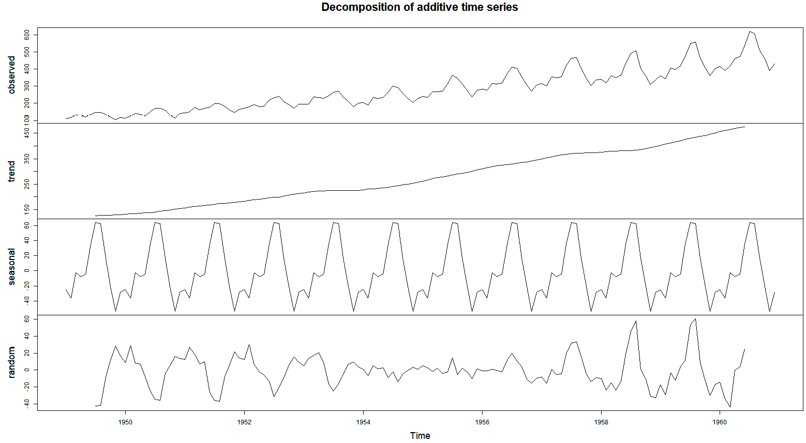

图 10.3 – 分解时间序列的图

现在我们已经可视化了分解，我们可以开始分析 ACF 和 PACF 图。

## 在 R 中创建 ACF 和 PACF 图

在本节中，我们将介绍 ACF 和 PACF 图。ACF 图是自相关函数图。自相关函数是当前时间点的观察值与之前时间点的观察值之间的关系。它告诉你当前观察值与同一时间序列的不同滞后之间的相关性如何。因此，如果啤酒有强烈的季节性需求，你将在之前的季节性周期中看到与之相关的强烈相关性。

首先，让我们看看`acf()`函数的输出：

```py
acf(ap_ts)
```

这是它的图：


图 10.4 – AirPassengers 数据的 ACF 图

在这里，我们可以看到所有点都与它们的前一个点有显著的相关性，因为数据本身是向上趋势的。然而，我们也可以看到数据中有峰值和谷值，这代表了季节性相关性。

现在，让我们看看 PACF 图，它也是通过将`acf()`函数的类型设置为“partial”而生成的。

偏自相关是观察值`t`与某些观察值`t-n`之间的关系。通过移除`t`与通过`t-n`的先前观察值之间的关系，偏自相关是移除较短滞后项的影响的结果。现在，让我们看看同一时间序列的 PACF，`acf(ap_ts, type = "partial")`：

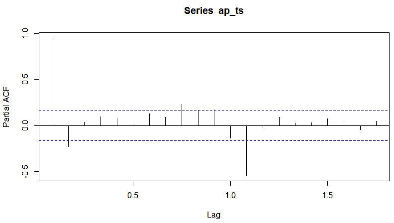

图 10.5 – AirPassengers 数据的 PACF

通过这些，我们已经介绍了如何在 R 中快速创建 ACF 和 PACF 图。我们还提供了一个非常快速的了解它们是什么的概述。现在，让我们学习如何使用`healthyR.ts`库对时间序列进行建模。

# 使用 healthyR.ts 进行自动 ARIMA 建模

时间序列，就像任何其他数据集一样，可以被建模。方法众多，既有古老的也有新的。在本节中，我们将讨论 ARIMA 建模，特别是使用 R 中的`healthyR.ts`库构建自动 ARIMA 模型。ARIMA 模型本身试图描述数据中的自相关性。

在本节中，我们将使用一个以`ts_auto_arima()`函数创建和拟合调整后的模型结束的工作流程。此模型需要我们的数据以 tibble 格式。因此，为了做到这一点，我们将使用 AirPassengers 数据集并确保它是一个 tibble。

让我们从我们已经引入的数据集开始，并将其强制转换为 tibble：

```py
library(healthyR.ts)
library(dplyr)
library(timetk)
ap_tbl <- ts_to_tbl(ap_ts) |>
  select(-index)
> class(ap_tbl)
[1] "tbl_df"      "tbl"           "data.frame"
```

在前面的代码中，我们加载了`healthyR.ts`和`dplyr`库，然后使用`healthyR.ts`库中的`ts_to_tbl()`函数将已经存在的`ap_ts`时间序列对象转换为 tibble。接下来，我们必须使用`timetk`库中的`time_series_split()`函数创建一个训练/测试分割：

```py
# Time Series Split
splits <- time_series_split(
  data = ap_tbl
  , date_var = date_col
  , assess = 12
  , skip = 3
  , cumulative = TRUE
)
> splits
<Analysis/Assess/Total>
<132/12/144>
```

现在我们已经创建了分析/评估数据分割，我们就可以运行主函数了。这个函数旨在成为一个样板函数，它会自动完成大多数工作。然而，你总是可以取用模型并对其进行你想要的操作。`healthyR.ts`中的这些样板函数并不打算成为终极解决方案。

让我们现在运行这个函数，然后看看输出：

```py
Library(modeltime)
ts_auto_arima <- ts_auto_arima(
  .data = ap_tbl,
  .num_cores = 10,
  .date_col = date_col,
  .value_col = x,
  .rsamp_obj = splits,
  .formula = x ~ .,
  .grid_size = 20,
  .cv_slice_limit = 5,
  .tune = TRUE
)
```

在前面，我们提供了包含数据和我们要使用的核心数（在我们的案例中是`10`）的 tibble。接下来，我们提供了包含日期的列——在这个案例中是`date_col`——值列来自我们提供的 tibble 中的`x`。接下来是重采样对象，分割，然后是我们的公式，它被传递到`ts_auto_arima()`函数内部的 recipe 函数。在这种情况下，它是`x`对日期。我们提供了一个`20`的网格大小来制作调整网格，以及一个`5`的切片限制，以确保不会生成超过五个数据切片。最重要的是，我们将`.tune`参数设置为`TRUE`。这指示函数继续进行模型调整。模型调整可能会导致数据返回需要几秒钟/几分钟。

让我们看看输出。我们将首先查看配方信息：

```py
> ts_auto_arima$recipe_info
$recipe_call
recipe(.data = ap_tbl, .date_col = date_col, .value_col = x,
     .formula = x ~ ., .rsamp_obj = splits, .tune = TRUE, .grid_size = 20,
     .num_cores = 10, .cv_slice_limit = 5)
$recipe_syntax
[1] "ts_arima_recipe <-"
[2] "\n  recipe(.data = ap_tbl, .date_col = date_col, .value_col = x, .formula = x ~ \n     ., .rsamp_obj = splits, .tune = TRUE, .grid_size = 20, .num_cores = 10, \n     .cv_slice_limit = 5)"
$rec_obj
── Recipe ────────────────────────────────────────────────────────────────────────────────────────
── Inputs
Number of variables by role
outcome:   1
predictor: 1
```

因此，从前面的输出中，我们可以看到我们有一个单一的结果变量和一个预测变量。对于一个没有外生回归变量的自动 ARIMA 模型来说，这已经足够了。

现在，让我们看看模型信息：

```py
ts_auto_arima
> ts_auto_arima$model_info
$model_spec
ARIMA Regression Model Specification (regression)
Main Arguments:
  seasonal_period = tune::tune()
  non_seasonal_ar = tune::tune()
  non_seasonal_differences = tune::tune()
  non_seasonal_ma = tune::tune()
  seasonal_ar = tune::tune()
  seasonal_differences = tune::tune()
  seasonal_ma = tune::tune()
Computational engine: arima
```

在前面的代码中，我们可以看到模型的所有参数都设置为`tune::tune()`。这将允许模型通过调整网格运行：

```py
$wflw
══ Workflow
Preprocessor: Recipe
Model: arima_reg()
── Preprocessor
0 Recipe Steps
── Model
ARIMA Regression Model Specification (regression)
Main Arguments:
  seasonal_period = tune::tune()
  non_seasonal_ar = tune::tune()
  non_seasonal_differences = tune::tune()
  non_seasonal_ma = tune::tune()
  seasonal_ar = tune::tune()
  seasonal_differences = tune::tune()
  seasonal_ma = tune::tune()
Computational engine: arima
```

创建的以下工作流程对象显示，配方没有任何步骤，因为没有进行任何类型的转换：

```py
$fitted_wflw
…
── Model
Series: outcome
ARIMA(4,1,2)(1,0,1)[12]
Coefficients:
       ar1    ar2     ar3      ar4     ma1      ma2     sar1     sma1
     -0.221  0.9020  0.0894  -0.2144  0.0477  -0.9523  0.9695  -0.0869
s.e.  0.092  0.0996  0.0958   0.0875  0.0367   0.0365  0.0143   0.0927
sigma² = 99.46:  log likelihood = -497.36
AIC=1012.72   AICc=1014.21   BIC=1038.6
$was_tuned
[1] "tuned"
```

拟合的工作流程对象显示，选定的最佳模型是`ARIMA(4,1,2)(1,0,1)[12]`模型。它还提供了我们的系数和模型 AIC。

接下来，我们将查看返回输出的`model_calibration`对象：

```py
> ts_auto_arima$model_calibration
$plot
$calibration_tbl
# Modeltime Table
# A tibble: 1 × 5
  .model_id .model.model_desc.type .calibration_data
        <int> <list>      <chr>                           <chr> <list>
1            1 <workflow> ARIMA(4,1,2)(1,0,1)[12] Test  <tibble [12 × 4]>
$model_accuracy
# A tibble: 1 × 9
  .model_id .model_desc.type   mae  mape  mase smape  rmse   rsq
        <int> <chr>                           <chr> <dbl> <dbl> <dbl> <dbl> <dbl> <dbl>
1            1 ARIMA(4,1,2)(1,0,1)[12] Test   16.2  3.35 0.335  3.35  19.5 0.960
```

下面是生成的图表：

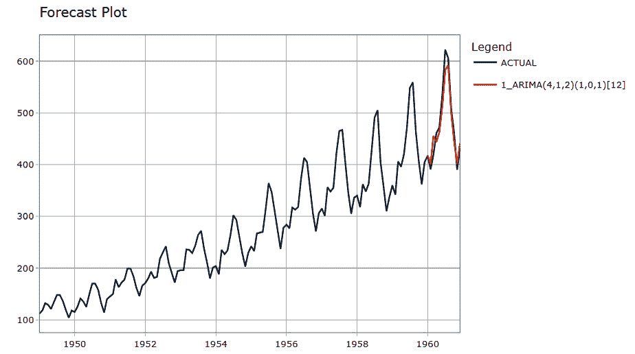

图 10.6 – 自动 ARIMA 校准图

最后，我们将回顾返回的`tuned_model`对象：

```py
> ts_auto_arima$tuned_info
$tuning_grid
# A tibble: 20 × 7
   seasonal_period non_seasonal_ar non_seasonal_differences non_seasonal_ma seasonal_ar
   <chr>         <int>           <int>         <int>       <int>
 1 weekly          3               0            1             2
 2 yearly          5               1            4               0
# ℹ 2 more variables: seasonal_differences <int>, seasonal_ma <int>
$tscv
# Time Series Cross Validation Plan
# A tibble: 5 × 2
  splits               id
  <list>               <chr>
1 <split [120/12]> Slice1
2 <split [117/12]> Slice2
3 <split [114/12]> Slice3
4 <split [111/12]> Slice4
5 <split [108/12]> Slice5
$tuned_results
# Tuning results
# NA
# A tibble: 5 × 4
  splits               id      .metrics                 .notes
  <list>               <chr>  <list>                    <list>
1 <split [120/12]> Slice1 <tibble [120 × 11]> <tibble [1 × 3]>
2 …
$grid_size
[1] 20
$best_metric
[1] "rmse"
$best_result_set
# A tibble: 1 × 13
  seasonal_period non_seasonal_ar non_seasonal_differences non_seasonal_ma seasonal_ar
  <chr>           <int>            <int>         <int>         <int>
1 yearly             4                1              2               1
# ℹ 8 more variables: seasonal_differences <int>, seasonal_ma <int>, .metric <chr>,
#   .estimator <chr>, mean <dbl>, n <int>, std_err <dbl>, .config <chr>
$tuning_grid_plot
`geom_smooth()` using method = 'loess' and formula = 'y ~ x'
$plotly_grid_plot
```

从前面的代码中，我们可以看到从这个函数返回的这一部分有很多信息。这应该包含你做出明智决定所需的所有信息，决定你是否应该继续调整或继续前进。

让我们看看最后一个图表，它作为静态`ggplot2`对象和`plotly`对象返回：


图 10.7 – 自动 ARIMA 模型的调优网格

完成这些后，让我们看看布朗运动的概念是如何工作的。

# 使用 healthyR.ts 创建布朗运动

我们将要展示的最后一个时间序列图是**布朗运动**。布朗运动，也称为*维纳过程*，是金融和数学中的一个基本概念，描述了流体中粒子的随机运动。在金融的背景下，它通常用于模拟股票、商品和货币等金融工具的价格变动。

布朗运动的一些关键特征如下：

+   **随机性**：布朗运动本质上是随机的。在任何时间点，未来方向和移动幅度都不能被确定地预测。

+   **连续路径**：布朗运动的路径是连续的，这意味着资产的价格可以平滑移动，没有突然的跳跃或缺口。

+   **独立增量**：资产价格在非重叠时间间隔内的变化是相互独立的。换句话说，一个时间间隔的价格变动不会影响另一个时间间隔的价格变动。

+   **高斯分布**：布朗运动的增量（即价格变化）是正态分布的，遵循高斯或正态分布。这与金融市场中小幅度价格变动比大幅度变动更常见的观点一致。

+   **恒定方差**：价格增量的方差随时间保持恒定。这有时被称为**同方差**属性。

从数学上讲，资产价格*S(t)*随时间*t*的变化可以用随机微分方程来描述：

这里，我们有以下内容：

+   *dS(t)* 是资产价格在微小时间间隔*dt*内的无穷小变化

+   *μ* 是资产随时间变化的漂移或预期平均回报率

+   *σ* 是资产的波动性，代表其价格变化的标准差

+   *dW(t)* 是维纳过程，代表一个随机增量

布朗运动是金融模型（如 Black-Scholes 期权定价模型和 Vasicek 利率模型）的基石之一。它通过捕捉其固有的随机性和波动性，有助于理解和估计金融工具的行为。然而，需要注意的是，由于市场情绪、新闻和其他外部因素的影响，实际金融市场可能偏离完美的布朗运动。

我们可以使用`healthyR.ts`库快速生成布朗运动并绘制其输出。以下是代码：

```py
library(healthyR.ts)
ts_brownian_motion() |>
  ts_brownian_motion_plot(t, y)
```

这里是前面代码的输出。这是一个随机过程，所以你的输出可能不会匹配：

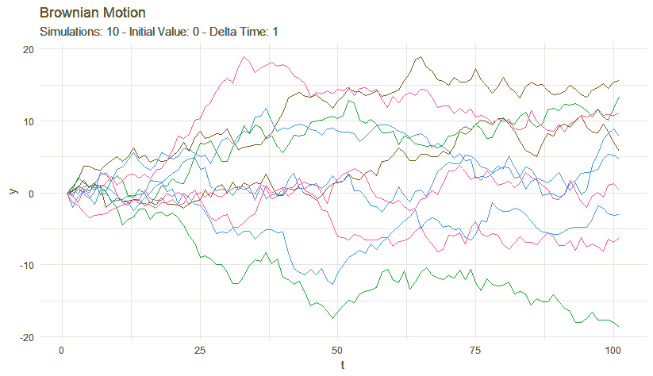

图 10.8 – 使用 healthyR.ts 库创建和查看布朗运动

既然我们已经了解了 R 中的时间序列数据，让我们转到 Python 看看那里是如何操作的。

# Python 中的时间序列分析 – 统计、绘图和预测

在深入研究时间序列分析之前，拥有可工作的数据至关重要。在本节中，我们将介绍创建模拟时间序列数据、将其保存到 Excel 文件中，然后将其读回到 pandas 的过程。这将成为我们进行时间序列分析的基础。

和往常一样，我们将从加载相关的库开始：

```py
import pandas as pd
import numpy as np
import matplotlib.pyplot as plt
```

然后，我们必须创建样本数据并将其保存到 Excel 中，以便在本章的其余部分使用：

```py
# Create a date range
date_rng = pd.date_range(start='2022-01-01', end='2023-12-31',
    freq='D')
# Create a trend component
trend = 0.05 * np.arange(len(date_rng))
# Create a seasonal component (cyclicality)
seasonal = 2.5 * np.sin(2 * np.pi * np.arange(len(date_rng)) / 365)
# Add some random noise
noise = np.random.normal(0, 0.5, len(date_rng))
# Combine all components to create the time series
time_series = trend + seasonal + noise
# Create a DataFrame
df = pd.DataFrame({'Date': date_rng, 'Value': time_series})
# Save the data to an Excel file
df.to_excel('time_series_data.xlsx', index=False)
```

最后，我们必须从 Excel 中加载数据，并查看加载的数据，如下所示：

```py
# Read the data back into pandas
loaded_df = pd.read_excel('time_series_data.xlsx')
# Display the first few rows
print(loaded_df.head())
```

在这个例子中，我们生成一个具有线性趋势、正弦波季节成分和随机噪声的合成时间序列。这种数据集更真实地反映了现实世界中的时间序列数据，其中模式通常涉及这些元素的组合。然后，数据集被保存到 Excel 文件中，您可以根据需要将其读回到 Python 进行分析。

正如我们在 *第六章* 中讨论的，分析的第一步是绘图（插入邪恶的笑声）！

# 时间序列绘图 – 基本绘图和 ACF/PACF 图

可视化时间序列数据是理解其潜在模式和趋势的关键步骤。在本节中，我们将探讨各种时间序列图以及如何使用 Python 创建它们。这些可视化有助于我们深入了解时间序列数据中的季节性、趋势和自相关性。

我们将首先加载所需的库：

```py
import pandas as pd
import numpy as np
import matplotlib.pyplot as plt
import statsmodels.api as sm
from statsmodels.graphics.tsaplots import plot_acf, plot_pacf
```

然后，我们必须从 Excel 中加载数据，并确保日期信息被正确转换：

```py
# Load time series data (replace 'time_series_data.xlsx' with your data file)
data = pd.read_excel('time_series_data.xlsx')
# Convert the 'Date' column to datetime format and set it as the index
data['Date'] = pd.to_datetime(data['Date'])
data.set_index('Date', inplace=True)
```

现在，我们可以创建时间序列的基本图，以便进行初步查看：

```py
# Plot the time series
plt.figure(figsize=(12, 6))
plt.plot(data['Value'])
plt.title('Time Series Plot')
plt.xlabel('Date')
plt.ylabel('Value')
plt.grid(True)
plt.show()
```

这就是该图的样子：

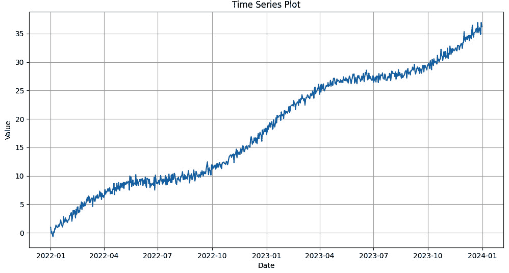

图 10.9 - 标题

接下来，我们必须使用以下代码创建更高级的 ACF 和 PACF 图：

```py
# ACF and PACF plots
fig, (ax1, ax2) = plt.subplots(2, 1, figsize=(12, 8))
# ACF plot
plot_acf(data['Value'], lags=10, ax=ax1)
ax1.set_title('Autocorrelation Function (ACF)')
# PACF plot
plot_pacf(data['Value'], lags=40, ax=ax2)
ax2.set_title('Partial Autocorrelation Function (PACF)')
plt.tight_layout()
plt.show()
```

结果图如下所示：

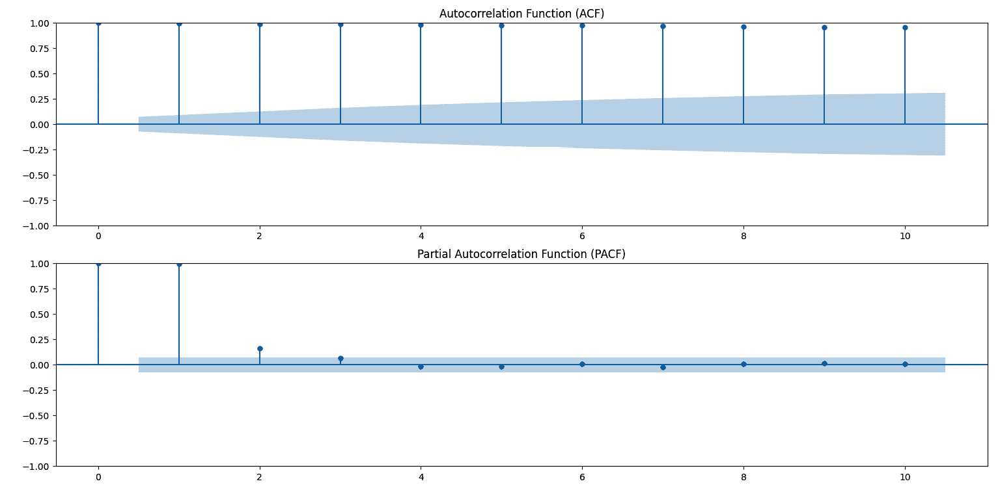

图 10.10 – 滞后 1 和 2 的 ACF 和 PACF 图

在这里，我们首先从 Excel 文件中加载数据，并将 **日期** 列转换为 datetime 索引。然后，我们创建了一个时间序列图来可视化数据随时间的变化。此外，我们还生成了 ACF 和 PACF 图来探索时间序列中的自相关模式。这些图对于识别时间序列模型中可能的滞后值非常有价值。

现在，让我们看看 ACF 和 PACF 图如何帮助我们深入了解时间序列数据。特别是，我们将看到它们如何被用来理解季节性、趋势和自相关性。

## 自相关函数 (ACF) 图

ACF 图显示了时间序列与其滞后值之间的相关性。换句话说，它量化了当前值与过去值的相关程度。

ACF 图在特定滞后处的峰值表示数据中可能存在的季节性或周期性模式。例如，在每日序列中滞后 7 处的显著峰值表明存在每周季节性，而在月度序列中滞后 12 处的峰值可能表明存在年度季节性。

通过分析 ACF 图，您可以识别出相关性显著偏离零的滞后值。这些滞后值可以提供有关数据季节性的见解。此外，识别 ACF 中的指数衰减可以表明时间序列模型中存在自回归成分。

## 部分自相关函数（PACF）图

PACF 图衡量时间序列与其滞后值之间的直接关系，同时消除中间滞后值的影响。

PACF 图在特定滞后处的峰值表示直接影响当前值的时间序列滞后值的数量。例如，滞后 1 处的一个显著峰值以及之后没有显著峰值表明存在一阶**自回归**（**AR**）过程。

PACF 图有助于确定 ARIMA 模型中自回归项（p）的阶数。它还可以揭示时间序列中的突然变化，表明结构断裂或位移。

通过结合分析这些图表和您的时间序列数据，您可以获得有关季节性、趋势和自相关性的宝贵见解。这些见解在选择适当的时间序列模型和进行准确预测方面至关重要。

在*图 10.9*中显示的图中，对于 PACF 图，只有滞后 1 具有强烈的自相关性，而 ACF 图由于随机数据生成的方式而被误导，在所有研究的滞后中都显示出高度的自相关性。

通过从这些图表中获得见解，我们可以继续进行实质性的分析：统计分析与预测

# 时间序列统计与统计预测

数据探索和统计分析是理解时间序列数据特征的关键步骤。在本节中，我们将向您展示如何使用 Python 进行数据探索和运用统计分析技术，以获得对时间序列的宝贵见解。

## 时间序列数据的统计分析

在上一节中使用图表探索数据后，让我们继续进行统计分析，以获得更深入的理解。本节重点关注两个领域：

+   **Augmented Dickey-Fuller (ADF) 测试**：这种统计测试用于确定时间序列数据是否平稳。平稳数据更容易建模和预测。

+   **时间序列分解**：时间序列分解将数据分解为其组成部分：趋势、季节性和残差。这种分解有助于隔离用于预测的模式。

我们将在接下来的章节中了解这两者。

### ADF 测试

ADF 测试是一种用于评估时间序列**平稳性**的统计方法。平稳性是时间序列分析中的一个基本概念，因为它简化了建模过程。平稳时间序列具有统计属性，如恒定的均值和方差，这些属性不会随时间变化。另一方面，非平稳数据表现出趋势或季节性，这使得准确建模和预测变得具有挑战性。

在 ADF 测试中，零假设（H0）假定数据是非平稳的。备择假设（H1）表明数据是平稳的。通过分析从测试中获得的 p 值，你可以确定是否拒绝零假设。低 p 值（通常小于 0.05）表明数据是平稳的，而高 p 值则表明非平稳性。因此，在进行 ADF 测试时，p 值小于 0.05 是平稳时间序列的一个指标。

这里是一个代码示例，展示了如何使用我们信任的`statsmodels`库在 Python 中实现 ADF 测试：

```py
from statsmodels.tsa.stattools import adfuller
import pandas as pd
# Read the data back into pandas
df = pd.read_excel('time_series_data.xlsx')
# Augmented Dickey-Fuller Test
adf_result = adfuller(df['Value'])
print("\nAugmented Dickey-Fuller Test:")
print(f"ADF Statistic: {adf_result[0]}")
print(f"P-value: {adf_result[1]}")
print("Null Hypothesis (H0): Data is non-stationary")
print("Alternative Hypothesis (H1): Data is stationary")
if adf_result[1] <= 0.05:
     print("Result: Reject the null hypothesis. Data is stationary.")
else:
     print("Result: Failed to reject the null hypothesis. Data is non-stationary.")
```

毫不奇怪，我们没有拒绝零假设，因为我们之前生成的时序数据具有明显的线性趋势，因此它不是平稳的。

为了获得更深入的见解，我们可以进一步分析详细的输出：

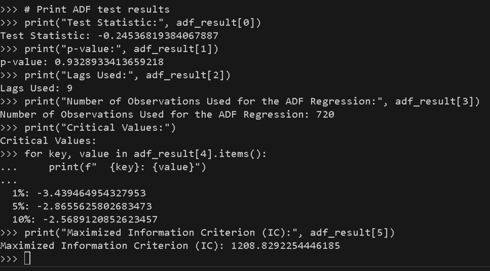

图 10.11 – ADF 测试结果

如您所见，ADF 测试的结果，由`adfuller`返回，包含几个组成部分：

+   在我们的情况下（`-0.24536819384067887`）是测试统计量。这个统计量用于评估时序数据集中是否存在单位根的零假设。测试统计量越负（或越不积极），对零假设的证据就越强。

+   在我们的情况下（`0.9328933413659218`）是与测试统计量相关的 p 值。它代表如果零假设为真，观察给定测试统计量的概率。小的 p 值（通常小于 0.05）表明拒绝零假设，支持平稳性。

+   在我们的情况下（`9`））代表在估计 ADF 测试时回归中使用的滞后数。

+   在我们的情况下（`720`）代表在 ADF 回归中使用的观测数。

+   **字典**：结果的下一段是一个包含不同置信水平（1%、5%和 10%）临界值的字典。这些临界值用于确定测试统计量的显著性。

+   在我们的情况下（`1208.8292254446185`）是最大化的 IC。它代表模型拟合优度的一个度量。IC 的值越低，拟合度越好。

总结来说，你通常会通过关注测试统计量和 p 值来解释 ADF 测试结果。如果测试统计量更负（或更正）且 p 值较小（通常小于 0.05），则表明拒绝单位根的零假设，并得出时间序列是平稳的结论。

### 时间序列分解

时间序列分解是一种将时间序列数据集分解为其关键组成部分（趋势、季节性和残差）的技术。这些组成部分为理解时间序列的潜在模式提供了宝贵的见解，使其更容易理解和预测。

让我们了解这些组成部分：

+   **趋势**：趋势组成部分代表数据中的潜在长期运动或趋势。它捕捉整体方向——即数据随时间增加或减少。

+   **季节性**：季节性指的是数据在固定间隔内重复出现的模式。这些模式可能是每日、每周、每月或每年的模式，具体取决于数据。检测季节性对于理解周期性趋势并在预测中调整它们至关重要。

+   **残差**：残差是时间序列数据的非规则或随机组成部分。它们代表在去除趋势和季节性之后剩余的部分。分析残差有助于识别数据中的任何剩余模式或异常事件。

在我们的代码中，我们应用时间序列分解将时间序列分解为其组成部分，并可视化每个组成部分。这个过程使我们能够理解数据的结构，从而更容易地识别预测中的潜在模式。

让我们看看 Python 中时间序列分解的一个实现：

```py
from statsmodels.tsa.seasonal import seasonal_decompose
import matplotlib.pyplot as plt
# Time Series Decomposition
decomposition = seasonal_decompose(df['Value'],
    model='additive',  period=365)
trend = decomposition.trend
seasonal = decomposition.seasonal
residual = decomposition.resid
# Plot the decomposition components
plt.figure(figsize=(12, 8))
plt.subplot(411)
plt.plot(df['Date'], df['Value'], label='Original')
plt.legend(loc='best')
plt.subplot(412)
plt.plot(df['Date'], trend, label='Trend')
plt.legend(loc='best')
plt.subplot(413)
plt.plot(df['Date'], seasonal, label='Seasonal')
plt.legend(loc='best')
plt.subplot(414)
plt.plot(df['Date'], residual, label='Residual')
plt.legend(loc='best')
plt.suptitle("Time Series Decomposition")
plt.show()
```

结果图是自解释的（特别是因为它反映了数据是如何人工生成的）：

/

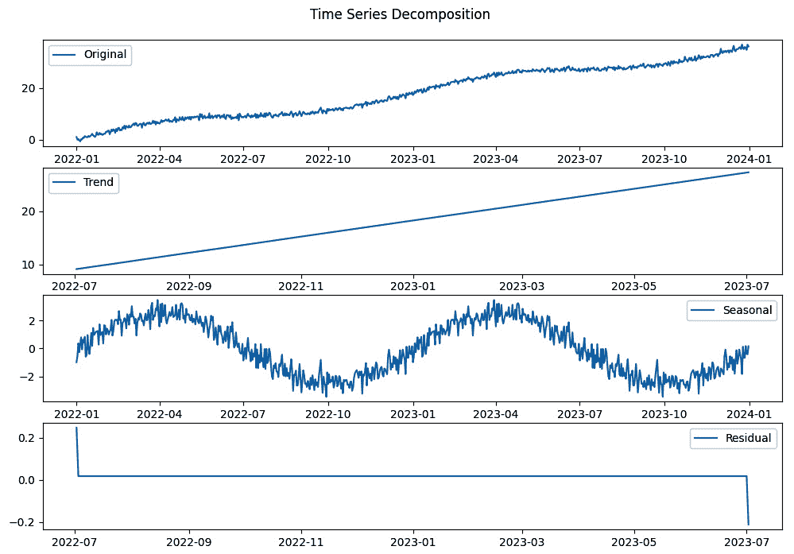

图 10.12 – 时间序列分解

在本节中，我们介绍了可以帮助你理解时间序列和解决建模中最典型挑战的核心技术：分解和如何解释组成部分。通过提供的图表和统计分析，我们对时间序列有了更深入的理解，可以继续进行最有价值的步骤：预测。

# 理解预测建模方法

在本节中，我们将深入探讨使用两个强大的 Python 库——`statsmodels` 和 `prophet`——进行预测建模方法。

这些库提供了多样化的工具来处理时间序列预测，使你能够根据时间序列数据做出明智的决定和预测。

## 使用 statsmodels 进行预测

`statsmodels` 是 Python 生态系统中的一个流行库，它提供了一系列的统计工具，包括时间序列分析。对于预测，它提供了构建 ARIMA 模型的功能。ARIMA 模型是时间序列分析的基础，允许你捕捉并模拟数据中的复杂模式。

使用 `statsmodels` 构建 ARIMA 模型涉及选择合适的差分阶数、自回归组件和移动平均组件，以最好地表示数据的潜在模式。一旦模型建立，你就可以进行预测并评估其性能。

最后，非常重要的一点是，由于我们拥有的时间序列不是平稳的，我们应该模拟时间序列中的变化或差异。

让我们看看代码中的工作流程！

1.  首先，导入必要的库并加载数据：

    ```py
    # Import necessary libraries
    import pandas as pd
    import numpy as np
    import statsmodels.api as sm
    from scipy.stats import norm
    import matplotlib.pyplot as plt
    # Load the time series data (replace with your data)
    time_series_data = pd.read_excel('time_series_data.xlsx')['Value']
    ```

1.  然后，检查平稳性并决定我们是要模拟时间序列本身还是差异：

    ```py
    # Perform the Augmented Dickey-Fuller test to check for stationarity
    result = sm.tsa.adfuller(time_series_data, autolag='AIC')
    # If the p-value is greater than a threshold (e.g., 0.05), perform differencing to make the data stationary
    if result[1] > 0.05:
            differenced_data = np.diff(time_series_data, n=1)
    else:
            differenced_data = time_series_data
    ```

1.  现在（由于我们的时间序列不是平稳的，所以我们使用了差分数据），我们可以构建实际的模型并将其拟合：

    ```py
    # Build an ARIMA model
    order = (1, 1, 1)  # Values based on ACF and PACF analysis
    model = sm.tsa.ARIMA(differenced_data, order=order)
    # Fit the ARIMA model
    model_fit = model.fit()
    ```

1.  可选地，我们可以对阶数参数进行一些超参数调整，而不是仅基于图表做出决策。然而，对于这个例子，这已经足够了。超参数调整是指调整定义模型的参数，而不是拟合数据的参数，例如 ARIMA 模型的阶数。

1.  现在，我们可以使用训练好的模型创建我们的预测。

    注意，由于我们建模了差分数据，我们需要将预测结果转换回实际的时间序列：

    ```py
    # Make forecasts
    forecast_steps = 50  # Adjust the number of forecast steps as needed
    forecast = model_fit.forecast(steps=forecast_steps)
    # If the p-value is greater than a threshold (e.g., 0.05), perform differencing to make the data stationary
    if result[1] > 0.05:
            # The model was trained on the differenced data so the forecasts have to be added to the last data point
            cumsum_forecasts = np.cumsum(forecast)
            # Add this cumulative sum to the last observed value in your raw data
            real_forecasts = cumsum_forecasts + time_series_data[len(time_series_data)-1]
    else:
            real_forecasts = forecast
    ```

1.  然后，我们必须计算基本统计量并使用它们来计算置信区间：

    ```py
    # Retrieve ARIMA model parameters
    params = model_fit.params
    p, d, q = order
    resid = model_fit.resid
    # Compute the standard errors
    stderr = np.std(resid)
    # Calculate the confidence intervals
    z_score = norm.ppf(0.975)  # For a 95% confidence interval
    conf_int = np.column_stack((real_forecasts - z_score * stderr,
            real_forecasts + z_score * stderr))
    # Separate the forecasts into point forecasts and confidence intervals
    point_forecasts = real_forecasts  # The point forecasts
    forecast_stderr = stderr  # The standard errors of the forecasts
    lower_bound = conf_int[:, 0]  # Lower confidence interval bounds
    upper_bound = conf_int[:, 1]  # Upper confidence interval bounds
    ```

1.  最后，我们必须将预测与原始时间序列一起绘制出来，以便对模型进行视觉评估：

    ```py
    # Visualize the original time series and forecasts
    plt.figure(figsize=(12, 6))
    plt.plot(time_series_data, label='Original Time Series', color='blue')
    plt.plot(range(len(time_series_data),
        len(time_series_data) + forecast_steps),
        real_forecasts, label='Forecast', color='red')
    plt.fill_between(range(len(time_series_data),
        len(time_series_data) + forecast_steps),
        lower_bound, upper_bound, color='pink', alpha=0.5)
    plt.xlabel('Time Steps')
    plt.ylabel('Value')
    plt.title('ARIMA Time Series Forecast')
    plt.legend()
    plt.show()
    ```

    结果图为我们提供了一些有价值的见解：

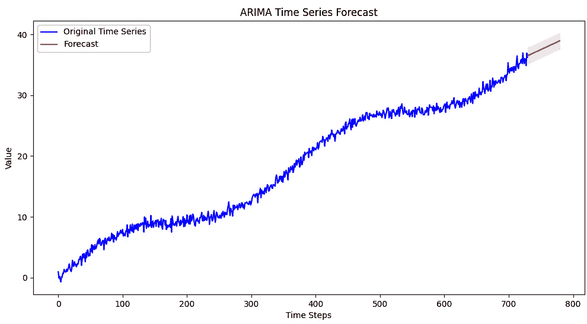

图 10.13 – 时间序列和 statsmodel 预测

我们可以看到，虽然趋势被很好地捕捉到了，并且一些季节性也出现了，但该模型过于简单，无法完全捕捉时间序列的本质。

为了解决这个问题，我们可以使用来自专用时间序列库的更复杂模型：`prophet`。

## 使用 Facebook 的 prophet 进行时间序列预测

专门为时间序列预测任务设计的 `prophet` 库以其易用性和广泛的模型选择而闻名，适用于各种预测场景。

`prophet` 提供了一种直观的方式来模拟时间序列数据。它还提供了超参数优化和预测评估的工具。

我们将使用的代码也看起来更简单：

1.  首先，我们必须加载必要的库，读取 Excel 数据，并创建 DataFrame，使其符合 `prophet` 期望的列：

    ```py
    # Import necessary libraries
    import pandas as pd
    from prophet import Prophet
    from prophet.plot import plot
    # Load the time series data (replace with your data)
    time_series_data = pd.read_excel('time_series_data.xlsx')
    # Create a DataFrame with 'ds' and 'y' columns
    df = pd.DataFrame({'ds': time_series_data['Date'], 
        'y': time_series_data['Value']})
    ```

1.  然后，我们必须使用领域知识（在这种情况下，来自我们这样生成数据的事实）稍微调整模型：

    ```py
    # Initialize and fit the Prophet model without weekly seasonality
    model = Prophet(weekly_seasonality=False)
    # Add custom seasonality obtained from domain knowledge (in this case: we generated the data so)
    model.add_seasonality(name='custom_season', period=365, 
        fourier_order=5)
    # Fit the customized model
    model.fit(df)
    ```

1.  最后，我们可以创建我们的预测并绘制它及其组成部分：

    ```py
    # Create a dataframe for future dates
    forecast_steps = 150  # Adjust the number of forecast steps as needed
    future = model.make_future_dataframe(periods=forecast_steps,
        freq='D')
    # Make predictions
    forecast = model.predict(future)
    # Plot the forecast
    fig = model.plot(forecast)
    fig.show()
    # Plot components of the forecast (trend, yearly, and weekly seasonality)
    fig2 = model.plot_components(forecast)
    fig2.show()
    ```

    生成的图表显示了一个比`statsmodel`更高的预测质量，置信区间更紧密。季节性和趋势都得到了明显的捕捉：

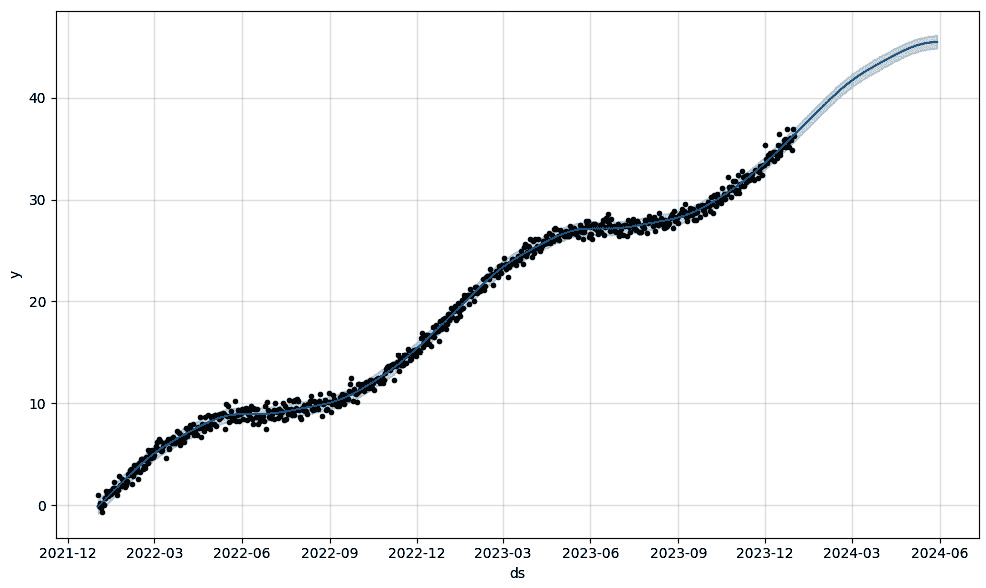

图 10.14 – 时间序列和 prophet 预测

要深入了解模型拟合，让我们看看拟合的时间序列模型的组成部分：


图 10.15 – 由 prophet 拟合的时间序列模型的组成部分

如您所见，`prophet`以非常简单的方式拟合模型，无需猜测起始参数。您可以使用并应该使用任何领域知识来改进初始模型。

在前面的代码中，我们关闭了默认的每周季节性，并添加了自定义的年度季节性。如果需要，我们可以做更多的事情：

+   我们可以添加自定义的假日日历，例如，使用`model.add_country_holidays(country_name='US')`命令。

+   如果我们确信存在变化点，但不确定具体位置，我们可以尝试调整变化点。

+   我们可以调整自定义季节性的傅里叶阶数。

使用`statsmodel`和`prophet`完成预测后，是时候总结本节内容并继续下一部分了。

在本节中，您为时间序列数据建立了强大的统计分析与预测基础。这些技能对于理解过去趋势和做出预测至关重要，能够支持数据驱动的决策和洞察。

在下一节中，我们将探讨用于时间序列分析的深度学习模型。

# 深度学习时间序列预测 – LSTM

本节将向您介绍使用深度学习模型的高级时间序列预测技术。无论您是处理传统时间序列数据还是更复杂、高维度的数据，这些深度学习模型都能帮助您做出更准确的预测。特别是，我们将涵盖`keras`。

我们将使用`keras`和`tensorflow`后端，因此您需要安装这两个库：

1.  像往常一样，让我们加载必要的库并预处理一些时间序列数据：

    ```py
    import numpy as np
    import pandas as pd
    import matplotlib.pyplot as plt
    from keras.models import Sequential
    from keras.layers import LSTM, Dense
    from sklearn.preprocessing import MinMaxScaler
    # Load the time series data (replace with your data)
    time_series_data = pd.read_excel('time_series_data.xlsx')
    # Normalize the data to be in the range [0, 1]
    scaler = MinMaxScaler()
    data = scaler.fit_transform(
        time_series_data['Value'].to_numpy().reshape(-1, 1))
    ```

1.  数据集准备就绪后，我们将将其分为训练集和测试集，并重新塑形以供 LSTM 输入：

    ```py
    # Split the data into training and testing sets
    train_size = int(len(data) * 0.67)
    train, test = data[0:train_size, :], data[train_size:len(data), :]
    # Create sequences and labels for training
    def create_dataset(dataset, look_back=1):
        X, Y = [], []
        for i in range(len(dataset) - look_back):
            a = dataset[i:(i + look_back), 0]
            X.append(a)
            Y.append(dataset[i + look_back, 0])
        return np.array(X), np.array(Y)
    look_back = 3
    X_train, Y_train = create_dataset(train, look_back)
    X_test, Y_test = create_dataset(test, look_back)
    # Reshape the data for LSTM input
    X_train = np.reshape(X_train, (X_train.shape[0], 1, 
        X_train.shape[1]))
    X_test = np.reshape(X_test, (X_test.shape[0], 1, 
        X_test.shape[1]))
    ```

1.  数据准备就绪后，让我们创建并训练一个 LSTM 模型：

    ```py
    model = Sequential()
    model.add(LSTM(4, input_shape=(1, look_back)))
    model.add(Dense(1))
    model.compile(loss='mean_squared_error', optimizer='adam')
    model.fit(X_train, Y_train, epochs=100, batch_size=1, verbose=2)
    ```

    此代码定义了一个简单的 LSTM 模型，编译它，并使用我们的训练数据进行训练。您可以根据您特定的时序分析需要自定义模型架构和训练参数。请注意，训练时间比我们在上一节中使用的简单模型长得多。

1.  模型训练完成后，我们可以做出预测并将它们缩放回原始数据集进行比较：

    ```py
    # Make predictions:
    trainPredict = model.predict(X_train)
    testPredict = model.predict(X_test)
    # Inverse transform the predictions to the original scale
    trainPredict = scaler.inverse_transform(trainPredict)
    testPredict = scaler.inverse_transform(testPredict)
    ```

1.  最后，可视化实际数据集和测试集的预测：

    ```py
    # Plot the training predictions
    trainPredictPlot = np.empty_like(data)
    trainPredictPlot[:, :] = np.nan
    trainPredictPlot[look_back:len(trainPredict) + look_back, :] =\
        trainPredict
    # Plot the test predictions
    testPredictPlot = np.empty_like(data)
    testPredictPlot[:, :] = np.nan
    testPredictPlot[len(trainPredict) + (look_back * 2):len(data),
        :] = testPredict
    # Plot the training data in blue
    plt.plot(time_series_data['Value'], color='blue', label=
        'Actual Data')
    # Create shaded regions for the training and test data
    plt.fill_between(range(len(data)), 0, 
        trainPredictPlot.reshape(-1),
        color='lightgray', label='Training Data')
    plt.fill_between(range(len(data)), 0, 
        testPredictPlot.reshape(-1),
        color='lightcoral', label='Test Data')
    # Overlay the predictions in green
    plt.plot(testPredictPlot, color='green', label='Predictions')
    plt.title('Time Series Analysis with LSTM')
    plt.legend()
    plt.show()
    ```

    对于如此小的数据集和简单的模型，生成的图像相当令人印象深刻：

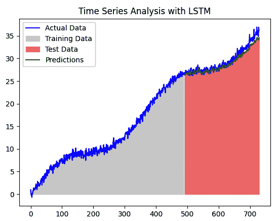

图 10.16 – 实际数据（蓝色）和测试集预测（绿色）

请记住，这是一个基本示例。LSTM 模型可以显著更复杂，你可能需要探索堆叠 LSTM、超参数调整等技术，具体取决于你的时间序列数据。

这标志着我们使用 Python 进行时间序列分析之旅的结束。让我们回顾一下本章你学到了什么！

# 摘要

在本章中，我们深入探讨了时间序列分析的迷人世界。我们首先探索了时间序列绘图，掌握了基本绘图，并理解了 ACF/PACF 图的重要性。

接下来，我们进入了时间序列统计领域，包括 ADF 测试、时间序列分解以及使用`statsmodels`和`prophet`等工具进行统计预测。

为了提升我们的预测能力，我们采用了深度学习，使用 Python 的`keras`库来应用 LSTM 网络。我们学会了开发准确的时间序列预测，并创建深入的数据驱动洞察的视觉化。

本章为我们提供了一套全面的时间序列分析技能，使我们能够揭示基于时间数据的隐藏模式和洞察，从绘图到统计分析再到深度学习预测。

在下一章中，我们将讨论不同的集成方法——即直接从 Excel 调用 R 和 Python。

# 第四部分：反过来调用——从 Excel 调用 R 和 Python

在本部分，你将解锁在 Excel 中 R 和 Python 的强大功能，通过为无缝集成设计的全面解决方案。你将发现如何利用 BERT 和`xlwings`在 Excel 和你的首选编程语言之间实现流畅的通信。你将探索开源 API 解决方案，如 Plumber 和 FastAPI，以及商业产品如 Posit Connect 和 ownR，以通过基于 API 的集成扩展 Excel 工作流程的功能。

本部分包含以下章节：

+   *第十一章*，*从 Excel 直接或通过 API 调用 R/Python*
