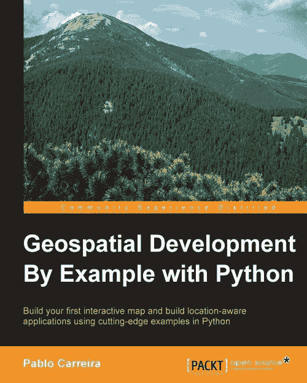

**通过示例使用 Python 进行地理空间开发**

**Python**

**目录**

通过示例使用 Python 进行地理空间开发

致谢

关于作者

关于审稿人

www.PacktPub.com

支持文件、电子书、折扣优惠等

为什么订阅？

Packt 账户持有者的免费访问

前言

本书涵盖的内容

本书所需内容

本书面向的对象

约定

读者反馈

客户支持

下载示例代码

下载本书的颜色图像

勘误表

盗版

问题

1. 准备工作环境

安装 Python

Windows

Ubuntu Linux

Python 包和包管理器

Windows 上 Python 包的存储库

安装包和所需软件

OpenCV

Windows

Ubuntu Linux

安装 NumPy

Windows

Ubuntu Linux

安装 GDAL 和 OGR

Windows

Ubuntu Linux

安装 Mapnik

Windows

Ubuntu Linux

安装 Shapely

Windows

Ubuntu Linux

直接从 pip 安装其他包

Windows

Ubuntu Linux

安装 IDE

Windows

Linux

创建书籍项目

编程和运行第一个示例

转换坐标系并计算所有国家的面积

按面积大小排序国家

摘要

2. 地理藏宝应用

构建基本应用程序结构

创建应用程序树结构

函数和方法

记录你的代码

创建应用程序入口点

下载地理藏宝数据

地理藏宝数据源

从 REST API 获取信息

从 URL 下载数据

手动下载数据

打开文件并获取其内容

为分析准备内容

将函数组合到应用程序中

设置您的当前位置

找到最近点

摘要

3. 结合多个数据源

表示地理数据

表示几何形状

使数据同质化

抽象的概念

抽象化地理藏宝点

抽象化地理藏宝数据

导入地理藏宝数据

读取 GPX 属性

返回同质化数据

将数据转换为 Geocache 对象

合并多个数据源

将新功能集成到应用程序中

摘要

4. 提高应用搜索能力

处理多边形

了解已知文本

使用 Shapely 处理几何形状

导入多边形

获取属性值

导入线条

转换空间参考系统和单位

几何关系

触摸

交叉

包含

在...内

等于或几乎等于

相交

不相交

按属性和关系过滤

按多个属性过滤

链式过滤

与应用集成

总结

5. 制作地图

了解 Mapnik

使用纯 Python 制作地图

使用样式表制作地图

创建生成地图的实用函数

在运行时更改数据源

自动预览地图

设置地图样式

地图样式

多边形样式

线条样式

文本样式

向地图添加图层

点样式

使用 Python 对象作为数据源

导出地理对象

创建 Map Maker 应用

使用 Python 数据源

使用带有过滤器的应用

总结

6. 处理遥感图像

理解图像的表示方式

使用 OpenCV 打开图像

了解数值类型

处理遥感图像和数据

图像镶嵌

调整图像的值

裁剪图像

创建阴影地形图

构建图像处理流水线

创建 RasterData 类

总结

7. 从栅格数据中提取信息

获取基本统计信息

准备数据

打印简单信息

格式化输出信息

计算四分位数、直方图和其他统计数据

将统计数据做成懒属性

创建彩色分类图像

为地图选择合适的颜色

混合图像

用颜色显示统计数据

使用直方图对图像进行着色

总结

8. 数据挖掘应用

测量执行时间

代码分析

在数据库中存储信息

创建对象关系映射

准备环境

改变我们的模型

自定义管理器

生成表格并导入数据

过滤数据

导入大量数据

优化数据库插入

优化数据解析

导入 OpenStreetMap 的兴趣点

移除测试数据

用真实数据填充数据库

搜索数据和交叉信息

使用边界过滤

总结

9. 处理大图像

处理卫星图像

获取 Landsat 8 图像

内存和图像

分块处理图像

使用 GDAL 打开图像

遍历整个图像

创建图像合成

真彩色合成

处理特定区域

假彩色合成

总结

10. 并行处理

多进程基础

块迭代

提高图像分辨率

图像重采样

全色增强

总结

索引

**通过示例进行地理空间开发**

**Python**

**通过示例进行地理空间开发**

**Python**

版权所有 © 2016 Packt Publishing

版权所有。未经出版者事先书面许可，本书的任何部分不得以任何形式或任何方式复制、存储在检索系统中或通过任何手段传输，除非在评论或评论中嵌入的简短引用。

在准备本书的过程中，我们已尽最大努力确保所提供信息的准确性。然而，本书中的信息销售不附带任何明示或暗示的保证。作者、Packt Publishing 及其经销商和分销商不对由此书直接或间接造成的任何损害承担责任。

Packt Publishing 已尽力通过适当使用大写字母提供本书中提到的所有公司和产品的商标信息。

然而，Packt Publishing 不能保证此信息的准确性。

首次出版：2016 年 1 月

生产参考：1250116

由 Packt Publishing Ltd. 出版

Livery Place

35 Livery Street

英国伯明翰 B3 2PB。

ISBN 978-1-78528-235-5

[www.packtpub.com](http://www.packtpub.com)

**鸣谢**

**作者**

Pablo Carreira

**审稿人**

Brylie Christopher Oxley

Vivek Kumar Singh

Claudio Sparpaglione

**委托编辑**

Sarah Crofton

**采购编辑**

Meeta Rajani

**内容开发编辑**

Rashmi Suvarna

**技术编辑**

Shivani Kiran Mistry

**校对编辑**

Akshata Lobo

**项目协调员**

Judie Jose

**校对**

Safis 编辑

**索引编制者**

Hemangini Bari

**图形设计**

Disha Haria

**生产协调员**

Nilesh Mohite

**封面设计**

Nilesh Mohite

**关于作者**

**Pablo Carreira** 是一位居住在巴西圣保罗州的 Python 程序员和全栈开发者。他现在是精准农业先进网络平台的负责人，并积极将 Python 作为后端解决方案用于高效的地理处理。

1980 年出生于巴西，Pablo 以农业工程师的身份毕业。作为一个自幼对编程充满热情且自学成才的人，他将编程作为爱好，后来为了解决工作任务而提升了自己的技术。

在地理处理领域拥有 8 年的专业经验，他使用 Python 以及地理信息系统来自动化流程并解决与精准农业、环境分析和土地划分相关的问题。

我想感谢我的父母，感谢他们在我一生中给予的支持。我还想感谢我的妻子，感谢她在所有写作过程中对我的帮助和耐心。

我感谢我的大学老师 José Paulo Molin，是他首先向我介绍了地理处理和精准农业，并在这一领域激发了我浓厚的兴趣，并为我提供了发展的机会。最后，我要感谢我的好朋友 Gerardo F. E. Perez，感谢他为我提供的所有机会，以及在无数个技术讨论中的陪伴。

**关于审稿人**

**布赖利·克里斯托弗·奥克利**喜欢从事改善人类和环境共同体的技术项目。他致力于为开源、开放 Web 和开放知识运动工作。

他定期为使用 Web 平台技术构建的开源项目做出贡献，包括为老龄化人口的健康状况可视化应用程序和为难民支持的社区门户。

感谢 Elvin、Lauri、Antti、Marjo 和 Lynne，你们是我生命中的璀璨明星。

**维韦克·库马尔·辛格**是印度理工学院德里分校大气科学中心的科研学者。他在印度遥感研究所，印度空间研究组织（ISRO）位于乌塔拉坎德德里的分校完成了遥感与地理信息系统技术的硕士学位。在研究生期间，他专注于使用卫星观测的地理计算模型来研究遥感与 GIS 的不同应用。他的主要研究专长在于应用卫星遥感进行空气质量监测和评估、城市热岛和遥感，以及全球的地理信息系统。他还对研究成长中的大城市的空气质量、城市地区气溶胶的空间和时间趋势、气溶胶的辐射效应、开发统计模型来估计地表颗粒物空气质量、气溶胶和云数据验证，以及从紫外卫星测量中检索云产品感兴趣。他也是 BhuNak 科学团队的一员，参与开发和验证用于气候研究的新 GIS 产品。

他目前还参与了 BhuNak 项目的技术研讨会和能力建设活动的开发和实施，在那里他教授使用卫星图像进行环境决策活动的应用，重点关注城市生活质量。

我要感谢瓦伊布哈夫·库马尔，印度理工学院孟买分校（IIT-Bombay）城市科学与工程学院的博士研究生，他为我的贡献（BhuNak 研究小组的共同创始人）。特别感谢 ML 辛格（父亲）、普拉尚特·库马尔·辛格（兄弟）和基梅拉·图马拉（朋友）在我生活中的贡献。

**克劳迪奥·斯帕帕格利奥内**是意大利初创公司 WalletSaver 的首席技术官，该公司在移动电话资费比较领域独树一帜。他的工作经验包括在线广告行业中地理空间应用和面向 Web 的系统设计和构建。

作为一位充满激情的 Python 程序员和开源倡导者，他是 PyOWM 的维护者。

项目，并积极参与社区，为 Python-Requests 和 Reactive Manifesto 等项目做出贡献。他的主要兴趣包括高可扩展的 Web 架构、API 设计以及云计算。

**www.PacktPub.com**

**支持文件、电子书、折扣优惠以及**

**更多**

有关您书籍的支持文件和下载，请访问 [www.PacktPub.com](http://www.PacktPub.com)。

您知道 Packt 为每本书都提供电子书版本，包括 PDF 和 ePub 文件吗？您可以在 [www.PacktPub.com](http://www.PacktPub.com) 升级到电子书版本，并且作为印刷版书籍的顾客，您有权获得电子书副本的折扣。有关更多详情，请联系我们 <service@packtpub.com>。

在 [www.PacktPub.com](http://www.PacktPub.com)，您还可以阅读一系列免费的技术文章，注册各种免费通讯，并享受 Packt 书籍和电子书的独家折扣和优惠。

[`www2.packtpub.com/books/subscription/packtlib`](https://www2.packtpub.com/books/subscription/packtlib)

您需要即时解决您的 IT 问题吗？PacktLib 是 Packt 的在线数字图书库。在这里，您可以搜索、访问和阅读 Packt 的整个图书库。

**为什么要订阅？**

在 Packt 出版的每本书中都可以全文搜索。

复制粘贴、打印和收藏内容。

按需访问，可通过网页浏览器访问。

**Packt 账户持有者的免费访问**

如果您在 [www.PacktPub.com](http://www.PacktPub.com) 有 Packt 账户，您可以使用它今天访问 PacktLib 并查看 9 本完全免费的书籍。只需使用您的登录凭证即可立即访问。

**前言**

从 Python 编程的良好实践到分析包的高级使用，本书教授如何编写能够执行复杂地理处理任务的应用程序，这些任务可以复制和重用。本书包含三个示例应用程序。第一章

展示了如何准备开发环境。从 第二章 到 第四章，读者深入使用类、继承和其他资源来阅读、操作、组合和搜索矢量数据中的信息。第五章 到

第七章 介绍了渲染美丽地图和处理分析栅格数据的技术。在最后三章中，本书探讨了代码优化，并提出了处理地理处理任务中常见的大数据集的解决方案。所有示例都是模块化的，可以重新排列以实现无数不同的结果。在本书中，代码逐步推导，直至达到最终形式。读者被引导编辑、更改和改进代码，尝试不同的解决方案和组织方式，微妙地学习地理处理应用程序开发的心理过程。

**本书涵盖的内容**

第一章，*准备工作环境*，展示了安装所有必需库的过程，以便通过书中的示例，以及如何设置一个集成开发环境（IDE），这将有助于组织代码并避免错误。最后，它将介绍与地理空间库的第一次接触。

第二章，*地理藏宝应用*，将介绍地理处理应用中的重要步骤，例如打开文件、读取数据以及使用手头工具准备分析。通过这些步骤，用户将学习如何组织和利用语言提供的资源来编写一致的应用程序。

第三章，*结合多个数据源*，将涵盖结合数据源的过程以及如何使用 Python 类来创建自己的地理空间数据表示。地理数据往往具有异质性，因此编写能够结合多个数据源的程序是地理处理中的基本主题。

第四章，*提高应用搜索能力*，将为应用程序添加新功能。用户将编写一个能够通过地理边界和任何数据字段过滤特征的代码。在这个过程中，他们将了解如何处理多边形以及如何在地理处理应用程序中分析几何形状之间的关系。

第五章，*制作地图*，将启动一个新应用，该应用能够从数据向量生成漂亮的地图。Mapnik，最常用的地图包之一，将被使用。用户将了解其工作原理以及如何将其适应以消费前几章中展示的数据。

第六章，*处理遥感图像*，将展示一个演绎过程，这将导致一个灵活且强大的软件结构，能够结合、裁剪和调整图像的值，以准备它们进行展示。

第七章，*从栅格数据中提取信息*，将探讨从栅格数据中提取信息的过程，这些信息可以进行分析以产生有价值的信息。它将超越简单的数值，展示如何将此信息显示在漂亮的彩色地图上。

第八章，*数据挖掘应用*，将展示如何使用数据库以及如何将其导入以最小化处理时间，并允许处理大量数据集。地理空间数据往往很庞大，其处理需要大量的计算机功率。为了使代码更高效，读者将学习代码分析优化技术。

第九章，*处理大图像*，将展示如何处理大型卫星图像。它将重点介绍如何进行可持续的图像处理，以及如何在保持内存消耗低的同时，使用高效代码打开和计算许多大图像。

第十章，*并行处理*，将教会读者如何充分利用计算机的全部可用性能。为了加快任务，它将展示如何将任务分配到

用于并行处理的处理器核心。

**本书所需内容**

要运行本书的示例，您只需要一台至少有 4 GB RAM 的计算机，并安装了 Ubuntu Linux 或 Microsoft Windows 操作系统。我们将使用的所有程序和库要么是免费的，要么是开源的。

**本书面向对象**

本书旨在为想要处理地理数据的 Python 初学者或高级开发者提供帮助。本书适合新接触地理空间开发的职业开发者、爱好者，或希望进入简单开发的科学家。

**约定**

在本书中，您将找到多种文本样式，用于区分不同类型的信息。以下是一些这些样式的示例及其含义的解释。

文本中的代码单词、数据库表名、文件夹名、文件名、文件扩展名、路径名、虚拟 URL、用户输入和 Twitter 昵称的显示方式如下：“一个 Python 包是一个包含一个或多个 Python 文件（即模块）和一个 __init__.py 文件的目录。”

代码块设置为如下：

import ogr

# 第一章：打开 shapefile 并获取第一层。

datasource = ogr.Open("../data/world_borders_simple.shp") layer = datasource.GetLayerByIndex(0)

print("特征数量: {}".format(layer.GetFeatureCount())) 当我们希望引起您对代码块中特定部分的注意时，相关的行或项目将被设置为粗体：

if __name__ == '__main__':

gdal.PushErrorHandler('CPLQuietErrorHandler')

**vector_data = PointCollection("../data/geocaching.gpx")** vector_data.print_information()

任何命令行输入或输出都写成如下形式：

**收集 django**

**下载 Django-1.9-py2.py3-none-any.whl (6.6MB)**

**100% |################################| 6.6MB 43kB/s** **安装收集的包：django**

**成功安装 django-1.9**

**新术语**和**重要词汇**将以粗体显示。屏幕上看到的单词，例如在菜单或对话框中，在文本中显示如下：“通过点击**下一步**按钮继续使用默认选项。”

**注意**

警告或重要注意事项将以如下框的形式出现。

**提示**

小技巧和窍门看起来像这样。

**读者反馈**

我们欢迎读者的反馈。请告诉我们您对本书的看法——您喜欢或不喜欢的地方。读者反馈对我们非常重要，因为它帮助我们开发出您真正能从中受益的标题。

要向我们发送一般反馈，只需发送电子邮件到<feedback@packtpub.com>，并在邮件主题中提及书籍的标题。

如果您在某个主题上具有专业知识，并且您对撰写或为书籍做出贡献感兴趣，请参阅我们的作者指南[www.packtpub.com/authors](http://www.packtpub.com/authors)。

**客户支持**

现在您是 Packt 书籍的骄傲拥有者，我们有多个方法可以帮助您从您的购买中获得最大收益。

**下载示例代码**

您可以从[`www.packtpub.com`](http://www.packtpub.com)的账户下载示例代码文件。

为您购买的所有 Packt Publishing 书籍。如果您在其他地方购买了这本书，您可以访问[`www.packtpub.com/support`](http://www.packtpub.com/support)并注册，以便将文件直接通过电子邮件发送给您。

**下载本书的颜色图像** 我们还为您提供了一个包含本书中使用的截图/图表颜色图像的 PDF 文件。这些颜色图像将帮助您更好地理解输出中的变化。您可以从

[`www.packtpub.com/sites/default/files/downloads/GeospatialDevelopmentByExamp`](https://www.packtpub.com/sites/default/files/downloads/GeospatialDevelopmentByExampleWithPython_ColorImages.pdf)leWithPython_ColorImages.pdf

**勘误**

尽管我们已经尽最大努力确保内容的准确性，但错误仍然可能发生。如果您在我们的书中发现错误——可能是文本或代码中的错误——如果您能向我们报告这一点，我们将不胜感激。通过这样做，您可以避免其他读者的挫败感，并帮助我们改进本书的后续版本。如果您发现任何勘误，请通过访问[`www.packtpub.com/submit-errata`](http://www.packtpub.com/submit-errata)，选择您的书籍，点击**勘误提交表单**链接，并输入您的勘误详情来报告它们。一旦您的勘误得到验证，您的提交将被接受，勘误将被上传到我们的网站或添加到该标题的勘误部分现有的勘误列表中。

要查看之前提交的勘误，请访问

[`www.packtpub.com/books/content/support`](https://www.packtpub.com/books/content/support)并在搜索字段中输入书籍名称。所需信息将出现在**勘误**部分下。

**盗版**

互联网上对版权材料的盗版是一个跨所有媒体的持续问题。在 Packt，我们非常重视我们版权和许可证的保护。如果您在互联网上发现任何形式的非法副本，请立即向我们提供位置地址或网站名称，以便我们可以寻求补救措施。

请通过<copyright@packtpub.com>与我们联系，并提供涉嫌盗版材料的链接。

我们感谢您在保护我们的作者以及为我们提供有价值内容的能力方面的帮助。

**问题**

如果您在本书的任何方面遇到问题，您可以联系

联系邮箱>, 我们将尽力解决问题。

**第一章\. 准备工作**

**环境**

将编程语言作为地理处理工具使用提供了构建个性化应用程序的机会，该应用程序可以更优化地执行用户所需的任务。这意味着重复性任务可以自动化，文件输入输出可以定制，并且过程可以调整以执行您想要完成的精确操作。

Python 是一种强大的编程语言，作为地理处理和科学分析的工具有着特殊的关注度。许多因素可能促成了它的普及，其中三个值得提及：它是一种脚本语言，它灵活且易于学习，并且它拥有广泛的库作为开源软件可用。

可用的库和软件包数量允许用户在编程基本功能上花费更少的时间，更多的时间用于构建流程和工作流以达到他们的目标。

在本章中，我们将介绍安装所有您将需要通过示例使用的库的过程；这些相同的库也可能满足您在现实世界应用中的大部分需求。然后，我们将设置一个 **集成** **开发环境** (**IDE**)，这将有助于组织代码并避免错误。

最后，我们将使用其中一个库编写一个示例程序。因此，以下是我们将要涉及的主题：

安装 Python 以及本书示例所需的软件包

安装 IDE 以编写和组织您的代码

为本书创建项目

编写您的第一段代码

**安装 Python**

对于本书，我们建议使用 Python 2.7；这个版本的 Python 与我们将要在示例中使用的库和包完全兼容，并且对于 Windows 用户，互联网上还有可用的预编译二进制文件。我们将尽可能保持所有示例与 Python 3.4 兼容，以便于将来的升级迁移。

Windows 用户可能会发现 64 位软件包存在兼容性问题，因此我们建议他们使用 32 位版本的 Python。

对于 Linux 用户，我们将展示 Ubuntu Linux 分发的安装程序，并使用软件包管理器，这样您就不必担心版本和需求；软件包管理器会为您处理这些。

您将要安装的库是用 Python 和其他语言编写的，最常见的是 C 和 C++。这些库可以将类、方法和函数抽象为 Python 对象，或者有一个额外的层来建立连接；当这种情况发生时，我们说该库有*Python 绑定*。

**Windows**

在 Windows 上安装 Python 的步骤如下：1. 访问[`www.python.org/downloads/windows/`](https://www.python.org/downloads/windows/)并点击下载 Windows 的最新 Python 2.7 版本。

2. 在下一页，向下滚动，您将找到一个文件列表；请确保您下载**Windows x86 MSI 安装程序**。

3. 文件下载完成后，通过点击文件并按照说明打开安装程序。通过点击**下一步**按钮继续使用默认选项。

**Ubuntu Linux**

Ubuntu 已经预装了 Python，因此无需安装。如果由于任何原因它不可用，您可以使用以下命令进行安装：sudo apt-get install python

Python 2.7.9 自带 Pip，但如果您使用的是较旧版本，则需要使用以下命令安装 Pip：

sudo apt-get install python-pip

**Python 包和包管理器**

一个 Python 包是一个包含一个或多个 Python 文件（即模块）和一个 __init__.py 文件的目录（这可以是一个空文件）。此文件告诉 Python 解释器该目录是一个包。

在编写 Python 代码时，我们可以导入包和模块并在我们的代码中使用它们。Python 社区经常这样做；许多包使用其他包，等等，形成一个复杂的依赖关系网络。

为了方便安装包及其运行所需的所有依赖项，Python 有一个名为 pip 的包管理器。

Pip 会在中央仓库（或用户定义的位置）中查找包，然后下载它，接着下载其依赖项，并安装它们。一些包还使用其他语言的库，例如 C。在这些情况下，这些库需要在安装期间编译。Ubuntu 用户不会遇到这个问题，因为系统上已经安装了许多编译器，但在 Windows 上默认情况下不会这样做。

**Windows 的 Python 包仓库** Python 通过 pip 使安装库和包变得容易。然而，由于 Windows 默认不包含任何编译器，需要编译库的包的安装会失败。为了避免安装编译器的过程，这超出了本书的范围，我们可以获取准备好使用的包。

这些包为各种类型的系统预先构建，不需要编译其库。这种类型的包被称为 wheel。

**注意**

Christoph Gohlke 通过构建这些包并将它们提供下载，为我们大家做了件好事，下载地址为 [`www.lfd.uci.edu/~gohlke/pythonlibs/.`](http://www.lfd.uci.edu/~gohlke/pythonlibs/)。

**安装包和所需软件**

在本主题中，我们将介绍书中使用的每个包的安装过程。

**OpenCV**

OpenCV 是一个针对视频和图像处理的优化 C/C++ 库，拥有从简单的图像缩放到对象识别、人脸检测等功能。OpenCV 是一个庞大的库，我们将使用其读取、转换和写入图像的功能。它是一个不错的选择，因为其开发活跃，拥有庞大的用户社区和非常好的文档。

**Windows**

这里是 Windows 的安装步骤：

1. 访问 [`www.lfd.uci.edu/~gohlke/pythonlibs/`](http://www.lfd.uci.edu/~gohlke/pythonlibs/)。

2. 按 *Ctrl* + *F* 打开浏览器搜索对话框，然后搜索 OpenCV。

3. 你将找到一个文件列表；选择 opencv_python-2.4.11-cp27-none-win32.whl 或任何包含 cp27 和 win32 的 OpenCV 版本。这意味着这是 Python 2.7 的 32 位版本。

4. 将下载的文件保存到已知位置。

5. 打开 Windows 命令提示符并运行以下命令：**c:\Python27\scripts\pip install path_to_the_file_you_downloaded.whl** 6. 你应该会看到一个输出告诉你安装成功，如下所示：**Processing c:\downloads\opencv_python-2.4.12-cp27-none-win32.whl** **Installing collected packages: opencv-python**

**Successfully installed opencv-python-2.4.12**

**提示**

你可以将文件拖放到命令提示符中，以输入其完整路径。

**Ubuntu Linux**

这里是 Ubuntu Linux 的安装过程：

1. 使用 *Ctrl* + *T* 打开一个新的终端。

2. 然后，输入以下命令：

**sudo apt-get install python-opencv**

**安装 NumPy**

NumPy 是一个用于科学计算的 Python 包。它以非常高效的方式处理多维数组操作。NumPy 是 OpenCV 运行所必需的，并将被我们在示例中执行的大多数栅格操作所使用。NumPy 也是一个高效的数据容器，并将是我们计算大量图像数据的工具。

**Windows**

重复安装 OpenCV 的相同步骤；然而，这次，搜索 NumPy 并选择一个名为 numpy-1.9.2+mkl-cp27-none-win32.whl 的文件。

**Ubuntu Linux**

NumPy 在 Ubuntu 上作为 OpenCV 的依赖项自动安装，但如果你想在没有 OpenCV 的情况下安装它，请按照以下步骤操作：

1. 使用 *Ctrl* + *T* 打开一个新的终端。

2. 然后，输入以下命令：

**sudo pip install numpy**

**安装 GDAL 和 OGR**

**GDAL**（**地理空间数据抽象库**）由两个结合在一起的包组成：OGR 处理地理空间矢量文件格式，包括坐标系转换和矢量操作。GDAL 是库的栅格部分，在 1.11 版本中，它包含了 139 个驱动程序，可以读取，其中一些甚至可以创建栅格。

GDAL 还包含用于栅格转换和计算的函数，例如调整大小、裁剪、重新投影等。

在以下表中，列出了 GDAL 和 OGR 驱动程序列表的摘录，这些驱动程序支持您可能找到的最常见的格式：

**长格式名称**

**代码**

**创建**

Arc/Info ASCII Grid

AAIGrid

是

Arc/Info 导出 E00 GRID

E00GRID

否

ENVI .hdr 标签化栅格

ENVI

是

通用二进制 (.hdr 标签化)

GENBIN

否

Oracle Spatial GeoRaster

GEORASTER

是

GSat 文件格式

GFF

否

图像交换格式 (.gif)

GIF

是

GMT 兼容的 netCDF

GMT

是

GRASS ASCII Grid

GRASSASCIIGrid 否

Golden Software ASCII Grid

GSAG

是

Golden Software 二进制网格

GSBG

是

Golden Software Surfer 7 二进制网格

GS7BG

是

TIFF / BigTIFF / GeoTIFF (.tif)

GTiff

是

GXF (网格交换文件)

GXF

否

Erdas Imagine (.img)

HFA

是

JPEG JFIF (.jpg)

JPEG

是

NOAA 极地轨道器 1b 数据集(AVHRR) L1B

否

NOAA NGS 地球椭球高度网格

NGSGEOID

否

NITF

NITF

是

NTv2 基准网格偏移

NTv2

是

PCI .aux 标签化

PAux

是

PCI Geomatics 数据库文件

PCIDSK

是

PCRaster

PCRaster

是

地理空间 PDF

PDF

是

NASA 行星数据系统

PDS

否

可移植网络图形 (.png)

PNG

是

R 对象数据存储

R

是

栅格矩阵格式 (*.rsw, .mtw)

RMF

是

RadarSat2 XML (product.xml)

RS2

否

Idrisi 栅格

RST

是

SAGA GIS 二进制格式

SAGA

是

USGS SDTS DEM (*CATD.DDF)

SDTS

否

SGI 图像格式

SGI

是

SRTM HGT 格式

SRTMHGT

是

Terragen 高程场 (.ter)

TERRAGEN

是

USGS ASCII DEM / CDED (.dem)

USGSDEM

是

ASCII 格网 XYZ

XYZ

是

以下表格描述了 OGR 驱动程序：

**格式名称**

**代码**

**创建**

Arc/Info 二进制覆盖

AVCBin

否

Arc/Info .E00 (ASCII) 覆盖 AVCE00

否

AutoCAD DXF

DXF

是

逗号分隔值 (.csv) CSV

是

ESRI Shapefile

ESRI Shapefile 是

GeoJSON

GeoJSON

是

Géoconcept 导出

Geoconcept

是

GeoRSS

GeoRSS

是

GML

GML

是

GMT

GMT

是

GPSBabel

GPSBabel

是

GPX

GPX

是

GPSTrackMaker (.gtm, .gtz)

GPSTrackMaker

是

水文传输格式

HTF

否

Idrisi 向量 (.VCT)

Idrisi

否

KML

KML

是

Mapinfo 文件

MapInfo 文件

是

Microstation DGN

DGN

是

OpenAir

OpenAir

否

ESRI FileGDB

OpenFileGDB

否

PCI Geomatics 数据库文件

PCIDSK

是

地理空间 PDF

PDF

是

PDS

PDS

否

PostgreSQL SQL 转储

PGDump

是

美国人口普查 TIGER/Line

TIGER

否

**注意**

您可以在[`gdal.org/python/`](http://gdal.org/python/)找到完整的 GDAL 和 OGR API 文档和驱动程序完整列表。

**Windows**

再次，我们将使用轮子进行安装。重复之前的相同步骤：1. 访问[`www.lfd.uci.edu/~gohlke/pythonlibs/`](http://www.lfd.uci.edu/~gohlke/pythonlibs/)。

2. 现在，搜索 GDAL 并下载名为

GDAL-1.11.3-cp27-none-win32.whl。

3. 最后，使用 pip 安装它，就像我们之前做的那样。

**Ubuntu Linux**

执行以下步骤：

1. 前往终端或打开一个新的终端。

2. 然后，输入以下命令：

**sudo apt-get install python-gdal**

**安装 Mapnik**

Mapnik 是一个地图渲染包。它是一个用于开发地图应用的免费工具包。它生成高质量的地图，并被用于许多应用中，包括 OpenStreetMaps。

**Windows**

Mapnik 与其他库不同，不可直接安装。相反，你需要前往

[`mapnik.org/`](http://mapnik.org/)并按照下载链接：1. 下载 Mapnik 2.2 的 Windows 32 位包。

2. 将 mapnik-v2.2.0 解压到 C:\文件夹。

3. 然后，将解压的文件夹重命名为 c:\mapnik。

4. 现在，将 Mapnik 添加到你的**PATH**。

5. 打开**控制面板**并转到**系统**。

6. 点击左侧列中的**高级系统设置**链接。

7. 在**系统属性**窗口中，点击**高级**选项卡。

8. 接下来，点击**环境变量**按钮。

9. 在**系统变量**部分，选中**PATH**变量并点击**编辑**。将以下路径添加到列表末尾，每个路径之间用分号分隔，如下所示：**c:\mapnik\bin;c:\mapnik\lib**

10. 现在，点击**新建**按钮；然后，将变量名设置为 PYTHONPATH，值设置为 c:\mapnik\python\2.7\site-packages。

**Ubuntu Linux**

对于此操作，请执行以下步骤：

1. 前往终端或打开一个新的终端。

2. 然后，输入以下命令：

**sudo apt-get install mapnik**

**安装 Shapely**

Shapely 是一个用于二维几何操作和分析的包。它可以执行诸如几何的并集和减法等操作。它还可以执行测试和比较，例如当几何体与其他几何体相交时。

**Windows**

这里你需要做的是：

1. 如前所述，下载预构建的 wheel 文件；这次，寻找一个名为 Shapely-1.5.13-cp27-none-win32.whl 的文件。

2. 然后，使用 pip 安装它。

**Ubuntu Linux**

这里你需要执行的步骤是：

1. 前往终端或使用*Ctrl* + *T*打开一个新的终端。

2. 输入以下命令：

**sudo pip install shapely**

**直接从以下位置安装其他包**

**pip**

一些包不需要编译步骤。对于 Windows 用户来说，这些包更容易安装，因为它们可以直接通过 pip 使用单个命令获取和安装。

**Windows**

你只需要在命令提示符中输入以下命令：**c:\Python27\scripts\pip install django tabulate requests xmltodict psycopg2**

**Ubuntu Linux**

在终端中，输入以下命令：

**sudo pip install django tabulate requests xmltodict psycopg2**

对于每个包，你应该能看到安装的进度，类似于以下内容：**收集 django**

**下载 Django-1.9-py2.py3-none-any.whl (6.6MB)**

**100% |################################| 6.6MB 43kB/s** **安装收集的包：django**

**成功安装 django-1.9**

**安装 IDE**

IDE 是带有工具和编程语言检查的时尚文本编辑器。

你当然可以使用你偏好的任何文本编辑器或 IDE；本书中的所有任务都不依赖于 IDE，但 IDE 将极大地简化我们的工作，因为建议的配置可以帮助你避免错误并节省在输入、运行和调试代码上的时间。IDE 会为你检查代码并检测潜在的错误；它甚至可以猜测你正在输入的内容并为你完成语句，通过简单的命令运行代码，如果出现异常，它还会提供指向异常发生位置的链接。对于 Windows 或 Linux，请访问[`www.jetbrains.com/pycharm/`](http://www.jetbrains.com/pycharm/)

点击大橙色的按钮**立即获取 Pycharm**。在下一页，选择免费社区版。

**Windows**

这里是你需要执行的步骤：

1. 下载完成后，打开下载的文件；**安装向导**将会弹出。

2. 点击**下一步**，在安装选项中，勾选两个复选框：**创建** **桌面快捷方式**和**创建关联**。

3. 点击**下一步**继续安装。

**Linux**

执行以下步骤：

1. 在一个目录中解压下载的文件。

2. 要打开 PyCharm，从 bin 子目录运行 pycharm.sh。如果你愿意，可以为其创建快捷方式。

**提示**

**下载示例代码**

你可以从你购买的所有 Packt 书籍的账户中下载示例代码文件。[`www.packtpub.com`](http://www.packtpub.com)。如果你在其他地方购买了这本书，你可以访问[`www.packtpub.com/support`](http://www.packtpub.com/support)并注册以直接将文件通过电子邮件发送给你。

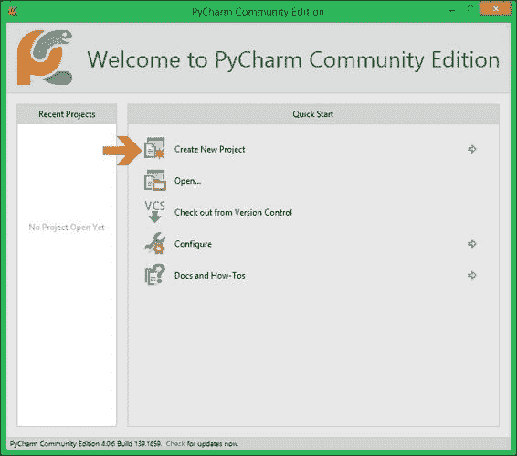

**创建书籍项目**

执行以下步骤：

1. 安装完成后，打开 Pycharm，你将被提示创建你的第一个项目：

2. 点击创建新项目，然后选择 c:\geopy 作为你的项目位置。在 Linux 中，你可以将项目放在你的家目录中——例如，

/home/myname/geopy. 点击**创建**以创建项目。

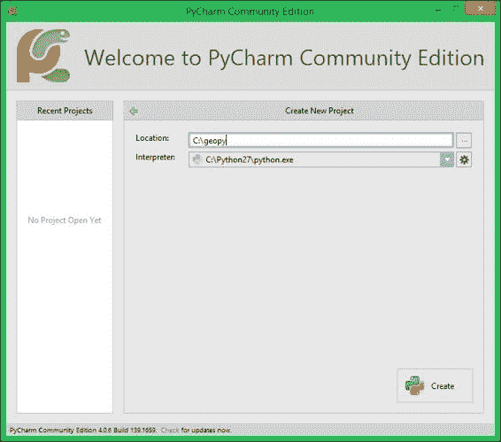

3. 在 Windows 中，你会收到一个安全警报；这是 Pycharm 试图访问互联网。建议你允许它，这样你以后可以检查更新或下载插件：

4. 最后，你应该在你的项目工作区看到以下窗口。花点时间探索菜单和按钮，尝试在你的项目文件夹上右键点击以查看选项：

**编写和运行你的第一个**

**示例**

现在我们已经安装了所有需要的软件，我们将通过第一个示例进行测试。在这个示例中，我们将测试安装，然后看看 OGR 功能的一瞥。

为了做到这一点，我们将打开一个包含世界上所有国家边界的矢量文件，并创建一个国家名称列表。这个简单示例的目的是展示 OGR 对象和函数背后的逻辑，并了解地理空间文件是如何表示的。以下是方法：

1. 首先，你需要将书中提供的样本数据复制到你的项目文件夹中。

你可以通过将数据文件夹拖放到 geopy 文件夹中来实现这一点。确保数据文件夹命名为 data，并且它位于 geopy 文件夹内。

2. 现在，在 PyCharm 中为此章节代码创建一个新的目录。在打开 geopy 项目的情况下，右键单击项目文件夹并选择 **新建** | **目录**。将其命名为 Chapter1\。

3. 创建一个新的 Python 文件。为此，右键单击 Chapter1 文件夹并选择 **新建** | **Python 文件**。将其命名为 world_borders.py，PyCharm 将自动打开文件进行编辑。

4. 在此文件中输入以下代码：

import ogr

# 打开 shapefile 并获取第一层。

datasource = ogr.Open("../data/world_borders_simple.shp") layer = datasource.GetLayerByIndex(0)

print("特征数量: {}".format(layer.GetFeatureCount())) 5. 现在，运行代码；在菜单栏中，导航到 **运行** | **运行**，并在对话框中选择 world_borders。屏幕底部将打开一个输出控制台，如果一切顺利，你应该看到以下输出：

**C:\Python27\python.exe C:/geopy/world_borders.py**

**特征数量：246**

**进程已正常结束，退出代码为 0**

恭喜！你成功打开了 Shapefile 并计算了其中的特征数量。现在，让我们了解这段代码的作用。

第一行导入 ogr 包。从这一点开始，所有函数都可以作为 ogr.FunctionName() 使用。请注意，ogr 不遵循 Python 的函数命名约定。

注释之后的行打开 OGR 数据源（这打开了包含数据的 shapefile）并将对象分配给数据源变量。请注意，路径，即使在 Windows 上，也使用正斜杠 (/) 而不是反斜杠。

下一行通过索引（0）获取数据源的第一层。某些数据源可以有多个层，但 Shapefile 的情况并非如此。所以，当处理 Shapefile 时，我们始终知道感兴趣的层是层 0。

有许多层，但 Shapefile 的情况并非如此，它只有一个层。因此，当处理 Shapefile 时，我们始终知道感兴趣的层是层 0\。

在最后一行，print 语句打印出 layer.GetFeatureCount() 返回的特征数量。在这里，我们将使用 Python 的字符串格式化，其中大括号将被传递给 format() 的参数所替换。

现在，执行以下步骤：

1. 在同一文件中，让我们输入我们程序的下一部分：

# 检查层中可用的字段。

feature_definition = layer.GetLayerDefn()

for field_index in range(feature_definition.GetFieldCount()): field_definition = feature_definition.GetFieldDefn(field_index) print("\t{}\t{}\t{}".format(field_index,

field_definition.GetTypeName(),

field_definition.GetName()))

2. 重新运行代码；你可以使用 *Shift* + *F10* 快捷键。现在，你应该看到要素数量与之前相同，并且显示 shapefile 中所有字段信息的漂亮表格，如下所示：

**要素数量：246**

**0 字符串 FIPS**

**1 字符串 ISO2**

**2 字符串 ISO3**

**3 整数 UN**

**4 字符串 NAME**

**5 整数 POP2005**

**6 整数 REGION**

**7 整数 SUBREGION**

**进程结束，退出代码 0**

这段代码中发生的事情是 feature_definition =

layer.GetLayerDefn() 获取包含要素定义的对象。

此对象包含每个字段的定义和几何类型。

在 for 循环中，我们将获取每个字段定义并打印其索引、名称和类型。

注意，layer.GetLayerDefn() 返回的对象不可迭代，我们不能直接使用它。因此，首先，我们将获取字段数量，并在 range() 函数中使用它，以便我们可以遍历字段的索引：3. 现在，输入最后一部分，如下所示：

# 打印国家名称列表。

layer.ResetReading()

for feature in layer:

print(feature.GetFieldAsString(4))

4. 再次运行代码并检查输出结果中的数量：**要素数量：246**

**0 字符串 FIPS**

**1 字符串 ISO2**

**2 字符串 ISO3**

**3 整数 UN**

**4 字符串 NAME**

**5 整数 POP2005**

**6 整数 REGION**

**7 整数 SUBREGION**

**安提瓜和巴布达**

**阿尔及利亚**

**阿塞拜疆**

**阿尔巴尼亚**

**亚美尼亚**

**安哥拉**

**...**

**圣巴泰勒米**

**根西岛**

**泽西岛**

**南乔治亚和南桑威奇群岛**

**台湾**

**进程结束，退出代码 0**

图层是可迭代的，但首先，我们需要确保我们位于图层列表的起始位置，使用 layer.ResetReading()（这是 OGR 的“陷阱”之一）。

The feature.GetFieldAsString(4) 方法返回字段 4 的值，作为一个 Python 字符串。有两种方式可以知道国家名称是否在字段 4 中：查看数据的 DBF 文件（通过使用 LibreOffice 或 Excel 打开）查看我们在代码第一部分打印的表格。你的完整代码应类似于以下内容：

import ogr

# 打开 shapefile 并获取第一个图层。

datasource = ogr.Open("../data/world_borders_simple.shp") layer = datasource.GetLayerByIndex(0)

print("Number of features: {}".format(layer.GetFeatureCount()))

# 检查图层中可用的字段。

feature_definition = layer.GetLayerDefn()

for field_index in range(feature_definition.GetFieldCount()): field_definition = feature_definition.GetFieldDefn(field_index) print("\t{}\t{}\t{}".format(field_index,

field_definition.GetTypeName(),

field_definition.GetName()))

# 打印国家名称列表。

layer.ResetReading()

for feature in layer:

print(feature.GetFieldAsString(4))

**转换坐标系和**

**计算所有国家的面积**

现在，目标是了解每个国家占用的面积。然而，国家边界的坐标是以纬度和经度表示的，我们无法在这个坐标系中计算面积。我们希望面积在公制系统中，因此首先需要将几何形状的空间参考系统进行转换。

让我们在编程技术方面更进一步，开始使用函数来避免代码重复。执行以下步骤：

1. 在 Chapter1 目录中创建一个新文件，将此文件命名为 world_areas.py，并编写这个第一个函数：

import ogr

def open_shapefile(file_path):

"""打开 shapefile，获取第一层并返回 ogr 数据源。

在单词之间。一个命名的好提示是遵循动词 _ 名词规则。

datasource = ogr.Open(file_path)

layer = datasource.GetLayerByIndex(0)

print("正在打开 {}".format(file_path))

print("要素数量：{}".format(

layer.GetFeatureCount()))

return datasource

2. 运行代码，在菜单中选择**运行** | **运行…**，然后选择 world_areas。如果一切正常，不应该发生任何事。这是因为我们没有调用我们的函数。

在函数外部添加此行代码：

你已经熟悉了这段代码的工作方式，但这里有几个新特性值得解释。def 语句使用 def function_name(arguments)：语法定义了一个函数。

**要素数量：246**

**进程已正常结束**

datasource = open_shapefile("../data/world_borders_simple.shp") 3. 现在，再次使用 *Shift* + *F10* 运行代码，并检查输出，如下所示：**正在打开 ../data/world_borders_simple.shp**

"""

记得我告诉过你 OGR 不遵循 Python 的命名约定吗？好吧，约定是函数名应该全部小写，单词之间用下划线分隔。一个命名的好提示是遵循动词 _ 名词规则。

[`www.python.org/dev/peps/pep-0008/`](https://www.python.org/dev/peps/pep-0008/)

非常好！你刚刚创建了一段非常有用且可重用的代码。现在，你有一个可以打开任何 shapefile、打印要素数量并返回 ogr 数据源的函数。从现在起，你可以在任何项目中重用这个函数。

这些约定在名为**PEP-8**的文档中描述，其中**PEP**代表**Python 增强计划**。您可以在以下位置找到此文档：

**提示**

在函数定义之后，您可以看到三引号之间的描述；这是一个文档字符串，用于记录代码。它是可选的，但了解函数的功能非常有用。

现在，让我们回到我们的代码。需要指出的是第二个重要的事情是返回语句。这使得函数返回语句之后列出的变量的值——在这种情况下，是数据源。

非常好！你刚刚创建了一段非常有用且可重用的代码。现在，你有一个可以打开任何 shapefile、打印要素数量并返回 ogr 数据源的函数。从现在起，你可以在任何项目中重用这个函数。

OGR 对象的所有部分都必须通过程序流畅地连接在一起，这非常重要。

在这种情况下，如果我们只返回图层，例如，我们将在程序稍后运行时得到一个运行时错误。这是因为 OGR 内部，图层有一个数据源的引用，当你退出 Python 函数时，所有未退出函数的对象都会被丢弃，这会破坏引用。

现在，下一步是创建一个执行转换的函数。在 OGR 中，转换是在要素的几何上进行，因此我们需要遍历要素，获取几何，并转换其坐标。我们将按照以下步骤进行：1. 将以下函数添加到您的 world_areas.py 文件中，在 open_shapefile 函数之后：

def transform_geometries(datasource, src_epsg, dst_epsg):

"""将第一层中所有几何的坐标进行转换。

"""

# 第一部分

src_srs = osr.SpatialReference()

src_srs.ImportFromEPSG(src_epsg)

dst_srs = osr.SpatialReference()

dst_srs.ImportFromEPSG(dst_epsg)

transformation = osr.CoordinateTransformation(src_srs, dst_srs) layer = datasource.GetLayerByIndex(0)

# 第二部分

geoms = []

layer.ResetReading()

for feature in layer:

geom = feature.GetGeometryRef().Clone()

geom.Transform(transformation)

geoms.append(geom)

return geoms

函数接受三个参数： ogr 图层，文件坐标系统的 EPSG 代码，以及转换输出的 EPSG 代码。

在这里，它创建了一个 osr.CoordinateTransformation 对象；此对象包含执行转换的指令。

可能到现在为止，Pycharm 应该会抱怨 osr 是一个未解析的引用；osr 是 GDAL 处理坐标系统的一部分。

2. 现在，通过在代码顶部添加此行来导入模块：**import osr**

在这里，代码遍历所有要素，获取几何引用，并执行转换。由于我们不希望更改原始数据，几何被克隆，转换在克隆上进行。

Python 列表是有序的；这意味着元素是按照它们添加到列表中的顺序排列的，并且这个顺序始终保持不变。这允许我们创建一个几何列表，其顺序与数据源中要素的顺序相同。这意味着列表中的几何和要素具有相同的索引，并且可以通过索引在未来关联。

3. 现在，让我们测试代码；在文件末尾添加以下行（第一行是您之前添加的）：

datasource = open_shapefile("../data/world_borders_simple.shp") layer = datasource.GetLayerByIndex(0)

feature = layer.GetFeature(0)

print("转换前：")

print(feature.GetGeometryRef())

transformed_geoms = transform_geometries(datasource, 4326, 3395) print("转换后：")

print(transformed_geoms[0])

4. 最后，在运行代码之前，在程序开头添加一个额外的导入。它应该是您代码的第一个语句，如下所示：from __future__ import print_function

这个导入允许我们使用 Python 3 的 print() 函数并具有期望的行为，从而保持兼容性。

5. 完整的代码应该看起来像这样：

from __future__ import print_function

import ogr

import osr

def open_shapefile(file_path):

...

def transform_geometries(datasource, src_epsg, dst_epsg):

...

datasource = open_shapefile("../data/world_borders_simple.shp") layer = datasource.GetLayerByIndex(0)

feature = layer.GetFeature(0)

print("变换前：")

print(feature.GetGeometryRef())

transformed_geoms = transform_geometries(datasource, 4326, 3395) print("After transformation:")

print(transformed_geoms[0])

6. 通过按 *Shift* + *F10* 重新运行你的程序。在输出中，注意变换前后的坐标差异：

**打开 ../data/world_borders_simple.shp**

**特征数量：246**

**变换前：**

**MULTIPOLYGON (((-61.686668 17.024441000000138… )))**

**变换后：**

**MULTIPOLYGON (((-6866928.4704937246… )))**

**Process finished with exit code 0**

7. 现在，添加另一个函数。这个函数将计算具有米坐标的几何形状的面积（因为我们将使用具有米坐标的几何形状），将值（或不是）转换为平方公里或英里，并将值存储在另一个列表中，顺序与之前相同。执行以下代码：

def calculate_areas(geometries, unity='km2'):

"""计算 ogr 几何形状列表的面积。”

# 第一部分

conversion_factor = {

'sqmi': 2589988.11,

'km2': 1000000,

'm': 1}

# 第二部分

if unity not in conversion_factor:

raise ValueError(

"这个单位未定义：{}".format(unity))

# 第三部分

areas = []

for geom in geometries:

area = geom.Area()

areas.append(area / conversion_factor[unity])

return areas

首先，请注意，在函数定义中，我们使用 unity='km2'；这是一个关键字参数，当你调用函数时，这个参数是可选的。

在第一部分，使用字典定义了一些面积单位的转换系数。

随意添加更多单位，如果需要的话。顺便说一句，Python 不关心你使用单引号还是双引号。

在第二部分，进行验证以检查传递的单位是否存在并且是否在 conversion_factor 中定义。另一种方法是稍后捕获异常；然而，现在我们选择可读性。

在第三部分，代码迭代 ogr 几何形状，计算面积，转换值，并将其放在列表中。

8. 现在，为了测试代码，编辑你的第一行，包括将导入语句移到未来。

这将确保所有除法都返回浮点数而不是整数。

它应该看起来像这样：

from __future__ import print_function, division

9. 然后，更新您的代码的测试部分，如下所示：datasource = open_shapefile("../data/world_borders_simple.shp") transformed_geoms = transform_geometries(datasource, 4326, 3395) calculated_areas = calculate_areas(transformed_geoms, unity='sqmi') print(calculated_areas)

10. 运行它，更改单位，然后再次运行，注意结果如何变化。

很好，单位转换是地理处理中的另一个非常重要的程序，您已经在 calculate_areas 函数中实现了它。

然而，以数字列表作为输出对我们来说并不很有用。因此，现在是时候将我们迄今为止所做的一切结合起来，以便提取有价值的信息。

**按面积大小排序国家**

你已经编写了三个函数；现在，让我们通过将生成国家名称列表的代码转换为函数并将其添加到 world_areas.py 中，来添加另一个函数到我们的列表中，如下所示：

def get_country_names(datasource):

"""返回一个国家名称列表。"""

layer = datasource.GetLayerByIndex(0)

country_names = []

layer.ResetReading()

for feature in layer:

country_names.append(feature.GetFieldAsString(4))

return country_names

现在，我们有四个函数，它们是：

open_shapefile

transform_geometries

calculate_areas

get_country_names

所有这些函数都返回可迭代对象，每个项目在所有这些对象中共享相同的索引，这使得信息组合变得容易。

因此，让我们利用这个特性按面积大小对国家进行排序，并返回五个最大国家和它们的面积列表。为此，添加另一个函数，如下所示：def get_biggest_countries(countries, areas, elements=5):

"""返回一个按面积大小排序的国家列表。"""

countries_list = [list(country)

for country in zip(areas, countries)]

sorted_countries = sorted(countries_list,

key=itemgetter(0), reverse=True)

return sorted_countries[:5]

在第一行，两个列表被合并在一起，生成一个国家-面积对的列表。

然后，我们使用了 Python 列表的 sorted 方法，但因为我们不希望列表按两个值排序，我们将定义排序的键。最后，列表被切片，只返回所需数量的值。

1. 为了运行此代码，您需要导入 itemgetter 函数并将其放在代码的开头，但在 from __future__ 导入之后，如下所示：from operator import itemgetter

2. 现在，编辑您的代码的测试部分，使其看起来类似于以下内容：datasource = open_shapefile("../data/world_borders_simple.shp") transformed_geoms = transform_geometries(datasource, 4326, 3395) country_names = get_country_names(datasource)

country_areas = calculate_areas(transformed_geoms)

biggest_countries = get_biggest_countries(country_names,

country_areas) for item in biggest_countries:

print("{}\t{}".format(item[0], item[1]))

3. 现在，运行代码并查看结果，如下所示：打开../data/world_borders_simple.shp

特征数量：246

82820725.1423 俄罗斯

51163710.3726 加拿大

35224817.514 格陵兰

21674429.8403 美国

14851905.8596 中国

进程以退出代码 0 完成

**总结**

在本章中，我们简要介绍了我们将在这本书中使用到的库和包。通过安装这些库，您也学习了如何搜索和安装 Python 包的一般步骤。您可以在需要其他库的情况下使用此过程。

然后，我们编写了利用 OGR 库打开 shapefile 并执行面积计算和排序的代码。这些简单的程序展示了 OGR 的内部组织结构，它如何处理地理数据，以及如何从中提取信息。在下一章中，我们将使用在这里学到的某些技术来读取数据和处理矢量点。

**第二章：地理藏宝应用程序**

在本章中，我们将构建一个地理藏宝应用程序，它最初将从互联网获取地理藏宝点，并返回用户位置最近的点的坐标和信息。

我们将介绍每个地理处理应用程序中的一些最重要的步骤：我们将讨论打开文件、读取信息、准备数据分析，以及使用数据中的每个对象进行计算。为了实现这一点，您将学习如何使用 Python 组织代码并使用语言提供的资源编写一致的应用程序。

在本章中，我们将开始使用类、方法、函数、装饰器和异常处理，这些将帮助我们构建具有可重用组件和整洁代码的应用程序。如果您对这些术语不熟悉，它们将在示例中解释。简而言之，以下是我们将涵盖的内容：

编程基本应用程序结构

下载地理藏宝数据

打开地理藏宝文件并获取其内容

将函数组合成应用程序

设置您的当前位置

处理异常

寻找最近的点

**构建基本应用程序结构** 定义我们应用程序的良好基本结构有两个主要原因：它使我们的代码保持组织

它允许我们在后续应用程序中重用代码片段

Python 在代码组织方面是一种灵活的语言，尽管用户被允许在一个文件中编写整个应用程序，但最好是将功能分离成模块和包。

模块是包含可以导入到另一个文件中的类和函数的 Python 文件。包是包含模块的特殊目录（文件夹）。这导致代码组织良好、结构合理，更不容易出现错误，并且更容易维护。

建议的结构是每个章节都有一个文件夹。在其内部，我们可以为每个应用程序创建包或文件；我们将创建一个用于可以导入和重用的通用实用代码的包，以及一个用于进行实验的目录。

**创建应用程序树结构** 这里是你需要执行的步骤：

如果你已经完成了第一章，*准备工作环境*，你现在应该有一个名为 geopy 的 PyCharm 项目，在 Windows 中位于 C:\geopy，在 Linux 中位于 ~/geopy。启动 PyCharm 并打开你的项目。

在项目根目录（名为 geopy 的最顶层文件夹），右键单击，选择 **新建** |

**目录**，并将其命名为 Chapter2\.

右键单击 Chapter2，选择 **新建** | **目录**，并将其命名为 experiments。

再次，在 Chapter2 目录内右键单击；这次，选择 **新建** | **Python 包**，并将其命名为 utils。

现在，你应该有一个类似以下的树状结构：

\geopy

+---Chapter1

| world_areas.py

| world_borders.py

|

+---Chapter2

| |

| \---experiments

| \---utils

|

|

+---data

**注意**

**Python 包**

包是包含其他包和模块的特殊文件夹。它们是包含特殊文件 __init__.py 的目录。此文件可能为空，并用于表示该包可以用 import 语句导入。

例如，如果我们有一个名为 foo 的目录（包含 __init__.py 文件）并且我们在其中创建了一个 bar.py 文件，我们可以在代码中稍后使用 import foo.bar 或 from foo import bar。

**函数和方法**

函数和方法（类内部的函数）应该简洁，这样当你调用它们时，你可以相信你会得到期望的结果或适当的异常。程序员不希望在每次使用函数时都检查函数的内容；他们希望调用它并得到预期的结果，这被称为**信仰跳跃**。例如，在这本书中，我们使用了多个外部包；当我们使用包的给定函数时，我们信任这个函数会做它应该做的事情或引发错误告诉我们出了什么问题。除此之外的一切都称为**意外行为**，这是应用程序可能具有的最危险的错误类型，因为它在代码中静默传递，但后来有后果。

**提示**

到目前为止，我们看到了一个可能具有这种意外行为的模块：GDAL/OGR。

即使文件不存在，ogr.Open() 函数也会静默传递，除非我们明确告诉 OGR 我们希望它为我们引发异常。

**记录你的代码**

随着应用程序规模的扩大，跟踪每段代码的功能非常重要。这可以防止程序员重复代码，并在以后节省大量时间来查找发生了什么。此外，它还允许其他人使用和改进你的代码。有两种关键的工具可以用来记录代码，我们已经在第一章中简要介绍过：

**代码注释**：这些是用#符号插入代码中的注释。

从此符号到下一行的所有内容都是注释，并且在程序运行时将被忽略。Python 语法直观，良好的代码需要少量注释。以下有两个简洁注释代码的技巧：在每个逻辑代码块之前放置注释，说明它在做什么；注释难以阅读或理解的代码片段

**文档字符串**：文档字符串是放置在文档类、函数和方法特殊位置的文本。它们有特殊的意义，因为它们可以被某些程序解释并用于向用户提供帮助和自动生成文档。文档字符串还可以用来测试你的代码，但这本书不会涉及这一点。在 PyCharm 中，文档字符串有特殊的作用，并提供自动代码检查的提示。在文档字符串中，你可以指定参数和返回类型（例如，字符串、列表和字典）。PyCharm 使用这些信息来提供自动完成建议并警告你可能的错误。

**提示**

在这本书中，我们将使用 reStructuredText 类型的标记来编写文档字符串；你可以在[`docutils.sourceforge.net/rst.html`](http://docutils.sourceforge.net/rst.html)找到更多信息。

在以下示例中，你可以注意到一个使用文档字符串进行文档化的类和方法（你不需要输入此代码）：

class MyClass:

"""这是一个类的文档字符串示例。”

def __init__(self):

"""你还可以在 __init__ 方法中放置文档字符串。”

pass

def sum_values(self, arg1, arg2):

"""这是方法的文档字符串，你可以描述参数并指定其类型。

如果你这样做，PyCharm 将使用这些信息

用于自动完成和检查代码。

:参数 float arg1: 第一个参数。

:参数 float arg2: 第二个参数。

:返回 float: 参数的总和。

"""

return arg1 + arg2

**创建应用程序入口点**

应用程序的入口点是当你运行程序时首先执行的部分。在 Python 中，它是第一行代码。我们可以编写一个自上而下运行的程序，将函数和类声明与其他语句混合，但这会使代码更难开发和调试，尤其是在代码变得复杂时。如果我们明确地显示程序开始的地方，并且从这个点开始，程序的不同部分将根据需要被调用，那会更好。

让我们做一个实验来理解一些关于代码执行和模块导入的要点：

1\. 在你的 Chapter2/experiments 文件夹内，创建两个新的文件，命名为 import_test.py 和 module_test.py。为此，在 experiments 文件夹内右键单击并选择**新建** | **Python 文件**。

2\. 双击 module_test.py 以打开它进行编辑。

3\. 现在，输入以下代码：

# coding=utf-8

print "我是 module_test.py，我的名字是: " + __name__

def function1():

print "Hi, I'm inside function1."

print "调用 function1…"

function1()

每个模块都包含一个 __name__ 属性，我们将在测试代码的第一行打印其值。

接下来，我们将声明一个函数，当调用时，将"Hi, I'm inside function1."打印到输出。

最后，我们将打印出函数将被调用，然后我们将调用 function1\.

4\. 运行代码，按*Alt* + *Shift* + *F10*并从列表中选择 module_test。查看输出：

我是 module_test.py，我的名字是: __main__

调用 function1…

Hi, I'm inside function1\.

进程以退出代码 0 结束

**注意**

注意这里，__name__ 属性等于 __main__；这是 Python 中的一个特殊条件。运行的模块（文件）总是被调用为 __main__。

5\. 要了解更多关于这个机制的信息，在 experiments 文件夹内创建一个新的 Python 文件，命名为 import_test.py，并打开它进行编辑。现在，输入以下代码：

# coding=utf-8

print "我是 import_test.py，我的名字是: " + __name__

print "导入 module_test"

import module_test

print "从 import_test 中调用 function1"

module_test.function1()

6\. 现在，运行 import_test.py（按*Alt* + *Shift* + *F10*并从列表中选择它）并查看以下输出：

我是 import_test.py，我的名字是: __main__

导入 module_test

我是 module_test.py，我的名字是: module_test

调用 function1…

Hi, I'm inside function1\.

从 import_test 中调用 function1

Hi, I'm inside function1\.

进程以退出代码 0 结束

这次是 import_test 被调用为 __main__，因为它是被执行的文件。接下来，当我们导入 module_test 时，其中的代码将被执行。注意，module_test 不再被调用为 __main__；它被调用为 module_test。

这个特殊的 __name__ 属性的行为允许我们在 Python 中实现一种技术，这反过来又允许我们在文件直接运行时执行一些代码，并避免在导入此文件时执行此代码。让我们看看它是如何工作的：7\. 编辑 module_test.py 并更改其代码，如下所示：

# coding=utf-8

print "我是 module_test.py，我的名字是: " + __name__

def function1():

print "Hi, I'm inside function1."

if __name__ == '__main__':

print "调用 function1 - 只有如果我是 __main__…"

function1()

所以，如果 __name__ 等于'__main__'，则这个块内的代码将被执行，

我们知道，只有当文件直接执行时，__name__ 才等于 __main__。

因此，这个块内的代码只有在文件被运行时才会执行，而不是在导入时执行。

8\. 接下来，再次运行 import_test.py（要重新运行最后一个文件，请按*Shift* + *F10*），看看会发生什么：

我是 import_test.py，我的名字是：__main__

导入 module_test

我是 module_test.py，我的名字是：module_test

在 import_test 中调用 function1

Hi, I'm inside function1\.

进程已结束，退出代码为 0

9\. 现在，运行 module_test.py（要选择要运行的文件，请按*Alt* + *Shift* + *F10*）并查看输出：

我是 module_test.py，我的名字是：__main__

只有当我是 __main__ 时调用 function1 - ...

Hi, I'm inside function1\.

进程已结束，退出代码为 0

如预期，当直接运行 module_test.py 时，if __name__ == '__main__': 块内的代码才会运行，而不是当它被导入时。

现在我们知道了如何在 Python 中显式创建入口点，让我们为应用程序创建第一个文件并创建一个入口点。

10\. 在你的 Chapter2 文件夹内创建一个新文件，并将其命名为 geocaching_app.py。

11\. 然后，打开文件进行编辑并插入以下代码片段：

# coding=utf-8

def main():

print("Hello geocaching APP!")

if __name__ == "__main__":

main()

main()函数的目的是接收初始参数，然后采取行动，以便程序执行并产生预期的结果。main 函数的内容应尽可能简单，并尝试表达一系列清晰的动作。这使得应用程序的逻辑非常容易调试。

**提示**

对于 Windows 用户，if __name__ == '__main__'技术也是必需的，以便并行处理能够工作；我们将在第十章中讨论这一点，*并行处理*。

**下载 Geocaching 数据**

我们现在有了基本的应用程序结构，具有一个入口点；接下来，我们将开始编写执行应用程序需要产生预期结果的任务的模块。

我们首先需要从互联网上获取一些 Geocaching 数据，我们希望我们的应用程序为我们完成这项工作。有两种常见的方法可以做到这一点，并且它们不仅限于 Geocaching 数据。许多地理数据存储库可以通过这些方法访问：

**直接下载**：这是一种类似于在浏览器中进行的下载。有一个链接，向该链接发出请求，然后开始下载。

**REST API**：许多服务提供这种数据访问方式。**REST**（**表征状态转移**）是一种服务数据的方式，其中客户端通过一系列约束发出请求，服务器响应结果。它特别有用，因为它允许用户自定义感兴趣的数据。

**Geocaching 数据源**

互联网上有许多 Geocaching 数据来源；有些是商业的，有些是社区驱动的。在下表中，你可以注意一些可用来源的摘要：

**站点**

**REST**

**区域**

[`www.opencaching.us/`](http://www.opencaching.us/)

Y (OKAPI) 开放

美国

[`opencaching.pl/`](http://opencaching.pl/)

Y (OKAPI) Open

波兰

[`www.opencaching.de/`](http://www.opencaching.de/)

Y (OKAPI) Open

丹麦

[`www.opencaching.nl/`](http://www.opencaching.nl/)

Y (OKAPI) Open

荷兰

[`www.opencaching.ro/`](http://www.opencaching.ro/)

Y (OKAPI) Open

罗马尼亚

[`www.opencaching.it/`](http://www.opencaching.it/)

N

Open

意大利

[`www.opencachingspain.es/`](http://www.opencachingspain.es/) N

Open

西班牙

[`www.opencaching.org.uk/`](http://www.opencaching.org.uk/)

N

Open

英国

[`www.opencaching.cz/`](http://www.opencaching.cz/)

N

Open

捷克共和国

[`www.geocaching.com/play`](https://www.geocaching.com/play) Y

商业全球

**注意**

OKAPI 是一个面向国家 Opencaching 网站（也称为**Opencaching 节点**）的公共 API 项目。

它为 OC 网站提供了一套有用且文档齐全的 API 方法，允许外部开发者轻松读取公共 Opencaching 数据，并允许我们使用 OAuth 3-legged 认证读取和写入私有（即与用户相关的）数据。该项目旨在成为所有国家 Opencaching.xx 网站的标准化 API。

[(http://opencaching.pl/okapi/introduction.html](http://opencaching.pl/okapi/introduction.html))

**从 REST API 获取信息**

我们将进行一个简单的测试，从地理藏宝的 REST API 获取数据。这次我们不会深入探讨与 REST API 的通信，因为所有地理藏宝网站都需要一个用户密钥，以便用户可以访问数据；这是为了避免滥用和误用。目前，我们将简要了解其工作原理，并请求一个不需要密钥的方法。

如果你对访问下载功能感兴趣，你可以联系网站并请求一个密钥。以下是你可以这样做的步骤：

1. 在你的 Chapter2/utils 目录内创建一个新文件，命名为 data_transfer.py。

2. 在文件中输入此代码：

# coding=utf-8

from pprint import pprint

import requests

def request_api_methods():

result = requests.get(

"http://www.opencaching.us/okapi/services/apiref/method_index") pprint(result.json())

if __name__ == "__main__":

request_api_methods()

3. 运行此文件，按*Alt* + *Shift* + *F10*，并在列表中选择 rest_api。现在，看看结果：

[{u'brief_description': u'检索有关给定问题的信息', u'name': u'services/apiref/issue'},

{u'brief_description': u'获取有关给定 OKAPI 服务方法的信息',

u'name': u'services/apiref/method'},

{u'brief_description': u'获取带有简要描述的 OKAPI 方法列表',

u'name': u'services/apiref/method_index'},

{u'brief_description': u'获取此 OKAPI 安装的信息', u'name': u'services/apisrv/installation'},

...

{u'brief_description': u'检索有关单个用户的信息', u'name': u'services/users/user'},

{u'brief_description': u'检索有关多个用户的信息', u'name': u'services/users/users'}]

进程以退出代码 0 结束

您看到的 URL 旨在检索包含 API 公开的所有方法描述的列表。requests 模块使我们的一切变得容易，并且

result.json() 方法将我们的请求结果转换为 Python 对象（字典列表）并 pprint（即，美化打印）逐行打印列表。请注意，我们使用了 if __name__ == 'main':，这样我们就可以测试我们的函数；稍后，当这个函数被其他模块导入时，所有在 if name == 'main':之后的代码将不会运行，因此我们可以安全地将所有测试放在那里。

'main': 不会运行，因此我们可以安全地将所有测试放在那里。

**从 URL 下载数据**

为了避免在地理藏宝网站上的 API 密钥限制，并使我们的示例保持连贯，我们准备了一些可以直接从链接下载的样本数据。您编写的函数将从给定的 URL 下载文件并将其保存到磁盘。这个函数将被通用化，并可能在未来的其他应用程序中使用。我们希望以下内容作为参数（即，参数）传递：

文件的 URL 或链接

目标文件夹的路径

重写文件名。

执行以下步骤：

1. 在 data_transfer.py 文件中，添加 download_data 函数并编辑 if __name__ == '__main__'块。您的代码应类似于以下内容：

# coding=utf-8

from pprint import pprint

import requests

from os import path

def request_api_methods():

result = requests.get(

"http://www.opencaching.us/okapi/services/apiref/method_index") pprint(result.json())

def download_data(base_url, data_path, data_filename):

save_file_path = path.join(data_path, data_filename)

request = requests.get(base_url, stream=True)

# 将下载保存到磁盘。

with open(save_file_path, 'wb') as save_file:

for chunk in request.iter_content(1024):

save_file.write(chunk)

if __name__ == "__main__":

download_data('https://s3.amazonaws.com/geopy/geocaching.gpx',

'../../data',

'geocaching_test.gpx')

2. 现在，运行代码并检查您的数据目录；那里应该有一个名为 geocaching_test.gpx 的新文件。

函数中发生的事情是，首先，我们使用 os.path 函数准备 save_file_path 变量；这个函数负责连接路径并确保结果对每个操作系统都是正确的。每次我们在应用程序中处理路径时，

我们更喜欢使用 os.path。

使用 requests 库，我们可以向所需的 URL 发出请求。可选的 stream=True 参数告诉它我们希望下载以块的形式发生，正如我们请求的那样，而不是一次性将整个文件下载到内存中。这很重要，因为某些文件可能很大，会占用大量内存。

最后，打开一个文件，并将数据块读取和写入磁盘。with 语句也被称为**上下文管理器**，因为它只使给定的资源（在这种情况下是文件）在块内可用。然后，以每个 1024 字节的数据块读取和写入文件。当程序退出 with 块时，文件会自动关闭，save_file 变量将被删除。

我们不希望每次运行应用程序时都下载文件；这将是一种时间浪费。因此，在下一部分，我们需要实现一个验证，以便在已存在具有选定名称的文件时跳过下载。

修改`download_data`函数，如下所示：

`def download_data(base_url, data_path, data_filename):`

`save_file_path = path.join(data_path, data_filename)`

`request = requests.get(base_url, stream=True)`

# 检查文件是否存在。

如果`path.isfile(save_file_path)`：

打印('文件已可用。')

# 将下载保存到磁盘。

`with open(save_file_path, 'wb') as save_file:`

`for chunk in request.iter_content(1024):`

`save_file.write(chunk)`

现在，再次运行你的应用程序，你应该会看到以下输出警告你文件已被下载：

文件已可用。

进程以退出代码 0 结束

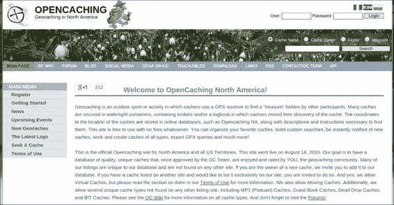

**手动下载数据**

现在，你可能想选择特定于你所在地区的特定数据；为此，你需要访问一个地理藏宝网站，过滤数据，并手动下载文件。

作为示例，我们将通过从网站下载数据的过程进行说明

[`www.opencaching.us/`](http://www.opencaching.us/) 你不需要账户；只需遵循以下步骤：1. 打开网站。在左侧菜单中，点击**寻找藏宝**：2. 这将打开一个包含各种字段的页面。首先，使用以下图片中显示的字段选择你的搜索限制因素：

3. 接下来，你需要指定一个区域或标准来搜索地理藏宝。有许多选择可供选择，所以滚动页面并查看。你可以使用邮政编码、坐标、州等。让我们按州进行搜索；选择**纽约**并点击**搜索**。

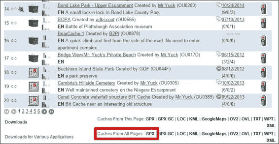

4. 将出现一个包含结果的列表。滚动到页面底部，你会注意到下载数据的链接。在**GPX**中选择下载**所有页面的缓存**。

格式：

**打开文件并获取其内容**

现在，我们将打开下载的文件并为其处理做准备。这是我们已经在第一章， *准备工作环境*中做过的事情，所以我们将复制我们的函数并改进它，以便我们可以在本应用程序以及未来的应用程序中重用它。

这里是我们将要执行的步骤：

1. 在`utils`目录内创建一个名为`geo_functions.py`的新文件。

2. 打开第一章中的 *Preparing the Work Environment* 的 world_areas.py 文件，并复制 open_shapefile 函数。然后，将其粘贴到创建的文件中。

3. 现在，将函数名改为 open_vector_file，这样它就更有意义了，因为我们将会使用这个函数来打开多种类型的文件。地理藏宝文件不是 shapefile，而是一个 GPX 文件，打开它我们不需要做任何改变。OGR

将为我们处理这个问题。

4. 现在，为了使代码有良好的文档记录，将 docstring 改为反映函数的功能。改为类似“打开与 OGR 兼容的矢量文件，获取第一层，并返回 OGR 数据源”的内容。

5. 最后，别忘了导入所需的包。你的代码应该看起来像这样：

# coding=utf-8

import ogr

import osr

def open_vector_file(file_path):

"""打开一个与 OGR 兼容的矢量文件，获取第一层并返回 OGR 数据源。

:param str file_path: 文件的完整路径。

:return: 返回 OGR 数据源。

"""

datasource = ogr.Open(file_path)

layer = datasource.GetLayerByIndex(0)

print("打开 {}".format(file_path))

print("特征数量: {}".format(

layer.GetFeatureCount()))

return datasource

if __name__ == "__main__":

open_vector_file("../../data/geocaching.gpx")

6. 再次运行代码，你应该会看到以下输出（不用担心警告信息）：

打开 ../data/geocaching.gpx

警告 1：无法解析 {2010-10-01T00:00:00Z} 为有效的 dateTime 警告 1：无法解析 {2011-04-10T00:00:00Z} 为有效的 dateTime

警告 1：无法解析 {2010-11-21T00:00:00Z} 为有效的 dateTime 特征数量: 130

警告 1：无法解析 {2010-11-22T00:00:00Z} 为有效的 dateTime

**准备分析内容**

这个应用程序使用米或英里等距离，所以我们不希望我们的测量结果以度为单位。大多数地理藏宝坐标和点数据都是以度为单位，因此我们需要将坐标系转换为公制系统。

为了做到这一点，我们将首先使用第一章中的函数 *Preparing the Work Environment*：transform_geometries。执行以下操作：1. 复制此函数并将其粘贴到 geo_functions.py 文件中。这个函数将遍历数据中的特征以获取其几何形状，然后转换坐标系，返回包含所有转换几何形状的列表。函数看起来应该像这样：

def transform_geometries(datasource, src_epsg, dst_epsg):

"""转换第一层中所有几何形状的坐标。

"""

# 第一部分

src_srs = osr.SpatialReference()

src_srs.ImportFromEPSG(src_epsg)

dst_srs = osr.SpatialReference()

dst_srs.ImportFromEPSG(dst_epsg)

transformation = osr.CoordinateTransformation(src_srs, dst_srs) layer = datasource.GetLayerByIndex(0)

# 第二部分

geoms = []

layer.ResetReading()

for feature in layer:

geom = feature.GetGeometryRef().Clone()

geom.Transform(transformation)

geoms.append(geom)

return geoms

**将函数组合成应用程序**

到目前为止，我们看到了一些非常实用的工具函数，它们执行特定的任务；然而，为了形成一个应用程序，我们需要通过按顺序调用这些函数来组合它们，以实现我们的目标。我们需要协调调用和结果的代码——

一个将使应用程序运行。

为了做到这一点，我们将深入 Python 编程中最美丽和最有力的部分之一：类和方法。

Python 是一种面向对象的编程语言（但它不是严格的）。如果你不熟悉面向对象编程的概念，请不要担心；理解这个概念最好的方式是通过例子，所以我现在不会深入理论，而是通过例子来教学。现在执行以下步骤：

1. 记得应用程序的入口点吗？它在 Chapter2 文件夹中的 geochaching_app.py 文件里。打开它进行编辑，你应该有这个：

# coding=utf-8

def main():print "Hello geocaching APP!"

if __name__ == "__main__":

main()

2. 现在，让我们导入我们迄今为止编写的模块，以便我们可以在应用程序中使用它们。同时，让我们导入我们还需要的其他模块。在编码声明（# coding=utf-8）之后插入导入语句。现在你的代码应该类似于这个：

# coding=utf-8

from utils.geo_functions import open_vector_file

from utils.geo_functions import transform_geometries

import numpy as np

import math

def main():

print "Hello geocaching APP!"

if __name__ == "__main__":

main()

3. 现在，删除 main() 函数，并在导入之后立即添加将代表我们应用程序的类：

class GeocachingApp(object):

def __init__(self, data_file=None):

"""应用程序类。

:param data_file: 一个与 OGR 兼容的文件

with geocaching points.

"""

# 第一部分。

self._datasource = None

self._transformed_geoms = None

# 第二部分。

if data_file:

self.open_file(data_file)

def open_file(self, file_path):

"""打开包含地理藏宝数据的文件并准备使用。

:param file_path:

"""

self._datasource = open_vector_file(file_path)

self._transformed_geoms = transform_geometries(

self._datasource, 4326, 3395)

在这里，我们创建了一个代表我们应用程序的类。在类内部，有一个特殊的方法叫做 __init__。这个方法在类实例化时被调用，这意味着当创建类的新实例时。在这里，我们可以看到一个名为 self 的参数；这个参数由类传递给所有实例方法，self 是类的实例本身。再次提醒，如果你对这些术语感到陌生，请不要担心，我们很快会对此进行更多讨论。

在第一部分，我们定义了两个任何类的实例都可能拥有的属性；注意，名称前的下划线表示该属性仅用于内部使用，不应从类外部调用。这种表示法仅是一种约定，实际上并不能真正阻止属性在方法外部被使用。在第二部分，如果用户传递可选文件，应用程序将调用 open_file 方法，该方法反过来打开文件并使用我们已开发的函数准备数据。

代码的编写方式允许我们随时更改我们正在工作的文件。

注意，当我们达到这一点时，我们已经达到了更高的抽象层次。首先，你有 OGR 库及其基本功能，需要编写许多代码行来完成特定的任务。然后，你有 utils 包，它将 ogr 函数封装成执行简单任务的实用函数，只需一行代码。现在，你有应用程序类，它将实用函数组合成方法，通过按正确的顺序和参数调用每个函数来自动化流程。

在这一点上，你需要执行以下步骤：

1. 使用以下代码编辑 if __name__ == '__main__': 块：if __name__ == "__main__":

my_app = GeocachingApp()

my_app.open_file('../data/geocaching.gpx') 2. 运行应用程序，查看结果。

**设置当前位置**

到目前为止，应用程序可以打开文件。下一步是定义你的位置，以便我们可以找到最近的藏宝地。为此，我们将修改 GeocachingApp 类，使其能够通过属性跟踪当前位置。我们还将创建更改位置（类似于几何形状）的方法、转换其坐标，并为其处理做准备。

需要执行以下步骤：

1. 使用以下代码编辑 GeocachingApp 类的 init 方法：

#..

def __init__(self, data_file=None, my_location=None):

"""应用程序类。

:param data_file: 一个兼容 OGR 的文件

with geocaching points.

"""

self._datasource = None

self._transformed_geoms = None

self._my_location = None

self.distances = None

if data_file:

self.open_file(data_file)

if my_location:

self.my_location = my_location

2. 现在，将这些两个方法添加到类中：

@property

def my_location(self):

return self._my_location

@my_location.setter

def my_location(self, coordinates):

self._my_location = transform_points([coordinates])[0]

这里的逻辑是，类实例应该有一个 my_location 属性，我们希望程序能够自动转换其坐标系，就像处理 geocaching 数据那样。

实现这种行为有许多方法。如果你有其他编程语言的经验，你可能已经遇到过 getters 和 setters 的概念。

Getters 和 setters 是设计用来获取和设置类给定属性的方法。

使用方法而不是直接访问属性，允许程序员在检索或更改属性时修改值或执行复杂的过程。

我们可以为这个属性提供一个获取器和设置器方法——get_my_location() 和

set_my_location()，例如——但是 Python 提供了一种优雅的方式来干预设置和获取给定属性的流程，使用 @property 装饰器。

如前述代码所示，my_location 的实际值存储在 _my_location 属性中，并在 __init__ 方法中定义（名称前的下划线表示该属性不应在类外部访问）。

然后，有两个具有相同名称的方法，这是我们要公开的属性的名称。这些函数被装饰，以便第一个成为获取器，第二个成为设置器。在设置器中，我们将调用在存储之前转换点坐标的函数（我们将在下一步中了解这个函数）。

就像我们对数据进行处理一样，位置也可以作为初始参数传递给类，并且可以在任何时间进行更改。以下是我们可以如何做到这一点：

1. 现在，你的完整类应该类似于这个：

class GeocachingApp(object):

def __init__(self, data_file=None, my_location=None):

"""应用程序类。

:param data_file: 一个与 OGR 兼容的文件

with geocaching points.

:param my_location: 您的位置坐标。

"""

self._datasource = None

self._transformed_geoms = None

self._my_location = None

self.distances = None

if data_file:

self.open_file(data_file)

if my_location:

self.my_location = my_location

def open_file(self, file_path):

"""打开包含地理藏宝数据

并为其使用做准备。

:param file_path:

"""

self._datasource = open_vector_file(file_path)

self._transformed_geoms = transform_geometries(

self._datasource, 4326, 3395)

@property

def my_location(self):

return self._my_location

@my_location.setter

def my_location(self, coordinates):

self._my_location = transform_points([coordinates])[0]

2. 由于我们没有 transform_points 函数，你应该注意到 PyCharm

在红色下划线处标记了 transform_points。因此，让我们在 geo_functions.py 文件中创建一个。此外，我们将通过创建另一个创建 OSR 转换的函数来避免样板代码：

**注意**

**样板代码**

样板代码，或称为样板，是许多地方重复出现且几乎或根本不进行更改的代码片段。

def create_transform(src_epsg, dst_epsg):

"""创建一个 OSR 转换。

:param src_epsg: 源几何的 EPSG 代码。

:param dst_epsg: 目标几何的 EPSG 代码。

:return: osr.CoordinateTransformation

"""

src_srs = osr.SpatialReference()

src_srs.ImportFromEPSG(src_epsg)

dst_srs = osr.SpatialReference()

dst_srs.ImportFromEPSG(dst_epsg)

return osr.CoordinateTransformation(src_srs, dst_srs)

def transform_points(points, src_epsg=4326, dst_epsg=3395):

"""转换坐标参考系中的一系列坐标（一系列点）

:param src_epsg: 源几何的 EPSG 代码。

:param dst_epsg: 目标几何的 EPSG 代码。

"""

transform = create_transform(src_epsg, dst_srs)

points = transform.TransformPoints(points)

return points

transform_points 函数使用具有相同名称的 OSR 函数，该函数在数组上执行转换。这个函数非常高效，可以在普通家用电脑上以每秒数百万次的速率转换坐标对。我们将它封装在我们的函数中的原因是我们想避免代码重复并添加默认参数。

注意，在 my_location 设置器中，我们将坐标放入一个列表中，然后获取返回值的第一个元素（self.mylocation =

transform_points([coordinates])[0]).

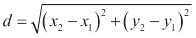

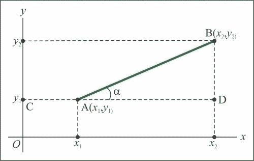

**寻找最近点**

要找到最近点，我们首先需要计算当前位置（我的位置）和所有点之间的距离。然后，我们需要找到离我的位置最近的点。

因此，对于每个点，我们必须应用一个返回到我位置的距离的方程，并将这些结果按以下表格中点的顺序存储：**点索引 x**

**y**

**到我位置的距离**

0

35 44 ?

1

20 92 ?

2

11 77 ?

两点之间的距离由以下方程给出：将此方程转换为 Python，我们有以下代码：distance = math.sqrt((xb-xa)**2 + (yb-ya)**2)

以下表格展示了基本的 Python 数学运算符 **语法**

**数学表达式运算名称**

a + b

*a* + *b*

加法

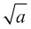

a - b

*a* - *b*

减法

a * b

*a* x *b*

乘法

a / b

*a* ÷ *b*

除法

a ** b

*a* b

指数

math.sqrt(a)

平方根

现在，通过执行以下代码将前面的方法插入到 GeocachingApp 类中：

#...

def calculate_distances(self):

"""计算两点之间的距离

一组点和给定位置。

:return: 按相同顺序返回距离列表

这些点。

"""

xa = self.my_location[0]

ya = self.my_location[1]

points = self._transformed_geoms

distances = []

for geom in points:

point_distance = math.sqrt(

(geom.GetX() - xa)**2 + (geom.GetY() - ya))

distances.append(point_distance)

return distances

**提示**

**代码的逐步优化**

一些方程或操作可能非常复杂，有时它们变得难以编写，或者你可能需要查看中间步骤的结果来调试。这些情况下的提示是不要一开始就担心编写优化和快速的代码。

首先编写可读性和清晰的代码，将每个中间步骤分离到变量中。

例如，考虑以下距离方程：

distance = math.sqr((xb-xa)**2 + (yb-ya)**2)

这可以分解为中间步骤：

vertical_distance = yb - ya

水平距离 = xb – xa

distance = math.sqrt(horizontal_distance**2 + vertical_distance**2) 现在，调试并检查结果；当你确定逻辑正确且结果符合预期时，你可以逐步优化代码，通过替换部分和尝试不同的路径来提高性能，检查结果是否匹配。

最后的部分是找到距离列表中的最近点，这意味着在点集中找到一个给定位置。

index = the item that has the minimum value. Add this method to the class:

#...

def find_closest_point(self):

"""找到给定位置最近的点并返回该点上的藏宝。

:return: 包含点的 OGR 特征。

"""

# 第一部分。

distances = self.calculate_distances()

index = np.argmin(distances)

# 第二部分。

layer = self._datasource.GetLayerByIndex(0)

feature = layer.GetFeature(index)

print "Closest point at: {}m".format(distances[index]) return feature

有可能数据中包含重复值，这会导致相同的距离，或者有极小的可能性两个点具有相同的距离。

所以，在第一部分，np.argmin 函数返回所有点中具有最小值的索引或索引。在第二部分，程序获取此索引处的特征。

执行以下步骤：

1. 现在，让我们测试我们的应用程序并编辑 if __name__ == '__main__' 块，如下所示：

if __name__ == "__main__":

my_app = GeocachingApp('../data/geocaching.gpx', [-73.0, 43.0]) my_app.find_closest_point()

2. 现在，你的 geocaching_app.py 应该看起来像这样：

# coding=utf-8

from utils.geo_functions import open_vector_file

from utils.geo_functions import transform_geometries

from utils.geo_functions import transform_points

import numpy as np

import math

class GeocachingApp(object):

def __init__(self, data_file=None, my_location=None):

"""应用程序类。

:param data_file: 一个与 OGR 兼容的文件

with geocaching points.

:param my_location: 你的位置的坐标。

"""

self._datasource = None

self._transformed_geoms = None

self._my_location = None

self.distances = None

if data_file:

self.open_file(data_file)

if my_location:

self.my_location = my_location

def open_file(self, file_path):

"""打开包含地理藏宝数据的文件并准备使用。

:param file_path:

"""

self._datasource = open_vector_file(file_path)

self._transformed_geoms = transform_geometries(

self._datasource, 4326, 3395)

@property

def my_location(self):

return self._my_location

@my_location.setter

def my_location(self, coordinates):

self._my_location = transform_points([coordinates])[0]

def calculate_distances(self):

"""计算两点之间的距离。

set of points and a given location.

:return: 与点顺序相同的距离列表。

the points.

"""

xa = self.my_location[0]

ya = self.my_location[1]

points = self._transformed_geoms

distances = []

for geom in points:

point_distance = math.sqrt(

(geom.GetX() - xa)**2 + (geom.GetY() - ya))

distances.append(point_distance)

return distances

def find_closest_point(self):

"""找到给定位置最近的点并返回该点上的缓存。

:返回: 包含点的 OGR 特征。

"""

# 第一部分。

distances = self.calculate_distances()

index = np.argmin(distances)

# 第二部分。

layer = self._datasource.GetLayerByIndex(0)

feature = layer.GetFeature(index)

print "最近的点在：{}m".format(distances[index]) return feature

if __name__ == "__main__":

my_app = GeocachingApp('../data/geocaching.gpx', [-73.0, 43.0]) my_app.find_closest_point()

3. 运行代码，按 *Alt* + *Shift* + *F10*，并选择 geocaching_app。查看输出结果：

最近的点在：49653.3244095m

处理完成，退出代码 0

**摘要**

在本章中，我们讨论了与代码组织和数据处理相关的重要概念。这是通过编写具有递增抽象级别的代码来实现的，直到我们拥有一个具有高级功能类的代码。

首先，我们编写了实用函数，以自动化任务并准备要处理的数据。其中一些函数是 OGR 库的简单抽象，旨在避免不必要的代码重复。

然后，我们在代表应用程序的类中编写了方法。这些方法负责执行一系列操作，使应用程序能够运行。

最后，我们介绍了如何在数据元素上执行数学运算的基础。我们编写了一个非常高效的方法，用于计算元素列表的距离。

在下一章中，我们将改进我们的数据抽象，使应用程序能够组合多个数据来源。

**第三章. 组合多个数据**

**来源**

地理数据往往具有异质性。仅举几个导致这种异质性的因素，它可能来自不同的来源，在不同的时间产生，甚至有不同的语言。鉴于这一事实，编写能够组合多个数据来源的程序是地理处理中的基本主题。

数据源可能以不同的格式存在，例如 shapefiles、文本文件、Google KML

文件，来自 GPS 的 GPX 文件等。它们的内容也可能不同；例如，它们可能具有不同的几何类型、坐标系和属性。

在本章中，我们将通过添加从不同站点和不同文件格式的多个数据来源的组合能力来增强我们的应用程序。为了实现这一点，我们将编写能够识别数据类型的代码，并根据这一点进行转换，以获得一组同质数据。

通过扩展 OGR 功能并包含我们自己的函数，我们可以在 Python 类中表示数据，并为其添加一些智能功能，使将多个来源的数据组合起来对应用程序和其他应用程序来说非常容易。

为了实现这些目标，我们将在本章中介绍以下主题：地理数据文件的结构

几何形状的表示

如何将数据转换为 Python 对象

如何组合多个数据源

使用 Python 中的类继承来编写更好的代码

**地理数据的表示**

大多数包含地理数据的文件格式都由一个常见的简单结构组成，该结构由多个特征组成，每个特征包含一个几何形状和无数个命名属性。

在这里，您可以查看 GeoJSON 文件内容的样本。这种地理文件的优势在于其可读性，使我们能够确切地看到所描述的结构。您不需要输入此示例；只需仔细查看即可。

其结构非常类似于 Python 字典。在最顶层，有 FeatureCollection，其中包含特征列表。每个特征都有一个几何形状，其类型可能不同，以及一个可能包含用户定义的任何任意属性的*字典*。简而言之，它严格遵循以下代码所示的数据表示方案：

{"type": "FeatureCollection",

"features": [

{"type": "Feature",

"geometry": {

"type": "Point",

"coordinates": [102.0, 0.5]},

"properties": {"prop0": "value0"}

},

{"type": "Feature",

"geometry": {

"type": "LineString",

"coordinates": [[102.0, 0.0], [103.0, 1.0], [104.0, 0.0]]

},

"properties": {

"prop0": "value0",

"prop1": 0.0

}

},

{"type": "Feature",

"geometry": {

"type": "Polygon",

"coordinates": [

[ [100.0, 0.0], [101.0, 0.0], [101.0, 1.0],

[100.0, 1.0], [100.0, 0.0] ]

]

},

"properties": {

"prop0": "value0",

"prop1": {"this": "that"}

}

}

]

}

**JSON**代表**JavaScript 对象表示法**，是一种易于在多种编程语言中读取和写入的格式。特别是在 Python 中，一个 JSON 对象可以

可以转换为字典，反之亦然。

有许多其他格式实现了相同结构；其中一些增加了额外的功能，而另一些具有针对特定目的非常具体的特征。

例如，**ESRI**的 shapefile 具有索引功能，**GPX**格式是为了与 GPS 设备配合使用以存储航点和轨迹而设计的，而**SpatiLite**是 SQLite 之上的单文件空间数据库，允许对象之间相互关联。

在以下表中，有一些常见的文件格式及其简要描述：**格式**

**描述**

笛卡尔

这是一个简单的点云。

坐标系统

数字线

这是一个用于矢量数据的 USGS 格式。

图形（DLG）

地理学

标记

这是一个基于 XML 的开放标准（由 OpenGIS 制定）用于 GIS 数据交换。

语言

GeoJSON

这是一种基于 JSON 的轻量级格式，并被许多开源 GIS 软件包所使用。

这是 SQLite 的空间扩展，提供了矢量地理数据库功能。它与 Spatialite 类似

PostGIS、Oracle Spatial 和具有空间扩展的 SQL Server。

Shapefile

这是一个由 Esri 开发的流行的矢量数据 GIS 格式。

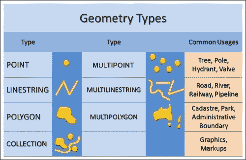

**表示几何形状**

正如我们之前看到的，在地理数据中，每个特征都包含一个几何形状。几何形状是给定对象的空間表示。例如，一个点可以代表一棵树、一个兴趣点，或者在我们的案例中，一个藏宝地。一条线可以是一条道路、一条河流等等。

国家、城市、州或任何其他类型的区域都可以用多边形表示。

在这本书中，我们将遵循由 ISO 19125 标准化的简单特征规范描述的几何形状表示。它由点、线、多边形及其聚合或集合组成，如下面的图像所示：

在这种格式中，任何几何形状都是由点和它们之间的线性插值表示的。一个例子就是形成一条线的两个点。

这种类型的几何形状简单、非常常见且易于使用。尽管如此，它有一些明显的缺陷，其中最重要的是缺乏拓扑表示。

例如，我们可能有两个特征代表两个相邻的国家——例如，加拿大和美国。对于每个特征（即每个国家），都有一个多边形代表该国家的整个边界。因此，两个国家共享的边界将重叠。

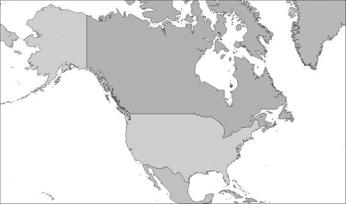

现在，考虑美国的州和加拿大的省；每个都将是一个多边形，它们的边界也将重叠，反过来，它们将重叠国家。

边界。因此，我们将得到以下结果：

州/省

国家边界

其他国家边界

其他州/省

这使得有四条重叠的线；如果我们想表示城市、地区等，重叠几何形状的数量将会增加。这样，我们会有更高的错误概率，并且需要更多的存储空间。

这也是为什么这种几何形状表示也被称为**意大利面数据**；它以大量线条的并置结束（类似于意大利面）。

这种缺陷可以通过几何形状的拓扑表示来解决。最大的不同是，在这个例子中，它不会存储多边形；它会存储对象之间的关系。你有一组相互关联的边界，代表一个区域，两个区域可以拥有相同的边界。**OpenStreetMap**是地理特征拓扑表示的一个很好的例子。

虽然拓扑表示更先进，但处理起来更困难，而且绝大多数地理分析都可以使用简单表示来完成。

**使数据同质化**

将数据表示与实际对象联系起来的简单方法是将几何形状与特征属性相结合。

例如，一行可以是一条道路、河流、栅栏等。唯一的区别可能是类型属性，它告诉我们它是什么。或者，我们可能有一个名为 roads 的文件，它让我们知道它包含道路。

然而，计算机并不知道这一点，因为它不知道其他属性代表什么，也不知道文件是什么。因此，我们需要对数据进行转换，以便有一个可以分析的共同格式。

这种常见的格式是本主题的主题；这是数据如何在 Python 中以最佳方式表示，以及如何操作和分析这些对象以产生预期结果。

目标是将特征、几何形状和属性的基本数据表示转换为现实生活对象的表示，在这个过程中隐藏底层功能的细节。在计算机科学中，这被称为**抽象**。

而不是仅仅编写一些准备好的代码并神奇地执行转换，我们将逐步通过如何进行转换的演绎过程。这非常重要，因为这是开发代码以对任何类型的地理数据进行任何类型转换的基础，这些数据可以在未来使用。

**抽象概念**

现在我们已经清楚地了解了数据是如何表示的，让我们回到我们的地理缓存应用。

抽象是一种编程技术，旨在降低程序员编写代码的复杂性。它是通过将复杂代码封装在更符合人类友好的解决方案的渐进层中实现的。抽象级别越低，越接近机器语言，维护起来越困难。抽象级别越高，代码越试图模仿真实事物的行为，或者越接近自然语言，因此越直观，也越容易维护和扩展。

回到我们迄今为止看到的例子，我们可能会注意到许多抽象级别

——例如，当我们使用 OGR 库在打开 shapefiles 的函数中使用时。

看看下面的代码：

def open_vector_file(file_path):

"""打开与 OGR 兼容的矢量文件，获取第一层，并返回 OGR 数据源。

:param str file_path: 文件的完整路径。

:return: OGR 数据源。

"""

datasource = ogr.Open(file_path)

layer = datasource.GetLayerByIndex(0)

print("正在打开 {}".format(file_path))

print("特征数量: {}".format(layer.GetFeatureCount())) return datasource

在抽象的最上层，我们有自己的函数，它隐藏了 OGR 的功能。然后，我们有 OGR 的 Python 绑定，它抽象了 OGR C

API，它反过来处理内存分配、所有数学运算等。

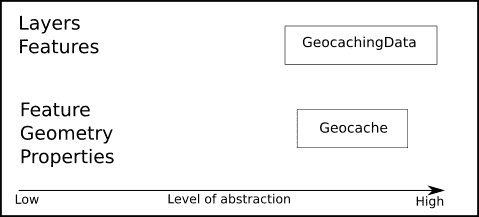

**抽象地理缓存点**

因此，我们需要以智能的方式处理多个数据源，这样我们就不需要为每种数据类型更改代码

有可能结合来自多个源的数据

如果我们为程序添加额外的功能，我们不需要担心文件格式和数据类型

我们将如何做到这一点？答案是简单的：我们将抽象我们的数据，并将格式和类型处理的流程隐藏在内部功能中。

目标是，在应用程序的这个点之后，我们不再需要处理 OGR、图层、要素等。我们将只有一个类型的数据对象，我们将使用这个对象来表示我们的数据，所有的交互都将通过这个对象来完成。地理藏宝对象将表示一个单独的地理藏宝点，具有可以用来操作此对象的属性和方法。

现在执行以下步骤：

1\. 首先，让我们组织项目结构。在 PyCharm 中打开您的 geopy 项目，并创建一个名为 Chapter3 的目录。

2\. 将 Chapter2 中的所有文件和目录复制到 Chapter3 中。您应该得到以下类似的结构：

+---Chapter3

| | geocaching_app.py

| | __init__.py

| |

| +---experiments

| | import_test.py

| | module_test.py

| |

| \---utils

| data_transfer.py

| geo_functions.py

| __init__.py

3\. 在 Chapter3 中，创建一个名为 models.py 的新文件（从现在开始，我们将

在 Chapter3 目录下工作）。

4\. 现在将此代码添加到文件中：

class Geocache(object):

"""这是一个表示单个地理藏宝点的类。"""

def __init__(self, x, y):

self.x = x

self.y = y

@property

def coordinates(self):

返回 self.x, self.y

5\. 现在，我们有一个带有其第一个属性的 geocache 类：地理藏宝点的坐标。为了测试我们的类，我们可以编写以下代码：if __name__ == '__main__':

one_geocaching_point = Geocache(20, 40)

打印(one_geocaching_point.coordinates)

6\. 运行您的代码，按 *Alt* + *Shift* + *F10*，并选择模型文件。您应该在控制台看到以下输出：

(20, 40)

进程已退出，退出代码为 0

**抽象地理藏宝数据**

由于我们有一个单独的点，我们还需要有一个点的集合。我们将称这个为 PointCollection。继续抽象的过程，目标是隐藏导入和转换数据的操作。我们将通过创建一个新的类并在其中封装一些我们的实用函数来实现这一点。转到您的 models.py 文件，并添加以下类：

class PointCollection(object):

def __init__(self):

"""这是一个表示一组矢量数据的类。"""

Self.data = []

这是一个简单的类定义，在 __init__ 方法中，我们将定义这个类的每个实例都将有一个数据属性。现在我们已经创建了简单的抽象，让我们给它添加一些功能。

**导入地理藏宝数据**

在上一章中，我们通过添加导入更多由 OGR 支持的数据类型的功能来泛化我们的导入函数。

现在，我们将再次改进它，使其能够处理一些错误，使其与我们的对象兼容，并添加两个新功能。我们还将转换数据以生成统一的对象。

为了实现我们的目标，我们将分析我们想要打开的文件中存储了哪些信息。我们将使用 OGR 来检查文件，并返回一些可能帮助我们进行数据转换的信息。

首先，让我们修改我们的 open_vector_file 函数，使其能够处理不正确的路径和文件名，这是一个非常常见的错误。执行以下步骤：1. 前往 utils 文件夹并打开 geo_functions.py 文件。

2. 在文件开头添加以下导入语句：

# coding=utf-8

import ogr

import osr

import gdal

import os

from pprint import pprint

3. 现在，通过以下代码编辑 open_vector_file 函数：def open_vector_file(file_path):

"""打开与 OGR 兼容的矢量文件，获取第一层并返回 OGR 数据源。

:param str file_path: 文件的完整路径。

:return: OGR 数据源。

"""

datasource = ogr.Open(file_path)

# 检查文件是否已打开。

if not datasource:

if not os.path.isfile(file_path):

message = "路径错误。"

else:

message = "文件格式无效。"

raise IOError(

'Error opening the file {}\n{}'.format(

file_path, message))

layer = datasource.GetLayerByIndex(0)

print("正在打开 {}".format(file_path))

print("要素数量: {}".format(

layer.GetFeatureCount()))

return datasource

在这一步中，我们添加了一个验证来检查文件是否正确打开。如果文件不存在或存在任何其他问题，OGR 将保持沉默，并且

datasource 将会为空。所以，如果数据源为空（None），我们将知道出了些问题，并执行另一个验证来查看是否文件路径有误或其他情况发生。在任何情况下，程序将抛出异常，防止它继续使用错误的数据。

4. 现在，我们将添加另一个函数来打印有关数据源的一些信息。在 open_vector_file 函数之后，添加 get_datasource_information 函数，代码如下：

def get_datasource_information(datasource, print_results=False):

"""获取数据源中第一层的信息。

:param datasource: 一个 OGR 数据源。

:param bool print_results: 如果为 True，则打印结果到屏幕。

the screen.

"""

info = {}

layer = datasource.GetLayerByIndex(0)

bbox = layer.GetExtent()

info['bbox'] = dict(xmin=bbox[0], xmax=bbox[1],

ymin=bbox[2], ymax=bbox[3])

srs = layer.GetSpatialRef()

if srs:

info['epsg'] = srs.GetAttrValue('authority', 1)

else:

info['epsg'] = 'not available'

info['type'] = ogr.GeometryTypeToName(layer.GetGeomType())

# 获取属性名称。

info['attributes'] = []

layer_definition = layer.GetLayerDefn()

for index in range(layer_definition.GetFieldCount()):

info['attributes'].append(

layer_definition.GetFieldDefn(index).GetName())

# 打印结果。

if print_results:

pprint(info)

return info

在这里，我们将使用 OGR 的许多方法和函数从数据源和层中获取信息。这些信息被放入一个字典中，该字典由函数返回。如果 print_results = True，则使用 pprint 函数（美化打印）打印字典。此函数尝试以更人性化的方式打印 Python 对象。

5. 现在，为了测试我们的代码，编辑文件末尾的 if __name__ == '__main__': 块，如下所示：

if __name__ == "__main__":

gdal.PushErrorHandler('CPLQuietErrorHandler')

datasource = open_vector_file("../../data/geocaching.gpx") info = get_datasource_information(

datasource, print_results=True)

这里有一个新元素：gdal.PushErrorHandler('CPLQuietErrorHandler').

藏宝文件通常包含具有空日期字段的特征。当 OGR 遇到这种情况时，它会打印警告消息。当我们有很多特征时，这可能会相当烦人。此命令告诉 OGR/GDAL 抑制这些消息，以便我们可以得到一个干净的输出，只显示我们想要看到的内容。

6. 运行代码，按*Alt* + *Shift* + *F10*，选择**geo_functions**。你应该得到以下输出，显示收集到的信息：打开 ../../data/geocaching.gpx

特征数量：130

{'attributes': ['ele',

'time',

'magvar',

'geoidheight',

'name',

'cmt',

'desc',

'src',

'url',

'urlname',

'sym',

'type',

'fix',

'sat',

'hdop',

'vdop',

'pdop',

'ageofdgpsdata',

'dgpsid'],

'bbox': {'xmax': -73.44602,

'xmin': -79.3536,

'ymax': 44.7475,

'ymin': 40.70558},

'epsg': '4326',

'type': 'Point'}

Process finished with exit code 0

**注意**

字典的属性键包含可以从数据中读取的字段名。我们 GPX 文件上的每个要素（即每个点）都包含这个属性集。bbox 代码是数据的边界框，是包含数据地理范围的矩形的左上角和右下角的坐标。epsg 代码包含数据的坐标系统代码。最后，type 是 OGR 识别的几何类型。

**读取 GPX 属性**

在前一个示例中，查看 OGR 找到的属性（字段名）；我们有一个名称、一个描述和日期。我们有一些关于 GPS 的技术数据

solution (pdop, hdop, sat, fix, and many more) 和一些其他字段，但它们都不包含关于藏宝地点的深入信息。

为了查看 GPX 文件包含的信息，OGR 没有显示，让我们在 PyCharm 中打开它：

1. 在你的 geopy 项目中，进入数据文件夹。

2. 定位 geocaching.gpx。要打开它，可以将它拖放到编辑区域或双击文件名。

PyCharm 将打开它以进行编辑，但不会识别文件格式，并以单色显示；因此，让我们通知它这是一个 XML 文件。

3. 右键单击 geocaching.gpx 文件。在菜单中，选择**关联文件类型**，并弹出一个包含列表的窗口。选择**XML 文件**，然后点击**确定**按钮。

现在，GPX 文件的内容应该以不同颜色区分扩展标记语言的各个元素显示。PyCharm 也能够识别文件结构，就像它识别 Python 一样。让我们通过以下步骤查看：1. 按下*Alt* + *7*或导航到**视图** | **工具窗口** | **结构**菜单。

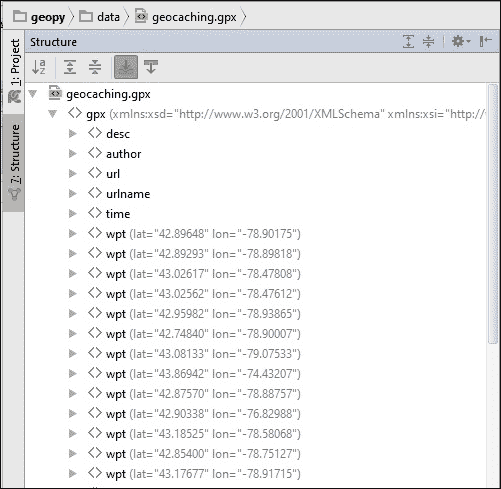

2. 这是 GPX 文件结构。请注意，在初始标签之后，它包含所有航点。点击任何航点左侧的箭头以展开它。然后，找到航点的地理藏宝标签并展开它。

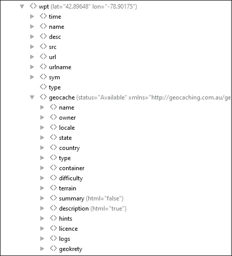

3. 如您所注意到的，地理藏宝点包含的信息比 OGR 能够读取的要多得多，包括地理藏宝标签的状态属性。

4. 在我们继续之前，先探索一下文件，熟悉其符号表示。点击一些标签，查看代码编辑器以查看内容。

由于我们无法直接使用 OGR 访问这些属性，我们将编写一个替代方案。

目标是读取这些信息，并将其展平为字典中的单个键/值对级别。GPX 文件是 XML 文件，因此我们可以使用 XML 解析器来读取它们。这里的选择是 xmltodict 包；它将简单地将 XML 文件转换为 Python 字典，这使得我们更容易操作，因为我们非常熟悉字典。现在，执行以下步骤：

1. 在 geo_functions.py 文件的开始处添加对 xmltodict 的导入，执行以下代码：

# coding=utf-8

导入 xmltodict

导入 ogr

导入 osr

导入 gdal

导入 os

从 pprint 导入 pprint

2. 在 open_vector_file 之前创建一个新函数，并添加以下代码：def read_gpx_file(file_path):

"""读取包含地理藏宝点的 GPX 文件。

:param str file_path: 文件的完整路径。

"""

with open(file_path) as gpx_file:
