(u'@xmlns', u'http://geocaching.com.au/geocache/1')

(u'desc', u'LaSalle Park No 1 by Mr.Yuck, Unknown Cache (1/1)') (u'urlname', u'LaSalle Park No 1')

(u'owner', u'Mr.Yuck')

(u'difficulty', u'1')

(u'sym', u'Geocache')

(u'terrain', u'1')

(u'status', u'Available')

Process finished with exit code 0

**导入大量数据**

Now that our environment is ready, we can begin working with bigger datasets. Let’s start by profiling the import process and then optimize it. We will start with our small geocaching dataset and after the code is optimized we will move to bigger sets.

1. In your geodata_app.py file, edit the if __name__ == '__main__': block to call the profiler.

if __name__ == '__main__':

profile = cProfile.Profile()

profile.enable()

import_initial_data("../data/geocaching.gpx", 'geocaching') profile.disable()

profile.print_stats(sort='cumulative')

2\. Run the code and see the results. Don’t worry about duplicated entries in the 数据库 now, we will clean it later. (I removed some information from the following output for space reasons.)

Importing geocaching…

112 features.

Done!

1649407 function calls (1635888 primitive calls) in 5.858 seconds cumtime percall filename:lineno(function)

5.863 5.863 geodata_app.py:24(import_initial_data)

5.862 5.862 managers.py:11(import_data)

4.899 0.002 related.py:749(create)

4.888 0.002 manager.py:126(manager_method)

3.621 0.001 base.py:654(save)

3.582 0.001 base.py:737(save_base)

3.491 0.001 query.py:341(create)

1.924 0.001 base.py:799(_save_table)

ncalls tottime percall cumtime percall filename:lineno(function) 1 0.001 0.001 5.863 5.863 (import_initial_data) 1 0.029 0.029 5.862 5.862 (import_data)

2497 0.018 0.000 4.899 0.002 related.py:749(create) Take a look at ncalls and cumtime for each of the functions. The create function is called a lot of times and accumulates almost five seconds on my computer. This is the function (method) called when we add a tag to a GeoObject. The time spent on this function is relevant when we import geocaching data because every point has a lot of attributes. Maybe we can make this process more efficient.

**优化数据库插入**

As we saw in the profiler, the method we are using to insert the tags into the database creates a bottleneck when we import geocaching data with our current code. If we can change how it’s done, we can make the code run faster.

1\. 前往您的管理器并编辑 GeoCollection 管理器的 import_data 方法：

class GeoCollection(GeoManager):

"""This class represents a collection of spatial data."""

def import_data(self, file_path, atype):

"""打开与 OGR 兼容的矢量文件并解析数据。

:param str file_path: The full path to the file.

"""

from models import Tag

features = open_vector_file(file_path)

tags = []

for feature in features:

geom = shape(feature['geometry'])

geo_object = self.model(geom=geom.wkt, atype=atype)

geo_object.save()

geoo_id = geo_object.id

for key, value in feature['properties'].iteritems():

tags.append(Tag(key=key, value=value,

geo_object_id=geoo_id))

Tag.objects.bulk_create(tags)

现在不是逐个创建标签，而是将它们添加到列表中而不触及数据库；只有在最后才调用 bulk_create，这将在单个请求中插入所有条目。注意，Tag 模型的导入语句位于函数内部。

这将避免循环导入错误，因为模型也导入管理器。

2. 运行你的代码并查看发生了什么：

django.db.utils.DataError: value too long for type character varying(250)

Process finished with exit code 1

由于 bulk_insert 将所有内容一起发送到数据库，我们无法捕获单个标签的异常。

解决方案是在插入之前验证标签。在这个阶段，我们正在权衡通用性和性能，因为验证可能会根据数据类型失败，而错误捕获可能由多种原因触发。

3. 再次编辑代码：

class GeoCollection(GeoManager):

"""此类表示一组空间数据。”

def import_data(self, file_path, atype):

"""打开与 OGR 兼容的矢量文件并解析数据。”

:param str file_path: 文件的完整路径。

"""

from models import Tag

features = open_vector_file(file_path)

tags = []

for feature in features:

geom = shape(feature['geometry'])

geo_object = self.model(geom=geom.wkt, atype=atype)

geo_object.save()

geoo_id = geo_object.id

for key, value in feature['properties'].iteritems():

if value and (isinstance(value, unicode)

or isinstance(value, str)):

if len(value) <= 250:

tags.append(Tag(key=key, value=value,

geo_object_id=geoo_id))

Tag.objects.bulk_create(tags)

4. 现在再次运行 geodata_app.py 并查看分析结果：1.144 秒内进行了 506679 次函数调用（506308 次基本调用），排序依据：累积时间

ncalls cumtime percall filename:lineno(function)

1 1.144 1.144 geodata_app.py:24(import_initial_data)

1 1.142 1.142 managers.py:12(import_data)

1 0.556 0.556 geo_functions.py:91(open_vector_file)

1 0.549 0.549 geo_functions.py:9(read_gpx_file)

**1 0.541 0.541 xmltodict.py:155(parse)**

1 0.541 0.541 {内置方法 Parse}

6186 0.387 0.000 pyexpat.c:566(StartElement)

6186 0.380 0.000 xmltodict.py:89(startElement)

112 0.317 0.003 base.py:654(save)

112 0.316 0.003 base.py:737(save_base)

14/113 0.290 0.003 manager.py:126(manager_method)

12487 0.278 0.000 collections.py:38(__init__)

113 0.235 0.002 query.py:910(_insert)

113 0.228 0.002 compiler.py:969(execute_sql)

6186 0.178 0.000 xmltodict.py:84(_attrs_to_dict)

**1 0.170 0.170 query.py:356(bulk_create)**

现在导入速度提高了五倍。注意分析结果的变化。过程中的数据库部分现在排在列表底部，而现在最耗时的部分是将 XML（GPX 文件）转换为字典。

查看输出，我们还可以看到另一个。

到目前为止，我们有了更高效的代码，我们不会改变处理 XML 的方式

转换已完成。相反，我们将继续测试和优化过程，而不是

其他类型的数据。

**优化数据解析**

记住我们在代码中创建了一个分支来导入 GPX 文件，因为 OGR/GDAL

无法导入这些文件中的嵌套数据。因此，我们应该预计在导入 shapefile 或 GML 文件时，我们将有不同的代码执行时间配置文件。让我们试试：

1\. 现在我们将使用世界边界数据集测试代码。更改 if __name__ == '__main__'：

== '__main__': block of geodata_app.py:

if __name__ == '__main__':

profile = cProfile.Profile()

profile.enable()

import_initial_data("../data/world_borders_simple.shp",

'boundary')

profile.disable()

profile.print_stats(sort='cumulative')

2\. 运行代码：

ValueError: A LinearRing must have at least 3 coordinate tuples Process finished with exit code 1

嗯，这不起作用。这里发生的事情是 Shapely 正在抱怨传递给它的几何形状。这是因为这段代码分支传递了一个 WKT 几何形状而不是坐标。

Django 可以接收 WKT 格式的几何形状，我们正在使用 Shapely 进行转换。

这可能是一个耗时的步骤，我们将消除它。在这个阶段，我们只是在用常识优化代码：步骤越少，代码运行越快。

1\. 编辑 GeoCollection 管理器：

class GeoCollection(GeoManager):

"""这个类表示一组空间数据。”

def import_data(self, file_path, atype):

"""打开与 OGR 兼容的矢量文件并解析数据。

:param str file_path: 文件的完整路径。

"""

from models import Tag

features = open_vector_file(file_path)

tags = []

for feature in features:

geo_object = self.model(geom=feature['geom'],

atype=atype)

geo_object.save()

geoo_id = geo_object.id

for key, value in feature['properties'].iteritems():

if value and (isinstance(value, unicode)

or isinstance(value, str)): if len(value) <= 250:

tags.append(Tag(key=key, value=value,

geo_object_id=geoo_id))

Tag.objects.bulk_create(tags)

我们消除了 Shapely 的使用（你也可以从导入中删除它），并更改了从字典中检索几何形状的方式。

2\. 现在转到 geo_functions.py 并编辑 read_ogr_features 函数：def read_ogr_features(layer):

"""将图层中的 OGR 特征转换为字典。

:param layer: OGR 图层。

"""

features = []

layer_defn = layer.GetLayerDefn()

layer.ResetReading()

type = ogr.GeometryTypeToName(layer.GetGeomType())

for item in layer:

attributes = {}

for index in range(layer_defn.GetFieldCount()):

field_defn = layer_defn.GetFieldDefn(index)

key = field_defn.GetName()

value = item.GetFieldAsString(index)

attributes[key] = value

feature = {

"geom": item.GetGeometryRef().ExportToWkt(),

"properties": attributes}

features.append(feature)

return features

作为一般化和性能之间的权衡，我们将特征字典从通用的 GeoJSON 格式更改为只包含两个键：具有 WKT 几何形状的 geom 和属性。

3. 现在编辑 read_gpx_file 函数，使其符合新格式：def read_gpx_file(file_path):

"""读取包含地理藏宝点（geocaching points）的 GPX 文件。

:param str file_path: 文件的完整路径。

"""

with open(file_path) as gpx_file:

gpx_dict = xmltodict.parse(gpx_file.read())

output = []

for wpt in gpx_dict['gpx']['wpt']:

geometry = "POINT(" + wpt.pop('@lat') + " " + wpt.pop('@lon') + ")"

# 第四章：如果 geocache 不在字典中，则跳过此 wpt。

try:

geocache = wpt.pop('geocache')

except KeyError:

continue

attributes = {'status': geocache.pop('@status')}

# 合并字典。

attributes.update(wpt)

attributes.update(geocache)

# 构建一个 GeoJSON 特征并将其追加到列表中。

feature = {

"geom": geometry,

"properties": attributes}

output.append(feature)

return output

4. 再次运行您的代码（如果您愿意，也可以再次测试导入点，您将获得几毫秒的改进）。查看结果：导入边界…

245 个特征。

完成！

90746 次函数调用（90228 次原始调用）在 5.164 秒内完成

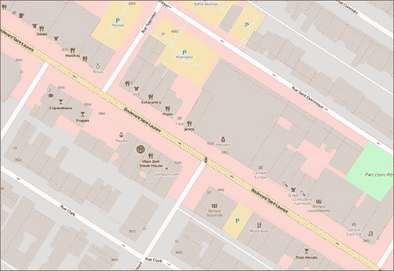

**导入 OpenStreetMap 的兴趣点**

**OpenStreetMap** (**OSM**) 是一个协作制图项目，每个人都可以创建账户并参与地图制作。它就像维基百科，但社区制作的是地图而不是文章。

数据全部可供下载，一些地区的地图非常详细。

我们在这里想要获取的是 **兴趣点** (**POI**)。这些点是代表餐厅、超市、银行等位置的点。

查看以下蒙特利尔圣劳伦斯大道的截图。那些小图标中的每一个都是一个 POI：

可以通过其 API 轻松获取 OSM 数据，该 API 被称为 **Overpass API**。它允许用户进行高级查询并过滤感兴趣的数据。

获取到的数据是针对 OSM 需要的 XML 格式。我们将使用 overpy，这是一个 Python 包，它将此数据转换为 Python 对象。

到目前为止，我必须承认，在我的职业生涯中，我深受 OSM 的启发

以及其数据格式。它简单而灵活，以至于 OSM 中的所有内容都由相同的模式表示。

OSM 由节点组成，有很多节点。实际上，到这个日期，它已有 3,037,479,553 个节点。

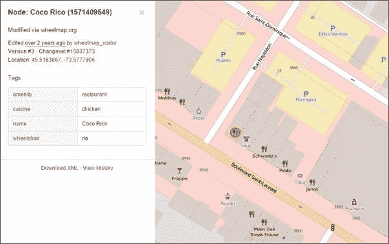

那就是了，超过三十亿的节点。节点可以是点，也可以是与其他节点相关联的部分，作为线或多边形表示的某个事物的组成部分。

每个节点都可以有任意数量的标签，由键/值对组成，就像我们的数据一样。查看从 POI 获得的信息：因此，将 OpenStreetMap POI 存储到我们的数据库中将非常直接。首先，让我们创建一个实用函数来下载感兴趣区域的点。

1\. 前往 utils 文件夹，并创建一个名为 osm_data.py 的新 Python 文件。

2\. 将以下代码添加到该文件中：

# coding=utf-8

import overpy

def get_osm_poi(bbox):

"""从 OpenStreetMap 下载兴趣点。

:param bbox: 获取点的区域的边界框。

"""

api = overpy.Overpass()

result = api.query("""

<osm-script>

<query type="node">

<bbox-query s="{ymin}" n="{ymax}" w="{xmin}" e="{xmax}"/>

<has-kv k="amenity"/>

</query>

<print/>

</osm-script>

""".format(**bbox))

print("找到 {} POI".format(len(result.nodes)))

return result

if __name__ == "__main__":

bbox = {"xmin":-71.606, "ymin":46.714,

"xmax":-71.140, "ymax":48.982}

result = get_osm_poi(bbox)

print(result.nodes[0].tags)

这是一个简单的 overpy 包装器，用于查询给定区域内的所有具有 amenity 键的点。在 if __name__ == '__main__': 块中，我们进行简单的测试，获取一些点，并打印其中一个点的标签。

**注意**

您可以在本网站上获取有关 Overpass API 的更多信息：

[`wiki.openstreetmap.org/wiki/Overpass_API/Language_Guide`](http://wiki.openstreetmap.org/wiki/Overpass_API/Language_Guide).

3\. 运行此文件中的代码。请记住按下 *Alt* + *Shift* + *F10* 来选择不同的文件，并在列表中选择 osm_data。你应该得到如下输出：找到 3523 个 POI

{'operator': 'Desjardins', 'amenity': 'bank', 'atm': 'yes', 'name':

'Caisse Populaire Desjardins'}

进程以退出代码 0 完成

如果您尚未安装 overpy，只需在代码中点击它，按 Alt + F10 并选择“安装包”

现在，让我们将此数据导入我们的数据库。打开您的 manage.py 文件。我们将为 GeoCollection 管理器创建一个新方法，它与 import_data 非常相似，但特定于 OSM 数据。

4\. 编辑您的 manage.py 文件，并将此新方法添加到 GeoCollection 类中：

#...

def import_osm_data(self, result):

"""导入 OpenStreetMap 的兴趣点。

:param str file_path: 文件的完整路径。

"""

from models import Tag

tags = []

for node in result.nodes:

geometry = "POINT(" + str(node.lat) + " " + \ str(node.lon) + ")"

geo_object = self.model(geom=geometry, atype="poi") geo_object.save()

geoo_id = geo_object.id

for key, value in node.tags.iteritems():

tags.append(Tag(key=key, value=value, geo_object_id=geoo_id))

Tag.objects.bulk_create(tags)

我们本可以重用 import_data 和 import_osm_data 两个函数共有的代码，但在这个章节中，我们强调速度，正如之前所述，有时使用特定的函数可以更容易地实现更好的执行时间。

在这种情况下，我们能够在创建标签时删除验证，使循环运行更快。

现在，让我们测试这个新方法：

5\. 打开 geodata_app.py 文件，并在文件开头添加此导入：from utils.osm_data import get_osm_poi

6\. 现在编辑 if __name__ == '__main__': 块：

if __name__ == '__main__':

bbox = {"xmin":-71.206, "ymin":47.714,

"xmax":-71.140, "ymax":48.982}

result = get_osm_poi(bbox)

GeoObject.objects.import_osm_data(result)

points = GeoObject.objects.filter(atype='poi')

print(len(points))

7\. 最后，运行代码并查看是否得到以下类似输出（点的数量可能因你而异）：

找到 14 个 POI

14

进程已结束，退出代码为 0

**删除测试数据**

在我们继续导入真实数据之前，让我们清理数据库中所有用于测试的数据。让我们在我们的应用程序中为此任务创建一个简单的函数：1\. 在 geodata_app.py 中添加此函数：

def clean_database():

"""从数据库中删除所有记录。”

from django.db import connection

cursor = connection.cursor()

cursor.execute('DELETE FROM geodata_tag;')

cursor.execute('DELETE FROM geodata_geoobject;')

在这里，我们直接在数据库上调用 SQL 命令，以避免所有 Django 开销并获得更好的性能。

2\. 现在，从 if __name__ == '__main__':块中调用它：

if __name__ == '__main__':

clean_database()

3\. 运行代码；完成可能需要一段时间。

4\. 保留它作为资源，以防你想进行其他测试或需要从头开始。

**用真实数据填充数据库**

现在是时候将真实数据放入我们的数据库中。我们将导入迄今为止使用的所有数据，以及额外的数据：

地理藏宝点（扩展版）

世界边界

加拿大区域边界

加拿大兴趣点

1\. 前往你的 geodata_app.py 文件并编辑 if __name__ == '__main__':块：if __name__ == '__main__':

import_initial_data("../data/canada_div.gml", 'canada') import_initial_data("../data/world_borders_simple.shp", 'world') import_initial_data("../data/geocaching_big.gpx", 'geocaching') 这次我们为我们的数据设置了更具体的数据类型，以便更容易进行查询。

1\. 现在，运行代码开始导入。最后，你应该得到以下输出：导入加拿大…

293 个要素。

完成！

导入世界…

245 个要素。

完成！

导入地理藏宝游戏数据…

1638 个要素。

完成！

进程已结束，退出代码为 0

现在是时候从 OpenStreetMap 获取兴趣点并将其添加到我们的数据库中。

2\. 将此函数添加到你的 geodata_app.py：

def import_from_osm(district):

# tags = Tag.objects.filter(value="Montreal")

borders = GeoObject.objects.get(atype='canada',

tags__key='CDNAME',

tags__value=district)

extent = borders.geom.extent

print("范围： {}".format(extent))

bbox = {"xmin": extent[0], "ymin": extent[1],

"xmax": extent[2], "ymax": extent[3]}

osm_poi = get_osm_poi(bbox)

GeoObject.objects.import_osm_data(osm_poi)

print("Done!")

此函数接受一个区域名称。从我们的数据库中获取它并使用其范围来查询 OSM API。

3\. 修改 if __name__ == '__main__':块：

if __name__ == '__main__':

import_from_osm('Montréal')

4\. 现在，运行代码。从 OSM 下载数据可能需要一些时间。完成后，你的输出应该类似于以下内容（要素的数量可能因你而异）：

范围： (-73.9763757739999, 45.4021292300001, -73.476065978, 45.703747476)

找到 5430 个 POI

完成！

--- 内存错误 ----

在这一点上，您可能将首次接触代码优化的另一个问题：内存消耗。除非您有大量的 RAM，否则您将面临 Python 的 MemoryError。这意味着在解析从 OSM 获取的大量 POI 时，您的计算机已耗尽内存。

这是因为整个 OSM 的 XML 都被解析成了 Python 对象，然后又转换成了 Django 对象，并且它们都被同时存储在内存中。

这里的解决方案是逐个读取 XML 标签。如果是节点，就将其放入数据库，获取其标签，并释放内存。为此，我们将使用样本数据中可用的 XML 文件，因此我们不需要再次下载它。

1\. 打开 managers.py 文件，并在文件开头添加此导入：import xml.etree.cElementTree as ET

2\. 前往您的 GeoCollection 管理器并编辑 import_osm_data 方法：

#...

#...

def import_osm_data(self, input_file):

"""导入 OpenStreetMap 的兴趣点。

:param str input_file: 文件的完整路径。

"""

from models import Tag

tags = []

tags_counter = 0

nodes_counter = 0

xml_iter = ET.iterparse(input_file)

for event, elem in xml_iter:

if elem.tag == 'node':

lat, lon = elem.get('lat'), elem.get('lon')

geometry = "POINT(" + str(lat) + " " + str(lon) + ")"

geo_object = self.model(geom=geometry, atype="poi") geo_object.save()

geoo_id = geo_object.id

nodes_counter += 1

if nodes_counter % 10000 == 0:

print("{} Nodes…".format(nodes_counter))

print("创建标签...") Tag.objects.bulk_create(tags)

tags = []

for child_tag in elem:

key = child_tag.get('k')

value = child_tag.get('v')

if len(value) <= 250:

tags.append(Tag(key=key,

value=value,

geo_object_id=geoo_id))

tags_counter += 1

elem.clear()

print("创建标签...")

Tag.objects.bulk_create(tags)

print("导入了{}个节点和{}个标签。".format(

nodes_counter, tags_counter))

print("完成！")

**ElementTree**是一个用于 XML 解析的 Python 模块；cElementTree 具有相同的功能，但由 C 实现。使用 cElementTree 的限制仅在于当 C 库加载不可用时，这里的情况并非如此。

注意，优化标签创建的解决方案是将标签累积到一个列表中，每 10,000 个节点批量创建标签，然后清空列表。

3\. 编辑 geodata_app.py 文件中的 if __name__ == '__main__': 块以测试代码：

if __name__ == '__main__':

GeoObject.objects.import_osm_data("../data/osm.xml") 4\. 现在运行它。在等待的过程中，您可以打开 Windows 任务管理器，或者在 Ubuntu 上打开系统监视器，查看您的计算机资源的使用情况，并/或在控制台输出中查看进度：

10000 Nodes…

创建标签…

20000 Nodes…

创建标签…

30000 Nodes…

创建标签…

40000 Nodes…

创建标签…

50000 Nodes…

...

导入了 269300 个节点和 1272599 个标签。

完成！

如果你正在监控计算机资源，你应该已经看到内存消耗在某个值周围波动。由于内存没有随着越来越多的节点导入而持续增加，因此我们可以导入任何给定数量的点，无论文件大小如何，因为代码是稳定的，没有内存泄漏。

在我的计算机上，Python 在程序执行期间消耗了大约 100 Mb 的内存。处理器核心保持在 5%的负载（Python 和 PostgreSQL），硬盘在 100%占用中，用于数据库写入。

可以调整数据库以获得更好的性能，但这超出了本书的范围。

记住，如果你想进行更多测试，你可以始终使用我们之前创建的函数清理数据库。只是记得在我们继续之前重新导入所有数据。

**搜索数据和交叉**

**信息**

现在我们已经用一些数据填充了数据库，是时候从中获取一些信息了；让我们探索所有这些 POI 包含的信息类型。我们知道我们下载的点至少包含便利设施或商店键中的一个。

OSM 将便利设施描述为任何类型的社区设施。作为一个练习，让我们看看我们从这些点中获得的一些便利设施类型列表：

1. 编辑 geodata_app.py 文件的 if __name__ == '__main__':块：if __name__ == '__main__':

amenity_values = Tag.objects.filter(

key='amenity').distinct('value').values_list('value')

for item in amenity_values:

打印(item[0])

在这里，我们使用 Tag 模型，访问其管理器（objects），然后过滤出键='amenity'的标签。然后我们只分离出不同的值（从查询中排除重复的值）。最后一部分——values_list('value')——告诉 Django 我们不想创建 Tag 模型，我们只想得到一个值列表。

2. 运行代码，看看大量便利设施类型列表：自动柜员机，燃料

自动柜员机;电话

听力学家

会议室

汽车修理店

车友会

汽车俱乐部

婴儿护理室

保释债券

面包店

洗球器

芭蕾舞

音乐厅

银行

银行建筑

宴会厅

酒吧

酒吧/食物

理发师

理发店

洗手间

烧烤

美容

美容服务

钟楼

长椅

赌博

自行车越野

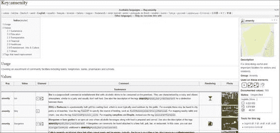

自行车停车场

自行车停车场;自行车租赁

自行车停车场;银行

自行车租赁

...

你也可以发现一些对 OSM 标签的误用，因为人们错误地将街道名称、商业名称等放在便利设施类型上。

**注意**

你可以查看 OpenStreetMap 维基百科中的常见便利设施类型列表：

[`wiki.openstreetmap.org/wiki/Key:amenity.`](http://wiki.openstreetmap.org/wiki/Key:amenity)

**使用边界过滤**

现在，让我们尝试只获取位于蒙特利尔的便利设施。程序与之前类似。我们将使用一个已知的谓词通过几何关系过滤对象，但这次搜索由数据库和空间索引提供支持，使它们变得非常快。

**注意**

请参阅第四章的*几何关系*部分，了解*改进应用搜索能力*的谓词列表。

if __name__ == '__main__':

# 获取蒙特利尔对象。

montreal = GeoObject.objects.get(atype='canada',

tags__key='CDNAME',

tags__value='Montréal')

# 过滤位于蒙特利尔的 POI 标签。

amenities = Tag.objects.filter(

key='amenity', geo_object__geom__within=montreal.geom)

# 仅过滤不同的值。

amenities = amenities.distinct('value')

# 获取'values'列表

amenity_values = amenities.values_list('value')

for item in amenity_values:

print(item[0])

在这里，我将每个部分分开成不同的语句，以方便理解。

无论您是将所有内容组合在一起还是保持分离，Django 查询集都是懒加载的（有点像我们在第七章 *从栅格数据中提取信息*中做的），并且它们只在需要值时才被评估。这意味着 Django 在我们开始遍历值（for item in amenity_values）时只会击中数据库一次。

1. 运行代码。你应该会得到一个更简短的设施类型列表：艺术中心

自动柜员机

听力学家

面包店

银行

酒吧

烧烤

长椅

自行车停车场

自行车租赁

广告牌

兑换处

公交站

咖啡馆

汽车租赁

汽车修理

共享汽车

洗车

儿童看护

电影院

市政厅

诊所

时钟

学院

...

现在，让我们找出在蒙特利尔可以找到多少家电影院（电影院）：2. 编辑 if __name__ == '__main__':块：

if __name__ == '__main__':

montreal = GeoObject.objects.get(atype='canada',

tags__key='CDNAME',

tags__value='Montréal')

cinemas = GeoObject.objects.filter(atype='poi',

geom__within=montreal.geom,

tags__key='amenity',

tags__value='cinema')

print("{} cinemas.".format(cinemas.count()))

**注意**

注意，我们正在使用 count 方法而不是 Python 的 len 函数。这使得计数在数据库上发生，并且只返回输出值。

这比先获取所有对象然后用 Python 计数要快得多。

3. 现在运行它并检查输出：

16 家电影院。

处理完成，退出代码为 0

**摘要**

在本章中，我们探讨了关于代码效率的入门概念以及如何衡量它。有了正确的工具，我们优化了代码，使其运行更快。

我们不是将数据存储到 Python 对象中，而是转向 SQL 数据库。因此，我们通过最先进的过滤功能增强了我们的应用程序，并以高效的方式获取信息。

后来，我们遇到了大量无法用普通计算机导入的数据。我们再次优化了代码，使其内存高效且稳定，使我们能够导入这些数据。最后，我们查询了数据，测试了新功能的功能。

在下一章中，我们将面临类似的速度和内存问题，但这次是图像（栅格）数据。这要求我们开发新的和创造性的解决方案。

**第九章. 处理大图像**

处理卫星图像（或其他遥感数据）是两个原因的计算挑战：通常，图像很大（许多兆字节或吉字节），并且需要结合许多图像来生成所需的信息。

打开和处理大量大图像可能会消耗大量计算机内存。这种状况为用户在耗尽内存之前能做什么设定了严格的限制。

在本章中，我们将关注如何进行可持续的图像处理，以及如何在保持低内存消耗的同时，使用高效代码打开和计算大量大图像。

以下主题将涵盖：

卫星图像和 Landsat 8 数据简介

如何选择和下载 Landsat 8 数据

当我们处理图像时，计算机内存会发生什么变化？

如何分块读取图像

Python 迭代器和生成器是什么？

如何遍历图像

如何使用新技术创建色彩组合

**处理卫星图像**

卫星图像是一种遥感数据形式。它们由卫星收集的信息组成，并以图像文件的形式提供给用户。就像我们之前工作的数字高程模型一样，这些图像由像素组成，每个像素代表特定地理范围内给定属性的值。

这些图像可以用真实颜色来可视化地球上的特征，或者可以用肉眼看不见的光谱部分来识别各种特征。

为了跟随示例，我们将使用来自 Landsat 8 卫星的照片。它们在互联网上免费提供。让我们看看这个卫星的一些特性。

Landsat 8 携带两种仪器：**操作陆地成像仪**（**OLI**）和**热红外传感器**（**TIRS**）。

这些传感器可以收集总共 10 个不同波段的数据，以 4096 个可能级别（12 位）的分辨率进行处理。数据被编码成 16 位 TIFF 图像，并缩放到 55000。

可能的值。

**波长**

**分辨率**

**波段**

**常见用途**

**(微米)**

**(米)**

波段 1—海岸

浅海海岸水研究和估算

0.43 - 0.45

30

雾霾

大气中雾霾的浓度

波段 2—蓝色

0.45 - 0.51

30

可见光蓝色通道，区分土壤和植被

波段 3—绿色

0.53 - 0.59

30

可见光绿色通道

波段 4—红色

0.64 - 0.67

30

可见光红色通道

波段 5—近红外 0.85 - 0.88

30

生物量估算

（近红外）

波段 6—短波红外 1

1.57 - 1.65

30

土壤湿度

波段 7—短波红外 2

2.11 - 2.29

30

土壤湿度

波段 8—全色 0.50 - 0.68

15

更高的分辨率

波段 9—卷云

1.36 - 1.38

30

检测卷云污染

波段 10—热

10.60 - 11.19

30

热成像和估算土壤湿度

红外线 (TIRS) 1

波段 11—热

11.50 - 12.51

30

热成像和估算土壤湿度

红外线 (TIRS) 2

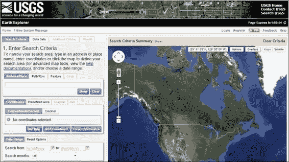

**获取 Landsat 8 图像**

Landsat 8 图像在互联网上免费提供，有一些很好的工具可以查找和下载这些图像。对于本书，我们将使用**美国地质调查局**（**USGS**）的 EarthExplorer。这是一个包含大量资源以获取地理数据的网络应用程序。

为了跟随书中的示例，我们将下载与上一章获得兴趣点相同的蒙特利尔（魁北克，加拿大）区域的数据。这些数据包含在书的样本数据中，如果您愿意可以跳过这些步骤。

首先，我们将打开网站并按照以下方式选择我们的兴趣区域：1. 访问[`earthexplorer.usgs.gov/`](http://earthexplorer.usgs.gov/)网站。您将看到一个地图，顶部有一些选项，以及左侧带有搜索工具的面板：2. 在右上角，您将看到一个**登录**/**注册**按钮。如果您没有账户，点击**注册**创建一个新的账户。否则，登录系统。

3. 下一步是搜索感兴趣的位置。您可以通过在框中输入蒙特利尔并点击**显示**来搜索。将出现一个包含搜索结果的列表。

点击列表中的**蒙特利尔**。将出现一个标记，并将坐标设置好。

4. 点击**数据集**按钮以显示此坐标的可用数据。

5. 在下一屏，展开**Landsat 档案**项，选择**L8 OLI/TIRS**，然后点击**附加标准**按钮。

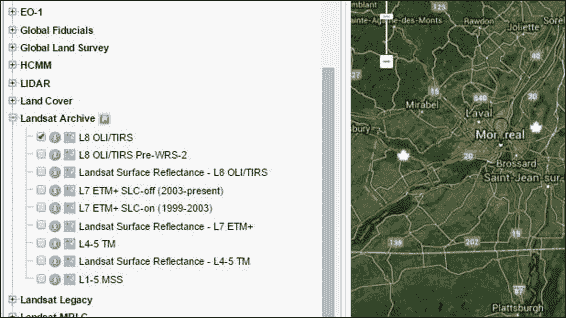

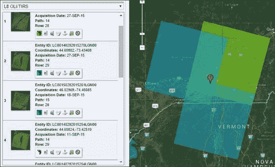

6. 现在，让我们确保我们得到云层较少的图像。使用滚动条找到**云层覆盖**项并选择**小于 10%**。现在，点击**结果**以查看找到的内容。

7. 将打开一个新标签页显示结果。请注意，每个项目都包含一个带有图标集的小工具栏。点击某些图像的脚图标以查看其在地图上的范围：

8. 对于我们的示例，我们只需要一个数据集：14 路径，28 行的数据集。找到数据

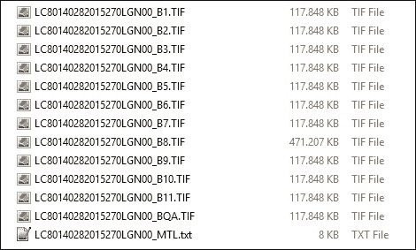

对于这组行和列（您可以使用任何日期的图像；这取决于您）然后点击迷你工具栏上的**下载选项**按钮（它是指向硬盘的绿色箭头图标）。

9. 将弹出一个包含下载选项的窗口。点击**下载级别 1**

**GeoTIFF 数据产品**。

**注意**

美国地质调查局有一个可以管理和恢复大型下载的应用程序。更多信息请查看[`lta.cr.usgs.gov/BulkDownloadApplication`](https://lta.cr.usgs.gov/BulkDownloadApplication)。

10. 下载完成后，在您的数据文件夹中创建一个新的文件夹，并将其命名为 landsat。解压缩此文件夹中的所有图像。

每个包包含 12 个.tif 图像和一个包含元数据的文本文件。每个图像名称由行、列、日期和图像波段组成。请注意，波段 8

图像（B8）比其他图像大得多。这是因为它具有更好的分辨率。

BQA 是一个质量评估波段。它包含有关图像中每个像素质量的信息。我们稍后会看到更多关于这个波段的内容。

**内存和图片**

首先，我们将检查打开图片如何影响随机访问内存（RAM）的使用。在我们的第一个例子中，我们将尝试使用之前相同的技术打开 Landsat 数据的波段 8：

1. 通过复制第八章来为第九章准备工作环境。

在你的 geopy 项目中创建一个新的文件夹。将复制的文件夹命名为 Chapter9\。

2. 在 Chapter9 文件夹中，打开 experiments 文件夹并删除其中的所有文件。

3. 在 experiments 文件夹中，创建一个新的 Python 文件并命名为 images.py。打开它进行编辑。

4. 现在将以下代码输入此文件：

# coding=utf-8

import cv2 as cv

def open_image(img_path):

image = cv.imread(img_path)

print(type(image))

raw_input("Press any key.")

if __name__ == '__main__':

image_path = "../../data/landsat/LC80140282015270LGN00_B8.TIF"

open_image(image_path)

5. 运行代码。按*Alt* + *Shift* + *F10*并选择列表中的图片。

6. 根据你的计算机内存和 OpenCV 版本，你可能成功。

否则，你会看到这个漂亮的异常：

OpenCV 错误：内存不足（在 cv::OutOfMemoryError 中失败分配 723585188 字节），文件 ..\..\..\opencv-2.4.11\modules\core\src\alloc.cpp，行 52

追踪回溯（最后最近调用）：

文件 "Chapter9/experiments/images.py"，第 14 行，在<module> open_image(image_path)中：

文件 "experiments/images.py"，第 6 行，在 open_image 中：image = cv.imread(img_path)

cv2.error: ..\..\..\opencv-2.4.11\modules\core\src\alloc.cpp:52: error: (-4) Failed to allocate 723585188 bytes in function

cv::OutOfMemoryError

进程以退出代码 1 结束

这是因为我们正在使用 Python 解释器的 32 位版本（即 x86），程序无法分配足够的内存一次性打开整个图片。

7. 让我们尝试一个文件大小更小的波段。更改文件名以匹配任何图片的波段 1。它可能是 LC80140282015270LGN00_B1.TIF。

8. 再次运行代码。你应该会看到一个提示让你按任意键：

<type 'numpy.ndarray'>

按任意键。

这是有意为之，以便在图片仍在内存中时停止程序执行。

9. 现在，如果你使用的是 Windows，请按*Ctrl* + *Alt* + *Del*并打开任务管理器。如果你使用的是 Ubuntu Linux，请打开系统监视器。

10. 查找 Python 进程并查看它使用了多少内存。你应该看到如下内容：

这没关系。图片已打开，并且没有消耗太多内存。

11. 在控制台中按任意键以完成程序执行。

12. 现在，让我们模拟打开多张图片并看看会发生什么。更改你的 open_image 函数：

def open_image(img_path):

image = cv.imread(img_path)

image2 = cv.imread(img_path)

image3 = cv.imread(img_path)

image4 = cv.imread(img_path)

image5 = cv.imread(img_path)

raw_input("Press any key.")

13. 再次运行代码并检查 Python 使用的内存。对我来说，是 872 MB。

14. 在控制台中按任意键退出程序并释放内存。

15. 对于我们的最后一次测试，再次打开图像以查看会发生什么：def open_image(img_path):

image = cv.imread(img_path)

image2 = cv.imread(img_path)

image3 = cv.imread(img_path)

image4 = cv.imread(img_path)

image5 = cv.imread(img_path)

image6 = cv.imread(img_path)

raw_input("Press any key.")

16. 运行代码并查看结果：

cv2.error: D:\Build\OpenCV\OpenCV-

2.4.11\modules//python//src2//cv2.cpp:201: 错误：(-2) 在函数中无法创建 typenum=2，ndims=3 的 numpy 数组

NumpyAllocator::allocate

Process finished with exit code 1

再次，程序未能分配足够的内存来打开图像。

这些实验的目的是为了展示，在处理图像时，有很大可能会遇到内存问题。对于波段 8，甚至无法开始处理，因为我们无法打开它。

对于波段 1，我们模拟了一个常见的情况，我们想要执行涉及许多图像的计算，并且这个计算有子步骤。内存消耗会不断增加，直到程序崩溃。

Python 允许使用的最大内存量受操作系统和 Python 版本（64 位或 32 位）的限制。可能，如果你正在运行 64 位版本的 Python，或者使用 Linux，你在这几个示例中不会遇到任何错误。

无论这个程序是否能运行，这些示例展示的代码的成功与图像大小有关。即使在一个拥有 32GB RAM 的 Linux 机器上运行 64 位 Python，如果图像太大且处理过程复杂，程序也可能耗尽内存。记住，一些卫星图像可能相当大。

**分块处理图像**

我们将修改代码，以便我们可以打开任何大小的图像。原理与上一章中应用的方法相同：为了读取和导入任意数量的点，我们让程序在读取、导入和释放内存后，对每小批次的点进行操作。

我们将不再读取点，而是从图像中读取一小部分，进行一些计算，将输出写入磁盘，并在重复下一部分之前释放内存。

**使用 GDAL 打开图像**

读取给定图像选定区域的过程并不容易。许多因素都相关，例如数据在图像中的编码方式、数据类型、如何读取数据等等。幸运的是，GDAL 配备了强大的函数和方法，可以抽象出大部分底层过程。让我们来实验一下：1. 在 images.py 文件中，在文件开头导入 GDAL：import gdal

2. 现在，创建一个新的函数来使用 GDAL 打开 Landsat 波段 8：def open_image_gdal(img_path):

dataset = gdal.Open(img_path)

cols = dataset.RasterXSize

rows = dataset.RasterYSize

print "Image dimensions: {} x {}px".format(cols, rows) raw_input("Press any key.")

3\. Change the if __name__ == '__main__': block to use the new function: if __name__ == '__main__':

image_path = "../../data/landsat/LC80140282015270LGN00_B8.TIF"

open_image_gdal(image_path)

4\. Run your code and check the output:

Image dimensions: 15401 x 15661px

Press any key.

We simply opened the image and printed its dimensions. You should have noticed that the code ran incredibly fast and with no errors. If you wish, you can check how much memory the Python process is using (using the Task Manager or the system monitor).

What happened this time is that the data wasn’t read when the file was opened. GDAL

only got the information about the image, but the actual data wasn’t touched.

Let’s try reading a few pixels from this image:

1\. Press any key to exit the program.

2\. Edit the function:

def open_image_gdal(img_path):

dataset = gdal.Open(img_path)

cols = dataset.RasterXSize

rows = dataset.RasterYSize

print "Image dimensions: {} x {}px".format(cols, rows) middle_col = int(cols / 2)

middle_row = int(rows / 2)

array = dataset.ReadAsArray(xoff=middle_col - 50,

yoff=middle_row - 50,

xsize=100, ysize=100)

print(array)

print(array.shape)

3\. Run the code again and check the output: Image dimensions: 15401 x 15661px

[[8826 8821 8846…, 8001 7965 7806]

[8842 8838 8853…, 7982 7931 7676]

[8844 8860 8849…, 8050 7958 7693]

...,

[7530 7451 7531…, 7471 7457 7494]

[7605 7620 7555…, 7533 7519 7610]

[7542 7542 7499…, 7620 7947 7728]]

(100, 100)

Process finished with exit code 0

We just read a chunk of 100 x 100 pixels from the centre of the image. Again, the code ran fast and little memory was consumed.

Now let’s try something fancier. Read a region from the image and save it on the disk, so we can visualize it.

4\. First, delete all the files from the Chapter9/output folder. We will save our image here.

5\. Add the adjust_values function and edit the code of the open_image_gdal function: def adjust_values(array, img_range=None):

"""Projects a range of values into a grayscale image.

:param array: A Numpy array containing the image data.

:param img_range: specified range of values or None to use

the range of the image (minimum and maximum).

"""

if img_range:

min = img_range[0]

max = img_range[1]

else:

min = array.min()

max = array.max()

interval = max - min

factor = 256.0 / interval

output = array * factor

return output

def open_image_gdal(img_path):

dataset = gdal.Open(img_path)

cols = dataset.RasterXSize

rows = dataset.RasterYSize

print "Image dimensions: {} x {}px".format(cols, rows) middle_col = int(cols / 2)

middle_row = int(rows / 2)

array = dataset.ReadAsArray(xoff=middle_col - 50,

yoff=middle_row - 50,

xsize=1000, ysize=1000)

print(array.shape)

greyscale_img = adjust_values(array)

cv.imwrite('../output/landsat_chunk.jpg', greyscale_img)

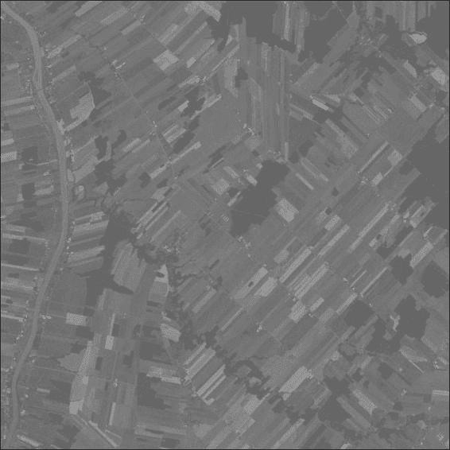

adjust_values 函数与之前我们用来调整高程数据灰度值以便可视化的函数相同。

我们使用 OpenCV 来写入 JPG 图像有两个原因：默认情况下，GDAL

在 Windows 上无法写入 JPG 文件，而且在这个简单的情况下，OpenCV 更容易使用。

6\. 运行代码并在输出文件夹中打开图像。如果你和我使用的是相同的 Landsat 数据，你应该看到魁北克农村地区的这幅美丽图像：

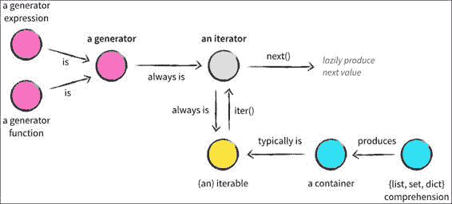

**遍历整个图像**

我们看到我们可以读取图像的特定部分。利用这个概念，我们可以一次处理图像的一部分。通过这样做，我们可以进行涉及多个波段的计算。我们只需要读取每个波段相同区域，获取结果，写入它们，释放内存，然后移动到下一部分。

在 Python 中遍历某个对象的最明显方式是使用 for 循环。我们可以遍历列表的元素、字符串中的字符、字典的键、矢量图层上的要素等等。

*此前的图像来自 http://nvie.com/posts/iterators-vs-generators/*

你可能已经听说过可迭代对象、迭代器和生成器的概念。**可迭代对象**，如列表，在用于 for 循环时成为迭代器。但我们不想创建图像块列表，因为为了做到这一点，我们需要预先读取整个图像来生成列表。这就是迭代器的特殊特性凸显出来的时候：它们是惰性的。

**迭代器**不过是一个具有特定魔法方法的类。在每次循环中，这个类的 next() 方法被调用，并返回一个新的值。Python 有创建迭代器的便捷工具，这正是我们要看到生成器的时候。让我们写一些代码：

1\. 在你的 images.py 文件中，添加一个新的函数：

def create_image_generator(dataset):

cols = dataset.RasterXSize

rows = dataset.RasterYSize

for row_index in xrange(0, rows):

yield dataset.ReadAsArray(xoff=0, yoff=row_index,

xsize=cols, ysize=1)

2\. 现在编辑 if __name__ == '__main__': 块：if __name__ == '__main__':

base_path = "../../data/landsat"

img_name = "LC80140282015270LGN00_B8.TIF"

img_path = os.path.join(base_path, img_name)

dataset = gdal.Open(img_path)

img_generator = create_image_generator(dataset)

print(img_generator)

print(type(img_generator))

3\. 运行代码并检查输出：

<generator object create_image_generator at 0x0791D968>

<type 'generator'>

Process finished with exit code 0

由于 for 循环中的 yield 关键字，我们的 create_image_generator 函数具有特殊的行为。当我们遍历由该函数创建的生成器对象时，yield 语句会暂停函数执行并在每次循环中返回一个值。在我们的例子中，生成器/迭代器将一次返回一行图像。

4\. 只是为了检查它是否工作，在 if __name__ == '__main__': 块中尝试这个：if __name__ == '__main__':

base_path = "../../data/landsat"

img_name = "LC80140282015270LGN00_B8.TIF"

img_path = os.path.join(base_path, img_name)

dataset = gdal.Open(img_path)

img_generator = create_image_generator(dataset)

print(img_generator)

print(type(img_generator))

for row in img_generator:

print(row)

5. 运行代码并查看输出：

...

[[0 0 0…, 0 0 0]]

[[0 0 0…, 0 0 0]]

[[0 0 0…, 0 0 0]]

[[0 0 0…, 0 0 0]]

[[0 0 0…, 0 0 0]]

[[0 0 0…, 0 0 0]]

Process finished with exit code 0

你看到的是 Python 打印了很多数组，每个数组都包含一行数据。你看到零是因为图像的边缘是黑色，而所有其他值都是

被 NumPy 抑制以适应控制台。让我们进行一些测试来探索迭代器的特性：

1. 现在，尝试这个概念测试，只是为了检查迭代器的另一个特性：if __name__ == '__main__':

base_path = "../../data/landsat"

base_path = "C:/Users/Pablo/Desktop/landsat"

img_name = "LC80140282015270LGN00_B8.TIF"

img_path = os.path.join(base_path, img_name)

dataset = gdal.Open(img_path)

img_generator = create_image_generator(dataset)

print(img_generator[4])

2. 运行代码，将引发错误：

Traceback (most recent call last):

文件 "Chapter9/experiments/images.py"，第 98 行，在 <module> 中 print(img_generator[4])

TypeError: 'generator' object has no attribute '__getitem__'

记住迭代器是惰性的，它们的行为不像序列（例如列表）。元素是逐个计算的，我们无法直接获取第 5 个元素。

3. 现在，为了检查它是否真的起作用，让我们逐行复制图像。创建这个新函数：

def copy_image(src_image, dst_image):

try:

os.remove(dst_image)

except OSError:

pass

src_dataset = gdal.Open(src_image)

cols = src_dataset.RasterXSize

rows = src_dataset.RasterYSize

driver = gdal.GetDriverByName('GTiff')

new_dataset = driver.Create(dst_image, cols, rows,

eType=gdal.GDT_UInt16)

gdal_array.CopyDatasetInfo(src_dataset, new_dataset)

band = new_dataset.GetRasterBand(1)

for index, img_row in enumerate(

create_image_generator(src_dataset)):

band.WriteArray(xoff=0, yoff=index, array=img_row)

为了复制图像，我们使用 GDAL 的 GTiff 驱动器创建了一个新的数据集。新的数据集具有相同的行数、列数和数据类型（无符号 16 位整数）。

为了确保复制具有与源相同的投影信息，我们使用了

函数 gdal_array.CopyDatasetInfo，从而节省了我们大量的代码。

最后，使用我们的生成器，我们逐行读取并将其写入输出波段。

4. 编辑 if __name__ == '__main__' 块并运行以下代码以测试它：if __name__ == '__main__':

base_path = "../../data/landsat"

img_name = "LC80140282015270LGN00_B8.TIF"

img_path = os.path.join(base_path, img_name)

img_copy = "../output/B8_copy.TIF"

copy_image(img_path, img_copy)

打开两张图像（原始图像和复制图像），只是为了检查它们是否看起来相同。

**创建图像组合**

现在我们已经了解了通过迭代图像的基本知识，这允许我们处理多个波段而不会耗尽内存，让我们产生一些更复杂的结果。

**真色组合**

由于我们有 Landsat 的红、绿、蓝波段，我们可以创建一个具有*真色*的图像。这意味着图像的颜色与我们直接观察场景时相似（例如，草地是绿色的，土壤是棕色的）。为此，我们将进一步探索 Python 的迭代器。

Landsat 8 RGB 波段分别是 4、3 和 2 波段。遵循我们想要自动化任务和流程的概念，我们不会为每个波段重复命令。我们将用以下方式编程 Python：

1. 在文件开头编辑导入，使其如下所示：import os

import cv2 as cv

import itertools

from osgeo import gdal, gdal_array

import numpy as np

2. 现在添加这个新函数。它将为我们准备波段路径：def compose_band_path(base_path, base_name, band_number):

return os.path.join(

base_path, base_name) + str(band_number) + ".TIF"

3. 要检查此函数和导入的 itertools 的目的，请使用以下代码编辑 if __name__ == '__main__':块：

if __name__ == '__main__':

base_path = "../../data/landsat"

base_name = 'LC80140282015270LGN00_B'

bands_numbers = [4, 3, 2]

bands = itertools.imap(

compose_band_path,

itertools.repeat(base_path),

itertools.repeat(base_name),

bands_numbers)

print(bands)

for item in bands:

print(item)

4. 现在运行代码并检查结果：

<itertools.imap object at 0x02DE9510>

../../data/landsat/LC80140282015270LGN00_B4.TIF

../../data/landsat/LC80140282015270LGN00_B3.TIF

../../data/landsat/LC80140282015270LGN00_B2.TIF

Process finished with exit code 0

组合波段路径只是将基本路径、波段名称和波段编号连接起来，以便输出带有路径的波段文件名。

而不是在 for 循环中调用函数并将结果追加到列表中，我们使用了 itertools.imap 函数。这个函数将另一个函数作为第一个参数，并将任何可迭代对象作为其他参数。它创建一个迭代器，将在每次迭代中调用该函数并传递参数。itertools.repeat 函数负责在迭代时重复给定值无限次。

5. 现在，我们将编写一个将波段组合成 RGB 图像的函数。将此函数添加到您的文件中：

def create_color_composition(bands, dst_image):

try:

os.remove(dst_image)

except OSError:

pass

# Part1

datasets = map(gdal.Open, bands)

img_iterators = map(create_image_generator, datasets)

cols = datasets[0].RasterXSize

rows = datasets[0].RasterYSize

# Part2

driver = gdal.GetDriverByName('GTiff')

new_dataset = driver.Create(dst_image, cols, rows,

eType=gdal.GDT_Byte,

bands=3,

options=["PHOTOMETRIC=RGB"])

gdal_array.CopyDatasetInfo(datasets[0], new_dataset)

# Part3

rgb_bands = map(new_dataset.GetRasterBand, [1, 2, 3])

for index, bands_rows in enumerate(

itertools.izip(*img_iterators)):

for band, row in zip(rgb_bands, bands_rows):

row = adjust_values(row, [0, 30000])

band.WriteArray(xoff=0, yoff=index, array=row)

在第一部分，Python 的内置 map 函数与 itertools.imap 类似，但它不是创建一个迭代器，而是创建一个包含结果的列表。这意味着所有项目都已计算并可用。首先，我们通过在所有波段上调用 gdal.Open 来创建 GDAL 数据集列表。然后，使用 map 函数创建一个图像迭代器列表，每个波段一个。

在第二部分，我们创建输出数据库就像之前做的那样。但这次，我们告诉驱动程序创建一个包含三个波段的数据集，每个波段的数据类型为字节（256

possible values）。我们还告诉它是一个 RGB 照片，在选项中。

在第三部分，我们再次使用 map 函数来获取数据集中波段的引用。在第一个 for 循环中，每次迭代都会得到一个索引，即行号，以及包含每个波段行的元组。

在嵌套的 for 循环中，每次迭代都会获取输出图像的一个波段和输入波段的一行。然后，使用我们的 adjust_values 函数将行的值从 16 位转换为 8 位（字节）。为了调整值，我们传递了一个魔法

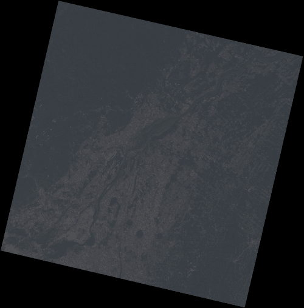

number 以获得更亮的图像。最后，将行写入输出波段。

6. 最后，让我们测试代码。编辑你的 if __name__ == '__main__': 块：if __name__ == '__main__':

base_path = "../../data/landsat/"

base_name = 'LC80140282015270LGN00_B'

bands_numbers = [4, 3, 2]

bands = itertools.imap(

compose_band_path,

itertools.repeat(base_path),

itertools.repeat(base_name),

bands_numbers)

dst_image = "../output/color_composition.tif"

create_color_composition(bands, dst_image)

7. 现在运行它。完成后，在输出文件夹中打开图像（color_composition.tif）。你应该看到这张美丽的彩色图像：

你可以调整传递给 adjust_values 函数的数字。尝试更改下限和上限；你将得到不同亮度的不同变体。

**处理特定区域**

现在，让我们修改代码以自动裁剪图像，这样我们可以更好地查看蒙特利尔地区周围的细节。这就像我们之前做的那样。但是，我们不会在处理图像后裁剪图像，而是只处理感兴趣的区域，使代码更加高效。

1. 编辑 create_image_generator 函数：

def create_image_generator(dataset, crop_region=None):

if not crop_region:

cols = dataset.RasterXSize

rows = dataset.RasterYSize

xoff = 0

yoff = 0

else:

xoff = crop_region[0]

yoff = crop_region[1]

cols = crop_region[2]

rows = crop_region[3]

for row_index in xrange(yoff, yoff + rows):

yield dataset.ReadAsArray(xoff=xoff, yoff=row_index,

xsize=cols, ysize=1)

现在，该函数接收一个可选的 crop_region 参数，如果传递了该参数，则只产生感兴趣区域的行。如果没有传递，则产生整个图像的行。

2. 将 create_color_composition 类更改为处理裁剪数据：def create_color_composition(bands, dst_image, crop_region=None): try:

os.remove(dst_image)

except OSError:

pass

datasets = map(gdal.Open, bands)

img_iterators = list(itertools.imap(

create_image_generator, datasets,

itertools.repeat(crop_region)))

if not crop_region:

cols = datasets[0].RasterXSize

rows = datasets[0].RasterYSize

else:

cols = crop_region[2]

rows = crop_region[3]

driver = gdal.GetDriverByName('GTiff')

new_dataset = driver.Create(dst_image, cols, rows,

eType=gdal.GDT_Byte,

bands=3,

options=["PHOTOMETRIC=RGB"])

gdal_array.CopyDatasetInfo(datasets[0], new_dataset)

rgb_bands = map(new_dataset.GetRasterBand, [1, 2, 3])

for index, bands_rows in enumerate(

itertools.izip(*img_iterators)):

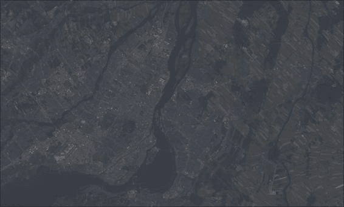

for band, row in zip(rgb_bands, bands_rows):

row = adjust_values(row, [1000, 30000])

band.WriteArray(xoff=0, yoff=index, array=row)

注意，当创建 img_iterators 时，我们用 itertools.imap 替换了 map 函数，以便能够使用 itertools.repeat 函数。由于我们需要 img_iterators 成为一个迭代器的列表，所以我们使用了 list 函数。

3. 最后，编辑 if __name__ == '__main__':块以传递我们的感兴趣区域：if __name__ == '__main__':

base_path = "../../data/landsat/"

base_name = 'LC80140282015270LGN00_B'

bands_numbers = [4, 3, 2]

bands = itertools.imap(

compose_band_path,

itertools.repeat(base_path),

itertools.repeat(base_name),

bands_numbers)

dst_image = "../output/color_composition.tif"

create_color_composition(bands, dst_image,

(1385, 5145, 1985, 1195))

运行代码。你现在应该拥有这张漂亮的蒙特利尔图像：

**假彩色组合**

颜色组合是信息可视化的一项强大工具，我们甚至可以用它来看到人类肉眼难以察觉的事物。

Landsat 8 和其他卫星提供的数据是在光谱范围内反射或吸收特定对象更多或更少的范围。例如，茂密的植被反射大量的近红外辐射，因此如果我们正在寻找植被覆盖率或植物生长的信息，我们应该考虑这个波段。

除了对不同波段的计算分析外，我们还可以通过替换红色、蓝色和绿色成分来可视化它们。让我们尝试以下操作：1. 只需编辑 if __name__ == '__main__':块，以便我们使用近红外（波段 5）作为 RGB 图像的绿色成分：

if __name__ == '__main__':

base_path = "../../data/landsat/"

base_name = 'LC80140282015270LGN00_B'

bands_numbers = [4, 5, 2]

bands = itertools.imap(

compose_band_path,

itertools.repeat(base_path),

itertools.repeat(base_name),

bands_numbers)

dst_image = "../output/color_composition.tif"

create_color_composition(bands, dst_image,

(1385, 5145, 1985, 1195))

2. 运行代码并查看输出图像：

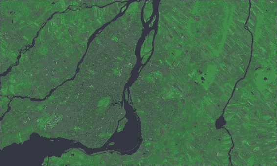

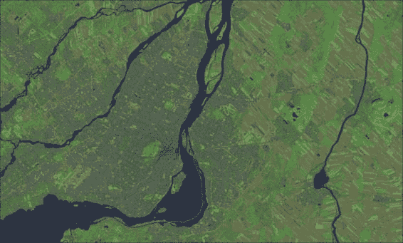

3. 您可以有其他许多组合。只需更改 band_numbers 变量以实现不同的结果。尝试将其更改为[6, 5, 2]。运行代码并查看农田如何从其他特征中脱颖而出。

**注意**

您可以通过点击以下链接查看更多有趣的波段组合：

[`landsat.gsfc.nasa.gov/?page_id=5377`](http://landsat.gsfc.nasa.gov/?page_id=5377)

[`blogs.esri.com/esri/arcgis/2013/07/24/band-combinations-for-landsat-8/`](http://blogs.esri.com/esri/arcgis/2013/07/24/band-combinations-for-landsat-8/)

**总结**

正如我们在兴趣点所做的那样，我们通过将负载分割成片段来管理过度的计算资源消耗问题。具体来说，我们不是读取和处理整个图像，而是创建了 Python 迭代器，允许我们逐行遍历这些图像，而不触及计算机的内存限制。

使用这种技术，我们能够一次处理三个 Landsat 8 波段，以生成对数据可视化有价值的彩色图像。

在这一点上，我们能够将我们的处理任务分割成可以独立处理的片段。我们可以用向量、数据库访问以及现在用图像来做这件事。

通过这种方式，我们为下一章完全铺平了道路，在下一章中，我们将将这些部分发送给不同的处理器核心同时计算，从而执行所谓的并行处理。

**第十章. 并行处理**

在本章中，我们将进一步优化代码；我们将尝试使用多个处理器核心进行计算的可能性。

使用上一章的卫星图像，我们将使用 Python 的 multiprocessing 库来分配任务并使它们并行运行。作为一个例子，我们将尝试不同的技术来从 Landsat 8 生成真彩色合成图像

数据，具有更好的分辨率和更高的细节水平。

为了实现我们的目标，我们将通过以下主题：

多进程是如何工作的

如何遍历二维图像块

图像缩放和重采样

图像操作中的并行处理

图像拉伸增强

**多进程基础**

我们使用的 Python 实现，CPython，有一个称为**全局** **解释器锁**（**GIL**）的机制。GIL 的目的是使 CPython 线程安全；它通过防止代码一次由多个线程执行来实现。

由于这种限制，Python 中的多进程通过复制正在运行的程序（例如，复制程序的状态）并将其发送到另一个计算机核心来实现。因此，新进程会带来一些开销。

让我们尝试一段简单的代码：

1. 首先，将你的 geopy 项目中的上一章文件夹复制一份，并将其重命名为 Chapter10\。

2. 清理 Chapter10/output 文件夹（删除其中的所有文件）。

3. 展开 Chapter10/experiments 文件夹，右键单击它，并创建一个新的 Python 文件。将其命名为 parallel.py。

4. 将此代码添加到新文件中：

# coding=utf-8

from datetime import datetime

import multiprocessing as mp

def an_expensive_function(text):

for i in range(500):

out = "{} {} {}"

out.format(text, text, text)

return "dummy output"

这是一个简单的函数，它接收文本并多次执行字符串格式化。这个函数的唯一目的是消耗 CPU 时间，这样我们就可以测试通过运行并行进程来加速我们的代码。

5. 现在，在文件末尾创建一个 if __name__ == '__main__':块，以便我们可以测试代码并测量其执行时间。

if __name__ == '__main__':

texts = []

for t in range(100000):

texts.append('test text')

t1 = datetime.now()

result = map(an_expensive_function, texts)

print("Execution time: {}".format(datetime.now() - t1)) 这段代码创建了一个包含 100,000 个字符串的列表，然后将这个列表映射到函数上；这意味着 an_expensive_function 被调用了 100,000 次。注意，在这里我们使用了一种更简单的技术来测量这段代码的执行时间；t1 保存了开始时间，最后从当前时间中减去。这避免了使用分析器的开销，并且比 timeit 模块更适合我们即将要做的事情。

overhead of using a profiler and is also more suitable for what we are going to do than the timeit module.

6. 运行代码并在控制台检查结果：

Execution time: 0:00:35.667500

Process finished with exit code 0

我的计算机运行 100,000 次函数大约需要 35 秒；可能你的结果会有所不同。如果你的计算机速度更快，请更改此数字以获得至少 10 秒的执行时间。注意你的结果。

1. 现在编辑 if __name__ == '__main__':块，以便我们可以并行执行此代码：

if __name__ == '__main__':

texts = []

for t in range(100000):

texts.append('test text')

multi = True

t1 = datetime.now()

if multi:

my_pool = mp.Pool(processes=8)

result = my_pool.map(an_expensive_function, texts)

else:

result = map(an_expensive_function, texts)

print("Execution time: {}".format(datetime.now() - t1)) Pool 类代表一个工作进程池；它们待命，等待我们提交一些待完成的任务。

为了使用你处理器的所有核心，你需要创建与处理器核心数量相同或更多的进程。或者，如果你不想完全加载你的计算机处理器，请使用少于核心数量的进程。这是通过更改 processes 参数来完成的。

我们将代码放在一个 if 块中，这样我们就可以轻松地在并行和单进程之间切换。

2. 运行你的代码并查看差异：

Execution time: 0:00:08.373000

Process finished with exit code 0

我的代码运行速度大约快了四倍。

3. 现在，打开你的任务管理器或系统监视器并打开 CPU 负载

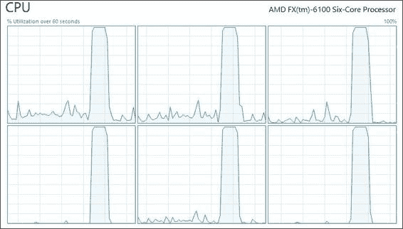

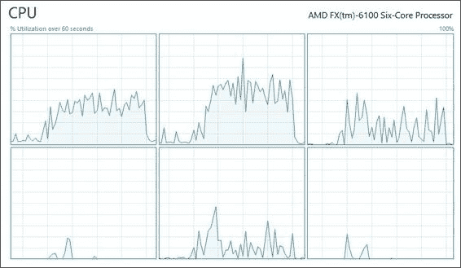

graphs.

4. 再次运行代码，使用 multi=True，并查看 CPU 负载图：5. 将 multi 更改为 False 并再次运行。现在检查图：注意，当使用多进程时，所有核心在短时间内都完全占用。然而，当使用单个进程时，一些核心只部分占用。

长时间。此模式可能因计算机架构而异。

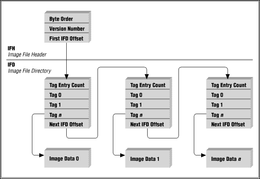

**块迭代**

TIFF 格式是一种灵活的图像格式，可以根据非常多样的需求进行定制。文件由一个**标题**、至少一个**图像文件目录**和任意数量的**图像数据**组成。简单来说，标题告诉文件中第一个目录的位置。目录包含有关图像的信息，说明如何读取与它相关的数据，并说明下一个目录的位置。每个目录和图像数据的组合都是一个图像，因此单个 TIFF 文件可能包含多个图像。

每个图像数据（即整个图像）都包含数据块（即图像的部分），这些数据块可以单独读取，每个块代表图像的特定区域。这使用户能够按块读取图像，就像我们之前做的那样。

数据块是不可分割的；为了从图像中返回数据，读取它的程序需要至少读取一个完整的块。如果所需的区域小于一个块，仍然会读取整个块，进行解码和裁剪；然后数据将被返回给用户。

数据块可以以条带或瓦片的形式存在。条带包含整个图像行中的数据，可能是一行或多行。瓦片具有宽度和长度（必须是 16 的倍数），它们很有趣，因为它们允许我们无需读取整个行即可检索特定区域。

在我们之前的例子中，我们编写了一个能够逐行读取图像的函数；现在我们将改进这个函数，以便能够读取任何大小的块。这将使我们能够在接下来的主题中用图像做更复杂的事情。

这次，我们将采用不同的方法来迭代图像。

1. 在你的 Chapter10/experiments 文件夹内，创建一个名为 block_generator.py 的新文件。

2. 编辑此文件并插入以下代码：

# coding=utf-8

导入 os 模块

from pprint import pprint

from osgeo import gdal, gdal_array

def create_blocks_list(crop_region, block_shape):

"""创建一个块读取坐标列表。

:param crop_region: 目标区域的偏移量和形状。

(xoff, yoff, xsize, ysize)

:param block_shape: 每个块的宽度和高度。

"""

img_columns = crop_region[2]

img_rows = crop_region[3]

blk_width = block_shape[0]

blk_height = block_shape[1]

# 获取块的数量。

x_blocks = int((img_columns + blk_width - 1) / blk_width)

y_blocks = int((img_rows + blk_height - 1) / blk_height)

print("Creating blocks list with {} blocks ({} x {}).".format(

x_blocks * y_blocks, x_blocks, y_blocks))

blocks = []

for block_column in range(0, x_blocks):

# Recalculate the shape of the rightmost block.

if block_column == x_blocks - 1:

valid_x = img_columns - block_column * blk_width

else:

valid_x = blk_width

xoff = block_column * blk_width + crop_region[0]

# loop through Y lines

for block_row in range(0, y_blocks):

# Recalculate the shape of the final block.

if block_row == y_blocks - 1:

valid_y = img_rows - block_row * blk_height

else:

valid_y = blk_height

yoff = block_row * blk_height + crop_region[1]

blocks.append((xoff, yoff, valid_x, valid_y))

return blocks

3\. Before some explanation, let’s see this function working. Add the if __name__ ==

'__main__': block at the end of the file with this code:

if __name__ == '__main__':

blocks_list = create_blocks_list((0, 0, 1024, 1024), (32, 32)) pprint(blocks_list)

4\. Run the code. Since we are running a different file from before, remember to press *Alt* + *Shift* + *F10* to select the file to run. Check the output:

Creating blocks list with 1024 blocks (32 x 32).

[(0, 0, 32, 32),

(0, 32, 32, 32),

(0, 64, 32, 32),

(0, 96, 32, 32),

(0, 128, 32, 32),

(0, 160, 32, 32),

(0, 192, 32, 32),

...

(992, 928, 32, 32),

(992, 960, 32, 32),

(992, 992, 32, 32)]

Process finished with exit code 0

The sole purpose of this function is to create a list of block coordinates and dimensions; each item on the list contains the offset and the size of a block. We need the size because the blocks on the edges may be smaller than the desired size.

The intention of this design choice, instead of iterating through an image directly, was to hide this low-level functionality. This function is extensive and unintuitive; we don’t want it mixed with higher-level code, making our programs much cleaner. As a bonus, we may gain a little speed when iterating multiple images because the list only needs to be produced once.

1\. Now, let’s adapt the function to copy the image. To use the iteration by blocks, add this code to the file:

def copy_image(src_image, dst_image, block_shape):

try:

os.remove(dst_image)

except OSError:

pass

src_dataset = gdal.Open(src_image)

cols = src_dataset.RasterXSize

rows = src_dataset.RasterYSize

driver = gdal.GetDriverByName('GTiff')

new_dataset = driver.Create(dst_image, cols, rows,

eType=gdal.GDT_UInt16)

gdal_array.CopyDatasetInfo(src_dataset, new_dataset)

band = new_dataset.GetRasterBand(1)

blocks_list = create_blocks_list((0, 0, cols, rows), block_shape) n_blocks = len(blocks_list)

for index, block in enumerate(blocks_list, 1):

if index % 10 == 0:

print("Copying block {} of {}.".format(index, n_blocks)) block_data = src_dataset.ReadAsArray(*block)

band.WriteArray(block_data, block[0], block[1])

2\. Edit the if __name__ == '__main__': block to test the code (we are also going to measure its execution time):

if __name__ == '__main__':

`base_path = "../../data/landsat/"`

`img_name = "LC80140282015270LGN00_B8.TIF"`

`img_path = os.path.join(base_path, img_name)`

`img_copy = "../output/B8_copy.tif"`

`t1 = datetime.now()`

`copy_image(img_path, img_copy, (1024, 1024))`

打印“执行时间：{}".`format(datetime.now() - t1)` 3.现在，运行它并检查输出：

创建包含 256 个块的块列表（16 x 16）。

复制第 10 块，共 256 块。

复制第 20 块，共 256 块……

复制第 240 块，共 256 块。

复制第 250 块，共 256 块。

执行时间：0:00:26.656000

进程以退出代码 0 结束

我们使用了 1024x1024 像素的块来复制图片。首先要注意的是，这个过程非常慢。这是因为我们正在读取比图片中块的大小还要小的块，导致大量的读写开销。

因此，让我们调整我们的函数以检测块大小并优化读取。

4.编辑`copy_image`函数：

**`def copy_image(src_image, dst_image, block_width=None,`**

**`block_height=None):`**

尝试：

删除`dst_image`

除了`OSError`：

`pass`

`src_dataset = gdal.Open(src_image)`

`cols = src_dataset.RasterXSize`

`rows = src_dataset.RasterYSize`

**`src_band = src_dataset.GetRasterBand(1)`**

**`src_block_size = src_band.GetBlockSize()`**

**`print("Image shape {}x{}px. Block shape {}x{}px.")`**

**`cols, rows, *src_block_size)`**

**`block_shape = (block_width or src_block_size[0],`**

**`block_height or src_block_size[1])`**

`driver = gdal.GetDriverByName('GTiff')`

`new_dataset = driver.Create(dst_image, cols, rows,`

`eType=gdal.GDT_UInt16)`

`gdal_array.CopyDatasetInfo(src_dataset, new_dataset)`

`band = new_dataset.GetRasterBand(1)`

`blocks_list = create_blocks_list((0, 0, cols, rows), block_shape)` `n_blocks = len(blocks_list)`

对于`blocks_list`中的每个`block`，使用`enumerate(blocks_list, 1)`：

如果`index % 10 == 0`：

打印“复制第{}块，共{}块。”。`format(index, n_blocks)` `block_data = src_dataset.ReadAsArray(*block)`

`band.WriteArray(block_data, block[0], block[1])`

我们将块形状参数分离为宽度和高度，并使它们成为可选参数。然后我们得到了在图片中定义的块的大小（形状）。如果块宽或高没有作为参数传递，则使用图像值。

我们有一个提示，这张图片被分成了条纹。记住，当我们逐行复制图片时，速度很快。所以，我们将尝试一次读取多行。

5.编辑`if __name__ == '__main__':`块：

如果`__name__ == '__main__'`：

`base_path = "../../data/landsat/"`

`img_name = "LC80140282015270LGN00_B8.TIF"`

`img_path = os.path.join(base_path, img_name)`

`img_copy = "../output/B8_copy.tif"`

`t1 = datetime.now()`

`copy_image(img_path, img_copy, block_height=100)`

打印“执行时间：{}".`format(datetime.now() - t1)` 6.运行代码并查看差异：

图像大小 15401x15661 像素。块大小 15401x1 像素。

创建包含 157 个块的块列表（1 x 157）。

复制第 10 块，共 157 块。

复制第 20 块，共 157 块。

复制第 30 块，共 157 块……

复制第 130 块，共 157 块。

复制第 140 块，共 157 块。

复制块 150/157。

执行时间：0:00:02.083000

进程以退出代码 0 完成

已确认，对于 Landsat 8 图像，每个块是图像的一行。通过读取整个行，我们达到了与之前相同级别的速度。

您可以尝试调整块高度参数；而不是读取 100 行，尝试读取 1

或 1000 行，看看它是否对执行时间有任何影响。

**提高图像分辨率**

为了获得更好的图像以进行视觉分析，我们可以结合不同的技术来提高图像分辨率。第一种技术是改变图像的大小，并通过插值重新计算缺失数据。第二种技术使用更高分辨率的波段（在我们的例子中是波段 8）——与较低分辨率的波段结合——以产生改进的真彩色地图。

**图像重采样**

图像缩放或重采样是一种改变图像大小的技术。通过这样做，我们改变了其中的像素数量（即样本数量）或反之亦然。

随着图像大小的增加，我们需要为之前不存在的像素提供一个值。这是通过插值完成的；新像素的值基于其周围像素的值。这就是为什么我们需要二维块的原因。

在我们的第一次试验中，我们将将一个 30 米分辨率的波段重采样为 15 米分辨率的图像。

由于我们将进行很多测试，让我们首先创建一种实用的方法来查看和比较我们的结果。为此，我们将裁剪图像并将其保存到磁盘，这样我们就可以轻松地可视化相同的区域。

1. 编辑文件开头的导入：

# coding=utf-8

from datetime import datetime

import os

import itertools

import numpy as np

from pprint import pprint

import functools

import multiprocessing as mp

from osgeo import gdal, gdal_array

from images import adjust_values, compose_band_path

from images import create_color_composition

import cv2 as cv

2. 将此新函数添加到您的文件中：

def crop_and_save(image_path, prefix=""):

dataset = gdal.Open(image_path)

array = dataset.ReadAsArray(4209, 11677, 348, 209)

array = adjust_values(array, (10000, 30000))

array = array.astype(np.ubyte)

preview_path, preview_file = os.path.split(image_path)

preview_file = "preview_" + prefix + preview_file cv.imwrite(os.path.join("../output/", preview_file), array) 这次我们将放大图像以显示蒙特利尔的市中心，包括皇家山和老港。作为参考，下一张图像是我们感兴趣区域的 Bing 地图提取的高分辨率图像：

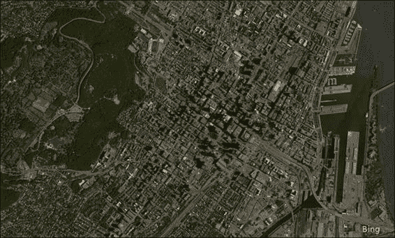

3. 现在，将重采样函数添加到您的文件中：

def resample_image(src_image, dst_image,

block_width=None, block_height=None, factor=2,

interpolation=cv.INTER_LINEAR):

"""通过一个因子改变图像分辨率。

:param src_image: 输入图像。

:param dst_image: 输出图像。

:param block_width: 处理块的像素宽度。

:param block_height: 处理块的像素高度。

:param factor: 图像尺寸乘数。

:param interpolation: 插值方法。

"""

t1 = datetime.now()

print("开始处理 -> {}".format(dst_image)) try:

os.remove(dst_image)

except OSError:

pass

src_dataset = gdal.Open(src_image, gdal.GA_ReadOnly)

cols = src_dataset.RasterXSize

rows = src_dataset.RasterYSize

src_band = src_dataset.GetRasterBand(1)

src_block_size = src_band.GetBlockSize()

# print("图像形状 {}x{}像素。块形状 {}x{}像素。".format(

# cols, rows, *src_block_size)

block_shape = (block_width or src_block_size[0],

block_height or src_block_size[1])

driver = gdal.GetDriverByName('GTiff') new_dataset = driver.Create(dst_image, cols * factor,

rows * factor,

eType=gdal.GDT_UInt16)

gdal_array.CopyDatasetInfo(src_dataset, new_dataset)

band = new_dataset.GetRasterBand(1)

blocks_list = create_blocks_list((0, 0, cols, rows), block_shape) new_block_shape = (block_shape[0] * factor,

block_shape[1] * factor)

new_blocks_list = create_blocks_list((0, 0,

cols * factor,

rows * factor),

new_block_shape)

n_blocks = len(blocks_list)

for index, (block, new_block) in enumerate(

zip(blocks_list, new_blocks_list), 1):

#if index % 10 == 0:

# print("正在复制第 {} 个块中的 {} 个块。".format(index, n_blocks)) block_data = src_dataset.ReadAsArray(*block)

block_data = cv.resize(block_data, dsize=(0, 0),

fx=factor, fy=factor,

interpolation=interpolation)

band.WriteArray(block_data, new_block[0], new_block[1])

return dst_image, t1

此函数创建一个按定义的因子缩放的输出数据集。它从源图像中读取每个块，通过此相同的因子改变其大小，并将其写入输出。请注意，输出块的大小也会根据乘数重新计算并缩放。插值方法为可选，默认使用线性插值。

代替仅仅测试这个函数，让我们生成每种可能的插值方法的预览，这样我们可以直观地比较它们，并看到哪个返回最佳结果。由于我们将使用多进程，我们还需要一个回调函数，以便我们可以计时每个作业的执行时间。

4. 将此函数添加到您的文件中：

def processing_callback(args):

t2 = datetime.now() - args[1]

print("处理完成 {}. {}".format(args[0], t2)) 5. 最后，编辑 if __name__ == '__main__': 块：

if __name__ == '__main__':

base_path = "../../data/landsat/"

img_name = "LC80140282015270LGN00_B4.TIF"

img_path = os.path.join(base_path, img_name)

interpolation_methods = {

"nearest": cv.INTER_NEAREST,

"linear": cv.INTER_LINEAR,

"area": cv.INTER_AREA,

"bicubic": cv.INTER_CUBIC,

"lanczos": cv.INTER_LANCZOS4}

output_images = []

multi = True

my_pool = mp.Pool(processes=8)

total_t1 = datetime.now()

for name, inter_method in interpolation_methods.iteritems(): out_image = "../output/" + name + '_B4.tif'

output_images.append(out_image)

if multi:

my_pool.apply_async(

resample_image, (img_path, out_image),

{'block_height': 100,

'interpolation': inter_method},

processing_callback)

else:

`result = resample_image(img_path, out_image,`

`block_height=100,`

`interpolation=inter_method)`

处理回调函数`processing_callback(result)`

如果`multi`：

# 关闭池，不再有工作。

`my_pool.close()`

# 等待所有结果准备就绪。

`my_pool.join()`

`print("Total time: {}".format(datetime.now() - total_t1)) map(crop_and_save, output_images)`

在这里，我们使用另一种技术向队列中添加工作。使用`apply_assinc`，我们一次添加一个工作，表示我们希望计算异步进行。最后，`my_pool.join()`使程序等待直到池中的所有工作都完成。

6. 当`multi = True`（启用多进程）时，运行代码并查看输出：开始处理 -> ../output/bicubic_B4.tif

开始处理 -> ../output/nearest_B4.tif

开始处理 -> ../output/lanczos_B4.tif

开始处理 -> ../output/linear_B4.tif

开始处理 -> ../output/area_B4.tif

完成处理 ../output/nearest_B4.tif. 0:00:33.924000

完成处理 ../output/area_B4.tif. 0:00:37.263000

完成处理 ../output/linear_B4.tif. 0:00:37.700000

完成处理 ../output/bicubic_B4.tif. 0:00:39.546000

完成处理 ../output/lanczos_B4.tif. 0:00:41.361000

总时间：0:00:42.264000

处理完成，退出代码 0

7. 现在，通过将`multi = False`禁用多进程，再次运行代码：开始处理 -> ../output/bicubic_B4.tif

完成处理 ../output/bicubic_B4.tif. 0:00:02.827000

开始处理 -> ../output/nearest_B4.tif

完成处理 ../output/nearest_B4.tif. 0:00:07.841000

开始处理 -> ../output/lanczos_B4.tif

完成处理 ../output/lanczos_B4.tif. 0:00:09.729000

开始处理 -> ../output/linear_B4.tif

完成处理 ../output/linear_B4.tif. 0:00:09.160000

开始处理 -> ../output/area_B4.tif

完成处理 ../output/area_B4.tif. 0:00:09.939000

总时间：0:00:39.498000

处理完成，退出代码 0

比较两次试验的输出，我们看到执行模式不同。当使用多进程时，所有进程都启动，它们执行时间较长，几乎同时完成。当不使用多进程时，每个进程在下一个进程开始之前启动和完成。

在我的电脑上，使用多进程执行代码时耗时更长。这是因为我们的工作使用了密集的读写操作，我的硬盘是**硬件瓶颈**，而不是 CPU。因此，在使用多进程时，我们增加了大量的额外劳动，并强制执行文件的并发读写，这减少了硬盘的

效率。

当硬件在满负荷运行时，没有方法可以克服硬件瓶颈。正如这个例子中发生的那样，我们需要写入 2.30 GB 的重采样图像数据，因此程序至少需要写入 2.30 GB 到磁盘所需的时间。

以下是我任务管理器在程序执行期间的截图，展示了所描述的情况：

这些结果可能因计算机而异，尤其是如果你使用的是具有多个存储媒体的配置，其中 IO 也可能并行发生。

打开你的输出文件夹，看看我们有什么：

面积插值：

双三次插值：

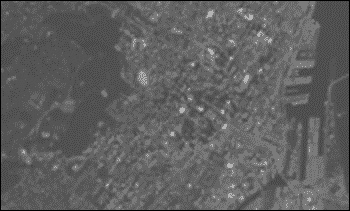

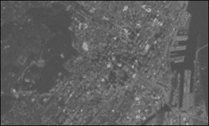

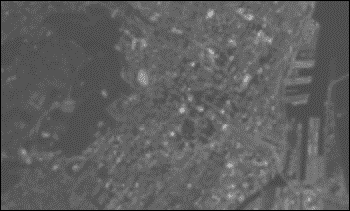

Lanczos 插值：

线性插值：

最近邻插值：

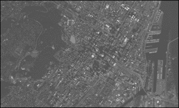

最后，看看 8 波段，全色波段，15 米分辨率，作为参考：

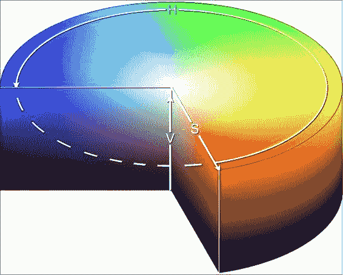

**全色增强**

通过重采样，我们能够生成像素为 15 米的图像，但在图像中对象的细节上我们取得了很少的改进。

为了克服这一限制，可以使用一种称为**全色增强**的技术来生成具有更好分辨率的彩色图像。其原理是使用全色波段（Landsat 波段 8）来提高合成图像的分辨率。

在这里，我们将使用一种方法，该方法包括将图像的颜色表示从 RGB 转换为 HSV——色调、饱和度、亮度。

如图像所示，值分量可以解释为颜色的亮度或强度。因此，在颜色表示转换后，值分量可以用更高分辨率的全色波段替换，从而得到具有更好定义的图像。

要做到这一点，我们需要使用 RGB 波段创建真彩色合成，就像我们之前做的那样，但这次使用的是重采样图像。然后我们改变颜色表示，替换值分量，将颜色表示转换回 RGB，并将图像保存到磁盘。

1. 由于我们大部分函数已经准备好了，首先编辑 if __name__ ==

'__main__': block. 删除旧的测试并添加此代码：

if __name__ == '__main__':

base_path = "../../data/landsat/"

base_name = 'LC80140282015270LGN00_B'

bands_numbers = [2, 3, 4]

bands_paths = itertools.imap(

compose_band_path,

itertools.repeat(base_path),

itertools.repeat(base_name),

bands_numbers)

output_images = list(itertools.imap(

compose_band_path,

itertools.repeat("../output/"),

itertools.repeat("15m_B"),

bands_numbers))

# 1) 重采样 RGB 波段。

for source, destination in zip(bands_paths, output_images): resample_image(source, destination, block_height=200)

# 2) 使用重采样波段创建真彩色合成。

# 这张图像仅用于比较。

create_color_composition(list(output_images),

'../output/preview_resampled_composition.tif',

(4209, 11677, 348, 209))

# 3) 裁剪所有波段。

output_images.append(

"../../data/landsat/LC80140282015270LGN00_B8.TIF") for source in output_images:

crop_and_save(source)

# 4) 使用裁剪后的图像进行全色增强。

band8 = "../output/preview__LC80140282015270LGN00_B8.TIF"

bgr_bands = itertools.imap(

compose_band_path,

itertools.repeat("../output/"),

itertools.repeat("preview__15m_B"),

bands_numbers)

pan_sharpen(list(bgr_bands),

band8, "../output/pan_sharpened.tif")

生成包含文件名的迭代器的过程与之前使用的方法相同。

在第一部分，RGB 波段的重采样将使用默认的线性插值。

在第二部分，我们将使用重采样的 RGB 波段创建真彩色组合。

我们不会使用这张图像进行全色增强；我们创建它只是为了比较结果。

在第三部分，我们裁剪了所有波段。通过这样做，我们也在调整灰度值的从 16 位到 8 位的值。最后，在第四部分执行全色增强。

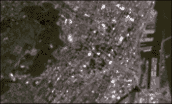

2. 现在将 pan_sharpen 函数添加到您的文件中：

def pan_sharpen(bgr_bands, pan_band, out_img):

bgr_arrays = []

# 将图像读入 Numpy 数组。

for item in bgr_bands:

array = cv.imread(item, flags=cv.CV_LOAD_IMAGE_GRAYSCALE)

bgr_arrays.append(array)

pan_array = cv.imread(pan_band, flags=cv.CV_LOAD_IMAGE_GRAYSCALE)

# 创建 RGB（BGR）组合并将其转换为 HSV。

bgr_composition = np.dstack(bgr_arrays)

hsv_composition = cv.cvtColor(bgr_composition, cv.COLOR_BGR2HSV)

# 拆分波段并删除原始值分量，

# 我们不会使用它。

h, s, v = np.dsplit(hsv_composition, 3)

h, s = np.squeeze(h), np.squeeze(s)

删除 v

# 使用全色波段作为 V 分量。

pan_composition = np.dstack((h, s, pan_array))

# 将图像转换回 BGR 并写入磁盘。

bgr_composition = cv.cvtColor(pan_composition, cv.COLOR_HSV2BGR) cv.imwrite(out_img, bgr_composition)

该过程很简单。波段的连接和拆分是通过 NumPy 的 dstack 和 dsplit 函数完成的。颜色转换是通过 cvtcolor 函数完成的。请注意，OpenCV 使用 BGR 波段序列而不是 RGB。

3. 运行代码并在输出文件夹中打开彩色组合以查看结果。

重采样的组合：

全色增强的图像：

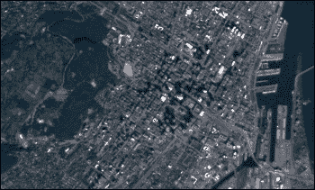

我可以说我们取得了令人印象深刻的成果。全色增强的图像非常清晰，我们可以很容易地识别出图像上的城市特征。

**总结**

在本章中，我们看到了如何将任务分配到多个处理器核心，从而使程序能够使用所有可用的计算能力。

尽管并行处理是一种很好的资源，但我们在示例中发现它并不适用于所有情况。具体来说，当瓶颈不是 CPU 时，多进程可能会降低程序速度。

在我们的示例过程中，我们使用了低分辨率卫星图像，并通过重采样和全色增强，提高了它们的分辨率和细节水平，从而获得了对视觉分析具有更高价值的图像。

**索引**

**A**

抽象 / 使数据同质化

关于 / 抽象概念

高级机载热辐射和反射辐射计 (ASTER) /

处理遥感图像和数据

颜色混合 / 混合图像

应用

与应用集成 / 与应用集成

所有国家的面积

计算 / 转换坐标系并计算所有国家的面积

国家

属性和关系

通过 / 通过属性和关系进行过滤

属性值

获取 / 获取属性值

**B**

波段 / 处理遥感图像和数据

基本统计信息，栅格数据

关于 / 获取基本统计信息

数据，准备 / 准备数据

简单信息，打印 / 打印简单信息

输出信息，格式化 / 格式化输出信息

计算四分位数，直方图和其他统计信息 / 计算四分位数、直方图和其他统计信息

计算直方图，直方图和其他统计信息 / 计算四分位数、直方图和其他统计信息

其他统计信息，计算 / 计算四分位数、直方图和其他

统计

创建，懒属性 / 使统计成为懒属性

块迭代

关于 / 块迭代

书籍项目

创建 / 创建书籍项目

**C**

最近点

搜索 / 查找最近点

代码注释

关于 / 记录您的代码

代码分析

关于 / 代码分析

彩色分类图像

创建 / 创建颜色分类图像

为地图选择正确的颜色 / 为地图选择正确的颜色

上下文管理器 / 从 URL 下载数据

坐标系

转换 / 转换坐标系并计算所有国家的面积

所有国家

国家

按面积大小排序 / 按面积大小排序国家

当前位置

设置 / 设置您的当前位置

**D**

数据

使数据同质化 / 使数据同质化

导入 / 生成表格并导入数据

过滤 / 过滤数据

搜索数据，交叉信息 / 搜索数据和交叉信息

过滤，使用的边界 / 使用边界进行过滤

数据库

信息，存储在 / 在数据库中存储信息

用真实数据填充 / 用真实数据填充数据库

数据库插入

优化 / 优化数据库插入

数据解析

优化 / 优化数据解析

数字高程模型 (DEM)

关于 / 处理遥感图像和数据

参考 / 处理遥感图像和数据

文档字符串

关于 / 文档化你的代码

**E**

ElementTree / 用真实数据填充数据库

ESRI 形状文件 / 表示地理数据

执行时间

测量 / 测量执行时间

**F**

文件

打开 / 打开文件并获取其内容

内容，获取 / 打开文件并获取其内容

内容，准备分析 / 准备内容以进行分析

过滤器

链接 / 链接过滤器

第一个示例

编程 / 编程和运行第一个示例

运行 / 编程和运行第一个示例

函数

组合，到应用程序中 / 将函数组合到应用程序中

**G**

GDAL

关于 / 安装 GDAL 和 OGR

安装，在 Windows 上 / Windows

安装，在 Ubuntu Linux 上 / Ubuntu Linux

地理藏宝点

抽象 / 抽象地理藏宝点

地理藏宝应用程序

基本应用程序结构，构建 / 构建基本应用程序结构

应用程序树结构，创建 / 创建应用程序树结构

函数 / 函数和方法

方法 / 函数和方法

代码，文档化 / 文档化你的代码

应用程序入口点，创建 / 创建应用程序入口点

地理藏宝数据

下载 / 下载地理藏宝数据

直接下载 / 下载地理藏宝数据

REST API / 下载地理藏宝数据

数据源 / 地理藏宝数据源

信息，从 REST API 获取 / 从 REST API 获取信息

从 URL 下载 / 从 URL 下载数据

手动下载 / 手动下载数据

下载链接 / 手动下载数据

抽象 / 抽象地理藏宝数据

导入 / 导入地理藏宝数据

GPX 属性，读取 / 读取 GPX 属性

同质数据，返回 / 返回同质数据

转换，为 Geocache 对象 / 将数据转换为 Geocache 对象

多个来源，合并 / 合并多个数据来源

GeoDjango / 创建对象关系映射

地理数据

表示 / 表示地理数据

几何形状

表示 / 表示几何形状

几何关系

关于 / 几何关系

接触 / 接触

交叉 / 交叉

包含 / 包含

在内 / 在内部

等于或几乎等于 / 等于或几乎等于

相交 / 相交

不相交 / 不相交

地理对象

导出 / 导出地理对象

全局解释器锁 (GIL)

全景锐化 / 多进程基础

GPX 格式 / 表示地理数据

**H**

硬件瓶颈 / 图像重采样

阴影渲染 / 创建阴影渲染图像

直方图

用于地图着色 / 使用直方图着色图像

**I**

IDE

关于 / 安装 IDE

安装 / 安装 IDE

在 Windows 上安装 / Windows

在 Linux 上安装 / Linux

图像组合

创建 / 创建图像组合

真彩色组合 / 真彩色组合

特定区域，处理 / 处理特定区域

假彩色组合 / 假彩色组合

图像处理管道

构建 / 构建图像处理管道

图像分辨率

提高 / 提高图像分辨率

图像重采样 / 图像重采样

全景锐化 / 全景锐化

图像

表示 / 理解图像的表示方式

打开，使用 OpenCV / 使用 OpenCV 打开图像

数值类型 / 了解数值类型

混合 / 混合图像

内存使用 / 内存和图像

分块处理 / 分块处理图像

打开，GDAL 使用 / 使用 GDAL 打开图像

遍历整个图像 / 遍历整个图像

迭代器 / 遍历整个图像

迭代器 / 遍历整个图像

**J**

Java 拓扑套件 (JTS)

关于 / 使用 Shapely 处理几何形状

JSON (JavaScript Object Notation) / 表示地理数据

**L**

Landsat 8 图像

关于 / 获取 Landsat 8 图像

获取 / 获取 Landsat 8 图像

懒加载 / 将统计信息转换为懒属性

线条

导入 / 导入线条

Linux

IDE，安装 / Linux

**M**

Map Maker 应用程序

创建 / 创建 Map Maker 应用程序

使用 PythonDatasource / 使用 PythonDatasource

使用过滤功能 / 使用应用程序进行过滤

Mapnik

关于 / 安装 Mapnik，Windows，了解 Mapnik

安装 / 安装 Mapnik

在 Windows 上安装 / Windows

在 Ubuntu Linux 上安装 / Ubuntu Linux

使用 / 了解 Mapnik 进行实验

使用纯 Python 制作地图 / 使用纯 Python 制作地图

使用样式表制作地图 / 使用样式表制作地图

地图

样式化 / 样式化地图

样式选项 / 样式化地图

添加图层 / 向地图添加图层

大量数据

导入 / 导入大量数据

缓存 / 将统计信息转换为懒属性

记忆化 / 转换空间参考系统和单位

瓦片拼接 / 拼接图像

多个属性

通过多个属性过滤 / 通过多个属性过滤

多进程

基础 / 多进程基础

关于 / 多进程基础

**N**

新功能

集成到应用程序中 / 将新功能集成到应用程序中

Noun Project

参考 / 点样式

Numpy

关于 / 安装 NumPy

安装 / 安装 NumPy

在 Windows 上安装 / Windows

在 Ubuntu Linux 上安装 / Ubuntu Linux

Numpy 文档

参考 / 瓦片拼接图像

**O**

对象关系映射 (ORM)

创建 / 创建对象关系映射

环境，准备 / 准备环境

模型，更改 / 更改我们的模型

管理器，自定义 / 自定义管理器

OGR 驱动程序

关于 / 安装 GDAL 和 OGR

Opencaching 节点 / Geocaching 数据源

Open Computer Vision (OpenCV) 软件包 / 自动预览地图

OpenCV

关于 / OpenCV

开放地理空间联盟 (OGC)

关于 / 了解知名文本

OpenStreetMap / 表示几何形状

OpenStreetMap 的兴趣点

导入 / 导入 OpenStreetMap 的兴趣点

OpenStreetMap 维基

URL / 搜索数据和交叉信息

操作性陆地成像仪 (OLI) / 处理卫星图像

其他软件包

从 pip 安装 / 直接从 pip 安装其他软件包

安装，在 Windows 上 / Windows

安装，在 Ubuntu Linux 上 / Ubuntu Linux

Overpass API / 导入 OpenStreetMap 的兴趣点

**P**

绘图模型 / 多边形样式

全色增强 / 全色增强

PEP-8

关于 / 转换坐标系并计算所有区域的面积

国家

URL / 转换坐标系并计算所有区域的面积

国家

像素

关于 / 了解图像的表示方式

兴趣点 (POI) / 导入 OpenStreetMap 的兴趣点

多边形

使用 / 处理多边形

导入 / 导入多边形

Postgis 扩展 / 在数据库中存储信息

PostgreSQL

URL / 在数据库中存储信息

PostgreSQL 数据库 / 在数据库中存储信息

Poços de Caldas / 处理遥感图像和数据

处理管道 / 构建图像处理管道

性能分析 / 测量执行时间

Python

安装 / 安装 Python

安装，在 Windows 上 / Windows

安装，在 Ubuntu Linux 上 / Ubuntu Linux

Python 术语表

参考 / 使用 Python 对象作为数据源

Python 对象

作为数据源使用 / 使用 Python 对象作为数据源

Python 软件包

关于 / Python 软件包和软件包管理器

软件包管理器 / Python 软件包和软件包管理器

存储库，在 Windows 上 / Windows 的 Python 软件包存储库

安装 / 安装软件包和所需软件

所需软件 / 安装软件包和所需软件

安装，在 Windows 上 / Windows

安装，在 Ubuntu Linux 上 / Ubuntu Linux

**R**

栅格数据

基本统计 / 获取基本统计信息

RasterData 类

创建 / 创建 RasterData 类

高程阴影 / 创建阴影高程图像

遥感图像

处理 / 处理遥感图像和数据

拼接 / 拼接图像

值，调整 / 调整图像的值

裁剪 / 裁剪图像

阴影高程图像，创建 / 创建阴影高程图像

REST (表示性状态传输) / 下载地理藏宝数据

reStructuredText

参考 / 记录你的代码

**S**

卫星图像

关于 / 处理卫星图像

处理 / 处理卫星图像

可伸缩矢量图形 (SVG) 文件 / 点样式

Shapely

关于 / 安装 Shapely， 使用 Shapely 处理几何形状

在 Windows 上安装 / Windows

在 Ubuntu Linux 上安装 / Ubuntu Linux

处理几何形状 / 使用 Shapely 处理几何形状

意面数据 / 表示几何形状

Spatialite 扩展 / 在数据库中存储信息

空间参考系统

单位，转换 / 转换空间参考系统和单位

SpatiLite / 表示地理数据

SQLite 数据库 / 在数据库中存储信息

统计

以颜色显示 / 用颜色显示统计数据

样式选项，地图

地图样式 / 地图样式

多边形样式 / 多边形样式

线样式 / 线样式

文本样式 / 文本样式

点样式 / 点样式

SVG 转换

参考 / 点样式

**T**

表格

生成 / 生成表格和导入数据

测试数据

删除 / 删除测试数据

热红外传感器 (TIRS) / 处理卫星图像

TIFF 格式 / 块迭代

**U**

美国地质调查局 (USGS) 地球探索者 / 获取 Landsat 8 图像

Ubuntu

URL / 在数据库中存储信息

Ubuntu Linux

Python，安装 / Ubuntu Linux

Python 软件包，安装 / Ubuntu Linux

Numpy，安装 / Ubuntu Linux

GDAL，安装 / Ubuntu Linux

Mapnik，安装 / Ubuntu Linux

Shapely，安装 / Ubuntu Linux

其他包，安装 / Ubuntu Linux

通用函数

创建，用于生成地图 / 创建生成地图的实用函数

数据源，运行时更改 / 运行时更改数据源

地图，自动预览 / 自动预览地图

**W**

已知二进制 (WKB)

关于 / 了解已知文本

已知文本 (WKT)

关于 / 了解已知文本

Windows

Python，安装 / Windows

Python 包，安装 / Windows

Numpy，安装 / Windows

GDAL，安装 / Windows

Mapnik，安装 / Windows

Shapely，安装 / Windows

其他包，安装 / Windows

IDE，安装 / Windows

# 文档大纲

+   使用 Python 通过示例进行地理空间开发

+   致谢

+   关于作者

+   关于审稿人

+   www.PacktPub.com

+   支持文件、电子书、折扣优惠等

+   为什么要订阅？

+   Packt 账户持有者的免费访问

+   前言

+   本书涵盖的内容

+   本书所需内容

+   本书面向的对象

+   约定

+   读者反馈

+   客户支持

+   下载示例代码

+   下载本书的颜色图像

+   勘误表

+   盗版

+   问题

+   1. 准备工作环境

+   安装 Python

+   Windows

+   Ubuntu Linux

+   Python 包和包管理器

+   Windows 的 Python 包仓库

+   安装包和所需软件

+   OpenCV

+   Windows

+   Ubuntu Linux

+   安装 NumPy

+   Windows

+   Ubuntu Linux

+   安装 GDAL 和 OGR

+   Windows

+   Ubuntu Linux

+   安装 Mapnik

+   Windows

+   Ubuntu Linux

+   安装 Shapely

+   Windows

+   Ubuntu Linux

+   直接从 pip 安装其他包

+   Windows

+   Ubuntu Linux

+   安装集成开发环境

+   Windows

+   Linux

+   创建书籍项目

+   编程和运行第一个示例

+   转换坐标系并计算所有国家的面积

+   按面积大小排序国家

+   总结

+   2. 地理藏宝应用

+   构建基本应用程序结构

+   创建应用程序树结构

+   函数和方法

+   记录你的代码

+   创建应用程序入口点

+   下载地理藏宝数据

+   地理藏宝数据源

+   从 REST API 获取信息

+   从 URL 下载数据

+   手动下载数据

+   打开文件并获取其内容

+   准备分析内容

+   将函数组合到应用程序中

+   设置你的当前位置

+   找到最近点

+   总结

+   3. 结合多个数据源

+   表示地理数据

+   表示几何形状

+   使数据同质化

+   抽象的概念

+   抽象化地理藏宝点

+   抽象化地理藏宝数据

+   导入地理藏宝数据

+   读取 GPX 属性

+   返回同质数据

+   将数据转换为地理藏宝对象

+   合并多个数据源

+   将新功能集成到应用程序中

+   总结

+   改进应用搜索功能

+   处理多边形

+   了解知名文本

+   使用 Shapely 处理几何形状

+   导入多边形

+   获取属性值

+   导入线条

+   转换空间参考系统和单位

+   几何关系

+   接触点

+   交叉

+   包含

+   内部

+   等于或几乎等于

+   相交

+   不连接

+   按属性和关系过滤

+   按多个属性过滤

+   链式过滤

+   与应用程序集成

+   摘要

+   5. 制作地图

+   了解 Mapnik

+   使用纯 Python 制作地图

+   使用样式表制作地图

+   创建生成地图的实用函数

+   在运行时更改数据源

+   自动预览地图

+   样式化地图

+   地图样式

+   多边形样式

+   线样式

+   文本样式

+   向地图添加图层

+   点样式

+   使用 Python 对象作为数据源

+   导出地理对象

+   创建 Map Maker 应用

+   使用 PythonDatasource

+   使用带有过滤的应用程序

+   摘要

+   6. 与遥感图像一起工作

+   理解图像的表示方式

+   使用 OpenCV 打开图像

+   了解数值类型

+   处理遥感图像和数据

+   镶嵌图像

+   调整图像的值

+   裁剪图像

+   创建阴影地形图

+   构建图像处理管道

+   创建 RasterData 类

+   摘要

+   7. 从栅格数据中提取信息

+   获取基本统计数据

+   准备数据

+   打印简单信息

+   格式化输出信息

+   计算四分位数、直方图和其他统计数据

+   使统计数据成为懒属性

+   创建颜色分类图像

+   为地图选择合适的颜色

+   混合图像

+   用颜色显示统计数据

+   使用直方图对图像进行着色

+   摘要

+   8. 数据挖掘应用

+   测量执行时间

+   代码分析

+   在数据库上存储信息

+   创建对象关系映射

+   准备环境

+   改变我们的模型

+   自定义管理器

+   生成表格并导入数据

+   过滤数据

+   导入大量数据

+   优化数据库插入

+   优化数据解析

+   导入 OpenStreetMap 的兴趣点

+   移除测试数据

+   用真实数据填充数据库

+   搜索数据和交叉信息

+   使用边界进行过滤

+   摘要

+   9. 处理大图像

+   处理卫星图像

+   获取 Landsat 8 图像

+   内存和图像

+   分块处理图像

+   使用 GDAL 打开图像

+   遍历整个图像

+   创建图像组合

+   真彩色组合

+   处理特定区域

+   假彩色组合

+   摘要

+   10. 并行处理

+   多进程基础

+   块迭代

+   提高图像分辨率

+   图像重采样

+   全色增强

+   摘要

+   索引
