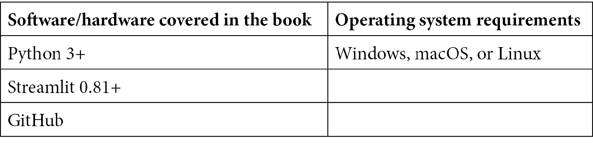

# 前言

在 2010 年代，数据科学家和机器学习工程师主要做的是静态分析。我们创建文档来为决策提供依据，文档中充满了关于我们发现的图表和度量数据，或者是我们创建的模型。创建完整的 Web 应用程序，让用户与分析结果互动，至少可以说是繁琐的！Streamlit 出现了，它是一个为数据工作者在每个步骤中着想而设计的 Python 库，用于创建 Web 应用程序。

Streamlit 缩短了数据驱动型 Web 应用程序的开发时间，使数据科学家能够在几小时内，而非几天，使用 Python 创建 Web 应用原型。

本书采用实践操作的方法，帮助你学习一些技巧和窍门，让你迅速掌握 Streamlit。你将从创建一个基本应用开始学习 Streamlit 的基础知识，并逐步在此基础上，制作高质量的图形数据可视化，并测试机器学习模型。随着章节的深入，你将通过个人和工作相关的数据驱动型 Web 应用的实际示例，逐步学习使用 Streamlit 组件、美化应用程序以及快速部署新应用程序等更复杂的主题。

# 本书的读者对象

本书面向数据科学家和机器学习工程师或爱好者，他们希望使用 Streamlit 创建 Web 应用。无论你是一个初级数据科学家，想通过部署第一个机器学习项目来提升简历，还是一个高级数据科学家，致力于通过动态分析说服同事，本书都适合你！

# 本书内容概述

*第一章*，*Streamlit 入门*，通过创建你的第一个应用程序来教授 Streamlit 的基本知识。

*第二章*，*上传、下载和处理数据*，介绍了数据；数据应用需要数据！我们将在这里学习如何在生产应用中高效、有效地使用数据。

*第三章*，*数据可视化*，教授如何在 Streamlit 应用中使用你最喜欢的 Python 可视化库。无需学习新的可视化框架！

*第四章*，*使用 Streamlit 与机器学习*，涵盖了机器学习。曾经想在几个小时内将你新建的炫酷机器学习模型部署到面向用户的应用中吗？从这里开始，获取深入的示例和技巧。

*第五章*，*使用 Streamlit Sharing 部署 Streamlit*，介绍了 Streamlit 的一键部署功能。我们将在这里学习如何简化部署过程！

*第六章*，*美化 Streamlit 应用*，介绍了 Streamlit 提供的丰富功能，帮助你制作精美的网页应用。在这一章中，我们将学习所有的技巧和窍门。

*第七章*，*探索 Streamlit 组件*，教授如何通过开源集成（称为 Streamlit 组件）利用 Streamlit 周围蓬勃发展的开发者生态系统。就像乐高玩具，只不过更好。

*第八章*，*使用 Heroku 和 AWS 部署 Streamlit 应用*，教授如何使用 AWS 和 Heroku 来部署 Streamlit 应用，作为 Streamlit Sharing 的替代方案。

*第九章*，*通过 Streamlit 提升求职申请*，将帮助你使用 Streamlit 应用向雇主展示你的数据科学能力，包括从简历生成应用到面试的带回家任务应用。

*第十章*，*数据项目 – 在 Streamlit 中进行原型设计项目*，讲述了如何为 Streamlit 社区和其他用户制作应用程序，既有趣又富有教育意义。我们将通过一些项目示例，帮助你学习如何开始自己的项目。

*第十一章*，*为团队使用 Streamlit*，讲解如何使用 Streamlit 产品 Streamlit for Teams 部署私有的 Streamlit 仓库并强制执行用户身份验证。

*第十二章*，*Streamlit 高级用户*，提供了更多关于 Streamlit 的信息，尽管这是一个相对年轻的库，但它已经得到了广泛应用。从 Streamlit 创始人、数据科学家、分析师和工程师的深入访谈中学习最前沿的知识。

# 为了充分利用本书

本书假设你至少是一个 Python 初学者，这意味着你已经熟悉基本的 Python 语法，并且之前有学习过 Python 的教程或课程。本书也面向对数据科学感兴趣的用户，涉及统计学和机器学习等主题，但不要求具备数据科学背景。如果你知道如何创建列表、定义变量，并且之前写过`for`循环，那么你已经具备足够的 Python 知识，可以开始本书的学习了！



**如果你正在使用本书的数字版，我们建议你自己输入代码或从本书的 GitHub 仓库访问代码（下一个章节中会提供链接）。这样做可以帮助你避免因复制粘贴代码而可能出现的错误。**

# 下载示例代码文件

你可以从 GitHub 下载本书的示例代码文件，访问 [`github.com/tylerjrichards/Getting-Started-with-Streamlit-for-Data-Science`](https://github.com/tylerjrichards/Getting-Started-with-Streamlit-for-Data-Science) 或通过 Packt 的 GitHub 访问 [`github.com/PacktPublishing/Getting-Started-with-Streamlit-for-Data-Science`](https://github.com/PacktPublishing/Getting-Started-with-Streamlit-for-Data-Science)。如果代码有更新，它将会在这些 GitHub 仓库中更新。

我们还有其他代码包，来自我们丰富的书籍和视频目录，访问 [`github.com/PacktPublishing/`](https://github.com/PacktPublishing/)。欢迎查看！

# 下载彩色图片

我们还提供了一份 PDF 文件，里面包含了本书中使用的截图和图表的彩色图片。你可以在此下载：[`static.packt-cdn.com/downloads/9781800565500_ColorImages.pdf`](https://static.packt-cdn.com/downloads/9781800565500_ColorImages.pdf)。

# 使用的约定

本书中使用了许多文本约定。

`文本中的代码`：表示文本中的代码单词、数据库表名、文件夹名称、文件名、文件扩展名、路径名、虚拟网址、用户输入和 Twitter 账号。例如：格式应为 `ec2-10-857-84-485.compute-1.amazonaws.com`。这些数字是我编造的，你的应该与此类似。

代码块按如下方式设置：

```py
import pandas as pd 
penguin_df = pd.read_csv('penguins.csv')
print(penguin_df.head())
```

所有命令行输入或输出都按以下方式书写：

```py
git add .
git commit -m 'added heroku files'
git push
```

**粗体**：表示新术语、重要单词或屏幕上显示的词语。例如，菜单或对话框中的词语通常会以**粗体**显示。以下是一个例子：我们将使用**Amazon Elastic Compute Cloud**，简称**Amazon EC2**。

提示或重要说明

如下所示。

# 联系我们

我们欢迎读者的反馈。

**一般反馈**：如果你对本书的任何方面有疑问，请通过 [customercare@packtpub.com](https://customercare@packtpub.com) 给我们发送电子邮件，并在邮件主题中注明书名。

**勘误**：尽管我们已尽最大努力确保内容的准确性，但错误仍然可能发生。如果你在本书中发现了错误，我们将非常感激你能报告给我们。请访问 [www.packtpub.com/support/errata](https://www.packtpub.com/support/errata) 并填写表单。

**盗版**：如果你在互联网上发现任何我们作品的非法复制形式，请提供该位置地址或网站名称。请通过 [copyright@packt.com](https://copyright@packt.com) 联系我们，并附上相关材料的链接。

**如果你有兴趣成为作者**：如果你在某个领域有专长，并且有兴趣撰写或参与书籍创作，请访问 [authors.packtpub.com](https://authors.packtpub.com)。

# 分享你的想法

阅读完*《Streamlit 数据科学入门》*后，我们非常希望听到你的想法！请[点击这里直接进入亚马逊书评页面](https://packt.link/r/1-800-56550-X)并分享你的反馈。

你的评价对我们和技术社区非常重要，将帮助我们确保提供优质的内容。
