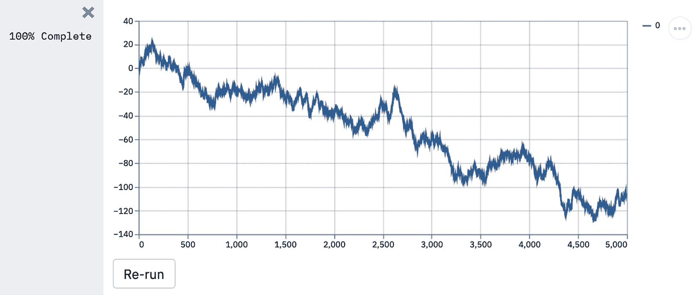

# 第一章：*第一章*：Streamlit 入门

Streamlit 是一个 Web 应用框架，帮助你构建和开发基于 Python 的 Web 应用，这些应用可以用来共享分析结果、构建复杂的交互体验并展示新的机器学习模型。更重要的是，开发和部署 Streamlit 应用非常快速且灵活，通常将应用开发的时间从几天缩短为几个小时。

在本章中，我们将从 Streamlit 的基础知识开始。我们将学习如何下载和运行示例 Streamlit 应用，如何使用自己的文本编辑器编辑示例应用，如何组织我们的 Streamlit 应用，最后，如何制作我们自己的应用。然后，我们将探索 Streamlit 中的数据可视化基础。我们将学习如何接受一些初始用户输入，并通过文本为我们的应用添加一些修饰。在本章结束时，你应该能够轻松地开始制作自己的 Streamlit 应用！

具体来说，我们将涵盖以下主题：

+   为什么选择 Streamlit？

+   安装 Streamlit

+   组织 Streamlit 应用

+   Streamlit 绘图示例

+   从零开始制作应用程序

在我们开始之前，我们将先了解技术要求，确保我们拥有开始所需的一切。

# 技术要求

以下是本章所需的安装和设置：

+   本书的要求是下载 Python 3.7（或更高版本）（[`www.python.org/downloads/`](https://www.python.org/downloads/)），并且需要一个文本编辑器来编辑 Python 文件。任何文本编辑器都可以。我使用 Sublime（[`www.sublimetext.com/3`](https://www.sublimetext.com/3)）。

+   本书的某些部分使用了 GitHub，建议拥有一个 GitHub 账号（[`github.com/join`](https://github.com/join)）。了解如何使用 Git 对于本书不是必须的，但始终有帮助。如果你想入门，这个链接有一个有用的教程：[`guides.github.com/activities/hello-world/`](https://guides.github.com/activities/hello-world/)。

+   对 Python 的基本理解对本书也非常有用。如果你还没有达到这个水平，欢迎通过这个教程（[`docs.python.org/3/tutorial/`](https://docs.python.org/3/tutorial/)）或其他任何免费的教程来更好地了解 Python，准备好后再回来这里。我们还需要安装 Streamlit 库，我们将在后面的*安装 Streamlit*部分进行安装和测试。

# 为什么选择 Streamlit？

在过去十年里，数据科学家已成为公司和非营利组织日益重要的资源。他们帮助做出数据驱动的决策，使流程更加高效，并通过实施机器学习模型来在可重复的规模上改进这些决策。数据科学家面临的一个痛点是在发现新见解或创建新模型后，如何向同事展示动态结果、新模型或复杂的分析内容？他们可以发送静态的可视化图表，这在某些情况下有效，但对于需要构建多个步骤的复杂分析，或任何需要用户输入的情况就不适用了。另一种方法是创建一个结合文本和可视化的 Word 文档（或将 Jupyter notebook 导出为文档），但这同样无法处理用户输入，而且也更难以重复。还有一种选择是使用 Flask 或 Django 等框架从头开始构建一个完整的 Web 应用程序，然后再弄清楚如何将整个应用部署到 AWS 或其他云服务提供商上。但这些方法都不算理想。许多方法都比较慢，不能接收用户输入，或者对数据科学中至关重要的决策过程的支持不足。

介绍 Streamlit。Streamlit 旨在提供速度和互动性。它是一个帮助你构建和开发 Python Web 应用程序的框架。它内置了便捷的用户输入方法、使用最流行和强大的 Python 图形库进行绘图的方法，并能迅速将图表部署到 Web 应用程序中。

我在过去的一年里构建了各种不同类型的 Streamlit 应用，从个人作品集的数据项目，到为数据科学带回家的问题构建快速应用，甚至还为工作中的可重复分析构建了迷你应用。我真心相信，Streamlit 对你和你的工作将和对我一样有价值，所以我写了这篇文章，帮助你快速上手，以便你能够加速学习曲线，在几分钟或几个小时内构建 Web 应用，而不是花费几天的时间。如果这对你有帮助，接着往下看！我们将分为三个部分进行学习，从介绍 Streamlit 开始，逐步让你掌握如何构建自己的基础 Streamlit 应用。在第二部分，我们将扩展这一知识，探讨更高级的话题，例如生产环境部署方法，以及如何使用 Streamlit 社区创建的组件，打造更美观且实用的 Streamlit 应用。最后，在第三部分，我们将重点采访那些在工作、学术界以及学习数据科学技术中使用 Streamlit 的高级用户。在我们开始之前，我们需要先设置 Streamlit，并讨论本书其余部分示例的结构。

# 安装 Streamlit

为了运行任何 Streamlit 应用，你必须先安装 Streamlit。我使用了一种名为 pip 的包管理器来安装它，但你也可以使用任何你选择的包管理器（例如，**brew**）。本书使用的 Streamlit 版本是 0.81，Python 版本是 3.7，但它也应该适用于更新的版本。

在本书中，我们将混合使用终端命令和 Python 脚本中的代码。我们会在每个代码位置标明运行的环境，以便尽可能清晰。要安装 Streamlit，请在终端中运行以下代码：

```py
pip install streamlit
```

现在我们已经下载了 Streamlit，我们可以直接在命令行中使用上述代码来启动 Streamlit 的`demo.streamlit hello`。

花些时间浏览 Streamlit 的演示，看看你觉得有趣的任何代码！我们将借用并编辑绘图演示背后的代码，*它展示了 Streamlit 结合绘图和动画的应用*。在我们深入之前，让我们先讨论一下如何组织 Streamlit 应用。

# 组织 Streamlit 应用

本书中我们创建的每个 Streamlit 应用都应该包含在各自的文件夹中。虽然很容易为每个 Streamlit 应用创建新的文件，但这会养成一个坏习惯，等我们讨论如何部署 Streamlit 应用时，会遇到权限和数据方面的问题。

对于本书，我建议你创建一个专用的文件夹来存放你在本书中创建的所有应用。我把它命名为`streamlit_apps`。以下命令会创建一个名为`streamlit_apps`的新文件夹，并将其设置为当前工作目录：

```py
mkdir streamlit_apps
cd streamlit_apps
```

本书的所有代码都可以在[`github.com/tylerjrichards/Getting-Started-with-Streamlit-for-Data-Science`](https://github.com/tylerjrichards/Getting-Started-with-Streamlit-for-Data-Science)找到，但我强烈推荐你亲自动手编写代码来练习。

# Streamlit 绘图演示

首先，我们将开始学习如何制作 Streamlit 应用，通过重新制作我们之前在 Streamlit 演示中看到的绘图示例，并使用我们自己编写的 Python 文件。为此，我们将执行以下操作：

1.  创建一个 Python 文件来存放我们所有的 Streamlit 代码。

1.  使用演示中提供的绘图代码。

1.  进行小幅修改以进行练习。

1.  在本地运行我们的文件。

我们的第一步是创建一个名为`plotting_app`的文件夹，用来存放我们的第一个示例。以下代码将在终端运行时创建这个文件夹，将我们的工作目录切换到`plotting_app`，并创建一个空的 Python 文件，我们将其命名为`plot_demo.py`：

```py
mkdir plotting_app
cd plotting_app
touch plot_demo.py
```

现在我们已经创建了一个名为`plot_demo.py`的文件，使用任何文本编辑器打开它（如果你还没有选择编辑器，我个人推荐 Sublime ([`www.sublimetext.com/`](https://www.sublimetext.com/))）。打开后，将以下代码复制粘贴到`plot_demo.py`文件中：

```py
import streamlit as st
import time
import numpy as np
progress_bar = st.sidebar.progress(0)
status_text = st.sidebar.empty()
last_rows = np.random.randn(1, 1)
chart = st.line_chart(last_rows)
for i in range(1, 101):
    new_rows = last_rows[-1, :] + np.random.randn(5, 1).cumsum(axis=0)
    status_text.text("%i%% Complete" % i)
    chart.add_rows(new_rows)
    progress_bar.progress(i)
    last_rows = new_rows
    time.sleep(0.05)
progress_bar.empty()
# Streamlit widgets automatically run the script from top to bottom. Since
# this button is not connected to any other logic, it just causes a plain
# rerun.
st.button("Re-run")
```

这段代码做了几件事。首先，它导入了所有需要的库，并在 Streamlit 的原生图形框架中创建了一个折线图，起始点是从正态分布中随机抽取的一个数字，均值为 0，方差为 1。接着，它运行一个`for`循环，持续以每次 5 个数字的批次抽取新随机数，并将其加到之前的总和中，同时等待二十分之一秒，以便让我们看到图表的变化，模拟动画效果。

到本书结束时，你将能够非常快速地制作像这样的应用。但现在，我们可以在本地运行它，在终端输入以下代码：

```py
streamlit run plot_demo.py
```

这应该会在默认的网页浏览器中打开一个新标签页，显示你的应用。我们应该能看到我们的应用运行，效果如下图所示：



图 1.1 – 绘图演示输出

我们将通过先调用`streamlit run`并指向包含我们应用代码的 Python 脚本来运行每个 Streamlit 应用。现在让我们在应用中做些小改动，更好地理解 Streamlit 的工作原理。以下代码更改了我们在图表上绘制随机数的数量，但你也可以自由做任何你想要的修改。使用以下代码进行更改，在你选择的文本编辑器中保存这些更改，并再次运行文件：

```py
import streamlit as st
import time
import numpy as np
progress_bar = st.sidebar.progress(0)
status_text = st.sidebar.empty()
last_rows = np.random.randn(1, 1)
chart = st.line_chart(last_rows)
for i in range(1, 101):
    new_rows = last_rows[-1, :] + np.random.randn(50, 1).cumsum(axis=0)
    status_text.text("%i%% Complete" % i)
    chart.add_rows(new_rows)
    progress_bar.progress(i)
    last_rows = new_rows
    time.sleep(0.05)
progress_bar.empty()
# Streamlit widgets automatically run the script from top to bottom. Since
# this button is not connected to any other logic, it just causes a plain
# rerun.
st.button("Re-run")
```

你应该会注意到 Streamlit 检测到源文件发生了更改，并会提示你是否希望重新运行该文件。如果你愿意，点击**重新运行**（或者点击**总是重新运行**，如果你想让这种行为成为默认设置，我几乎总是这么做），然后观察你的应用发生变化。

随意尝试对绘图应用进行其他更改，熟悉它！当你准备好后，我们可以继续制作自己的应用。

# 从零开始制作应用

现在我们已经试过了别人做的应用，接下来让我们自己动手做一个！这个应用将重点使用中心极限定理，这是一个统计学的基本定理，指的是如果我们从任何分布中进行带放回的随机抽样足够多次，那么我们的样本均值的分布将近似正态分布。

我们不会通过应用来证明这一点，而是尝试生成几个图表，帮助解释中心极限定理的强大之处。首先，确保我们在正确的目录下（我们之前叫它`streamlit_apps`），然后创建一个名为`clt_app`的新文件夹，并放入一个新文件。

以下代码会创建一个名为`clt_app`的新文件夹，并再次创建一个空的 Python 文件，这次叫做`clt_demo.py`：

```py
mkdir clt_app
cd clt_app
touch clt_demo.py
```

每当我们启动一个新的 Streamlit 应用时，我们需要确保导入 Streamlit（在本书和其他地方通常使用别名`st`）。Streamlit 为每种内容类型（文本、图表、图片和其他媒体）提供了独特的函数，我们可以将它们作为构建所有应用的基础模块。我们将使用的第一个函数是`st.write()`，它是一个接受字符串（如后面所示，几乎可以接受任何 Python 对象，例如字典）的函数，并将其按调用顺序直接写入我们的 Web 应用。由于我们正在调用一个 Python 脚本，Streamlit 会顺序查看文件，每次看到一个函数时，就为该内容分配一个顺序位置。这使得使用起来非常简单，因为你可以写任何 Python 代码，当你希望某些内容出现在你创建的应用中时，只需使用`st.write()`，一切都准备好了。

在我们的`clt_demo.py`文件中，我们可以通过使用`st.write()`并编写以下代码，来实现基本的`'Hello World'`输出：

```py
import streamlit as st
st.write('Hello World')
```

现在我们可以通过在终端中运行以下代码来进行测试：

```py
streamlit run clt_demo.py
```

我们应该能看到字符串`'Hello World'`出现在我们的应用中，到目前为止一切正常。下图是我们在 Safari 中看到的应用截图：


图 1.2 – Hello World 应用

在这张截图中有三点需要注意。首先，我们看到了我们所写的字符串，这很好。接下来，我们看到 URL 指向`8501`。我们不需要了解计算机上的端口系统或**传输控制协议**（**TCP**）的任何内容。这里需要注意的关键是这个应用是本地的，运行在你的计算机上。第三点需要注意的是右上角的汉堡图标。下图展示了我们点击该图标后发生的事情：


图 1.3 – 图标选项

这是 Streamlit 应用的默认选项面板。在本书中，我们将深入讨论每个选项，特别是那些不那么显而易见的选项，例如**清除缓存**。目前我们只需知道的是，如果我们希望重新运行应用或查找设置或文档，我们可以使用这个图标来找到几乎所有需要的内容。

当我们托管应用程序供他人使用时，他们会看到相同的图标，但有一些不同的选项（例如，他们将无法清除缓存）。我们稍后将更详细地讨论这一点。现在回到我们的中心极限定理应用！

下一步是生成一个我们希望从中进行有放回抽样的分布。我这里选择了二项分布。我们可以把以下代码理解为使用 Python 包`numpy`模拟 1,000 次掷硬币，并打印出这 1,000 次掷硬币的平均正面朝上的次数：

```py
import streamlit as st 
import numpy as np 
binom_dist = np.random.binomial(1, .5, 100)
st.write(np.mean(binom_dist))
```

现在，基于我们对中心极限定理的理解，我们可以预期，如果我们从`binom_dist`中进行足够多次抽样，那么这些样本的均值将近似于正态分布。

我们已经讨论过`st.write()`函数。我们下一步要探索的是将内容写入 Streamlit 应用程序，这次是通过图形。`st.pyplot()`是一个让我们可以使用流行的`matplotlib`库的所有功能，并将我们的`matplotlib`图形推送到 Streamlit 的函数。一旦我们在`matplotlib`中创建了一个图形，就可以明确告诉 Streamlit 通过`st.pyplot()`函数将其写入我们的应用程序。

所以，现在全部放在一起！这个应用模拟了 1000 次掷硬币，并将这些值存储在一个我们称之为`binom_dist`的列表中。然后我们从这个列表中随机抽取（带替换）100 个，计算均值，并将该均值存储在巧妙命名的变量`list_of_means`中。我们重复这一过程 1000 次（虽然有些过头了，我们也可以只用几十次抽样），然后绘制直方图。完成后，以下代码的结果应该显示一个钟形分布：

```py
import streamlit as st 
import numpy as np 
import matplotlib.pyplot as plt
binom_dist = np.random.binomial(1, .5, 1000)
list_of_means = []
for i in range(0, 1000):
     list_of_means.append(np.random.choice(binom_dist, 100, replace=True).mean())
fig, ax = plt.subplots()
ax = plt.hist(list_of_means)
st.pyplot(fig)
```

每次运行这个应用都会生成一个新的正态分布曲线。当我运行它时，我的正态分布曲线看起来像下面的图形。如果你的图形和接下来看到的图形不完全相同，没关系，因为我们的代码中使用了随机抽样：


图 1.4 – 正态分布曲线

正如你可能注意到的，我们首先通过调用`plt.subplots()`创建了一个空图形和空的坐标轴，然后将我们创建的直方图分配给`ax`变量。正因如此，我们能够明确告诉 Streamlit 在我们的 Streamlit 应用中展示这个图形。

这是一个重要的步骤，因为在 Streamlit 的某些版本中，我们也可以跳过这一步，不将我们的直方图分配给任何变量，而是在之后直接调用`st.pyplot()`。以下代码采用了这种方法：

```py
import streamlit as st 
import numpy as np 
import matplotlib.pyplot as plt
binom_dist = np.random.binomial(1, .5, 1000)
list_of_means = []
for i in range(0, 1000):
     list_of_means.append(np.random.choice(binom_dist, 100, replace=True).mean())
plt.hist(list_of_means)
st.pyplot()
```

我不推荐这种方法，因为它可能会给你一些意想不到的结果。举个例子，我们想先制作一个均值的直方图，然后制作一个仅包含数字 1 的新列表的直方图。

请稍等片刻，猜猜以下代码会做什么。我们会得到多少个图形？输出会是什么？

```py
import streamlit as st 
import numpy as np 
import matplotlib.pyplot as plt
binom_dist = np.random.binomial(1, .5, 1000)
list_of_means = []
for i in range(0, 1000):
     list_of_means.append(np.random.choice(binom_dist, 100, replace=True).mean())
plt.hist(list_of_means)
st.pyplot()
plt.hist([1,1,1,1])
st.pyplot()
```

我预计这将显示两个直方图，第一个是`list_of_means`的直方图，第二个是包含`1`的列表的直方图：


图 1.5 – 两个直方图的故事

实际上我们得到的结果是不同的！第二个直方图包含了来自第一个和第二个列表的数据！当我们调用`plt.hist()`而没有将输出分配给任何变量时，`matplotlib`会将新的直方图附加到全局存储的旧图形上，Streamlit 会将新的图形推送到我们的应用中。

这是解决这个问题的一种方法。如果我们显式创建了两个图形，我们可以在图形生成后，随时调用`st.pyplot()`函数，并更好地控制图形的位置。以下代码显式分离了这两个图形：

```py
import streamlit as st 
import numpy as np 
import matplotlib.pyplot as plt
binom_dist = np.random.binomial(1, .5, 1000)
list_of_means = []
for i in range(0, 1000):
     list_of_means.append(np.random.choice(binom_dist, 100, replace=True).mean())
fig1, ax1 = plt.subplots()
ax1 = plt.hist(list_of_means)
st.pyplot(fig1)
fig2, ax2 = plt.subplots()
ax2 = plt.hist([1,1,1,1])
st.pyplot(fig2)
```

上述代码通过先为每个图形和轴定义单独的变量（使用 `plt.subplots()`），然后将直方图赋值给相应的轴，来分别绘制两个直方图。之后，我们可以使用创建的图形调用 `st.pyplot()`，生成如下应用：


图 1.6 – 固定的直方图

我们可以清晰地看到，前面的图形中两个直方图现在已经分开，这是我们希望的行为。在 Streamlit 中，我们通常会绘制多个可视化，并将在本书的其余部分使用这种方法。接下来，开始接受用户输入！

## 在 Streamlit 应用中使用用户输入

到目前为止，我们的应用程序只是以一种花哨的方式展示我们的可视化内容。但大多数 web 应用都会接受某些用户输入，或者是动态的，而非静态的可视化。幸运的是，Streamlit 提供了许多函数来接受用户输入，这些函数根据我们想要输入的对象有所不同。比如有自由格式的文本输入 `st.text_input()`；单选按钮 `st.radio()`；数字输入 `st.number_input()`；还有许多其他非常有用的函数可以帮助我们制作 Streamlit 应用。我们将在本书中详细探讨它们的大多数内容，但我们将从数字输入开始。

在之前的示例中，我们假设我们掷的是公平的硬币，硬币正反面出现的概率各是 50/50。现在让用户决定硬币正面朝上的百分比，将其赋值给一个变量，并将该变量作为输入用于二项分布。数字输入函数需要一个标签、最小值和最大值，以及默认值，我在以下代码中填写了这些内容：

```py
import streamlit as st 
import numpy as np 
import matplotlib.pyplot as plt
perc_heads = st.number_input(label = 'Chance of Coins Landing on Heads', min_value = 0.0, max_value = 1.0, value = .5)
binom_dist = np.random.binomial(1, perc_heads, 1000)
list_of_means = []
for i in range(0, 1000):
     list_of_means.append(np.random.choice(binom_dist, 100, replace=True).mean())
fig, ax = plt.subplots()
ax = plt.hist(list_of_means, range=[0,1])
st.pyplot(fig)
```

上述代码使用 `st.number_input()` 函数收集我们的百分比，并将用户输入赋值给变量（`perc_heads`），然后利用该变量来更改之前使用的二项分布函数的输入。它还将我们的直方图的 *x* 轴始终设置为在 0 和 1 之间，这样我们可以更清楚地看到输入变化时的差异。试着玩一玩这个应用；更改数字输入，注意当用户输入更改时应用如何响应。例如，下面是当我们将数字输入设置为 `.25` 时的结果：


图 1.7 - 当我们将数字输入设置为 0.25 时的结果示例

正如你可能已经注意到的，每次我们更改脚本的输入时，Streamlit 都会重新运行整个应用程序。这是默认行为，对于理解 Streamlit 性能非常重要；在本书后面，我们将探索一些可以更改此默认行为的方法，比如添加缓存或表单！我们还可以通过 `st.text_input()` 函数在 Streamlit 中接受文本输入，就像我们之前处理数字输入一样。以下代码将文本输入赋值给图表的标题：

```py
import streamlit as st  
import numpy as np  
import matplotlib.pyplot as plt 
perc_heads = st.number_input(label='Chance of Coins Landing on Heads', min_value=0.0,  max_value=1.0, value=.5) 
graph_title = st.text_input(label='Graph Title')
binom_dist = np.random.binomial(1, perc_heads, 1000) 
list_of_means = [] 
for i in range(0, 1000): 
list_of_means.append(np.random.choice(binom_dist, 100, replace=True).mean()) 

fig, ax = plt.subplots() 
plt.hist(list_of_means, range=[0,1])
plt.title(graph_title)
st.pyplot(fig)
```

这段代码创建了一个 Streamlit 应用，包含两个输入框，一个是数字输入，另一个是文本输入，并利用这两个输入改变我们的 Streamlit 应用。最后，结果是一个看起来像下一张图的 Streamlit 应用，拥有动态标题和概率：


图 1.8 – 带有动态标题和概率的 Streamlit 应用

现在我们已经处理了一些用户输入，让我们深入探讨 Streamlit 应用中的文本部分。

## 完成的细节 – 向 Streamlit 添加文本

我们的应用已经能正常运行，但还缺少一些精美的细节。我们之前提到过`st.write()`函数，Streamlit 文档称它为 Streamlit 命令的瑞士军刀。几乎任何我们用`st.write()`包裹的内容都可以默认工作，如果不确定最佳方案，它应该是我们的首选函数。

除了`st.write()`，我们还可以使用其他内置函数来格式化文本，如`st.title()`、`st.header()`、`st.markdown()`和`st.subheader()`。使用这五个函数可以轻松地格式化我们的 Streamlit 应用中的文本，并确保在更大的应用中保持一致的字号。

更具体地说，`st.title()`会在应用中显示一个大块文本，`st.header()`使用的字体稍小于`st.title()`，而`st.subheader()`则使用更小的字体。除此之外，`st.markdown()`允许任何熟悉 Markdown 的人在 Streamlit 应用中使用这个流行的标记语言。接下来我们可以在以下代码中尝试使用几个函数：

```py
import streamlit as st
import numpy as np
import matplotlib.pyplot as plt
st.title('Illustrating the Central Limit Theorem with Streamlit')
st.subheader('An App by Tyler Richards')
st.write(('This app simulates a thousand coin flips using the chance of heads input below,' 
     'and then samples with replacement from that population and plots the histogram of the'
     ' means of the samples, in order to illustrate the Central Limit Theorem!'))
perc_heads = st.number_input(
    label='Chance of Coins Landing on Heads', min_value=0.0, max_value=1.0, value=.5)
binom_dist = np.random.binomial(1, perc_heads, 1000)
list_of_means = []
for i in range(0, 1000):
    list_of_means.append(np.random.choice(
        binom_dist, 100, replace=True).mean())
fig, ax = plt.subplots()
ax = plt.hist(list_of_means)
st.pyplot(fig)
```

以上代码首先添加了一个大标题（`st.title()`），接着在其下方添加了一个较小的子标题（`st.subheader()`），然后在子标题下方添加了更小的文本（`st.write()`）。我们还将前面代码块中的长文本字符串分割成了三个更小的字符串，以提高可读性并使其在文本编辑器中更易编辑。最终效果应该像以下截图。请注意，由于我们使用的是随机生成的数据来绘制这个直方图，如果你的直方图与示例有所不同，这是可以接受的（也是预期的！）：


图 1.9 – 中央极限定理应用

Streamlit 还提供了一个写文本的选项——`st.markdown()`，它可以将 Markdown 风格的文本解析并显示在你的 Streamlit 应用中。如果你已经熟悉 Markdown，那么这个选项比`st.write()`更适合测试。

# 总结

在本章中，我们首先学习了如何组织文件和文件夹，以便在本书的后续部分中使用，并迅速进入了下载 Streamlit 的指令。接着我们构建了第一个 Streamlit 应用程序——Hello World，并学习了如何在本地运行 Streamlit 应用程序。然后，我们开始构建一个更复杂的应用程序，从零开始展示中心极限定理的影响，从一个简单的直方图开始，到接受用户输入，并格式化不同类型的文本以提升应用程序的清晰度和美观度。

到现在为止，你应该已经熟悉了基本的数据可视化、在文本编辑器中编辑 Streamlit 应用程序以及在本地运行 Streamlit 应用程序等内容。在下一章，我们将更深入地探讨数据处理。
