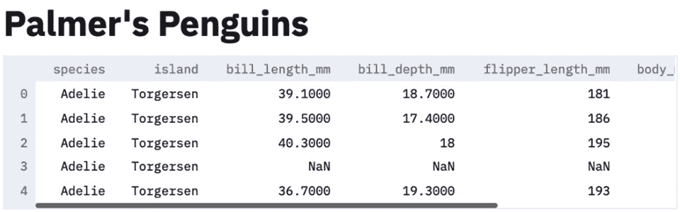
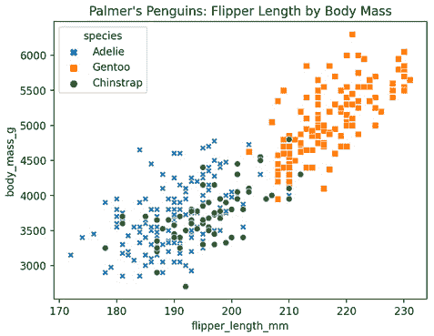
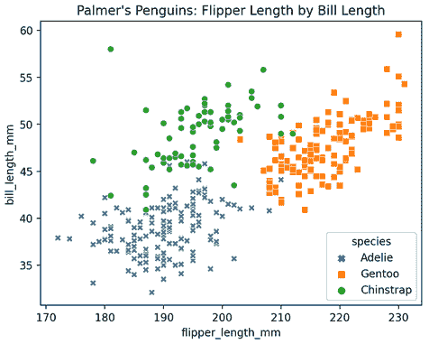
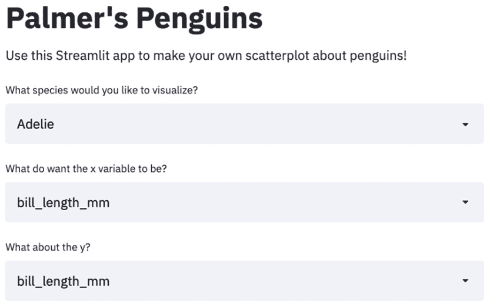
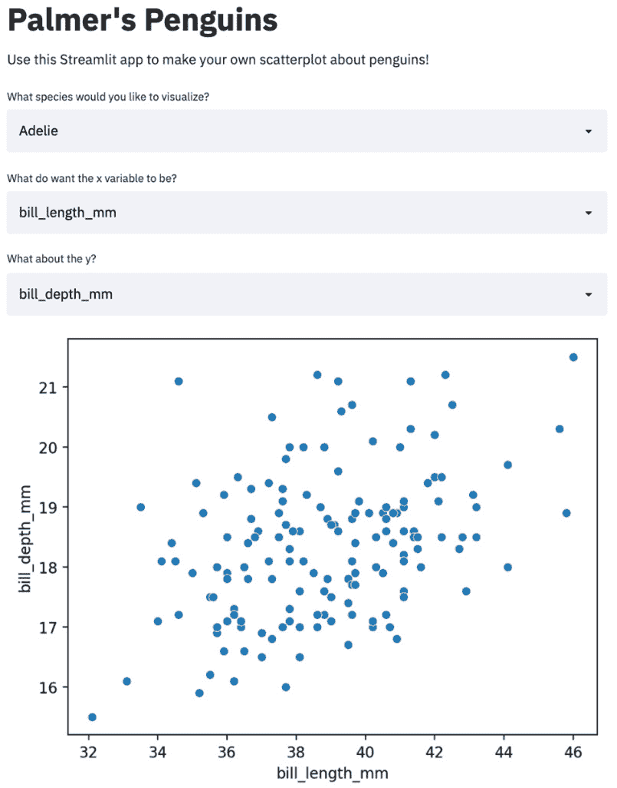
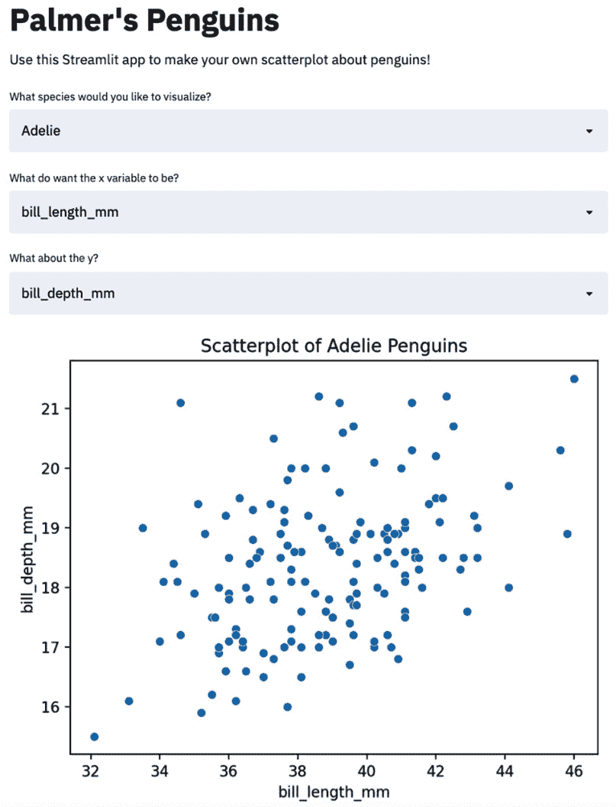
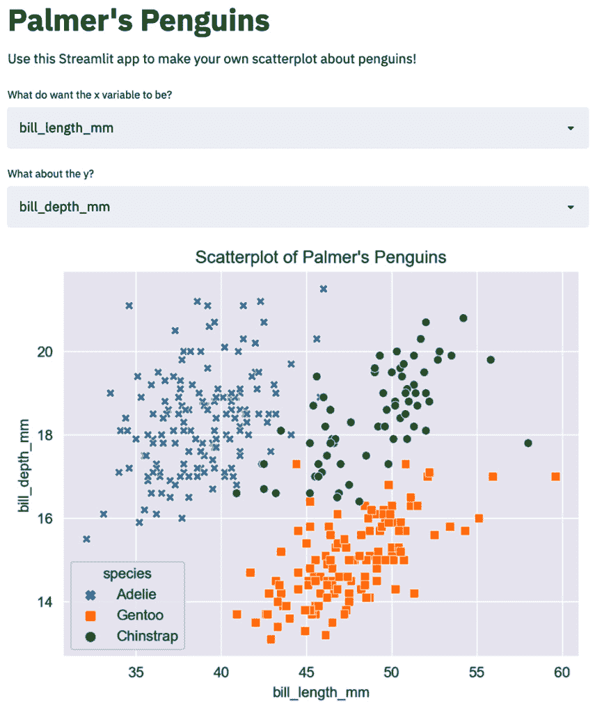
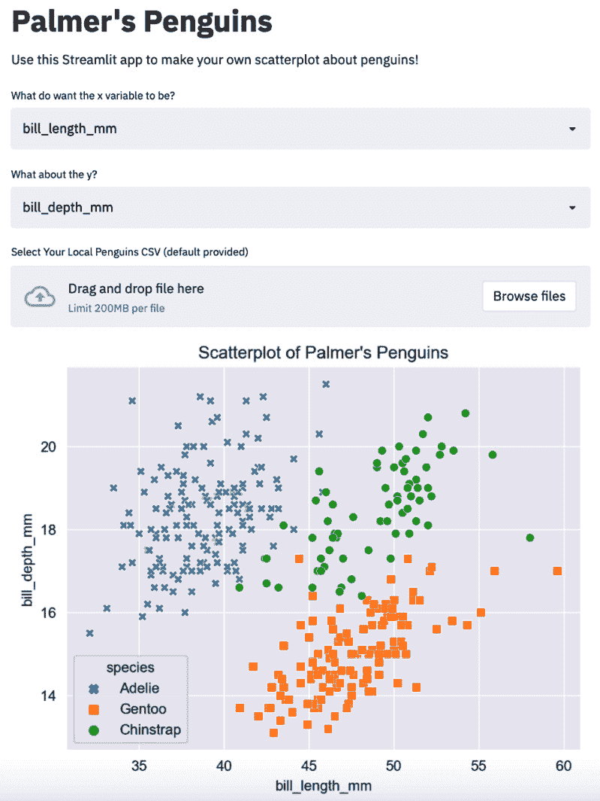
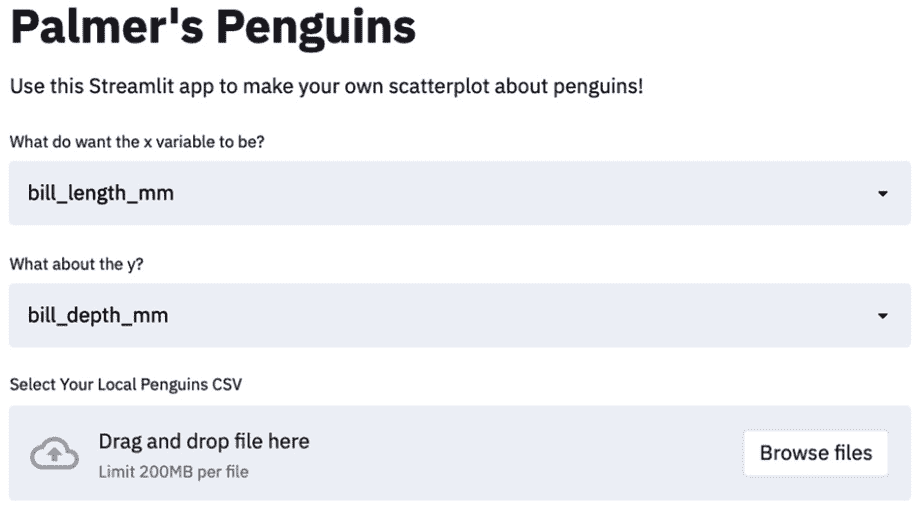

# 第二章：*第二章*：上传、下载和操作数据

到目前为止，本书中的 Streamlit 应用程序一直使用的是模拟数据。这对于掌握一些 Streamlit 基础知识非常有用，但大多数数据科学工作并非在模拟数据上进行，而是基于数据科学家已经拥有的实际数据集，或者用户提供的数据集。

本章将重点讲解 Streamlit 应用中的数据世界，涵盖使用 Streamlit 将数据集变为活跃的所有必要知识。我们将讨论数据操作、使用用户导入的数据、流程控制、调试 Streamlit 应用以及通过缓存加速数据应用等内容，所有这些内容都将通过一个名为 Palmer's Penguins 的数据集进行演示。

具体来说，我们将涵盖以下主题：

+   设置——Palmer's Penguins

+   调试 Streamlit 应用程序

+   在 Streamlit 中进行数据操作

# 技术要求

本章中，我们需要下载 Palmer's Penguins 数据集，可以通过以下链接找到：[`github.com/tylerjrichards/streamlit_apps/blob/main/penguin_app/penguins.csv`](https://github.com/tylerjrichards/streamlit_apps/blob/main/penguin_app/penguins.csv)。本章的设置和数据集的解释将在以下部分详细说明。

# 设置——Palmer's Penguins

本章中，我们将使用一个关于北极企鹅的数据集，该数据集来自 Kristen Gorman 博士的研究工作（[`www.uaf.edu/cfos/people/faculty/detail/kristen-gorman.php`](https://www.uaf.edu/cfos/people/faculty/detail/kristen-gorman.php)）以及南极洲 Palmer 站 LTER 项目（[`pal.lternet.edu/`](https://pal.lternet.edu/)）。

数据集致谢

来自 Palmer LTER 数据仓库的数据由极地项目办公室（NSF Grants OPP-9011927, OPP-9632763, OPP-0217282）支持。

该数据集是著名的鸢尾花数据集的常见替代品，包含 344 只个体企鹅的数据，涉及 3 个物种。数据可以在本书的 GitHub 仓库中找到（[`github.com/tylerjrichards/streamlit_apps`](https://github.com/tylerjrichards/streamlit_apps)），位于`penguin_app`文件夹下，文件名为`penguins.csv`。

如我们之前所讨论的，Streamlit 应用程序是从我们的 Python 脚本中运行的。这将基准目录设置为 Python 文件所在的位置，也就是我们的 Streamlit 应用程序所在的位置，这意味着我们可以访问放在应用程序目录中的任何其他文件。

首先，让我们在现有的`streamlit_apps`文件夹中创建一个新的文件夹，用于存放我们的应用程序，代码块如下：

```py
mkdir penguin_app
cd penguin_app
touch penguins.py
```

下载数据后，将生成的 CSV 文件（示例中的文件名为`penguins.csv`）放入`penguin_app`文件夹中。现在，我们的文件夹中应该有`penguins.py`文件和`penguins.csv`文件。在第一次操作时，我们只需要使用之前学过的`st.write()`函数打印出数据框的前五行，代码如下：

```py
import streamlit as st
import pandas as pd
st.title("Palmer's Penguins")
#import our data
penguins_df = pd.read_csv('penguins.csv')
 st.write(penguins_df.head())
```

上面的代码在我们终端运行 `streamlit run penguins.py` 时，会生成以下 Streamlit 应用：



图 2.1 – 前五只企鹅

现在我们对数据有了初步的了解，我们将进一步探索数据集，然后开始添加内容到我们的应用程序中。

## 探索 Palmer's Penguins

在开始处理这个数据集之前，我们应该先做一些可视化，以便更好地理解数据。正如我们之前看到的，数据中有许多列，从喙长到鳍长，再到企鹅所在的岛屿，甚至是企鹅的物种。对于第一个可视化，我们可以看到三种物种的鳍长与体重之间的关系：



图 2.2 – 鳍和体重

如我们所见，Gentoo 物种的鳍长和体重都较高，并且似乎所有物种的鳍长都与体重相关。接下来，让我们看看喙长与鳍长之间的关系：



图 2.3 – 鳍和喙

从这张图表中，我们可以看到 Chinstrap 物种似乎有比 Adelie 物种更长的喙。我们还可以绘制更多变量组合的散点图，但我们能否创建一个数据探索 Streamlit 应用来为我们完成这项工作？

这个小应用的最终目标是让用户指定一种企鹅物种，并选择两个其他变量来用于绘制散点图。我们将从学习如何获取这些输入开始，然后创建动态可视化。

我们之前学到的最后一个用户输入是数字输入函数，但在这里不会派上用场。Streamlit 有一个选择框函数（`st.selectbox()`），可以让我们让用户从多个选项中选择一个（在我们的例子中是三个选项），该函数返回用户选择的内容。我们将使用这个函数获取散点图所需的三个输入：

```py
import streamlit as st
import pandas as pd
import matplotlib.pyplot as plt
import seaborn as sns
st.title("Palmer's Penguins")
st.markdown('Use this Streamlit app to make your own scatterplot about penguins!')
 selected_species = st.selectbox('What species would you like to visualize?',
     ['Adelie', 'Gentoo', 'Chinstrap'])
 selected_x_var = st.selectbox('What do want the x variable to be?',
     ['bill_length_mm', 'bill_depth_mm', 'flipper_length_mm', 'body_mass_g'])
 selected_y_var = st.selectbox('What about the y?',
     ['bill_length_mm', 'bill_depth_mm', 'flipper_length_mm', 'body_mass_g'])
```

这段代码从三个新的选择框中创建了三个新变量，用户可以在我们的 Streamlit 应用中输入这些变量。以下截图显示了上面代码所生成的 Streamlit 应用：



图 2.4 – 企鹅的用户输入

现在我们已经有了 `selected_species` 变量，我们可以筛选 DataFrame，并使用选定的 `x` 和 `y` 变量快速绘制散点图，如下一个代码块所示：

```py
Import streamlit as st
import pandas as pd
import matplotlib.pyplot as plt
import seaborn as sns
st.title("Palmer's Penguins")
st.markdown('Use this Streamlit app to make your own scatterplot about penguins!')
 selected_species = st.selectbox('What species would you like to visualize?',
     ['Adelie', 'Gentoo', 'Chinstrap'])
 selected_x_var = st.selectbox('What do want the x variable to be?',
     ['bill_length_mm', 'bill_depth_mm', 'flipper_length_mm', 'body_mass_g'])
 selected_y_var = st.selectbox('What about the y?',
     ['bill_depth_mm', 'bill_length_mm', 'flipper_length_mm', 'body_mass_g'])

penguins_df = pd.read_csv('penguins.csv')
 penguins_df = penguins_df[penguins_df['species'] == selected_species]

fig, ax = plt.subplots()
ax = sns.scatterplot(x = penguins_df[selected_x_var],
     y = penguins_df[selected_y_var])
 plt.xlabel(selected_x_var)
 plt.ylabel(selected_y_var)
 st.pyplot(fig)
```

上述代码在前一个例子的基础上进行扩展，通过加载我们的 DataFrame、按物种筛选数据，然后使用上一章相同的方法绘制图表，最终将生成一个与之前相同的应用，但附加了散点图，如下图所示：



图 2.5 – 第一张企鹅散点图

尝试操作这个应用程序，确保所有的输入和输出都正常工作。还要注意，我们使用了输入变量来设置 *x* 轴和 *y* 轴的标签，这意味着当我们做出任何新选择时，它们会自动更新。我们的图表没有明确显示正在绘制的物种，因此让我们练习制作动态文本。以下代码使用 Python 本地的 `format()` 函数，为我们 Streamlit 应用的图表标题添加动态文本：

```py
import streamlit as st
import pandas as pd
import matplotlib.pyplot as plt
import seaborn as sns
st.title("Palmer's Penguins")
st.markdown('Use this Streamlit app to make your own scatterplot about penguins!')
 selected_species = st.selectbox('What species would you like to visualize?',
     ['Adelie', 'Gentoo', 'Chinstrap'])
 selected_x_var = st.selectbox('What do want the x variable to be?',
     ['bill_length_mm', 'bill_depth_mm', 'flipper_length_mm', 'body_mass_g'])
 selected_y_var = st.selectbox('What about the y?',
     ['bill_depth_mm', 'bill_length_mm', 'flipper_length_mm', 'body_mass_g'])

penguins_df = pd.read_csv('penguins.csv')
 penguins_df = penguins_df[penguins_df['species'] == selected_species]

fig, ax = plt.subplots()
ax = sns.scatterplot(x = penguins_df[selected_x_var],
     y = penguins_df[selected_y_var])
 plt.xlabel(selected_x_var)
 plt.ylabel(selected_y_var)
 plt.title('Scatterplot of {} Penguins'.format(selected_species))
 st.pyplot(fig)
```

上面的代码将物种添加到了我们的散点图中，产生了如下的 Streamlit 应用：



图 2.6 – 动态图表标题

这看起来很棒！我们还可以像本书前面的介绍图表一样，按物种的颜色和形状绘制图表。以下代码实现了这一点，并使用 Seaborn 的深色网格主题，以便更好地突出显示在 Streamlit 的白色背景上：

```py
import streamlit as st 
import pandas as pd 
import matplotlib.pyplot as plt 
import seaborn as sns 

st.title("Palmer's Penguins") 
st.markdown('Use this Streamlit app to make your own scatterplot about penguins!')  
selected_x_var = st.selectbox('What do want the x variable to be?', 
  ['bill_length_mm', 'bill_depth_mm', 'flipper_length_mm', 'body_mass_g']) 
selected_y_var = st.selectbox('What about the y?', 
  ['bill_depth_mm', 'bill_length_mm', 'flipper_length_mm', 'body_mass_g']) 

penguins_df = pd.read_csv('penguins.csv') 

sns.set_style('darkgrid')
markers = {"Adelie": "X", "Gentoo": "s", "Chinstrap":'o'}
fig, ax = plt.subplots() 
ax = sns.scatterplot(data = penguins_df, x = selected_x_var, 
  y = selected_y_var, hue = 'species', markers = markers,
  style = 'species') 
plt.xlabel(selected_x_var) 
plt.ylabel(selected_y_var) 
plt.title("Scatterplot of Palmer's Penguins") 
st.pyplot(fig)
*** Note: The code above is not in the correct format, please fix **
```

以下截图展示了我们新改进的 Palmer's Penguins 应用，它允许我们选择 *x* 和 *y* 轴，并为我们绘制一个散点图，不同的物种显示为不同的颜色和形状：



图 2.7 – 带形状的截图

注意

你可能正在通过一张黑白截图查看这个应用程序，只有形状的差异会被显示。

这个应用的最后一步是允许用户上传他们自己的数据。如果我们希望研究团队在任何时候都能上传数据到这个应用，并查看图形化的结果呢？或者如果有三个研究小组，每个小组都有自己独特的数据和不同的列名，而他们想使用我们创建的方法呢？我们将一步一步地解决这个问题。首先，我们如何接受用户的数据？

Streamlit 提供了一个叫做 `file_uploader()` 的函数，允许应用的用户上传最大 200 MB 的数据（默认值）。它的工作方式和我们之前使用过的其他交互式组件一样，有一个例外。我们交互式组件中的默认值通常是列表中的第一个值，但在用户没有与应用互动之前，默认上传的文件值是 `None`，这显然是没有意义的！

这开始涵盖 Streamlit 开发中的一个非常重要的概念——流程控制。流程控制可以理解为仔细思考应用程序的所有步骤，因为如果我们不明确指定某些事项，Streamlit 会尝试一次性运行整个应用程序。例如，想要等待用户上传文件后再尝试创建图表或操作 DataFrame 时，就需要特别注意。

## Streamlit 中的流程控制

正如我们之前所讨论的，对于数据上传的默认问题，有两种解决方案。我们可以提供一个默认文件，直到用户与应用程序进行交互，或者我们可以暂停应用程序，直到上传文件。我们从第一个选项开始。以下代码在`if`语句中使用了`st.file_uploader()`函数。如果用户上传文件，应用程序使用该文件；如果没有上传文件，则使用我们之前使用的默认文件：

```py
import streamlit as st
import pandas as pd
import matplotlib.pyplot as plt
import seaborn as sns
st.title("Palmer's Penguins")
st.markdown('Use this Streamlit app to make your own scatterplot about penguins!')

penguin_file = st.file_uploader('Select Your Local Penguins CSV (default provided)')
 if penguin_file is not None:
     penguins_df = pd.read_csv(penguin_file)
 else:
     penguins_df= pd.read_csv('penguins.csv')

selected_x_var = st.selectbox('What do want the x variable to be?',
     ['bill_length_mm', 'bill_depth_mm', 'flipper_length_mm', 'body_mass_g'])
 selected_y_var = st.selectbox('What about the y?',
     ['bill_depth_mm', 'bill_length_mm', 'flipper_length_mm', 'body_mass_g'])

fig, ax = plt.subplots()
ax = sns.scatterplot(x = penguins_df[selected_x_var],
     y = penguins_df[selected_y_var], hue = penguins_df['species'])
 plt.xlabel(selected_x_var) plt.ylabel(selected_y_var)
 plt.title("Scatterplot of Palmer's Penguins")
st.pyplot(fig)
```

当我们在终端中运行前面的代码时，我们可以看到我们的三个用户输入（*x*轴，*y*轴和数据集），即使我们尚未上传文件，也会显示图形。以下截图展示了这个应用程序：



图 2.8 – 文件输入

这种方法的明显优势在于该应用程序始终显示结果，但这些结果可能对用户没有帮助！对于更大的应用程序来说，这也是一个次优解，因为无论是否使用，应用程序内存储的任何数据都会拖慢应用程序的速度。稍后，在*第七章*，“*探索 Streamlit 组件*”中，我们将讨论所有的部署选项，包括一个名为 Streamlit Sharing 的内置部署选项。

我们的第二个选项是完全停止应用程序，除非用户上传了文件。对于这个选项，我们将使用一个新的 Streamlit 函数，名为`stop()`，该函数（如预期的那样）在被调用时停止应用程序的流程。使用这个函数是调试应用程序的最佳实践，它可以鼓励用户做出一些改变或描述发生的错误。虽然对于我们来说并非必须，但这对于未来的应用程序来说是一个很有用的知识。以下代码使用`if-else`语句，并在`else`语句中使用`st.stop()`来防止在`st.file_uploader()`未使用时，整个应用程序运行：

```py
import streamlit as st
import pandas as pd
import matplotlib.pyplot as plt
import seaborn as sns
st.title("Palmer's Penguins")
st.markdown('Use this Streamlit app to make your own scatterplot about penguins!')

selected_x_var = st.selectbox('What do want the x variable to be?',
     ['bill_length_mm', 'bill_depth_mm', 'flipper_length_mm', 'body_mass_g'])
 selected_y_var = st.selectbox('What about the y?',
     ['bill_depth_mm', 'bill_length_mm', 'flipper_length_mm', 'body_mass_g'])
penguin_file = st.file_uploader('Select Your Local Penguins CSV')
 if penguin_file is not None:
     penguins_df = pd.read_csv(penguin_file)
 else:
     st.stop()
sns.set_style('darkgrid')
markers = {"Adelie": "X", "Gentoo": "s", "Chinstrap":'o'}
fig, ax = plt.subplots() 
ax = sns.scatterplot(data = penguins_df, x = selected_x_var, 
  y = selected_y_var, hue = 'species', markers = markers,
  style = 'species') 
plt.xlabel(selected_x_var) 
plt.ylabel(selected_y_var) 
plt.title("Scatterplot of Palmer's Penguins") 
st.pyplot(fig)
```

如以下截图所示，直到我们上传自己的数据，我们将无法看到散点图，并且应用程序会停止。Streamlit 应用程序会等待，直到用户上传文件才会完全运行，而不是抛出错误：



图 2.9 – Streamlit 停止

在我们继续进行数据处理并创建更复杂的 Streamlit 应用程序之前，我们应该讨论一些调试 Streamlit 应用程序的最佳实践。

# 调试 Streamlit 应用程序

我们大致有两种 Streamlit 开发的选择。

+   在 Streamlit 中开发并使用`st.write()`作为调试工具。

+   在 Jupyter 中进行探索，然后复制到 Streamlit。

## 在 Streamlit 中开发

在第一个选项中，我们直接在 Streamlit 中编写代码，进行实验并准确探索我们的应用程序将如何运行。如果我们有较少的探索工作和更多的实现工作，基本上我们已经采用了这个选项，这样非常有效。

优点：

+   所见即所得

+   无需维护 IPython 和 Python 版本的相同应用程序

+   更适合学习如何编写生产级代码

缺点：

+   较慢的反馈循环（必须运行整个应用才能得到反馈）

+   可能是一个不太熟悉的开发环境

## 在 Jupyter 中进行探索然后复制到 Streamlit

另一种选择是利用极受欢迎的 Jupyter 数据科学产品，先编写并测试 Streamlit 应用的代码，然后再将其放入必要的脚本中并正确格式化。这对于探索将会在 Streamlit 应用中使用的新方法非常有用，但也存在严重的缺点。

优点：

+   闪电般的快速反馈循环使得实验变得更加容易。

+   用户可能更熟悉 Jupyter。

+   不需要运行完整应用就能得到结果。

缺点：

+   如果顺序不对，Jupyter 可能会提供误导性的结果。

+   从 Jupyter 中‘复制’代码是非常耗时的。

+   Jupyter 和 Streamlit 之间可能存在不同的 Python 版本。

我的建议是，在应用将要运行的环境中开发 Streamlit 应用（即 Python 文件）。对于调试，充分利用 `st.write()` 函数，它可以打印出几乎任何你可能需要的 Python 对象（字典、DataFrame、列表、字符串、数字、图形等等）。尽量只在最后的情况下使用其他开发环境，如 Jupyter！

# 在 Streamlit 中进行数据处理

Streamlit 以脚本的方式从头到尾运行我们的 Python 文件，因此我们可以像在 Jupyter notebook 或常规 Python 脚本中那样，使用强大的库如 pandas 来执行数据处理。正如我们之前所讨论的，我们可以像往常一样进行所有常规的数据处理。以我们 Palmer's Penguins 应用为例，如果我们希望用户能够根据性别筛选企鹅呢？以下代码通过 pandas 筛选我们的 DataFrame：

```py
import streamlit as st
import pandas as pd
import matplotlib.pyplot as plt
import seaborn as sns
st.title("Palmer's Penguins")
st.markdown('Use this Streamlit app to make your own scatterplot about penguins!')

penguin_file = st.file_uploader(
    'Select Your Local Penguins CSV (default provided)')
 if penguin_file is not None:
    penguins_df = pd.read_csv(penguin_file)
 else:
    penguins_df = pd.read_csv('penguins.csv')

selected_x_var = st.selectbox('What do want the x variable to be?',
                              ['bill_length_mm', 'bill_depth_mm', 'flipper_length_mm', 'body_mass_g'])
 selected_y_var = st.selectbox('What about the y?',
                              ['bill_depth_mm', 'bill_length_mm', 'flipper_length_mm', 'body_mass_g'])
 selected_gender = st.selectbox('What gender do you want to filter for?',
                               ['all penguins', 'male penguins', 'female penguins'])
 if selected_gender == 'male penguins':
    penguins_df = penguins_df[penguins_df['sex'] == 'male']
 elif selected_gender == 'female penguins':
    penguins_df = penguins_df[penguins_df['sex'] == 'female']
 else:
    pass
fig, ax = plt.subplots()
ax = sns.scatterplot(x=penguins_df[selected_x_var],
                     y=penguins_df[selected_y_var], hue=penguins_df['species'])
 plt.xlabel(selected_x_var)
 plt.ylabel(selected_y_var)
 plt.title("Scatterplot of Palmer's Penguins: {}".format(selected_gender))
 st.pyplot(fig)
```

这里有几点需要注意。首先，我们添加了另一个 `selectbox` 插件，提供了男性、女性和全部选项。我们本可以通过请求文本输入来实现这一点，但对于数据处理，我们希望尽量限制用户的操作。我们还确保动态更改了标题，这是为了清晰起见，建议这样做，因为我们希望通过图表直接向用户展示数据已经根据他们的输入进行了筛选。

## 缓存介绍

随着我们创建更多计算密集型的 Streamlit 应用并开始使用和上传更大的数据集，我们应开始关注这些应用的运行时，并尽可能提高效率。提高 Streamlit 应用效率最简单的方法是通过缓存，即将某些结果存储在内存中，以便在可能的情况下，应用不会重复执行相同的工作。

应用程序缓存的一个很好的类比是人类的短期记忆，我们会将一些可能有用的信息保存在身边。当某个信息在我们的短期记忆中时，我们不需要费力思考就能访问它。同样，当我们在 Streamlit 中缓存某个信息时，我们就像是在打赌，我们会频繁使用该信息。

Streamlit 缓存的具体工作原理是通过将函数的结果存储在应用程序中，如果该函数在应用程序中被另一个用户（或我们重新运行应用程序时）使用相同的参数调用，Streamlit 并不会重新执行该函数，而是从内存中加载该函数的结果。

让我们证明这一方法有效！首先，我们将为 Penguins 应用程序的数据上传部分创建一个函数，然后使用 time 库故意让这个函数的运行时间比平常长得多，看看是否能够通过使用 `st.cache()` 来加速应用程序。

如下代码所示，我们首先创建了一个新的函数 `load_file()`，该函数等待 3 秒钟，然后加载所需的文件。通常我们不会故意让应用程序变慢，但我们想知道缓存是否有效：

```py
import streamlit as st
import pandas as pd
import matplotlib.pyplot as plt
import seaborn as sns
import time
st.title("Palmer's Penguins")
st.markdown('Use this Streamlit app to make your own scatterplot about penguins!')

penguin_file = st.file_uploader(
    'Select Your Local Penguins CSV (default provided)')

def load_file(penguin_file):
    time.sleep(3)
    if penguin_file is not None:
        df = pd.read_csv(penguin_file)
    else:
        df = pd.read_csv('penguins.csv')
    return(df)
 penguins_df = load_file(penguin_file)

selected_x_var = st.selectbox('What do want the x variable to be?',
                              ['bill_length_mm', 'bill_depth_mm', 'flipper_length_mm', 'body_mass_g'])
 selected_y_var = st.selectbox('What about the y?',
                              ['bill_depth_mm', 'bill_length_mm', 'flipper_length_mm', 'body_mass_g'])
 selected_gender = st.selectbox('What gender do you want to filter for?',
                               ['all penguins', 'male penguins', 'female penguins'])
 if selected_gender == 'male penguins':
    penguins_df = penguins_df[penguins_df['sex'] == 'male']
 elif selected_gender == 'female penguins':
    penguins_df = penguins_df[penguins_df['sex'] == 'female']
 else:
    pass
fig, ax = plt.subplots()
ax = sns.scatterplot(x=penguins_df[selected_x_var],
                     y=penguins_df[selected_y_var], hue=penguins_df['species'])
 plt.xlabel(selected_x_var)
 plt.ylabel(selected_y_var)
 plt.title("Scatterplot of Palmer's Penguins: {}".format(selected_gender))
 st.pyplot(fig)
```

现在，让我们运行这个应用程序，然后选择右上角的汉堡菜单图标，按下重新运行按钮（我们也可以直接按 *R* 键来重新运行）。

我们注意到，每次重新运行应用程序时，至少需要 3 秒钟。现在，让我们在 `load_file` 函数上方添加缓存装饰器，然后再次运行我们的应用程序：

```py
import streamlit as st
import pandas as pd
import matplotlib.pyplot as plt
mport seaborn as sns
import time
st.title("Palmer's Penguins")
st.markdown('Use this Streamlit app to make your own scatterplot about penguins!')

penguin_file = st.file_uploader(
    'Select Your Local Penguins CSV (default provided)')
 @st.cache()
def load_file(penguin_file):
    time.sleep(3)
    if penguin_file is not None:
        df = pd.read_csv(penguin_file)
    else:
        df = pd.read_csv('penguins.csv')
    return(df)
 penguins_df = load_file(penguin_file)

selected_x_var = st.selectbox('What do want the x variable to be?',
                              ['bill_length_mm', 'bill_depth_mm', 'flipper_length_mm', 'body_mass_g'])
 selected_y_var = st.selectbox('What about the y?',
                              ['bill_depth_mm', 'bill_length_mm', 'flipper_length_mm', 'body_mass_g'])
 selected_gender = st.selectbox('What gender do you want to filter for?',
                               ['all penguins', 'male penguins', 'female penguins'])
 if selected_gender == 'male penguins':
    penguins_df = penguins_df[penguins_df['sex'] == 'male']
 elif selected_gender == 'female penguins':
    penguins_df = penguins_df[penguins_df['sex'] == 'female']
 else:
    pass
fig, ax = plt.subplots()
ax = sns.scatterplot(x=penguins_df[selected_x_var],
                     y=penguins_df[selected_y_var], hue=penguins_df['species'])
 plt.xlabel(selected_x_var)
 plt.ylabel(selected_y_var)
 plt.title("Scatterplot of Palmer's Penguins: {}".format(selected_gender))
 st.pyplot(fig)
```

当我们多次运行应用程序时，会注意到它明显变快了！当我们重新运行应用程序时，会发生两件事。首先，Streamlit 会检查缓存，确认是否曾经使用相同的输入运行过该函数，并从内存中返回 Penguins 数据；其次，它不会再次运行 `load_file` 函数，这意味着我们从未运行过 `time.sleep(3)` 命令，也没有花时间将数据加载到 Streamlit 中。我们将更详细地探讨这个缓存功能，但这个方法将为我们带来大部分的效率提升。

# 总结

本章充满了基础构件，这些构件将在本书的剩余部分中广泛使用，你也将用它们来开发自己的 Streamlit 应用程序。

在数据部分，我们介绍了如何将自己的 DataFrame 导入 Streamlit，如何接受以数据文件形式的用户输入，这使我们不再只能模拟数据。在其他技能方面，我们学习了如何使用缓存让数据应用程序运行得更快，如何控制 Streamlit 应用程序的流程，以及如何使用 `st.write()` 调试 Streamlit 应用程序。本章到此为止。接下来，我们将进入数据可视化部分！
