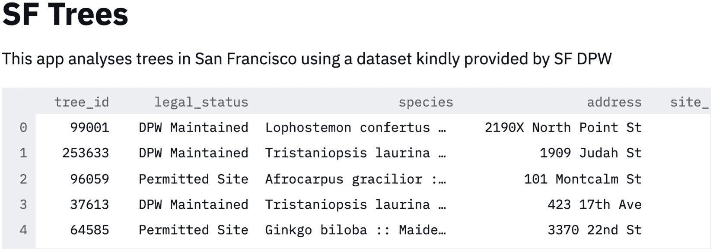
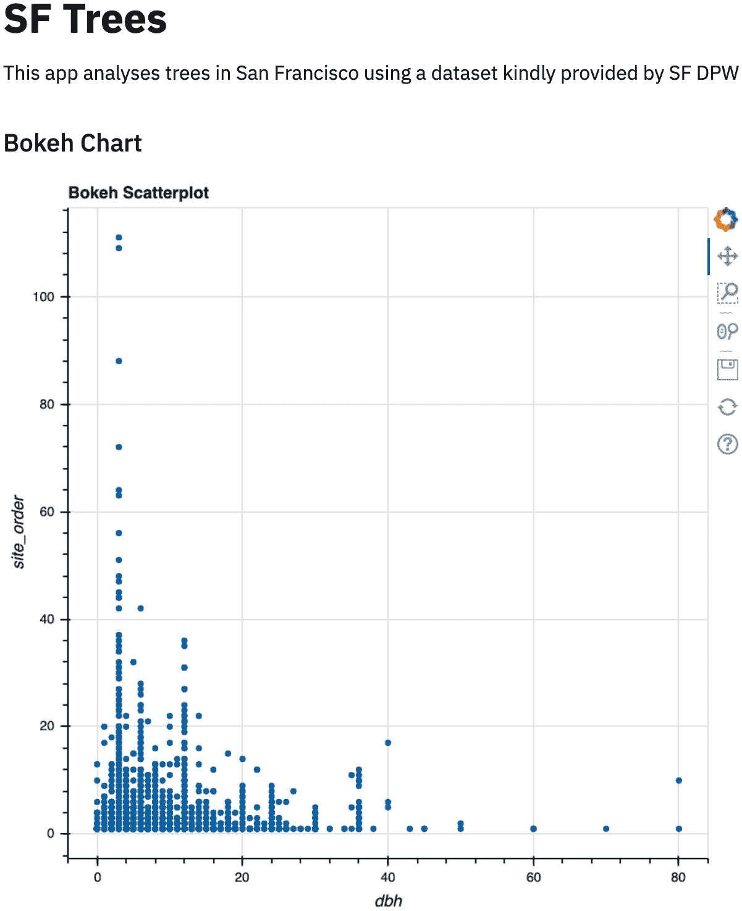
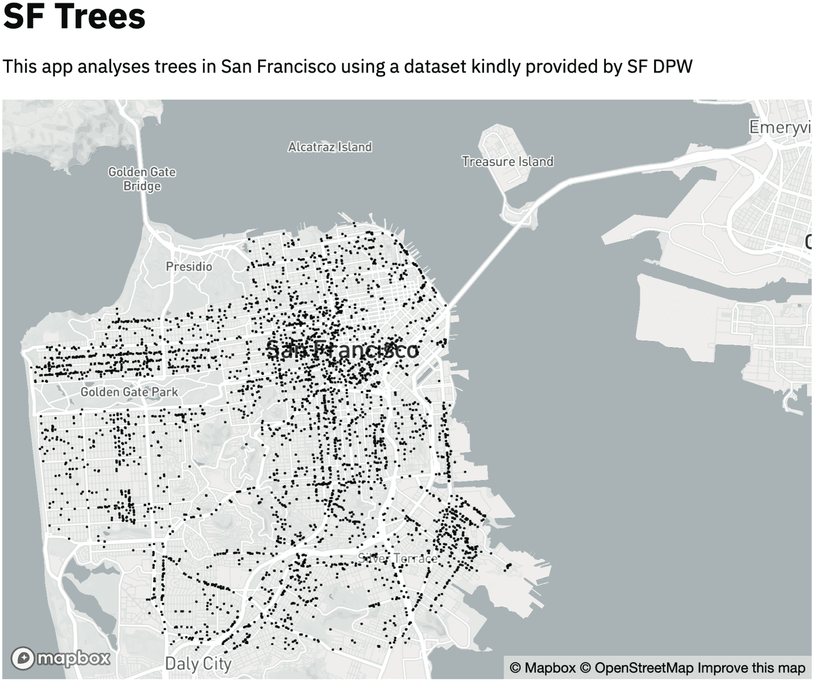

# 第三章：*第三章*：数据可视化

可视化是现代数据科学家的基本技能。它通常是用来理解统计模型（例如，通过 AUC 图表）、关键变量的分布（通过直方图）或重要商业指标的核心视角。

在过去的两章中，我们在示例中使用了最流行的 Python 图表库（**Matplotlib**和**Seaborn**）。本章将重点扩展这些能力，涵盖多种 Python 图表库，并加入一些 Streamlit 的原生图表功能。

到本章结束时，你应该能够熟练使用 Streamlit 的原生图表功能，同时也能使用 Streamlit 的可视化功能，将通过主要 Python 可视化库生成的图表嵌入到自己的 Streamlit 应用中。

本章将涵盖以下主题：

+   旧金山树木——一个新数据集

+   Streamlit 内建的图表功能

+   Streamlit 内建的可视化选项

+   将 Python 可视化库导入到 Streamlit 中。在本节中，我们将介绍以下库：

    (a) **Plotly**（用于交互式可视化）

    (b) **Seaborn+Matplotlib**（用于经典的统计可视化）

    (c) **Bokeh**（用于网页浏览器中的交互式可视化）

    (d) **Altair**（用于声明式交互式可视化）

    (e) **PyDeck**（用于交互式基于地图的可视化）

# 技术要求

本章将使用一个新数据集，可以在[`github.com/tylerjrichards/streamlit_apps/blob/main/trees_app/trees.csv`](https://github.com/tylerjrichards/streamlit_apps/blob/main/trees_app/trees.csv)找到。关于该数据集的进一步说明请参见下节内容。

# 旧金山树木——一个新数据集

在本章中，我们将处理各种各样的图表，因此需要一个包含更多信息的新数据集，特别是日期和位置。于是，我们引入了*SF Trees*。旧金山公共事务局拥有一个数据集（由 R 社区的优秀人员清理，他们运营 Tidy Tuesday，这是一个每周发布有趣数据可视化的活动），该数据集包含了旧金山城市中所有种植和维护的树木。这个数据集被巧妙地命名为*EveryTreeSF – 城市森林地图*，并且每天都会更新。我已随机选择了 10,000 棵树，并提供了完整信息，将该数据存放在主 GitHub 仓库的`trees`文件夹中（我承认，我的聪明程度不及旧金山 DPW 的数据工程师）。GitHub 仓库可以在[`github.com/tylerjrichards/streamlit_apps`](https://github.com/tylerjrichards/streamlit_apps)找到。如果你想下载完整数据集，可以点击此链接：[`data.sfgov.org/City-Infrastructure/Street-Tree-List/tkzw-k3nq`](https://data.sfgov.org/City-Infrastructure/Street-Tree-List/tkzw-k3nq)。

在我们整个书籍过程中使用的主要 `streamlit_apps` 文件夹中，首先创建一个新文件夹，创建一个新的 Python 文件，然后将我们的数据下载到该文件夹中，就像我们在 *第二章*《上传、下载与处理数据》中所做的一样，只不过这次添加了一些新数据！你可以在终端中运行以下代码来完成设置：

```py
mkdir trees_app
cd trees_app
touch trees.py
curl https://raw.githubusercontent.com/tylerjrichards/streamlit_apps/main/trees_app/trees.csv > trees.csv
```

在这里我想提到，如果这不奏效，或者你使用的操作系统没有这些命令（例如 Windows），你总是可以直接访问 GitHub 仓库下载 CSV 文件，如前面提到的仓库链接：[`github.com/tylerjrichards/streamlit_apps`](https://github.com/tylerjrichards/streamlit_apps)。

现在我们已经完成了设置，接下来的步骤是打开我们最喜欢的编辑器中的 `trees.py` 文件，开始构建我们的 Streamlit 应用。

注释

我们将在后续章节的开头继续按照这些步骤进行，因此将来我们不会再次详细介绍这些内容。

我们先通过以下代码给我们的应用命名，并打印出一些示例行：

```py
import streamlit as st
import pandas as pd
st.title('SF Trees')
 st.write('This app analyses trees in San Francisco using'
         ' a dataset kindly provided by SF DPW')
 trees_df = pd.read_csv('trees.csv')
 st.write(trees_df.head())
```

然后我们可以在终端中运行以下命令，并在浏览器中查看生成的 Streamlit 应用：

```py
streamlit run trees.py
```

请注意，这不是查看数据集前几行的最简单或最好的方法，但我们之所以这样做，完全是因为我们已经知道我们将使用这些数据构建一个 Streamlit 应用。一般的工作流通常是在 Streamlit 之外进行数据探索（通过 Jupyter 笔记本、SQL 查询，或者作为数据科学家或分析师你更喜欢的工作流）。也就是说，让我们继续查看数据集，并查看在浏览器中新 Streamlit 应用中执行上述代码的输出：



图 3.1 – 树木的前几行

这个数据集包含了关于旧金山树木的大量信息，从它们的直径（`dbh`）到经纬度、物种、地址，甚至是它们的种植日期。在我们开始绘制图表之前，先来了解一下我们面前的可视化选项。

# Streamlit 可视化用例

一些 Streamlit 用户是经验丰富的 Python 开发者，拥有在自己选择的可视化库中经过充分测试的工作流。对于这些用户，最佳的前进路径就是我们迄今为止采取的方式，即在我们选择的库（如 Seaborn、Matplotlib、Bokeh 等）中创建图表，然后使用合适的 Streamlit 函数将其写入应用中。

其他 Streamlit 用户可能在 Python 图形绘制方面经验较少，尤其是对于这些用户，Streamlit 提供了一些内置的功能。我们将从内置库开始，并逐步学习如何将最流行和最强大的库导入到我们的 Streamlit 应用中。

# Streamlit 内置的绘图功能

有三个内置的绘图函数——`st.line_chart()`、`st.bar_chart()` 和 `st.area_chart()`。它们的工作方式类似，通过试图找出你已经准备绘制的变量，然后分别将它们放入折线图、条形图或面积图。在我们的数据集中，有一个名为`dbh`的变量，它表示树木在胸部高度的直径。首先，我们可以按`dbh`对 DataFrame 进行分组，然后将其直接推送到折线图、条形图和面积图中。以下代码应该根据宽度对数据集进行分组，统计每个宽度的独特树木数量，并绘制每个的折线图、条形图和面积图：

```py
import streamlit as st
import pandas as pd
st.title('SF Trees')
 st.write('This app analyses trees in San Francisco using'
         ' a dataset kindly provided by SF DPW')
 trees_df = pd.read_csv('trees.csv')
 df_dbh_grouped = pd.DataFrame(trees_df.groupby(['dbh']).count()['tree_id'])
 df_dbh_grouped.columns = ['tree_count']
 st.line_chart(df_dbh_grouped)
 st.bar_chart(df_dbh_grouped)
 st.area_chart(df_dbh_grouped)
```

上述代码应当显示我们三个图表，依次排列，如以下截图所示：


图 3.2 – 线条、条形、面积和树木高度

我们只给了函数一个 DataFrame，它就能够正确猜测应该将哪些项目放在*x*轴和*y*轴上，并将这些数据绘制到我们的 Streamlit 图表中。每个图表默认都是交互式的！我们可以进行缩放，悬停鼠标在点/条/线上的位置查看每个数据点，甚至可以查看全屏。这些 Streamlit 函数实际上是调用了另一个流行的图形库**Altair**，我们将在本章后面更深入地学习如何使用它。

现在我们了解了内置函数的基础（很明显，“内置”的定义在这里比较宽松，因为 Streamlit 被设计为一个很棒且方便的 Web 应用库，而不是一个很棒的可视化库），接下来我们将通过这些函数看看它们如何处理更多的数据。首先，我们将在`df_dbh_grouped` DataFrame 中使用`numpy`库生成一个-500 到 500 之间的随机数新列，并使用之前的绘图代码。以下代码绘制了两张折线图，一张是在我们添加新列之前，另一张是在添加新列之后：

```py
import streamlit as st
import pandas as pd
import numpy as np
st.title('SF Trees')
 st.write('This app analyses trees in San Francisco using'
         ' a dataset kindly provided by SF DPW')
 trees_df = pd.read_csv('trees.csv')
 df_dbh_grouped = pd.DataFrame(trees_df.groupby(['dbh']).count()['tree_id'])
 df_dbh_grouped.columns = ['tree_count']
st.line_chart(df_dbh_grouped)
 df_dbh_grouped['new_col'] = np.random.randn(len(df_dbh_grouped)) * 500
st.line_chart(df_dbh_grouped)
```

这段代码应该生成一个应用，效果如以下截图所示：


图 3.3 – 两个连续的折线图

同样，这些函数将索引中的内容作为*x*轴，并将所有可以作为变量的列用作*y*轴。对于我们面对的非常简单的绘图问题（如示例中所示），这些内置函数非常有用。然而，相比于专门用于可视化的库，这些可视化函数的灵活性较差，调试这些函数的行为也可能会有些困难。这里的建议是，如果你的数据很容易被整理成一种格式，其中 DataFrame 的索引位于*x*轴，其他列绘制在*y*轴上，这些函数会表现得很好。对于更复杂的任务，我们应该使用其他绘图库。

还有一个我们应该在这里讨论的内置 Streamlit 图形函数，`st.map()`。就像前面的函数一样，它也是对另一个 Python 图形库的封装，这次是 `st.map()`，使用以下代码：

```py
import streamlit as st
import pandas as pd
import numpy as np
t.title('SF Trees')
 st.write('This app analyses trees in San Francisco using'
         ' a dataset kindly provided by SF DPW')
 trees_df = pd.read_csv('trees.csv')
 trees_df = trees_df.dropna(subset=['longitude', 'latitude'])
 trees_df = trees_df.sample(n = 1000)
 st.map(trees_df)
```

这完美地工作，开箱即用！我们得到了一张美丽的旧金山树木交互式地图，正如下面的截图所示：


图 3.4 – 默认的旧金山树木地图

和其他函数一样，除了可选的缩放参数外，我们在这里没有太多自定义选项，但这对于快速可视化来说效果非常好。

如我们所见，这些内置函数对于快速制作 Streamlit 应用非常有用，但我们也牺牲了自定义性以换取速度。实际上，我在制作 Streamlit 应用时很少使用这些函数，但在快速可视化 Streamlit 中已有的数据时，常常会使用它们。在生产环境中，更强大的库，如 **Matplotlib**、**Seaborn** 和 **PyDeck**，为我们提供了所需的灵活性和可定制性。本章接下来将介绍六种不同的流行 Python 可视化库。

# Streamlit 内置的可视化选项

本章剩余部分，我们将依次介绍 Streamlit 的其他可视化选项，分别是 **Plotly**、**Matplotlib**、**Seaborn**、**Bokeh**、**Altair** 和 **PyDeck**。

## Plotly

Plotly 是一个交互式可视化库，许多数据科学家用它来在 Jupyter 中、在本地浏览器中，甚至在 Plotly 团队创建的可视化和仪表盘平台 **Dash** 上托管这些图表，以供查看。这个库与 Streamlit 的意图非常相似，主要用于内部或外部的仪表盘（因此得名 Dash）。

Streamlit 允许我们通过 `st.plotly_chart()` 函数在 Streamlit 应用中调用 `plotly` 图表，这使得迁移任何 Plotly 或 Dash 仪表盘变得非常简单。我们将通过制作旧金山树木高度的直方图来进行测试，这基本上就是我们之前制作的相同图表。以下代码生成了我们的 Plotly 直方图：

```py
import streamlit as st
import pandas as pd
import plotly.express as px
st.title('SF Trees')
 st.write('This app analyses trees in San Francisco using'
         ' a dataset kindly provided by SF DPW')
 st.subheader('Plotly Chart')
 trees_df = pd.read_csv('trees.csv')

fig = px.histogram(trees_df['dbh'])
 st.plotly_chart(fig)
```

如我们所注意到的，Plotly 的所有原生交互功能在 Streamlit 中默认是可以使用的。用户可以滚动查看直方图条形图并获得每个条形的准确信息。Plotly 还有一些其他有用的内置功能会传递到 Streamlit，例如缩放、将图表下载为 `png` 文件，以及选择一组数据点/条形/线条。完整的功能可以在以下截图中查看：


图 3.5 – 第一个 Plotly 图表

现在我们已经对 Plotly 足够熟悉，可以继续学习其他流行的可视化库，**Matplotlib** 和 **Seaborn**。

## Matplotlib 和 Seaborn

本书前面，我们学习了如何在 Streamlit 中使用 Matplotlib 和 Seaborn 可视化库，因此这里我们只会简要讲解它们。树木数据集中有一列名为**date**，对应着树木栽种的日期。我们可以使用 datetime 库来计算每棵树的年龄（以天为单位），然后分别使用 Seaborn 和 Matplotlib 绘制该年龄的直方图。以下代码创建了一个名为 age 的新列，表示树木栽种日期与今天之间的天数差，然后使用 Seaborn 和 Matplotlib 分别绘制该年龄的直方图：

```py
import streamlit as st
import pandas as pd
import matplotlib.pyplot as plt
import seaborn as sns
import datetime as dt
st.title('SF Trees')
st.write('This app analyses trees in San Francisco using'
         ' a dataset kindly provided by SF DPW')
trees_df = pd.read_csv('trees.csv')
trees_df['age'] = (pd.to_datetime('today') -
                   pd.to_datetime(trees_df['date'])).dt.days
st.subheader('Seaborn Chart')
fig_sb, ax_sb = plt.subplots()
ax_sb = sns.histplot(trees_df['age'])
plt.xlabel('Age (Days)')
st.pyplot(fig_sb)
st.subheader('Matploblib Chart')
fig_mpl, ax_mpl = plt.subplots()
ax_mpl = plt.hist(trees_df['age'])
plt.xlabel('Age (Days)')
st.pyplot(fig_mpl)
```

在前面的代码中，我们为每个图形定义了独特的子图，为每个图形创建了 Seaborn 或 Matplotlib 图形，然后使用`st.pyplot()`函数将每个图形按顺序插入到我们的 Streamlit 应用中。前面的代码应该会展示一个类似于以下屏幕截图的应用（我说“类似”是因为，根据你运行代码的时间，树木的年龄会有所不同，因为`pd.to_datetime`（'today'）将返回当前日期）：


图 3.6 – Seaborn 和 Matplotlib 直方图

无论你使用 Seaborn 还是 Matplotlib，你都会以相同的方式使用`st.pyplot()`函数。既然我们已经对这些库更加熟悉，现在我们应该了解另一个交互式可视化库——**Bokeh**。

## Bokeh

Bokeh 是另一个基于 Web 的交互式可视化库，且其上有构建仪表盘产品。它是 Plotly 的直接竞争对手，但更加专注于 Python 生态系统，而 Plotly 则是建立在`Plotly.js`之上的。无论如何，Bokeh 是一个极受欢迎的 Python 可视化包，Python 用户可能会非常熟悉使用它。

我们可以使用与 Plotly 相同的格式调用 Bokeh 图形。首先，我们创建 Bokeh 图形，然后使用`st.bokeh_chart()`函数将应用写入 Streamlit。在 Bokeh 中，我们必须先实例化一个 Bokeh 图形对象，然后在绘制之前更改该图形的一些属性。这里的重要教训是，如果我们在调用`st.bokeh_chart()`函数后更改 Bokeh 图形对象的某个属性，我们将不会改变 Streamlit 应用中显示的图形。例如，当我们运行以下代码时，我们将看不到新的*x*轴标题：

```py
import streamlit as st
import pandas as pd
from bokeh.plotting import figure
st.title('SF Trees')
 st.write('This app analyses trees in San Francisco using'
         ' a dataset kindly provided by SF DPW')
 st.subheader('Bokeh Chart')
 trees_df = pd.read_csv('trees.csv')

scatterplot = figure(title = 'Bokeh Scatterplot')
 scatterplot.scatter(trees_df['dbh'], trees_df['site_order'])
 st.bokeh_chart(scatterplot)
 scatterplot.xaxis.axis_label = "dbh"
```

相反，我们需要交换最后两行代码的顺序，这样它们就会在应用中显示出来。我们还将添加一个*y*轴以确保图形的完整性。

```py
import streamlit as st
import pandas as pd
from bokeh.plotting import figure
st.title('SF Trees')
 st.write('This app analyses trees in San Francisco using'
         ' a dataset kindly provided by SF DPW')
 st.subheader('Bokeh Chart')
 trees_df = pd.read_csv('trees.csv')

scatterplot = figure(title = 'Bokeh Scatterplot')
 scatterplot.scatter(trees_df['dbh'], trees_df['site_order'])
 scatterplot.yaxis.axis_label = "site_order"
scatterplot.xaxis.axis_label = "dbh"
st.bokeh_chart(scatterplot)
```

前面的代码将创建一个 Bokeh 图表，展示`dbh`与`site_order`的关系，如下所示的屏幕截图：



图 3.7 – Bokeh 散点图

接下来，我们将介绍下一个可视化库——Altair！

## Altair

我们已经使用过 `st.line_chart()` 或 `st.map()`，但现在我们将探索如何直接使用 Altair。Altair 是一个声明式可视化库，简单来说，意味着我们不需要显式地编写图表中的每个特性（如命名 *x* 轴），我们只需传递列之间的关系，Altair 会自动处理剩下的部分。

我们已经用这个数据集制作了不少图表，但为什么不探索一下新的列——看护人列呢？这一数据定义了谁负责照看这些树（公共还是私有），如果是公共的，那么是哪个政府机构负责维护。真是激动人心！

以下代码将我们的 DataFrame 按照看护人进行分组，然后在 Altair 中使用这个分组后的 DataFrame：

```py
import streamlit as st
import pandas as pd
import altair as alt
st.title('SF Trees')
 st.write('This app analyses trees in San Francisco using'
         ' a dataset kindly provided by SF DPW')
 trees_df = pd.read_csv('trees.csv')
 df_caretaker = trees_df.groupby(['caretaker']).count()['tree_id'].reset_index()
df_caretaker.columns = ['caretaker', 'tree_count']
 fig = alt.Chart(df_caretaker).mark_bar().encode(x = 'caretaker', y = 'tree_count')
 st.altair_chart(fig)
```

Altair 还允许我们直接在 `mark_bar()` 的 `y` 值中汇总数据，因此我们可以通过以下代码来简化操作：

```py
import streamlit as st
import pandas as pd
import altair as alt
st.title('SF Trees')
 st.write('This app analyses trees in San Francisco using'
         ' a dataset kindly provided by SF DPW')
 trees_df = pd.read_csv('trees.csv')
 fig = alt.Chart(trees_df).mark_bar().encode(x = 'caretaker', y = 'count(*):Q')
 st.altair_chart(fig)
```

上述代码将创建一个 Streamlit 应用，展示 SF 中按照看护人分类的树木数量，如下图所示：


图 3.8 – Altair 条形图

对于传统的可视化库，这应该就是全部了，但 Streamlit 还允许我们使用更复杂的可视化库，如 `st.map()` 函数，并将在下一部分中深入探讨这个功能。

## PyDeck

PyDeck 是一个可视化库，可以将可视化作为图层绘制在 **Mapbox**（一家拥有真正出色免费套餐的地图公司）地图上。Streamlit 和 PyDeck 都提供了一个基础的功能集，在未注册 Mapbox 账户的情况下可以使用，但当我们获得 **Mapbox** 令牌后，这些功能将大大扩展，我们将在下一部分获取该令牌。

### 配置选项

为了设置你自己的 `config.toml`，我们可以在终端中的任何地方运行以下命令来查看当前设置：

```py
streamlit config show
```

Streamlit 提供了四种更改默认配置设置的方法，我将向你展示我推荐的选项和另一个选项，这两个选项应该能满足大多数使用场景。如果你觉得这些选项不足，Streamlit 文档（[`docs.streamlit.io/`](https://docs.streamlit.io/)）会详细介绍这四种方法。

第一个选项是通过直接编辑 `config.toml` 文件来设置全局配置选项。我们可以通过文本编辑器直接打开该文件进行编辑。以下命令将在 `sublime` 中打开该文件。对于其他文本编辑器（如 Vim 和 Atom），请将 `'sublime'` 替换为相应的命令，或直接从文本编辑器打开该文件：

```py
sublime ~/.streamlit/config.toml
```

如果失败了，这很可能意味着我们还没有生成文件。我们可以复制并粘贴 `~/.streamlit/config.toml` 的输出，或者可以在 Mac/Linux 上运行以下快捷方式：

```py
streamlit config show > ~/.streamlit/config.toml
```

现在，我们已经在`sublime`中打开了文件，可以直接查看并编辑任何选项。这个选项非常适合配置选项，比如`8501 serverPort`。改变全局选项来进行项目特定的更改是没有意义的，这也引出了第二个选项。

第二个选项是创建并编辑一个项目特定的`config.toml`文件。我们之前的配置设置了默认的配置选项，而这个选项则是针对每个 Streamlit 应用程序的特定设置。此时，我们在`streamlit_apps`文件夹中的每个单独项目文件夹就派上用场了！

从大致来说，我们将执行以下操作：

1.  检查我们的当前工作目录。

1.  为我们的项目创建一个配置文件。

1.  在 PyDeck 中使用配置文件。

我们的第一步是确保当前工作目录是`trees_app`文件夹，可以通过在终端中运行`pwd`命令来查看当前工作目录，结果应该以`trees_app`结尾（例如，我的路径是`Users/tyler/Documents/streamlit_apps/trees_app`）。

现在，我们需要为我们的项目制作一个配置文件。首先，我们将创建一个名为`.streamlit`的文件夹，然后我们将重复之前在 Mac/Linux 上使用的快捷方式：

```py
mkdir .streamlit
streamlit config show > .streamlit/config.toml 
```

然后，我们可以像之前一样编辑我们的配置选项，但这将仅适用于我们从该目录运行 Streamlit 时的 Streamlit 应用程序。

现在，最后，我们可以回到`37.77, -122.4`。我们可以使用以下代码来实现，代码首先定义初始状态（我们希望从哪里开始查看地图），然后使用该初始状态调用`st.pydeck_chart()`：

```py
import streamlit as st
import pandas as pd
import pydeck as pdk 
st.title('SF Trees')
st.write('This app analyses trees in San Francisco using'
         ' a dataset kindly provided by SF DPW')
trees_df = pd.read_csv('trees.csv')
sf_initial_view = pdk.ViewState(
     latitude=37.77,
     longitude=-122.4
     )
st.pydeck_chart(pdk.Deck(
     initial_view_state=sf_initial_view
     ))
```

这段代码将生成一张旧金山的地图，我们可以用它来叠加数据点。我们在这里注意到几件事。首先，黑色的默认地图可能不太容易看到，其次，我们需要花时间缩放到旧金山以获得所需的视图。我们可以通过使用 Streamlit 文档中建议的默认值来修复这两个问题（[`docs.streamlit.io/`](https://docs.streamlit.io/)），如下代码所示：

```py
import streamlit as st
import pandas as pd
import pydeck as pdk 
st.title('SF Trees')
 st.write('This app analyses trees in San Francisco using'
         ' a dataset kindly provided by SF DPW')
 trees_df = pd.read_csv('trees.csv')

sf_initial_view = pdk.ViewState(
     latitude=37.77,
     longitude=-122.4,
     zoom=9
     )

st.pydeck_chart(pdk.Deck(
     map_style='mapbox://styles/mapbox/light-v9',
     initial_view_state=sf_initial_view,
     ))
```

上面的代码应该会创建一张如下截图所示的地图：


图 3.9 – PyDeck 映射：旧金山基础地图

这正是我们需要的！我们可以看到整个`11`，所以可以更好地看到每个数据点：

```py
import streamlit as st
import pandas as pd
import pydeck as pdk 
st.title('SF Trees')
 st.write('This app analyses trees in San Francisco using'
         ' a dataset kindly provided by SF DPW')
 trees_df = pd.read_csv('trees.csv')
 trees_df.dropna(how='any', inplace=True)

sf_initial_view = pdk.ViewState(
     latitude=37.77,
     longitude=-122.4,
     zoom=11
     )

sp_layer = pdk.Layer(
     'ScatterplotLayer',
     data = trees_df,
     get_position = ['longitude', 'latitude'],
     get_radius=30) 
st.pydeck_chart(pdk.Deck(
     map_style='mapbox://styles/mapbox/light-v9',
     initial_view_state=sf_initial_view,
     layers = [sp_layer]
     ))
```

缩放和半径参数的最佳值取决于您的可视化偏好。尝试一些选项，看看哪种效果最好。上面的代码将生成以下地图：



图 3.10 – 映射旧金山的树木

与之前的地图一样，这个地图默认是互动的，因此我们可以缩放到旧金山的不同区域，查看树木密度最高的地方。对于地图的下一个变化，我们将添加另一个图层，这一次是六边形图层，将根据旧金山的树木密度进行着色。我们可以使用与上面相同的代码，但将散点图层更改为六边形图层。我们还将包括一个选项，可以让六边形在垂直方向上突出显示，虽然这不是必须的，但绝对是一种有趣的可视化风格。

我们最后的改动是更改我们查看地图时的视角或角度。默认的视角，如我们所见，几乎是直接向下查看城市，但如果我们要在地图上查看垂直的六边形，这个角度将无法使用。以下代码实现了这些变化：

```py
import streamlit as st
import pandas as pd
import pydeck as pdk 
st.title('SF Trees')
 st.write('This app analyses trees in San Francisco using'
         ' a dataset kindly provided by SF DPW')
 trees_df = pd.read_csv('trees.csv')
 trees_df.dropna(how='any', inplace=True)

sf_initial_view = pdk.ViewState(
     latitude=37.77,
     longitude=-122.4,
     zoom=11,
     pitch=30
     )

hx_layer = pdk.Layer(
     'HexagonLayer',
     data = trees_df,
     get_position = ['longitude', 'latitude'],
     radius=100,
     extruded=True)

st.pydeck_chart(pdk.Deck(
     map_style='mapbox://styles/mapbox/light-v9',
     initial_view_state=sf_initial_view,
     layers = [hx_layer]
     ))
```

与之前的地图一样，最佳的半径和视角参数将根据你的可视化效果而有所不同。试着更改这些参数几次，看看是否能掌握其诀窍！上面的代码将生成以下应用程序：


图 3.11 – 最终的旧金山树木地图

从这张截图中，我们可以看到**PyDeck**在旧金山的树木密度较高的地方绘制了较暗的圆圈。从中我们可以观察到很多有趣的细节，比如数据集似乎缺少了位于城市西侧著名的金门公园中的树木，而且金门大桥周围的区域似乎也在数据集中几乎没有树木。

# 总结

在这一章之后，你应该能够牢固掌握如何利用令人惊叹的开源 Python 可视化库来在 Streamlit 中创建 Web 应用程序。

首先，我们学习了如何使用默认的可视化选项，如`st.line_chart()`和`st.map()`，然后我们深入了解了像 Plotly 这样的交互式库，像 PyDeck 这样的地图绘图库，以及介于两者之间的一切。

在下一章中，我们将讲解如何在 Streamlit 中使用机器学习。
